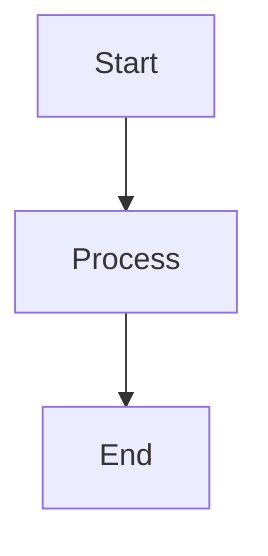

# Article Writing Rules

## 1. Directory Structure

- First-level directories must use **English names only**
- Sort directories **alphabetically in descending order** (Z → A), except `glossary` which stays at top (`00-glossary`)
- Example order: `sre/`, `security/`, `rust/`, `quant/`, `python/`, ... `ai/`, `algorithm/`, `00-glossary/`

## 2. Diagrams

- **No ASCII art diagrams** - convert all to Mermaid
- Mermaid diagrams should be **vertically oriented** to avoid horizontal scrollbars
- Use `graph TB` (top-to-bottom) instead of `graph TB` (left-to-right) when possible

## 3. Article Series

- Article filenames must have **sequential numeric prefixes**: `01-`, `02-`, `03-`, etc.
- Content should progress from **beginner to advanced** topics
- Requirements:
  - **Accurate**: Technically correct information
  - **In-depth**: Thorough coverage of topics
  - **Comprehensive**: Complete and detailed explanations

## 4. Code Blocks

- Minimize code length unless it's **core/essential code**
- Avoid horizontal scrollbars in code blocks
- Break long lines when necessary
- Focus on explaining concepts rather than showing full implementations

## 5. Formatting

- No horizontal scrollbars in any content (code, diagrams, tables)
- Mermaid diagrams: prefer vertical layout
- Tables: keep columns narrow, use abbreviations if needed
- Code: wrap long lines, use comments to explain

## 6. Self-Check Routine

After completing any task, perform these checks:

1. **Link Verification**
   - All internal links (`/articles/...`) are correct
   - "Previous" and "Next" article links are accurate
   - Related article links exist and are valid

2. **Content Consistency**
   - Article numbering is sequential (no gaps)
   - Cross-references between articles are correct
   - Navigation flow is logical

3. **Global Perspective**
   - New articles are properly integrated into the knowledge base
   - Category organization is correct
   - No orphaned articles (missing from navigation)

## 7. Quick Reference

| Rule | Requirement |
|------|-------------|
| Directory names | English only |
| Directory order | Descending alphabetical (except 00-glossary) |
| Diagrams | Mermaid only, vertical layout |
| Article prefixes | Sequential numbers (01-, 02-, ...) |
| Content depth | Beginner → Advanced progression |
| Code blocks | Minimal, core code only |
| Scrollbars | None (horizontal) |
| Self-check | Always verify links globally |
