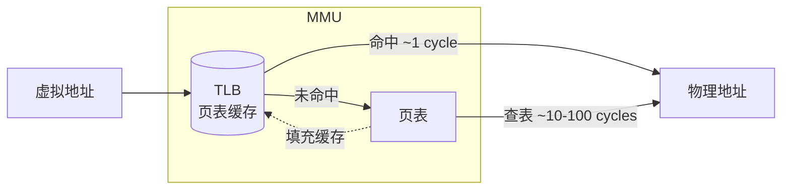

+++
title = "01.Linux & System Concepts"
description = "Linux系统核心概念速查：进程、内存、IO模型、并发同步原语（锁、信号量、条件变量、无锁编程）、调度，以及内核/调试工具/存储/AI基础设施概念索引"
date = 2026-01-26
draft = false
[taxonomies]
tags = ["Glossary", "Linux", "Kernel", "System", "Reference"]
+++

# Linux & System Concepts

本索引收录Linux系统编程的核心概念，每个概念包含定义、重要性、关键要点和代码示例。

---

## 一、进程与内存

### 1.1 Context Switch (上下文切换)

**定义**：操作系统保存当前进程/线程的CPU状态（寄存器、程序计数器、栈指针等），并恢复另一个进程/线程状态的过程。

**为什么重要**：
- 上下文切换有显著开销（1-10μs）
- HFT系统需要最小化上下文切换
- 多线程程序性能的关键因素

**开销构成**：
1. **直接开销**：
   - 保存/恢复寄存器：~100ns
   - 切换页表（进程切换）：~500ns
   - 刷新TLB：~1-5μs
   
2. **间接开销**：
   - Cache污染：切换后L1/L2 cache几乎全部失效
   - Cache预热：可能增加10-100μs

**减少上下文切换的方法**：
```bash
# 1. CPU隔离
echo 2-7 > /sys/devices/system/cpu/isolated

# 2. 进程绑定CPU
taskset -c 2 ./trading_app

# 3. 使用实时调度
chrt -f 99 ./trading_app
```

```cpp
// 代码层面：减少锁竞争
// 坏：频繁切换
std::mutex mtx;
void worker() {
    while (running) {
        std::lock_guard lock(mtx);  // 可能阻塞导致切换
        process();
    }
}

// 好：无锁设计
std::atomic<bool> flag{false};
void worker() {
    while (running) {
        if (flag.load(std::memory_order_acquire)) {
            process();
        }
        // 忙等待，不切换
    }
}
```

**详细文章**：[HFT-CPU亲和性与NUMA优化](/articles/ccpp/cpp-26-HFT-CPU亲和性与NUMA优化/)

---

### 1.2 Virtual Memory (虚拟内存)

**定义**：操作系统提供的抽象，让每个进程拥有独立的地址空间。虚拟地址通过页表映射到物理地址。

**关键组件**：



- **TLB**：MMU 内部的高速缓存，存储最近使用的虚拟→物理地址映射
- **命中**：~1 CPU cycle，直接返回物理地址
- **未命中**：需查页表（~10-100 cycles），结果填入 TLB

**页面大小**：
| 类型 | 大小 | TLB覆盖(1024条目) | 适用场景 |
|------|------|-------------------|----------|
| 普通页 | 4KB | 4MB | 一般应用 |
| 大页 | 2MB | 2GB | 数据库、HFT |
| 巨页 | 1GB | 1TB | 大内存应用 |

**Page Fault（缺页中断）**：
- **Minor fault**：页在内存但未映射，~1μs
- **Major fault**：需从磁盘读取，~1-10ms

**HFT最佳实践**：
```cpp
#include <sys/mman.h>

// 1. 锁定内存，防止换出
mlockall(MCL_CURRENT | MCL_FUTURE);

// 2. 预分配并触及所有页面
char* buffer = (char*)mmap(NULL, size, 
    PROT_READ | PROT_WRITE,
    MAP_PRIVATE | MAP_ANONYMOUS | MAP_HUGETLB,
    -1, 0);

// 3. 预热：触及每一页
for (size_t i = 0; i < size; i += 4096) {
    buffer[i] = 0;
}
```

**详细文章**：[内存映射与高效IO(HFT)](/articles/linux/linux-11-内存映射与高效IO/)

---

### 1.3 TLB (Translation Lookaside Buffer)

**定义**：CPU中的页表缓存，存储最近使用的虚拟地址到物理地址的映射，加速地址转换。

**为什么重要**：
- 完整的页表查找需要4次内存访问（4级页表）
- TLB命中只需1个时钟周期
- TLB miss开销：10-100ns

**TLB容量限制**：
```
假设TLB容量1024条目：

4KB页面：最多覆盖 1024 × 4KB = 4MB
2MB大页：最多覆盖 1024 × 2MB = 2GB
1GB巨页：最多覆盖 1024 × 1GB = 1TB
```

**TLB失效场景**：
1. **上下文切换**：进程切换时TLB可能需要刷新
2. **页表修改**：mmap、munmap等操作
3. **容量耗尽**：访问的页面超过TLB容量

**优化策略**：
```bash
# 启用大页
echo 1024 > /proc/sys/vm/nr_hugepages

# 检查TLB miss
perf stat -e dTLB-load-misses,dTLB-loads ./app
```

---

### 1.4 NUMA (Non-Uniform Memory Access)

**定义**：多处理器系统中，每个CPU有自己的本地内存，访问本地内存比远程内存快。

**延迟对比**：
```
本地内存访问：~70-100ns
远程内存访问：~150-300ns（2-3倍）
```

**NUMA拓扑示例**：
```
Node 0                    Node 1
┌──────────┐              ┌──────────┐
│ CPU 0-7  │              │ CPU 8-15 │
│          │←── QPI/UPI ──→│          │
│ Memory A │              │ Memory B │
└──────────┘              └──────────┘
```

**优化策略**：
```bash
# 查看NUMA拓扑
numactl --hardware

# 绑定进程到特定NUMA节点
numactl --cpunodebind=0 --membind=0 ./app

# 代码中分配本地内存
void* ptr = numa_alloc_onnode(size, node_id);
```

**详细文章**：[HFT-CPU亲和性与NUMA优化](/articles/ccpp/cpp-26-HFT-CPU亲和性与NUMA优化/)

---

### 1.5 False Sharing (伪共享)

**定义**：当多个线程访问不同的变量，但这些变量位于同一个缓存行(Cache Line)时，会导致缓存行在CPU核心之间频繁失效和同步，严重影响性能。

**为什么是HFT的头号性能杀手之一**：
- 现代CPU缓存行大小为64字节
- 即使访问的是不同变量，只要在同一缓存行，修改就会导致其他核心缓存失效
- 在多核忙等待场景下，性能可能下降10-100倍

**问题演示**：
```cpp
// 坏：head和tail在同一缓存行
struct BadQueue {
    std::atomic<size_t> head;  // 消费者频繁修改
    std::atomic<size_t> tail;  // 生产者频繁修改
    // head和tail相邻，极可能在同一64字节缓存行
};

// 生产者修改tail → 消费者的head缓存失效
// 消费者修改head → 生产者的tail缓存失效
// 来回弹跳(ping-pong)，性能灾难
```

**解决方案**：缓存行填充（Cache Line Padding）
```cpp
// 好：强制分离到不同缓存行
struct GoodQueue {
    alignas(64) std::atomic<size_t> head;  // 独占一个缓存行
    alignas(64) std::atomic<size_t> tail;  // 独占另一个缓存行
    // 保证head和tail在不同的64字节缓存行
};

// 或者手动填充
struct ManualPadding {
    std::atomic<size_t> head;
    char padding[64 - sizeof(std::atomic<size_t>)];  // 填充到64字节
    std::atomic<size_t> tail;
};
```

**检测False Sharing**：
```bash
# 使用perf检测
perf c2c record ./your_program
perf c2c report

# 关注指标：
# - HITM (Hit Modified): 命中已修改的缓存行，表示有False Sharing
```

**HFT中常见False Sharing场景**：
1. **无锁队列**：head/tail分离
2. **统计计数器**：per-thread计数器独立缓存行
3. **状态标志**：不同线程的状态标志分开

```cpp
// HFT统计计数器正确实现
struct alignas(64) PaddedCounter {
    std::atomic<uint64_t> value{0};
    char padding[64 - sizeof(std::atomic<uint64_t>)];
};

class Statistics {
    std::array<PaddedCounter, 16> perThreadCounters;  // 每个线程独立
};
```

**详细文章**：[HFT缓存友好数据结构设计](/articles/ccpp/cpp-25-HFT缓存友好数据结构设计/)

---

### 1.6 File Descriptor (文件描述符)

**定义**：进程中用于标识打开文件/Socket/管道等资源的非负整数。是用户空间访问内核资源的句柄。

**文件描述符表**：
```
进程                          内核
┌───────────────┐            ┌──────────────────┐
│ fd 表         │            │ 系统打开文件表    │
│ 0 → stdin     │ ─────────→ │ 文件位置、状态    │
│ 1 → stdout    │            │ inode引用        │
│ 2 → stderr    │            └──────────────────┘
│ 3 → socket    │
│ 4 → file      │
└───────────────┘
```

**文件描述符限制**：
```bash
# 查看当前进程限制
ulimit -n
# 通常默认1024

# 查看系统限制
cat /proc/sys/fs/file-max

# 修改限制
ulimit -n 65535  # 临时
# 或修改 /etc/security/limits.conf
```

**HFT中的文件描述符管理**：
```cpp
// 1. 预打开所有连接，避免运行时open开销
void warmup() {
    for (auto& exchange : exchanges) {
        exchange.socket = socket(AF_INET, SOCK_STREAM, 0);
        connect(exchange.socket, ...);
    }
}

// 2. 使用SO_REUSEADDR快速重用
int reuse = 1;
setsockopt(sock, SOL_SOCKET, SO_REUSEADDR, &reuse, sizeof(reuse));

// 3. 避免fd泄漏
class ScopedFd {
    int fd_;
public:
    explicit ScopedFd(int fd) : fd_(fd) {}
    ~ScopedFd() { if (fd_ >= 0) close(fd_); }
    int get() const { return fd_; }
    int release() { int f = fd_; fd_ = -1; return f; }
};
```

---

## 二、IO模型

### 2.1 Zero-Copy (零拷贝)

**定义**：一种I/O优化技术，消除或减少数据在用户空间和内核空间之间的复制次数。

**传统I/O的问题**：
```
read():  磁盘 → DMA → 内核缓冲区 → CPU拷贝 → 用户缓冲区
write(): 用户缓冲区 → CPU拷贝 → Socket缓冲区 → DMA → 网卡

共4次拷贝，4次上下文切换，2次CPU拷贝
```

**零拷贝技术对比**：

| 技术 | 拷贝次数 | CPU拷贝 | 适用场景 |
|------|----------|---------|----------|
| read+write | 4 | 2 | 需处理数据 |
| mmap+write | 3 | 1 | 随机访问 |
| sendfile | 2 | 0-1 | 静态文件 |
| splice | 2 | 0 | 代理转发 |
| io_uring | 2 | 0 | 通用高性能 |

**sendfile零拷贝**：
```cpp
#include <sys/sendfile.h>

// 文件直接发送到socket，不经过用户空间
ssize_t sent = sendfile(socket_fd, file_fd, &offset, count);
```

**零拷贝的限制与陷阱**：
1. **不适合需要修改数据的场景**：零拷贝绑定了数据不可修改
2. **TLS/加密不兼容**：TLS需要在用户空间加密数据
3. **跨设备限制**：sendfile只支持某些fd组合
4. **大文件分块**：需要循环调用处理大文件

**详细文章**：[内存映射与高效IO(HFT)](/articles/linux/linux-11-内存映射与高效IO/)

---

### 2.2 mmap (内存映射)

**定义**：将文件或设备映射到进程的虚拟地址空间，使文件访问像访问内存一样简单。

**为什么HFT使用mmap**：
- 避免read/write系统调用
- 利用操作系统页缓存
- 适合随机访问模式

**mmap vs read/write**：
| 特性 | mmap | read/write |
|------|------|------------|
| 系统调用 | 一次（映射时） | 每次读写 |
| 数据拷贝 | 零拷贝(直接访问页缓存) | 需要拷贝 |
| 随机访问 | 高效 | 需要lseek |
| 小文件 | 开销较大 | 更合适 |
| 顺序读取 | 较差 | 预读优化好 |

**使用示例**：
```cpp
#include <sys/mman.h>
#include <fcntl.h>

// 映射文件
int fd = open("data.bin", O_RDONLY);
struct stat st;
fstat(fd, &st);

void* addr = mmap(nullptr, st.st_size, 
    PROT_READ, MAP_PRIVATE, fd, 0);

if (addr == MAP_FAILED) {
    perror("mmap failed");
    return;
}

// 直接访问数据，如同访问内存
auto* data = static_cast<const char*>(addr);
char c = data[1000];  // 无系统调用！

// 解除映射
munmap(addr, st.st_size);
close(fd);
```

**HFT最佳实践**：
```cpp
// 1. 使用MAP_POPULATE预加载页面
void* addr = mmap(nullptr, size,
    PROT_READ, MAP_PRIVATE | MAP_POPULATE, fd, 0);

// 2. 使用madvise提示访问模式
madvise(addr, size, MADV_SEQUENTIAL);  // 顺序访问
madvise(addr, size, MADV_RANDOM);      // 随机访问
madvise(addr, size, MADV_WILLNEED);    // 预加载

// 3. 锁定内存防止换出
mlock(addr, size);
```

---

### 2.3 O_DIRECT (直接IO)

**定义**：绕过操作系统页缓存，直接在用户缓冲区和磁盘之间传输数据。

**为什么使用O_DIRECT**：
- 数据库等应用有自己的缓存策略
- 避免页缓存的双重缓冲
- 更可预测的延迟（无页缓存eviction）

**O_DIRECT的限制**：
1. **对齐要求**：缓冲区地址、偏移量、大小必须是扇区大小（通常512或4096）的倍数
2. **无预读**：需要自己管理预读
3. **写入保证**：不保证持久化，仍需fsync

```cpp
// O_DIRECT使用
int fd = open("data.bin", O_RDWR | O_DIRECT);

// 必须使用对齐的内存
size_t alignment = 4096;
void* buf = nullptr;
posix_memalign(&buf, alignment, size);

// 读写的offset和size也必须对齐
pread(fd, buf, aligned_size, aligned_offset);
pwrite(fd, buf, aligned_size, aligned_offset);

free(buf);
close(fd);
```

**何时使用O_DIRECT**：
- ✅ 数据库（有自己的Buffer Pool）
- ✅ 日志系统（顺序写入，自己管理）
- ❌ 一般文件访问（页缓存更高效）
- ❌ 小IO（对齐开销大）

---

### 2.4 epoll

**定义**：Linux高性能I/O事件通知机制，可以高效地监控大量文件描述符。

**与select/poll对比**：

| 特性 | select | poll | epoll |
|------|--------|------|-------|
| 最大fd数 | 1024 | 无限制 | 无限制 |
| fd传递 | 每次全部 | 每次全部 | 只传一次 |
| 事件检查 | O(n) | O(n) | O(1) |
| 触发模式 | 水平 | 水平 | 水平/边缘 |

**边缘触发 vs 水平触发**：
- **水平触发(LT)**：只要满足条件就通知（默认）
- **边缘触发(ET)**：状态变化时才通知（更高效但需正确处理）

**使用示例**：
```cpp
int epfd = epoll_create1(0);

struct epoll_event ev;
ev.events = EPOLLIN | EPOLLET;  // 边缘触发
ev.data.fd = sock_fd;
epoll_ctl(epfd, EPOLL_CTL_ADD, sock_fd, &ev);

struct epoll_event events[MAX_EVENTS];
while (true) {
    int n = epoll_wait(epfd, events, MAX_EVENTS, -1);
    for (int i = 0; i < n; i++) {
        handle(events[i].data.fd);
    }
}
```

---

### 2.5 io_uring

**定义**：Linux 5.1+引入的高性能异步I/O接口，通过共享内存的环形缓冲区减少系统调用。

**架构**：
```
用户空间              内核空间
┌──────────┐         ┌──────────┐
│ 提交队列  │ ──────→ │  处理    │
│ (SQ)     │         │          │
└──────────┘         └──────────┘
                           │
┌──────────┐         ┌─────┴────┐
│ 完成队列  │ ←────── │  完成    │
│ (CQ)     │         │          │
└──────────┘         └──────────┘
```

**优势**：
1. **批量提交**：一次系统调用提交多个I/O
2. **真正异步**：完成后内核直接写入CQ
3. **零拷贝**：支持registered buffers
4. **轮询模式**：完全避免系统调用

```cpp
#include <liburing.h>

struct io_uring ring;
io_uring_queue_init(256, &ring, 0);

// 提交读操作
struct io_uring_sqe *sqe = io_uring_get_sqe(&ring);
io_uring_prep_read(sqe, fd, buf, size, 0);
io_uring_submit(&ring);

// 获取完成事件
struct io_uring_cqe *cqe;
io_uring_wait_cqe(&ring, &cqe);
// cqe->res 是读取的字节数
io_uring_cqe_seen(&ring, cqe);
```

**详细文章**：[io_uring详解(HFT)](/articles/networking/net-20-io_uring详解/)

---

## 三、时间与同步

### 3.1 System Call (系统调用)

**定义**：用户态程序请求内核服务的接口。从用户态切换到内核态，执行内核代码，再返回用户态。

**开销**：
- 最小系统调用（如getpid）：~100-200ns
- 典型系统调用：~500ns-1μs
- 复杂系统调用（如open）：~1-10μs

**减少系统调用**：
```cpp
// 坏：每次写一个字节
for (int i = 0; i < 1000; i++) {
    write(fd, &byte, 1);  // 1000次系统调用
}

// 好：批量写入
char buffer[1000];
// 填充buffer
write(fd, buffer, 1000);  // 1次系统调用

// 更好：使用vDSO避免内核切换
clock_gettime(CLOCK_MONOTONIC, &ts);  // 通过vDSO，无需进入内核
```

---

### 3.2 Clock Sources (时钟源)

**定义**：Linux内核提供的时间计数来源，不同时钟源有不同的精度和开销。

**常见时钟源**：

| 时钟源 | 精度 | 开销 | 说明 |
|--------|------|------|------|
| TSC | 纳秒 | ~10-20ns | CPU计数器，最快 |
| HPET | 纳秒 | ~500ns | 硬件时钟 |
| ACPI_PM | 微秒 | ~1μs | 传统时钟 |
| jiffies | 毫秒 | 极低 | 内核tick |

**查看和设置**：
```bash
# 查看可用时钟源
cat /sys/devices/system/clocksource/clocksource0/available_clocksource
# tsc hpet acpi_pm

# 查看当前时钟源
cat /sys/devices/system/clocksource/clocksource0/current_clocksource
# tsc

# 验证TSC稳定性
dmesg | grep -i tsc
# tsc: Detected 2400.000 MHz processor
# tsc: Detected 2400.002 MHz TSC
```

**详细文章**：[Linux时间子系统(HFT)](/articles/linux/linux-10-Linux时间子系统/)

---

### 3.3 Futex (Fast Userspace Mutex)

**定义**：Linux提供的快速用户空间互斥原语。在无竞争情况下完全在用户态完成，只有在需要阻塞时才进入内核。

**工作原理**：
```
无竞争时：
  用户态原子操作获取锁 → 成功 → 继续执行（无系统调用）

有竞争时：
  用户态原子操作 → 失败 → futex系统调用 → 内核阻塞等待
```

**pthread_mutex底层**：
```cpp
// pthread_mutex_lock的简化实现
int pthread_mutex_lock(pthread_mutex_t* m) {
    // 尝试用户态获取
    if (atomic_compare_exchange(&m->val, 0, 1)) {
        return 0;  // 成功，无系统调用
    }
    // 需要阻塞
    while (atomic_exchange(&m->val, 2) != 0) {
        futex(&m->val, FUTEX_WAIT, 2, ...);  // 进入内核等待
    }
    return 0;
}
```

---

## 四、并发与同步原语

本节系统介绍多线程/多进程编程中的核心概念，从基础到高级，构建完整的并发编程知识体系。

---

### 4.1 Shared Variable (共享变量)

**定义**：可被多个线程或进程同时访问的内存数据。共享变量是并发问题的根源。

**为什么重要**：
- 多线程程序中，共享变量的并发访问是绝大多数 bug 的来源
- 理解共享变量是理解所有同步原语的基础
- 正确识别共享变量是并发编程的第一步

**共享变量的来源**：

| 类型 | 示例 | 说明 |
|------|------|------|
| **全局变量** | `int counter;` | 所有线程可见 |
| **静态变量** | `static int count;` | 函数内共享 |
| **堆内存** | `new/malloc` 分配 | 指针传递给多个线程 |
| **共享内存** | `mmap/shmget` | 跨进程共享 |

**问题演示**：

```cpp
// 共享变量
int counter = 0;

void increment() {
    for (int i = 0; i < 1000000; i++) {
        counter++;  // 非原子操作！
    }
}

int main() {
    std::thread t1(increment);
    std::thread t2(increment);
    t1.join();
    t2.join();
    
    // 期望：2000000
    // 实际：可能是 1500000、1800000 等任意值
    std::cout << counter << std::endl;
}
```

**counter++ 的真相**：

```
看似一条语句，实际是三步操作：
1. 读取 counter 到寄存器 (LOAD)
2. 寄存器 +1 (ADD)
3. 写回 counter (STORE)

两个线程交错执行可能导致：
Thread1: LOAD counter (= 0)
Thread2: LOAD counter (= 0)
Thread1: ADD (寄存器 = 1)
Thread2: ADD (寄存器 = 1)
Thread1: STORE counter (= 1)
Thread2: STORE counter (= 1)  ← 丢失一次更新！
```

**解决方案**：
1. **原子操作**：`std::atomic<int> counter`
2. **互斥锁**：用 mutex 保护访问
3. **避免共享**：线程局部存储、消息传递

---

### 4.2 Critical Section (临界区)

**定义**：访问共享资源的代码区域。同一时刻只能有一个执行流在临界区内执行。

**为什么重要**：
- 临界区是需要保护的核心区域
- 同步原语的目的就是保护临界区
- 临界区的大小直接影响并发性能

**临界区结构**：

```
┌─────────────────────────────────────┐
│  Entry Section (进入区)             │ ← 尝试获取锁
├─────────────────────────────────────┤
│  Critical Section (临界区)          │ ← 访问共享资源（独占）
├─────────────────────────────────────┤
│  Exit Section (退出区)              │ ← 释放锁
├─────────────────────────────────────┤
│  Remainder Section (剩余区)         │ ← 其他代码
└─────────────────────────────────────┘
```

**代码示例**：

```cpp
std::mutex mtx;
int shared_counter = 0;

void safe_increment() {
    // Entry Section
    mtx.lock();
    
    // Critical Section - 临界区
    shared_counter++;
    
    // Exit Section
    mtx.unlock();
    
    // Remainder Section
    do_other_work();
}
```

**临界区的三个要求**：

| 要求 | 含义 | 违反后果 |
|------|------|----------|
| **互斥 (Mutual Exclusion)** | 同时只能一个线程在临界区 | 数据竞争 |
| **进展 (Progress)** | 无人使用时，等待者能进入 | 死锁 |
| **有限等待 (Bounded Waiting)** | 不能无限期等待 | 饥饿 |

**临界区设计原则**：

```cpp
// 坏：临界区太大，阻塞其他线程
mtx.lock();
data = fetch_from_network();  // 网络IO，可能耗时100ms
process(data);
result = compute(data);
mtx.unlock();

// 好：最小化临界区
data = fetch_from_network();  // 不需要锁
result = compute(data);       // 不需要锁

mtx.lock();
shared_result = result;       // 只保护必要的共享访问
mtx.unlock();
```

---

### 4.3 Race Condition & Data Race (竞态条件与数据竞争)

**竞态条件 (Race Condition)**：程序的输出取决于事件发生的相对时间顺序。

**数据竞争 (Data Race)**：两个线程同时访问同一内存位置，且至少一个是写操作，没有同步。

**区别**：

| 概念 | 定义 | 必然是 bug？ |
|------|------|-------------|
| **竞态条件** | 结果依赖时序 | 不一定（如抢票） |
| **数据竞争** | 无同步的并发读写 | 是，未定义行为 |

**数据竞争示例**：

```cpp
// 数据竞争 - 未定义行为！
int x = 0;

// Thread 1
x = 1;

// Thread 2
std::cout << x;  // 可能输出 0、1，或崩溃
```

**竞态条件示例（无数据竞争）**：

```cpp
// 使用原子变量，无数据竞争
std::atomic<int> balance{100};

// Thread 1: 取款
void withdraw() {
    if (balance >= 50) {     // 检查
        // ← 另一个线程可能在这里修改 balance
        balance -= 50;        // 操作
    }
}

// Thread 2: 同时取款
// 两个线程可能都通过检查，导致余额变负
// 这是竞态条件（TOCTOU）
```

**检测工具**：

```bash
# ThreadSanitizer (编译时启用)
g++ -fsanitize=thread -g program.cpp -o program
./program

# 输出：
# WARNING: ThreadSanitizer: data race
#   Write of size 4 at 0x... by thread T1:
#   Previous write of size 4 at 0x... by thread T2:
```

---

### 4.4 Atomic Operation (原子操作)

**定义**：不可分割的操作，要么完全执行，要么完全不执行。在执行过程中不会被其他线程打断。

**为什么重要**：
- 是无锁编程的基础
- 性能远高于互斥锁（纳秒级 vs 微秒级）
- 现代 CPU 硬件原生支持

**CPU 原子指令**：

| 指令 | 作用 | 典型延迟 |
|------|------|----------|
| **LOCK XADD** | 原子加法 | ~10-20ns |
| **LOCK CMPXCHG** | CAS操作 | ~10-20ns |
| **LOCK XCHG** | 原子交换 | ~10-20ns |
| **MFENCE** | 内存屏障 | ~20-40ns |

**C++ 原子操作**：

```cpp
#include <atomic>

std::atomic<int> counter{0};

// 原子自增
counter++;                    // 等价于 fetch_add(1)
counter.fetch_add(1);         // 返回旧值

// 原子读写
int val = counter.load();     // 原子读
counter.store(42);            // 原子写

// CAS 操作
int expected = 0;
bool success = counter.compare_exchange_strong(expected, 1);
// 如果 counter == expected，则设为 1，返回 true
// 否则 expected 被更新为 counter 当前值，返回 false
```

**原子操作 vs 锁的选择**：

| 场景 | 推荐 |
|------|------|
| 单个变量的简单操作 | 原子操作 |
| 多个变量需要一致性 | 互斥锁 |
| 复杂的数据结构修改 | 互斥锁 |
| 读多写少 | 原子操作 + 读写锁 |

---

### 4.5 Mutex (互斥锁)

**定义**：Mutual Exclusion（互斥）的缩写。保证同一时刻只有一个线程能持有锁。

**为什么是最常用的锁**：
- 概念简单：lock() / unlock()
- 适用面广：保护任意临界区
- 实现成熟：所有语言/平台都支持

**工作原理**：

```
Thread 1:                    Thread 2:
lock()   ← 获取成功          lock()   ← 阻塞等待
  临界区                       ...等待...
unlock() ← 释放               ...等待...
                             lock()   ← 被唤醒，获取成功
                               临界区
                             unlock()
```

**pthread_mutex 使用**：

```c
#include <pthread.h>

pthread_mutex_t mutex = PTHREAD_MUTEX_INITIALIZER;

void* worker(void* arg) {
    pthread_mutex_lock(&mutex);    // 阻塞获取
    // 临界区
    pthread_mutex_unlock(&mutex);  // 释放
    return NULL;
}

// 非阻塞尝试
if (pthread_mutex_trylock(&mutex) == 0) {
    // 获取成功
    pthread_mutex_unlock(&mutex);
} else {
    // 获取失败，锁被占用
}

// 带超时
struct timespec timeout;
clock_gettime(CLOCK_REALTIME, &timeout);
timeout.tv_sec += 1;  // 1秒超时
pthread_mutex_timedlock(&mutex, &timeout);
```

**C++ std::mutex**：

```cpp
#include <mutex>

std::mutex mtx;

void safe_function() {
    std::lock_guard<std::mutex> lock(mtx);  // RAII，自动释放
    // 临界区
}  // lock_guard 析构时自动 unlock

// 更灵活的 unique_lock
void flexible_function() {
    std::unique_lock<std::mutex> lock(mtx);
    // 临界区
    lock.unlock();  // 可以提前释放
    do_something();
    lock.lock();    // 重新获取
}
```

**互斥锁类型**：

| 类型 | 行为 | 用途 |
|------|------|------|
| **普通锁** | 同线程重复加锁导致死锁 | 默认，最快 |
| **检错锁** | 重复加锁返回错误 | 调试 |
| **递归锁** | 同线程可多次加锁 | 递归函数 |

**性能开销**：

```
无竞争的 mutex lock/unlock：~25-50ns
有竞争需要阻塞：~1-10μs（上下文切换开销）
```

---

### 4.6 RWLock (读写锁)

**定义**：允许多个读者同时访问，但写者独占。适用于读多写少的场景。

**规则**：

| 当前持有者 | 读请求 | 写请求 |
|------------|--------|--------|
| 无 | ✅ 允许 | ✅ 允许 |
| 读者（一个或多个） | ✅ 允许 | ❌ 阻塞 |
| 写者 | ❌ 阻塞 | ❌ 阻塞 |

**使用场景**：

```cpp
#include <shared_mutex>

std::shared_mutex rw_mutex;
std::map<std::string, int> cache;

// 读操作 - 共享锁
int read_cache(const std::string& key) {
    std::shared_lock<std::shared_mutex> lock(rw_mutex);
    return cache[key];  // 多个读者可同时执行
}

// 写操作 - 独占锁
void write_cache(const std::string& key, int value) {
    std::unique_lock<std::shared_mutex> lock(rw_mutex);
    cache[key] = value;  // 独占访问
}
```

**pthread_rwlock**：

```c
pthread_rwlock_t rwlock = PTHREAD_RWLOCK_INITIALIZER;

// 读锁
pthread_rwlock_rdlock(&rwlock);
// 读操作
pthread_rwlock_unlock(&rwlock);

// 写锁
pthread_rwlock_wrlock(&rwlock);
// 写操作
pthread_rwlock_unlock(&rwlock);
```

**读写锁的问题**：

| 问题 | 描述 | 解决方案 |
|------|------|----------|
| **写者饥饿** | 读者不断到来，写者无法获取锁 | 写者优先策略 |
| **开销大** | 比 mutex 复杂，有额外开销 | 只在读远多于写时使用 |
| **不适合短临界区** | 开销可能超过收益 | 简单场景用 mutex |

**何时使用读写锁**：

```
读写比例 > 10:1，且临界区较长 → 使用读写锁
读写比例低，或临界区很短     → 使用 mutex
```

---

### 4.7 Semaphore (信号量)

**定义**：一个整数计数器 + 两个原子操作（P/V），用于控制对共享资源的并发访问数量。

**核心操作**：

| 操作 | 别名 | 行为 |
|------|------|------|
| **P (wait/down)** | proberen（荷兰语：尝试） | count--，若 count < 0 则阻塞 |
| **V (signal/up)** | verhogen（荷兰语：增加） | count++，若有等待者则唤醒 |

**信号量类型**：

| 类型 | 初始值 | 用途 |
|------|--------|------|
| **二元信号量** | 0 或 1 | 等价于互斥锁 |
| **计数信号量** | N | 控制最多 N 个并发 |

**POSIX 信号量**：

```c
#include <semaphore.h>

sem_t sem;

// 初始化：允许 3 个并发
sem_init(&sem, 0, 3);

// P 操作：获取资源
sem_wait(&sem);     // 阻塞等待
sem_trywait(&sem);  // 非阻塞尝试

// V 操作：释放资源
sem_post(&sem);

// 销毁
sem_destroy(&sem);
```

**C++20 信号量**：

```cpp
#include <semaphore>

// 计数信号量：允许 3 个并发
std::counting_semaphore<3> sem{3};

sem.acquire();  // P 操作
// 使用资源
sem.release();  // V 操作

// 二元信号量
std::binary_semaphore bin_sem{1};
```

**经典应用：生产者-消费者**：

```c
#define BUFFER_SIZE 10

sem_t empty;  // 空槽位数量
sem_t full;   // 满槽位数量
sem_t mutex;  // 保护缓冲区

int buffer[BUFFER_SIZE];
int in = 0, out = 0;

void init() {
    sem_init(&empty, 0, BUFFER_SIZE);  // 初始全空
    sem_init(&full, 0, 0);             // 初始无数据
    sem_init(&mutex, 0, 1);            // 互斥锁
}

void producer(int item) {
    sem_wait(&empty);         // 等待空槽位
    sem_wait(&mutex);         // 进入临界区
    
    buffer[in] = item;
    in = (in + 1) % BUFFER_SIZE;
    
    sem_post(&mutex);         // 离开临界区
    sem_post(&full);          // 增加满槽位
}

int consumer() {
    sem_wait(&full);          // 等待有数据
    sem_wait(&mutex);         // 进入临界区
    
    int item = buffer[out];
    out = (out + 1) % BUFFER_SIZE;
    
    sem_post(&mutex);         // 离开临界区
    sem_post(&empty);         // 增加空槽位
    return item;
}
```

**信号量 vs 互斥锁**：

| 特性 | 信号量 | 互斥锁 |
|------|--------|--------|
| 持有者 | 无明确持有者 | 必须由加锁者解锁 |
| 计数 | 可以 > 1 | 只能 0 或 1 |
| 用途 | 资源计数、同步 | 互斥访问 |

---

### 4.8 Condition Variable (条件变量)

**定义**：允许线程等待特定条件成立的同步原语。与互斥锁配合使用。

**核心操作**：

| 操作 | 作用 |
|------|------|
| **wait()** | 释放锁并阻塞，被唤醒后重新获取锁 |
| **signal()/notify_one()** | 唤醒一个等待的线程 |
| **broadcast()/notify_all()** | 唤醒所有等待的线程 |

**为什么需要条件变量**：

```cpp
// 坏：忙等待，浪费 CPU
while (!condition) {
    // 空转
}

// 好：条件变量，阻塞等待
std::unique_lock<std::mutex> lock(mtx);
while (!condition) {
    cv.wait(lock);  // 释放锁并睡眠
}
// 被唤醒后，已重新持有锁
```

**使用示例**：

```cpp
#include <mutex>
#include <condition_variable>
#include <queue>

std::mutex mtx;
std::condition_variable cv;
std::queue<int> queue;

// 生产者
void producer(int value) {
    {
        std::lock_guard<std::mutex> lock(mtx);
        queue.push(value);
    }
    cv.notify_one();  // 唤醒一个消费者
}

// 消费者
int consumer() {
    std::unique_lock<std::mutex> lock(mtx);
    
    // 必须用 while 循环检查条件（防止虚假唤醒）
    while (queue.empty()) {
        cv.wait(lock);  // 释放锁并等待
    }
    
    int value = queue.front();
    queue.pop();
    return value;
}
```

**虚假唤醒 (Spurious Wakeup)**：

```cpp
// 为什么必须用 while 而不是 if？

// 错误！可能虚假唤醒
if (queue.empty()) {
    cv.wait(lock);
}
// 被唤醒后 queue 可能仍然为空！

// 正确：循环检查
while (queue.empty()) {
    cv.wait(lock);
}
// 循环保证条件一定满足

// 或者用 C++ 的 predicate 版本
cv.wait(lock, []{ return !queue.empty(); });
```

**pthread 条件变量**：

```c
pthread_mutex_t mutex = PTHREAD_MUTEX_INITIALIZER;
pthread_cond_t cond = PTHREAD_COND_INITIALIZER;

// 等待
pthread_mutex_lock(&mutex);
while (!condition) {
    pthread_cond_wait(&cond, &mutex);
}
// 临界区
pthread_mutex_unlock(&mutex);

// 通知
pthread_mutex_lock(&mutex);
condition = true;
pthread_cond_signal(&cond);      // 唤醒一个
// pthread_cond_broadcast(&cond); // 唤醒所有
pthread_mutex_unlock(&mutex);
```

---

### 4.9 Deadlock (死锁)

**定义**：两个或多个线程互相等待对方持有的资源，形成循环依赖，都无法继续执行。

**经典场景**：

```cpp
std::mutex mutex_a, mutex_b;

// Thread 1
void thread1() {
    std::lock_guard<std::mutex> lock_a(mutex_a);
    std::this_thread::sleep_for(1ms);  // 模拟工作
    std::lock_guard<std::mutex> lock_b(mutex_b);  // 等待 mutex_b
}

// Thread 2
void thread2() {
    std::lock_guard<std::mutex> lock_b(mutex_b);
    std::this_thread::sleep_for(1ms);
    std::lock_guard<std::mutex> lock_a(mutex_a);  // 等待 mutex_a
}

// 死锁！Thread1 持有 A 等待 B，Thread2 持有 B 等待 A
```

**死锁的四个必要条件**（Coffman 条件）：

| 条件 | 含义 | 打破方法 |
|------|------|----------|
| **互斥** | 资源不能共享 | 使用无锁数据结构 |
| **持有并等待** | 持有资源时请求其他资源 | 一次性获取所有资源 |
| **不可剥夺** | 只能由持有者释放 | 支持超时/抢占 |
| **循环等待** | 存在等待环 | 固定加锁顺序 |

**预防死锁的方法**：

```cpp
// 方法1：固定加锁顺序（最常用）
void safe_transfer(Account& from, Account& to, int amount) {
    // 总是先锁 ID 小的账户
    Account& first = (from.id < to.id) ? from : to;
    Account& second = (from.id < to.id) ? to : from;
    
    std::lock_guard<std::mutex> lock1(first.mutex);
    std::lock_guard<std::mutex> lock2(second.mutex);
    
    from.balance -= amount;
    to.balance += amount;
}

// 方法2：std::lock 同时获取多个锁（C++）
void safe_transfer2(Account& from, Account& to, int amount) {
    std::lock(from.mutex, to.mutex);  // 原子地获取两个锁
    std::lock_guard<std::mutex> lock1(from.mutex, std::adopt_lock);
    std::lock_guard<std::mutex> lock2(to.mutex, std::adopt_lock);
    
    from.balance -= amount;
    to.balance += amount;
}

// 方法3：使用 try_lock + 退避
bool try_transfer(Account& from, Account& to, int amount) {
    while (true) {
        if (from.mutex.try_lock()) {
            if (to.mutex.try_lock()) {
                from.balance -= amount;
                to.balance += amount;
                to.mutex.unlock();
                from.mutex.unlock();
                return true;
            }
            from.mutex.unlock();
        }
        std::this_thread::sleep_for(1ms);  // 退避重试
    }
}

// 方法4：超时
std::unique_lock<std::mutex> lock(mtx, std::defer_lock);
if (lock.try_lock_for(std::chrono::seconds(1))) {
    // 获取成功
} else {
    // 超时，避免永久等待
}
```

---

### 4.10 Livelock & Starvation (活锁与饥饿)

**活锁 (Livelock)**：线程不断改变状态以响应其他线程，但都无法取得进展。与死锁不同，线程没有阻塞。

**活锁示例**：

```cpp
// 两个人在走廊相遇，都想让路
void person1() {
    while (person2_moving) {
        step_aside();      // 让到左边
        if (path_clear()) return;
        step_back();       // 又让回来
    }
}

void person2() {
    while (person1_moving) {
        step_aside();      // 也让到左边
        if (path_clear()) return;
        step_back();       // 也让回来
    }
}
// 两人不断同步让路，谁也过不去
```

**解决活锁**：引入随机退避

```cpp
void avoid_livelock() {
    while (!acquired) {
        if (try_acquire()) {
            acquired = true;
        } else {
            // 随机退避，打破同步
            int backoff = rand() % 100;
            std::this_thread::sleep_for(std::chrono::microseconds(backoff));
        }
    }
}
```

**饥饿 (Starvation)**：某些线程长期无法获得资源，被其他线程"饿死"。

**饥饿示例**：

```cpp
// 不公平的锁，高优先级线程总是抢先
void high_priority_thread() {
    while (true) {
        lock.lock();      // 总能抢到
        // 快速处理
        lock.unlock();
    }
}

void low_priority_thread() {
    // 永远抢不到锁，饥饿！
    lock.lock();
    // ...
}
```

**解决饥饿**：使用公平锁

```cpp
// Ticket Lock 保证 FIFO 公平
class TicketLock {
    std::atomic<size_t> next_ticket{0};
    std::atomic<size_t> serving{0};
    
public:
    void lock() {
        size_t my_ticket = next_ticket.fetch_add(1);
        while (serving.load() != my_ticket) {
            std::this_thread::yield();
        }
    }
    
    void unlock() {
        serving.fetch_add(1);
    }
};
```

---

### 4.11 Priority Inversion (优先级反转)

**定义**：低优先级线程持有锁，阻塞了高优先级线程。中优先级线程抢占低优先级线程，间接阻塞高优先级线程。

**场景**：

```
时间线 →
Low:    [获取锁]----[被 Medium 抢占]---------------
Medium:              [运行...........]             
High:                [等待锁...............等待...]

High 优先级最高，却要等 Medium 执行完！
```

**真实案例**：1997 年火星探路者号（Mars Pathfinder）因优先级反转导致系统反复重启。

**解决方案**：

| 方案 | 原理 |
|------|------|
| **优先级继承** | 持锁的低优先级线程临时提升到等待者的优先级 |
| **优先级天花板** | 线程进入临界区时提升到预设的最高优先级 |

```cpp
// Linux：使用优先级继承互斥锁
pthread_mutexattr_t attr;
pthread_mutexattr_init(&attr);
pthread_mutexattr_setprotocol(&attr, PTHREAD_PRIO_INHERIT);

pthread_mutex_t mutex;
pthread_mutex_init(&mutex, &attr);
```

---

### 4.12 Lock-Free Programming (无锁编程)

**定义**：不使用互斥锁，通过原子操作实现线程安全的编程方式。

**为什么使用无锁**：

| 优势 | 说明 |
|------|------|
| **低延迟** | 无阻塞，无上下文切换 |
| **高吞吐** | 无锁竞争开销 |
| **无死锁** | 不使用锁 |
| **可扩展** | 核心数增加时性能线性增长 |

**无锁 vs 锁的延迟对比**：

```
Mutex lock/unlock:        ~25-50ns（无竞争）
                          ~1-10μs（有竞争，上下文切换）
                          
CAS 原子操作:             ~10-20ns（无竞争）
                          ~50-100ns（有竞争，重试）
```

**无锁栈示例**：

```cpp
template<typename T>
class LockFreeStack {
    struct Node {
        T data;
        Node* next;
    };
    
    std::atomic<Node*> head{nullptr};
    
public:
    void push(T value) {
        Node* new_node = new Node{std::move(value), nullptr};
        new_node->next = head.load(std::memory_order_relaxed);
        
        // CAS 循环：如果 head 没变，就更新为 new_node
        while (!head.compare_exchange_weak(
            new_node->next, 
            new_node,
            std::memory_order_release,
            std::memory_order_relaxed)) {
            // CAS 失败，new_node->next 被更新为当前 head，重试
        }
    }
    
    bool pop(T& result) {
        Node* old_head = head.load(std::memory_order_acquire);
        
        while (old_head && !head.compare_exchange_weak(
            old_head,
            old_head->next,
            std::memory_order_release,
            std::memory_order_relaxed)) {
            // 重试
        }
        
        if (old_head) {
            result = std::move(old_head->data);
            // 注意：这里有 ABA 问题和内存回收问题
            delete old_head;
            return true;
        }
        return false;
    }
};
```

**无锁编程的挑战**：

| 问题 | 描述 |
|------|------|
| **ABA 问题** | 值从 A 变成 B 再变回 A，CAS 检测不到 |
| **内存回收** | 何时安全地释放被移除的节点 |
| **正确性验证** | 极难测试和证明正确 |

---

### 4.13 CAS (Compare-And-Swap)

**定义**：原子操作，比较内存值与期望值，相等则更新为新值。是无锁编程的核心原语。

**语义**：

```cpp
// CAS 伪代码
bool compare_and_swap(T* ptr, T expected, T desired) {
    // 以下操作是原子的
    if (*ptr == expected) {
        *ptr = desired;
        return true;
    } else {
        return false;
    }
}
```

**C++ 接口**：

```cpp
std::atomic<int> value{100};

int expected = 100;
int desired = 200;

// compare_exchange_strong：不会虚假失败
if (value.compare_exchange_strong(expected, desired)) {
    // 成功：value 从 100 变成 200
} else {
    // 失败：expected 被更新为 value 的当前值
}

// compare_exchange_weak：可能虚假失败，但更快
// 适合在循环中使用
while (!value.compare_exchange_weak(expected, desired)) {
    // 重试，expected 自动更新
}
```

**CAS 循环模式**：

```cpp
// 无锁自增
void atomic_increment(std::atomic<int>& counter) {
    int old_value = counter.load(std::memory_order_relaxed);
    
    while (!counter.compare_exchange_weak(
        old_value,
        old_value + 1,
        std::memory_order_relaxed,
        std::memory_order_relaxed)) {
        // old_value 被自动更新为当前值，继续重试
    }
}
```

---

### 4.14 ABA Problem (ABA 问题)

**定义**：CAS 操作的固有缺陷。值从 A 变成 B 再变回 A，CAS 认为"没有变化"，但实际上发生了变化。

**问题演示**：

```
初始状态：链表 A → B → C

Thread 1:                         Thread 2:
1. 读取 head = A                  
2. 准备将 head 改为 B             
   (被切换出去)                   3. pop A（head = B）
                                  4. pop B（head = C）
                                  5. push A（head = A → C）
                                     注意：A 被重新插入了！
3. CAS(head, A, B) 成功！          
   （head 确实还是 A）
   
结果：head = B，但 B->next 已经无效了！
```

**解决方案**：

```cpp
// 方案1：版本号/计数器
struct TaggedPointer {
    Node* ptr;
    uint64_t tag;  // 每次修改时递增
};

std::atomic<TaggedPointer> head;

void push(Node* node) {
    TaggedPointer old_head = head.load();
    TaggedPointer new_head;
    
    do {
        node->next = old_head.ptr;
        new_head = {node, old_head.tag + 1};  // tag 递增
    } while (!head.compare_exchange_weak(old_head, new_head));
}

// 方案2：风险指针 (Hazard Pointer)
// 线程声明正在使用的指针，其他线程不能释放

// 方案3：延迟回收 (Epoch-Based Reclamation)
// 使用 epoch 追踪，确保无人访问时才释放
```

---

### 4.15 Memory Order (内存序)

**定义**：指定原子操作之间的内存可见性和顺序约束。

**为什么需要**：
- 编译器可能重排指令
- CPU 可能乱序执行
- 多核系统的缓存一致性延迟

**C++ 内存序**：

| 内存序 | 强度 | 用途 |
|--------|------|------|
| `memory_order_relaxed` | 最弱 | 仅保证原子性，无顺序 |
| `memory_order_acquire` | 中 | 读操作，后续读写不能重排到之前 |
| `memory_order_release` | 中 | 写操作，之前读写不能重排到之后 |
| `memory_order_acq_rel` | 较强 | 读-修改-写操作 |
| `memory_order_seq_cst` | 最强 | 全局顺序一致（默认） |

**典型模式**：

```cpp
std::atomic<bool> ready{false};
int data = 0;

// 生产者
void producer() {
    data = 42;                                    // (1)
    ready.store(true, std::memory_order_release); // (2) release 屏障
}

// 消费者
void consumer() {
    while (!ready.load(std::memory_order_acquire)) {}  // (3) acquire 屏障
    assert(data == 42);                                // (4) 保证看到 42
}

// acquire-release 保证：
// 如果 (3) 看到 (2) 写入的 true，
// 那么 (4) 一定能看到 (1) 写入的 data
```

**性能对比**：

```
x86 架构：
- relaxed、acquire、release：通常无额外开销
- seq_cst 写操作：需要 MFENCE，~20-40ns

ARM/弱内存序架构：
- 不同内存序差异更明显
- 过强的内存序会显著影响性能
```

**详细文章**：[HFT面试题-锁与无锁编程](/articles/hft/hft-33-HFT面试题-锁与无锁编程/)

---

### 4.16 Barrier (屏障)

**定义**：同步点，所有线程必须到达屏障才能继续执行。

**用途**：
- 阶段性并行计算
- 确保所有线程完成某阶段工作

**pthread_barrier**：

```c
pthread_barrier_t barrier;

void init() {
    // 初始化屏障，等待 4 个线程
    pthread_barrier_init(&barrier, NULL, 4);
}

void* worker(void* arg) {
    // 第一阶段
    compute_phase1();
    
    // 等待所有线程完成第一阶段
    pthread_barrier_wait(&barrier);
    
    // 第二阶段（所有线程都完成了第一阶段）
    compute_phase2();
    
    return NULL;
}
```

**C++20 std::barrier**：

```cpp
#include <barrier>

std::barrier sync_point(4, []() noexcept {
    // 所有线程到达后执行一次
    std::cout << "Phase complete\n";
});

void worker() {
    for (int phase = 0; phase < 10; phase++) {
        do_work(phase);
        sync_point.arrive_and_wait();  // 等待所有线程
    }
}
```

---

### 4.17 Thread-Local Storage (线程局部存储)

**定义**：每个线程有自己独立的变量副本，线程间互不影响。

**为什么使用**：
- 避免共享变量的同步开销
- 缓存线程特有的数据
- 线程安全的全局状态

**使用方式**：

```cpp
// C++11 thread_local
thread_local int tls_counter = 0;

void increment() {
    tls_counter++;  // 每个线程有自己的 counter
}

// pthread 方式
pthread_key_t key;

void init() {
    pthread_key_create(&key, NULL);
}

void set_value(void* value) {
    pthread_setspecific(key, value);
}

void* get_value() {
    return pthread_getspecific(key);
}
```

**应用场景**：

| 场景 | 示例 |
|------|------|
| **errno** | 每个线程独立的错误码 |
| **随机数生成器** | 每线程独立种子 |
| **缓存** | 线程本地缓存避免竞争 |
| **日志 buffer** | 每线程收集日志，定期合并 |

---

### 4.18 Optimistic vs Pessimistic Locking (乐观锁与悲观锁)

**定义**：两种不同的并发控制策略，基于对冲突发生概率的不同假设。

| 策略 | 假设 | 做法 |
|------|------|------|
| **悲观锁** | 假设冲突频繁 | 先加锁再操作 |
| **乐观锁** | 假设冲突少见 | 先操作，提交时检测冲突 |

**悲观锁示例**：

```cpp
// 悲观锁：先锁定再修改
std::mutex mtx;
int balance = 100;

void withdraw(int amount) {
    std::lock_guard<std::mutex> lock(mtx);  // 先锁
    if (balance >= amount) {
        balance -= amount;
    }
}
```

**乐观锁示例**：

```cpp
// 乐观锁：使用版本号或 CAS
std::atomic<int> balance{100};

bool withdraw(int amount) {
    int old_balance = balance.load();
    do {
        if (old_balance < amount) {
            return false;
        }
        // 尝试更新，如果期间被修改则重试
    } while (!balance.compare_exchange_weak(old_balance, old_balance - amount));
    return true;
}
```

**数据库中的乐观锁**：

```sql
-- 使用版本号
UPDATE accounts 
SET balance = balance - 100, version = version + 1
WHERE id = 1 AND version = 5;

-- 如果 affected rows = 0，说明版本已变，需要重试
```

**选择指南**：

| 场景 | 推荐 | 原因 |
|------|------|------|
| 冲突频繁 | 悲观锁 | 避免大量重试 |
| 冲突罕见 | 乐观锁 | 无锁开销 |
| 临界区长 | 悲观锁 | 重试代价高 |
| 临界区短 | 乐观锁 | 快速重试 |
| 读多写少 | 乐观锁 | 读无开销 |

---

### 4.19 Fair vs Unfair Lock (公平锁与非公平锁)

**定义**：锁的公平性决定了等待线程获取锁的顺序。

| 类型 | 行为 | 优缺点 |
|------|------|--------|
| **公平锁** | 按等待顺序获取（FIFO） | 无饥饿，但吞吐量低 |
| **非公平锁** | 谁抢到是谁的 | 高吞吐，但可能饥饿 |

**为什么非公平锁更快**：

```
公平锁：
  线程 A 释放锁 → 必须唤醒队列头部的线程 B → B 上下文切换 → B 获取锁

非公平锁：
  线程 A 释放锁 → 正好线程 C 在尝试获取 → C 直接获取（无需唤醒等待者）
  
非公平锁避免了唤醒的上下文切换开销
```

**公平锁实现（Ticket Lock）**：

```cpp
class TicketLock {
    std::atomic<uint64_t> next_ticket{0};  // 下一个分配的票号
    std::atomic<uint64_t> now_serving{0};  // 当前服务的票号
    
public:
    void lock() {
        uint64_t my_ticket = next_ticket.fetch_add(1);
        while (now_serving.load() != my_ticket) {
            std::this_thread::yield();
        }
    }
    
    void unlock() {
        now_serving.fetch_add(1);
    }
};
```

**Java ReentrantLock 的公平性**：

```java
// 非公平锁（默认，更快）
ReentrantLock unfairLock = new ReentrantLock();

// 公平锁
ReentrantLock fairLock = new ReentrantLock(true);
```

**选择建议**：
- 默认使用非公平锁（性能更好）
- 当必须防止饥饿时使用公平锁
- 实时系统通常需要公平锁

---

### 4.20 Distributed Lock (分布式锁)

**定义**：跨多个进程或机器的互斥机制，确保分布式系统中对共享资源的互斥访问。

**为什么需要**：
- 多个服务实例需要协调
- 防止重复处理（如定时任务）
- 保护共享外部资源

**实现方式对比**：

| 实现 | 优点 | 缺点 |
|------|------|------|
| **Redis (SETNX)** | 简单、高性能 | 单点故障、需要续期 |
| **Redis (Redlock)** | 多节点容错 | 复杂、有争议 |
| **ZooKeeper** | 强一致性、可靠 | 较慢、运维复杂 |
| **etcd** | 强一致性、简单 | 性能一般 |
| **数据库** | 简单 | 性能差 |

**Redis 分布式锁**：

```python
import redis
import uuid
import time

class RedisLock:
    def __init__(self, redis_client, key, ttl=10):
        self.redis = redis_client
        self.key = key
        self.ttl = ttl
        self.token = str(uuid.uuid4())
    
    def acquire(self):
        # SET key token NX PX ttl
        return self.redis.set(
            self.key, self.token, 
            nx=True,  # 仅当不存在时设置
            px=self.ttl * 1000  # 毫秒过期
        )
    
    def release(self):
        # 用 Lua 脚本保证原子性
        script = """
        if redis.call("get", KEYS[1]) == ARGV[1] then
            return redis.call("del", KEYS[1])
        else
            return 0
        end
        """
        return self.redis.eval(script, 1, self.key, self.token)
```

**ZooKeeper 分布式锁**：

```java
// 临时顺序节点实现
// 1. 创建 /lock/node_000001 临时顺序节点
// 2. 获取 /lock 下所有子节点
// 3. 如果自己是最小的，获取锁
// 4. 否则监听前一个节点的删除事件
// 5. 处理完成后删除自己的节点
```

**分布式锁的问题**：

| 问题 | 描述 | 解决方案 |
|------|------|----------|
| **锁过期** | 业务未完成锁就过期了 | 续期机制（watch dog） |
| **网络分区** | 客户端认为有锁但已过期 | Fencing Token |
| **时钟漂移** | 不同机器时间不一致 | 使用 TTL 而非绝对时间 |

**Fencing Token 防护**：

```
1. 获取锁时返回递增的 token（如 33）
2. 访问共享资源时携带 token
3. 资源服务器拒绝旧 token 的请求

Client A: 获取锁(token=33) → GC暂停 → 锁过期
Client B: 获取锁(token=34) → 写入(token=34) ✓
Client A: 恢复 → 写入(token=33) ✗ 被拒绝！
```

---

### 4.21 Wait-Free vs Lock-Free vs Obstruction-Free

**定义**：无锁编程中的进展保证（Progress Guarantee）层次。

| 层次 | 保证 | 强度 |
|------|------|------|
| **Wait-Free** | 每个操作在有限步内完成 | 最强 |
| **Lock-Free** | 系统整体在有限时间内有进展 | 中等 |
| **Obstruction-Free** | 单独执行时在有限步内完成 | 最弱 |

**详细解释**：

```
Wait-Free：
  每个线程都保证完成，无论其他线程如何调度
  最难实现，通常需要帮助机制（helping）

Lock-Free：
  至少有一个线程能完成
  某些线程可能饥饿，但系统整体不会卡住

Obstruction-Free：
  如果其他线程都暂停，当前线程能完成
  在高竞争下可能活锁
```

**示例对比**：

```cpp
// Lock-Free：CAS 循环
// 某些线程可能反复重试，但总有线程能成功
void lock_free_increment(std::atomic<int>& counter) {
    int old_val = counter.load();
    while (!counter.compare_exchange_weak(old_val, old_val + 1)) {
        // 重试，可能饥饿
    }
}

// Wait-Free：使用 fetch_add（硬件原子指令）
// 每个线程都保证一次成功
void wait_free_increment(std::atomic<int>& counter) {
    counter.fetch_add(1);  // 单条原子指令，无重试
}
```

**实际应用**：

| 数据结构 | 通常实现级别 |
|----------|--------------|
| 原子计数器（fetch_add） | Wait-Free |
| SPSC 队列 | Wait-Free（可实现） |
| MPMC 队列 | Lock-Free（常见） |
| 无锁栈 | Lock-Free |
| 无锁链表 | Lock-Free / Obstruction-Free |

---

### 4.22 Memory Reclamation (无锁编程的内存回收)

**问题**：在无锁数据结构中，何时安全地释放被移除的节点？

```cpp
// 问题演示
Node* pop() {
    Node* old_head = head.load();
    if (head.compare_exchange_strong(old_head, old_head->next)) {
        // old_head 已从链表移除，但...
        delete old_head;  // 危险！其他线程可能还在读取 old_head
    }
}
```

**解决方案对比**：

| 方案 | 原理 | 优缺点 |
|------|------|--------|
| **Hazard Pointer** | 线程声明正在使用的指针 | 低开销，但需要扫描 |
| **Epoch-Based (EBR)** | 按时代回收 | 简单，批量回收 |
| **Reference Counting** | 引用计数 | 直观，但原子操作多 |
| **RCU** | 宽限期后回收 | 读者零开销 |

**Hazard Pointer**：

```cpp
// 每个线程有 hazard pointer 数组
thread_local std::array<std::atomic<Node*>, 2> hazard_pointers;

Node* pop() {
    Node* old_head;
    do {
        old_head = head.load();
        hazard_pointers[0].store(old_head);  // 声明正在使用
        // 再次检查 head 是否变化
        if (old_head != head.load()) continue;
    } while (!head.compare_exchange_weak(old_head, old_head->next));
    
    hazard_pointers[0].store(nullptr);  // 不再使用
    
    // 延迟回收：检查是否有其他线程的 hazard pointer 指向 old_head
    retire(old_head);
    return old_head;
}

void retire(Node* node) {
    retired_list.push_back(node);
    if (retired_list.size() > threshold) {
        scan_and_reclaim();  // 扫描所有 hazard pointer，回收安全的节点
    }
}
```

**Epoch-Based Reclamation**：

```cpp
// 全局 epoch 和每线程状态
std::atomic<uint64_t> global_epoch{0};
thread_local uint64_t local_epoch;
thread_local bool in_critical_section = false;

void enter() {
    local_epoch = global_epoch.load();
    in_critical_section = true;
}

void leave() {
    in_critical_section = false;
}

void retire(Node* node) {
    // 记录节点和当前 epoch
    retired[local_epoch % 3].push_back(node);
    
    // 尝试推进 epoch 并回收
    try_reclaim();
}

void try_reclaim() {
    // 如果所有线程都离开了旧 epoch，可以回收
    uint64_t safe_epoch = global_epoch.load() - 2;
    for (Node* n : retired[safe_epoch % 3]) {
        delete n;
    }
    retired[safe_epoch % 3].clear();
}
```

---

### 4.23 SeqLock (序列锁)

**定义**：一种优化的读写锁变体，读者通过版本号检测写者的修改，无需加锁。

**特点**：
- 读者不阻塞写者
- 写者不阻塞读者（读者重试）
- 适合读多写少，且读操作可以重试

**工作原理**：

```
写者：
  1. 递增 sequence（变为奇数）
  2. 写入数据
  3. 递增 sequence（变为偶数）

读者：
  1. 读取 sequence（必须为偶数）
  2. 读取数据
  3. 再次读取 sequence
  4. 如果 sequence 变了，重试
```

**实现**：

```cpp
class SeqLock {
    std::atomic<uint64_t> sequence{0};
    Data data;
    
public:
    void write(const Data& new_data) {
        uint64_t seq = sequence.load(std::memory_order_relaxed);
        sequence.store(seq + 1, std::memory_order_release);  // 奇数，写入中
        
        data = new_data;
        
        sequence.store(seq + 2, std::memory_order_release);  // 偶数，写入完成
    }
    
    Data read() const {
        Data result;
        uint64_t seq1, seq2;
        
        do {
            seq1 = sequence.load(std::memory_order_acquire);
            if (seq1 & 1) continue;  // 奇数表示正在写，重试
            
            result = data;  // 读取数据
            
            std::atomic_thread_fence(std::memory_order_acquire);
            seq2 = sequence.load(std::memory_order_relaxed);
        } while (seq1 != seq2);  // 如果 sequence 变了，重试
        
        return result;
    }
};
```

**适用场景**：
- 读者可以容忍重试
- 读操作比写操作频繁得多
- 数据结构较小（读操作快）

**Linux 内核中的使用**：
- jiffies 时间戳
- 文件系统统计信息
- 网络统计

---

### 4.24 Coroutines and Concurrency (协程与并发)

**定义**：协程是可以暂停和恢复的函数，提供协作式多任务，是现代并发编程的重要补充。

**协程 vs 线程**：

| 特性 | 线程 | 协程 |
|------|------|------|
| 调度 | 抢占式（OS） | 协作式（程序员） |
| 栈大小 | ~1MB | ~KB 级别 |
| 切换开销 | ~1-10μs | ~10-100ns |
| 并行 | 真正并行 | 需要多线程配合 |
| 同步 | 需要锁 | 通常无需锁 |

**为什么协程减少了锁的需求**：

```go
// 传统多线程：共享状态 + 锁
var counter int
var mu sync.Mutex

func increment() {
    mu.Lock()
    counter++
    mu.Unlock()
}

// 协程 + Channel：无共享状态
func counter(ch chan int) {
    count := 0
    for delta := range ch {
        count += delta
    }
}
```

**各语言的协程实现**：

**Go (goroutine)**：

```go
func main() {
    ch := make(chan int)
    
    go func() {
        ch <- 42  // 协程中发送
    }()
    
    value := <-ch  // 主协程接收
}
```

**Python (asyncio)**：

```python
import asyncio

async def fetch_data():
    await asyncio.sleep(1)  # 异步等待
    return "data"

async def main():
    result = await fetch_data()
    print(result)

asyncio.run(main())
```

**C++20 Coroutines**：

```cpp
#include <coroutine>

generator<int> range(int start, int end) {
    for (int i = start; i < end; ++i) {
        co_yield i;  // 暂停并返回值
    }
}

for (int i : range(0, 10)) {
    std::cout << i << "\n";
}
```

**Rust async/await**：

```rust
async fn fetch_data() -> String {
    // 异步操作
    tokio::time::sleep(Duration::from_secs(1)).await;
    "data".to_string()
}

#[tokio::main]
async fn main() {
    let result = fetch_data().await;
    println!("{}", result);
}
```

**协程与同步原语的关系**：
- 协程内部通常是单线程执行，无需锁
- 跨线程的协程仍然需要同步机制
- async runtime 内部使用无锁队列调度任务

---

### 4.25 TOCTOU (Time-of-Check to Time-of-Use)

**定义**：检查条件和使用结果之间存在时间窗口，其他线程可能在此期间修改状态，导致检查失效。

**为什么重要**：
- 是竞态条件的最常见形式之一
- 即使使用原子操作也可能出现
- 安全漏洞的常见来源

**经典示例**：

```cpp
// TOCTOU 漏洞：余额检查
std::atomic<int> balance{100};

bool withdraw(int amount) {
    // 检查 (Time-of-Check)
    if (balance >= amount) {
        // ← 时间窗口：其他线程可能在这里修改 balance！
        
        // 使用 (Time-of-Use)
        balance -= amount;  // 可能导致余额为负！
        return true;
    }
    return false;
}

// 两个线程同时取 80 元：
// Thread1: balance >= 80? → true (balance = 100)
// Thread2: balance >= 80? → true (balance = 100)
// Thread1: balance -= 80  → balance = 20
// Thread2: balance -= 80  → balance = -60  ← 错误！
```

**解决方案**：

```cpp
// 方案1：使用锁保护整个操作
std::mutex mtx;

bool withdraw_safe(int amount) {
    std::lock_guard<std::mutex> lock(mtx);
    if (balance >= amount) {
        balance -= amount;
        return true;
    }
    return false;
}

// 方案2：使用 CAS 原子操作
bool withdraw_lockfree(int amount) {
    int old_balance = balance.load();
    do {
        if (old_balance < amount) {
            return false;
        }
        // CAS：如果 balance 还是 old_balance，就减去 amount
    } while (!balance.compare_exchange_weak(old_balance, old_balance - amount));
    return true;
}
```

**文件系统中的 TOCTOU**：

```c
// 安全漏洞示例
if (access("/tmp/file", W_OK) == 0) {
    // ← 攻击者可能在这里用符号链接替换文件！
    int fd = open("/tmp/file", O_WRONLY);
    write(fd, data, len);
}

// 安全做法：直接尝试操作，处理错误
int fd = open("/tmp/file", O_WRONLY);
if (fd >= 0) {
    write(fd, data, len);
}
```

---

### 4.26 Double-Checked Locking (双重检查锁定)

**定义**：一种延迟初始化模式，先不加锁检查，只在必要时才加锁，减少锁开销。

**经典（错误）实现**：

```cpp
// 错误！在某些内存模型下有问题
class Singleton {
    static Singleton* instance;
    static std::mutex mtx;
    
public:
    static Singleton* getInstance() {
        if (instance == nullptr) {           // 第一次检查（无锁）
            std::lock_guard<std::mutex> lock(mtx);
            if (instance == nullptr) {       // 第二次检查（有锁）
                instance = new Singleton();  // 问题所在！
            }
        }
        return instance;
    }
};
```

**为什么错误**：

```
new Singleton() 包含三个步骤：
1. 分配内存
2. 调用构造函数
3. 赋值给 instance

编译器/CPU 可能重排为 1 → 3 → 2：
Thread1: 分配内存 → 赋值给 instance → (还没构造)
Thread2: 看到 instance != nullptr，直接使用
         → 使用了未构造完成的对象！
```

**正确实现（C++11+）**：

```cpp
// 方案1：使用 atomic + memory_order
class Singleton {
    static std::atomic<Singleton*> instance;
    static std::mutex mtx;
    
public:
    static Singleton* getInstance() {
        Singleton* ptr = instance.load(std::memory_order_acquire);
        if (ptr == nullptr) {
            std::lock_guard<std::mutex> lock(mtx);
            ptr = instance.load(std::memory_order_relaxed);
            if (ptr == nullptr) {
                ptr = new Singleton();
                instance.store(ptr, std::memory_order_release);
            }
        }
        return ptr;
    }
};

// 方案2：使用 std::call_once（推荐）
class Singleton {
    static std::unique_ptr<Singleton> instance;
    static std::once_flag flag;
    
public:
    static Singleton* getInstance() {
        std::call_once(flag, []() {
            instance = std::make_unique<Singleton>();
        });
        return instance.get();
    }
};

// 方案3：C++11 静态局部变量（最简洁）
Singleton& getInstance() {
    static Singleton instance;  // C++11 保证线程安全
    return instance;
}
```

---

### 4.27 Once / call_once (只执行一次)

**定义**：保证某段代码在多线程环境下只执行一次的机制。

**使用场景**：
- 单例模式初始化
- 一次性资源加载
- 延迟初始化

**C++ std::call_once**：

```cpp
#include <mutex>

std::once_flag init_flag;
Database* db = nullptr;

void ensureInitialized() {
    std::call_once(init_flag, []() {
        // 只会执行一次，即使多线程同时调用
        db = new Database();
        db->connect();
    });
}

void worker() {
    ensureInitialized();  // 多个线程调用，只初始化一次
    db->query(...);
}
```

**pthread_once**：

```c
pthread_once_t once_control = PTHREAD_ONCE_INIT;

void init_function() {
    // 只执行一次的初始化代码
}

void* worker(void* arg) {
    pthread_once(&once_control, init_function);
    // 使用初始化后的资源
    return NULL;
}
```

**Go sync.Once**：

```go
var once sync.Once
var db *Database

func getDB() *Database {
    once.Do(func() {
        db = NewDatabase()
        db.Connect()
    })
    return db
}
```

---

### 4.28 volatile 的误解与正确用法

**定义**：volatile 关键字告诉编译器不要优化对该变量的访问，每次都从内存读取。

**常见误解**：

| 误解 | 真相 |
|------|------|
| volatile 提供原子性 | ❌ 不提供，只是禁止优化 |
| volatile 提供线程安全 | ❌ 不提供任何同步 |
| volatile 可以替代 atomic | ❌ 完全不同的概念 |
| volatile 提供内存屏障 | ❌ C/C++ 的 volatile 不提供 |

**volatile 不能做什么**：

```cpp
volatile int counter = 0;

// 错误！这不是线程安全的
void increment() {
    counter++;  // 仍然是 读-改-写 三步操作
}

// volatile 只保证：
// 1. 每次访问都读内存（不用寄存器缓存）
// 2. 不会被编译器优化掉
// 但不保证：
// 1. 原子性
// 2. 顺序性
// 3. 其他线程能看到最新值
```

**volatile 的正确用途**：

```cpp
// 1. 内存映射 IO（硬件寄存器）
volatile uint32_t* hardware_register = (uint32_t*)0xFFFF0000;
*hardware_register = 0x01;  // 必须真正写入，不能优化掉

// 2. 信号处理器中的标志
volatile sig_atomic_t got_signal = 0;

void signal_handler(int sig) {
    got_signal = 1;
}

int main() {
    while (!got_signal) {
        // 必须用 volatile，否则编译器可能优化为无限循环
    }
}

// 3. longjmp 保护
volatile int must_not_be_optimized;
```

**正确的多线程做法**：

```cpp
// 用 atomic，不是 volatile
std::atomic<int> counter{0};

void increment() {
    counter++;  // 原子操作
}

// 或者用 volatile 的现代替代（C++20）
std::atomic_ref<int> atomic_counter(some_int);
```

**Java/C# 的 volatile 不同**：
- Java 的 volatile 提供 happens-before 保证
- C# 的 volatile 提供 acquire/release 语义
- C/C++ 的 volatile 只是禁止编译器优化

---

### 4.29 Happens-Before 关系

**定义**：并发编程中的因果关系。如果操作 A happens-before 操作 B，则 A 的结果对 B 可见。

**为什么重要**：
- 是理解内存模型的基础
- 定义了什么时候一个线程能"看到"另一个线程的修改
- 所有同步原语都建立 happens-before 关系

**建立 happens-before 的方式**：

| 操作 | 建立的 happens-before |
|------|----------------------|
| 同一线程的顺序执行 | 前面的操作 → 后面的操作 |
| mutex unlock → lock | unlock → 另一线程的 lock |
| atomic store(release) → load(acquire) | store → load |
| thread 启动 | 启动线程前的操作 → 新线程的操作 |
| thread join | 被 join 线程的操作 → join 后的操作 |

**示例**：

```cpp
int data = 0;
std::atomic<bool> ready{false};

// Thread 1
void producer() {
    data = 42;                                    // (1)
    ready.store(true, std::memory_order_release); // (2)
}

// Thread 2
void consumer() {
    while (!ready.load(std::memory_order_acquire)) {} // (3)
    assert(data == 42);                               // (4) 保证成功！
}

// happens-before 链：
// (1) → (2)：同一线程顺序
// (2) → (3)：release-acquire 同步
// (3) → (4)：同一线程顺序
// 因此 (1) happens-before (4)，data = 42 对 (4) 可见
```

**可见性问题**：

```cpp
// 没有 happens-before，不保证可见！
int x = 0, y = 0;

// Thread 1
x = 1;

// Thread 2
y = 1;

// Thread 3
if (x == 1 && y == 0) { ... }

// Thread 4
if (y == 1 && x == 0) { ... }

// 两个 if 可能同时为 true！因为没有同步
```

---

### 4.30 现代并发编程范式

随着多核时代的到来，出现了多种减少锁使用的并发编程范式。

#### CSP 模型 (Communicating Sequential Processes)

**核心思想**：不要通过共享内存来通信，而要通过通信来共享内存。

**Go 的实现**：

```go
// Go 的座右铭：
// "Don't communicate by sharing memory; 
//  share memory by communicating."

// 传统方式：共享内存 + 锁
type Counter struct {
    mu    sync.Mutex
    value int
}

func (c *Counter) Inc() {
    c.mu.Lock()
    c.value++
    c.mu.Unlock()
}

// CSP 方式：通过 channel 通信
func counter(out chan<- int, inc <-chan struct{}) {
    value := 0
    for {
        select {
        case <-inc:
            value++
        case out <- value:
        }
    }
}

func main() {
    inc := make(chan struct{})
    out := make(chan int)
    go counter(out, inc)
    
    inc <- struct{}{}  // 增加
    inc <- struct{}{}  // 增加
    fmt.Println(<-out) // 获取值：2
}
```

**何时用 Channel vs 锁**：

| 场景 | 推荐 |
|------|------|
| 传递数据所有权 | Channel |
| 协调多个 goroutine | Channel |
| 保护简单状态 | Mutex |
| 复杂状态机 | Channel |
| 缓存/共享 map | sync.RWMutex |

#### Actor 模型

**核心思想**：一切皆 Actor，Actor 之间只能通过消息通信，不共享状态。

**特点**：
- 每个 Actor 有独立状态（无共享）
- 异步消息传递
- 天然分布式（位置透明）

**Erlang/Elixir 示例**：

```erlang
% 定义一个计数器 Actor
counter(N) ->
    receive
        increment ->
            counter(N + 1);
        {get, Pid} ->
            Pid ! N,
            counter(N)
    end.

% 使用
Pid = spawn(fun() -> counter(0) end),
Pid ! increment,
Pid ! increment,
Pid ! {get, self()},
receive Value -> io:format("~p~n", [Value]) end.
```

**Akka (Scala/Java) 示例**：

```scala
class Counter extends Actor {
  var count = 0
  
  def receive = {
    case "increment" => count += 1
    case "get" => sender() ! count
  }
}
```

#### 不可变数据 (Immutable Data)

**核心思想**：数据一旦创建就不能修改。需要"修改"时创建新的数据结构。

**优势**：
- 天然线程安全（没有写操作）
- 无需锁
- 易于推理和测试

**实现方式**：

```java
// Java：不可变类
public final class Point {
    private final int x;
    private final int y;
    
    public Point(int x, int y) {
        this.x = x;
        this.y = y;
    }
    
    // 没有 setter，"修改"返回新对象
    public Point move(int dx, int dy) {
        return new Point(x + dx, y + dy);
    }
}
```

```rust
// Rust：默认不可变
let point = Point { x: 1, y: 2 };
// point.x = 3;  // 编译错误！

let point2 = Point { x: 3, ..point };  // 创建新的
```

```clojure
;; Clojure：持久化数据结构
(def v1 [1 2 3])
(def v2 (conj v1 4))  ; v2 = [1 2 3 4]
; v1 仍然是 [1 2 3]，且 v1 和 v2 共享底层结构
```

#### Rust 所有权系统

**核心思想**：在编译期通过所有权规则防止数据竞争。

**规则**：
1. 每个值只有一个所有者
2. 可以有多个不可变引用（&T）或一个可变引用（&mut T）
3. 引用必须在所有者有效期内

```rust
// 编译期防止数据竞争
fn main() {
    let mut data = vec![1, 2, 3];
    
    // 编译错误：不能同时有可变和不可变引用
    let r1 = &data;
    let r2 = &mut data;  // 错误！
    
    // 正确：用完不可变引用后再可变引用
    let r1 = &data;
    println!("{:?}", r1);  // 使用 r1
    // r1 不再使用
    
    let r2 = &mut data;   // 现在可以
    r2.push(4);
}

// 线程间共享需要显式标记
use std::sync::{Arc, Mutex};

let counter = Arc::new(Mutex::new(0));
let counter_clone = Arc::clone(&counter);

thread::spawn(move || {
    let mut num = counter_clone.lock().unwrap();
    *num += 1;
});
```

**Rust 的并发保证**：
- Send trait：可以转移到其他线程
- Sync trait：可以被多个线程共享引用
- 编译器自动推导，不安全的代码无法编译

---

### 4.31 同步原语选择指南

#### 传统同步原语选择

| 场景 | 推荐方案 | 原因 |
|------|----------|------|
| 简单计数器 | `std::atomic` | 最轻量 |
| 保护复杂数据结构 | `std::mutex` | 通用、简单 |
| 读多写少 | `std::shared_mutex` | 读并发 |
| 限制并发数 | `std::counting_semaphore` | 资源池 |
| 等待条件 | `std::condition_variable` | 避免忙等 |
| 生产者-消费者 | 信号量 或 条件变量 | 经典模式 |
| 阶段同步 | `std::barrier` | 多阶段并行 |
| 避免共享 | `thread_local` | 根本上避免竞争 |
| 极低延迟 | 无锁 + CAS | HFT 场景 |

#### 现代并发范式选择

| 场景 | 推荐方案 | 语言/框架 |
|------|----------|-----------|
| 数据流处理 | Channel/Pipeline | Go |
| 协调多个工作单元 | Channel + select | Go |
| 分布式系统 | Actor 模型 | Erlang, Akka |
| 高容错系统 | Actor + 监督树 | Erlang/OTP |
| 内存安全并发 | 所有权 + Send/Sync | Rust |
| 函数式并发 | 不可变数据 | Clojure, Haskell |
| 避免锁的复杂性 | 消息传递 | Go, Erlang |

#### 选择决策树

```
需要并发访问共享状态？
├── 否 → 无需同步
└── 是 → 能否避免共享？
    ├── 是 → 消息传递 / 不可变数据 / thread_local
    └── 否 → 状态复杂吗？
        ├── 简单值 → atomic
        └── 复杂结构 → 读多写少？
            ├── 是 → RWLock
            └── 否 → Mutex
                └── 需要极低延迟？
                    ├── 是 → 考虑无锁
                    └── 否 → Mutex 足够
```

#### 现代趋势：减少锁的使用

| 趋势 | 做法 | 优势 |
|------|------|------|
| **消息传递优先** | Go channel, Erlang mailbox | 无共享状态，无锁 |
| **不可变数据** | 只创建不修改 | 天然线程安全 |
| **所有权系统** | Rust 编译期检查 | 零运行时开销 |
| **无锁数据结构** | CAS + 内存回收 | 低延迟 |
| **分区/分片** | 每线程独立数据 | 无竞争 |

**详细文章**：
- [并发与同步](/articles/os/os-07-并发与同步/)
- [同步与锁](/articles/linux/linux-07-同步与锁/)
- [HFT面试题-锁与无锁编程](/articles/hft/hft-33-HFT面试题-锁与无锁编程/)
- [Go并发编程详解](/articles/golang/go-03-并发编程详解/)
- [Rust并发编程](/articles/rust/rust-05-并发编程/)
- [C++并发编程详解](/articles/cpp/cpp-04-并发编程详解/)

---

## 五、中断与调度

### 5.1 Interrupt (中断)

**定义**：硬件或软件发出的信号，通知CPU暂停当前任务处理紧急事件。

**中断类型**：
- **硬中断(IRQ)**：硬件触发，如网卡收包、磁盘完成
- **软中断(Softirq)**：内核延迟处理，如网络协议栈
- **定时器中断**：周期性，驱动调度器

**中断对延迟的影响**：
```
正在执行交易代码
    ↓
收到网卡中断 → 保存上下文 → 中断处理 → 恢复上下文
    ↓
继续执行交易代码

中断处理可能引入1-10μs延迟
```

**减少中断干扰**：
```bash
# 1. 将中断绑定到非交易核心
echo 0 > /proc/irq/IRQ_NUMBER/smp_affinity

# 2. 使用NAPI减少网卡中断
# 网卡收到第一个包后触发中断，之后轮询

# 3. isolcpus隔离CPU
# 内核启动参数: isolcpus=2-7
```

---

### 5.2 CPU Affinity (CPU亲和性)

**定义**：将进程/线程绑定到特定CPU核心，防止调度器在核心间迁移。

**为什么重要**：
- 避免Cache失效（迁移后需重新预热）
- 避免NUMA跨节点访问
- 减少调度器开销

```cpp
#include <sched.h>

void pin_to_cpu(int cpu) {
    cpu_set_t cpuset;
    CPU_ZERO(&cpuset);
    CPU_SET(cpu, &cpuset);
    pthread_setaffinity_np(pthread_self(), sizeof(cpuset), &cpuset);
}

// 交易引擎典型设置
int main() {
    pin_to_cpu(2);  // 绑定到隔离的CPU 2
    
    // 提升优先级
    struct sched_param param;
    param.sched_priority = 99;
    sched_setscheduler(0, SCHED_FIFO, &param);
    
    run_trading_loop();
}
```

**详细文章**：[HFT-CPU亲和性与NUMA优化](/articles/ccpp/cpp-26-HFT-CPU亲和性与NUMA优化/)

---

---

### 5.3 Spinlock (自旋锁)

**定义**：一种忙等待锁，获取失败时不睡眠，而是循环检测（自旋）直到锁可用。

**为什么重要**：
- 中断上下文只能使用 spinlock（不能睡眠）
- 短临界区性能优于互斥锁（无上下文切换开销）
- 多核系统的基础同步原语

**多核实现演进**：

| 实现 | 特点 | 问题 |
|------|------|------|
| **TAS** | test-and-set 原子操作 | 不公平，缓存行抖动 |
| **Ticket Lock** | 取号排队，FIFO 公平 | 所有 CPU 同一缓存行自旋 |
| **MCS Lock** | 每 CPU 本地自旋 | 实现复杂 |
| **qspinlock** | 三级策略，Linux 4.2+ | 当前内核默认 |

**Spinlock 变体**：

```cpp
spin_lock(&lock);           // 禁止抢占
spin_lock_bh(&lock);        // 禁止抢占 + 软中断
spin_lock_irq(&lock);       // 禁止抢占 + 硬中断
spin_lock_irqsave(&lock, flags);  // 同上，保存中断状态
```

**详细文章**：[内核同步机制详解](/articles/linux/linux-18-内核同步机制详解/)

---

### 5.4 RCU (Read-Copy-Update)

**定义**：一种同步机制，读者无需加锁，写者负责同步。适用于读多写少的场景。

**核心思想**：
- 读者无开销访问数据
- 写者创建副本修改，原子替换指针
- 等待宽限期（所有读者退出）后释放旧数据

**工作原理**：

```
1. 写者复制数据，修改副本
2. rcu_assign_pointer() 原子替换指针
3. synchronize_rcu() 等待宽限期
4. 宽限期结束后释放旧数据
```

**API**：

```c
// 读者
rcu_read_lock();
ptr = rcu_dereference(global_ptr);
// 使用 ptr
rcu_read_unlock();

// 写者
new_ptr = kmalloc(...);
old_ptr = rcu_dereference(global_ptr);
rcu_assign_pointer(global_ptr, new_ptr);
synchronize_rcu();  // 或 call_rcu()
kfree(old_ptr);
```

**应用场景**：
- 链表遍历（读多写少）
- 路由表查询
- 文件系统 dcache

**详细文章**：[内核同步机制详解](/articles/linux/linux-18-内核同步机制详解/)

---

### 5.5 Memory Barrier (内存屏障)

**定义**：阻止编译器和 CPU 重排序内存操作的指令。

**为什么需要**：
- 编译器优化可能重排指令
- CPU 乱序执行提高性能
- Store Buffer 导致写操作延迟可见

**Linux 内存屏障 API**：

| 屏障 | 作用 |
|------|------|
| `barrier()` | 编译器屏障 |
| `mb()` | 全屏障 |
| `rmb()` | 读屏障 |
| `wmb()` | 写屏障 |
| `smp_mb()` | SMP 全屏障 |

**典型模式**：

```c
// 生产者
data = value;
smp_wmb();     // 确保 data 写入在 flag 之前
flag = 1;

// 消费者
while (!flag);
smp_rmb();     // 确保读 flag 在读 data 之前
use(data);
```

**详细文章**：[内核同步机制详解](/articles/linux/linux-18-内核同步机制详解/)

---

### 5.6 Signal (信号)

**定义**：进程间通信的异步通知机制。内核或其他进程可以向目标进程发送信号，触发特定处理。

**常见信号**：
| 信号 | 编号 | 默认行为 | 用途 |
|------|------|----------|------|
| SIGINT | 2 | 终止 | Ctrl+C中断 |
| SIGKILL | 9 | 终止（不可捕获） | 强制杀进程 |
| SIGSEGV | 11 | Core dump | 内存访问错误 |
| SIGTERM | 15 | 终止 | 优雅终止请求 |
| SIGUSR1/2 | 10/12 | 终止 | 用户自定义 |
| SIGALRM | 14 | 终止 | 定时器到期 |

**信号处理**：
```cpp
#include <signal.h>

volatile sig_atomic_t running = 1;

void signal_handler(int sig) {
    if (sig == SIGINT || sig == SIGTERM) {
        running = 0;  // 只设置标志，不做复杂操作
    }
}

int main() {
    // 注册信号处理器
    struct sigaction sa;
    sa.sa_handler = signal_handler;
    sigemptyset(&sa.sa_mask);
    sa.sa_flags = 0;
    sigaction(SIGINT, &sa, nullptr);
    sigaction(SIGTERM, &sa, nullptr);
    
    while (running) {
        // 主循环
    }
    
    // 优雅退出
    cleanup();
    return 0;
}
```

**HFT中的信号处理**：
- 信号可能在任意时刻中断程序，需要异步信号安全
- 只使用`sig_atomic_t`和少数安全函数
- 热路径应该屏蔽信号

---

### 5.7 cgroups (Control Groups)

**定义**：Linux内核特性，用于限制、统计和隔离进程组的资源使用（CPU、内存、IO等）。

**为什么HFT关注**：
- 容器化部署时需要理解资源限制
- 可以隔离交易进程的资源
- CPU配额可能影响延迟

**常用子系统**：
- **cpu**：CPU时间配额
- **cpuset**：绑定CPU核心
- **memory**：内存限制
- **blkio**：块设备IO限制

```bash
# 创建cgroup
mkdir /sys/fs/cgroup/cpu/trading

# 限制CPU使用50%
echo 50000 > /sys/fs/cgroup/cpu/trading/cpu.cfs_quota_us
echo 100000 > /sys/fs/cgroup/cpu/trading/cpu.cfs_period_us

# 将进程加入cgroup
echo $PID > /sys/fs/cgroup/cpu/trading/cgroup.procs

# 绑定到特定CPU
echo "2-7" > /sys/fs/cgroup/cpuset/trading/cpuset.cpus
```

**cgroups v2统一层次结构**：
```bash
# 现代Linux使用统一的cgroup2挂载点
ls /sys/fs/cgroup/
# cpu.max  memory.max  io.max  ...
```

---

## 六、操作系统核心组件

### 6.1 Linux Kernel (内核)

**定义**：操作系统核心，管理硬件资源，提供系统调用接口。

**核心子系统**：进程调度、内存管理、文件系统、网络栈、设备驱动、中断处理

**详细文章**：[内核与系统组件详解](/articles/linux/linux-12-内核与系统组件详解/)

---

### 6.2 Glibc (GNU C Library)

**定义**：Linux 标准 C 库，封装系统调用为 C 函数接口。

**核心功能**：stdio、stdlib、pthread、动态链接器、内存分配器(ptmalloc2)

**详细文章**：[内核与系统组件详解](/articles/linux/linux-12-内核与系统组件详解/#二glibc-gnu-c-library)

---

### 6.3 Systemd

**定义**：现代 Linux 系统的 init 进程(PID 1)，管理系统启动和服务生命周期。

**核心概念**：Unit、Service、Target、Timer、journalctl

**详细文章**：[内核与系统组件详解](/articles/linux/linux-12-内核与系统组件详解/#三systemd)

---

### 6.4 Toolchain (工具链)

**定义**：将源代码编译为可执行文件的工具集。

**核心组件**：GCC(编译器)、Binutils(as/ld/objdump)、GDB(调试器)、Glibc(C库)

**详细文章**：[内核与系统组件详解](/articles/linux/linux-12-内核与系统组件详解/#四toolchain-工具链)

---

## 七、调试与追踪工具

### 7.1 Crash

**定义**：内核崩溃转储(vmcore)分析工具。

**用途**：分析 Kernel Panic，定位崩溃根因

**详细文章**：[内核调试工具详解](/articles/linux/linux-13-内核调试工具详解/#一crash-内核崩溃分析)

---

### 7.2 GDB

**定义**：GNU 调试器，支持断点、单步、内存检查等。

**用途**：程序调试、core dump 分析、远程调试

**详细文章**：[内核调试工具详解](/articles/linux/linux-13-内核调试工具详解/#二gdb-gnu-debugger-高级技巧)

---

### 7.3 Ftrace

**定义**：内核内置函数追踪器。

**用途**：追踪内核函数调用、事件追踪、性能分析

**详细文章**：[内核调试工具详解](/articles/linux/linux-13-内核调试工具详解/#三ftrace-函数追踪器)

---

### 7.4 BPFtrace / eBPF

**定义**：可编程内核追踪工具，基于 eBPF 技术。

**用途**：低开销追踪、自定义探针、生产环境性能分析

**详细文章**：[内核调试工具详解](/articles/linux/linux-13-内核调试工具详解/#四bpftrace--ebpf)

---

## 八、存储与文件系统

### 8.1 VFS (虚拟文件系统)

**定义**：Linux 文件系统抽象层，统一不同文件系统的接口。

**核心结构**：super_block、inode、dentry、file

**详细文章**：[存储与文件系统详解](/articles/linux/linux-14-存储与文件系统详解/#一linux-文件系统架构)

---

### 8.2 NVMe

**定义**：Non-Volatile Memory Express，专为 SSD 设计的高性能存储协议。

**特点**：PCIe 直连、多队列、低延迟(~10μs)、高 IOPS(~1M+)

**详细文章**：[存储与文件系统详解](/articles/linux/linux-14-存储与文件系统详解/#二nvme-驱动与原理)

---

### 8.3 SPDK

**定义**：Storage Performance Development Kit，用户态存储开发框架。

**特点**：绕过内核、轮询模式、零拷贝、延迟~2-5μs

**详细文章**：[存储与文件系统详解](/articles/linux/linux-14-存储与文件系统详解/#三spdk-storage-performance-development-kit)

---

### 8.4 FUSE

**定义**：Filesystem in Userspace，用户态文件系统框架。

**用途**：无需修改内核即可实现文件系统(sshfs、s3fs等)

**详细文章**：[存储与文件系统详解](/articles/linux/linux-14-存储与文件系统详解/#四用户态文件系统-fuse)

---

## 九、AI基础设施

### 9.1 GPU 计算

**定义**：图形处理器用于通用并行计算。

**软件栈**：CUDA Runtime → cuDNN/cuBLAS → PyTorch/TensorFlow

**详细文章**：[AI基础设施详解](/articles/linux/linux-15-AI基础设施详解/#一gpu-计算与驱动)

---

### 9.2 RDMA

**定义**：Remote Direct Memory Access，网卡直接读写远程内存。

**特点**：绕过 CPU 和操作系统、延迟~1-2μs、零拷贝

**技术**：InfiniBand、RoCE v2、iWARP

**详细文章**：[AI基础设施详解](/articles/linux/linux-15-AI基础设施详解/#二rdma-remote-direct-memory-access)

---

## 十、延伸阅读

- [网络核心概念索引](/articles/00-glossary/glossary-02-networking-concepts/)
- [HFT核心概念索引](/articles/00-glossary/glossary-04-hft-concepts/)
- [Linux内核网络栈详解(HFT)](/articles/linux/linux-09-Linux内核网络栈详解/)
- [Linux时间子系统(HFT)](/articles/linux/linux-10-Linux时间子系统/)
- [C++核心概念索引](/articles/00-glossary/glossary-05-cpp-concepts/)

---

## 相关文章

- [下一篇：Networking Concepts](/articles/00-glossary/glossary-02-networking-concepts/)
