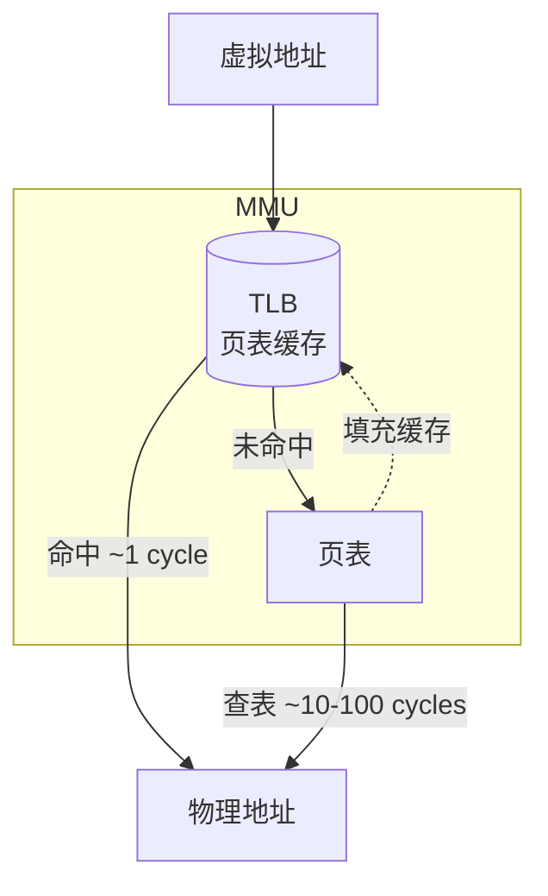
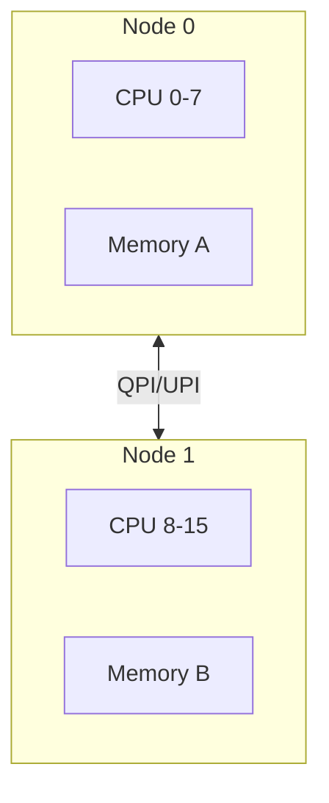
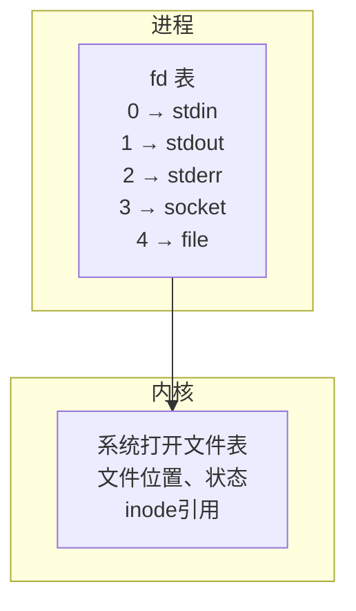
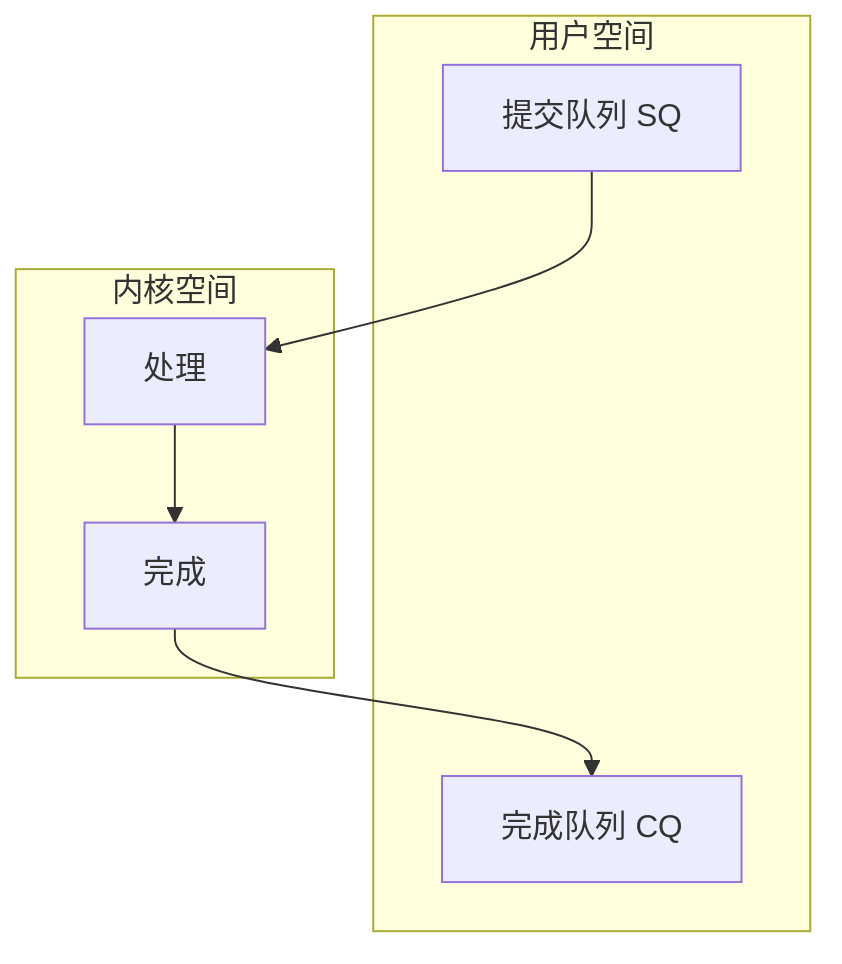

+++
title = "01.Linux & System Concepts"
description = "Linux系统核心概念速查：进程、内存、IO模型、调度，以及内核/Glibc/Systemd/调试工具/存储/AI基础设施概念索引"
date = 2026-01-26
draft = false
[taxonomies]
tags = ["Glossary", "Linux", "Kernel", "System", "Reference"]
+++

# Linux & System Concepts

本索引收录Linux系统编程的核心概念，每个概念包含定义、重要性、关键要点和代码示例。

---

## 一、进程与内存

### 1.1 Context Switch (上下文切换)

**定义**：操作系统保存当前进程/线程的CPU状态（寄存器、程序计数器、栈指针等），并恢复另一个进程/线程状态的过程。

**为什么重要**：
- 上下文切换有显著开销（1-10μs）
- HFT系统需要最小化上下文切换
- 多线程程序性能的关键因素

**开销构成**：
1. **直接开销**：
   - 保存/恢复寄存器：~100ns
   - 切换页表（进程切换）：~500ns
   - 刷新TLB：~1-5μs
   
2. **间接开销**：
   - Cache污染：切换后L1/L2 cache几乎全部失效
   - Cache预热：可能增加10-100μs

**减少上下文切换的方法**：
```bash
# 1. CPU隔离
echo 2-7 > /sys/devices/system/cpu/isolated

# 2. 进程绑定CPU
taskset -c 2 ./trading_app

# 3. 使用实时调度
chrt -f 99 ./trading_app
```

```cpp
// 代码层面：减少锁竞争
// 坏：频繁切换
std::mutex mtx;
void worker() {
    while (running) {
        std::lock_guard lock(mtx);  // 可能阻塞导致切换
        process();
    }
}

// 好：无锁设计
std::atomic<bool> flag{false};
void worker() {
    while (running) {
        if (flag.load(std::memory_order_acquire)) {
            process();
        }
        // 忙等待，不切换
    }
}
```

**详细文章**：[HFT-CPU亲和性与NUMA优化](/articles/ccpp/cpp-26-HFT-CPU亲和性与NUMA优化/)

---

### 1.2 Virtual Memory (虚拟内存)

**定义**：操作系统提供的抽象，让每个进程拥有独立的地址空间。虚拟地址通过页表映射到物理地址。

**关键组件**：



- **TLB**：MMU 内部的高速缓存，存储最近使用的虚拟→物理地址映射
- **命中**：~1 CPU cycle，直接返回物理地址
- **未命中**：需查页表（~10-100 cycles），结果填入 TLB

**页面大小**：
| 类型 | 大小 | TLB覆盖(1024条目) | 适用场景 |
|------|------|-------------------|----------|
| 普通页 | 4KB | 4MB | 一般应用 |
| 大页 | 2MB | 2GB | 数据库、HFT |
| 巨页 | 1GB | 1TB | 大内存应用 |

**Page Fault（缺页中断）**：
- **Minor fault**：页在内存但未映射，~1μs
- **Major fault**：需从磁盘读取，~1-10ms

**HFT最佳实践**：
```cpp
#include <sys/mman.h>

// 1. 锁定内存，防止换出
mlockall(MCL_CURRENT | MCL_FUTURE);

// 2. 预分配并触及所有页面
char* buffer = (char*)mmap(NULL, size, 
    PROT_READ | PROT_WRITE,
    MAP_PRIVATE | MAP_ANONYMOUS | MAP_HUGETLB,
    -1, 0);

// 3. 预热：触及每一页
for (size_t i = 0; i < size; i += 4096) {
    buffer[i] = 0;
}
```

**详细文章**：[内存映射与高效IO(HFT)](/articles/linux/linux-11-内存映射与高效IO/)

---

### 1.3 TLB (Translation Lookaside Buffer)

**定义**：CPU中的页表缓存，存储最近使用的虚拟地址到物理地址的映射，加速地址转换。

**为什么重要**：
- 完整的页表查找需要4次内存访问（4级页表）
- TLB命中只需1个时钟周期
- TLB miss开销：10-100ns

**TLB容量限制**：
```
假设TLB容量1024条目：

4KB页面：最多覆盖 1024 × 4KB = 4MB
2MB大页：最多覆盖 1024 × 2MB = 2GB
1GB巨页：最多覆盖 1024 × 1GB = 1TB
```

**TLB失效场景**：
1. **上下文切换**：进程切换时TLB可能需要刷新
2. **页表修改**：mmap、munmap等操作
3. **容量耗尽**：访问的页面超过TLB容量

**优化策略**：
```bash
# 启用大页
echo 1024 > /proc/sys/vm/nr_hugepages

# 检查TLB miss
perf stat -e dTLB-load-misses,dTLB-loads ./app
```

---

### 1.4 NUMA (Non-Uniform Memory Access)

**定义**：多处理器系统中，每个CPU有自己的本地内存，访问本地内存比远程内存快。

**延迟对比**：
```
本地内存访问：~70-100ns
远程内存访问：~150-300ns（2-3倍）
```

**NUMA拓扑示例**：



**优化策略**：
```bash
# 查看NUMA拓扑
numactl --hardware

# 绑定进程到特定NUMA节点
numactl --cpunodebind=0 --membind=0 ./app

# 代码中分配本地内存
void* ptr = numa_alloc_onnode(size, node_id);
```

**详细文章**：[HFT-CPU亲和性与NUMA优化](/articles/ccpp/cpp-26-HFT-CPU亲和性与NUMA优化/)

---

### 1.5 False Sharing (伪共享)

**定义**：当多个线程访问不同的变量，但这些变量位于同一个缓存行(Cache Line)时，会导致缓存行在CPU核心之间频繁失效和同步，严重影响性能。

**为什么是HFT的头号性能杀手之一**：
- 现代CPU缓存行大小为64字节
- 即使访问的是不同变量，只要在同一缓存行，修改就会导致其他核心缓存失效
- 在多核忙等待场景下，性能可能下降10-100倍

**问题演示**：
```cpp
// 坏：head和tail在同一缓存行
struct BadQueue {
    std::atomic<size_t> head;  // 消费者频繁修改
    std::atomic<size_t> tail;  // 生产者频繁修改
    // head和tail相邻，极可能在同一64字节缓存行
};

// 生产者修改tail → 消费者的head缓存失效
// 消费者修改head → 生产者的tail缓存失效
// 来回弹跳(ping-pong)，性能灾难
```

**解决方案**：缓存行填充（Cache Line Padding）
```cpp
// 好：强制分离到不同缓存行
struct GoodQueue {
    alignas(64) std::atomic<size_t> head;  // 独占一个缓存行
    alignas(64) std::atomic<size_t> tail;  // 独占另一个缓存行
    // 保证head和tail在不同的64字节缓存行
};

// 或者手动填充
struct ManualPadding {
    std::atomic<size_t> head;
    char padding[64 - sizeof(std::atomic<size_t>)];  // 填充到64字节
    std::atomic<size_t> tail;
};
```

**检测False Sharing**：
```bash
# 使用perf检测
perf c2c record ./your_program
perf c2c report

# 关注指标：
# - HITM (Hit Modified): 命中已修改的缓存行，表示有False Sharing
```

**HFT中常见False Sharing场景**：
1. **无锁队列**：head/tail分离
2. **统计计数器**：per-thread计数器独立缓存行
3. **状态标志**：不同线程的状态标志分开

```cpp
// HFT统计计数器正确实现
struct alignas(64) PaddedCounter {
    std::atomic<uint64_t> value{0};
    char padding[64 - sizeof(std::atomic<uint64_t>)];
};

class Statistics {
    std::array<PaddedCounter, 16> perThreadCounters;  // 每个线程独立
};
```

**详细文章**：[HFT缓存友好数据结构设计](/articles/ccpp/cpp-25-HFT缓存友好数据结构设计/)

---

### 1.6 File Descriptor (文件描述符)

**定义**：进程中用于标识打开文件/Socket/管道等资源的非负整数。是用户空间访问内核资源的句柄。

**文件描述符表**：



**文件描述符限制**：
```bash
# 查看当前进程限制
ulimit -n
# 通常默认1024

# 查看系统限制
cat /proc/sys/fs/file-max

# 修改限制
ulimit -n 65535  # 临时
# 或修改 /etc/security/limits.conf
```

**HFT中的文件描述符管理**：
```cpp
// 1. 预打开所有连接，避免运行时open开销
void warmup() {
    for (auto& exchange : exchanges) {
        exchange.socket = socket(AF_INET, SOCK_STREAM, 0);
        connect(exchange.socket, ...);
    }
}

// 2. 使用SO_REUSEADDR快速重用
int reuse = 1;
setsockopt(sock, SOL_SOCKET, SO_REUSEADDR, &reuse, sizeof(reuse));

// 3. 避免fd泄漏
class ScopedFd {
    int fd_;
public:
    explicit ScopedFd(int fd) : fd_(fd) {}
    ~ScopedFd() { if (fd_ >= 0) close(fd_); }
    int get() const { return fd_; }
    int release() { int f = fd_; fd_ = -1; return f; }
};
```

---

## 二、IO模型

### 2.1 Zero-Copy (零拷贝)

**定义**：一种I/O优化技术，消除或减少数据在用户空间和内核空间之间的复制次数。

**传统I/O的问题**：
```
read():  磁盘 → DMA → 内核缓冲区 → CPU拷贝 → 用户缓冲区
write(): 用户缓冲区 → CPU拷贝 → Socket缓冲区 → DMA → 网卡

共4次拷贝，4次上下文切换，2次CPU拷贝
```

**零拷贝技术对比**：

| 技术 | 拷贝次数 | CPU拷贝 | 适用场景 |
|------|----------|---------|----------|
| read+write | 4 | 2 | 需处理数据 |
| mmap+write | 3 | 1 | 随机访问 |
| sendfile | 2 | 0-1 | 静态文件 |
| splice | 2 | 0 | 代理转发 |
| io_uring | 2 | 0 | 通用高性能 |

**sendfile零拷贝**：
```cpp
#include <sys/sendfile.h>

// 文件直接发送到socket，不经过用户空间
ssize_t sent = sendfile(socket_fd, file_fd, &offset, count);
```

**零拷贝的限制与陷阱**：
1. **不适合需要修改数据的场景**：零拷贝绑定了数据不可修改
2. **TLS/加密不兼容**：TLS需要在用户空间加密数据
3. **跨设备限制**：sendfile只支持某些fd组合
4. **大文件分块**：需要循环调用处理大文件

**详细文章**：[内存映射与高效IO(HFT)](/articles/linux/linux-11-内存映射与高效IO/)

---

### 2.2 mmap (内存映射)

**定义**：将文件或设备映射到进程的虚拟地址空间，使文件访问像访问内存一样简单。

**为什么HFT使用mmap**：
- 避免read/write系统调用
- 利用操作系统页缓存
- 适合随机访问模式

**mmap vs read/write**：
| 特性 | mmap | read/write |
|------|------|------------|
| 系统调用 | 一次（映射时） | 每次读写 |
| 数据拷贝 | 零拷贝(直接访问页缓存) | 需要拷贝 |
| 随机访问 | 高效 | 需要lseek |
| 小文件 | 开销较大 | 更合适 |
| 顺序读取 | 较差 | 预读优化好 |

**使用示例**：
```cpp
#include <sys/mman.h>
#include <fcntl.h>

// 映射文件
int fd = open("data.bin", O_RDONLY);
struct stat st;
fstat(fd, &st);

void* addr = mmap(nullptr, st.st_size, 
    PROT_READ, MAP_PRIVATE, fd, 0);

if (addr == MAP_FAILED) {
    perror("mmap failed");
    return;
}

// 直接访问数据，如同访问内存
auto* data = static_cast<const char*>(addr);
char c = data[1000];  // 无系统调用！

// 解除映射
munmap(addr, st.st_size);
close(fd);
```

**HFT最佳实践**：
```cpp
// 1. 使用MAP_POPULATE预加载页面
void* addr = mmap(nullptr, size,
    PROT_READ, MAP_PRIVATE | MAP_POPULATE, fd, 0);

// 2. 使用madvise提示访问模式
madvise(addr, size, MADV_SEQUENTIAL);  // 顺序访问
madvise(addr, size, MADV_RANDOM);      // 随机访问
madvise(addr, size, MADV_WILLNEED);    // 预加载

// 3. 锁定内存防止换出
mlock(addr, size);
```

---

### 2.3 O_DIRECT (直接IO)

**定义**：绕过操作系统页缓存，直接在用户缓冲区和磁盘之间传输数据。

**为什么使用O_DIRECT**：
- 数据库等应用有自己的缓存策略
- 避免页缓存的双重缓冲
- 更可预测的延迟（无页缓存eviction）

**O_DIRECT的限制**：
1. **对齐要求**：缓冲区地址、偏移量、大小必须是扇区大小（通常512或4096）的倍数
2. **无预读**：需要自己管理预读
3. **写入保证**：不保证持久化，仍需fsync

```cpp
// O_DIRECT使用
int fd = open("data.bin", O_RDWR | O_DIRECT);

// 必须使用对齐的内存
size_t alignment = 4096;
void* buf = nullptr;
posix_memalign(&buf, alignment, size);

// 读写的offset和size也必须对齐
pread(fd, buf, aligned_size, aligned_offset);
pwrite(fd, buf, aligned_size, aligned_offset);

free(buf);
close(fd);
```

**何时使用O_DIRECT**：
- ✅ 数据库（有自己的Buffer Pool）
- ✅ 日志系统（顺序写入，自己管理）
- ❌ 一般文件访问（页缓存更高效）
- ❌ 小IO（对齐开销大）

---

### 2.4 epoll

**定义**：Linux高性能I/O事件通知机制，可以高效地监控大量文件描述符。

**与select/poll对比**：

| 特性 | select | poll | epoll |
|------|--------|------|-------|
| 最大fd数 | 1024 | 无限制 | 无限制 |
| fd传递 | 每次全部 | 每次全部 | 只传一次 |
| 事件检查 | O(n) | O(n) | O(1) |
| 触发模式 | 水平 | 水平 | 水平/边缘 |

**边缘触发 vs 水平触发**：
- **水平触发(LT)**：只要满足条件就通知（默认）
- **边缘触发(ET)**：状态变化时才通知（更高效但需正确处理）

**使用示例**：
```cpp
int epfd = epoll_create1(0);

struct epoll_event ev;
ev.events = EPOLLIN | EPOLLET;  // 边缘触发
ev.data.fd = sock_fd;
epoll_ctl(epfd, EPOLL_CTL_ADD, sock_fd, &ev);

struct epoll_event events[MAX_EVENTS];
while (true) {
    int n = epoll_wait(epfd, events, MAX_EVENTS, -1);
    for (int i = 0; i < n; i++) {
        handle(events[i].data.fd);
    }
}
```

---

### 2.5 io_uring

**定义**：Linux 5.1+引入的高性能异步I/O接口，通过共享内存的环形缓冲区减少系统调用。

**架构**：



**优势**：
1. **批量提交**：一次系统调用提交多个I/O
2. **真正异步**：完成后内核直接写入CQ
3. **零拷贝**：支持registered buffers
4. **轮询模式**：完全避免系统调用

```cpp
#include <liburing.h>

struct io_uring ring;
io_uring_queue_init(256, &ring, 0);

// 提交读操作
struct io_uring_sqe *sqe = io_uring_get_sqe(&ring);
io_uring_prep_read(sqe, fd, buf, size, 0);
io_uring_submit(&ring);

// 获取完成事件
struct io_uring_cqe *cqe;
io_uring_wait_cqe(&ring, &cqe);
// cqe->res 是读取的字节数
io_uring_cqe_seen(&ring, cqe);
```

**详细文章**：[io_uring详解(HFT)](/articles/networking/net-20-io_uring详解/)

---

## 三、时间与同步

### 3.1 System Call (系统调用)

**定义**：用户态程序请求内核服务的接口。从用户态切换到内核态，执行内核代码，再返回用户态。

**开销**：
- 最小系统调用（如getpid）：~100-200ns
- 典型系统调用：~500ns-1μs
- 复杂系统调用（如open）：~1-10μs

**减少系统调用**：
```cpp
// 坏：每次写一个字节
for (int i = 0; i < 1000; i++) {
    write(fd, &byte, 1);  // 1000次系统调用
}

// 好：批量写入
char buffer[1000];
// 填充buffer
write(fd, buffer, 1000);  // 1次系统调用

// 更好：使用vDSO避免内核切换
clock_gettime(CLOCK_MONOTONIC, &ts);  // 通过vDSO，无需进入内核
```

---

### 3.2 Clock Sources (时钟源)

**定义**：Linux内核提供的时间计数来源，不同时钟源有不同的精度和开销。

**常见时钟源**：

| 时钟源 | 精度 | 开销 | 说明 |
|--------|------|------|------|
| TSC | 纳秒 | ~10-20ns | CPU计数器，最快 |
| HPET | 纳秒 | ~500ns | 硬件时钟 |
| ACPI_PM | 微秒 | ~1μs | 传统时钟 |
| jiffies | 毫秒 | 极低 | 内核tick |

**查看和设置**：
```bash
# 查看可用时钟源
cat /sys/devices/system/clocksource/clocksource0/available_clocksource
# tsc hpet acpi_pm

# 查看当前时钟源
cat /sys/devices/system/clocksource/clocksource0/current_clocksource
# tsc

# 验证TSC稳定性
dmesg | grep -i tsc
# tsc: Detected 2400.000 MHz processor
# tsc: Detected 2400.002 MHz TSC
```

**详细文章**：[Linux时间子系统(HFT)](/articles/linux/linux-10-Linux时间子系统/)

---

### 3.3 Futex (Fast Userspace Mutex)

**定义**：Linux提供的快速用户空间互斥原语。在无竞争情况下完全在用户态完成，只有在需要阻塞时才进入内核。

**工作原理**：
```
无竞争时：
  用户态原子操作获取锁 → 成功 → 继续执行（无系统调用）

有竞争时：
  用户态原子操作 → 失败 → futex系统调用 → 内核阻塞等待
```

**pthread_mutex底层**：
```cpp
// pthread_mutex_lock的简化实现
int pthread_mutex_lock(pthread_mutex_t* m) {
    // 尝试用户态获取
    if (atomic_compare_exchange(&m->val, 0, 1)) {
        return 0;  // 成功，无系统调用
    }
    // 需要阻塞
    while (atomic_exchange(&m->val, 2) != 0) {
        futex(&m->val, FUTEX_WAIT, 2, ...);  // 进入内核等待
    }
    return 0;
}
```

---

## 四、中断与调度

### 4.1 Interrupt (中断)

**定义**：硬件或软件发出的信号，通知CPU暂停当前任务处理紧急事件。

**中断类型**：
- **硬中断(IRQ)**：硬件触发，如网卡收包、磁盘完成
- **软中断(Softirq)**：内核延迟处理，如网络协议栈
- **定时器中断**：周期性，驱动调度器

**中断对延迟的影响**：
```
正在执行交易代码
    ↓
收到网卡中断 → 保存上下文 → 中断处理 → 恢复上下文
    ↓
继续执行交易代码

中断处理可能引入1-10μs延迟
```

**减少中断干扰**：
```bash
# 1. 将中断绑定到非交易核心
echo 0 > /proc/irq/IRQ_NUMBER/smp_affinity

# 2. 使用NAPI减少网卡中断
# 网卡收到第一个包后触发中断，之后轮询

# 3. isolcpus隔离CPU
# 内核启动参数: isolcpus=2-7
```

---

### 4.2 CPU Affinity (CPU亲和性)

**定义**：将进程/线程绑定到特定CPU核心，防止调度器在核心间迁移。

**为什么重要**：
- 避免Cache失效（迁移后需重新预热）
- 避免NUMA跨节点访问
- 减少调度器开销

```cpp
#include <sched.h>

void pin_to_cpu(int cpu) {
    cpu_set_t cpuset;
    CPU_ZERO(&cpuset);
    CPU_SET(cpu, &cpuset);
    pthread_setaffinity_np(pthread_self(), sizeof(cpuset), &cpuset);
}

// 交易引擎典型设置
int main() {
    pin_to_cpu(2);  // 绑定到隔离的CPU 2
    
    // 提升优先级
    struct sched_param param;
    param.sched_priority = 99;
    sched_setscheduler(0, SCHED_FIFO, &param);
    
    run_trading_loop();
}
```

**详细文章**：[HFT-CPU亲和性与NUMA优化](/articles/ccpp/cpp-26-HFT-CPU亲和性与NUMA优化/)

---

---

### 4.3 Spinlock (自旋锁)

**定义**：一种忙等待锁，获取失败时不睡眠，而是循环检测（自旋）直到锁可用。

**为什么重要**：
- 中断上下文只能使用 spinlock（不能睡眠）
- 短临界区性能优于互斥锁（无上下文切换开销）
- 多核系统的基础同步原语

**多核实现演进**：

| 实现 | 特点 | 问题 |
|------|------|------|
| **TAS** | test-and-set 原子操作 | 不公平，缓存行抖动 |
| **Ticket Lock** | 取号排队，FIFO 公平 | 所有 CPU 同一缓存行自旋 |
| **MCS Lock** | 每 CPU 本地自旋 | 实现复杂 |
| **qspinlock** | 三级策略，Linux 4.2+ | 当前内核默认 |

**Spinlock 变体**：

```cpp
spin_lock(&lock);           // 禁止抢占
spin_lock_bh(&lock);        // 禁止抢占 + 软中断
spin_lock_irq(&lock);       // 禁止抢占 + 硬中断
spin_lock_irqsave(&lock, flags);  // 同上，保存中断状态
```

**详细文章**：[内核同步机制详解](/articles/linux/linux-18-内核同步机制详解/)

---

### 4.4 RCU (Read-Copy-Update)

**定义**：一种同步机制，读者无需加锁，写者负责同步。适用于读多写少的场景。

**核心思想**：
- 读者无开销访问数据
- 写者创建副本修改，原子替换指针
- 等待宽限期（所有读者退出）后释放旧数据

**工作原理**：

```
1. 写者复制数据，修改副本
2. rcu_assign_pointer() 原子替换指针
3. synchronize_rcu() 等待宽限期
4. 宽限期结束后释放旧数据
```

**API**：

```c
// 读者
rcu_read_lock();
ptr = rcu_dereference(global_ptr);
// 使用 ptr
rcu_read_unlock();

// 写者
new_ptr = kmalloc(...);
old_ptr = rcu_dereference(global_ptr);
rcu_assign_pointer(global_ptr, new_ptr);
synchronize_rcu();  // 或 call_rcu()
kfree(old_ptr);
```

**应用场景**：
- 链表遍历（读多写少）
- 路由表查询
- 文件系统 dcache

**详细文章**：[内核同步机制详解](/articles/linux/linux-18-内核同步机制详解/)

---

### 4.5 Memory Barrier (内存屏障)

**定义**：阻止编译器和 CPU 重排序内存操作的指令。

**为什么需要**：
- 编译器优化可能重排指令
- CPU 乱序执行提高性能
- Store Buffer 导致写操作延迟可见

**Linux 内存屏障 API**：

| 屏障 | 作用 |
|------|------|
| `barrier()` | 编译器屏障 |
| `mb()` | 全屏障 |
| `rmb()` | 读屏障 |
| `wmb()` | 写屏障 |
| `smp_mb()` | SMP 全屏障 |

**典型模式**：

```c
// 生产者
data = value;
smp_wmb();     // 确保 data 写入在 flag 之前
flag = 1;

// 消费者
while (!flag);
smp_rmb();     // 确保读 flag 在读 data 之前
use(data);
```

**详细文章**：[内核同步机制详解](/articles/linux/linux-18-内核同步机制详解/)

---

### 4.6 Signal (信号)

**定义**：进程间通信的异步通知机制。内核或其他进程可以向目标进程发送信号，触发特定处理。

**常见信号**：
| 信号 | 编号 | 默认行为 | 用途 |
|------|------|----------|------|
| SIGINT | 2 | 终止 | Ctrl+C中断 |
| SIGKILL | 9 | 终止（不可捕获） | 强制杀进程 |
| SIGSEGV | 11 | Core dump | 内存访问错误 |
| SIGTERM | 15 | 终止 | 优雅终止请求 |
| SIGUSR1/2 | 10/12 | 终止 | 用户自定义 |
| SIGALRM | 14 | 终止 | 定时器到期 |

**信号处理**：
```cpp
#include <signal.h>

volatile sig_atomic_t running = 1;

void signal_handler(int sig) {
    if (sig == SIGINT || sig == SIGTERM) {
        running = 0;  // 只设置标志，不做复杂操作
    }
}

int main() {
    // 注册信号处理器
    struct sigaction sa;
    sa.sa_handler = signal_handler;
    sigemptyset(&sa.sa_mask);
    sa.sa_flags = 0;
    sigaction(SIGINT, &sa, nullptr);
    sigaction(SIGTERM, &sa, nullptr);
    
    while (running) {
        // 主循环
    }
    
    // 优雅退出
    cleanup();
    return 0;
}
```

**HFT中的信号处理**：
- 信号可能在任意时刻中断程序，需要异步信号安全
- 只使用`sig_atomic_t`和少数安全函数
- 热路径应该屏蔽信号

---

### 4.4 cgroups (Control Groups)

**定义**：Linux内核特性，用于限制、统计和隔离进程组的资源使用（CPU、内存、IO等）。

**为什么HFT关注**：
- 容器化部署时需要理解资源限制
- 可以隔离交易进程的资源
- CPU配额可能影响延迟

**常用子系统**：
- **cpu**：CPU时间配额
- **cpuset**：绑定CPU核心
- **memory**：内存限制
- **blkio**：块设备IO限制

```bash
# 创建cgroup
mkdir /sys/fs/cgroup/cpu/trading

# 限制CPU使用50%
echo 50000 > /sys/fs/cgroup/cpu/trading/cpu.cfs_quota_us
echo 100000 > /sys/fs/cgroup/cpu/trading/cpu.cfs_period_us

# 将进程加入cgroup
echo $PID > /sys/fs/cgroup/cpu/trading/cgroup.procs

# 绑定到特定CPU
echo "2-7" > /sys/fs/cgroup/cpuset/trading/cpuset.cpus
```

**cgroups v2统一层次结构**：
```bash
# 现代Linux使用统一的cgroup2挂载点
ls /sys/fs/cgroup/
# cpu.max  memory.max  io.max  ...
```

---

## 五、操作系统核心组件

### 5.1 Linux Kernel (内核)

**定义**：操作系统核心，管理硬件资源，提供系统调用接口。

**核心子系统**：进程调度、内存管理、文件系统、网络栈、设备驱动、中断处理

**详细文章**：[内核与系统组件详解](/articles/linux/linux-12-内核与系统组件详解/)

---

### 5.2 Glibc (GNU C Library)

**定义**：Linux 标准 C 库，封装系统调用为 C 函数接口。

**核心功能**：stdio、stdlib、pthread、动态链接器、内存分配器(ptmalloc2)

**详细文章**：[内核与系统组件详解](/articles/linux/linux-12-内核与系统组件详解/#二glibc-gnu-c-library)

---

### 5.3 Systemd

**定义**：现代 Linux 系统的 init 进程(PID 1)，管理系统启动和服务生命周期。

**核心概念**：Unit、Service、Target、Timer、journalctl

**详细文章**：[内核与系统组件详解](/articles/linux/linux-12-内核与系统组件详解/#三systemd)

---

### 5.4 Toolchain (工具链)

**定义**：将源代码编译为可执行文件的工具集。

**核心组件**：GCC(编译器)、Binutils(as/ld/objdump)、GDB(调试器)、Glibc(C库)

**详细文章**：[内核与系统组件详解](/articles/linux/linux-12-内核与系统组件详解/#四toolchain-工具链)

---

## 六、调试与追踪工具

### 6.1 Crash

**定义**：内核崩溃转储(vmcore)分析工具。

**用途**：分析 Kernel Panic，定位崩溃根因

**详细文章**：[内核调试工具详解](/articles/linux/linux-13-内核调试工具详解/#一crash-内核崩溃分析)

---

### 6.2 GDB

**定义**：GNU 调试器，支持断点、单步、内存检查等。

**用途**：程序调试、core dump 分析、远程调试

**详细文章**：[内核调试工具详解](/articles/linux/linux-13-内核调试工具详解/#二gdb-gnu-debugger-高级技巧)

---

### 6.3 Ftrace

**定义**：内核内置函数追踪器。

**用途**：追踪内核函数调用、事件追踪、性能分析

**详细文章**：[内核调试工具详解](/articles/linux/linux-13-内核调试工具详解/#三ftrace-函数追踪器)

---

### 6.4 BPFtrace / eBPF

**定义**：可编程内核追踪工具，基于 eBPF 技术。

**用途**：低开销追踪、自定义探针、生产环境性能分析

**详细文章**：[内核调试工具详解](/articles/linux/linux-13-内核调试工具详解/#四bpftrace--ebpf)

---

## 七、存储与文件系统

### 7.1 VFS (虚拟文件系统)

**定义**：Linux 文件系统抽象层，统一不同文件系统的接口。

**核心结构**：super_block、inode、dentry、file

**详细文章**：[存储与文件系统详解](/articles/linux/linux-14-存储与文件系统详解/#一linux-文件系统架构)

---

### 7.2 NVMe

**定义**：Non-Volatile Memory Express，专为 SSD 设计的高性能存储协议。

**特点**：PCIe 直连、多队列、低延迟(~10μs)、高 IOPS(~1M+)

**详细文章**：[存储与文件系统详解](/articles/linux/linux-14-存储与文件系统详解/#二nvme-驱动与原理)

---

### 7.3 SPDK

**定义**：Storage Performance Development Kit，用户态存储开发框架。

**特点**：绕过内核、轮询模式、零拷贝、延迟~2-5μs

**详细文章**：[存储与文件系统详解](/articles/linux/linux-14-存储与文件系统详解/#三spdk-storage-performance-development-kit)

---

### 7.4 FUSE

**定义**：Filesystem in Userspace，用户态文件系统框架。

**用途**：无需修改内核即可实现文件系统(sshfs、s3fs等)

**详细文章**：[存储与文件系统详解](/articles/linux/linux-14-存储与文件系统详解/#四用户态文件系统-fuse)

---

## 八、AI基础设施

### 8.1 GPU 计算

**定义**：图形处理器用于通用并行计算。

**软件栈**：CUDA Runtime → cuDNN/cuBLAS → PyTorch/TensorFlow

**详细文章**：[AI基础设施详解](/articles/linux/linux-15-AI基础设施详解/#一gpu-计算与驱动)

---

### 8.2 RDMA

**定义**：Remote Direct Memory Access，网卡直接读写远程内存。

**特点**：绕过 CPU 和操作系统、延迟~1-2μs、零拷贝

**技术**：InfiniBand、RoCE v2、iWARP

**详细文章**：[AI基础设施详解](/articles/linux/linux-15-AI基础设施详解/#二rdma-remote-direct-memory-access)

---

## 九、延伸阅读

---

## 九、延伸阅读

- [网络核心概念索引](/articles/00-glossary/glossary-02-networking-concepts/)
- [HFT核心概念索引](/articles/00-glossary/glossary-04-hft-concepts/)
- [Linux内核网络栈详解(HFT)](/articles/linux/linux-09-Linux内核网络栈详解/)
- [Linux时间子系统(HFT)](/articles/linux/linux-10-Linux时间子系统/)
- [C++核心概念索引](/articles/00-glossary/glossary-05-cpp-concepts/)

---

## 相关文章

- [下一篇：Networking Concepts](/articles/00-glossary/glossary-02-networking-concepts/)
