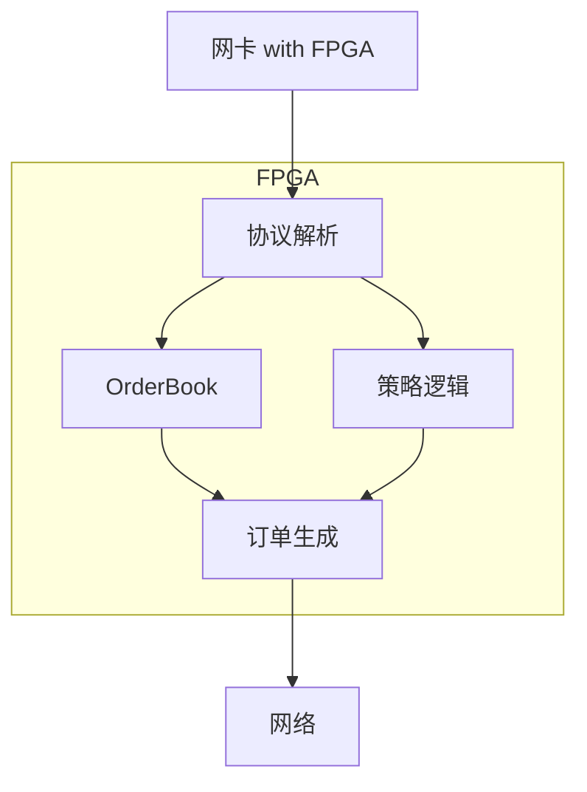

+++
title = "HFT Concepts"
description = "HFT核心概念速查索引：高频交易系统的关键技术概念详解，包括延迟优化、网络技术、交易系统设计等"
date = 2026-01-26
weight = 4000
draft = false
[taxonomies]
tags = ["Glossary", "HFT", "Low Latency", "Trading", "Reference"]
+++

# HFT Core Concepts Index

本索引收录高频交易（HFT）领域的核心概念。每个概念包含：
- **定义**：准确的技术定义
- **为什么对HFT重要**：在低延迟交易中的意义
- **关键要点**：必须掌握的核心内容
- **实践建议**：面试和实际工作中的应用

---

## 一、延迟与性能

### 1.1 Tick-to-Trade Latency (报价到交易延迟)

**定义**：从接收到市场数据（tick）到发送订单的端到端延迟。这是衡量HFT系统性能的最关键指标。

**典型分解**：
```
网络接收:     100-500ns (kernel bypass)
协议解析:     50-200ns  (zero-copy parsing)
策略计算:     100-500ns (optimized logic)
风控检查:     50-100ns  (pre-computed limits)
订单编码:     50-100ns  (pre-allocated buffers)
网络发送:     100-500ns (kernel bypass)
─────────────────────────────
总计:         500ns - 2μs (顶级HFT)
```

**优化方向**：
1. **网络层**：Kernel bypass (DPDK/Onload)、共置(co-location)
2. **解析层**：零拷贝解析、预分配缓冲区
3. **计算层**：分支预测友好、SIMD、避免动态内存分配
4. **发送层**：预填充订单模板、TCP_NODELAY

**面试要点**：能够分解延迟来源，给出每个环节的典型数值和优化方法。

**详细文章**：[HFT系统延迟分析方法](@/articles/hft/hft-12-HFT系统延迟分析方法.md)

---

### 1.2 Jitter (抖动)

**定义**：延迟的变化程度，通常用P99-P50或标准差衡量。HFT系统不仅追求低延迟，更追求稳定的延迟。

**为什么比平均延迟更重要**：
- 交易机会转瞬即逝
- P99抖动大意味着关键时刻可能错过
- 稳定的2μs比平均1μs但P99=10μs更好

**抖动来源**：

| 来源 | 典型影响 | 解决方案 |
|------|----------|----------|
| 中断 | 1-10μs | CPU隔离、中断亲和性 |
| 调度器 | 1-100μs | isolcpus、SCHED_FIFO |
| 页缺失 | 10-1000μs | 内存预热、mlock |
| THP | 100-10000μs | 禁用透明大页 |
| NUMA | 50-300ns | 本地内存分配 |
| Turbo Boost | 变化 | 固定CPU频率 |

**测量方法**：
```bash
# 使用cyclictest测量调度抖动
cyclictest -t1 -p99 -i1000 -a1 -n -m -d0

# 检查P99延迟
histogram -p99 latencies.dat
```

**详细文章**：[低延迟系统运维指南(HFT)](@/articles/sre/sre-61-HFT基础设施最佳实践.md)

---

### 1.3 Hot Path (热路径)

**定义**：交易系统中最频繁执行、对延迟最敏感的代码路径。通常是从收到市场数据到发送订单的关键路径。

**热路径优化原则**：

1. **零内存分配**：预分配所有缓冲区
2. **无系统调用**：避免锁、避免I/O
3. **无虚函数**：使用模板/CRTP实现多态
4. **分支预测友好**：最可能的分支放前面
5. **缓存友好**：数据按访问顺序排列

**冷热路径分离**：
```cpp
class TradingEngine {
    // 热路径：内联、无分配、无锁
    void onMarketData(const MarketData& md) {
        if (likely(checkSignal(md))) {
            sendOrder(prebuiltOrder_);
        }
    }
    
    // 冷路径：可以使用动态分配、日志等
    void onConfigUpdate(const Config& cfg) {
        std::lock_guard lock(mutex_);
        updateStrategy(cfg);
        logger_.info("Config updated");
    }
};
```

**详细文章**：[HFT分支预测与热路径优化](@/articles/cpp/cpp-24-模板高级技巧详解.md)

---

### 1.4 Busy Polling (忙等待轮询)

**定义**：不断循环检查条件而不休眠的等待方式，用CPU换取最低延迟。

**为什么使用**：
- 中断/休眠唤醒需要1-10μs
- 忙等待响应时间可以是纳秒级
- HFT系统CPU资源充足，延迟是第一优先级

**实现模式**：
```cpp
// 网络接收忙等待
while (true) {
    int n = recv(sock, buf, size, MSG_DONTWAIT);
    if (n > 0) {
        process(buf, n);
    }
    // 没有sleep！持续轮询
}

// DPDK轮询
while (true) {
    uint16_t n = rte_eth_rx_burst(port, queue, mbufs, BURST_SIZE);
    for (int i = 0; i < n; i++) {
        process(mbufs[i]);
    }
}
```

**配合措施**：
- CPU隔离：防止其他进程抢占
- 固定频率：防止CPU降频
- 独占核心：专用于轮询的核心

**详细文章**：[HFT-CPU亲和性与NUMA优化](@/articles/cpp/cpp-26-Lambda与函数对象详解.md)

---

## 二、网络技术

### 2.1 Kernel Bypass (内核旁路)

**定义**：绕过操作系统内核网络栈，让用户态程序直接与网卡交互，消除内核带来的延迟。

**内核网络栈开销**：
- 系统调用：500ns-1μs
- 协议栈处理：2-5μs
- 数据拷贝：1-2μs
- 中断处理：2-10μs

**主流技术对比**：

| 技术 | 单向延迟 | 复杂度 | 适用场景 |
|------|----------|--------|----------|
| Socket | 20-50μs | 低 | 一般应用 |
| io_uring | 5-10μs | 中 | 准HFT |
| DPDK | 1-2μs | 高 | HFT |
| Onload | 0.7-1μs | 中 | HFT |
| FPGA | 0.1-0.5μs | 极高 | 顶级HFT |

**DPDK核心原理**：
1. **用户态驱动**：网卡驱动在用户态运行
2. **Huge Pages**：减少TLB miss
3. **轮询模式**：替代中断
4. **无锁队列**：rte_ring实现

**详细文章**：[DPDK深度实践](@/articles/hft/hft-20-高性能序列化技术.md)

---

### 2.2 Co-location (共置)

**定义**：将交易服务器放置在交易所数据中心内部，最小化物理网络延迟。

**延迟对比**：
```
同机房共置:     ~50μs 往返
同城市:         ~500μs 往返
跨城市:         2-20ms 往返
跨大洲:         50-150ms 往返
```

**共置服务内容**：
- 机柜空间（rack space）
- 交叉连接（cross-connect）到交易所匹配引擎
- 低延迟市场数据源
- 时间同步（PTP）

**共置之外的网络优化**：
- 微波链路：比光纤快（光速 vs 光纤中的光速）
- 路由优化：最短物理路径
- 网络设备：低延迟交换机

**详细文章**：[HFT基础设施最佳实践(HFT)](@/articles/sre/sre-62-金融系统合规与审计.md)

---

### 2.3 Market Data Feed

**定义**：交易所分发的实时市场行情数据流，包括报价、成交、订单簿更新等。

**主要协议**：

| 协议 | 交易所 | 特点 |
|------|--------|------|
| FAST | 多个 | 压缩协议，需解码 |
| ITCH | NASDAQ | 二进制，高效 |
| PITCH | BATS/Cboe | 类似ITCH |
| SBE | CME/LME | Simple Binary Encoding |

**处理优化**：
1. **零拷贝解析**：直接在原始缓冲区解析
2. **预分配OrderBook**：避免动态内存分配
3. **增量更新**：只更新变化的部分
4. **SIMD解码**：并行处理多个字段

**示例（ITCH消息解析）**：
```cpp
struct [[gnu::packed]] AddOrder {
    char type;           // 'A'
    uint16_t locate;
    uint16_t tracking;
    uint64_t timestamp;  // nanoseconds
    uint64_t ref;
    char side;           // 'B' or 'S'
    uint32_t shares;
    char symbol[8];
    uint32_t price;      // fixed point
};

void parseAddOrder(const char* buf) {
    auto* msg = reinterpret_cast<const AddOrder*>(buf);
    // 直接访问，无拷贝
    orderbook.add(msg->symbol, msg->side, msg->price, msg->shares);
}
```

**详细文章**：[ITCH与OUCH协议详解](@/articles/hft/hft-04-ITCH与OUCH协议详解.md)

---

### 2.4 PTP (Precision Time Protocol)

**定义**：IEEE 1588标准，实现网络设备间亚微秒级时间同步。

**为什么HFT需要**：
- MiFID II要求交易时间戳精度<1μs
- 延迟测量需要精确时间
- 事件排序和审计

**时间同步层次**：
```
原子钟/GPS → Grandmaster Clock → Boundary Clock → 交易服务器
精度逐级降低：1ns → 10ns → 100ns → 1μs
```

**NTP vs PTP**：

| 特性 | NTP | PTP |
|------|-----|-----|
| 精度 | 1-10ms | <1μs |
| 硬件支持 | 不需要 | 需要 |
| 成本 | 低 | 高 |
| 适用 | 一般应用 | HFT/金融 |

**详细文章**：[Linux时间子系统(HFT)](@/articles/linux/linux-10-Linux时间子系统.md)

---

## 三、交易系统设计

### 3.1 Order Book (订单簿)

**定义**：按价格优先、时间优先排列的买卖订单集合。Order Book是交易系统的核心数据结构。

**数据结构选择**：

| 结构 | 查找 | 插入/删除 | 内存 | 适用场景 |
|------|------|-----------|------|----------|
| std::map | O(log n) | O(log n) | 高 | 简单实现 |
| 数组+哈希 | O(1) | O(1) | 中 | 价格范围有限 |
| 跳表 | O(log n) | O(log n) | 中 | 范围查询 |

**HFT最佳实践**：
```cpp
class OrderBook {
    // 价格到level的O(1)查找
    std::array<PriceLevel, MAX_PRICE_LEVELS> levels_;
    
    // 订单ID到订单的O(1)查找
    std::array<Order*, MAX_ORDERS> orders_;
    
    // 预分配订单对象池
    ObjectPool<Order> orderPool_;
    
    void addOrder(OrderId id, Price price, Qty qty, Side side) {
        Order* order = orderPool_.alloc();
        order->init(id, price, qty, side);
        orders_[id] = order;
        levels_[priceToIndex(price)].add(order);
    }
};
```

**详细文章**：[OrderBook实现详解](@/articles/hft/hft-13-OrderBook实现详解.md)

---

### 3.2 Smart Order Router (SOR)

**定义**：智能订单路由系统，自动选择最优的交易场所执行订单。

**路由决策因素**：
1. **价格**：最优买卖价
2. **流动性**：订单簿深度
3. **费用**：交易费、回扣（rebate）
4. **延迟**：到各交易所的延迟
5. **成交概率**：历史成交率

**美国股票市场示例**：
```
订单：买入10000股AAPL

场所分析：
- NYSE:    best bid $150.00, 3000股, 延迟800μs
- NASDAQ:  best bid $150.01, 2000股, 延迟600μs  
- BATS:    best bid $150.00, 5000股, 延迟500μs

路由决策：
1. 发送2000股到NASDAQ (最优价)
2. 发送5000股到BATS (价格相同,延迟最低)
3. 发送3000股到NYSE
```

---

### 3.3 Risk Management (风险管理)

**定义**：交易系统中防止异常损失的控制机制，包括预交易风控和实时风控。

**预交易风控检查**：
```cpp
bool preTradeRiskCheck(const Order& order) {
    // 1. 订单大小限制
    if (order.qty > MAX_ORDER_SIZE) return false;
    
    // 2. 价格合理性（相对于参考价）
    if (abs(order.price - refPrice_) / refPrice_ > MAX_PRICE_DEVIATION) 
        return false;
    
    // 3. 持仓限制
    if (position_ + order.signedQty() > MAX_POSITION) return false;
    
    // 4. 订单频率限制（kill switch）
    if (orderCount_ > MAX_ORDERS_PER_SECOND) return false;
    
    return true;
}
```

**关键风控指标**：
- 最大持仓量
- 最大订单大小
- 每秒最大订单数
- 最大日亏损（kill switch触发点）
- 价格偏离限制

**详细文章**：[HFT风控系统设计](@/articles/hft/hft-15-HFT风控系统设计.md)

---

### 3.4 Market Making (做市)

**定义**：同时在买卖两侧挂单提供流动性，赚取买卖价差（spread）的策略。

**基本原理**：
```
买入价(Bid): $100.00  ← 做市商挂买单
卖出价(Ask): $100.02  ← 做市商挂卖单
价差(Spread): $0.02

如果两边都成交：
买入1股 @ $100.00
卖出1股 @ $100.02
利润 = $0.02（减去费用）
```

**核心挑战**：
1. **逆向选择**：知情交易者（有信息优势的人）会持续单边成交
2. **库存风险**：持有的头寸可能贬值
3. **竞争**：多个做市商竞争，压缩利润

**常用模型**：
- Avellaneda-Stoikov：库存风险管理
- Guéant-Lehalle-Fernandez-Tapia：最优报价

**详细文章**：[MarketMaking策略原理](@/articles/hft/hft-14-MarketMaking策略原理.md)

---

## 四、编程优化

### 4.1 Branch Prediction (分支预测)

**定义**：CPU预测条件分支结果的机制，预测错误导致流水线冲刷，造成10-20个时钟周期的损失。

**为什么重要**：
- 现代CPU流水线15-20级深
- 分支预测错误代价：~10-20ns
- HFT热路径中的分支错误是主要延迟来源

**优化技巧**：

```cpp
// 1. 使用likely/unlikely提示
#define likely(x)   __builtin_expect(!!(x), 1)
#define unlikely(x) __builtin_expect(!!(x), 0)

if (likely(order.isValid())) {
    process(order);  // 快速路径
} else {
    handleError();   // 慢速路径
}

// 2. 避免数据依赖的分支
// 坏：
if (a > b) x = a; else x = b;  // 分支

// 好：
x = (a > b) ? a : b;  // 可能被优化为cmov

// 3. 排序数据减少分支
std::sort(orders.begin(), orders.end(), 
    [](auto& a, auto& b) { return a.side < b.side; });
// 之后处理时分支预测更准确
```

**详细文章**：[HFT分支预测与热路径优化](@/articles/cpp/cpp-24-模板高级技巧详解.md)

---

### 4.2 Memory Pool (内存池)

**定义**：预分配的固定大小内存块池，避免运行时动态分配。

**为什么HFT必须使用**：
- `malloc`/`new` 延迟不确定（100ns-100μs）
- 可能触发系统调用（sbrk/mmap）
- 内存碎片导致性能下降

**实现示例**：
```cpp
template<typename T, size_t PoolSize = 10000>
class ObjectPool {
    alignas(T) char storage_[sizeof(T) * PoolSize];
    std::array<T*, PoolSize> freeList_;
    size_t freeIndex_{0};
    
public:
    ObjectPool() {
        for (size_t i = 0; i < PoolSize; ++i) {
            freeList_[i] = reinterpret_cast<T*>(&storage_[sizeof(T) * i]);
        }
        freeIndex_ = PoolSize;
    }
    
    T* alloc() {
        if (freeIndex_ == 0) return nullptr;
        return freeList_[--freeIndex_];
    }
    
    void free(T* ptr) {
        freeList_[freeIndex_++] = ptr;
    }
};
```

**详细文章**：[HFT自定义内存分配器设计](@/articles/cpp/cpp-20-HFT缓存友好数据结构设计.md)

---

### 4.3 Cache Warming (缓存预热)

**定义**：在关键操作前预先将数据加载到CPU缓存，避免运行时cache miss。

**预热策略**：
```cpp
class TradingEngine {
    void warmup() {
        // 1. 预热订单簿
        for (auto& level : orderBook_.levels()) {
            __builtin_prefetch(&level, 0, 3);
        }
        
        // 2. 预热策略参数
        volatileRead(strategyParams_);
        
        // 3. 预热代码路径（执行空订单）
        Order dummy{};
        processOrder(dummy);  // 预热指令缓存
    }
    
    // 防止编译器优化掉读取
    template<typename T>
    void volatileRead(const T& data) {
        volatile char c = *reinterpret_cast<const volatile char*>(&data);
        (void)c;
    }
};
```

**内存预热**：
```bash
# 锁定内存，防止换出
mlockall(MCL_CURRENT | MCL_FUTURE);

# 触及所有页面，确保分配物理内存
for (size_t i = 0; i < size; i += 4096) {
    buffer[i] = 0;
}
```

---

### 4.4 SPSC Queue (单生产者单消费者队列)

**定义**：针对一个生产者线程和一个消费者线程优化的无锁队列。

**为什么比MPMC快**：
- 无需CAS原子操作的竞争
- 更少的内存屏障
- 更好的缓存局部性

**实现要点**：
```cpp
template<typename T, size_t Size>
class SPSCQueue {
    static_assert((Size & (Size-1)) == 0, "Size must be power of 2");
    
    alignas(64) std::atomic<size_t> head_{0};
    alignas(64) std::atomic<size_t> tail_{0};
    alignas(64) T buffer_[Size];
    
public:
    bool push(const T& item) {
        size_t tail = tail_.load(std::memory_order_relaxed);
        size_t next = (tail + 1) & (Size - 1);
        
        if (next == head_.load(std::memory_order_acquire)) {
            return false;  // 队列满
        }
        
        buffer_[tail] = item;
        tail_.store(next, std::memory_order_release);
        return true;
    }
    
    bool pop(T& item) {
        size_t head = head_.load(std::memory_order_relaxed);
        
        if (head == tail_.load(std::memory_order_acquire)) {
            return false;  // 队列空
        }
        
        item = buffer_[head];
        head_.store((head + 1) & (Size - 1), std::memory_order_release);
        return true;
    }
};
```

**关键优化**：
- `alignas(64)`：防止false sharing
- `Size`为2的幂：用位与替代取模
- 正确的内存序：acquire/release语义

**详细文章**：[HFT-Lock-Free数据结构详解](@/articles/cpp/cpp-22-HFT高精度时间测量.md)

---

### 4.5 FPGA (Field-Programmable Gate Array)

**定义**：可编程硬件芯片，能够实现定制化的低延迟数据处理逻辑，在HFT中用于市场数据解析和订单生成。

**为什么HFT使用FPGA**：
- 确定性延迟（无操作系统抖动）
- 纳秒级处理速度
- 直接与网卡集成
- 并行处理能力

**FPGA vs CPU延迟对比**：
```
任务              FPGA        CPU+DPDK
─────────────────────────────────────
网卡到用户态      50-100ns    500-1000ns
协议解析          10-50ns     100-300ns
策略逻辑          10-100ns    100-500ns
订单生成          10-50ns     100-200ns
─────────────────────────────────────
总计              80-300ns    800-2000ns
```

**典型FPGA交易系统架构**：



**FPGA开发挑战**：
- 开发周期长（月级）
- 需要硬件描述语言（Verilog/VHDL）
- 调试困难
- 人才稀缺且昂贵

**详细文章**：[Solarflare与FPGA网卡](@/articles/hft/hft-21-交易系统容错与恢复.md)

---

### 4.6 Microwave Networks (微波网络)

**定义**：使用微波无线电代替光纤传输市场数据，在特定路线上比光纤更快。

**为什么比光纤快**：
```
光纤中光速 ≈ 200,000 km/s（折射率~1.5）
空气中光速 ≈ 299,792 km/s

芝加哥到纽约（约1,300km）：
光纤：1300km / 200,000 km/s ≈ 6.5ms 单向
微波：1300km / 299,792 km/s ≈ 4.3ms 单向
─────────────────────────────────────
差异：~2.2ms 单向，~4.4ms 往返
```

**4毫秒在HFT中意味着**：
- 价格变动的先知优势
- 套利机会的独占窗口
- 数亿美元的潜在价值

**微波网络挑战**：
- 受天气影响（雨、雾）
- 需要视线传播
- 带宽有限（~100Mbps vs 光纤10Gbps+）
- 基础设施成本高

**典型部署**：
- 芝加哥 ↔ 纽约（CME ↔ NYSE）
- 伦敦 ↔ 法兰克福
- 东京 ↔ 新加坡

---

## 五、测量与调优

### 5.1 TSC (Time Stamp Counter)

**定义**：CPU内置的高精度计数器，每个时钟周期递增一次。是HFT中最快的时间测量方法。

**读取TSC**：
```cpp
inline uint64_t rdtsc() {
    uint32_t lo, hi;
    asm volatile("rdtsc" : "=a"(lo), "=d"(hi));
    return ((uint64_t)hi << 32) | lo;
}

// 带序列化的版本（更精确）
inline uint64_t rdtscp() {
    uint32_t lo, hi, aux;
    asm volatile("rdtscp" : "=a"(lo), "=d"(hi), "=c"(aux));
    return ((uint64_t)hi << 32) | lo;
}
```

**注意事项**：
1. 不同CPU核心的TSC可能不同步
2. 需要转换为实际时间（乘以时钟周期）
3. 现代CPU支持constant_tsc和nonstop_tsc

**延迟测量**：
```cpp
auto start = rdtsc();
// 被测代码
auto end = rdtsc();
auto cycles = end - start;
auto ns = cycles * 1e9 / cpu_freq_hz;
```

**详细文章**：[HFT高精度时间测量](@/articles/cpp/cpp-27-HFT字符串处理优化.md)

---

### 5.2 Latency Histogram (延迟直方图)

**定义**：统计延迟分布的数据结构，用于分析P50/P99/P99.9等分位数。

**HdrHistogram**：
```cpp
#include <hdr_histogram.h>

struct hdr_histogram* hist;
hdr_init(1, 1000000, 3, &hist);  // 1ns-1ms，3位精度

void recordLatency(int64_t ns) {
    hdr_record_value(hist, ns);
}

void printStats() {
    printf("P50: %ld ns\n", hdr_value_at_percentile(hist, 50.0));
    printf("P99: %ld ns\n", hdr_value_at_percentile(hist, 99.0));
    printf("P99.9: %ld ns\n", hdr_value_at_percentile(hist, 99.9));
    printf("Max: %ld ns\n", hdr_max(hist));
}
```

**为什么P99比平均值重要**：
```
延迟分布示例：
- 平均值: 2μs
- P50: 1.5μs
- P99: 15μs    ← 1%的请求延迟10倍！
- P99.9: 100μs ← 千分之一延迟50倍！
```

---

## 六、延伸阅读

- [Linux核心概念索引](@/articles/00-glossary/glossary-01-linux-concepts.md) - Linux系统编程基础
- [网络核心概念索引](@/articles/00-glossary/glossary-02-networking-concepts.md) - 网络编程基础
- [算法与数据结构概念索引](@/articles/00-glossary/glossary-03-algorithm-concepts.md) - 算法基础
- [C++核心概念索引](@/articles/00-glossary/glossary-05-cpp-concepts.md) - C++编程基础
- [HFT系统设计面试题](@/articles/hft/hft-16-DPDK深度实践.md)
- [HFT面试题-算法与数据结构](@/articles/hft/hft-17-Solarflare与FPGA网卡.md)
- [HFT技术面试技巧](@/articles/hft/hft-26-HFT行为面试指南.md)

---

## 相关文章

- [上一篇：Algorithm & Data Structure Concepts](@/articles/00-glossary/glossary-03-algorithm-concepts.md)
- [下一篇：C++ Concepts](@/articles/00-glossary/glossary-05-cpp-concepts.md)
