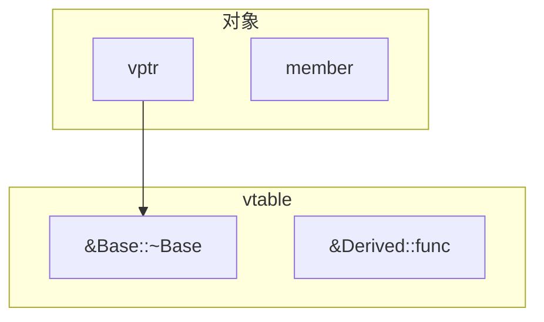

+++
title = "C++ Concepts"
description = "C++核心概念速查：RAII、移动语义、模板元编程、内存模型等关键概念详解"
date = 2026-01-26
weight = 5000
draft = false
[taxonomies]
tags = ["Glossary", "C++", "Modern C++", "Reference"]
+++

# C++ Concepts

本索引收录C++的核心概念，重点关注现代C++和高性能编程相关内容。

---

## 一、资源管理

### 1.1 RAII (Resource Acquisition Is Initialization)

**定义**：资源获取即初始化——资源的生命周期与对象的生命周期绑定。构造时获取资源，析构时释放资源。

**为什么重要**：
- 自动资源管理，无需手动释放
- 异常安全：即使发生异常，析构函数仍会执行
- 消除资源泄漏的根本解决方案

**示例**：
```cpp
// 文件RAII
class File {
    FILE* fp_;
public:
    File(const char* path, const char* mode) 
        : fp_(fopen(path, mode)) {
        if (!fp_) throw std::runtime_error("Cannot open file");
    }
    ~File() { if (fp_) fclose(fp_); }
    
    // 禁止拷贝
    File(const File&) = delete;
    File& operator=(const File&) = delete;
    
    // 允许移动
    File(File&& other) noexcept : fp_(other.fp_) {
        other.fp_ = nullptr;
    }
};

// 使用
void process() {
    File f("data.txt", "r");
    // 使用文件
}  // 自动关闭，即使抛出异常
```

**标准库RAII类**：
- `std::unique_ptr` / `std::shared_ptr`
- `std::lock_guard` / `std::unique_lock`
- `std::fstream`

**详细文章**：[C++智能指针底层与陷阱](@/articles/cpp/cpp-21-HFT-CPU亲和性与NUMA优化.md)

---

### 1.2 Smart Pointers (智能指针)

**定义**：自动管理动态内存的指针封装类。

**类型对比**：

| 类型 | 所有权 | 开销 | 使用场景 |
|------|--------|------|----------|
| `unique_ptr` | 独占 | 零开销 | 默认选择 |
| `shared_ptr` | 共享 | 引用计数 | 共享所有权 |
| `weak_ptr` | 观察 | 无 | 打破循环引用 |

**unique_ptr**：
```cpp
auto p = std::make_unique<MyClass>(args...);
// 不能拷贝
auto p2 = p;  // 编译错误
// 可以移动
auto p2 = std::move(p);  // p变为nullptr
```

**shared_ptr注意事项**：
```cpp
// 好：使用make_shared（一次分配）
auto p = std::make_shared<MyClass>();

// 坏：两次分配
auto p = std::shared_ptr<MyClass>(new MyClass());

// 陷阱：从this创建shared_ptr
class Widget : public std::enable_shared_from_this<Widget> {
    auto getShared() { return shared_from_this(); }
};
```

**详细文章**：[C++智能指针底层与陷阱](@/articles/cpp/cpp-21-HFT-CPU亲和性与NUMA优化.md)

---

### 1.3 Rule of Zero/Three/Five

**定义**：关于何时需要自定义特殊成员函数的规则。

**Rule of Zero**（首选）：
- 使用RAII包装资源
- 不需要自定义析构函数、拷贝/移动操作

```cpp
class Good {
    std::unique_ptr<Resource> resource_;
    std::vector<Data> data_;
    // 编译器生成的特殊函数足够
};
```

**Rule of Three**（C++98）：
如果需要自定义以下任一，通常需要全部自定义：
- 析构函数
- 拷贝构造函数
- 拷贝赋值运算符

**Rule of Five**（C++11）：
在Rule of Three基础上增加：
- 移动构造函数
- 移动赋值运算符

```cpp
class Resource {
    int* data_;
public:
    ~Resource() { delete[] data_; }
    
    // 拷贝
    Resource(const Resource& other) : data_(new int[*other.data_]) {
        std::copy(...);
    }
    Resource& operator=(const Resource& other) {
        if (this != &other) {
            delete[] data_;
            data_ = new int[...];
            std::copy(...);
        }
        return *this;
    }
    
    // 移动
    Resource(Resource&& other) noexcept : data_(other.data_) {
        other.data_ = nullptr;
    }
    Resource& operator=(Resource&& other) noexcept {
        if (this != &other) {
            delete[] data_;
            data_ = other.data_;
            other.data_ = nullptr;
        }
        return *this;
    }
};
```

---

## 二、移动语义

### 2.1 Move Semantics (移动语义)

**定义**：C++11引入，允许资源从一个对象"移动"到另一个对象，避免不必要的深拷贝。

**核心概念**：
- **左值(lvalue)**：有名字，可取地址
- **右值(rvalue)**：临时对象，即将销毁
- **右值引用(T&&)**：绑定到右值的引用

```cpp
std::string s1 = "Hello";
std::string s2 = s1;              // 拷贝：复制整个字符串
std::string s3 = std::move(s1);   // 移动：s1的资源转移给s3
// s1现在是有效但未定义状态（通常为空）
```

**实现移动**：
```cpp
class Buffer {
    char* data_;
    size_t size_;
public:
    // 移动构造：窃取资源
    Buffer(Buffer&& other) noexcept 
        : data_(other.data_), size_(other.size_) {
        other.data_ = nullptr;
        other.size_ = 0;
    }
    
    // 移动赋值
    Buffer& operator=(Buffer&& other) noexcept {
        if (this != &other) {
            delete[] data_;
            data_ = other.data_;
            size_ = other.size_;
            other.data_ = nullptr;
            other.size_ = 0;
        }
        return *this;
    }
};
```

**noexcept的重要性**：
- STL容器在扩容时只有noexcept移动才会使用移动
- 否则退化为拷贝以保证异常安全

**详细文章**：[深浅拷贝与移动语义详解](@/articles/cpp/cpp-14-异常处理机制与性能开销.md)

**C++ vs Python 深浅拷贝对比**：

| 概念 | C++ | Python |
|------|-----|--------|
| **变量本质** | 值（直接存储数据） | 引用（指向对象） |
| **赋值 `b = a`** | 值复制（调用拷贝构造） | 引用绑定（共享对象） |
| **浅拷贝** | 默认拷贝构造，指针成员指向同一地址 | `copy.copy()`，内部可变对象共享 |
| **深拷贝** | 需手动实现 | `copy.deepcopy()` |
| **危险** | double free（析构两次） | 无（引用计数管理） |

```cpp
// C++: 赋值 = 值复制（独立副本）
std::vector<int> a = {1, 2, 3};
std::vector<int> b = a;  // 拷贝构造，b 是独立副本
b[0] = 100;              // a 不受影响
```

```python
# Python: 赋值 = 引用绑定（共享对象）
a = [1, 2, 3]
b = a           # 同一对象
b[0] = 100      # a 也变了！
```

> 详细对比见 [Python核心概念索引 - 深浅拷贝](@/articles/00-glossary/glossary-06-python-concepts.md#5-3-shallow-copy-vs-deep-copy-qian-kao-bei-yu-shen-kao-bei)

---

### 2.2 Perfect Forwarding (完美转发)

**定义**：在模板中保持参数的值类别（左值/右值），将参数原样转发给其他函数。

```cpp
template<typename T>
void wrapper(T&& arg) {
    // arg是左值（有名字）
    // 但T&&可能是左值引用或右值引用（引用折叠）
    
    // 使用forward恢复原始值类别
    process(std::forward<T>(arg));
}

// 调用
wrapper(x);         // T=int&,  arg是左值引用，forward返回左值
wrapper(42);        // T=int,   arg是右值引用，forward返回右值
wrapper(std::move(x));  // T=int, forward返回右值
```

**引用折叠规则**：
```
T& &   → T&
T& &&  → T&
T&& &  → T&
T&& && → T&&
```

---

### 2.3 RVO/NRVO (返回值优化)

**定义**：编译器优化，直接在调用者栈上构造返回对象，避免拷贝/移动。

- **RVO**：返回临时对象
- **NRVO**：返回具名局部变量

```cpp
std::vector<int> createVector() {
    std::vector<int> v;
    v.push_back(1);
    v.push_back(2);
    return v;  // NRVO：直接在调用者栈上构造
}

auto v = createVector();  // 无拷贝、无移动（最优）
```

**C++17保证RVO（强制省略）**：
```cpp
Widget makeWidget() {
    return Widget();  // 保证无拷贝
}
```

**详细文章**：[深浅拷贝与移动语义详解](@/articles/cpp/cpp-14-异常处理机制与性能开销.md)

---

## 三、模板与类型

### 3.1 SFINAE (Substitution Failure Is Not An Error)

**定义**：模板参数替换失败不是编译错误，只是从重载候选中排除该模板。

```cpp
// 只对整数类型启用
template<typename T>
typename std::enable_if<std::is_integral<T>::value, T>::type
process(T value) {
    return value * 2;
}

// 只对浮点类型启用
template<typename T>
typename std::enable_if<std::is_floating_point<T>::value, T>::type
process(T value) {
    return value * 2.5;
}

process(10);    // 调用整数版本
process(10.0);  // 调用浮点版本
```

**C++20 Concepts（更好的方式）**：
```cpp
template<std::integral T>
T process(T value) { return value * 2; }

template<std::floating_point T>
T process(T value) { return value * 2.5; }
```

**详细文章**：[类型萃取与SFINAE详解](@/articles/cpp/cpp-18-HFT-SIMD编程详解.md)

---

### 3.2 constexpr (编译期计算)

**定义**：指示函数或变量可以在编译期求值。

**C++11/14/17/20演进**：
```cpp
// C++11: 只能有return语句
constexpr int factorial_11(int n) {
    return n <= 1 ? 1 : n * factorial_11(n - 1);
}

// C++14+: 可以有循环、局部变量
constexpr int factorial(int n) {
    int result = 1;
    for (int i = 2; i <= n; ++i)
        result *= i;
    return result;
}

// C++20: consteval强制编译期
consteval int must_be_compile_time(int n) {
    return n * 2;
}

// 使用
constexpr int x = factorial(5);  // 编译期计算
static_assert(x == 120);
```

**HFT应用**：
- 查找表在编译期生成
- 配置验证在编译期完成
- 减少运行时计算

**详细文章**：[编译期计算与constexpr](@/articles/cpp/cpp-17-HFT-Lock-Free数据结构详解.md)

---

### 3.3 Virtual Function & vtable (虚函数与虚表)

**定义**：C++运行时多态的实现机制。每个有虚函数的类有一个虚表(vtable)，每个对象有一个虚表指针(vptr)。

**内存布局**：



| 部分 | 内容 |
|------|------|
| **对象** | vptr (指向vtable), member (成员变量) |
| **vtable** | &Base::~Base (析构函数), &Derived::func (虚函数) |

**虚函数调用开销**：
1. 读取vptr（1次内存访问）
2. 读取vtable中的函数指针（1次内存访问）
3. 间接跳转（可能的分支预测失败）

**HFT中避免虚函数**：
```cpp
// CRTP替代方案（静态多态）
template<typename Derived>
class Base {
public:
    void execute() {
        static_cast<Derived*>(this)->executeImpl();
    }
};

class Strategy : public Base<Strategy> {
public:
    void executeImpl() { /* ... */ }
};
```

**详细文章**：[虚函数与多态底层实现](@/articles/cpp/cpp-16-智能指针底层与陷阱.md)

---

### 3.4 CRTP (Curiously Recurring Template Pattern)

**定义**：一种模板技术，派生类将自身作为模板参数传递给基类，实现静态多态（编译期多态）。

**为什么HFT使用CRTP**：
- 零运行时开销：无虚函数表查找
- 可内联：编译器可以看到具体实现
- 编译期绑定：分支预测更友好

**对比虚函数**：
```cpp
// 虚函数方案：运行时多态
class Strategy {
public:
    virtual void onMarketData(const MarketData& md) = 0;
    virtual ~Strategy() = default;
};

class MomentumStrategy : public Strategy {
public:
    void onMarketData(const MarketData& md) override {
        // 实现
    }
};

// 调用时有虚表查找开销
void process(Strategy* s, const MarketData& md) {
    s->onMarketData(md);  // 间接调用，~1-2ns + 可能的分支预测失败
}
```

```cpp
// CRTP方案：编译期多态
template<typename Derived>
class Strategy {
public:
    void onMarketData(const MarketData& md) {
        // 静态转换到派生类，编译期确定
        static_cast<Derived*>(this)->onMarketDataImpl(md);
    }
};

class MomentumStrategy : public Strategy<MomentumStrategy> {
public:
    void onMarketDataImpl(const MarketData& md) {
        // 实现
    }
};

// 调用时直接内联，零开销
template<typename S>
void process(S& strategy, const MarketData& md) {
    strategy.onMarketData(md);  // 直接调用，可内联
}
```

**CRTP的实际应用**：
1. **策略引擎**：不同策略编译期绑定
2. **事件处理器**：事件分发零开销
3. **Mixin模式**：向类添加功能

```cpp
// Mixin模式：添加计数功能
template<typename Derived>
class Counter {
    int count_ = 0;
public:
    void incrementCount() { ++count_; }
    int getCount() const { return count_; }
};

class MyClass : public Counter<MyClass> {
    // 自动获得计数能力
};
```

---

### 3.5 std::string_view (C++17)

**定义**：对字符串的非拥有只读视图，不分配内存，只存储指针和长度。

**为什么HFT必须使用**：
- `std::string`拷贝会分配内存（malloc开销不确定）
- `string_view`是零拷贝的
- 可以指向任何连续字符数据

```cpp
// 坏：创建临时string
void processOrder(const std::string& symbol) {  // 可能需要拷贝
    // ...
}
processOrder("AAPL");  // 从const char*构造string

// 好：使用string_view
void processOrder(std::string_view symbol) {  // 零拷贝
    // ...
}
processOrder("AAPL");  // 直接指向字符串字面量
```

**协议解析中的应用**：
```cpp
// 零拷贝解析ITCH消息
void parseMessage(const char* buffer, size_t len) {
    std::string_view msg(buffer, len);
    
    // 零拷贝提取字段
    std::string_view symbol = msg.substr(10, 8);
    
    // 无需分配内存，直接指向原始buffer
}
```

**注意事项**：
```cpp
// 危险：string_view不拥有数据
std::string_view dangerous() {
    std::string s = "hello";
    return std::string_view(s);  // 返回后s被销毁，悬垂引用！
}

// 安全：只在数据生命周期内使用
void safe(const std::string& s) {
    std::string_view sv = s;  // OK，s的生命周期覆盖sv
    process(sv);
}
```

---

## 四、并发

### 4.1 Memory Order (内存序)

**定义**：C++11原子操作的顺序约束，控制多线程中操作的可见性和重排序限制。

**为什么需要理解内存序**：
- 编译器和CPU会重排序指令以提高性能
- 多核CPU有各自的缓存，对内存的视图不同
- 不正确的内存序会导致难以调试的并发bug
- HFT系统需要在正确性和性能之间做权衡

| 内存序 | 含义 | x86开销 | ARM开销 | 使用场景 |
|--------|------|---------|---------|----------|
| `relaxed` | 只保证原子性 | 零 | 零 | 计数器、统计 |
| `acquire` | 之后的读写不能前移 | 零 | 屏障 | 读取同步标志 |
| `release` | 之前的读写不能后移 | 零 | 屏障 | 写入同步标志 |
| `acq_rel` | acquire + release | 零 | 屏障 | 读-修改-写 |
| `seq_cst` | 全局顺序一致 | mfence | 屏障 | 默认，最安全 |

**深入理解各内存序**：

**1. relaxed - 最弱保证**
```cpp
std::atomic<int> counter{0};

// 只需要原子性，不关心顺序
void increment() {
    counter.fetch_add(1, std::memory_order_relaxed);
    // 其他线程可能先看到这个增加，后看到之前的操作
}
```

**2. acquire/release - 同步对**
```cpp
std::atomic<bool> ready{false};
int data = 0;

// 线程1（生产者）
void producer() {
    data = 42;                                    // ① 普通写
    ready.store(true, std::memory_order_release); // ② release
    // release保证：①不会被重排到②之后
}

// 线程2（消费者）
void consumer() {
    while (!ready.load(std::memory_order_acquire)); // ③ acquire
    int x = data;                                   // ④ 普通读
    // acquire保证：④不会被重排到③之前
    // 结合release：如果③看到true，④保证看到42
    assert(x == 42);  // 保证成功！
}
```

**3. seq_cst - 最强保证**
```cpp
std::atomic<bool> x{false}, y{false};
int z = 0;

// 使用seq_cst，所有线程看到相同的全局顺序
void thread1() {
    x.store(true, std::memory_order_seq_cst);
}

void thread2() {
    y.store(true, std::memory_order_seq_cst);
}

void thread3() {
    while (!x.load(std::memory_order_seq_cst));
    if (y.load(std::memory_order_seq_cst)) z++;
}

void thread4() {
    while (!y.load(std::memory_order_seq_cst));
    if (x.load(std::memory_order_seq_cst)) z++;
}
// seq_cst保证：z最终至少为1
```

**HFT中的内存序选择**：
```cpp
// SPSC队列中的正确使用
template<typename T, size_t Size>
class SPSCQueue {
    alignas(64) std::atomic<size_t> head_{0};
    alignas(64) std::atomic<size_t> tail_{0};
    T buffer_[Size];
    
public:
    bool push(const T& item) {
        size_t tail = tail_.load(std::memory_order_relaxed);  // 只有生产者写tail
        size_t next = (tail + 1) % Size;
        
        // acquire：确保看到消费者对head的最新写入
        if (next == head_.load(std::memory_order_acquire))
            return false;
        
        buffer_[tail] = item;  // 必须在tail更新之前完成
        
        // release：确保buffer写入对消费者可见
        tail_.store(next, std::memory_order_release);
        return true;
    }
};
```

**详细文章**：[HFT-Lock-Free数据结构详解](@/articles/cpp/cpp-22-HFT高精度时间测量.md)

---

### 4.2 std::atomic

**定义**：C++11提供的原子类型，保证操作的原子性。

```cpp
std::atomic<int> counter{0};

// 原子操作
counter++;                              // 原子递增
counter.fetch_add(1);                   // 同上，可指定内存序
counter.store(10);                      // 原子写
int val = counter.load();               // 原子读

// CAS操作
int expected = 0;
bool success = counter.compare_exchange_strong(expected, 1);
```

**无锁判断**：
```cpp
std::atomic<MyStruct> x;
if (x.is_lock_free()) {
    // 真正无锁
} else {
    // 内部可能使用互斥锁
}
```

---

### 4.3 std::mutex & std::lock_guard

**定义**：C++11互斥量和自动锁管理。

```cpp
std::mutex mtx;
std::vector<int> data;

void safeAdd(int val) {
    std::lock_guard<std::mutex> lock(mtx);  // 构造时加锁
    data.push_back(val);
}  // 析构时自动解锁

// C++17简化
void safeAdd(int val) {
    std::scoped_lock lock(mtx);  // 可锁多个互斥量
    data.push_back(val);
}
```

**死锁避免**：
```cpp
std::mutex m1, m2;

// 坏：可能死锁
void bad() {
    std::lock_guard l1(m1);
    std::lock_guard l2(m2);  // 如果其他线程以相反顺序锁
}

// 好：同时锁定
void good() {
    std::scoped_lock lock(m1, m2);  // 原子地锁定两个
}
```

---

## 五、现代C++特性

### 5.1 Lambda Expression (Lambda表达式)

**定义**：匿名函数对象，可以捕获外部变量。

```cpp
// 基本语法
auto f = [capture](params) -> return_type { body };

// 捕获方式
int x = 1, y = 2;
auto byValue = [x, y]() { return x + y; };     // 值捕获
auto byRef = [&x, &y]() { x++; y++; };         // 引用捕获
auto allByValue = [=]() { return x + y; };     // 全部值捕获
auto allByRef = [&]() { x++; y++; };           // 全部引用捕获
auto mixed = [=, &y]() { return x + y++; };    // 混合

// C++14: 泛型lambda
auto add = [](auto a, auto b) { return a + b; };

// C++14: 初始化捕获（移动捕获）
auto p = std::make_unique<int>(42);
auto f = [p = std::move(p)]() { return *p; };
```

**详细文章**：[Lambda与函数对象详解](@/articles/cpp/cpp-36-C++面试题-内存与对象模型.md)

---

### 5.2 std::optional (C++17)

**定义**：表示可能存在也可能不存在的值。

```cpp
std::optional<int> divide(int a, int b) {
    if (b == 0) return std::nullopt;
    return a / b;
}

auto result = divide(10, 2);
if (result) {
    std::cout << *result << std::endl;  // 5
}

// 或使用value_or
int val = divide(10, 0).value_or(-1);  // -1
```

---

### 5.3 std::variant (C++17)

**定义**：类型安全的联合体。

```cpp
std::variant<int, double, std::string> v;

v = 42;
v = 3.14;
v = "hello";

// 访问
if (std::holds_alternative<int>(v)) {
    int i = std::get<int>(v);
}

// 访问者模式
std::visit([](auto&& arg) {
    using T = std::decay_t<decltype(arg)>;
    if constexpr (std::is_same_v<T, int>) {
        std::cout << "int: " << arg << std::endl;
    } else if constexpr (std::is_same_v<T, double>) {
        std::cout << "double: " << arg << std::endl;
    }
}, v);
```

---

### 5.4 Concepts (C++20)

**定义**：约束模板参数的语言特性，替代SFINAE提供更清晰的错误信息和更简洁的语法。

**为什么重要**：
- 比SFINAE可读性强100倍
- 编译错误信息更友好
- 可组合和复用约束

**基本语法**：
```cpp
// 定义concept
template<typename T>
concept Arithmetic = std::is_arithmetic_v<T>;

template<typename T>
concept Hashable = requires(T a) {
    { std::hash<T>{}(a) } -> std::convertible_to<std::size_t>;
};

// 使用concept约束
template<Arithmetic T>
T add(T a, T b) { return a + b; }

// 或者简洁语法
auto add(Arithmetic auto a, Arithmetic auto b) {
    return a + b;
}

// requires子句
template<typename T>
requires Arithmetic<T> && sizeof(T) >= 4
T multiply(T a, T b) { return a * b; }
```

**requires表达式**：
```cpp
template<typename T>
concept Container = requires(T c) {
    c.begin();           // 简单要求：表达式有效
    c.end();
    c.size();
    typename T::value_type;  // 类型要求
    { c.empty() } -> std::same_as<bool>;  // 复合要求
};

template<Container C>
void process(const C& container) {
    for (const auto& item : container) {
        // ...
    }
}
```

**标准库concepts**：
```cpp
#include <concepts>

std::integral<T>           // 整数类型
std::floating_point<T>     // 浮点类型
std::same_as<T, U>         // 类型相同
std::derived_from<T, U>    // 继承关系
std::convertible_to<T, U>  // 可转换
std::invocable<F, Args...> // 可调用
```

**详细文章**：[C++20/23新特性详解](@/articles/cpp/cpp-35-C++面试题-语言基础篇.md)

---

### 5.5 Coroutines (C++20协程)

**定义**：可以暂停和恢复执行的函数。通过`co_await`、`co_yield`、`co_return`关键字使用。

**为什么HFT关注**：
- 用户态调度，无上下文切换
- 可以实现高效的异步IO
- 替代回调地狱

**协程类型**：
```cpp
// 生成器：co_yield
generator<int> range(int start, int end) {
    for (int i = start; i < end; i++) {
        co_yield i;
    }
}

// 异步任务：co_await
task<int> async_compute() {
    co_await some_async_operation();
    co_return 42;
}
```

**协程组件**：
```cpp
// 简化的协程promise类型
template<typename T>
struct task {
    struct promise_type {
        T value;
        
        task get_return_object() {
            return task{std::coroutine_handle<promise_type>::from_promise(*this)};
        }
        
        std::suspend_never initial_suspend() { return {}; }
        std::suspend_always final_suspend() noexcept { return {}; }
        
        void return_value(T v) { value = v; }
        void unhandled_exception() { std::terminate(); }
    };
    
    std::coroutine_handle<promise_type> handle;
    
    T get() {
        return handle.promise().value;
    }
};
```

**协程状态机**：
```
协程调用 → 分配帧 → 执行到suspend → 返回handle
              ↓
         handle.resume() → 继续执行 → suspend或return
              ↓
         handle.destroy() → 释放帧
```

**详细文章**：[C++协程与用户态调度](@/articles/cpp/cpp-43-C++面试题-内存与对象模型.md)

---

## 六、延伸阅读

- [Python核心概念索引](@/articles/00-glossary/glossary-06-python-concepts.md)
- [HFT核心概念索引](@/articles/00-glossary/glossary-04-hft-concepts.md)
- [C++面试题汇总](@/articles/cpp/cpp-05-性能优化技术.md)
- [C++20/23新特性详解](@/articles/cpp/cpp-35-C++面试题-语言基础篇.md)

---

## 相关文章

- [上一篇：HFT Concepts](@/articles/00-glossary/glossary-04-hft-concepts.md)
- [下一篇：Python Concepts](@/articles/00-glossary/glossary-06-python-concepts.md)
