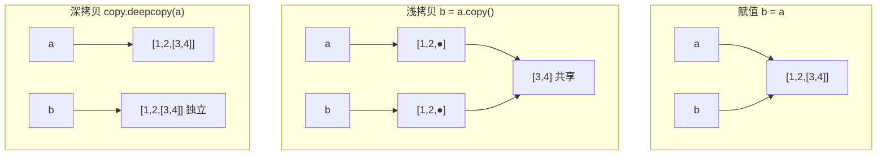
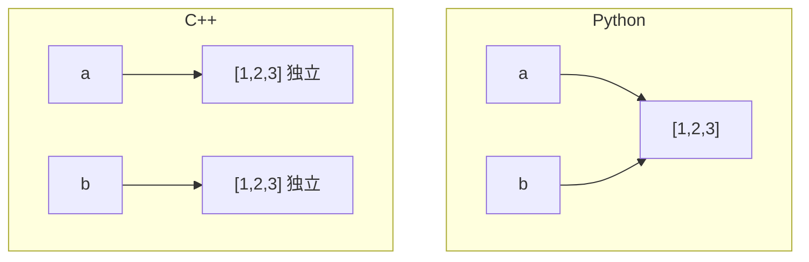
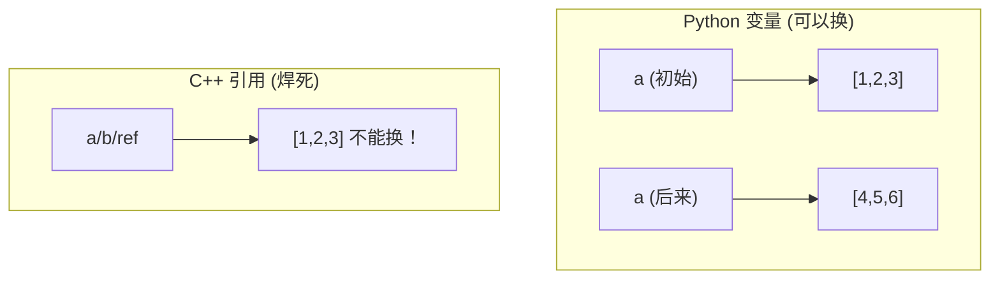
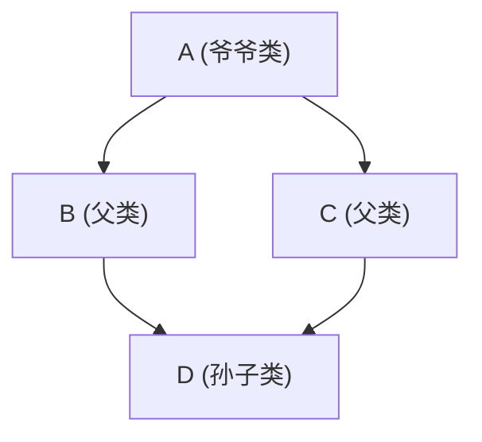

+++
title = "Python Concepts"
description = "Python核心概念速查：GIL、装饰器、生成器、深浅拷贝、模块变量、Python与C++易混淆概念对比详解"
date = 2026-01-26
weight = 6000
draft = false
[taxonomies]
tags = ["Glossary", "Python", "C++", "Comparison", "Reference"]
+++

# Python Concepts

本索引收录Python的核心概念，涵盖语言特性、并发模型、性能优化等。

---

## 一、语言核心

### 1.1 GIL (Global Interpreter Lock)

**定义**：CPython解释器中的全局互斥锁，确保同一时刻只有一个线程执行Python字节码。

**影响**：
- CPU密集型任务无法通过多线程并行加速
- I/O密集型任务不受影响（I/O时释放GIL）

**绕过GIL的方法**：

| 方法 | 适用场景 | 复杂度 |
|------|----------|--------|
| multiprocessing | CPU密集 | 低 |
| C扩展(释放GIL) | 计算密集 | 高 |
| Cython | 计算密集 | 中 |
| Numba | 数值计算 | 低 |

```python
# 多进程绕过GIL
from multiprocessing import Pool

def cpu_intensive(x):
    return sum(i*i for i in range(x))

with Pool(4) as p:
    results = p.map(cpu_intensive, [10**6]*4)  # 4核并行
```

**C扩展释放GIL**：
```c
// 在C代码中
Py_BEGIN_ALLOW_THREADS
// 这里可以并行执行
Py_END_ALLOW_THREADS
```

**详细文章**：[Python性能优化-多进程与GIL](@/articles/python/py-50-Python内存优化详解.md)

---

### 1.2 Decorator (装饰器)

**定义**：修改或增强函数/类行为的语法糖。本质是接受函数并返回函数的高阶函数。

**基本原理**：
```python
@decorator
def func():
    pass

# 等价于
def func():
    pass
func = decorator(func)
```

**实现装饰器**：
```python
import functools

# 基础装饰器
def timer(func):
    @functools.wraps(func)  # 保留原函数元信息
    def wrapper(*args, **kwargs):
        import time
        start = time.perf_counter()
        result = func(*args, **kwargs)
        print(f"{func.__name__}: {time.perf_counter()-start:.4f}s")
        return result
    return wrapper

# 带参数的装饰器
def retry(max_attempts=3, exceptions=(Exception,)):
    def decorator(func):
        @functools.wraps(func)
        def wrapper(*args, **kwargs):
            for attempt in range(max_attempts):
                try:
                    return func(*args, **kwargs)
                except exceptions as e:
                    if attempt == max_attempts - 1:
                        raise
        return wrapper
    return decorator

@timer
@retry(max_attempts=5, exceptions=(IOError,))
def fetch_data():
    ...
```

**类装饰器**：
```python
def singleton(cls):
    instances = {}
    def get_instance(*args, **kwargs):
        if cls not in instances:
            instances[cls] = cls(*args, **kwargs)
        return instances[cls]
    return get_instance

@singleton
class Database:
    pass
```

**详细文章**：[Python装饰器详解](@/articles/python/py-04-装饰器详解.md)

---

### 1.3 Generator (生成器)

**定义**：使用`yield`关键字的函数，返回一个迭代器。按需产生值，而非一次性生成。

**优势**：
- 内存效率：处理大数据集无需全部加载
- 惰性求值：只在需要时计算
- 可以表示无限序列

```python
# 生成器函数
def count_up(start=0):
    while True:
        yield start
        start += 1

# 生成器表达式
squares = (x**2 for x in range(10))  # 不占用内存

# 处理大文件
def read_large_file(path):
    with open(path) as f:
        for line in f:
            yield line.strip()

# 内存对比
sum([x**2 for x in range(10**8)])  # 列表推导：占用GB内存
sum(x**2 for x in range(10**8))    # 生成器：O(1)内存
```

**yield from（委托生成器）**：
```python
def chain(*iterables):
    for it in iterables:
        yield from it

list(chain([1,2], [3,4]))  # [1, 2, 3, 4]
```

---

### 1.4 Context Manager (上下文管理器)

**定义**：实现`__enter__`和`__exit__`方法的对象，用于资源管理。

```python
# 类实现
class FileManager:
    def __init__(self, path, mode):
        self.path = path
        self.mode = mode
    
    def __enter__(self):
        self.file = open(self.path, self.mode)
        return self.file
    
    def __exit__(self, exc_type, exc_val, exc_tb):
        self.file.close()
        return False  # 不吞掉异常

# 使用contextlib简化
from contextlib import contextmanager

@contextmanager
def file_manager(path, mode):
    f = open(path, mode)
    try:
        yield f
    finally:
        f.close()

# 使用
with file_manager('data.txt', 'r') as f:
    content = f.read()
```

**详细文章**：[Python上下文管理器](@/articles/python/py-06-上下文管理器.md)

---

### 1.5 Walrus Operator := (海象运算符)

**定义**：Python 3.8引入的赋值表达式，允许在表达式中同时赋值和求值。

**为什么有用**：
- 减少重复计算
- 代码更简洁
- 在条件表达式中特别有用

```python
# 传统方式：计算两次或额外变量
data = get_data()
if data:
    process(data)

# 海象运算符：一次赋值
if (data := get_data()):
    process(data)

# 在循环中
while (line := file.readline()):
    process(line)

# 在推导式中
results = [y for x in data if (y := expensive_func(x)) > threshold]

# 在匹配模式中（Python 3.10+）
match get_status():
    case status if (code := status.code) > 400:
        handle_error(code)
```

**注意**：需要括号包围赋值表达式

---

### 1.6 Dataclass (数据类)

**定义**：Python 3.7引入的装饰器，自动生成`__init__`、`__repr__`、`__eq__`等方法。

**为什么使用**：
- 减少样板代码
- 类型注解清晰
- 支持不可变、排序等特性

```python
from dataclasses import dataclass, field
from typing import List

@dataclass
class Order:
    order_id: int
    symbol: str
    price: float
    quantity: int
    side: str = "BUY"  # 默认值
    
# 自动生成的方法
order = Order(1, "AAPL", 150.0, 100)
print(order)  # Order(order_id=1, symbol='AAPL', price=150.0, quantity=100, side='BUY')
order2 = Order(1, "AAPL", 150.0, 100)
print(order == order2)  # True
```

**高级特性**：
```python
@dataclass(frozen=True)  # 不可变
class ImmutableOrder:
    order_id: int
    price: float

@dataclass(order=True)  # 支持比较运算符
class PricedItem:
    price: float
    name: str = field(compare=False)  # 不参与比较

# 带默认工厂的字段
@dataclass
class Portfolio:
    holdings: List[str] = field(default_factory=list)

# __post_init__后处理
@dataclass
class Trade:
    price: float
    quantity: int
    value: float = field(init=False)
    
    def __post_init__(self):
        self.value = self.price * self.quantity
```

**与NamedTuple对比**：
| 特性 | dataclass | NamedTuple |
|------|-----------|------------|
| 可变 | 默认可变 | 不可变 |
| 继承 | 支持 | 有限 |
| 内存 | 正常 | 更少 |
| 解包 | 不支持 | 支持 |

---

## 二、面向对象

### 2.1 Metaclass (元类)

**定义**：类的类。控制类的创建过程。

**类创建过程**：
```
定义class语句
    ↓
收集类属性到字典
    ↓
确定元类（默认type）
    ↓
调用元类创建类对象
    ↓
MyClass = type('MyClass', (bases,), attrs)
```

**自定义元类**：
```python
class SingletonMeta(type):
    _instances = {}
    
    def __call__(cls, *args, **kwargs):
        if cls not in cls._instances:
            cls._instances[cls] = super().__call__(*args, **kwargs)
        return cls._instances[cls]

class Database(metaclass=SingletonMeta):
    pass

db1 = Database()
db2 = Database()
assert db1 is db2  # 同一实例
```

**详细文章**：[Python元类与元编程](@/articles/python/py-19-元类与元编程.md)

---

### 2.2 Descriptor (描述符)

**定义**：实现`__get__`、`__set__`或`__delete__`方法的对象，可以控制属性访问。

```python
class Validator:
    def __init__(self, min_value, max_value):
        self.min_value = min_value
        self.max_value = max_value
    
    def __set_name__(self, owner, name):
        self.name = name
    
    def __get__(self, obj, type=None):
        if obj is None:
            return self
        return obj.__dict__.get(self.name)
    
    def __set__(self, obj, value):
        if not self.min_value <= value <= self.max_value:
            raise ValueError(f"{self.name} must be between {self.min_value} and {self.max_value}")
        obj.__dict__[self.name] = value

class Order:
    price = Validator(0, 10000)
    quantity = Validator(1, 1000)
    
order = Order()
order.price = 100      # OK
order.price = -1       # ValueError
```

**property也是描述符**：
```python
class Circle:
    def __init__(self, radius):
        self._radius = radius
    
    @property
    def radius(self):
        return self._radius
    
    @radius.setter
    def radius(self, value):
        if value < 0:
            raise ValueError("Radius must be positive")
        self._radius = value
```

---

### 2.3 __slots__

**定义**：限制实例属性，避免使用`__dict__`，节省内存。

```python
class Point:
    __slots__ = ('x', 'y')
    
    def __init__(self, x, y):
        self.x = x
        self.y = y

p = Point(1, 2)
p.z = 3  # AttributeError: 'Point' object has no attribute 'z'

# 内存节省
import sys
class WithDict:
    def __init__(self):
        self.x = 1

class WithSlots:
    __slots__ = ('x',)
    def __init__(self):
        self.x = 1

print(sys.getsizeof(WithDict()))   # ~56 bytes
print(sys.getsizeof(WithSlots()))  # ~48 bytes
# 大量实例时差异明显
```

**详细文章**：[Python内存优化详解](@/articles/python/py-51-NumPy高性能编程.md)

---

## 三、并发模型

### 3.1 Threading vs Multiprocessing

**对比**：

| 特性 | threading | multiprocessing |
|------|-----------|-----------------|
| 内存 | 共享 | 独立 |
| GIL | 受限 | 不受限 |
| 开销 | 低 | 高 |
| 通信 | 直接访问 | 需要序列化 |
| 适用 | I/O密集 | CPU密集 |

```python
# 多线程（I/O密集）
from concurrent.futures import ThreadPoolExecutor

def download(url):
    # I/O操作，GIL会释放
    return requests.get(url)

with ThreadPoolExecutor(max_workers=10) as executor:
    results = executor.map(download, urls)

# 多进程（CPU密集）
from concurrent.futures import ProcessPoolExecutor

def compute(data):
    # CPU计算，需要绕过GIL
    return heavy_computation(data)

with ProcessPoolExecutor(max_workers=4) as executor:
    results = executor.map(compute, data_list)
```

---

### 3.2 asyncio (异步IO)

**定义**：Python的异步编程框架，使用协程处理并发I/O。

**核心概念**：
- **coroutine**：async def定义的协程函数
- **await**：暂停协程，等待结果
- **event loop**：调度协程执行

```python
import asyncio

async def fetch(url):
    async with aiohttp.ClientSession() as session:
        async with session.get(url) as response:
            return await response.text()

async def main():
    # 并发执行多个协程
    tasks = [fetch(url) for url in urls]
    results = await asyncio.gather(*tasks)
    return results

# 运行
results = asyncio.run(main())
```

**与多线程对比**：
- asyncio：单线程，协程切换开销极低
- 多线程：线程切换有系统开销
- asyncio更适合大量并发连接

**详细文章**：[Python异步编程详解](@/articles/python/py-56-高难度面试问题.md)

---

## 四、性能优化

### 4.1 NumPy Vectorization (向量化)

**定义**：使用NumPy的数组操作替代Python循环，利用底层C实现获得高性能。

```python
import numpy as np

# 慢：Python循环
def slow_sum(arr):
    total = 0
    for x in arr:
        total += x * x
    return total

# 快：向量化
def fast_sum(arr):
    return np.sum(arr ** 2)

# 性能对比（n=10^6）
# slow_sum: ~500ms
# fast_sum: ~5ms（100倍加速）
```

**向量化技巧**：
```python
# 条件操作
result = np.where(arr > 0, arr, 0)  # 替代if-else

# 布尔索引
positive = arr[arr > 0]  # 替代filter

# 广播
# (1000, 1) + (1, 1000) → (1000, 1000)
row = np.arange(1000).reshape(-1, 1)
col = np.arange(1000).reshape(1, -1)
matrix = row + col  # 无需循环
```

**详细文章**：[NumPy高性能编程](@/articles/python/py-52-Pandas性能优化.md)

---

### 4.2 Cython

**定义**：Python的超集，可以编译为C代码，获得接近C的性能。

```python
# pure_python.py
def fib(n):
    if n <= 1:
        return n
    return fib(n-1) + fib(n-2)

# cython_version.pyx
cpdef int fib(int n):
    if n <= 1:
        return n
    return fib(n-1) + fib(n-2)

# 性能对比
# Python: fib(35) ≈ 5s
# Cython: fib(35) ≈ 0.1s
```

**类型声明加速**：
```cython
import numpy as np
cimport numpy as cnp

def fast_sum(cnp.ndarray[cnp.float64_t, ndim=1] arr):
    cdef int i
    cdef int n = arr.shape[0]
    cdef double total = 0.0
    
    for i in range(n):
        total += arr[i] * arr[i]
    
    return total
```

**详细文章**：[Python性能优化-Cython详解](@/articles/python/py-48-Python性能优化-Numba详解.md)

---

### 4.3 Numba

**定义**：JIT编译器，使用LLVM将Python函数编译为机器码。

```python
from numba import jit

@jit(nopython=True)
def fast_sum(arr):
    total = 0.0
    for i in range(len(arr)):
        total += arr[i] * arr[i]
    return total

# 第一次调用时编译，之后接近C速度
result = fast_sum(np.random.randn(10**6))
```

**并行加速**：
```python
from numba import jit, prange

@jit(nopython=True, parallel=True)
def parallel_sum(arr):
    total = 0.0
    for i in prange(len(arr)):  # 并行循环
        total += arr[i] * arr[i]
    return total
```

**详细文章**：[Python性能优化-Numba详解](@/articles/python/py-49-Python性能优化-多进程与GIL.md)

---

### 4.4 functools.lru_cache (缓存装饰器)

**定义**：标准库提供的记忆化装饰器，缓存函数返回值避免重复计算。

**为什么重要**：
- 零成本优化重复计算
- 动态规划的简洁实现
- 数据库查询缓存

```python
from functools import lru_cache

@lru_cache(maxsize=128)  # 最多缓存128个结果
def fibonacci(n):
    if n < 2:
        return n
    return fibonacci(n - 1) + fibonacci(n - 2)

# 无缓存：O(2^n)
# 有缓存：O(n)

# 查看缓存统计
print(fibonacci.cache_info())
# CacheInfo(hits=96, misses=100, maxsize=128, currsize=100)

# 清除缓存
fibonacci.cache_clear()
```

**Python 3.9+ 的改进**：
```python
from functools import cache  # 无大小限制的lru_cache

@cache
def expensive_computation(x, y):
    return x ** y
```

**缓存要求**：
- 参数必须是可哈希的（hashable）
- 函数必须是纯函数（相同输入产生相同输出）

```python
# 错误：列表不可哈希
@lru_cache
def bad_function(data: list):  # TypeError
    return sum(data)

# 正确：转换为元组
@lru_cache
def good_function(data: tuple):
    return sum(data)
```

---

### 4.5 Type Hints (类型注解)

**定义**：Python 3.5+引入的类型标注系统，提供静态类型检查能力。

**为什么重要**：
- IDE智能提示
- 静态分析捕获错误
- 代码文档化
- 量化项目必须使用

```python
from typing import List, Dict, Optional, Union, Callable, TypeVar

# 基本类型
def greet(name: str) -> str:
    return f"Hello, {name}"

# 容器类型
def process_orders(orders: List[Dict[str, float]]) -> float:
    return sum(o['price'] for o in orders)

# 可选类型（可能为None）
def find_order(order_id: int) -> Optional[Order]:
    return orders.get(order_id)

# 联合类型
def parse_value(v: Union[int, str]) -> int:
    return int(v)

# Python 3.10+ 简化语法
def parse_value(v: int | str) -> int:
    return int(v)

# 可调用类型
def apply(func: Callable[[int, int], int], a: int, b: int) -> int:
    return func(a, b)

# 泛型
T = TypeVar('T')
def first(items: List[T]) -> T:
    return items[0]
```

**dataclass与类型注解**：
```python
from dataclasses import dataclass
from typing import ClassVar

@dataclass
class Order:
    symbol: str
    price: float
    quantity: int
    side: str = "BUY"
    
    # 类变量（不是实例字段）
    counter: ClassVar[int] = 0
```

**运行时类型检查**：
```python
# pydantic库提供运行时验证
from pydantic import BaseModel

class Order(BaseModel):
    symbol: str
    price: float
    quantity: int

order = Order(symbol="AAPL", price="150.5", quantity=100)
# price自动转换为float
print(order.price)  # 150.5
```

---

## 五、内存管理

### 5.1 Reference Counting (引用计数)

**定义**：Python主要的内存管理机制。每个对象维护引用计数，计数为0时立即释放。

```python
import sys

a = [1, 2, 3]
print(sys.getrefcount(a))  # 2 (a + getrefcount参数)

b = a
print(sys.getrefcount(a))  # 3

del b
print(sys.getrefcount(a))  # 2
```

**循环引用问题**：
```python
class Node:
    def __init__(self):
        self.ref = None

a = Node()
b = Node()
a.ref = b
b.ref = a  # 循环引用

del a, b  # 引用计数不为0，需要GC处理
```

---

### 5.2 Garbage Collection (垃圾回收)

**定义**：处理引用计数无法回收的循环引用。

**分代回收**：
- **0代**：新对象，频繁检查
- **1代**：存活过一次GC
- **2代**：长寿对象，很少检查

```python
import gc

# 手动触发GC
gc.collect()

# 查看GC统计
print(gc.get_stats())

# 禁用GC（HFT场景）
gc.disable()
```

**详细文章**：[Python垃圾回收机制与内存泄漏防范](@/articles/python/py-18-垃圾回收与内存.md)

---

### 5.3 Shallow Copy vs Deep Copy (浅拷贝与深拷贝)

**一句话理解**：
- **浅拷贝**：复制"外壳"，里面的东西还是共用的
- **深拷贝**：连"壳"带"馅"全部复制一份新的

**用图说话**（原始数据：`a = [1, 2, [3, 4]]`）：

| 操作 | 结果 | 说明 |
|------|------|------|
| **赋值** `b = a` | a 和 b 指向同一个列表 | 改 b 就是改 a |
| **浅拷贝** `b = a.copy()` | 外层是新列表，但内层 [3,4] 共享 | 改 b[2] 会影响 a[2] |
| **深拷贝** `b = copy.deepcopy(a)` | 完全独立的副本 | 改 b 不会影响 a |



**代码验证**：

```python
import copy

original = [1, 2, [3, 4]]

# 赋值：同一个对象
alias = original
alias[0] = 100
print(original)  # [100, 2, [3, 4]] ← 被改了！

# 浅拷贝：外层独立，内层共享
original = [1, 2, [3, 4]]
shallow = original.copy()      # 或 list(original) 或 original[:]
shallow[0] = 100               # 改外层
print(original)                # [1, 2, [3, 4]] ← 没变
shallow[2][0] = 999            # 改内层
print(original)                # [1, 2, [999, 4]] ← 被改了！

# 深拷贝：完全独立
original = [1, 2, [3, 4]]
deep = copy.deepcopy(original)
deep[2][0] = 999
print(original)                # [1, 2, [3, 4]] ← 没变！
```

**什么时候用哪个？**

| 场景 | 用什么 | 原因 |
|------|--------|------|
| 只是起个别名 | `b = a` | 不需要复制 |
| 列表里只有数字/字符串 | 浅拷贝 | 数字字符串不可变，不怕共享 |
| 列表里还有列表/字典 | 深拷贝 | 防止内层被意外修改 |
| 性能敏感 | 浅拷贝 | 深拷贝慢 100 倍 |

**常见浅拷贝写法**：

```python
# 以下都是浅拷贝，效果一样
b = a.copy()           # 最直观
b = list(a)            # 构造函数
b = a[:]               # 切片
b = [*a]               # 解包
b = copy.copy(a)       # copy模块
```

**经典坑：二维列表浅拷贝**

```python
# 创建 3x3 矩阵
matrix = [[0] * 3 for _ in range(3)]
backup = matrix.copy()  # 浅拷贝！

backup[0][0] = 999
print(matrix[0][0])     # 999 ← 原矩阵也变了！

# 正确做法
backup = copy.deepcopy(matrix)
```

---

### 5.4 Python vs C++ 深浅拷贝对比

**核心区别（必须理解）**：

```
Python: 变量是"标签"，贴在对象上
        b = a 相当于给同一个对象贴了两个标签

C++:    变量是"盒子"，装着数据
        b = a 相当于把 a 盒子里的东西复制一份到 b 盒子
```

**一图看懂区别**：

| 语言 | 代码 | 赋值后关系 | 改 b 影响 a？ |
|------|------|----------|--------------|
| **Python** | `a = [1,2,3]; b = a` | a 和 b 指向同一个对象 | ✅ 是 |
| **C++** | `vector<int> a = {1,2,3}; vector<int> b = a;` | a 和 b 是独立副本 | ❌ 否 |



**代码对比**：

```python
# Python: b = a 后，改 b 会影响 a
a = [1, 2, 3]
b = a
b[0] = 100
print(a)  # [100, 2, 3] ← a 也变了！
```

```cpp
// C++: b = a 后，改 b 不影响 a
vector<int> a = {1, 2, 3};
vector<int> b = a;  // 复制了一份
b[0] = 100;
cout << a[0];  // 1 ← a 没变！
```

**Python 开发者转 C++ 常见困惑**：

| 问题 | 答案 |
|------|------|
| C++ 的 `b = a` 是浅拷贝吗？ | 不是！是值复制，相当于 Python 的深拷贝 |
| C++ 什么时候有浅拷贝问题？ | 类里有指针成员时，默认拷贝只复制指针地址 |
| C++ 需要手写深拷贝吗？ | 用标准容器（vector/string）不需要，它们自动处理 |

**C++ 浅拷贝问题只出现在自定义类有指针时**：

```cpp
// 这种情况才需要担心（自己管理内存）
class MyClass {
    int* data;  // 裸指针！危险
public:
    MyClass(int v) : data(new int(v)) {}
    ~MyClass() { delete data; }
    // 默认拷贝构造只复制指针，两个对象指向同一块内存
    // 析构时会 delete 两次 → 崩溃！
};

// 现代 C++ 解决方案：用智能指针，不用手动管理
class SafeClass {
    std::unique_ptr<int> data;  // 自动管理
public:
    SafeClass(int v) : data(std::make_unique<int>(v)) {}
    // 不需要写析构函数，不需要担心拷贝问题
};
```

**快速对照表**：

| 操作 | Python 效果 | C++ 效果 |
|------|-------------|----------|
| `b = a`（列表/vector） | 共享同一个 | 复制一份新的 |
| 改 `b[0]` 会影响 `a` 吗？| 会！ | 不会 |
| 深拷贝怎么写 | `copy.deepcopy(a)` | 默认就是（用标准容器） |

**给 Python 开发者的建议**：

```python
# 1. 想复制列表？用 .copy() 或切片
b = a.copy()  # 浅拷贝
b = a[:]      # 浅拷贝

# 2. 列表里还有列表？用 deepcopy
import copy
b = copy.deepcopy(a)

# 3. 函数参数不要用可变默认值
def bad(lst=[]):      # 错！所有调用共享同一个列表
def good(lst=None):   # 对！每次创建新列表
    lst = lst or []
```

---

## 六、模块与包

### 6.1 Dunder Variables (模块级双下划线变量)

**定义**：Python 模块自动拥有的特殊变量，用于模块元信息和行为控制。

**常用变量**：

| 变量 | 类型 | 描述 |
|------|------|------|
| `__name__` | str | 模块名，直接运行时为 `'__main__'` |
| `__file__` | str | 模块文件路径 |
| `__doc__` | str | 模块文档字符串 |
| `__all__` | list | 控制 `from x import *` 的导出列表 |
| `__dict__` | dict | 模块/对象的属性字典 |
| `__package__` | str | 所属包名 |

**入口点惯用法**：
```python
# 只有直接运行时执行，被import时不执行
if __name__ == '__main__':
    main()
```

**控制导出**：
```python
__all__ = ['public_func', 'PublicClass']  # 定义 * 导入的内容
```

**获取当前文件目录**：
```python
from pathlib import Path
BASE_DIR = Path(__file__).parent.resolve()
```

**详细文章**：[Python双下划线变量详解](@/articles/python/py-57-Python量化面试题.md)

---

## 七、Python vs C++ 易混淆概念

以下概念名字相同，但在两种语言里**完全不同**。这是跨语言开发者最常踩的坑。

---

### 7.1 引用 (Reference)

**一句话：Python 变量像"便利贴"可以撕下来贴别处，C++ 引用像"焊死的别名"不能换**



| 区别 | Python 变量 | C++ 引用 (`T&`) |
|------|------------|-----------------|
| 能换指向吗 | ✅ 随时换 | ❌ 创建后不能换 |
| 能为空吗 | ✅ `None` | ❌ 必须指向有效对象 |
| 需要特殊语法吗 | 不需要 | 需要 `&` 符号 |

```python
# Python: 变量可以随时换指向
a = [1, 2, 3]
b = a           # b 指向同一个列表
a = [4, 5, 6]   # a 换指向了
print(b)        # [1, 2, 3] — b 还是原来那个
```

```cpp
// C++: 引用一旦绑定就不能换
vector<int> x = {1, 2, 3};
vector<int> y = {4, 5, 6};
vector<int>& ref = x;  // ref 绑定到 x
ref = y;               // 注意！这不是换绑定，是把 y 的值赋给 x
// 此时 x 变成了 {4,5,6}，ref 还是绑定到 x
```

**常见误解**：Python 开发者以为 C++ 的 `ref = y` 会让 ref 指向 y，实际上是把 y 的内容**复制**给了 ref 指向的对象。

---

### 7.2 静态 (Static)

| 用法 | Python | C++ |
|------|--------|-----|
| **类变量** | 类体内直接定义 | `static` 成员变量 |
| **静态方法** | `@staticmethod` | `static` 成员函数 |
| **局部静态** | ❌ 不支持 | ✅ 保持值跨调用 |
| **静态链接** | ❌ 无概念 | ✅ 内部链接 |

```python
# Python: 类变量 vs 实例变量
class Counter:
    count = 0  # 类变量（所有实例共享）
    
    def __init__(self):
        Counter.count += 1
        self.id = Counter.count  # 实例变量
```

```cpp
// C++: static 有多重含义
class Counter {
    static int count;  // 类静态变量（需要类外定义）
public:
    int id;
    Counter() : id(++count) {}
    static int getCount() { return count; }  // 静态方法
};
int Counter::count = 0;  // 类外定义

// 局部静态变量
int nextId() {
    static int id = 0;  // 只初始化一次，保持值
    return ++id;
}
```

**易错点**：Python 没有 C++ 的"局部静态变量"概念，需要用闭包或类来模拟。

---

### 7.3 私有 (Private)

**一句话：Python 私有是"君子协定"可以绕过，C++ 私有是"铁门"编译器把守**

| 语言 | 私有语法 | 能访问吗？ | 机制 |
|------|---------|-----------|------|
| **Python** | `_balance` (单下划线) | ✅ 可访问 | 君子协定 |
| **Python** | `__secret` (双下划线) | ✅ 可访问 (改名为 `_ClassName__secret`) | 名称改写 |
| **C++** | `private: int balance;` | ❌ 编译器禁止 | 真正的访问控制 |

```python
# Python: 下划线只是"请勿打扰"的牌子，不是锁
class Account:
    def __init__(self):
        self._balance = 0      # 单下划线：约定私有，但能访问
        self.__secret = 42     # 双下划线：会改名，但还是能访问

a = Account()
print(a._balance)              # 能访问，只是不建议
print(a._Account__secret)      # 也能访问，Python 把名字改成了 _Account__secret
```

```cpp
// C++: private 是真的不让访问
class Account {
private:
    int balance = 0;  // 外部访问编译报错
public:
    int getBalance() { return balance; }  // 只能通过公开方法访问
};

Account a;
// a.balance;  // 编译错误！不是运行时报错，是根本编译不过
```

**Python 开发者注意**：C++ 的 private 不是约定，是真锁。没有任何"绕过"方式（除非用 friend）。

---

### 7.4 虚函数 / 多态 (Virtual / Polymorphism)

**一句话：Python 方法"天生多态"，C++ 需要显式写 `virtual` 才行**

```
Python: 子类重写方法，自动生效
C++:    不写 virtual，子类重写了也没用！

场景：父类指针指向子类对象，调用被重写的方法

Python:  animal.speak()  →  看实际类型，调 Dog.speak()  ✓ 正确
C++无virtual: animal->speak() → 看指针类型，调 Animal.speak()  ✗ 错误！
C++有virtual: animal->speak() → 看实际类型，调 Dog.speak()  ✓ 正确
```

```python
# Python: 不需要任何特殊声明，多态自动生效
class Animal:
    def speak(self):
        return "..."

class Dog(Animal):
    def speak(self):     # 直接重写，自动生效
        return "Woof!"

animal = Dog()
print(animal.speak())    # Woof! — 调用的是 Dog 的方法
```

```cpp
// C++: 不写 virtual 会出问题！
class Animal {
public:
    string speak() { return "..."; }  // 没有 virtual！
};

class Dog : public Animal {
public:
    string speak() { return "Woof!"; }  // 想重写，但...
};

Animal* animal = new Dog();
cout << animal->speak();   // "..." — 调用的是 Animal 的！不是 Dog 的！

// 正确写法：加 virtual
class Animal {
public:
    virtual string speak() { return "..."; }  // 加了 virtual
};
// 现在 animal->speak() 才会返回 "Woof!"
```

**C++ 新手必知**：如果你想让子类重写父类方法，**父类方法必须加 `virtual`**，否则多态不生效。

---

### 7.5 Lambda / 闭包 (Lambda / Closure)

**一句话：Python 闭包"看到"外部变量，C++ lambda 需要你告诉它"带走"哪些变量**

| 语言 | 特点 | 示例 |
|------|------|------|
| **Python 闭包** | 自动看到外部变量 | `def outer(): x=10; def inner(): return x` |
| **C++ lambda** | 需要显式指定捕获 | `auto outer() { int x=10; return [x](){...}; }` |

**Python lambda 限制**：只能写一行表达式

```python
# Python lambda: 只能一行
add = lambda x, y: x + y           # ✓ 可以
# process = lambda x: x=x*2; return x  # ✗ 不能多行

# 需要多行逻辑？用普通函数
def process(x):
    x = x * 2
    return x + 10
```

**C++ lambda 捕获方式**：

```
[x]      值捕获（拷贝一份，原变量变了我不变）
[&x]     引用捕获（不拷贝，共享同一个变量）
[=]      全部值捕获
[&]      全部引用捕获
[x, &y]  混合捕获
```

```cpp
// C++ lambda: 需要显式说明捕获什么
int x = 10;
auto f1 = [x]() { return x; };     // 值捕获，拷贝了 x
auto f2 = [&x]() { return x; };    // 引用捕获，共享 x

x = 20;
cout << f1();  // 10 — f1 拷贝的是旧值
cout << f2();  // 20 — f2 引用的是 x 本身
```

**经典坑：Python 循环 + lambda**

```python
# 问题代码
funcs = [lambda: i for i in range(3)]
print([f() for f in funcs])  # [2, 2, 2] — 全是 2！

# 为什么？
#   所有 lambda 共享同一个变量 i
#   循环结束时 i=2，所以都返回 2
#
#   循环结束后 i=2，三个 lambda (f0, f1, f2) 都引用同一个 i
#   所以调用时都返回 2

# 解决方法：用默认参数"冻结"当前值
funcs = [lambda i=i: i for i in range(3)]
print([f() for f in funcs])  # [0, 1, 2] ✓
```

---

### 7.6 None vs nullptr

**一句话：Python 的 None 是一个真实的对象，C++ 的 nullptr 是内存地址 0**

| 对比 | Python `None` | C++ `nullptr` |
|------|--------------|---------------|
| 本质 | 全局唯一的 None 对象，有类型 | 内存地址 0x0 (无效地址) |
| 访问属性/解引用 | `x.foo()` → AttributeError (友好的错误信息) | `*p` → 程序崩溃或静默损坏数据 |

```python
# Python: None 是对象，比较用 is
x = None
if x is None:      # ✓ 正确写法
    pass
if x == None:      # ✗ 能用但不规范
    pass

# None 有类型，可以被传递
def find(lst, target):
    for item in lst:
        if item == target:
            return item
    return None  # 明确表示"没找到"
```

```cpp
// C++: nullptr 是空指针，访问就崩
int* p = nullptr;
if (p != nullptr) {
    *p = 42;  // 必须先检查！
}

// 现代 C++ 推荐用 std::optional 代替 nullptr 表示"可能没有"
std::optional<int> find(vector<int>& v, int target) {
    for (int x : v) if (x == target) return x;
    return std::nullopt;  // 类似 Python 的 None
}
```

**Python 开发者注意**：C++ 没有"友好的 None"，空指针操作会直接崩溃。

---

### 7.7 迭代器 (Iterator)

**一句话：Python 迭代器随便用，C++ 迭代器修改容器后会"失效变野指针"**

```
Python:                           C++:
for item in lst:                  for (auto it = v.begin(); it != v.end(); ++it)
    lst.remove(item)  # 不推荐       v.erase(it);  # 💥 崩溃！
    但不会崩溃                       迭代器失效了！

Python 内部重新查找               C++ 迭代器是原始指针
容错性高                          容器变了，指针就野了
```

**Python：迭代器 = 有 `__next__` 方法的对象**

```python
# Python 迭代器很简单
nums = [1, 2, 3]
it = iter(nums)
print(next(it))  # 1
print(next(it))  # 2
print(next(it))  # 3
print(next(it))  # StopIteration 异常

# for 循环自动处理这些
for x in nums:
    print(x)
```

**C++：迭代器失效是大坑**

```cpp
// ✗ 错误：边遍历边删除，迭代器失效
vector<int> v = {1, 2, 3, 4, 5};
for (auto it = v.begin(); it != v.end(); ++it) {
    if (*it % 2 == 0) {
        v.erase(it);  // it 失效了，++it 是未定义行为！
    }
}

// ✓ 正确：用 erase 返回的新迭代器
for (auto it = v.begin(); it != v.end(); ) {  // 注意：没有 ++it
    if (*it % 2 == 0) {
        it = v.erase(it);  // erase 返回下一个有效迭代器
    } else {
        ++it;
    }
}

// ✓ 更简洁：用 erase-remove 惯用法
v.erase(remove_if(v.begin(), v.end(), 
                  [](int x) { return x % 2 == 0; }), 
        v.end());
```

**失效规则速记**：

| 容器 | 什么操作会让迭代器失效 |
|------|------------------------|
| vector | 插入/删除任意位置 |
| deque | 插入/删除两端之外的位置 |
| list/set/map | 只有被删除的元素失效 |

---

### 7.8 异常处理 (Exception)

**一句话：Python 把异常当"正常控制流"用，C++ 把异常当"核弹"只在灾难时用**

```
Python 哲学 (EAFP):             C++ 哲学 (LBYL):
"先做再说，有错再处理"          "先检查再做，尽量不出错"

try:                             if (file.exists()) {
    data = file.read()               data = file.read();
except FileNotFoundError:        } else {
    data = default                   data = default;
                                 }

异常开销：相对较大               异常开销：不抛=零，抛=很大
所以 Python 经常用异常           所以 C++ 尽量避免异常
```

**Python：异常是常规工具**

```python
# Python 风格：先尝试，有问题再说
def get_user_age(users, name):
    try:
        return users[name]['age']
    except KeyError:
        return None  # 正常的"没找到"情况

# 或者更简洁
return users.get(name, {}).get('age')
```

**C++：异常是最后手段**

```cpp
// C++ 风格：先检查再操作
std::optional<int> getUserAge(const map<string, User>& users, 
                               const string& name) {
    auto it = users.find(name);
    if (it == users.end()) return std::nullopt;  // 不用异常
    return it->second.age;
}

// HFT 系统：通常完全禁用异常
// 编译时加 -fno-exceptions
```

**为什么 C++ 这么"害怕"异常？**

```
抛异常时要做的事：
1. 栈展开 (Stack Unwinding) — 逐层调用析构函数
2. 类型匹配 — 找到正确的 catch
3. 对象复制 — 异常对象可能被复制

这些操作可能花费 数百微秒，对 HFT 来说是灾难
```

---

### 7.9 const / 不可变

**一句话：Python 的"常量"是君子协定，C++ 的 const 是编译器铁拳**

```
Python:                          C++:
MAX_SIZE = 100                   const int MAX_SIZE = 100;
MAX_SIZE = 200  # 能改！         MAX_SIZE = 200;  // 编译错误！
      ↑                                  ↑
全大写只是"请勿修改"的暗示       const 是真正的锁
```

**Python 的不可变类型：只是"外壳"不可变**

```python
# 不可变类型：int, str, tuple, frozenset
t = (1, 2, 3)
t[0] = 10      # ✗ TypeError

# 但是！里面装着可变对象时...
t = ([1, 2], [3, 4])
#     ↑        ↑
#   可变列表  可变列表

t[0].append(5)  # ✓ 可以！
print(t)        # ([1, 2, 5], [3, 4])

# 类比：冰箱门锁了，但冰箱里的食物可以吃
```

**C++ 的 const：真正的保护**

```cpp
const int MAX = 100;
// MAX = 200;  // 编译错误，动不了

// const 引用：保护被引用对象
void print(const vector<int>& v) {
    // v.push_back(1);  // 编译错误！不能修改
    cout << v[0];       // 可以读
}

// const 成员函数：承诺不修改对象状态
class Point {
    int x, y;
public:
    int getX() const { return x; }   // const 方法：只读
    void setX(int v) { x = v; }      // 非 const：可写
};

const Point p{1, 2};
p.getX();     // ✓ 可以调用 const 方法
// p.setX(3); // ✗ 编译错误！const 对象不能调用非 const 方法
```

**易混淆**：

| 情况 | Python | C++ |
|------|--------|-----|
| `MAX_SIZE = 200` | 运行成功 | 编译失败 |
| 元组里的列表可以改吗？ | 可以 | N/A |
| 有没有"真常量"？ | 没有 | 有 (const) |

---

### 7.10 继承 (Inheritance)

**一句话：Python 多重继承自动处理，C++ 菱形继承不加 virtual 会"分裂人格"**

**菱形继承问题**：



**问题**：D 里面有几份 A？

| 语言 | A 的份数 | 说明 |
|------|---------|------|
| Python | 1 份 | MRO 自动处理 |
| C++ (不用 virtual) | 2 份 | 一份来自 B，一份来自 C |

**Python：MRO 自动解决**

```python
class A:
    def greet(self): return "A"

class B(A):
    def greet(self): return "B"

class C(A):
    def greet(self): return "C"

class D(B, C):  # 多重继承
    pass

print(D().greet())  # "B" — 按 MRO 顺序找
print(D.__mro__)    
# (D, B, C, A, object) — 线性化，不会重复
```

**C++：不用 virtual 的后果**

```cpp
class A { public: int value = 0; };

class B : public A {};  // 不是 virtual
class C : public A {};  // 不是 virtual

class D : public B, public C {};

D d;
d.value = 42;  // 编译错误！歧义！
// d 里面有两份 value：B::A::value 和 C::A::value

d.B::value = 1;  // 必须指定是哪个
d.C::value = 2;  // 这是另一个！

// 修复：虚继承
class B : virtual public A {};  // 加 virtual
class C : virtual public A {};  // 加 virtual
// 现在 D 里只有一份 A
```

**快速对比**：

| 问题 | Python | C++ |
|------|--------|-----|
| 菱形继承 A 有几份 | 1 份 | 2 份（需 virtual 才变 1 份）|
| 多重继承方法冲突 | 按 MRO 顺序 | 编译错误，需指定 |
| 调用父类方法 | `super().method()` | `Base::method()` |

---

### 7.11 完整对照表

| 概念 | Python | C++ |
|------|--------|-----|
| 变量本质 | 引用 | 值 |
| 赋值语义 | 引用绑定 | 值复制 |
| 引用 | 隐式，可重绑定 | 显式，不可重绑定 |
| 私有 | 约定（`_`/`__`） | 强制（`private:`） |
| 多态 | 默认动态分发 | 需要 `virtual` |
| Lambda 捕获 | 自动（引用） | 显式（`[=]`/`[&]`） |
| 迭代器失效 | 一般不存在 | 常见问题 |
| 异常使用 | 控制流 | 仅异常情况 |
| 常量 | 约定（全大写） | 强制（`const`） |
| 多重继承 | MRO 自动解决 | 需虚继承 |
| 内存管理 | 自动（GC） | 手动/智能指针 |
| 类型检查 | 运行时 | 编译时 |

---

### 7.12 类型系统 (Type System)

**一句话：Python 运行时才报类型错误，C++ 编译时就拦住你**

```
Python:                          C++:
def add(a, b):                   int add(int a, int b) {
    return a + b                     return a + b;
                                 }

add("hello", 42)                 add("hello", 42);
      ↓                                ↓
运行到这行才报错：               编译就失败：
TypeError: can't add            error: no match for 'operator+'
str and int
```

**Python 鸭子类型：看行为不看身份**

```python
# 只要有 read() 方法就行，不管是啥类
def process(obj):
    return obj.read()

# 可以传文件对象
process(open("a.txt"))

# 可以传自定义对象
class FakeFile:
    def read(self): return "fake data"
process(FakeFile())

# Type Hints 只是"注释"，不强制执行
def greet(name: str) -> str:
    return f"Hello, {name}"

greet(42)  # 运行时不报错！Python 完全忽略 Type Hints
# 需要 mypy 等工具才能发现问题
```

**C++ 模板：编译时的"鸭子类型"**

```cpp
// 模板让 C++ 也能"看行为不看身份"
template<typename T>
auto process(T& obj) {
    return obj.read();  // 编译时检查 T 有没有 read()
}

// 编译器会在实例化时检查
process(file);       // ✓ 有 read()
process(fakeFile);   // ✓ 有 read()
process(42);         // ✗ 编译错误：int 没有 read()
```

**对比**：

| 特性 | Python | C++ |
|------|--------|-----|
| 错误发现时机 | 运行时 | 编译时 |
| 类型声明 | 可选 | 必须 |
| `greet(42)` 传错类型 | 运行时报错 | 编译失败 |

---

### 7.13 资源管理 (with vs RAII)

**一句话：Python 要你"记住"用 with，C++ 帮你"自动"关门**

| 语言 | 资源管理方式 | 不小心忘记？ |
|------|------------|-------------|
| **Python** | 需要用 `with` 语句包裹 | 忘记 `with` → 资源泄漏 |
| **C++** | RAII，出作用域自动调用析构函数 | 不需要记住，自动关闭 |

**Python：with 是"显式保镖"**

```python
# ✓ 正确：用 with
with open('file.txt') as f:
    data = f.read()
# 离开 with，自动关闭

# ✗ 危险：不用 with
f = open('file.txt')
data = f.read()
# 如果这里抛异常，f.close() 永远执行不到
# → 文件句柄泄漏

# with 的本质：调用 __enter__ 和 __exit__
class MyResource:
    def __enter__(self):
        print("获取资源")
        return self
    def __exit__(self, *args):
        print("释放资源")  # 无论是否异常都会执行
```

**C++：RAII 是"自动安全门"**

```cpp
// C++：出作用域 = 自动调用析构函数 = 自动释放资源
void readFile() {
    ifstream f("file.txt");  // 构造函数：打开文件
    string data;
    f >> data;
    
    if (error) return;  // 即使提前返回...
    if (other) throw x; // 即使抛异常...
}  // 析构函数自动调用：关闭文件

// 智能指针：自动释放内存
void process() {
    auto ptr = make_unique<BigObject>();
    ptr->work();
    // 不需要 delete！
}  // unique_ptr 析构，自动 delete
```

**关键区别**：

| 场景 | Python | C++ |
|------|--------|-----|
| 忘了用 with/RAII | 资源泄漏 | 不会（自动） |
| 中途抛异常 | with 保护 | RAII 保护 |
| 需要手动写什么 | `with` 关键字 | 什么都不用 |

---

### 7.14 生成器 (Generator)

**一句话：Python 生成器写 3 行，C++ 协程写 30 行**

```
Python:                          C++20:
def count():                     std::generator<int> count() {
    n = 0                            int n = 0;
    while True:                      while (true) {
        yield n    ← 就这么简单         co_yield n;
        n += 1                           ++n;
                                     }
                                 }
                                 // 还需要写一堆样板代码...
```

**Python：生成器是日常工具**

```python
# 简单到不能再简单
def countdown(n):
    while n > 0:
        yield n  # 暂停并返回值
        n -= 1

for x in countdown(5):
    print(x)  # 5, 4, 3, 2, 1

# 处理大文件（不会撑爆内存）
def read_huge_file(path):
    with open(path) as f:
        for line in f:
            yield line.strip()

# 一行搞定
squares = (x*x for x in range(1000000))  # 不占内存！
```

**C++：协程是"高级技能"**

```cpp
// C++20 协程需要大量样板代码
// 实际项目中很少直接用，一般用库封装
// 这里省略了 promise_type 等几十行代码...

std::generator<int> countdown(int n) {
    while (n > 0) {
        co_yield n--;
    }
}

// 使用（这部分还好）
for (int x : countdown(5)) {
    cout << x;
}
```

**建议**：用 Python 写原型时随意用生成器，C++ 项目中除非有性能需求，否则用普通循环更清晰。

---

### 7.15 默认参数 (Default Arguments)

**一句话：Python 默认参数是"共享的全局变量"，C++ 默认参数是"每次新建的"**

**Python 经典天坑**：

```python
def add_item(item, lst=[]):  # ← 这个 [] 只创建一次！
    lst.append(item)
    return lst

print(add_item(1))  # [1]
print(add_item(2))  # [1, 2] ← 不是 [2]！

# 发生了什么？
# 函数定义时：Python 创建一个空列表 []，存在某处
# 每次调用时：Python 用的是同一个列表！
#
# add_item(1) → 往那个列表加 1 → [1]
# add_item(2) → 往同一个列表加 2 → [1, 2]
```

**图解**：

```
Python:
函数定义时 → 创建默认值对象 → 存储在函数对象里
              ↓
           这个列表 [□]
              ↑
第1次调用 → 用它 → [1]
第2次调用 → 用它 → [1, 2]  ← 还是同一个！

C++:
每次调用 → 创建新的默认值对象
第1次调用 → 新 vector{} → [1]
第2次调用 → 新 vector{} → [1]  ← 独立的！
```

**Python 正确写法**：

```python
def add_item(item, lst=None):  # 用 None 代替可变默认值
    if lst is None:
        lst = []   # 每次调用时创建新列表
    lst.append(item)
    return lst

print(add_item(1))  # [1]
print(add_item(2))  # [2] ✓
```

**C++ 没有这个问题**：

```cpp
vector<int> add_item(int item, vector<int> lst = {}) {
    lst.push_back(item);
    return lst;
}

cout << add_item(1).size();  // 1
cout << add_item(2).size();  // 1 — 每次都是新 vector
```

**记住**：Python 中永远不要用 `[]`、`{}`、`set()` 作为默认参数！

---

### 7.16 字符串 (String)

**一句话：Python 字符串是"刻在石头上"不能改，C++ 字符串是"写在纸上"可以擦**

```
Python:                          C++:
s = "hello"                      string s = "hello";
s[0] = 'H'  # ✗ 报错！           s[0] = 'H';  // ✓ OK

"hello" → 不可变的对象           "hello" → 可修改的内存
要改？只能创建新的               可以直接原地改
```

**Python 字符串拼接的坑**：

```python
# ✗ 慢！O(n²)
result = ""
for i in range(10000):
    result += str(i)
    # 每次 += 都创建一个新字符串
    # 第1次：复制 "" + "0" → "0"
    # 第2次：复制 "0" + "1" → "01"
    # 第3次：复制 "01" + "2" → "012"
    # ...

# ✓ 快！O(n)
result = "".join(str(i) for i in range(10000))

# ✓ 或者用列表累积后 join
parts = []
for i in range(10000):
    parts.append(str(i))
result = "".join(parts)

# ✓ 格式化用 f-string
name, age = "Alice", 30
msg = f"{name} is {age} years old"  # 最优雅
```

**C++ 字符串拼接**：

```cpp
// C++: 可以原地修改，效率高
string s = "hello";
s[0] = 'H';      // 直接改
s += " world";   // 原地追加（可能触发扩容）

// 高性能场景：预分配
string result;
result.reserve(100000);  // 预分配空间
for (int i = 0; i < 10000; ++i) {
    result += to_string(i);  // 不会频繁扩容
}
```

**性能对比**（拼接 10000 个数字）：

| 方法 | Python | C++ |
|------|--------|-----|
| `+=` 循环 | ~100ms (O(n²)) | ~1ms (O(n)) |
| join/预分配 | ~10ms (O(n)) | ~0.5ms (O(n)) |

---

### 7.17 列表/数组 (List vs Vector)

**一句话：Python list 是"杂物抽屉"，C++ vector 是"整齐的工具盒"**

| 对比 | Python list | C++ vector |
|------|------------|------------|
| 存储方式 | 存指针，指向各处的对象 | 直接在连续内存存值 |
| 类型限制 | 可以放不同类型 | 必须同类型 |
| 特点 | 灵活但慢 | 限制但快，缓存友好 |

**Python list 的切片是"复制"**：

```python
lst = [1, 2, 3, 4, 5]
sub = lst[1:3]     # [2, 3] — 新列表，不是视图！

sub[0] = 100
print(lst)         # [1, 2, 3, 4, 5] — 原列表没变

# 列表推导式：Python 的骄傲
squares = [x*x for x in range(10)]
evens = [x for x in range(20) if x % 2 == 0]
matrix = [[0]*3 for _ in range(3)]
```

**C++ vector 的切片是"构造新 vector"**：

```cpp
vector<int> v = {1, 2, 3, 4, 5};
vector<int> sub(v.begin() + 1, v.begin() + 3);  // 复制 [2, 3]

// C++20 有视图了！
auto view = v | views::drop(1) | views::take(2);  // 不复制
```

**内存布局差异**：

| 类型 | 内存布局 | 访问方式 |
|------|---------|---------|
| **Python list** `[1, "hi", 3.14]` | list 存指针 → 指向各对象 | 跳转2次 (list→指针→对象) |
| **C++ vector** `{1, 2, 3}` | 直接在连续内存存值 | 直接读内存，CPU 缓存友好 |

---

### 7.18 字典/哈希表 (dict vs unordered_map)

**一句话：Python dict 读不存在的键报错，C++ map 读不存在的键会"偷偷创建"**

**最大的坑**：

```
Python:                          C++:
d = {}                           map<string, int> m;
val = d["x"]                     val = m["x"];
    ↓                                ↓
KeyError!                        静默插入 {"x": 0}，然后返回 0
                                 m 现在有一个元素了！
```

**Python dict：直接报错或用 get()**

```python
d = {'a': 1, 'b': 2}

# 方式1：直接访问（不存在会报错）
try:
    val = d['c']     # KeyError!
except KeyError:
    val = 0

# 方式2：用 get()（推荐）
val = d.get('c', 0)  # 不存在返回默认值 0

# 方式3：defaultdict（自动创建默认值）
from collections import defaultdict
dd = defaultdict(list)
dd['new_key'].append(1)  # 自动创建空列表，然后 append
```

**C++ map：[]偷偷创建，find()才安全**

```cpp
unordered_map<string, int> m = {{"a", 1}, {"b", 2}};

// ✗ 危险：读取不存在的键会插入！
int val = m["c"];     // m 现在有 {"a":1, "b":2, "c":0}
cout << m.size();     // 3！不是 2！

// ✓ 安全：用 find()
auto it = m.find("c");
if (it != m.end()) {
    val = it->second;
} else {
    val = 0;  // 手动处理默认值
}

// ✓ C++17：更简洁的安全写法
if (auto it = m.find("c"); it != m.end()) {
    val = it->second;
}

// ✓ C++20：contains()
if (m.contains("c")) {
    val = m["c"];  // 确定存在后才用 []
}
```

**其他区别**：

| 特性 | Python dict | C++ unordered_map |
|------|-------------|-------------------|
| 插入顺序 | 保持 (3.7+) | 不保持 |
| 遍历顺序 | 确定 | 不确定 |
| 读不存在键 | KeyError | 静默插入 |

---

### 7.19 函数重载 (Function Overloading)

**一句话：C++ 同名函数可以有多个版本，Python 后定义的会覆盖前面的**

```
C++:                             Python:
int add(int a, int b);           def add(a, b):
int add(int a, int b, int c);        return a + b
double add(double a, double b);
    ↓                            def add(a, b, c):  # ← 覆盖了上面！
编译器根据参数选择                    return a + b + c

add(1, 2)    → 第1个              add(1, 2)  → TypeError!
add(1, 2, 3) → 第2个              只有最后一个定义有效
add(1.0, 2.0) → 第3个
```

**Python：后定义覆盖前定义**

```python
def greet(name):
    return f"Hello, {name}"

def greet(name, age):           # 这个覆盖了上面的！
    return f"Hello, {name}, age {age}"

greet("Alice")                   # TypeError: missing 'age'

# 解决方案1：默认参数
def greet(name, age=None):
    if age is None:
        return f"Hello, {name}"
    return f"Hello, {name}, age {age}"

# 解决方案2：*args/**kwargs
def add(*args):
    return sum(args)

add(1, 2)      # 3
add(1, 2, 3)   # 6
add(1, 2, 3, 4) # 10
```

**C++：编译器自动选择**

```cpp
// 同名不同参数，编译器自动匹配
int add(int a, int b) { return a + b; }
int add(int a, int b, int c) { return a + b + c; }
double add(double a, double b) { return a + b; }

add(1, 2);       // 调用第1个
add(1, 2, 3);    // 调用第2个
add(1.5, 2.5);   // 调用第3个

// 编译时决定，零运行时开销
```

**运算符重载对比**：

```python
# Python：定义 __add__ 等魔术方法
class Vec:
    def __init__(self, x, y): self.x, self.y = x, y
    def __add__(self, other):
        return Vec(self.x + other.x, self.y + other.y)

v1, v2 = Vec(1, 2), Vec(3, 4)
v3 = v1 + v2  # 调用 v1.__add__(v2)
```

```cpp
// C++：定义 operator+ 函数
struct Vec {
    int x, y;
    Vec operator+(const Vec& other) const {
        return {x + other.x, y + other.y};
    }
};

Vec v1{1, 2}, v2{3, 4};
Vec v3 = v1 + v2;  // 调用 v1.operator+(v2)
```

---

### 7.20 作用域 (Scope)

**一句话：Python 的 if/for 不创建新作用域，C++ 的 {} 就是作用域边界**

```
Python:                          C++:
if True:                         if (true) {
    x = 10                           int x = 10;
                                 }
print(x)  # 10 ← 能访问！        cout << x;  # 编译错误！x 不存在
```

**Python：只有函数和类创建作用域**

```python
# if/for/while 不创建作用域！
if True:
    x = 10
print(x)  # 10 — x 在 if 外仍可见！

for i in range(5):
    pass
print(i)  # 4 — i 在循环外仍可见！

# 修改外部变量需要声明
def outer():
    x = 10
    def inner():
        nonlocal x  # 需要声明
        x = 20
    inner()
    print(x)  # 20
```

```cpp
// C++: 块作用域
if (true) {
    int x = 10;
}
// std::cout << x;  // 编译错误：x 不可见

for (int i = 0; i < 5; ++i) {
    // ...
}
// std::cout << i;  // 编译错误：i 不可见

// 可以直接访问外部变量
void outer() {
    int x = 10;
    auto inner = [&x]() {
        x = 20;  // 直接修改
    };
    inner();
    std::cout << x;  // 20
}
```

**易错点**：Python 循环变量在循环外仍然可见，C++ 不会。

---

## 八、延伸阅读

- [C++核心概念索引](@/articles/00-glossary/glossary-05-cpp-concepts.md)
- [Rust核心概念索引](@/articles/00-glossary/glossary-07-rust-concepts.md)
- [Python高难度面试问题](@/articles/python/py-21-pytest标签marker.md)
- [Python量化面试题](@/articles/python/py-55-Python双下划线变量详解.md)
- [Python双下划线变量详解](@/articles/python/py-57-Python量化面试题.md)

---

## 相关文章

- [上一篇：C++ Concepts](@/articles/00-glossary/glossary-05-cpp-concepts.md)
- [下一篇：Rust Concepts](@/articles/00-glossary/glossary-07-rust-concepts.md)
