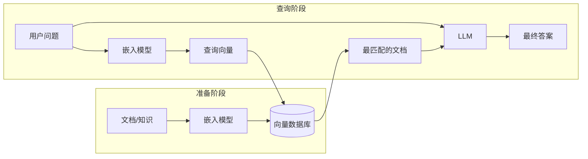

+++
title = "08.AI & Machine Learning Concepts"
description = "AI与机器学习核心概念速查：模型、训练、推理、前向计算、梯度、损失函数、Transformer、RAG、Agent、模型格式等全链路术语索引"
date = 2026-02-11
draft = false
[taxonomies]
tags = ["Glossary", "AI", "Machine Learning", "LLM", "Deep Learning", "Reference"]
[extra]
toc = true
+++

# AI & Machine Learning Concepts

本索引收录 AI 与机器学习领域的核心概念，每个概念包含：定义、为什么重要、关键要点，以及面向工程师的类比（便于有后端/系统经验的读者快速对接）。

> **配套文章**：[从模型诞生到 AI 应用：全链路认知](/articles/ai/ai-34-从模型诞生到AI应用全链路认知/)

---

## Model Fundamentals

### 1.1 Model (模型)

**定义**：由**参数（权重）**决定的、从输入到输出的**可计算函数**。给定输入，按固定结构和参数做数学运算，得到输出。

**为什么重要**：模型是整个 AI 系统的核心——训练的目标是得到模型（参数），推理是用模型算结果，应用层围绕模型的能力构建。

**关键要点**：
- **模型 ≠ 向量数据库**。模型是「函数」，不是「一堆现成答案等你来查」。
- 模型 = **结构（架构）** + **参数（权重）**。结构是人设计的，参数是训练出来的。
- 模型文件（`.pt`、`.onnx`、`.gguf` 等）里存的是**计算图 + 参数**，不是训练数据或向量库。

**四种更好的比喻**：

| 比喻 | 说明 |
|------|------|
| **函数 / 程序** | 输入 → 经过固定计算规则（由参数决定）→ 输出。换参数就换行为。 |
| **菜谱 + 调料配比** | 菜谱 = 计算图（先乘后加再激活）；调料配比 = 权重。训练 = 调配比。 |
| **可编程电路** | 结构固定，可调的是每条线上的「权重」。训练 = 调权重。 |
| **压缩后的统计规律** | 训练数据里的输入–输出关系，被压缩进有限参数里。 |

**工程师类比**：模型 ≈ 一个由参数决定的「黑盒服务」；模型文件 ≈ 把这个服务序列化存盘（像编译后的 `.so` 或容器镜像）。

---

### 1.2 Parameters and Weights (参数与权重)

**定义**：模型中所有**可调的数字**，通常组织成矩阵或张量。训练就是把这些数字从初始值调到合适的值。

**「参数」和「权重」是同一回事吗？** 在日常使用中**几乎等价**。严格地说：参数 = 权重（W）+ 偏置（b）+ 其他可训练张量。但业界习惯上「参数」和「权重」混用，说「这个模型有 70 亿参数」和「70 亿权重」表达的是同一件事。所以当你看到「模型 = 结构 + 参数」，这里的「参数」就是指**所有可调的数字（权重 + 偏置等）**。

**关键要点**：
- 一个线性层有**权重矩阵 W** 和**偏置 b**；Transformer 里每层有 Q/K/V 权重、MLP 权重等——这些统称**参数**。
- 小模型：几百万参数；大模型：几百亿到万亿参数。
- 训练前后**结构不变**，变的只是这些数字的取值。
- **初始化**：训练开始前需要给参数赋初值（如 Xavier、Kaiming 随机初始化），或加载已有预训练权重再继续训（微调）。

**工程师类比**：参数 ≈ 配置文件里的数值；训练 ≈ 用自动化工具（而非人工）不断调整这些数值直到系统行为满足指标。

---

### 1.3 Forward Pass (前向计算)

**定义**：输入从模型第一层开始，**一层一层往「前」算**，每一层的输出作为下一层的输入，直到最后一层输出最终结果。过程中**不回头、不跳步**，只沿一个方向走。

**为什么重要**：
- **推理 = 只做前向计算**（不做反向传播、不更新参数）。
- **训练也需要前向**（前向 → 算损失 → 反向 → 更新参数），但训练还额外做反向。
- 理解前向计算，就理解了「模型如何从输入得到输出」这一核心过程。

**一层在算什么（最常见的 Linear + Activation）**：

```
输入 x
  ↓
线性变换:  z = W · x + b    （W 是权重矩阵，b 是偏置）
  ↓
激活函数:  a = ReLU(z)       （如果 z > 0 输出 z，否则输出 0）
  ↓
输出 a（作为下一层的输入）
```

**多层堆叠 = 整个前向计算**：

```
输入 x
  → 第1层: z₁ = W₁·x + b₁   → a₁ = ReLU(z₁)
  → 第2层: z₂ = W₂·a₁ + b₂  → a₂ = ReLU(z₂)
  → ...
  → 第N层: z_N = W_N·a_{N-1} + b_N → 输出
```

每层的 W 和 b 是该层的**参数**；推理时这些数字**不变**，只是把输入一层层算到输出。

**前向 vs 反向对比**：

| | 前向计算 (Forward) | 反向传播 (Backward) |
|---|---|---|
| **方向** | 从输入 → 到输出 | 从输出（损失）→ 回到输入 |
| **做什么** | 算预测结果 | 算每个参数的梯度 |
| **什么时候用** | 训练和推理**都用** | **只在训练时**用 |
| **会改参数吗** | 不会 | 不直接改，但算出的梯度用来更新参数 |

**对于 LLM**：一次前向计算得到「下一个 token 的概率分布」；生成 100 个 token 就要做 **100 次**前向计算，所以长回答更慢。

**工程师类比**：前向计算 ≈ 一个请求经过 **middleware → handler → service → repository** 一层层处理最终返回响应——只不过每一层做的是矩阵乘法而不是业务逻辑。

---

### 1.4 Activation Function (激活函数)

**定义**：接在线性变换（W·x + b）后面的一个**非线性函数**，给模型引入非线性能力。

**为什么需要**：如果没有激活函数，多层线性变换叠加起来仍然是线性的（W₂·W₁·x = W_combined·x），模型再深也只能学线性关系。加了激活函数后，模型才能学习复杂的、非线性的输入–输出关系（如图像识别、语言理解）。

**常见激活函数**：

| 名称 | 公式 | 导数 | 特点 |
|------|------|------|------|
| **ReLU** | max(0, x) | x>0 时为 1，x≤0 时为 0 | 简单高效；x<0 时梯度为 0（dying ReLU 问题） |
| **Leaky ReLU** | max(αx, x)，α=0.01 | x>0 为 1，x≤0 为 α | 解决 dying ReLU |
| **Sigmoid** | 1/(1+e⁻ˣ) | σ(x)·(1-σ(x)) | 输出 (0,1)；梯度饱和区→vanishing gradient |
| **Tanh** | (eˣ-e⁻ˣ)/(eˣ+e⁻ˣ) | 1-tanh²(x) | 输出 (-1,1)；零中心 |
| **GELU** | x·Φ(x) ≈ 0.5x(1+tanh(√(2/π)(x+0.044715x³))) | 平滑，无精确闭合形式 | Transformer (BERT/GPT) 标配；比 ReLU 平滑，不会 hard cutoff |
| **SiLU/Swish** | x·σ(x) | σ(x)+x·σ(x)·(1-σ(x)) | Google Brain 提出；性能接近 GELU |
| **SwiGLU** | SiLU(xW₁) ⊙ (xW₂) | — | **当前 LLM FFN 主流**（LLaMA/Qwen/Mistral）；门控线性单元 |

**Dying ReLU 问题**：当某个神经元的输入长期 < 0 时，ReLU 输出恒为 0 → 梯度恒为 0 → 该神经元永远无法被更新，相当于「死掉」。大模型训练中，这可能导致整层中大量神经元失效。解决方案：Leaky ReLU、GELU、SwiGLU 等。

**SwiGLU 深入——为什么 LLM 都用它**：
- 标准 FFN：`FFN(x) = σ(xW₁)W₂`（一个线性层 + 激活 + 一个线性层）
- SwiGLU FFN：`FFN(x) = (SiLU(xW_gate) ⊙ xW_up) · W_down`（增加一个 gate 线性层，⊙ 表示逐元素乘）
- SwiGLU 用 3 个权重矩阵替代 2 个，参数多约 50%，但效果显著更好（Shazeer 2020）。为保持总参数量不变，LLaMA 等将 hidden_dim 从 4d 调整为 8d/3 ≈ 2.67d。

**工程师类比**：激活函数 ≈ 每层 handler 里的「判断逻辑」——如果只有赋值和线性运算，无论多少层都只是直通管道；加了 if/判断/非线性，才能做复杂决策。SwiGLU 相当于加了一个门控开关——先判断哪些信息重要（gate），再决定放行多少。

---

### 1.5 Loss Function (损失函数)

**定义**：衡量「模型当前输出」和「期望输出」差多少的**标量函数**。训练目标 = 最小化损失。

**为什么重要**：损失函数是训练的「指南针」——告诉优化器「当前模型差在哪里、差多少」，从而指导参数往哪个方向调。

**常见损失函数**：
- **交叉熵 (Cross Entropy)**：分类任务和语言模型最常用。衡量「预测概率分布」和「真实标签」之间的差距。预测越准，交叉熵越小。
- **MSE (均方误差)**：回归任务常用。
- **Perplexity (困惑度)**：语言模型专用指标，= e^(交叉熵)。越低说明模型对文本的预测越准。可以理解为「模型在每个位置平均有多少个同样可能的选择」——困惑度 10 意味着模型在每步像在 10 个选项里犹豫。

**工程师类比**：损失函数 ≈ 监控系统的 error rate 或 latency 指标——训练就是不断调参数让这个指标降到目标值。

---

### 1.6 Computational Graph (计算图)

**定义**：描述模型中**所有计算操作**及其**依赖关系**的有向图。每个节点是一个运算（如矩阵乘、加法、激活函数），边表示数据流向。

**计算图 = 结构 = 架构？** 三者密切相关：
- **架构（Architecture）**：人设计的「蓝图」——几层、每层什么类型、怎么连接。
- **结构（Structure）**：和架构含义几乎相同，指模型的拓扑形状。
- **计算图（Computational Graph）**：架构的**可执行表示**——把「蓝图」翻译成具体的运算节点和数据流。

三者在实践中经常互换使用。你可以理解为：**架构是设计图纸，计算图是施工完成后的电路板**——训练时计算图固定不变，只调参数（电路板上各连线的「权重」值）。

**训练阶段计算图固定吗？** 是的。一旦你选定了架构（如 12 层 Transformer、hidden_size=768），计算图就确定了。训练过程中**不会**改变层数、连接方式或运算类型——只会反复调整参数值。但在**训练之前的架构选型/设计阶段**，研究者会反复试不同的架构（层数、注意力头数、MLP 大小等），每次改架构就是改计算图。选定后才锁定开始训练。

**为什么重要**：
- 模型文件（如 ONNX）里存的就是「计算图 + 参数」。
- 推理引擎（如 TensorRT）通过**优化计算图**（算子融合、量化等）来加速推理。
- 反向传播也依赖计算图来追踪每个参数对损失的影响。

**工程师类比**：计算图 ≈ 编译后的程序的**执行流图**（类似 LLVM IR）；ONNX 文件 ≈ 可跨平台运行的中间表示。架构选型 ≈ 选定用什么语言/框架写程序；训练 ≈ 在框架确定后调参数；选型阶段可以换框架（改计算图），训练阶段不再换。

---

## Training

### 2.1 Training (训练)

**定义**：用数据反复调整模型参数，使模型在给定输入时的输出越来越接近期望结果。

**训练的五步循环**：
1. **前向传播**：用当前参数算一遍，得到预测输出
2. **算损失**：用损失函数比较预测和真实目标
3. **反向传播**：从损失往回算，得到每个参数的梯度
4. **更新参数**：优化器根据梯度调整每个参数
5. **重复**：换一批数据，再来一遍，直到损失足够低

**结果**：得到**一组确定的参数（权重）**。这组参数 + 固定的模型结构 = 模型。

**工程师类比**：训练 ≈ 用大量测试用例自动调参——每跑一批用例，计算偏差（损失），自动微调参数，直到所有用例的结果都满足精度要求。

---

### 2.2 Gradient (梯度)

**定义**：每个参数对损失函数的**偏导数**。直观地说：梯度告诉你「这个参数该往哪个方向、挪多少，能让损失下降」。

**为什么重要**：梯度是连接「损失」和「参数更新」的桥梁——没有梯度，就不知道怎么调参数。

**直观理解**：想象你站在山上（损失值 = 海拔），蒙着眼要走到山谷（最低损失）。梯度就是你脚下地面的**坡度方向**——它告诉你「往哪边走是下坡，坡有多陡」。

---

### 2.3 Backpropagation (反向传播)

**定义**：从损失值开始，**沿计算图反方向**，用链式法则逐层算出每个参数的梯度的过程。

**为什么需要**：模型有成百上千层、几十亿参数，不可能手动算「每个参数对损失的影响」。反向传播是一种**高效算法**，能自动、精确地一次性算出所有参数的梯度。

**链式法则**：高数里「复合函数求导」的规则。如果 y = f(g(x))，那么 dy/dx = f'(g(x)) · g'(x)。反向传播就是把链式法则应用到计算图的每一层：最终损失对某个参数的梯度 = 沿路径上所有「局部梯度」的乘积之和。

**直观理解**：前向计算是「从输入→输出」一层层算结果；反向传播是「从输出（损失）→输入」一层层**倒推**每个参数的责任：「这个参数对最终损失贡献了多少？该往哪调？」

**前向 vs 反向**：

| | 前向 | 反向 |
|---|---|---|
| 方向 | 输入 → 输出 | 损失 → 输入 |
| 计算内容 | 预测值 | 每个参数的梯度 |
| 用途 | 训练 + 推理 | 仅训练 |

---

### 2.4 Gradient Descent (梯度下降)

**定义**：沿梯度的**反方向**更新参数，使损失一步一步变小的优化算法。

**公式**：`参数_new = 参数_old - 学习率 × 梯度`

- **学习率**：每步挪多远。太大会跳过最优点，太小会收敛极慢。
- **SGD**：随机梯度下降，每次用一个 batch 的梯度近似全局梯度。
- **Adam**：目前最常用的优化器，结合了动量和自适应学习率。

**工程师类比**：梯度下降 ≈ **自动调参算法**——每一步看指标（损失）的反馈，按一定步长朝「指标变好」的方向调参数。

---

### 2.5 Optimizer (优化器)

**定义**：决定「如何根据梯度更新参数」的算法。不同优化器在步长、方向、历史信息利用上有不同策略。

**常见优化器**：

| 名称 | 特点 |
|------|------|
| **SGD** | 最基础；学习率固定；可能震荡 |
| **SGD + Momentum** | 加「惯性」，减少震荡，加速收敛 |
| **Adam** | 自适应学习率 + 动量；目前最常用 |
| **AdamW** | Adam + 权重衰减；大模型训练常用 |

---

### 2.6 Epoch (轮次)

**定义**：将**整个训练数据集**完整过一遍称为一个 epoch（轮次）。

**不同场景下 epoch 的含义差异很大**：

| 场景 | 典型 epoch 数 | 说明 |
|------|-------------|------|
| **传统 CV（图像分类）** | 几十~几百 | 数据集有限，需要多次遍历学习特征 |
| **传统 NLP / 微调** | 3~10 | 数据量适中，少量 epoch 即可收敛 |
| **LLM 预训练** | **≤ 1** | 数据量极大（万亿 token），Chinchilla 论文表明 compute-optimal 训练的 token 数约为参数量的 20 倍（如 70B 模型需 ~1.4T tokens），实践中通常不超过 1 epoch；LLaMA 2 在 2T tokens 上训练约 1 epoch |

> **关键认知**：大模型时代，训练进度更常用 **steps**（优化器更新次数）或 **tokens**（处理的 token 总数）衡量，而非 epoch。例如"训练了 1T tokens"比"训练了 0.8 epoch"更直观。

**过拟合与 Early Stopping**：
- 过多 epoch → **过拟合**（模型对训练数据记太熟，对新数据表现差）。
- **Early Stopping**：监控验证集损失，当连续 k 个 epoch（或 N 步）验证损失不再下降时，停止训练。这是防止过拟合的标准工程手段。

**Epoch 与 Learning Rate Schedule 的耦合**：
- 常见的 **cosine annealing** 学习率调度按 total epochs/steps 设定周期。
- 典型模式：**warmup**（前 1%~5% steps 线性增大 lr）→ **cosine decay**（余弦衰减到接近 0）。
- epoch 数/总步数决定了 lr schedule 的形状。

---

### 2.7 Batch (批次)

**定义**：每一步训练中使用的**一小批样本**（如 32、128、256 条数据）。

**为什么用 batch 而不是全量数据**：
- 全量数据一起算会**占满显存**，物理上放不下。
- 用一个 batch 的平均梯度就足够估计「参数该往哪调」。
- 小批量带来的随机性有利于**泛化**（不过拟合）。

**训练流程中的位置**：一个 epoch = 把数据集切成多个 batch，每个 batch 做一次「前向 → 损失 → 反传 → 更新参数」。

**Gradient Accumulation（梯度累积）**：

当单卡显存放不下期望的 batch size 时，可以用更小的 **micro-batch** 做多次前向/反向，累积梯度后再做一次参数更新：

```
effective_batch_size = micro_batch_size × gradient_accumulation_steps × num_GPUs
```

例如：micro_batch=4, accumulation=8, 4 张 GPU → effective_batch = 4 × 8 × 4 = 128。效果等价于单步 batch=128，但每张卡只需放下 batch=4 的显存。

**Batch Size 与学习率的关系**：
- **Linear Scaling Rule**：batch size 从 B 增大到 kB 时，learning rate 也应乘以 k（或平方根 k）。直觉：大 batch 的梯度估计更稳定，可以走更大步长。
- **Critical Batch Size**：存在一个临界 batch size，超过后加大 batch 对收敛速度的边际收益递减，纯粹浪费计算。

**实际数量级参考**：

| 模型 | Batch Size (tokens) | 说明 |
|------|-------------------|------|
| GPT-3 175B | 3.2M tokens | 约 1600 条 × 2048 tokens |
| LLaMA 2 70B | 4M tokens | 动态 batch size，训练中逐步增大 |
| 典型微调 | 32~256 条 | 远小于预训练 |

---

### 2.8 VRAM (显存)

**定义**：GPU 上的专用内存，用于存储模型参数、中间激活值、梯度等。

**为什么重要**：
- 显存是训练和推理的**硬瓶颈**——模型太大或 batch 太大就放不下。
- 一张 A100 有 40GB 或 80GB 显存；GPT-3 级别模型（1750 亿参数）光存参数就需要 ~350GB（FP16），必须多卡并行。
- 推理时只需存参数和当前计算的中间值，显存需求比训练小得多（训练还需存梯度和优化器状态）。

**工程师类比**：显存 ≈ 服务器的 RAM——放不下就要分布式、用更大的机器或做压缩（量化）。

---

## Language Models & Transformer

### 3.1 Token (词元)

**定义**：模型处理文本的**最小单位**。模型不直接看「字」或「词」，而是把文本切成一段段 token 来处理。

**关键要点**：
- 一个 token 可以是一个词（如 "hello"）、一个子词（如 "un" + "happi" + "ness"）、一个字（中文常见）、甚至一个字节。
- 不同模型用不同的**分词方案**，同一句话切出来的 token 数量不同。
- 模型的「上下文长度」（如 4096、128K）指的是一次能处理的**最大 token 数**。

**特殊 Token**：

| Token | 名称 | 作用 |
|-------|------|------|
| **BOS** (Beginning of Sequence) | 序列起始 | 标记输入开始，如 `<s>` |
| **EOS** (End of Sequence) | 序列结束 | 标记生成结束（模型输出 EOS 即停止），如 `</s>` |
| **PAD** (Padding) | 填充 | Batch 内短序列用 PAD 补齐到相同长度，attention mask 会忽略 PAD 位置 |
| **UNK** (Unknown) | 未知 | 不在词表中的 token（BPE/SentencePiece 通常不需要 UNK，但 WordPiece/传统分词可能产生） |
| **SEP** (Separator) | 分隔符 | BERT 用于分隔两个句子，如 `[SEP]` |
| **MASK** | 掩码 | BERT MLM 训练时用，标记需要预测的位置 |

> **工程注意**：不同模型的特殊 token 不同（LLaMA 用 `<s>`/`</s>`，ChatGPT 用 `<|im_start|>`/`<|im_end|>`）。使用 API 或推理框架时，必须使用该模型对应 tokenizer 的特殊 token，否则会导致行为异常。

**Token 与字符/字节的换算**（经验值）：
- 英文：1 token ≈ 4 个字符 ≈ 0.75 个单词
- 中文：1 token ≈ 1~2 个汉字（取决于 tokenizer）
- 代码：通常 token 密度低于自然语言（符号多，每个符号可能独占一个 token）

---

### 3.2 Tokenizer (分词器)

**定义**：把原始文本切成 token 序列的工具/算法。是模型的「前置处理器」。

**常见算法**：

| 算法 | 核心思想 | 代表模型 | Vocabulary Size |
|------|---------|---------|----------------|
| **BPE (Byte Pair Encoding)** | 从字符/字节级开始，迭代合并出现频率最高的相邻 token pair，直到达到目标 vocab size | GPT-2/3/4, LLaMA, Qwen | 32K~128K |
| **WordPiece** | 类似 BPE，但选择合并时用**似然增益**而非纯频率 | BERT, DistilBERT | 30K~50K |
| **Unigram** | 从一个大词表出发，迭代**删除**贡献最小的 token，直到缩减到目标 vocab size | SentencePiece (T5, XLNet) | 32K~64K |
| **Byte-Level BPE** | 以 256 个字节为基础词表做 BPE，天然支持任何语言/二进制 | GPT-2, LLaMA | 32K~128K |

**BPE 训练过程**（以 Byte-Level BPE 为例）：
1. 初始词表 = 256 个字节 + 特殊 token
2. 统计训练语料中所有相邻 token pair 的出现频率
3. 合并频率最高的 pair 为一个新 token，加入词表
4. 重复步骤 2-3，直到词表达到目标大小（如 32000）
5. 最终词表中，高频词/子词被合并为完整 token，低频词被拆分为多个小 token

**Vocabulary Size 的影响**：
- **太小**（如 8K）：更多文本被拆为短 token → 序列更长 → 推理更慢、上下文利用率低
- **太大**（如 256K）：Embedding 矩阵巨大（vocab_size × hidden_dim），增加参数量和显存
- **经验法则**：当前主流 LLM 的 vocab size 在 **32K~128K** 之间（LLaMA: 32K, GPT-4: ~100K, Qwen2: 151K）

**OOV (Out-of-Vocabulary) 处理**：
- BPE/Unigram 天然无 OOV：任何输入最终都可拆分为已知 token（最坏情况拆到字节级）
- WordPiece 可能产生 `[UNK]`，但实际 BERT 的 vocab 已覆盖绝大多数子词

**常见工具**：
- **HuggingFace tokenizers**：Rust 实现，性能极高，支持 BPE/WordPiece/Unigram
- **SentencePiece**：C++ 实现，语言无关，Google 出品
- **tiktoken**：OpenAI 的 BPE 实现，用于 GPT 系列

---

### 3.3 LLM (大语言模型)

**定义**：参数规模极大（数十亿到数万亿）的语言模型，在海量文本上预训练，具备**通用的语言理解与生成能力**。

**关键要点**：
- 代表：GPT-4、Claude、LLaMA、Qwen、Gemini 等。
- 核心架构：Transformer。
- 训练方式：自监督（「给定前文，预测下一个 token」）+ 可选的 RLHF/指令微调。
- 能力：问答、翻译、推理、代码生成、工具调用等——一个模型多任务。

**工程师类比**：LLM ≈ 一个「万能 API 服务」——输入是文本 prompt，输出是文本回复；通过改变 prompt 就能做不同任务，不需要为每个任务单独部署一个服务。

---

### 3.4 Transformer

**定义**：2017 年 Google 提出的神经网络架构（"Attention Is All You Need"），基于**自注意力机制 (Self-Attention)**，已成为 LLM 和众多 AI 模型的核心架构。

**为什么重要**：
- 取代了 RNN/LSTM，能并行处理整个序列，训练效率大幅提升。
- 自注意力让模型能「看到」输入中任意两个位置的关系，不受距离限制。
- GPT、BERT、LLaMA、ViT 等几乎所有当代明星模型都基于 Transformer。

**核心组件**（每个 Transformer 层）：
- **Multi-Head Self-Attention**：计算序列中每个 token 对其他所有 token 的「关注度」。详见下方 **10.5 Attention Mechanism**。
- **Feed-Forward Network (FFN/MLP)**：对每个 token 做独立的非线性变换。当前 LLM 主流使用 **SwiGLU FFN**（见上方 **1.4 Activation Function**）。
- **Layer Norm + Residual Connection**：稳定训练、缓解梯度消失。

**Pre-Norm vs Post-Norm**：

| 模式 | 结构 | 代表模型 | 特点 |
|------|------|---------|------|
| **Post-Norm** | `x + Sublayer(LayerNorm(x))` 之后再 Norm → `LayerNorm(x + Sublayer(x))` | 原始 Transformer, BERT | 理论表达能力更强，但深层训练不稳定 |
| **Pre-Norm** | `x + Sublayer(LayerNorm(x))` | **GPT-2/3, LLaMA, Qwen, Mistral**（当前主流） | 训练更稳定，梯度流更顺畅，几乎所有 LLM 使用 |

> 直觉：Pre-Norm 的 residual connection 直接连通底层到顶层（LayerNorm 不在残差路径上），梯度可以无阻碍地回传。Post-Norm 中 LayerNorm 在残差路径上，深层模型容易训练不稳定。

**RMSNorm vs LayerNorm**：
- **LayerNorm**：对每个 token 的隐状态做减均值、除标准差、再 scale+shift，4 个操作。
- **RMSNorm (Root Mean Square Norm)**：只做除 RMS（均方根）+ scale，省略减均值和 shift，计算量减少 ~10%，效果几乎等价。**LLaMA/Qwen/Mistral 等当前 LLM 全部使用 RMSNorm**。

**三种 Transformer 架构变体**：

| 变体 | 注意力类型 | 典型用途 | 代表模型 |
|------|----------|---------|---------|
| **Encoder-only** | Bidirectional（每个 token 可以看到全部上下文） | 文本分类、NER、嵌入 | BERT, RoBERTa |
| **Decoder-only** | Causal（每个 token 只看到前面的 token） | **文本生成、LLM**（当前主流） | GPT, LLaMA, Qwen, Mistral |
| **Encoder-Decoder** | Encoder bidirectional + Decoder causal + cross-attention | 翻译、摘要 | T5, BART, 原始 Transformer |

---

### 3.5 Autoregressive (自回归)

**定义**：一种生成方式——**一个 token 一个 token** 地顺序生成。每次生成一个新 token 后，把它拼到已有序列末尾，作为下一次生成的输入。

**关键要点**：
- GPT 类 LLM 都是自回归的：生成 N 个 token 需要做 **N 次前向计算**。
- 所以长回答比短回答更慢、更耗算力。
- 像「接龙」：每次只接一个词，直到生成结束符或达到长度上限。

---

### 3.6 Sampling (采样策略)

**定义**：模型每次前向计算得到的是「下一个 token 的概率分布」（vocab size 维的 logits 向量），**采样策略**决定从这个分布中选哪个 token。

**常见策略**：

| 策略 | 做法 | 特点 |
|------|------|------|
| **argmax / greedy** | 直接选概率最高的 token | 确定性、不会「创造」，可能重复/退化 |
| **top-k** | 只在概率最高的 k 个里随机采 | 限制候选范围，典型 k=50 |
| **top-p (nucleus)** | 选概率累加到 p 为止的候选集 | 动态候选集，典型 p=0.9~0.95 |
| **temperature** | logits 除以 T 后再 softmax | T<1 更确定，T>1 更随机，T=0 等价于 greedy |
| **min-p** | 过滤掉概率 < p_max × min_p 的 token | 近年流行，比 top-p 更稳定 |

**Temperature 数学原理**：
- 原始：`P(token_i) = exp(logit_i) / Σ exp(logit_j)`
- 加温度：`P(token_i) = exp(logit_i / T) / Σ exp(logit_j / T)`
- T → 0：分布趋近 one-hot（greedy）；T → ∞：分布趋近均匀随机

**典型 Temperature 参数参考**：

| 场景 | Temperature | top-p | 说明 |
|------|------------|-------|------|
| **代码生成** | 0.0~0.2 | 0.95 | 需要精确、确定性强 |
| **通用对话** | 0.7~0.9 | 0.9 | 平衡创造性和连贯性 |
| **创意写作** | 1.0~1.2 | 0.95 | 需要多样性和创造力 |
| **数学推理** | 0.0 | 1.0 | 需要最精确的推理 |

**Beam Search（束搜索）**：
- 不同于逐 token 采样，beam search 同时维护 **k 个候选序列**（beams），每步扩展所有 beam，保留总概率最高的 k 个。
- 优势：能找到全局更优的序列（greedy 可能陷入局部最优）。
- 劣势：计算量 ≈ k 倍、生成文本可能重复/缺乏多样性。
- **应用场景**：机器翻译、语音识别（需要精确性）。LLM 对话通常**不用** beam search（nucleus sampling 效果更好）。

**Repetition Penalty（重复惩罚）**：
- 对已生成过的 token 降低其 logit（乘以 penalty 因子，通常 1.0~1.3），减少重复。
- 变体：frequency_penalty（基于出现次数）、presence_penalty（只看是否出现过）。

---

## Representation & Retrieval

### 4.1 Embedding (嵌入)

**定义**：把离散对象（如一个词、一段文本、一张图片）映射成一个**固定长度的连续向量**（一串浮点数）。语义相近的对象，向量在空间中也相近。

**为什么重要**：
- 计算机不懂文字，但懂数字。嵌入把「语义」转化成「可计算的向量」。
- 是 RAG、搜索、推荐、聚类等应用的基础。

---

### 4.2 Embedding Model (嵌入模型)

**定义**：专门用来「输入文本/图像 → 输出固定维度向量」的模型。主流架构以 **Encoder-only Transformer**（BERT 系）为主，但近期也出现了基于 **Decoder-only LLM** 的嵌入模型（如 E5-mistral）。经过**对比学习 (Contrastive Learning)** 训练，使得语义相近的文本在向量空间中距离更近。

**训练机制——对比学习**：
- 核心损失函数 **InfoNCE**：`L = -log(exp(sim(q, k⁺)/τ) / Σᵢ exp(sim(q, kᵢ)/τ))`
  - `q`：query 文本的向量；`k⁺`：正样本（语义相近文本）的向量；`kᵢ`：batch 内所有样本
  - `τ`（温度系数）：控制分布尖锐程度，通常 0.05~0.1
- **In-batch Negatives**：同一 batch 内的其他样本作为负样本，无需额外构造
- **Hard Negative Mining**：用 BM25 或近似检索找到「看起来相关但实际不相关」的困难负样本，提升模型区分能力

**工作原理**：
1. 输入文本经 Tokenizer 切分为 Token 序列。
2. Token 序列经过多层 Transformer 编码。
3. **Pooling 策略**（取决于架构）：
   - **Encoder-based（BERT 系）**：取 `[CLS]` token 输出，或对所有 token 做 **mean pooling**
   - **Decoder-based（LLM 系）**：取**最后一个 token** (last token pooling) 的隐状态
4. 得到一个固定长度的向量（如 768 维、1536 维），即输入文本的**语义表示**。

**Bi-Encoder vs Cross-Encoder**：

| 维度 | Bi-Encoder | Cross-Encoder |
|------|-----------|---------------|
| **输入** | query 和 doc **分别**编码为向量 | query 和 doc **拼接**后一起编码 |
| **输出** | 两个独立向量 → 计算相似度 | 一个相关性分数 |
| **速度** | **快**（向量可预计算、缓存） | 慢（每对都要重新计算） |
| **精度** | 较高 | **更高**（能捕捉 query-doc 交互） |
| **典型用途** | **检索**（从百万文档中找 top-K） | **重排序**（对 top-K 精排） |

> 实际 RAG 系统的标准流程：Bi-Encoder 检索 top-100 → Cross-Encoder 重排序 → 取 top-5 给 LLM。

**评测基准**：**MTEB (Massive Text Embedding Benchmark)** 是当前嵌入模型的事实标准评测，覆盖检索、分类、聚类、重排序等 8 类任务。选模型时应参考 MTEB Leaderboard 排名。

**Instruction-Tuned Embedding 与可变维度**：
- 许多模型（BGE、E5）使用不同的 **instruction prefix** 区分 query 和 passage（如 `query:` / `passage:`），工程使用时必须正确设置
- **Matryoshka Representation Learning (MRL)**：OpenAI text-embedding-3 系列支持输出向量截断到任意维度（如 3072 → 256），低维仍保持较好效果，适合存储受限场景

**常见模型**：

| 模型 | 提供方 | 维度 | 特点 |
|------|--------|------|------|
| **sentence-transformers** | HuggingFace 社区 | 384~1024 | 开源；种类丰富；适合自部署 |
| **text-embedding-3-large** | OpenAI | 3072 | 高精度；API 调用；付费 |
| **BGE-large** | BAAI（智源） | 1024 | 开源；中英双语效果好 |
| **E5-mistral-7b-instruct** | Microsoft | 4096 | 基于 LLM 的嵌入模型；精度高但更重 |
| **GTE-Qwen2** | 阿里 | 768~1536 | 多语言；开源 |
| **Cohere embed-v3** | Cohere | 1024 | 支持多语言；API 调用 |

**与 LLM 的核心区别**：

| 维度 | 嵌入模型 | LLM |
|------|---------|-----|
| **架构** | Encoder-only（BERT 系）或 Encoder 变体 | Decoder-only（GPT 系）为主 |
| **输出** | 固定长度的**向量**（用于检索/比较） | **文本序列**（用于生成） |
| **参数规模** | 通常 100M~7B | 通常 7B~405B+ |
| **推理速度** | 快（一次前向即可） | 慢（需自回归逐 token 生成） |
| **用途** | 语义搜索、RAG 检索、聚类、分类 | 对话、写作、代码生成、推理 |

**工程师类比**：嵌入模型 ≈ 一个「文本→坐标」的编码器，把任意长度的文本映射到同一个坐标系中，使得语义相近的文本坐标也相近，方便后续的「按距离检索」。

---

### 4.3 Vector Database (向量数据库)

**定义**：专门存储**向量**并支持**按相似度检索**的存储系统。存入一堆向量后，给定查询向量，能快速找出最相似的若干条。

**与模型的关键区别**：
- **模型** = 可计算的函数（输入→算→输出）；**向量库** = 存储 + 相似度搜索（存好的向量→查最近的）。
- 模型**生产**向量，向量库**存储和检索**向量。两者职责不同。

**常见向量数据库**：

| 名称 | 特点 |
|------|------|
| **Faiss** | Meta 开源；单机；高性能；易上手 |
| **Milvus** | 分布式；支持大规模；云原生 |
| **Qdrant** | Rust 编写；易用 API |
| **pgvector** | PostgreSQL 插件；适合已有 PG 的场景 |
| **Elasticsearch kNN** | ES 生态内；支持混合检索 |
| **Pinecone** | 托管服务；免运维 |

**工程师类比**：向量库 ≈ 一种「按相似度查」而非「按主键/关键词查」的存储引擎，和 Redis、MySQL 是互补关系。

---

### 4.4 Nearest Neighbor (最近邻搜索)

**定义**：给定查询向量，在向量库中找出与之距离最近（最相似）的 k 条记录。

**常用距离/相似度**：余弦相似度、欧氏距离、内积。

**近似最近邻 (ANN)**：精确搜索在大规模数据上太慢，实际用**近似算法**（如 HNSW、IVF）在精度和速度之间取平衡。

---

### 4.5 Chunk (文档分块)

**定义**：将长文档切成一截截的短片段（如 512 token 一段），每段称为一个 chunk。

**为什么需要**：
- 嵌入模型有最大长度限制，长文档必须切块。
- 切块后每段有独立向量，检索时能精确定位到「哪一段」和问题相关。
- 切块策略（大小、是否重叠、按段落/句子切）直接影响 RAG 效果。

---

## Model Formats & Deployment

### 5.1 ONNX (Open Neural Network Exchange)

**定义**：微软主导的**通用模型格式**——用标准化的计算图描述模型结构和参数，不依赖特定训练框架。

**为什么重要**：
- PyTorch / TensorFlow 等框架都可以**导出** ONNX。
- ONNX Runtime、TensorRT 等多种推理引擎都能**加载** ONNX。
- 实现「一次导出、多处部署」——跨语言（C++/Java/Go）、跨设备。

**ONNX 文件里有什么**：计算图（描述模型的运算流程）+ 权重（参数值）。**没有**训练数据、向量库或业务知识。

---

### 5.2 TensorRT

**定义**：NVIDIA 推出的高性能推理引擎，针对 NVIDIA GPU 做深度优化（算子融合、量化、内核自动调优）。

**适用场景**：在 NVIDIA GPU 上追求极致推理延迟和吞吐时使用。

---

### 5.3 GGUF and GGML

**定义**：llama.cpp 生态的模型格式，支持 CPU 推理和多种量化精度（INT4/INT8 等）。

**适用场景**：CPU 或边缘设备推理、本地部署、低资源环境。GGUF 是 GGML 的继任格式，更规范。

---

### 5.4 SafeTensors

**定义**：HuggingFace 推出的**安全权重存储格式**。只存权重张量，不含可执行代码，防止加载时执行恶意代码。

**适用场景**：与 HuggingFace 生态配合，安全地分享和加载大模型权重。

---

### 5.5 Inference (推理)

**定义**：拿已经训练好的**固定参数**，对**新的、未见过的输入**做前向计算，得到输出。

**关键要点**：
- 推理 = **只做前向**、**不做反向传播**、**不更新参数**。
- 参数在训练结束后就**冻结**了，推理时只读取、不修改。
- 推理比训练轻得多（不需存梯度、不需反传）。

**不同模型的推理举例**：

| 模型类型 | 输入 | 输出 | 推理在干嘛 |
|----------|------|------|------------|
| 图像分类 | 一张图 | 类别 / 概率 | 前向一遍，取概率最大的类别 |
| LLM | 文本上下文 | 下一个 token 的概率 | 自回归：前向 N 次，生成 N 个 token |
| 嵌入模型 | 一段文本 | 一个向量 | 前向一遍，取某层作为向量表示 |

**工程师类比**：推理 ≈ 无状态 API 服务——加载模型（≈ 启动服务），对每个请求做前向计算（≈ 处理请求），返回结果。可水平扩展、负载均衡。

---

### 5.6 Inference Engine (推理引擎)

**定义**：专门用于高效运行模型推理的软件系统。

**常见推理引擎**：

| 名称 | 特点 |
|------|------|
| **vLLM** | LLM 专用；PagedAttention、连续批处理；高吞吐 |
| **TGI (Text Generation Inference)** | HuggingFace 出品；生产级 LLM 推理 |
| **TensorRT-LLM** | NVIDIA 出品；TensorRT 优化的 LLM 引擎 |
| **llama.cpp** | C++ 实现；支持 CPU/GPU；本地推理 |
| **ONNX Runtime** | 通用推理；跨平台；支持多种硬件 |

**推理引擎解决的核心问题**：高吞吐、低延迟、显存优化、批处理、流式输出。

---

## Training Frameworks & Distributed

### 6.1 PyTorch

**定义**：Meta 开源的深度学习框架，当前**研究与工业界最主流**的训练框架。

**为什么成为主流**：
- **动态图**：代码即模型，调试像写 Python 一样自然。
- **研究界广泛采用**：论文和预训练模型基本都提供 PyTorch 版本。
- **生态成熟**：HuggingFace、TorchVision、Lightning 等完善。

**其他框架**：TensorFlow（Google，仍有一定存量）、JAX（Google，研究和部分大厂使用）。

---

### 6.2 Distributed Training (分布式训练)

**定义**：将训练任务分摊到多张 GPU / 多台机器上，以训练超大模型或加速训练。

**三种主要并行方式**：

| 方式 | 做法 | 适用场景 |
|------|------|----------|
| **数据并行 (Data Parallelism)** | 同一份模型复制多份，每份吃不同数据，梯度聚合后统一更新 | 模型放得下单卡，想加速 |
| **张量并行 (Tensor Parallelism)** | 把单层的大矩阵拆到多卡上算 | 单层太大放不下一卡 |
| **流水线并行 (Pipeline Parallelism)** | 不同层放到不同卡上，像流水线一样串起来 | 模型层数多，整体放不下一卡 |

**常用框架**：Megatron-LM、DeepSpeed、FSDP、Colossal-AI。

---

### 6.3 HuggingFace (HF)

**定义**：AI 领域最大的**模型与数据集开放平台**，同时提供 transformers、tokenizers、datasets 等核心库。

**为什么重要**：
- **Model Hub**：数万个预训练模型可直接下载使用。
- **transformers 库**：统一接口加载和使用各种模型，几行代码即可推理或微调。
- **已成为事实标准**：大多数开源模型都以 HF 格式发布。

---

## Application Layer

### 7.1 Prompt (提示)

**定义**：发给模型的**完整输入文本**——包括系统指令、上下文、用户问题等。可以理解为「你给模型出的完整题干」。

**为什么重要**：
- LLM 的行为完全由 prompt 驱动——同一个模型，不同 prompt 可以做不同任务。
- **Prompt Engineering**（提示工程）：通过设计 prompt 的格式、措辞、示例来提升模型输出质量，**不需要**修改模型参数。

**典型 prompt 结构（RAG 场景）**：
```
系统提示：你是一个助手。请根据以下文档回答问题。
文档：{检索到的文档片段}
用户问题：{用户的问题}
```

---

### 7.2 Fine-tuning (微调)

**定义**：在已有的预训练模型基础上，**继续用任务特定数据训练**（更新参数），使模型在特定任务上表现更好。

**与 Prompting 的区别**：

| | Prompting (提示) | Fine-tuning (微调) |
|---|---|---|
| 是否改参数 | **不改**，只改输入文本 | **改**，继续训练更新参数 |
| 需要数据 | 不需要（或几个示例） | 需要任务数据 |
| 需要算力 | 极少 | 较多 |
| 效果 | 快速试任务，效果可能一般 | 效果通常更好 |
| 适用场景 | 快速原型、通用任务 | 特定领域、高精度需求 |

---

### 7.3 RAG (检索增强生成)

**定义**：先**检索**相关文档，再把检索结果和用户问题一起交给 LLM **生成**答案。用「外部知识」补充模型自身不知道的信息。

**为什么需要 RAG**：
- LLM 的知识有**截止时间**，不包含最新信息。
- LLM 不包含你的**私域文档**（公司制度、产品手册等）。
- RAG 无需重新训练模型，只需维护文档和向量库。

**RAG 流程**：



**工程师类比**：RAG ≈ 「先查库 → 拼请求 → 调服务」——用向量库查相关文档，把文档和问题拼成 prompt，调 LLM 接口拿答案。和你熟悉的「查库 → 组装数据 → 调服务」是一样的套路。

---

### 7.4 AI Agent

**定义**：以 LLM 为「大脑」的自主系统——能**规划步骤、调用工具、根据结果再决策**，完成复杂任务。

**与普通 LLM 对话的区别**：
- 普通对话：用户问 → LLM 答，一来一回。
- Agent：LLM 自主思考「要完成这个任务，我需要先搜索、再计算、再调 API」，**多步执行**后返回结果。

**核心组件**：
- **LLM**：规划和推理。
- **Tools (工具)**：搜索、代码执行、查库、调 API 等。RAG 可视为一种检索工具。
- **编排框架**：把 LLM + 工具 + 人机交互串成完整流程。

---

### 7.5 Function Calling (函数调用)

**定义**：LLM 在生成过程中识别出「需要调用外部工具」，**输出结构化的函数调用请求**（函数名 + 参数），由应用层执行后把结果返回给 LLM。

**为什么重要**：是 Agent 能力的基础——让 LLM 从「只会说话」变成「能做事」。

---

### 7.6 ReAct

**定义**：**Re**asoning + **Act**ing 的组合模式。LLM 交替进行**推理**（思考下一步做什么）和**行动**（调用工具），直到完成任务。

**典型循环**：
```
思考：我需要查询用户的订单状态
行动：调用 query_order(order_id="12345")
观察：订单状态为「已发货」
思考：已经拿到信息，可以回答用户了
回答：您的订单已发货...
```

---

### 7.7 LangChain, LangGraph, LlamaIndex

**定义**：构建 LLM 应用（RAG、Agent 等）的主流编排框架。

| 框架 | 特点 |
|------|------|
| **LangChain** | 最流行的 LLM 应用框架；链式调用、工具集成、RAG 模板 |
| **LangGraph** | LangChain 团队出品；基于图的复杂 Agent 编排 |
| **LlamaIndex** | 专注 RAG；文档索引和检索能力强 |
| **Semantic Kernel** | 微软出品；.NET/Python；企业级 |
| **CrewAI** | 多 Agent 协作框架 |

---

## LLM Theory

### 8.1 Pre-training (预训练)

**定义**：在**海量无标注数据**上用自监督目标训练模型，使其学到**通用的语言/视觉表示和推理能力**。

**LLM 的预训练数据**：互联网文本、书籍、代码、多语种语料等——数万亿 token。
**预训练目标**：「给定前文，预测下一个 token」——看似简单，但在海量数据上规模化后，模型学会了语法、事实、推理和多种能力。

---

### 8.2 Self-supervised Learning (自监督学习)

**定义**：不需要人工标注的训练方式——从数据本身构造监督信号。

**LLM 的例子**：把文本的「下一个词」当作标签——输入「今天天气」，标签是「很好」。数据本身就提供了标签，不需要人去标。

---

### 8.3 Scaling Laws (规模定律)

**定义**：大量实验表明，随着**数据量、参数量、算力**同时增大，模型在各类任务上的表现会**持续、可预测地提升**。

**为什么重要**：
- 给了「做大模型」明确的回报预期——投入更多资源，性能就会按规律提升。
- 推动业界不断堆规模，从 GPT-2 (1.5B) → GPT-3 (175B) → GPT-4 (传闻万亿级)。
- 目前还没有明确的「天花板」，所以规模竞赛仍在继续。

---

### 8.4 Emergence (涌现)

**定义**：在模型达到一定规模后，**突然出现**训练目标里没有显式要求的**新能力**。

**例子**：
- 零样本/少样本泛化（不给示例或只给几个就能做新任务）
- 多步推理
- 按指令执行
- 使用工具
- 代码生成

**为什么重要**：涌现意味着大模型不只是「量变」——规模到一定程度后会发生「质变」，出现小模型完全不具备的能力。这也是大模型「出圈」的核心原因。

---

## Traditional Machine Learning

### 9.1 Feature Engineering (特征工程)

**定义**：由人工从原始数据中**设计、提取、组合**出对预测有用的特征（变量），再喂给模型训练。

**为什么在传统 ML 里极其重要**：
- 传统模型（如 LR、GBDT）不能直接从原始数据学习复杂表示。
- 模型的上限由特征质量决定——特征不好，模型再好也没用。

**举例（点击率预估）**：
- 原始数据：用户点击日志
- 人工特征：「用户过去 7 天点击次数」「物品类别」「时间戳是否周末」「用户-物品交叉特征」等
- 这些特征需要领域知识，由人设计，再喂给 LR/GBDT 训练。

**与大模型的对比**：大模型（端到端学习）跳过了特征工程——模型自己从原始数据学习表示。这是大模型和传统 ML 的核心区别之一。

---

### 9.2 LR (线性模型)

**定义**：
- **Linear Regression（线性回归）**：用线性函数拟合连续值。
- **Logistic Regression（逻辑回归）**：在线性回归基础上加 Sigmoid 激活，输出概率，用于分类。

**在 ML 中的地位**：最基础的模型之一；简单、可解释、训练快。在推荐系统、广告点击率预估中仍广泛使用。

---

### 9.3 GBDT (梯度提升树)

**定义**：一种集成学习方法——由多棵决策树串联组成，每棵新树拟合前一轮的**残差**（预测误差），最终把所有树的预测加在一起。

**在 ML 中的地位**：传统 ML 中**最强**的表格数据模型之一。XGBoost、LightGBM、CatBoost 都是 GBDT 的高效实现。在推荐、风控、CTR（点击率）等领域广泛使用。

---

## Advanced Techniques

### 10.1 LoRA (低秩适配)

**全称**：Low-Rank Adaptation of Large Language Models

**定义**：一种**参数高效微调 (PEFT)** 技术。核心思想：冻结原始预训练模型的所有参数，仅在 Transformer 层的权重矩阵旁边插入两个**低秩小矩阵** A 和 B，只训练 A 和 B。

**核心公式**：`W' = W + (α/r) · BA`
- `W` ∈ R^(d×d)：原始冻结权重
- `A` ∈ R^(d×r)：降维矩阵（r << d）
- `B` ∈ R^(r×d)：升维矩阵
- `α/r`：缩放因子，控制适配强度
- **初始化**：A ~ N(0, σ²) 随机初始化，**B = 0**（全零）。这保证训练开始时 ΔW = BA = 0，模型从原始行为出发，训练稳定。

**为什么低秩有效（理论基础）**：
- Aghajanyan et al. (2021) 在 "Intrinsic Dimensionality Explains the Effectiveness of Language Model Fine-Tuning" 中证明：预训练模型的权重更新具有**低内在维度 (low intrinsic dimensionality)**——微调只需要在一个很小的子空间中调整参数。
- LoRA 正是利用了这一性质：用 rank=r 的矩阵就能捕获微调所需的全部信息。

**为什么重要**：
- 训练参数量从原模型的**100%** 降到 **0.1%~1%**，显存需求大幅下降。
- 训练后只需保存小矩阵（几十 MB），原始模型参数不变。
- 多个 LoRA 适配器可以**热切换**，一个基座模型同时服务多种场景。
- 效果接近全量微调，是当前社区最流行的微调方案。

**关键参数**：
- **rank（秩 r）**：低秩矩阵的维度，通常 4~64。r 越大，表达能力越强但参数越多。
- **alpha (α)**：缩放系数。实际缩放为 α/r，所以 alpha 通常设为 r 的 1~2 倍（如 r=16, alpha=32）。
- **target modules**：应用 LoRA 的层。早期只对 `q_proj`、`v_proj` 做 LoRA；当前最佳实践是**所有线性层**（包括 `k_proj`、`o_proj`、`gate_proj`、`up_proj`、`down_proj`），效果更好。

**变体**：
- **QLoRA**：在 **4-bit 量化**的基座模型上做 LoRA。关键技术：**NF4 (NormalFloat4)** 数据类型（针对正态分布权重的最优 4-bit 量化）+ **Double Quantization**（对量化参数本身再量化，节省 0.4 bit/参数）+ **Paged Optimizer**（GPU 显存不足时自动将 optimizer state 卸载到 CPU）。单张 48GB 卡（A6000/A40）即可微调 65B~70B 模型；24GB 卡（4090/A5000）可微调 30B 级模型。
- **DoRA (Weight-Decomposed Low-Rank Adaptation)**：将权重分解为**方向 (direction)** 和**大小 (magnitude)** 两个分量：`W = m · (W/||W||)`，分别对 magnitude `m` 和 direction 做 LoRA 适配。比标准 LoRA 更接近全量微调效果。

**工程师类比**：LoRA ≈ 给一个大型已编译二进制打补丁——不改原始代码，只附加差分补丁，运行时动态加载。

---

### 10.2 KV Cache (键值缓存)

**定义**：在 LLM **自回归推理**过程中，将每一步计算出的 **Key (K)** 和 **Value (V)** 向量**缓存**起来，避免重复计算。

**LLM 推理的两个阶段**：

| 阶段 | 名称 | 行为 | 瓶颈 | KV Cache |
|------|------|------|------|---------|
| **第一阶段** | **Prefill** | 一次性处理整个 prompt（所有 token 并行） | **计算密集型**（大量矩阵乘法） | 生成完整的 KV Cache |
| **第二阶段** | **Decode** | 逐 token 自回归生成 | **访存密集型**（每步只计算 1 个 token，但要读取全部 KV Cache） | 每步追加一行 K 和一行 V |

> 理解 prefill 和 decode 的区别是优化 LLM 推理性能的核心。prefill 可以充分利用 GPU 并行性（高 FLOPS 利用率），decode 则受限于显存带宽（低 FLOPS 利用率）。

**KV Cache 显存计算公式**：

```
KV Cache 大小 = 2 × num_layers × num_kv_heads × head_dim × seq_len × batch_size × bytes_per_param
```

**计算示例（LLaMA 3 8B，FP16）**：
- num_layers=32, num_kv_heads=8 (GQA), head_dim=128, seq_len=4096, batch=1, bytes=2
- KV Cache = 2 × 32 × 8 × 128 × 4096 × 1 × 2 = **536 MB**
- 如果 seq_len=128K：KV Cache = **~16.8 GB**（仅 KV Cache 就超过了模型本身的 FP16 大小！）

**优化技术**：
- **MQA (Multi-Query Attention)**：所有 Q Head 共享同一组 K/V（KV head=1），KV Cache 缩小为 1/num_heads。
- **GQA (Grouped-Query Attention)**：Q Head 分组共享 K/V。例如 LLaMA 3 8B 有 32 个 Q Head、8 个 KV Head（4:1），KV Cache 相比 MHA 减少 **4 倍**。是 MQA 和 MHA 的工程折中，当前主流方案。
- **PagedAttention（vLLM）**：借鉴操作系统虚拟内存**分页**思想，按需分配 KV Cache 显存（逻辑块 → 物理块映射），避免碎片化。显存利用率从 ~60% 提升到 ~95%。
- **Sliding Window Attention**：只缓存最近 W 个 token 的 K/V（如 Mistral 的 W=4096），超出窗口的丢弃。适合对话场景（远程上下文重要性低）。
- **KV Cache 量化**：对缓存的 K/V 做 FP8/INT8 量化，减少 50% 显存。

**工程师类比**：KV Cache ≈ HTTP 请求中的 session cache——每个新请求只需计算增量，历史上下文从缓存读取。Prefill ≈ 首次请求建立完整 session，Decode ≈ 后续请求的增量更新。

---

### 10.3 MoE (混合专家模型)

**全称**：Mixture of Experts

**定义**：一种模型架构设计——在每个 Transformer 层中，用**多个平行的 FFN（专家网络）** 替代单一 FFN，并通过一个**门控网络 (Router/Gate)** 动态选择每个 token 激活哪几个专家。

**为什么重要**：
- **总参数量大，但激活参数少**：例如 Mixtral 8x7B 总参数 47B，但每个 token 只激活 2 个专家（约 13B），推理成本接近 13B 而非 47B。
- 实现了「大模型的知识容量 + 小模型的推理成本」，是当前**模型规模扩展**的主要方向之一。

**关键概念**：
- **Expert（专家）**：每个专家是一个独立的 FFN 子网络。
- **Router/Gate（路由器/门控）**：一个小型线性层 + softmax，为每个 token 计算对各专家的路由权重，选 top-k 个专家。
- **top-k routing**：通常 k=1 或 k=2，即每个 token 选 1~2 个专家处理。
- **Shared Expert（共享专家）**：DeepSeek-V2/V3 引入——除了 routed expert 外，另有 1~2 个**所有 token 都会经过**的公共专家，确保基础能力不丢失。

**负载均衡**：
- **Auxiliary Loss（辅助损失）**：传统方法——在 loss 中加入一项惩罚，鼓励每个 expert 被选中的概率和 token 分布尽量均匀，防止"热门专家"过载。
- **无辅助损失策略（DeepSeek-V3）**：通过 expert 内部的 bias term 动态调整，无需额外 loss，训练更稳定。
- **Expert Capacity 与 Token Dropping**：每个 expert 设定容量上限（capacity factor，通常 1.0~1.5），超额 token 被丢弃或路由到其他 expert。

**Expert Parallelism（分布式推理的核心挑战）**：
- 不同 expert 分布在**不同 GPU** 上。每个 token 经 Router 后需要 **All-to-All 通信** 发送到目标 GPU，处理后再 All-to-All 返回。
- 这使得 MoE 的通信开销显著高于 dense model。优化方向：expert offloading（将不活跃 expert 卸载到 CPU/NVMe）、expert parallelism + tensor parallelism 混合。

**代表模型**：

| 模型 | 专家数 | 激活专家 | Shared Expert | 总参数 | 等效激活参数 |
|------|--------|----------|-------------|--------|------------|
| **Mixtral 8x7B** | 8 | 2 | 无 | 47B | ~13B |
| **DeepSeek-V3** | 256 | 8 | 1 | 671B | ~37B |
| **Switch Transformer** | 最高 2048 | 1 | 无 | - | - |

**工程师类比**：MoE ≈ 微服务架构中的负载路由 + 特定服务实例。Router 是 API Gateway，Expert 是不同的微服务实例，All-to-All 是跨节点 RPC。

---

### 10.4 Quantization (量化)

**定义**：将模型参数从高精度（如 FP32/FP16）转换为低精度（如 INT8/INT4/FP8），以减少**模型大小**和**推理显存**，同时加速计算。

**量化基本原理**：

```
量化：  x_q = round(x / scale) + zero_point
解量化：x ≈ (x_q - zero_point) × scale
```

其中 `scale = (max_val - min_val) / (2^bits - 1)`。最简单的方法是 **Round-to-Nearest (RTN)**——直接按上式量化，但精度损失大。GPTQ/AWQ 等方法在此基础上做了关键改进。

**Outlier Features（异常特征）问题**：
- LLM 的权重和激活中存在少量**极大值 (outlier)**，它们虽然数量少但对输出影响巨大。
- 直接量化时，这些 outlier 会"撑大"量化范围，导致大量正常值的量化精度严重下降。
- **SmoothQuant**：将激活中的量化难度"迁移"到权重端——对激活做 per-channel 缩放使其更平滑，同时反向缩放权重补偿。数学上等价，但量化友好度大幅提升。

**量化精度对比**：

| 精度 | 每参数字节数 | 7B 模型大小 | 精度损失 | 说明 |
|------|-------------|------------|---------|------|
| **FP32** | 4 | ~28 GB | 无（基准） | 训练默认 |
| **FP16 / BF16** | 2 | ~14 GB | 极小 | 推理默认 |
| **FP8 E4M3** | 1 | ~7 GB | 极小 | Hopper/Ada GPU；4 位指数 + 3 位尾数，精度高 |
| **FP8 E5M2** | 1 | ~7 GB | 小 | 5 位指数 + 2 位尾数，范围大，适合梯度 |
| **INT8** | 1 | ~7 GB | 小 | 通用量化 |
| **INT4** | 0.5 | ~3.5 GB | 中等 | 需要好的量化算法（GPTQ/AWQ） |

**主要 PTQ 方法**：

| 方法 | 核心思想 | 需要校准数据？ | 特点 |
|------|---------|-------------|------|
| **RTN** | 直接 round-to-nearest | 否 | 最简单，baseline，精度差 |
| **GPTQ** | **逐列量化** + **Hessian 逆矩阵补偿**：量化一列权重后，用 Hessian 逆将误差补偿到尚未量化的列 | 是（128~512 条） | INT4 精度接近 FP16 |
| **AWQ** | 找出对激活影响最大的**关键权重通道**（~1%），保护这些通道不被量化过度损伤 | 是 | 比 GPTQ 更简单快速 |
| **SmoothQuant** | 对激活做 per-channel 平滑 → 权重反向缩放 | 是 | 专攻 W8A8（权重和激活都量化） |
| **GGUF** | llama.cpp 的量化格式（Q4_K_M、Q5_K_S 等） | 否 | 面向 CPU 推理 |

**Calibration Data（校准数据）**：PTQ 方法需要一小批数据（通常 128~512 条）来统计激活分布、确定量化参数（scale、zero_point）。校准数据的质量和分布会影响量化效果。

**混合精度量化 (Mixed-Precision)**：不同层对量化的敏感度不同。实践中可对敏感层（如第一层、最后几层）保持 FP16，非敏感层用 INT4，在精度和显存之间取得更好平衡。

**QAT (Quantization-Aware Training)**：训练过程中在前向时模拟量化误差（straight-through estimator），使模型学会"适应"低精度。量化后精度更高但需要重新训练。

**工程师类比**：量化 ≈ 图片压缩——从无损 PNG 转为有损 JPEG，文件变小、加载变快，质量损失在可接受范围内。GPTQ 像是智能压缩算法——在压缩一个区域时，把误差补偿到相邻区域。

---

### 10.5 Attention Mechanism (注意力机制)

**定义**：一种让模型在处理序列时，能动态地**关注不同位置**的机制。

**核心公式**：

```
Attention(Q, K, V) = softmax(QK^T / √d_k) × V
```

- **缩放因子 `√d_k`**：防止点积值过大导致 softmax 进入**梯度饱和区**（输出接近 one-hot，梯度趋近于 0）。d_k 是 Key 向量的维度。

**直觉理解**：
- **Query (Q)**：「我在找什么？」——当前 token 的查询向量。
- **Key (K)**：「我有什么？」——所有 token 的索引向量。
- **Value (V)**：「我的内容是什么？」——所有 token 的内容向量。
- Q 和 K 的点积衡量「相关程度」，softmax 后得到权重，再对 V 加权求和——即「按相关程度提取信息」。

**Multi-Head Attention**：
- 通过四组投影矩阵 W_Q、W_K、W_V、W_O 实现：
  - `Q = X · W_Q`, `K = X · W_K`, `V = X · W_V`（W_Q ∈ R^(d_model × d_model)）
  - 将 Q/K/V 拆分为 h 个 Head（每个 Head 维度 d_k = d_model / h）
  - 每个 Head 独立计算 Attention
  - 拼接所有 Head 的输出，乘以 W_O：`Output = Concat(head_1,...,head_h) · W_O`
- 不同的 Head 可以关注不同类型的关系（语法、语义、位置等）。

**计算复杂度**：

| 实现 | 时间复杂度 | 显存复杂度 | 说明 |
|------|----------|----------|------|
| **标准 Attention** | O(N² · d) | **O(N²)**（存完整 attention 矩阵） | N 为序列长度 |
| **Flash Attention** | O(N² · d) | **O(N)**（分块，不存完整矩阵） | 理论计算量不变，IO 大幅优化 |

**Causal Masking（因果掩码）**：
- 在 **Decoder-only** 模型（GPT 系列）中，Self-Attention 必须加入 causal mask：将 attention score 矩阵的**上三角设为 -∞**，softmax 后为 0。
- 作用：防止 token 看到**未来**的信息（自回归生成时不能作弊）。
- 没有 causal mask 的 attention 是 **Bidirectional**（BERT 使用），每个 token 可以看到全部上下文。

**位置编码 (Positional Encoding)**：
- Transformer 的 Self-Attention 本身是**位置无关**的（对输入做任意排列，输出不变）。必须注入位置信息才能区分 token 顺序。

| 方法 | 核心思想 | 代表模型 | 是否支持外推 |
|------|---------|---------|------------|
| **Sinusoidal PE** | 用正弦/余弦函数生成固定位置向量，加到 embedding 上 | 原始 Transformer | 理论上可以 |
| **Learnable PE** | 位置向量作为可学习参数 | GPT-2 | 不支持（超出训练长度失效） |
| **RoPE (Rotary PE)** | 将位置信息编码为**旋转矩阵**，应用到 Q 和 K 上；相对位置通过 Q·K 的旋转角度差体现 | **LLaMA、Qwen、Mistral**（当前主流） | 通过调整 base frequency 可外推 |
| **ALiBi** | 不用位置向量，直接在 attention score 上加**线性偏置**（距离越远偏置越大） | BLOOM | 天然支持外推 |

**Flash Attention 深入**：
- **核心创新**：**Online Softmax** 算法——将 N×N attention 矩阵分块计算，每个块在 GPU **SRAM**（~20 MB，高带宽）中完成，避免将完整矩阵写入 **HBM**（~80 GB，低带宽）。
- **Tiling 策略**：利用 SRAM vs HBM 的带宽差（~10-20x），将内存密集型操作保持在 SRAM 中。
- **Flash Attention 2**：优化了线程调度和 warp 利用率，速度比 v1 快约 2 倍。
- **Flash Attention 3**（Hopper GPU）：利用 TMA（Tensor Memory Accelerator）和 FP8 支持。

**工程师类比**：Attention ≈ 数据库的 JOIN 操作——Q 是查询条件，K 是索引，V 是数据行。Causal Mask ≈ 只能 JOIN 到时间戳 <= 当前行的记录。RoPE ≈ 给每条记录加了时间戳但不作为数据列，而是融入索引结构。

---

### 10.6 Perplexity (困惑度)

**定义**：衡量语言模型**预测能力**的指标。直觉上，Perplexity 越低，模型对文本的预测越准确。

**数学定义**：

```
PPL = exp(-1/N × Σᵢ₌₁ᴺ log P(wᵢ | w₁, ..., wᵢ₋₁))
    = exp(Cross-Entropy Loss)
```

- N 是 token 总数，P(wᵢ|...) 是模型给第 i 个 token 的预测概率。
- **PPL = exp(CE)**，即 Perplexity 是交叉熵损失的指数。CE loss 越小 → PPL 越低 → 模型越好。
- 如果 PPL = 10，直觉含义：模型在预测每个 token 时，平均「犹豫」于 10 个等概率的选项中。

**典型数量级参考**：

| 模型 | 评测数据集 | PPL |
|------|----------|-----|
| GPT-2 (1.5B) | WikiText-103 | ~18 |
| LLaMA 2 7B | WikiText-2 | ~5.5 |
| LLaMA 3 8B | WikiText-2 | ~4.5 |
| 好的大模型 | 通用文本 | < 10 |

**PPL 的局限性（非常重要）**：
- PPL **只衡量 next-token prediction 能力**，不反映模型的推理能力、指令遵循能力、事实准确性、创造力等。
- 一个 PPL 很低的模型可能在问答、推理等任务上表现不好。
- 因此 PPL 只是评估模型的**必要非充分条件**，需要配合 MMLU、HumanEval、MT-Bench 等任务基准。

**跨模型不可直接比较**：
- 不同 tokenizer 切出的 token 数量不同（同一段文本，SentencePiece 可能切 100 个 token，BPE 可能切 120 个），导致 PPL 值不可直接跨模型比较。
- **Bits-Per-Byte (BPB)** 是 tokenizer 无关的替代指标：`BPB = CE_loss × tokens / bytes`，DeepSeek 等论文已广泛使用。

---

### 10.7 Context Window (上下文窗口)

**定义**：模型一次推理能处理的**最大 token 数**。包括输入 prompt 和生成的 output。

**为什么有限制**：
- Self-Attention 的**计算量** ∝ O(N² · d)，序列翻倍 → 计算量翻 4 倍。
- **KV Cache 显存** ∝ O(N)，序列翻倍 → 显存翻倍。
- 因此上下文越长，推理越慢、显存越大、成本越高。

**代表模型上下文窗口**：

| 模型 | 上下文窗口 | 发布时间 |
|------|-----------|---------|
| GPT-3 | 4K | 2020 |
| GPT-4 | 8K / 128K | 2023 |
| GPT-4o | 128K | 2024 |
| Claude 3.5 Sonnet | 200K | 2024 |
| Gemini 1.5 Pro | 1M / 2M | 2024 |
| LLaMA 3.1 | 128K | 2024 |
| DeepSeek-V3 | 128K | 2024 |
| Qwen2.5 | 128K (部分版本 1M) | 2024 |

**标称长度 ≠ 有效利用长度（关键认知）**：
- **Lost in the Middle** (Liu et al., 2023)：研究表明模型对上下文**开头和结尾**的信息利用好于**中间部分**。128K 的窗口不代表中间 50K~100K 位置的信息都能被有效利用。
- **Needle-in-a-Haystack**：标准评测方法——在长文本的**随机位置**插入一条关键信息（needle），测试模型能否准确提取。不同模型在不同位置的表现差异很大。

**训练 Context 与推理 Context 的区分**：
- 模型训练时的 context 长度通常**短于**推理时的标称长度（如 LLaMA 2 训练 4K，推理通过 RoPE 外推支持 32K+）。
- 外推效果取决于位置编码方案和外推技术。

**长上下文技术详解**：

| 技术 | 核心思想 | 代表模型/框架 |
|------|---------|-------------|
| **RoPE 外推** | 调整 RoPE 的 base frequency（如从 10000 → 500000），使训练时的短 context 编码能外推到长 context | LLaMA 3（base=500000） |
| **YaRN** | 在 RoPE 基础上引入 **NTK-aware interpolation** + attention scaling，外推效果优于简单频率缩放 | Together AI |
| **ALiBi** | 用线性偏置替代位置编码，attention score 减去线性距离惩罚，天然支持任意长度外推 | BLOOM、MPT |
| **Ring Attention** | 将长序列**分段**到多 GPU 上，通过**环形通信**传递 KV，实现分布式长上下文（单 GPU 只需存一段的 KV Cache） | UC Berkeley |
| **Flash Attention** | 虽不改变理论计算量，但将显存从 O(N²) 降到 O(N)，使长上下文在工程上可行 | 几乎所有主流框架 |

**工程师类比**：上下文窗口 ≈ 函数调用栈大小——超过限制就溢出（截断）。Lost in the Middle ≈ 深层调用栈中间的变量容易被优化器忽略。外推技术 ≈ 动态扩展栈大小但可能牺牲深层的精度。

---

## Further Reading

- [从模型诞生到 AI 应用：全链路认知](/articles/ai/ai-34-从模型诞生到AI应用全链路认知/)
- [推理系统工程师 C++ 入门学习计划](/articles/ai/ai-33-推理系统工程师C++入门学习计划/)
- [AI 推理系统架构概述](/articles/ai-infra/infra-01-AI推理系统架构概述/)
- [Linux & System Concepts](/articles/00-glossary/glossary-01-linux-concepts/)
- [C++ Concepts](/articles/00-glossary/glossary-05-cpp-concepts/)

---

## Related Articles

- [上一篇：Rust Concepts](/articles/00-glossary/glossary-07-rust-concepts/)
