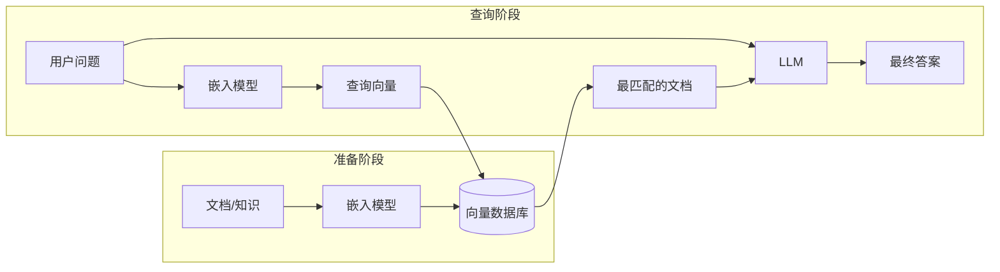

+++
title = "08.AI & Machine Learning Concepts"
description = "AI与机器学习核心概念速查：模型、训练、推理、前向计算、梯度、损失函数、Transformer、RAG、Agent、模型格式等全链路术语索引"
date = 2026-02-11
draft = false
[taxonomies]
tags = ["Glossary", "AI", "Machine Learning", "LLM", "Deep Learning", "Reference"]
[extra]
toc = true
+++

# AI & Machine Learning Concepts

本索引收录 AI 与机器学习领域的核心概念，每个概念包含：定义、为什么重要、关键要点，以及面向工程师的类比（便于有后端/系统经验的读者快速对接）。

> **配套文章**：[从模型诞生到 AI 应用：全链路认知](/articles/ai/ai-34-从模型诞生到AI应用全链路认知/)

---

## Model Fundamentals

### 1.1 Model (模型)

**定义**：由**参数（权重）**决定的、从输入到输出的**可计算函数**。给定输入，按固定结构和参数做数学运算，得到输出。

**为什么重要**：模型是整个 AI 系统的核心——训练的目标是得到模型（参数），推理是用模型算结果，应用层围绕模型的能力构建。

**关键要点**：
- **模型 ≠ 向量数据库**。模型是「函数」，不是「一堆现成答案等你来查」。
- 模型 = **结构（架构）** + **参数（权重）**。结构是人设计的，参数是训练出来的。
- 模型文件（`.pt`、`.onnx`、`.gguf` 等）里存的是**计算图 + 参数**，不是训练数据或向量库。

**四种更好的比喻**：

| 比喻 | 说明 |
|------|------|
| **函数 / 程序** | 输入 → 经过固定计算规则（由参数决定）→ 输出。换参数就换行为。 |
| **菜谱 + 调料配比** | 菜谱 = 计算图（先乘后加再激活）；调料配比 = 权重。训练 = 调配比。 |
| **可编程电路** | 结构固定，可调的是每条线上的「权重」。训练 = 调权重。 |
| **压缩后的统计规律** | 训练数据里的输入–输出关系，被压缩进有限参数里。 |

**工程师类比**：模型 ≈ 一个由参数决定的「黑盒服务」；模型文件 ≈ 把这个服务序列化存盘（像编译后的 `.so` 或容器镜像）。

---

### 1.2 Parameters and Weights (参数与权重)

**定义**：模型中所有**可调的数字**，通常组织成矩阵或张量。训练就是把这些数字从初始值调到合适的值。

**「参数」和「权重」是同一回事吗？** 在日常使用中**几乎等价**。严格地说：参数 = 权重（W）+ 偏置（b）+ 其他可训练张量。但业界习惯上「参数」和「权重」混用，说「这个模型有 70 亿参数」和「70 亿权重」表达的是同一件事。所以当你看到「模型 = 结构 + 参数」，这里的「参数」就是指**所有可调的数字（权重 + 偏置等）**。

**关键要点**：
- 一个线性层有**权重矩阵 W** 和**偏置 b**；Transformer 里每层有 Q/K/V 权重、MLP 权重等——这些统称**参数**。
- 小模型：几百万参数；大模型：几百亿到万亿参数。
- 训练前后**结构不变**，变的只是这些数字的取值。
- **初始化**：训练开始前需要给参数赋初值（如 Xavier、Kaiming 随机初始化），或加载已有预训练权重再继续训（微调）。

**工程师类比**：参数 ≈ 配置文件里的数值；训练 ≈ 用自动化工具（而非人工）不断调整这些数值直到系统行为满足指标。

---

### 1.3 Forward Pass (前向计算)

**定义**：输入从模型第一层开始，**一层一层往「前」算**，每一层的输出作为下一层的输入，直到最后一层输出最终结果。过程中**不回头、不跳步**，只沿一个方向走。

**为什么重要**：
- **推理 = 只做前向计算**（不做反向传播、不更新参数）。
- **训练也需要前向**（前向 → 算损失 → 反向 → 更新参数），但训练还额外做反向。
- 理解前向计算，就理解了「模型如何从输入得到输出」这一核心过程。

**一层在算什么（最常见的 Linear + Activation）**：

```
输入 x
  ↓
线性变换:  z = W · x + b    （W 是权重矩阵，b 是偏置）
  ↓
激活函数:  a = ReLU(z)       （如果 z > 0 输出 z，否则输出 0）
  ↓
输出 a（作为下一层的输入）
```

**多层堆叠 = 整个前向计算**：

```
输入 x
  → 第1层: z₁ = W₁·x + b₁   → a₁ = ReLU(z₁)
  → 第2层: z₂ = W₂·a₁ + b₂  → a₂ = ReLU(z₂)
  → ...
  → 第N层: z_N = W_N·a_{N-1} + b_N → 输出
```

每层的 W 和 b 是该层的**参数**；推理时这些数字**不变**，只是把输入一层层算到输出。

**前向 vs 反向对比**：

| | 前向计算 (Forward) | 反向传播 (Backward) |
|---|---|---|
| **方向** | 从输入 → 到输出 | 从输出（损失）→ 回到输入 |
| **做什么** | 算预测结果 | 算每个参数的梯度 |
| **什么时候用** | 训练和推理**都用** | **只在训练时**用 |
| **会改参数吗** | 不会 | 不直接改，但算出的梯度用来更新参数 |

**对于 LLM**：一次前向计算得到「下一个 token 的概率分布」；生成 100 个 token 就要做 **100 次**前向计算，所以长回答更慢。

**工程师类比**：前向计算 ≈ 一个请求经过 **middleware → handler → service → repository** 一层层处理最终返回响应——只不过每一层做的是矩阵乘法而不是业务逻辑。

---

### 1.4 Activation Function (激活函数)

**定义**：接在线性变换（W·x + b）后面的一个**非线性函数**，给模型引入非线性能力。

**为什么需要**：如果没有激活函数，多层线性变换叠加起来仍然是线性的（W₂·W₁·x = W_combined·x），模型再深也只能学线性关系。加了激活函数后，模型才能学习复杂的、非线性的输入–输出关系（如图像识别、语言理解）。

**常见激活函数**：

| 名称 | 公式 | 特点 |
|------|------|------|
| **ReLU** | max(0, x) | 最常用；简单高效；x<0 时输出 0 |
| **Sigmoid** | 1/(1+e⁻ˣ) | 输出在 (0,1)；常用于二分类输出层 |
| **Tanh** | (eˣ-e⁻ˣ)/(eˣ+e⁻ˣ) | 输出在 (-1,1)；零中心 |
| **GELU** | x·Φ(x) | Transformer 里常用；比 ReLU 平滑 |
| **SiLU/Swish** | x·σ(x) | 较新的大模型常用 |

**工程师类比**：激活函数 ≈ 每层 handler 里的「判断逻辑」——如果只有赋值和线性运算，无论多少层都只是直通管道；加了 if/判断/非线性，才能做复杂决策。

---

### 1.5 Loss Function (损失函数)

**定义**：衡量「模型当前输出」和「期望输出」差多少的**标量函数**。训练目标 = 最小化损失。

**为什么重要**：损失函数是训练的「指南针」——告诉优化器「当前模型差在哪里、差多少」，从而指导参数往哪个方向调。

**常见损失函数**：
- **交叉熵 (Cross Entropy)**：分类任务和语言模型最常用。衡量「预测概率分布」和「真实标签」之间的差距。预测越准，交叉熵越小。
- **MSE (均方误差)**：回归任务常用。
- **Perplexity (困惑度)**：语言模型专用指标，= e^(交叉熵)。越低说明模型对文本的预测越准。可以理解为「模型在每个位置平均有多少个同样可能的选择」——困惑度 10 意味着模型在每步像在 10 个选项里犹豫。

**工程师类比**：损失函数 ≈ 监控系统的 error rate 或 latency 指标——训练就是不断调参数让这个指标降到目标值。

---

### 1.6 Computational Graph (计算图)

**定义**：描述模型中**所有计算操作**及其**依赖关系**的有向图。每个节点是一个运算（如矩阵乘、加法、激活函数），边表示数据流向。

**计算图 = 结构 = 架构？** 三者密切相关：
- **架构（Architecture）**：人设计的「蓝图」——几层、每层什么类型、怎么连接。
- **结构（Structure）**：和架构含义几乎相同，指模型的拓扑形状。
- **计算图（Computational Graph）**：架构的**可执行表示**——把「蓝图」翻译成具体的运算节点和数据流。

三者在实践中经常互换使用。你可以理解为：**架构是设计图纸，计算图是施工完成后的电路板**——训练时计算图固定不变，只调参数（电路板上各连线的「权重」值）。

**训练阶段计算图固定吗？** 是的。一旦你选定了架构（如 12 层 Transformer、hidden_size=768），计算图就确定了。训练过程中**不会**改变层数、连接方式或运算类型——只会反复调整参数值。但在**训练之前的架构选型/设计阶段**，研究者会反复试不同的架构（层数、注意力头数、MLP 大小等），每次改架构就是改计算图。选定后才锁定开始训练。

**为什么重要**：
- 模型文件（如 ONNX）里存的就是「计算图 + 参数」。
- 推理引擎（如 TensorRT）通过**优化计算图**（算子融合、量化等）来加速推理。
- 反向传播也依赖计算图来追踪每个参数对损失的影响。

**工程师类比**：计算图 ≈ 编译后的程序的**执行流图**（类似 LLVM IR）；ONNX 文件 ≈ 可跨平台运行的中间表示。架构选型 ≈ 选定用什么语言/框架写程序；训练 ≈ 在框架确定后调参数；选型阶段可以换框架（改计算图），训练阶段不再换。

---

## Training

### 2.1 Training (训练)

**定义**：用数据反复调整模型参数，使模型在给定输入时的输出越来越接近期望结果。

**训练的五步循环**：
1. **前向传播**：用当前参数算一遍，得到预测输出
2. **算损失**：用损失函数比较预测和真实目标
3. **反向传播**：从损失往回算，得到每个参数的梯度
4. **更新参数**：优化器根据梯度调整每个参数
5. **重复**：换一批数据，再来一遍，直到损失足够低

**结果**：得到**一组确定的参数（权重）**。这组参数 + 固定的模型结构 = 模型。

**工程师类比**：训练 ≈ 用大量测试用例自动调参——每跑一批用例，计算偏差（损失），自动微调参数，直到所有用例的结果都满足精度要求。

---

### 2.2 Gradient (梯度)

**定义**：每个参数对损失函数的**偏导数**。直观地说：梯度告诉你「这个参数该往哪个方向、挪多少，能让损失下降」。

**为什么重要**：梯度是连接「损失」和「参数更新」的桥梁——没有梯度，就不知道怎么调参数。

**直观理解**：想象你站在山上（损失值 = 海拔），蒙着眼要走到山谷（最低损失）。梯度就是你脚下地面的**坡度方向**——它告诉你「往哪边走是下坡，坡有多陡」。

---

### 2.3 Backpropagation (反向传播)

**定义**：从损失值开始，**沿计算图反方向**，用链式法则逐层算出每个参数的梯度的过程。

**为什么需要**：模型有成百上千层、几十亿参数，不可能手动算「每个参数对损失的影响」。反向传播是一种**高效算法**，能自动、精确地一次性算出所有参数的梯度。

**链式法则**：高数里「复合函数求导」的规则。如果 y = f(g(x))，那么 dy/dx = f'(g(x)) · g'(x)。反向传播就是把链式法则应用到计算图的每一层：最终损失对某个参数的梯度 = 沿路径上所有「局部梯度」的乘积之和。

**直观理解**：前向计算是「从输入→输出」一层层算结果；反向传播是「从输出（损失）→输入」一层层**倒推**每个参数的责任：「这个参数对最终损失贡献了多少？该往哪调？」

**前向 vs 反向**：

| | 前向 | 反向 |
|---|---|---|
| 方向 | 输入 → 输出 | 损失 → 输入 |
| 计算内容 | 预测值 | 每个参数的梯度 |
| 用途 | 训练 + 推理 | 仅训练 |

---

### 2.4 Gradient Descent (梯度下降)

**定义**：沿梯度的**反方向**更新参数，使损失一步一步变小的优化算法。

**公式**：`参数_new = 参数_old - 学习率 × 梯度`

- **学习率**：每步挪多远。太大会跳过最优点，太小会收敛极慢。
- **SGD**：随机梯度下降，每次用一个 batch 的梯度近似全局梯度。
- **Adam**：目前最常用的优化器，结合了动量和自适应学习率。

**工程师类比**：梯度下降 ≈ **自动调参算法**——每一步看指标（损失）的反馈，按一定步长朝「指标变好」的方向调参数。

---

### 2.5 Optimizer (优化器)

**定义**：决定「如何根据梯度更新参数」的算法。不同优化器在步长、方向、历史信息利用上有不同策略。

**常见优化器**：

| 名称 | 特点 |
|------|------|
| **SGD** | 最基础；学习率固定；可能震荡 |
| **SGD + Momentum** | 加「惯性」，减少震荡，加速收敛 |
| **Adam** | 自适应学习率 + 动量；目前最常用 |
| **AdamW** | Adam + 权重衰减；大模型训练常用 |

---

### 2.6 Epoch

**定义**：将**整个训练数据集**完整过一遍称为一个 epoch（轮次）。

**关键要点**：
- 训练通常需要多个 epoch（几十到几百轮）。
- 每个 epoch 里，数据按 batch 分批处理。
- 过多 epoch 可能导致**过拟合**（模型对训练数据记太熟，对新数据表现差）。

---

### 2.7 Batch

**定义**：每一步训练中使用的**一小批样本**（如 32、128、256 条数据）。

**为什么用 batch 而不是全量数据**：
- 全量数据一起算会**占满显存**，物理上放不下。
- 用一个 batch 的平均梯度就足够估计「参数该往哪调」。
- 小批量带来的随机性有利于**泛化**（不过拟合）。

**训练流程中的位置**：一个 epoch = 把数据集切成多个 batch，每个 batch 做一次「前向 → 损失 → 反传 → 更新参数」。

---

### 2.8 VRAM (显存)

**定义**：GPU 上的专用内存，用于存储模型参数、中间激活值、梯度等。

**为什么重要**：
- 显存是训练和推理的**硬瓶颈**——模型太大或 batch 太大就放不下。
- 一张 A100 有 40GB 或 80GB 显存；GPT-3 级别模型（1750 亿参数）光存参数就需要 ~350GB（FP16），必须多卡并行。
- 推理时只需存参数和当前计算的中间值，显存需求比训练小得多（训练还需存梯度和优化器状态）。

**工程师类比**：显存 ≈ 服务器的 RAM——放不下就要分布式、用更大的机器或做压缩（量化）。

---

## Language Models & Transformer

### 3.1 Token (词元)

**定义**：模型处理文本的**最小单位**。模型不直接看「字」或「词」，而是把文本切成一段段 token 来处理。

**关键要点**：
- 一个 token 可以是一个词（如 "hello"）、一个子词（如 "un" + "happi" + "ness"）、一个字（中文常见）、甚至一个字节。
- 不同模型用不同的**分词方案**，同一句话切出来的 token 数量不同。
- 模型的「上下文长度」（如 4096、128K）指的是一次能处理的**最大 token 数**。

---

### 3.2 Tokenizer (分词器)

**定义**：把原始文本切成 token 序列的工具/算法。是模型的「前置处理器」。

**常见类型**：
- **BPE (Byte Pair Encoding)**：GPT 系列使用；从字节级开始，反复合并最频繁的相邻 pair。
- **WordPiece**：BERT 使用；类似 BPE。
- **SentencePiece**：语言无关，支持中日韩等；可做 BPE 或 Unigram。

**常见工具**：HuggingFace tokenizers、sentencepiece。

---

### 3.3 LLM (大语言模型)

**定义**：参数规模极大（数十亿到数万亿）的语言模型，在海量文本上预训练，具备**通用的语言理解与生成能力**。

**关键要点**：
- 代表：GPT-4、Claude、LLaMA、Qwen、Gemini 等。
- 核心架构：Transformer。
- 训练方式：自监督（「给定前文，预测下一个 token」）+ 可选的 RLHF/指令微调。
- 能力：问答、翻译、推理、代码生成、工具调用等——一个模型多任务。

**工程师类比**：LLM ≈ 一个「万能 API 服务」——输入是文本 prompt，输出是文本回复；通过改变 prompt 就能做不同任务，不需要为每个任务单独部署一个服务。

---

### 3.4 Transformer

**定义**：2017 年 Google 提出的神经网络架构，基于**自注意力机制 (Self-Attention)**，已成为 LLM 和众多 AI 模型的核心架构。

**为什么重要**：
- 取代了 RNN/LSTM，能并行处理整个序列，训练效率大幅提升。
- 自注意力让模型能「看到」输入中任意两个位置的关系，不受距离限制。
- GPT、BERT、LLaMA、ViT 等几乎所有当代明星模型都基于 Transformer。

**核心组件**（每个 Transformer 层）：
- **Multi-Head Self-Attention**：计算序列中每个 token 对其他所有 token 的「关注度」。
- **Feed-Forward Network (FFN/MLP)**：对每个 token 做独立的非线性变换。
- **Layer Norm + Residual Connection**：稳定训练、缓解梯度消失。

---

### 3.5 Autoregressive (自回归)

**定义**：一种生成方式——**一个 token 一个 token** 地顺序生成。每次生成一个新 token 后，把它拼到已有序列末尾，作为下一次生成的输入。

**关键要点**：
- GPT 类 LLM 都是自回归的：生成 N 个 token 需要做 **N 次前向计算**。
- 所以长回答比短回答更慢、更耗算力。
- 像「接龙」：每次只接一个词，直到生成结束符或达到长度上限。

---

### 3.6 Sampling (采样策略)

**定义**：模型每次前向计算得到的是「下一个 token 的概率分布」（每个可能的 token 各有一个概率），**采样策略**决定从这个分布中选哪个 token。

**常见策略**：

| 策略 | 做法 | 特点 |
|------|------|------|
| **argmax / greedy** | 直接选概率最高的 token | 确定性、不会「创造」，可能重复 |
| **top-k** | 只在概率最高的 k 个里随机采 | 限制候选范围，控制随机性 |
| **top-p (nucleus)** | 选概率累加到 p（如 0.9）为止的候选集 | 动态候选集，更灵活 |
| **temperature** | 调整分布的「平坦度」| 温度高→更随机；温度低→更确定 |

---

## Representation & Retrieval

### 4.1 Embedding (嵌入)

**定义**：把离散对象（如一个词、一段文本、一张图片）映射成一个**固定长度的连续向量**（一串浮点数）。语义相近的对象，向量在空间中也相近。

**为什么重要**：
- 计算机不懂文字，但懂数字。嵌入把「语义」转化成「可计算的向量」。
- 是 RAG、搜索、推荐、聚类等应用的基础。

---

### 4.2 Embedding Model (嵌入模型)

**定义**：专门用来「输入文本/图像 → 输出向量」的模型。

**常见模型**：sentence-transformers、text-embedding-ada-002 (OpenAI)、BGE、E5 等。

**与 LLM 的区别**：嵌入模型输出是**向量**（用于检索/比较），LLM 输出是**文本**（用于生成）。嵌入模型通常比 LLM 小得多，推理也快得多。

---

### 4.3 Vector Database (向量数据库)

**定义**：专门存储**向量**并支持**按相似度检索**的存储系统。存入一堆向量后，给定查询向量，能快速找出最相似的若干条。

**与模型的关键区别**：
- **模型** = 可计算的函数（输入→算→输出）；**向量库** = 存储 + 相似度搜索（存好的向量→查最近的）。
- 模型**生产**向量，向量库**存储和检索**向量。两者职责不同。

**常见向量数据库**：

| 名称 | 特点 |
|------|------|
| **Faiss** | Meta 开源；单机；高性能；易上手 |
| **Milvus** | 分布式；支持大规模；云原生 |
| **Qdrant** | Rust 编写；易用 API |
| **pgvector** | PostgreSQL 插件；适合已有 PG 的场景 |
| **Elasticsearch kNN** | ES 生态内；支持混合检索 |
| **Pinecone** | 托管服务；免运维 |

**工程师类比**：向量库 ≈ 一种「按相似度查」而非「按主键/关键词查」的存储引擎，和 Redis、MySQL 是互补关系。

---

### 4.4 Nearest Neighbor (最近邻搜索)

**定义**：给定查询向量，在向量库中找出与之距离最近（最相似）的 k 条记录。

**常用距离/相似度**：余弦相似度、欧氏距离、内积。

**近似最近邻 (ANN)**：精确搜索在大规模数据上太慢，实际用**近似算法**（如 HNSW、IVF）在精度和速度之间取平衡。

---

### 4.5 Chunk (文档分块)

**定义**：将长文档切成一截截的短片段（如 512 token 一段），每段称为一个 chunk。

**为什么需要**：
- 嵌入模型有最大长度限制，长文档必须切块。
- 切块后每段有独立向量，检索时能精确定位到「哪一段」和问题相关。
- 切块策略（大小、是否重叠、按段落/句子切）直接影响 RAG 效果。

---

## Model Formats & Deployment

### 5.1 ONNX (Open Neural Network Exchange)

**定义**：微软主导的**通用模型格式**——用标准化的计算图描述模型结构和参数，不依赖特定训练框架。

**为什么重要**：
- PyTorch / TensorFlow 等框架都可以**导出** ONNX。
- ONNX Runtime、TensorRT 等多种推理引擎都能**加载** ONNX。
- 实现「一次导出、多处部署」——跨语言（C++/Java/Go）、跨设备。

**ONNX 文件里有什么**：计算图（描述模型的运算流程）+ 权重（参数值）。**没有**训练数据、向量库或业务知识。

---

### 5.2 TensorRT

**定义**：NVIDIA 推出的高性能推理引擎，针对 NVIDIA GPU 做深度优化（算子融合、量化、内核自动调优）。

**适用场景**：在 NVIDIA GPU 上追求极致推理延迟和吞吐时使用。

---

### 5.3 GGUF and GGML

**定义**：llama.cpp 生态的模型格式，支持 CPU 推理和多种量化精度（INT4/INT8 等）。

**适用场景**：CPU 或边缘设备推理、本地部署、低资源环境。GGUF 是 GGML 的继任格式，更规范。

---

### 5.4 SafeTensors

**定义**：HuggingFace 推出的**安全权重存储格式**。只存权重张量，不含可执行代码，防止加载时执行恶意代码。

**适用场景**：与 HuggingFace 生态配合，安全地分享和加载大模型权重。

---

### 5.5 Inference (推理)

**定义**：拿已经训练好的**固定参数**，对**新的、未见过的输入**做前向计算，得到输出。

**关键要点**：
- 推理 = **只做前向**、**不做反向传播**、**不更新参数**。
- 参数在训练结束后就**冻结**了，推理时只读取、不修改。
- 推理比训练轻得多（不需存梯度、不需反传）。

**不同模型的推理举例**：

| 模型类型 | 输入 | 输出 | 推理在干嘛 |
|----------|------|------|------------|
| 图像分类 | 一张图 | 类别 / 概率 | 前向一遍，取概率最大的类别 |
| LLM | 文本上下文 | 下一个 token 的概率 | 自回归：前向 N 次，生成 N 个 token |
| 嵌入模型 | 一段文本 | 一个向量 | 前向一遍，取某层作为向量表示 |

**工程师类比**：推理 ≈ 无状态 API 服务——加载模型（≈ 启动服务），对每个请求做前向计算（≈ 处理请求），返回结果。可水平扩展、负载均衡。

---

### 5.6 Inference Engine (推理引擎)

**定义**：专门用于高效运行模型推理的软件系统。

**常见推理引擎**：

| 名称 | 特点 |
|------|------|
| **vLLM** | LLM 专用；PagedAttention、连续批处理；高吞吐 |
| **TGI (Text Generation Inference)** | HuggingFace 出品；生产级 LLM 推理 |
| **TensorRT-LLM** | NVIDIA 出品；TensorRT 优化的 LLM 引擎 |
| **llama.cpp** | C++ 实现；支持 CPU/GPU；本地推理 |
| **ONNX Runtime** | 通用推理；跨平台；支持多种硬件 |

**推理引擎解决的核心问题**：高吞吐、低延迟、显存优化、批处理、流式输出。

---

## Training Frameworks & Distributed

### 6.1 PyTorch

**定义**：Meta 开源的深度学习框架，当前**研究与工业界最主流**的训练框架。

**为什么成为主流**：
- **动态图**：代码即模型，调试像写 Python 一样自然。
- **研究界广泛采用**：论文和预训练模型基本都提供 PyTorch 版本。
- **生态成熟**：HuggingFace、TorchVision、Lightning 等完善。

**其他框架**：TensorFlow（Google，仍有一定存量）、JAX（Google，研究和部分大厂使用）。

---

### 6.2 Distributed Training (分布式训练)

**定义**：将训练任务分摊到多张 GPU / 多台机器上，以训练超大模型或加速训练。

**三种主要并行方式**：

| 方式 | 做法 | 适用场景 |
|------|------|----------|
| **数据并行 (Data Parallelism)** | 同一份模型复制多份，每份吃不同数据，梯度聚合后统一更新 | 模型放得下单卡，想加速 |
| **张量并行 (Tensor Parallelism)** | 把单层的大矩阵拆到多卡上算 | 单层太大放不下一卡 |
| **流水线并行 (Pipeline Parallelism)** | 不同层放到不同卡上，像流水线一样串起来 | 模型层数多，整体放不下一卡 |

**常用框架**：Megatron-LM、DeepSpeed、FSDP、Colossal-AI。

---

### 6.3 HuggingFace (HF)

**定义**：AI 领域最大的**模型与数据集开放平台**，同时提供 transformers、tokenizers、datasets 等核心库。

**为什么重要**：
- **Model Hub**：数万个预训练模型可直接下载使用。
- **transformers 库**：统一接口加载和使用各种模型，几行代码即可推理或微调。
- **已成为事实标准**：大多数开源模型都以 HF 格式发布。

---

## Application Layer

### 7.1 Prompt (提示)

**定义**：发给模型的**完整输入文本**——包括系统指令、上下文、用户问题等。可以理解为「你给模型出的完整题干」。

**为什么重要**：
- LLM 的行为完全由 prompt 驱动——同一个模型，不同 prompt 可以做不同任务。
- **Prompt Engineering**（提示工程）：通过设计 prompt 的格式、措辞、示例来提升模型输出质量，**不需要**修改模型参数。

**典型 prompt 结构（RAG 场景）**：
```
系统提示：你是一个助手。请根据以下文档回答问题。
文档：{检索到的文档片段}
用户问题：{用户的问题}
```

---

### 7.2 Fine-tuning (微调)

**定义**：在已有的预训练模型基础上，**继续用任务特定数据训练**（更新参数），使模型在特定任务上表现更好。

**与 Prompting 的区别**：

| | Prompting (提示) | Fine-tuning (微调) |
|---|---|---|
| 是否改参数 | **不改**，只改输入文本 | **改**，继续训练更新参数 |
| 需要数据 | 不需要（或几个示例） | 需要任务数据 |
| 需要算力 | 极少 | 较多 |
| 效果 | 快速试任务，效果可能一般 | 效果通常更好 |
| 适用场景 | 快速原型、通用任务 | 特定领域、高精度需求 |

---

### 7.3 RAG (检索增强生成)

**定义**：先**检索**相关文档，再把检索结果和用户问题一起交给 LLM **生成**答案。用「外部知识」补充模型自身不知道的信息。

**为什么需要 RAG**：
- LLM 的知识有**截止时间**，不包含最新信息。
- LLM 不包含你的**私域文档**（公司制度、产品手册等）。
- RAG 无需重新训练模型，只需维护文档和向量库。

**RAG 流程**：



**工程师类比**：RAG ≈ 「先查库 → 拼请求 → 调服务」——用向量库查相关文档，把文档和问题拼成 prompt，调 LLM 接口拿答案。和你熟悉的「查库 → 组装数据 → 调服务」是一样的套路。

---

### 7.4 AI Agent

**定义**：以 LLM 为「大脑」的自主系统——能**规划步骤、调用工具、根据结果再决策**，完成复杂任务。

**与普通 LLM 对话的区别**：
- 普通对话：用户问 → LLM 答，一来一回。
- Agent：LLM 自主思考「要完成这个任务，我需要先搜索、再计算、再调 API」，**多步执行**后返回结果。

**核心组件**：
- **LLM**：规划和推理。
- **Tools (工具)**：搜索、代码执行、查库、调 API 等。RAG 可视为一种检索工具。
- **编排框架**：把 LLM + 工具 + 人机交互串成完整流程。

---

### 7.5 Function Calling (函数调用)

**定义**：LLM 在生成过程中识别出「需要调用外部工具」，**输出结构化的函数调用请求**（函数名 + 参数），由应用层执行后把结果返回给 LLM。

**为什么重要**：是 Agent 能力的基础——让 LLM 从「只会说话」变成「能做事」。

---

### 7.6 ReAct

**定义**：**Re**asoning + **Act**ing 的组合模式。LLM 交替进行**推理**（思考下一步做什么）和**行动**（调用工具），直到完成任务。

**典型循环**：
```
思考：我需要查询用户的订单状态
行动：调用 query_order(order_id="12345")
观察：订单状态为「已发货」
思考：已经拿到信息，可以回答用户了
回答：您的订单已发货...
```

---

### 7.7 LangChain, LangGraph, LlamaIndex

**定义**：构建 LLM 应用（RAG、Agent 等）的主流编排框架。

| 框架 | 特点 |
|------|------|
| **LangChain** | 最流行的 LLM 应用框架；链式调用、工具集成、RAG 模板 |
| **LangGraph** | LangChain 团队出品；基于图的复杂 Agent 编排 |
| **LlamaIndex** | 专注 RAG；文档索引和检索能力强 |
| **Semantic Kernel** | 微软出品；.NET/Python；企业级 |
| **CrewAI** | 多 Agent 协作框架 |

---

## LLM Theory

### 8.1 Pre-training (预训练)

**定义**：在**海量无标注数据**上用自监督目标训练模型，使其学到**通用的语言/视觉表示和推理能力**。

**LLM 的预训练数据**：互联网文本、书籍、代码、多语种语料等——数万亿 token。
**预训练目标**：「给定前文，预测下一个 token」——看似简单，但在海量数据上规模化后，模型学会了语法、事实、推理和多种能力。

---

### 8.2 Self-supervised Learning (自监督学习)

**定义**：不需要人工标注的训练方式——从数据本身构造监督信号。

**LLM 的例子**：把文本的「下一个词」当作标签——输入「今天天气」，标签是「很好」。数据本身就提供了标签，不需要人去标。

---

### 8.3 Scaling Laws (规模定律)

**定义**：大量实验表明，随着**数据量、参数量、算力**同时增大，模型在各类任务上的表现会**持续、可预测地提升**。

**为什么重要**：
- 给了「做大模型」明确的回报预期——投入更多资源，性能就会按规律提升。
- 推动业界不断堆规模，从 GPT-2 (1.5B) → GPT-3 (175B) → GPT-4 (传闻万亿级)。
- 目前还没有明确的「天花板」，所以规模竞赛仍在继续。

---

### 8.4 Emergence (涌现)

**定义**：在模型达到一定规模后，**突然出现**训练目标里没有显式要求的**新能力**。

**例子**：
- 零样本/少样本泛化（不给示例或只给几个就能做新任务）
- 多步推理
- 按指令执行
- 使用工具
- 代码生成

**为什么重要**：涌现意味着大模型不只是「量变」——规模到一定程度后会发生「质变」，出现小模型完全不具备的能力。这也是大模型「出圈」的核心原因。

---

## Traditional Machine Learning

### 9.1 Feature Engineering (特征工程)

**定义**：由人工从原始数据中**设计、提取、组合**出对预测有用的特征（变量），再喂给模型训练。

**为什么在传统 ML 里极其重要**：
- 传统模型（如 LR、GBDT）不能直接从原始数据学习复杂表示。
- 模型的上限由特征质量决定——特征不好，模型再好也没用。

**举例（点击率预估）**：
- 原始数据：用户点击日志
- 人工特征：「用户过去 7 天点击次数」「物品类别」「时间戳是否周末」「用户-物品交叉特征」等
- 这些特征需要领域知识，由人设计，再喂给 LR/GBDT 训练。

**与大模型的对比**：大模型（端到端学习）跳过了特征工程——模型自己从原始数据学习表示。这是大模型和传统 ML 的核心区别之一。

---

### 9.2 LR (线性模型)

**定义**：
- **Linear Regression（线性回归）**：用线性函数拟合连续值。
- **Logistic Regression（逻辑回归）**：在线性回归基础上加 Sigmoid 激活，输出概率，用于分类。

**在 ML 中的地位**：最基础的模型之一；简单、可解释、训练快。在推荐系统、广告点击率预估中仍广泛使用。

---

### 9.3 GBDT (梯度提升树)

**定义**：一种集成学习方法——由多棵决策树串联组成，每棵新树拟合前一轮的**残差**（预测误差），最终把所有树的预测加在一起。

**在 ML 中的地位**：传统 ML 中**最强**的表格数据模型之一。XGBoost、LightGBM、CatBoost 都是 GBDT 的高效实现。在推荐、风控、CTR（点击率）等领域广泛使用。

---

## Further Reading

- [从模型诞生到 AI 应用：全链路认知](/articles/ai/ai-34-从模型诞生到AI应用全链路认知/)
- [推理系统工程师 C++ 入门学习计划](/articles/ai/ai-33-推理系统工程师C++入门学习计划/)
- [AI 推理系统架构概述](/articles/ai-infra/infra-01-AI推理系统架构概述/)
- [Linux & System Concepts](/articles/00-glossary/glossary-01-linux-concepts/)
- [C++ Concepts](/articles/00-glossary/glossary-05-cpp-concepts/)

---

## Related Articles

- [上一篇：Rust Concepts](/articles/00-glossary/glossary-07-rust-concepts/)
