+++
title = "01 - AI 推理系统架构概述"
description = "深入理解 AI 推理系统的核心架构、关键组件与设计原则"
date = 2025-02-06
updated = 2025-02-06
draft = false
[taxonomies]
tags = ["推理系统", "AI Infra", "系统架构", "LLM"]
[extra]
toc = true
comments = true
+++

## 一、什么是推理系统

### 1.1 训练 vs 推理

AI 模型的生命周期分为两个阶段：

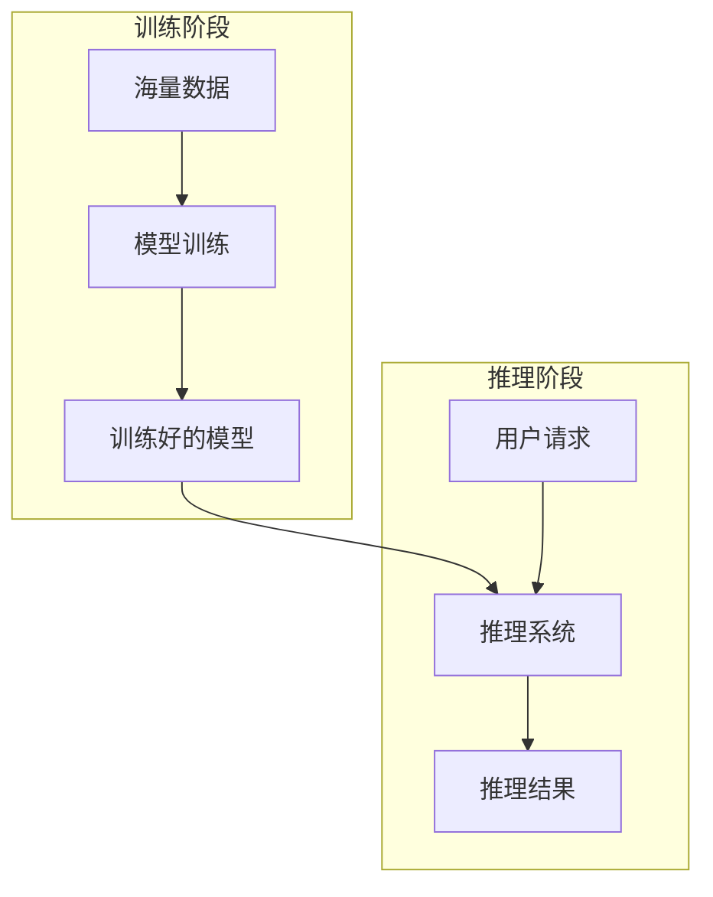
```mermaid
graph TB
    subgraph "训练阶段"
        D[海量数据] --> T[模型训练]
        T --> M[训练好的模型]
    end
    
    subgraph "推理阶段"
        M --> I[推理系统]
        R[用户请求] --> I
        I --> O[推理结果]
    end
```

| 特性 | 训练 | 推理 |
|------|------|------|
| 目标 | 学习模型参数 | 使用模型预测 |
| 频率 | 一次或定期 | 持续高频 |
| 延迟要求 | 不敏感 | 敏感 |
| 批量大小 | 越大越好 | 受延迟约束 |
| 资源使用 | 可以离线 | 需要在线 |

### 1.2 推理系统的定义

**推理系统**是一套软件系统，负责：
- 接收用户请求
- 管理计算资源
- 执行模型推理
- 返回推理结果

简单说：**让模型能够持续、高效、可靠地服务用户请求**。

### 1.3 为什么需要专门的推理系统

**问题**：直接用 PyTorch 循环推理不行吗？

```python
# 朴素方案
for request in requests:
    output = model(request.input)
    return output
```

**朴素方案的问题**：

| 问题 | 影响 |
|------|------|
| 无法并发 | 单线程处理，GPU 利用率低 |
| 无 Batching | 每次只处理一个请求 |
| 显存浪费 | 无法复用 KV Cache |
| 无法扩展 | 单机单卡限制 |
| 无容错 | 一个请求失败影响全部 |

**推理系统的价值**：

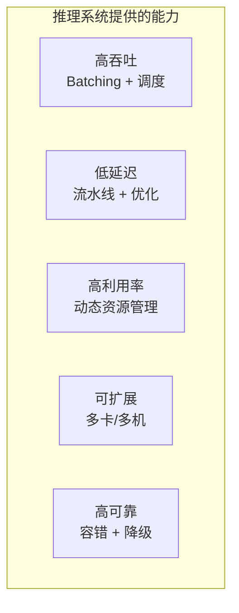
```mermaid
graph TB
    subgraph "推理系统提供的能力"
        C1[高吞吐<br>Batching + 调度]
        C2[低延迟<br>流水线 + 优化]
        C3[高利用率<br>动态资源管理]
        C4[可扩展<br>多卡/多机]
        C5[高可靠<br>容错 + 降级]
    end
```

---

## 二、推理系统架构全景

### 2.1 整体架构

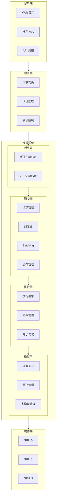
```mermaid
graph TB
    subgraph Client["客户端"]
        C1[Web 应用]
        C2[移动 App]
        C3[API 调用]
    end
    
    subgraph Gateway["网关层"]
        LB[负载均衡]
        AUTH[认证鉴权]
        RATE[限流控制]
    end
    
    subgraph InferenceSystem["推理系统"]
        subgraph API["API 层"]
            HTTP[HTTP Server]
            GRPC[gRPC Server]
        end
        
        subgraph Core["核心层"]
            REQ[请求管理]
            SCH[调度器]
            BAT[Batching]
            CACHE[缓存管理]
        end
        
        subgraph Engine["执行层"]
            EXEC[执行引擎]
            MEM[显存管理]
            OPT[算子优化]
        end
        
        subgraph Model["模型层"]
            LOAD[模型加载]
            QUANT[量化管理]
            MULTI[多模型管理]
        end
    end
    
    subgraph Hardware["硬件层"]
        GPU1[GPU 0]
        GPU2[GPU 1]
        GPUN[GPU N]
    end
    
    Client --> Gateway --> API
    API --> Core --> Engine --> Model --> Hardware
```

### 2.2 数据流

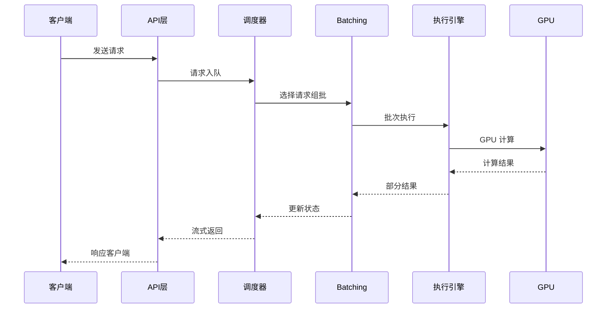
```mermaid
sequenceDiagram
    participant C as 客户端
    participant A as API层
    participant S as 调度器
    participant B as Batching
    participant E as 执行引擎
    participant G as GPU
    
    C->>A: 发送请求
    A->>S: 请求入队
    S->>B: 选择请求组批
    B->>E: 批次执行
    E->>G: GPU 计算
    G-->>E: 计算结果
    E-->>B: 部分结果
    B-->>S: 更新状态
    S-->>A: 流式返回
    A-->>C: 响应客户端
```

---

## 三、核心组件详解

### 3.1 API 层

**职责**：接收请求、协议处理、响应返回

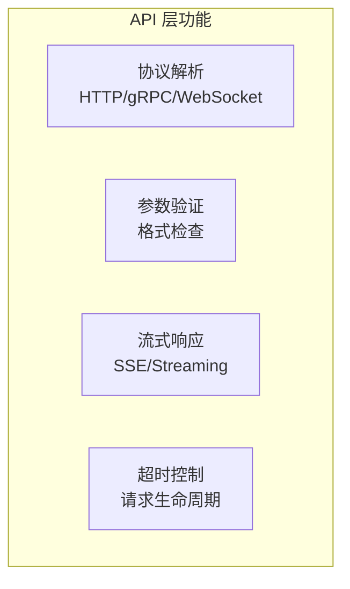
```mermaid
graph TB
    subgraph "API 层功能"
        P1[协议解析<br>HTTP/gRPC/WebSocket]
        P2[参数验证<br>格式检查]
        P3[流式响应<br>SSE/Streaming]
        P4[超时控制<br>请求生命周期]
    end
```

**关键设计点**：

| 设计点 | 考虑因素 |
|--------|----------|
| 协议选择 | HTTP 简单通用，gRPC 高效 |
| 流式输出 | LLM 需要边生成边返回 |
| 并发模型 | 异步非阻塞处理大量连接 |
| 超时处理 | 长时间请求的优雅中断 |

---

### 3.2 请求管理

**职责**：管理请求生命周期

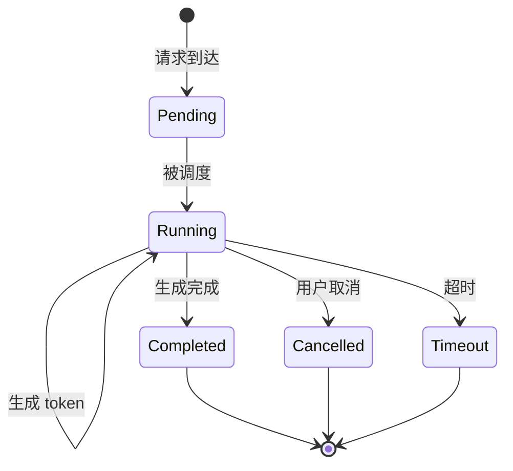
```mermaid
stateDiagram-v2
    [*] --> Pending: 请求到达
    Pending --> Running: 被调度
    Running --> Running: 生成 token
    Running --> Completed: 生成完成
    Running --> Cancelled: 用户取消
    Running --> Timeout: 超时
    Completed --> [*]
    Cancelled --> [*]
    Timeout --> [*]
```

**请求状态**：

| 状态 | 含义 |
|------|------|
| Pending | 等待调度 |
| Prefilling | 处理输入 prompt |
| Decoding | 生成输出 token |
| Completed | 正常完成 |
| Cancelled | 被取消 |
| Failed | 执行失败 |

---

### 3.3 调度器

**职责**：决定哪些请求在什么时候执行

这是推理系统的**核心大脑**。

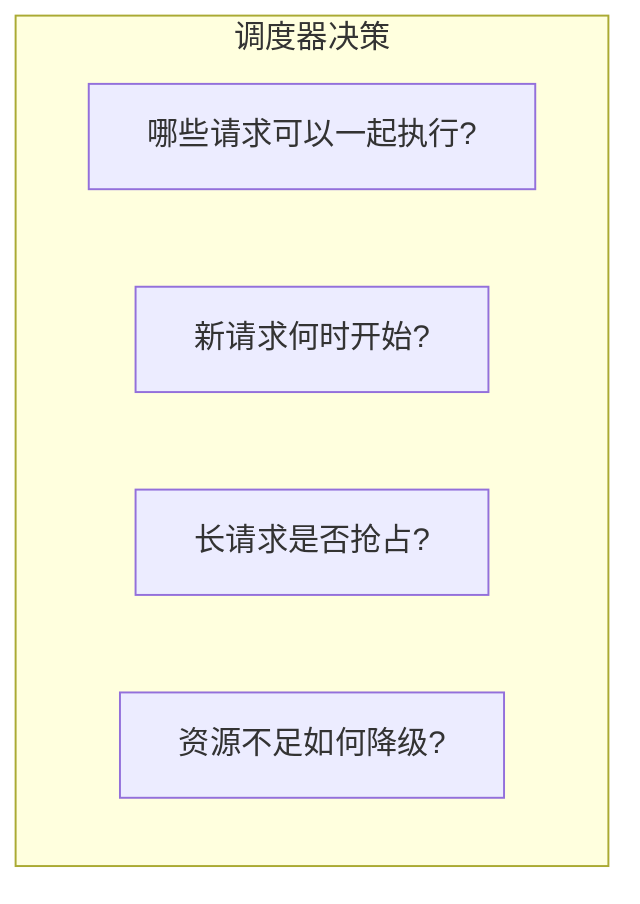
```mermaid
graph TB
    subgraph "调度器决策"
        Q1[哪些请求可以一起执行?]
        Q2[新请求何时开始?]
        Q3[长请求是否抢占?]
        Q4[资源不足如何降级?]
    end
```

**调度策略类型**：

| 策略 | 描述 | 适用场景 |
|------|------|----------|
| FCFS | 先来先服务 | 简单场景 |
| SJF | 短任务优先 | 延迟敏感 |
| Priority | 优先级调度 | 差异化服务 |
| Fair | 公平调度 | 多租户 |
| Preemptive | 抢占式 | 避免长尾 |

**调度器需要考虑的因素**：

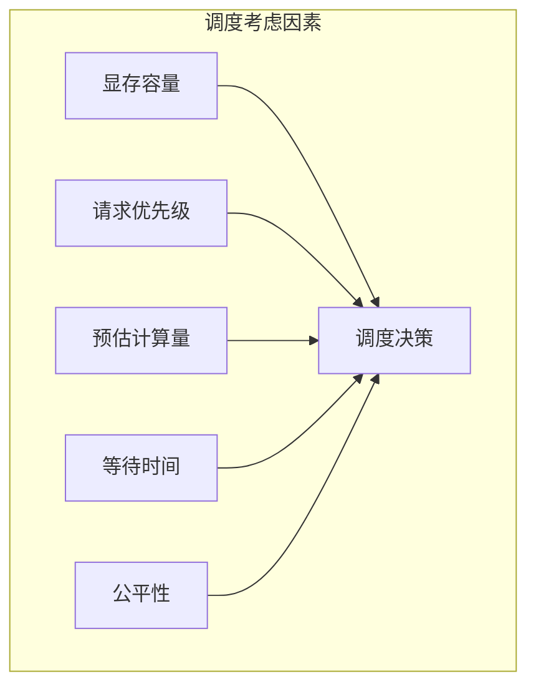
```mermaid
graph TB
    subgraph "调度考虑因素"
        F1[显存容量] --> D[调度决策]
        F2[请求优先级] --> D
        F3[预估计算量] --> D
        F4[等待时间] --> D
        F5[公平性] --> D
    end
```

---

### 3.4 Batching 模块

**职责**：将多个请求组合成批次执行

**为什么需要 Batching**：

```
单请求执行 vs 批量执行：

单请求（Batch=1）：
  GPU 计算：████░░░░░░░░░░░░  GPU 利用率 ~25%
  
批量执行（Batch=8）：
  GPU 计算：████████████████  GPU 利用率 ~100%
```

**Batching 演进**：

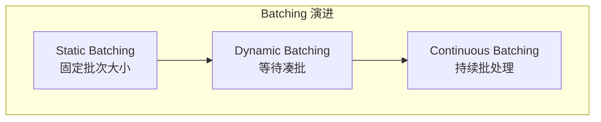
```mermaid
graph TB
    subgraph "Batching 演进"
        B1[Static Batching<br>固定批次大小]
        B2[Dynamic Batching<br>等待凑批]
        B3[Continuous Batching<br>持续批处理]
        
        B1 --> B2 --> B3
    end
```

| 类型 | 描述 | 优点 | 缺点 |
|------|------|------|------|
| Static | 固定 batch size | 简单 | 利用率低 |
| Dynamic | 等待一定时间凑批 | 提高利用率 | 增加延迟 |
| Continuous | 完成即退出，新请求即加入 | 高利用率+低延迟 | 实现复杂 |

---

### 3.5 执行引擎

**职责**：实际执行模型计算

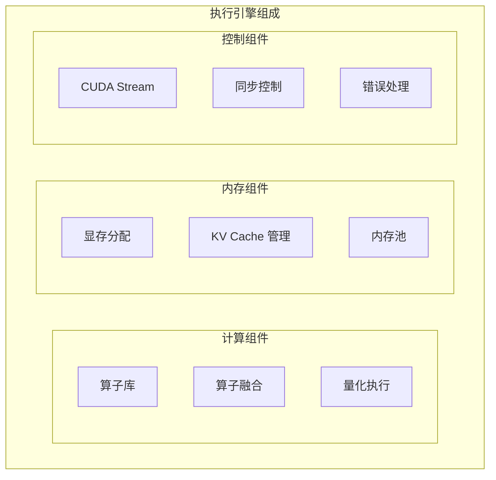
```mermaid
graph TB
    subgraph "执行引擎组成"
        subgraph Compute["计算组件"]
            OP[算子库]
            FUSE[算子融合]
            QUANT[量化执行]
        end
        
        subgraph Memory["内存组件"]
            ALLOC[显存分配]
            KVC[KV Cache 管理]
            POOL[内存池]
        end
        
        subgraph Control["控制组件"]
            STREAM[CUDA Stream]
            SYNC[同步控制]
            ERR[错误处理]
        end
    end
```

**执行引擎的关键技术**：

| 技术 | 作用 |
|------|------|
| CUDA Stream | 并行执行多个操作 |
| 算子融合 | 减少 Kernel 启动和内存访问 |
| 混合精度 | FP16/BF16/INT8 加速 |
| 内存池 | 减少显存分配开销 |

---

### 3.6 显存管理

**职责**：高效管理有限的 GPU 显存

**LLM 推理显存组成**：

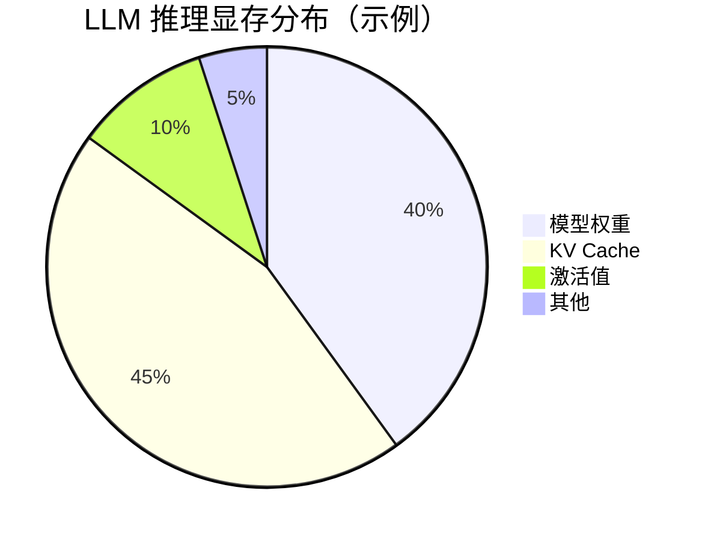
```mermaid
pie title LLM 推理显存分布（示例）
    "模型权重" : 40
    "KV Cache" : 45
    "激活值" : 10
    "其他" : 5
```

**关键挑战**：

| 挑战 | 原因 |
|------|------|
| KV Cache 动态增长 | 每生成一个 token 增加一份 |
| 请求长度不确定 | 无法预知最终长度 |
| 碎片化 | 请求完成后留下空洞 |

**解决方案：PagedAttention**

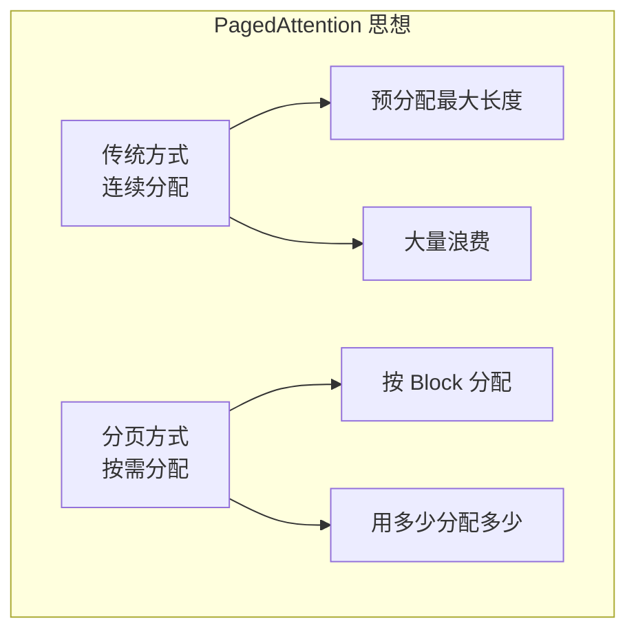
```mermaid
graph TB
    subgraph "PagedAttention 思想"
        T[传统方式<br>连续分配]
        P[分页方式<br>按需分配]
        
        T --> T1[预分配最大长度]
        T --> T2[大量浪费]
        
        P --> P1[按 Block 分配]
        P --> P2[用多少分配多少]
    end
```

---

### 3.7 模型管理

**职责**：加载、管理、切换模型

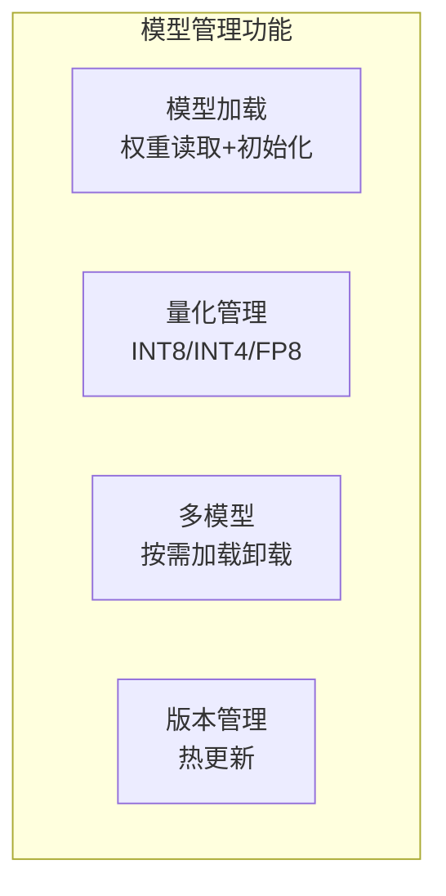
```mermaid
graph TB
    subgraph "模型管理功能"
        L[模型加载<br>权重读取+初始化]
        Q[量化管理<br>INT8/INT4/FP8]
        M[多模型<br>按需加载卸载]
        V[版本管理<br>热更新]
    end
```

**模型加载优化**：

| 优化 | 方法 |
|------|------|
| 并行加载 | 多线程读取权重文件 |
| 延迟加载 | 按需加载层 |
| 共享权重 | 多实例共享同一份权重 |
| 预热 | 提前加载常用模型 |

---

## 四、LLM 推理的特殊性

### 4.1 自回归生成

LLM 的推理不是一次性计算，而是**逐 token 生成**。

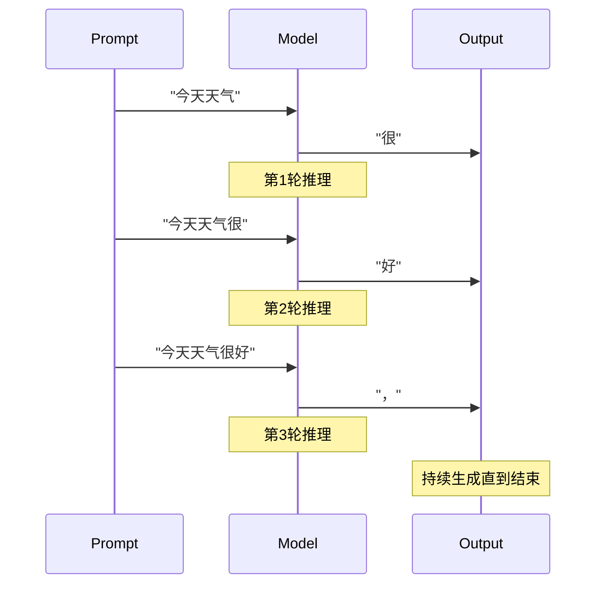
```mermaid
sequenceDiagram
    participant P as Prompt
    participant M as Model
    participant O as Output
    
    P->>M: "今天天气"
    M->>O: "很"
    Note over M: 第1轮推理
    
    P->>M: "今天天气很"
    M->>O: "好"
    Note over M: 第2轮推理
    
    P->>M: "今天天气很好"
    M->>O: "，"
    Note over M: 第3轮推理
    
    Note over O: 持续生成直到结束
```

### 4.2 Prefill 与 Decode

LLM 推理分为两个阶段：

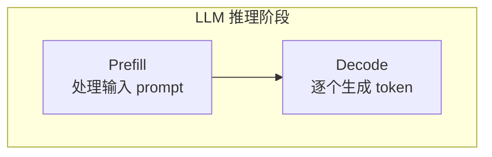
```mermaid
graph TB
    subgraph "LLM 推理阶段"
        P[Prefill<br>处理输入 prompt]
        D[Decode<br>逐个生成 token]
        
        P --> D
    end
```

| 阶段 | 特点 | 瓶颈 |
|------|------|------|
| Prefill | 一次处理所有输入 token | 计算密集 |
| Decode | 每次生成一个 token | 内存带宽 |

**Prefill 是计算密集型**：
```
Attention 计算：O(n²·d)
n = prompt 长度，可能很长
```

**Decode 是访存密集型**：
```
每步只生成 1 个 token
但需要访问全部 KV Cache
```

### 4.3 KV Cache

为什么需要缓存 K 和 V？

```
不用缓存：
  生成第 n 个 token 时，重新计算前 n-1 个 token 的 K, V
  计算量：O(n) × O(n) = O(n²)

使用缓存：
  缓存前 n-1 个 token 的 K, V
  只计算第 n 个 token 的 K, V
  计算量：O(n)
```

**KV Cache 的代价**：

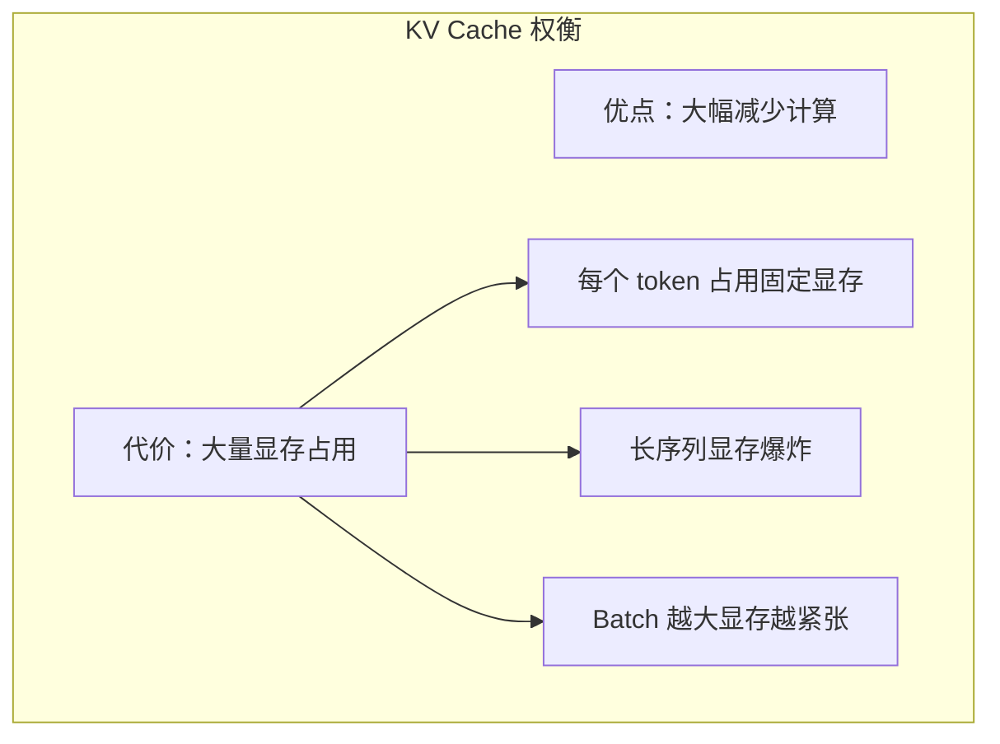
```mermaid
graph TB
    subgraph "KV Cache 权衡"
        B[优点：大幅减少计算]
        C[代价：大量显存占用]
        
        C --> C1[每个 token 占用固定显存]
        C --> C2[长序列显存爆炸]
        C --> C3[Batch 越大显存越紧张]
    end
```

---

## 五、关键性能指标

### 5.1 指标定义

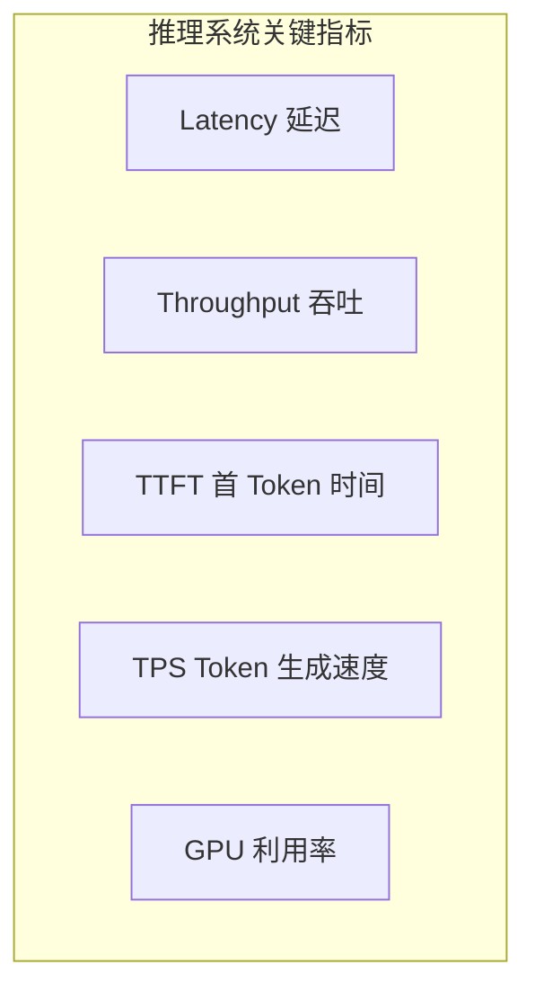
```mermaid
graph TB
    subgraph "推理系统关键指标"
        M1[Latency 延迟]
        M2[Throughput 吞吐]
        M3[TTFT 首 Token 时间]
        M4[TPS Token 生成速度]
        M5[GPU 利用率]
    end
```

| 指标 | 定义 | 单位 |
|------|------|------|
| Latency | 请求总耗时 | ms |
| TTFT | Time To First Token | ms |
| TPS | Tokens Per Second | tokens/s |
| Throughput | 单位时间处理请求数 | req/s |
| GPU Util | GPU 计算利用率 | % |

### 5.2 指标间的权衡

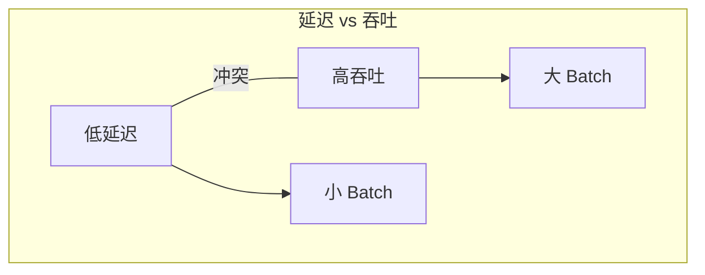
```mermaid
graph TB
    subgraph "延迟 vs 吞吐"
        L[低延迟] ---|冲突| T[高吞吐]
        
        L --> L1[小 Batch]
        T --> T1[大 Batch]
    end
```

**经典权衡**：
- **增大 Batch** → 提高吞吐，但增加延迟
- **减小 Batch** → 降低延迟，但降低吞吐

**目标**：找到满足延迟 SLA 的前提下最大化吞吐

### 5.3 影响因素

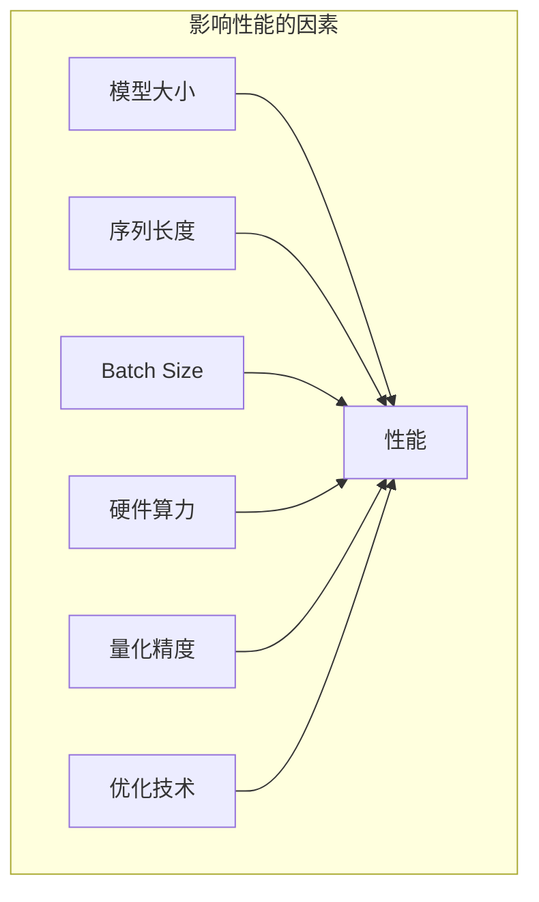
```mermaid
graph TB
    subgraph "影响性能的因素"
        F1[模型大小] --> P[性能]
        F2[序列长度] --> P
        F3[Batch Size] --> P
        F4[硬件算力] --> P
        F5[量化精度] --> P
        F6[优化技术] --> P
    end
```

---

## 六、主流推理系统对比

### 6.1 开源推理系统

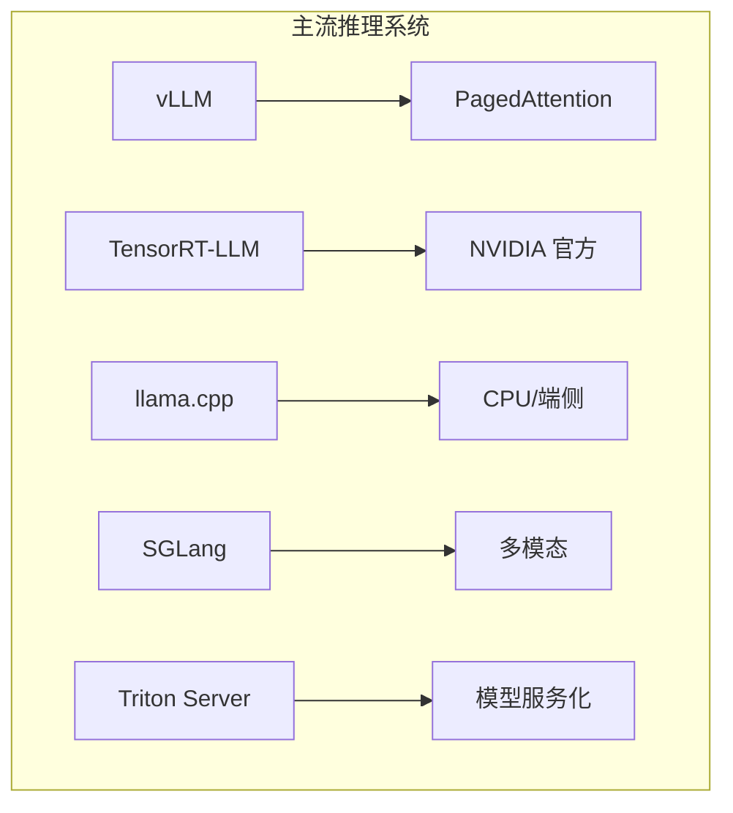
```mermaid
graph TB
    subgraph "主流推理系统"
        V[vLLM] --> V1[PagedAttention]
        T[TensorRT-LLM] --> T1[NVIDIA 官方]
        L[llama.cpp] --> L1[CPU/端侧]
        S[SGLang] --> S1[多模态]
        TR[Triton Server] --> TR1[模型服务化]
    end
```

### 6.2 特性对比

| 系统 | 主要特点 | 技术栈 | 适用场景 |
|------|----------|--------|----------|
| vLLM | PagedAttention、高吞吐 | Python+CUDA | 通用 LLM 服务 |
| TensorRT-LLM | NVIDIA 优化、低延迟 | C++ | 生产环境 |
| llama.cpp | 跨平台、CPU 推理 | C/C++ | 端侧/资源受限 |
| SGLang | 多模态、结构化生成 | Python | 复杂场景 |
| Triton Server | 多模型、企业级 | C++ | 企业部署 |

### 6.3 选型建议

```mermaid
graph TB
    Start[选型起点]
    
    Start --> Q1{需要 CPU 推理?}
    Q1 -->|是| L[llama.cpp]
    Q1 -->|否| Q2{追求极致性能?}
    
    Q2 -->|是| T[TensorRT-LLM]
    Q2 -->|否| Q3{需要企业级特性?}
    
    Q3 -->|是| TR[Triton Server]
    Q3 -->|否| V[vLLM]
```

---

## 七、架构设计原则

### 7.1 高性能原则

```mermaid
graph TB
    subgraph "高性能设计原则"
        P1[异步非阻塞]
        P2[零拷贝]
        P3[批量处理]
        P4[预分配复用]
        P5[并行流水]
    end
```

| 原则 | 实践 |
|------|------|
| 异步非阻塞 | 使用 async/await，CUDA Stream |
| 零拷贝 | 避免 CPU-GPU 数据拷贝 |
| 批量处理 | Continuous Batching |
| 预分配复用 | 内存池、对象池 |
| 并行流水 | 计算与通信重叠 |

### 7.2 可扩展原则

```mermaid
graph TB
    subgraph "可扩展设计"
        S1[模块化] --> E[可扩展]
        S2[插件化] --> E
        S3[配置化] --> E
    end
```

- **模块化**：各组件解耦，独立演进
- **插件化**：支持自定义调度器、执行器
- **配置化**：参数可调，无需改代码

### 7.3 可靠性原则

```mermaid
graph TB
    subgraph "可靠性设计"
        R1[优雅降级]
        R2[故障隔离]
        R3[健康检查]
        R4[限流熔断]
    end
```

- **优雅降级**：资源不足时降低服务质量而非拒绝
- **故障隔离**：单请求失败不影响其他请求
- **健康检查**：自动检测和恢复
- **限流熔断**：防止过载

---

## 八、发展趋势

### 8.1 近期趋势

| 趋势 | 描述 |
|------|------|
| Speculative Decoding | 投机解码加速 |
| 更长上下文 | 支持 1M+ tokens |
| 多模态推理 | 图文音视频混合 |
| 边缘部署 | 端侧推理能力 |

### 8.2 长期趋势

```mermaid
graph TB
    subgraph "长期趋势"
        T1[标准化<br>API/协议统一]
        T2[智能化<br>自动调优]
        T3[异构化<br>多硬件支持]
        T4[分布式<br>跨节点推理]
    end
```

---

## 九、总结

### 9.1 核心认知

1. **推理系统不只是调用模型**
   - 涉及调度、内存、并发等系统问题
   - 是 AI 与系统工程的交汇点

2. **LLM 推理有独特挑战**
   - 自回归生成导致需要 KV Cache
   - Prefill 和 Decode 特性不同

3. **性能优化是核心价值**
   - 吞吐提升直接降低成本
   - 延迟优化直接提升体验

4. **架构设计需要权衡**
   - 延迟 vs 吞吐
   - 复杂度 vs 性能

### 9.2 学习路径

```mermaid
graph TB
    S1[理解架构全貌] --> S2[深入单个组件]
    S2 --> S3[阅读开源代码]
    S3 --> S4[动手实践]
```

---

## 相关文章

- [下一篇：02 - LLM 推理优化全景](/articles/ai-infra/infra-02-LLM推理优化全景/)
- [30 - 从 CUDA 算子到推理系统](/articles/ai/ai-30-从CUDA算子到推理系统/)
- [25 - FlashAttention 与 PagedAttention 原理](/articles/ai/ai-25-FlashAttention与PagedAttention原理/)
