+++
title = "02 - LLM 推理优化全景"
description = "系统梳理 LLM 推理优化的各个维度，从算子到系统的完整视角"
date = 2025-02-06
updated = 2025-02-06
draft = false
[taxonomies]
tags = ["LLM", "推理优化", "AI Infra", "性能优化"]
[extra]
toc = true
comments = true
+++

## 一、优化的目标与约束

### 1.1 核心目标

LLM 推理优化追求的是在**约束条件下**最大化性能。

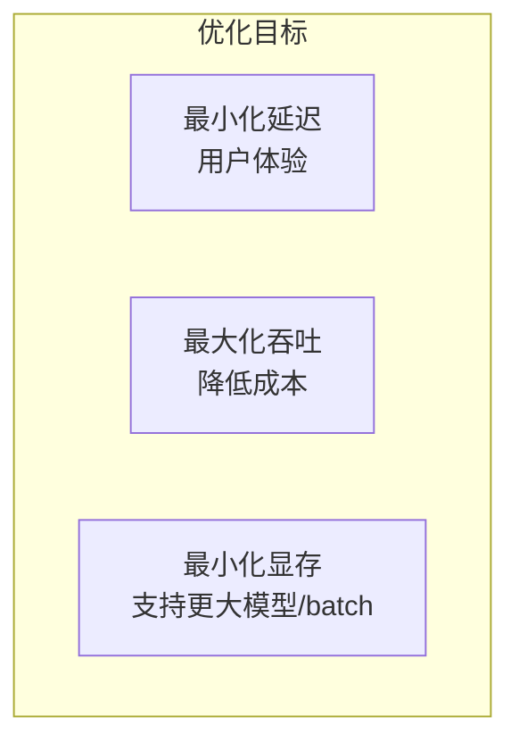

### 1.2 约束条件

| 约束 | 说明 |
|------|------|
| 硬件限制 | GPU 显存、算力、带宽 |
| 精度要求 | 输出质量不能下降太多 |
| 延迟 SLA | 首 token、端到端延迟 |
| 成本预算 | 硬件采购和运营成本 |

### 1.3 优化层次

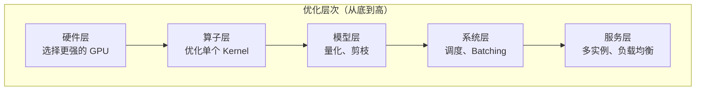

**关键认知**：不同层次的优化相互独立又相互影响，需要综合考虑。

---

## 二、模型层优化

### 2.1 量化（Quantization）

**核心思想**：用更少的比特表示权重和激活值

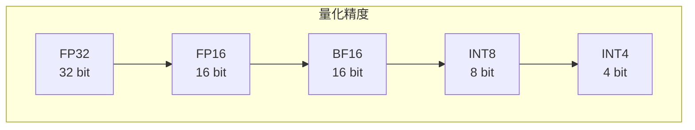

**量化收益**：

| 精度 | 显存占比 | 速度提升 | 精度损失 |
|------|----------|----------|----------|
| FP32 | 100% | 1x | 0 |
| FP16 | 50% | ~2x | 极小 |
| INT8 | 25% | ~2-4x | 小 |
| INT4 | 12.5% | ~4-8x | 中等 |

**量化类型**：

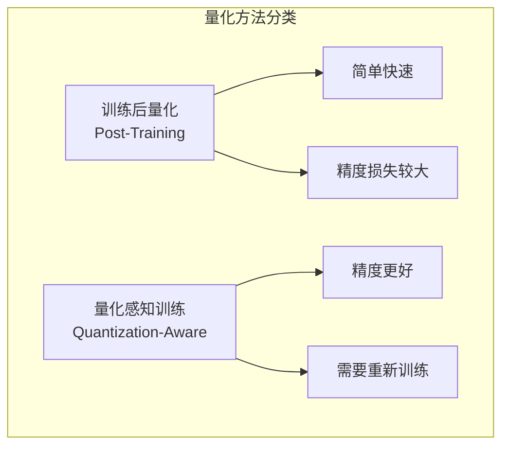

**主流量化格式**：

| 格式 | 特点 |
|------|------|
| GPTQ | 逐层量化，精度较好 |
| AWQ | 激活感知，保护重要权重 |
| GGUF | llama.cpp 使用，多种量化级别 |
| FP8 | H100 原生支持，精度损失小 |

---

### 2.2 注意力变体

**从 MHA 到 GQA**：减少 KV Cache 显存

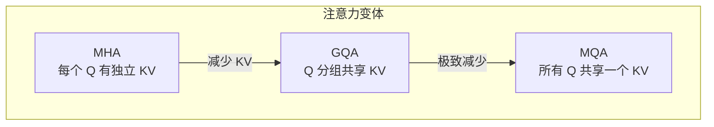

**效果对比**：

| 方法 | KV Cache 大小 | 质量影响 |
|------|---------------|----------|
| MHA | 100% | 基准 |
| GQA-8 | 12.5% | 很小 |
| MQA | 1/n_heads | 中等 |

---

### 2.3 剪枝与稀疏

**结构化剪枝**：移除整个神经元或注意力头

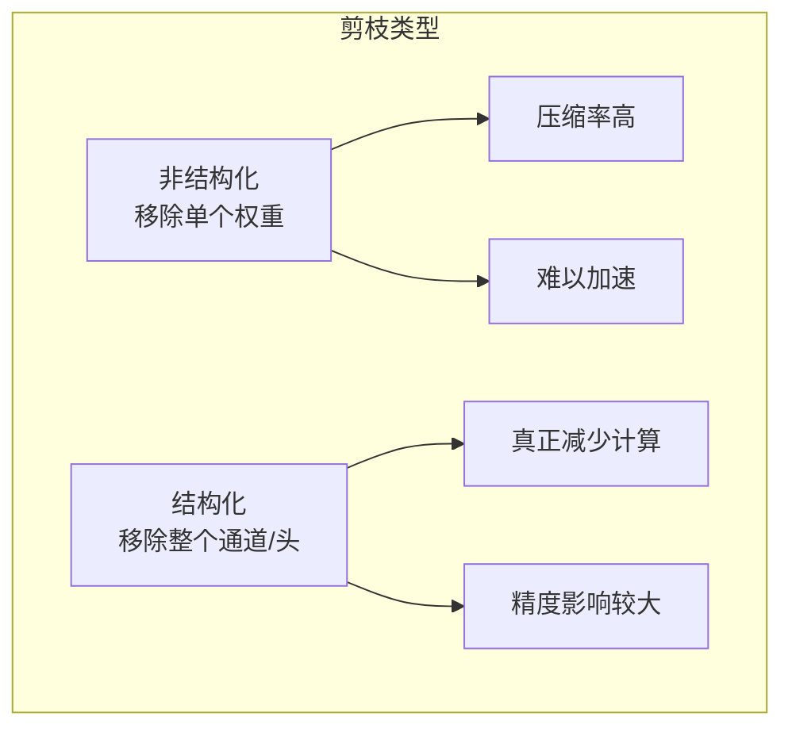

---

### 2.4 知识蒸馏

**小模型学习大模型**：

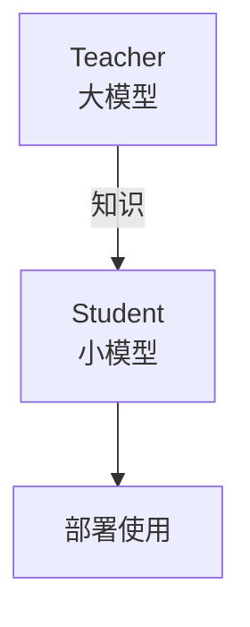

---

## 三、算子层优化

### 3.1 FlashAttention

**核心问题**：标准 Attention 的显存访问瓶颈

```
标准 Attention：
1. Q × K^T → S (N×N 矩阵，需要存储)
2. softmax(S) → P
3. P × V → O

问题：S 和 P 都是 N×N，序列长了显存爆炸
```

**FlashAttention 思想**：分块计算 + 在线 Softmax

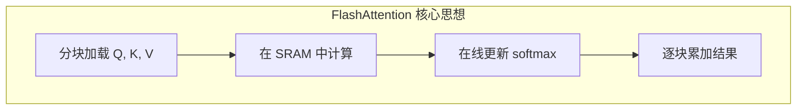

**效果**：
- 显存：O(N²) → O(N)
- 速度：2-4x 加速
- IO：减少 HBM 访问

---

### 3.2 FlashDecoding

**针对 Decode 阶段的优化**：

Decode 阶段特点：
- Query 只有 1 个 token
- 但要访问全部 KV Cache
- 是**访存密集型**

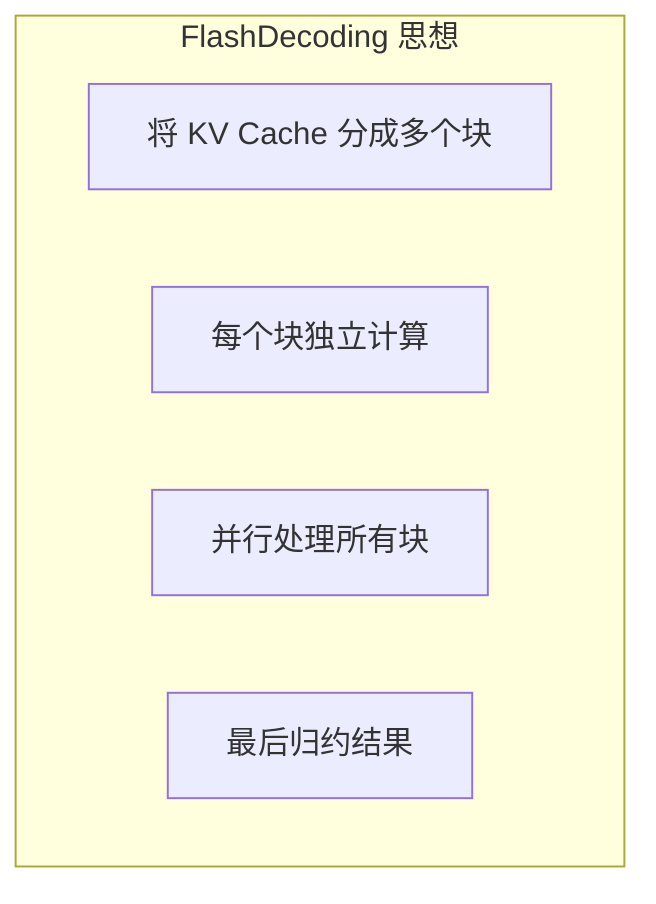

---

### 3.3 算子融合

**减少 Kernel 启动和内存访问**：

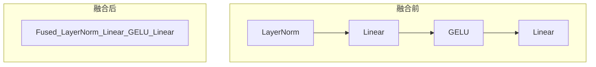

**常见融合**：
- Attention 内部融合（QKV projection）
- FFN 融合（Linear + Activation）
- LayerNorm + Linear
- Residual + LayerNorm

---

### 3.4 Tensor Core 利用

**充分利用硬件特性**：

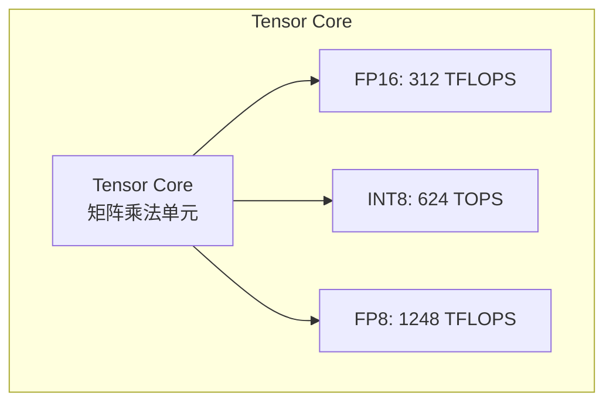

**使用要求**：
- 矩阵维度是 8/16 的倍数
- 使用特定数据类型
- 使用 WMMA 或 CUTLASS

---

## 四、系统层优化

### 4.1 Continuous Batching

**传统 Batching 的问题**：

```
Static Batching：
请求1: ████████████████████  （长）
请求2: ████████              （短）
请求3: ██████████████        （中）

请求2 完成后必须等待，GPU 空闲
```

**Continuous Batching**：

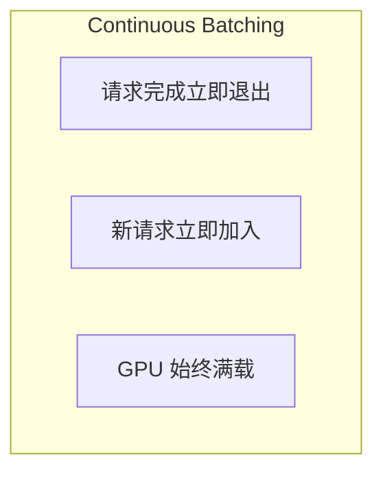

```
Continuous Batching：
请求1: ████████████████████
请求2: ████████ → 退出 → 新请求4 加入
请求3: ██████████████ → 退出 → 新请求5 加入

GPU 始终有足够工作
```

---

### 4.2 PagedAttention

**KV Cache 的显存问题**：

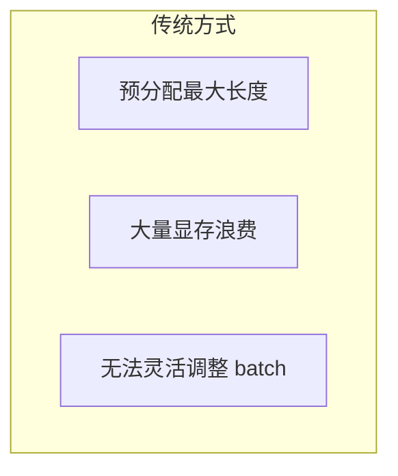

**PagedAttention 解决方案**：

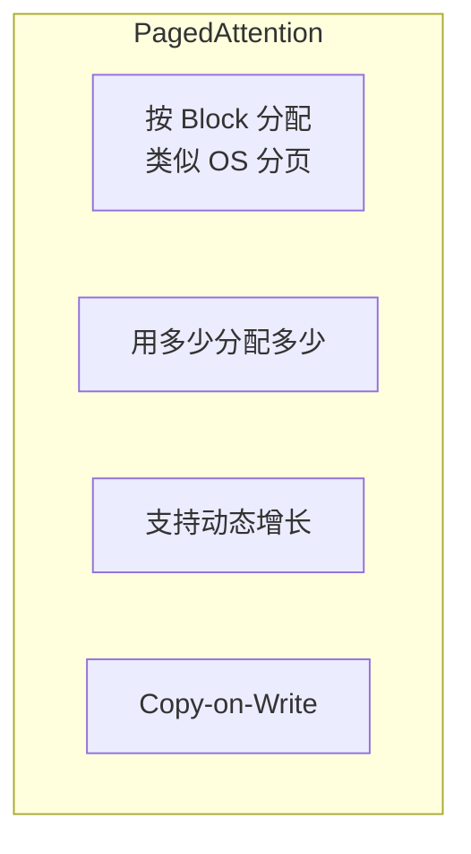

**效果**：
- 显存利用率：~50% → ~95%
- 支持更大 batch size
- 支持更长序列

---

### 4.3 Speculative Decoding

**核心思想**：用小模型猜测，大模型验证

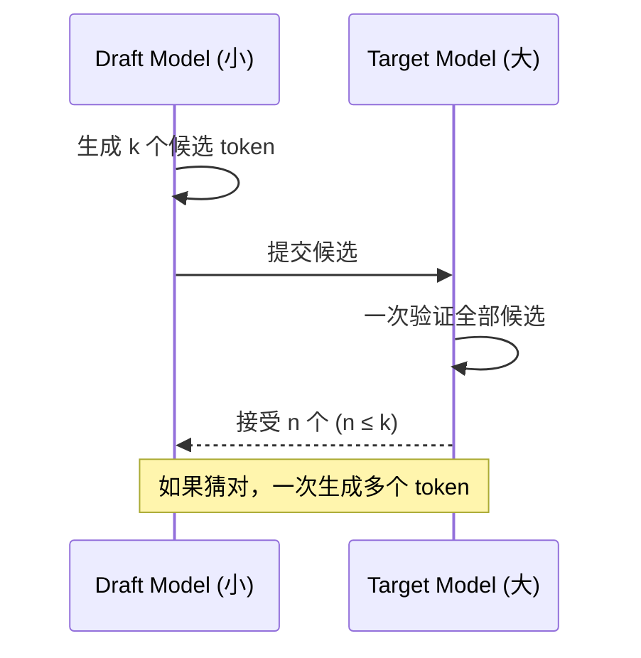

**效果**：
- 接受率高时：2-3x 加速
- 接受率低时：无加速但也无损失
- 输出质量：完全一致（数学保证）

#### 4.3.1 Tree-based Speculative Decoding（树结构投机解码）

##### 为什么树结构优于线性结构？

线性 Speculative Decoding 每次让 draft model 自回归生成 k 个 token，形成一条单链。问题在于：如果第 i 个 token 被拒绝，后续所有 token 全部作废，**浪费了 draft model 的计算和 target model 的验证能力**。

树结构的核心思想：**一次 draft 生成多条候选路径（tree branches），target model 并行验证所有分支**。

```
线性 Speculative Decoding：
draft: t1 → t2 → t3 → t4 → t5
       ✓    ✓    ✗    废弃  废弃
结果：只接受 2 个 token

树结构 Speculative Decoding：
              t1
            / | \
          t2a t2b t2c
         / \   |   \
       t3a t3b t3c  t3d
       
target model 一次验证所有节点
可能接受路径: t1 → t2b → t3c（3 个 token）
即使 t2a 被拒绝，t2b 路径仍可接受
```

**树结构的关键优势**：

| 维度 | 线性投机 | 树结构投机 |
|------|----------|------------|
| 每步候选 token 数 | k（链长） | 树中所有节点数（可达数十个） |
| 验证并行度 | k 个 token 顺序依赖 | 所有分支并行验证 |
| 接受率上界 | 受链式依赖限制 | 多路径提升期望接受数 |
| draft model 调用次数 | k 次自回归 | 取决于树深度 |
| target model 调用开销 | 一次 forward（k tokens） | 一次 forward（N_tree tokens） |

##### 主流树结构方法对比

**SequoiaTree**：

SequoiaTree 是一种**动态最优树拓扑选择算法**。核心思想是根据 draft model 在当前 context 下的 token 概率分布，动态构建使**期望接受 token 数最大化**的树结构。

```python
# SequoiaTree 核心算法伪码
def build_sequoia_tree(draft_model, context, budget):
    """
    给定计算预算（树中最大节点数），构建最优树拓扑
    
    Args:
        draft_model: draft 模型
        context: 当前上下文
        budget: 树中最大 token 数（受 target model 一次能验证的上限约束）
    """
    # Step 1: 用 draft model 对每个位置生成 top-k 候选
    root_logits = draft_model(context)
    root_probs = softmax(root_logits)
    
    # Step 2: 用动态规划选择最优树拓扑
    # 目标：最大化 E[accepted_tokens]
    # 约束：总节点数 ≤ budget
    tree = greedy_tree_construction(root_probs, budget)
    
    # Step 3: 对树中每个节点，用 draft model 生成候选
    for node in tree.bfs_order():
        child_logits = draft_model(context + node.path)
        node.children = select_top_children(child_logits, node.max_children)
    
    return tree

def greedy_tree_construction(probs, budget):
    """
    贪心构建：优先扩展期望收益最高的节点
    期望收益 = 该节点被接受的概率 × 子树期望接受数
    """
    tree = Tree(root)
    priority_queue = MaxHeap()
    
    for token, prob in top_k(probs):
        priority_queue.push((prob, token, depth=1))
    
    while len(tree) < budget and not priority_queue.empty():
        prob, token, depth = priority_queue.pop()
        node = tree.add_node(token, prob, depth)
        
        # 为新节点生成子候选
        child_probs = draft_model.predict(node.path)
        for child_token, child_prob in top_k(child_probs):
            # 子节点的有效概率 = 父节点接受概率 × 自身条件概率
            effective_prob = prob * acceptance_probability(child_prob)
            priority_queue.push((effective_prob, child_token, depth + 1))
    
    return tree
```

**Medusa**：

Medusa 在 target model 本身上添加多个额外的**预测头（prediction heads）**，每个头独立预测未来第 i 个位置的 token。

```
Target Model (e.g., LLaMA-70B):
    hidden_state = transformer_layers(input)
    
    head_0: predict token at position t+1  (原始 LM head)
    head_1: predict token at position t+2  (新增 Medusa head)
    head_2: predict token at position t+3  (新增 Medusa head)
    head_3: predict token at position t+4  (新增 Medusa head)
    ...

每个 Medusa head 结构：
    Linear(hidden_dim, vocab_size)  # 或带一层 residual block
```

Medusa 的树构建方式：从各 head 的 top-k 预测中做**笛卡尔积**，形成候选树。

```python
# Medusa 树构建
def medusa_tree_candidates(heads_topk, tree_indices):
    """
    heads_topk: List[Tensor], 每个 head 的 top-k token 及概率
    tree_indices: 预定义的树拓扑模板
    
    例如 tree_indices 定义:
    [(0,), (0,0), (0,1), (1,), (1,0)]
    表示:
    - head_1 的 top-1 token
    - head_1 top-1 → head_2 top-1
    - head_1 top-1 → head_2 top-2
    - head_1 的 top-2 token
    - head_1 top-2 → head_2 top-1
    """
    candidates = []
    for path in tree_indices:
        tokens = []
        for depth, idx in enumerate(path):
            tokens.append(heads_topk[depth][idx])
        candidates.append(tokens)
    return candidates
```

**EAGLE（Extrapolation Algorithm for Greater Language-model Efficiency）**：

EAGLE 不预测 token，而是预测 **hidden state（特征向量）**，然后用 target model 的原始 LM head 将 hidden state 映射为 token。

```
EAGLE 架构：
1. 取 target model 倒数第二层的 hidden state: h_t
2. 将 h_t 与 token embedding e_t 拼接
3. 通过轻量级 Transformer 层预测 h_{t+1}
4. 用原始 LM head 将 h_{t+1} 映射为 token 分布

优势：
- feature-level 预测比 token-level 预测更平滑、更易学习
- 共享原始 LM head，不引入额外 vocabulary 映射偏差
- draft 质量显著优于同参数量的 token-level draft model
```

```python
# EAGLE draft model 结构
class EAGLEDraftModel(nn.Module):
    def __init__(self, hidden_dim, num_layers=1):
        self.fc = nn.Linear(hidden_dim * 2, hidden_dim)  # concat(h_t, e_t) → h
        self.transformer_layer = TransformerDecoderLayer(hidden_dim)
        # 不需要自己的 LM head，复用 target model 的
    
    def forward(self, hidden_state, token_embedding):
        """
        hidden_state: target model 的 hidden state [batch, seq_len, hidden_dim]
        token_embedding: 对应 token 的 embedding [batch, seq_len, hidden_dim]
        """
        x = torch.cat([hidden_state, token_embedding], dim=-1)
        x = self.fc(x)
        x = self.transformer_layer(x)
        return x  # 预测的下一步 hidden state
```

**三种方法对比**：

| 维度 | Medusa | EAGLE | SequoiaTree |
|------|--------|-------|-------------|
| Draft 来源 | target model 附加头 | 轻量 Transformer 预测 hidden state | 外部 draft model |
| 额外参数量 | 小（几个 Linear 层） | 中（1-2 层 Transformer） | 独立 draft model |
| 训练成本 | 低（只训练新增头） | 中（训练 feature predictor） | 无（直接用小模型） |
| Draft 质量 | 中等 | 高（feature-level） | 取决于 draft model |
| 树构建方式 | 固定拓扑模板 | 动态 | 动态最优 |
| 推理额外开销 | 极小 | 小 | draft model forward |
| 典型加速比 | 2.0-2.5x | 2.5-3.5x | 2.0-3.0x |

##### Tree Attention Mask 构建

树结构 Speculative Decoding 的核心技术挑战之一是：**如何构建正确的 attention mask，使得树中每个节点只能 attend 到它的祖先节点（而非同层兄弟节点）**。

标准 causal attention mask 是一个下三角矩阵，假设 token 序列是线性的。但树结构中，token 之间的依赖关系是**树形**的。

```python
# 树结构 Attention Mask 构建
def build_tree_attention_mask(tree):
    """
    构建树结构的 causal attention mask
    
    树结构示例：
        node_0 (root)
        ├── node_1
        │   ├── node_3
        │   └── node_4
        └── node_2
            └── node_5
    
    parent_indices = [-1, 0, 0, 1, 1, 2]
    （-1 表示 root 无父节点）
    """
    n = len(tree.nodes)
    mask = torch.zeros(n, n, dtype=torch.bool)
    
    for i, node in enumerate(tree.nodes):
        # 每个节点可以 attend 到自身
        mask[i][i] = True
        # 以及它的所有祖先节点
        ancestor = node.parent
        while ancestor is not None:
            mask[i][ancestor.index] = True
            ancestor = ancestor.parent
    
    return mask  # mask[i][j] = True 表示 node_i 可以 attend 到 node_j

# 示例输出（对应上面的树）：
# mask = 
#        node0  node1  node2  node3  node4  node5
# node0:   1      0      0      0      0      0
# node1:   1      1      0      0      0      0
# node2:   1      0      1      0      0      0
# node3:   1      1      0      1      0      0
# node4:   1      1      0      0      1      0
# node5:   1      0      1      0      0      1
```

结合 prefix context（已有的 KV Cache），完整的 mask 构建如下：

```python
def build_full_tree_attention_mask(prefix_len, tree):
    """
    完整的 attention mask，包含 prefix（已验证 token）和 tree（候选 token）
    
    维度: [tree_size, prefix_len + tree_size]
    tree 中的每个 token 都可以 attend 到所有 prefix token
    """
    tree_size = len(tree.nodes)
    total_len = prefix_len + tree_size
    
    # 所有 tree token 都可以 attend 到 prefix
    mask = torch.zeros(tree_size, total_len, dtype=torch.bool)
    mask[:, :prefix_len] = True  # attend to all prefix tokens
    
    # tree 内部的 mask
    tree_mask = build_tree_attention_mask(tree)  # [tree_size, tree_size]
    mask[:, prefix_len:] = tree_mask
    
    return mask
```

##### Tree Attention 实现：修改标准 Causal Attention

在实际实现中，需要将树 mask 整合到 FlashAttention 或标准 Attention 计算中：

```python
# 方法1: 使用自定义 mask 的标准 Attention
def tree_attention(query, key, value, tree_mask, prefix_kv_cache):
    """
    query: [batch, num_heads, tree_size, head_dim]  (树中所有候选 token)
    key, value: 包含 prefix KV Cache + 树节点的 KV
    tree_mask: [tree_size, prefix_len + tree_size]
    """
    # 拼接 prefix KV Cache 和当前树节点的 KV
    full_key = torch.cat([prefix_kv_cache.key, key], dim=2)
    full_value = torch.cat([prefix_kv_cache.value, value], dim=2)
    
    # 计算 attention scores
    scores = torch.matmul(query, full_key.transpose(-2, -1)) / math.sqrt(head_dim)
    
    # 应用树 mask（将不可 attend 的位置设为 -inf）
    scores = scores.masked_fill(~tree_mask.unsqueeze(0).unsqueeze(0), float('-inf'))
    
    attn_weights = torch.softmax(scores, dim=-1)
    output = torch.matmul(attn_weights, full_value)
    return output

# 方法2: 使用 position_ids 处理树结构
# 树中同一深度的节点共享相同的 position_id
def get_tree_position_ids(tree, prefix_len):
    """
    树中每个节点的 position_id = prefix_len + depth_in_tree
    兄弟节点有相同的 position_id（因为它们代表同一位置的不同候选）
    """
    position_ids = []
    for node in tree.nodes:
        position_ids.append(prefix_len + node.depth)
    return torch.tensor(position_ids)
```

**注意**：在使用 RoPE (Rotary Position Embedding) 时，树中同层兄弟节点应该使用**相同的 position id**，因为它们代表的是同一个时间步的不同候选。

##### Token Tree 验证：并行验证与接受/拒绝逻辑

```python
def verify_tree_candidates(target_model, tree, prefix_kv_cache, temperature=1.0):
    """
    用 target model 一次 forward 验证树中所有候选 token
    
    Returns:
        accepted_path: 被接受的最长路径
        next_token: 路径末尾由 target model 采样的新 token
    """
    # Step 1: 构建树 attention mask 和 position ids
    tree_mask = build_full_tree_attention_mask(prefix_kv_cache.seq_len, tree)
    position_ids = get_tree_position_ids(tree, prefix_kv_cache.seq_len)
    tree_tokens = torch.tensor([node.token_id for node in tree.nodes])
    
    # Step 2: target model 一次 forward 处理所有树节点
    # 输出: 每个树节点位置的 next-token 概率分布
    target_logits = target_model(
        input_ids=tree_tokens,
        position_ids=position_ids,
        attention_mask=tree_mask,
        past_key_values=prefix_kv_cache
    )  # [1, tree_size, vocab_size]
    target_probs = softmax(target_logits / temperature, dim=-1)
    
    # Step 3: 从 root 开始，逐层验证（但所有层的 logits 已经并行算好了）
    accepted_path = []
    current_node = tree.root
    
    while current_node.children:
        parent_idx = current_node.index
        target_dist = target_probs[0, parent_idx]  # target model 在该位置的分布
        
        # 对每个子节点进行 rejection sampling
        best_child = None
        for child in current_node.children:
            draft_prob = child.draft_probability  # draft model 给该 token 的概率
            target_prob = target_dist[child.token_id].item()
            
            # 接受概率 = min(1, target_prob / draft_prob)
            accept_prob = min(1.0, target_prob / draft_prob)
            
            r = torch.rand(1).item()
            if r < accept_prob:
                best_child = child
                break  # 接受这个子节点
        
        if best_child is None:
            # 所有子节点都被拒绝，从修正分布中采样
            # 修正分布: max(0, target_dist - draft_dist) / Z
            draft_dist = torch.zeros(vocab_size)
            for child in current_node.children:
                draft_dist[child.token_id] = child.draft_probability
            
            corrected = torch.clamp(target_dist - draft_dist, min=0)
            corrected = corrected / corrected.sum()
            next_token = torch.multinomial(corrected, 1)
            accepted_path.append(next_token.item())
            break
        else:
            accepted_path.append(best_child.token_id)
            current_node = best_child
    
    if current_node.children is None or len(current_node.children) == 0:
        # 到达叶子节点，所有候选都被接受
        # 用 target model 在叶子位置的分布采样一个额外 token
        next_token = torch.multinomial(target_probs[0, current_node.index], 1)
        accepted_path.append(next_token.item())
    
    return accepted_path

# 关键点：
# 1. target model 只需要一次 forward pass（所有树节点并行计算）
# 2. 验证是 post-hoc 的：先算完所有 logits，再逐层检查
# 3. 接受一条从根到某叶子的路径（贪心选择第一个被接受的分支）
```

##### 最优树拓扑选择

给定 draft model 质量（用 acceptance rate α 近似），如何选择树的宽度和深度？

```
设:
- α = draft model 单 token 平均接受率
- B = 计算预算（树中最大节点数）
- W = 每层宽度（分支因子）
- D = 树深度

约束: 总节点数 ≈ (W^D - 1)/(W - 1) ≤ B

目标: 最大化 E[accepted_tokens]

分析:
- 深度 D 较大: 单条路径长，但后续节点接受率 α^d 衰减快
- 宽度 W 较大: 每层多个候选，提高该层至少一个被接受的概率
  P(至少一个被接受) = 1 - (1-α)^W

最优策略（近似）:
- α 高 (> 0.8): 偏向更深的树（draft 质量好，单路径即可走远）
- α 中 (0.5-0.8): 平衡宽度和深度
- α 低 (< 0.5): 偏向更宽的树（需要更多候选来对冲低接受率）
```

| 接受率 α | 推荐拓扑 | 预算 B=63 时的配置示例 |
|----------|----------|----------------------|
| 0.9 | 深而窄 | W=2, D=6 (63 nodes) |
| 0.7 | 平衡 | W=4, D=3 (21 nodes) |
| 0.5 | 宽而浅 | W=8, D=2 (9 nodes/subtree) |
| 0.3 | 极宽极浅 | W=16, D=1 + top candidates |

#### 4.3.2 Batch > 1 Speculative Decoding

##### 核心挑战：变长接受

在 batch 推理中，不同序列的 draft token 接受数量不同，这导致了**变长更新问题**：

```
Batch 中 4 个序列的 speculative decoding 结果：

序列 0: draft 5 tokens → 接受 5 个 (全部接受！)
序列 1: draft 5 tokens → 接受 2 个
序列 2: draft 5 tokens → 接受 4 个
序列 3: draft 5 tokens → 接受 1 个

问题：每个序列需要不同数量的 token 追加到 KV Cache
      下一步的起始位置不同
      如何在 batch 维度上对齐？
```

##### 处理策略

**策略 1: Padding 对齐**

```python
# 最简单的方法：以最少接受数为准，截断所有序列
def conservative_batch_accept(accepted_counts, max_draft=5):
    """
    保守策略：所有序列接受相同数量的 token
    
    缺点：浪费了接受率高的序列的优势
    """
    min_accepted = min(accepted_counts)
    # 所有序列只保留 min_accepted 个 token
    return [min_accepted] * len(accepted_counts)

# 或者：以最大接受数为准，短的序列填充 padding token
def padded_batch_accept(accepted_counts, draft_tokens, target_probs):
    """
    Padding 策略：接受数不足的序列，补充 target model 采样的 token
    
    优势：保留所有序列的投机收益
    缺点：padding 部分仍需要计算
    """
    max_accepted = max(accepted_counts)
    padded_tokens = []
    for i, count in enumerate(accepted_counts):
        tokens = draft_tokens[i][:count]
        # 不足部分从 target model 分布采样补齐
        while len(tokens) < max_accepted:
            new_token = sample(target_probs[i][len(tokens)])
            tokens.append(new_token)
        padded_tokens.append(tokens)
    return padded_tokens
```

**策略 2: Selective Re-computation（选择性重算）**

```python
# 更高效的方法：只对被拒绝的序列进行重算
def selective_recompute(batch_results):
    """
    1. 接受数等于 max 的序列：正常继续
    2. 接受数不足的序列：从拒绝点开始重新 decode
    3. 下一步所有序列从新的统一位置开始 draft
    """
    max_accepted = max(r.accepted_count for r in batch_results)
    
    for result in batch_results:
        if result.accepted_count < max_accepted:
            # 从拒绝点继续正常 decode
            # 这些序列暂时不参与 speculative decoding
            result.needs_recompute = True
    
    # 等所有序列追赶到相同长度后，再统一开始下一轮投机
    return batch_results
```

##### vLLM 的 Batched Speculation 实现

vLLM 使用 **rejection sampler** 独立处理 batch 中的每个序列：

```python
# vLLM 的处理流程（简化）
class vLLMSpeculativeWorker:
    def speculative_step(self, batch):
        # 1. Draft model 为 batch 中每个序列生成 k 个候选
        draft_tokens, draft_probs = self.draft_worker.generate(batch, k=self.num_speculative_tokens)
        
        # 2. Target model 一次 forward 验证所有序列的所有候选
        target_logits = self.target_worker.forward(batch, draft_tokens)
        
        # 3. 独立地对每个序列做 rejection sampling
        accepted_tokens = []
        for seq_idx in range(len(batch)):
            accepted = self.rejection_sampler(
                draft_tokens[seq_idx],
                draft_probs[seq_idx],
                target_logits[seq_idx]
            )
            accepted_tokens.append(accepted)
        
        # 4. 处理变长：更新各序列的 KV Cache
        # vLLM 利用 PagedAttention 的灵活性处理不同长度
        for seq_idx, tokens in enumerate(accepted_tokens):
            batch[seq_idx].append_tokens(tokens)
            # PagedAttention 按需分配新 block，天然支持变长
        
        return accepted_tokens
```

##### TRT-LLM 的 Batched Speculation 实现

TRT-LLM 采用了更接近底层优化的策略：

```
TRT-LLM Speculative Decoding (batch mode):

1. Draft phase:
   - 所有序列共享同一个 draft model engine
   - 使用 in-flight batching 高效处理

2. Verification phase:
   - Target model 一次处理所有序列的所有 draft token
   - 使用 padded tensor（对齐到 max_draft_len）

3. Acceptance phase:
   - GPU kernel 并行处理所有序列的 rejection sampling
   - 输出: 每个序列的 accepted_length

4. Update phase:
   - 根据 accepted_length 更新 KV Cache
   - 使用 remove_padding 插件消除无效计算

关键优化：
- Draft 和 target model 可以用不同的 TP 度
- 支持 draft model 和 target model 重叠执行（pipeline）
```

##### 对 Continuous Batching 的影响

```
Speculative Decoding + Continuous Batching 的交互：

传统 Continuous Batching：
  每个 iteration 每个序列生成 1 个 token
  序列完成后立即替换为新序列

Speculative + Continuous Batching：
  每个 iteration 每个序列可能生成 1~k+1 个 token
  
  挑战：
  1. 序列长度增长不均匀，打破了 decode 阶段的整齐性
  2. 新序列加入时，batch 中已有序列可能处于不同的 speculation 阶段
  3. Prefill 和 speculative decode 的资源竞争
  
  解决方案：
  - vLLM: 将 speculation 作为一个原子操作
    (draft k tokens + verify) 在一个 scheduler step 内完成
  - TRT-LLM: 使用 in-flight batching 的 generation phase 容纳 speculation
```

#### 4.3.3 Draft Model 选择与 Self-Speculative 方法

##### 外部 Draft Model

最经典的方案：使用一个小模型为大模型提供 draft。

```
典型配对：
┌─────────────────┬───────────────────┬─────────┐
│ Target Model    │ Draft Model       │ 接受率  │
├─────────────────┼───────────────────┼─────────┤
│ LLaMA-70B       │ LLaMA-7B          │ ~60-70% │
│ LLaMA-70B       │ TinyLLaMA-1.1B    │ ~40-50% │
│ GPT-4 (推测)    │ GPT-3.5-turbo     │ ~70-80% │
│ CodeLlama-34B   │ CodeLlama-7B      │ ~65-75% │
│ Mixtral-8x7B    │ Mistral-7B        │ ~70-80% │
└─────────────────┴───────────────────┴─────────┘

选择 draft model 的原则：
1. 同系列模型（共享 tokenizer 和训练数据分布）
2. 足够小（draft overhead 要远小于 target model 一步的时间）
3. 足够好（接受率太低会抵消加速收益）

经验法则：
- draft model 参数量 ≈ target model 的 1/10 ~ 1/5
- draft model 单次推理时间 < target model 单次推理时间的 10%
```

##### Self-Speculative Decoding（自投机解码）

不使用外部 draft model，而是**从 target model 自身**生成 draft。

**Early Exit（早退出）**：

```python
# 利用 Transformer 中间层的输出作为 draft
class SelfSpeculativeWithEarlyExit:
    def __init__(self, model, exit_layer=8, total_layers=80):
        """
        思想：LLM 的浅层已经捕捉到大部分语义信息
        用前 exit_layer 层的输出 + LM head 生成 draft
        """
        self.model = model
        self.exit_layer = exit_layer
    
    def draft_forward(self, input_ids):
        """只跑前 exit_layer 层，然后直接过 LM head"""
        hidden = self.model.embed_tokens(input_ids)
        
        for i in range(self.exit_layer):
            hidden = self.model.layers[i](hidden)
        
        # 直接用最终的 LM head（跳过后面的层）
        logits = self.model.lm_head(self.model.norm(hidden))
        return logits
    
    def full_forward(self, input_ids):
        """正常的完整 forward，用于验证"""
        return self.model(input_ids)
```

**Layer Skipping（层跳跃）**：

```python
# 跳过部分层来加速 draft 生成
class LayerSkipDraft:
    def __init__(self, model, skip_layers=[20,21,30,31,40,41,50,51]):
        """
        跳过指定层，保留其他层
        研究发现中间层有大量冗余，跳过后质量下降有限
        """
        self.model = model
        self.skip_layers = set(skip_layers)
    
    def draft_forward(self, input_ids):
        hidden = self.model.embed_tokens(input_ids)
        
        for i, layer in enumerate(self.model.layers):
            if i in self.skip_layers:
                continue  # 跳过该层
            hidden = layer(hidden)
        
        logits = self.model.lm_head(self.model.norm(hidden))
        return logits
```

**Self-Speculative 的优势与局限**：

| 维度 | 外部 Draft Model | Self-Speculative |
|------|-------------------|------------------|
| 额外显存 | 需要加载 draft model | 无额外显存 |
| 部署复杂度 | 双模型管理 | 单模型 |
| Draft 质量 | 取决于 draft model | 取决于 exit 层数 |
| 计算节省 | draft 成本低 | draft 仍需部分层计算 |
| KV Cache 复用 | 不可能 | 可部分复用 |
| 适用场景 | 有合适 draft model | 无合适 draft model |

##### Medusa：为 Target Model 添加预测头

```python
# Medusa head 的训练
class MedusaHead(nn.Module):
    """
    每个 Medusa head 预测未来第 i 个 token
    
    训练方式：
    - 冻结 target model 参数
    - 只训练 Medusa heads
    - 使用 target model 的 hidden state 作为输入
    - 监督信号：ground truth 的第 i+1 个 token
    """
    def __init__(self, hidden_dim, vocab_size, num_layers=1):
        super().__init__()
        self.blocks = nn.ModuleList([
            ResidualBlock(hidden_dim) for _ in range(num_layers)
        ])
        self.lm_head = nn.Linear(hidden_dim, vocab_size, bias=False)
    
    def forward(self, hidden_states):
        x = hidden_states
        for block in self.blocks:
            x = block(x)
        return self.lm_head(x)

class MedusaModel(nn.Module):
    def __init__(self, base_model, num_heads=4, hidden_dim=4096, vocab_size=32000):
        super().__init__()
        self.base_model = base_model  # 冻结
        self.medusa_heads = nn.ModuleList([
            MedusaHead(hidden_dim, vocab_size) for _ in range(num_heads)
        ])
    
    def forward(self, input_ids):
        with torch.no_grad():
            outputs = self.base_model(input_ids, output_hidden_states=True)
            hidden = outputs.hidden_states[-1]
        
        # base model 的原始 logits（head 0）
        base_logits = outputs.logits
        
        # 各 Medusa head 的预测
        medusa_logits = [head(hidden) for head in self.medusa_heads]
        
        return base_logits, medusa_logits
```

**Medusa 训练细节**：
- 训练数据：与 target model 的训练/微调数据一致
- 训练成本：通常几小时（只训练轻量头部）
- 关键技巧：Medusa head 的 `lm_head` 可以用 target model 的 LM head 权重初始化

##### EAGLE：Feature-level Draft

```python
# EAGLE 的训练与推理
class EAGLEModel(nn.Module):
    """
    EAGLE: 在 feature space 预测下一个 hidden state
    
    关键洞察：
    - Token 空间是离散的、高维的（vocab_size 可达 100k+）
    - Hidden state 空间是连续的、低维的（4096-dim）
    - 在 hidden state 空间预测更容易、更准确
    """
    def __init__(self, hidden_dim, num_layers=2):
        super().__init__()
        # 输入: concat(hidden_state, token_embedding)
        self.input_proj = nn.Linear(hidden_dim * 2, hidden_dim)
        self.layers = nn.ModuleList([
            TransformerDecoderLayer(
                d_model=hidden_dim,
                nhead=hidden_dim // 128,
                dim_feedforward=hidden_dim * 4
            ) for _ in range(num_layers)
        ])
        self.norm = nn.LayerNorm(hidden_dim)
    
    def forward(self, hidden_states, token_embeddings, attention_mask=None):
        """
        输入：
            hidden_states: target model 倒数第二层输出 [B, L, D]
            token_embeddings: 对应 token 的 embedding [B, L, D]
        输出：
            预测的下一步 hidden state [B, L, D]
        """
        x = torch.cat([hidden_states, token_embeddings], dim=-1)
        x = self.input_proj(x)
        
        for layer in self.layers:
            x = layer(x, src_mask=attention_mask)
        
        return self.norm(x)
    
    def speculative_generate(self, target_model, input_ids, k=5):
        """
        EAGLE 的树结构 draft 生成
        """
        # Step 1: target model forward 获取 hidden state
        with torch.no_grad():
            outputs = target_model(input_ids, output_hidden_states=True)
            last_hidden = outputs.hidden_states[-2]  # 倒数第二层
            token_embs = target_model.embed_tokens(input_ids)
        
        # Step 2: EAGLE model 自回归预测未来 hidden states
        tree_candidates = []
        current_hidden = last_hidden[:, -1:, :]
        current_emb = token_embs[:, -1:, :]
        
        for depth in range(k):
            # 预测下一步 hidden state
            predicted_hidden = self.forward(current_hidden, current_emb)
            
            # 用 target model 的 LM head 解码
            logits = target_model.lm_head(predicted_hidden)
            probs = torch.softmax(logits, dim=-1)
            
            # 选 top-w 候选（w 为树宽度）
            top_probs, top_tokens = probs.topk(self.tree_width)
            tree_candidates.append((top_tokens, top_probs, predicted_hidden))
            
            # 为下一层准备输入
            current_emb = target_model.embed_tokens(top_tokens)
            current_hidden = predicted_hidden.expand_as(current_emb)
        
        return tree_candidates
```

**EAGLE vs Medusa 关键区别**：

```
Medusa: hidden_state → MedusaHead_i → token 分布 (各 head 独立预测)
  - 每个 head 独立，无法建模 token 之间的依赖
  - head_2 不知道 head_1 预测了什么

EAGLE:  hidden_state → 预测下一步 hidden → LM head → token → 
        再用预测的 hidden + token embedding → 预测下下步 hidden → ...
  - 自回归预测 hidden state，保留了序列依赖
  - 但自回归只在轻量 EAGLE model 中进行，而非完整 target model
```

##### 各方案权衡总结

| 方案 | Draft 质量 | 额外开销 | 额外显存 | 接受率 | 加速比 |
|------|-----------|----------|----------|--------|--------|
| 外部小模型 (7B→70B) | 中 | 小模型 forward | ~14GB (FP16) | 60-70% | 2.0-2.5x |
| Early Exit (8/80 层) | 低-中 | 10% 计算 | 0 | 40-60% | 1.5-2.0x |
| Layer Skip | 中 | 50-70% 计算 | 0 | 50-65% | 1.3-1.8x |
| Medusa (4 heads) | 中 | 极小 | ~100MB | 55-70% | 2.0-2.5x |
| EAGLE (2-layer) | 高 | 小 | ~500MB | 70-85% | 2.5-3.5x |

#### 4.3.4 接受准则与数学分析

##### 为什么 Speculative Decoding 保证与 Target Model 输出分布完全一致？

这是 Speculative Decoding 最优美的理论性质。核心机制是 **Modified Rejection Sampling（修正拒绝采样）**。

**定理**：设 \( p(x) \) 为 target model 分布，\( q(x) \) 为 draft model 分布。以下采样过程等价于直接从 \( p(x) \) 采样：

```
1. 从 q(x) 采样得到 token x
2. 以概率 min(1, p(x)/q(x)) 接受 x
3. 若拒绝，从修正分布 p'(x) = max(0, p(x) - q(x)) / Z 采样
   其中 Z = Σ_x max(0, p(x) - q(x)) 为归一化常数
```

**证明**：

对于任意 token \( x \)，它最终被输出的概率为：

\[
P(\text{output} = x) = \underbrace{q(x) \cdot \min\left(1, \frac{p(x)}{q(x)}\right)}_{\text{接受 draft 的概率}} + \underbrace{\left(1 - \sum_{x'} q(x') \cdot \min\left(1, \frac{p(x')}{q(x')}\right)\right) \cdot \frac{\max(0, p(x) - q(x))}{Z}}_{\text{从修正分布采样的概率}}
\]

**情况 1**：\( p(x) \geq q(x) \)

\[
P = q(x) \cdot 1 + \beta \cdot \frac{p(x) - q(x)}{Z}
\]

**情况 2**：\( p(x) < q(x) \)

\[
P = q(x) \cdot \frac{p(x)}{q(x)} + \beta \cdot 0 = p(x)
\]

其中 \( \beta = 1 - \sum_{x'} q(x') \min(1, p(x')/q(x')) \)。

可以验证 \( \beta = Z = \sum_{x'} \max(0, p(x') - q(x')) \)，因此情况 1 中：

\[
P = q(x) + p(x) - q(x) = p(x)
\]

两种情况下 \( P(\text{output} = x) = p(x) \)，**证毕**。

```python
# 完整的 rejection sampling 实现
def speculative_rejection_sampling(draft_token, draft_prob, target_probs, vocab_size):
    """
    对单个 token 位置的 rejection sampling
    
    Args:
        draft_token: draft model 采样的 token id
        draft_prob: draft model 给该 token 的概率 q(x)
        target_probs: target model 在该位置的完整分布 p(·) [vocab_size]
    
    Returns:
        accepted: bool
        token: 最终输出的 token
    """
    target_prob = target_probs[draft_token]  # p(x)
    
    # 接受概率
    accept_ratio = min(1.0, target_prob / draft_prob)
    
    if random.random() < accept_ratio:
        return True, draft_token
    else:
        # 构建修正分布
        # 需要 draft model 的完整分布 q(·)（不仅仅是被采样 token 的概率）
        # 这就是为什么 target model 和 draft model 都需要输出完整 logits
        corrected = torch.clamp(target_probs - draft_probs_full, min=0)
        corrected = corrected / corrected.sum()
        new_token = torch.multinomial(corrected, 1).item()
        return False, new_token
```

##### 期望接受 Token 数的数学分析

设每个 token 的接受概率为 \( \alpha \)，draft 长度为 \( k \)。

**线性 Speculative Decoding**：

\[
E[\text{accepted}] = \sum_{i=1}^{k} \alpha^{i-1} \cdot (1-\alpha) \cdot i + \alpha^k \cdot k = \frac{1 - \alpha^{k+1}}{1 - \alpha}
\]

注意：即使所有 draft token 被拒绝，我们仍然至少获得 1 个 token（从修正分布采样），所以：

\[
E[\text{tokens\_per\_step}] = \frac{1 - \alpha^{k+1}}{1 - \alpha}
\]

| α | k=1 | k=3 | k=5 | k=7 | k=10 |
|---|-----|-----|-----|-----|------|
| 0.5 | 1.25 | 1.47 | 1.49 | 1.50 | 1.50 |
| 0.7 | 1.51 | 2.16 | 2.56 | 2.76 | 2.91 |
| 0.8 | 1.64 | 2.69 | 3.57 | 4.27 | 5.16 |
| 0.9 | 1.81 | 3.44 | 5.37 | 7.52 | 10.0 |

**树结构 Speculative Decoding**：

```
宽度为 W 的树，每层至少一个 token 被接受的概率：
P(层被接受) = 1 - (1-α)^W

期望接受深度：
E[depth] = Σ_{d=1}^{D} (1 - (1-α)^W)^{d-1} × (1-(1-α)^W) × d + ... 
         ≈ 1 / (1 - (1-(1-α)^W))  （几何级数近似）

例：α=0.5, W=4:
P(层被接受) = 1 - 0.5^4 = 0.9375
E[depth] ≈ 1/0.0625 = 16  

相比线性 (W=1): E ≈ 2
树结构显著提升！
```

##### 采样参数的影响

```
温度 (Temperature) 对 Speculative Decoding 的影响：

高温度 (T > 1):
  - target 和 draft 分布都变得更均匀
  - 两者差异可能变小 → 接受率上升
  - 但生成质量下降

低温度 (T → 0, 即 greedy):
  - 分布趋向于 one-hot
  - 如果 draft 和 target 的 argmax 一致 → 接受率 100%
  - 如果不一致 → 接受率 0%
  - 变成"全或无"

Top-k / Top-p 截断的影响：
  - 截断缩小了有效 vocab size
  - 使分布更集中 → 通常提升接受率
  - 但需要保证 draft 和 target 使用相同的截断策略

实践建议：
  - Greedy (T=0): speculative decoding 效果最好或最差（取决于 draft 质量）
  - 中等温度 (T=0.6-0.8): 通常是 speculative decoding 的甜点
  - 高温度 (T > 1.0): 接受率下降，收益有限
```

#### 4.3.5 延迟 vs 吞吐权衡

##### Speculative Decoding 的代价

```
Speculative Decoding 的时间开销分析：

一个 speculation 步骤的总时间：
T_spec = T_draft × k + T_verify(k+1)

其中：
- T_draft: draft model 生成一个 token 的时间
- k: draft 长度
- T_verify(k+1): target model 验证 k+1 个 token 的时间

传统 autoregressive 生成 E[n] 个 token 的时间：
T_ar = E[n] × T_target(1)

Speculative decoding 的加速比：
Speedup = T_ar / T_spec = E[n] × T_target(1) / (T_draft × k + T_verify(k+1))

关键洞察：
T_verify(k+1) ≈ T_target(1)  （decode 阶段是 memory-bound）
当 k+1 个 token 一次验证时，计算量虽增加但仍受限于带宽

因此：
Speedup ≈ E[n] / (k × T_draft/T_target(1) + 1)
```

##### 何时 Speculation 有益 vs 有害

```
Speculative Decoding 受益条件：

1. Memory-bound regime（显存带宽受限）— 有利 ✓
   - 小 batch size（batch=1 或少量并发）
   - 单条请求延迟优化场景
   - target model 的 decode 阶段严重受限于 HBM 带宽
   - 验证 k+1 个 token 几乎不比验证 1 个 token 慢

2. Compute-bound regime（计算受限）— 不利 ✗
   - 大 batch size
   - 高吞吐场景
   - target model 已经充分利用 GPU 算力
   - 额外的 draft model 计算直接增加总时间

临界点分析：
设 batch size = B, 模型参数量 = P (bytes)
每步计算量 ∝ 2 × P × B (FLOP)
每步内存访问 ∝ P (bytes, 加载权重一次)

Arithmetic Intensity = 2B (FLOP/byte)

GPU 的 compute-memory 平衡点：
  H100: ~2000 TFLOPS / 3350 GB/s ≈ 597
  所以当 B < ~300 时，decode 仍然是 memory-bound
  
结论：
  B < ~64:  speculative decoding 收益显著
  B ~64-256: 收益递减
  B > ~256: 可能无收益甚至有害（额外 draft 计算浪费算力）
```

| 场景 | Batch Size | 瓶颈类型 | Spec Decoding 效果 |
|------|-----------|----------|-------------------|
| 实时对话 | 1-8 | Memory-bound | 加速 2-3x |
| API 服务（中等流量） | 16-64 | 混合 | 加速 1.3-2x |
| 高吞吐批处理 | 128-512 | Compute-bound | 无收益/有害 |
| 离线评估 | 256+ | Compute-bound | 不推荐使用 |

##### Profiling Speculation 效果

```python
# 评估 speculative decoding 效果的关键指标
class SpeculationProfiler:
    def __init__(self):
        self.total_draft_tokens = 0
        self.total_accepted_tokens = 0
        self.total_speculation_steps = 0
        self.draft_time_ms = 0
        self.verify_time_ms = 0
    
    def report(self):
        acceptance_rate = self.total_accepted_tokens / self.total_draft_tokens
        tokens_per_step = self.total_accepted_tokens / self.total_speculation_steps
        avg_draft_time = self.draft_time_ms / self.total_speculation_steps
        avg_verify_time = self.verify_time_ms / self.total_speculation_steps
        
        # 关键指标
        print(f"Acceptance Rate: {acceptance_rate:.2%}")
        print(f"Avg Tokens per Step: {tokens_per_step:.2f}")
        print(f"Avg Draft Time: {avg_draft_time:.1f} ms")
        print(f"Avg Verify Time: {avg_verify_time:.1f} ms")
        print(f"Draft Overhead: {avg_draft_time/avg_verify_time:.1%}")
        
        # 等效加速比
        baseline_time_per_token = avg_verify_time  # 假设 verify 1 token ≈ target decode 1 token
        spec_time_per_token = (avg_draft_time + avg_verify_time) / tokens_per_step
        speedup = baseline_time_per_token / spec_time_per_token
        print(f"Effective Speedup: {speedup:.2f}x")
        
        # 建议
        if acceptance_rate < 0.4:
            print("⚠ 接受率过低，建议更换更好的 draft model")
        if avg_draft_time > avg_verify_time * 0.2:
            print("⚠ Draft overhead 过高，建议使用更小的 draft model")
```

#### 4.3.6 面试高频问题与解答

**Q1: "为什么 Speculative Decoding 能保证与 target model 输出分布完全一致？"**

**A**: Speculative Decoding 使用 Modified Rejection Sampling。对于 draft model 采样的 token \( x \)，以概率 \( \min(1, p(x)/q(x)) \) 接受。若拒绝，从修正分布 \( p'(x) = \max(0, p(x) - q(x))/Z \) 重新采样。可以数学证明，对于任意 token，最终被输出的概率恰好等于 \( p(x) \)——无论 draft model 质量如何。这是因为接受路径和拒绝路径的概率加起来恰好等于 target 分布。关键前提是需要 draft 和 target 的完整概率分布（logits），而不仅仅是采样结果。

**Q2: "最优的 draft token 数量是多少？怎么确定？"**

**A**: 最优 \( k \) 取决于三个因素：
1. **Draft model 质量（接受率 α）**：α 越高，k 可以越大
2. **Draft model 开销（T_draft / T_target）**：开销越小，k 可以越大
3. **Batch size**：batch 越大，speculation 收益越低

理论最优值可以通过最大化加速比公式求得：

\[
k^* = \arg\max_k \frac{E[\text{accepted}(k)]}{k \cdot r + 1}
\]

其中 \( r = T_{\text{draft}} / T_{\text{target}} \)。实践中通常 \( k = 3 \sim 7 \) 比较合适。可以动态调整：观察到连续几步接受率高时增大 k，接受率低时减小 k。

**Q3: "Tree Attention 与标准 Causal Attention 有什么区别？"**

**A**: 核心区别在 **attention mask 的拓扑结构**：
- 标准 Causal Attention：mask 是下三角矩阵，每个 token 只 attend 到它前面的所有 token（线性链式依赖）
- Tree Attention：mask 由树结构决定，每个节点只 attend 到它的**祖先节点**（树形依赖）。同层兄弟节点之间不可见

实现上的关键差异：
1. attention mask 不再是简单的下三角，而是根据树的 parent-child 关系构建
2. position_ids 需要特殊处理：同层兄弟节点共享相同的 position id（因为它们代表同一时间步的不同候选）
3. RoPE 编码需要按 depth 而非序列位置分配
4. 验证后只接受一条路径，需要裁剪多余的 KV Cache 条目

**Q4: "高 batch size 下 speculative decoding 效率下降的原因？"**

**A**: 根本原因是 **LLM decode 阶段的瓶颈从 memory-bound 转为 compute-bound**。

在 batch=1 时，decode 每步需要加载全部模型权重（~数十 GB），但只计算一个 token 的结果，GPU 算力严重浪费。此时 target model 验证 k+1 个 token 和验证 1 个 token 耗时几乎相同（瓶颈在加载权重，不在计算），所以 speculation 几乎是"免费"的。

当 batch size 增大后，每次加载权重可以同时服务 B 个 token 的计算，GPU 利用率提升。此时验证 k+1 个 token 的计算量线性增加，不再"免费"。同时 draft model 的 forward 也占用宝贵的算力和带宽。

定量分析：H100 的 compute/memory ratio ≈ 597，所以当 batch size > ~300 时完全 compute-bound，speculative decoding 无收益。实践中 batch=64 以上收益就开始显著下降。

**Q5: "Medusa 和 EAGLE 的本质区别是什么？哪个更好？"**

**A**: 本质区别在于 **draft 的粒度**：
- Medusa 在 **token space** 做独立预测：每个 Medusa head 独立预测第 i 个未来 token，各 head 之间无依赖。相当于假设 \( P(t_{i+1}, t_{i+2}, ...) = \prod P(t_{i+j}) \)，忽略了 token 间的条件依赖
- EAGLE 在 **feature space** 做自回归预测：预测下一步的 hidden state，然后用该 hidden state 继续预测更远的 hidden state。保留了序列自回归结构，只是将自回归从完整 target model 转移到轻量 EAGLE model

EAGLE 通常更好（加速比高 30-50%），因为 feature-level 的自回归预测质量更高。但 Medusa 更简单、训练更快、部署更容易。选择取决于是否愿意承担 EAGLE 的额外复杂度。

**Q6: "如何在 TRT-LLM 中启用和配置 Speculative Decoding？"**

**A**:

```python
# TRT-LLM Speculative Decoding 配置示例
import tensorrt_llm
from tensorrt_llm.hlapi import LLM, SamplingParams

# 方式 1: 使用外部 draft model
llm = LLM(
    model="meta-llama/Llama-2-70b",
    speculative_model="meta-llama/Llama-2-7b",  # draft model
    speculative_draft_tensor_parallel_size=1,     # draft 用 1 张卡
    num_speculative_tokens=5,                      # draft 5 个 token
    speculative_acceptance_threshold=0.0,          # 接受阈值
)

# 方式 2: 使用 Medusa
llm = LLM(
    model="meta-llama/Llama-2-70b",
    speculative_model="medusa-heads-path",
    speculative_decoding_mode="medusa",
    num_medusa_heads=4,
    medusa_choices=[[0], [0,0], [1], [0,1]],  # 树拓扑模板
)

# 方式 3: 使用 EAGLE
llm = LLM(
    model="meta-llama/Llama-2-70b",
    speculative_model="eagle-model-path",
    speculative_decoding_mode="eagle",
)
```

---

### 4.4 Chunked Prefill

**问题**：长 prompt 的 Prefill 会阻塞其他请求

```
传统方式：
Prefill(长prompt): ████████████████████████████
Decode 请求：      等待...等待...等待...
```

**Chunked Prefill**：

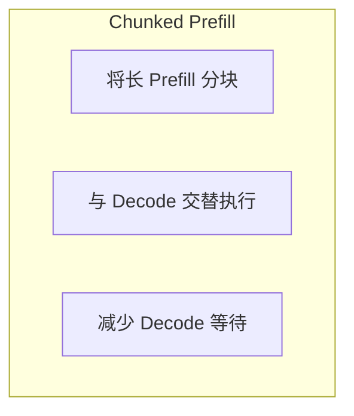

```
Chunked Prefill：
Prefill 块1: ████
Decode:          ██
Prefill 块2:       ████
Decode:                ██
...
```

---

### 4.5 KV Cache 优化

**多种优化方向**：

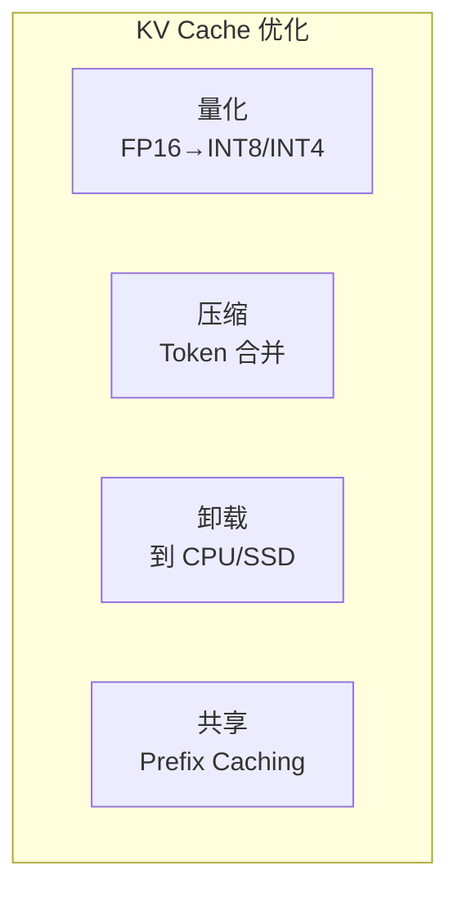

**Prefix Caching**：

```
请求1: "你好，请帮我写一个..." + 具体内容A
请求2: "你好，请帮我写一个..." + 具体内容B

公共前缀的 KV Cache 可以共享
```

---

## 五、服务层优化

### 5.1 多实例部署

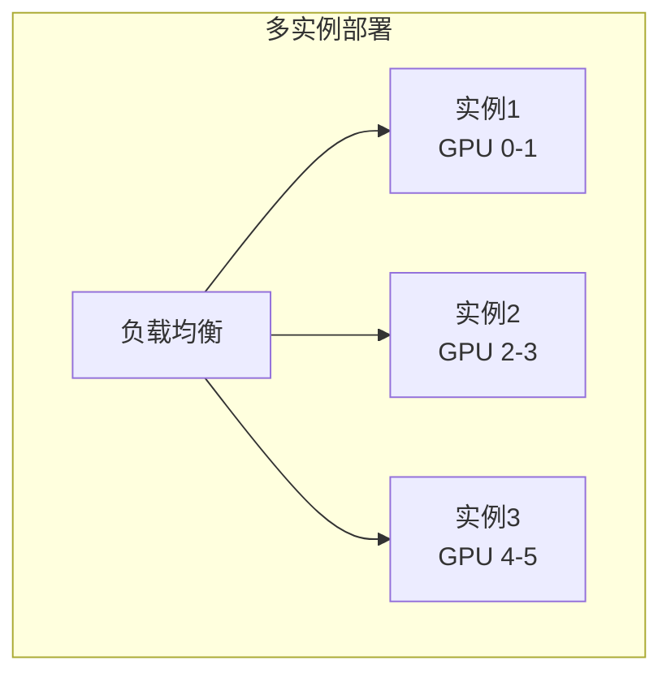

---

### 5.2 模型并行

**Tensor Parallel**：切分模型到多 GPU

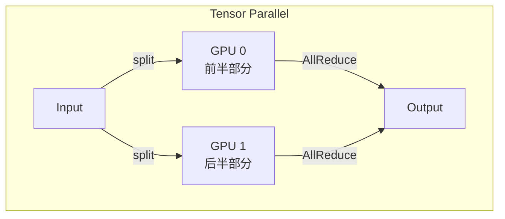

**Pipeline Parallel**：按层切分

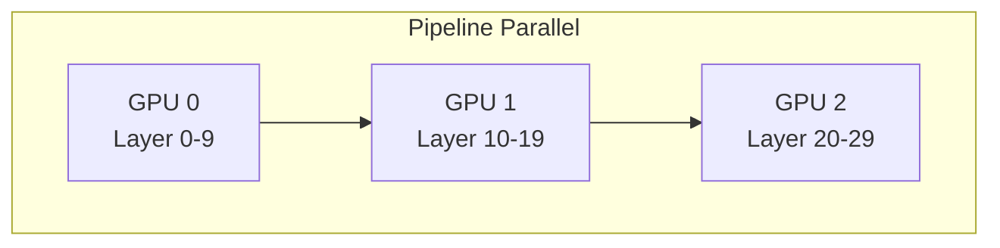

---

### 5.3 动态路由

**根据请求特征选择服务**：

```mermaid
graph TB
    subgraph "动态路由"
        R[Router]
        
        R -->|短请求| S1[低延迟实例]
        R -->|长请求| S2[高吞吐实例]
        R -->|特殊请求| S3[专用实例]
    end
```

---

## 六、优化技术矩阵

### 6.1 按效果分类

| 优化技术 | 延迟↓ | 吞吐↑ | 显存↓ | 复杂度 |
|----------|-------|-------|-------|--------|
| INT8 量化 | ✓ | ✓✓ | ✓✓ | 中 |
| INT4 量化 | ✓ | ✓✓✓ | ✓✓✓ | 高 |
| FlashAttention | ✓✓ | ✓ | ✓✓✓ | 高 |
| Continuous Batching | - | ✓✓✓ | - | 中 |
| PagedAttention | - | ✓✓ | ✓✓✓ | 高 |
| Speculative Decoding | ✓✓ | ✓ | - | 高 |
| GQA/MQA | - | ✓ | ✓✓ | 需要模型支持 |
| 算子融合 | ✓ | ✓ | ✓ | 中 |

### 6.2 按实施难度分类

```mermaid
graph TB
    subgraph "实施难度"
        E1[简单<br>开箱即用]
        E2[中等<br>需要配置]
        E3[复杂<br>需要开发]
        
        E1 --> E1a[使用 FP16]
        E1 --> E1b[使用 vLLM 默认配置]
        
        E2 --> E2a[INT8 量化]
        E2 --> E2b[调整 batch 策略]
        
        E3 --> E3a[自定义 Kernel]
        E3 --> E3b[Speculative Decoding]
    end
```

---

## 七、优化实践指南

### 7.1 优化流程

```mermaid
graph TB
    subgraph "优化流程"
        S1[确定目标和约束]
        S2[基准测试]
        S3[瓶颈分析]
        S4[选择优化方向]
        S5[实施优化]
        S6[验证效果]
        S7[迭代优化]
        
        S1 --> S2 --> S3 --> S4 --> S5 --> S6
        S6 -->|未达目标| S3
        S6 -->|达到目标| S7
    end
```

### 7.2 瓶颈分析

**常见瓶颈判断**：

| 现象 | 可能瓶颈 | 优化方向 |
|------|----------|----------|
| GPU 利用率低 | Batch 太小 | Continuous Batching |
| 显存不足 | KV Cache 太大 | PagedAttention、量化 |
| Prefill 慢 | 计算瓶颈 | FlashAttention |
| Decode 慢 | 带宽瓶颈 | FlashDecoding、量化 |
| 长尾延迟 | 调度问题 | 优先级调度 |

### 7.3 推荐优化顺序

```mermaid
graph TB
    subgraph "优化顺序"
        O1[1. 使用成熟推理引擎<br>vLLM / TensorRT-LLM]
        O2[2. 启用 FP16/BF16]
        O3[3. 配置 Continuous Batching]
        O4[4. 尝试 INT8 量化]
        O5[5. 调优 batch 参数]
        O6[6. 考虑 Speculative Decoding]
        O7[7. 自定义优化]
        
        O1 --> O2 --> O3 --> O4 --> O5 --> O6 --> O7
    end
```

---

## 八、案例分析

### 8.1 案例：LLaMA-70B 推理优化

**目标**：在 8×H100 上服务 LLaMA-70B，延迟 <500ms

**优化步骤**：

| 步骤 | 操作 | 效果 |
|------|------|------|
| 1 | 使用 vLLM | 基准 |
| 2 | 启用 Tensor Parallel | 单卡→8卡 |
| 3 | 使用 FP16 | 显存减半 |
| 4 | 启用 PagedAttention | 支持更大 batch |
| 5 | 调整 max_batch_size | 吞吐 3x |
| 6 | 尝试 AWQ INT4 | 显存再减半 |

### 8.2 案例：端侧 LLM 部署

**目标**：在手机上运行 7B 模型

**优化步骤**：

| 步骤 | 操作 | 效果 |
|------|------|------|
| 1 | 使用 llama.cpp | 基准 |
| 2 | Q4_K_M 量化 | 14GB→4GB |
| 3 | 使用 Metal/Vulkan | GPU 加速 |
| 4 | 调整 context size | 进一步减少显存 |

---

## 九、未来展望

### 9.1 近期趋势

| 趋势 | 描述 |
|------|------|
| FP8 普及 | H100/B100 原生支持 |
| 更长上下文 | 1M+ tokens |
| 多模态优化 | 图文音视频混合推理 |
| 硬件多样化 | AMD、Intel、国产 GPU |

### 9.2 长期趋势

```mermaid
graph TB
    subgraph "长期趋势"
        T1[编译器自动优化]
        T2[硬件软件协同设计]
        T3[动态/自适应优化]
        T4[端云协同推理]
    end
```

---

## 十、总结

### 10.1 核心认知

1. **优化是多层次的**
   - 从算子到系统，每层都有优化空间
   - 需要综合考虑，避免局部最优

2. **没有银弹**
   - 每种优化有其适用场景
   - 需要根据具体需求选择

3. **工具先于自研**
   - 优先使用成熟工具（vLLM、TensorRT-LLM）
   - 只在必要时自定义

4. **数据驱动**
   - 基于测量而非猜测
   - 瓶颈分析是关键

### 10.2 学习建议

```mermaid
graph TB
    L1[理解各种优化技术] --> L2[学会瓶颈分析]
    L2 --> L3[掌握主流工具]
    L3 --> L4[实践中积累经验]
```

---

## 相关文章

- [上一篇：01 - AI 推理系统架构概述](/articles/ai-infra/infra-01-AI推理系统架构概述/)
- [下一篇：03 - vLLM 架构与源码解析](/articles/ai-infra/infra-03-vLLM架构与源码解析/)
- [25 - FlashAttention 与 PagedAttention 原理](/articles/ai/ai-25-FlashAttention与PagedAttention原理/)
- [32 - Triton GPU 编程详解](/articles/ai/ai-32-Triton-GPU编程详解/)
- [11 - 多模态 LLM 推理优化](/articles/ai-infra/infra-11-多模态LLM推理优化/)
