+++
title = "04. TensorRT-LLM 详解"
description = "深入理解 NVIDIA 官方 LLM 推理引擎的架构与使用"
date = 2025-02-06
weight = 4000
updated = 2025-02-06
draft = false
[taxonomies]
tags = ["TensorRT-LLM", "NVIDIA", "推理优化", "LLM"]
[extra]
toc = true
comments = true
+++

## 一、TensorRT-LLM 概述

### 1.1 什么是 TensorRT-LLM

TensorRT-LLM 是 NVIDIA 官方推出的 LLM 推理优化库，基于 TensorRT 构建，专门针对 LLM 场景优化。

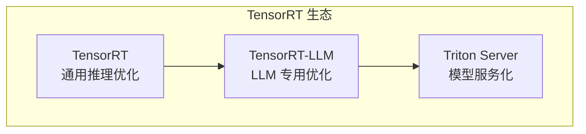

### 1.2 核心特性

| 特性 | 描述 |
|------|------|
| 高性能 | NVIDIA GPU 最优性能 |
| 量化支持 | FP8/INT8/INT4/AWQ/GPTQ |
| 多 GPU | Tensor Parallel + Pipeline Parallel |
| In-flight Batching | 类似 Continuous Batching |
| Paged KV Cache | 高效显存管理 |
| 自定义算子 | Plugin 机制扩展 |

### 1.3 与 TensorRT 的关系

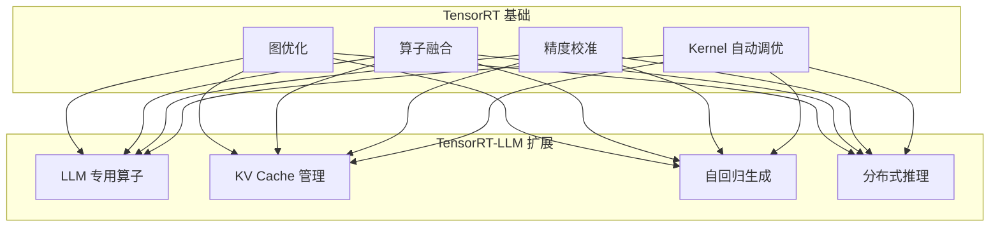

---

## 二、整体架构

### 2.1 架构概览

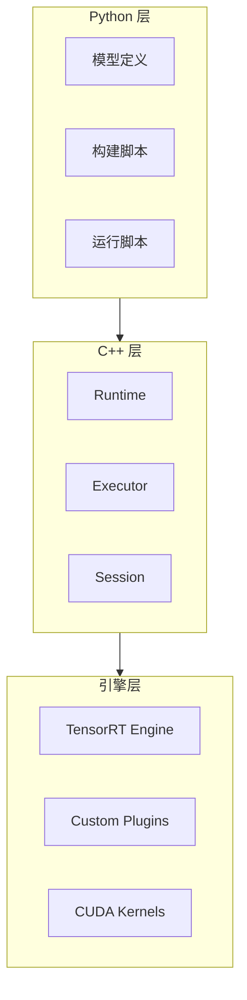

### 2.2 工作流程

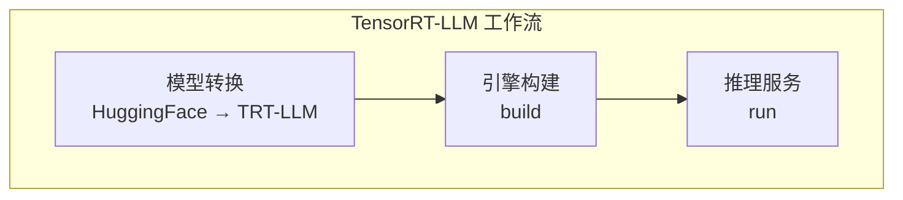

---

## 三、模型构建

### 3.1 构建流程

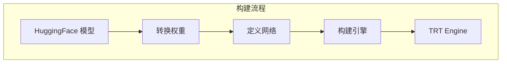

### 3.2 支持的模型

| 模型系列 | 支持版本 |
|----------|----------|
| LLaMA | LLaMA 1/2/3, Code Llama |
| GPT | GPT-2, GPT-J, GPT-NeoX |
| Falcon | Falcon 7B/40B/180B |
| Mistral | Mistral 7B, Mixtral |
| Qwen | Qwen 1/1.5/2 |
| ChatGLM | ChatGLM 1/2/3/4 |

### 3.3 构建配置

**关键参数**：

| 参数 | 作用 |
|------|------|
| `--dtype` | 数据类型 (float16/bfloat16) |
| `--use_gpt_attention_plugin` | 使用优化的 Attention |
| `--use_gemm_plugin` | 使用优化的 GEMM |
| `--enable_context_fmha` | 启用 Flash Attention |
| `--paged_kv_cache` | 启用分页 KV Cache |
| `--max_batch_size` | 最大批次大小 |
| `--max_input_len` | 最大输入长度 |
| `--max_output_len` | 最大输出长度 |

---

## 四、核心组件

### 4.1 Plugin 系统

**什么是 Plugin**：自定义的高性能算子

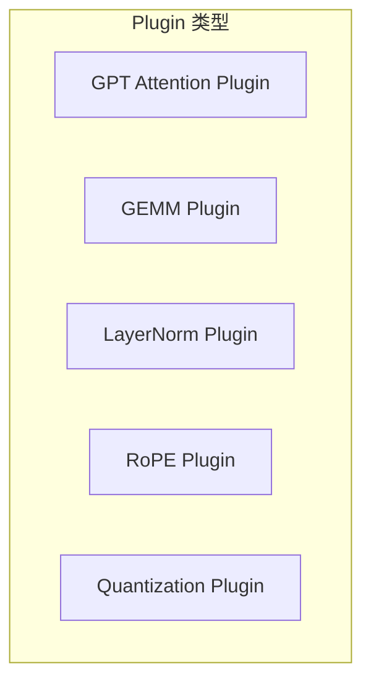

**GPT Attention Plugin**：

| 特性 | 支持 |
|------|------|
| Flash Attention | ✓ |
| Multi-Query Attention | ✓ |
| Grouped-Query Attention | ✓ |
| Paged KV Cache | ✓ |
| FP8 | ✓ |

### 4.2 量化支持

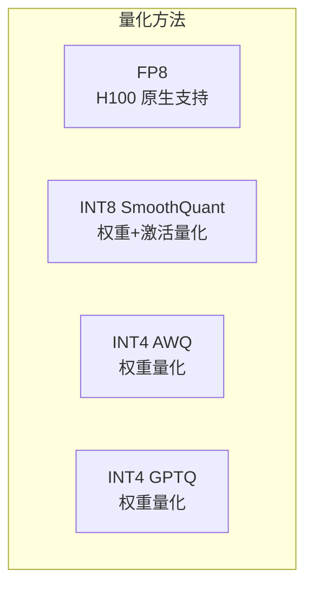

**量化效果**：

| 方法 | 显存 | 速度 | 精度 |
|------|------|------|------|
| FP16 | 100% | 1x | 基准 |
| FP8 | 50% | 1.5-2x | 接近 FP16 |
| INT8 | 50% | 1.5-2x | 略有下降 |
| INT4 | 25% | 2-3x | 明显下降 |

### 4.3 分布式推理

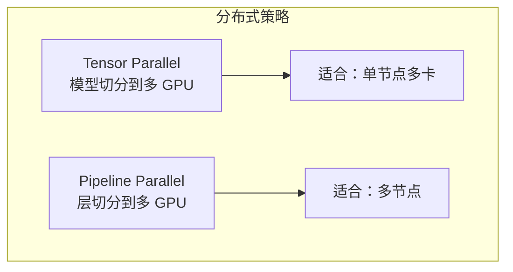

**Tensor Parallel 实现**：

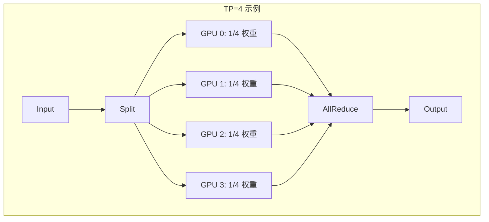

---

## 五、In-flight Batching

### 5.1 概念

类似 vLLM 的 Continuous Batching，允许请求动态加入和退出。

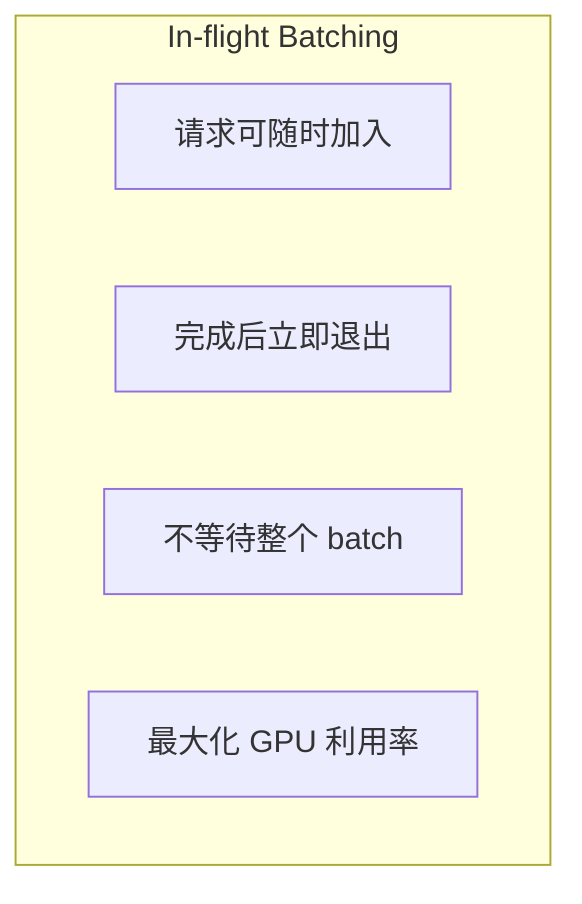

### 5.2 Executor API

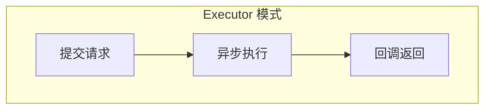

### 5.3 调度策略

| 策略 | 描述 |
|------|------|
| Max Utilization | 最大化 GPU 利用率 |
| Guaranteed No Evict | 保证不换出 |
| Static Batching | 传统静态批处理 |

---

## 六、性能优化

### 6.1 Kernel 优化

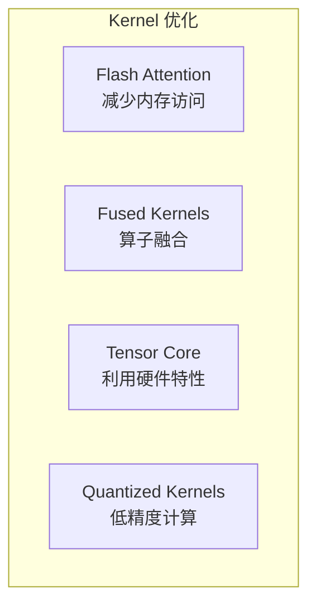

### 6.2 内存优化

| 优化 | 方法 |
|------|------|
| Paged KV Cache | 按需分配 |
| Weight Streaming | 权重流式加载 |
| Activation Recomputation | 减少激活存储 |

### 6.3 通信优化

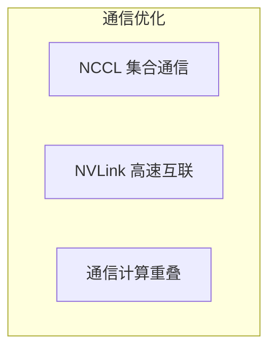

---

## 七、与 Triton Server 集成

### 7.1 部署架构

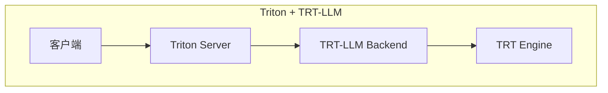

### 7.2 配置示例

**模型仓库结构**：

```
model_repository/
└── llama/
    ├── config.pbtxt
    └── 1/
        └── (TRT engines)
```

### 7.3 动态 Batching 配置

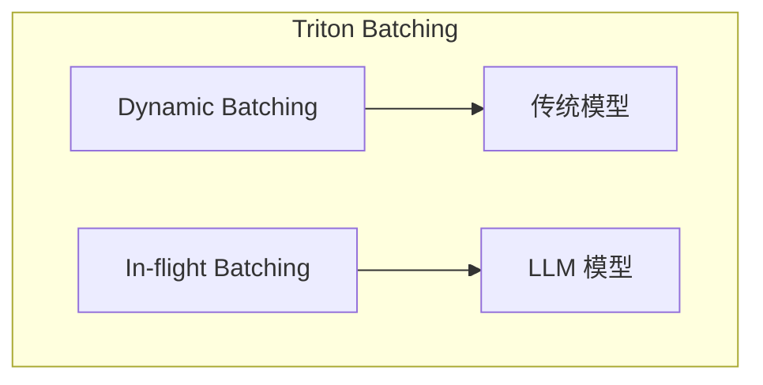

---

## 八、性能对比

### 8.1 与其他框架对比

| 场景 | TensorRT-LLM | vLLM | llama.cpp |
|------|--------------|------|-----------|
| 延迟 | 最低 | 低 | 中 |
| 吞吐 | 最高 | 高 | 中 |
| 易用性 | 中 | 高 | 高 |
| 硬件支持 | NVIDIA only | NVIDIA + AMD | 多平台 |

### 8.2 性能数据（参考）

| 模型 | 配置 | 吞吐量 |
|------|------|--------|
| LLaMA-7B | 1×A100-80G, FP16 | ~4000 tokens/s |
| LLaMA-70B | 8×A100-80G, TP8 | ~2000 tokens/s |
| LLaMA-70B | 8×H100, FP8, TP8 | ~4000 tokens/s |

---

## 九、使用建议

### 9.1 适用场景

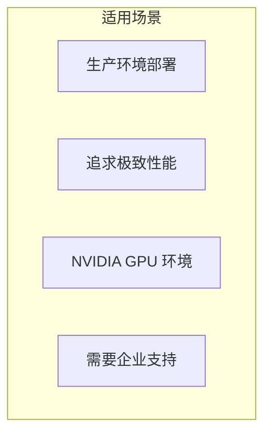

### 9.2 不适用场景

| 场景 | 原因 |
|------|------|
| 快速原型 | 构建流程复杂 |
| AMD GPU | 不支持 |
| 频繁更换模型 | 需要重新构建 |

### 9.3 最佳实践

| 实践 | 建议 |
|------|------|
| 量化选择 | H100 用 FP8，其他用 INT8 |
| 并行策略 | 优先 TP，大模型加 PP |
| 批处理 | 启用 In-flight Batching |
| 监控 | 使用 Triton 的监控指标 |

---

## 十、总结

### 10.1 核心认知

1. **官方优化，性能最佳**
   - NVIDIA 深度优化
   - 最新硬件特性支持（FP8）

2. **生产级就绪**
   - 与 Triton 集成
   - 企业级支持

3. **复杂度较高**
   - 需要理解 TensorRT
   - 构建流程复杂

4. **适合特定场景**
   - NVIDIA GPU + 追求极致性能
   - 生产环境长期部署

### 10.2 学习建议

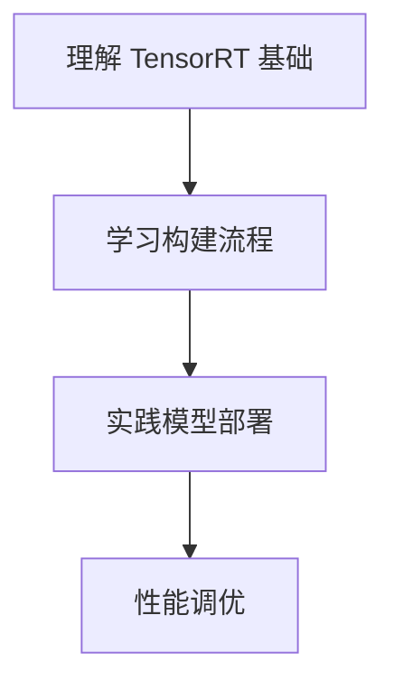

---

## 相关文章

- [上一篇：03 - vLLM 架构与源码解析](@/articles/ai-infra/ai-infra-03-vLLM架构与源码解析.md)
- [下一篇：05 - llama.cpp 源码解析](@/articles/ai-infra/ai-infra-05-llama.cpp源码解析.md)
- [02 - LLM 推理优化全景](@/articles/ai-infra/ai-infra-02-LLM推理优化全景.md)
