+++
title = "llama.cpp 源码解析"
description = "深入理解纯 C/C++ 实现的 LLM 推理引擎"
date = 2025-02-06
weight = 5000
updated = 2025-02-06
draft = false
[taxonomies]
tags = ["llama.cpp", "C++", "GGML", "端侧推理"]
[extra]
toc = true
comments = true
+++

## 一、llama.cpp 概述

### 1.1 什么是 llama.cpp

llama.cpp 是由 Georgi Gerganov 开发的纯 C/C++ LLM 推理库，以简洁高效著称。

**核心特点**：
- **纯 C/C++**：无 Python 依赖
- **跨平台**：支持 CPU、GPU、Apple Silicon
- **轻量级**：单文件即可运行
- **量化支持**：丰富的量化格式

### 1.2 为什么重要

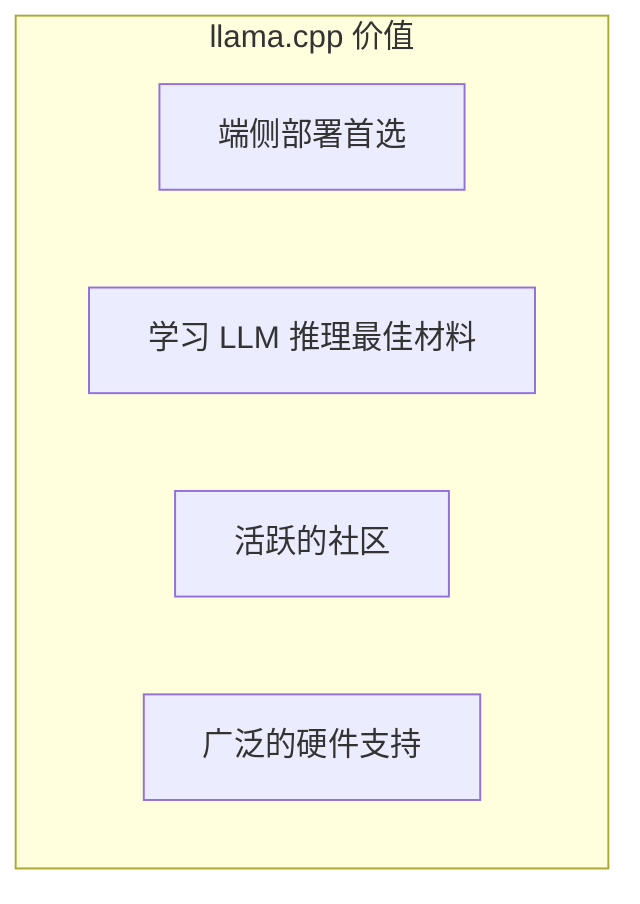

### 1.3 硬件支持

| 平台 | 后端 |
|------|------|
| CPU | AVX/AVX2/AVX512, ARM NEON |
| NVIDIA GPU | CUDA |
| AMD GPU | ROCm/HIP |
| Apple | Metal |
| Intel GPU | SYCL |
| Vulkan | 跨平台 GPU |

---

## 二、整体架构

### 2.1 项目结构

```
llama.cpp/
├── ggml/              # 张量库
│   ├── src/
│   │   ├── ggml.c           # 核心张量操作
│   │   ├── ggml-backend.c   # 后端抽象
│   │   ├── ggml-cuda.cu     # CUDA 后端
│   │   ├── ggml-metal.m     # Metal 后端
│   │   └── ggml-quants.c    # 量化实现
├── src/
│   ├── llama.cpp      # LLM 核心逻辑
│   └── llama-*.cpp    # 各模块实现
├── examples/          # 示例程序
│   ├── main/          # 命令行推理
│   └── server/        # HTTP 服务器
└── models/            # 模型存放
```

### 2.2 分层架构

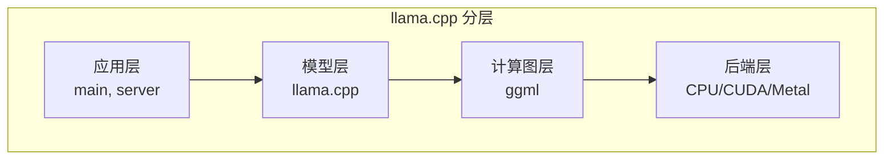

---

## 三、GGML 张量库

### 3.1 什么是 GGML

**GGML = Georgi Gerganov Machine Learning**

一个轻量级的张量计算库，是 llama.cpp 的基础。

### 3.2 核心概念

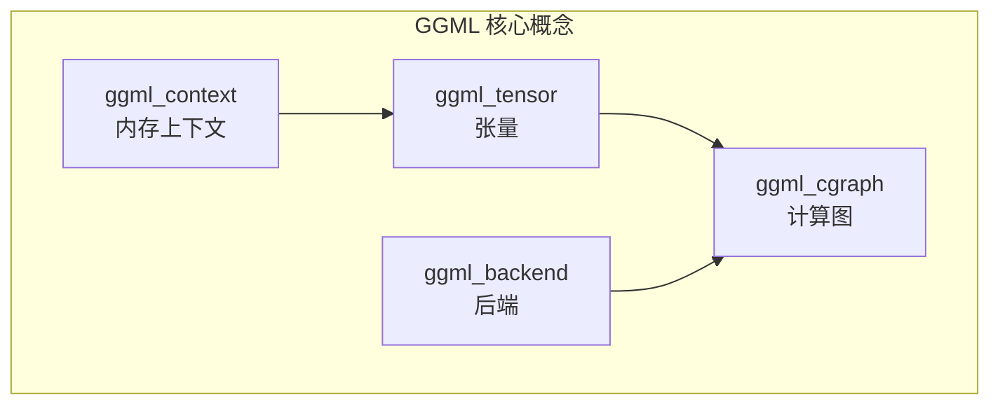

### 3.3 张量结构

**ggml_tensor 关键字段**：

| 字段 | 含义 |
|------|------|
| type | 数据类型（F32/F16/Q4_0 等） |
| ne[4] | 各维度大小 |
| nb[4] | 各维度步长（字节） |
| data | 数据指针 |
| op | 操作类型 |
| src[10] | 输入张量 |

### 3.4 计算图

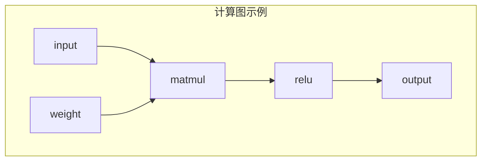

**构建和执行**：

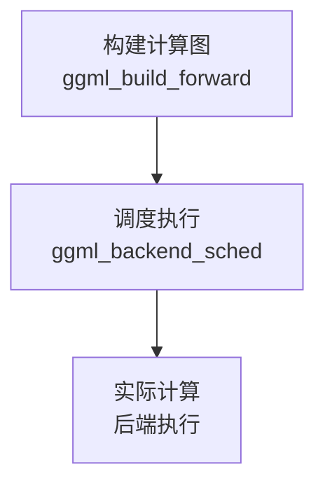

### 3.5 后端系统

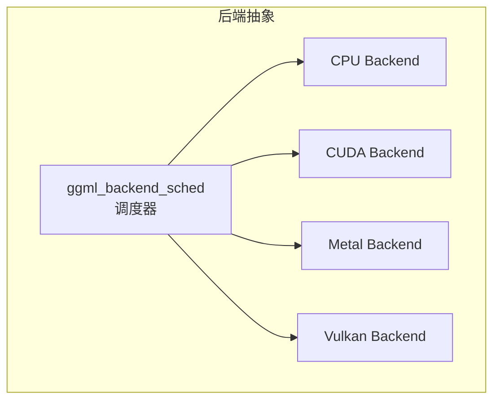

**后端选择逻辑**：
1. 检查可用后端
2. 优先使用 GPU
3. 部分操作可能 fallback 到 CPU

---

## 四、量化系统

### 4.1 GGUF 格式

**GGUF = GGML Unified Format**

统一的模型文件格式，包含模型权重和元数据。

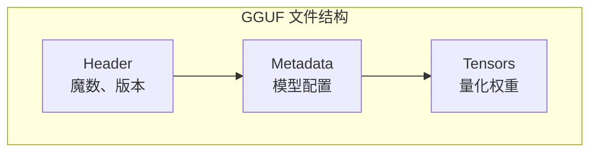

### 4.2 量化类型

| 类型 | 位数 | 块大小 | 特点 |
|------|------|--------|------|
| F32 | 32 | - | 原始精度 |
| F16 | 16 | - | 半精度 |
| Q8_0 | 8 | 32 | 简单量化 |
| Q4_0 | 4 | 32 | 基础 4 位 |
| Q4_K_M | 4 | 256 | K-quants，精度更好 |
| Q2_K | 2 | 256 | 极致压缩 |
| IQ4_XS | 4 | 256 | 重要性量化 |

### 4.3 量化原理

**块量化**：

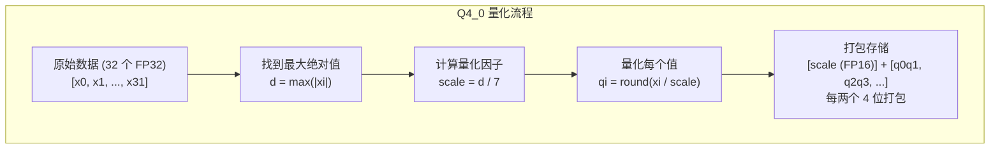

### 4.4 K-quants

**分层量化**：不同层使用不同精度

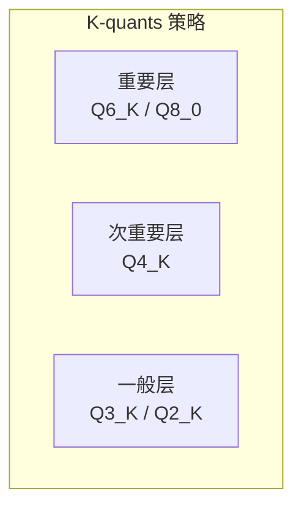

---

## 五、模型推理流程

### 5.1 整体流程

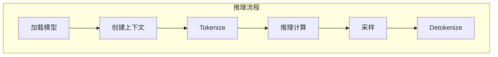

### 5.2 模型加载

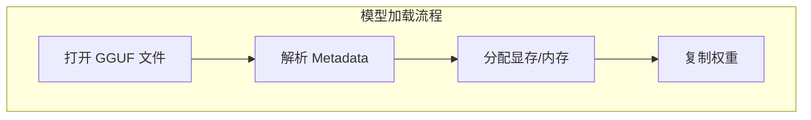

### 5.3 推理计算

**Prefill 阶段**：

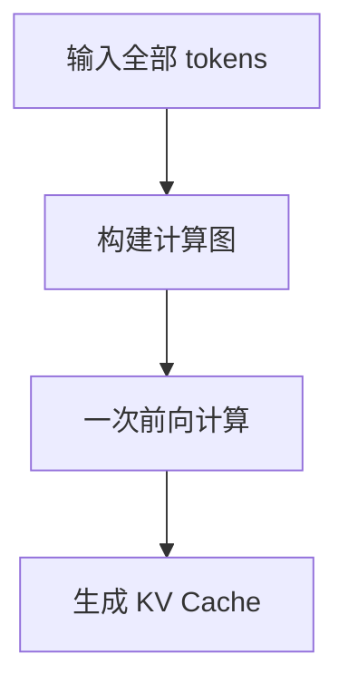

**Decode 阶段**：

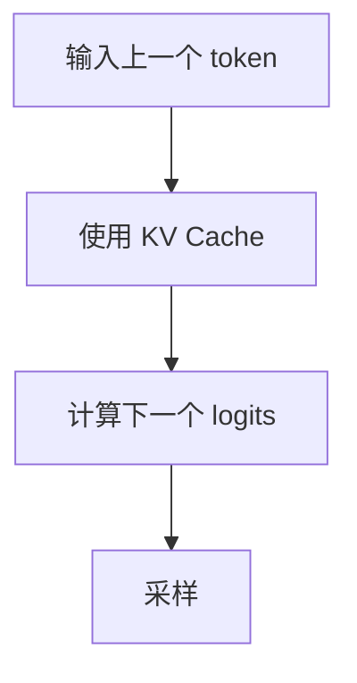

### 5.4 KV Cache

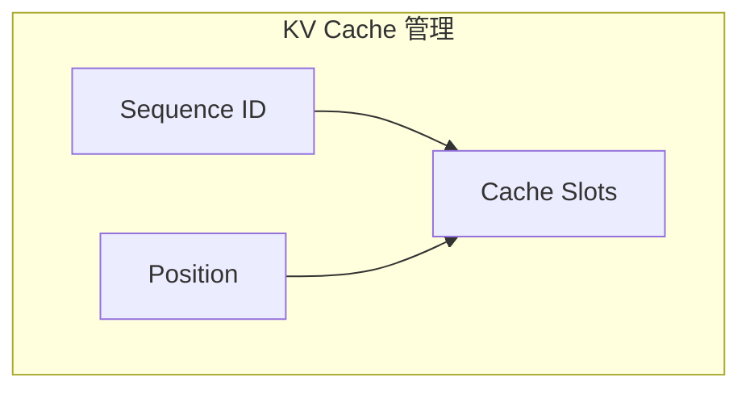

---

## 六、核心代码解析

### 6.1 主要函数

| 函数 | 作用 |
|------|------|
| llama_load_model_from_file | 加载模型 |
| llama_new_context_with_model | 创建推理上下文 |
| llama_decode | 执行一次推理 |
| llama_get_logits | 获取输出 logits |
| llama_sample_* | 各种采样方法 |

### 6.2 推理上下文

**llama_context 关键字段**：

| 字段 | 含义 |
|------|------|
| model | 关联的模型 |
| kv_cache | KV Cache |
| backend | 计算后端 |
| n_ctx | 上下文长度 |
| logits | 输出 logits |

### 6.3 计算图构建

**Transformer 层计算**：

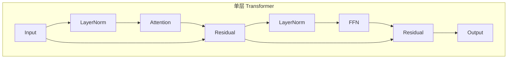

### 6.4 Attention 实现

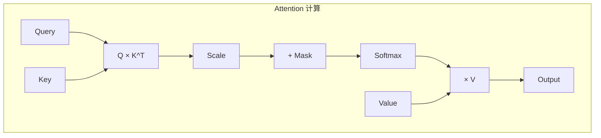

---

## 七、后端实现

### 7.1 CPU 后端

**优化手段**：

| 优化 | 技术 |
|------|------|
| SIMD | AVX2/AVX512/NEON |
| 多线程 | OpenMP |
| 缓存优化 | 分块计算 |
| 量化 | 专门的量化内积 |

### 7.2 CUDA 后端

**关键 Kernel**：

| Kernel | 作用 |
|--------|------|
| dequantize | 反量化 |
| mul_mat | 矩阵乘法 |
| flash_attn | Flash Attention |
| rope | 位置编码 |
| softmax | Softmax |

### 7.3 Metal 后端

**Apple Silicon 优化**：
- 统一内存架构
- Metal Shader
- ANE（神经引擎）部分支持

---

## 八、服务器模式

### 8.1 架构

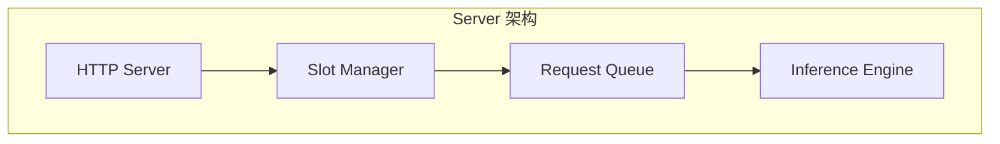

### 8.2 Slot 机制

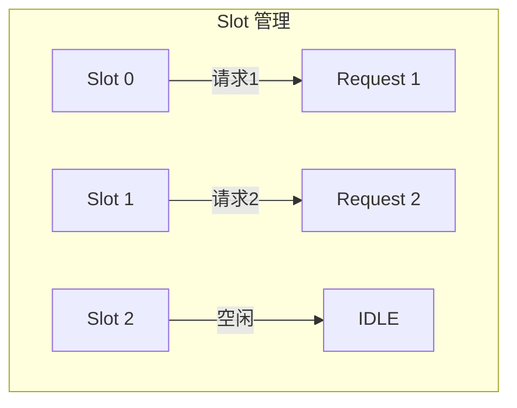

**并发处理**：
- 每个 Slot 独立的 KV Cache
- 支持多请求并发
- 类似简化版 Continuous Batching

### 8.3 API 兼容

兼容 OpenAI API 格式：
- `/v1/chat/completions`
- `/v1/completions`
- `/v1/embeddings`

---

## 九、性能调优

### 9.1 关键参数

| 参数 | 作用 | 建议 |
|------|------|------|
| -ngl | GPU 层数 | 尽量全部放 GPU |
| -c | 上下文长度 | 按需设置 |
| -b | 批处理大小 | Prefill 用大值 |
| -t | CPU 线程数 | 物理核心数 |
| --mlock | 锁定内存 | 避免交换 |

### 9.2 量化选择

| 场景 | 推荐量化 |
|------|----------|
| 最高质量 | Q8_0 |
| 平衡 | Q4_K_M |
| 最小体积 | Q2_K / IQ2_XXS |
| 速度优先 | Q4_0 |

### 9.3 硬件优化

| 硬件 | 优化建议 |
|------|----------|
| NVIDIA GPU | 使用 CUDA，-ngl 99 |
| Apple M 系列 | 使用 Metal，-ngl 99 |
| CPU only | 启用 AVX2/AVX512，多线程 |

---

## 十、扩展与贡献

### 10.1 添加新模型

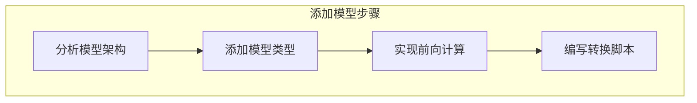

### 10.2 添加新后端

| 步骤 | 内容 |
|------|------|
| 1 | 实现 ggml_backend 接口 |
| 2 | 实现核心算子 |
| 3 | 注册后端 |
| 4 | 测试验证 |

---

## 十一、总结

### 11.1 核心认知

1. **简洁而强大**
   - 纯 C/C++ 实现
   - 代码可读性高

2. **量化是核心**
   - 丰富的量化格式
   - 精度与性能平衡

3. **端侧首选**
   - 跨平台支持
   - 资源占用小

4. **学习价值高**
   - 理解 LLM 推理细节
   - 代码质量高

### 11.2 学习建议

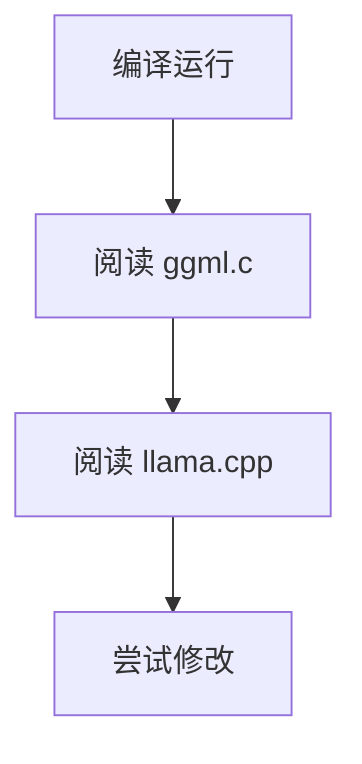

---

## 相关文章

- [上一篇：04 - TensorRT-LLM 详解](@/articles/ai-infra/ai-infra-04-TensorRT-LLM详解.md)
- [下一篇：06 - Triton Inference Server 实战](@/articles/ai-infra/ai-infra-06-Triton-Inference-Server实战.md)
- [21 - CUDA 入门与 GPU 编程基础](@/articles/ai/ai-21-CUDA入门与GPU编程基础.md)
