+++
title = "Triton Inference Server 实战"
description = "企业级 AI 模型服务化部署指南"
date = 2025-02-06
weight = 6000
updated = 2025-02-06
draft = false
[taxonomies]
tags = ["Triton", "模型服务", "推理部署", "NVIDIA"]
[extra]
toc = true
comments = true
+++

## 一、Triton Server 概述

### 1.1 什么是 Triton Inference Server

Triton 是 NVIDIA 开发的开源推理服务平台，支持多种推理后端和模型格式。

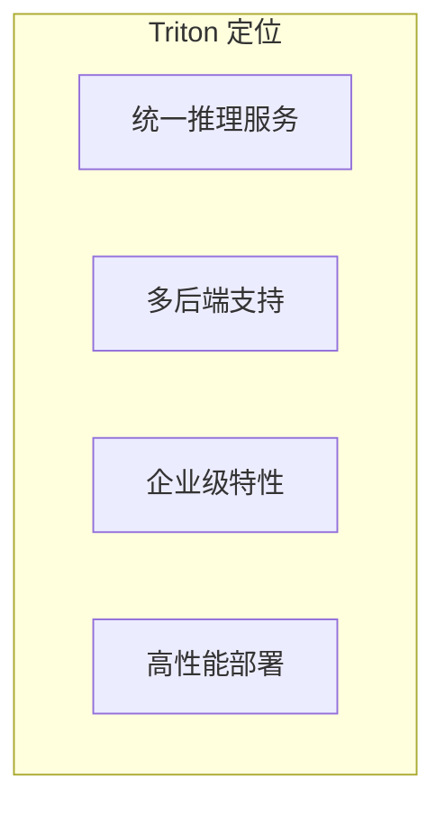

### 1.2 核心特性

| 特性 | 描述 |
|------|------|
| 多后端 | TensorRT, ONNX, PyTorch, TensorFlow, vLLM |
| 动态 Batching | 自动组批提高吞吐 |
| 模型集成 | 多模型 Pipeline |
| 并发执行 | 多模型实例并行 |
| 监控指标 | Prometheus 集成 |
| gRPC/HTTP | 多协议支持 |

### 1.3 架构概览

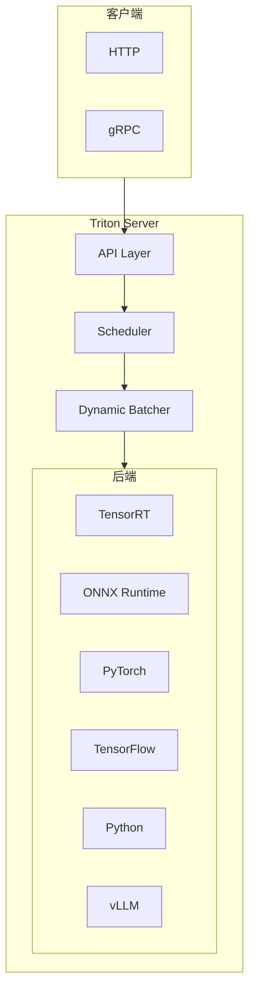

---

## 二、模型仓库

### 2.1 仓库结构

```
model_repository/
├── model_a/
│   ├── config.pbtxt       # 模型配置
│   ├── 1/                 # 版本 1
│   │   └── model.onnx
│   └── 2/                 # 版本 2
│       └── model.onnx
├── model_b/
│   ├── config.pbtxt
│   └── 1/
│       └── model.plan     # TensorRT 引擎
└── ensemble/
    └── config.pbtxt       # Pipeline 配置
```

### 2.2 配置文件

**config.pbtxt 关键字段**：

| 字段 | 含义 |
|------|------|
| name | 模型名称 |
| platform | 后端类型 |
| max_batch_size | 最大批次 |
| input/output | 输入输出定义 |
| instance_group | 实例配置 |
| dynamic_batching | 动态批处理配置 |

### 2.3 后端类型

| Platform | 模型格式 |
|----------|----------|
| tensorrt_plan | TensorRT .plan |
| onnxruntime_onnx | ONNX .onnx |
| pytorch_libtorch | TorchScript .pt |
| tensorflow_savedmodel | SavedModel |
| python | Python 脚本 |
| vllm | vLLM 模型 |

---

## 三、动态 Batching

### 3.1 工作原理

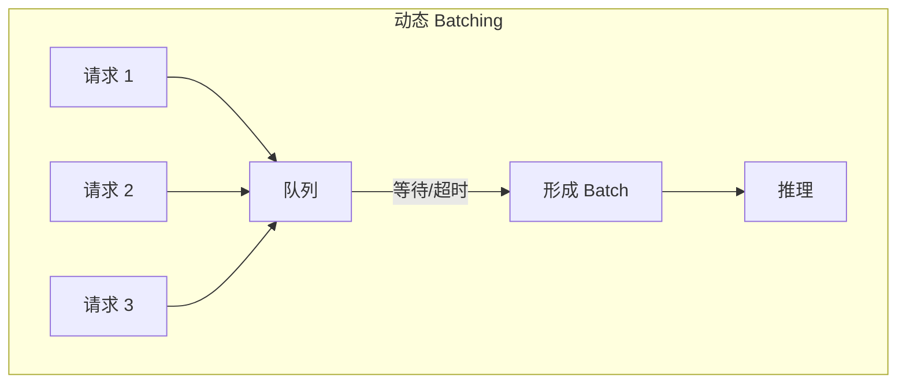

### 3.2 配置选项

| 配置 | 含义 |
|------|------|
| preferred_batch_size | 优先批次大小 |
| max_queue_delay_microseconds | 最大等待时间 |
| preserve_ordering | 保持顺序 |

### 3.3 效果

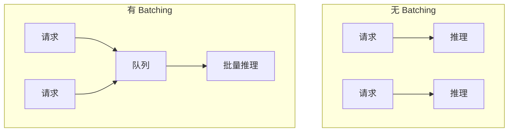

---

## 四、模型集成

### 4.1 Ensemble 模式

**多模型 Pipeline**：

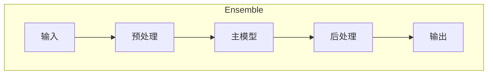

### 4.2 配置示例

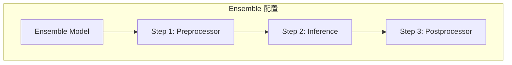

### 4.3 BLS（Business Logic Scripting）

使用 Python 编写复杂逻辑：

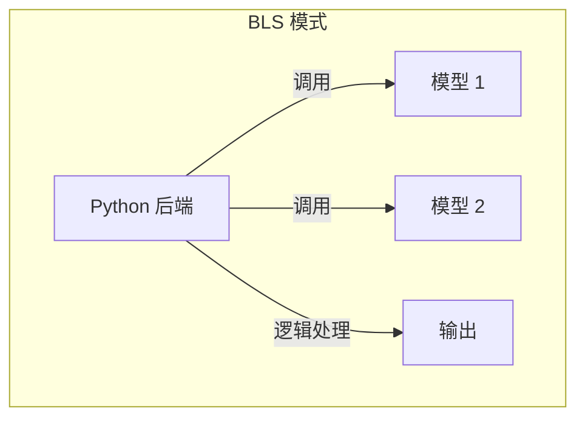

---

## 五、并发与实例

### 5.1 实例组

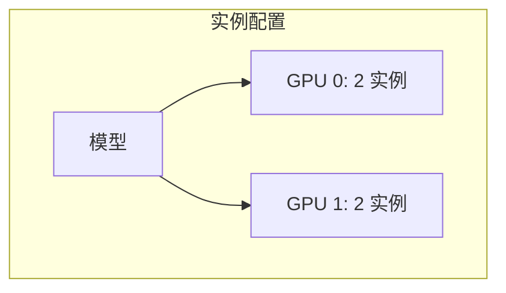

### 5.2 配置选项

| 配置 | 含义 |
|------|------|
| count | 实例数量 |
| kind | GPU/CPU |
| gpus | 指定 GPU |

### 5.3 并发策略

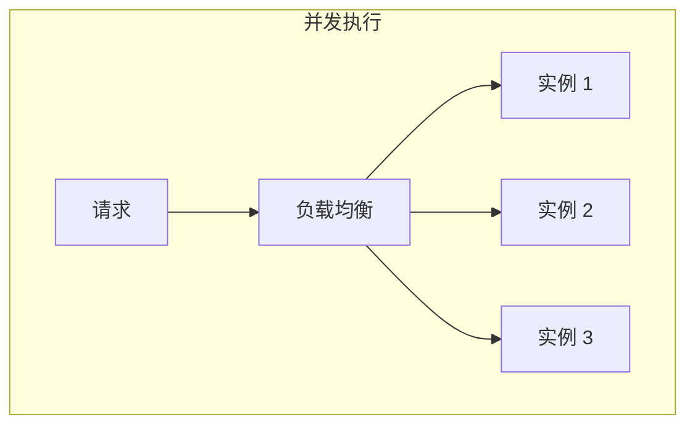

---

## 六、LLM 部署

### 6.1 vLLM 后端

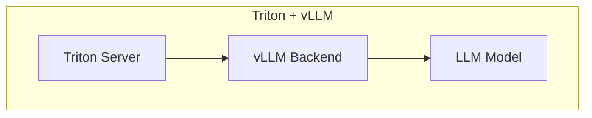

### 6.2 TensorRT-LLM 后端

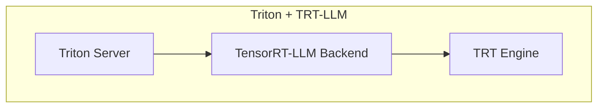

### 6.3 In-flight Batching

专为 LLM 设计的批处理：

| 特性 | 描述 |
|------|------|
| 动态加入 | 请求随时加入 |
| 动态退出 | 完成即退出 |
| 流式输出 | 逐 token 返回 |

---

## 七、监控与运维

### 7.1 健康检查

```mermaid
graph TB
    subgraph "健康检查端点"
        LIVE[/v2/health/live]
        READY[/v2/health/ready]
        MODEL[/v2/models/{name}/ready]
    end
```

### 7.2 指标监控

**Prometheus 指标**：

| 指标 | 含义 |
|------|------|
| nv_inference_request_success | 成功请求数 |
| nv_inference_request_failure | 失败请求数 |
| nv_inference_exec_count | 执行次数 |
| nv_inference_queue_duration | 队列等待时间 |
| nv_gpu_utilization | GPU 利用率 |

### 7.3 日志配置

| 日志级别 | 用途 |
|----------|------|
| INFO | 基本信息 |
| WARNING | 警告 |
| ERROR | 错误 |
| VERBOSE | 调试 |

---

## 八、性能调优

### 8.1 Batching 调优

| 参数 | 调优建议 |
|------|----------|
| max_queue_delay | 延迟敏感降低，吞吐优先提高 |
| preferred_batch_size | 与 GPU 并行度匹配 |
| max_batch_size | 根据显存调整 |

### 8.2 实例调优

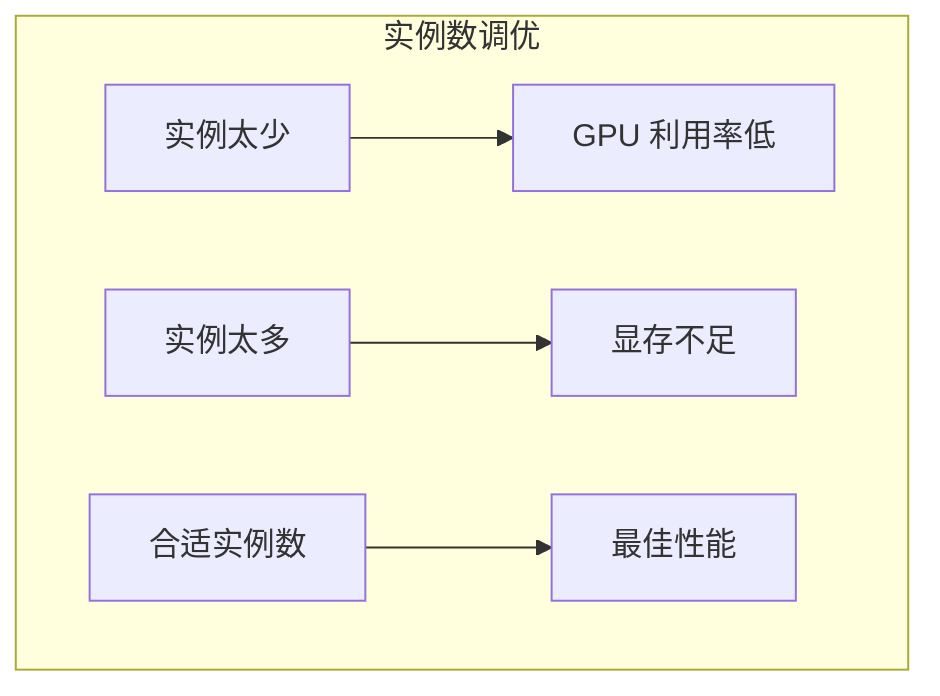

### 8.3 内存调优

| 配置 | 作用 |
|------|------|
| pinned_memory_pool | 固定内存池 |
| cuda_memory_pool | CUDA 内存池 |
| response_cache | 响应缓存 |

---

## 九、生产部署

### 9.1 容器化部署

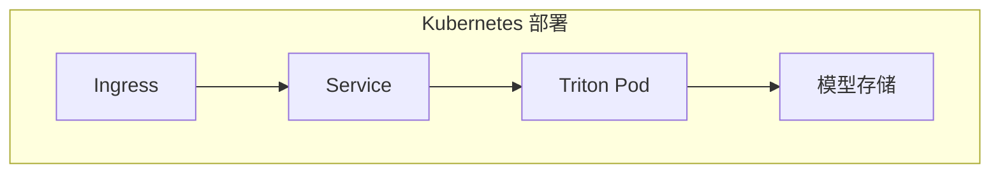

### 9.2 高可用

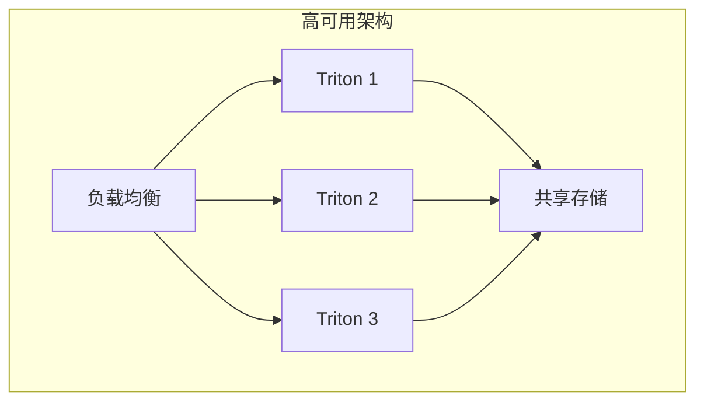

### 9.3 模型更新

| 策略 | 描述 |
|------|------|
| 热加载 | 不重启更新模型 |
| 版本切换 | 切换到新版本 |
| 金丝雀 | 逐步切换流量 |

---

## 十、总结

### 10.1 核心认知

1. **统一服务平台**
   - 支持多种后端
   - 标准化接口

2. **企业级特性**
   - 动态 Batching
   - 监控指标
   - 高可用

3. **LLM 友好**
   - vLLM/TRT-LLM 集成
   - In-flight Batching

### 10.2 适用场景

| 场景 | 适合度 |
|------|--------|
| 生产部署 | ★★★ |
| 多模型服务 | ★★★ |
| 快速原型 | ★★ |
| 单模型简单部署 | ★★ |

---

## 相关文章

- [上一篇：05 - llama.cpp 源码解析](@/articles/ai-infra/ai-infra-05-llama.cpp源码解析.md)
- [下一篇：07 - 推理调度与 Batching 策略](@/articles/ai-infra/ai-infra-07-推理调度与Batching策略.md)
- [03 - vLLM 架构与源码解析](@/articles/ai-infra/ai-infra-03-vLLM架构与源码解析.md)
