+++
title = "07 - 推理调度与 Batching 策略"
description = "深入理解 LLM 推理系统的调度算法和批处理策略"
date = 2025-02-06
updated = 2025-02-06
draft = false
[taxonomies]
tags = ["调度", "Batching", "推理优化", "系统设计"]
[extra]
toc = true
comments = true
+++

## 一、为什么调度如此重要

### 1.1 调度的作用

调度器是推理系统的**大脑**，决定：
- 哪些请求现在执行
- 请求以什么顺序执行
- 如何组合成批次

### 1.2 调度影响的指标

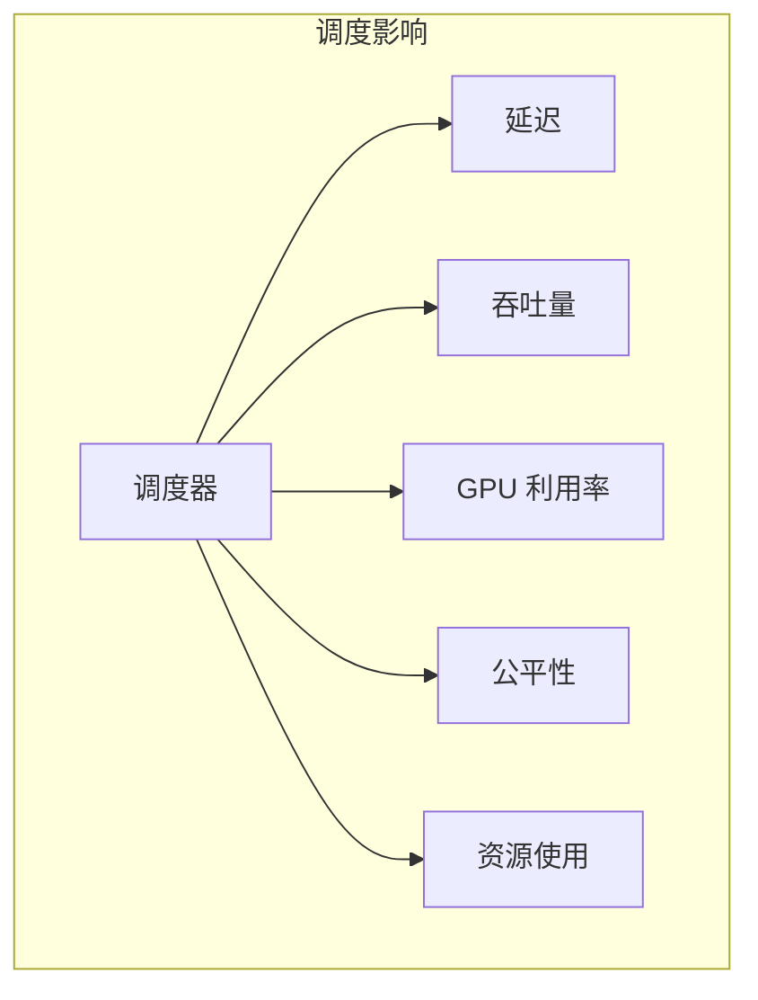

### 1.3 LLM 调度的特殊性

| 特点 | 挑战 |
|------|------|
| 自回归生成 | 每个请求需要多轮计算 |
| 长度不确定 | 不知道何时结束 |
| 显存动态增长 | KV Cache 持续增加 |
| Prefill vs Decode | 两阶段特性不同 |

---

## 二、Batching 策略演进

### 2.1 Static Batching

**最简单的方式**：固定批次，等待所有请求完成

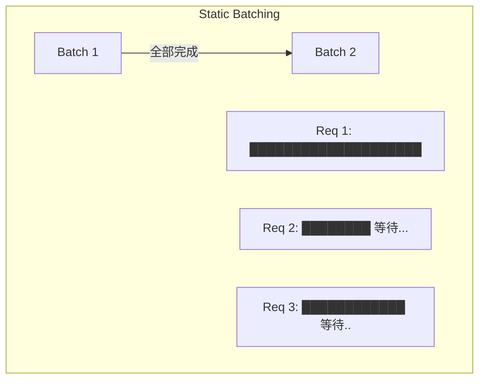

**问题**：
- 短请求等待长请求
- GPU 空闲时间多
- 吞吐量低

### 2.2 Dynamic Batching

**改进**：等待一定时间凑批

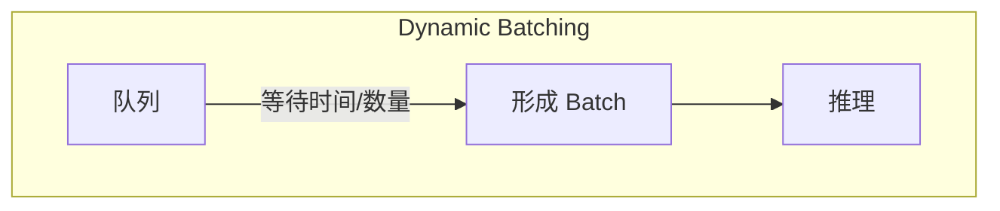

**参数**：
- max_wait_time：最大等待时间
- preferred_batch_size：优先批次大小

**问题**：
- 仍然需要等待整个批次完成
- 对 LLM 自回归不友好

### 2.3 Continuous Batching

**革新**：完成即退出，新请求随时加入

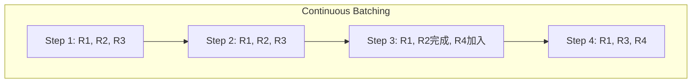

**优势**：
- GPU 始终满载
- 短请求不等待
- 吞吐量大幅提升

### 2.4 对比总结

| 策略 | 吞吐量 | 延迟 | 实现复杂度 |
|------|--------|------|------------|
| Static | 低 | 高 | 简单 |
| Dynamic | 中 | 中 | 中等 |
| Continuous | 高 | 低 | 复杂 |

---

## 三、调度算法

### 3.1 FCFS（先来先服务）

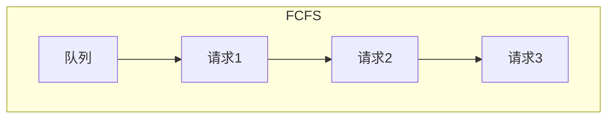

**特点**：
- 简单公平
- 可能长请求阻塞

### 3.2 SJF（短任务优先）

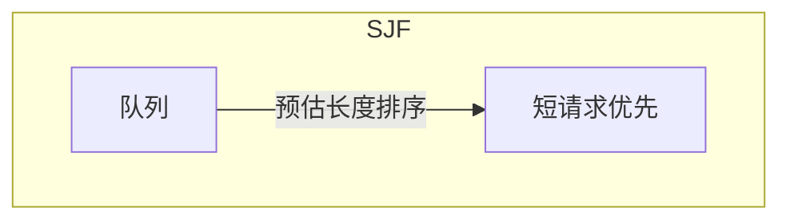

**挑战**：如何预估请求长度？

### 3.3 优先级调度

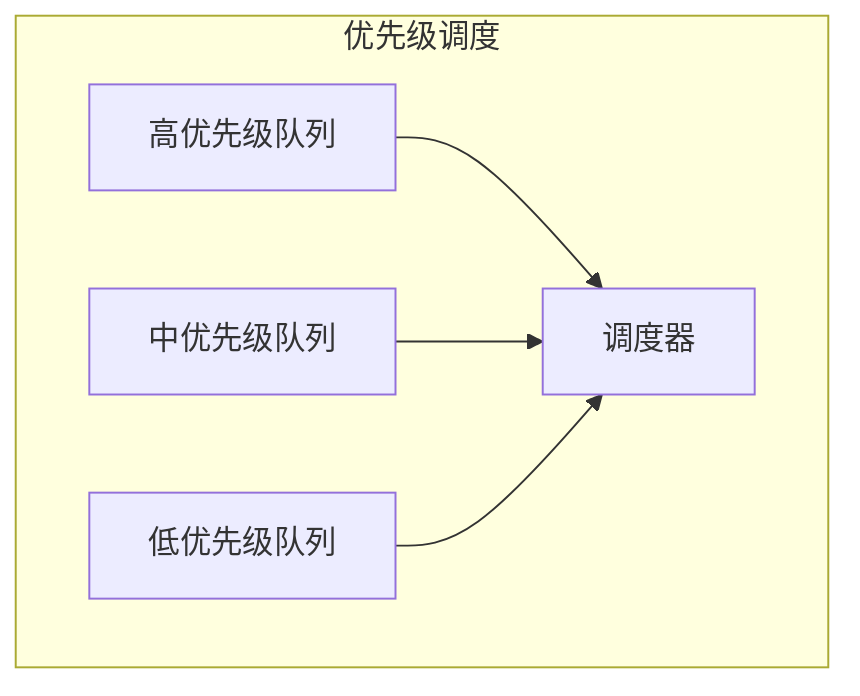

**应用**：
- VIP 用户优先
- 付费用户优先
- 实时请求优先

### 3.4 公平调度

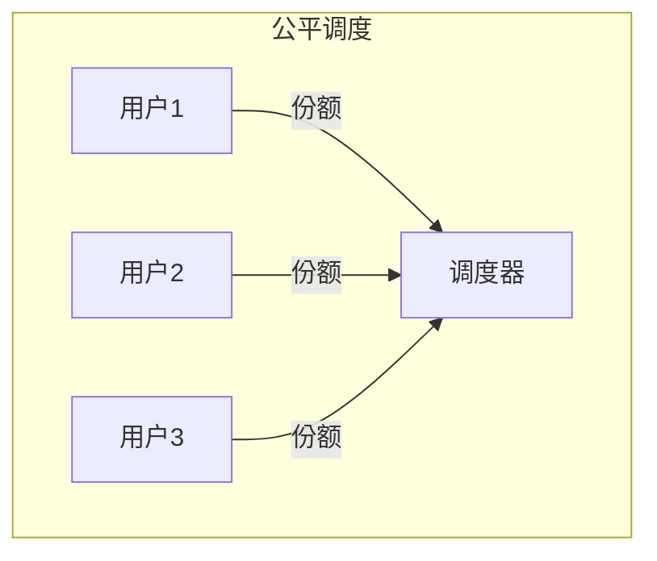

**场景**：多租户系统

---

## 四、Prefill 与 Decode 分离

### 4.1 为什么分离

| 阶段 | 特点 | 瓶颈 |
|------|------|------|
| Prefill | 处理整个 prompt | 计算密集 |
| Decode | 逐 token 生成 | 内存带宽 |

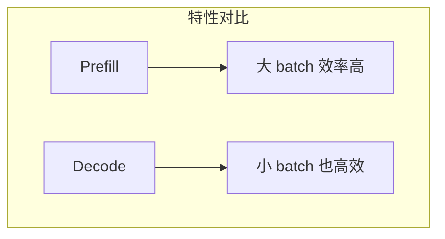

### 4.2 Chunked Prefill

**将长 Prefill 分块**：

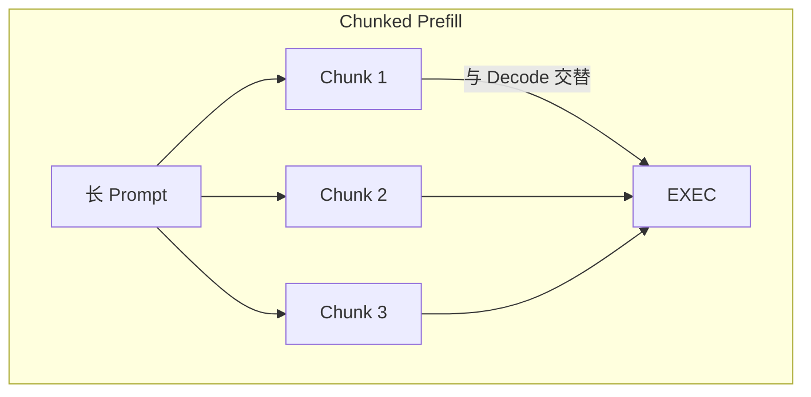

**优势**：
- 减少 Decode 请求等待
- 更平滑的延迟

### 4.3 分离调度

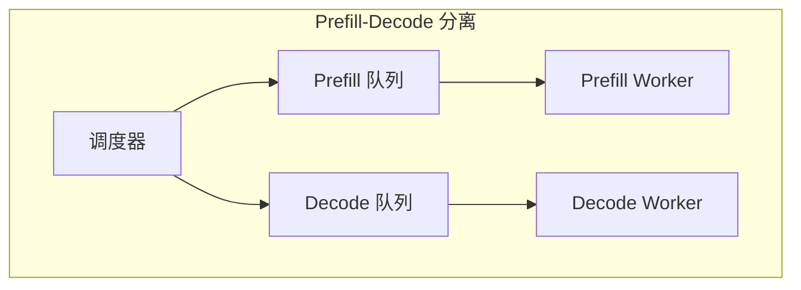

---

## 五、显存约束下的调度

### 5.1 显存预算

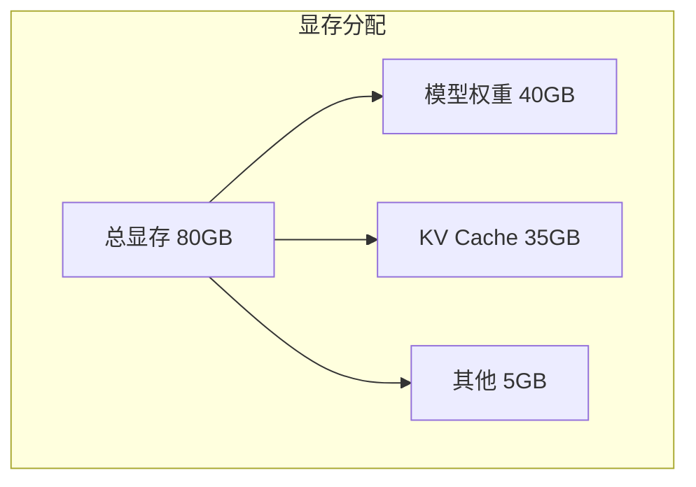

### 5.2 准入控制

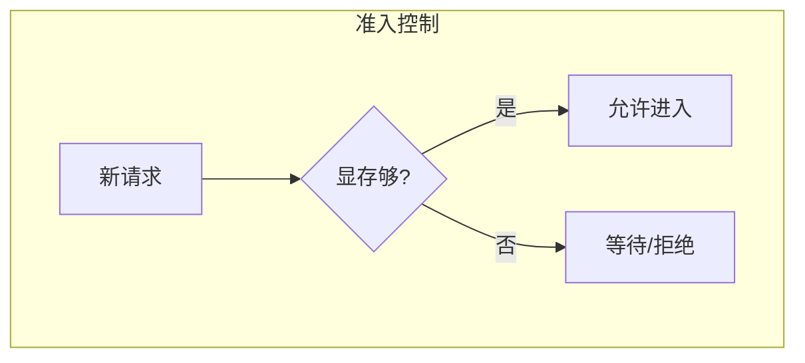

### 5.3 抢占策略

当显存不足时：

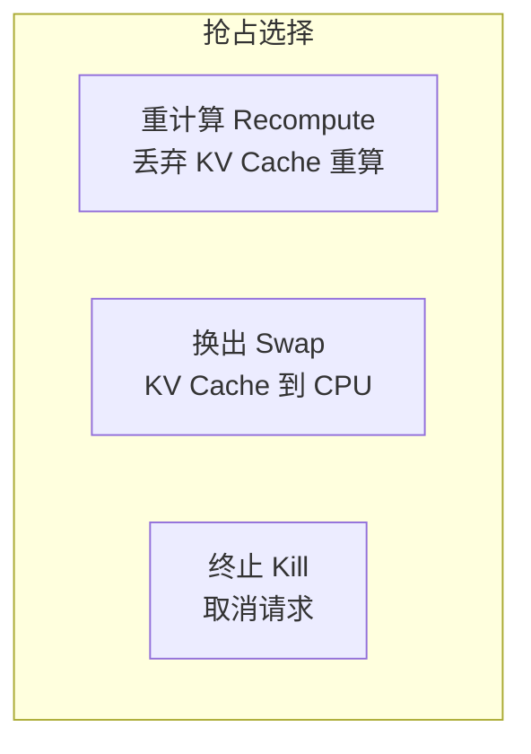

**选择因素**：
- 请求已生成多少
- 剩余预估长度
- 优先级

---

## 六、调度器设计

### 6.1 核心数据结构

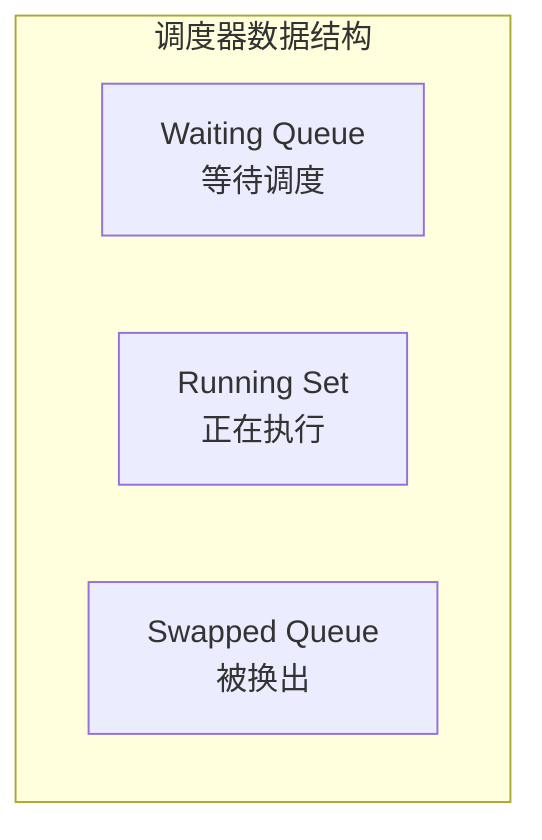

### 6.2 调度循环

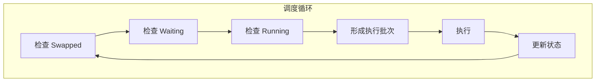

### 6.3 决策点

| 决策 | 考虑因素 |
|------|----------|
| 准入新请求 | 显存、优先级、公平性 |
| 换出请求 | 最近最少使用、优先级 |
| 换入请求 | 等待时间、显存 |
| Batch 组成 | Prefill/Decode 比例 |

---

## 七、高级调度技术

### 7.1 投机调度

**Speculative Scheduling**：

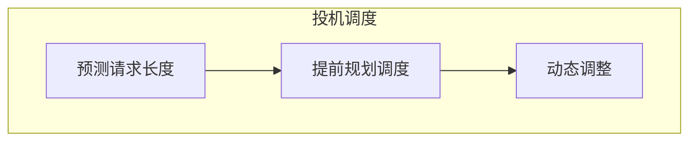

### 7.2 预取

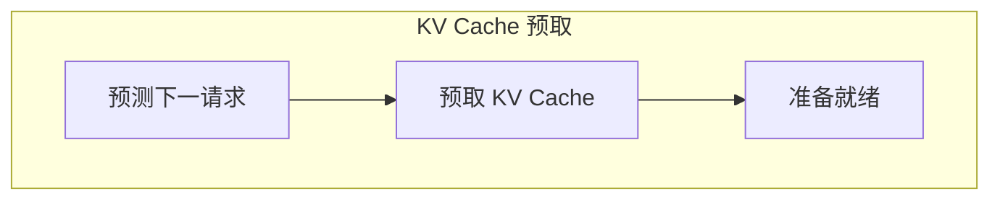

### 7.3 请求合并

**Prefix Caching**：

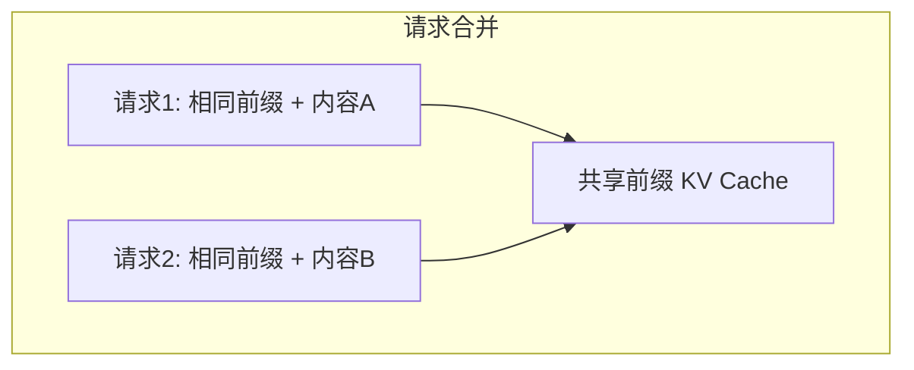

---

## 八、实现考虑

### 8.1 线程模型

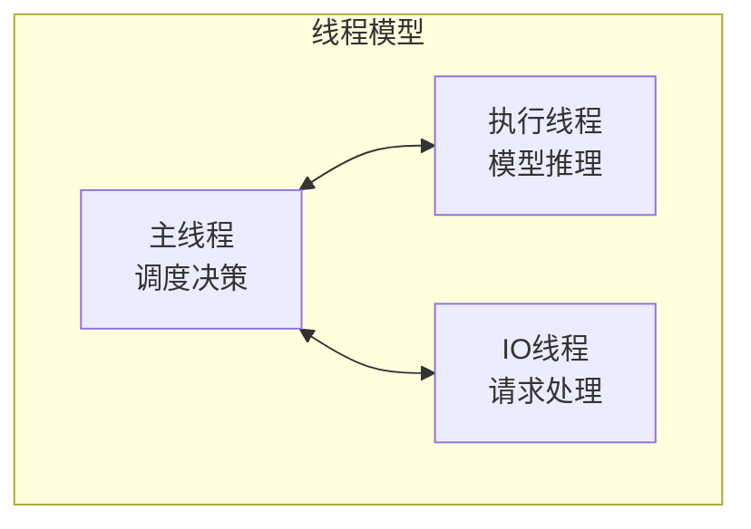

### 8.2 锁与同步

| 场景 | 策略 |
|------|------|
| 队列访问 | 细粒度锁/无锁队列 |
| 状态更新 | 原子操作 |
| 批次提交 | 同步点 |

### 8.3 性能优化

| 优化 | 方法 |
|------|------|
| 减少调度开销 | 批量决策 |
| 减少同步 | 异步调度 |
| 减少内存分配 | 对象池 |

---

## 九、监控与调优

### 9.1 关键指标

| 指标 | 含义 |
|------|------|
| 队列长度 | 等待请求数 |
| 调度延迟 | 调度决策耗时 |
| Batch 大小 | 平均批次大小 |
| 抢占率 | 被抢占请求比例 |

### 9.2 调优建议

| 问题 | 可能原因 | 解决方案 |
|------|----------|----------|
| 吞吐低 | Batch 太小 | 增加等待时间 |
| 延迟高 | 队列太长 | 限流或扩容 |
| 抢占多 | 显存不足 | 减少并发或换大显存 |

---

## 十、总结

### 10.1 核心认知

1. **Continuous Batching 是关键**
   - 最大化 GPU 利用率
   - 现代 LLM 推理必备

2. **调度需要权衡**
   - 延迟 vs 吞吐
   - 公平 vs 效率

3. **显存是核心约束**
   - 准入控制
   - 抢占策略

4. **Prefill/Decode 需分别对待**
   - 特性不同
   - 可以分离调度

### 10.2 设计建议

```mermaid
graph TB
    S1[理解工作负载] --> S2[选择基础策略]
    S2 --> S3[实现核心调度]
    S3 --> S4[添加高级特性]
    S4 --> S5[持续调优]
```

---

## 相关文章

- [上一篇：06 - Triton Inference Server 实战](/articles/ai-infra/infra-06-Triton-Inference-Server实战/)
- [下一篇：08 - 内存管理与 KV Cache 优化](/articles/ai-infra/infra-08-内存管理与KV-Cache优化/)
- [03 - vLLM 架构与源码解析](/articles/ai-infra/infra-03-vLLM架构与源码解析/)
