+++
title = "08. 内存管理与 KV Cache 优化"
description = "深入理解 LLM 推理中的显存管理和 KV Cache 优化技术"
date = 2025-02-06
weight = 8000
updated = 2025-02-06
draft = false
[taxonomies]
tags = ["内存管理", "KV Cache", "PagedAttention", "显存优化"]
[extra]
toc = true
comments = true
+++

## 一、显存管理的重要性

### 1.1 LLM 显存构成

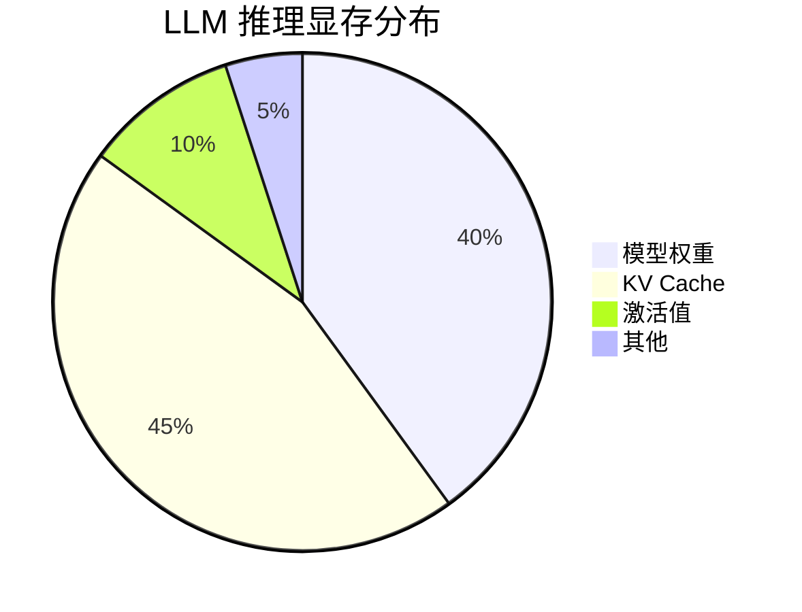

### 1.2 KV Cache 的问题

| 问题 | 描述 |
|------|------|
| 动态增长 | 每个 token 增加显存 |
| 预分配浪费 | 传统方式预分配最大长度 |
| 碎片化 | 请求完成后留下空洞 |
| 无法预知长度 | 不知道生成多少 token |

### 1.3 显存计算

**KV Cache 大小公式**：

```
单个 token KV Cache:
= 2 × n_layers × n_heads × d_head × dtype_size

LLaMA-70B (FP16):
= 2 × 80 × 8 × 128 × 2 bytes
= 327,680 bytes per token

4096 tokens:
= 327,680 × 4096 = 1.34 GB per sequence
```

---

## 二、传统内存管理

### 2.1 预分配方式

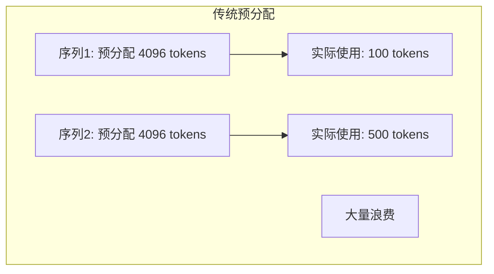

### 2.2 问题分析

| 问题 | 影响 |
|------|------|
| 内存利用率低 | ~50% 或更低 |
| 并发受限 | 无法支持更多请求 |
| 碎片化 | 无法充分利用 |

---

## 三、PagedAttention

### 3.1 核心思想

**像操作系统管理内存一样管理 KV Cache**

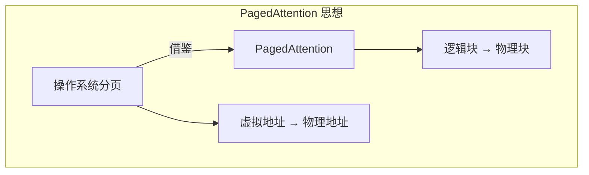

### 3.2 Block 设计

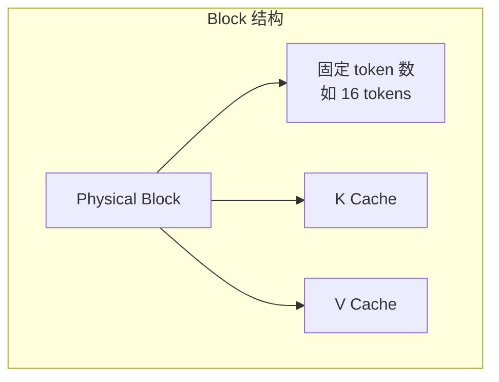

### 3.3 Block Table

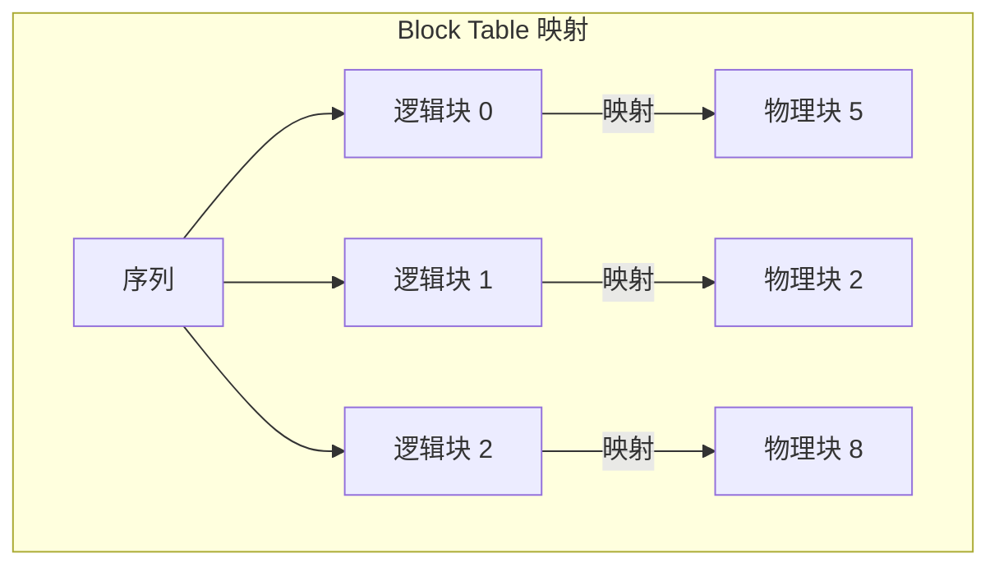

### 3.4 优势

| 优势 | 效果 |
|------|------|
| 按需分配 | 用多少分多少 |
| 消除碎片 | 块可以不连续 |
| 利用率高 | 接近 100% |
| 支持共享 | Copy-on-Write |

---

## 四、内存池设计

### 4.1 Block 池

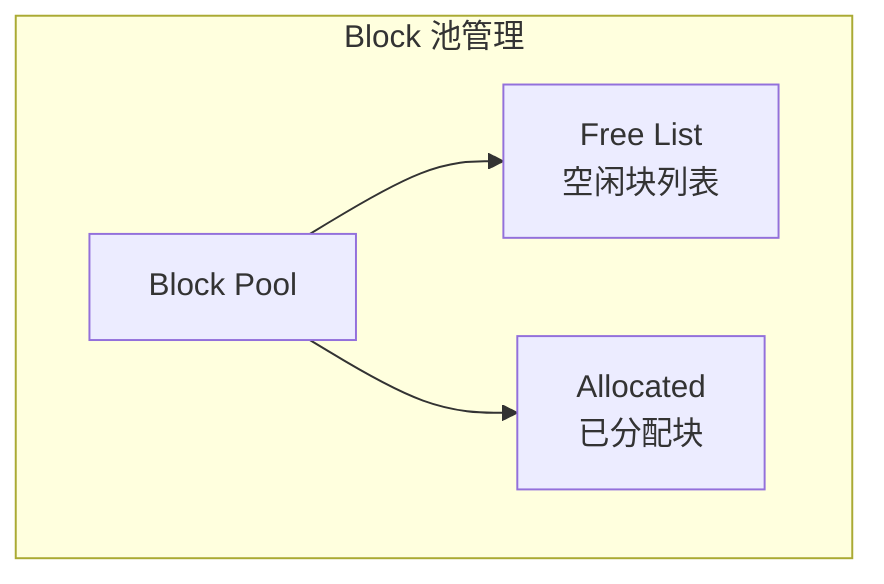

### 4.2 分配流程

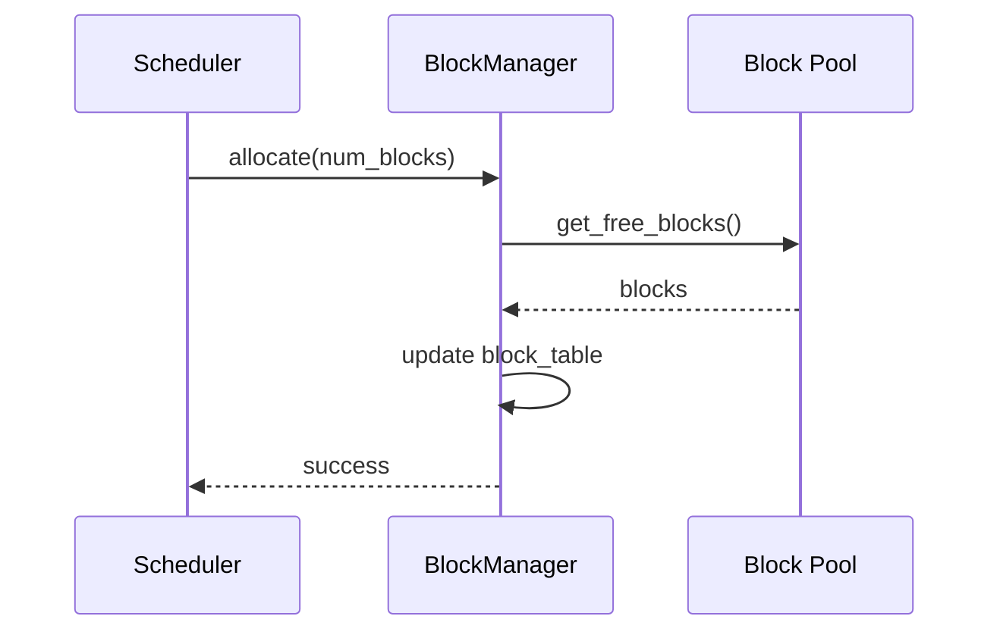

### 4.3 释放流程

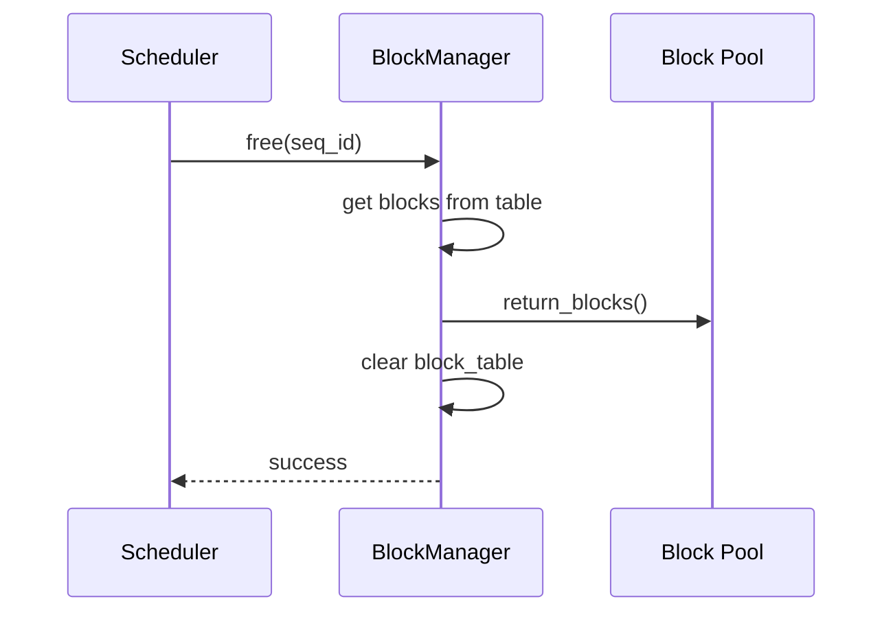

---

## 五、高级优化技术

### 5.1 Prefix Caching

**共享公共前缀的 KV Cache**

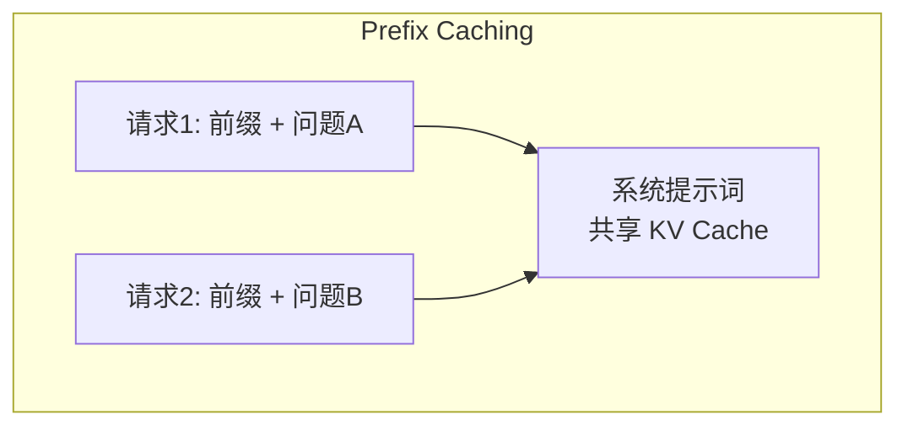

**实现**：
- 计算前缀 hash
- 查找已缓存的 KV
- 命中则复用

### 5.2 Copy-on-Write

**多序列共享 Block**

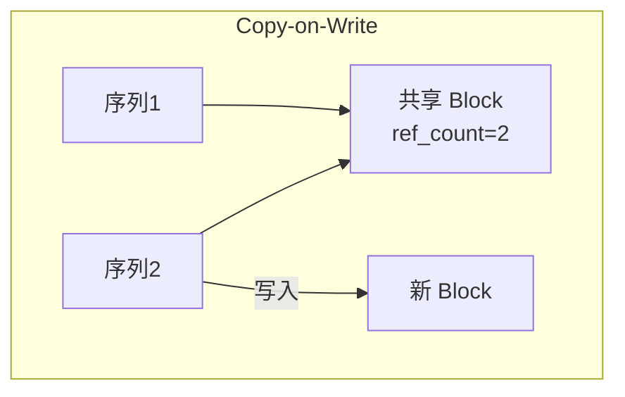

**应用场景**：
- Beam Search
- 并行采样
- 前缀共享

### 5.3 KV Cache 量化

**压缩 KV Cache 占用**

| 方法 | 压缩比 | 精度影响 |
|------|--------|----------|
| FP16 → INT8 | 2x | 小 |
| FP16 → INT4 | 4x | 中等 |
| 选择性量化 | 可变 | 可控 |

### 5.4 KV Cache 压缩

**Token 级别压缩**

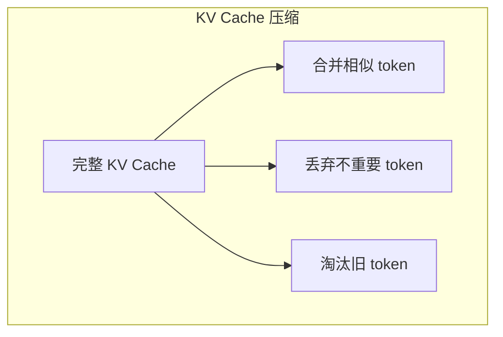

---

## 六、Offloading

### 6.1 CPU Offload

**将 KV Cache 换出到 CPU**

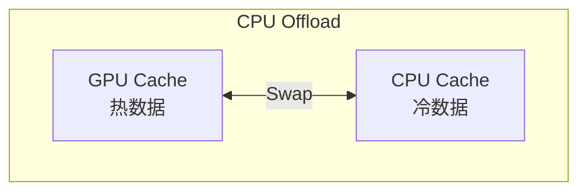

### 6.2 NVMe Offload

**换出到 SSD**

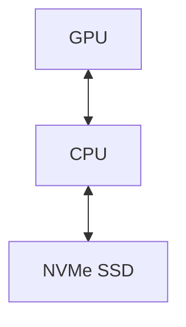

### 6.3 Offload 策略

| 策略 | 描述 |
|------|------|
| LRU | 最近最少使用 |
| 优先级 | 低优先级先换出 |
| 预测 | 预测可能不需要的 |

---

## 七、多 GPU 内存管理

### 7.1 Tensor Parallel KV Cache

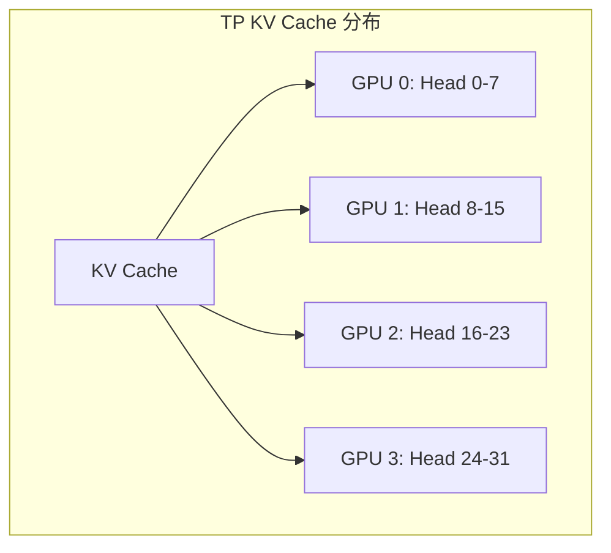

### 7.2 跨 GPU 通信

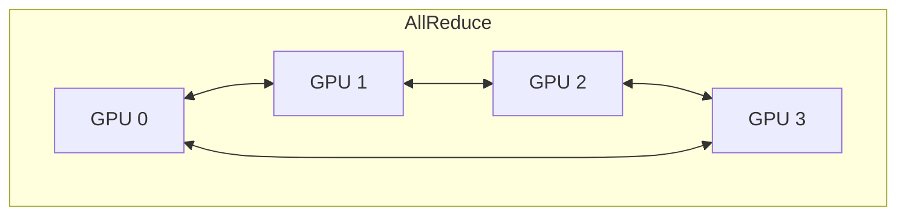

---

## 八、实现细节

### 8.1 Block 大小选择

| Block Size | 优点 | 缺点 |
|------------|------|------|
| 小（8） | 灵活 | 管理开销大 |
| 中（16） | 平衡 | - |
| 大（32） | 开销小 | 可能浪费 |

### 8.2 内存对齐

| 要求 | 原因 |
|------|------|
| 256 字节对齐 | CUDA 内存访问效率 |
| 缓存行对齐 | CPU 访问效率 |

### 8.3 错误处理

| 错误 | 处理 |
|------|------|
| OOM | 触发换出或拒绝 |
| 分配失败 | 重试或降级 |
| 损坏检测 | 校验和验证 |

---

## 九、性能分析

### 9.1 关键指标

| 指标 | 含义 |
|------|------|
| 内存利用率 | 使用/总量 |
| 碎片率 | 不可用块比例 |
| 分配延迟 | 分配耗时 |
| 换出频率 | Swap 次数 |

### 9.2 优化效果

| 技术 | 利用率提升 |
|------|------------|
| PagedAttention | 50% → 95% |
| Prefix Caching | 节省重复计算 |
| KV Quantization | 2-4x 压缩 |

---

## 十、总结

### 10.1 核心认知

1. **KV Cache 是显存主要消耗**
   - 动态增长
   - 传统方式浪费严重

2. **PagedAttention 是突破**
   - 分页思想
   - 显存利用率接近 100%

3. **多种优化可叠加**
   - 量化
   - 压缩
   - Offload
   - 共享

### 10.2 设计原则

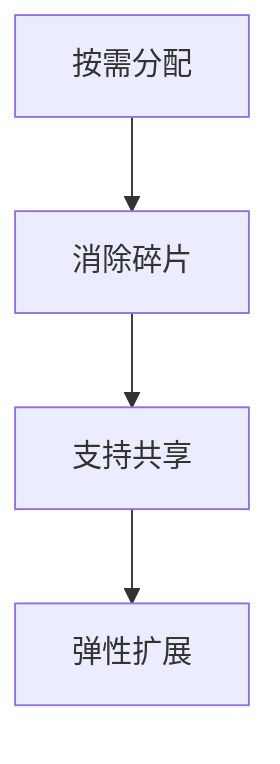

---

## 相关文章

- [上一篇：07 - 推理调度与 Batching 策略](@/articles/ai-infra/ai-infra-07-推理调度与Batching策略.md)
- [下一篇：09 - 推理引擎性能调优](@/articles/ai-infra/ai-infra-09-推理引擎性能调优.md)
- [25 - FlashAttention 与 PagedAttention 原理](@/articles/ai/ai-25-FlashAttention与PagedAttention原理.md)
