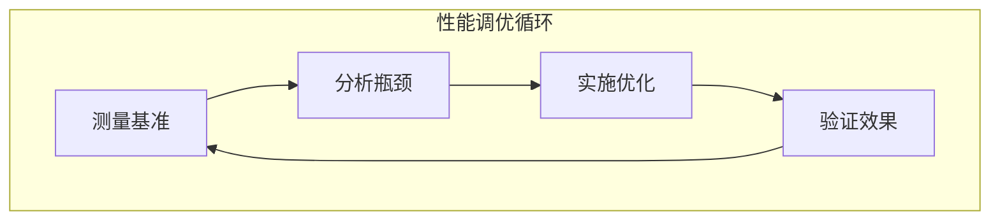
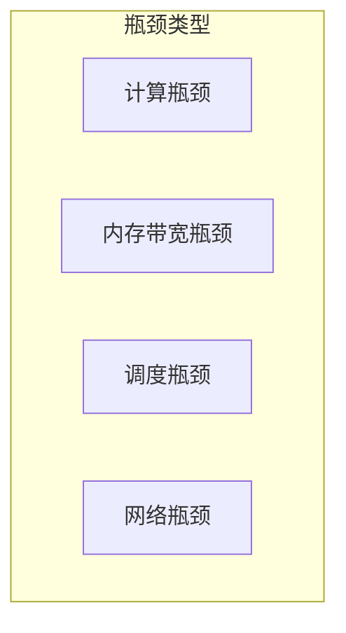
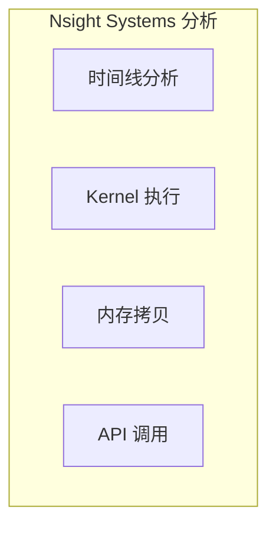
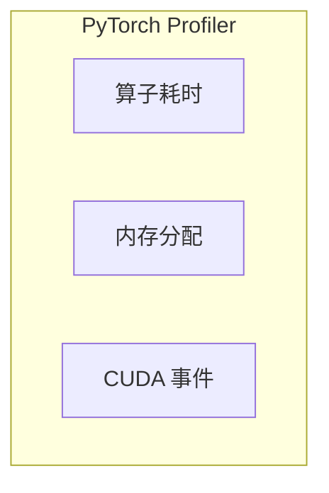
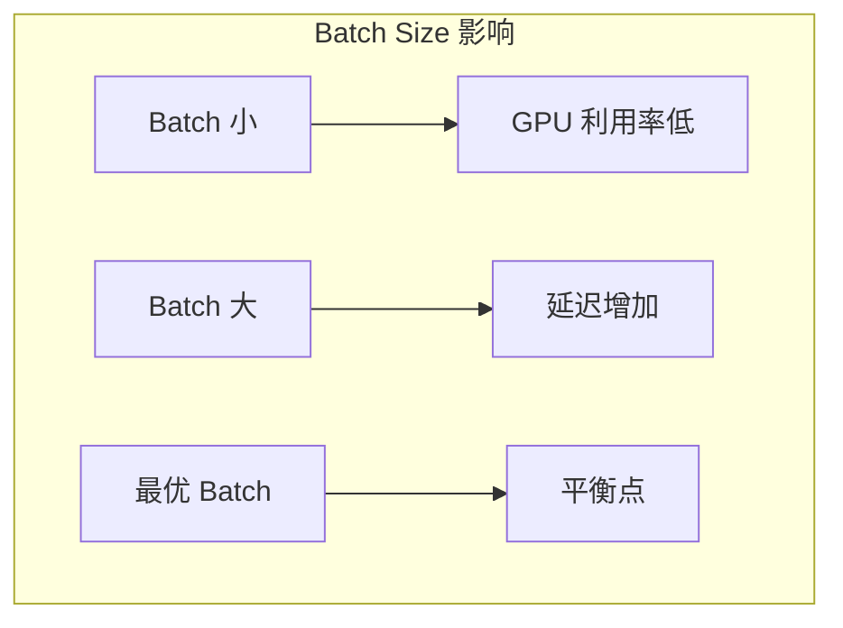
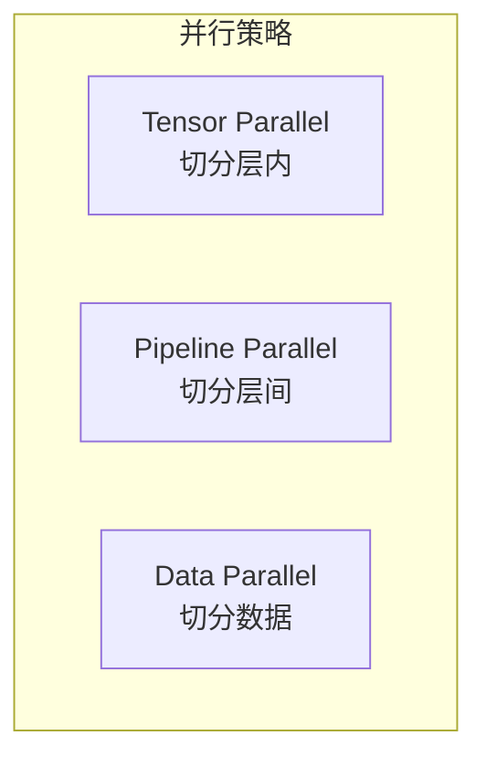
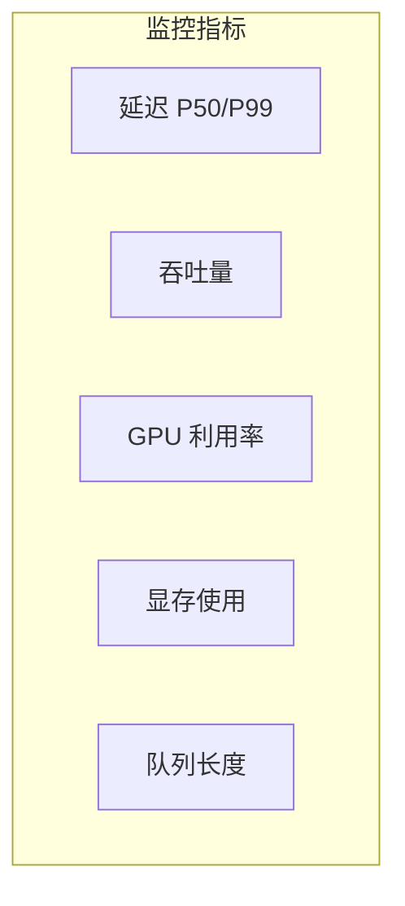
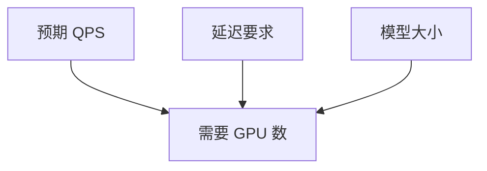

+++
title = "推理引擎性能调优"
description = "系统化的 LLM 推理性能分析与优化方法"
date = 2025-02-06
weight = 9000
updated = 2025-02-06
draft = false
[taxonomies]
tags = ["性能调优", "Profiling", "推理优化", "瓶颈分析"]
[extra]
toc = true
comments = true
+++

## 一、性能调优方法论

### 1.1 调优流程

### 1.2 核心原则

| 原则 | 描述 |
|------|------|
| 测量先于优化 | 不要猜测，用数据说话 |
| 解决主要矛盾 | 优化最大瓶颈 |
| 渐进式优化 | 每次只改一个变量 |
| 回归验证 | 确保不引入新问题 |

---

## 二、性能指标体系

### 2.1 延迟指标

| 指标 | 定义 |
|------|------|
| TTFT | Time To First Token，首 token 延迟 |
| TPOT | Time Per Output Token，每 token 延迟 |
| E2E Latency | 端到端总延迟 |
| P50/P99 | 百分位延迟 |

### 2.2 吞吐指标

| 指标 | 定义 |
|------|------|
| Tokens/s | 每秒生成 token 数 |
| Requests/s | 每秒处理请求数 |
| GPU Util | GPU 计算利用率 |

### 2.3 资源指标

| 指标 | 定义 |
|------|------|
| GPU Memory | 显存使用 |
| Memory BW | 内存带宽使用 |
| SM Util | SM 利用率 |

---

## 三、瓶颈分析

### 3.1 瓶颈类型

### 3.2 判断方法

| 现象 | 可能瓶颈 |
|------|----------|
| GPU Util 低，吞吐低 | Batch 太小 |
| GPU Util 高，延迟高 | 计算密集 |
| 显存接近满 | 内存瓶颈 |
| 多 GPU 效率低 | 通信瓶颈 |

### 3.3 Prefill vs Decode

| 阶段 | 瓶颈特点 |
|------|----------|
| Prefill | 计算密集，受 Attention 计算限制 |
| Decode | 访存密集，受内存带宽限制 |

---

## 四、分析工具

### 4.1 NVIDIA Nsight Systems

**系统级性能分析**

**关注点**：
- Kernel 执行时间
- 空闲间隙
- 内存传输重叠

### 4.2 NVIDIA Nsight Compute

**Kernel 级深度分析**

| 指标 | 含义 |
|------|------|
| Compute Throughput | 计算吞吐 |
| Memory Throughput | 内存吞吐 |
| Occupancy | 占用率 |
| Warp Stall | Warp 停顿原因 |

### 4.3 PyTorch Profiler

**Python 级分析**

---

## 五、优化策略

### 5.1 Batch Size 优化

**调优方法**：
1. 从小 batch 开始
2. 逐步增大直到延迟不可接受
3. 监控 GPU 利用率变化

### 5.2 量化优化

| 精度 | 效果 |
|------|------|
| FP16 | 2x 速度，精度几乎无损 |
| INT8 | 2-4x 速度，轻微精度损失 |
| INT4 | 4-8x 速度，明显精度损失 |
| FP8 | 1.5-2x 速度，精度接近 FP16 |

### 5.3 算子优化

| 优化 | 方法 |
|------|------|
| Flash Attention | 减少内存访问 |
| 算子融合 | 减少 Kernel 启动 |
| Tensor Core | 利用硬件加速 |

### 5.4 并行优化

---

## 六、调优案例

### 6.1 案例：TTFT 过高

**现象**：首 token 延迟 > 2s

**分析**：
1. Prefill 阶段耗时长
2. 输入 prompt 很长
3. Attention 计算慢

**优化**：
- 启用 Flash Attention
- 使用 Chunked Prefill
- 考虑多卡 TP

### 6.2 案例：GPU 利用率低

**现象**：GPU Util < 30%

**分析**：
1. Batch size 太小
2. Decode 阶段访存密集
3. Kernel 间空闲

**优化**：
- 增加并发请求
- 启用 Continuous Batching
- 检查调度效率

### 6.3 案例：显存 OOM

**现象**：运行时 CUDA OOM

**分析**：
1. KV Cache 过大
2. 并发请求过多
3. 序列长度过长

**优化**：
- 启用 PagedAttention
- 减少 max_batch_size
- KV Cache 量化
- 启用 Swap

---

## 七、配置调优

### 7.1 vLLM 参数

| 参数 | 调优建议 |
|------|----------|
| gpu_memory_utilization | 0.9-0.95 |
| max_num_seqs | 根据显存调整 |
| max_num_batched_tokens | Prefill 并发控制 |
| block_size | 通常保持默认 |

### 7.2 TensorRT-LLM 参数

| 参数 | 调优建议 |
|------|----------|
| max_batch_size | 根据延迟要求 |
| max_input_len | 实际最大输入 |
| enable_context_fmha | 启用 |
| paged_kv_cache | 启用 |

---

## 八、监控与告警

### 8.1 关键监控

### 8.2 告警阈值

| 指标 | 告警条件 |
|------|----------|
| P99 延迟 | > SLA × 1.5 |
| GPU Util | < 50% 持续 5min |
| 显存 | > 95% |
| 错误率 | > 1% |

---

## 九、生产环境建议

### 9.1 基准测试

| 测试项 | 方法 |
|--------|------|
| 最大吞吐 | 持续压测 |
| 延迟分布 | 固定 QPS 测延迟 |
| 稳定性 | 长时间运行 |
| 边界条件 | 长文本、大 batch |

### 9.2 容量规划

### 9.3 回滚策略

| 场景 | 策略 |
|------|------|
| 性能下降 | 回滚到上一版本 |
| 显存增加 | 减少并发 |
| 延迟突增 | 限流降级 |

---

## 十、总结

### 10.1 核心认知

1. **测量驱动优化**
   - 用数据说话
   - 找到真正瓶颈

2. **分阶段优化**
   - Prefill 和 Decode 不同
   - 分别优化

3. **配置调优优先**
   - 先调参数
   - 再改代码

4. **持续监控**
   - 生产环境监控
   - 及时发现问题

### 10.2 调优清单

- [ ] 确定性能目标（延迟、吞吐）
- [ ] 建立基准测试
- [ ] 分析当前瓶颈
- [ ] 选择优化方向
- [ ] 实施并验证
- [ ] 建立监控告警

---

## 相关文章

- [上一篇：08 - 内存管理与 KV Cache 优化](@/articles/ai-infra/ai-infra-08-内存管理与KV-Cache优化.md)
- [下一篇：10 - 从零构建推理引擎](@/articles/ai-infra/ai-infra-10-从零构建推理引擎.md)
- [02 - LLM 推理优化全景](@/articles/ai-infra/ai-infra-02-LLM推理优化全景.md)
