+++
title = "11. 多模态 LLM 推理优化"
description = "语音、图像与文本多模态大模型推理系统设计与优化实战"
date = 2025-02-07
weight = 11000
updated = 2025-02-07
draft = false
[taxonomies]
tags = ["多模态", "LLM", "推理优化", "语音", "视觉", "AI Infra"]
[extra]
toc = true
comments = true
+++

## 一、多模态 LLM 概述

### 1.1 什么是多模态 LLM

多模态大语言模型（Multimodal LLM）是指能够处理和理解多种输入模态（文本、图像、语音、视频等）的大型语言模型。

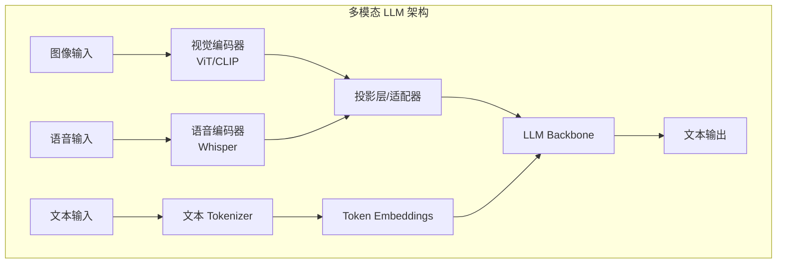

### 1.2 典型多模态模型

| 模型 | 模态 | 架构特点 |
|------|------|----------|
| **GPT-4V** | 文本 + 图像 | 未公开 |
| **LLaVA** | 文本 + 图像 | CLIP + Vicuna |
| **Qwen-VL** | 文本 + 图像 | 视觉 Tokenizer |
| **Gemini** | 文本 + 图像 + 音频 + 视频 | 原生多模态 |
| **Whisper + LLM** | 语音 + 文本 | 级联架构 |
| **GPT-4o** | 全模态 | 端到端多模态 |

### 1.3 多模态推理的挑战

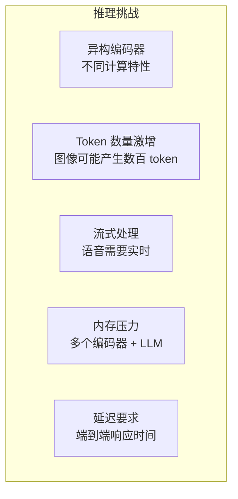

---

## 二、视觉 LLM 推理

### 2.1 视觉编码器

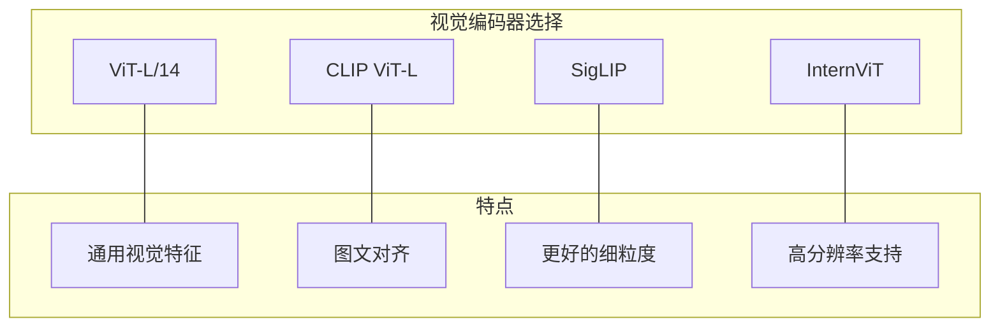

**视觉 Token 数量计算**：

| 图像分辨率 | Patch 大小 | Token 数量 |
|------------|------------|------------|
| 224×224 | 14×14 | 256 |
| 336×336 | 14×14 | 576 |
| 448×448 | 14×14 | 1024 |
| 672×672 | 14×14 | 2304 |

### 2.2 视觉 Token 优化

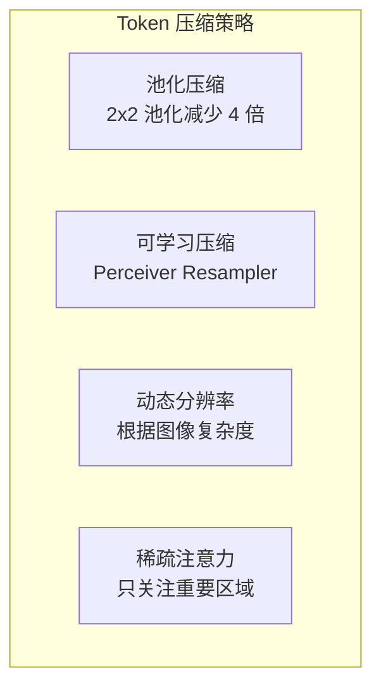

**实现示例：Perceiver Resampler**

```python
class PerceiverResampler(nn.Module):
    """将可变数量的视觉 token 压缩为固定数量"""
    def __init__(
        self,
        dim: int = 1024,
        num_queries: int = 64,  # 输出 token 数
        num_heads: int = 16,
        num_layers: int = 6,
    ):
        super().__init__()
        self.queries = nn.Parameter(torch.randn(num_queries, dim))
        
        self.layers = nn.ModuleList([
            nn.TransformerDecoderLayer(
                d_model=dim,
                nhead=num_heads,
                batch_first=True,
            )
            for _ in range(num_layers)
        ])
    
    def forward(self, visual_tokens: torch.Tensor) -> torch.Tensor:
        """
        Args:
            visual_tokens: (batch, num_visual_tokens, dim)
        Returns:
            compressed: (batch, num_queries, dim)
        """
        batch_size = visual_tokens.shape[0]
        queries = self.queries.unsqueeze(0).expand(batch_size, -1, -1)
        
        for layer in self.layers:
            queries = layer(queries, visual_tokens)
        
        return queries
```

### 2.3 高分辨率图像处理

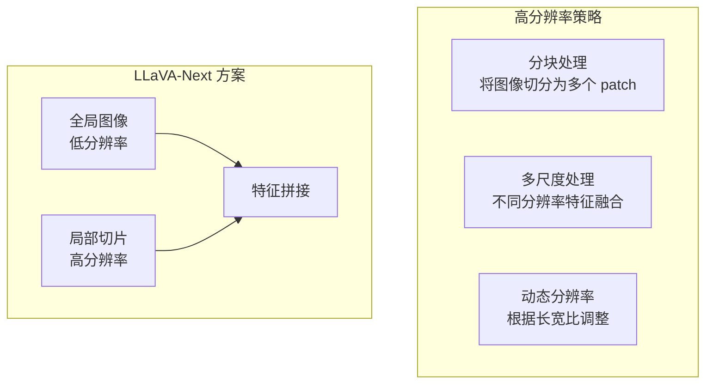

### 2.4 视觉 LLM 推理优化

| 优化点 | 方法 | 收益 |
|--------|------|------|
| 编码器量化 | INT8 量化 ViT | 减少 50% 显存 |
| Token 压缩 | Resampler | 减少 4-16x Token |
| 预计算 | 缓存图像特征 | 减少重复计算 |
| 分离部署 | 编码器与 LLM 分开 | 灵活扩展 |

---

## 三、语音 LLM 推理

### 3.1 语音 LLM 架构

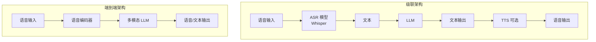

### 3.2 语音编码器

**Whisper 编码器特点**：

| 属性 | 值 |
|------|-----|
| 采样率 | 16kHz |
| 窗口大小 | 30 秒 |
| 特征维度 | 80 (Mel) → 1280 (隐藏) |
| Token 率 | 50 tokens/秒 |

**语音 Token 数量**：

| 语音时长 | Token 数量 |
|----------|------------|
| 1 秒 | 50 tokens |
| 30 秒 | 1,500 tokens |
| 5 分钟 | 15,000 tokens |

### 3.3 流式语音处理

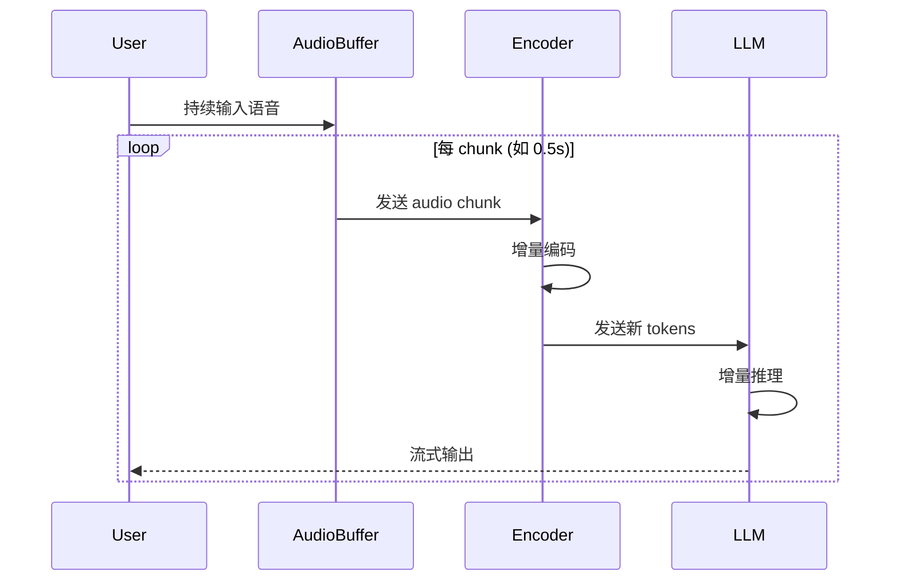

**流式处理核心代码**：

```python
class StreamingSpeechLLM:
    def __init__(self, encoder, llm, chunk_size_ms=500):
        self.encoder = encoder
        self.llm = llm
        self.chunk_size = int(16000 * chunk_size_ms / 1000)  # 16kHz
        self.audio_buffer = []
        self.encoder_state = None
    
    def process_chunk(self, audio_chunk: np.ndarray) -> Optional[str]:
        """处理一个音频块"""
        self.audio_buffer.append(audio_chunk)
        
        # 积累足够的音频
        if len(self.audio_buffer) * len(audio_chunk) < self.chunk_size:
            return None
        
        # 编码
        audio = np.concatenate(self.audio_buffer)
        tokens, self.encoder_state = self.encoder.encode_streaming(
            audio, self.encoder_state
        )
        
        # 清空 buffer
        self.audio_buffer = []
        
        # LLM 推理
        if tokens is not None:
            output = self.llm.generate_streaming(tokens)
            return output
        
        return None
```

### 3.4 语音 LLM 延迟分析

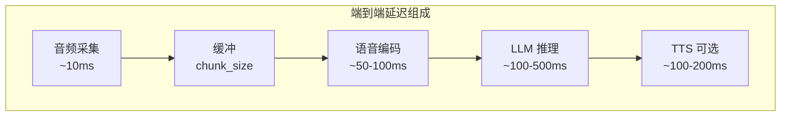

**延迟优化策略**：

| 策略 | 效果 |
|------|------|
| 减小 chunk_size | 降低缓冲延迟，但增加计算开销 |
| 增量编码 | 避免重复计算历史音频 |
| Speculative Decoding | 加速 LLM 推理 |
| 流式 TTS | 边生成边播放 |

---

## 四、多模态 Batching

### 4.1 挑战

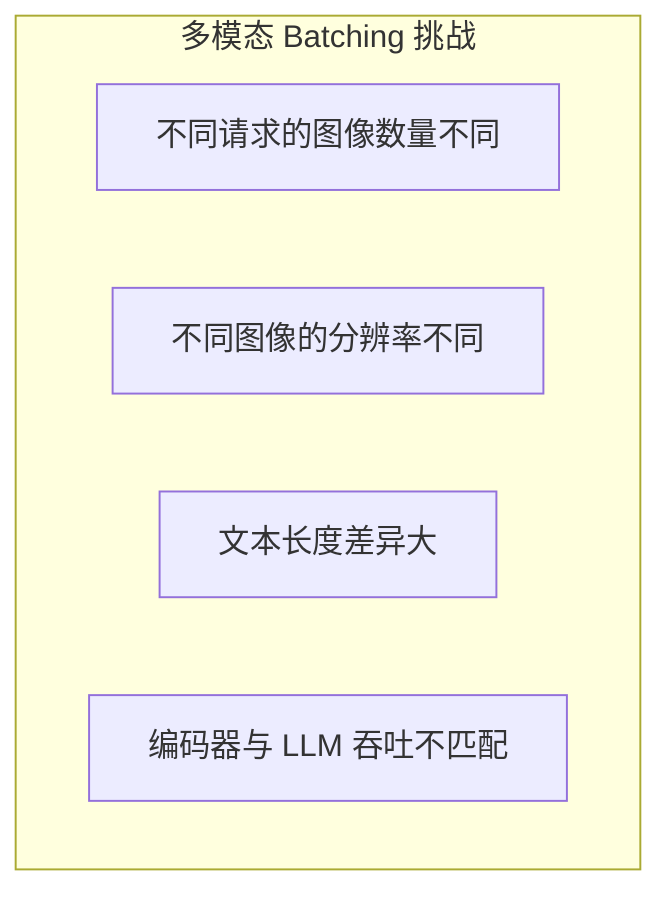

### 4.2 策略

#### 4.2.1 分离 Batching

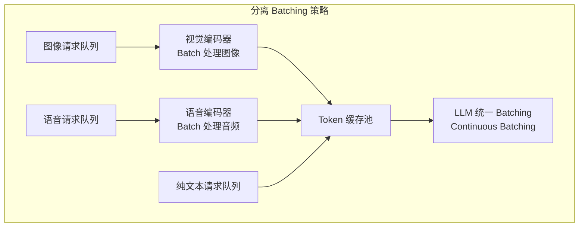

#### 4.2.2 异构 Token 管理

```python
class MultimodalBatchManager:
    """多模态请求的批次管理"""
    
    def __init__(
        self,
        vision_encoder,
        audio_encoder,
        llm_scheduler,
    ):
        self.vision_encoder = vision_encoder
        self.audio_encoder = audio_encoder
        self.llm_scheduler = llm_scheduler
        
        # 编码后的 token 缓存
        self.token_cache = {}
    
    def encode_images(self, requests: List[Request]) -> None:
        """批量编码图像"""
        image_requests = [r for r in requests if r.has_image]
        if not image_requests:
            return
        
        # 收集图像
        images = [r.image for r in image_requests]
        
        # 批量编码
        image_tokens = self.vision_encoder.encode_batch(images)
        
        # 缓存结果
        for req, tokens in zip(image_requests, image_tokens):
            self.token_cache[req.id] = ('vision', tokens)
    
    def prepare_llm_batch(self, requests: List[Request]) -> LLMBatch:
        """准备 LLM 批次输入"""
        batch_tokens = []
        
        for req in requests:
            tokens = []
            
            # 添加多模态 token
            if req.id in self.token_cache:
                modal_type, modal_tokens = self.token_cache[req.id]
                tokens.extend(modal_tokens)
            
            # 添加文本 token
            tokens.extend(req.text_tokens)
            
            batch_tokens.append(tokens)
        
        return self.llm_scheduler.create_batch(batch_tokens)
```

### 4.3 内存管理

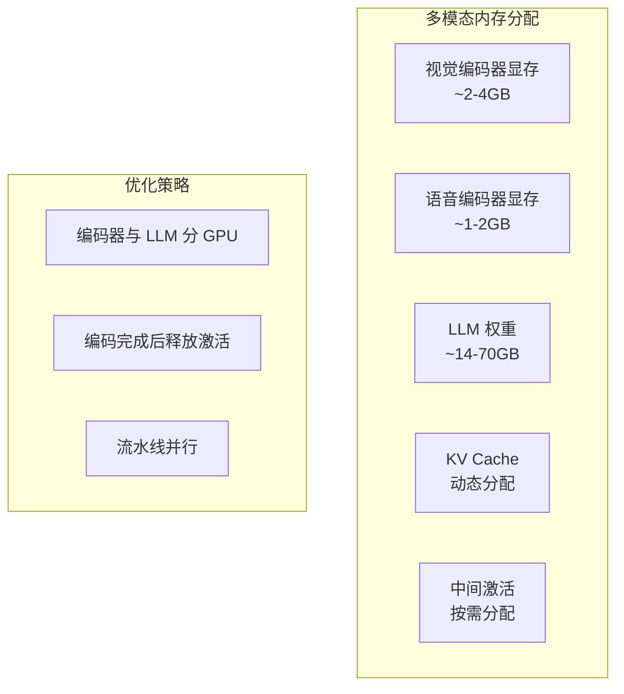

---

## 五、性能优化实战

### 5.1 编码器-LLM 流水线

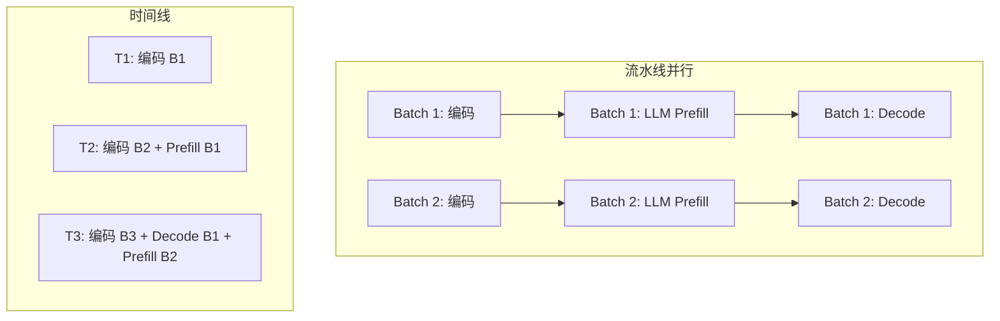

**流水线实现**：

```python
class PipelinedMultimodalEngine:
    def __init__(self, encoder, llm, num_pipeline_stages=2):
        self.encoder = encoder
        self.llm = llm
        self.num_stages = num_pipeline_stages
        
        # 流水线队列
        self.encode_queue = asyncio.Queue()
        self.llm_queue = asyncio.Queue()
    
    async def encoder_worker(self):
        """编码器工作线程"""
        while True:
            batch = await self.encode_queue.get()
            
            # 编码
            encoded = await asyncio.to_thread(
                self.encoder.encode_batch, batch.inputs
            )
            
            # 发送到 LLM 队列
            batch.encoded_tokens = encoded
            await self.llm_queue.put(batch)
    
    async def llm_worker(self):
        """LLM 工作线程"""
        while True:
            batch = await self.llm_queue.get()
            
            # 执行 LLM 推理
            outputs = await asyncio.to_thread(
                self.llm.generate, batch.encoded_tokens
            )
            
            # 返回结果
            batch.set_result(outputs)
    
    async def run(self):
        """启动流水线"""
        await asyncio.gather(
            self.encoder_worker(),
            self.llm_worker(),
        )
```

### 5.2 动态分辨率调度

```python
class DynamicResolutionScheduler:
    """根据系统负载动态调整图像分辨率"""
    
    def __init__(
        self,
        max_tokens_per_batch: int = 4096,
        resolutions: List[int] = [224, 336, 448, 672],
    ):
        self.max_tokens = max_tokens_per_batch
        self.resolutions = sorted(resolutions)
    
    def select_resolution(
        self,
        num_requests: int,
        current_load: float,
    ) -> int:
        """选择合适的分辨率"""
        # 高负载时降低分辨率
        if current_load > 0.8:
            return self.resolutions[0]
        elif current_load > 0.5:
            return self.resolutions[1]
        else:
            return self.resolutions[-1]
    
    def estimate_tokens(self, resolution: int) -> int:
        """估算 token 数量"""
        patch_size = 14
        num_patches = (resolution // patch_size) ** 2
        return num_patches
```

### 5.3 KV Cache 优化

多模态场景下 KV Cache 的特殊考虑：

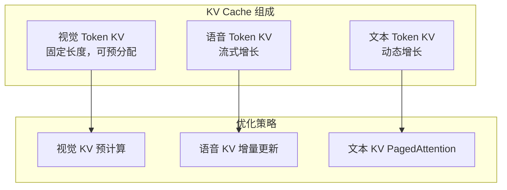

**Prefix Caching 应用**：

```python
class MultimodalPrefixCache:
    """多模态前缀缓存"""
    
    def __init__(self, cache_size_gb: float = 4.0):
        self.cache = LRUCache(max_size=cache_size_gb * 1e9)
    
    def get_image_key(self, image: torch.Tensor) -> str:
        """计算图像的缓存 key"""
        return hashlib.md5(image.numpy().tobytes()).hexdigest()
    
    def cache_image_kv(
        self,
        image: torch.Tensor,
        kv_cache: Tuple[torch.Tensor, torch.Tensor],
    ) -> None:
        """缓存图像对应的 KV"""
        key = self.get_image_key(image)
        self.cache.put(key, kv_cache)
    
    def get_image_kv(
        self,
        image: torch.Tensor,
    ) -> Optional[Tuple[torch.Tensor, torch.Tensor]]:
        """获取缓存的图像 KV"""
        key = self.get_image_key(image)
        return self.cache.get(key)
```

---

## 六、部署架构

### 6.1 单机部署

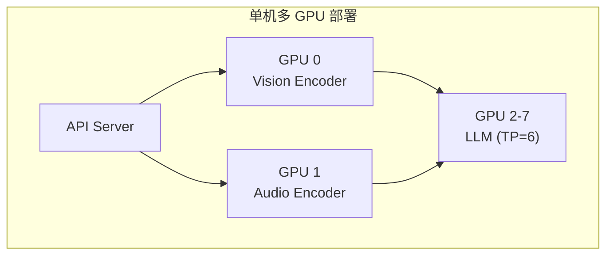

### 6.2 分布式部署

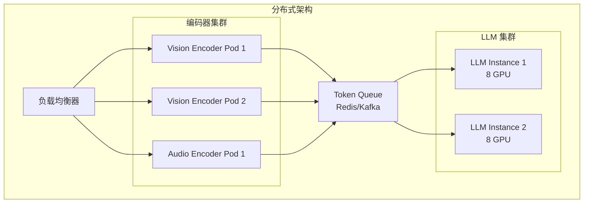

### 6.3 Triton 部署配置

```python
# model_repository/
# ├── vision_encoder/
# │   └── config.pbtxt
# ├── audio_encoder/
# │   └── config.pbtxt
# ├── llm/
# │   └── config.pbtxt
# └── multimodal_ensemble/
#     └── config.pbtxt

# multimodal_ensemble/config.pbtxt
"""
name: "multimodal_ensemble"
platform: "ensemble"
max_batch_size: 8

input [
  { name: "IMAGE" datatype: "FP32" dims: [ 3, -1, -1 ] optional: true },
  { name: "AUDIO" datatype: "FP32" dims: [ -1 ] optional: true },
  { name: "TEXT" datatype: "INT32" dims: [ -1 ] }
]

output [
  { name: "OUTPUT" datatype: "INT32" dims: [ -1 ] }
]

ensemble_scheduling {
  step [
    {
      model_name: "vision_encoder"
      model_version: -1
      input_map { key: "IMAGE" value: "IMAGE" }
      output_map { key: "VISION_TOKENS" value: "vision_output" }
    },
    {
      model_name: "llm"
      model_version: -1
      input_map {
        key: "VISION_TOKENS" value: "vision_output"
        key: "TEXT" value: "TEXT"
      }
      output_map { key: "OUTPUT" value: "OUTPUT" }
    }
  ]
}
"""
```

---

## 七、监控与调优

### 7.1 关键指标

| 指标 | 说明 | 目标值 |
|------|------|--------|
| 编码器吞吐 | 图像/秒 | > 100 img/s |
| 端到端延迟 | 从请求到首 token | < 500ms |
| Token 吞吐 | 输出 token/秒 | > 1000 tok/s |
| GPU 利用率 | 编码器 + LLM | > 80% |
| 内存使用 | 峰值显存 | < 95% |

### 7.2 瓶颈分析

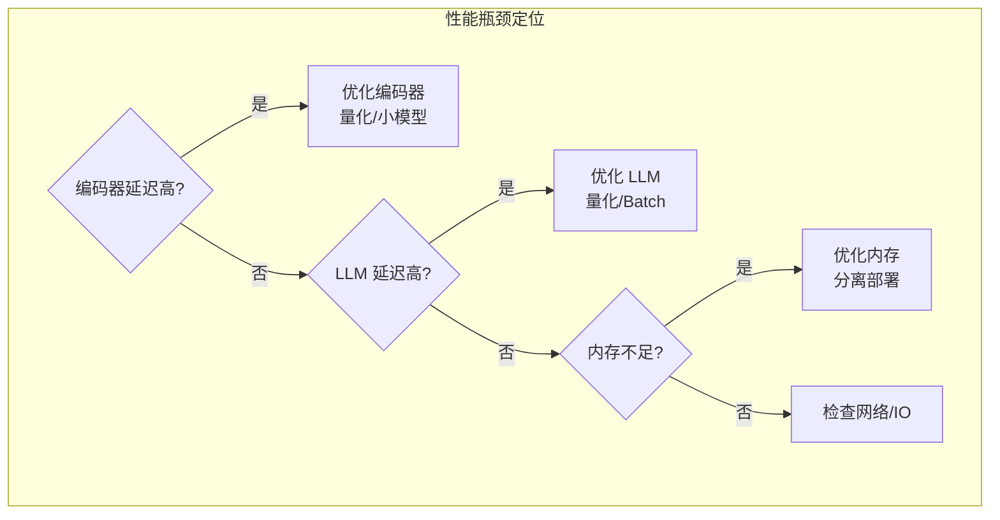

---

## 八、最佳实践

### 8.1 设计建议

| 场景 | 建议 |
|------|------|
| 高吞吐 | 分离编码器和 LLM，独立扩展 |
| 低延迟 | 单机部署，减少网络开销 |
| 大图像 | 使用 Token 压缩，动态分辨率 |
| 实时语音 | 流式处理，小 chunk |

### 8.2 常见问题

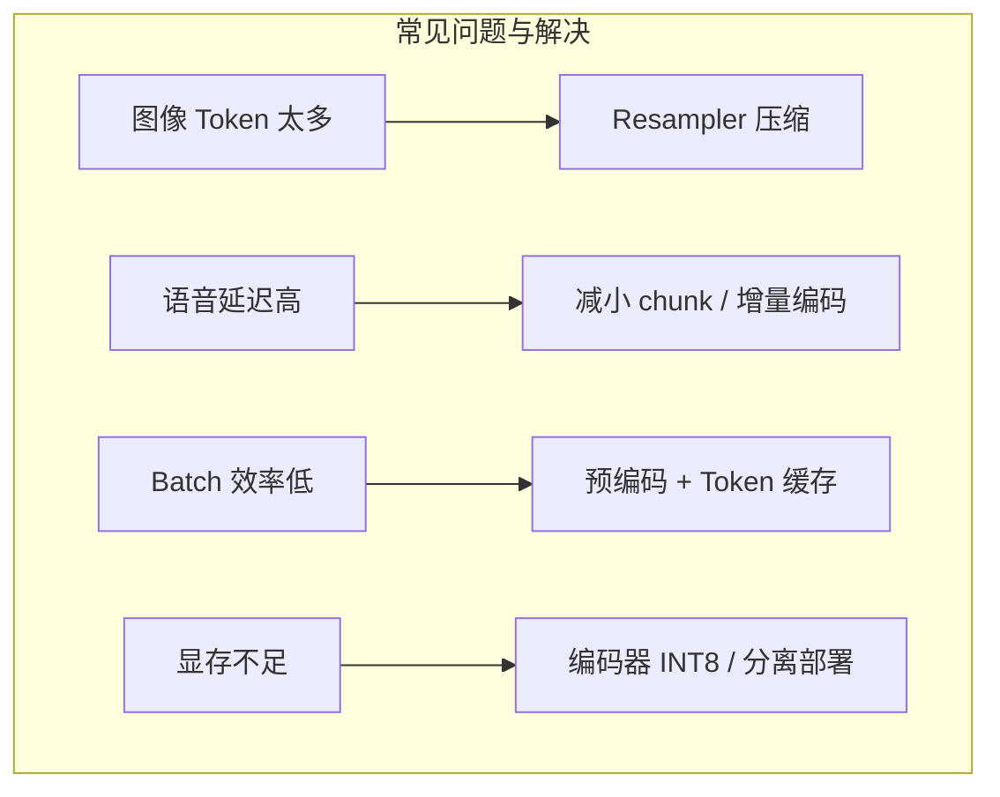

---

## 相关文章

- [上一篇：10 - 从零构建推理引擎](@/articles/ai-infra/ai-infra-10-从零构建推理引擎.md)
- [02 - LLM 推理优化全景](@/articles/ai-infra/ai-infra-02-LLM推理优化全景.md)
- [07 - 推理调度与 Batching 策略](@/articles/ai-infra/ai-infra-07-推理调度与Batching策略.md)
- [08 - 内存管理与 KV Cache 优化](@/articles/ai-infra/ai-infra-08-内存管理与KV-Cache优化.md)
