+++
title = "02 - LLM 推理优化全景"
description = "系统梳理 LLM 推理优化的各个维度，从算子到系统的完整视角"
date = 2025-02-06
updated = 2025-02-06
draft = false
[taxonomies]
tags = ["LLM", "推理优化", "AI Infra", "性能优化"]
[extra]
toc = true
comments = true
+++

## 一、优化的目标与约束

### 1.1 核心目标

LLM 推理优化追求的是在**约束条件下**最大化性能。

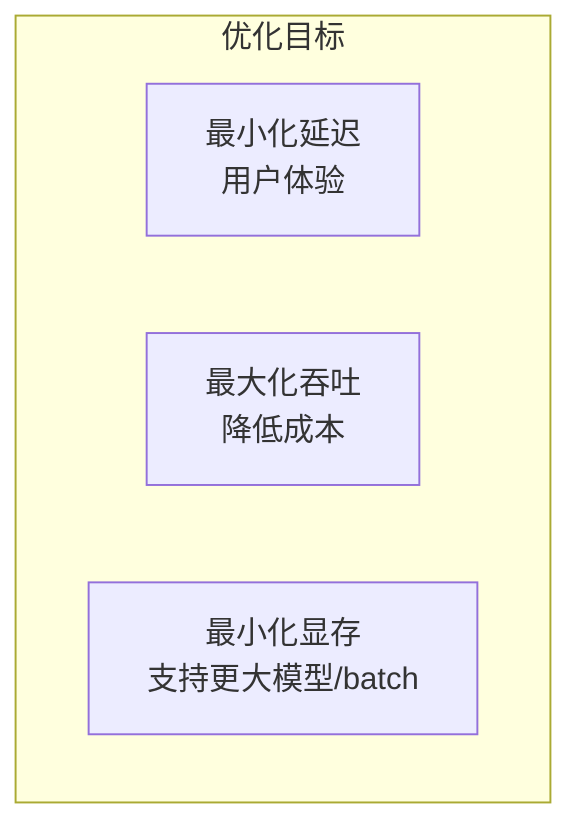

### 1.2 约束条件

| 约束 | 说明 |
|------|------|
| 硬件限制 | GPU 显存、算力、带宽 |
| 精度要求 | 输出质量不能下降太多 |
| 延迟 SLA | 首 token、端到端延迟 |
| 成本预算 | 硬件采购和运营成本 |

### 1.3 优化层次

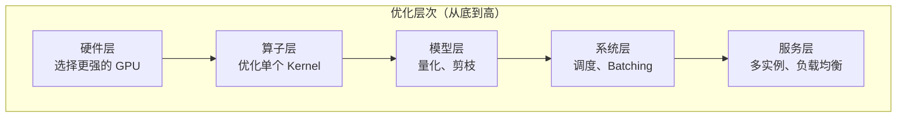

**关键认知**：不同层次的优化相互独立又相互影响，需要综合考虑。

---

## 二、模型层优化

### 2.1 量化（Quantization）

**核心思想**：用更少的比特表示权重和激活值

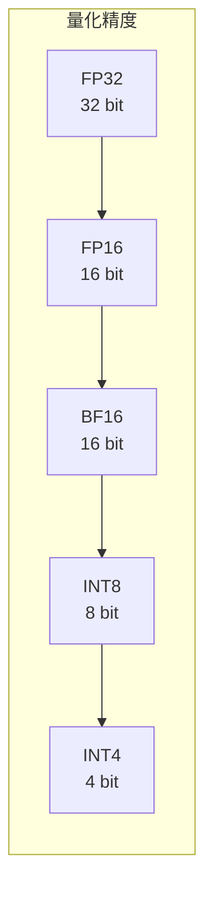

**量化收益**：

| 精度 | 显存占比 | 速度提升 | 精度损失 |
|------|----------|----------|----------|
| FP32 | 100% | 1x | 0 |
| FP16 | 50% | ~2x | 极小 |
| INT8 | 25% | ~2-4x | 小 |
| INT4 | 12.5% | ~4-8x | 中等 |

**量化类型**：

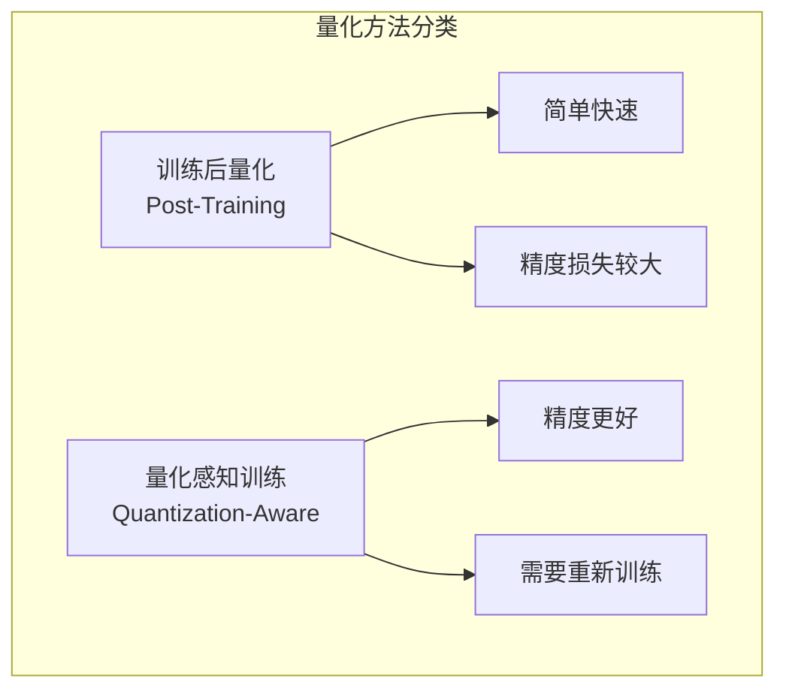

**主流量化格式**：

| 格式 | 特点 |
|------|------|
| GPTQ | 逐层量化，精度较好 |
| AWQ | 激活感知，保护重要权重 |
| GGUF | llama.cpp 使用，多种量化级别 |
| FP8 | H100 原生支持，精度损失小 |

---

### 2.2 注意力变体

**从 MHA 到 GQA**：减少 KV Cache 显存

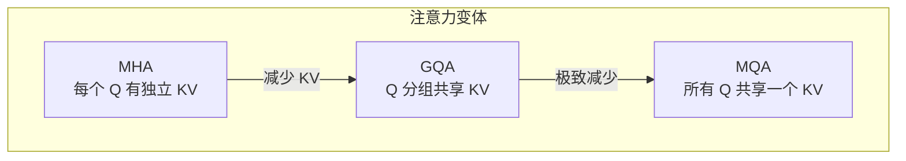

**效果对比**：

| 方法 | KV Cache 大小 | 质量影响 |
|------|---------------|----------|
| MHA | 100% | 基准 |
| GQA-8 | 12.5% | 很小 |
| MQA | 1/n_heads | 中等 |

---

### 2.3 剪枝与稀疏

**结构化剪枝**：移除整个神经元或注意力头

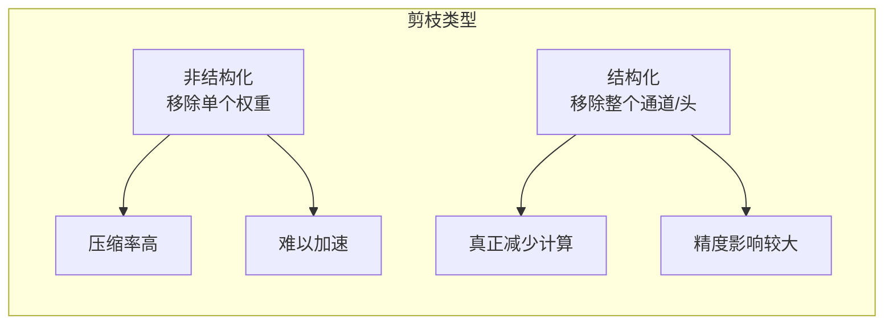

---

### 2.4 知识蒸馏

**小模型学习大模型**：


---

## 三、算子层优化

### 3.1 FlashAttention

**核心问题**：标准 Attention 的显存访问瓶颈

```
标准 Attention：
1. Q × K^T → S (N×N 矩阵，需要存储)
2. softmax(S) → P
3. P × V → O

问题：S 和 P 都是 N×N，序列长了显存爆炸
```

**FlashAttention 思想**：分块计算 + 在线 Softmax

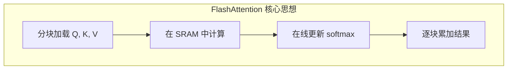

**效果**：
- 显存：O(N²) → O(N)
- 速度：2-4x 加速
- IO：减少 HBM 访问

---

### 3.2 FlashDecoding

**针对 Decode 阶段的优化**：

Decode 阶段特点：
- Query 只有 1 个 token
- 但要访问全部 KV Cache
- 是**访存密集型**

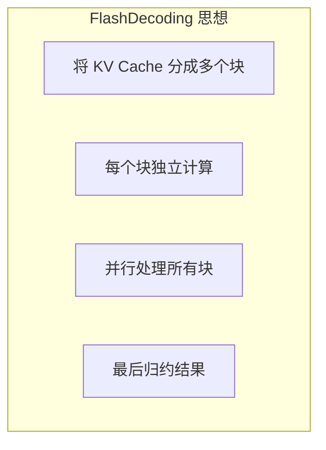

---

### 3.3 算子融合

**减少 Kernel 启动和内存访问**：

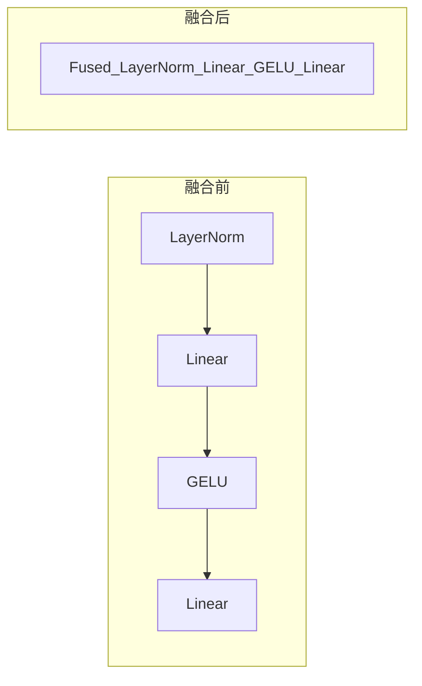

**常见融合**：
- Attention 内部融合（QKV projection）
- FFN 融合（Linear + Activation）
- LayerNorm + Linear
- Residual + LayerNorm

---

### 3.4 Tensor Core 利用

**充分利用硬件特性**：

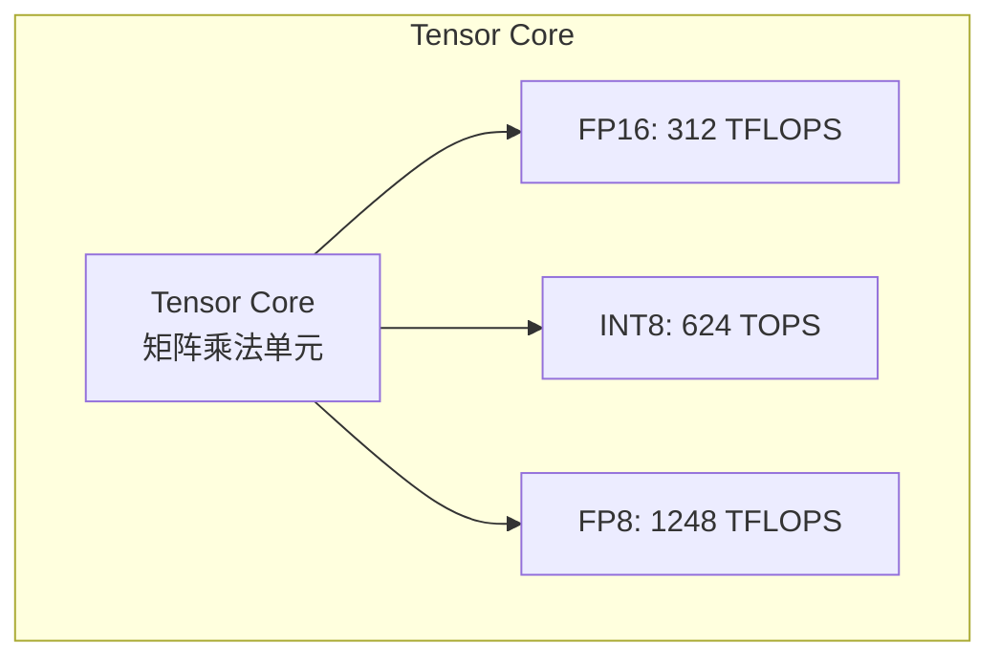

**使用要求**：
- 矩阵维度是 8/16 的倍数
- 使用特定数据类型
- 使用 WMMA 或 CUTLASS

---

## 四、系统层优化

### 4.1 Continuous Batching

**传统 Batching 的问题**：

```
Static Batching：
请求1: ████████████████████  （长）
请求2: ████████              （短）
请求3: ██████████████        （中）

请求2 完成后必须等待，GPU 空闲
```

**Continuous Batching**：

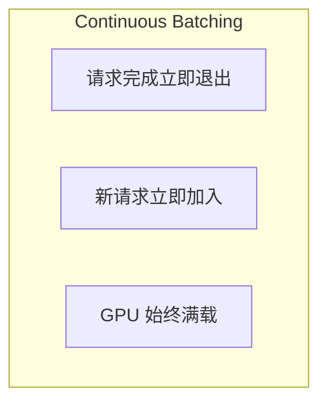

```
Continuous Batching：
请求1: ████████████████████
请求2: ████████ → 退出 → 新请求4 加入
请求3: ██████████████ → 退出 → 新请求5 加入

GPU 始终有足够工作
```

---

### 4.2 PagedAttention

**KV Cache 的显存问题**：

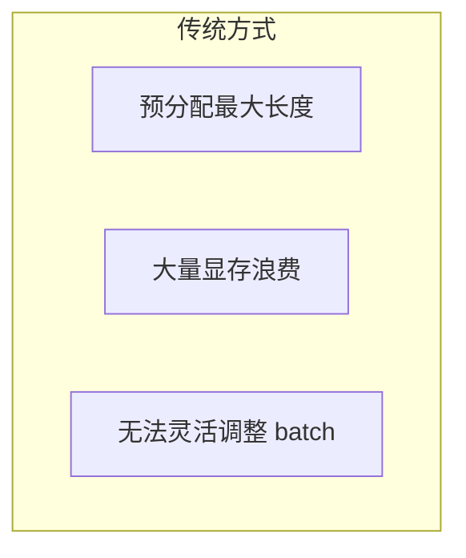

**PagedAttention 解决方案**：

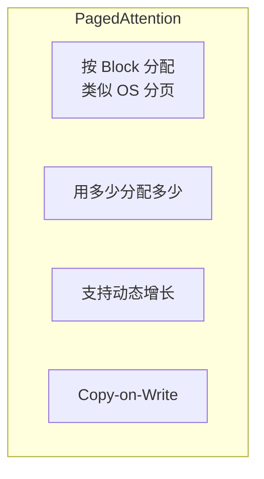

**效果**：
- 显存利用率：~50% → ~95%
- 支持更大 batch size
- 支持更长序列

---

### 4.3 Speculative Decoding

**核心思想**：用小模型猜测，大模型验证

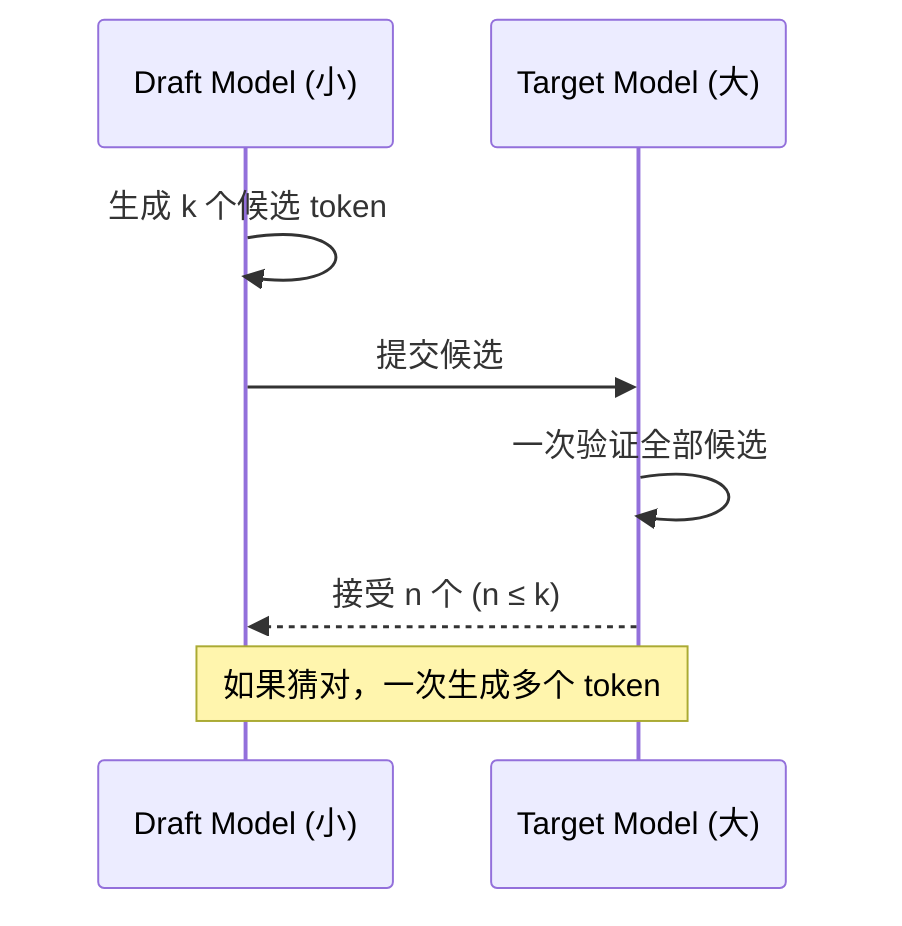

**效果**：
- 接受率高时：2-3x 加速
- 接受率低时：无加速但也无损失
- 输出质量：完全一致（数学保证）

---

### 4.4 Chunked Prefill

**问题**：长 prompt 的 Prefill 会阻塞其他请求

```
传统方式：
Prefill(长prompt): ████████████████████████████
Decode 请求：      等待...等待...等待...
```

**Chunked Prefill**：

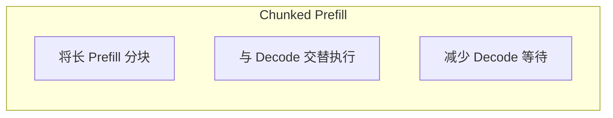

```
Chunked Prefill：
Prefill 块1: ████
Decode:          ██
Prefill 块2:       ████
Decode:                ██
...
```

---

### 4.5 KV Cache 优化

**多种优化方向**：

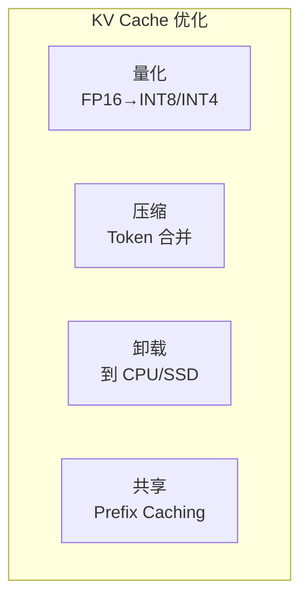

**Prefix Caching**：

```
请求1: "你好，请帮我写一个..." + 具体内容A
请求2: "你好，请帮我写一个..." + 具体内容B

公共前缀的 KV Cache 可以共享
```

---

## 五、服务层优化

### 5.1 多实例部署

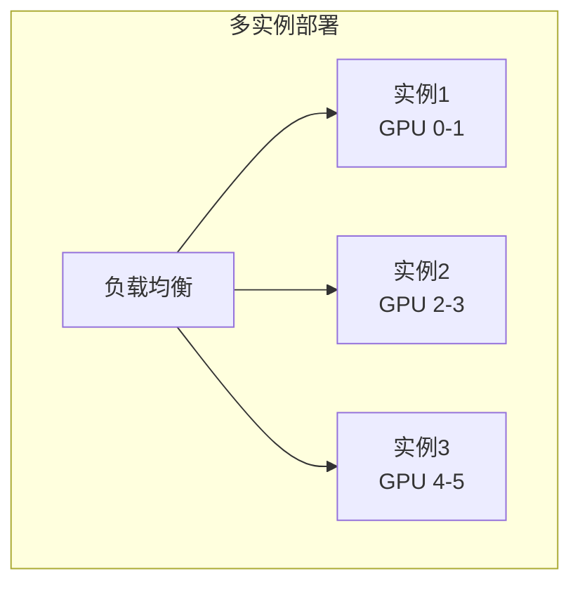

---

### 5.2 模型并行

**Tensor Parallel**：切分模型到多 GPU

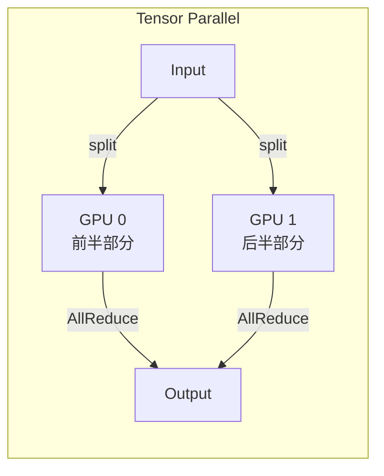

**Pipeline Parallel**：按层切分

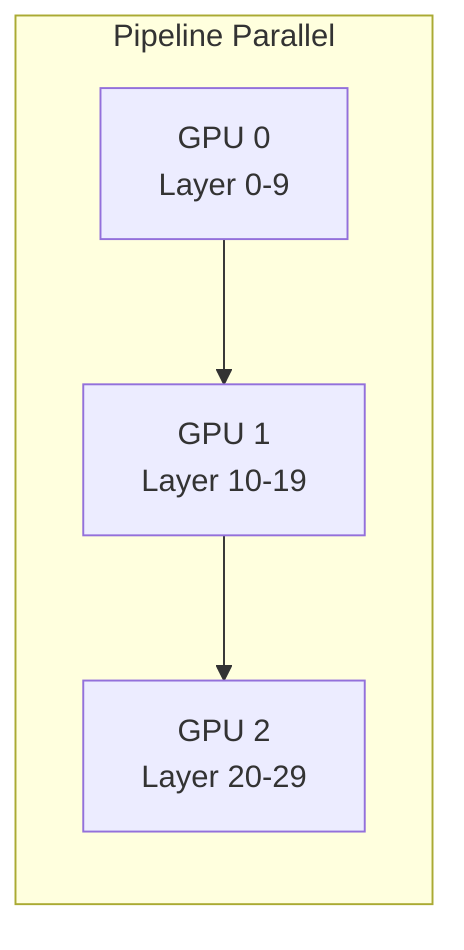

---

### 5.3 动态路由

**根据请求特征选择服务**：

```mermaid
graph TB
    subgraph "动态路由"
        R[Router]
        
        R -->|短请求| S1[低延迟实例]
        R -->|长请求| S2[高吞吐实例]
        R -->|特殊请求| S3[专用实例]
    end
```

---

## 六、优化技术矩阵

### 6.1 按效果分类

| 优化技术 | 延迟↓ | 吞吐↑ | 显存↓ | 复杂度 |
|----------|-------|-------|-------|--------|
| INT8 量化 | ✓ | ✓✓ | ✓✓ | 中 |
| INT4 量化 | ✓ | ✓✓✓ | ✓✓✓ | 高 |
| FlashAttention | ✓✓ | ✓ | ✓✓✓ | 高 |
| Continuous Batching | - | ✓✓✓ | - | 中 |
| PagedAttention | - | ✓✓ | ✓✓✓ | 高 |
| Speculative Decoding | ✓✓ | ✓ | - | 高 |
| GQA/MQA | - | ✓ | ✓✓ | 需要模型支持 |
| 算子融合 | ✓ | ✓ | ✓ | 中 |

### 6.2 按实施难度分类

```mermaid
graph LR
    subgraph "实施难度"
        E1[简单<br>开箱即用]
        E2[中等<br>需要配置]
        E3[复杂<br>需要开发]
        
        E1 --> E1a[使用 FP16]
        E1 --> E1b[使用 vLLM 默认配置]
        
        E2 --> E2a[INT8 量化]
        E2 --> E2b[调整 batch 策略]
        
        E3 --> E3a[自定义 Kernel]
        E3 --> E3b[Speculative Decoding]
    end
```

---

## 七、优化实践指南

### 7.1 优化流程

```mermaid
graph TB
    subgraph "优化流程"
        S1[确定目标和约束]
        S2[基准测试]
        S3[瓶颈分析]
        S4[选择优化方向]
        S5[实施优化]
        S6[验证效果]
        S7[迭代优化]
        
        S1 --> S2 --> S3 --> S4 --> S5 --> S6
        S6 -->|未达目标| S3
        S6 -->|达到目标| S7
    end
```

### 7.2 瓶颈分析

**常见瓶颈判断**：

| 现象 | 可能瓶颈 | 优化方向 |
|------|----------|----------|
| GPU 利用率低 | Batch 太小 | Continuous Batching |
| 显存不足 | KV Cache 太大 | PagedAttention、量化 |
| Prefill 慢 | 计算瓶颈 | FlashAttention |
| Decode 慢 | 带宽瓶颈 | FlashDecoding、量化 |
| 长尾延迟 | 调度问题 | 优先级调度 |

### 7.3 推荐优化顺序

```mermaid
graph TB
    subgraph "优化顺序"
        O1[1. 使用成熟推理引擎<br>vLLM / TensorRT-LLM]
        O2[2. 启用 FP16/BF16]
        O3[3. 配置 Continuous Batching]
        O4[4. 尝试 INT8 量化]
        O5[5. 调优 batch 参数]
        O6[6. 考虑 Speculative Decoding]
        O7[7. 自定义优化]
        
        O1 --> O2 --> O3 --> O4 --> O5 --> O6 --> O7
    end
```

---

## 八、案例分析

### 8.1 案例：LLaMA-70B 推理优化

**目标**：在 8×H100 上服务 LLaMA-70B，延迟 <500ms

**优化步骤**：

| 步骤 | 操作 | 效果 |
|------|------|------|
| 1 | 使用 vLLM | 基准 |
| 2 | 启用 Tensor Parallel | 单卡→8卡 |
| 3 | 使用 FP16 | 显存减半 |
| 4 | 启用 PagedAttention | 支持更大 batch |
| 5 | 调整 max_batch_size | 吞吐 3x |
| 6 | 尝试 AWQ INT4 | 显存再减半 |

### 8.2 案例：端侧 LLM 部署

**目标**：在手机上运行 7B 模型

**优化步骤**：

| 步骤 | 操作 | 效果 |
|------|------|------|
| 1 | 使用 llama.cpp | 基准 |
| 2 | Q4_K_M 量化 | 14GB→4GB |
| 3 | 使用 Metal/Vulkan | GPU 加速 |
| 4 | 调整 context size | 进一步减少显存 |

---

## 九、未来展望

### 9.1 近期趋势

| 趋势 | 描述 |
|------|------|
| FP8 普及 | H100/B100 原生支持 |
| 更长上下文 | 1M+ tokens |
| 多模态优化 | 图文音视频混合推理 |
| 硬件多样化 | AMD、Intel、国产 GPU |

### 9.2 长期趋势

```mermaid
graph TB
    subgraph "长期趋势"
        T1[编译器自动优化]
        T2[硬件软件协同设计]
        T3[动态/自适应优化]
        T4[端云协同推理]
    end
```

---

## 十、总结

### 10.1 核心认知

1. **优化是多层次的**
   - 从算子到系统，每层都有优化空间
   - 需要综合考虑，避免局部最优

2. **没有银弹**
   - 每种优化有其适用场景
   - 需要根据具体需求选择

3. **工具先于自研**
   - 优先使用成熟工具（vLLM、TensorRT-LLM）
   - 只在必要时自定义

4. **数据驱动**
   - 基于测量而非猜测
   - 瓶颈分析是关键

### 10.2 学习建议

```mermaid
graph LR
    L1[理解各种优化技术] --> L2[学会瓶颈分析]
    L2 --> L3[掌握主流工具]
    L3 --> L4[实践中积累经验]
```

---

## 相关文章

- [上一篇：01 - AI 推理系统架构概述](/articles/ai-infra/infra-01-AI推理系统架构概述/)
- [下一篇：03 - vLLM 架构与源码解析](/articles/ai-infra/infra-03-vLLM架构与源码解析/)
- [25 - FlashAttention 与 PagedAttention 原理](/articles/ai/ai-25-FlashAttention与PagedAttention原理/)
- [32 - Triton GPU 编程详解](/articles/ai/ai-32-Triton-GPU编程详解/)
- [11 - 多模态 LLM 推理优化](/articles/ai-infra/infra-11-多模态LLM推理优化/)
