+++
title = "03 - vLLM 架构与源码解析"
description = "深入理解 vLLM 的核心架构、关键组件和实现原理"
date = 2025-02-06
updated = 2025-02-06
draft = false
[taxonomies]
tags = ["vLLM", "推理系统", "PagedAttention", "源码分析"]
[extra]
toc = true
comments = true
+++

## 一、vLLM 概述

### 1.1 什么是 vLLM

vLLM 是一个高吞吐量、低延迟的 LLM 推理和服务引擎，由 UC Berkeley 开发。

**核心创新**：
- **PagedAttention**：像操作系统管理内存一样管理 KV Cache
- **Continuous Batching**：动态批处理，最大化 GPU 利用率

### 1.2 为什么选择 vLLM

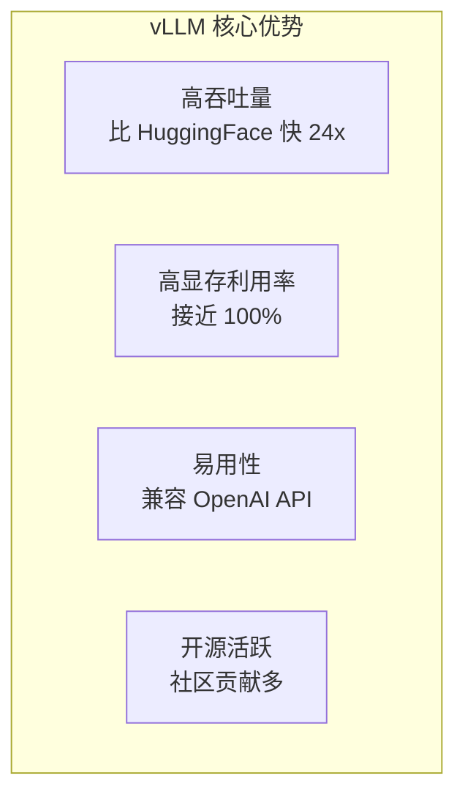

### 1.3 性能对比

| 系统 | 吞吐量（相对） | 显存利用率 |
|------|---------------|------------|
| HuggingFace | 1x | ~50% |
| Text Generation Inference | ~4x | ~70% |
| vLLM | ~24x | ~95% |

---

## 二、整体架构

### 2.1 高层架构

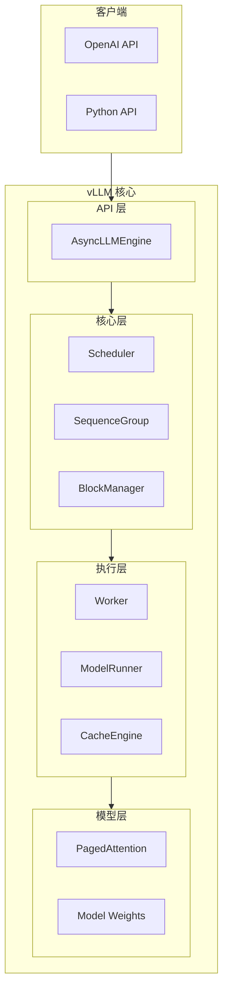

### 2.2 核心组件关系

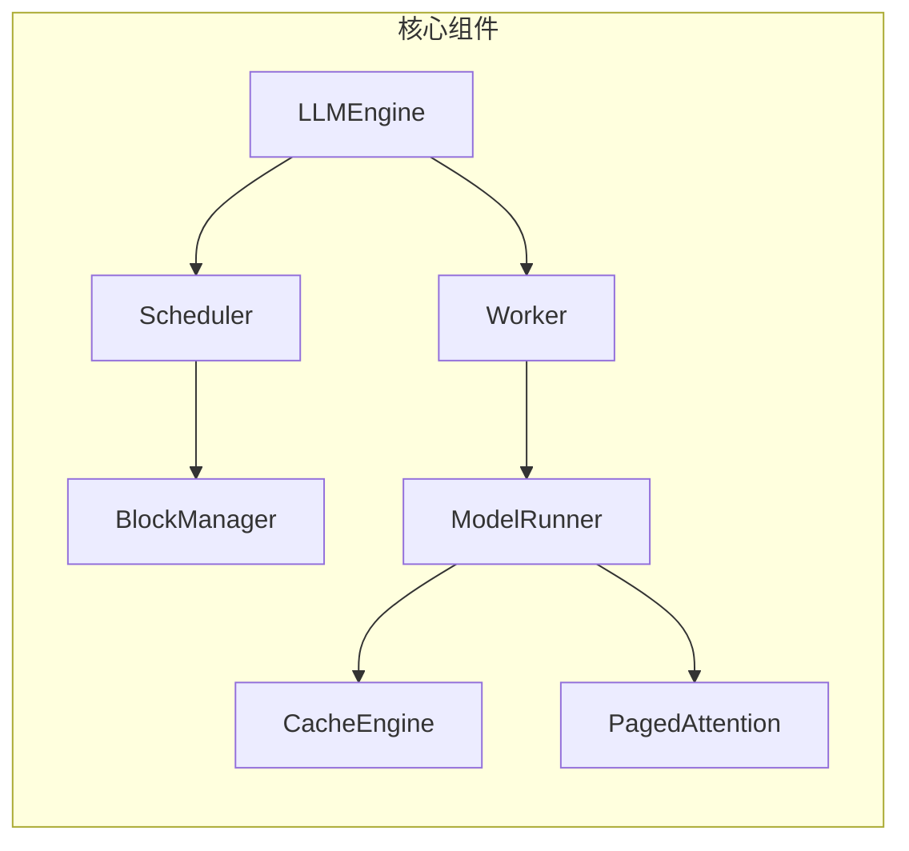

---

## 三、核心组件详解

### 3.1 LLMEngine

**职责**：vLLM 的入口，协调各组件工作

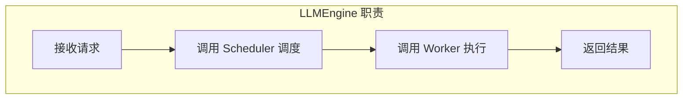

**关键方法**：

| 方法 | 作用 |
|------|------|
| `add_request()` | 添加新请求 |
| `step()` | 执行一步推理 |
| `abort_request()` | 取消请求 |

**执行流程**：

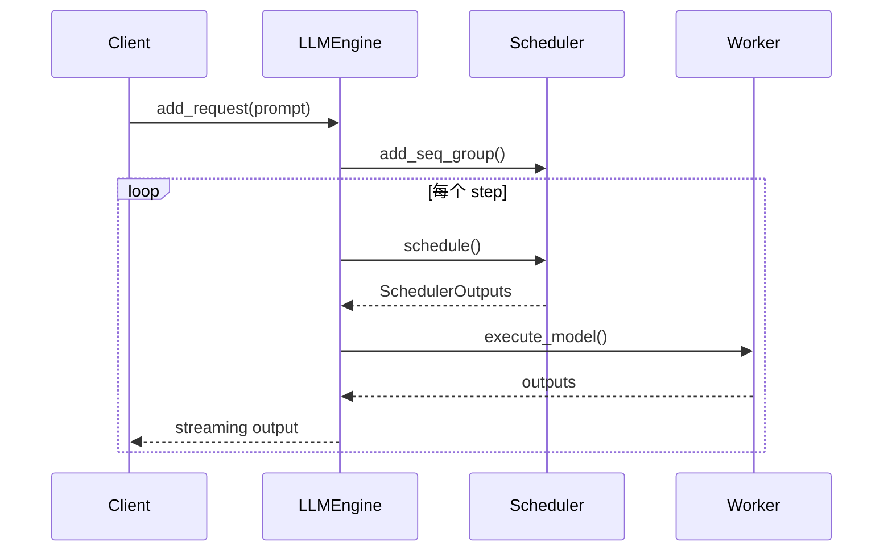

---

### 3.2 Scheduler

**职责**：决定哪些请求参与本轮计算

这是 vLLM 的**调度核心**。

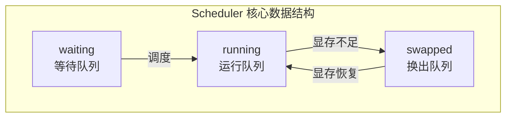

**三个队列**：

| 队列 | 含义 |
|------|------|
| waiting | 新请求等待 Prefill |
| running | 正在 Decode 的请求 |
| swapped | 因显存不足被换出的请求 |

**调度策略**：

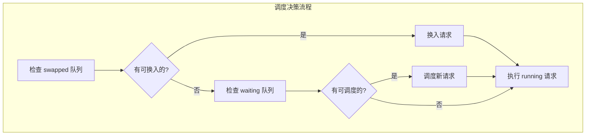

**抢占机制**：

当显存不足时，可能需要抢占正在运行的请求：

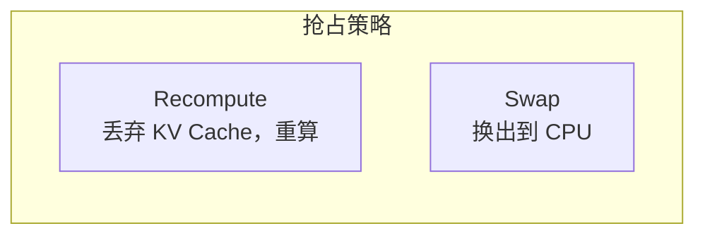

---

### 3.3 BlockManager

**职责**：管理 KV Cache 的物理块分配

这是 **PagedAttention** 的核心实现。

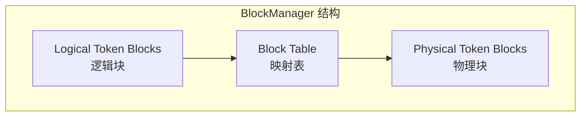

**核心概念**：

| 概念 | 含义 |
|------|------|
| Block | 固定大小的 KV Cache 单元（如 16 tokens） |
| Logical Block | 序列视角的块 |
| Physical Block | GPU 显存中的块 |
| Block Table | 逻辑块到物理块的映射 |

**分配流程**：

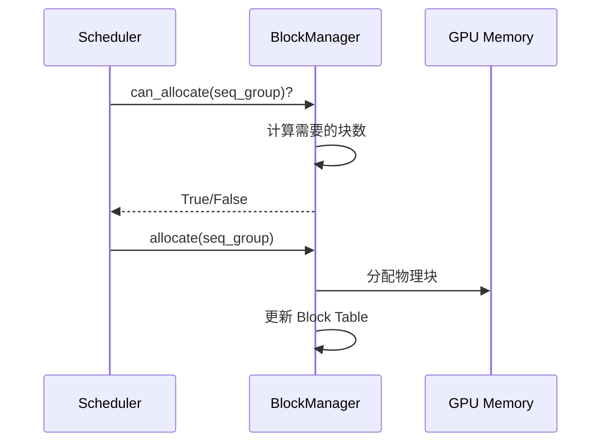

**Copy-on-Write**：

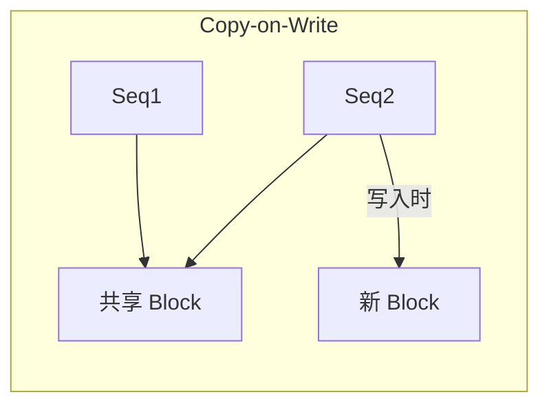

当多个序列共享同一个 Block（如 beam search），写入时才复制。

---

### 3.4 Worker 与 ModelRunner

**Worker**：单个 GPU 的工作进程

**ModelRunner**：实际执行模型推理

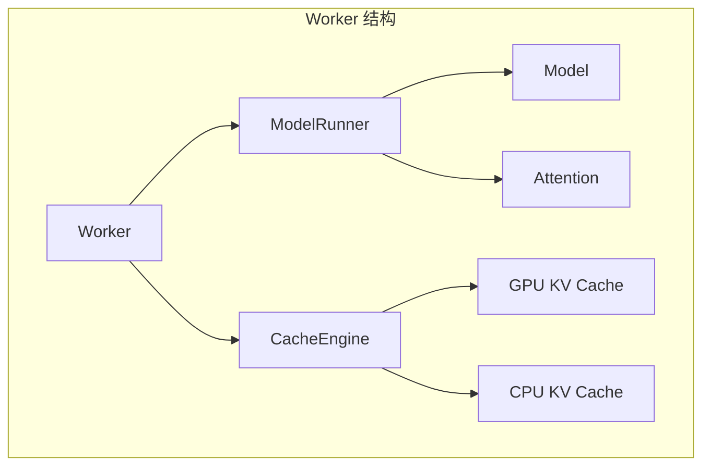

**ModelRunner 执行流程**：

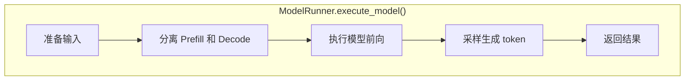

---

### 3.5 CacheEngine

**职责**：管理 GPU 和 CPU 上的 KV Cache

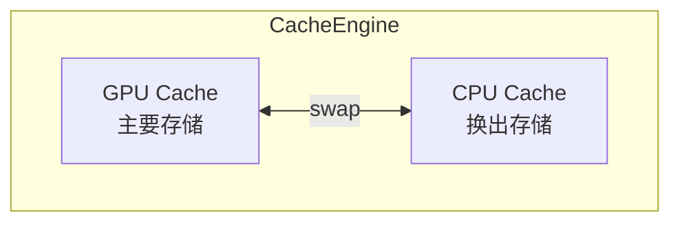

**操作类型**：

| 操作 | 含义 |
|------|------|
| swap_in | 从 CPU 换入到 GPU |
| swap_out | 从 GPU 换出到 CPU |
| copy | 块复制（CoW） |

---

### 3.6 PagedAttention

**职责**：实现分页的 Attention 计算

**与标准 Attention 的区别**：

```
标准 Attention：
- KV Cache 连续存储
- 直接索引访问

PagedAttention：
- KV Cache 分散在多个 Block
- 通过 Block Table 间接访问
```

**Kernel 设计**：

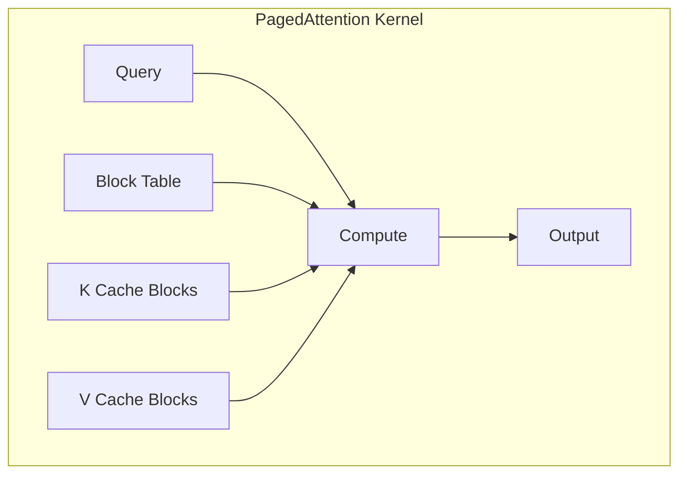

**关键参数**：

| 参数 | 含义 |
|------|------|
| block_size | 每个 Block 的 token 数 |
| num_blocks | Block 总数 |
| block_tables | 每个序列的 Block 映射 |

---

## 四、请求处理流程

### 4.1 完整流程

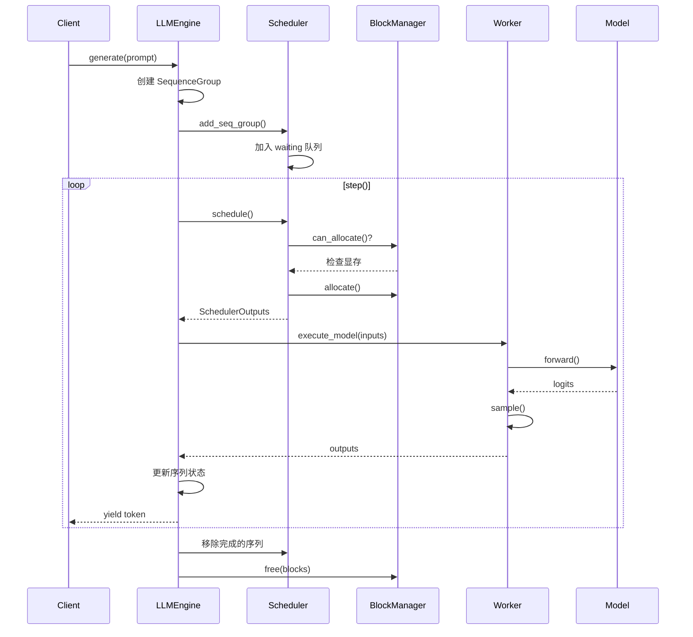

### 4.2 Prefill 阶段

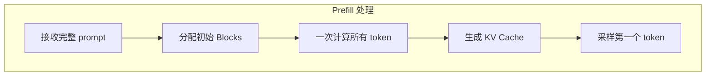

### 4.3 Decode 阶段

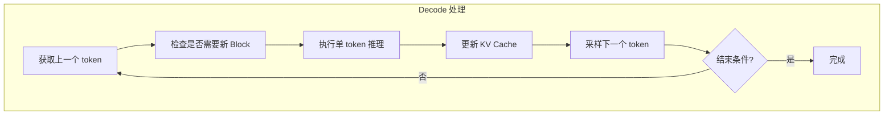

---

## 五、关键设计解析

### 5.1 Continuous Batching 实现

**传统 Batching**：

```
Batch 1: [req1, req2, req3] → 全部完成 → Batch 2
```

**Continuous Batching**：

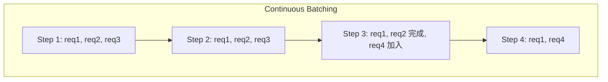

**实现要点**：
1. 每个 step 重新调度
2. 完成的请求立即移除
3. 新请求可以随时加入
4. 不同序列可以处于不同阶段

---

### 5.2 显存管理策略

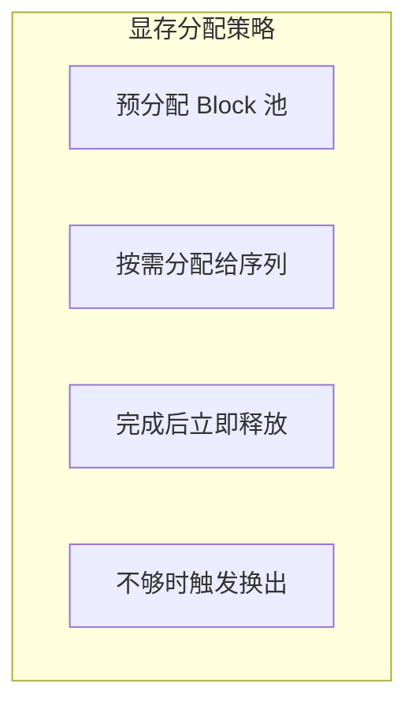

**Block 大小选择**：

| Block Size | 优点 | 缺点 |
|------------|------|------|
| 小（8） | 灵活，浪费少 | 管理开销大 |
| 大（32） | 管理简单 | 可能浪费 |
| 默认（16） | 平衡 | - |

---

### 5.3 多 GPU 支持

**Tensor Parallel**：

```mermaid
graph TB
    subgraph "Tensor Parallel 实现"
        M[Master Process]
        
        M --> W0[Worker 0<br>GPU 0]
        M --> W1[Worker 1<br>GPU 1]
        M --> W2[Worker 2<br>GPU 2]
        M --> W3[Worker 3<br>GPU 3]
        
        W0 <--> W1
        W1 <--> W2
        W2 <--> W3
    end
```

**实现要点**：
1. 每个 Worker 加载模型的一部分
2. 使用 NCCL 进行 AllReduce
3. Scheduler 在 Master 进程
4. Block 管理在每个 Worker 独立进行

---

## 六、源码阅读指南

### 6.1 目录结构

```
vllm/
├── engine/           # 引擎核心
│   ├── llm_engine.py
│   └── async_llm_engine.py
├── core/             # 核心数据结构
│   ├── scheduler.py
│   ├── block_manager.py
│   └── sequence.py
├── worker/           # 执行层
│   ├── worker.py
│   └── model_runner.py
├── model_executor/   # 模型执行
│   └── models/
├── attention/        # Attention 实现
│   └── backends/
└── entrypoints/      # 入口点
    ├── openai/
    └── api_server.py
```

### 6.2 阅读顺序

```mermaid
graph TB
    subgraph "推荐阅读顺序"
        S1[1. sequence.py<br>理解数据结构]
        S2[2. scheduler.py<br>理解调度逻辑]
        S3[3. block_manager.py<br>理解内存管理]
        S4[4. llm_engine.py<br>理解整体流程]
        S5[5. model_runner.py<br>理解执行流程]
        S6[6. attention/<br>理解 PagedAttention]
        
        S1 --> S2 --> S3 --> S4 --> S5 --> S6
    end
```

### 6.3 关键类和方法

**sequence.py**：

| 类 | 作用 |
|---|------|
| Sequence | 单个序列 |
| SequenceGroup | 一组相关序列（如 beam search） |
| SequenceStatus | 序列状态枚举 |

**scheduler.py**：

| 方法 | 作用 |
|------|------|
| `schedule()` | 执行调度决策 |
| `_schedule_running()` | 调度运行中的请求 |
| `_schedule_swapped()` | 调度换出的请求 |
| `_schedule_prefills()` | 调度新请求 |

**block_manager.py**：

| 方法 | 作用 |
|------|------|
| `can_allocate()` | 检查是否可分配 |
| `allocate()` | 分配 Block |
| `can_append_slots()` | 检查是否可追加 |
| `append_slots()` | 追加新 token 的 Block |
| `free()` | 释放 Block |

---

## 七、性能调优

### 7.1 关键参数

| 参数 | 作用 | 调优建议 |
|------|------|----------|
| `gpu_memory_utilization` | GPU 显存使用比例 | 0.9-0.95 |
| `max_num_seqs` | 最大并发序列数 | 根据显存调整 |
| `max_num_batched_tokens` | 最大 batch token 数 | 影响 Prefill 并发 |
| `block_size` | Block 大小 | 通常保持默认 |
| `swap_space` | CPU swap 空间 | 4-16 GB |

### 7.2 性能监控

```mermaid
graph TB
    subgraph "监控指标"
        M1[GPU 利用率]
        M2[显存使用]
        M3[吞吐量 tokens/s]
        M4[延迟分布]
        M5[队列长度]
    end
```

### 7.3 常见问题

| 问题 | 可能原因 | 解决方案 |
|------|----------|----------|
| 吞吐量低 | batch 太小 | 增大 max_num_seqs |
| 显存 OOM | 参数过大 | 减小 gpu_memory_utilization |
| 延迟抖动 | swap 频繁 | 增大显存或减小并发 |
| 首 token 慢 | Prefill 大 | 使用 Chunked Prefill |

---

## 八、扩展与定制

### 8.1 添加新模型

```mermaid
graph TB
    subgraph "添加模型步骤"
        S1[继承基类]
        S2[实现 forward 方法]
        S3[注册模型]
        S4[添加配置]
    end
```

### 8.2 自定义调度

可以通过继承 `Scheduler` 类实现自定义调度策略：

```python
class CustomScheduler(Scheduler):
    def _schedule_running(self, ...):
        # 自定义运行队列调度
        pass
    
    def _schedule_prefills(self, ...):
        # 自定义 Prefill 调度
        pass
```

### 8.3 自定义采样

```python
from vllm import SamplingParams

params = SamplingParams(
    temperature=0.8,
    top_p=0.95,
    top_k=50,
    max_tokens=256,
)
```

---

## 九、与其他系统对比

### 9.1 vs TensorRT-LLM

| 维度 | vLLM | TensorRT-LLM |
|------|------|--------------|
| 语言 | Python + C++ | C++ |
| 易用性 | 高 | 中 |
| 性能 | 高 | 更高 |
| 灵活性 | 高 | 中 |
| 硬件支持 | NVIDIA + AMD | NVIDIA only |

### 9.2 vs llama.cpp

| 维度 | vLLM | llama.cpp |
|------|------|-----------|
| 目标场景 | 服务端 | 端侧/CPU |
| 性能优化 | GPU 最优 | 跨平台 |
| 量化支持 | 有限 | 丰富 |
| 模型支持 | 丰富 | 有限 |

---

## 十、总结

### 10.1 核心认知

1. **PagedAttention 是核心创新**
   - 解决了 KV Cache 的显存碎片问题
   - 提高显存利用率到接近 100%

2. **Scheduler 是调度核心**
   - 三队列设计（waiting/running/swapped）
   - Continuous Batching 实现

3. **分层设计清晰**
   - Engine → Scheduler → Worker → Model
   - 各组件职责明确

4. **工程质量高**
   - 代码结构清晰
   - 易于扩展和定制

### 10.2 学习建议

```mermaid
graph LR
    S1[阅读论文] --> S2[运行示例]
    S2 --> S3[阅读源码]
    S3 --> S4[尝试修改]
    S4 --> S5[贡献代码]
```

---

## 相关文章

- [上一篇：02 - LLM 推理优化全景](/articles/ai-infra/infra-02-LLM推理优化全景/)
- [下一篇：04 - TensorRT-LLM 详解](/articles/ai-infra/infra-04-TensorRT-LLM详解/)
- [25 - FlashAttention 与 PagedAttention 原理](/articles/ai/ai-25-FlashAttention与PagedAttention原理/)
