+++
title = "10 - 从零构建推理引擎"
description = "实战项目：用 C++ 实现简化版 LLM 推理引擎"
date = 2025-02-06
updated = 2025-02-06
draft = false
[taxonomies]
tags = ["推理引擎", "C++", "实战项目", "系统设计"]
[extra]
toc = true
comments = true
+++

## 一、项目目标

### 1.1 学习目标

通过实现简化版推理引擎，深入理解：
- 推理系统核心架构
- 调度器设计
- 内存管理
- Batching 实现

### 1.2 项目范围

**实现**：
- HTTP API
- 请求队列
- 简单调度器
- 基础 Batching
- 流式输出

**不实现**（使用现成库）：
- 模型前向计算（用 llama.cpp）
- CUDA Kernel

### 1.3 技术栈

| 组件 | 技术 |
|------|------|
| 语言 | C++17 |
| HTTP | cpp-httplib 或类似 |
| 模型 | llama.cpp / GGML |
| 构建 | CMake |

---

## 二、架构设计

### 2.1 整体架构

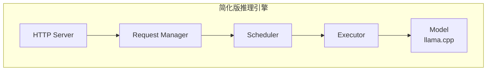

### 2.2 核心组件

| 组件 | 职责 |
|------|------|
| HTTP Server | 接收请求，返回响应 |
| Request Manager | 请求生命周期管理 |
| Scheduler | 调度决策 |
| Executor | 执行推理 |
| Model | 模型加载和计算 |

### 2.3 数据流

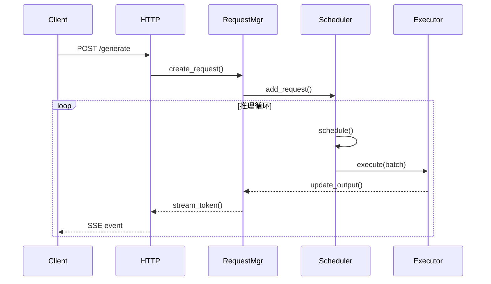

---

## 三、核心数据结构

### 3.1 Request 结构

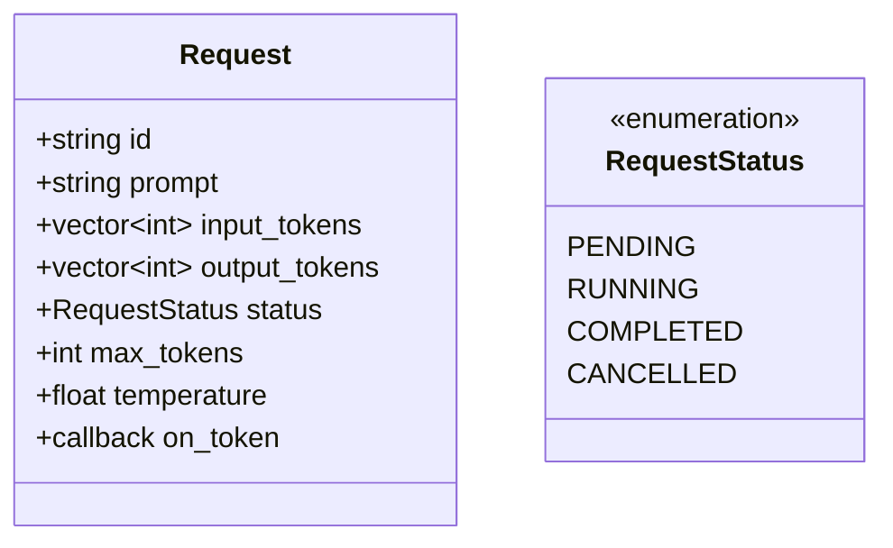

### 3.2 Batch 结构

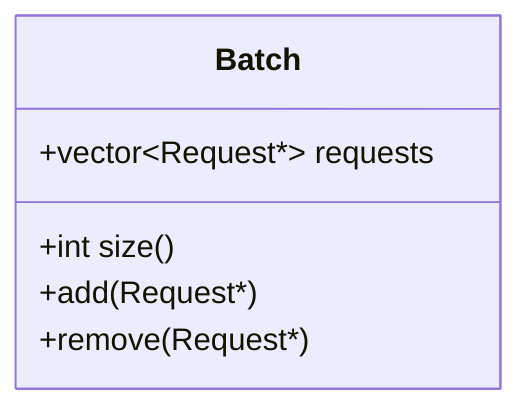

### 3.3 调度输出

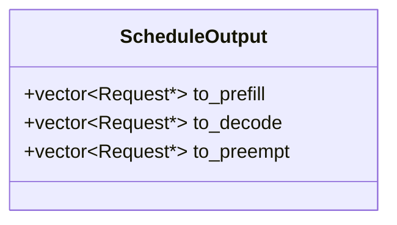

---

## 四、模块实现

### 4.1 HTTP Server

**功能**：
- 接收 POST 请求
- 解析 JSON
- 流式响应（SSE）

**关键接口**：

| 端点 | 方法 | 功能 |
|------|------|------|
| /generate | POST | 生成请求 |
| /health | GET | 健康检查 |

### 4.2 Request Manager

**功能**：
- 创建请求
- 追踪状态
- 管理生命周期

**关键方法**：

| 方法 | 作用 |
|------|------|
| create_request() | 创建新请求 |
| get_request() | 获取请求 |
| update_output() | 更新输出 |
| complete_request() | 标记完成 |

### 4.3 Scheduler

**功能**：
- 管理队列
- 调度决策
- 资源控制

**关键方法**：

| 方法 | 作用 |
|------|------|
| add_request() | 加入等待队列 |
| schedule() | 执行调度 |
| can_schedule() | 检查资源 |

**调度逻辑**：

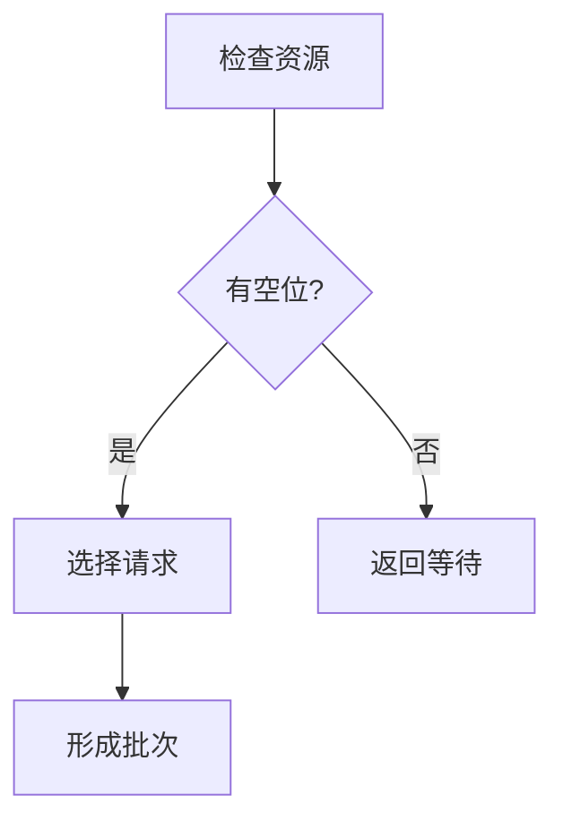

### 4.4 Executor

**功能**：
- 调用模型
- 执行推理
- 采样生成

**执行流程**：

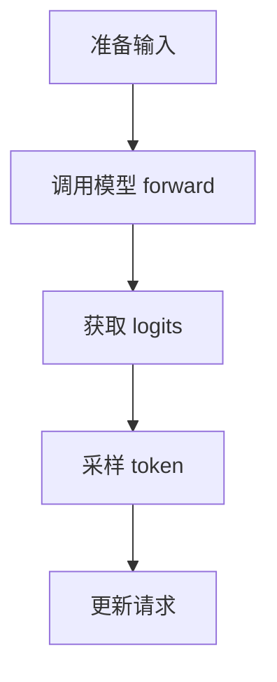

---

## 五、关键流程

### 5.1 请求处理流程

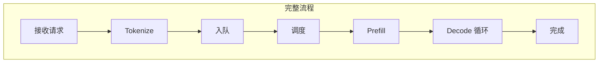

### 5.2 调度循环

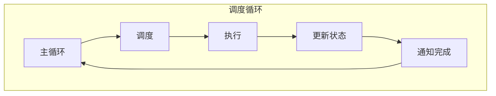

### 5.3 Batching 实现

**简化版 Batching**：

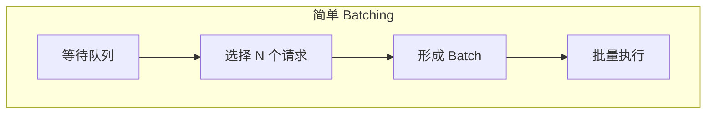

---

## 六、接口设计

### 6.1 API 设计

**请求格式**：

```json
{
  "prompt": "Hello, world!",
  "max_tokens": 100,
  "temperature": 0.7,
  "stream": true
}
```

**响应格式（流式）**：

```
data: {"token": "Hello", "finished": false}
data: {"token": ",", "finished": false}
data: {"token": " I", "finished": false}
...
data: {"token": "", "finished": true}
```

### 6.2 内部接口

| 接口 | 签名 |
|------|------|
| Scheduler::schedule | ScheduleOutput schedule() |
| Executor::execute | void execute(Batch&) |
| Model::forward | Tensor forward(Tensor input) |

---

## 七、实现步骤

### 7.1 阶段一：基础框架

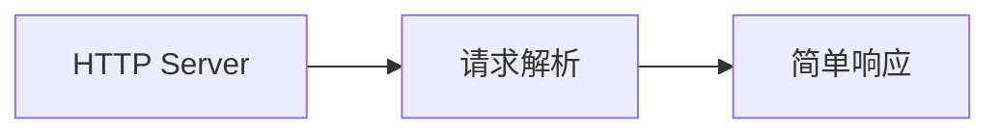

**目标**：能接收请求并返回固定响应

### 7.2 阶段二：模型集成

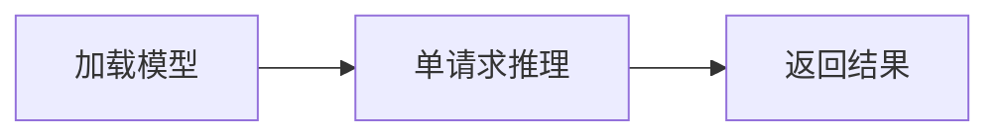

**目标**：能进行单请求推理

### 7.3 阶段三：调度器

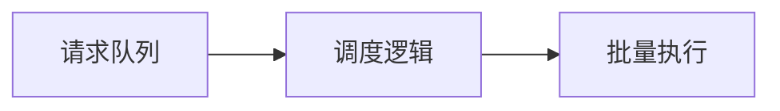

**目标**：支持多请求调度

### 7.4 阶段四：流式输出

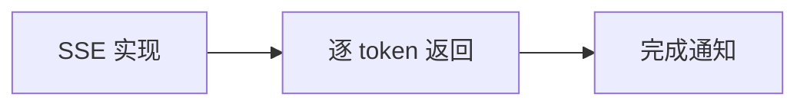

**目标**：支持流式输出

### 7.5 阶段五：优化

| 优化项 | 内容 |
|--------|------|
| 并发 | 异步处理 |
| 性能 | 减少拷贝 |
| 稳定性 | 错误处理 |

---

## 八、扩展方向

### 8.1 功能扩展

| 扩展 | 描述 |
|------|------|
| KV Cache 管理 | 实现简单版 PagedAttention |
| 多模型 | 支持加载多个模型 |
| 优先级 | 支持请求优先级 |

### 8.2 性能扩展

| 扩展 | 描述 |
|------|------|
| 异步执行 | 非阻塞调度 |
| 内存池 | 减少分配开销 |
| Batching 优化 | Continuous Batching |

### 8.3 生产化扩展

| 扩展 | 描述 |
|------|------|
| 监控 | Prometheus 指标 |
| 日志 | 结构化日志 |
| 配置 | 动态配置 |

---

## 九、常见问题

### 9.1 技术问题

| 问题 | 解决方案 |
|------|----------|
| llama.cpp 集成 | 使用其 C API |
| 线程安全 | 使用互斥锁 |
| 内存管理 | RAII 模式 |

### 9.2 设计问题

| 问题 | 建议 |
|------|------|
| 先同步后异步 | 先实现同步版本 |
| 先简单后复杂 | FCFS 调度开始 |
| 先正确后优化 | 功能优先 |

---

## 十、总结

### 10.1 学习收获

1. **理解推理系统架构**
   - 各组件职责
   - 数据流

2. **实践系统设计**
   - 接口设计
   - 并发处理

3. **深入理解调度**
   - 调度算法
   - 资源管理

4. **为开源贡献打基础**
   - 理解 vLLM/llama.cpp
   - 能读懂源码

### 10.2 下一步

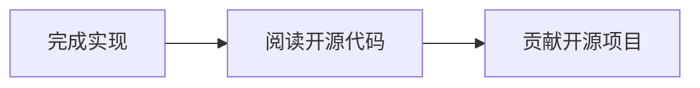

---

## 相关文章

- [上一篇：09 - 推理引擎性能调优](/articles/ai-infra/infra-09-推理引擎性能调优/)
- [下一篇：11 - 多模态 LLM 推理优化](/articles/ai-infra/infra-11-多模态LLM推理优化/)
- [05 - llama.cpp 源码解析](/articles/ai-infra/infra-05-llama.cpp源码解析/)
- [03 - vLLM 架构与源码解析](/articles/ai-infra/infra-03-vLLM架构与源码解析/)
- [29 - AI C++ 工程师职业路径](/articles/ai/ai-29-AI-C++工程师职业路径/)
