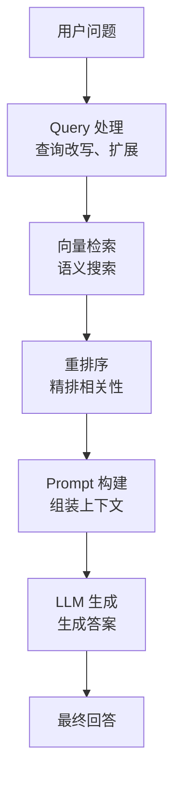
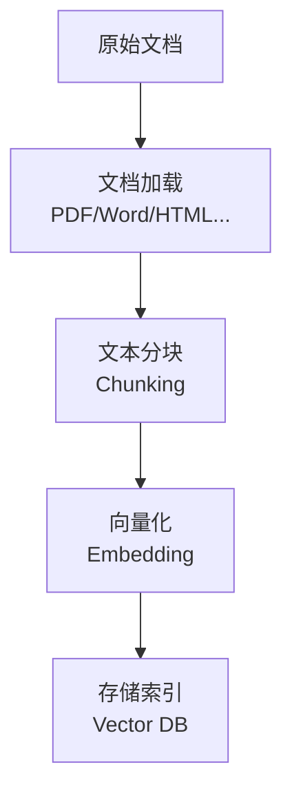
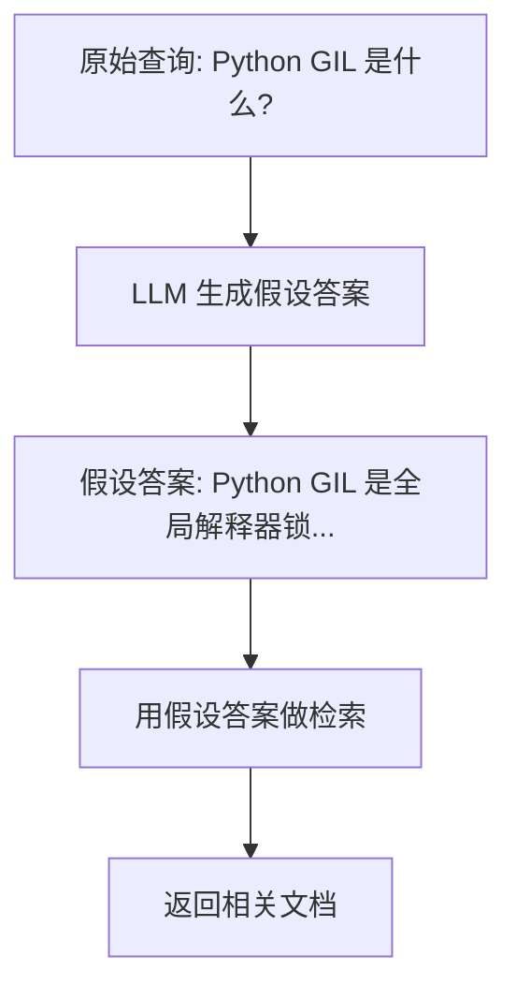
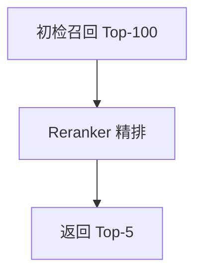
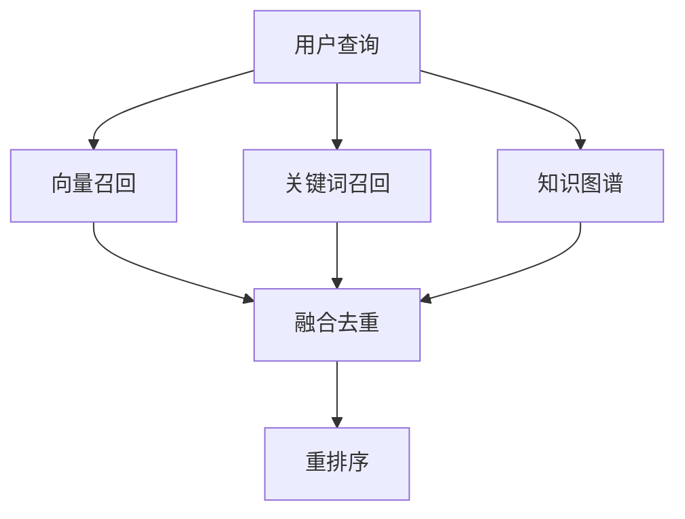
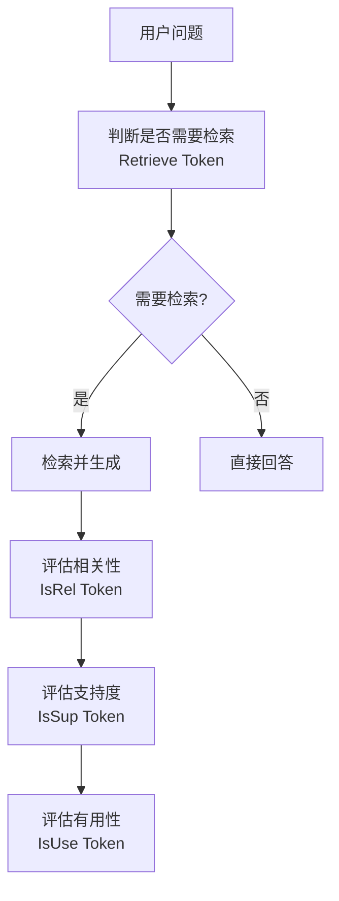
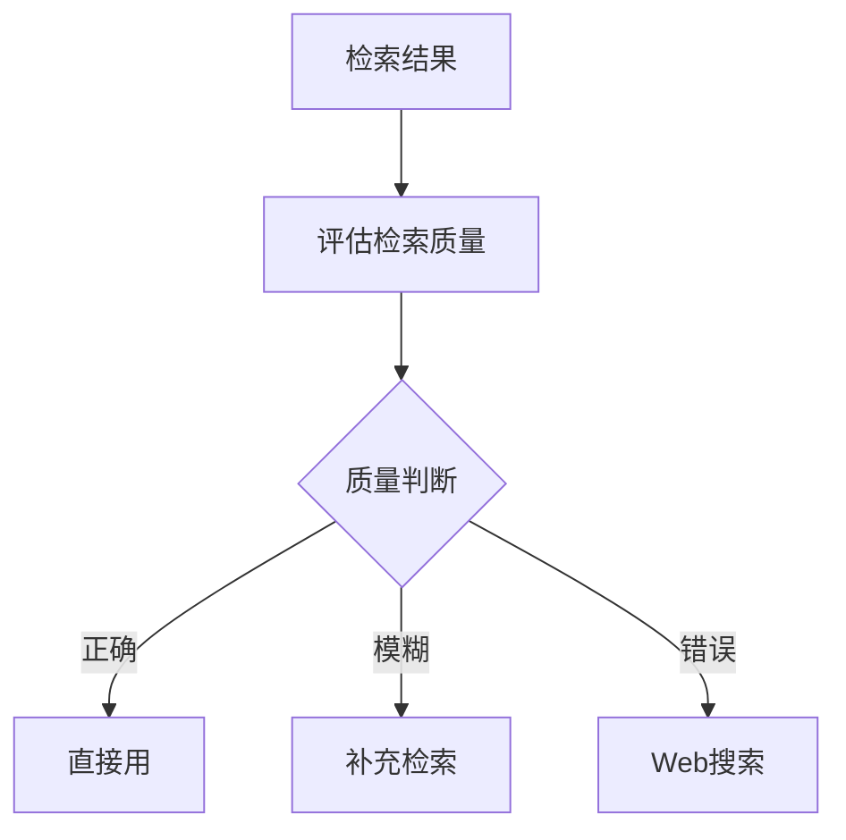
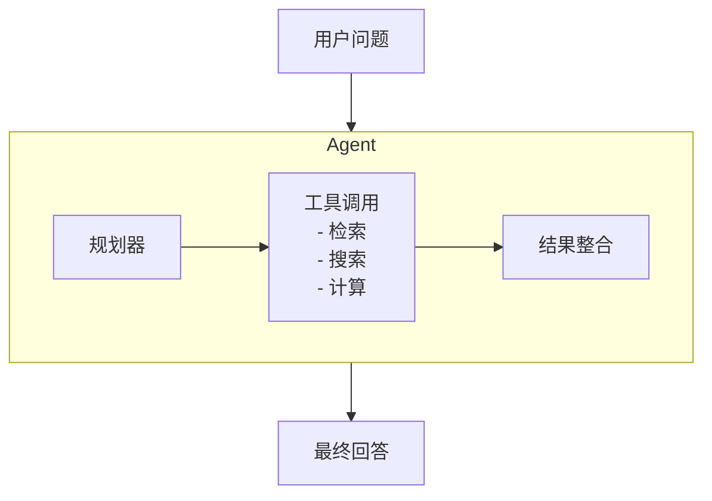
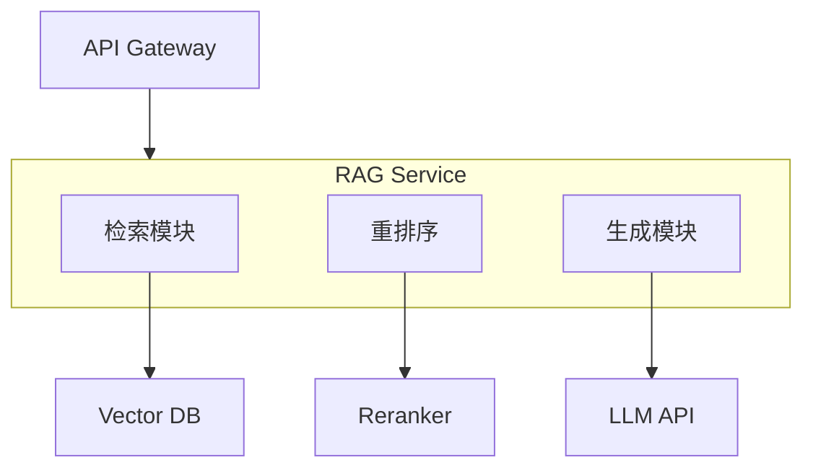

+++
title = "05. RAG检索增强生成详解"
date = 2026-01-13
weight = 5000
description = "Retrieval-Augmented Generation深度解析：架构设计、向量检索、分块策略、重排序与生产实践"
[taxonomies]
tags = ["ai", "rag", "llm", "vector-database", "embedding"]
+++

# RAG检索增强生成详解

RAG（Retrieval-Augmented Generation）是当前大模型应用的核心技术，通过外部知识检索增强生成质量。本文深入解析 RAG 的完整技术栈。

---

## 一、RAG 概述

### 1.1 为什么需要 RAG

| LLM 局限性 | RAG 解决方案 |
|-----------|-------------|
| 知识截止日期 | 检索最新信息 |
| 幻觉问题 | 基于事实生成 |
| 领域知识不足 | 注入专业知识 |
| 无法访问私有数据 | 连接企业知识库 |
| 上下文长度限制 | 检索相关片段 |

### 1.2 RAG vs Fine-tuning

| 维度 | RAG | Fine-tuning |
|-----|-----|-------------|
| 数据更新 | 实时更新 | 需重新训练 |
| 成本 | 低 | 高 |
| 可解释性 | 可追溯来源 | 黑盒 |
| 准确性 | 依赖检索质量 | 内化知识 |
| 适用场景 | 知识密集型 | 风格/能力调整 |

### 1.3 RAG 发展阶段

| 阶段 | 特点 | 代表 |
|-----|------|------|
| Naive RAG | 简单检索+生成 | 基础实现 |
| Advanced RAG | 优化检索和生成 | 预处理+后处理 |
| Modular RAG | 模块化可插拔 | 灵活组合 |
| Agentic RAG | Agent 驱动 | 自主决策检索 |

---

## 二、RAG 架构

### 2.1 基础架构



### 2.2 离线索引流程



### 2.3 核心组件

| 组件 | 功能 | 常用工具 |
|-----|------|---------|
| 文档加载器 | 解析各类文档 | Unstructured、LlamaParse |
| 分块器 | 文本切分 | LangChain Splitters |
| Embedding 模型 | 文本向量化 | OpenAI、BGE、E5 |
| 向量数据库 | 存储和检索 | Pinecone、Milvus、Chroma |
| 重排序器 | 精排 | Cohere Rerank、BGE Reranker |
| LLM | 生成答案 | GPT-4、Claude、Qwen |

---

## 三、文档处理

### 3.1 文档加载

| 格式 | 工具 | 注意点 |
|-----|------|-------|
| PDF | PyPDF、PDFPlumber | 表格、图片处理 |
| Word | python-docx | 样式保留 |
| HTML | BeautifulSoup | 清洗噪声 |
| Markdown | 原生支持 | 保留结构 |
| 代码 | AST解析 | 语法感知 |

### 3.2 分块策略

| 策略 | 说明 | 适用场景 |
|-----|------|---------|
| 固定大小 | 按字符/Token数切分 | 简单场景 |
| 递归切分 | 按分隔符层级切分 | 通用文本 |
| 语义切分 | 按语义边界切分 | 高质量需求 |
| 句子切分 | 按句子切分 | 精细控制 |
| 文档结构 | 按标题/段落切分 | 结构化文档 |

### 3.3 分块参数

| 参数 | 建议值 | 影响 |
|-----|-------|------|
| chunk_size | 500-1000 tokens | 信息完整性 |
| chunk_overlap | 50-200 tokens | 上下文连续性 |
| separator | \n\n, \n, . | 切分边界 |

### 3.4 分块优化

| 技术 | 说明 |
|-----|------|
| 父子分块 | 检索小块，返回大块 |
| 滑动窗口 | 重叠保证连续性 |
| 元数据增强 | 添加来源、标题等 |
| 摘要增强 | 为长文档生成摘要 |

### 3.5 多模态处理

| 内容类型 | 处理方式 |
|---------|---------|
| 表格 | 转为 Markdown/JSON |
| 图片 | OCR 或多模态模型描述 |
| 图表 | 提取数据+描述 |
| 公式 | LaTeX 表示 |

---

## 四、Embedding 向量化

### 4.1 Embedding 模型对比

| 模型 | 维度 | 中文支持 | 特点 |
|-----|------|---------|------|
| OpenAI text-embedding-3-large | 3072 | 一般 | 通用强 |
| BGE-large-zh | 1024 | 优秀 | 中文最佳 |
| E5-large-v2 | 1024 | 好 | 性价比高 |
| Cohere Embed v3 | 1024 | 好 | 多语言 |
| GTE-large | 1024 | 好 | 阿里出品 |
| M3E | 768 | 优秀 | 开源中文 |

### 4.2 Embedding 优化

| 技术 | 说明 |
|-----|------|
| 指令化 Embedding | 添加任务指令前缀 |
| Query-Doc 不对称 | 查询和文档用不同处理 |
| 长文本处理 | 分段后聚合 |
| 领域微调 | 在专业数据上微调 |

### 4.3 向量维度权衡

| 维度 | 优点 | 缺点 |
|-----|------|------|
| 低（256-512） | 存储小、快 | 表达力弱 |
| 中（768-1024） | 平衡 | 通用选择 |
| 高（2048-4096） | 表达力强 | 存储大、慢 |

---

## 五、向量数据库

### 5.1 数据库对比

| 数据库 | 类型 | 特点 | 适用场景 |
|-------|------|------|---------|
| Pinecone | 云服务 | 全托管、易用 | 快速上线 |
| Milvus | 开源 | 功能完整、可扩展 | 企业部署 |
| Weaviate | 开源 | GraphQL、多模态 | 复杂查询 |
| Qdrant | 开源 | 高性能、Rust | 高性能需求 |
| Chroma | 开源 | 轻量、易用 | 原型开发 |
| FAISS | 库 | Facebook 出品 | 本地部署 |
| pgvector | 插件 | PostgreSQL 扩展 | 已有 PG 场景 |

### 5.2 索引类型

| 索引 | 原理 | 特点 |
|-----|------|------|
| Flat | 暴力搜索 | 精确但慢 |
| IVF | 倒排索引 | 平衡 |
| HNSW | 分层图 | 快且准 |
| PQ | 乘积量化 | 压缩存储 |
| ScaNN | Google 方案 | 高效 |

### 5.3 混合检索

| 检索方式 | 原理 | 优势 |
|---------|------|------|
| 向量检索 | 语义相似 | 理解意图 |
| 关键词检索 | BM25/TF-IDF | 精确匹配 |
| 混合检索 | 两者结合 | 互补增强 |

**融合策略**：
- RRF（Reciprocal Rank Fusion）
- 加权融合
- 级联过滤

### 5.4 元数据过滤

| 过滤类型 | 示例 |
|---------|------|
| 时间范围 | date > "2024-01-01" |
| 类别 | category == "技术" |
| 来源 | source in ["doc1", "doc2"] |
| 权限 | user_group == "admin" |

---

## 六、检索优化

### 6.1 查询改写

| 技术 | 说明 |
|-----|------|
| Query Expansion | 扩展同义词、相关词 |
| HyDE | 先生成假设答案再检索 |
| Multi-Query | 生成多个查询变体 |
| Step-back | 生成更抽象的问题 |

### 6.2 HyDE 原理



### 6.3 重排序 Reranking

| 重排序器 | 特点 |
|---------|------|
| Cohere Rerank | 商业 API，效果好 |
| BGE Reranker | 开源，中文好 |
| Cross-Encoder | 精确但慢 |
| ColBERT | 延迟交互 |

**重排序流程**：



### 6.4 多路召回



---

## 七、生成优化

### 7.1 Prompt 设计

**基础模板**：

```
你是一个专业的问答助手。请根据以下参考资料回答用户问题。

参考资料：
{context}

用户问题：{question}

要求：
1. 只使用参考资料中的信息回答
2. 如果资料中没有相关信息，请说明
3. 在回答中标注信息来源
```

### 7.2 上下文窗口管理

| 策略 | 说明 |
|-----|------|
| 截断 | 超长时截断 |
| 压缩 | LLM 压缩上下文 |
| 选择性加载 | 只加载最相关部分 |
| 层次化 | 摘要+详情分层 |

### 7.3 来源引用

| 方法 | 说明 |
|-----|------|
| 内联引用 | 在文本中标注 [1] |
| 脚注 | 文末列出来源 |
| 元数据返回 | API 返回来源信息 |

### 7.4 答案验证

| 验证方法 | 说明 |
|---------|------|
| 自我一致性 | 多次生成比较 |
| 来源核对 | 验证是否来自检索内容 |
| 事实检查 | 外部知识验证 |
| 置信度评分 | 模型自评分 |

---

## 八、高级 RAG 模式

### 8.1 Self-RAG



### 8.2 Corrective RAG (CRAG)



### 8.3 Graph RAG

| 优势 | 说明 |
|-----|------|
| 关系推理 | 理解实体间关系 |
| 多跳问答 | 跨文档推理 |
| 结构化知识 | 知识图谱整合 |

### 8.4 Agentic RAG



---

## 九、评估体系

### 9.1 评估维度

| 维度 | 指标 | 说明 |
|-----|------|------|
| 检索质量 | Recall@K | 召回率 |
| 检索质量 | MRR | 平均倒数排名 |
| 检索质量 | NDCG | 归一化折损累积增益 |
| 生成质量 | Faithfulness | 忠实度 |
| 生成质量 | Relevance | 相关性 |
| 生成质量 | Answer Correctness | 正确性 |

### 9.2 评估框架

| 框架 | 特点 |
|-----|------|
| RAGAS | RAG 专用评估 |
| TruLens | 可观测性 |
| LangSmith | LangChain 配套 |
| Arize Phoenix | 可视化 |

### 9.3 自动化评估

| 方法 | 说明 |
|-----|------|
| LLM-as-Judge | 用 LLM 评分 |
| 人工标注 | 黄金标准 |
| A/B 测试 | 对比实验 |
| 用户反馈 | 真实使用反馈 |

---

## 十、生产实践

### 10.1 架构设计



### 10.2 性能优化

| 优化点 | 方法 |
|-------|------|
| 检索延迟 | 索引优化、缓存 |
| 生成延迟 | 流式输出、模型选择 |
| 吞吐量 | 批处理、异步 |
| 成本 | 缓存命中、模型选择 |

### 10.3 缓存策略

| 缓存层 | 内容 |
|-------|------|
| Query 缓存 | 相同问题直接返回 |
| Embedding 缓存 | 避免重复计算 |
| 检索结果缓存 | 相似 query 复用 |
| LLM 响应缓存 | 语义相似问题 |

### 10.4 监控告警

| 监控项 | 说明 |
|-------|------|
| 检索召回率 | 监控检索质量 |
| 响应延迟 | P50/P99 |
| 错误率 | 失败请求 |
| 用户反馈 | 点赞/踩 |
| Token 消耗 | 成本监控 |

### 10.5 持续优化

| 阶段 | 工作 |
|-----|------|
| 收集 | 收集 bad case |
| 分析 | 定位问题环节 |
| 优化 | 针对性改进 |
| 验证 | 评估效果 |
| 部署 | 上线新版本 |

---

## 十一、常见问题

### 11.1 检索不准

| 原因 | 解决 |
|-----|------|
| 分块不当 | 调整分块策略 |
| Embedding 不佳 | 换更好的模型 |
| 语义鸿沟 | 查询改写 |
| 数据质量 | 清洗预处理 |

### 11.2 生成幻觉

| 原因 | 解决 |
|-----|------|
| 上下文不足 | 增加检索数量 |
| 模型倾向 | 强化 Prompt 约束 |
| 无相关知识 | 明确告知无法回答 |

### 11.3 性能问题

| 问题 | 解决 |
|-----|------|
| 检索慢 | 优化索引、缓存 |
| 生成慢 | 流式输出、换模型 |
| 成本高 | 缓存、模型选择 |

---

## 参考资料

- [RAG Survey](https://arxiv.org/abs/2312.10997)
- [LangChain RAG](https://python.langchain.com/docs/use_cases/question_answering/)
- [LlamaIndex](https://www.llamaindex.ai/)
- [Pinecone Learning](https://www.pinecone.io/learn/)

---

## 相关文章

- [上一篇：Prompt工程与思维链详解](@/articles/ai/ai-04-Prompt工程与思维链详解.md)
- [下一篇：LangChain详解](@/articles/ai/ai-06-LangChain详解.md)
