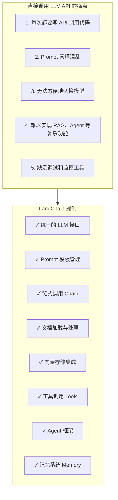
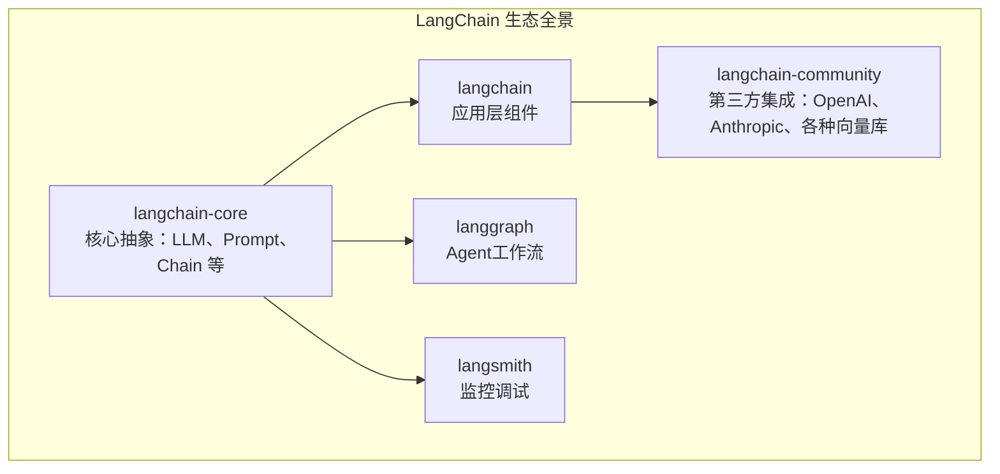
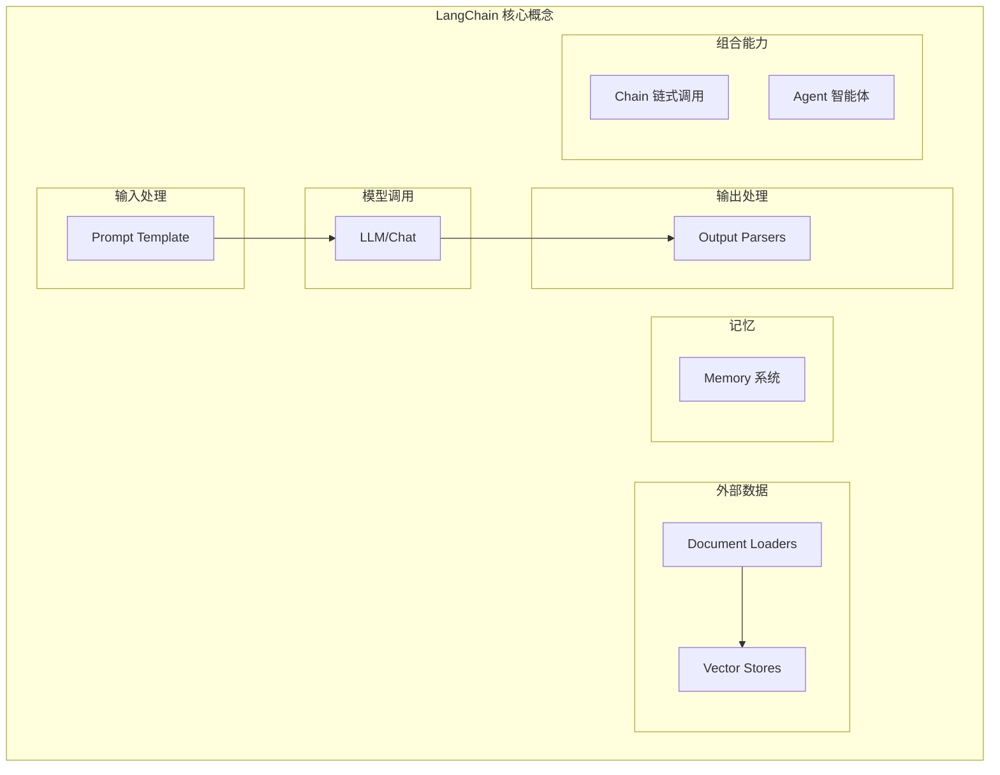
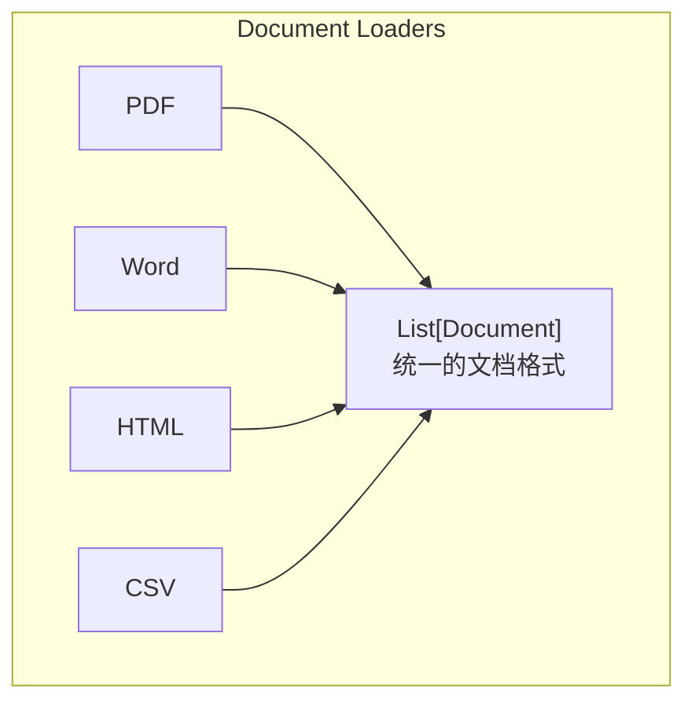
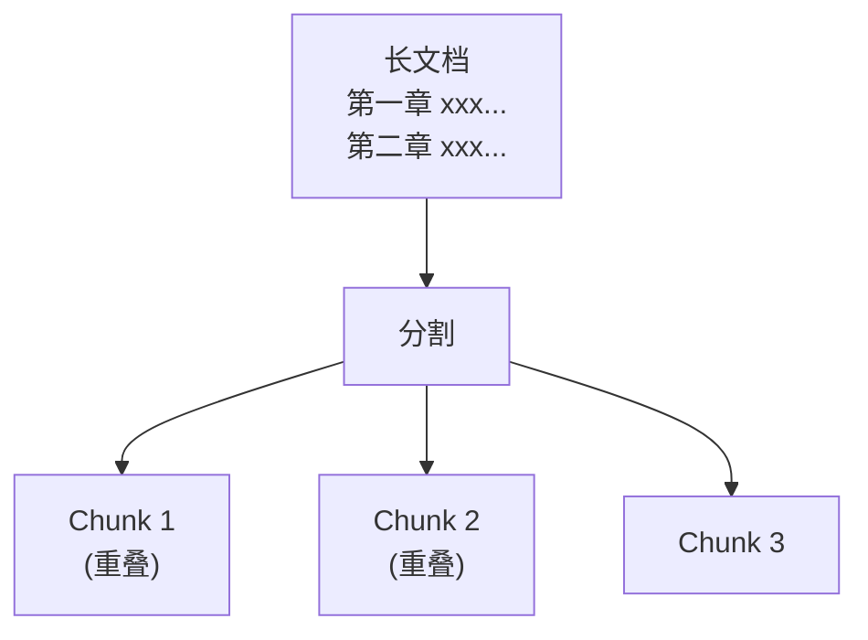
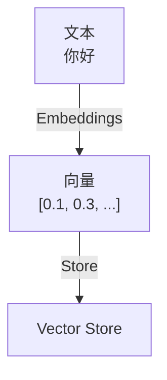
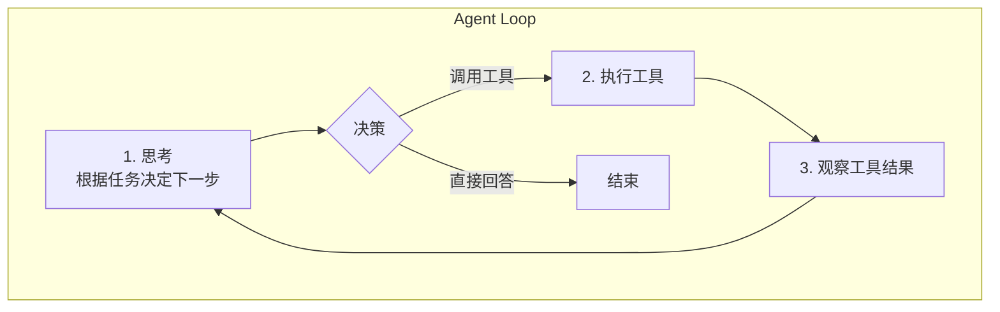
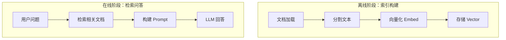
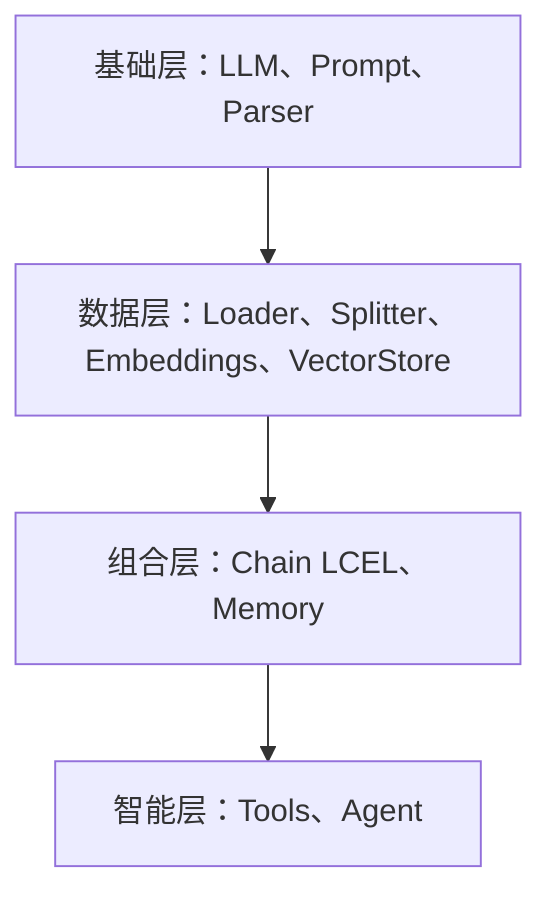

+++
title = "LangChain详解"
date = 2025-01-13
weight = 6000
description = "深入理解LangChain的核心概念、组件架构和最佳实践，从入门到精通"
[taxonomies]
tags = ["ai", "langchain", "llm", "rag", "agent", "prompt"]
+++

# LangChain 详解：构建 LLM 应用的核心框架

---

## 一、LangChain 是什么

### 1.1 一句话定义

**LangChain 是一个用于构建 LLM 应用的开发框架**，提供了标准化的组件和工具链。

### 1.2 解决的问题



### 1.3 LangChain 生态



---

## 二、核心概念

### 2.1 概念地图



### 2.2 核心组件速览

| 组件 | 作用 | 类比 |
|------|------|------|
| **LLM/ChatModel** | 调用大模型 | 引擎 |
| **Prompt Template** | 管理提示词 | 模板 |
| **Output Parser** | 解析输出 | 格式化器 |
| **Document Loader** | 加载外部文档 | 数据入口 |
| **Text Splitter** | 分割长文本 | 切割器 |
| **Embeddings** | 文本向量化 | 编码器 |
| **Vector Store** | 存储向量 | 数据库 |
| **Retriever** | 检索相关内容 | 搜索引擎 |
| **Memory** | 保存对话历史 | 记忆系统 |
| **Chain** | 组合多个步骤 | 流水线 |
| **Tools** | 外部工具调用 | 插件 |
| **Agent** | 自主决策调用工具 | 智能体 |

---

## 三、核心组件详解

### 3.1 LLM 与 ChatModel

**两种模型接口**：

| 类型 | 输入 | 输出 | 使用场景 |
|------|------|------|----------|
| **LLM** | 字符串 | 字符串 | 文本补全 |
| **ChatModel** | 消息列表 | 消息 | 对话场景 |

**统一接口**：

```python
# LLM 统一接口
from langchain_openai import ChatOpenAI
from langchain_anthropic import ChatAnthropic
from langchain_ollama import ChatOllama

# 统一调用方式
llm = ChatOpenAI(model="gpt-4")
llm = ChatAnthropic(model="claude-3")
llm = ChatOllama(model="llama3")

# 调用方法相同
result = llm.invoke("你好")
result = llm.invoke([HumanMessage("你好")])
```

### 3.2 Prompt Template

**Prompt 管理**：

```python
# Prompt Template

# 基础模板：
template = "将以下内容翻译成{language}：{text}"
prompt = PromptTemplate.from_template(template)
result = prompt.format(language="英文", text="你好")
# → "将以下内容翻译成英文：你好"

# Chat 模板：
prompt = ChatPromptTemplate.from_messages([
    ("system", "你是一个翻译助手"),
    ("human", "翻译：{text}")
])
```

### 3.3 Output Parser

**解析 LLM 输出**：

| Parser | 输出格式 | 用途 |
|--------|----------|------|
| `StrOutputParser` | 纯字符串 | 简单文本 |
| `JsonOutputParser` | JSON 对象 | 结构化数据 |
| `PydanticOutputParser` | Pydantic 模型 | 强类型对象 |
| `CommaSeparatedListOutputParser` | 列表 | 逗号分隔 |

### 3.4 Document Loader

**加载各种格式的文档**：



**常用 Loaders**：
- `PyPDFLoader` - PDF 文件
- `Docx2txtLoader` - Word 文档
- `UnstructuredHTMLLoader` - HTML
- `CSVLoader` - CSV 文件
- `WebBaseLoader` - 网页
- `GitLoader` - Git 仓库

### 3.5 Text Splitter

**分割长文本**：



**分割策略**：
- `RecursiveCharacterTextSplitter` - 递归分割（推荐）
- `CharacterTextSplitter` - 按字符
- `TokenTextSplitter` - 按 Token
- `MarkdownTextSplitter` - 按 Markdown 结构

### 3.6 Embeddings 与 Vector Store

**RAG 的核心组件**：



**常用 Embeddings**：
- `OpenAIEmbeddings`
- `HuggingFaceEmbeddings`
- `OllamaEmbeddings`

**常用 Vector Stores**：
- FAISS (本地)
- Chroma (本地)
- Pinecone (云端)
- Milvus (分布式)
- Weaviate (云端/本地)

### 3.7 Memory

**对话记忆**：

| Memory 类型 | 说明 | 适用场景 |
|-------------|------|----------|
| `ConversationBufferMemory` | 保存全部对话 | 短对话 |
| `ConversationBufferWindowMemory` | 保存最近 N 轮 | 长对话 |
| `ConversationSummaryMemory` | 保存摘要 | 超长对话 |
| `ConversationTokenBufferMemory` | 按 Token 限制 | 控制成本 |

---

## 四、Chain：链式调用

### 4.1 LCEL (LangChain Expression Language)

**现代的 Chain 写法**：

```mermaid
graph TB
    A[Prompt] -->|"chain = prompt &#124; llm &#124; parser"| B[LLM]
    B --> C[Parser]
```



```python
# LCEL - 使用 | 操作符连接组件
chain = prompt | llm | parser

# 执行
result = chain.invoke({"input": "你好"})
```

### 4.2 常用 Chain 模式

**常用 Chain 模式**：

| 模式 | 代码 |
|------|------|
| 简单问答 | `prompt \| llm \| parser` |
| RAG 检索问答 | `{"context": retriever, "question": RunnablePassthrough()} \| prompt \| llm \| parser` |
| 多步骤处理 | `step1 \| step2 \| step3` |
| 并行处理 | `RunnableParallel(a=chain_a, b=chain_b)` |
| 条件分支 | `RunnableBranch((condition1, chain1), (condition2, chain2), default_chain)` |

---

## 五、Tools 与 Agent

### 5.1 Tools

**让 LLM 调用外部工具**：

```python
# Tools - 定义工具
@tool
def search(query: str) -> str:
    """搜索互联网"""
    return search_engine.query(query)

@tool
def calculator(expression: str) -> float:
    """计算数学表达式"""
    return eval(expression)
```

**内置工具**：
- `TavilySearchResults` - 网络搜索
- `WikipediaQueryRun` - Wikipedia
- `PythonREPLTool` - Python 执行
- `ShellTool` - Shell 命令

### 5.2 Agent

**自主决策的智能体**：

**Agent = LLM + Tools + 决策循环**



---

## 六、RAG 实现

### 6.1 RAG 流程



### 6.2 RAG 代码结构

```python
# 1. 索引构建
loader = PyPDFLoader("document.pdf")
documents = loader.load()

splitter = RecursiveCharacterTextSplitter(chunk_size=1000)
chunks = splitter.split_documents(documents)

embeddings = OpenAIEmbeddings()
vectorstore = FAISS.from_documents(chunks, embeddings)

# 2. 检索问答
retriever = vectorstore.as_retriever()

prompt = ChatPromptTemplate.from_template("""
根据以下上下文回答问题：
{context}

问题：{question}
""")

chain = (
    {"context": retriever, "question": RunnablePassthrough()}
    | prompt
    | llm
    | StrOutputParser()
)

answer = chain.invoke("文档的主要内容是什么？")
```

---

## 七、最佳实践

### 7.1 Prompt 设计

| 原则 | 说明 |
|------|------|
| **明确角色** | "你是一个专业的..." |
| **提供示例** | Few-shot prompting |
| **指定格式** | "请以 JSON 格式返回" |
| **限定范围** | "仅根据提供的信息回答" |

### 7.2 性能优化

| 策略 | 方法 |
|------|------|
| **批量处理** | `chain.batch([inputs])` |
| **异步调用** | `await chain.ainvoke()` |
| **流式输出** | `chain.stream()` |
| **缓存** | 使用 LangChain Cache |

### 7.3 调试与监控

**调试工具**：

| 工具 | 用法 |
|------|------|
| Verbose 模式 | `chain.invoke(input, config={"verbose": True})` |
| LangSmith 集成 | 追踪调用、查看 Token 消耗、分析延迟、调试 Prompt |
| Callbacks | `chain.invoke(input, config={"callbacks": [MyCallback()]})` |

---

## 八、与其他框架对比

| 框架 | 定位 | 优势 | 劣势 |
|------|------|------|------|
| **LangChain** | LLM 应用开发框架 | 生态最丰富 | 概念较多 |
| **LlamaIndex** | 数据索引框架 | RAG 更专业 | Agent 弱 |
| **Haystack** | 搜索流水线 | 企业级搜索 | 学习曲线陡 |
| **原生 SDK** | 直接调用 API | 简单直接 | 缺乏抽象 |

---

## 九、总结

### 9.1 核心组件回顾



### 9.2 适用场景

| 场景 | LangChain 组件 |
|------|---------------|
| 简单问答 | Prompt + LLM |
| 文档问答 | RAG (Loader + VectorStore + Retriever) |
| 多轮对话 | Memory + Chain |
| 工具调用 | Tools + Agent |
| 复杂工作流 | LangGraph |

### 9.3 学习路径

```
1. 基础：LLM 调用 + Prompt Template
     ↓
2. 进阶：Chain (LCEL) + Output Parser
     ↓
3. RAG：Document + VectorStore + Retriever
     ↓
4. Agent：Tools + Agent
     ↓
5. 高级：LangGraph + LangSmith
```

---

## 相关文章

- [上一篇：RAG检索增强生成详解](@/articles/ai/ai-05-RAG检索增强生成详解.md)
- [下一篇：LangChain实践指南](@/articles/ai/ai-07-LangChain实践指南.md)
