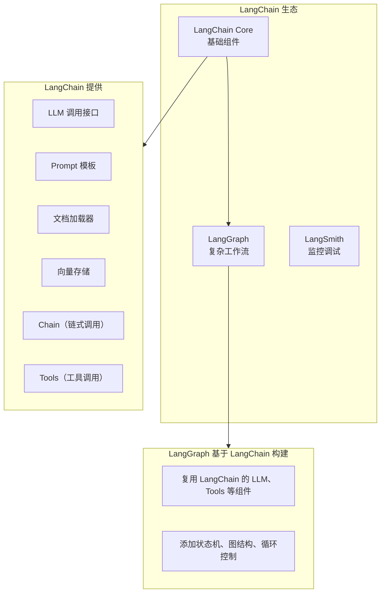
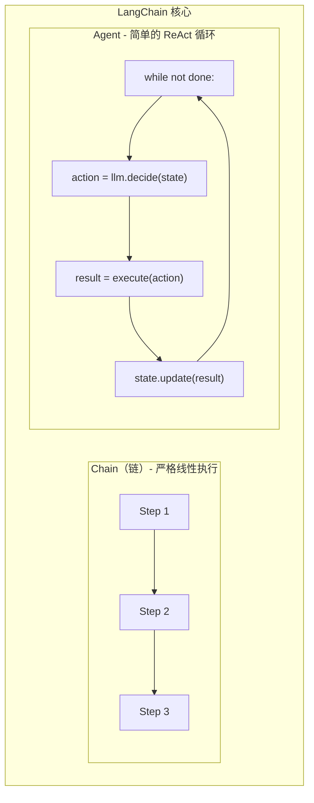
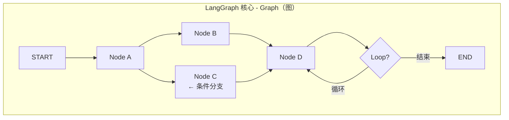
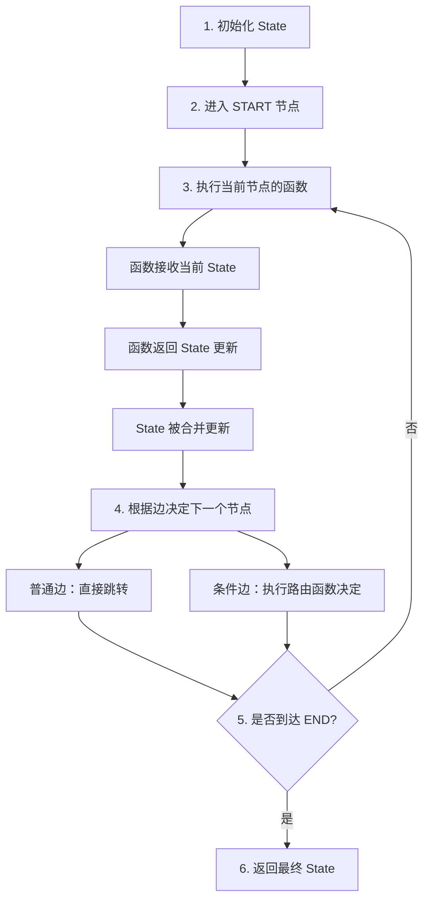
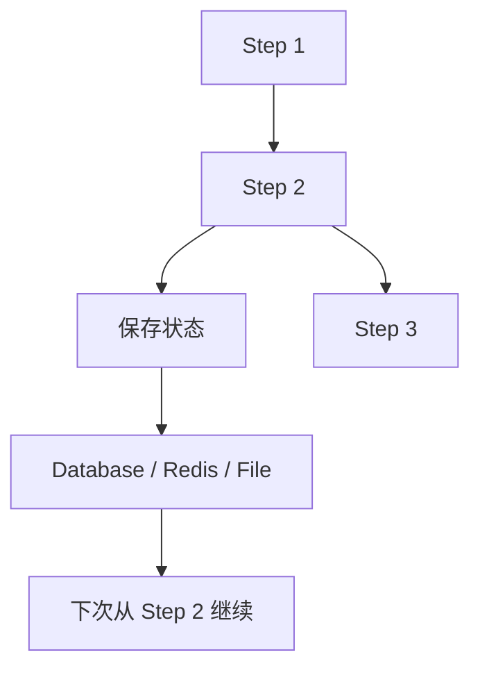
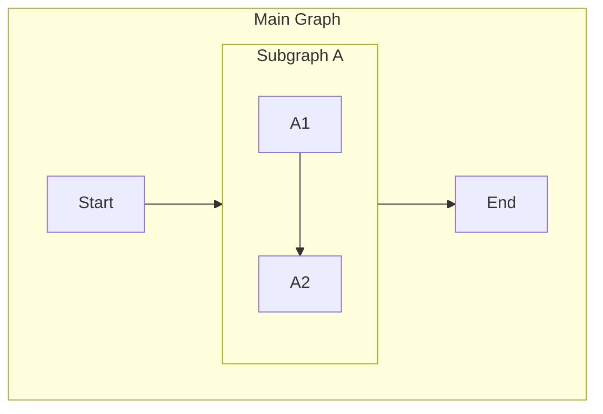
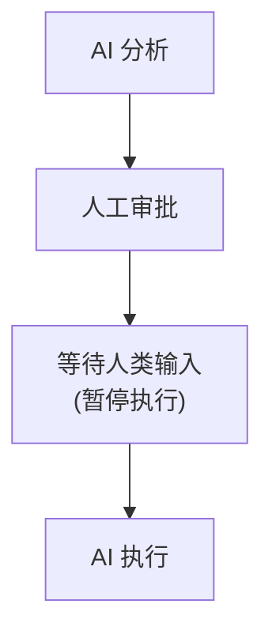
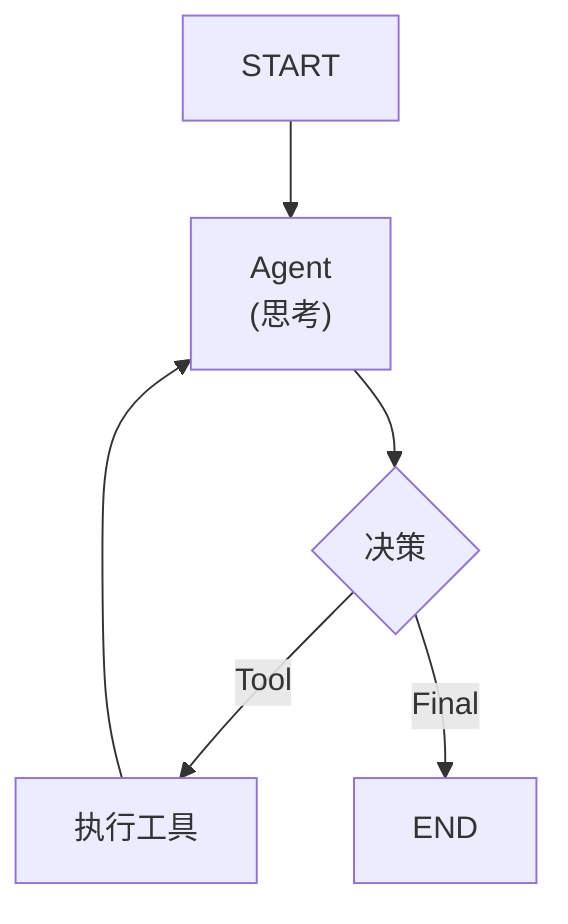

+++
title = "08.LangGraph详解"
date = 2025-01-13
description = "深入理解LangGraph的核心概念、与LangChain的区别联系，以及如何构建复杂的AI Agent工作流"
[taxonomies]
tags = ["ai", "langchain", "langgraph", "agent", "llm", "workflow"]
+++

# LangGraph 详解：从 LangChain 到复杂 Agent 工作流

---

## 一、LangChain 与 LangGraph 的关系

### 1.1 一句话理解

```
LangChain：构建 LLM 应用的基础框架
LangGraph：构建复杂 Agent 工作流的状态机引擎（基于 LangChain）
```

### 1.2 它们的关系



### 1.3 为什么需要 LangGraph？

**LangChain 的局限**：

| 场景 | LangChain Chain | 问题 |
|------|-----------------|------|
| 简单问答 | ✅ 适合 | - |
| RAG 检索 | ✅ 适合 | - |
| 多步推理 | ⚠️ 勉强 | 链式结构，难以分支 |
| 循环重试 | ❌ 困难 | 无法回到之前的步骤 |
| 条件分支 | ❌ 困难 | 需要复杂嵌套 |
| 复杂 Agent | ❌ 困难 | 状态管理混乱 |

**LangGraph 解决的问题**：

| 能力 | 说明 |
|------|------|
| **图结构** | 节点之间可以任意连接，不限于线性 |
| **循环** | 支持从后面的节点回到前面 |
| **条件路由** | 根据状态动态决定下一步 |
| **状态管理** | 内置状态对象，贯穿整个流程 |
| **持久化** | 可以保存和恢复状态 |

---

## 二、核心概念对比

### 2.1 LangChain 核心概念



### 2.2 LangGraph 核心概念



### 2.3 关键区别

| 维度 | LangChain (Chain) | LangGraph |
|------|-------------------|-----------|
| **结构** | 线性链 | 有向图 |
| **执行流** | 单向，从头到尾 | 可分支、可循环 |
| **状态** | 隐式传递 | 显式 State 对象 |
| **条件** | if-else 嵌套 | 条件边 (Conditional Edge) |
| **循环** | 需要外部 while | 图中自然支持 |
| **持久化** | 手动实现 | 内置 Checkpointer |
| **适用场景** | 简单流程 | 复杂 Agent |

---

## 三、LangGraph 核心架构

### 3.1 三大核心概念

**LangGraph 三要素**：

**1. State（状态）** - 状态对象贯穿整个图的执行

```python
class GraphState(TypedDict):
    messages: List[Message]
    current_step: str
    results: dict
    error: Optional[str]
```

**2. Node（节点）** - 节点是一个函数，接收状态，返回状态更新

```python
def my_node(state: GraphState):
    # 处理逻辑
    return {"results": new_results}
```

**3. Edge（边）** - 边定义节点之间的连接和流转规则

```python
# 普通边
graph.add_edge("node_a", "node_b")

# 条件边
graph.add_conditional_edges(
    "node_a",
    route_function,
    {"yes": "node_b", "no": "node_c"}
)
```

### 3.2 执行流程



---

## 四、代码示例对比

### 4.1 LangChain 方式：简单 Chain

```python
from langchain_core.prompts import ChatPromptTemplate
from langchain_openai import ChatOpenAI
from langchain_core.output_parsers import StrOutputParser

# 定义 Chain
prompt = ChatPromptTemplate.from_template("翻译成英文：{text}")
llm = ChatOpenAI()
parser = StrOutputParser()

chain = prompt | llm | parser

# 执行
result = chain.invoke({"text": "你好世界"})
```

**特点**：简洁，适合线性流程。

### 4.2 LangGraph 方式：复杂工作流

```python
from langgraph.graph import StateGraph, END
from typing import TypedDict, List

# 1. 定义状态
class State(TypedDict):
    task: str
    result: str
    attempts: int
    status: str

# 2. 定义节点
def analyze(state: State) -> dict:
    # 分析任务
    return {"status": "analyzed"}

def execute(state: State) -> dict:
    # 执行任务
    try:
        result = do_something(state["task"])
        return {"result": result, "status": "success"}
    except Exception as e:
        return {"status": "error", "attempts": state["attempts"] + 1}

def fix(state: State) -> dict:
    # 修复错误
    return {"status": "fixed"}

# 3. 定义路由函数
def should_retry(state: State) -> str:
    if state["status"] == "success":
        return "end"
    elif state["attempts"] < 3:
        return "fix"
    else:
        return "end"

# 4. 构建图
graph = StateGraph(State)

# 添加节点
graph.add_node("analyze", analyze)
graph.add_node("execute", execute)
graph.add_node("fix", fix)

# 添加边
graph.set_entry_point("analyze")
graph.add_edge("analyze", "execute")
graph.add_conditional_edges(
    "execute",
    should_retry,
    {"fix": "fix", "end": END}
)
graph.add_edge("fix", "execute")  # 循环回 execute

# 5. 编译并执行
app = graph.compile()
result = app.invoke({"task": "完成任务", "attempts": 0})
```

**特点**：支持循环、条件分支、状态管理。

---

## 五、典型应用场景

### 5.1 场景对照表

| 场景 | 推荐方案 | 原因 |
|------|----------|------|
| 简单问答 | LangChain Chain | 线性，简单 |
| RAG 检索 | LangChain Chain | 流程固定 |
| 多轮对话 | LangChain + Memory | 内置记忆 |
| 工具调用 Agent | LangGraph | 需要循环决策 |
| 多步骤审批流程 | LangGraph | 条件分支多 |
| 自动修复重试 | LangGraph | 需要循环 |
| 多 Agent 协作 | LangGraph | 复杂交互 |

### 5.2 何时选择 LangGraph？

**需要 LangGraph 的信号**：

```
✅ 流程中有"如果...则..."的分支
✅ 需要"失败后重试"的循环
✅ 有多个步骤需要协调
✅ 需要在中间保存/恢复状态
✅ 多个 Agent 需要交互
```

**不需要 LangGraph 的场景**：

```
❌ 输入 → 处理 → 输出 的简单流程
❌ 标准的 RAG 检索问答
❌ 单次 LLM 调用
```

---

## 六、LangGraph 高级特性

### 6.1 状态持久化 (Checkpointing)

**场景**：长时间运行的工作流，需要断点续传



### 6.2 子图 (Subgraph)

**场景**：复杂工作流拆分为可复用的子流程



### 6.3 人工介入 (Human-in-the-Loop)



**实现方式**：
- `interrupt_before=["human_node"]`
- `interrupt_after=["decision_node"]`

---

## 七、实战示例：ReAct Agent

### 7.1 ReAct 模式

**ReAct = Reasoning + Acting**



**循环**：思考 → 决定用工具 → 执行 → 思考 → ... → 最终答案

### 7.2 代码结构

```python
from langgraph.graph import StateGraph, END
from langgraph.prebuilt import ToolNode

# 定义工具
tools = [search_tool, calculator_tool]

# 定义 Agent 节点
def agent(state):
    response = llm.invoke(state["messages"])
    return {"messages": [response]}

# 定义路由
def should_continue(state):
    last_message = state["messages"][-1]
    if last_message.tool_calls:
        return "tools"
    return "end"

# 构建图
graph = StateGraph(MessagesState)
graph.add_node("agent", agent)
graph.add_node("tools", ToolNode(tools))

graph.set_entry_point("agent")
graph.add_conditional_edges("agent", should_continue, {
    "tools": "tools",
    "end": END
})
graph.add_edge("tools", "agent")  # 工具执行后回到 agent

app = graph.compile()
```

---

## 八、与其他框架对比

| 框架 | 定位 | 优势 | 劣势 |
|------|------|------|------|
| **LangChain** | LLM 应用基础框架 | 生态丰富、组件多 | 复杂流程难以表达 |
| **LangGraph** | Agent 工作流引擎 | 状态机、循环、分支 | 学习曲线陡 |
| **AutoGen** | 多 Agent 对话 | 多 Agent 协作简单 | 定制化困难 |
| **CrewAI** | Agent 团队协作 | 易上手 | 灵活性不足 |
| **Dify/Coze** | 低代码平台 | 可视化 | 不够灵活 |

---

## 九、总结

### 9.1 核心要点

| LangChain | LangGraph |
|-----------|-----------|
| 构建 LLM 应用的积木 | 编排复杂工作流的引擎 |
| 线性 Chain | 有向图 Graph |
| 简单场景 | 复杂 Agent |
| 基础组件 | 基于 LangChain 构建 |

### 9.2 选择建议

```
简单任务 → LangChain Chain
    ↓
需要循环/分支 → LangGraph
    ↓
多 Agent 协作 → LangGraph + 子图
```

### 9.3 学习路径

```
1. 掌握 LangChain 基础（LLM、Prompt、Tools）
      ↓
2. 理解 LangGraph 三要素（State、Node、Edge）
      ↓
3. 实践简单的条件分支图
      ↓
4. 实现循环重试场景
      ↓
5. 构建复杂 Agent 工作流
```

---

## 相关文章

- [上一篇：LangChain实践指南](/articles/ai/ai-07-LangChain实践指南/)
- [下一篇：LangGraph实践指南](/articles/ai/ai-09-LangGraph实践指南/)
