+++
title = "10.AI Agent智能体架构详解"
date = 2026-01-13
description = "AI Agent深度解析：架构设计、规划推理、工具调用、记忆系统与多智能体协作"
[taxonomies]
tags = ["ai", "agent", "llm", "reasoning", "tool-use"]
+++

# AI Agent智能体架构详解

AI Agent 是大模型应用的高级形态，具备自主规划、工具调用和任务执行能力。本文深入解析 Agent 的核心架构与实现。

---

## 一、Agent 概述

### 1.1 什么是 AI Agent

| 特征 | 说明 |
|-----|------|
| 自主性 | 独立做出决策 |
| 环境感知 | 理解当前状态 |
| 目标导向 | 朝目标行动 |
| 工具使用 | 调用外部工具 |
| 学习适应 | 从反馈中改进 |

### 1.2 Agent vs 传统 LLM 应用

| 维度 | 传统应用 | Agent |
|-----|---------|-------|
| 交互模式 | 单轮/多轮对话 | 自主任务执行 |
| 决策 | 预定义流程 | 动态规划 |
| 能力边界 | 模型内在能力 | 工具扩展 |
| 复杂任务 | 手动拆解 | 自动分解 |

### 1.3 Agent 应用场景

| 场景 | 说明 |
|-----|------|
| 智能助手 | 日程管理、信息查询 |
| 代码开发 | 自动编程、调试 |
| 数据分析 | 数据探索、报告生成 |
| 客户服务 | 自动化客服 |
| 研究分析 | 文献调研、报告撰写 |
| 自动化运维 | 故障诊断、修复 |

---

## 二、Agent 架构

### 2.1 核心组件

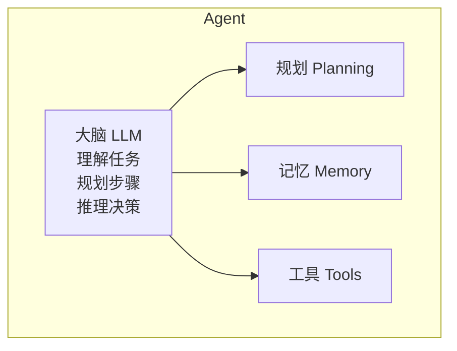

### 2.2 执行循环

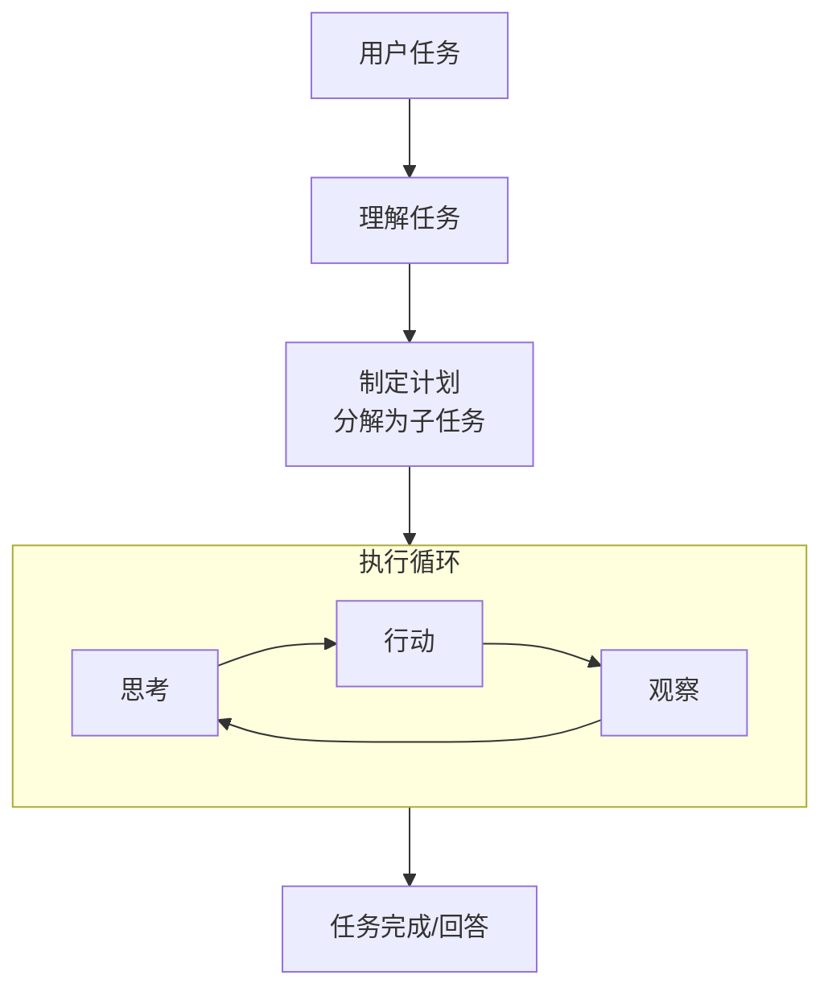

### 2.3 ReAct 模式

**Reasoning + Acting**：

```
任务：查询北京今天的天气

Thought 1: 我需要查询北京的天气信息
Action 1: weather_api(city="北京")
Observation 1: {"temp": 25, "weather": "晴", "humidity": 40}

Thought 2: 我已获取天气信息，可以回答用户
Action 2: finish(answer="北京今天天气晴朗，气温25度，湿度40%")
```

---

## 三、规划能力

### 3.1 规划类型

| 类型 | 说明 | 示例 |
|-----|------|------|
| 任务分解 | 拆分为子任务 | 写报告→收集资料→分析→撰写 |
| 顺序规划 | 确定执行顺序 | 先A后B再C |
| 条件规划 | 根据条件分支 | 如果成功则..否则.. |
| 迭代规划 | 动态调整计划 | 根据执行结果修改 |

### 3.2 规划策略

| 策略 | 说明 |
|-----|------|
| 前向规划 | 从起点到目标 |
| 后向规划 | 从目标反推 |
| 层次规划 | 高层目标→低层行动 |
| 启发式规划 | 使用经验指导 |

### 3.3 Plan-and-Execute

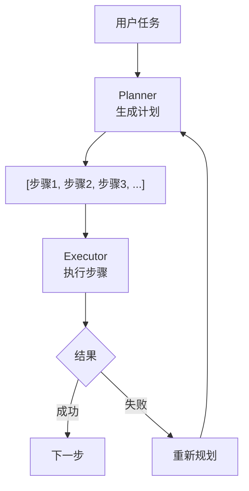

### 3.4 动态规划

| 时机 | 动作 |
|-----|------|
| 执行失败 | 调整当前步骤 |
| 发现新信息 | 更新计划 |
| 偏离目标 | 重新规划 |
| 资源不足 | 简化计划 |

---

## 四、记忆系统

### 4.1 记忆类型

| 类型 | 说明 | 实现 |
|-----|------|------|
| 短期记忆 | 当前对话上下文 | Prompt 上下文 |
| 长期记忆 | 持久化知识 | 向量数据库 |
| 情景记忆 | 历史交互记录 | 对话历史存储 |
| 工作记忆 | 当前任务状态 | 变量/缓存 |

### 4.2 记忆架构

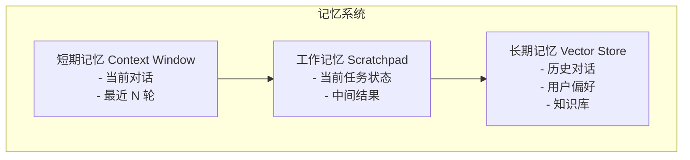

### 4.3 记忆操作

| 操作 | 说明 |
|-----|------|
| 存储 | 保存重要信息 |
| 检索 | 召回相关记忆 |
| 更新 | 修改已有信息 |
| 遗忘 | 清理过时信息 |
| 整合 | 合并相似记忆 |

### 4.4 记忆优化

| 策略 | 说明 |
|-----|------|
| 重要性评分 | 只记住重要内容 |
| 时间衰减 | 旧记忆权重降低 |
| 压缩摘要 | 长对话压缩为摘要 |
| 结构化存储 | 按类型/主题组织 |

---

## 五、工具使用

### 5.1 工具类型

| 类型 | 示例 |
|-----|------|
| 搜索工具 | Google、Bing、Wikipedia |
| 计算工具 | 计算器、代码执行器 |
| API 工具 | 天气、股票、地图 |
| 数据库工具 | SQL 查询 |
| 文件工具 | 读写文件 |
| 通信工具 | 发邮件、发消息 |

### 5.2 工具定义

```json
{
  "name": "search_web",
  "description": "搜索网络获取信息",
  "parameters": {
    "type": "object",
    "properties": {
      "query": {
        "type": "string",
        "description": "搜索关键词"
      },
      "num_results": {
        "type": "integer",
        "description": "返回结果数量",
        "default": 5
      }
    },
    "required": ["query"]
  }
}
```

### 5.3 工具调用流程

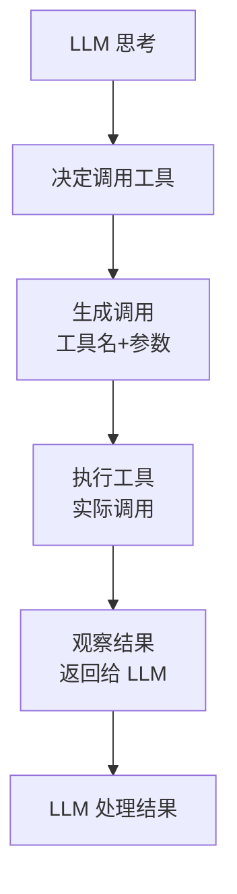

### 5.4 Function Calling

OpenAI 风格的工具调用：

```json
{
  "role": "assistant",
  "content": null,
  "function_call": {
    "name": "get_weather",
    "arguments": "{\"city\": \"北京\"}"
  }
}
```

### 5.5 工具选择策略

| 策略 | 说明 |
|-----|------|
| 描述匹配 | 根据工具描述选择 |
| 示例学习 | 从示例中学习何时用 |
| 强制使用 | 指定必须使用某工具 |
| 禁用工具 | 某些情况禁止使用 |

---

## 六、推理模式

### 6.1 MRKL 系统

**Modular Reasoning, Knowledge and Language**：

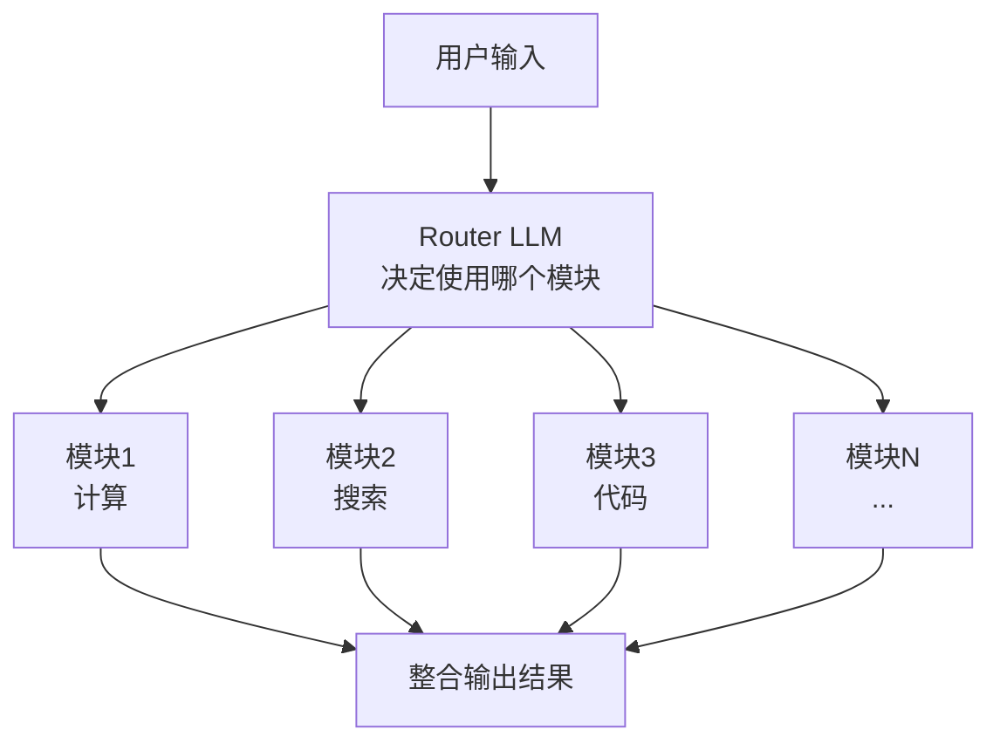

### 6.2 ReWOO

**Reasoning Without Observation**：

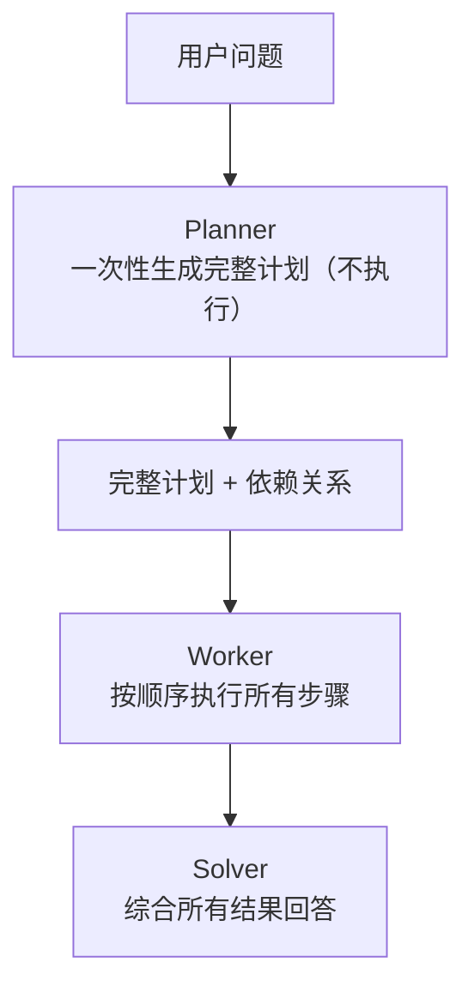

### 6.3 Reflexion

**自我反思**：

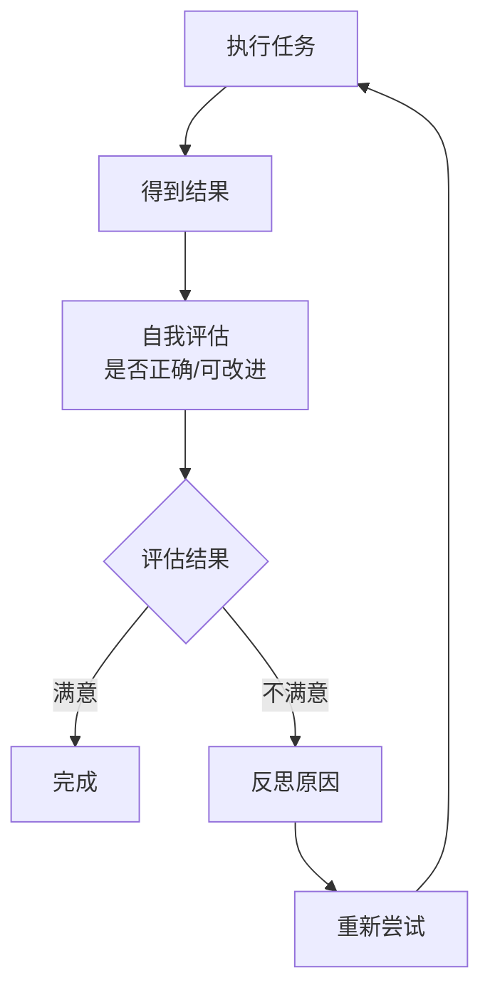

---

## 七、多智能体系统

### 7.1 协作模式

| 模式 | 说明 |
|-----|------|
| 层级式 | 管理者分配任务给执行者 |
| 对等式 | 平等协商合作 |
| 竞争式 | 多个方案竞争选优 |
| 辩论式 | 观点碰撞达成共识 |

### 7.2 层级架构

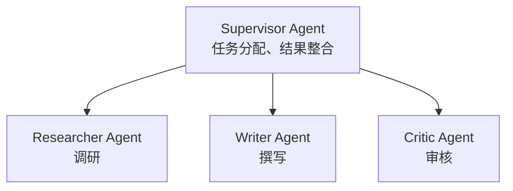

### 7.3 对话协作

```
Agent A: 我认为应该用方案 1...
Agent B: 但方案 1 有个问题...考虑方案 2
Agent A: 你说得对，我们可以结合两者...
Agent C: 我同意，最终方案是...
```

### 7.4 常见多智能体框架

| 框架 | 特点 |
|-----|------|
| AutoGen | 微软，对话式协作 |
| CrewAI | 角色扮演，任务分工 |
| LangGraph | 图结构工作流 |
| MetaGPT | 软件开发团队模拟 |

### 7.5 任务分工示例

**用户需求：写一篇技术博客**

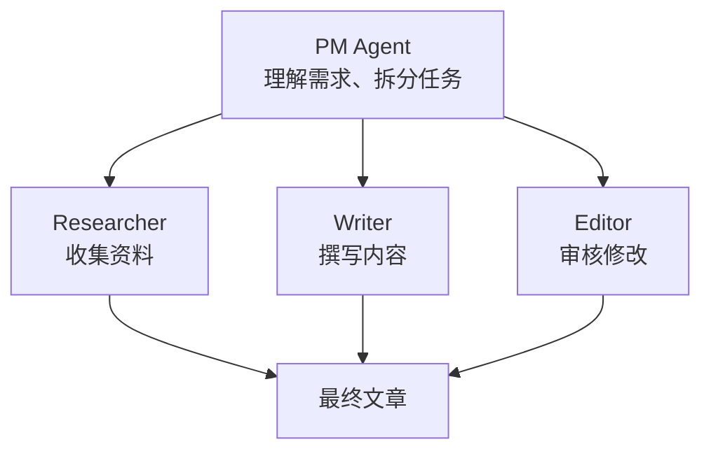

---

## 八、实现框架

### 8.1 主流框架对比

| 框架 | 特点 | 适用场景 |
|-----|------|---------|
| LangChain | 模块化、灵活 | 通用开发 |
| LangGraph | 图结构、状态管理 | 复杂工作流 |
| AutoGen | 多智能体对话 | 协作任务 |
| CrewAI | 角色化、简单 | 快速原型 |
| Semantic Kernel | 微软、C#友好 | 企业集成 |

### 8.2 LangChain Agent

```
Agent 类型：
├── Zero-shot ReAct
├── Structured Chat
├── OpenAI Functions
├── Self-ask with Search
└── Plan-and-Execute
```

### 8.3 LangGraph 状态机

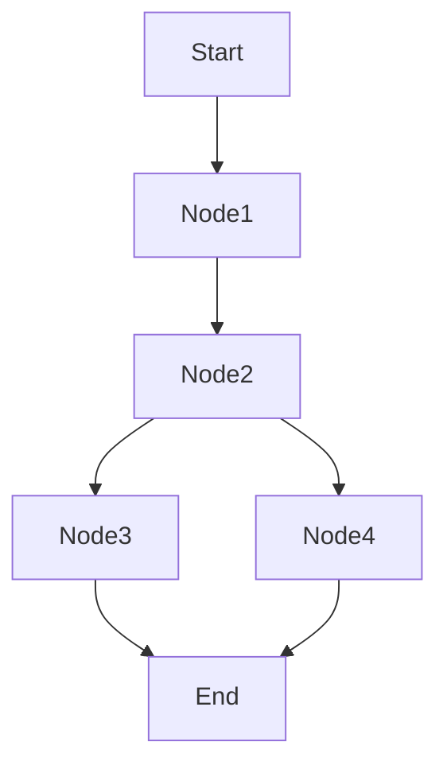

---

## 九、评估与调试

### 9.1 评估维度

| 维度 | 指标 |
|-----|------|
| 任务完成率 | 成功完成任务的比例 |
| 步骤效率 | 完成任务所需步骤数 |
| 工具使用准确率 | 正确调用工具的比例 |
| 推理质量 | 推理过程的合理性 |
| 错误恢复 | 从错误中恢复的能力 |

### 9.2 调试技巧

| 技巧 | 说明 |
|-----|------|
| 日志追踪 | 记录每步思考和行动 |
| 可视化 | 展示决策流程 |
| 单步调试 | 逐步执行检查 |
| 对比分析 | 与预期行为对比 |

### 9.3 常见问题

| 问题 | 解决 |
|-----|------|
| 无限循环 | 设置最大步数 |
| 工具调用错误 | 优化工具描述 |
| 规划不当 | 改进规划提示 |
| 遗忘上下文 | 增强记忆系统 |

---

## 十、生产实践

### 10.1 可靠性设计

| 设计 | 说明 |
|-----|------|
| 超时控制 | 每步设置超时 |
| 重试机制 | 失败自动重试 |
| 降级策略 | 复杂任务降级 |
| 人工接管 | 支持人工干预 |

### 10.2 安全考虑

| 风险 | 对策 |
|-----|------|
| 工具滥用 | 权限控制 |
| 数据泄露 | 敏感信息过滤 |
| 无限消耗 | 成本限制 |
| 有害输出 | 输出审核 |

### 10.3 成本优化

| 方法 | 说明 |
|-----|------|
| 缓存结果 | 相同任务复用 |
| 模型选择 | 简单步骤用小模型 |
| 步骤优化 | 减少不必要步骤 |
| 批量处理 | 合并请求 |

---

## 参考资料

- [LangChain Agents](https://python.langchain.com/docs/modules/agents/)
- [AutoGen](https://microsoft.github.io/autogen/)
- [ReAct Paper](https://arxiv.org/abs/2210.03629)
- [Reflexion Paper](https://arxiv.org/abs/2303.11366)

---

## 相关文章

- [上一篇：LangGraph实践指南](/articles/ai/ai-09-LangGraph实践指南/)
- [下一篇：Notebook执行Agent架构设计](/articles/ai/ai-11-Notebook执行Agent架构设计/)
