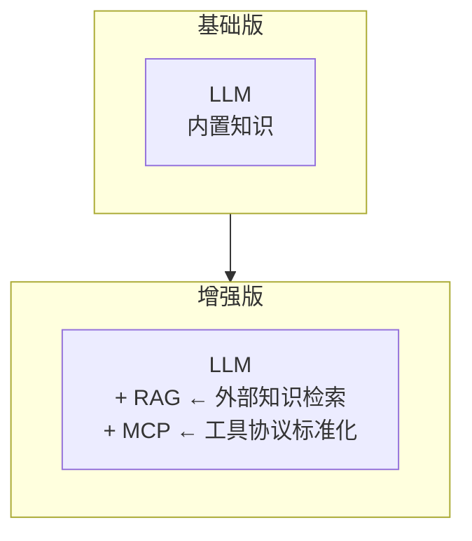
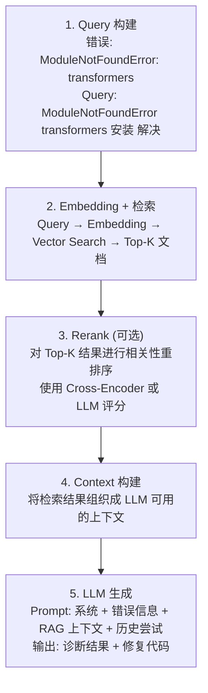
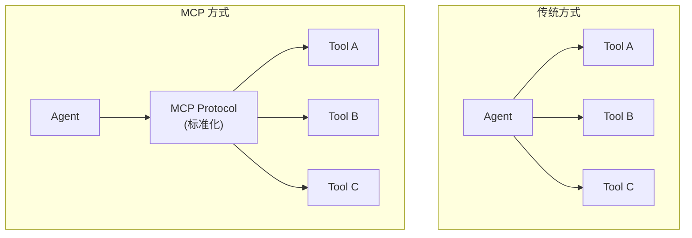
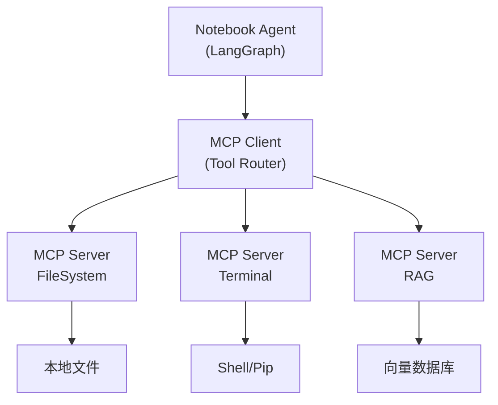
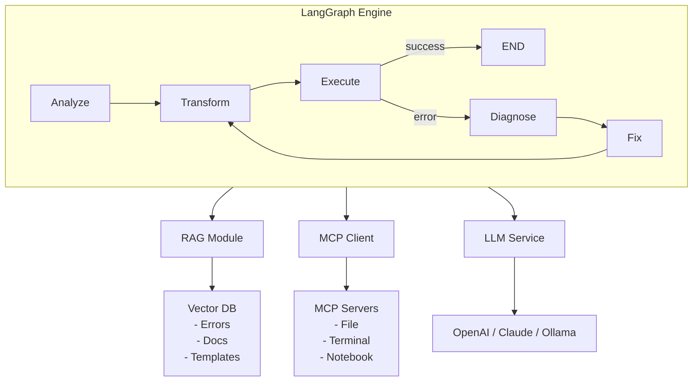
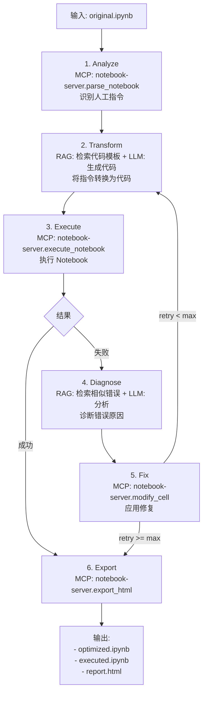
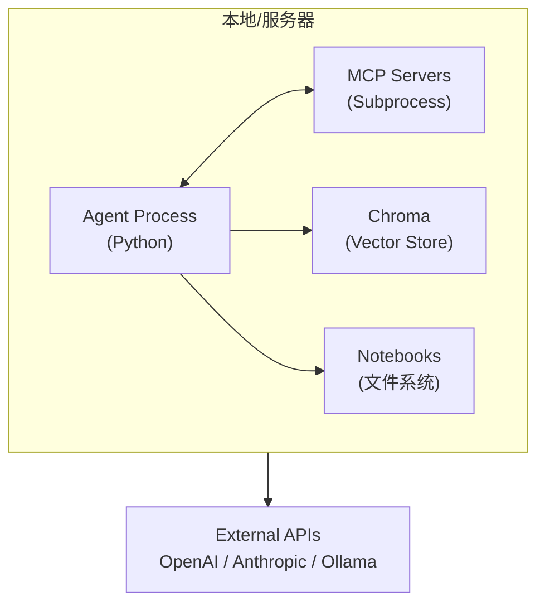

+++
title = "Notebook优化Agent增强版"
date = 2025-01-14
weight = 12000
description = "在基础版Notebook优化Agent上，集成RAG知识检索和MCP协议，实现更智能的错误诊断和修复"
[taxonomies]
tags = ["ai", "agent", "jupyter", "rag", "mcp", "langchain", "langgraph"]
+++

# Notebook 优化 Agent 增强版：RAG 与 MCP 集成

---

## 一、为什么需要增强？

### 1.1 基础版的局限

基础版 Notebook 优化 Agent 依赖 LLM 的内置知识进行错误诊断和代码生成。

| 局限 | 表现 |
|------|------|
| **知识时效性** | LLM 知识截止日期后的库版本变化无法处理 |
| **专有知识缺失** | 企业内部规范、私有库用法无法获知 |
| **相似问题重复** | 同样的错误每次都要重新分析 |
| **工具孤岛** | 无法与外部系统（IDE、文档服务）协作 |

### 1.2 增强方案



- **RAG**：让 Agent 能够检索外部知识库
- **MCP**：让 Agent 能够标准化地调用外部工具

---

## 二、RAG 集成设计

### 2.1 RAG 在哪些环节有用？

**RAG 应用场景**：

| 阶段 | 输入 | RAG 检索 | 返回 |
|------|------|----------|------|
| 错误诊断阶段 | `ModuleNotFoundError: torch` | "torch 安装错误 解决方案" | [安装指南, 常见问题, 版本兼容性] |
| 代码转换阶段 | "请下载 HuggingFace 模型" | "HuggingFace 模型下载 最佳实践" | [官方API用法, 缓存路径设置, 离线模式] |
| 修复验证阶段 | 添加 `!pip install torch` | "torch pip install 注意事项" | [CUDA版本匹配, 推荐安装命令, 常见坑] |

### 2.2 知识库设计

**Knowledge Base 结构**：

| 知识库 | 内容 |
|--------|------|
| **Error Solutions (错误解决方案库)** | ModuleNotFoundError、FileNotFoundError、PermissionError、网络/下载问题、版本兼容性问题 |
| **Library Documents (库文档索引)** | PyTorch、TensorFlow、HuggingFace、Pandas/NumPy 文档，常用库安装指南 |
| **Code Templates (代码模板库)** | 依赖安装模板、文件下载模板、环境配置模板、路径创建模板 |
| **Enterprise Standards (企业规范库)** | 内部 Notebook 规范、私有库使用指南、安全合规要求、代码审查标准 |

### 2.3 RAG 流程



### 2.4 RAG 增强的诊断模块

```python
# RAG-Enhanced Diagnose Node
def diagnose_with_rag(state: State) -> dict:
    error = state["error"]
    notebook = state["notebook"]
    attempts = state["attempts"]

    # 1. 构建检索 Query
    query = build_search_query(error, notebook)

    # 2. 多路检索
    error_solutions = error_kb.search(query, k=3)
    lib_docs = library_kb.search(query, k=2)
    templates = template_kb.search(query, k=2)

    # 3. 合并上下文
    rag_context = format_context(
        error_solutions,
        lib_docs,
        templates
    )

    # 4. LLM 诊断（带 RAG 上下文）
    diagnosis = llm.invoke(
        DIAGNOSE_PROMPT,
        error=error,
        rag_context=rag_context,   # RAG 检索结果
        attempts=attempts          # 历史尝试
    )

    return {"diagnosis": diagnosis}
```

---

## 三、MCP 集成设计

### 3.1 什么是 MCP？

**MCP (Model Context Protocol)** 是 Anthropic 提出的开放协议，让 LLM 能够安全地与外部工具和数据源交互。



**MCP 优势**：
- 统一的工具发现和描述格式
- 标准化的调用协议
- 安全的权限控制
- 可组合的工具链

### 3.2 MCP 在 Notebook Agent 中的应用

**MCP 集成场景**：

| MCP Server | Tools |
|------------|-------|
| **File System** | `read_file(path)`, `write_file(path, content)`, `list_directory(path)`, `create_directory(path)` |
| **Terminal/Shell** | `run_command(cmd)`, `pip_install(packages[])`, `check_installed(package)` |
| **Notebook Engine** | `parse_notebook(path)`, `execute_notebook(path)`, `export_html(notebook, path)` |
| **Knowledge Base** | `search_errors(query)`, `search_docs(library, topic)`, `get_template(type)` |

### 3.3 MCP 架构图



### 3.4 MCP Server 定义示例

**Notebook MCP Server**:

```json
{
  "name": "notebook-server",
  "version": "1.0.0",
  "description": "MCP server for Jupyter Notebook operations",
  "tools": [
    {
      "name": "parse_notebook",
      "description": "Parse a Jupyter notebook and return its cells",
      "inputSchema": {
        "type": "object",
        "properties": {
          "path": {
            "type": "string",
            "description": "Path to the notebook file"
          }
        },
        "required": ["path"]
      }
    },
    {
      "name": "execute_notebook",
      "description": "Execute a notebook using papermill",
      "inputSchema": {
        "type": "object",
        "properties": {
          "input_path": { "type": "string" },
          "output_path": { "type": "string" },
          "parameters": { "type": "object" }
        },
        "required": ["input_path", "output_path"]
      }
    },
    {
      "name": "modify_cell",
      "description": "Modify a specific cell in the notebook",
      "inputSchema": {
        "type": "object",
        "properties": {
          "notebook_path": { "type": "string" },
          "cell_index": { "type": "integer" },
          "new_content": { "type": "string" },
          "cell_type": { "type": "string", "enum": ["code", "markdown"] }
        },
        "required": ["notebook_path", "cell_index", "new_content"]
      }
    }
  ]
}
```

---

## 四、增强版整体架构

### 4.1 完整架构图



### 4.2 数据流



---

## 五、RAG + MCP 协同工作

### 5.1 诊断阶段示例

**RAG + MCP 协同诊断示例**：

错误: `ModuleNotFoundError: No module named 'torch'`

| Step | 操作 | 结果 |
|------|------|------|
| **Step 1: RAG 检索** | Query: "ModuleNotFoundError torch 解决" | [1] PyTorch 安装需要根据 CUDA 版本选择<br/>[2] 推荐: `pip install torch --index-url ...`<br/>[3] 常见问题: 虚拟环境未激活 |
| **Step 2: MCP 工具调用** | `terminal-server.check_installed("torch")` | Result: false |
| | `terminal-server.run_command("nvcc --version")` | Result: "CUDA 12.1" |
| **Step 3: LLM 综合分析** | Input: 错误 + RAG 知识 + MCP 检测结果 | 诊断: torch 未安装，需要安装 CUDA 12.1 兼容版本<br/>修复: `!pip install torch --index-url https://download.pytorch.org/whl/cu121` |

---

## 六、技术选型

### 6.1 组件选型

| 组件 | 技术选型 | 说明 |
|------|----------|------|
| **Agent 框架** | LangGraph | 状态机 + 循环控制 |
| **RAG 框架** | LangChain | Retriever + VectorStore |
| **向量数据库** | Chroma / FAISS | 本地部署，简单易用 |
| **Embedding** | OpenAI / BGE | 文本向量化 |
| **MCP 框架** | @modelcontextprotocol/sdk | 官方 SDK |
| **LLM** | GPT-4 / Claude | 代码生成和分析 |

### 6.2 部署架构



---

## 七、基础版 vs 增强版对比

| 维度 | 基础版 | 增强版 (RAG + MCP) |
|------|--------|-------------------|
| **知识来源** | LLM 内置 | LLM + 外部知识库 |
| **工具调用** | 自定义 Python 函数 | 标准化 MCP 协议 |
| **错误诊断** | 纯 LLM 推理 | RAG 检索 + LLM 分析 |
| **可扩展性** | 需要改代码 | 添加 MCP Server 即可 |
| **复杂度** | 低 | 中等 |
| **适用场景** | 简单项目 | 企业级部署 |
| **运维成本** | 低 | 需要维护知识库和 MCP 服务 |

---

## 八、何时选择增强版？

### 8.1 适合增强版的场景

| 场景 | 原因 |
|------|------|
| **企业内部 Notebook** | 需要企业规范知识库 |
| **特定领域 Notebook** | 需要领域文档（如生物信息学） |
| **高频使用** | 知识积累可复用 |
| **多系统集成** | MCP 标准化接口 |

### 8.2 适合基础版的场景

| 场景 | 原因 |
|------|------|
| **个人项目** | 无需复杂基础设施 |
| **通用 Notebook** | LLM 内置知识足够 |
| **快速验证** | 减少部署成本 |

---

## 九、总结

### 9.1 增强版核心价值

**增强版核心价值**：

| 来源 | 价值 |
|------|------|
| **RAG 带来** | ✓ 更准确的错误诊断（基于历史案例）<br/>✓ 更好的代码生成（基于最佳实践模板）<br/>✓ 企业知识沉淀和复用 |
| **MCP 带来** | ✓ 标准化的工具接口<br/>✓ 更好的可扩展性<br/>✓ 与其他 AI 系统的互操作性 |

### 9.2 演进路径

```
阶段 1: 基础版
├── LangGraph + LLM
├── 简单的转换和修复
└── 验证核心流程

阶段 2: 增强版
├── + RAG (错误知识库)
├── + MCP (标准化工具)
└── 提升诊断准确率

阶段 3: 企业版
├── + 企业知识库
├── + 多租户支持
└── + 监控和审计
```

---

## 相关文章

- [上一篇：Notebook执行Agent架构设计](@/articles/ai/ai-11-Notebook执行Agent架构设计.md)
- [下一篇：AI高级知识与技能详解](@/articles/ai/ai-13-AI高级知识与技能详解.md)
