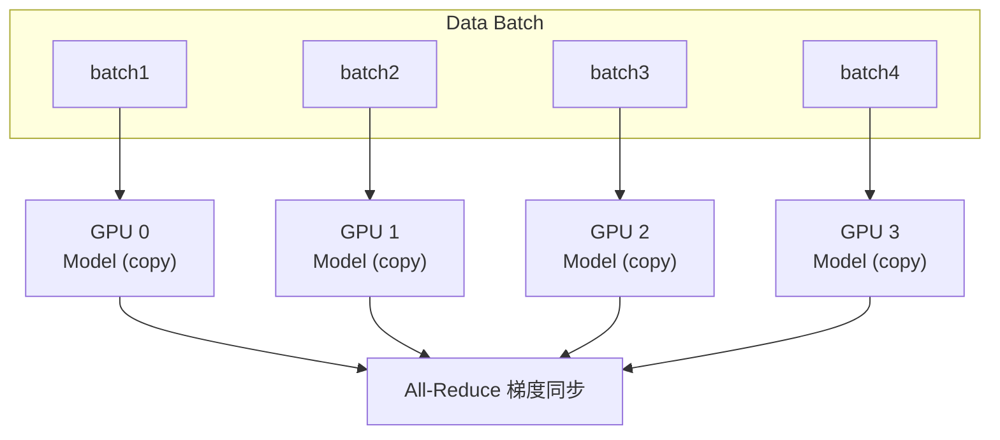
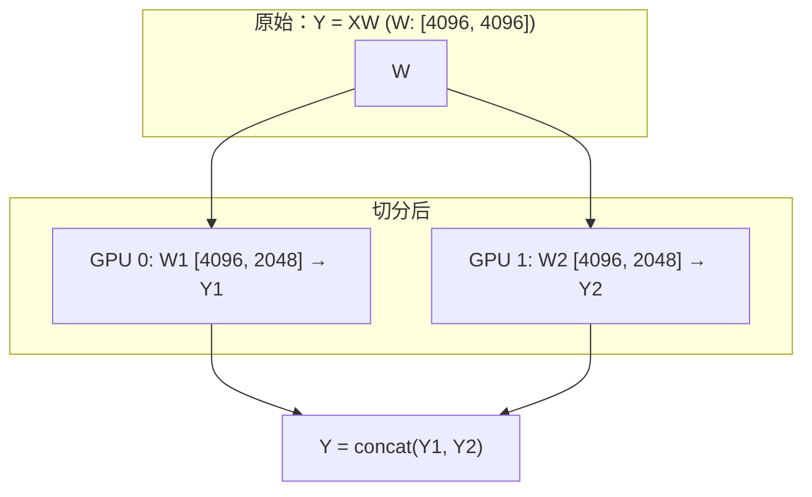
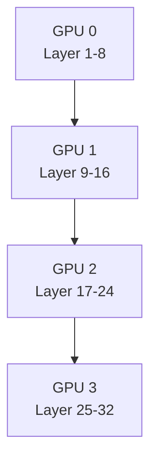
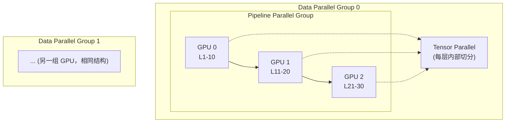

+++
title = "14. 分布式训练优化详解"
date = 2025-01-15
weight = 14000
description = "大规模分布式训练技术：数据并行、模型并行、流水线并行、ZeRO优化"
[taxonomies]
tags = ["ai", "distributed-training", "deepspeed", "fsdp", "parallelism", "optimization"]
+++

## 概述

训练大模型需要分布式训练技术。本文介绍主流的并行策略和优化技术。

---

## 一、为什么需要分布式训练

**分布式训练的必要性：**

| 挑战 | 说明 |
|------|------|
| **单卡限制** | GPU 显存有限（A100: 80GB）；大模型无法放入单卡；训练时间过长 |
| **模型规模** | GPT-3: 175B 参数 → FP16 存储: 350GB → 训练中间态: ~2TB+ → 需要几十到上百张 GPU |
| **分布式目标** | 训练更大的模型；加速训练过程；高效利用硬件 |

---

## 二、并行策略

### 2.1 数据并行（Data Parallelism）

**数据并行原理：**
- 每个 GPU 持有完整模型副本
- 数据分片，每个 GPU 处理不同数据
- 梯度同步后更新模型



**优点**：实现简单，扩展性好  
**缺点**：每卡需要放下完整模型

```python
# PyTorch DDP 数据并行
import torch.distributed as dist
from torch.nn.parallel import DistributedDataParallel as DDP

# 初始化
dist.init_process_group(backend='nccl')
local_rank = int(os.environ['LOCAL_RANK'])
torch.cuda.set_device(local_rank)

# 模型包装
model = MyModel().cuda()
model = DDP(model, device_ids=[local_rank])

# 数据加载器
sampler = DistributedSampler(dataset)
dataloader = DataLoader(dataset, sampler=sampler)

# 训练循环正常进行
for batch in dataloader:
    loss = model(batch)
    loss.backward()
    optimizer.step()
```

### 2.2 模型并行（Model Parallelism）

**模型并行：**

**张量并行（Tensor Parallelism）**

切分单个层的权重矩阵到多个 GPU



- **优点**：可训练超大层
- **缺点**：通信开销大，需要特殊实现

---

**流水线并行（Pipeline Parallelism）**

按层切分模型到不同 GPU：



使用微批次（micro-batch）提高并行度，减少流水线气泡（bubble）

- **优点**：每卡显存需求低
- **缺点**：存在流水线气泡

### 2.3 3D 并行

**3D 并行：组合多种并行策略**



**组合策略：**
- DP × PP × TP = 总 GPU 数
- 例：8 × 4 × 8 = 256 GPUs

---

## 三、ZeRO 优化

### 3.1 ZeRO 原理

**ZeRO（Zero Redundancy Optimizer）：**

**问题：数据并行中每个 GPU 存储完整模型状态**
- 模型参数：Φ
- 梯度：Φ
- 优化器状态：2Φ（Adam）
- 总计：4Φ（更多with混合精度）

**ZeRO 解决方案：分片存储**

| 阶段 | 分片内容 | 显存节省 |
|------|----------|----------|
| ZeRO-1 | 优化器状态 | ~4x |
| ZeRO-2 | 优化器状态 + 梯度 | ~8x |
| ZeRO-3 | 优化器状态 + 梯度 + 参数 | 与 GPU 数成正比（通信开销最大） |

### 3.2 DeepSpeed 使用

```python
# DeepSpeed 配置文件 ds_config.json
{
    "train_batch_size": 32,
    "gradient_accumulation_steps": 4,
    "fp16": {
        "enabled": true,
        "loss_scale": 0,
        "initial_scale_power": 16
    },
    "zero_optimization": {
        "stage": 2,
        "offload_optimizer": {
            "device": "cpu",
            "pin_memory": true
        },
        "allgather_partitions": true,
        "allgather_bucket_size": 2e8,
        "reduce_scatter": true,
        "reduce_bucket_size": 2e8
    }
}
```

```python
# 使用 DeepSpeed
import deepspeed

model, optimizer, _, _ = deepspeed.initialize(
    model=model,
    model_parameters=model.parameters(),
    config=ds_config
)

# 训练
for batch in dataloader:
    loss = model(batch)
    model.backward(loss)
    model.step()
```

### 3.3 FSDP（PyTorch 原生）

```python
# PyTorch FSDP
from torch.distributed.fsdp import (
    FullyShardedDataParallel as FSDP,
    MixedPrecision,
    ShardingStrategy,
)

# 配置
mp_policy = MixedPrecision(
    param_dtype=torch.float16,
    reduce_dtype=torch.float16,
    buffer_dtype=torch.float16,
)

# 包装模型
model = FSDP(
    model,
    sharding_strategy=ShardingStrategy.FULL_SHARD,  # 类似 ZeRO-3
    mixed_precision=mp_policy,
    device_id=torch.cuda.current_device(),
)

# 正常训练
for batch in dataloader:
    loss = model(batch)
    loss.backward()
    optimizer.step()
```

---

## 四、通信优化

### 4.1 通信原语

**分布式通信原语：**

| 原语 | 说明 | 用途 |
|------|------|------|
| All-Reduce | 所有节点聚合结果，结果广播给所有节点 | 梯度同步 |
| Reduce-Scatter | 聚合后分片，每节点得到一部分 | ZeRO 梯度分片 |
| All-Gather | 收集所有节点的分片，组合成完整数据 | ZeRO-3 参数重建 |

**通信后端：**
- **NCCL**：NVIDIA GPU 首选
- **Gloo**：CPU 或跨厂商

### 4.2 梯度分桶（Gradient Bucketing）

**梯度分桶优化：**

| 技术 | 说明 |
|------|------|
| 梯度分桶（Gradient Bucketing） | 多个小张量合并后通信，减少通信次数，降低 kernel launch 开销 |
| 桶大小调优 | `bucket_cap_mb` 参数（DDP 默认 25MB），过大延迟通信启动，过小增加通信次数 |

> 通信-计算重叠是分布式训练/推理中最关键的性能优化之一，下面用独立章节详细展开。

---

## 五、通信-计算重叠详解（Communication-Computation Overlap）

### 5.1 为什么需要通信-计算重叠

在分布式训练和推理中，**通信开销**是影响整体吞吐的关键瓶颈。常见的集合通信操作（All-Reduce、All-Gather、Reduce-Scatter）在高带宽互联（如 NVLink 900 GB/s、InfiniBand 400 Gbps）下依然需要可观的时间，特别是当模型参数量达到数十亿甚至上万亿级别时。

**不重叠 vs 重叠的执行时间对比：**

| 模式 | 执行流程 | 总时间 |
|------|----------|--------|
| **串行（无重叠）** | Compute → **Wait** → Communicate → **Wait** → Compute | T_compute + T_comm |
| **重叠（Overlap）** | Compute **同时** Communicate | max(T_compute, T_comm) |
| **理想加速比** | 若 T_compute ≈ T_comm | **~2x** |

**串行 vs 重叠时间线示意：**

```
无重叠 (Serial):
GPU Compute:  |====COMPUTE====|                    |====COMPUTE====|
GPU Comm:                      |====ALL-REDUCE====|
Timeline:     |<---------- T_compute + T_comm --------->|

有重叠 (Overlap):
GPU Compute:  |====COMPUTE====================|
GPU Comm:          |====ALL-REDUCE====|
Timeline:     |<--- max(T_compute, T_comm) --->|
```

**核心思想**：GPU 上的 CUDA Compute Stream 和 NCCL Communication Stream 可以**并行执行**。计算使用 SM（Streaming Multiprocessor），通信使用 NVLink/PCIe 的 DMA 引擎和部分 SM，两者资源大部分不冲突。通过合理的 kernel 调度，可以让通信"隐藏"在计算之后，实现显著加速。

**重叠生效的前提条件：**

1. **通信与计算之间无数据依赖**：正在通信的数据不是当前计算所需的
2. **使用独立的 CUDA Stream**：计算和通信分别在不同 stream 上执行
3. **异步通信 API**：NCCL 操作是非阻塞的（`async_op=True`）
4. **足够的 GPU 资源**：SM 不会被计算完全占满，留出资源给通信 kernel

---

### 5.2 数据并行中的通信-计算重叠

#### 5.2.1 PyTorch DDP 的 Bucket-based Gradient All-Reduce

PyTorch DDP（`DistributedDataParallel`）是最经典的梯度通信重叠实现。其核心机制是**梯度分桶 + 反向传播重叠**：

**工作流程：**

1. 模型参数按**逆序**（从最后一层到第一层）分配到多个 **Bucket**（桶）
2. 反向传播时，每计算完一个参数的梯度，就将其标记为"就绪"
3. 当某个 Bucket 中**所有梯度都就绪**时，立即在 **NCCL Stream** 上启动该 Bucket 的 All-Reduce
4. 与此同时，反向传播继续计算前面层的梯度（在 **Compute Stream** 上）
5. 两个 Stream 并行执行，实现重叠

```
反向传播 + 梯度通信重叠 (DDP):

Compute Stream: |--grad L32--|--grad L31--|--grad L30--|--grad L29--|...|--grad L1--|
NCCL Stream:                 |---AR bucket3---|          |---AR bucket2---|     |---AR bucket1---|

说明：
- L32 梯度完成后，bucket3 就绪，立即启动 All-Reduce (AR)
- Compute Stream 继续计算 L31, L30... 的梯度
- bucket2 就绪后再启动下一个 AR，依此类推
```

**DDP 实现的关键参数：**

```python
model = DDP(
    model,
    device_ids=[local_rank],
    bucket_cap_mb=25,           # 每个 bucket 大小（MB），默认 25MB
    find_unused_parameters=False, # 是否检测未使用参数（影响性能）
    gradient_as_bucket_view=True, # 梯度直接引用 bucket 内存，减少拷贝
    static_graph=True,           # 静态图优化，允许更激进的重叠
)
```

**Bucket 大小调优建议：**

| bucket_cap_mb | 效果 |
|---------------|------|
| **过小**（如 1MB） | Bucket 数量多，All-Reduce 启动频繁，但每次通信量小，kernel launch 开销大 |
| **过大**（如 200MB） | Bucket 数量少，需要等待更多梯度就绪才能启动通信，**延迟了通信开始时间**，重叠度下降 |
| **推荐**（10-50MB） | 平衡通信效率与重叠度，具体需 profile 调优 |

#### 5.2.2 DeepSpeed ZeRO 中的重叠

**ZeRO-1/2：梯度 Reduce-Scatter 重叠**

与 DDP 类似，ZeRO-1/2 在反向传播过程中使用 Reduce-Scatter（而非 All-Reduce）来同步和分片梯度。重叠策略相同：每个 bucket 就绪后立即启动 Reduce-Scatter。

**ZeRO-3：参数 All-Gather 重叠**

ZeRO-3 更进一步，**参数本身也被分片**，前向和反向时需要 All-Gather 来重建完整参数：

```
ZeRO-3 前向传播重叠：

Compute Stream: |--forward L1--|--forward L2--|--forward L3--|...
NCCL Stream:    |--AG params L1--|--AG params L2--|--AG params L3--|...

说明：
- 计算 Layer 1 的前向时，同时预取（prefetch）Layer 2 的参数
- AG = All-Gather：从所有 rank 收集该层的完整参数
- 前向计算与下一层参数的 All-Gather 重叠
```

**DeepSpeed ZeRO-3 prefetch 配置：**

```json
{
    "zero_optimization": {
        "stage": 3,
        "prefetch_bucket_size": 50000000,
        "param_persistence_threshold": 100000,
        "stage3_prefetch_bucket_size": 5e7,
        "stage3_max_live_parameters": 1e9,
        "stage3_max_reuse_distance": 1e9
    }
}
```

| 参数 | 说明 |
|------|------|
| `prefetch_bucket_size` | 预取参数桶大小，控制提前 All-Gather 多少参数 |
| `param_persistence_threshold` | 小于此阈值的参数常驻不分片，减少通信 |
| `stage3_max_live_parameters` | 同时存在的最大参数量，控制显存峰值 |

#### 5.2.3 FSDP 中的重叠

PyTorch FSDP（`FullyShardedDataParallel`）同样支持通信-计算重叠：

```python
model = FSDP(
    model,
    sharding_strategy=ShardingStrategy.FULL_SHARD,
    forward_prefetch=True,    # 前向时预取下一层参数（All-Gather 重叠）
    backward_prefetch=BackwardPrefetch.BACKWARD_PRE,  # 反向时预取策略
    limit_all_gathers=True,   # 限制同时进行的 All-Gather 数量，防止 OOM
)
```

**FSDP Backward Prefetch 策略：**

| 策略 | 说明 |
|------|------|
| `BACKWARD_PRE` | 在当前层反向计算**之前**预取下一层参数，**重叠度最高** |
| `BACKWARD_POST` | 在当前层反向计算**之后**才预取，重叠度低但显存占用更稳定 |

---

### 5.3 张量并行中的通信-计算重叠

#### 5.3.1 张量并行的通信模式

在 Tensor Parallelism (TP) 中，每一层的计算都需要通信：

- **Column Parallel Linear**：前向输出需要 **All-Gather**（或无需通信，取决于下一层）
- **Row Parallel Linear**：前向输出需要 **All-Reduce**（或 Reduce-Scatter + All-Gather）
- 每个 Transformer 层的 **Attention** 和 **MLP** 各有一次 All-Reduce

```
Tensor Parallel 单层 Transformer 的通信：

Forward:
  Input → [Column Parallel QKV] → Attention → [All-Reduce / Row Parallel] → 
        → [Column Parallel MLP] → Activation → [All-Reduce / Row Parallel] → Output

说明：每个 Transformer 层有 2 次 All-Reduce（前向），2 次 All-Reduce（反向），共 4 次
```

#### 5.3.2 层间重叠策略

**核心思想**：Layer N 的 All-Reduce 结果被 Layer N+1 使用，但 Layer N+1 中有一些**不依赖** All-Reduce 结果的计算可以提前执行。

```
TP 层间重叠示例：

Layer N:    |--MatMul--|--All-Reduce--|
Layer N+1:             |--LayerNorm--||--MatMul--|--All-Reduce--|
                       ↑ 不依赖 AR 结果     ↑ 依赖 AR 结果

Overlap: LayerNorm of L(N+1) 与 All-Reduce of L(N) 重叠
```

**Megatron-LM 的异步通信方法：**

Megatron-LM 通过以下方式实现 TP 通信重叠：

1. **Async All-Reduce**：使用 `async_op=True` 发起非阻塞 All-Reduce
2. **分离依赖链**：将不依赖通信结果的计算（如 LayerNorm、Bias Add、Dropout）提前调度
3. **Scatter-Gather 替代 All-Reduce**：将 All-Reduce 拆解为 Reduce-Scatter + All-Gather，创造更多重叠机会

```python
# Megatron-LM 风格的 TP 异步通信（简化伪代码）
class ColumnParallelLinear(nn.Module):
    def forward(self, input):
        # 在 compute stream 上做矩阵乘法
        output = F.linear(input, self.weight)
        
        if self.async_tensor_model_parallel_allreduce:
            # 启动异步 All-Reduce（在 NCCL stream 上）
            handle = torch.distributed.all_reduce(
                output, 
                group=get_tensor_model_parallel_group(),
                async_op=True  # 非阻塞！
            )
            # 返回 output 和 handle，让后续层决定何时同步
            return output, handle
        else:
            torch.distributed.all_reduce(output, group=get_tensor_model_parallel_group())
            return output
```

#### 5.3.3 TP 重叠的挑战

| 挑战 | 说明 |
|------|------|
| **依赖链紧密** | TP 中每层的输出是下一层的输入，重叠窗口很小 |
| **通信频繁** | 每层 2 次 All-Reduce，延迟敏感（需要低延迟互联如 NVLink） |
| **SM 竞争** | TP 通信使用部分 SM，与计算争抢资源 |
| **有限收益** | 可重叠的计算量（LayerNorm、Bias Add）相对较小 |

**经验法则**：TP 一般限制在 **单机内**（NVLink 连接的 GPU），跨机 TP 的通信延迟太高，重叠无法弥补。

---

### 5.4 流水线并行中的通信-计算重叠

#### 5.4.1 1F1B 调度（One Forward One Backward）

1F1B 是 GPipe 之后的改进调度策略，由 PipeDream 提出。它的核心思想是**交错执行**前向和反向 micro-batch：

```
GPipe 调度（朴素）:
GPU 0: |F0|F1|F2|F3|        |B3|B2|B1|B0|
GPU 1:    |F0|F1|F2|F3|        |B3|B2|B1|B0|
GPU 2:       |F0|F1|F2|F3|        |B3|B2|B1|B0|
GPU 3:          |F0|F1|F2|F3|        |B3|B2|B1|B0|
                              ↑ 大量 Bubble

1F1B 调度:
GPU 0: |F0|F1|F2|F3|B0|B1|B2|B3|
GPU 1:    |F0|F1|F2|B0|F3|B1|B2|B3|
GPU 2:       |F0|F1|B0|F2|B1|F3|B2|B3|
GPU 3:          |F0|B0|F1|B1|F2|B2|F3|B3|
                                    ↑ Bubble 显著减少
```

**1F1B 如何自然创造重叠：**

- 每个 GPU 在执行前向/反向计算时，**同时**通过 P2P（Send/Recv）与相邻 GPU 交换 activation 和 gradient
- GPU i 发送 Layer[i] 的输出到 GPU i+1（前向），同时接收 GPU i+1 发回的梯度（反向）
- P2P 通信使用独立的 NCCL stream，与 compute stream 并行

```
1F1B P2P 通信重叠：

GPU 1 Compute: |---Forward micro 2---|---Backward micro 0---|
GPU 1 P2P:     |--Recv act from GPU0--|--Send act to GPU2--|--Recv grad from GPU2--|
               ↑ 接收与计算重叠
```

#### 5.4.2 Interleaved Pipeline Schedule（Megatron-LM v2）

Megatron-LM 提出的**交错流水线调度**，每个 GPU 持有**多个不连续的层组**（virtual stages）：

```
传统流水线（每 GPU 连续层）:
GPU 0: Layer 1-8
GPU 1: Layer 9-16
GPU 2: Layer 17-24
GPU 3: Layer 25-32

交错流水线（每 GPU 分散层）:
GPU 0: Layer 1-4, Layer 17-20
GPU 1: Layer 5-8, Layer 21-24
GPU 2: Layer 9-12, Layer 25-28
GPU 3: Layer 13-16, Layer 29-32
```

**交错调度的重叠优势：**

| 特性 | 传统调度 | 交错调度 |
|------|----------|----------|
| Virtual stages per GPU | 1 | v（通常 2-4） |
| Micro-batch 数量要求 | ≥ p | ≥ p × v |
| Bubble 比例 | (p-1) / m | (p-1) / (m × v) |
| P2P 通信次数 | 1x | v × 更多，但单次更小 |
| 通信重叠机会 | 少 | **多（更多细粒度的计算/通信交替）** |

> 其中 p = pipeline stages 数, m = micro-batches 数, v = virtual stages 数

**代价**：更多的 P2P 通信次数（但单次数据量更小），以及更复杂的调度逻辑。

#### 5.4.3 Zero Bubble Pipeline（零气泡流水线）

最新研究（Zero Bubble Pipeline Parallelism, 2024）进一步优化了流水线调度：

- 将反向传播拆分为 **B（计算输入梯度）** 和 **W（计算权重梯度）**
- W 不依赖上游梯度，可以灵活调度到 Bubble 时段
- 实现**接近零 Bubble** 的流水线利用率

```
Zero Bubble 调度示意：
GPU 0: |F0|F1|F2|F3|B0|B1|B2|B3|W0|W1|W2|W3|
GPU 1:    |F0|F1|F2|B0|F3|B1|B2|W0|B3|W1|W2|W3|
                                   ↑ W 填充了原本的 Bubble
```

---

### 5.5 推理时的通信-计算重叠

#### 5.5.1 TP 推理中的重叠

大模型推理（如 LLaMA-70B, GPT-4）通常使用 Tensor Parallelism 将模型分布到多张 GPU 上。推理时的重叠策略：

**Prefill 阶段（长序列并行计算）：**

```
Prefill TP 重叠：

Compute Stream: |---Attention L1---|---MLP L1---|---Attention L2---|
NCCL Stream:                  |--AR--|          |--AR--|
                              ↑ Attention 输出的 AR 与 MLP 的 LayerNorm 重叠
```

**Decode 阶段（逐 token 生成）：**

Decode 阶段每步只生成 1 个 token，计算量很小，通信占比更高。重叠策略：
- 利用 **Continuous Batching** 中多请求的计算来掩盖通信
- Batch 越大，计算时间越长，通信越容易被隐藏

| Batch Size | Compute Time | Comm Time | 重叠效果 |
|------------|-------------|-----------|----------|
| 1 | 极短 | 固定延迟 | 几乎无法重叠 |
| 32 | 中等 | 固定延迟 | 部分重叠 |
| 256+ | 较长 | 固定延迟 | **通信基本被隐藏** |

#### 5.5.2 Prefill-Decode 分离架构中的重叠

在 **Disaggregated Inference**（分离式推理，如 Splitwise、DistServe）中：

- **Prefill 节点**：专门做 Prefill 计算
- **Decode 节点**：专门做 Decode 生成
- **KV Cache Transfer**：Prefill 完成后，需要将 KV Cache 传输到 Decode 节点

**KV Cache 传输重叠策略：**

```
Disaggregated Inference Overlap：

Prefill Node: |---Prefill Req A---|---Prefill Req B---|---Prefill Req C---|
Network:                |--KV Transfer A→Decode--|     |--KV Transfer B--|
Decode Node:  |...Decode other reqs...|---Decode Req A---|...Decode...|

说明：
- Prefill 节点计算 Req B 的同时，传输 Req A 的 KV Cache
- Decode 节点处理其他请求的同时，接收 Req A 的 KV Cache
- 三方同时工作，通信被充分隐藏
```

#### 5.5.3 Speculative Decoding 中的重叠

在投机解码（Speculative Decoding）中：
- Draft Model 生成候选 token 的同时，可以将之前验证好的 token 的 KV Cache 更新通信
- Verification Model 验证的同时，Draft Model 可以开始下一轮投机

---

### 5.6 实现技术详解

#### 5.6.1 CUDA Streams

CUDA Stream 是实现重叠的基础：

```python
import torch

# 创建独立的 compute stream 和 communication stream
compute_stream = torch.cuda.Stream()
comm_stream = torch.cuda.Stream()

# 在 compute stream 上执行计算
with torch.cuda.stream(compute_stream):
    output = model_layer(input_data)

# 在 comm stream 上执行通信（与 compute 并行）
with torch.cuda.stream(comm_stream):
    # 通信之前需要等待 compute stream 中数据就绪
    event = torch.cuda.Event()
    event.record(compute_stream)
    comm_stream.wait_event(event)  # comm stream 等待 output 就绪
    
    dist.all_reduce(output, async_op=False)  # 在 comm_stream 上执行

# 下一步计算需要等待通信完成
compute_stream.wait_stream(comm_stream)
```

**Stream 调度原则：**

| 原则 | 说明 |
|------|------|
| **最小化同步点** | 只在真正有数据依赖时才插入 Event/Wait |
| **避免默认 Stream** | 默认 stream (stream 0) 会与所有其他 stream 隐式同步 |
| **合理分配 SM** | 可通过 `CUDA_MPS` 或 Stream Priority 控制资源分配 |

#### 5.6.2 NCCL 异步 API

NCCL 提供了 Group API 来批量提交通信操作：

```cpp
// C++ NCCL Group API
ncclGroupStart();  // 开始一组通信操作

// 可以提交多个通信操作
ncclAllReduce(sendbuff1, recvbuff1, count1, datatype, op, comm1, stream1);
ncclAllReduce(sendbuff2, recvbuff2, count2, datatype, op, comm2, stream2);

ncclGroupEnd();    // 批量提交，NCCL 内部优化调度

// 上面的操作都是异步的，stream1/stream2 上的后续 kernel 会等待通信完成
```

**PyTorch 中的异步通信：**

```python
import torch.distributed as dist

# 异步 All-Reduce
handle = dist.all_reduce(tensor, op=dist.ReduceOp.SUM, async_op=True)

# ... 在这里执行其他计算（与 All-Reduce 并行）...
some_other_computation()

# 等待通信完成
handle.wait()

# 现在 tensor 包含了 All-Reduce 的结果
use_reduced_tensor(tensor)
```

#### 5.6.3 完整的梯度 All-Reduce 重叠示例

```python
import torch
import torch.distributed as dist

class OverlappedGradAllReduce:
    """
    手动实现梯度 All-Reduce 与反向传播的重叠
    （DDP 内部自动实现，这里展示原理）
    """
    def __init__(self, model, bucket_size_mb=25):
        self.model = model
        self.bucket_size = bucket_size_mb * 1024 * 1024  # 转换为 bytes
        self.comm_stream = torch.cuda.Stream()
        
        # 将参数分桶
        self.buckets = self._create_buckets()
        
        # 注册反向传播 hook
        self._register_hooks()
    
    def _create_buckets(self):
        """将模型参数按逆序分配到固定大小的桶中"""
        buckets = []
        current_bucket = []
        current_size = 0
        
        # 逆序遍历参数（与反向传播计算顺序一致）
        for param in reversed(list(self.model.parameters())):
            if not param.requires_grad:
                continue
            param_size = param.data.nelement() * param.data.element_size()
            
            if current_size + param_size > self.bucket_size and current_bucket:
                buckets.append(current_bucket)
                current_bucket = [param]
                current_size = param_size
            else:
                current_bucket.append(param)
                current_size += param_size
        
        if current_bucket:
            buckets.append(current_bucket)
        
        return buckets
    
    def _register_hooks(self):
        """为每个参数注册梯度就绪的 hook"""
        self.grad_ready_count = {}
        self.handles = []
        
        for bucket_idx, bucket in enumerate(self.buckets):
            self.grad_ready_count[bucket_idx] = 0
            
            for param in bucket:
                param.register_post_accumulate_grad_hook(
                    lambda p, idx=bucket_idx: self._grad_ready(idx)
                )
    
    def _grad_ready(self, bucket_idx):
        """某个参数的梯度计算完成"""
        self.grad_ready_count[bucket_idx] += 1
        
        # 该 bucket 中所有梯度都就绪
        if self.grad_ready_count[bucket_idx] == len(self.buckets[bucket_idx]):
            self._launch_allreduce(bucket_idx)
    
    def _launch_allreduce(self, bucket_idx):
        """在通信 stream 上启动异步 All-Reduce"""
        with torch.cuda.stream(self.comm_stream):
            for param in self.buckets[bucket_idx]:
                handle = dist.all_reduce(
                    param.grad, 
                    op=dist.ReduceOp.AVG,
                    async_op=True
                )
                self.handles.append(handle)
    
    def finish_grad_sync(self):
        """等待所有通信完成（在 optimizer.step() 之前调用）"""
        for handle in self.handles:
            handle.wait()
        # 重置状态
        self.handles.clear()
        for k in self.grad_ready_count:
            self.grad_ready_count[k] = 0
```

**使用方式：**

```python
# 初始化
model = MyTransformerModel().cuda()
overlapped_ar = OverlappedGradAllReduce(model, bucket_size_mb=25)
optimizer = torch.optim.AdamW(model.parameters(), lr=1e-4)

# 训练循环
for batch in dataloader:
    optimizer.zero_grad()
    
    loss = model(batch)
    loss.backward()  # 反向传播过程中自动触发重叠的 All-Reduce
    
    overlapped_ar.finish_grad_sync()  # 确保所有通信完成
    optimizer.step()
```

---

### 5.7 性能分析与调试

#### 5.7.1 使用 Nsight Systems 可视化重叠

**Nsight Systems** 是分析 CUDA 计算与 NCCL 通信重叠的最佳工具：

```bash
# 使用 nsys 采集 profile
nsys profile \
    --trace=cuda,nvtx,nccl \
    --output=overlap_analysis \
    --force-overwrite=true \
    python train.py

# 生成报告
nsys stats overlap_analysis.nsys-rep
```

**Profile 中观察的关键指标：**

```
Nsight Systems Timeline 示意：

Row 1 (CUDA Compute): ████████░░████████░░████████░░  (compute kernels)
Row 2 (NCCL Comm):    ░░░░██████░░░░██████░░░░██████  (NCCL kernels)
Row 3 (CUDA API):     各种 kernel launch, event record 等

理想重叠：compute 和 comm 在时间轴上有大量重叠区域
差的重叠：compute 和 comm 交替出现，无重叠
```

#### 5.7.2 重叠度量指标

| 指标 | 公式 | 说明 |
|------|------|------|
| **Overlap Ratio** | `T_overlapped / T_comm` | 通信时间中有多少比例被计算覆盖 |
| **Communication Hidden %** | `(T_comm - T_exposed_comm) / T_comm × 100%` | 被隐藏的通信占比 |
| **Effective Throughput** | `Samples / Wall_time` | 实际训练吞吐 |
| **Scaling Efficiency** | `T_1gpu / (N × T_Ngpu)` | 多卡扩展效率（包含通信开销） |

**计算示例：**

```
假设：
- 单层计算时间: T_compute = 10ms
- 单次 All-Reduce: T_comm = 6ms
- 重叠后暴露的通信: T_exposed = 2ms

Overlap Ratio = (6 - 2) / 6 = 66.7%
Communication Hidden % = (6 - 2) / 6 × 100% = 66.7%
端到端加速比 = (10 + 6) / (10 + 2) = 1.33x
```

#### 5.7.3 常见问题与排查

| 问题 | 现象 | 原因 | 解决方案 |
|------|------|------|----------|
| **隐式同步** | Profile 中 compute/comm 完全串行 | 使用了默认 CUDA stream；或调用了 `torch.cuda.synchronize()` | 确保通信在独立 stream 上；移除不必要的同步 |
| **Stream 分配错误** | 通信 kernel 出现在 compute stream 上 | 未正确设置 NCCL stream | 检查 `NCCL_ASYNC_ERROR_HANDLING` 和 stream 绑定 |
| **Bucket 过大** | 通信启动延迟高 | All-Reduce 需要等待所有梯度就绪 | 减小 `bucket_cap_mb` |
| **SM 争抢** | 计算和通信都变慢 | NCCL kernel 占用大量 SM | 调整 `NCCL_NTHREADS`、`NCCL_MAX_NCHANNELS` |
| **内存不足** | OOM | 重叠需要同时持有更多中间结果 | 减少 prefetch 量；使用 `limit_all_gathers=True` |

**关键环境变量：**

```bash
# NCCL 调优
export NCCL_NTHREADS=512        # 每个 NCCL kernel 的线程数
export NCCL_MAX_NCHANNELS=8     # 最大通信通道数（影响 SM 占用）
export NCCL_MIN_NCHANNELS=4     # 最小通信通道数
export NCCL_BUFFSIZE=4194304    # NCCL 缓冲区大小

# 调试
export NCCL_DEBUG=INFO          # 打印 NCCL 调试信息
export TORCH_DISTRIBUTED_DEBUG=DETAIL  # PyTorch 分布式调试
export CUDA_LAUNCH_BLOCKING=1   # 强制同步（仅调试用！会禁用重叠）
```

---

### 5.8 实战总结与面试要点

**通信-计算重叠核心知识图谱：**

| 并行策略 | 通信类型 | 重叠时机 | 重叠效果 |
|----------|----------|----------|----------|
| **Data Parallel (DDP)** | All-Reduce (gradients) | 反向传播过程中 | 高（梯度分桶 + 异步 AR） |
| **ZeRO-3 / FSDP** | All-Gather (params) + Reduce-Scatter (grads) | 前向/反向均可 | 中高（prefetch 机制） |
| **Tensor Parallel** | All-Reduce (activations) | 层间（LayerNorm 等轻量计算） | 低（依赖链紧密） |
| **Pipeline Parallel** | P2P Send/Recv (activations, grads) | micro-batch 交错执行 | 中（1F1B/Interleaved 调度） |
| **推理 (TP)** | All-Reduce (activations) | 层间 + Continuous Batching | 取决于 Batch Size |

**NVIDIA 面试高频考点：**

1. **DDP 的 Bucket 机制**：为什么需要分桶？桶的大小如何影响重叠？为什么参数按逆序分桶？
2. **ZeRO-3 vs FSDP**：两者的 prefetch 策略有什么区别？各自的优缺点？
3. **CUDA Stream 同步**：如何避免隐式同步？Event 和 wait_stream 的区别？
4. **Nsight Systems 分析**：如何判断重叠是否生效？如何定位瓶颈？
5. **TP 中为什么重叠困难**：依赖链分析、SM 资源竞争、跨机 TP 的延迟问题
6. **Pipeline Bubble**：1F1B vs Interleaved vs Zero Bubble 的 Bubble 比例计算
7. **NCCL 调优**：`NCCL_MAX_NCHANNELS`、`NCCL_NTHREADS` 如何影响通信性能与 SM 占用

> **核心原则**：通信-计算重叠的本质是**利用 GPU 上不同硬件单元的并行性**（SM 做计算，NVLink/PCIe DMA + 部分 SM 做通信），通过 CUDA Stream 机制实现任务级并行。成功的重叠需要：(1) 无数据依赖 (2) 独立 Stream (3) 合理的粒度划分 (4) 充足的硬件资源。

---

## 六、混合精度训练

**混合精度训练：**

**原理：**
- 前向/反向用 FP16（快，省显存）
- 权重主副本用 FP32（精度保证）
- 损失缩放防止梯度下溢

**收益：**
- 显存减半
- Tensor Core 加速（2-4x）
- 精度基本无损

**实现（PyTorch AMP）：**

```python
scaler = torch.cuda.amp.GradScaler()

with torch.cuda.amp.autocast():
    output = model(input)
    loss = criterion(output, target)

scaler.scale(loss).backward()
scaler.step(optimizer)
scaler.update()
```

---

## 七、总结

**分布式训练要点：**

| 类别 | 要点 |
|------|------|
| **并行策略选择** | 模型能放单卡：数据并行；单层太大：张量并行；层数太多：流水线并行；超大模型：3D 并行 |
| **显存优化** | 混合精度必用；ZeRO-2/3 分片状态；梯度检查点；Offload to CPU |
| **框架选择** | DeepSpeed：功能全面；FSDP：PyTorch 原生；Megatron-LM：超大模型 |

> **"分布式训练的艺术在于在通信、计算、内存间找到最优平衡。"**

---

## 相关文章

- [上一篇：AI高级知识与技能详解](@/articles/ai/ai-13-AI高级知识与技能详解.md)
- [下一篇：模型压缩与裁剪技术详解](@/articles/ai/ai-15-模型压缩与裁剪技术详解.md)
