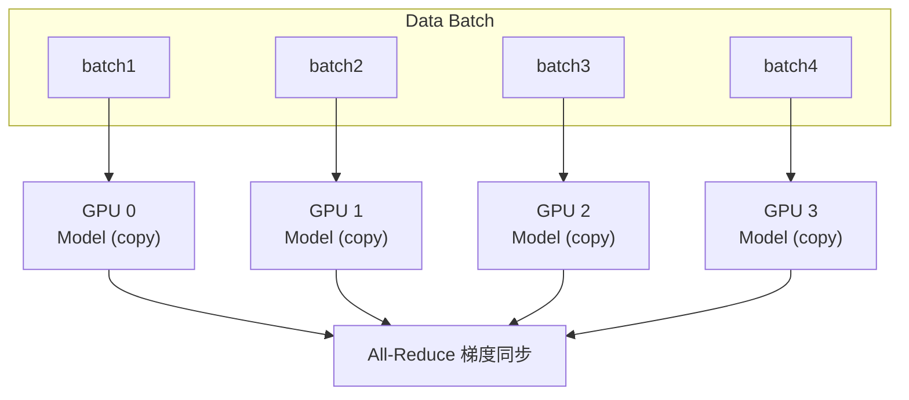
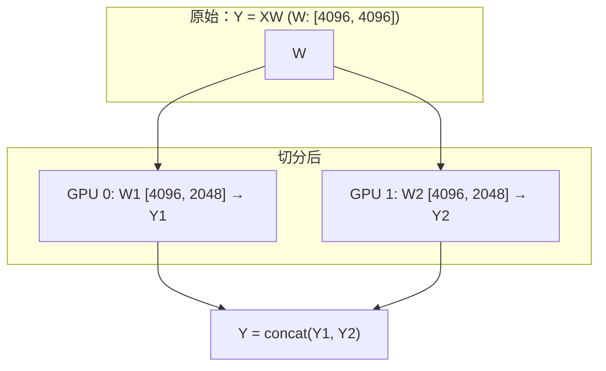
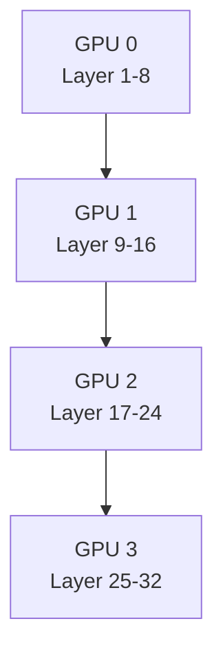
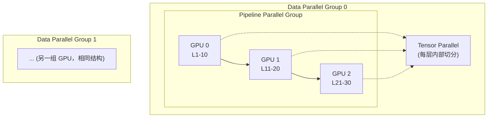
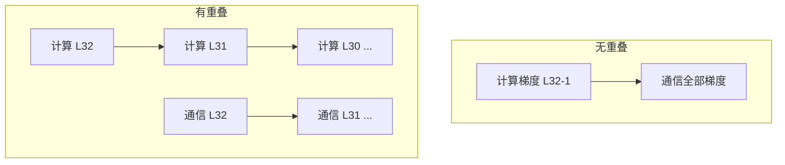

+++
title = "14.分布式训练优化详解"
date = 2025-01-15
description = "大规模分布式训练技术：数据并行、模型并行、流水线并行、ZeRO优化"
[taxonomies]
tags = ["ai", "distributed-training", "deepspeed", "fsdp", "parallelism", "optimization"]
+++

## 概述

训练大模型需要分布式训练技术。本文介绍主流的并行策略和优化技术。

---

## 一、为什么需要分布式训练

**分布式训练的必要性：**

| 挑战 | 说明 |
|------|------|
| **单卡限制** | GPU 显存有限（A100: 80GB）；大模型无法放入单卡；训练时间过长 |
| **模型规模** | GPT-3: 175B 参数 → FP16 存储: 350GB → 训练中间态: ~2TB+ → 需要几十到上百张 GPU |
| **分布式目标** | 训练更大的模型；加速训练过程；高效利用硬件 |

---

## 二、并行策略

### 2.1 数据并行（Data Parallelism）

**数据并行原理：**
- 每个 GPU 持有完整模型副本
- 数据分片，每个 GPU 处理不同数据
- 梯度同步后更新模型



**优点**：实现简单，扩展性好  
**缺点**：每卡需要放下完整模型

```python
# PyTorch DDP 数据并行
import torch.distributed as dist
from torch.nn.parallel import DistributedDataParallel as DDP

# 初始化
dist.init_process_group(backend='nccl')
local_rank = int(os.environ['LOCAL_RANK'])
torch.cuda.set_device(local_rank)

# 模型包装
model = MyModel().cuda()
model = DDP(model, device_ids=[local_rank])

# 数据加载器
sampler = DistributedSampler(dataset)
dataloader = DataLoader(dataset, sampler=sampler)

# 训练循环正常进行
for batch in dataloader:
    loss = model(batch)
    loss.backward()
    optimizer.step()
```

### 2.2 模型并行（Model Parallelism）

**模型并行：**

**张量并行（Tensor Parallelism）**

切分单个层的权重矩阵到多个 GPU



- **优点**：可训练超大层
- **缺点**：通信开销大，需要特殊实现

---

**流水线并行（Pipeline Parallelism）**

按层切分模型到不同 GPU：



使用微批次（micro-batch）提高并行度，减少流水线气泡（bubble）

- **优点**：每卡显存需求低
- **缺点**：存在流水线气泡

### 2.3 3D 并行

**3D 并行：组合多种并行策略**



**组合策略：**
- DP × PP × TP = 总 GPU 数
- 例：8 × 4 × 8 = 256 GPUs

---

## 三、ZeRO 优化

### 3.1 ZeRO 原理

**ZeRO（Zero Redundancy Optimizer）：**

**问题：数据并行中每个 GPU 存储完整模型状态**
- 模型参数：Φ
- 梯度：Φ
- 优化器状态：2Φ（Adam）
- 总计：4Φ（更多with混合精度）

**ZeRO 解决方案：分片存储**

| 阶段 | 分片内容 | 显存节省 |
|------|----------|----------|
| ZeRO-1 | 优化器状态 | ~4x |
| ZeRO-2 | 优化器状态 + 梯度 | ~8x |
| ZeRO-3 | 优化器状态 + 梯度 + 参数 | 与 GPU 数成正比（通信开销最大） |

### 3.2 DeepSpeed 使用

```python
# DeepSpeed 配置文件 ds_config.json
{
    "train_batch_size": 32,
    "gradient_accumulation_steps": 4,
    "fp16": {
        "enabled": true,
        "loss_scale": 0,
        "initial_scale_power": 16
    },
    "zero_optimization": {
        "stage": 2,
        "offload_optimizer": {
            "device": "cpu",
            "pin_memory": true
        },
        "allgather_partitions": true,
        "allgather_bucket_size": 2e8,
        "reduce_scatter": true,
        "reduce_bucket_size": 2e8
    }
}
```

```python
# 使用 DeepSpeed
import deepspeed

model, optimizer, _, _ = deepspeed.initialize(
    model=model,
    model_parameters=model.parameters(),
    config=ds_config
)

# 训练
for batch in dataloader:
    loss = model(batch)
    model.backward(loss)
    model.step()
```

### 3.3 FSDP（PyTorch 原生）

```python
# PyTorch FSDP
from torch.distributed.fsdp import (
    FullyShardedDataParallel as FSDP,
    MixedPrecision,
    ShardingStrategy,
)

# 配置
mp_policy = MixedPrecision(
    param_dtype=torch.float16,
    reduce_dtype=torch.float16,
    buffer_dtype=torch.float16,
)

# 包装模型
model = FSDP(
    model,
    sharding_strategy=ShardingStrategy.FULL_SHARD,  # 类似 ZeRO-3
    mixed_precision=mp_policy,
    device_id=torch.cuda.current_device(),
)

# 正常训练
for batch in dataloader:
    loss = model(batch)
    loss.backward()
    optimizer.step()
```

---

## 四、通信优化

### 4.1 通信原语

**分布式通信原语：**

| 原语 | 说明 | 用途 |
|------|------|------|
| All-Reduce | 所有节点聚合结果，结果广播给所有节点 | 梯度同步 |
| Reduce-Scatter | 聚合后分片，每节点得到一部分 | ZeRO 梯度分片 |
| All-Gather | 收集所有节点的分片，组合成完整数据 | ZeRO-3 参数重建 |

**通信后端：**
- **NCCL**：NVIDIA GPU 首选
- **Gloo**：CPU 或跨厂商

### 4.2 通信-计算重叠

**通信优化技术：**

| 技术 | 说明 |
|------|------|
| 梯度分桶（Gradient Bucketing） | 多个小张量合并后通信，减少通信次数 |
| 通信计算重叠 | 边计算边通信，反向传播时同时同步已计算的梯度 |

**时间线示意：**



---

## 五、混合精度训练

**混合精度训练：**

**原理：**
- 前向/反向用 FP16（快，省显存）
- 权重主副本用 FP32（精度保证）
- 损失缩放防止梯度下溢

**收益：**
- 显存减半
- Tensor Core 加速（2-4x）
- 精度基本无损

**实现（PyTorch AMP）：**

```python
scaler = torch.cuda.amp.GradScaler()

with torch.cuda.amp.autocast():
    output = model(input)
    loss = criterion(output, target)

scaler.scale(loss).backward()
scaler.step(optimizer)
scaler.update()
```

---

## 六、总结

**分布式训练要点：**

| 类别 | 要点 |
|------|------|
| **并行策略选择** | 模型能放单卡：数据并行；单层太大：张量并行；层数太多：流水线并行；超大模型：3D 并行 |
| **显存优化** | 混合精度必用；ZeRO-2/3 分片状态；梯度检查点；Offload to CPU |
| **框架选择** | DeepSpeed：功能全面；FSDP：PyTorch 原生；Megatron-LM：超大模型 |

> **"分布式训练的艺术在于在通信、计算、内存间找到最优平衡。"**

---

## 相关文章

- [上一篇：AI高级知识与技能详解](/articles/ai/ai-13-AI高级知识与技能详解/)
- [下一篇：模型压缩与裁剪技术详解](/articles/ai/ai-15-模型压缩与裁剪技术详解/)
