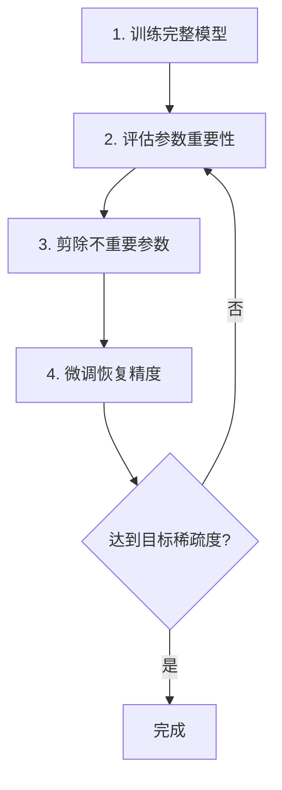
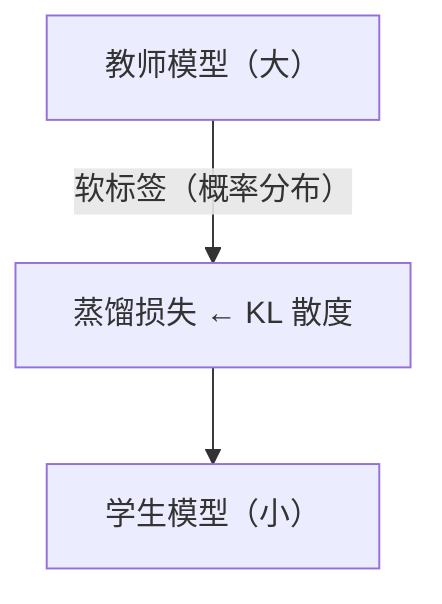
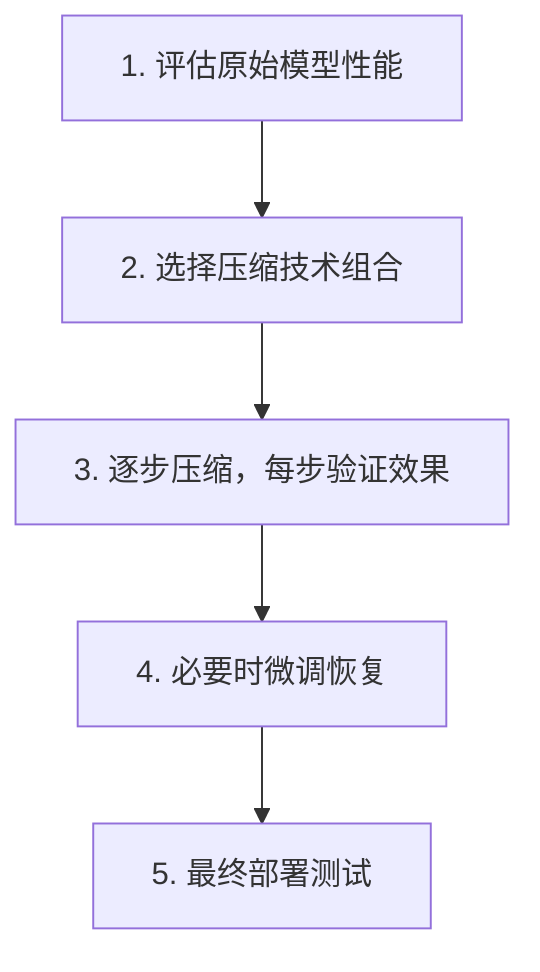

+++
title = "15.模型压缩与裁剪技术详解"
date = 2025-01-15
description = "大模型压缩技术全面解析：量化、剪枝、知识蒸馏、低秩分解，让模型更小更快"
[taxonomies]
tags = ["ai", "compression", "quantization", "pruning", "distillation", "optimization"]
+++

## 概述

随着大模型参数量激增（GPT-4 估计超过万亿参数），模型压缩成为部署的关键技术。本文系统介绍各种模型压缩技术及其实践方法。

---

## 一、为什么需要模型压缩

### 1.1 大模型的挑战

**大模型部署面临的问题：**

| 挑战 | 说明 |
|------|------|
| **内存占用** | LLaMA-70B：~140GB（FP16）；需要多张 GPU 才能加载；边缘设备无法部署 |
| **计算成本** | 推理延迟高；能耗大；服务成本高 |
| **部署限制** | 手机/IoT 设备资源有限；云端推理成本高；实时应用延迟要求 |

**目标：** 在尽量保持精度的前提下，减小模型大小、加快推理速度、降低资源消耗

### 1.2 压缩技术概览

**模型压缩技术分类：**

| 技术 | 说明 |
|------|------|
| **量化 (Quantization)** | 降低数值精度（FP32→INT8/INT4），减少内存、加速计算 |
| **剪枝 (Pruning)** | 移除不重要的参数/结构，稀疏化模型 |
| **知识蒸馏 (Distillation)** | 用大模型训练小模型，小模型学习大模型的行为 |
| **低秩分解 (Low-Rank)** | 分解权重矩阵，减少参数量 |
| **权重共享** | 多层共享同一权重，减少参数存储 |

---

## 二、量化（Quantization）

### 2.1 量化基础

**量化原理：**

本质：用更少的位数表示数值

**精度类型：**

| 类型 | 说明 |
|------|------|
| FP32 | 32位浮点（标准训练精度） |
| FP16 | 16位浮点（半精度） |
| BF16 | 16位脑浮点（更大动态范围） |
| INT8 | 8位整数 |
| INT4 | 4位整数 |
| INT2/Binary | 极端压缩 |

**压缩效果：**
- FP32 → FP16：模型大小减半
- FP32 → INT8：模型大小 1/4
- FP32 → INT4：模型大小 1/8

**量化公式：**
- 量化：`q = round(x / scale + zero_point)`
- 反量化：`x ≈ (q - zero_point) × scale`

### 2.2 量化方法分类

**量化方法：**

| 方法 | 说明 |
|------|------|
| **训练后量化 (PTQ)** | 不需要重新训练；使用校准数据集确定量化参数；简单快速；精度损失可能较大 |
| **量化感知训练 (QAT)** | 训练时模拟量化误差；模型学会适应量化；精度损失小；需要重新训练 |

**动态量化 vs 静态量化：**
- **动态**：推理时动态确定量化范围
- **静态**：提前确定量化范围

### 2.3 LLM 量化实践

```python
# 使用 bitsandbytes 进行 4-bit 量化
from transformers import AutoModelForCausalLM, BitsAndBytesConfig

quantization_config = BitsAndBytesConfig(
    load_in_4bit=True,
    bnb_4bit_quant_type="nf4",  # NormalFloat4
    bnb_4bit_compute_dtype=torch.float16,
    bnb_4bit_use_double_quant=True,  # 双重量化
)

model = AutoModelForCausalLM.from_pretrained(
    "meta-llama/Llama-2-7b-hf",
    quantization_config=quantization_config,
    device_map="auto"
)

# 模型大小对比
# FP16: ~14GB
# 4-bit: ~4GB
```

**LLM 量化常用工具：**

| 工具 | 特点 |
|------|------|
| bitsandbytes | HuggingFace 集成，易用 |
| GPTQ | 4-bit 量化，精度好 |
| AWQ | 激活感知量化，效果优秀 |
| GGML/GGUF | llama.cpp 使用，CPU 友好 |
| ExLlama | 高性能 GPU 推理 |

### 2.4 量化精度损失

**量化精度影响：**

| 精度 | 损失程度 |
|------|----------|
| FP16 | 几乎无损 |
| INT8 | 轻微损失（<1%） |
| INT4 | 有损失（1-5%），需要好的量化算法 |
| INT2 | 损失较大，需要特殊技术 |

**影响因素：**
- 模型大小：大模型对量化更鲁棒
- 量化算法：AWQ/GPTQ 比朴素量化好
- 任务类型：有些任务对精度更敏感

**实践建议：**
- 7B 以上模型可以用 4-bit
- 小模型谨慎量化
- 关键任务用 8-bit 或更高
- 一定要测试量化后的效果

---

## 三、剪枝（Pruning）

### 3.1 剪枝基础

**剪枝原理：**

核心思想：移除"不重要"的参数

**为什么可行：**
- 神经网络通常过参数化
- 很多参数接近零或冗余
- 移除后对输出影响小

**剪枝类型：**

| 类型 | 说明 |
|------|------|
| **非结构化剪枝 (Unstructured)** | 移除单个权重（置零）；产生稀疏矩阵；压缩率高，但加速需要特殊硬件 |
| **结构化剪枝 (Structured)** | 移除整个通道/层/头；保持规则结构；直接加速，无需特殊硬件 |

### 3.2 剪枝方法

**剪枝策略：**

**重要性评估方法：**

| 方法 | 说明 |
|------|------|
| **基于幅度 (Magnitude-based)** | 移除绝对值小的权重；简单有效；\|w\| < threshold → 剪除 |
| **基于梯度 (Gradient-based)** | 考虑权重对损失的影响；重要性 = \|w × ∂L/∂w\| |
| **基于 Hessian** | 考虑二阶信息；更准确但计算量大 |

**剪枝流程：**



### 3.3 LLM 剪枝

```python
# 使用 SparseGPT 进行 LLM 剪枝（概念示例）
from transformers import AutoModelForCausalLM
import torch

def magnitude_pruning(model, sparsity=0.5):
    """
    简单的幅度剪枝
    sparsity: 要剪除的权重比例
    """
    for name, param in model.named_parameters():
        if 'weight' in name and param.dim() >= 2:
            # 计算阈值
            threshold = torch.quantile(
                param.abs().flatten(), 
                sparsity
            )
            # 创建掩码
            mask = param.abs() >= threshold
            # 应用剪枝
            param.data *= mask.float()
    
    return model

# LLM 剪枝工具
# - SparseGPT: https://github.com/IST-DASLab/sparsegpt
# - Wanda: https://github.com/locuslab/wanda
# - LLM-Pruner: https://github.com/horseee/LLM-Pruner
```

**LLM 剪枝注意事项：**

**挑战：**
- LLM 对剪枝更敏感
- 注意力层和 FFN 层重要性不同
- 需要保留关键能力

**实践建议：**
- 使用专门的 LLM 剪枝工具（SparseGPT, Wanda）
- 50% 稀疏度通常可接受
- 结合量化效果更好
- 剪枝后需要充分评估

---

## 四、知识蒸馏（Knowledge Distillation）

### 4.1 蒸馏原理

**知识蒸馏：**

**核心思想：**
- 用大模型（教师）指导小模型（学生）训练
- 学生学习教师的输出分布，而非硬标签

**架构：**



**损失函数：**
- `L = α × L_soft + (1-α) × L_hard`
- `L_soft = KL(softmax(t_logits/T), softmax(s_logits/T))`
- `L_hard = CrossEntropy(s_logits, labels)`
- `T = 温度参数（T > 1 使分布更平滑）`

### 4.2 蒸馏实现

```python
import torch
import torch.nn.functional as F

def distillation_loss(student_logits, teacher_logits, labels, 
                      temperature=4.0, alpha=0.5):
    """
    知识蒸馏损失
    """
    # 软标签损失
    soft_targets = F.softmax(teacher_logits / temperature, dim=-1)
    soft_loss = F.kl_div(
        F.log_softmax(student_logits / temperature, dim=-1),
        soft_targets,
        reduction='batchmean'
    ) * (temperature ** 2)
    
    # 硬标签损失
    hard_loss = F.cross_entropy(student_logits, labels)
    
    # 组合
    loss = alpha * soft_loss + (1 - alpha) * hard_loss
    return loss


# LLM 蒸馏训练循环
def train_distillation(teacher, student, dataloader, optimizer):
    teacher.eval()
    student.train()
    
    for batch in dataloader:
        input_ids = batch['input_ids']
        labels = batch['labels']
        
        with torch.no_grad():
            teacher_outputs = teacher(input_ids)
        
        student_outputs = student(input_ids)
        
        loss = distillation_loss(
            student_outputs.logits,
            teacher_outputs.logits,
            labels
        )
        
        optimizer.zero_grad()
        loss.backward()
        optimizer.step()
```

### 4.3 LLM 蒸馏案例

**LLM 蒸馏成功案例：**

| 模型 | 说明 |
|------|------|
| **DistilBERT** | 教师：BERT-base（110M）；学生：DistilBERT（66M）；效果：保留 97% 性能，快 60% |
| **TinyLLaMA** | 基于 LLaMA 架构的小模型；1.1B 参数，3T tokens 训练 |
| **Phi 系列（Microsoft）** | 小而强的模型；使用高质量数据 + 蒸馏 |
| **Mistral 7B** | 7B 参数超越 LLaMA-13B；高效架构 + 训练优化 |

---

## 五、低秩分解（Low-Rank Factorization）

### 5.1 低秩分解原理

**低秩分解：**

**原理：**
- 将大矩阵分解为两个小矩阵的乘积
- `W (m×n) ≈ A (m×r) × B (r×n)`，其中 `r << min(m,n)`

**参数量变化：**
- 原始：`m × n`
- 分解后：`m × r + r × n = r × (m + n)`
- 当 `r << m, n` 时，大幅减少参数

**示例：**
- 原始矩阵：4096 × 4096 = 16.7M 参数
- r = 256：4096 × 256 + 256 × 4096 = 2.1M 参数
- 压缩率：约 8 倍

### 5.2 LoRA（Low-Rank Adaptation）

**LoRA：高效微调 + 压缩**

**思想：**
- 冻结原始权重，只训练低秩增量
- `W' = W + ΔW = W + BA`

**优点：**
- 训练参数量极小（< 1% 原模型）
- 推理时可合并，无额外延迟
- 多个 LoRA 可切换/组合

**典型配置：**
- rank r = 8-64
- 应用于 attention 层的 q, k, v, o 投影

**代码示例：**
```python
from peft import LoraConfig, get_peft_model

lora_config = LoraConfig(
    r=16,                     # 秩
    lora_alpha=32,            # 缩放因子
    target_modules=["q_proj", "v_proj"],  # 应用 LoRA 的层
    lora_dropout=0.05,
    task_type="CAUSAL_LM"
)

model = get_peft_model(base_model, lora_config)

# 查看可训练参数
trainable_params = sum(p.numel() for p in model.parameters() if p.requires_grad)
total_params = sum(p.numel() for p in model.parameters())
print(f"Trainable: {trainable_params / total_params:.2%}")
# 通常 < 1%
```

---

## 六、综合压缩策略

### 6.1 技术组合

**压缩技术组合：**

| 组合 | 说明 |
|------|------|
| **量化 + 剪枝** | 先剪枝减少参数，再量化减少精度 → 压缩效果叠加 |
| **蒸馏 + 量化** | 蒸馏得到小模型，再量化部署 → 模型架构更优，量化损失更小 |
| **LoRA + 量化** | 4-bit 量化基座 + LoRA 微调 → 极低资源微调大模型 |

**推荐流程：**



### 6.2 压缩效果参考

**压缩效果对比（以 LLaMA-7B 为例）：**

| 方法 | 模型大小 | 推理速度 | 精度损失 |
|------|----------|----------|----------|
| 原始 (FP16) | 14 GB | 1x | 基准 |
| INT8 量化 | 7 GB | 1.5-2x | < 1% |
| INT4 量化 | 4 GB | 2-3x | 1-3% |
| 50% 剪枝 | 7 GB | ~1.5x | 2-5% |
| 4-bit + 50%剪枝 | 2 GB | 3-4x | 3-7% |

*具体数值取决于量化方法、任务和实现*

---

## 七、总结

**模型压缩核心要点：**

| 技术 | 要点 |
|------|------|
| **量化** | 最常用的压缩技术；4-bit/8-bit 适合大多数场景；AWQ/GPTQ 精度最好 |
| **剪枝** | 移除冗余参数；结构化剪枝易于加速；LLM 需要专门的剪枝方法 |
| **蒸馏** | 训练高效小模型；适合有训练资源的场景 |
| **低秩分解** | LoRA 用于高效微调；减少训练和存储成本 |

> **"压缩不是目的，在约束下保持能力才是目的。"**

---

## 相关文章

- [上一篇：分布式训练优化详解](/articles/ai/ai-14-分布式训练优化详解/)
- [下一篇：推理框架优化技术详解](/articles/ai/ai-16-推理框架优化技术详解/)
