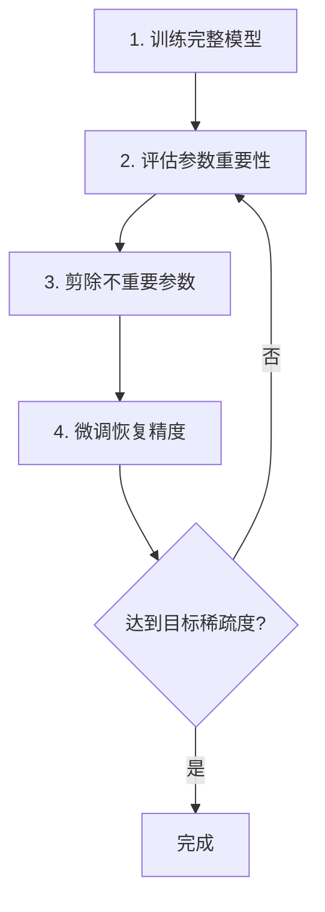
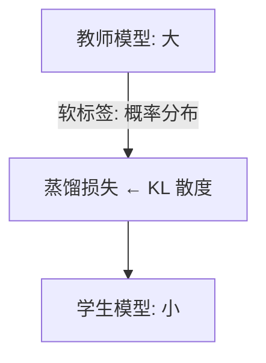
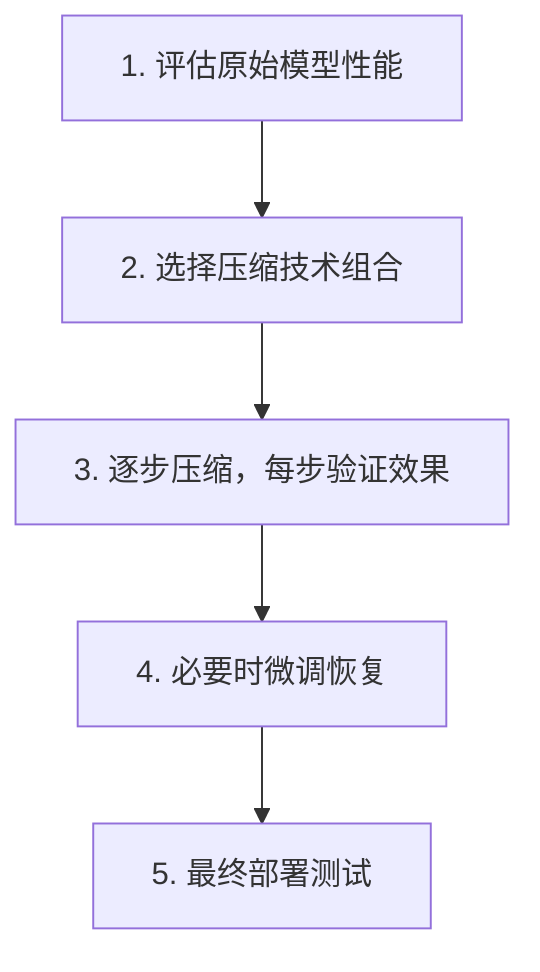

+++
title = "15. 模型压缩与裁剪技术详解"
date = 2025-01-15
weight = 15000
description = "大模型压缩技术全面解析：量化、剪枝、知识蒸馏、低秩分解，让模型更小更快"
[taxonomies]
tags = ["ai", "compression", "quantization", "pruning", "distillation", "optimization"]
+++

## 概述

随着大模型参数量激增（GPT-4 估计超过万亿参数），模型压缩成为部署的关键技术。本文系统介绍各种模型压缩技术及其实践方法。

---

## 一、为什么需要模型压缩

### 1.1 大模型的挑战

**大模型部署面临的问题：**

| 挑战 | 说明 |
|------|------|
| **内存占用** | LLaMA-70B：~140GB（FP16）；需要多张 GPU 才能加载；边缘设备无法部署 |
| **计算成本** | 推理延迟高；能耗大；服务成本高 |
| **部署限制** | 手机/IoT 设备资源有限；云端推理成本高；实时应用延迟要求 |

**目标：** 在尽量保持精度的前提下，减小模型大小、加快推理速度、降低资源消耗

### 1.2 压缩技术概览

**模型压缩技术分类：**

| 技术 | 说明 |
|------|------|
| **量化 (Quantization)** | 降低数值精度（FP32→INT8/INT4），减少内存、加速计算 |
| **剪枝 (Pruning)** | 移除不重要的参数/结构，稀疏化模型 |
| **知识蒸馏 (Distillation)** | 用大模型训练小模型，小模型学习大模型的行为 |
| **低秩分解 (Low-Rank)** | 分解权重矩阵，减少参数量 |
| **权重共享** | 多层共享同一权重，减少参数存储 |

---

## 二、量化（Quantization）

### 2.1 量化基础

**量化原理：**

本质：用更少的位数表示数值

**精度类型：**

| 类型 | 说明 |
|------|------|
| FP32 | 32位浮点（标准训练精度） |
| FP16 | 16位浮点（半精度） |
| BF16 | 16位脑浮点（更大动态范围） |
| INT8 | 8位整数 |
| INT4 | 4位整数 |
| INT2/Binary | 极端压缩 |

**压缩效果：**
- FP32 → FP16：模型大小减半
- FP32 → INT8：模型大小 1/4
- FP32 → INT4：模型大小 1/8

**量化公式：**
- 量化：`q = round(x / scale + zero_point)`
- 反量化：`x ≈ (q - zero_point) × scale`

### 2.2 量化方法分类

**量化方法：**

| 方法 | 说明 |
|------|------|
| **训练后量化 (PTQ)** | 不需要重新训练；使用校准数据集确定量化参数；简单快速；精度损失可能较大 |
| **量化感知训练 (QAT)** | 训练时模拟量化误差；模型学会适应量化；精度损失小；需要重新训练 |

**动态量化 vs 静态量化：**
- **动态**：推理时动态确定量化范围
- **静态**：提前确定量化范围

### 2.3 LLM 量化实践

```python
# 使用 bitsandbytes 进行 4-bit 量化
from transformers import AutoModelForCausalLM, BitsAndBytesConfig

quantization_config = BitsAndBytesConfig(
    load_in_4bit=True,
    bnb_4bit_quant_type="nf4",  # NormalFloat4
    bnb_4bit_compute_dtype=torch.float16,
    bnb_4bit_use_double_quant=True,  # 双重量化
)

model = AutoModelForCausalLM.from_pretrained(
    "meta-llama/Llama-2-7b-hf",
    quantization_config=quantization_config,
    device_map="auto"
)

# 模型大小对比
# FP16: ~14GB
# 4-bit: ~4GB
```

**LLM 量化常用工具：**

| 工具 | 特点 |
|------|------|
| bitsandbytes | HuggingFace 集成，易用 |
| GPTQ | 4-bit 量化，精度好 |
| AWQ | 激活感知量化，效果优秀 |
| GGML/GGUF | llama.cpp 使用，CPU 友好 |
| ExLlama | 高性能 GPU 推理 |

### 2.4 量化精度损失

**量化精度影响：**

| 精度 | 损失程度 |
|------|----------|
| FP16 | 几乎无损 |
| INT8 | 轻微损失（<1%） |
| INT4 | 有损失（1-5%），需要好的量化算法 |
| INT2 | 损失较大，需要特殊技术 |

**影响因素：**
- 模型大小：大模型对量化更鲁棒
- 量化算法：AWQ/GPTQ 比朴素量化好
- 任务类型：有些任务对精度更敏感

**实践建议：**
- 7B 以上模型可以用 4-bit
- 小模型谨慎量化
- 关键任务用 8-bit 或更高
- 一定要测试量化后的效果

### 2.5 W4A16 详解 (Weight 4-bit, Activation 16-bit)

W4A16 是当前 LLM 推理量化的**主流方案**。含义：**权重 (Weight) 存储为 INT4/FP4，激活 (Activation) 保持 FP16/BF16**。

#### 为什么权重和激活用不同精度？

```
权重（Weight）：
  - 训练结束后固定不变 → 可以离线精心量化
  - 数值分布相对稳定 → 量化误差可控
  - 占模型体积的绝大部分 → 压缩权重收益最大

激活（Activation）：
  - 每次推理都不同（取决于输入）→ 无法提前量化
  - 数值范围波动大（含 outlier）→ 量化误差大
  - 只在推理过程中临时存在 → 压缩收益有限

结论：量化权重、保留激活精度 = 最佳性价比
```

#### W4A16 推理流程

```
推理时每一层的计算：

1. 从显存加载 INT4 权重（体积仅 FP16 的 1/4）
2. 在 GPU 上将 INT4 权重 dequantize（反量化）为 FP16
3. 用 FP16 Tensor Core 执行 GEMM：activation(FP16) × weight(FP16) → output(FP16)
4. dequantize 在 kernel 内完成，不需要额外显存

              显存                     GPU SM
   ┌──────────────┐       ┌──────────────────────┐
   │ W_int4 (4bit)│──读取→│ dequant → W_fp16     │
   │              │       │ A_fp16 × W_fp16      │
   │ A_fp16       │──读取→│ → O_fp16             │
   └──────────────┘       └──────────────────────┘

性能收益：
  - 显存占用：70B 模型从 ~140GB → ~35GB（可放入 1 张 A100 80GB）
  - 推理速度：LLM decode 是 memory-bound → 读取权重量减少 4x → 速度提升 ~2-3x
```

#### Group Quantization（分组量化）

直接对整个权重矩阵用一个 scale+zero_point 量化（per-tensor）精度太差。**分组量化**是 INT4 精度的关键：

```
Per-tensor 量化（粗粒度，精度差）：
  整个权重矩阵共享 1 组 (scale, zero_point)
  → 数值范围差异大的区域被严重压缩

Per-channel 量化（按输出通道）：
  每个输出通道 1 组 (scale, zero_point)
  → 较好，但 INT4 下仍不够

Per-group 量化（最常用）：
  每 group_size 个连续权重共享 1 组 (scale, zero_point)
  典型 group_size = 32 / 64 / 128

  例：权重矩阵 [4096, 4096]，group_size=128
  → 每行 4096/128 = 32 组
  → 总共 4096 × 32 = 131072 组 (scale, zero_point)
  → 额外存储：131072 × 2 × 2 bytes ≈ 0.5 MB（可忽略）
```

```python
# Group quantization 伪代码
def quantize_group(weight, group_size=128, bits=4):
    """对权重进行分组量化"""
    rows, cols = weight.shape
    assert cols % group_size == 0
    
    # 重塑为 groups
    weight_groups = weight.reshape(rows, cols // group_size, group_size)
    
    # 每组计算 scale 和 zero_point
    max_val = weight_groups.max(dim=-1, keepdim=True).values
    min_val = weight_groups.min(dim=-1, keepdim=True).values
    
    qmax = 2**bits - 1  # INT4: 15
    scale = (max_val - min_val) / qmax
    zero_point = (-min_val / scale).round().clamp(0, qmax)
    
    # 量化
    weight_int = ((weight_groups - min_val) / scale).round().clamp(0, qmax).to(torch.uint8)
    
    return weight_int, scale.squeeze(-1), zero_point.squeeze(-1)

def dequantize_group(weight_int, scale, zero_point, group_size=128):
    """反量化（推理时在 kernel 内执行）"""
    weight_float = (weight_int.float() - zero_point.unsqueeze(-1)) * scale.unsqueeze(-1)
    return weight_float.reshape(weight_float.shape[0], -1)
```

**Group size 的影响**：

| Group Size | 精度 | 额外存储 | 说明 |
|-----------|------|---------|------|
| 32 | 最好 | ~3.2% overhead | 精度接近 FP16，但存储/计算开销略高 |
| 64 | 好 | ~1.6% overhead | 好的平衡点 |
| 128 | 中等 | ~0.8% overhead | GPTQ/AWQ 默认值，最常用 |
| 256+ | 较差 | <0.4% overhead | 不推荐，精度下降明显 |

### 2.6 GPTQ vs AWQ vs GGUF 实现细节

#### 2.6.1 GPTQ (GPT Quantization)

**核心思想**：逐层量化，利用二阶信息（Hessian 矩阵）最小化量化误差。

```
GPTQ 基于 Optimal Brain Quantizer (OBQ) 理论：

1. 对每一层的权重矩阵 W，收集该层的输入激活 X（用 ~128 条校准数据）
2. 计算 Hessian 近似：H = 2 · X^T · X
3. 逐列量化权重：
   - 量化第 i 列的权重 w_i → q_i
   - 量化误差 δ_i = w_i - q_i
   - 利用 Hessian 信息，将误差"补偿"到尚未量化的列：
     w_j += -δ_i · H_{ij} / H_{jj}  （对所有 j > i）
   - 这样后续列的量化会"纠正"前面列的量化误差
4. 对所有层重复

关键：Hessian 补偿使得量化误差在整层范围内最小化，而非逐个权重独立量化
```

```python
# GPTQ 量化流程（使用 auto-gptq）
from auto_gptq import AutoGPTQForCausalLM, BaseQuantizeConfig

quantize_config = BaseQuantizeConfig(
    bits=4,              # INT4
    group_size=128,      # 分组大小
    desc_act=True,       # 激活降序排列（先量化对输出影响小的列）
    damp_percent=0.01,   # Hessian 对角线阻尼（数值稳定性）
)

model = AutoGPTQForCausalLM.from_pretrained(
    "meta-llama/Llama-2-7b-hf",
    quantize_config=quantize_config
)

# 使用校准数据进行量化（通常 128 条即可）
model.quantize(calibration_dataset)

# 保存量化模型
model.save_quantized("llama-2-7b-gptq-int4")
```

**GPTQ 优缺点**：
- 优势：精度在 INT4 中最好（Hessian 补偿）；一次量化，推理时无额外开销
- 劣势：量化过程慢（70B 模型 ~4-8 小时）；需要校准数据；对校准数据分布敏感

#### 2.6.2 AWQ (Activation-Aware Weight Quantization)

**核心思想**：不是所有权重同等重要——那些对应激活值大的通道（"salient channels"）对输出影响更大，应该被保护。

```
AWQ 的核心观察：

权重矩阵中，某些通道（列）对应的输入激活值特别大
→ 这些通道的量化误差会被激活值放大
→ 应该优先保护这些"重要通道"

AWQ 的做法：
1. 用校准数据统计每个通道的平均激活值 |x_j|
2. 对重要通道（激活值大的）乘以 scale s_j > 1 → 放大权重
3. 对对应的激活除以 s_j → 保持数学等价
4. 放大后的权重在量化时拥有更大的"数值范围占比" → 量化误差更小

数学等价：
  原始：y = x · W
  AWQ：  y = (x / s) · (W · s)  （数学上完全相同）
  但 (W · s) 中重要通道被放大 → 量化时这些通道的相对误差更小
```

```python
# AWQ 量化（使用 autoawq）
from awq import AutoAWQForCausalLM

model = AutoAWQForCausalLM.from_pretrained(
    "meta-llama/Llama-2-7b-hf"
)

# AWQ 量化
model.quantize(
    tokenizer,
    quant_config={
        "zero_point": True,    # 非对称量化
        "q_group_size": 128,   # 分组大小
        "w_bit": 4,            # INT4
        "version": "GEMM",     # GEMM kernel（也可选 GEMV）
    },
    calib_data="pileval",      # 校准数据集
    calib_nsamples=128,
    calib_seqlen=512,
)

model.save_quantized("llama-2-7b-awq-int4")
```

**AWQ vs GPTQ 对比**：

| 维度 | GPTQ | AWQ |
|------|------|-----|
| 量化速度 | 慢（逐列+Hessian） | **快**（只算 scale，~10 分钟） |
| 精度 (Perplexity) | 略好 | 接近 |
| 校准数据依赖 | 较高 | 较低 |
| 推理速度 | 快 | **更快**（kernel 更优化） |
| 显存效率 | 相同 | 相同 |
| 框架支持 | 广泛 | vLLM/TRT-LLM 原生支持 |

#### 2.6.3 GGUF/GGML (llama.cpp)

**核心特点**：为 **CPU 推理** 优化的量化格式，支持混合精度。

```
GGUF 量化格式：
  - 采用 block quantization：每 32 个权重一组
  - 每组存储 scale（FP16）+ 量化后的权重（INT4/INT5/INT6/INT8）
  - 不同层可以用不同精度 → "混合量化"

常见格式：
  Q4_0:   4-bit 均匀量化，每 32 权重一组
  Q4_1:   4-bit 非对称量化（有 zero_point）
  Q4_K_M: 4-bit K-quant medium（attention 层用更高精度）
  Q5_K_M: 5-bit K-quant medium
  Q8_0:   8-bit 量化

"K-quant"：关键层（attention QKV/output）用更高精度，
           FFN 层用更低精度 → 精度更好
```

**GGUF 混合量化策略**（以 Q4_K_M 为例）：

| 层类型 | 精度 | 原因 |
|--------|------|------|
| Attention QKV projection | Q6_K (6-bit) | 对精度最敏感 |
| Attention output | Q6_K (6-bit) | 对精度敏感 |
| FFN gate/up | Q4_K (4-bit) | 参数量大，精度不太敏感 |
| FFN down | Q6_K (6-bit) | 输出直接进 residual，较敏感 |
| Embedding | Q6_K (6-bit) | 首层，影响全局 |
| Output head | Q6_K (6-bit) | 末层，影响输出 |

```bash
# 使用 llama.cpp 量化
./quantize ./models/llama-7b-f16.gguf ./models/llama-7b-q4_k_m.gguf Q4_K_M

# 量化后模型大小对比（LLaMA 7B）
# F16:    13.5 GB
# Q8_0:    7.2 GB
# Q5_K_M:  4.8 GB
# Q4_K_M:  4.1 GB
# Q4_0:    3.8 GB
# Q2_K:    2.7 GB
```

### 2.7 FP8 量化详解 (Hopper/Blackwell)

FP8 是 NVIDIA Hopper (H100) 引入的新数据格式，Blackwell (B200) 进一步引入了 FP4。

#### FP8 两种格式

```
E4M3（4 位指数 + 3 位尾数 + 1 位符号）：
  范围：±448
  精度：~3-4 位有效十进制数字
  用途：权重和前向激活

E5M2（5 位指数 + 2 位尾数 + 1 位符号）：
  范围：±57344
  精度：~2-3 位有效十进制数字
  用途：反向传播梯度（需要更大范围）

对比：
  FP16:  1 + 5 + 10 = 16 bits  → 范围 ±65504, 精度高
  BF16:  1 + 8 + 7  = 16 bits  → 范围 ±3.4e38, 精度中
  FP8:   1 + 4 + 3  = 8 bits   → 范围 ±448, 精度低但吞吐 2x
```

#### Transformer Engine 的动态 FP8 量化

```
Transformer Engine 工作流程（逐层、逐张量）：

1. 前向传播时：
   - 统计每个张量（权重/激活）的 amax = max(|tensor|)
   - 计算 scale factor = FP8_MAX / amax  （将数值范围映射到 FP8 可表示范围）
   - 将张量乘以 scale → 量化为 FP8
   - FP8 × FP8 在 Tensor Core 计算 → FP32 累加
   - 结果反量化回 FP16/BF16

2. Scale 的"延迟更新"策略：
   - 不是当前 iteration 计算 amax 后立即用
   - 而是用前几个 iteration 的 amax history 来估计当前的 scale
   - 避免额外的全局 reduce 同步开销
   - 如果 amax 突变，可能导致 1-2 个 iteration 的精度下降

3. 自动回退：
   - 如果某层的数值分布不适合 FP8（如溢出频率 > 阈值）
   - Transformer Engine 自动回退到 FP16/BF16
   - 保证训练稳定性
```

#### SmoothQuant

**核心问题**：激活中存在 outlier（少数通道的激活值远大于其他通道），直接量化激活精度损失大。

```
SmoothQuant 核心思想：将量化难度从激活转移到权重

原始：Y = X · W
  X 有 outlier（某些通道值 >> 其他通道）→ 激活量化难
  W 相对均匀 → 权重量化容易

SmoothQuant：
  引入 per-channel smoothing factor s
  Y = (X · diag(s)^{-1}) · (diag(s) · W)
    = X_smooth · W_smooth

  s_j = max(|X_j|)^α / max(|W_j|)^{1-α}  （α 通常取 0.5）

  效果：
  - X_smooth 的 outlier 被 s^{-1} 压缩 → 激活更均匀，量化更容易
  - W_smooth 被 s 放大 → 权重略不均匀，但权重量化本身就容易
  → 总体量化误差更小
```

**SmoothQuant 适用场景**：W8A8（权重 8-bit、激活 8-bit）量化。在 W4A16 场景下不适用（因为 W4A16 不量化激活）。

### 2.8 INT4 Kernel 层面实现要点

#### Dequantize-on-the-fly（推理时在线反量化）

```
W4A16 GEMM Kernel 内部流程：

1. 从 Global Memory 读取 INT4 权重（packed：8 个 INT4 打包在 1 个 INT32 中）
2. 在 Shared Memory / Register 中 unpack：
   每个 INT32 → 8 个 INT4 值 → 8 个 FP16 值
   
   unpack 过程：
   int32_val = load_global(weight_addr)
   for i in 0..7:
       int4_val = (int32_val >> (i * 4)) & 0xF  // 提取 4 bits
       fp16_val = (int4_val - zero_point) * scale  // dequantize

3. 用 dequantized FP16 权重和 FP16 激活做 Tensor Core GEMM
4. 输出 FP16 结果

关键：dequantize 完全在 kernel 内完成，不需要中间存储 FP16 权重
```

#### Marlin Kernel（高性能 W4A16 GEMM）

Marlin 是 IST-DASLab 开发的高度优化的 W4A16 GEMM kernel：

```
Marlin 的优化策略：
1. 数据布局优化：将 INT4 权重预先排列为 Tensor Core 友好的布局
   → 避免运行时的复杂 unpack 逻辑
2. 异步加载：TMA / cp.async 加载下一个 tile 的同时计算当前 tile
3. 双缓冲：SMEM 分为两块交替使用
4. 寄存器利用率最大化：dequantize 后直接在寄存器中参与计算

性能：
  - 在 A100 上，W4A16 Marlin kernel 的速度接近 FP16 GEMM 的理论峰值
  - 比朴素 dequantize + cuBLAS GEMM 快 3-4x
  - vLLM 默认使用 Marlin 作为 W4A16 GEMM backend
```

#### 性能分析：为什么 W4A16 比 FP16 快？

```
LLM Decode 阶段的 GEMM 特征：
  矩阵形状：[batch, hidden] × [hidden, hidden] → [batch, hidden]
  batch 通常很小（1~64）→ 计算量小
  hidden 很大（4096~14336）→ 权重矩阵大
  
  → Memory-bound：瓶颈是从 HBM 读取权重，而非计算

FP16 权重读取：4096 × 4096 × 2 bytes = 32 MB
INT4 权重读取：4096 × 4096 × 0.5 bytes = 8 MB（减少 4x！）

A100 HBM 带宽：2 TB/s
  FP16 读取时间：32 MB / 2 TB/s = 16 μs
  INT4 读取时间：8 MB / 2 TB/s = 4 μs

理论加速：4x（实际 ~2-3x，因为 dequantize 有计算开销）
```

### 2.9 量化对模型质量的影响

| 量化方案 | Perplexity 变化 (LLaMA-2 7B, WikiText-2) | 说明 |
|---------|------------------------------------------|------|
| FP16 (baseline) | 5.47 | 基准 |
| INT8 (per-channel) | 5.48 (+0.01) | 几乎无损 |
| W4A16 GPTQ (g=128) | 5.63 (+0.16) | 损失很小 |
| W4A16 AWQ (g=128) | 5.60 (+0.13) | 损失很小 |
| Q4_K_M (GGUF) | ~5.65 (+0.18) | 与 GPTQ/AWQ 接近 |
| W4A16 Round-to-Nearest | 5.98 (+0.51) | 朴素量化损失大 |
| W2A16 GPTQ | 8.10 (+2.63) | 2-bit 损失严重 |

**精度敏感层**：

```
最敏感（量化误差影响最大）：
  1. 第一层 Embedding 投影
  2. 最后一层 Output head (lm_head)
  3. Attention 的 QKV projection
  → 这些层通常保持更高精度（6-bit 或 8-bit）

最不敏感（可以更激进量化）：
  1. FFN 中间层（gate, up projection）
  2. 深层网络的中间 Attention 层
  → 可以用 4-bit 甚至 3-bit
```

**不同模型大小的量化容忍度**：

| 模型大小 | INT8 PPL 变化 | INT4 PPL 变化 | 说明 |
|---------|-------------|-------------|------|
| 1.5B | +0.05 | +1.2 | 小模型对 INT4 敏感 |
| 7B | +0.01 | +0.15 | 较好 |
| 13B | +0.01 | +0.10 | 好 |
| 70B | <+0.01 | +0.05 | 几乎无损 |

**结论**：模型越大，对量化越鲁棒。7B 以上模型使用 W4A16 是安全的；3B 以下模型建议用 W8A16。

### 2.10 量化面试高频问题

**Q: 解释 W4A16 GEMM 在 kernel 层面是如何工作的？**

> 权重以 INT4 格式存储（8 个 INT4 packed 在 1 个 INT32 中）。推理时，kernel 从 HBM 读取 packed INT4 权重到 Shared Memory，在 SM 内 unpack 为独立的 INT4 值，乘以 group scale 并减去 zero_point 反量化为 FP16，然后用 FP16 Tensor Core 执行 GEMM。整个 dequantize 过程在 kernel 内部完成，不需要额外显存。性能收益来自于 HBM 读取量减少 4x（LLM decode 是 memory-bound），实际加速约 2-3x。

**Q: GPTQ 和 AWQ 各自什么时候用？**

> GPTQ 精度略好（利用 Hessian 补偿误差），适合对精度要求高的场景。AWQ 量化速度快且推理 kernel 更优化（vLLM/TRT-LLM 原生支持 AWQ），适合追求部署便捷和推理性能的场景。实际差异通常 <0.1 PPL。如果用 vLLM 部署，优先 AWQ。

**Q: 为什么 INT4 量化需要分组 (group quantization)？**

> 因为 INT4 只有 16 个可表示的值（0-15）。如果用 per-tensor 量化，整个矩阵的数值范围映射到 16 个值，不同区域的精度损失差异巨大。分组量化（如 group_size=128）让每 128 个权重有自己的 scale 和 zero_point，局部范围更小 → 16 个值的分辨率在局部范围内足够 → 精度显著提升。额外存储开销 <1%。

**Q: SmoothQuant 的原理是什么？**

> 核心问题：激活中有 outlier（少数通道值远大于其他通道），直接量化激活精度差。SmoothQuant 引入 per-channel smoothing factor，将激活的 outlier "转移"到权重上——激活变平滑（好量化），权重变得略不均匀（但权重本身就好量化）。数学上：Y = (X · diag(s)^{-1}) · (diag(s) · W)，完全等价但两者都更适合量化。适用于 W8A8 场景。

---

## 三、剪枝（Pruning）

### 3.1 剪枝基础

**剪枝原理：**

核心思想：移除"不重要"的参数

**为什么可行：**
- 神经网络通常过参数化
- 很多参数接近零或冗余
- 移除后对输出影响小

**剪枝类型：**

| 类型 | 说明 |
|------|------|
| **非结构化剪枝 (Unstructured)** | 移除单个权重（置零）；产生稀疏矩阵；压缩率高，但加速需要特殊硬件 |
| **结构化剪枝 (Structured)** | 移除整个通道/层/头；保持规则结构；直接加速，无需特殊硬件 |

### 3.2 剪枝方法

**剪枝策略：**

**重要性评估方法：**

| 方法 | 说明 |
|------|------|
| **基于幅度 (Magnitude-based)** | 移除绝对值小的权重；简单有效；\|w\| < threshold → 剪除 |
| **基于梯度 (Gradient-based)** | 考虑权重对损失的影响；重要性 = \|w × ∂L/∂w\| |
| **基于 Hessian** | 考虑二阶信息；更准确但计算量大 |

**剪枝流程：**



### 3.3 LLM 剪枝

```python
# 使用 SparseGPT 进行 LLM 剪枝（概念示例）
from transformers import AutoModelForCausalLM
import torch

def magnitude_pruning(model, sparsity=0.5):
    """
    简单的幅度剪枝
    sparsity: 要剪除的权重比例
    """
    for name, param in model.named_parameters():
        if 'weight' in name and param.dim() >= 2:
            # 计算阈值
            threshold = torch.quantile(
                param.abs().flatten(), 
                sparsity
            )
            # 创建掩码
            mask = param.abs() >= threshold
            # 应用剪枝
            param.data *= mask.float()
    
    return model

# LLM 剪枝工具
# - SparseGPT: https://github.com/IST-DASLab/sparsegpt
# - Wanda: https://github.com/locuslab/wanda
# - LLM-Pruner: https://github.com/horseee/LLM-Pruner
```

**LLM 剪枝注意事项：**

**挑战：**
- LLM 对剪枝更敏感
- 注意力层和 FFN 层重要性不同
- 需要保留关键能力

**实践建议：**
- 使用专门的 LLM 剪枝工具（SparseGPT, Wanda）
- 50% 稀疏度通常可接受
- 结合量化效果更好
- 剪枝后需要充分评估

---

## 四、知识蒸馏（Knowledge Distillation）

### 4.1 蒸馏原理

**知识蒸馏：**

**核心思想：**
- 用大模型（教师）指导小模型（学生）训练
- 学生学习教师的输出分布，而非硬标签

**架构：**



**损失函数：**
- `L = α × L_soft + (1-α) × L_hard`
- `L_soft = KL(softmax(t_logits/T), softmax(s_logits/T))`
- `L_hard = CrossEntropy(s_logits, labels)`
- `T = 温度参数（T > 1 使分布更平滑）`

### 4.2 蒸馏实现

```python
import torch
import torch.nn.functional as F

def distillation_loss(student_logits, teacher_logits, labels, 
                      temperature=4.0, alpha=0.5):
    """
    知识蒸馏损失
    """
    # 软标签损失
    soft_targets = F.softmax(teacher_logits / temperature, dim=-1)
    soft_loss = F.kl_div(
        F.log_softmax(student_logits / temperature, dim=-1),
        soft_targets,
        reduction='batchmean'
    ) * (temperature ** 2)
    
    # 硬标签损失
    hard_loss = F.cross_entropy(student_logits, labels)
    
    # 组合
    loss = alpha * soft_loss + (1 - alpha) * hard_loss
    return loss


# LLM 蒸馏训练循环
def train_distillation(teacher, student, dataloader, optimizer):
    teacher.eval()
    student.train()
    
    for batch in dataloader:
        input_ids = batch['input_ids']
        labels = batch['labels']
        
        with torch.no_grad():
            teacher_outputs = teacher(input_ids)
        
        student_outputs = student(input_ids)
        
        loss = distillation_loss(
            student_outputs.logits,
            teacher_outputs.logits,
            labels
        )
        
        optimizer.zero_grad()
        loss.backward()
        optimizer.step()
```

### 4.3 LLM 蒸馏案例

**LLM 蒸馏成功案例：**

| 模型 | 说明 |
|------|------|
| **DistilBERT** | 教师：BERT-base（110M）；学生：DistilBERT（66M）；效果：保留 97% 性能，快 60% |
| **TinyLLaMA** | 基于 LLaMA 架构的小模型；1.1B 参数，3T tokens 训练 |
| **Phi 系列（Microsoft）** | 小而强的模型；使用高质量数据 + 蒸馏 |
| **Mistral 7B** | 7B 参数超越 LLaMA-13B；高效架构 + 训练优化 |

---

## 五、低秩分解（Low-Rank Factorization）

### 5.1 低秩分解原理

**低秩分解：**

**原理：**
- 将大矩阵分解为两个小矩阵的乘积
- `W (m×n) ≈ A (m×r) × B (r×n)`，其中 `r << min(m,n)`

**参数量变化：**
- 原始：`m × n`
- 分解后：`m × r + r × n = r × (m + n)`
- 当 `r << m, n` 时，大幅减少参数

**示例：**
- 原始矩阵：4096 × 4096 = 16.7M 参数
- r = 256：4096 × 256 + 256 × 4096 = 2.1M 参数
- 压缩率：约 8 倍

### 5.2 LoRA（Low-Rank Adaptation）

**LoRA：高效微调 + 压缩**

**思想：**
- 冻结原始权重，只训练低秩增量
- `W' = W + ΔW = W + BA`

**优点：**
- 训练参数量极小（< 1% 原模型）
- 推理时可合并，无额外延迟
- 多个 LoRA 可切换/组合

**典型配置：**
- rank r = 8-64
- 应用于 attention 层的 q, k, v, o 投影

**代码示例：**
```python
from peft import LoraConfig, get_peft_model

lora_config = LoraConfig(
    r=16,                     # 秩
    lora_alpha=32,            # 缩放因子
    target_modules=["q_proj", "v_proj"],  # 应用 LoRA 的层
    lora_dropout=0.05,
    task_type="CAUSAL_LM"
)

model = get_peft_model(base_model, lora_config)

# 查看可训练参数
trainable_params = sum(p.numel() for p in model.parameters() if p.requires_grad)
total_params = sum(p.numel() for p in model.parameters())
print(f"Trainable: {trainable_params / total_params:.2%}")
# 通常 < 1%
```

---

## 六、综合压缩策略

### 6.1 技术组合

**压缩技术组合：**

| 组合 | 说明 |
|------|------|
| **量化 + 剪枝** | 先剪枝减少参数，再量化减少精度 → 压缩效果叠加 |
| **蒸馏 + 量化** | 蒸馏得到小模型，再量化部署 → 模型架构更优，量化损失更小 |
| **LoRA + 量化** | 4-bit 量化基座 + LoRA 微调 → 极低资源微调大模型 |

**推荐流程：**



### 6.2 压缩效果参考

**压缩效果对比（以 LLaMA-7B 为例）：**

| 方法 | 模型大小 | 推理速度 | 精度损失 |
|------|----------|----------|----------|
| 原始 (FP16) | 14 GB | 1x | 基准 |
| INT8 量化 | 7 GB | 1.5-2x | < 1% |
| INT4 量化 | 4 GB | 2-3x | 1-3% |
| 50% 剪枝 | 7 GB | ~1.5x | 2-5% |
| 4-bit + 50%剪枝 | 2 GB | 3-4x | 3-7% |

*具体数值取决于量化方法、任务和实现*

---

## 七、总结

**模型压缩核心要点：**

| 技术 | 要点 |
|------|------|
| **量化** | 最常用的压缩技术；4-bit/8-bit 适合大多数场景；AWQ/GPTQ 精度最好 |
| **剪枝** | 移除冗余参数；结构化剪枝易于加速；LLM 需要专门的剪枝方法 |
| **蒸馏** | 训练高效小模型；适合有训练资源的场景 |
| **低秩分解** | LoRA 用于高效微调；减少训练和存储成本 |

> **"压缩不是目的，在约束下保持能力才是目的。"**

---

## 相关文章

- [上一篇：分布式训练优化详解](@/articles/ai/ai-14-分布式训练优化详解.md)
- [下一篇：推理框架优化技术详解](@/articles/ai/ai-16-推理框架优化技术详解.md)
