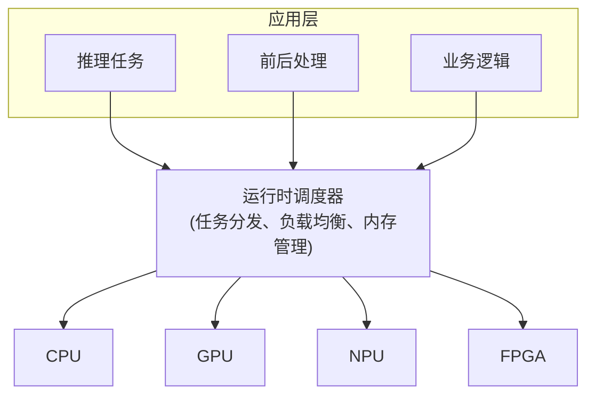
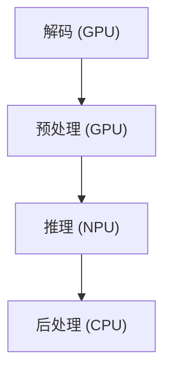
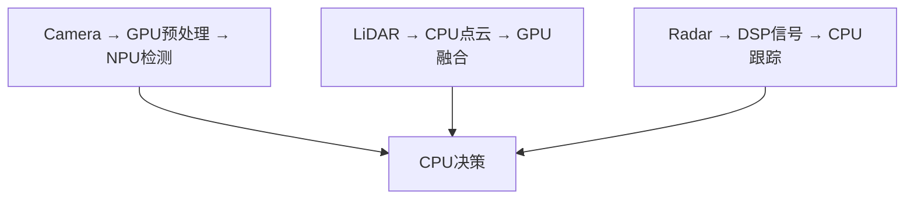

+++
title = "边缘AI与端侧部署详解"
date = 2025-01-15
weight = 18000
description = "边缘设备AI部署全解析：移动端、IoT、浏览器部署技术与实践"
[taxonomies]
tags = ["ai", "edge-ai", "mobile", "iot", "tflite", "coreml", "webml"]
+++

## 概述

将 AI 模型部署到边缘设备（手机、IoT、浏览器）有独特的挑战和技术栈。本文介绍边缘 AI 部署的核心知识。

---

## 一、边缘部署的挑战

**边缘设备限制：**

| 挑战 | 说明 |
|------|------|
| **计算资源有限** | CPU 性能弱于服务器；GPU/NPU 能力有限；无法进行大规模并行 |
| **内存限制** | 手机：2-8GB RAM；IoT：512MB-2GB；模型必须足够小 |
| **能耗约束** | 电池续航敏感；发热控制；持续推理不可接受 |
| **存储空间** | App 大小限制；模型下载成本 |

**优势：**
- 离线运行
- 低延迟
- 隐私保护
- 无云成本

---

## 二、移动端部署

### 2.1 平台与框架

**移动端 AI 框架：**

| 框架 | 平台 | 特点 |
|------|------|------|
| TensorFlow Lite | Android/iOS | Google 出品，生态好 |
| Core ML | iOS/macOS | Apple 原生，性能最优 |
| PyTorch Mobile | Android/iOS | PyTorch 生态 |
| NNAPI | Android | 硬件加速 API |
| MNN | Android/iOS | 阿里巴巴，国内常用 |
| NCNN | Android/iOS | 腾讯，优化好 |
| MLC-LLM | 多平台 | LLM 移动部署 |

### 2.2 TensorFlow Lite

```python
# 模型转换
import tensorflow as tf

# 加载已保存的模型
model = tf.keras.models.load_model('model.h5')

# 转换为 TFLite
converter = tf.lite.TFLiteConverter.from_keras_model(model)

# 优化选项
converter.optimizations = [tf.lite.Optimize.DEFAULT]  # 量化
converter.target_spec.supported_types = [tf.float16]  # FP16

# 转换
tflite_model = converter.convert()

# 保存
with open('model.tflite', 'wb') as f:
    f.write(tflite_model)
```

```java
// Android 使用 TFLite
import org.tensorflow.lite.Interpreter;

// 加载模型
Interpreter interpreter = new Interpreter(loadModelFile());

// 准备输入输出
float[][] input = new float[1][224 * 224 * 3];
float[][] output = new float[1][1000];

// 推理
interpreter.run(input, output);
```

### 2.3 Core ML

```python
# 转换为 Core ML
import coremltools as ct

# 从 PyTorch 转换
model = torch.jit.trace(pytorch_model, example_input)
mlmodel = ct.convert(
    model,
    inputs=[ct.TensorType(shape=(1, 3, 224, 224))],
    compute_precision=ct.precision.FLOAT16
)
mlmodel.save("model.mlpackage")
```

```swift
// iOS 使用 Core ML
import CoreML

let model = try! MyModel(configuration: MLModelConfiguration())
let input = MyModelInput(image: pixelBuffer)
let output = try! model.prediction(input: input)
```

---

## 三、端侧 LLM

### 3.1 端侧 LLM 现状

**端侧 LLM 方案：**

**可行的模型规模：**
- 手机：1B-7B 参数（量化后）
- PC：7B-13B 参数
- 更大模型需要云端

**主要方案：**

| 方案 | 特点 |
|------|------|
| **llama.cpp** | 纯 CPU 推理；支持多种量化（2-8 bit）；跨平台 |
| **MLC-LLM** | 多平台编译；利用设备 GPU；Web/Android/iOS |
| **Ollama** | 本地 LLM 管理；简单易用 |

**典型性能：**
- iPhone 15 Pro + Phi-2 (2.7B, 4-bit): ~15-20 tokens/s
- M2 Mac + LLaMA-7B (4-bit): ~30-40 tokens/s

### 3.2 llama.cpp 部署

```bash
# 编译 llama.cpp
git clone https://github.com/ggerganov/llama.cpp
cd llama.cpp
make -j

# 转换模型为 GGUF 格式
python convert.py models/llama-7b --outtype f16

# 量化
./quantize models/llama-7b/ggml-model-f16.gguf \
           models/llama-7b/ggml-model-q4_0.gguf q4_0

# 运行
./main -m models/llama-7b/ggml-model-q4_0.gguf \
       -t 8 \              # 线程数
       -n 256 \            # 生成长度
       -p "Hello, I am"    # 提示词
```

---

## 四、浏览器部署

### 4.1 WebML 技术

**Web 端 ML：**

| 技术 | 说明 |
|------|------|
| **WebGL** | GPU 着色器计算；兼容性好；性能中等 |
| **WebGPU** | 现代 GPU API；性能接近原生；Chrome 113+ 支持 |
| **WebAssembly (WASM)** | CPU 计算；SIMD 支持；适合小模型 |

**框架：**
- TensorFlow.js：最成熟
- ONNX.js：ONNX 模型
- Transformers.js：HuggingFace 模型
- Web-LLM：浏览器 LLM

### 4.2 TensorFlow.js

```html
<!DOCTYPE html>
<html>
<head>
    <script src="https://cdn.jsdelivr.net/npm/@tensorflow/tfjs"></script>
</head>
<body>
    <script>
        async function run() {
            // 加载模型
            const model = await tf.loadLayersModel('model.json');
            
            // 准备输入
            const input = tf.tensor4d(imageData, [1, 224, 224, 3]);
            
            // 推理
            const output = model.predict(input);
            const result = await output.data();
            
            console.log('Prediction:', result);
        }
        run();
    </script>
</body>
</html>
```

### 4.3 Transformers.js

```javascript
import { pipeline } from '@xenova/transformers';

// 文本分类
const classifier = await pipeline('sentiment-analysis');
const result = await classifier('I love this product!');
console.log(result);
// [{ label: 'POSITIVE', score: 0.9998 }]

// 文本生成
const generator = await pipeline('text-generation', 'Xenova/gpt2');
const output = await generator('The future of AI is', {
    max_new_tokens: 50
});
console.log(output);
```

---

## 五、IoT 部署

### 5.1 IoT 设备

**IoT AI 部署：**

| 类别 | 内容 |
|------|------|
| **典型设备** | Raspberry Pi；NVIDIA Jetson（Nano/Orin）；Google Coral（TPU）；微控制器（ESP32、STM32） |
| **框架选择** | TensorFlow Lite Micro：微控制器；TensorRT：Jetson；Edge TPU Runtime：Coral |
| **模型要求** | 极度量化（INT8/INT4）；小模型（<10MB）；简单架构 |
| **应用场景** | 关键词检测；人员检测；异常检测；手势识别 |

### 5.2 Jetson 部署

```python
# Jetson Orin 部署示例
import tensorrt as trt
import numpy as np

# 使用 TensorRT 加速
# 1. 准备引擎
logger = trt.Logger(trt.Logger.WARNING)
with open("model.trt", "rb") as f:
    engine = trt.Runtime(logger).deserialize_cuda_engine(f.read())

# 2. 推理
context = engine.create_execution_context()

# 3. 处理输入输出
# ... 类似 GPU 推理
```

---

## 六、优化策略

### 6.1 通用优化

**边缘部署优化策略：**

| 类别 | 策略 |
|------|------|
| **模型优化** | 量化（INT8/INT4）必须；剪枝减少参数；知识蒸馏用小模型；选择高效架构（MobileNet、EfficientNet） |
| **推理优化** | 算子融合；内存优化；利用硬件加速器（NPU/GPU） |
| **工程优化** | 按需加载模型；缓存推理结果；批处理请求；异步推理 |

---

## 七、总结

**边缘 AI 部署要点：**

| 类别 | 要点 |
|------|------|
| **平台选择** | iOS：Core ML；Android：TFLite / NCNN / MNN；浏览器：TensorFlow.js / Transformers.js；IoT：TFLite Micro / TensorRT |
| **必要优化** | 量化是必须的；选择合适大小的模型；充分利用硬件加速 |
| **端侧 LLM** | 可行但受限；llama.cpp / MLC-LLM；1-7B 参数量级 |

> **"边缘 AI 的核心是在有限资源下做到足够好。"**

---

## 八、异构计算架构

### 8.1 异构系统设计

**异构计算架构（CPU + GPU + NPU/FPGA）：**

**异构计算的必要性：**
- 不同任务适合不同硬件
- 单一硬件无法满足所有需求
- 成本与性能的平衡

**硬件特点：**

| 硬件 | 特点 |
|------|------|
| CPU | 通用计算、复杂逻辑、低延迟、灵活 |
| GPU | 大规模并行、高吞吐、AI 训练/推理 |
| NPU/TPU | AI 专用、能效比高、特定算子 |
| FPGA | 可编程、低延迟、定制化 |
| DSP | 信号处理、音频视频 |

**典型架构：**



### 8.2 工作负载划分

**工作负载划分策略：**

**1. 按计算特性划分：**

| 硬件 | 适合任务 |
|------|----------|
| CPU | 控制流复杂、分支多、串行依赖 |
| GPU | 大规模并行、SIMD 友好 |
| NPU | 标准 AI 算子（Conv、MatMul） |
| FPGA | 定制算子、低延迟要求 |

**2. 按延迟要求划分：**

| 路径 | 硬件 |
|------|------|
| 实时路径 | FPGA/NPU（确定性延迟） |
| 高吞吐路径 | GPU（批处理） |
| 灵活路径 | CPU（fallback） |

**3. 按能效划分：**

| 任务类型 | 硬件 |
|----------|------|
| 持续任务 | NPU（TOPS/W 高） |
| 突发任务 | GPU（峰值性能） |
| 轻量任务 | CPU |

**典型流水线：**

视频分析流水线：



自动驾驶感知（并行处理）：



### 8.3 Jetson 平台详解

```python
"""
NVIDIA Jetson 平台开发指南
适用于 Jetson Nano / Xavier / Orin
"""

import numpy as np
import tensorrt as trt
import pycuda.driver as cuda
import pycuda.autoinit

class JetsonInference:
    """Jetson TensorRT 推理封装"""
    
    def __init__(self, engine_path):
        self.logger = trt.Logger(trt.Logger.WARNING)
        
        # 加载引擎
        with open(engine_path, 'rb') as f:
            runtime = trt.Runtime(self.logger)
            self.engine = runtime.deserialize_cuda_engine(f.read())
        
        self.context = self.engine.create_execution_context()
        
        # 分配内存
        self._allocate_buffers()
    
    def _allocate_buffers(self):
        self.inputs = []
        self.outputs = []
        self.bindings = []
        self.stream = cuda.Stream()
        
        for binding in self.engine:
            size = trt.volume(self.engine.get_binding_shape(binding))
            dtype = trt.nptype(self.engine.get_binding_dtype(binding))
            
            # 分配 host 和 device 内存
            host_mem = cuda.pagelocked_empty(size, dtype)
            device_mem = cuda.mem_alloc(host_mem.nbytes)
            
            self.bindings.append(int(device_mem))
            
            if self.engine.binding_is_input(binding):
                self.inputs.append({'host': host_mem, 'device': device_mem})
            else:
                self.outputs.append({'host': host_mem, 'device': device_mem})
    
    def infer(self, input_data):
        # 复制输入到 GPU
        np.copyto(self.inputs[0]['host'], input_data.ravel())
        cuda.memcpy_htod_async(
            self.inputs[0]['device'],
            self.inputs[0]['host'],
            self.stream
        )
        
        # 执行推理
        self.context.execute_async_v2(
            bindings=self.bindings,
            stream_handle=self.stream.handle
        )
        
        # 复制输出到 CPU
        cuda.memcpy_dtoh_async(
            self.outputs[0]['host'],
            self.outputs[0]['device'],
            self.stream
        )
        
        self.stream.synchronize()
        
        return self.outputs[0]['host'].copy()


# Jetson 功耗管理
def set_jetson_power_mode(mode='MAXN'):
    """
    Jetson 功耗模式设置
    mode: MAXN(最大性能), 15W, 10W, 5W 等
    """
    import subprocess
    
    if mode == 'MAXN':
        subprocess.run(['sudo', 'nvpmodel', '-m', '0'])
    elif mode == '15W':
        subprocess.run(['sudo', 'nvpmodel', '-m', '2'])
    elif mode == '10W':
        subprocess.run(['sudo', 'nvpmodel', '-m', '1'])
    
    # 最大化时钟频率
    subprocess.run(['sudo', 'jetson_clocks'])


# 使用示例
if __name__ == '__main__':
    # 设置高性能模式
    set_jetson_power_mode('MAXN')
    
    # 加载模型
    inferencer = JetsonInference('model.trt')
    
    # 推理
    input_data = np.random.randn(1, 3, 224, 224).astype(np.float32)
    output = inferencer.infer(input_data)
    print(f"Output shape: {output.shape}")
```

```bash
# Jetson 模型转换流程

# 1. PyTorch → ONNX
python export_onnx.py --model resnet50 --output model.onnx

# 2. ONNX → TensorRT (在 Jetson 上执行)
/usr/src/tensorrt/bin/trtexec \
    --onnx=model.onnx \
    --saveEngine=model.trt \
    --fp16 \
    --workspace=1024

# 3. 性能测试
/usr/src/tensorrt/bin/trtexec \
    --loadEngine=model.trt \
    --batch=1 \
    --iterations=1000

# 4. 监控资源使用
tegrastats  # Jetson 专用监控工具
```

---

## 相关文章

- [上一篇：模型部署与Serving详解](@/articles/ai/ai-17-模型部署与Serving详解.md)
- [下一篇：DeepSeek推理优化技术详解](@/articles/ai/ai-19-DeepSeek推理优化技术详解.md)
