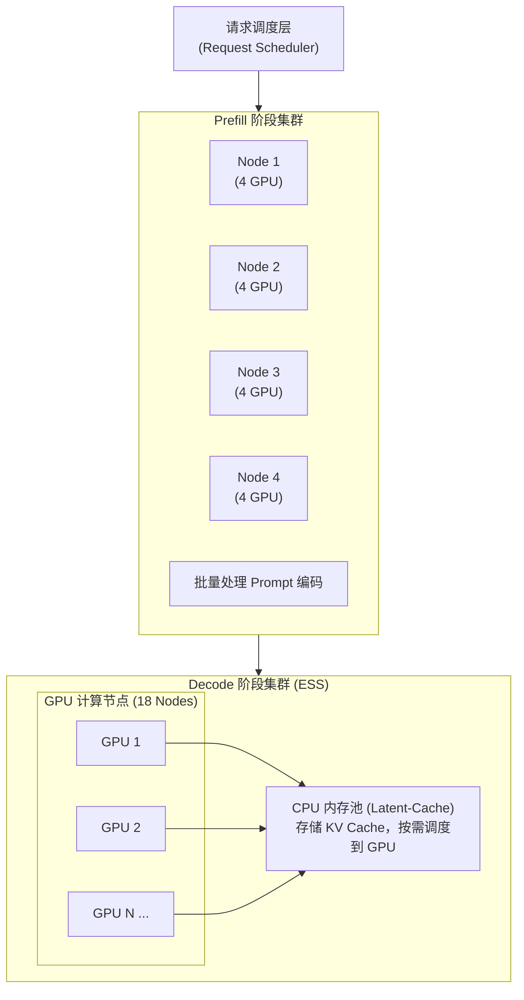
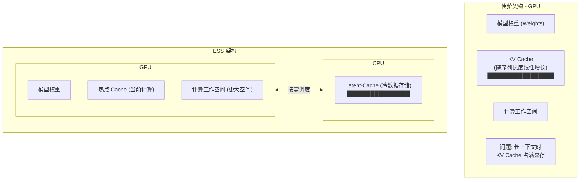
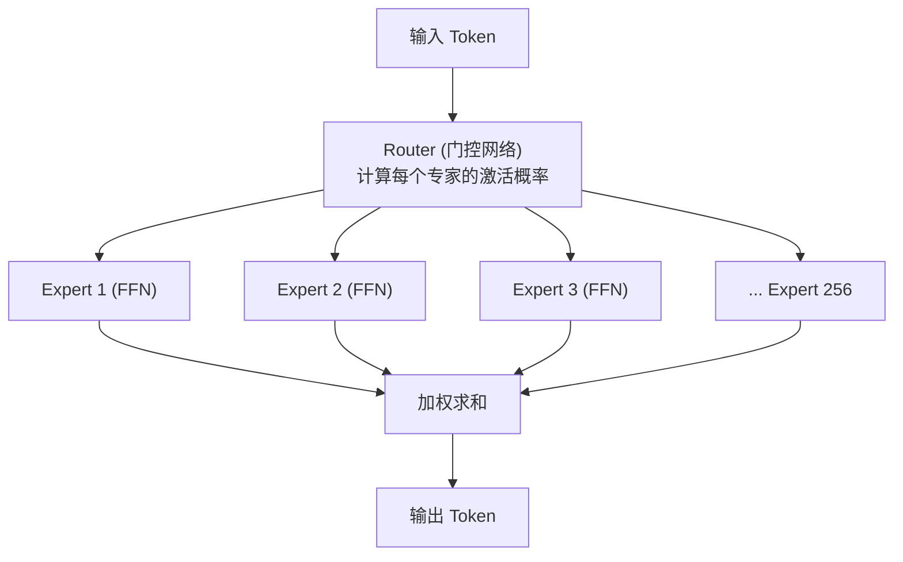
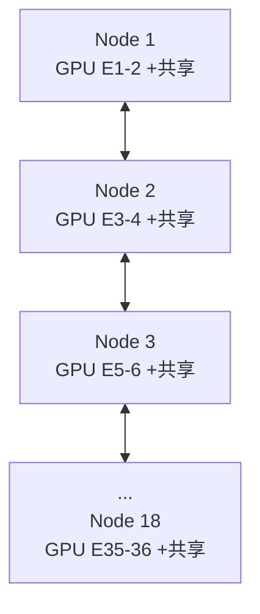
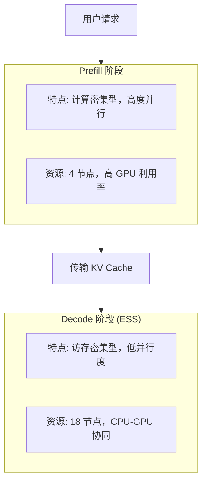

+++
title = "DeepSeek推理优化技术详解"
date = 2026-01-14
weight = 19000
description = "深入解析DeepSeek的ESS架构、CPU Offloading、专家并行等推理优化技术，揭示其高性价比推理服务背后的技术创新"
[taxonomies]
tags = ["ai", "deepseek", "inference", "optimization", "gpu", "cpu", "llm"]
+++

# DeepSeek 推理优化技术详解：CPU-GPU 协同计算

---

## 一、背景与动机

### 1.1 大模型推理面临的挑战

随着大语言模型（LLM）规模不断增长，推理部署面临严峻挑战：

**推理部署核心挑战：**

| 挑战 | 说明 |
|------|------|
| **1. GPU 显存瓶颈** | 模型参数(数百GB) + KV Cache(随上下文增长) = 显存需求(超出单卡容量) |
| **2. 长上下文推理** | 上下文长度: 4K → 32K → 128K → 1M；KV Cache 大小: 线性增长，显存迅速耗尽 |
| **3. 成本与性能矛盾** | 更多 GPU = 更高成本；更少 GPU = 更低吞吐量 |
| **4. 批量处理限制** | batch_size 受限于 GPU 显存；小 batch = GPU 利用率低 |

### 1.2 DeepSeek 的解决思路

DeepSeek 提出了一套系统性的优化方案，核心思想是**充分利用异构计算资源**：

| 资源 | 特点 | DeepSeek 的利用方式 |
|------|------|-------------------|
| **GPU** | 算力强、显存贵 | 专注计算密集型操作 |
| **CPU** | 内存便宜、带宽够 | 存储和调度缓存数据 |
| **网络** | 节点间互联 | 跨节点专家并行 |

---

## 二、核心技术架构

### 2.1 整体架构概览

**DeepSeek 推理系统架构：**



### 2.2 关键技术组件

| 组件 | 功能 | 创新点 |
|------|------|--------|
| **ESS 架构** | CPU-GPU 协同存储 | Latent-Cache 卸载到 CPU |
| **MLA** | 注意力机制优化 | 压缩 KV Cache |
| **EP** | 跨节点专家并行 | 分布式 MoE 计算 |
| **流水线调度** | 通信计算重叠 | 五阶段流水线 |

---

## 三、ESS（Extended Sparse Server）架构

### 3.1 核心思想

ESS 的核心创新是将 **Latent-Cache 从 GPU 显存卸载到 CPU 内存**：

**ESS 架构原理：**



**优势：** GPU 显存释放，可容纳更大 batch

### 3.2 Latent-Cache 机制

DeepSeek 使用 **MLA（Multi-head Latent Attention）** 技术，将传统的 KV Cache 压缩为 Latent-Cache：

**MLA 压缩原理：**

| 方法 | 存储内容 | 大小 |
|------|----------|------|
| **传统 MHA** | 每 token: K 向量 [n_heads × head_dim] + V 向量 [n_heads × head_dim] | 2 × n_heads × head_dim × seq_len × n_layers = 巨大显存 |
| **MLA** | 每 token: Latent 向量 [latent_dim] (远小于 n_heads × head_dim) | 压缩比 4-8 倍 |

**MLA 推理：**
- K = W_k @ Latent
- V = W_v @ Latent

**Latent-Cache 特点：**
- 体积小，适合 CPU-GPU 传输
- 可按需从 CPU 调度到 GPU
- 解耦 batch_size 与 GPU 显存

### 3.3 CPU-GPU 数据调度

**数据调度策略：**

```mermaid
gantt
    title CPU-GPU 数据调度时间线
    dateFormat X
    axisFormat %s
    
    section GPU 计算
    Compute Token1 :a1, 0, 2
    Compute Token2 :a2, 3, 5
    Compute Token3 :a3, 6, 8
    
    section PCIe 传输
    Fetch Cache2 :b1, 1, 3
    Fetch Cache3 :b2, 4, 6
    Fetch Cache4 :b3, 7, 9
```



**关键优化：**
1. **预取 (Prefetch)**: 提前加载下一批数据
2. **异步传输**: PCIe 传输与 GPU 计算并行
3. **双缓冲**: 读写分离，避免等待

### 3.4 性能提升

| 上下文长度 | 吞吐量提升 | 原因分析 |
|-----------|----------|---------|
| 32K tokens | **+69.4%** | GPU 显存释放，batch 可增大 |
| 128K tokens | **+123%** | 长上下文优势更明显 |

---

## 四、专家并行（Expert Parallelism）

### 4.1 MoE 架构回顾

DeepSeek 采用 **Mixture of Experts (MoE)** 架构：

**MoE 架构：**



**DeepSeek 配置：**
- 总专家数: 256
- 每次激活: 8 个专家 + 1 个共享专家
- 稀疏激活: 仅 3% 的参数参与计算

### 4.2 跨节点专家并行

**跨节点 EP 策略：**

**单节点限制：**
- 一个节点 8 块 GPU，每块 GPU 存储 32 个专家
- 256 专家 ÷ 8 GPU = 32 专家/GPU
- **问题**: GPU 显存压力大，batch 受限

**跨节点 EP：**



- 每个 GPU: 2 个路由专家 + 1 个共享专家
- **优势**: 显存压力降低 16 倍

**通信优化：**
- All-to-All 通信: 分发 token 到对应专家节点
- 高速互联: NVLink + InfiniBand
- 通信计算重叠: 流水线调度

### 4.3 EP 带来的优势

| 优势 | 说明 |
|------|------|
| **更大 Batch** | 每个 GPU 存储更少专家，释放显存给 batch |
| **更高 GPU 利用率** | 大 batch 意味着更好的矩阵乘法效率 |
| **更低延迟** | 访存需求减少，计算更快 |
| **可扩展性** | 通过增加节点线性扩展吞吐量 |

---

## 五、流水线优化

### 5.1 五阶段流水线

DeepSeek 将 Attention 计算细分为五个阶段，实现通信与计算的完美重叠：

**五阶段流水线：**

| 阶段 | 名称 | 说明 |
|------|------|------|
| 1 | All-to-All Dispatch | Token 分发到对应专家所在的 GPU 节点 |
| 2 | Expert Compute (Part 1) | 专家 FFN 的第一部分计算 (Up Projection) |
| 3 | Expert Compute (Part 2) | 专家 FFN 的第二部分计算 (Down Projection) |
| 4 | All-to-All Combine | 收集各专家的计算结果 |
| 5 | Attention + Residual | Attention 计算 + 残差连接 |

**流水线重叠：**

```
Layer N:   [1][2][3][4][5]
Layer N+1:    [1][2][3][4][5]
Layer N+2:       [1][2][3][4][5]
```

**效果**: 通信延迟被计算完全隐藏

---

## 六、Prefill 与 Decode 分离

### 6.1 两阶段分离架构

**Prefill-Decode 分离：**



| 阶段 | 特点 | 资源配置 |
|------|------|----------|
| **Prefill** | 计算密集型；高度并行；适合大 batch | 较少节点 (4 节点)；高 GPU 利用率 |
| **Decode** | 访存密集型；低并行度；需存储大量 KV Cache | 更多节点 (18 节点)；CPU-GPU 协同存储 |

### 6.2 为什么要分离？

| 阶段 | 瓶颈 | 优化目标 | DeepSeek 方案 |
|------|------|----------|--------------|
| **Prefill** | 计算 | 最大化 GPU 计算利用率 | 密集部署，大 batch |
| **Decode** | 显存/带宽 | 支持长上下文和高并发 | ESS 架构 + EP |

---

## 七、技术创新总结

### 7.1 核心创新点

**DeepSeek 推理优化创新：**

| 创新点 | 说明 |
|--------|------|
| **1. ESS 架构** | ✓ 首次将 Latent-Cache 系统性卸载到 CPU；✓ 解耦 batch_size 与 GPU 显存容量；✓ 长上下文推理吞吐量翻倍 |
| **2. 大规模专家并行** | ✓ 18 节点跨节点 EP；✓ 每 GPU 仅 2 个路由专家；✓ 显存压力降低 16 倍 |
| **3. 异构资源利用** | ✓ GPU 专注计算，CPU 负责存储；✓ 充分利用 PCIe 带宽；✓ 成本效益最大化 |
| **4. 端到端流水线** | ✓ 五阶段细粒度流水线；✓ 通信与计算完全重叠；✓ 最小化端到端延迟 |

### 7.2 性能对比

| 指标 | 传统方案 | DeepSeek ESS | 提升 |
|------|----------|--------------|------|
| 32K 吞吐量 | 基准 | +69.4% | 1.7x |
| 128K 吞吐量 | 基准 | +123% | 2.2x |
| GPU 显存利用 | batch 受限 | batch 扩大 | 显著 |
| 部署成本 | 高 | 低 | 大幅降低 |

---

## 八、行业影响与启示

### 8.1 对 LLM 部署的影响

**行业影响：**

| 影响 | 说明 |
|------|------|
| **1. 成本革命** | 利用 CPU 内存替代昂贵 GPU 显存；相同预算可服务更多用户；推动 LLM 服务价格下降 |
| **2. 架构范式转变** | 从 "GPU Only" 到 "异构计算"；CPU 不再只是 I/O 处理器；系统设计需要全栈优化思维 |
| **3. 长上下文能力普及** | 128K+ 上下文成为标配；新应用场景：长文档理解、代码仓库分析；降低 RAG 依赖 |
| **4. 竞争格局影响** | 推理成本成为核心竞争力；模型性能不再是唯一指标；倒逼其他厂商优化系统架构 |

### 8.2 技术趋势预测

| 趋势 | 说明 |
|------|------|
| **异构计算深化** | GPU + CPU + NPU 协同将成为常态 |
| **存储分层** | 热/冷数据分层存储将更加精细化 |
| **MoE 普及** | 稀疏激活模型成为主流架构 |
| **推理专用芯片** | 针对 Decode 特点定制的推理芯片 |

---

## 九、技术实现要点

### 9.1 关键技术栈

| 层次 | 技术 | 作用 |
|------|------|------|
| **模型层** | MLA, MoE | 压缩 Cache, 稀疏计算 |
| **调度层** | CUDA Streams, PCIe | 异步传输, 流水线 |
| **通信层** | NCCL, InfiniBand | 高速节点互联 |
| **存储层** | Page-locked Memory | 高效 CPU-GPU 传输 |

### 9.2 实现挑战

**实现挑战：**

| 挑战 | 问题 | 解决方案 |
|------|------|----------|
| **PCIe 带宽瓶颈** | PCIe 5.0 x16: ~64 GB/s | MLA 压缩 + 预取 + 双缓冲 |
| **调度复杂度** | 需要精细控制: 何时传输、传输多少、如何重叠 | 基于 profile 的自适应调度 |
| **跨节点同步** | All-to-All 通信延迟 | 流水线隐藏延迟 + 高速互联 |

---

## 十、参考资料

| 资料 | 链接 |
|------|------|
| **ESS 技术论文** | [arXiv:2512.10576](https://arxiv.org/abs/2512.10576) |
| **DeepSeek-V3 技术报告** | DeepSeek 官方发布 |
| **MLA 技术细节** | DeepSeek-V2 论文 |

---

## 总结

DeepSeek 的推理优化技术展示了**系统级思维**的重要性：

1. **不仅仅优化模型**，更要优化整个系统
2. **充分利用异构资源**，CPU 和 GPU 各司其职
3. **打破传统假设**，GPU 显存不再是硬性约束
4. **端到端优化**，从模型架构到部署调度全链路考虑

这套技术体系是 DeepSeek 能够以低成本提供高质量推理服务的关键，也为业界提供了宝贵的参考经验。

---

## 相关文章

- [上一篇：边缘AI与端侧部署详解](@/articles/ai/ai-18-边缘AI与端侧部署详解.md)
- [下一篇：实战项目-智能知识助手开发全流程](@/articles/ai/ai-20-实战项目智能知识助手开发全流程.md)
