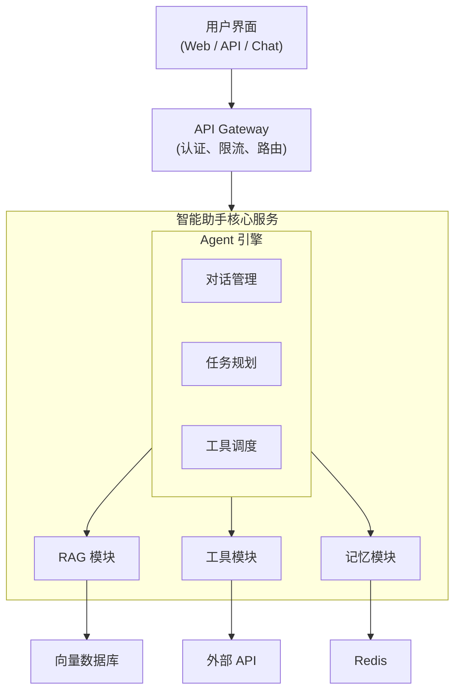
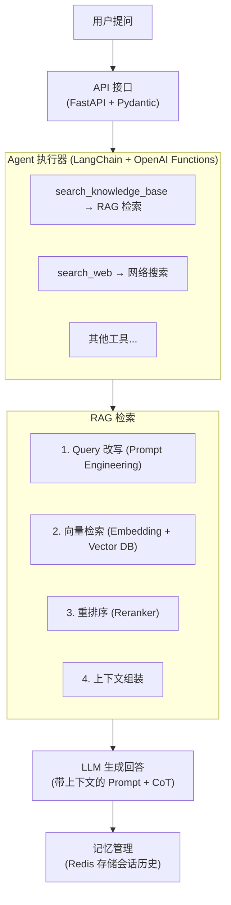

+++
title = "20.实战项目-智能知识助手开发全流程"
date = 2026-01-13
description = "从零构建企业级智能知识助手：RAG、Agent、LangChain、向量数据库的综合实践"
[taxonomies]
tags = ["ai", "rag", "agent", "langchain", "project"]
+++

# AI实战项目-智能知识助手开发全流程

本文通过构建一个完整的智能知识助手项目，将 RAG、Agent、LangChain 等技术串联起来，展示 AI 应用开发的完整流程。

---

## 一、项目概述

### 1.1 项目目标

构建一个企业级智能知识助手，具备以下能力：

| 能力 | 说明 |
|-----|------|
| 知识问答 | 基于企业文档回答问题 |
| 多轮对话 | 支持上下文理解 |
| 工具调用 | 查询数据库、调用 API |
| 任务执行 | 自动完成复杂任务 |
| 来源追溯 | 标注答案来源 |

### 1.2 技术栈

**技术选型：**

| 组件 | 选择 |
|------|------|
| LLM | OpenAI GPT-4 / Claude / Qwen |
| 框架 | LangChain + LangGraph |
| 向量库 | Chroma / Milvus |
| Embedding | OpenAI / BGE |
| 后端 | FastAPI |
| 前端 | Streamlit / React |
| 部署 | Docker + K8s |

### 1.3 系统架构



---

## 二、项目初始化

### 2.1 目录结构

```
knowledge-assistant/
├── src/
│   ├── core/
│   │   ├── __init__.py
│   │   ├── config.py        # 配置管理
│   │   ├── llm.py           # LLM 封装
│   │   └── embeddings.py    # Embedding 封装
│   ├── rag/
│   │   ├── __init__.py
│   │   ├── loader.py        # 文档加载
│   │   ├── splitter.py      # 文档分割
│   │   ├── vectorstore.py   # 向量存储
│   │   └── retriever.py     # 检索器
│   ├── agent/
│   │   ├── __init__.py
│   │   ├── tools.py         # 工具定义
│   │   ├── prompts.py       # 提示模板
│   │   └── executor.py      # Agent 执行器
│   ├── memory/
│   │   ├── __init__.py
│   │   └── chat_history.py  # 会话历史
│   ├── api/
│   │   ├── __init__.py
│   │   ├── routes.py        # API 路由
│   │   └── schemas.py       # 数据模型
│   └── main.py
├── data/
│   └── documents/           # 知识库文档
├── tests/
├── docker-compose.yml
├── Dockerfile
├── requirements.txt
└── README.md
```

### 2.2 依赖配置

```
# requirements.txt
langchain>=0.1.0
langchain-openai>=0.0.5
langchain-community>=0.0.20
langgraph>=0.0.20
chromadb>=0.4.0
fastapi>=0.109.0
uvicorn>=0.27.0
python-multipart>=0.0.6
pydantic-settings>=2.0.0
redis>=5.0.0
unstructured>=0.12.0
pypdf>=4.0.0
```

### 2.3 配置管理

```python
# src/core/config.py
from pydantic_settings import BaseSettings
from functools import lru_cache

class Settings(BaseSettings):
    # LLM 配置
    openai_api_key: str
    openai_base_url: str = "https://api.openai.com/v1"
    model_name: str = "gpt-4-turbo-preview"
    temperature: float = 0.7
    
    # Embedding 配置
    embedding_model: str = "text-embedding-3-small"
    
    # 向量库配置
    chroma_persist_dir: str = "./data/chroma"
    collection_name: str = "knowledge_base"
    
    # Redis 配置
    redis_url: str = "redis://localhost:6379"
    
    # RAG 配置
    chunk_size: int = 500
    chunk_overlap: int = 50
    retrieval_k: int = 5
    
    class Config:
        env_file = ".env"

@lru_cache
def get_settings():
    return Settings()
```

---

## 三、RAG 模块实现

### 3.1 文档加载器

```python
# src/rag/loader.py
from pathlib import Path
from typing import List
from langchain.schema import Document
from langchain_community.document_loaders import (
    PyPDFLoader,
    Docx2txtLoader,
    UnstructuredMarkdownLoader,
    DirectoryLoader,
    TextLoader
)

class DocumentLoader:
    """统一文档加载器"""
    
    LOADER_MAPPING = {
        ".pdf": PyPDFLoader,
        ".docx": Docx2txtLoader,
        ".md": UnstructuredMarkdownLoader,
        ".txt": TextLoader,
    }
    
    def load_file(self, file_path: str) -> List[Document]:
        """加载单个文件"""
        ext = Path(file_path).suffix.lower()
        loader_cls = self.LOADER_MAPPING.get(ext)
        
        if not loader_cls:
            raise ValueError(f"不支持的文件类型: {ext}")
        
        loader = loader_cls(file_path)
        docs = loader.load()
        
        # 添加元数据
        for doc in docs:
            doc.metadata["source"] = file_path
            doc.metadata["file_type"] = ext
        
        return docs
    
    def load_directory(self, dir_path: str) -> List[Document]:
        """加载目录下所有文档"""
        all_docs = []
        dir_path = Path(dir_path)
        
        for ext, loader_cls in self.LOADER_MAPPING.items():
            pattern = f"**/*{ext}"
            for file_path in dir_path.glob(pattern):
                docs = self.load_file(str(file_path))
                all_docs.extend(docs)
        
        return all_docs
```

### 3.2 文本分割器

```python
# src/rag/splitter.py
from typing import List
from langchain.schema import Document
from langchain.text_splitter import RecursiveCharacterTextSplitter
from src.core.config import get_settings

class DocumentSplitter:
    """文档分割器"""
    
    def __init__(self):
        settings = get_settings()
        self.splitter = RecursiveCharacterTextSplitter(
            chunk_size=settings.chunk_size,
            chunk_overlap=settings.chunk_overlap,
            separators=["\n\n", "\n", "。", ".", " ", ""],
            length_function=len
        )
    
    def split(self, documents: List[Document]) -> List[Document]:
        """分割文档"""
        chunks = self.splitter.split_documents(documents)
        
        # 添加 chunk 索引
        for i, chunk in enumerate(chunks):
            chunk.metadata["chunk_index"] = i
        
        return chunks
```

### 3.3 向量存储

```python
# src/rag/vectorstore.py
from typing import List, Optional
from langchain.schema import Document
from langchain_chroma import Chroma
from langchain_openai import OpenAIEmbeddings
from src.core.config import get_settings

class VectorStore:
    """向量存储管理"""
    
    def __init__(self):
        settings = get_settings()
        
        self.embeddings = OpenAIEmbeddings(
            model=settings.embedding_model,
            openai_api_key=settings.openai_api_key
        )
        
        self.vectorstore = Chroma(
            collection_name=settings.collection_name,
            embedding_function=self.embeddings,
            persist_directory=settings.chroma_persist_dir
        )
    
    def add_documents(self, documents: List[Document]) -> List[str]:
        """添加文档到向量库"""
        ids = self.vectorstore.add_documents(documents)
        return ids
    
    def similarity_search(
        self, 
        query: str, 
        k: int = 5,
        filter: Optional[dict] = None
    ) -> List[Document]:
        """相似性搜索"""
        return self.vectorstore.similarity_search(
            query=query,
            k=k,
            filter=filter
        )
    
    def as_retriever(self, **kwargs):
        """转为检索器"""
        settings = get_settings()
        return self.vectorstore.as_retriever(
            search_kwargs={"k": kwargs.get("k", settings.retrieval_k)}
        )
```

### 3.4 检索器

```python
# src/rag/retriever.py
from typing import List
from langchain.schema import Document
from langchain.retrievers import ContextualCompressionRetriever
from langchain.retrievers.multi_query import MultiQueryRetriever
from langchain_cohere import CohereRerank
from src.rag.vectorstore import VectorStore
from src.core.llm import get_llm

class EnhancedRetriever:
    """增强检索器"""
    
    def __init__(self, use_rerank: bool = True, use_multi_query: bool = True):
        self.vectorstore = VectorStore()
        self.base_retriever = self.vectorstore.as_retriever()
        self.use_rerank = use_rerank
        self.use_multi_query = use_multi_query
        
        self._build_retriever()
    
    def _build_retriever(self):
        retriever = self.base_retriever
        
        # 多查询检索
        if self.use_multi_query:
            llm = get_llm()
            retriever = MultiQueryRetriever.from_llm(
                retriever=retriever,
                llm=llm
            )
        
        # 重排序
        if self.use_rerank:
            reranker = CohereRerank(top_n=5)
            retriever = ContextualCompressionRetriever(
                base_compressor=reranker,
                base_retriever=retriever
            )
        
        self.retriever = retriever
    
    def retrieve(self, query: str) -> List[Document]:
        """检索相关文档"""
        return self.retriever.invoke(query)
```

---

## 四、Agent 模块实现

### 4.1 工具定义

```python
# src/agent/tools.py
from typing import Optional
from langchain_core.tools import tool
from src.rag.retriever import EnhancedRetriever

retriever = EnhancedRetriever()

@tool
def search_knowledge_base(query: str) -> str:
    """搜索企业知识库获取相关信息
    
    Args:
        query: 搜索查询
    
    Returns:
        相关文档内容
    """
    docs = retriever.retrieve(query)
    
    if not docs:
        return "未找到相关信息"
    
    results = []
    for i, doc in enumerate(docs, 1):
        source = doc.metadata.get("source", "未知来源")
        content = doc.page_content[:500]
        results.append(f"[{i}] 来源: {source}\n{content}")
    
    return "\n\n".join(results)

@tool
def search_web(query: str) -> str:
    """搜索互联网获取最新信息
    
    Args:
        query: 搜索关键词
    
    Returns:
        搜索结果
    """
    # 实现网络搜索逻辑
    # 可以使用 Tavily、SerpAPI 等
    from langchain_community.tools.tavily_search import TavilySearchResults
    search = TavilySearchResults(max_results=3)
    return search.invoke(query)

@tool
def query_database(sql: str) -> str:
    """执行 SQL 查询获取数据
    
    Args:
        sql: SQL 查询语句
    
    Returns:
        查询结果
    """
    # 实现数据库查询逻辑
    # 添加 SQL 注入防护
    pass

@tool  
def send_email(to: str, subject: str, body: str) -> str:
    """发送邮件
    
    Args:
        to: 收件人邮箱
        subject: 邮件主题
        body: 邮件正文
    
    Returns:
        发送结果
    """
    # 实现邮件发送逻辑
    pass

def get_tools():
    """获取所有可用工具"""
    return [
        search_knowledge_base,
        search_web,
        query_database,
        send_email,
    ]
```

### 4.2 提示模板

```python
# src/agent/prompts.py
from langchain_core.prompts import ChatPromptTemplate, MessagesPlaceholder

SYSTEM_PROMPT = """你是一个专业的企业知识助手，名叫"小智"。

## 你的能力
1. 回答基于企业知识库的问题
2. 搜索互联网获取最新信息
3. 查询数据库获取业务数据
4. 协助完成日常工作任务

## 工作原则
1. 优先使用知识库回答问题
2. 如果知识库没有相关信息，可以搜索互联网
3. 回答时要标注信息来源
4. 对于不确定的信息，要明确告知用户
5. 涉及敏感操作时，需要确认

## 回答风格
- 专业、准确、有帮助
- 语言简洁明了
- 必要时使用列表和结构化格式
"""

def get_agent_prompt():
    return ChatPromptTemplate.from_messages([
        ("system", SYSTEM_PROMPT),
        MessagesPlaceholder(variable_name="chat_history", optional=True),
        ("human", "{input}"),
        MessagesPlaceholder(variable_name="agent_scratchpad"),
    ])
```

### 4.3 Agent 执行器

```python
# src/agent/executor.py
from typing import Dict, Any, List
from langchain.agents import create_openai_functions_agent, AgentExecutor
from langchain_core.messages import HumanMessage, AIMessage
from src.core.llm import get_llm
from src.agent.tools import get_tools
from src.agent.prompts import get_agent_prompt
from src.memory.chat_history import ChatHistoryManager

class KnowledgeAssistant:
    """智能知识助手"""
    
    def __init__(self, session_id: str):
        self.session_id = session_id
        self.llm = get_llm()
        self.tools = get_tools()
        self.prompt = get_agent_prompt()
        self.history_manager = ChatHistoryManager()
        
        # 创建 Agent
        agent = create_openai_functions_agent(
            llm=self.llm,
            tools=self.tools,
            prompt=self.prompt
        )
        
        self.executor = AgentExecutor(
            agent=agent,
            tools=self.tools,
            verbose=True,
            max_iterations=10,
            return_intermediate_steps=True,
            handle_parsing_errors=True
        )
    
    async def chat(self, message: str) -> Dict[str, Any]:
        """处理用户消息"""
        # 获取历史对话
        chat_history = self.history_manager.get_history(self.session_id)
        
        # 执行 Agent
        result = await self.executor.ainvoke({
            "input": message,
            "chat_history": chat_history
        })
        
        # 保存历史
        self.history_manager.add_message(
            self.session_id, 
            HumanMessage(content=message)
        )
        self.history_manager.add_message(
            self.session_id,
            AIMessage(content=result["output"])
        )
        
        # 提取来源信息
        sources = self._extract_sources(result.get("intermediate_steps", []))
        
        return {
            "answer": result["output"],
            "sources": sources,
            "steps": self._format_steps(result.get("intermediate_steps", []))
        }
    
    def _extract_sources(self, steps) -> List[str]:
        """提取信息来源"""
        sources = []
        for action, observation in steps:
            if action.tool == "search_knowledge_base":
                # 解析来源信息
                pass
        return sources
    
    def _format_steps(self, steps) -> List[Dict]:
        """格式化执行步骤"""
        formatted = []
        for action, observation in steps:
            formatted.append({
                "tool": action.tool,
                "input": action.tool_input,
                "output": str(observation)[:500]
            })
        return formatted
```

---

## 五、记忆模块实现

### 5.1 会话历史管理

```python
# src/memory/chat_history.py
import json
from typing import List, Optional
from datetime import datetime, timedelta
import redis
from langchain_core.messages import BaseMessage, messages_from_dict, messages_to_dict
from src.core.config import get_settings

class ChatHistoryManager:
    """会话历史管理器"""
    
    def __init__(self):
        settings = get_settings()
        self.redis_client = redis.from_url(settings.redis_url)
        self.ttl = timedelta(hours=24)  # 会话保留24小时
        self.max_messages = 20  # 最多保留20轮
    
    def _get_key(self, session_id: str) -> str:
        return f"chat_history:{session_id}"
    
    def get_history(self, session_id: str) -> List[BaseMessage]:
        """获取会话历史"""
        key = self._get_key(session_id)
        data = self.redis_client.get(key)
        
        if not data:
            return []
        
        messages_dict = json.loads(data)
        return messages_from_dict(messages_dict)
    
    def add_message(self, session_id: str, message: BaseMessage):
        """添加消息到历史"""
        key = self._get_key(session_id)
        
        # 获取现有历史
        history = self.get_history(session_id)
        history.append(message)
        
        # 限制长度
        if len(history) > self.max_messages * 2:
            history = history[-self.max_messages * 2:]
        
        # 保存
        messages_dict = messages_to_dict(history)
        self.redis_client.setex(
            key,
            self.ttl,
            json.dumps(messages_dict)
        )
    
    def clear_history(self, session_id: str):
        """清除会话历史"""
        key = self._get_key(session_id)
        self.redis_client.delete(key)
    
    def get_summary(self, session_id: str) -> Optional[str]:
        """获取会话摘要"""
        history = self.get_history(session_id)
        if len(history) < 10:
            return None
        
        # 使用 LLM 生成摘要
        from src.core.llm import get_llm
        llm = get_llm()
        
        messages_text = "\n".join([
            f"{m.type}: {m.content}" for m in history
        ])
        
        summary = llm.invoke(
            f"请将以下对话摘要为一段简短的描述：\n\n{messages_text}"
        )
        
        return summary.content
```

---

## 六、API 服务实现

### 6.1 数据模型

```python
# src/api/schemas.py
from typing import List, Optional, Dict, Any
from pydantic import BaseModel, Field
from datetime import datetime

class ChatRequest(BaseModel):
    message: str = Field(..., description="用户消息")
    session_id: str = Field(..., description="会话ID")

class ChatResponse(BaseModel):
    answer: str = Field(..., description="助手回复")
    sources: List[str] = Field(default=[], description="信息来源")
    steps: List[Dict[str, Any]] = Field(default=[], description="执行步骤")

class DocumentUploadResponse(BaseModel):
    success: bool
    message: str
    doc_count: int

class HealthResponse(BaseModel):
    status: str
    timestamp: datetime
```

### 6.2 API 路由

```python
# src/api/routes.py
from fastapi import APIRouter, UploadFile, File, HTTPException
from fastapi.responses import StreamingResponse
from typing import List
import asyncio

from src.api.schemas import (
    ChatRequest, 
    ChatResponse, 
    DocumentUploadResponse,
    HealthResponse
)
from src.agent.executor import KnowledgeAssistant
from src.rag.loader import DocumentLoader
from src.rag.splitter import DocumentSplitter
from src.rag.vectorstore import VectorStore

router = APIRouter()

@router.post("/chat", response_model=ChatResponse)
async def chat(request: ChatRequest):
    """处理对话请求"""
    assistant = KnowledgeAssistant(session_id=request.session_id)
    
    try:
        result = await assistant.chat(request.message)
        return ChatResponse(**result)
    except Exception as e:
        raise HTTPException(status_code=500, detail=str(e))

@router.post("/chat/stream")
async def chat_stream(request: ChatRequest):
    """流式对话"""
    assistant = KnowledgeAssistant(session_id=request.session_id)
    
    async def generate():
        async for chunk in assistant.stream_chat(request.message):
            yield f"data: {chunk}\n\n"
    
    return StreamingResponse(
        generate(),
        media_type="text/event-stream"
    )

@router.post("/documents/upload", response_model=DocumentUploadResponse)
async def upload_documents(files: List[UploadFile] = File(...)):
    """上传文档到知识库"""
    loader = DocumentLoader()
    splitter = DocumentSplitter()
    vectorstore = VectorStore()
    
    total_docs = 0
    
    for file in files:
        # 保存临时文件
        temp_path = f"/tmp/{file.filename}"
        with open(temp_path, "wb") as f:
            content = await file.read()
            f.write(content)
        
        # 加载和处理
        docs = loader.load_file(temp_path)
        chunks = splitter.split(docs)
        vectorstore.add_documents(chunks)
        
        total_docs += len(chunks)
    
    return DocumentUploadResponse(
        success=True,
        message=f"成功上传 {len(files)} 个文件",
        doc_count=total_docs
    )

@router.delete("/documents/{doc_id}")
async def delete_document(doc_id: str):
    """删除文档"""
    # 实现删除逻辑
    pass

@router.get("/health", response_model=HealthResponse)
async def health_check():
    """健康检查"""
    from datetime import datetime
    return HealthResponse(
        status="healthy",
        timestamp=datetime.now()
    )
```

### 6.3 主应用

```python
# src/main.py
from fastapi import FastAPI
from fastapi.middleware.cors import CORSMiddleware
from src.api.routes import router
from src.core.config import get_settings

app = FastAPI(
    title="智能知识助手",
    description="企业级智能知识问答系统",
    version="1.0.0"
)

# CORS 配置
app.add_middleware(
    CORSMiddleware,
    allow_origins=["*"],
    allow_credentials=True,
    allow_methods=["*"],
    allow_headers=["*"],
)

# 注册路由
app.include_router(router, prefix="/api/v1")

@app.on_event("startup")
async def startup():
    """启动时初始化"""
    settings = get_settings()
    print(f"服务启动，使用模型: {settings.model_name}")

if __name__ == "__main__":
    import uvicorn
    uvicorn.run(app, host="0.0.0.0", port=8000)
```

---

## 七、LangGraph 高级工作流

### 7.1 复杂任务处理

```python
# src/agent/workflow.py
from typing import TypedDict, Annotated, Literal
import operator
from langgraph.graph import StateGraph, END
from langchain_core.messages import BaseMessage, HumanMessage, AIMessage

class AgentState(TypedDict):
    messages: Annotated[list[BaseMessage], operator.add]
    current_step: str
    task_type: str
    results: dict

def classify_task(state: AgentState) -> AgentState:
    """分类任务类型"""
    last_message = state["messages"][-1].content
    
    # 使用 LLM 分类
    llm = get_llm()
    classification = llm.invoke(
        f"将以下任务分类为: qa/research/action\n任务: {last_message}"
    )
    
    return {
        **state,
        "task_type": classification.content.strip(),
        "current_step": "route"
    }

def handle_qa(state: AgentState) -> AgentState:
    """处理问答任务"""
    # 使用 RAG 回答
    retriever = EnhancedRetriever()
    query = state["messages"][-1].content
    docs = retriever.retrieve(query)
    
    # 生成回答
    llm = get_llm()
    context = "\n".join([d.page_content for d in docs])
    answer = llm.invoke(
        f"根据以下内容回答问题:\n\n{context}\n\n问题: {query}"
    )
    
    return {
        **state,
        "messages": [AIMessage(content=answer.content)],
        "current_step": "complete"
    }

def handle_research(state: AgentState) -> AgentState:
    """处理调研任务"""
    # 多步调研流程
    pass

def handle_action(state: AgentState) -> AgentState:
    """处理执行任务"""
    # Agent 执行
    pass

def route_task(state: AgentState) -> Literal["qa", "research", "action"]:
    """路由到对应处理器"""
    return state["task_type"]

# 构建图
workflow = StateGraph(AgentState)

# 添加节点
workflow.add_node("classify", classify_task)
workflow.add_node("qa", handle_qa)
workflow.add_node("research", handle_research)
workflow.add_node("action", handle_action)

# 添加边
workflow.set_entry_point("classify")
workflow.add_conditional_edges(
    "classify",
    route_task,
    {
        "qa": "qa",
        "research": "research",
        "action": "action"
    }
)
workflow.add_edge("qa", END)
workflow.add_edge("research", END)
workflow.add_edge("action", END)

# 编译
app = workflow.compile()
```

---

## 八、测试与评估

### 8.1 单元测试

```python
# tests/test_rag.py
import pytest
from src.rag.loader import DocumentLoader
from src.rag.splitter import DocumentSplitter
from src.rag.vectorstore import VectorStore

class TestRAG:
    def test_document_loader(self, tmp_path):
        # 创建测试文件
        test_file = tmp_path / "test.txt"
        test_file.write_text("这是测试内容")
        
        loader = DocumentLoader()
        docs = loader.load_file(str(test_file))
        
        assert len(docs) == 1
        assert "测试内容" in docs[0].page_content
    
    def test_splitter(self):
        from langchain.schema import Document
        
        doc = Document(page_content="A" * 1000)
        splitter = DocumentSplitter()
        chunks = splitter.split([doc])
        
        assert len(chunks) > 1
    
    def test_similarity_search(self):
        vectorstore = VectorStore()
        results = vectorstore.similarity_search("测试查询", k=3)
        
        assert isinstance(results, list)
```

### 8.2 集成测试

```python
# tests/test_agent.py
import pytest
from src.agent.executor import KnowledgeAssistant

@pytest.mark.asyncio
async def test_agent_chat():
    assistant = KnowledgeAssistant(session_id="test-session")
    
    result = await assistant.chat("你好，请介绍一下你自己")
    
    assert "answer" in result
    assert len(result["answer"]) > 0
```

### 8.3 评估指标

```python
# src/evaluation/metrics.py
from typing import List, Dict
from ragas import evaluate
from ragas.metrics import faithfulness, answer_relevancy, context_precision

def evaluate_rag(
    questions: List[str],
    answers: List[str],
    contexts: List[List[str]],
    ground_truths: List[str]
) -> Dict:
    """评估 RAG 系统"""
    from datasets import Dataset
    
    dataset = Dataset.from_dict({
        "question": questions,
        "answer": answers,
        "contexts": contexts,
        "ground_truth": ground_truths
    })
    
    results = evaluate(
        dataset,
        metrics=[faithfulness, answer_relevancy, context_precision]
    )
    
    return results.to_pandas().to_dict()
```

---

## 九、部署上线

### 9.1 Docker 配置

```dockerfile
# Dockerfile
FROM python:3.11-slim

WORKDIR /app

COPY requirements.txt .
RUN pip install --no-cache-dir -r requirements.txt

COPY src/ src/
COPY data/ data/

EXPOSE 8000

CMD ["uvicorn", "src.main:app", "--host", "0.0.0.0", "--port", "8000"]
```

### 9.2 Docker Compose

```yaml
# docker-compose.yml
version: '3.8'

services:
  app:
    build: .
    ports:
      - "8000:8000"
    environment:
      - OPENAI_API_KEY=${OPENAI_API_KEY}
      - REDIS_URL=redis://redis:6379
    depends_on:
      - redis
      - chroma
    volumes:
      - ./data:/app/data

  redis:
    image: redis:7-alpine
    ports:
      - "6379:6379"
    volumes:
      - redis_data:/data

  chroma:
    image: chromadb/chroma
    ports:
      - "8001:8000"
    volumes:
      - chroma_data:/chroma/chroma

volumes:
  redis_data:
  chroma_data:
```

### 9.3 监控配置

```yaml
# prometheus.yml
scrape_configs:
  - job_name: 'knowledge-assistant'
    static_configs:
      - targets: ['app:8000']
    metrics_path: '/metrics'
```

---

## 十、项目总结

### 10.1 技术点串联



### 10.2 扩展方向

| 方向 | 说明 |
|-----|------|
| 多模态 | 支持图片、文档理解 |
| 多语言 | 支持多语言问答 |
| 个性化 | 用户偏好学习 |
| 知识图谱 | 结合 KG 增强推理 |
| 语音交互 | 接入 ASR/TTS |

---

## 参考资料

- [LangChain Documentation](https://python.langchain.com/)
- [LangGraph Tutorial](https://langchain-ai.github.io/langgraph/)
- [RAG Best Practices](https://www.pinecone.io/learn/retrieval-augmented-generation/)
- [Building Production LLM Apps](https://www.llamaindex.ai/)

---

## 相关文章

- [上一篇：DeepSeek推理优化技术详解](/articles/ai/ai-19-DeepSeek推理优化技术详解/)
- [下一篇：CUDA 入门与 GPU 编程基础](/articles/ai/ai-21-CUDA入门与GPU编程基础/)