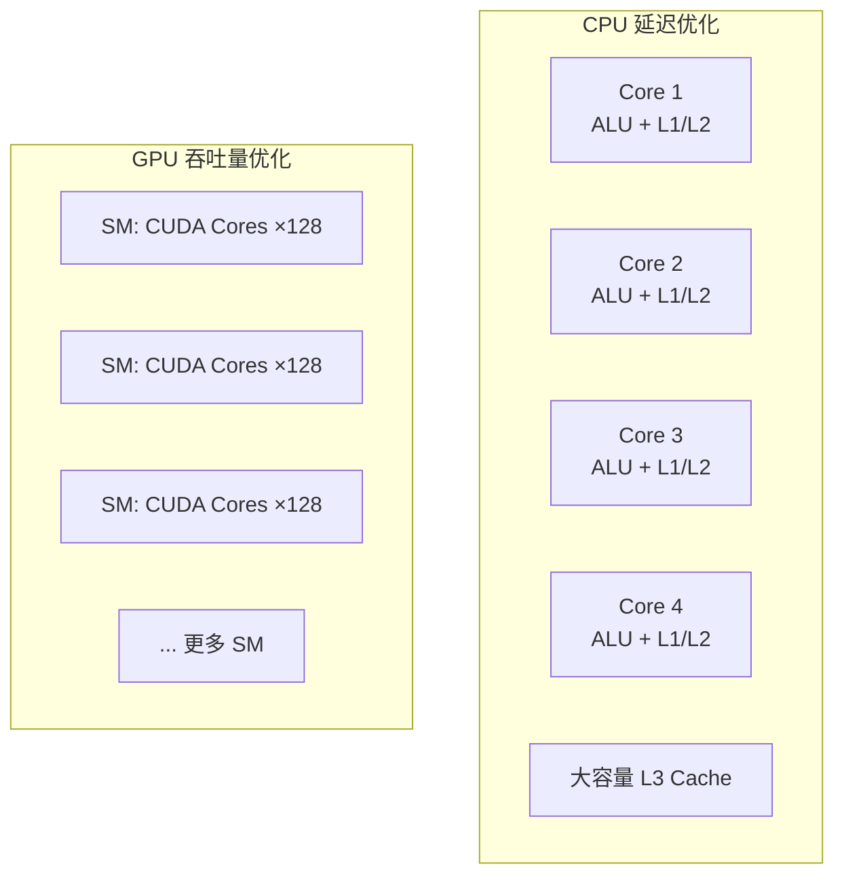
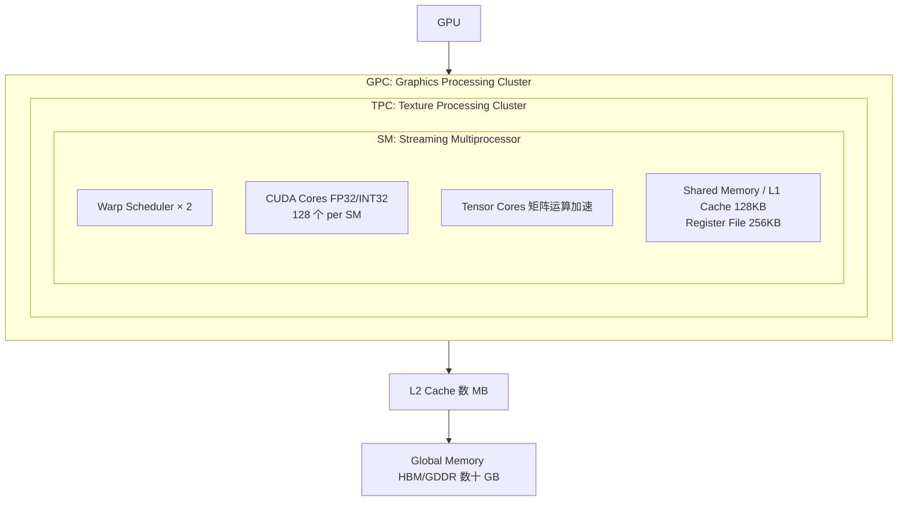
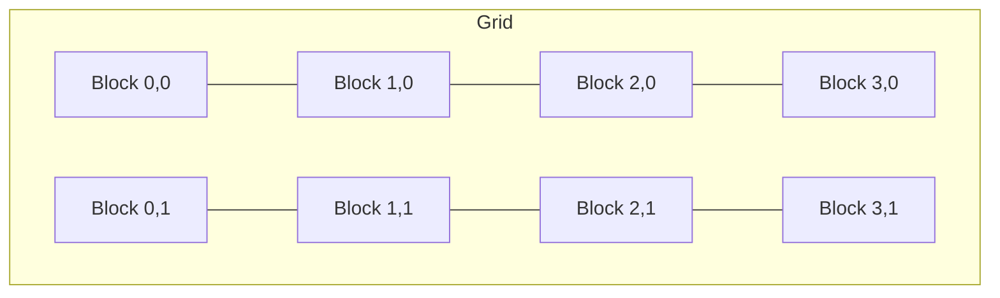

+++
title = "CUDA入门与GPU编程基础"
date = 2026-02-06
weight = 21000
description = "从零开始学习CUDA：GPU架构、编程模型、内存层次、并行思维，附完整入门路线图"
[taxonomies]
tags = ["cuda", "gpu", "parallel-computing", "nvidia", "hpc"]
+++

## 概述

CUDA（Compute Unified Device Architecture）是 NVIDIA 推出的并行计算平台和编程模型。本文将从零开始，系统讲解如何入门 CUDA 开发，包括 GPU 架构理解、编程模型、内存管理、实战案例，以及学习路线规划。

---

## 一、为什么学习 CUDA

### 1.1 CUDA 的重要性

**CUDA 在现代计算中的地位：**

| 领域 | 应用场景 |
|------|----------|
| **AI/ML 训练与推理** | PyTorch、TensorFlow 底层依赖 CUDA；大模型训练：GPT、LLaMA、Stable Diffusion；推理加速：TensorRT、vLLM |
| **科学计算与 HPC** | 分子动力学模拟；气候建模；金融量化计算 |
| **图形与视觉** | 实时渲染；视频编解码；图像处理 |
| **职业发展** | AI Infra 工程师核心技能；薪资溢价显著（相比纯应用层开发）；供需失衡：人才稀缺 |

### 1.2 学习 CUDA 的前置知识

**前置知识要求：**

| 优先级 | 知识领域 |
|--------|----------|
| **必须掌握** | C/C++ 编程（指针、内存管理、结构体）；基础数据结构与算法；计算机体系结构基础概念 |
| **有帮助** | 线性代数（矩阵运算理解）；操作系统基础（进程、线程、内存）；并行编程概念（多线程、同步） |
| **不必须** | 机器学习知识（可以后学）；图形学知识（除非做渲染） |

---

## 二、GPU 架构基础

### 2.1 CPU vs GPU

**CPU 与 GPU 架构对比：**



- **CPU 特点**：4-64 个强核心、大缓存、复杂分支预测、单线程性能强、复杂控制流、低延迟
- **GPU 特点**：数千个小核心、小缓存、简单控制、大规模并行、高吞吐量、适合数据并行任务

**性能对比（RTX 4090 vs Core i9-13900K）：**

| 指标 | GPU (RTX 4090) | CPU (i9-13900K) |
|------|----------------|-----------------|
| 核心数 | 16384 CUDA Cores | 24 Cores |
| 频率 | ~2.5 GHz | ~5.8 GHz |
| 内存带宽 | 1 TB/s | ~90 GB/s |
| 峰值算力 (FP32) | 82.6 TFLOPS | ~1.5 TFLOPS |
| 功耗 | 450W | 253W |

### 2.2 NVIDIA GPU 架构

**NVIDIA GPU 层次结构（以 Ampere/Ada 为例）：**



**关键概念：**
- **SM（Streaming Multiprocessor）**：GPU 的基本计算单元
- **Warp**：32 个线程组成的执行单位（SIMT）
- **CUDA Core**：执行单精度浮点/整数运算
- **Tensor Core**：矩阵乘加加速（AI 专用）

### 2.3 内存层次

**GPU 内存层次（从快到慢）：**

| 层级 | 速度 | 容量 | 作用域 | 使用方式 |
|------|------|------|--------|----------|
| **寄存器 (Registers)** | ~1 cycle（最快） | 256KB per SM，每线程有限 | 每个线程私有 | 编译器自动分配 |
| **共享内存 (Shared Memory)** | ~5 cycles | 48-164KB per SM（可配置） | 同一 Block 内的线程共享 | `__shared__` 关键字 |
| **L1 Cache / Texture Cache** | ~28 cycles | 与 Shared Memory 共享（可配置比例） | SM 内 | 自动 |
| **L2 Cache** | ~200 cycles | 数 MB（整个 GPU 共享） | GPU 全局 | 自动 |
| **Global Memory (VRAM)** | ~400-600 cycles | 数十 GB（HBM3: 1-2 TB/s 带宽） | 所有线程可访问 | 默认，cudaMalloc 分配 |

**带宽对比：**
- Shared Memory: ~20 TB/s
- L2 Cache: ~5 TB/s
- HBM3: ~3 TB/s
- PCIe 5.0: ~64 GB/s

---

## 三、CUDA 编程模型

### 3.1 线程层次结构

**CUDA 线程组织：**



| 概念 | 说明 |
|------|------|
| **Block（线程块）** | 最多 1024 个线程；共享 Shared Memory；可以同步 (`__syncthreads`)；被调度到一个 SM |
| **Thread（线程）** | 最小执行单位；有唯一的 threadIdx；32 个线程组成 Warp；Warp 内 SIMT 执行 |

**索引计算：**
```cpp
int idx = blockIdx.x * blockDim.x + threadIdx.x;
```

**例**：`gridDim=(4,2), blockDim=(256,1)` → 总线程数 = 4 × 2 × 256 = 2048

### 3.2 第一个 CUDA 程序

```cpp
/*
 * hello_cuda.cu - 向量加法示例
 * 编译: nvcc -o hello_cuda hello_cuda.cu
 * 运行: ./hello_cuda
 */

#include <stdio.h>
#include <cuda_runtime.h>

// GPU Kernel 函数（在 GPU 上执行）
__global__ void vectorAdd(const float *A, const float *B, float *C, int N) {
    // 计算全局线程索引
    int i = blockIdx.x * blockDim.x + threadIdx.x;
    
    // 边界检查
    if (i < N) {
        C[i] = A[i] + B[i];
    }
}

int main() {
    int N = 1000000;  // 向量大小
    size_t size = N * sizeof(float);
    
    // 1. 分配 Host（CPU）内存
    float *h_A = (float*)malloc(size);
    float *h_B = (float*)malloc(size);
    float *h_C = (float*)malloc(size);
    
    // 初始化数据
    for (int i = 0; i < N; i++) {
        h_A[i] = 1.0f;
        h_B[i] = 2.0f;
    }
    
    // 2. 分配 Device（GPU）内存
    float *d_A, *d_B, *d_C;
    cudaMalloc(&d_A, size);
    cudaMalloc(&d_B, size);
    cudaMalloc(&d_C, size);
    
    // 3. 复制数据到 GPU
    cudaMemcpy(d_A, h_A, size, cudaMemcpyHostToDevice);
    cudaMemcpy(d_B, h_B, size, cudaMemcpyHostToDevice);
    
    // 4. 配置执行参数
    int threadsPerBlock = 256;
    int blocksPerGrid = (N + threadsPerBlock - 1) / threadsPerBlock;
    
    // 5. 启动 Kernel
    vectorAdd<<<blocksPerGrid, threadsPerBlock>>>(d_A, d_B, d_C, N);
    
    // 6. 等待 GPU 完成
    cudaDeviceSynchronize();
    
    // 7. 复制结果回 CPU
    cudaMemcpy(h_C, d_C, size, cudaMemcpyDeviceToHost);
    
    // 8. 验证结果
    bool success = true;
    for (int i = 0; i < N; i++) {
        if (fabs(h_C[i] - 3.0f) > 1e-5) {
            success = false;
            break;
        }
    }
    printf("Result: %s\n", success ? "PASS" : "FAIL");
    
    // 9. 释放内存
    cudaFree(d_A);
    cudaFree(d_B);
    cudaFree(d_C);
    free(h_A);
    free(h_B);
    free(h_C);
    
    return 0;
}
```

### 3.3 CUDA 关键字与函数

```cpp
/*
 * CUDA 函数修饰符
 */

// __global__: 在 GPU 执行，从 CPU 调用（Kernel）
__global__ void kernel_function() { }

// __device__: 在 GPU 执行，从 GPU 调用
__device__ float device_helper() { return 0.0f; }

// __host__: 在 CPU 执行，从 CPU 调用（默认）
__host__ void host_function() { }

// 可同时编译为 CPU 和 GPU 版本
__host__ __device__ float both_function() { return 0.0f; }

/*
 * 内置变量
 */
// threadIdx.x/y/z - Block 内的线程索引
// blockIdx.x/y/z  - Grid 内的 Block 索引
// blockDim.x/y/z  - Block 的尺寸
// gridDim.x/y/z   - Grid 的尺寸
// warpSize        - Warp 大小（32）

/*
 * 同步函数
 */
__syncthreads();     // Block 内同步
__syncwarp(mask);    // Warp 内同步
cudaDeviceSynchronize();  // CPU 等待 GPU

/*
 * 内存修饰符
 */
__shared__ float shared_data[256];   // Block 共享
__constant__ float const_data[1024]; // 常量内存（只读，缓存优化）

/*
 * 原子操作
 */
atomicAdd(&value, increment);
atomicMax(&value, new_value);
atomicCAS(&value, compare, val);
```

---

## 四、开发环境搭建

### 4.1 安装 CUDA Toolkit

```bash
# Ubuntu 22.04 安装 CUDA 12.x

# 方法1：使用 apt（推荐）
# 添加 NVIDIA 仓库
wget https://developer.download.nvidia.com/compute/cuda/repos/ubuntu2204/x86_64/cuda-keyring_1.1-1_all.deb
sudo dpkg -i cuda-keyring_1.1-1_all.deb
sudo apt update

# 安装 CUDA Toolkit
sudo apt install cuda-toolkit-12-4

# 方法2：runfile（更灵活）
wget https://developer.download.nvidia.com/compute/cuda/12.4.0/local_installers/cuda_12.4.0_550.54.14_linux.run
sudo sh cuda_12.4.0_550.54.14_linux.run

# 配置环境变量（添加到 ~/.bashrc）
export PATH=/usr/local/cuda/bin:$PATH
export LD_LIBRARY_PATH=/usr/local/cuda/lib64:$LD_LIBRARY_PATH

# 验证安装
nvcc --version
nvidia-smi
```

### 4.2 编译与运行

```bash
# 基本编译
nvcc -o program program.cu

# 指定 GPU 架构（重要！）
nvcc -arch=sm_86 -o program program.cu  # RTX 30xx
nvcc -arch=sm_89 -o program program.cu  # RTX 40xx

# 调试模式
nvcc -g -G -o program_debug program.cu

# 优化编译
nvcc -O3 -use_fast_math -o program_fast program.cu

# 生成 PTX（中间代码）
nvcc -ptx program.cu

# 分离编译（多文件）
nvcc -dc -o kernel.o kernel.cu
nvcc -dc -o main.o main.cu
nvcc -o program kernel.o main.o
```

### 4.3 调试工具

```bash
# cuda-gdb：CUDA 调试器
cuda-gdb ./program
(cuda-gdb) break kernel_function
(cuda-gdb) run
(cuda-gdb) cuda thread         # 查看当前线程
(cuda-gdb) cuda block          # 查看当前 Block
(cuda-gdb) info cuda threads   # 列出所有 CUDA 线程

# compute-sanitizer：内存检查
compute-sanitizer --tool memcheck ./program
compute-sanitizer --tool racecheck ./program  # 竞争检测

# Nsight Systems：系统级性能分析
nsys profile --stats=true ./program

# Nsight Compute：Kernel 级性能分析
ncu --set full -o profile ./program
ncu-ui profile.ncu-rep  # 图形界面查看
```

---

## 五、内存管理详解

### 5.1 内存分配与传输

```cpp
/*
 * 内存管理 API
 */

#include <cuda_runtime.h>

int main() {
    size_t size = 1024 * sizeof(float);
    float *d_data;
    float *h_data = (float*)malloc(size);
    
    // 1. 设备内存分配
    cudaMalloc(&d_data, size);
    
    // 2. 内存传输
    cudaMemcpy(d_data, h_data, size, cudaMemcpyHostToDevice);
    cudaMemcpy(h_data, d_data, size, cudaMemcpyDeviceToHost);
    
    // 3. 设备间复制
    float *d_data2;
    cudaMalloc(&d_data2, size);
    cudaMemcpy(d_data2, d_data, size, cudaMemcpyDeviceToDevice);
    
    // 4. 初始化为 0
    cudaMemset(d_data, 0, size);
    
    // 5. 异步传输（与计算重叠）
    cudaStream_t stream;
    cudaStreamCreate(&stream);
    cudaMemcpyAsync(d_data, h_data, size, cudaMemcpyHostToDevice, stream);
    
    // 6. 释放
    cudaFree(d_data);
    cudaFree(d_data2);
    cudaStreamDestroy(stream);
    free(h_data);
    
    return 0;
}
```

### 5.2 Pinned Memory（锁页内存）

```cpp
/*
 * Pinned Memory：提高传输效率
 * - 不会被操作系统换出到磁盘
 * - 可以使用 DMA 直接传输
 * - 传输速度提升 2-3x
 */

float *h_pinned;

// 分配锁页内存
cudaMallocHost(&h_pinned, size);  // 或 cudaHostAlloc

// 使用方式与普通内存相同
cudaMemcpy(d_data, h_pinned, size, cudaMemcpyHostToDevice);

// 释放
cudaFreeHost(h_pinned);

/*
 * 性能对比
 */
// Pageable Memory:  ~6 GB/s (PCIe 3.0)
// Pinned Memory:    ~12 GB/s (PCIe 3.0)
```

### 5.3 Unified Memory（统一内存）

```cpp
/*
 * Unified Memory：简化编程模型
 * - CPU 和 GPU 共享同一指针
 * - 自动数据迁移
 * - 降低入门门槛，但性能可能不如手动管理
 */

float *data;

// 分配统一内存
cudaMallocManaged(&data, size);

// CPU 初始化
for (int i = 0; i < N; i++) {
    data[i] = i;
}

// GPU 使用（自动迁移）
kernel<<<blocks, threads>>>(data, N);
cudaDeviceSynchronize();

// CPU 读取结果（自动迁移回来）
printf("Result: %f\n", data[0]);

// 释放
cudaFree(data);

/*
 * 提示：给系统预取提示
 */
cudaMemPrefetchAsync(data, size, deviceId, stream);  // 预取到 GPU
cudaMemPrefetchAsync(data, size, cudaCpuDeviceId, stream);  // 预取回 CPU
```

---

## 六、共享内存与同步

### 6.1 共享内存使用

```cpp
/*
 * 矩阵乘法优化示例：使用共享内存
 * 减少 Global Memory 访问
 */

#define TILE_SIZE 16

__global__ void matmul_shared(float *A, float *B, float *C, int N) {
    // 共享内存声明
    __shared__ float As[TILE_SIZE][TILE_SIZE];
    __shared__ float Bs[TILE_SIZE][TILE_SIZE];
    
    int bx = blockIdx.x, by = blockIdx.y;
    int tx = threadIdx.x, ty = threadIdx.y;
    
    int row = by * TILE_SIZE + ty;
    int col = bx * TILE_SIZE + tx;
    
    float sum = 0.0f;
    
    // 分块计算
    for (int t = 0; t < N / TILE_SIZE; t++) {
        // 协作加载到共享内存
        As[ty][tx] = A[row * N + t * TILE_SIZE + tx];
        Bs[ty][tx] = B[(t * TILE_SIZE + ty) * N + col];
        
        // 同步：确保所有线程完成加载
        __syncthreads();
        
        // 计算
        for (int k = 0; k < TILE_SIZE; k++) {
            sum += As[ty][k] * Bs[k][tx];
        }
        
        // 同步：确保所有线程完成计算，再加载下一块
        __syncthreads();
    }
    
    C[row * N + col] = sum;
}
```

### 6.2 Bank Conflict

**共享内存 Bank Conflict：**

共享内存被分成 32 个 Banks（每个 4 字节），同一 Warp 的线程访问同一 Bank 会产生冲突。

**Bank 分布：**
- 地址 0-3: Bank 0，地址 4-7: Bank 1，...
- 地址 128-131: Bank 0，地址 132-135: Bank 1，...

**无冲突访问：**
```
Thread 0 → Bank 0
Thread 1 → Bank 1
Thread 2 → Bank 2
...
Thread 31 → Bank 31
```

**2-way 冲突（性能减半）：**
```
Thread 0  → Bank 0  ─┐
Thread 16 → Bank 0  ─┘ 冲突！串行访问
```

**避免冲突的技巧：**
- 填充（padding）：`__shared__ float s[32][33];`
- 调整访问模式

---

## 七、性能优化基础

### 7.1 Occupancy（占用率）

**Occupancy（SM 占用率）：**

**定义**：活跃 Warp 数 / SM 最大可支持 Warp 数

**影响因素：**
- 每线程寄存器使用量
- 每 Block 共享内存使用量
- Block 大小

**示例（RTX 4090 SM）：**
- 最大 Warp 数：48
- 最大 Block 数：16
- 寄存器总量：64K
- 共享内存：100KB

如果 Kernel 每线程用 64 个寄存器：64K / 64 = 1024 线程 = 32 Warp → Occupancy = 32/48 = 66.7%

**优化建议：**
- 减少寄存器使用：`-maxrregcount=N`
- 合理设置 Block 大小
- 权衡：高 Occupancy 不一定最快

```cpp
// 查询 Occupancy
#include <cuda_runtime.h>

int main() {
    int blockSize = 256;
    int minGridSize, maxBlockSize;
    
    // 自动计算最优配置
    cudaOccupancyMaxPotentialBlockSize(
        &minGridSize, &maxBlockSize, kernel_function);
    
    // 计算特定配置的 Occupancy
    int numBlocks;
    cudaOccupancyMaxActiveBlocksPerMultiprocessor(
        &numBlocks, kernel_function, blockSize, 0);
    
    // 获取设备属性
    cudaDeviceProp prop;
    cudaGetDeviceProperties(&prop, 0);
    
    float occupancy = (float)(numBlocks * blockSize) /
                      prop.maxThreadsPerMultiProcessor;
    printf("Occupancy: %.2f%%\n", occupancy * 100);
    
    return 0;
}
```

### 7.2 内存访问优化

**Coalesced Memory Access（合并访问）：**

GPU 以 128 字节为单位访问 Global Memory，最优情况：Warp 内连续线程访问连续地址。

**合并访问（好）：** 1 次 128B 事务
```
Thread 0 → addr[0]
Thread 1 → addr[1]
Thread 2 → addr[2]
...
```

**非合并访问（差）：** 32 次 128B 事务（stride 大）
```
Thread 0 → addr[0]
Thread 1 → addr[stride]
Thread 2 → addr[2*stride]
...
```

```cpp
// 好：合并访问
__global__ void good_access(float *data, int N) {
    int idx = blockIdx.x * blockDim.x + threadIdx.x;
    if (idx < N) {
        data[idx] = data[idx] * 2.0f;  // 连续访问
    }
}

// 差：跨步访问
__global__ void bad_access(float *data, int N, int stride) {
    int idx = blockIdx.x * blockDim.x + threadIdx.x;
    if (idx * stride < N) {
        data[idx * stride] = data[idx * stride] * 2.0f;  // 非合并
    }
}

// 解决方案：AoS 转 SoA
// Array of Structures (AoS) - 不利于合并
struct Particle { float x, y, z; };
Particle particles[N];

// Structure of Arrays (SoA) - 有利于合并
struct Particles {
    float x[N];
    float y[N];
    float z[N];
};
```

---

## 八、CUDA Graph 深度解析

### 8.1 什么是 CUDA Graph

**问题背景：Kernel Launch Overhead**

在 CUDA 编程中，每次启动一个 Kernel 都会产生约 **5-10μs** 的 launch overhead。这个开销来源于 CPU 侧的驱动调用：参数设置、Kernel 调度、与 GPU 的通信等。对于计算密集型的大 Kernel 来说，这个开销可以忽略不计。但在 LLM 推理的 **decode 阶段**，情况截然不同：

| 场景 | Kernel 数量 | 单 Kernel 计算时间 | Launch Overhead 占比 |
|------|-------------|-------------------|---------------------|
| 大矩阵乘法 | 1 | ~1ms | < 1% |
| LLM decode（单 token 生成） | 数百个小 Kernel | ~1-10μs each | **30-70%** |
| 多头注意力 + FFN + LayerNorm | ~100+ Kernels per layer | ~2-5μs each | **50%+** |

LLM decode 阶段每生成一个 token 需要执行整个模型的前向传播，涉及数百个小 Kernel（矩阵乘法、LayerNorm、Softmax、Activation、ElementWise 等）。每个 Kernel 的实际计算时间可能只有几微秒，但 launch overhead 累积起来会成为严重瓶颈。

**CUDA Graph 的解决方案：**

CUDA Graph 将一系列 CUDA 操作（Kernel launch、memcpy、memset 等）**预先捕获**成一个有向无环图（DAG），然后通过**单次 API 调用**重放整个图。这样，原本数百次的 Kernel launch 被压缩为一次 Graph launch，开销从数百微秒降低到约 **1μs**。

```
传统执行（逐个 Launch）：
CPU: [Launch K1][Launch K2][Launch K3]...[Launch KN]  → N × 5-10μs overhead
GPU:        [K1]    [K2]    [K3]   ...    [KN]

CUDA Graph 执行（单次 Launch）：
CPU: [Launch Graph]                                    → 1μs overhead
GPU: [K1][K2][K3]...[KN]                              → 无间隙执行
```

**CUDA Graph 的核心概念：**

- **Graph（图）**：一个 DAG，节点是 CUDA 操作，边是依赖关系
- **Node（节点）**：可以是 Kernel launch、cudaMemcpy、cudaMemset、Host function call、子图（child graph）等
- **Edge（边）**：定义操作之间的执行顺序和依赖
- **Graph Instance（图实例）**：从 Graph 实例化而来的可执行对象，包含优化后的执行计划

### 8.2 CUDA Graph 工作原理

CUDA Graph 的使用分为三个阶段：

```
┌─────────────┐    ┌─────────────────┐    ┌─────────────────┐
│  1. Capture  │ → │ 2. Instantiate   │ → │  3. Execute      │
│  捕获/构建图  │    │ 实例化/优化      │    │  重放执行        │
│              │    │                  │    │                  │
│ 记录所有 CUDA │    │ 生成可执行对象   │    │ 单次 API 调用    │
│ 操作到 Graph  │    │ 驱动级优化       │    │ 重放全部操作     │
│              │    │ 内存预分配       │    │ 可重复执行多次   │
└─────────────┘    └─────────────────┘    └─────────────────┘
    一次性开销           一次性开销            极低开销（~1μs）
```

**阶段详解：**

1. **Capture（捕获）**：将一系列 CUDA 操作记录到一个 `cudaGraph_t` 对象中。可以通过 Stream Capture 或 Explicit API 完成。这个阶段 **不会真正执行** 这些操作，只是记录。

2. **Instantiation（实例化）**：调用 `cudaGraphInstantiate()` 将 `cudaGraph_t` 转化为可执行的 `cudaGraphExec_t`。在这个阶段，CUDA 驱动会进行优化：
   - 预计算所有 Kernel 的 launch 参数
   - 预分配必要的中间 buffer
   - 优化执行调度顺序
   - 消除冗余的同步点

3. **Execution（执行）**：调用 `cudaGraphLaunch()` 执行整个图。可以在同一个 `cudaGraphExec_t` 上反复调用，每次 launch 的开销极低（~1μs）。

### 8.3 Stream Capture 方式

Stream Capture 是使用 CUDA Graph 最简便的方式。只需在已有代码前后包裹 `cudaStreamBeginCapture` 和 `cudaStreamEndCapture` 即可，**不需要修改任何 Kernel 代码**。

```cpp
/*
 * CUDA Graph - Stream Capture 方式
 * 将已有的 Kernel 执行序列捕获为 Graph
 */

#include <cuda_runtime.h>
#include <stdio.h>

// 示例 Kernel：Layer Norm + FFN 的简化版本
__global__ void layerNorm(float *output, const float *input, 
                          const float *gamma, const float *beta,
                          int hidden_dim) {
    int idx = blockIdx.x * blockDim.x + threadIdx.x;
    if (idx < hidden_dim) {
        // 简化的 LayerNorm 实现
        output[idx] = gamma[idx] * input[idx] + beta[idx];
    }
}

__global__ void ffnUp(float *output, const float *input, 
                      const float *weight, int M, int N) {
    int idx = blockIdx.x * blockDim.x + threadIdx.x;
    if (idx < M * N) {
        output[idx] = input[idx % M] * weight[idx];
    }
}

__global__ void activation(float *data, int N) {
    int idx = blockIdx.x * blockDim.x + threadIdx.x;
    if (idx < N) {
        // SiLU activation: x * sigmoid(x)
        float x = data[idx];
        data[idx] = x / (1.0f + expf(-x));
    }
}

__global__ void ffnDown(float *output, const float *input, 
                        const float *weight, int M, int N) {
    int idx = blockIdx.x * blockDim.x + threadIdx.x;
    if (idx < M) {
        output[idx] = input[idx] * weight[idx];
    }
}

int main() {
    // ========== 1. 准备数据 ==========
    int batch_size = 8;
    int hidden_dim = 4096;
    int ffn_dim = 11008;
    
    float *d_input, *d_output, *d_ffn_buf;
    float *d_ln_gamma, *d_ln_beta;
    float *d_w_up, *d_w_down;
    
    cudaMalloc(&d_input, batch_size * hidden_dim * sizeof(float));
    cudaMalloc(&d_output, batch_size * hidden_dim * sizeof(float));
    cudaMalloc(&d_ffn_buf, batch_size * ffn_dim * sizeof(float));
    cudaMalloc(&d_ln_gamma, hidden_dim * sizeof(float));
    cudaMalloc(&d_ln_beta, hidden_dim * sizeof(float));
    cudaMalloc(&d_w_up, hidden_dim * ffn_dim * sizeof(float));
    cudaMalloc(&d_w_down, ffn_dim * hidden_dim * sizeof(float));
    
    cudaStream_t stream;
    cudaStreamCreate(&stream);
    
    // ========== 2. Stream Capture ==========
    cudaGraph_t graph;
    cudaGraphExec_t graphExec;
    
    // 开始捕获：之后在 stream 上的所有操作都会被记录
    cudaStreamBeginCapture(stream, cudaStreamCaptureModeGlobal);
    
    // --- 以下代码与普通 CUDA 代码完全相同 ---
    // LayerNorm
    int threads = 256;
    int blocks_ln = (hidden_dim + threads - 1) / threads;
    layerNorm<<<blocks_ln, threads, 0, stream>>>(
        d_output, d_input, d_ln_gamma, d_ln_beta, hidden_dim);
    
    // FFN Up Projection
    int blocks_up = (batch_size * ffn_dim + threads - 1) / threads;
    ffnUp<<<blocks_up, threads, 0, stream>>>(
        d_ffn_buf, d_output, d_w_up, batch_size, ffn_dim);
    
    // Activation (SiLU)
    int blocks_act = (batch_size * ffn_dim + threads - 1) / threads;
    activation<<<blocks_act, threads, 0, stream>>>(
        d_ffn_buf, batch_size * ffn_dim);
    
    // FFN Down Projection
    int blocks_down = (batch_size * hidden_dim + threads - 1) / threads;
    ffnDown<<<blocks_down, threads, 0, stream>>>(
        d_output, d_ffn_buf, d_w_down, batch_size * hidden_dim,
        ffn_dim);
    
    // --- 捕获结束 ---
    
    // 结束捕获：所有操作被记录到 graph 中
    cudaStreamEndCapture(stream, &graph);
    
    // ========== 3. 实例化 ==========
    cudaGraphInstantiate(&graphExec, graph, NULL, NULL, 0);
    
    // ========== 4. 执行（可以重复多次） ==========
    // 模拟 LLM decode：每生成一个 token 都要执行一次前向传播
    int num_tokens_to_generate = 100;
    for (int token = 0; token < num_tokens_to_generate; token++) {
        // 单次 launch 执行所有 Kernel！
        cudaGraphLaunch(graphExec, stream);
    }
    cudaStreamSynchronize(stream);
    
    // ========== 5. 清理 ==========
    cudaGraphExecDestroy(graphExec);
    cudaGraphDestroy(graph);
    cudaStreamDestroy(stream);
    cudaFree(d_input);
    cudaFree(d_output);
    cudaFree(d_ffn_buf);
    // ... 释放其他内存 ...
    
    return 0;
}
```

**关键注意事项：**
- `cudaStreamCaptureModeGlobal`：捕获期间，**任何** Stream 上的非法操作都会导致捕获失败
- 捕获期间不能执行 CPU-GPU 同步（如 `cudaDeviceSynchronize`）
- 所有 Kernel 必须在同一个 Stream 上 launch（或使用 `cudaStreamCaptureModeRelaxed`）

### 8.4 Explicit API 方式

Explicit API 提供更精细的控制，手动构建图的节点和依赖关系。适合需要复杂依赖图的场景。

```cpp
/*
 * CUDA Graph - Explicit API 方式
 * 手动构建 Graph 节点和依赖关系
 */

#include <cuda_runtime.h>
#include <stdio.h>

__global__ void kernelA(float *data, int N) {
    int idx = blockIdx.x * blockDim.x + threadIdx.x;
    if (idx < N) data[idx] *= 2.0f;
}

__global__ void kernelB(float *data, int N) {
    int idx = blockIdx.x * blockDim.x + threadIdx.x;
    if (idx < N) data[idx] += 1.0f;
}

__global__ void kernelC(float *out, const float *inA, 
                        const float *inB, int N) {
    int idx = blockIdx.x * blockDim.x + threadIdx.x;
    if (idx < N) out[idx] = inA[idx] + inB[idx];
}

int main() {
    int N = 1024;
    float *d_a, *d_b, *d_c;
    cudaMalloc(&d_a, N * sizeof(float));
    cudaMalloc(&d_b, N * sizeof(float));
    cudaMalloc(&d_c, N * sizeof(float));
    
    // ========== 1. 创建空图 ==========
    cudaGraph_t graph;
    cudaGraphCreate(&graph, 0);
    
    // ========== 2. 添加节点 ==========
    
    // --- Memset 节点：初始化数据 ---
    cudaMemsetParams memsetParams = {};
    memsetParams.dst = d_a;
    memsetParams.value = 0;
    memsetParams.pitch = 0;
    memsetParams.elementSize = sizeof(float);
    memsetParams.width = N;
    memsetParams.height = 1;
    
    cudaGraphNode_t memsetNodeA;
    cudaGraphAddMemsetNode(&memsetNodeA, graph, NULL, 0, &memsetParams);
    
    memsetParams.dst = d_b;
    cudaGraphNode_t memsetNodeB;
    cudaGraphAddMemsetNode(&memsetNodeB, graph, NULL, 0, &memsetParams);
    
    // --- Kernel 节点 A：依赖 memsetNodeA ---
    cudaKernelNodeParams kernelParamsA = {};
    int threads = 256;
    int blocks = (N + threads - 1) / threads;
    
    void *argsA[] = { &d_a, &N };
    kernelParamsA.func = (void *)kernelA;
    kernelParamsA.gridDim = dim3(blocks);
    kernelParamsA.blockDim = dim3(threads);
    kernelParamsA.sharedMemBytes = 0;
    kernelParamsA.kernelParams = argsA;
    kernelParamsA.extra = NULL;
    
    cudaGraphNode_t kernelNodeA;
    cudaGraphNode_t depsA[] = { memsetNodeA };
    cudaGraphAddKernelNode(&kernelNodeA, graph, depsA, 1, &kernelParamsA);
    
    // --- Kernel 节点 B：依赖 memsetNodeB（与 A 并行） ---
    void *argsB[] = { &d_b, &N };
    cudaKernelNodeParams kernelParamsB = {};
    kernelParamsB.func = (void *)kernelB;
    kernelParamsB.gridDim = dim3(blocks);
    kernelParamsB.blockDim = dim3(threads);
    kernelParamsB.sharedMemBytes = 0;
    kernelParamsB.kernelParams = argsB;
    kernelParamsB.extra = NULL;
    
    cudaGraphNode_t kernelNodeB;
    cudaGraphNode_t depsB[] = { memsetNodeB };
    cudaGraphAddKernelNode(&kernelNodeB, graph, depsB, 1, &kernelParamsB);
    
    // --- Kernel 节点 C：依赖 A 和 B（汇合点） ---
    /*
     *  构建的 DAG 结构：
     *
     *  [memsetA] → [kernelA] ─┐
     *                          ├→ [kernelC]
     *  [memsetB] → [kernelB] ─┘
     */
    void *argsC[] = { &d_c, &d_a, &d_b, &N };
    cudaKernelNodeParams kernelParamsC = {};
    kernelParamsC.func = (void *)kernelC;
    kernelParamsC.gridDim = dim3(blocks);
    kernelParamsC.blockDim = dim3(threads);
    kernelParamsC.sharedMemBytes = 0;
    kernelParamsC.kernelParams = argsC;
    kernelParamsC.extra = NULL;
    
    cudaGraphNode_t kernelNodeC;
    cudaGraphNode_t depsC[] = { kernelNodeA, kernelNodeB };
    cudaGraphAddKernelNode(&kernelNodeC, graph, depsC, 2, &kernelParamsC);
    
    // ========== 3. 实例化 ==========
    cudaGraphExec_t graphExec;
    cudaGraphInstantiate(&graphExec, graph, NULL, NULL, 0);
    
    // ========== 4. 执行 ==========
    cudaStream_t stream;
    cudaStreamCreate(&stream);
    
    cudaGraphLaunch(graphExec, stream);
    cudaStreamSynchronize(stream);
    
    // ========== 5. 清理 ==========
    cudaGraphExecDestroy(graphExec);
    cudaGraphDestroy(graph);
    cudaStreamDestroy(stream);
    cudaFree(d_a);
    cudaFree(d_b);
    cudaFree(d_c);
    
    return 0;
}
```

### 8.5 Stream Capture vs Explicit API 对比

| 维度 | Stream Capture | Explicit API |
|------|---------------|--------------|
| **易用性** | 极高：包裹已有代码即可 | 较低：手动构建每个节点 |
| **代码侵入性** | 几乎为零 | 需要重写执行逻辑 |
| **灵活性** | 受限于 Stream 语义 | 完全灵活，可构建任意 DAG |
| **并行分支** | 需要多个 Stream + Event | 直接添加并行节点 |
| **调试** | 捕获错误难以定位 | 节点级控制，更易调试 |
| **适用场景** | 已有 CUDA 代码的快速优化 | 新建高性能 Pipeline |
| **生产环境使用** | vLLM、PyTorch 主要使用此方式 | TensorRT-LLM 内部使用 |

**最佳实践**：优先使用 Stream Capture（简单可靠），仅在需要复杂并行依赖时考虑 Explicit API。

### 8.6 CUDA Graph 在 LLM 推理中的应用

CUDA Graph 是 LLM 推理引擎中的核心优化之一，但 Prefill 阶段和 Decode 阶段的适用性截然不同。

**Prefill vs Decode 的区别：**

| 特性 | Prefill（首次填充） | Decode（逐 token 生成） |
|------|---------------------|------------------------|
| 输入 shape | `[batch, seq_len, hidden]`，seq_len 不固定 | `[batch, 1, hidden]`，shape 固定 |
| 计算密集度 | 高（长序列 → 大矩阵乘法） | 低（单 token → 小矩阵乘法） |
| 单 Kernel 耗时 | 长（μs ~ ms 级） | 短（μs 级） |
| Launch overhead 占比 | 低 | **高（30-70%）** |
| 适合 CUDA Graph | **不适合**（shape 变化） | **非常适合** |

**为什么 Decode 适合 CUDA Graph：**

1. 每次 decode 的计算图完全相同（同一模型、固定 shape）
2. Kernel 数量多但每个很小 → launch overhead 占比高
3. 反复执行相同序列 → 捕获一次、重放多次

**为什么 Prefill 不适合 CUDA Graph：**

1. 每个请求的输入长度不同 → Tensor shape 不同
2. 不同 shape 需要不同的 Graph → 无法复用
3. Prefill 的大 Kernel 计算时间长 → launch overhead 占比低，Graph 带来的收益小

**vLLM 中的 CUDA Graph 实现策略：**

```python
# vLLM 的 CUDA Graph 使用策略（简化版）

class CUDAGraphRunner:
    def __init__(self, model):
        self.model = model
        # 为常见 batch size 预捕获 Graph
        self.graph_pool = {}  # {batch_size: CUDAGraph}
        
        # 离散 batch size 列表
        self.capture_sizes = [1, 2, 4, 8, 16, 32, 64, 128, 256]
    
    def capture_graphs(self):
        """预热阶段：为每个预设的 batch size 捕获 CUDA Graph"""
        for bs in self.capture_sizes:
            # 创建固定 shape 的输入 tensor
            dummy_input = torch.zeros(bs, 1, self.model.hidden_dim,
                                     device="cuda")
            
            # 预热：先跑一次确保所有 lazy initialization 完成
            self.model(dummy_input)
            
            # 开始捕获
            graph = torch.cuda.CUDAGraph()
            with torch.cuda.graph(graph):
                output = self.model(dummy_input)
            
            self.graph_pool[bs] = {
                "graph": graph,
                "input": dummy_input,
                "output": output,
            }
    
    def execute(self, input_tensor):
        """执行推理：优先使用 CUDA Graph"""
        batch_size = input_tensor.shape[0]
        
        # 找到最近的 >= batch_size 的捕获尺寸
        padded_size = self._find_padded_size(batch_size)
        
        if padded_size is not None and padded_size in self.graph_pool:
            # 使用 CUDA Graph 执行
            cached = self.graph_pool[padded_size]
            
            # 将实际输入复制到捕获时使用的 buffer
            cached["input"][:batch_size].copy_(input_tensor)
            
            # 如果需要 padding，填充 0
            if batch_size < padded_size:
                cached["input"][batch_size:].zero_()
            
            # 重放 Graph（极低 overhead）
            cached["graph"].replay()
            
            # 从输出 buffer 截取有效部分
            return cached["output"][:batch_size]
        else:
            # Fallback：eager execution（无 Graph）
            return self.model(input_tensor)
    
    def _find_padded_size(self, batch_size):
        """找到最近的预捕获 batch size"""
        for size in self.capture_sizes:
            if size >= batch_size:
                return size
        return None  # 超过最大捕获尺寸，fallback
```

**TensorRT-LLM 中的 CUDA Graph 优化：**

TensorRT-LLM 对 CUDA Graph 的使用更为激进：

- **自动 Graph 捕获**：TRT-LLM 在构建 Engine 时自动识别可捕获的子图
- **更细粒度的 Graph 分割**：将不可捕获的部分（如 dynamic control flow）隔离，其余部分全部 Graph 化
- **Graph 与 Plugin 集成**：自定义的 TRT Plugin（如 Flash Attention）也能被 Graph 捕获
- **多级 Graph**：对不同模型结构层级使用不同粒度的 Graph

### 8.7 动态形状问题（Dynamic Shape Problem）

CUDA Graph 的核心限制是 **所有 Tensor 的形状（shape）在 capture 时就固定了**，后续 replay 不能改变。这是因为 Graph 在实例化时已经将所有 Kernel 参数（包括 grid/block 配置、内存地址、数据大小等）预先计算好了。

**LLM 推理中的动态性：**

```
请求 1: batch_size=3,  seq_len=512  → 需要 shape [3, 512, 4096]
请求 2: batch_size=7,  seq_len=128  → 需要 shape [7, 128, 4096]
请求 3: batch_size=12, seq_len=2048 → 需要 shape [12, 2048, 4096]
```

**解决方案：离散 Batch Size + Padding**

```cpp
/*
 * 动态 Batch Size 的 CUDA Graph 管理策略
 * 
 * 核心思想：
 * 1. 预定义离散 batch size 集合：{1, 2, 4, 8, 16, 32, 64, 128}
 * 2. 为每个 batch size 预捕获一个 Graph
 * 3. 运行时将实际 batch size 向上取整到最近的预设值
 * 4. 多余的位置 padding 为 0
 */

#include <cuda_runtime.h>
#include <unordered_map>
#include <vector>
#include <cmath>

struct CapturedGraph {
    cudaGraphExec_t exec;
    float *d_input;   // 捕获时使用的输入 buffer
    float *d_output;  // 捕获时使用的输出 buffer
    int max_batch;    // 此 Graph 对应的 batch size
};

class CUDAGraphManager {
private:
    std::unordered_map<int, CapturedGraph> graphs_;
    std::vector<int> capture_sizes_ = {1, 2, 4, 8, 16, 32, 64, 128, 256};
    int hidden_dim_;
    cudaStream_t stream_;
    
public:
    CUDAGraphManager(int hidden_dim) : hidden_dim_(hidden_dim) {
        cudaStreamCreate(&stream_);
    }
    
    void captureAll() {
        for (int bs : capture_sizes_) {
            CapturedGraph cg;
            cg.max_batch = bs;
            
            // 分配固定大小的 buffer
            size_t input_size = bs * hidden_dim_ * sizeof(float);
            size_t output_size = bs * hidden_dim_ * sizeof(float);
            cudaMalloc(&cg.d_input, input_size);
            cudaMalloc(&cg.d_output, output_size);
            
            // 预热（确保 lazy allocation 完成）
            runModel(cg.d_input, cg.d_output, bs);
            cudaStreamSynchronize(stream_);
            
            // 捕获 Graph
            cudaGraph_t graph;
            cudaStreamBeginCapture(stream_, 
                                   cudaStreamCaptureModeGlobal);
            runModel(cg.d_input, cg.d_output, bs);
            cudaStreamEndCapture(stream_, &graph);
            
            // 实例化
            cudaGraphInstantiate(&cg.exec, graph, NULL, NULL, 0);
            cudaGraphDestroy(graph);  // Graph 对象可以销毁，exec 保留
            
            graphs_[bs] = cg;
        }
    }
    
    void execute(float *input, float *output, int actual_batch) {
        // 找到最近的 >= actual_batch 的捕获尺寸
        int padded_batch = findPaddedSize(actual_batch);
        
        if (padded_batch > 0 && graphs_.count(padded_batch)) {
            CapturedGraph &cg = graphs_[padded_batch];
            
            // 复制实际输入到 Graph 的 input buffer
            size_t actual_size = actual_batch * hidden_dim_ * sizeof(float);
            cudaMemcpyAsync(cg.d_input, input, actual_size,
                           cudaMemcpyDeviceToDevice, stream_);
            
            // Padding 部分清零（避免影响 BatchNorm 等操作）
            if (actual_batch < padded_batch) {
                size_t pad_offset = actual_batch * hidden_dim_;
                size_t pad_size = (padded_batch - actual_batch) * 
                                  hidden_dim_ * sizeof(float);
                cudaMemsetAsync(cg.d_input + pad_offset, 0, 
                               pad_size, stream_);
            }
            
            // 执行 Graph（~1μs launch overhead）
            cudaGraphLaunch(cg.exec, stream_);
            
            // 复制有效输出
            cudaMemcpyAsync(output, cg.d_output, actual_size,
                           cudaMemcpyDeviceToDevice, stream_);
        } else {
            // Fallback: eager execution
            runModel(input, output, actual_batch);
        }
    }
    
private:
    int findPaddedSize(int actual) {
        for (int size : capture_sizes_) {
            if (size >= actual) return size;
        }
        return -1;  // 超出范围
    }
    
    void runModel(float *input, float *output, int batch_size) {
        // 实际的模型前向传播（各种 Kernel launch）
        // ... LayerNorm, Attention, FFN, etc. ...
    }
    
    ~CUDAGraphManager() {
        for (auto &[bs, cg] : graphs_) {
            cudaGraphExecDestroy(cg.exec);
            cudaFree(cg.d_input);
            cudaFree(cg.d_output);
        }
        cudaStreamDestroy(stream_);
    }
};
```

**内存开销分析：**

每个 Captured Graph 都需要独立的 workspace 内存（包括输入/输出 buffer 和中间结果 buffer）。

| Batch Size | 单 Graph 内存占用（估算） | 累积内存占用 |
|------------|--------------------------|-------------|
| 1 | ~50 MB | 50 MB |
| 2 | ~60 MB | 110 MB |
| 4 | ~80 MB | 190 MB |
| 8 | ~120 MB | 310 MB |
| 16 | ~200 MB | 510 MB |
| 32 | ~360 MB | 870 MB |
| 64 | ~680 MB | 1550 MB |
| 128 | ~1320 MB | 2870 MB |
| 256 | ~2600 MB | **5470 MB** |

> 注意：以上数值为 LLaMA-7B 级别模型的估算，实际取决于模型大小、hidden_dim、中间激活等。

**Trade-off 权衡：**
- **更多 Graph（细粒度 batch size）**：padding 浪费更少 → 计算效率更高，但 GPU 内存占用更大
- **更少 Graph（粗粒度 batch size）**：内存占用小，但 padding 浪费更多计算

### 8.8 CUDA Graph 的限制与陷阱

**1. 不能捕获动态控制流（Dynamic Control Flow）**

```cpp
// ❌ 错误：不能在 Graph 中包含依赖 GPU 数据的条件分支
__global__ void bad_kernel(float *data, float *flag, int N) {
    // 这里的 if 没问题（编译时可确定的条件或线程级条件）
    int idx = blockIdx.x * blockDim.x + threadIdx.x;
    if (idx < N) { data[idx] *= 2.0f; }
}

// 但如果 CPU 侧根据 GPU 结果做分支：
void execute_with_branch(float *d_data, float *h_result) {
    // 在 Graph capture 期间：
    kernel1<<<grid, block, 0, stream>>>(d_data, N);
    
    // ❌ 不能在捕获期间同步并读取 GPU 数据
    // cudaMemcpy(h_result, d_data, sizeof(float), 
    //            cudaMemcpyDeviceToHost);
    // if (*h_result > threshold) {  // 这会破坏捕获！
    //     kernel2<<<grid, block, 0, stream>>>(d_data, N);
    // }
}
```

**2. 不能在 Graph 中进行 CPU-GPU 同步**

```cpp
// ❌ 以下操作在 capture 期间会报错或产生未定义行为
cudaStreamBeginCapture(stream, cudaStreamCaptureModeGlobal);

kernel1<<<grid, block, 0, stream>>>(data, N);
cudaDeviceSynchronize();  // ❌ 不能在捕获中同步！
kernel2<<<grid, block, 0, stream>>>(data, N);

cudaStreamEndCapture(stream, &graph);  // 会失败
```

**3. 内存地址必须在 Capture 和 Replay 之间保持有效**

```cpp
// ❌ 危险：capture 后释放了内存
float *d_buf;
cudaMalloc(&d_buf, size);

// 捕获 Graph...
cudaStreamBeginCapture(stream, cudaStreamCaptureModeGlobal);
kernel<<<grid, block, 0, stream>>>(d_buf, N);
cudaStreamEndCapture(stream, &graph);
cudaGraphInstantiate(&graphExec, graph, NULL, NULL, 0);

cudaFree(d_buf);  // ❌ 释放了 Graph 引用的内存！

cudaGraphLaunch(graphExec, stream);  // 💥 crash 或 undefined behavior
```

**4. cudaGraphExecUpdate：更新 Kernel 参数而无需重新捕获**

当只需更改 Kernel 的参数值（而非结构）时，可以使用 `cudaGraphExecUpdate` 避免重新 capture + instantiate。

```cpp
/*
 * Graph Update：修改参数而不重新捕获
 * 适用场景：输入数据指针变化，但 Graph 结构不变
 */

// 第一次：正常 capture + instantiate
cudaGraph_t graph1;
cudaGraphExec_t graphExec;

cudaStreamBeginCapture(stream, cudaStreamCaptureModeGlobal);
kernel<<<grid, block, 0, stream>>>(d_old_input, N);
cudaStreamEndCapture(stream, &graph1);
cudaGraphInstantiate(&graphExec, graph1, NULL, NULL, 0);

// 后续：如果只是参数变化（如输入指针），可以更新
cudaGraph_t graph2;
cudaStreamBeginCapture(stream, cudaStreamCaptureModeGlobal);
kernel<<<grid, block, 0, stream>>>(d_new_input, N);  // 新输入
cudaStreamEndCapture(stream, &graph2);

// 尝试更新（比 re-instantiate 快得多）
cudaGraphExecUpdateResult updateResult;
cudaGraphExecUpdate(graphExec, graph2, NULL, &updateResult);

if (updateResult == cudaGraphExecUpdateSuccess) {
    // 更新成功，可以直接用 graphExec
    cudaGraphLaunch(graphExec, stream);
} else {
    // 更新失败（结构变化太大），需要重新实例化
    cudaGraphExecDestroy(graphExec);
    cudaGraphInstantiate(&graphExec, graph2, NULL, NULL, 0);
    cudaGraphLaunch(graphExec, stream);
}

cudaGraphDestroy(graph1);
cudaGraphDestroy(graph2);
```

**5. 与 NCCL 的兼容性问题**

- NCCL 2.x 的部分集合通信操作（如 AllReduce）在某些配置下不能被 Graph 捕获
- NCCL 2.19+ 增加了对 CUDA Graph 的支持，但仍有限制
- 多 GPU 推理时需要特别注意：跨设备的通信可能需要拆分到 Graph 之外

### 8.9 性能分析

**典型加速效果：**

| 模型 | 框架 | Decode 加速比 | 条件 |
|------|------|--------------|------|
| LLaMA-7B | vLLM | +15-25% | batch_size=1-8 |
| LLaMA-13B | vLLM | +12-20% | batch_size=1-16 |
| GPT-J 6B | TRT-LLM | +20-30% | batch_size=1-4 |
| LLaMA-70B (TP=4) | TRT-LLM | +10-15% | batch_size=8-32 |

> 规律：**Kernel 数量越多、单 Kernel 越小 → 加速越明显**

**加速来源分析：**

1. **消除 Launch Overhead**（主要贡献：60-70%）
   - 数百次 Kernel launch 合并为 1 次 Graph launch
   - 消除了每次 launch 的 CPU 侧驱动调用开销

2. **驱动级调度优化**（贡献：20-30%）
   - CUDA 驱动可以看到整个执行图，预先安排最优调度
   - 消除不必要的同步点
   - 相邻 Kernel 之间的 gap 更小

3. **减少 CPU 开销**（贡献：10-20%）
   - CPU 不再需要逐个发射 Kernel
   - CPU 可以空出来做其他工作（如 Scheduler、Tokenizer）

**使用 Nsight Systems 分析 CUDA Graph：**

```bash
# Profile 使用 CUDA Graph 的程序
nsys profile --trace=cuda,nvtx -o graph_profile ./my_llm_server

# 在 Nsight Systems UI 中，CUDA Graph 执行会显示为：
# - 单个 "GraphLaunch" 事件（而不是逐个 Kernel）
# - 展开后可以看到 Graph 内部的所有 Kernel
# - 可以对比 Graph 执行 vs 非 Graph 执行的时间线
```

**对比时间线示例：**

```
无 CUDA Graph（100 个 Kernel，每个 3μs 计算 + 7μs launch overhead）：
CPU: |--launch--|--launch--|--launch--|...|--launch--|  总 launch: ~700μs
GPU: |   K1  |gap| K2  |gap| K3  |gap|...|  K100 |   总计算: ~300μs
                                                       总时间: ~1000μs

使用 CUDA Graph：
CPU: |--graph launch--|                                 总 launch: ~1μs  
GPU: |K1|K2|K3|...|K100|                               总计算: ~300μs
                                                       总时间: ~301μs
                                                       加速比: ~3.3×
```

### 8.10 面试高频问题

**Q1: 为什么 CUDA Graph 能加速 LLM 的 Decode 阶段但对 Prefill 阶段帮助不大？**

答：

- **Decode 阶段**：每个 token 的生成涉及固定 shape（`[batch, 1, hidden_dim]`）的数百个小 Kernel。每个 Kernel 的实际计算时间仅 1-10μs，而 launch overhead 约 5-10μs/次，overhead 占比可达 50% 以上。CUDA Graph 将数百次 launch 合并为一次（~1μs），显著降低了 overhead。并且 Decode 的输入 shape 固定（seq_len=1），捕获的 Graph 可以反复复用。
- **Prefill 阶段**：输入序列长度 seq_len 变化很大（可能从几十到几千），导致 Tensor shape 不固定，无法捕获通用 Graph。而且 Prefill 的 Kernel 通常较大（长序列的矩阵乘法），单 Kernel 计算时间长（ms 级），launch overhead 占比很低（<5%），即使消除 overhead 也带来很小的相对加速。

**Q2: 如何在 LLM 推理中处理 CUDA Graph 的动态 Batch Size 问题？**

答：

1. **离散化 + Padding**：预定义一组离散 batch size（如 1, 2, 4, 8, 16, 32, 64, 128），为每个 size 预捕获一个 Graph。运行时将实际 batch size 向上取整到最近的预设值，多余位置填零。
2. **权衡内存与效率**：更多的离散点意味着更少的 padding 浪费（计算效率更高），但每个 Graph 都占用 GPU 内存。需要根据 GPU 显存大小和业务负载特征来选择合适的离散点。
3. **Fallback 机制**：超出预设范围的 batch size 退回到 eager execution。
4. **输入复制**：每次执行前将实际输入 `cudaMemcpy` 到 Graph capture 时使用的固定 buffer，执行后从固定 output buffer 取出有效结果。

**Q3: 哪些操作不能被 CUDA Graph 捕获？**

答：

1. **依赖 GPU 数据的控制流**：不能在 capture 中根据 GPU 上的计算结果做 if/else 分支
2. **CPU-GPU 同步操作**：`cudaDeviceSynchronize()`、`cudaStreamSynchronize()`、`cudaEventSynchronize()` 等
3. **内存分配/释放**：`cudaMalloc` / `cudaFree`（CUDA 11.4+ 部分支持 `cudaMallocAsync`）
4. **某些 NCCL 集合通信操作**（版本依赖）
5. **CPU callback**：虽然 Graph 支持 Host Node，但不能在 Host Node 中执行会阻塞的操作
6. **动态 Grid/Block 配置**：Grid 和 Block 的维度在 capture 时固定

**Q4: CUDA Graph 与 CUDA Stream 的关系是什么？**

答：

- **Stream** 是一个有序的操作队列，同一 Stream 上的操作按序执行，不同 Stream 可以并行
- **CUDA Graph** 是一个更高层次的抽象，它捕获的是一系列操作之间的**依赖关系图**（DAG），可以包含多个 Stream 上的操作
- Stream Capture 是利用已有 Stream 上的操作来构建 Graph 的便捷方式
- Graph 执行时本身也需要在某个 Stream 上 launch：`cudaGraphLaunch(graphExec, stream)`
- Graph 内部可以包含比单个 Stream 更复杂的并行结构（通过 Explicit API 的 DAG 结构或 Stream Capture 中的多 Stream + Event）

**Q5: 如何评估一个模型/workload 是否适合使用 CUDA Graph？**

答：可以通过以下方法评估：

1. **使用 Nsight Systems profile**：查看 Kernel launch overhead 在整体执行时间中的占比。如果 overhead 占比 > 10%，CUDA Graph 可能有明显收益。
2. **检查 shape 稳定性**：如果计算图的 Tensor shape 在多次执行间保持不变（或可以 padding 到固定值），则适合使用 Graph。
3. **统计 Kernel 数量**：单次前向传播中 Kernel 数量越多、越小，Graph 的收益越大。
4. **经验法则**：Decode 阶段几乎总是适合 CUDA Graph；Prefill 阶段几乎总是不适合。Encoder 模型（如 BERT）如果输入可以 padding 到固定长度，也适合 Graph。

---

## 九、入门学习路线

### 9.1 学习阶段

**CUDA 入门学习路线（3-6 个月）：**

| 阶段 | 时长 | 学习内容 |
|------|------|----------|
| **阶段 1：基础** | 2-4 周 | 理解 GPU vs CPU 架构差异；安装 CUDA Toolkit；编写第一个向量加法 Kernel；理解线程层次（Grid/Block/Thread）；掌握基本内存管理 |
| **阶段 2：核心概念** | 4-6 周 | 共享内存使用；同步机制（`__syncthreads`）；原子操作；流（Streams）和并发；性能分析工具（Nsight）；实现矩阵乘法优化 |
| **阶段 3：优化技巧** | 4-6 周 | 内存合并访问；Bank Conflict 避免；Occupancy 优化；指令级优化；使用 cuBLAS、cuDNN 等库 |
| **阶段 4：实战应用** | 持续 | 实现完整项目；阅读开源 Kernel 代码；学习 PyTorch CUDA Extension；深入特定领域（ML/HPC/图形） |

### 9.2 推荐资源

**学习资源：**

| 类别 | 资源 |
|------|------|
| **官方资源** | CUDA C Programming Guide（必读）；CUDA Best Practices Guide（优化必读）；NVIDIA Developer Blog；GTC 大会视频（免费） |
| **书籍** | 《CUDA C Programming Guide》；《Programming Massively Parallel Processors》；《CUDA by Example》（入门友好） |
| **在线课程** | Coursera: "CUDA Programming" by NVIDIA；Udacity: "Intro to Parallel Programming"；YouTube: "CUDA Crash Course" by CoffeeBeforeArch |
| **实践项目** | CUDA Samples（安装包自带）；GitHub: cuda-samples、cutlass；LeetCode GPU 题目 |
| **社区** | NVIDIA Developer Forums；Stack Overflow [cuda] tag；Reddit r/CUDA |

### 9.3 入门练习题

```cpp
/*
 * 练习 1：向量点积
 * 使用共享内存实现归约（reduction）
 */
__global__ void dot_product(float *a, float *b, float *result, int N);

/*
 * 练习 2：图像灰度化
 * RGB -> Gray: 0.299*R + 0.587*G + 0.114*B
 */
__global__ void rgb_to_gray(unsigned char *rgb, unsigned char *gray, 
                            int width, int height);

/*
 * 练习 3：1D 卷积
 * 使用共享内存优化
 */
__global__ void convolution_1d(float *input, float *output, 
                               float *kernel, int N, int K);

/*
 * 练习 4：直方图
 * 使用原子操作
 */
__global__ void histogram(unsigned char *data, int *hist, int N);

/*
 * 练习 5：矩阵转置
 * 处理 Bank Conflict
 */
__global__ void matrix_transpose(float *in, float *out, int N);
```

---

## 十、常见问题与解决

**CUDA 开发常见问题：**

| 问题 | 解决方案 |
|------|----------|
| **Kernel 不执行** | 检查 GPU 是否正确识别：`nvidia-smi`；检查 Kernel 参数是否正确；检查编译架构是否匹配：`-arch=sm_XX`；检查错误：`cudaGetLastError()` |
| **结果全是 0 或垃圾值** | 检查 `cudaMemcpy` 方向是否正确；检查是否等待 GPU 完成：`cudaDeviceSynchronize()`；检查数组越界 |
| **illegal memory access** | 使用 compute-sanitizer 检查；检查索引计算是否越界；检查 Grid/Block 配置 |
| **性能很差** | 使用 Nsight 分析瓶颈；检查内存访问模式；检查 Occupancy；减少 Host-Device 数据传输 |
| **共享内存 out of range** | 检查 Block 大小与共享内存大小匹配；动态共享内存需要正确传递大小 |

---

## 十一、GPU 架构演进：Ampere → Hopper → Blackwell

理解 GPU 硬件架构的代际差异，是 CUDA 性能优化和面试的核心知识。不同架构引入的新特性决定了 Kernel 的写法和优化策略。

### 11.1 三代架构总览

| 特性 | **Ampere (A100, 2020)** | **Hopper (H100, 2022)** | **Blackwell (B200, 2024)** |
|------|------------------------|------------------------|---------------------------|
| 制程 | 7nm (TSMC) | 4nm (TSMC) | 4nm (TSMC) |
| SM 数量 | 108 | 132 | 192 (双 die) |
| CUDA Cores | 6912 | 16896 (含 FP32) | 21760 |
| Tensor Core 代 | 第三代 | 第四代 | 第五代 |
| 最低精度支持 | INT4 | **FP8 (E4M3/E5M2)** | **FP4** |
| FP16 Tensor TFLOPS | 312 | 989 | ~2500 |
| 显存 | 80GB HBM2e | 80GB HBM3 | 192GB HBM3e |
| 显存带宽 | 2.0 TB/s | 3.35 TB/s | 8.0 TB/s |
| NVLink 版本/带宽 | NVLink 3.0 / 600 GB/s | NVLink 4.0 / 900 GB/s | NVLink 5.0 / 1.8 TB/s |
| PCIe | Gen4 | Gen5 | Gen5/6 |
| 关键新特性 | 结构化稀疏、MIG、Async Copy | **FP8、TMA、Thread Block Cluster、Transformer Engine** | **FP4、解压引擎、双 die** |

### 11.2 Ampere 架构 (A100) 关键特性

**第三代 Tensor Core**：支持 TF32（19 位，兼顾 FP32 范围和更快速度）、BF16、FP16、INT8、INT4。TF32 是 Ampere 的独有创新——不改代码，把 FP32 GEMM 自动转为 TF32 精度，速度提升 ~8x（vs FP32 CUDA Core）。

**2:4 结构化稀疏**：硬件级支持——每 4 个权重中必须有 2 个为零。满足此模式的矩阵乘法，Tensor Core 可跳过零值计算，吞吐 ~2x。

```
稀疏模式（每 4 个元素中 2 个为零）：
[1.2, 0, 0.8, 0, 0, 3.1, 0, 0.5, ...]
 ✓   0   ✓   0  0   ✓   0   ✓
```

**MIG (Multi-Instance GPU)**：将一块 A100 硬件隔离为最多 7 个独立的 GPU 实例，每个有独立的显存、SM、L2 Cache。适合多租户推理场景。

**Async Copy (`cp.async`)**：异步拷贝 Global Memory → Shared Memory，**不经过寄存器**，从而释放计算单元做其他工作。是 Flash Attention 实现 compute-memory overlap 的关键指令。

```cuda
// Ampere cp.async: 异步拷贝 16 bytes
asm volatile("cp.async.cg.shared.global [%0], [%1], 16;\n"
             :: "r"(smem_addr), "l"(gmem_addr));
asm volatile("cp.async.commit_group;\n");
asm volatile("cp.async.wait_group 0;\n");
```

### 11.3 Hopper 架构 (H100) 关键特性

Hopper 是当前 AI 训练/推理的主力，引入了 4 项关键创新：

#### 11.3.1 FP8 与 Transformer Engine

**FP8**：两种格式——E4M3（4 位指数 + 3 位尾数，范围大适合权重）和 E5M2（5 位指数 + 2 位尾数，范围更大适合梯度）。相比 FP16，精度降低但 **Tensor Core 吞吐翻倍**。

**Transformer Engine**：NVIDIA 的自动混精框架，**逐张量 (per-tensor) 动态选择 FP8 还是 FP16**：

```
Transformer Engine 工作流程：
1. 前向：统计每个张量的 amax（绝对值最大值）
2. 根据 amax 计算 scale factor → 将张量量化为 FP8
3. FP8 Tensor Core 计算 → 结果用 FP16/FP32 累加
4. 如果某层的数值范围不适合 FP8 → 自动回退到 FP16

关键：scale factor 是"延迟更新"的——用前几个 iteration 的 amax
来计算当前 iteration 的 scale，避免额外的同步开销。
```

```python
# PyTorch + Transformer Engine 使用示例
import transformer_engine.pytorch as te

# 替换 nn.Linear → te.Linear，自动启用 FP8
model.layers[i].mlp.fc1 = te.Linear(hidden_size, ffn_size)

# 训练时自动管理 FP8 scale
with te.fp8_autocast(enabled=True):
    output = model(input)
    loss = criterion(output, target)
    loss.backward()
```

#### 11.3.2 TMA (Tensor Memory Accelerator)

**TMA 是 Hopper 最重要的硬件创新之一**。它是一个专用硬件单元，负责 Global Memory ↔ Shared Memory 之间的**多维张量传输**。

**没有 TMA 时**（Ampere 及之前）：
```
1. 计算线性地址 = base + row * stride + col * elem_size
2. 线程各自从 Global Memory 读数据到寄存器
3. 从寄存器写到 Shared Memory
→ 大量 CUDA Core 用于地址计算 + 数据搬运，浪费算力
```

**有 TMA 时**（Hopper）：
```
1. 在 Host 端创建 TMA Descriptor（描述张量形状、stride、base 指针）
2. 一条 TMA 指令：cp.async.bulk.tensor → 硬件自动搬运整个 tile
→ CUDA Core 完全释放，同时做计算；地址计算由 TMA 硬件完成
```

**对 Flash Attention 的影响**：Flash Attention 的核心是交替「加载 K/V tile 到 Shared Memory」和「做 QK^T 矩阵乘 + softmax + OV 乘」。TMA 让加载 tile 完全不占用 CUDA Core → compute-memory overlap 更彻底 → **Hopper 上的 Flash Attention 比 Ampere 快 ~40-50%**（在相同 Tensor Core FLOPS 比例下）。

#### 11.3.3 Thread Block Cluster（线程块集群）

新的层次结构：**Grid → Cluster → Thread Block → Warp → Thread**

```
传统（Ampere）：Grid → Thread Block → Warp → Thread
                 每个 Thread Block 只能访问自己的 Shared Memory

Hopper：        Grid → Cluster → Thread Block → Warp → Thread
                 Cluster 内的 Thread Block 可以访问彼此的 Shared Memory（DSMEM）
```

**Distributed Shared Memory (DSMEM)**：Cluster 内的 SM 通过 SM-to-SM 网络直接交换 Shared Memory 数据，无需经过 Global Memory。适合：
- **协作式 GEMM tile 计算**：相邻的 Thread Block 直接共享部分计算结果
- **Reduce 操作**：Cluster 内先做 local reduce，再做 global reduce
- **Flash Attention 的 KV 分片**：Cluster 内的 Thread Block 各持有一部分 KV，通过 DSMEM 共享

```cuda
// Hopper: 声明 Cluster 大小（编译时指定）
__cluster_dims__(2, 1, 1)
__global__ void kernel() {
    // 获取 Cluster 内的相对位置
    int cluster_rank = cyclic_cluster_rank();
    
    // 通过 DSMEM 访问相邻 Thread Block 的 Shared Memory
    extern __shared__ float smem[];
    float* remote_smem = cluster_map_shared_rank(smem, 1 - cluster_rank);
    // remote_smem 指向 Cluster 中另一个 TB 的 Shared Memory
}
```

#### 11.3.4 其他特性

- **NVLink 4.0**：每 GPU 900 GB/s 双向带宽，8 路 NVLink 连接
- **NVSwitch 3.0**：节点内全互联，支持 256 GPU all-to-all
- **PCIe Gen5**：128 GB/s（双向），CPU↔GPU 传输更快
- **DPX 指令**：动态规划加速（Smith-Waterman 等），对生物信息学有用

### 11.4 Blackwell 架构 (B200) 关键特性

**第五代 Tensor Core + FP4**：FP4 精度（4 位浮点），推理吞吐相比 H100 FP8 **再翻倍**。适合对精度要求不高的推理场景。

**第二代 Transformer Engine**：支持 FP4 动态量化。结合 FP4 权重 + FP8 激活，在保持精度的前提下进一步减少显存和计算。

**双 Die 设计**：两块 GPU die 封装在一个芯片上，通过高速 die-to-die 互联（10 TB/s），对外表现为一块"超大 GPU"。192GB HBM3e 全局可见。

**NVLink 5.0**：1.8 TB/s 双向，支持 576 GPU 全互联（NVLink Switch）。

**解压引擎**：硬件 LZ4/Snappy 解压——数据从存储/网络加载时直接在 GPU 上解压，不占用 CUDA Core。对数据密集型训练（大规模数据 pipeline）有显著加速。

### 11.5 对 AI 工作负载的实际影响

| 场景 | Ampere 做法 | Hopper 提升 | Blackwell 进一步 |
|------|-----------|------------|-----------------|
| **LLM 训练** | FP16/BF16 Tensor Core | FP8 Transformer Engine → **~1.6x 加速** | FP4 训练实验中 |
| **LLM 推理 (Decode)** | INT8/INT4 量化 | FP8 量化 + TMA 加速 KV Cache 加载 | FP4 量化 → **再 2x** |
| **Flash Attention** | cp.async + 手动地址计算 | TMA + DSMEM → **~1.5x** | TMA v2 + 更大 Shared Memory |
| **分布式训练** | NVLink 3.0 + NCCL | NVLink 4.0 + Cluster-level reduce | NVLink 5.0 + 576 GPU 互联 |
| **多租户推理** | MIG (最多 7 实例) | MIG + Confidential Computing | MIG + 双 die 灵活分区 |

### 11.6 Kernel 开发中的架构适配

```cuda
// 编译时条件编译
#if __CUDA_ARCH__ >= 900  // Hopper (SM90)
    // 使用 TMA + Cluster + FP8
    __cluster_dims__(2, 1, 1)
#elif __CUDA_ARCH__ >= 800  // Ampere (SM80)
    // 使用 cp.async + structured sparsity
#elif __CUDA_ARCH__ >= 700  // Volta (SM70)
    // 基础 Tensor Core
#endif

// 编译命令：同时支持多架构
// nvcc -gencode arch=compute_80,code=sm_80  (Ampere)
//      -gencode arch=compute_90,code=sm_90  (Hopper)
//      -gencode arch=compute_100,code=sm_100 (Blackwell)
```

**CUTLASS 的架构适配**：CUTLASS 3.x 使用 CuTe layout algebra，自动适配不同架构的内存访问模式（TMA vs cp.async vs 普通 load）。用户只需指定 `SM90` 或 `SM80` 的 policy，CUTLASS 自动选择最优的数据搬运方式。

### 11.7 面试高频问题

**Q: Ampere 和 Hopper 对 LLM 训练的关键区别？**
> A: 最大区别是 **FP8 + Transformer Engine**。Hopper 的 FP8 Tensor Core 吞吐是 Ampere FP16 的 ~3x（考虑架构本身的提升 + 精度减半的吞吐翻倍）。Transformer Engine 自动管理 FP8 scale factor，几乎无需改代码即可获得加速。

**Q: TMA 是什么？为什么对 Attention Kernel 重要？**
> A: TMA 是专用硬件，负责 Global↔Shared Memory 的多维张量传输。传统做法需要 CUDA Core 计算地址 + 搬运数据，TMA 把这两步都 offload 到专用硬件。对 Flash Attention 这类"交替加载和计算"的 Kernel，TMA 让加载完全不占 CUDA Core → compute-memory overlap 更好 → ~40% 额外加速。

**Q: Thread Block Cluster 的 DSMEM 有什么用？**
> A: Cluster 内的多个 Thread Block 可以直接访问彼此的 Shared Memory（通过 SM-to-SM 网络），无需经过 Global Memory。典型应用：协作式 tile 计算（GEMM 中相邻 tile 共享 A 或 B 的片段）、Cluster 内快速 reduce、分布式 softmax。

**Q: 如何写同时支持 Ampere 和 Hopper 的 Kernel？**
> A: 1) 编译时 `#if __CUDA_ARCH__` 条件分支；2) 运行时 `cudaDeviceGetAttribute` 检测 SM 版本；3) 使用 CUTLASS 3.x 的 policy-based 设计，自动适配架构特性。关键是把架构相关的代码（TMA vs cp.async）封装为独立策略，业务逻辑不变。

---

## 十二、下一步

掌握 CUDA 基础后，可以继续学习：

1. **CUDA 实战应用场景** - 具体用 CUDA 做什么
2. **AI 底层开发路线** - 如何深入 AI 原理层
3. **GPU Kernel 开发进阶** - 高性能 Kernel 编写
4. **FlashAttention 原理** - LLM 推理优化

---

## 相关文章

- [上一篇：20 - 实战项目智能知识助手开发全流程](@/articles/ai/ai-20-实战项目智能知识助手开发全流程.md)
- [下一篇：22 - CUDA 实战应用场景详解](@/articles/ai/ai-22-CUDA实战应用场景详解.md)
- [02 - 大模型训练为什么 GPU 比 CPU 更合适](@/articles/ai/ai-02-大模型训练为什么GPU比CPU更合适.md)
- [16 - 推理框架优化技术详解](@/articles/ai/ai-16-推理框架优化技术详解.md)
- [14 - 分布式训练优化详解](@/articles/ai/ai-14-分布式训练优化详解.md)
