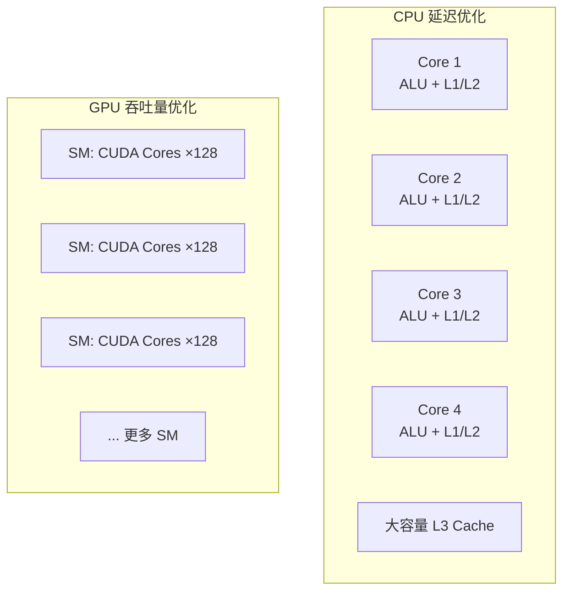
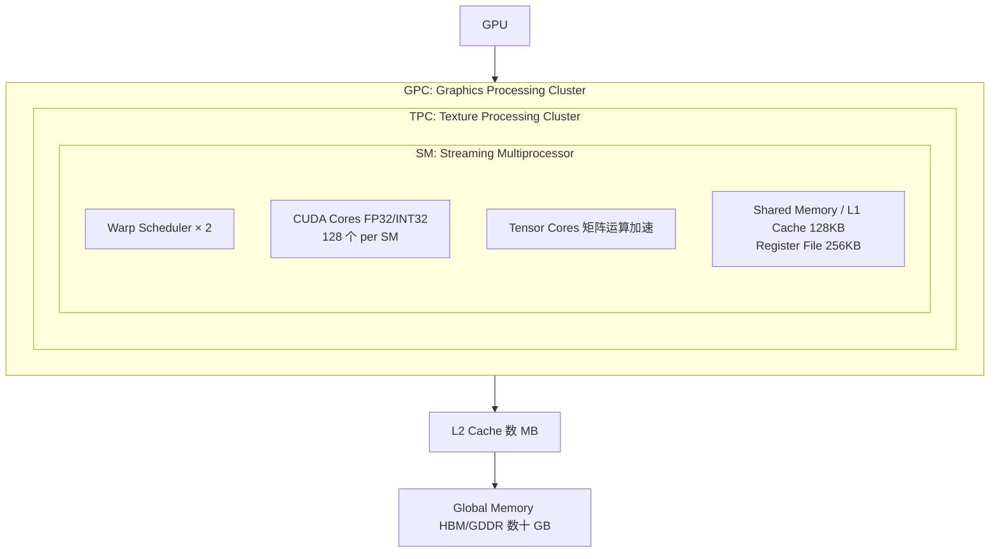
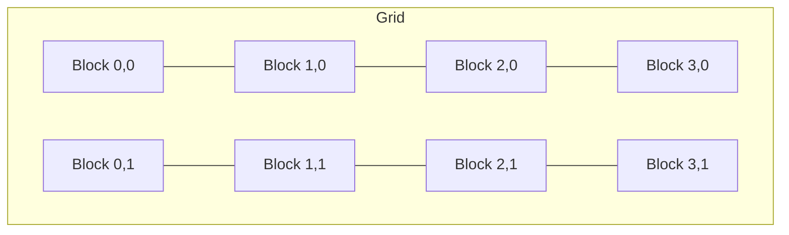

+++
title = "21.CUDA入门与GPU编程基础"
date = 2026-02-06
description = "从零开始学习CUDA：GPU架构、编程模型、内存层次、并行思维，附完整入门路线图"
[taxonomies]
tags = ["cuda", "gpu", "parallel-computing", "nvidia", "hpc"]
+++

## 概述

CUDA（Compute Unified Device Architecture）是 NVIDIA 推出的并行计算平台和编程模型。本文将从零开始，系统讲解如何入门 CUDA 开发，包括 GPU 架构理解、编程模型、内存管理、实战案例，以及学习路线规划。

---

## 一、为什么学习 CUDA

### 1.1 CUDA 的重要性

**CUDA 在现代计算中的地位：**

| 领域 | 应用场景 |
|------|----------|
| **AI/ML 训练与推理** | PyTorch、TensorFlow 底层依赖 CUDA；大模型训练：GPT、LLaMA、Stable Diffusion；推理加速：TensorRT、vLLM |
| **科学计算与 HPC** | 分子动力学模拟；气候建模；金融量化计算 |
| **图形与视觉** | 实时渲染；视频编解码；图像处理 |
| **职业发展** | AI Infra 工程师核心技能；薪资溢价显著（相比纯应用层开发）；供需失衡：人才稀缺 |

### 1.2 学习 CUDA 的前置知识

**前置知识要求：**

| 优先级 | 知识领域 |
|--------|----------|
| **必须掌握** | C/C++ 编程（指针、内存管理、结构体）；基础数据结构与算法；计算机体系结构基础概念 |
| **有帮助** | 线性代数（矩阵运算理解）；操作系统基础（进程、线程、内存）；并行编程概念（多线程、同步） |
| **不必须** | 机器学习知识（可以后学）；图形学知识（除非做渲染） |

---

## 二、GPU 架构基础

### 2.1 CPU vs GPU

**CPU 与 GPU 架构对比：**



- **CPU 特点**：4-64 个强核心、大缓存、复杂分支预测、单线程性能强、复杂控制流、低延迟
- **GPU 特点**：数千个小核心、小缓存、简单控制、大规模并行、高吞吐量、适合数据并行任务

**性能对比（RTX 4090 vs Core i9-13900K）：**

| 指标 | GPU (RTX 4090) | CPU (i9-13900K) |
|------|----------------|-----------------|
| 核心数 | 16384 CUDA Cores | 24 Cores |
| 频率 | ~2.5 GHz | ~5.8 GHz |
| 内存带宽 | 1 TB/s | ~90 GB/s |
| 峰值算力 (FP32) | 82.6 TFLOPS | ~1.5 TFLOPS |
| 功耗 | 450W | 253W |

### 2.2 NVIDIA GPU 架构

**NVIDIA GPU 层次结构（以 Ampere/Ada 为例）：**



**关键概念：**
- **SM（Streaming Multiprocessor）**：GPU 的基本计算单元
- **Warp**：32 个线程组成的执行单位（SIMT）
- **CUDA Core**：执行单精度浮点/整数运算
- **Tensor Core**：矩阵乘加加速（AI 专用）

### 2.3 内存层次

**GPU 内存层次（从快到慢）：**

| 层级 | 速度 | 容量 | 作用域 | 使用方式 |
|------|------|------|--------|----------|
| **寄存器 (Registers)** | ~1 cycle（最快） | 256KB per SM，每线程有限 | 每个线程私有 | 编译器自动分配 |
| **共享内存 (Shared Memory)** | ~5 cycles | 48-164KB per SM（可配置） | 同一 Block 内的线程共享 | `__shared__` 关键字 |
| **L1 Cache / Texture Cache** | ~28 cycles | 与 Shared Memory 共享（可配置比例） | SM 内 | 自动 |
| **L2 Cache** | ~200 cycles | 数 MB（整个 GPU 共享） | GPU 全局 | 自动 |
| **Global Memory (VRAM)** | ~400-600 cycles | 数十 GB（HBM3: 1-2 TB/s 带宽） | 所有线程可访问 | 默认，cudaMalloc 分配 |

**带宽对比：**
- Shared Memory: ~20 TB/s
- L2 Cache: ~5 TB/s
- HBM3: ~3 TB/s
- PCIe 5.0: ~64 GB/s

---

## 三、CUDA 编程模型

### 3.1 线程层次结构

**CUDA 线程组织：**



| 概念 | 说明 |
|------|------|
| **Block（线程块）** | 最多 1024 个线程；共享 Shared Memory；可以同步 (`__syncthreads`)；被调度到一个 SM |
| **Thread（线程）** | 最小执行单位；有唯一的 threadIdx；32 个线程组成 Warp；Warp 内 SIMT 执行 |

**索引计算：**
```cpp
int idx = blockIdx.x * blockDim.x + threadIdx.x;
```

**例**：`gridDim=(4,2), blockDim=(256,1)` → 总线程数 = 4 × 2 × 256 = 2048

### 3.2 第一个 CUDA 程序

```cpp
/*
 * hello_cuda.cu - 向量加法示例
 * 编译: nvcc -o hello_cuda hello_cuda.cu
 * 运行: ./hello_cuda
 */

#include <stdio.h>
#include <cuda_runtime.h>

// GPU Kernel 函数（在 GPU 上执行）
__global__ void vectorAdd(const float *A, const float *B, float *C, int N) {
    // 计算全局线程索引
    int i = blockIdx.x * blockDim.x + threadIdx.x;
    
    // 边界检查
    if (i < N) {
        C[i] = A[i] + B[i];
    }
}

int main() {
    int N = 1000000;  // 向量大小
    size_t size = N * sizeof(float);
    
    // 1. 分配 Host（CPU）内存
    float *h_A = (float*)malloc(size);
    float *h_B = (float*)malloc(size);
    float *h_C = (float*)malloc(size);
    
    // 初始化数据
    for (int i = 0; i < N; i++) {
        h_A[i] = 1.0f;
        h_B[i] = 2.0f;
    }
    
    // 2. 分配 Device（GPU）内存
    float *d_A, *d_B, *d_C;
    cudaMalloc(&d_A, size);
    cudaMalloc(&d_B, size);
    cudaMalloc(&d_C, size);
    
    // 3. 复制数据到 GPU
    cudaMemcpy(d_A, h_A, size, cudaMemcpyHostToDevice);
    cudaMemcpy(d_B, h_B, size, cudaMemcpyHostToDevice);
    
    // 4. 配置执行参数
    int threadsPerBlock = 256;
    int blocksPerGrid = (N + threadsPerBlock - 1) / threadsPerBlock;
    
    // 5. 启动 Kernel
    vectorAdd<<<blocksPerGrid, threadsPerBlock>>>(d_A, d_B, d_C, N);
    
    // 6. 等待 GPU 完成
    cudaDeviceSynchronize();
    
    // 7. 复制结果回 CPU
    cudaMemcpy(h_C, d_C, size, cudaMemcpyDeviceToHost);
    
    // 8. 验证结果
    bool success = true;
    for (int i = 0; i < N; i++) {
        if (fabs(h_C[i] - 3.0f) > 1e-5) {
            success = false;
            break;
        }
    }
    printf("Result: %s\n", success ? "PASS" : "FAIL");
    
    // 9. 释放内存
    cudaFree(d_A);
    cudaFree(d_B);
    cudaFree(d_C);
    free(h_A);
    free(h_B);
    free(h_C);
    
    return 0;
}
```

### 3.3 CUDA 关键字与函数

```cpp
/*
 * CUDA 函数修饰符
 */

// __global__: 在 GPU 执行，从 CPU 调用（Kernel）
__global__ void kernel_function() { }

// __device__: 在 GPU 执行，从 GPU 调用
__device__ float device_helper() { return 0.0f; }

// __host__: 在 CPU 执行，从 CPU 调用（默认）
__host__ void host_function() { }

// 可同时编译为 CPU 和 GPU 版本
__host__ __device__ float both_function() { return 0.0f; }

/*
 * 内置变量
 */
// threadIdx.x/y/z - Block 内的线程索引
// blockIdx.x/y/z  - Grid 内的 Block 索引
// blockDim.x/y/z  - Block 的尺寸
// gridDim.x/y/z   - Grid 的尺寸
// warpSize        - Warp 大小（32）

/*
 * 同步函数
 */
__syncthreads();     // Block 内同步
__syncwarp(mask);    // Warp 内同步
cudaDeviceSynchronize();  // CPU 等待 GPU

/*
 * 内存修饰符
 */
__shared__ float shared_data[256];   // Block 共享
__constant__ float const_data[1024]; // 常量内存（只读，缓存优化）

/*
 * 原子操作
 */
atomicAdd(&value, increment);
atomicMax(&value, new_value);
atomicCAS(&value, compare, val);
```

---

## 四、开发环境搭建

### 4.1 安装 CUDA Toolkit

```bash
# Ubuntu 22.04 安装 CUDA 12.x

# 方法1：使用 apt（推荐）
# 添加 NVIDIA 仓库
wget https://developer.download.nvidia.com/compute/cuda/repos/ubuntu2204/x86_64/cuda-keyring_1.1-1_all.deb
sudo dpkg -i cuda-keyring_1.1-1_all.deb
sudo apt update

# 安装 CUDA Toolkit
sudo apt install cuda-toolkit-12-4

# 方法2：runfile（更灵活）
wget https://developer.download.nvidia.com/compute/cuda/12.4.0/local_installers/cuda_12.4.0_550.54.14_linux.run
sudo sh cuda_12.4.0_550.54.14_linux.run

# 配置环境变量（添加到 ~/.bashrc）
export PATH=/usr/local/cuda/bin:$PATH
export LD_LIBRARY_PATH=/usr/local/cuda/lib64:$LD_LIBRARY_PATH

# 验证安装
nvcc --version
nvidia-smi
```

### 4.2 编译与运行

```bash
# 基本编译
nvcc -o program program.cu

# 指定 GPU 架构（重要！）
nvcc -arch=sm_86 -o program program.cu  # RTX 30xx
nvcc -arch=sm_89 -o program program.cu  # RTX 40xx

# 调试模式
nvcc -g -G -o program_debug program.cu

# 优化编译
nvcc -O3 -use_fast_math -o program_fast program.cu

# 生成 PTX（中间代码）
nvcc -ptx program.cu

# 分离编译（多文件）
nvcc -dc -o kernel.o kernel.cu
nvcc -dc -o main.o main.cu
nvcc -o program kernel.o main.o
```

### 4.3 调试工具

```bash
# cuda-gdb：CUDA 调试器
cuda-gdb ./program
(cuda-gdb) break kernel_function
(cuda-gdb) run
(cuda-gdb) cuda thread         # 查看当前线程
(cuda-gdb) cuda block          # 查看当前 Block
(cuda-gdb) info cuda threads   # 列出所有 CUDA 线程

# compute-sanitizer：内存检查
compute-sanitizer --tool memcheck ./program
compute-sanitizer --tool racecheck ./program  # 竞争检测

# Nsight Systems：系统级性能分析
nsys profile --stats=true ./program

# Nsight Compute：Kernel 级性能分析
ncu --set full -o profile ./program
ncu-ui profile.ncu-rep  # 图形界面查看
```

---

## 五、内存管理详解

### 5.1 内存分配与传输

```cpp
/*
 * 内存管理 API
 */

#include <cuda_runtime.h>

int main() {
    size_t size = 1024 * sizeof(float);
    float *d_data;
    float *h_data = (float*)malloc(size);
    
    // 1. 设备内存分配
    cudaMalloc(&d_data, size);
    
    // 2. 内存传输
    cudaMemcpy(d_data, h_data, size, cudaMemcpyHostToDevice);
    cudaMemcpy(h_data, d_data, size, cudaMemcpyDeviceToHost);
    
    // 3. 设备间复制
    float *d_data2;
    cudaMalloc(&d_data2, size);
    cudaMemcpy(d_data2, d_data, size, cudaMemcpyDeviceToDevice);
    
    // 4. 初始化为 0
    cudaMemset(d_data, 0, size);
    
    // 5. 异步传输（与计算重叠）
    cudaStream_t stream;
    cudaStreamCreate(&stream);
    cudaMemcpyAsync(d_data, h_data, size, cudaMemcpyHostToDevice, stream);
    
    // 6. 释放
    cudaFree(d_data);
    cudaFree(d_data2);
    cudaStreamDestroy(stream);
    free(h_data);
    
    return 0;
}
```

### 5.2 Pinned Memory（锁页内存）

```cpp
/*
 * Pinned Memory：提高传输效率
 * - 不会被操作系统换出到磁盘
 * - 可以使用 DMA 直接传输
 * - 传输速度提升 2-3x
 */

float *h_pinned;

// 分配锁页内存
cudaMallocHost(&h_pinned, size);  // 或 cudaHostAlloc

// 使用方式与普通内存相同
cudaMemcpy(d_data, h_pinned, size, cudaMemcpyHostToDevice);

// 释放
cudaFreeHost(h_pinned);

/*
 * 性能对比
 */
// Pageable Memory:  ~6 GB/s (PCIe 3.0)
// Pinned Memory:    ~12 GB/s (PCIe 3.0)
```

### 5.3 Unified Memory（统一内存）

```cpp
/*
 * Unified Memory：简化编程模型
 * - CPU 和 GPU 共享同一指针
 * - 自动数据迁移
 * - 降低入门门槛，但性能可能不如手动管理
 */

float *data;

// 分配统一内存
cudaMallocManaged(&data, size);

// CPU 初始化
for (int i = 0; i < N; i++) {
    data[i] = i;
}

// GPU 使用（自动迁移）
kernel<<<blocks, threads>>>(data, N);
cudaDeviceSynchronize();

// CPU 读取结果（自动迁移回来）
printf("Result: %f\n", data[0]);

// 释放
cudaFree(data);

/*
 * 提示：给系统预取提示
 */
cudaMemPrefetchAsync(data, size, deviceId, stream);  // 预取到 GPU
cudaMemPrefetchAsync(data, size, cudaCpuDeviceId, stream);  // 预取回 CPU
```

---

## 六、共享内存与同步

### 6.1 共享内存使用

```cpp
/*
 * 矩阵乘法优化示例：使用共享内存
 * 减少 Global Memory 访问
 */

#define TILE_SIZE 16

__global__ void matmul_shared(float *A, float *B, float *C, int N) {
    // 共享内存声明
    __shared__ float As[TILE_SIZE][TILE_SIZE];
    __shared__ float Bs[TILE_SIZE][TILE_SIZE];
    
    int bx = blockIdx.x, by = blockIdx.y;
    int tx = threadIdx.x, ty = threadIdx.y;
    
    int row = by * TILE_SIZE + ty;
    int col = bx * TILE_SIZE + tx;
    
    float sum = 0.0f;
    
    // 分块计算
    for (int t = 0; t < N / TILE_SIZE; t++) {
        // 协作加载到共享内存
        As[ty][tx] = A[row * N + t * TILE_SIZE + tx];
        Bs[ty][tx] = B[(t * TILE_SIZE + ty) * N + col];
        
        // 同步：确保所有线程完成加载
        __syncthreads();
        
        // 计算
        for (int k = 0; k < TILE_SIZE; k++) {
            sum += As[ty][k] * Bs[k][tx];
        }
        
        // 同步：确保所有线程完成计算，再加载下一块
        __syncthreads();
    }
    
    C[row * N + col] = sum;
}
```

### 6.2 Bank Conflict

**共享内存 Bank Conflict：**

共享内存被分成 32 个 Banks（每个 4 字节），同一 Warp 的线程访问同一 Bank 会产生冲突。

**Bank 分布：**
- 地址 0-3: Bank 0，地址 4-7: Bank 1，...
- 地址 128-131: Bank 0，地址 132-135: Bank 1，...

**无冲突访问：**
```
Thread 0 → Bank 0
Thread 1 → Bank 1
Thread 2 → Bank 2
...
Thread 31 → Bank 31
```

**2-way 冲突（性能减半）：**
```
Thread 0  → Bank 0  ─┐
Thread 16 → Bank 0  ─┘ 冲突！串行访问
```

**避免冲突的技巧：**
- 填充（padding）：`__shared__ float s[32][33];`
- 调整访问模式

---

## 七、性能优化基础

### 7.1 Occupancy（占用率）

**Occupancy（SM 占用率）：**

**定义**：活跃 Warp 数 / SM 最大可支持 Warp 数

**影响因素：**
- 每线程寄存器使用量
- 每 Block 共享内存使用量
- Block 大小

**示例（RTX 4090 SM）：**
- 最大 Warp 数：48
- 最大 Block 数：16
- 寄存器总量：64K
- 共享内存：100KB

如果 Kernel 每线程用 64 个寄存器：64K / 64 = 1024 线程 = 32 Warp → Occupancy = 32/48 = 66.7%

**优化建议：**
- 减少寄存器使用：`-maxrregcount=N`
- 合理设置 Block 大小
- 权衡：高 Occupancy 不一定最快

```cpp
// 查询 Occupancy
#include <cuda_runtime.h>

int main() {
    int blockSize = 256;
    int minGridSize, maxBlockSize;
    
    // 自动计算最优配置
    cudaOccupancyMaxPotentialBlockSize(
        &minGridSize, &maxBlockSize, kernel_function);
    
    // 计算特定配置的 Occupancy
    int numBlocks;
    cudaOccupancyMaxActiveBlocksPerMultiprocessor(
        &numBlocks, kernel_function, blockSize, 0);
    
    // 获取设备属性
    cudaDeviceProp prop;
    cudaGetDeviceProperties(&prop, 0);
    
    float occupancy = (float)(numBlocks * blockSize) /
                      prop.maxThreadsPerMultiProcessor;
    printf("Occupancy: %.2f%%\n", occupancy * 100);
    
    return 0;
}
```

### 7.2 内存访问优化

**Coalesced Memory Access（合并访问）：**

GPU 以 128 字节为单位访问 Global Memory，最优情况：Warp 内连续线程访问连续地址。

**合并访问（好）：** 1 次 128B 事务
```
Thread 0 → addr[0]
Thread 1 → addr[1]
Thread 2 → addr[2]
...
```

**非合并访问（差）：** 32 次 128B 事务（stride 大）
```
Thread 0 → addr[0]
Thread 1 → addr[stride]
Thread 2 → addr[2*stride]
...
```

```cpp
// 好：合并访问
__global__ void good_access(float *data, int N) {
    int idx = blockIdx.x * blockDim.x + threadIdx.x;
    if (idx < N) {
        data[idx] = data[idx] * 2.0f;  // 连续访问
    }
}

// 差：跨步访问
__global__ void bad_access(float *data, int N, int stride) {
    int idx = blockIdx.x * blockDim.x + threadIdx.x;
    if (idx * stride < N) {
        data[idx * stride] = data[idx * stride] * 2.0f;  // 非合并
    }
}

// 解决方案：AoS 转 SoA
// Array of Structures (AoS) - 不利于合并
struct Particle { float x, y, z; };
Particle particles[N];

// Structure of Arrays (SoA) - 有利于合并
struct Particles {
    float x[N];
    float y[N];
    float z[N];
};
```

---

## 八、入门学习路线

### 8.1 学习阶段

**CUDA 入门学习路线（3-6 个月）：**

| 阶段 | 时长 | 学习内容 |
|------|------|----------|
| **阶段 1：基础** | 2-4 周 | 理解 GPU vs CPU 架构差异；安装 CUDA Toolkit；编写第一个向量加法 Kernel；理解线程层次（Grid/Block/Thread）；掌握基本内存管理 |
| **阶段 2：核心概念** | 4-6 周 | 共享内存使用；同步机制（`__syncthreads`）；原子操作；流（Streams）和并发；性能分析工具（Nsight）；实现矩阵乘法优化 |
| **阶段 3：优化技巧** | 4-6 周 | 内存合并访问；Bank Conflict 避免；Occupancy 优化；指令级优化；使用 cuBLAS、cuDNN 等库 |
| **阶段 4：实战应用** | 持续 | 实现完整项目；阅读开源 Kernel 代码；学习 PyTorch CUDA Extension；深入特定领域（ML/HPC/图形） |

### 8.2 推荐资源

**学习资源：**

| 类别 | 资源 |
|------|------|
| **官方资源** | CUDA C Programming Guide（必读）；CUDA Best Practices Guide（优化必读）；NVIDIA Developer Blog；GTC 大会视频（免费） |
| **书籍** | 《CUDA C Programming Guide》；《Programming Massively Parallel Processors》；《CUDA by Example》（入门友好） |
| **在线课程** | Coursera: "CUDA Programming" by NVIDIA；Udacity: "Intro to Parallel Programming"；YouTube: "CUDA Crash Course" by CoffeeBeforeArch |
| **实践项目** | CUDA Samples（安装包自带）；GitHub: cuda-samples、cutlass；LeetCode GPU 题目 |
| **社区** | NVIDIA Developer Forums；Stack Overflow [cuda] tag；Reddit r/CUDA |

### 8.3 入门练习题

```cpp
/*
 * 练习 1：向量点积
 * 使用共享内存实现归约（reduction）
 */
__global__ void dot_product(float *a, float *b, float *result, int N);

/*
 * 练习 2：图像灰度化
 * RGB -> Gray: 0.299*R + 0.587*G + 0.114*B
 */
__global__ void rgb_to_gray(unsigned char *rgb, unsigned char *gray, 
                            int width, int height);

/*
 * 练习 3：1D 卷积
 * 使用共享内存优化
 */
__global__ void convolution_1d(float *input, float *output, 
                               float *kernel, int N, int K);

/*
 * 练习 4：直方图
 * 使用原子操作
 */
__global__ void histogram(unsigned char *data, int *hist, int N);

/*
 * 练习 5：矩阵转置
 * 处理 Bank Conflict
 */
__global__ void matrix_transpose(float *in, float *out, int N);
```

---

## 九、常见问题与解决

**CUDA 开发常见问题：**

| 问题 | 解决方案 |
|------|----------|
| **Kernel 不执行** | 检查 GPU 是否正确识别：`nvidia-smi`；检查 Kernel 参数是否正确；检查编译架构是否匹配：`-arch=sm_XX`；检查错误：`cudaGetLastError()` |
| **结果全是 0 或垃圾值** | 检查 `cudaMemcpy` 方向是否正确；检查是否等待 GPU 完成：`cudaDeviceSynchronize()`；检查数组越界 |
| **illegal memory access** | 使用 compute-sanitizer 检查；检查索引计算是否越界；检查 Grid/Block 配置 |
| **性能很差** | 使用 Nsight 分析瓶颈；检查内存访问模式；检查 Occupancy；减少 Host-Device 数据传输 |
| **共享内存 out of range** | 检查 Block 大小与共享内存大小匹配；动态共享内存需要正确传递大小 |

---

## 十、下一步

掌握 CUDA 基础后，可以继续学习：

1. **CUDA 实战应用场景** - 具体用 CUDA 做什么
2. **AI 底层开发路线** - 如何深入 AI 原理层
3. **GPU Kernel 开发进阶** - 高性能 Kernel 编写
4. **FlashAttention 原理** - LLM 推理优化

---

## 相关文章

- [上一篇：20 - 实战项目智能知识助手开发全流程](/articles/ai/ai-20-实战项目智能知识助手开发全流程/)
- [下一篇：22 - CUDA 实战应用场景详解](/articles/ai/ai-22-CUDA实战应用场景详解/)
- [02 - 大模型训练为什么 GPU 比 CPU 更合适](/articles/ai/ai-02-大模型训练为什么GPU比CPU更合适/)
- [16 - 推理框架优化技术详解](/articles/ai/ai-16-推理框架优化技术详解/)
- [14 - 分布式训练优化详解](/articles/ai/ai-14-分布式训练优化详解/)
