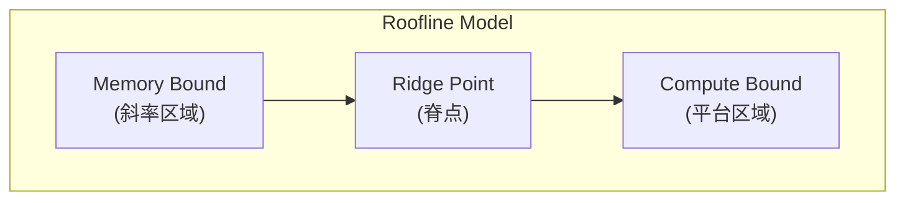
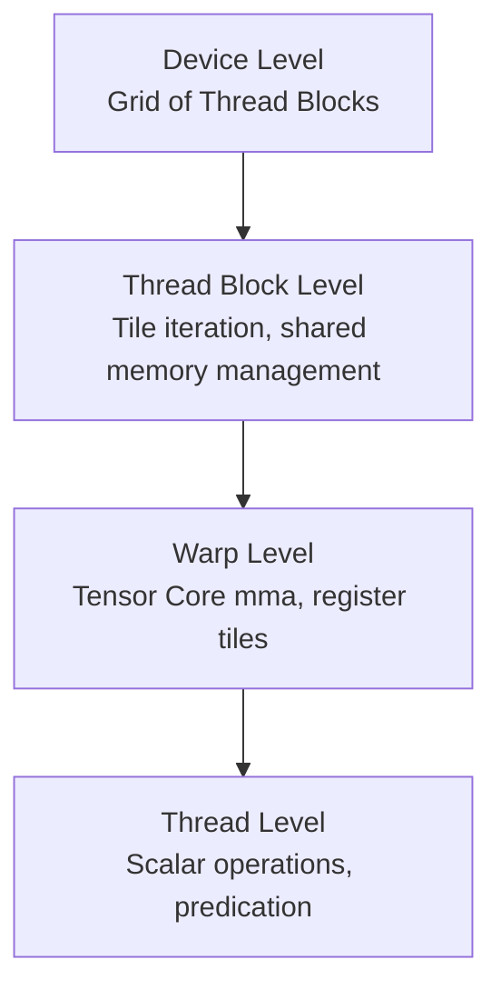

+++
title = "GPU Kernel开发详解"
date = 2026-02-06
weight = 24000
description = "高性能GPU Kernel开发：从GEMM到Attention，深入理解Tensor Core、内存优化、CUTLASS架构"
[taxonomies]
tags = ["cuda", "kernel", "gemm", "tensor-core", "cutlass", "optimization"]
+++

## 概述

GPU Kernel 开发是 AI Infra 的核心技能。本文深入讲解如何编写高性能 Kernel，包括 GEMM 优化、Tensor Core 编程、CUTLASS 架构、以及 Attention Kernel 的实现技巧。

---

## 一、高性能 Kernel 设计原则

### 1.1 性能瓶颈分析

**GPU Kernel 性能瓶颈类型：**

| 瓶颈类型 | 特征 | 优化方向 | 示例 |
|----------|------|----------|------|
| **Compute Bound（计算受限）** | 计算指令是瓶颈；内存带宽足够，ALU 饱和 | 增加计算指令级并行（ILP） | 小矩阵乘法、复杂数学函数 |
| **Memory Bound（内存受限）** | 内存访问是瓶颈；ALU 空闲等待数据 | 减少内存访问、使用缓存 | 向量加法、Softmax |
| **Latency Bound（延迟受限）** | 指令延迟无法隐藏；线程数不足 | 增加 Occupancy、使用更多线程 | - |

### 1.2 Roofline Model

**Roofline 模型：性能上限分析**



**核心概念：**
- **算术强度** = 计算量 / 内存访问量 (FLOPS/Byte)
- **脊点** = 峰值算力 / 峰值带宽
- 如果算术强度 < 脊点 → Memory Bound
- 如果算术强度 > 脊点 → Compute Bound

**RTX 4090 示例：**
- 峰值算力：82.6 TFLOPS (FP32)
- 峰值带宽：1 TB/s
- 脊点：82.6 FLOPS/Byte

### 1.3 优化策略

```cpp
/*
 * Kernel 优化清单
 */

// 1. 最大化并行度
// - 使用足够多的线程
// - 合理设置 Block 大小（通常 128-256）
// - 确保足够的 Occupancy

// 2. 优化内存访问
// - 合并访问（Coalesced Access）
// - 使用共享内存减少全局内存访问
// - 避免 Bank Conflict
// - 使用只读缓存（__ldg）

// 3. 增加指令级并行（ILP）
// - 循环展开
// - 每个线程处理多个元素
// - 隐藏内存延迟

// 4. 减少分支发散
// - 避免 Warp 内不同线程走不同分支
// - 使用谓词执行

// 5. 使用特殊硬件
// - Tensor Core
// - 快速数学函数（__expf, __sinf）

// 6. 异步操作
// - 计算与内存传输重叠
// - 使用 cuda::memcpy_async（Ampere+）
```

---

## 二、GEMM（矩阵乘法）优化

### 2.1 GEMM 优化层次

**GEMM 优化演进：**

| 优化级别 | 技术 | 性能 |
|----------|------|------|
| **Level 0：朴素实现** | 每个线程计算一个输出元素；每次计算读取一行和一列 | ~100 GFLOPS |
| **Level 1：共享内存分块** | 将矩阵分成 Tile；加载 Tile 到共享内存；减少全局内存访问 | ~1 TFLOPS |
| **Level 2：寄存器分块** | 每个线程计算多个输出元素；数据复用在寄存器中 | ~5 TFLOPS |
| **Level 3：向量化加载** | 使用 float4 加载；更高的内存带宽利用 | ~10 TFLOPS |
| **Level 4：双缓冲** | 加载下一块的同时计算当前块；隐藏内存延迟 | ~15 TFLOPS |
| **Level 5：Tensor Core** | 使用 wmma API；矩阵碎片化计算 | ~150+ TFLOPS |

### 2.2 分块 GEMM 实现

```cpp
/*
 * 高效 GEMM Kernel
 * C[M,N] = A[M,K] * B[K,N]
 */

#define BM 128  // Block 处理的 M 维度
#define BN 128  // Block 处理的 N 维度
#define BK 8    // 每次迭代处理的 K 维度
#define TM 8    // 每个线程处理的 M 维度
#define TN 8    // 每个线程处理的 N 维度

__global__ void gemm_optimized(
    const float* __restrict__ A,
    const float* __restrict__ B,
    float* __restrict__ C,
    int M, int N, int K
) {
    // Block 和 Thread 索引
    int bx = blockIdx.x, by = blockIdx.y;
    int tx = threadIdx.x, ty = threadIdx.y;
    
    // 每个 Block 有 (BM/TM) x (BN/TN) 个线程
    int threadRow = tx;  // 0 ~ BM/TM - 1
    int threadCol = ty;  // 0 ~ BN/TN - 1
    
    // 共享内存
    __shared__ float As[BM][BK];
    __shared__ float Bs[BK][BN];
    
    // 寄存器：每个线程的输出累加器
    float regC[TM][TN] = {0.0f};
    
    // 寄存器：每个线程的输入缓冲
    float regA[TM];
    float regB[TN];
    
    // A 和 B 的起始位置
    A += by * BM * K;
    B += bx * BN;
    C += by * BM * N + bx * BN;
    
    // 主循环：遍历 K 维度
    for (int k = 0; k < K; k += BK) {
        // 协作加载 A 到共享内存
        // 每个线程加载多个元素
        for (int i = 0; i < BM; i += blockDim.x) {
            for (int j = 0; j < BK; j += blockDim.y) {
                int row = i + tx;
                int col = j + ty;
                if (row < BM && (k + col) < K) {
                    As[row][col] = A[row * K + k + col];
                } else {
                    As[row][col] = 0.0f;
                }
            }
        }
        
        // 协作加载 B 到共享内存
        for (int i = 0; i < BK; i += blockDim.x) {
            for (int j = 0; j < BN; j += blockDim.y) {
                int row = i + tx;
                int col = j + ty;
                if ((k + row) < K && col < BN) {
                    Bs[row][col] = B[(k + row) * N + col];
                } else {
                    Bs[row][col] = 0.0f;
                }
            }
        }
        
        __syncthreads();
        
        // 计算：每个线程计算 TM x TN 的输出块
        for (int kk = 0; kk < BK; kk++) {
            // 加载到寄存器
            for (int m = 0; m < TM; m++) {
                regA[m] = As[threadRow * TM + m][kk];
            }
            for (int n = 0; n < TN; n++) {
                regB[n] = Bs[kk][threadCol * TN + n];
            }
            
            // 外积累加
            for (int m = 0; m < TM; m++) {
                for (int n = 0; n < TN; n++) {
                    regC[m][n] += regA[m] * regB[n];
                }
            }
        }
        
        __syncthreads();
    }
    
    // 写回结果
    for (int m = 0; m < TM; m++) {
        for (int n = 0; n < TN; n++) {
            int row = by * BM + threadRow * TM + m;
            int col = bx * BN + threadCol * TN + n;
            if (row < M && col < N) {
                C[(threadRow * TM + m) * N + threadCol * TN + n] = regC[m][n];
            }
        }
    }
}
```

### 2.3 双缓冲优化

```cpp
/*
 * 双缓冲：加载下一块的同时计算当前块
 */

__global__ void gemm_double_buffer(
    const float* A, const float* B, float* C,
    int M, int N, int K
) {
    __shared__ float As[2][BM][BK];  // 双缓冲
    __shared__ float Bs[2][BK][BN];
    
    float regC[TM][TN] = {0.0f};
    
    int write_stage = 0;
    int read_stage = 0;
    
    // 预加载第一块
    load_tile(As[write_stage], Bs[write_stage], A, B, 0);
    __syncthreads();
    write_stage ^= 1;
    
    for (int k = BK; k < K; k += BK) {
        // 异步加载下一块
        load_tile_async(As[write_stage], Bs[write_stage], A, B, k);
        
        // 计算当前块
        compute_tile(regC, As[read_stage], Bs[read_stage]);
        
        // 等待加载完成
        __syncthreads();
        
        // 交换缓冲区
        write_stage ^= 1;
        read_stage ^= 1;
    }
    
    // 计算最后一块
    compute_tile(regC, As[read_stage], Bs[read_stage]);
    
    // 写回
    store_result(C, regC);
}
```

---

## 三、Tensor Core 编程

### 3.1 Tensor Core 基础

**Tensor Core 概述：**

**功能：**
- 一条指令完成 D = A * B + C 矩阵运算
- 每个 Tensor Core：4x4x4 矩阵乘加
- Warp 级操作：处理更大的 16x16x16 片段

**支持的数据类型：**
- FP16 x FP16 → FP16/FP32
- BF16 x BF16 → FP32
- TF32 x TF32 → FP32 (Ampere+)
- INT8 x INT8 → INT32
- FP8 (Hopper+)

**性能对比（RTX 4090）：**

| 类型 | 性能 |
|------|------|
| FP32 CUDA Cores | 82.6 TFLOPS |
| FP16 Tensor Core | 330 TFLOPS |
| INT8 Tensor Core | 660 TOPS |

**限制：**
- 必须使用特定的矩阵尺寸（16x16, 8x32等）
- Warp 级协作操作
- 需要对齐的内存访问

### 3.2 WMMA API

```cpp
/*
 * 使用 WMMA API 进行 Tensor Core 编程
 */

#include <mma.h>
using namespace nvcuda;

// 片段尺寸
const int WMMA_M = 16;
const int WMMA_N = 16;
const int WMMA_K = 16;

__global__ void gemm_wmma(
    const half* A, const half* B, float* C,
    int M, int N, int K
) {
    // Warp 索引
    int warpM = (blockIdx.y * blockDim.y + threadIdx.y);
    int warpN = (blockIdx.x * blockDim.x + threadIdx.x);
    
    // 声明片段
    wmma::fragment<wmma::matrix_a, WMMA_M, WMMA_N, WMMA_K, half, 
                   wmma::row_major> a_frag;
    wmma::fragment<wmma::matrix_b, WMMA_M, WMMA_N, WMMA_K, half, 
                   wmma::row_major> b_frag;
    wmma::fragment<wmma::accumulator, WMMA_M, WMMA_N, WMMA_K, float> c_frag;
    
    // 初始化累加器
    wmma::fill_fragment(c_frag, 0.0f);
    
    // 主循环
    for (int k = 0; k < K; k += WMMA_K) {
        int aRow = warpM * WMMA_M;
        int aCol = k;
        int bRow = k;
        int bCol = warpN * WMMA_N;
        
        // 加载 A 和 B 片段
        wmma::load_matrix_sync(a_frag, A + aRow * K + aCol, K);
        wmma::load_matrix_sync(b_frag, B + bRow * N + bCol, N);
        
        // 矩阵乘加
        wmma::mma_sync(c_frag, a_frag, b_frag, c_frag);
    }
    
    // 存储结果
    int cRow = warpM * WMMA_M;
    int cCol = warpN * WMMA_N;
    wmma::store_matrix_sync(C + cRow * N + cCol, c_frag, N, 
                            wmma::mem_row_major);
}

/*
 * 调用示例
 */
void launch_gemm_wmma(half* A, half* B, float* C, int M, int N, int K) {
    // 每个 Warp 处理 16x16 输出
    // Block 大小：多个 Warp
    dim3 blockDim(4, 4);  // 16 Warps per Block
    dim3 gridDim(
        (N + (WMMA_N * blockDim.x) - 1) / (WMMA_N * blockDim.x),
        (M + (WMMA_M * blockDim.y) - 1) / (WMMA_M * blockDim.y)
    );
    
    gemm_wmma<<<gridDim, blockDim>>>(A, B, C, M, N, K);
}
```

### 3.3 优化的 Tensor Core GEMM

```cpp
/*
 * 结合共享内存和 Tensor Core 的高效 GEMM
 */

#define BLOCK_M 128
#define BLOCK_N 128
#define BLOCK_K 32
#define WARP_M 32
#define WARP_N 64

__global__ void gemm_tensor_core_optimized(
    const half* __restrict__ A,
    const half* __restrict__ B,
    float* __restrict__ C,
    int M, int N, int K
) {
    // 共享内存
    __shared__ half As[BLOCK_M][BLOCK_K];
    __shared__ half Bs[BLOCK_K][BLOCK_N];
    
    // Warp 位置
    int warpId = threadIdx.x / 32;
    int warpRow = warpId / 2;
    int warpCol = warpId % 2;
    
    // 片段
    wmma::fragment<wmma::matrix_a, 16, 16, 16, half, wmma::row_major> a_frag[2];
    wmma::fragment<wmma::matrix_b, 16, 16, 16, half, wmma::row_major> b_frag[4];
    wmma::fragment<wmma::accumulator, 16, 16, 16, float> c_frag[2][4];
    
    // 初始化
    for (int i = 0; i < 2; i++) {
        for (int j = 0; j < 4; j++) {
            wmma::fill_fragment(c_frag[i][j], 0.0f);
        }
    }
    
    // 主循环
    for (int k = 0; k < K; k += BLOCK_K) {
        // 加载到共享内存
        load_shared_a(As, A, k);
        load_shared_b(Bs, B, k);
        __syncthreads();
        
        // Tensor Core 计算
        for (int kk = 0; kk < BLOCK_K; kk += 16) {
            // 加载 A 片段
            wmma::load_matrix_sync(a_frag[0], &As[warpRow * WARP_M][kk], BLOCK_K);
            wmma::load_matrix_sync(a_frag[1], &As[warpRow * WARP_M + 16][kk], BLOCK_K);
            
            // 加载 B 片段
            for (int j = 0; j < 4; j++) {
                wmma::load_matrix_sync(b_frag[j], &Bs[kk][warpCol * WARP_N + j * 16], BLOCK_N);
            }
            
            // 矩阵乘加
            for (int i = 0; i < 2; i++) {
                for (int j = 0; j < 4; j++) {
                    wmma::mma_sync(c_frag[i][j], a_frag[i], b_frag[j], c_frag[i][j]);
                }
            }
        }
        __syncthreads();
    }
    
    // 写回
    store_result(C, c_frag);
}
```

---

## 四、CUTLASS 架构

### 4.1 CUTLASS 概述

**CUTLASS (CUDA Templates for Linear Algebra Subroutines)：**

**什么是 CUTLASS：**
- NVIDIA 开源的高性能 GEMM 模板库
- C++ 模板元编程
- 支持各种数据类型和布局
- FlashAttention 等项目的基础

**架构层次：**



**核心组件：**
- **Gemm**：矩阵乘法模板
- **Epilogue**：后处理（bias、激活函数）
- **Layout**：内存布局
- **Tile Iterator**：数据加载迭代器

### 4.2 CUTLASS 使用示例

```cpp
/*
 * 使用 CUTLASS 进行 GEMM
 */

#include <cutlass/cutlass.h>
#include <cutlass/gemm/device/gemm.h>

// 定义 GEMM 类型
using ElementA = cutlass::half_t;
using ElementB = cutlass::half_t;
using ElementC = float;
using ElementAccumulator = float;

using LayoutA = cutlass::layout::RowMajor;
using LayoutB = cutlass::layout::RowMajor;
using LayoutC = cutlass::layout::RowMajor;

// 定义 Tile 尺寸
using ShapeMMAThreadBlock = cutlass::gemm::GemmShape<128, 128, 32>;
using ShapeMMAWarp = cutlass::gemm::GemmShape<64, 64, 32>;
using ShapeMMAOp = cutlass::gemm::GemmShape<16, 8, 16>;

// 定义 GEMM 操作
using Gemm = cutlass::gemm::device::Gemm<
    ElementA, LayoutA,
    ElementB, LayoutB,
    ElementC, LayoutC,
    ElementAccumulator,
    cutlass::arch::OpClassTensorOp,
    cutlass::arch::Sm80,
    ShapeMMAThreadBlock,
    ShapeMMAWarp,
    ShapeMMAOp,
    cutlass::epilogue::thread::LinearCombination<
        ElementC, 128 / cutlass::sizeof_bits<ElementC>::value,
        ElementAccumulator, ElementAccumulator
    >,
    cutlass::gemm::threadblock::GemmIdentityThreadblockSwizzle<>,
    3  // Stages
>;

// 执行 GEMM
void run_cutlass_gemm(
    cutlass::half_t* A, cutlass::half_t* B, float* C,
    int M, int N, int K
) {
    // 配置参数
    typename Gemm::Arguments args{
        {M, N, K},           // 问题尺寸
        {A, K},              // A 矩阵
        {B, N},              // B 矩阵
        {C, N},              // C 矩阵（输入）
        {C, N},              // D 矩阵（输出）
        {1.0f, 0.0f}         // alpha, beta
    };
    
    // 实例化 GEMM
    Gemm gemm_op;
    
    // 检查参数
    cutlass::Status status = gemm_op.can_implement(args);
    if (status != cutlass::Status::kSuccess) {
        // 错误处理
    }
    
    // 分配工作空间
    size_t workspace_size = Gemm::get_workspace_size(args);
    void* workspace;
    cudaMalloc(&workspace, workspace_size);
    
    // 执行
    status = gemm_op(args, workspace);
    
    cudaFree(workspace);
}
```

### 4.3 自定义 Epilogue

```cpp
/*
 * 自定义 Epilogue：融合 GELU 激活
 */

template <typename ElementOutput, int Count>
struct GELUEpilogue {
    using Fragment = cutlass::Array<ElementOutput, Count>;
    
    CUTLASS_HOST_DEVICE
    Fragment operator()(Fragment const& input) const {
        Fragment output;
        
        CUTLASS_PRAGMA_UNROLL
        for (int i = 0; i < Count; ++i) {
            float x = float(input[i]);
            // GELU: x * 0.5 * (1 + tanh(sqrt(2/pi) * (x + 0.044715 * x^3)))
            float cdf = 0.5f * (1.0f + tanhf(0.7978845608f * (x + 0.044715f * x * x * x)));
            output[i] = ElementOutput(x * cdf);
        }
        
        return output;
    }
};

// 融合 GEMM + GELU
using GemmWithGELU = cutlass::gemm::device::Gemm<
    // ... 其他参数
    cutlass::epilogue::thread::LinearCombinationGeneric<
        GELUEpilogue,
        ElementC, Count,
        ElementAccumulator, ElementAccumulator
    >,
    // ...
>;
```

---

## 五、高级 GEMM 调度：Stream-K 与 Split-K

在上一节介绍了 CUTLASS 架构后，本节深入讲解 GEMM 的高级调度策略。标准的 Tiled GEMM 在面对非规则矩阵尺寸时存在严重的 **尾部效应（Tail Effect）**，导致 GPU 利用率下降。Split-K 和 Stream-K 是 CUTLASS 提供的两种高级调度策略，专门解决这一问题。这是 NVIDIA CUDA 面试中的高频考点。

### 5.1 尾部效应问题（Tail Effect）

#### 5.1.1 标准 Tiled GEMM 的 Tile 映射

在标准的 Data-Parallel GEMM 中，输出矩阵 C[M, N] 被划分为固定大小的 Tile（例如 128×128），每个 Tile 映射到一个 Thread Block：

```
标准 Tiled GEMM 映射：C[M, N] = A[M, K] × B[K, N]

Grid 尺寸 = ceil(M / TILE_M) × ceil(N / TILE_N)

输出矩阵 C 的 Tile 划分（TILE_M = TILE_N = 128）：

    ┌──────────┬──────────┬──────────┬──────────┬────┐
    │ TB(0,0)  │ TB(0,1)  │ TB(0,2)  │ TB(0,3)  │pad │ N=480
    │ 128×128  │ 128×128  │ 128×128  │ 128×128  │    │
    ├──────────┼──────────┼──────────┼──────────┼────┤
    │ TB(1,0)  │ TB(1,1)  │ TB(1,2)  │ TB(1,3)  │pad │
    │ 128×128  │ 128×128  │ 128×128  │ 128×128  │    │
    ├──────────┼──────────┼──────────┼──────────┼────┤
    │ TB(2,0)  │ TB(2,1)  │ TB(2,2)  │ TB(2,3)  │pad │ M=300
    │ 44×128   │ 44×128   │ 44×128   │ 44×128   │    │ ← 尾部 Tile
    └──────────┴──────────┴──────────┴──────────┴────┘

    TB = Thread Block
    最后一行 Tile 只有 44 行有效数据（300 - 128×2 = 44）
    最后一列 Tile 只有 96 列有效数据（480 - 128×3 = 96）
```

#### 5.1.2 尾部效应的本质

**问题核心：当 M、N 不能被 Tile 尺寸整除时，边缘 Tile 的计算量远小于内部 Tile，导致部分 SM 提前完成而空闲。**

```
GPU SM 时间线示意（假设 8 个 SM，12 个 Thread Block）：

SM0: [===TB0===][===TB8===]
SM1: [===TB1===][===TB9===]
SM2: [===TB2===][==TB10==]        ← 尾部 Tile 计算量小
SM3: [===TB3===][==TB11==]        ← 提前完成
SM4: [===TB4===]                   ← 只有一波
SM5: [===TB5===]     空闲 ↓
SM6: [===TB6===]     空闲 ↓       ← 第二波只有 4 个 TB
SM7: [===TB7===]     空闲 ↓          部分 SM 完全空闲
                  ↑
            第一波结束，第二波开始

时间 ────────────────────────────────────────────→
      │← 第一波（满载） →│← 第二波（欠载） →│
                                              ↑ 尾部效应
```

**尾部效应的严重程度取决于：**

| 因素 | 影响 | 示例 |
|------|------|------|
| **矩阵尺寸** | 小矩阵尾部效应更严重 | M=N=256，Tile=128 → 只有 4 个 TB |
| **Tile 尺寸** | 大 Tile 加剧不均衡 | Tile=256 时浪费更多 |
| **SM 数量** | SM 越多，欠载越明显 | A100 有 108 个 SM |
| **矩阵形状** | Tall-skinny / Short-wide 最严重 | LLM 推理：batch=1, hidden=4096 |

#### 5.1.3 LLM 推理中的尾部效应

在 LLM 推理场景中，尾部效应尤其突出：

```
LLM 推理常见矩阵形状：

1. Attention 中的 QK^T：
   Q[batch×heads, seq_len, head_dim] × K^T[batch×heads, head_dim, seq_len]
   - 当 batch=1, seq_len=1（decode 阶段）：
     M=1, N=seq_len, K=head_dim=128
   → 极端 tall-skinny，标准 GEMM 只有 1 个 Tile 行

2. FFN 的线性层：
   X[batch, hidden] × W[hidden, 4*hidden]
   - 当 batch=1：
     M=1, N=4*4096=16384, K=4096
   → 只有 1 行 Tile，128 列 Tile → 128 个 TB
   → A100 108 SM 只需 2 波，但第 2 波只有 20 个 TB（18.5% 利用率）

3. 多 batch 场景也不完美：
   batch=7, hidden=4096, Tile=128
   → M 方向 ceil(7/128)=1 行 Tile
   → 仍然只有 1 行 Tile，无法充分利用 SM
```

### 5.2 Split-K 策略

#### 5.2.1 核心思想

**Split-K 的关键洞察：当 M×N 产生的 Tile 数量不足以填满所有 SM 时，可以沿 K（归约）维度拆分，增加 Thread Block 数量。**

```
标准 GEMM vs Split-K 对比：

标准 Data-Parallel（1 个 TB 处理完整 K 维度）：
                     K
    A: ┌─────────────────────┐     B: ┌──────┐
       │     TB(i,j)         │        │      │
  TILE │  扫描整个 K 维度    │   TILE │      │
       │  一个 TB 独占       │        │      │
       └─────────────────────┘        └──────┘
                                     K 维度

Split-K = 4（K 维度拆成 4 份，4 个 TB 处理同一个输出 Tile）：
                     K
    A: ┌─────┬─────┬─────┬─────┐   B: ┌──────┐
       │TB0  │TB1  │TB2  │TB3  │      │ TB0  │
  TILE │K/4  │K/4  │K/4  │K/4  │ TILE │ TB1  │
       │     │     │     │     │      │ TB2  │
       └─────┴─────┴─────┴─────┘      │ TB3  │
                                       └──────┘
       ↓     ↓     ↓     ↓
     partial partial partial partial
      sum0   sum1   sum2   sum3
       └──────┴──────┴──────┘
                  ↓
            Reduction（求和）
                  ↓
            Final C[tile]
```

#### 5.2.2 Split-K 算法详解

```cpp
/*
 * Split-K GEMM 伪代码
 * 
 * 总 Thread Block 数 = ceil(M/TILE_M) × ceil(N/TILE_N) × split_k_slices
 * 每个 TB 只计算 K/split_k_slices 长度的部分和
 */

// ============ 阶段 1：并行计算部分和 ============

__global__ void gemm_splitk_kernel(
    const half* A, const half* B,
    float* partial_C,          // 部分和存储在全局内存
    int M, int N, int K,
    int split_k_slices
) {
    int tile_m = blockIdx.y;
    int tile_n = blockIdx.x;
    int split_k_idx = blockIdx.z;  // 第几个 K 分片
    
    // 每个分片负责的 K 范围
    int k_start = split_k_idx * (K / split_k_slices);
    int k_end = (split_k_idx == split_k_slices - 1) ? K 
                : (split_k_idx + 1) * (K / split_k_slices);
    
    float regC[TM][TN] = {0.0f};
    
    // 只遍历本分片负责的 K 范围
    for (int k = k_start; k < k_end; k += TILE_K) {
        // 加载 A[tile_m, k:k+TILE_K] 到共享内存
        // 加载 B[k:k+TILE_K, tile_n] 到共享内存
        // Tensor Core 计算
        // ...（与标准 GEMM 相同）
    }
    
    // 将部分和写入全局内存
    // partial_C 的布局：[split_k_slices, M, N]
    int offset = split_k_idx * M * N;
    for (int m = 0; m < TM; m++) {
        for (int n = 0; n < TN; n++) {
            int row = tile_m * TILE_M + threadRow * TM + m;
            int col = tile_n * TILE_N + threadCol * TN + n;
            if (row < M && col < N) {
                partial_C[offset + row * N + col] = regC[m][n];
            }
        }
    }
}

// ============ 阶段 2：归约部分和 ============

// 方法 A：单独的 Reduction Kernel
__global__ void splitk_reduction(
    const float* partial_C,    // [split_k_slices, M, N]
    float* C,                  // [M, N]
    int M, int N, int split_k_slices
) {
    int idx = blockIdx.x * blockDim.x + threadIdx.x;
    if (idx >= M * N) return;
    
    float sum = 0.0f;
    for (int s = 0; s < split_k_slices; s++) {
        sum += partial_C[s * M * N + idx];
    }
    C[idx] = sum;
}

// 方法 B：使用原子操作（避免额外 Kernel launch）
// 在 gemm_splitk_kernel 中直接：
//   atomicAdd(&C[row * N + col], regC[m][n]);
// 缺点：原子操作竞争，性能不确定
```

#### 5.2.3 Split-K 的 SM 利用率改进

```
示例：M=256, N=256, K=4096, TILE=128, GPU=8 SM

标准 Data-Parallel：
  Grid = ceil(256/128) × ceil(256/128) = 2 × 2 = 4 个 TB
  → 只占用 4/8 = 50% 的 SM ❌

Split-K = 4：
  Grid = 2 × 2 × 4 = 16 个 TB
  → 16 个 TB 分 2 波执行，所有 SM 满载 ✅

Split-K = 8：
  Grid = 2 × 2 × 8 = 32 个 TB
  → 32 个 TB 分 4 波执行，全部 SM 满载 ✅
  → 但 Reduction 开销增加 ⚠️
```

#### 5.2.4 Split-K 的优缺点

| 优点 | 缺点 |
|------|------|
| 增加并行度，提高 SM 利用率 | 需要额外的 Reduction 步骤 |
| 实现相对简单 | 部分和需要额外的全局内存（split_k × M × N） |
| 对 K >> M×N 的场景非常有效 | Reduction 的全局内存读写开销 |
| CUTLASS 原生支持 | split_k_slices 需要调优 |
| 可与 Tensor Core 结合 | K 不能被 split_k_slices 整除时需要特殊处理 |

### 5.3 Stream-K 策略

#### 5.3.1 核心思想

**Stream-K 是 CUTLASS 3.x 引入的更先进调度策略。核心思想：将整个 GEMM 的工作量视为一个连续的"流"，均匀分配给所有可用的 Thread Block，彻底消除尾部效应。**

```
Stream-K vs 传统策略对比：

Data-Parallel（标准）：
  ┌──────┐ ┌──────┐ ┌──────┐ ┌──────┐ ┌──┐
  │ TB0  │ │ TB1  │ │ TB2  │ │ TB3  │ │4 │  ← TB4 工作量少
  │ 完整 │ │ 完整 │ │ 完整 │ │ 完整 │ │  │
  │ Tile │ │ Tile │ │ Tile │ │ Tile │ │  │
  └──────┘ └──────┘ └──────┘ └──────┘ └──┘
  1 Tile/TB，固定映射，尾部 TB 工作量不均

Split-K（K 维度拆分）：
  每个 Tile 被多个 TB 分担，但 Tile 间仍然固定映射
  Tile0: [TB0|TB1]  Tile1: [TB2|TB3]  Tile2: [TB4|TB5]
  ↓ 需要 Reduction

Stream-K（流式调度）：
  总工作量 = num_tiles × k_iterations_per_tile
  均匀分配给 N 个 TB

  TB0: [====Tile0的前60%====][==Tile1的前20%==]
  TB1: [==Tile0的后40%==][====Tile1的中50%====]
  TB2: [==Tile1的后30%==][======Tile2全部======]
  TB3: [======Tile3全部======][==Tile4的前70%==]
  TB4: [==Tile4的后30%==][======Tile5全部======]
       ↑ 每个 TB 工作量几乎相等，完美负载均衡
       ↑ 一个 TB 可以处理 Tile 的一部分（Partial Tile）
```

#### 5.3.2 Stream-K 算法详解

```cpp
/*
 * Stream-K GEMM 核心算法
 * 
 * 关键概念：
 * - "work unit" = 一个输出 Tile 沿 K 维度的一次迭代（k_step）
 * - total_units = num_output_tiles × k_iterations_per_tile
 * - 均匀分配 total_units 给所有 Thread Block
 */

struct StreamKParams {
    int M, N, K;
    int tile_m, tile_n, tile_k;
    int num_tiles_m, num_tiles_n;  // 输出 Tile 网格尺寸
    int k_iters_per_tile;          // 每个 Tile 的 K 迭代次数
    int total_work_units;          // 总工作量
    int num_threadblocks;          // 总 TB 数（通常 = SM 数 × occupancy）
    int units_per_tb;              // 每个 TB 的基础工作量
    int remainder;                 // 余数（前 remainder 个 TB 多做 1 个 unit）
};

__global__ void gemm_stream_k(
    const half* A, const half* B, float* C,
    float* partial_sums,  // 用于跨 TB 的部分和
    int* tile_locks,      // 同步锁
    StreamKParams params
) {
    int tb_idx = blockIdx.x;
    
    // 计算本 TB 的工作范围 [unit_start, unit_end)
    int unit_start, unit_end;
    if (tb_idx < params.remainder) {
        unit_start = tb_idx * (params.units_per_tb + 1);
        unit_end = unit_start + params.units_per_tb + 1;
    } else {
        unit_start = params.remainder * (params.units_per_tb + 1) 
                   + (tb_idx - params.remainder) * params.units_per_tb;
        unit_end = unit_start + params.units_per_tb;
    }
    
    // 遍历本 TB 负责的 work units
    int current_unit = unit_start;
    while (current_unit < unit_end) {
        // 将 work unit 编号映射到 (tile_idx, k_iter)
        int tile_idx = current_unit / params.k_iters_per_tile;
        int k_iter = current_unit % params.k_iters_per_tile;
        
        int tile_row = tile_idx / params.num_tiles_n;
        int tile_col = tile_idx % params.num_tiles_n;
        
        // 确定本 TB 在这个 Tile 上的 K 范围
        int k_start_iter = k_iter;
        int k_end_iter = min(
            params.k_iters_per_tile,
            k_start_iter + (unit_end - current_unit)
        );
        
        float regC[TM][TN] = {0.0f};
        
        // 如果不是从 K=0 开始，需要加载之前的部分和
        bool is_first_k = (k_start_iter == 0);
        bool is_last_k = (k_end_iter == params.k_iters_per_tile);
        
        // 计算本段 K 范围的部分和
        for (int ki = k_start_iter; ki < k_end_iter; ki++) {
            int k = ki * params.tile_k;
            // 标准 Tile GEMM 计算（共享内存 + Tensor Core）
            // ...
        }
        
        if (is_first_k && is_last_k) {
            // 完整 Tile：直接写入 C
            store_to_C(C, regC, tile_row, tile_col);
        } else if (is_last_k) {
            // 最后一段：等待之前的部分和，累加后写入 C
            wait_for_partial(tile_locks, tile_idx);
            load_and_add_partial(partial_sums, regC, tile_idx);
            store_to_C(C, regC, tile_row, tile_col);
        } else {
            // 中间段或第一段：写入部分和
            if (!is_first_k) {
                wait_for_partial(tile_locks, tile_idx);
                load_and_add_partial(partial_sums, regC, tile_idx);
            }
            store_partial(partial_sums, regC, tile_idx);
            signal_partial_ready(tile_locks, tile_idx);
        }
        
        current_unit += (k_end_iter - k_start_iter);
    }
}
```

#### 5.3.3 Stream-K 的关键创新

**1. Partial Tile 处理**

Stream-K 最核心的创新是允许一个 Thread Block **只处理 Tile 的一部分 K 迭代**，然后由下一个 Thread Block 继续。这要求：

```
Partial Tile 协作机制：

Tile X 的 K 维度有 16 次迭代（K=2048, tile_k=128）

     K 迭代: 0  1  2  3  4  5  6  7  8  9  10 11 12 13 14 15
             ├──────────────┤├───────────────────────┤├──────┤
             │   TB_A        ││        TB_B           ││ TB_C │
             │  (前 5 次)    ││    (中间 8 次)         ││(后3次)│
             └───────┬───────┘└───────────┬───────────┘└──┬───┘
                     ↓                    ↓               ↓
               partial_sum_0        partial_sum_1     final_sum
                     │                    │               │
                     └──> 写入 buffer ──> 累加 ──> 累加并写入 C

同步机制：
  - TB_A 完成后，signal tile_locks[X]
  - TB_B 等待 tile_locks[X]，读取 partial_sum_0，累加自己的结果
  - TB_B 完成后，再次 signal tile_locks[X]
  - TB_C 等待，读取累加结果，加上自己的部分，写入最终 C
```

**2. 工作量均匀分配**

```
示例：M=384, N=256, K=2048, TILE=128, tile_k=128, SM=108

标准 Data-Parallel：
  Tiles = ceil(384/128) × ceil(256/128) = 3 × 2 = 6 个 Tile
  → 6 个 TB，只用 6/108 = 5.6% 的 SM ❌

Split-K = 18：
  TB = 6 × 18 = 108，刚好填满
  → 但 K/18 ≈ 113，不能整除 tile_k=128 ⚠️

Stream-K：
  k_iters_per_tile = 2048 / 128 = 16
  total_units = 6 × 16 = 96
  num_tb = 96（或更少，取决于 SM 数量）
  units_per_tb = 96 / 96 = 1
  → 96 个 TB，每个做 1 个 work unit ✅
  → 完美均匀分配，无浪费
```

**3. 混合调度（Hybrid Stream-K + Data-Parallel）**

在实际 CUTLASS 实现中，Stream-K 通常采用混合模式：

```
混合调度策略：

总 Tile 数 = num_tiles = ceil(M/tile_m) × ceil(N/tile_n)

分为两组：
1. Stream-K Tiles：前 sk_tiles 个 Tile
   - 这些 Tile 使用 Stream-K 调度
   - 目的：填满"不完整的波"
   
2. Data-Parallel Tiles：剩余的 dp_tiles = num_tiles - sk_tiles 个 Tile
   - 这些 Tile 使用标准 1:1 映射
   - 这些 Tile 恰好构成完整的波

计算方法：
  full_waves = num_tiles / num_sms           // 完整波数
  dp_tiles = full_waves * num_sms            // DP 处理的 Tile 数
  sk_tiles = num_tiles - dp_tiles            // Stream-K 处理的 Tile 数
  sk_units = sk_tiles × k_iters_per_tile     // Stream-K 总工作量
  sk_tbs = min(sk_units, num_sms)            // Stream-K TB 数

示例：num_tiles=250, num_sms=108
  full_waves = 250 / 108 = 2
  dp_tiles = 2 × 108 = 216
  sk_tiles = 250 - 216 = 34
  sk_tbs = min(34 × 16, 108) = 108（假设 k_iters=16）
  
  Grid: [108 个 SK TB] + [216 个 DP TB] = 324 个 TB
  第一波：108 SK TB → 处理 34 个 Tile 的 Stream-K 部分
  第二波：108 DP TB → 标准 DP
  第三波：108 DP TB → 标准 DP
  → 3 波全满，零浪费 ✅
```

### 5.4 Data-Parallel vs Split-K vs Stream-K 对比

| 对比维度 | Data-Parallel（标准） | Split-K | Stream-K |
|----------|----------------------|---------|----------|
| **调度方式** | 1 个输出 Tile → 1 个 TB | 1 个输出 Tile → split_k 个 TB | 全局工作量均匀分配给 TB |
| **负载均衡** | 差（尾部效应严重） | 中等（Tile 间仍不均衡） | 优（接近完美均衡） |
| **Reduction 开销** | 无 | 需要（额外 Kernel 或 atomicAdd） | 极小（只有 Partial Tile 需要） |
| **额外内存** | 无 | split_k × M × N（部分和） | 很少（只为 Partial Tile 分配） |
| **全局内存流量** | 最小 | 较大（写+读部分和） | 小（Partial Tile 占比小） |
| **实现复杂度** | 简单 | 中等 | 高 |
| **最佳场景** | 大矩阵，Tile 数 >> SM 数 | K >> M×N | 任意形状，尤其是非规则尺寸 |
| **CUTLASS 支持** | 2.x / 3.x | 2.x / 3.x | 3.x（CUTLASS 3.0+） |
| **Kernel Launch** | 1 次 | 1-2 次（+reduction） | 1 次 |
| **SM 利用率上限** | Tile 数 / SM 数 | (Tile 数 × split_k) / SM 数 | ~100%（理论最优） |

**性能比较示意（M=256, N=256, K=8192, A100 108 SM）：**

```
Data-Parallel:  [████░░░░░░░░░░░░░░░░]  SM利用率 ~3.7%  (4 TBs / 108 SMs)
Split-K=27:     [████████████████████]  SM利用率 100%   (108 TBs)
                + Reduction Kernel 开销
Stream-K:       [████████████████████]  SM利用率 ~100%  (≤108 TBs)
                  无额外 Reduction Kernel
```

### 5.5 实践考量

#### 5.5.1 策略选择指南

根据矩阵形状选择最佳策略：

```
决策流程：

                  GEMM(M, N, K)
                       │
                       ▼
            num_tiles = ceil(M/Tm) × ceil(N/Tn)
                       │
                       ▼
              num_tiles >= 4 × num_SMs ?
              ╱                        ╲
           Yes                          No
            │                            │
            ▼                            ▼
    Data-Parallel              K 是否远大于 M×N?
    （标准 GEMM）              ╱              ╲
                            Yes               No
                             │                 │
                             ▼                 ▼
                         Split-K          Stream-K
                   （K 整除性好时）    （通用最优方案）
                                      
特殊情况：
  - 如果 num_tiles < num_SMs 且 K 很小 → Stream-K 仍为最优
  - 如果 K 不能被 split_k 很好整除 → 优先 Stream-K
  - 如果需要最小化 Kernel launch 次数 → Stream-K（单次 launch）
```

#### 5.5.2 常见 LLM 矩阵形状与推荐策略

| 操作 | 形状（batch=1 decode） | 推荐策略 |
|------|----------------------|----------|
| QKV Projection | M=1, N=3×4096, K=4096 | Stream-K / Split-K |
| Attention Score | M=1, N=seq_len, K=128 | Stream-K |
| Attention Output | M=1, N=128, K=seq_len | Split-K（K=seq_len 大时）|
| FFN Up | M=1, N=11008, K=4096 | Stream-K |
| FFN Down | M=1, N=4096, K=11008 | Split-K / Stream-K |
| 大 batch（batch=64） | M=64, N=4096, K=4096 | Data-Parallel（可能足够）|

#### 5.5.3 CUTLASS 中的自动调优

```cpp
/*
 * CUTLASS 3.x 提供了 auto-tuning 框架来选择最优策略
 * 以下是关键的 Profiling 流程
 */

// 策略枚举
enum class GemmScheduleMode {
    DataParallel,   // 标准 1:1 映射
    SplitK,         // Split-K 并行
    StreamK,        // Stream-K 流式调度
    Auto            // 自动选择
};

// Profile-Guided 选择伪代码
GemmScheduleMode select_schedule(int M, int N, int K, int num_sms) {
    int tile_m = 128, tile_n = 128;
    int num_tiles = ((M + tile_m - 1) / tile_m) * ((N + tile_n - 1) / tile_n);
    
    // 规则 1：Tile 数远超 SM 数 → Data-Parallel
    if (num_tiles >= 4 * num_sms) {
        return GemmScheduleMode::DataParallel;
    }
    
    // 规则 2：Tile 数很少但 K 很大 → Split-K 或 Stream-K
    if (num_tiles < num_sms) {
        int k_iters = (K + tile_k - 1) / tile_k;
        if (k_iters >= 8 && K % (tile_k * 4) == 0) {
            // K 对齐良好，Split-K 高效
            return GemmScheduleMode::SplitK;
        }
        return GemmScheduleMode::StreamK;
    }
    
    // 规则 3：Tile 数与 SM 数接近但不是整数倍 → Stream-K
    if (num_tiles % num_sms != 0) {
        return GemmScheduleMode::StreamK;
    }
    
    return GemmScheduleMode::DataParallel;
}

// 实际应用中，通常使用 Profiling 确定最优参数：
// 1. 枚举候选配置（Tile 尺寸 × 调度策略 × Split-K factor）
// 2. 每个配置运行 warm-up + benchmark
// 3. 选择最快的配置
// CUTLASS Profiler 工具可以自动完成这个流程
```

### 5.6 CUTLASS 配置示例

#### 5.6.1 CUTLASS 2.x Split-K 配置

```cpp
#include <cutlass/cutlass.h>
#include <cutlass/gemm/device/gemm.h>
#include <cutlass/gemm/device/gemm_splitk_parallel.h>

// 定义 Split-K GEMM
using GemmSplitK = cutlass::gemm::device::GemmSplitKParallel<
    cutlass::half_t,                          // ElementA
    cutlass::layout::RowMajor,                // LayoutA
    cutlass::half_t,                          // ElementB
    cutlass::layout::RowMajor,                // LayoutB
    float,                                    // ElementC
    cutlass::layout::RowMajor,                // LayoutC
    float,                                    // ElementAccumulator
    cutlass::arch::OpClassTensorOp,           // Operator Class
    cutlass::arch::Sm80,                      // Architecture
    cutlass::gemm::GemmShape<128, 128, 32>,   // ThreadBlock Tile
    cutlass::gemm::GemmShape<64, 64, 32>,     // Warp Tile
    cutlass::gemm::GemmShape<16, 8, 16>,      // MMA Op (Tensor Core)
    cutlass::epilogue::thread::LinearCombination<
        float, 128 / cutlass::sizeof_bits<float>::value,
        float, float
    >
>;

void run_splitk_gemm(
    cutlass::half_t* A, cutlass::half_t* B, float* C,
    int M, int N, int K, int split_k_slices
) {
    typename GemmSplitK::Arguments args{
        {M, N, K},                 // Problem size
        {A, K},                    // A: ptr + leading dimension
        {B, N},                    // B: ptr + leading dimension
        {C, N},                    // C source
        {C, N},                    // D destination
        {1.0f, 0.0f},             // alpha, beta
        split_k_slices             // Split-K factor
    };
    
    GemmSplitK gemm_op;
    size_t workspace_size = GemmSplitK::get_workspace_size(args);
    
    void* workspace;
    cudaMalloc(&workspace, workspace_size);  // 用于存储部分和
    
    gemm_op.initialize(args, workspace);
    gemm_op();  // 执行（内部自动 launch GEMM + Reduction）
    
    cudaFree(workspace);
}
```

#### 5.6.2 CUTLASS 3.x Stream-K 配置

```cpp
#include <cutlass/cutlass.h>
#include <cutlass/gemm/device/gemm_universal_adapter.h>
#include <cutlass/gemm/collective/collective_builder.hpp>
#include <cutlass/gemm/kernel/gemm_universal.hpp>
#include <cute/tensor.hpp>

using namespace cute;

// ========== CUTLASS 3.x Stream-K GEMM 配置 ==========

// 1. 定义问题类型
using ElementA = cutlass::half_t;
using ElementB = cutlass::half_t;
using ElementC = float;
using ElementAccumulator = float;

// 2. 定义 Tile 形状（使用 CuTe 语法）
using TileShape = Shape<_128, _128, _64>;  // M, N, K tile

// 3. 定义 Collective Mainloop（核心计算逻辑）
using CollectiveMainloop = typename cutlass::gemm::collective::CollectiveBuilder<
    cutlass::arch::Sm90,                    // Hopper 架构
    cutlass::arch::OpClassTensorOp,         // Tensor Core
    ElementA, cutlass::layout::RowMajor, 8, // A: type, layout, alignment
    ElementB, cutlass::layout::RowMajor, 8, // B: type, layout, alignment
    ElementAccumulator,
    TileShape,
    Shape<_1, _1, _1>,                      // Cluster shape
    cutlass::gemm::collective::StageCountAutoCarveout<
        static_cast<int>(sizeof(typename cutlass::epilogue::collective::
            detail::Sm90TmaWarpSpecializedAdapter<>::SharedStorage))
    >,
    cutlass::gemm::KernelTmaWarpSpecializedCooperative  // Kernel schedule
>::CollectiveOp;

// 4. 定义 Collective Epilogue
using CollectiveEpilogue = typename cutlass::epilogue::collective::CollectiveBuilder<
    cutlass::arch::Sm90,
    cutlass::arch::OpClassTensorOp,
    TileShape,
    Shape<_1, _1, _1>,
    cutlass::epilogue::collective::EpilogueTileAuto,
    ElementAccumulator,
    ElementAccumulator,
    ElementC, cutlass::layout::RowMajor, 4,
    ElementC, cutlass::layout::RowMajor, 4,
    cutlass::epilogue::collective::EpilogueScheduleAuto
>::CollectiveOp;

// 5. 定义 Kernel 类型
using GemmKernel = cutlass::gemm::kernel::GemmUniversal<
    Shape<int, int, int, int>,  // Problem shape: M, N, K, L
    CollectiveMainloop,
    CollectiveEpilogue
>;

// 6. Device Adapter
using GemmStreamK = cutlass::gemm::device::GemmUniversalAdapter<GemmKernel>;

void run_stream_k_gemm(
    cutlass::half_t* A, cutlass::half_t* B, float* C,
    int M, int N, int K
) {
    typename GemmStreamK::Arguments args{
        cutlass::gemm::GemmUniversalMode::kGemmSplitKParallel,  
        // ↑ Stream-K 在 CUTLASS 3.x 中通过 mode 选择
        {M, N, K, 1},             // Problem size (M, N, K, batch)
        {A, K, B, N},             // A ptr + stride, B ptr + stride
        {{1.0f, 0.0f},           // Epilogue: alpha, beta
         C, N, C, N}              // C source + stride, D dest + stride
    };
    
    GemmStreamK gemm_op;
    
    size_t workspace_size = GemmStreamK::get_workspace_size(args);
    void* workspace;
    cudaMalloc(&workspace, workspace_size);
    
    gemm_op.initialize(args, workspace);
    gemm_op.run();  // Stream-K 执行
    
    cudaFree(workspace);
}
```

#### 5.6.3 策略切换对比

```cpp
/*
 * 在同一框架中切换不同调度策略
 * 展示 CUTLASS 3.x 的灵活性
 */

// 根据矩阵形状选择策略
void dispatch_gemm(
    cutlass::half_t* A, cutlass::half_t* B, float* C,
    int M, int N, int K, int num_sms
) {
    int tile_m = 128, tile_n = 128;
    int num_tiles = ((M + tile_m - 1) / tile_m) * ((N + tile_n - 1) / tile_n);
    
    if (num_tiles >= 4 * num_sms) {
        // 大矩阵：Data-Parallel 最优
        // mode = GemmUniversalMode::kGemm
        printf("Using Data-Parallel: %d tiles, %d SMs\n", num_tiles, num_sms);
        run_data_parallel_gemm(A, B, C, M, N, K);
        
    } else if (num_tiles < num_sms && K > 4096) {
        // 小输出大 K：Split-K
        int split_k = min(num_sms / num_tiles, K / 256);
        printf("Using Split-K=%d: %d tiles, K=%d\n", split_k, num_tiles, K);
        run_splitk_gemm(A, B, C, M, N, K, split_k);
        
    } else {
        // 通用场景：Stream-K
        printf("Using Stream-K: %d tiles, %d SMs\n", num_tiles, num_sms);
        run_stream_k_gemm(A, B, C, M, N, K);
    }
}

/*
 * 使用 CUTLASS Profiler 自动调优（命令行示例）：
 * 
 * $ cutlass_profiler \
 *     --operation=gemm \
 *     --m=256 --n=256 --k=8192 \
 *     --A=f16:row --B=f16:row --C=f32:row \
 *     --split-k-mode=parallel \
 *     --split-k-slices=1,2,4,8,16 \
 *     --warmup-iterations=5 \
 *     --profiling-iterations=20
 * 
 * 输出会显示每种配置的运行时间，自动排序最优方案。
 */
```

---

## 六、Softmax Kernel

### 6.1 在线 Softmax 算法

```cpp
/*
 * 数值稳定的在线 Softmax
 * 一次遍历计算 max、sum 和归一化
 */

__global__ void online_softmax(
    const float* __restrict__ input,
    float* __restrict__ output,
    int N,  // batch size
    int D   // dimension
) {
    extern __shared__ float shared[];
    
    int row = blockIdx.x;
    int tid = threadIdx.x;
    
    const float* row_input = input + row * D;
    float* row_output = output + row * D;
    
    // 每个线程维护局部 max 和 sum
    float local_max = -INFINITY;
    float local_sum = 0.0f;
    
    // 第一遍：计算 max 和 sum（在线算法）
    for (int i = tid; i < D; i += blockDim.x) {
        float val = row_input[i];
        
        if (val > local_max) {
            // 更新 max 时，调整之前的 sum
            local_sum = local_sum * expf(local_max - val) + 1.0f;
            local_max = val;
        } else {
            local_sum += expf(val - local_max);
        }
    }
    
    // 归约 max
    shared[tid] = local_max;
    __syncthreads();
    
    for (int s = blockDim.x / 2; s > 0; s >>= 1) {
        if (tid < s) {
            shared[tid] = fmaxf(shared[tid], shared[tid + s]);
        }
        __syncthreads();
    }
    float global_max = shared[0];
    
    // 调整 local_sum 到全局 max
    local_sum *= expf(local_max - global_max);
    
    // 归约 sum
    shared[tid] = local_sum;
    __syncthreads();
    
    for (int s = blockDim.x / 2; s > 0; s >>= 1) {
        if (tid < s) {
            shared[tid] += shared[tid + s];
        }
        __syncthreads();
    }
    float global_sum = shared[0];
    
    // 第二遍：归一化
    for (int i = tid; i < D; i += blockDim.x) {
        row_output[i] = expf(row_input[i] - global_max) / global_sum;
    }
}
```

### 6.2 Warp 级 Softmax

```cpp
/*
 * 使用 Warp Shuffle 的高效 Softmax
 * 避免共享内存，更快的归约
 */

__device__ __forceinline__ float warp_reduce_max(float val) {
    for (int offset = 16; offset > 0; offset /= 2) {
        val = fmaxf(val, __shfl_xor_sync(0xffffffff, val, offset));
    }
    return val;
}

__device__ __forceinline__ float warp_reduce_sum(float val) {
    for (int offset = 16; offset > 0; offset /= 2) {
        val += __shfl_xor_sync(0xffffffff, val, offset);
    }
    return val;
}

__global__ void softmax_warp(
    const float* __restrict__ input,
    float* __restrict__ output,
    int N, int D
) {
    int row = blockIdx.x;
    int lane = threadIdx.x % 32;
    int warp_id = threadIdx.x / 32;
    int num_warps = blockDim.x / 32;
    
    extern __shared__ float shared[];
    float* warp_max = shared;
    float* warp_sum = shared + num_warps;
    
    const float* row_in = input + row * D;
    float* row_out = output + row * D;
    
    // Warp 内计算局部 max
    float local_max = -INFINITY;
    for (int i = warp_id * 32 + lane; i < D; i += blockDim.x) {
        local_max = fmaxf(local_max, row_in[i]);
    }
    local_max = warp_reduce_max(local_max);
    
    if (lane == 0) warp_max[warp_id] = local_max;
    __syncthreads();
    
    // 全局 max
    if (warp_id == 0) {
        float val = (lane < num_warps) ? warp_max[lane] : -INFINITY;
        val = warp_reduce_max(val);
        if (lane == 0) warp_max[0] = val;
    }
    __syncthreads();
    float global_max = warp_max[0];
    
    // 计算 exp 和 sum
    float local_sum = 0.0f;
    for (int i = warp_id * 32 + lane; i < D; i += blockDim.x) {
        local_sum += expf(row_in[i] - global_max);
    }
    local_sum = warp_reduce_sum(local_sum);
    
    if (lane == 0) warp_sum[warp_id] = local_sum;
    __syncthreads();
    
    // 全局 sum
    if (warp_id == 0) {
        float val = (lane < num_warps) ? warp_sum[lane] : 0.0f;
        val = warp_reduce_sum(val);
        if (lane == 0) warp_sum[0] = val;
    }
    __syncthreads();
    float global_sum = warp_sum[0];
    
    // 归一化
    for (int i = warp_id * 32 + lane; i < D; i += blockDim.x) {
        row_out[i] = expf(row_in[i] - global_max) / global_sum;
    }
}
```

---

## 七、LayerNorm Kernel

```cpp
/*
 * LayerNorm CUDA Kernel
 * y = (x - mean) / sqrt(var + eps) * gamma + beta
 */

__global__ void layer_norm(
    const float* __restrict__ input,
    const float* __restrict__ gamma,
    const float* __restrict__ beta,
    float* __restrict__ output,
    int N,      // batch size
    int D,      // hidden dimension
    float eps
) {
    extern __shared__ float shared[];
    
    int row = blockIdx.x;
    int tid = threadIdx.x;
    
    const float* x = input + row * D;
    float* y = output + row * D;
    
    // 计算 mean
    float local_sum = 0.0f;
    for (int i = tid; i < D; i += blockDim.x) {
        local_sum += x[i];
    }
    
    shared[tid] = local_sum;
    __syncthreads();
    
    for (int s = blockDim.x / 2; s > 0; s >>= 1) {
        if (tid < s) shared[tid] += shared[tid + s];
        __syncthreads();
    }
    float mean = shared[0] / D;
    
    // 计算 variance
    float local_var = 0.0f;
    for (int i = tid; i < D; i += blockDim.x) {
        float diff = x[i] - mean;
        local_var += diff * diff;
    }
    
    shared[tid] = local_var;
    __syncthreads();
    
    for (int s = blockDim.x / 2; s > 0; s >>= 1) {
        if (tid < s) shared[tid] += shared[tid + s];
        __syncthreads();
    }
    float var = shared[0] / D;
    float rstd = rsqrtf(var + eps);
    
    // 归一化 + 缩放 + 偏移
    for (int i = tid; i < D; i += blockDim.x) {
        y[i] = (x[i] - mean) * rstd * gamma[i] + beta[i];
    }
}

/*
 * 融合版本：RMSNorm（LLaMA 使用）
 */
__global__ void rms_norm(
    const float* __restrict__ input,
    const float* __restrict__ gamma,
    float* __restrict__ output,
    int N, int D, float eps
) {
    extern __shared__ float shared[];
    
    int row = blockIdx.x;
    int tid = threadIdx.x;
    
    const float* x = input + row * D;
    float* y = output + row * D;
    
    // 计算 RMS = sqrt(mean(x^2))
    float local_sum = 0.0f;
    for (int i = tid; i < D; i += blockDim.x) {
        local_sum += x[i] * x[i];
    }
    
    shared[tid] = local_sum;
    __syncthreads();
    
    for (int s = blockDim.x / 2; s > 0; s >>= 1) {
        if (tid < s) shared[tid] += shared[tid + s];
        __syncthreads();
    }
    
    float rms = rsqrtf(shared[0] / D + eps);
    
    for (int i = tid; i < D; i += blockDim.x) {
        y[i] = x[i] * rms * gamma[i];
    }
}
```

---

## 八、性能分析与调优

### 8.1 Nsight 使用

```bash
# Nsight Systems - 系统级分析
nsys profile --stats=true -o report ./my_program
nsys stats report.nsys-rep

# Nsight Compute - Kernel 级分析
ncu --set full -o kernel_report ./my_program
ncu-ui kernel_report.ncu-rep

# 常用指标
ncu --metrics \
    sm__throughput.avg.pct_of_peak_sustained_elapsed,\
    gpu__compute_memory_throughput.avg.pct_of_peak_sustained_elapsed,\
    l1tex__t_sectors_pipe_lsu_mem_global_op_ld.sum,\
    l1tex__t_sectors_pipe_lsu_mem_global_op_st.sum \
    ./my_program

# 比较不同版本
ncu --kernel-name gemm_v1 -o v1.ncu-rep ./program
ncu --kernel-name gemm_v2 -o v2.ncu-rep ./program
ncu --diff v1.ncu-rep v2.ncu-rep
```

### 8.2 优化指标

**关键性能指标：**

| 指标类别 | 具体指标 | 目标 |
|----------|----------|------|
| **Compute Throughput** | SM 利用率 | >80% |
| **Memory Throughput** | Global Memory 带宽利用率；Shared Memory 带宽利用率 | 接近峰值带宽 |
| **Occupancy** | 活跃 Warp / 最大 Warp | 根据 Kernel 特性，通常 >50% |
| **Stall 分析** | Memory Dependency（内存等待）；Execution Dependency（执行依赖）；Synchronization（同步等待） | 尽量减少 |
| **指令级** | IPC (Instructions Per Cycle)；分支发散率 | 高 IPC，低发散率 |

---

## 九、实战练习

**Kernel 开发练习：**

| 级别 | 练习内容 |
|------|----------|
| **初级** | 1. 向量加法（基础 → 向量化）；2. 矩阵转置（处理 Bank Conflict）；3. 归约求和（树形归约）；4. 直方图（原子操作） |
| **中级** | 5. GEMM（朴素 → 共享内存 → 分块）；6. Softmax（在线算法）；7. LayerNorm / RMSNorm；8. 1D/2D 卷积 |
| **高级** | 9. GEMM with Tensor Core (WMMA)；10. 简化版 FlashAttention；11. Fused GEMM + Activation；12. 多头注意力 Kernel |

**每个练习目标：**
- 实现正确性
- 使用 Nsight 分析
- 迭代优化至合理性能
- 与 cuBLAS/cuDNN 对比

---

## 相关文章

- [上一篇：23 - AI 底层开发路线图](@/articles/ai/ai-23-AI底层开发路线图.md)
- [下一篇：25 - FlashAttention 与 PagedAttention 原理](@/articles/ai/ai-25-FlashAttention与PagedAttention原理.md)
- [21 - CUDA 入门与 GPU 编程基础](@/articles/ai/ai-21-CUDA入门与GPU编程基础.md)
- [22 - CUDA 实战应用场景详解](@/articles/ai/ai-22-CUDA实战应用场景详解.md)
