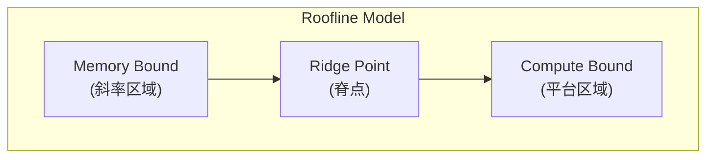
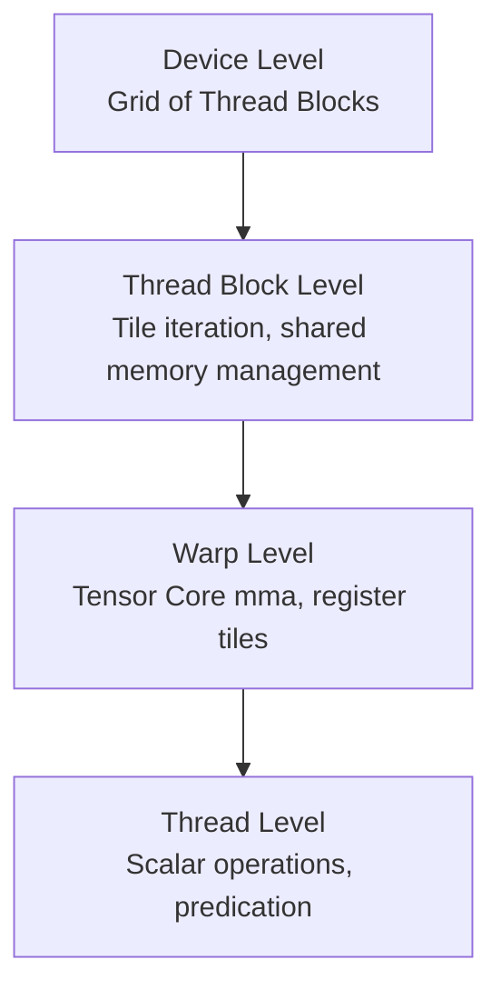

+++
title = "24.GPU Kernel开发详解"
date = 2026-02-06
description = "高性能GPU Kernel开发：从GEMM到Attention，深入理解Tensor Core、内存优化、CUTLASS架构"
[taxonomies]
tags = ["cuda", "kernel", "gemm", "tensor-core", "cutlass", "optimization"]
+++

## 概述

GPU Kernel 开发是 AI Infra 的核心技能。本文深入讲解如何编写高性能 Kernel，包括 GEMM 优化、Tensor Core 编程、CUTLASS 架构、以及 Attention Kernel 的实现技巧。

---

## 一、高性能 Kernel 设计原则

### 1.1 性能瓶颈分析

**GPU Kernel 性能瓶颈类型：**

| 瓶颈类型 | 特征 | 优化方向 | 示例 |
|----------|------|----------|------|
| **Compute Bound（计算受限）** | 计算指令是瓶颈；内存带宽足够，ALU 饱和 | 增加计算指令级并行（ILP） | 小矩阵乘法、复杂数学函数 |
| **Memory Bound（内存受限）** | 内存访问是瓶颈；ALU 空闲等待数据 | 减少内存访问、使用缓存 | 向量加法、Softmax |
| **Latency Bound（延迟受限）** | 指令延迟无法隐藏；线程数不足 | 增加 Occupancy、使用更多线程 | - |

### 1.2 Roofline Model

**Roofline 模型：性能上限分析**



**核心概念：**
- **算术强度** = 计算量 / 内存访问量 (FLOPS/Byte)
- **脊点** = 峰值算力 / 峰值带宽
- 如果算术强度 < 脊点 → Memory Bound
- 如果算术强度 > 脊点 → Compute Bound

**RTX 4090 示例：**
- 峰值算力：82.6 TFLOPS (FP32)
- 峰值带宽：1 TB/s
- 脊点：82.6 FLOPS/Byte

### 1.3 优化策略

```cpp
/*
 * Kernel 优化清单
 */

// 1. 最大化并行度
// - 使用足够多的线程
// - 合理设置 Block 大小（通常 128-256）
// - 确保足够的 Occupancy

// 2. 优化内存访问
// - 合并访问（Coalesced Access）
// - 使用共享内存减少全局内存访问
// - 避免 Bank Conflict
// - 使用只读缓存（__ldg）

// 3. 增加指令级并行（ILP）
// - 循环展开
// - 每个线程处理多个元素
// - 隐藏内存延迟

// 4. 减少分支发散
// - 避免 Warp 内不同线程走不同分支
// - 使用谓词执行

// 5. 使用特殊硬件
// - Tensor Core
// - 快速数学函数（__expf, __sinf）

// 6. 异步操作
// - 计算与内存传输重叠
// - 使用 cuda::memcpy_async（Ampere+）
```

---

## 二、GEMM（矩阵乘法）优化

### 2.1 GEMM 优化层次

**GEMM 优化演进：**

| 优化级别 | 技术 | 性能 |
|----------|------|------|
| **Level 0：朴素实现** | 每个线程计算一个输出元素；每次计算读取一行和一列 | ~100 GFLOPS |
| **Level 1：共享内存分块** | 将矩阵分成 Tile；加载 Tile 到共享内存；减少全局内存访问 | ~1 TFLOPS |
| **Level 2：寄存器分块** | 每个线程计算多个输出元素；数据复用在寄存器中 | ~5 TFLOPS |
| **Level 3：向量化加载** | 使用 float4 加载；更高的内存带宽利用 | ~10 TFLOPS |
| **Level 4：双缓冲** | 加载下一块的同时计算当前块；隐藏内存延迟 | ~15 TFLOPS |
| **Level 5：Tensor Core** | 使用 wmma API；矩阵碎片化计算 | ~150+ TFLOPS |

### 2.2 分块 GEMM 实现

```cpp
/*
 * 高效 GEMM Kernel
 * C[M,N] = A[M,K] * B[K,N]
 */

#define BM 128  // Block 处理的 M 维度
#define BN 128  // Block 处理的 N 维度
#define BK 8    // 每次迭代处理的 K 维度
#define TM 8    // 每个线程处理的 M 维度
#define TN 8    // 每个线程处理的 N 维度

__global__ void gemm_optimized(
    const float* __restrict__ A,
    const float* __restrict__ B,
    float* __restrict__ C,
    int M, int N, int K
) {
    // Block 和 Thread 索引
    int bx = blockIdx.x, by = blockIdx.y;
    int tx = threadIdx.x, ty = threadIdx.y;
    
    // 每个 Block 有 (BM/TM) x (BN/TN) 个线程
    int threadRow = tx;  // 0 ~ BM/TM - 1
    int threadCol = ty;  // 0 ~ BN/TN - 1
    
    // 共享内存
    __shared__ float As[BM][BK];
    __shared__ float Bs[BK][BN];
    
    // 寄存器：每个线程的输出累加器
    float regC[TM][TN] = {0.0f};
    
    // 寄存器：每个线程的输入缓冲
    float regA[TM];
    float regB[TN];
    
    // A 和 B 的起始位置
    A += by * BM * K;
    B += bx * BN;
    C += by * BM * N + bx * BN;
    
    // 主循环：遍历 K 维度
    for (int k = 0; k < K; k += BK) {
        // 协作加载 A 到共享内存
        // 每个线程加载多个元素
        for (int i = 0; i < BM; i += blockDim.x) {
            for (int j = 0; j < BK; j += blockDim.y) {
                int row = i + tx;
                int col = j + ty;
                if (row < BM && (k + col) < K) {
                    As[row][col] = A[row * K + k + col];
                } else {
                    As[row][col] = 0.0f;
                }
            }
        }
        
        // 协作加载 B 到共享内存
        for (int i = 0; i < BK; i += blockDim.x) {
            for (int j = 0; j < BN; j += blockDim.y) {
                int row = i + tx;
                int col = j + ty;
                if ((k + row) < K && col < BN) {
                    Bs[row][col] = B[(k + row) * N + col];
                } else {
                    Bs[row][col] = 0.0f;
                }
            }
        }
        
        __syncthreads();
        
        // 计算：每个线程计算 TM x TN 的输出块
        for (int kk = 0; kk < BK; kk++) {
            // 加载到寄存器
            for (int m = 0; m < TM; m++) {
                regA[m] = As[threadRow * TM + m][kk];
            }
            for (int n = 0; n < TN; n++) {
                regB[n] = Bs[kk][threadCol * TN + n];
            }
            
            // 外积累加
            for (int m = 0; m < TM; m++) {
                for (int n = 0; n < TN; n++) {
                    regC[m][n] += regA[m] * regB[n];
                }
            }
        }
        
        __syncthreads();
    }
    
    // 写回结果
    for (int m = 0; m < TM; m++) {
        for (int n = 0; n < TN; n++) {
            int row = by * BM + threadRow * TM + m;
            int col = bx * BN + threadCol * TN + n;
            if (row < M && col < N) {
                C[(threadRow * TM + m) * N + threadCol * TN + n] = regC[m][n];
            }
        }
    }
}
```

### 2.3 双缓冲优化

```cpp
/*
 * 双缓冲：加载下一块的同时计算当前块
 */

__global__ void gemm_double_buffer(
    const float* A, const float* B, float* C,
    int M, int N, int K
) {
    __shared__ float As[2][BM][BK];  // 双缓冲
    __shared__ float Bs[2][BK][BN];
    
    float regC[TM][TN] = {0.0f};
    
    int write_stage = 0;
    int read_stage = 0;
    
    // 预加载第一块
    load_tile(As[write_stage], Bs[write_stage], A, B, 0);
    __syncthreads();
    write_stage ^= 1;
    
    for (int k = BK; k < K; k += BK) {
        // 异步加载下一块
        load_tile_async(As[write_stage], Bs[write_stage], A, B, k);
        
        // 计算当前块
        compute_tile(regC, As[read_stage], Bs[read_stage]);
        
        // 等待加载完成
        __syncthreads();
        
        // 交换缓冲区
        write_stage ^= 1;
        read_stage ^= 1;
    }
    
    // 计算最后一块
    compute_tile(regC, As[read_stage], Bs[read_stage]);
    
    // 写回
    store_result(C, regC);
}
```

---

## 三、Tensor Core 编程

### 3.1 Tensor Core 基础

**Tensor Core 概述：**

**功能：**
- 一条指令完成 D = A * B + C 矩阵运算
- 每个 Tensor Core：4x4x4 矩阵乘加
- Warp 级操作：处理更大的 16x16x16 片段

**支持的数据类型：**
- FP16 x FP16 → FP16/FP32
- BF16 x BF16 → FP32
- TF32 x TF32 → FP32 (Ampere+)
- INT8 x INT8 → INT32
- FP8 (Hopper+)

**性能对比（RTX 4090）：**

| 类型 | 性能 |
|------|------|
| FP32 CUDA Cores | 82.6 TFLOPS |
| FP16 Tensor Core | 330 TFLOPS |
| INT8 Tensor Core | 660 TOPS |

**限制：**
- 必须使用特定的矩阵尺寸（16x16, 8x32等）
- Warp 级协作操作
- 需要对齐的内存访问

### 3.2 WMMA API

```cpp
/*
 * 使用 WMMA API 进行 Tensor Core 编程
 */

#include <mma.h>
using namespace nvcuda;

// 片段尺寸
const int WMMA_M = 16;
const int WMMA_N = 16;
const int WMMA_K = 16;

__global__ void gemm_wmma(
    const half* A, const half* B, float* C,
    int M, int N, int K
) {
    // Warp 索引
    int warpM = (blockIdx.y * blockDim.y + threadIdx.y);
    int warpN = (blockIdx.x * blockDim.x + threadIdx.x);
    
    // 声明片段
    wmma::fragment<wmma::matrix_a, WMMA_M, WMMA_N, WMMA_K, half, 
                   wmma::row_major> a_frag;
    wmma::fragment<wmma::matrix_b, WMMA_M, WMMA_N, WMMA_K, half, 
                   wmma::row_major> b_frag;
    wmma::fragment<wmma::accumulator, WMMA_M, WMMA_N, WMMA_K, float> c_frag;
    
    // 初始化累加器
    wmma::fill_fragment(c_frag, 0.0f);
    
    // 主循环
    for (int k = 0; k < K; k += WMMA_K) {
        int aRow = warpM * WMMA_M;
        int aCol = k;
        int bRow = k;
        int bCol = warpN * WMMA_N;
        
        // 加载 A 和 B 片段
        wmma::load_matrix_sync(a_frag, A + aRow * K + aCol, K);
        wmma::load_matrix_sync(b_frag, B + bRow * N + bCol, N);
        
        // 矩阵乘加
        wmma::mma_sync(c_frag, a_frag, b_frag, c_frag);
    }
    
    // 存储结果
    int cRow = warpM * WMMA_M;
    int cCol = warpN * WMMA_N;
    wmma::store_matrix_sync(C + cRow * N + cCol, c_frag, N, 
                            wmma::mem_row_major);
}

/*
 * 调用示例
 */
void launch_gemm_wmma(half* A, half* B, float* C, int M, int N, int K) {
    // 每个 Warp 处理 16x16 输出
    // Block 大小：多个 Warp
    dim3 blockDim(4, 4);  // 16 Warps per Block
    dim3 gridDim(
        (N + (WMMA_N * blockDim.x) - 1) / (WMMA_N * blockDim.x),
        (M + (WMMA_M * blockDim.y) - 1) / (WMMA_M * blockDim.y)
    );
    
    gemm_wmma<<<gridDim, blockDim>>>(A, B, C, M, N, K);
}
```

### 3.3 优化的 Tensor Core GEMM

```cpp
/*
 * 结合共享内存和 Tensor Core 的高效 GEMM
 */

#define BLOCK_M 128
#define BLOCK_N 128
#define BLOCK_K 32
#define WARP_M 32
#define WARP_N 64

__global__ void gemm_tensor_core_optimized(
    const half* __restrict__ A,
    const half* __restrict__ B,
    float* __restrict__ C,
    int M, int N, int K
) {
    // 共享内存
    __shared__ half As[BLOCK_M][BLOCK_K];
    __shared__ half Bs[BLOCK_K][BLOCK_N];
    
    // Warp 位置
    int warpId = threadIdx.x / 32;
    int warpRow = warpId / 2;
    int warpCol = warpId % 2;
    
    // 片段
    wmma::fragment<wmma::matrix_a, 16, 16, 16, half, wmma::row_major> a_frag[2];
    wmma::fragment<wmma::matrix_b, 16, 16, 16, half, wmma::row_major> b_frag[4];
    wmma::fragment<wmma::accumulator, 16, 16, 16, float> c_frag[2][4];
    
    // 初始化
    for (int i = 0; i < 2; i++) {
        for (int j = 0; j < 4; j++) {
            wmma::fill_fragment(c_frag[i][j], 0.0f);
        }
    }
    
    // 主循环
    for (int k = 0; k < K; k += BLOCK_K) {
        // 加载到共享内存
        load_shared_a(As, A, k);
        load_shared_b(Bs, B, k);
        __syncthreads();
        
        // Tensor Core 计算
        for (int kk = 0; kk < BLOCK_K; kk += 16) {
            // 加载 A 片段
            wmma::load_matrix_sync(a_frag[0], &As[warpRow * WARP_M][kk], BLOCK_K);
            wmma::load_matrix_sync(a_frag[1], &As[warpRow * WARP_M + 16][kk], BLOCK_K);
            
            // 加载 B 片段
            for (int j = 0; j < 4; j++) {
                wmma::load_matrix_sync(b_frag[j], &Bs[kk][warpCol * WARP_N + j * 16], BLOCK_N);
            }
            
            // 矩阵乘加
            for (int i = 0; i < 2; i++) {
                for (int j = 0; j < 4; j++) {
                    wmma::mma_sync(c_frag[i][j], a_frag[i], b_frag[j], c_frag[i][j]);
                }
            }
        }
        __syncthreads();
    }
    
    // 写回
    store_result(C, c_frag);
}
```

---

## 四、CUTLASS 架构

### 4.1 CUTLASS 概述

**CUTLASS (CUDA Templates for Linear Algebra Subroutines)：**

**什么是 CUTLASS：**
- NVIDIA 开源的高性能 GEMM 模板库
- C++ 模板元编程
- 支持各种数据类型和布局
- FlashAttention 等项目的基础

**架构层次：**



**核心组件：**
- **Gemm**：矩阵乘法模板
- **Epilogue**：后处理（bias、激活函数）
- **Layout**：内存布局
- **Tile Iterator**：数据加载迭代器

### 4.2 CUTLASS 使用示例

```cpp
/*
 * 使用 CUTLASS 进行 GEMM
 */

#include <cutlass/cutlass.h>
#include <cutlass/gemm/device/gemm.h>

// 定义 GEMM 类型
using ElementA = cutlass::half_t;
using ElementB = cutlass::half_t;
using ElementC = float;
using ElementAccumulator = float;

using LayoutA = cutlass::layout::RowMajor;
using LayoutB = cutlass::layout::RowMajor;
using LayoutC = cutlass::layout::RowMajor;

// 定义 Tile 尺寸
using ShapeMMAThreadBlock = cutlass::gemm::GemmShape<128, 128, 32>;
using ShapeMMAWarp = cutlass::gemm::GemmShape<64, 64, 32>;
using ShapeMMAOp = cutlass::gemm::GemmShape<16, 8, 16>;

// 定义 GEMM 操作
using Gemm = cutlass::gemm::device::Gemm<
    ElementA, LayoutA,
    ElementB, LayoutB,
    ElementC, LayoutC,
    ElementAccumulator,
    cutlass::arch::OpClassTensorOp,
    cutlass::arch::Sm80,
    ShapeMMAThreadBlock,
    ShapeMMAWarp,
    ShapeMMAOp,
    cutlass::epilogue::thread::LinearCombination<
        ElementC, 128 / cutlass::sizeof_bits<ElementC>::value,
        ElementAccumulator, ElementAccumulator
    >,
    cutlass::gemm::threadblock::GemmIdentityThreadblockSwizzle<>,
    3  // Stages
>;

// 执行 GEMM
void run_cutlass_gemm(
    cutlass::half_t* A, cutlass::half_t* B, float* C,
    int M, int N, int K
) {
    // 配置参数
    typename Gemm::Arguments args{
        {M, N, K},           // 问题尺寸
        {A, K},              // A 矩阵
        {B, N},              // B 矩阵
        {C, N},              // C 矩阵（输入）
        {C, N},              // D 矩阵（输出）
        {1.0f, 0.0f}         // alpha, beta
    };
    
    // 实例化 GEMM
    Gemm gemm_op;
    
    // 检查参数
    cutlass::Status status = gemm_op.can_implement(args);
    if (status != cutlass::Status::kSuccess) {
        // 错误处理
    }
    
    // 分配工作空间
    size_t workspace_size = Gemm::get_workspace_size(args);
    void* workspace;
    cudaMalloc(&workspace, workspace_size);
    
    // 执行
    status = gemm_op(args, workspace);
    
    cudaFree(workspace);
}
```

### 4.3 自定义 Epilogue

```cpp
/*
 * 自定义 Epilogue：融合 GELU 激活
 */

template <typename ElementOutput, int Count>
struct GELUEpilogue {
    using Fragment = cutlass::Array<ElementOutput, Count>;
    
    CUTLASS_HOST_DEVICE
    Fragment operator()(Fragment const& input) const {
        Fragment output;
        
        CUTLASS_PRAGMA_UNROLL
        for (int i = 0; i < Count; ++i) {
            float x = float(input[i]);
            // GELU: x * 0.5 * (1 + tanh(sqrt(2/pi) * (x + 0.044715 * x^3)))
            float cdf = 0.5f * (1.0f + tanhf(0.7978845608f * (x + 0.044715f * x * x * x)));
            output[i] = ElementOutput(x * cdf);
        }
        
        return output;
    }
};

// 融合 GEMM + GELU
using GemmWithGELU = cutlass::gemm::device::Gemm<
    // ... 其他参数
    cutlass::epilogue::thread::LinearCombinationGeneric<
        GELUEpilogue,
        ElementC, Count,
        ElementAccumulator, ElementAccumulator
    >,
    // ...
>;
```

---

## 五、Softmax Kernel

### 5.1 在线 Softmax 算法

```cpp
/*
 * 数值稳定的在线 Softmax
 * 一次遍历计算 max、sum 和归一化
 */

__global__ void online_softmax(
    const float* __restrict__ input,
    float* __restrict__ output,
    int N,  // batch size
    int D   // dimension
) {
    extern __shared__ float shared[];
    
    int row = blockIdx.x;
    int tid = threadIdx.x;
    
    const float* row_input = input + row * D;
    float* row_output = output + row * D;
    
    // 每个线程维护局部 max 和 sum
    float local_max = -INFINITY;
    float local_sum = 0.0f;
    
    // 第一遍：计算 max 和 sum（在线算法）
    for (int i = tid; i < D; i += blockDim.x) {
        float val = row_input[i];
        
        if (val > local_max) {
            // 更新 max 时，调整之前的 sum
            local_sum = local_sum * expf(local_max - val) + 1.0f;
            local_max = val;
        } else {
            local_sum += expf(val - local_max);
        }
    }
    
    // 归约 max
    shared[tid] = local_max;
    __syncthreads();
    
    for (int s = blockDim.x / 2; s > 0; s >>= 1) {
        if (tid < s) {
            shared[tid] = fmaxf(shared[tid], shared[tid + s]);
        }
        __syncthreads();
    }
    float global_max = shared[0];
    
    // 调整 local_sum 到全局 max
    local_sum *= expf(local_max - global_max);
    
    // 归约 sum
    shared[tid] = local_sum;
    __syncthreads();
    
    for (int s = blockDim.x / 2; s > 0; s >>= 1) {
        if (tid < s) {
            shared[tid] += shared[tid + s];
        }
        __syncthreads();
    }
    float global_sum = shared[0];
    
    // 第二遍：归一化
    for (int i = tid; i < D; i += blockDim.x) {
        row_output[i] = expf(row_input[i] - global_max) / global_sum;
    }
}
```

### 5.2 Warp 级 Softmax

```cpp
/*
 * 使用 Warp Shuffle 的高效 Softmax
 * 避免共享内存，更快的归约
 */

__device__ __forceinline__ float warp_reduce_max(float val) {
    for (int offset = 16; offset > 0; offset /= 2) {
        val = fmaxf(val, __shfl_xor_sync(0xffffffff, val, offset));
    }
    return val;
}

__device__ __forceinline__ float warp_reduce_sum(float val) {
    for (int offset = 16; offset > 0; offset /= 2) {
        val += __shfl_xor_sync(0xffffffff, val, offset);
    }
    return val;
}

__global__ void softmax_warp(
    const float* __restrict__ input,
    float* __restrict__ output,
    int N, int D
) {
    int row = blockIdx.x;
    int lane = threadIdx.x % 32;
    int warp_id = threadIdx.x / 32;
    int num_warps = blockDim.x / 32;
    
    extern __shared__ float shared[];
    float* warp_max = shared;
    float* warp_sum = shared + num_warps;
    
    const float* row_in = input + row * D;
    float* row_out = output + row * D;
    
    // Warp 内计算局部 max
    float local_max = -INFINITY;
    for (int i = warp_id * 32 + lane; i < D; i += blockDim.x) {
        local_max = fmaxf(local_max, row_in[i]);
    }
    local_max = warp_reduce_max(local_max);
    
    if (lane == 0) warp_max[warp_id] = local_max;
    __syncthreads();
    
    // 全局 max
    if (warp_id == 0) {
        float val = (lane < num_warps) ? warp_max[lane] : -INFINITY;
        val = warp_reduce_max(val);
        if (lane == 0) warp_max[0] = val;
    }
    __syncthreads();
    float global_max = warp_max[0];
    
    // 计算 exp 和 sum
    float local_sum = 0.0f;
    for (int i = warp_id * 32 + lane; i < D; i += blockDim.x) {
        local_sum += expf(row_in[i] - global_max);
    }
    local_sum = warp_reduce_sum(local_sum);
    
    if (lane == 0) warp_sum[warp_id] = local_sum;
    __syncthreads();
    
    // 全局 sum
    if (warp_id == 0) {
        float val = (lane < num_warps) ? warp_sum[lane] : 0.0f;
        val = warp_reduce_sum(val);
        if (lane == 0) warp_sum[0] = val;
    }
    __syncthreads();
    float global_sum = warp_sum[0];
    
    // 归一化
    for (int i = warp_id * 32 + lane; i < D; i += blockDim.x) {
        row_out[i] = expf(row_in[i] - global_max) / global_sum;
    }
}
```

---

## 六、LayerNorm Kernel

```cpp
/*
 * LayerNorm CUDA Kernel
 * y = (x - mean) / sqrt(var + eps) * gamma + beta
 */

__global__ void layer_norm(
    const float* __restrict__ input,
    const float* __restrict__ gamma,
    const float* __restrict__ beta,
    float* __restrict__ output,
    int N,      // batch size
    int D,      // hidden dimension
    float eps
) {
    extern __shared__ float shared[];
    
    int row = blockIdx.x;
    int tid = threadIdx.x;
    
    const float* x = input + row * D;
    float* y = output + row * D;
    
    // 计算 mean
    float local_sum = 0.0f;
    for (int i = tid; i < D; i += blockDim.x) {
        local_sum += x[i];
    }
    
    shared[tid] = local_sum;
    __syncthreads();
    
    for (int s = blockDim.x / 2; s > 0; s >>= 1) {
        if (tid < s) shared[tid] += shared[tid + s];
        __syncthreads();
    }
    float mean = shared[0] / D;
    
    // 计算 variance
    float local_var = 0.0f;
    for (int i = tid; i < D; i += blockDim.x) {
        float diff = x[i] - mean;
        local_var += diff * diff;
    }
    
    shared[tid] = local_var;
    __syncthreads();
    
    for (int s = blockDim.x / 2; s > 0; s >>= 1) {
        if (tid < s) shared[tid] += shared[tid + s];
        __syncthreads();
    }
    float var = shared[0] / D;
    float rstd = rsqrtf(var + eps);
    
    // 归一化 + 缩放 + 偏移
    for (int i = tid; i < D; i += blockDim.x) {
        y[i] = (x[i] - mean) * rstd * gamma[i] + beta[i];
    }
}

/*
 * 融合版本：RMSNorm（LLaMA 使用）
 */
__global__ void rms_norm(
    const float* __restrict__ input,
    const float* __restrict__ gamma,
    float* __restrict__ output,
    int N, int D, float eps
) {
    extern __shared__ float shared[];
    
    int row = blockIdx.x;
    int tid = threadIdx.x;
    
    const float* x = input + row * D;
    float* y = output + row * D;
    
    // 计算 RMS = sqrt(mean(x^2))
    float local_sum = 0.0f;
    for (int i = tid; i < D; i += blockDim.x) {
        local_sum += x[i] * x[i];
    }
    
    shared[tid] = local_sum;
    __syncthreads();
    
    for (int s = blockDim.x / 2; s > 0; s >>= 1) {
        if (tid < s) shared[tid] += shared[tid + s];
        __syncthreads();
    }
    
    float rms = rsqrtf(shared[0] / D + eps);
    
    for (int i = tid; i < D; i += blockDim.x) {
        y[i] = x[i] * rms * gamma[i];
    }
}
```

---

## 七、性能分析与调优

### 7.1 Nsight 使用

```bash
# Nsight Systems - 系统级分析
nsys profile --stats=true -o report ./my_program
nsys stats report.nsys-rep

# Nsight Compute - Kernel 级分析
ncu --set full -o kernel_report ./my_program
ncu-ui kernel_report.ncu-rep

# 常用指标
ncu --metrics \
    sm__throughput.avg.pct_of_peak_sustained_elapsed,\
    gpu__compute_memory_throughput.avg.pct_of_peak_sustained_elapsed,\
    l1tex__t_sectors_pipe_lsu_mem_global_op_ld.sum,\
    l1tex__t_sectors_pipe_lsu_mem_global_op_st.sum \
    ./my_program

# 比较不同版本
ncu --kernel-name gemm_v1 -o v1.ncu-rep ./program
ncu --kernel-name gemm_v2 -o v2.ncu-rep ./program
ncu --diff v1.ncu-rep v2.ncu-rep
```

### 7.2 优化指标

**关键性能指标：**

| 指标类别 | 具体指标 | 目标 |
|----------|----------|------|
| **Compute Throughput** | SM 利用率 | >80% |
| **Memory Throughput** | Global Memory 带宽利用率；Shared Memory 带宽利用率 | 接近峰值带宽 |
| **Occupancy** | 活跃 Warp / 最大 Warp | 根据 Kernel 特性，通常 >50% |
| **Stall 分析** | Memory Dependency（内存等待）；Execution Dependency（执行依赖）；Synchronization（同步等待） | 尽量减少 |
| **指令级** | IPC (Instructions Per Cycle)；分支发散率 | 高 IPC，低发散率 |

---

## 八、实战练习

**Kernel 开发练习：**

| 级别 | 练习内容 |
|------|----------|
| **初级** | 1. 向量加法（基础 → 向量化）；2. 矩阵转置（处理 Bank Conflict）；3. 归约求和（树形归约）；4. 直方图（原子操作） |
| **中级** | 5. GEMM（朴素 → 共享内存 → 分块）；6. Softmax（在线算法）；7. LayerNorm / RMSNorm；8. 1D/2D 卷积 |
| **高级** | 9. GEMM with Tensor Core (WMMA)；10. 简化版 FlashAttention；11. Fused GEMM + Activation；12. 多头注意力 Kernel |

**每个练习目标：**
- 实现正确性
- 使用 Nsight 分析
- 迭代优化至合理性能
- 与 cuBLAS/cuDNN 对比

---

## 相关文章

- [上一篇：23 - AI 底层开发路线图](/articles/ai/ai-23-AI底层开发路线图/)
- [下一篇：25 - FlashAttention 与 PagedAttention 原理](/articles/ai/ai-25-FlashAttention与PagedAttention原理/)
- [21 - CUDA 入门与 GPU 编程基础](/articles/ai/ai-21-CUDA入门与GPU编程基础/)
- [22 - CUDA 实战应用场景详解](/articles/ai/ai-22-CUDA实战应用场景详解/)
