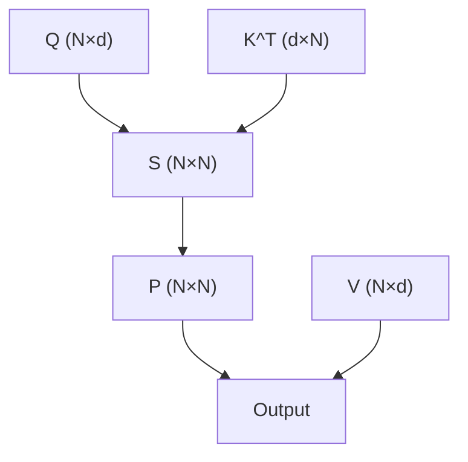
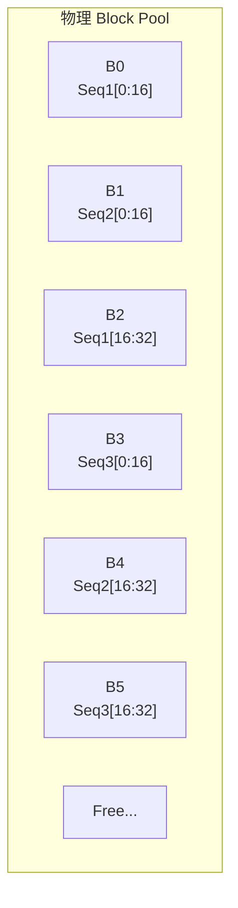
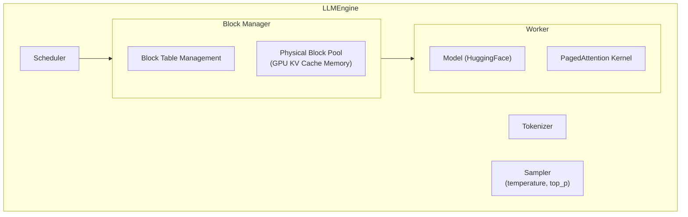

+++
title = "25.FlashAttention与PagedAttention原理"
date = 2026-02-06
description = "LLM推理优化核心：FlashAttention分块算法、在线Softmax、PagedAttention内存管理、vLLM实现详解"
[taxonomies]
tags = ["attention", "flash-attention", "paged-attention", "vllm", "llm", "inference"]
+++

## 概述

FlashAttention 和 PagedAttention 是 LLM 推理优化的两大核心技术。FlashAttention 解决了 Attention 计算的内存瓶颈，PagedAttention 解决了 KV Cache 的内存管理问题。本文深入剖析这两种技术的原理和实现。

---

## 一、Attention 计算瓶颈

### 1.1 标准 Attention

**标准 Self-Attention：**

- **输入**：Q, K, V ∈ R^{N × d}
- **输出**：O = softmax(QK^T / √d) V

**计算步骤：**
1. S = QK^T / √d — 计算注意力分数，O(N²d)
2. P = softmax(S) — 行级 Softmax
3. O = PV — 加权求和

**内存访问流程：**



- Q, K, V 从 HBM 读取
- S 和 P 矩阵大小为 N × N，需写入/读回 HBM

**问题：**
- S 和 P 矩阵大小为 N × N
- N = 序列长度（可达 128K+）
- 128K × 128K × FP16 = 32GB！
- 大量 HBM 读写，成为瓶颈

### 1.2 内存带宽瓶颈

**Attention 的 IO 复杂度：**

**标准 Attention：**
- 计算复杂度：O(N²d)
- 内存复杂度：O(N²)（存储 S 和 P）
- IO 复杂度：O(N²)（多次读写 HBM）

**内存访问模式：**
1. **Step 1**: 读 Q, K 从 HBM，计算 S，写 S 到 HBM
2. **Step 2**: 读 S 从 HBM，计算 softmax(S)，写 P 到 HBM
3. **Step 3**: 读 P, V 从 HBM，计算 O，写 O 到 HBM

总 IO：Θ(N²) 读写

**实际问题（A100，序列长度 2048）：**
- S 矩阵大小：2048 × 2048 × 4B = 16MB
- HBM 带宽：2 TB/s
- 传输时间：~8μs
- 计算时间：~1μs（Tensor Core 很快）
- **瓶颈：内存，不是计算！**

### 1.4 注意力变体：MHA、MQA、GQA

**注意力机制变体对比：**

**MHA (Multi-Head Attention) - 原始 Transformer：**

```
Q Heads:  H1   H2   H3   H4   H5   H6   H7   H8
          ↓    ↓    ↓    ↓    ↓    ↓    ↓    ↓
K Heads:  K1   K2   K3   K4   K5   K6   K7   K8
V Heads:  V1   V2   V3   V4   V5   V6   V7   V8
```

- 每个 Q head 有独立的 K, V head
- KV Cache 大小 = n_heads × d_head × 2 × seq_len
- 质量最好，但内存开销最大

**MQA (Multi-Query Attention) - 共享 K, V：**

```
Q Heads:  H1   H2   H3   H4   H5   H6   H7   H8
          ↓    ↓    ↓    ↓    ↓    ↓    ↓    ↓
K Head:   ──────────────── K1 ────────────────
V Head:   ──────────────── V1 ────────────────
```

- 所有 Q head 共享同一个 K, V head
- KV Cache 减少到 1/n_heads
- 推理速度快，但质量有损失
- 代表：PaLM, Falcon

**GQA (Grouped Query Attention) - 折中方案：**

```
Q Heads:  H1   H2   H3   H4   H5   H6   H7   H8
          ↓    ↓    ↓    ↓    ↓    ↓    ↓    ↓
K Heads:  ─── K1 ───  ─── K2 ───  ─── K3 ───  ─── K4 ───
V Heads:  ─── V1 ───  ─── V2 ───  ─── V3 ───  ─── V4 ───
```

- 多个 Q head 共享一组 K, V head
- n_kv_heads = n_heads / group_size
- 例：8 Q heads, 4 KV heads → 每 2 个 Q 共享 1 个 KV
- 平衡质量与效率
- 代表：LLaMA-2, Mistral, DeepSeek

**KV Cache 内存对比（以 LLaMA-2 70B 为例）：**

**模型配置：**
- n_layers = 80
- n_heads = 64 (Q heads)
- d_head = 128
- seq_len = 4096

| 方案 | n_kv_heads | KV Cache | 相对 MHA |
|------|------------|----------|----------|
| MHA | 64 | 40 GB | 100% |
| GQA-8 | 8 | 5 GB | 12.5% |
| MQA | 1 | 0.625 GB | 1.56% |

**LLaMA-2 70B 使用 GQA-8：**
- n_kv_heads = 8
- 每 8 个 Q head 共享 1 组 KV
- KV Cache 节省 87.5%

```python
# GQA 实现示例
import torch
import torch.nn as nn
import torch.nn.functional as F

class GroupedQueryAttention(nn.Module):
    """
    Grouped Query Attention (GQA) 实现
    """
    def __init__(
        self,
        d_model: int,
        n_heads: int,       # Q heads 数量
        n_kv_heads: int,    # K, V heads 数量
        dropout: float = 0.0
    ):
        super().__init__()
        assert n_heads % n_kv_heads == 0
        
        self.n_heads = n_heads
        self.n_kv_heads = n_kv_heads
        self.n_rep = n_heads // n_kv_heads  # 每组共享的 Q head 数
        self.d_head = d_model // n_heads
        
        # Q 有 n_heads 个 head
        self.wq = nn.Linear(d_model, n_heads * self.d_head, bias=False)
        # K, V 只有 n_kv_heads 个 head
        self.wk = nn.Linear(d_model, n_kv_heads * self.d_head, bias=False)
        self.wv = nn.Linear(d_model, n_kv_heads * self.d_head, bias=False)
        self.wo = nn.Linear(n_heads * self.d_head, d_model, bias=False)
        
        self.dropout = nn.Dropout(dropout)
        self.scale = self.d_head ** -0.5
    
    def repeat_kv(self, x: torch.Tensor) -> torch.Tensor:
        """
        将 KV heads 复制以匹配 Q heads 数量
        (B, n_kv_heads, S, d_head) -> (B, n_heads, S, d_head)
        """
        if self.n_rep == 1:
            return x
        B, n_kv, S, d = x.shape
        return (
            x[:, :, None, :, :]
            .expand(B, n_kv, self.n_rep, S, d)
            .reshape(B, n_kv * self.n_rep, S, d)
        )
    
    def forward(
        self,
        x: torch.Tensor,
        mask: torch.Tensor = None,
        kv_cache: tuple = None
    ):
        B, S, _ = x.shape
        
        # 计算 Q, K, V
        q = self.wq(x).view(B, S, self.n_heads, self.d_head).transpose(1, 2)
        k = self.wk(x).view(B, S, self.n_kv_heads, self.d_head).transpose(1, 2)
        v = self.wv(x).view(B, S, self.n_kv_heads, self.d_head).transpose(1, 2)
        
        # KV Cache 处理
        if kv_cache is not None:
            k_cache, v_cache = kv_cache
            k = torch.cat([k_cache, k], dim=2)
            v = torch.cat([v_cache, v], dim=2)
        
        # 复制 K, V 以匹配 Q heads
        k = self.repeat_kv(k)  # (B, n_heads, S, d_head)
        v = self.repeat_kv(v)  # (B, n_heads, S, d_head)
        
        # Attention 计算
        attn = torch.matmul(q, k.transpose(-2, -1)) * self.scale
        
        if mask is not None:
            attn = attn.masked_fill(mask == 0, float('-inf'))
        
        attn = F.softmax(attn, dim=-1)
        attn = self.dropout(attn)
        
        out = torch.matmul(attn, v)
        out = out.transpose(1, 2).contiguous().view(B, S, -1)
        
        return self.wo(out), (k, v)
```

---

## 二、FlashAttention 原理

### 2.1 核心思想

**FlashAttention 核心思想：**

**1. 分块计算（Tiling）：**
- 将 Q, K, V 分成小块
- 小块可以放入 SRAM（共享内存）
- 在 SRAM 中完成计算，避免中间结果写回 HBM

**2. 在线 Softmax（Online Softmax）：**
- 不需要完整的 S 矩阵来计算 softmax
- 逐块计算，动态更新 max 和 sum
- 最终得到正确的 softmax 结果

**3. 重计算（Recomputation）：**
- 反向传播时重新计算 S 和 P
- 用计算换内存
- 总体更快（减少 IO）

**效果：**
- IO 复杂度：O(N²d / M)，M 是 SRAM 大小
- 内存复杂度：O(N)，不存储完整 S/P
- 速度提升：2-4x
- 支持更长序列

### 2.2 在线 Softmax 算法

**在线 Softmax（核心数学）：**

**标准 Softmax：**
```
softmax(x)_i = exp(x_i - max(x)) / Σ exp(x_j - max(x))
```

问题：需要先遍历一次得到 max，再遍历一次计算

**在线算法（一次遍历）：**

```
初始化：m = -∞, l = 0

对每个新元素 x_i：
  m_new = max(m, x_i)
  l_new = l * exp(m - m_new) + exp(x_i - m_new)
  m = m_new
  l = l_new

最终：softmax(x)_i = exp(x_i - m) / l
```

**关键洞察**：当 max 更新时，之前累积的 sum 需要乘以 exp(old_max - new_max) 来修正

---

**分块版本（FlashAttention 核心）：**

对 Q 的第 i 块：

```
初始化：
  O_i = 0           # 输出累加器
  m_i = -∞          # 当前最大值
  l_i = 0           # 当前 exp sum

对 K, V 的第 j 块：
  S_ij = Q_i @ K_j^T / √d
  m_ij = rowmax(S_ij)
  P_ij = exp(S_ij - m_ij)
  l_ij = rowsum(P_ij)

  # 更新全局统计
  m_new = max(m_i, m_ij)
  l_new = l_i * exp(m_i - m_new) + l_ij * exp(m_ij - m_new)

  # 更新输出（关键！）
  O_i = O_i * (l_i * exp(m_i - m_new) / l_new)
      + P_ij * exp(m_ij - m_new) / l_new @ V_j

  m_i = m_new
  l_i = l_new
```

### 2.3 FlashAttention 实现

```cpp
/*
 * FlashAttention 简化实现
 * 展示核心算法，省略优化细节
 */

__global__ void flash_attention_forward(
    const float* Q,  // [N, d]
    const float* K,  // [N, d]
    const float* V,  // [N, d]
    float* O,        // [N, d]
    int N,           // 序列长度
    int d,           // 头维度
    int Bc,          // K/V 块大小
    int Br           // Q 块大小
) {
    extern __shared__ float smem[];
    
    // 共享内存布局
    float* Qi = smem;                           // [Br, d]
    float* Kj = smem + Br * d;                  // [Bc, d]
    float* Vj = smem + Br * d + Bc * d;         // [Bc, d]
    float* Sij = smem + Br * d + 2 * Bc * d;    // [Br, Bc]
    
    int block_row = blockIdx.x;  // Q 块索引
    int num_k_blocks = (N + Bc - 1) / Bc;
    
    // 加载 Q 块到共享内存
    load_to_smem(Qi, Q + block_row * Br * d, Br, d);
    
    // 初始化
    float mi[Br];      // 每行的 max
    float li[Br];      // 每行的 sum
    float Oi[Br][d];   // 输出累加器
    
    for (int i = 0; i < Br; i++) {
        mi[i] = -INFINITY;
        li[i] = 0.0f;
        for (int j = 0; j < d; j++) {
            Oi[i][j] = 0.0f;
        }
    }
    
    // 遍历 K/V 块
    for (int j = 0; j < num_k_blocks; j++) {
        // 加载 K, V 块
        load_to_smem(Kj, K + j * Bc * d, Bc, d);
        load_to_smem(Vj, V + j * Bc * d, Bc, d);
        __syncthreads();
        
        // 计算 S_ij = Q_i @ K_j^T
        matmul(Sij, Qi, Kj, Br, Bc, d);
        
        // 缩放
        for (int i = 0; i < Br; i++) {
            for (int k = 0; k < Bc; k++) {
                Sij[i * Bc + k] /= sqrtf((float)d);
            }
        }
        
        // Causal mask（可选）
        if (causal) {
            int q_start = block_row * Br;
            int k_start = j * Bc;
            for (int i = 0; i < Br; i++) {
                for (int k = 0; k < Bc; k++) {
                    if (q_start + i < k_start + k) {
                        Sij[i * Bc + k] = -INFINITY;
                    }
                }
            }
        }
        
        // 计算块内 max 和 exp
        float mij[Br];
        float lij[Br];
        float Pij[Br][Bc];
        
        for (int i = 0; i < Br; i++) {
            mij[i] = -INFINITY;
            for (int k = 0; k < Bc; k++) {
                mij[i] = fmaxf(mij[i], Sij[i * Bc + k]);
            }
            
            lij[i] = 0.0f;
            for (int k = 0; k < Bc; k++) {
                Pij[i][k] = expf(Sij[i * Bc + k] - mij[i]);
                lij[i] += Pij[i][k];
            }
        }
        
        // 更新全局统计和输出
        for (int i = 0; i < Br; i++) {
            float mi_new = fmaxf(mi[i], mij[i]);
            float li_new = li[i] * expf(mi[i] - mi_new) + 
                           lij[i] * expf(mij[i] - mi_new);
            
            // 修正之前的输出
            float scale_old = li[i] * expf(mi[i] - mi_new) / li_new;
            float scale_new = expf(mij[i] - mi_new) / li_new;
            
            for (int k = 0; k < d; k++) {
                Oi[i][k] = Oi[i][k] * scale_old;
            }
            
            // 累加新的贡献
            for (int k = 0; k < d; k++) {
                for (int c = 0; c < Bc; c++) {
                    Oi[i][k] += Pij[i][c] * scale_new * Vj[c * d + k];
                }
            }
            
            mi[i] = mi_new;
            li[i] = li_new;
        }
        
        __syncthreads();
    }
    
    // 写回输出
    store_from_reg(O + block_row * Br * d, Oi, Br, d);
}
```

### 2.4 FlashAttention-2 改进

**FlashAttention-2 优化：**

**1. 减少非 GEMM 计算：**
- 将 softmax 缩放推迟到最后
- 减少 exp 和 div 计算次数

**2. 并行化改进：**
- V1：沿 batch 和 head 并行
- V2：增加沿序列长度并行
- 更好的 GPU 利用率

**3. 工作分配优化：**
- 减少通信开销
- 更好的 Warp 内工作划分

**4. 内存访问优化：**
- 交换循环顺序（外层 Q，内层 K/V）
- 减少 HBM 访问次数

**性能提升：比 V1 快 2x**

---

## 三、PagedAttention 原理

### 3.1 KV Cache 问题

**KV Cache 内存问题：**

**LLM 推理流程：**
1. **Prefill**：处理输入 prompt，计算所有 token 的 K, V
2. **Decode**：逐个生成 token，复用之前的 K, V

**KV Cache 作用：**
- 缓存已计算的 K, V，避免重复计算
- 每生成一个 token 只需计算新 token 的 K, V

**内存开销（以 LLaMA-13B 为例）：**
- 40 layers × 40 heads × 128 dim × 2 (K+V)
- = 409,600 bytes per token
- 2048 序列长度 → 800MB per sequence
- batch_size=16 → 12.8GB 仅 KV Cache！

**传统方法的问题：**
- 预分配最大序列长度的内存
- 大量内存浪费（短序列也占满）
- 内存碎片化
- 无法动态调整 batch size

### 3.2 PagedAttention 核心思想

**PagedAttention（来自 vLLM）：**

**灵感来源**：操作系统的虚拟内存分页

**传统 KV Cache：**

```
Seq 1: [K1 V1][K2 V2][K3 V3][─────空白浪费──────]
Seq 2: [K1 V1][K2 V2][K3 V3][K4 V4][K5 V5][───空白───]
Seq 3: [K1 V1][K2 V2][────────────空白浪费─────────]
```

问题：每个序列预分配 max_seq_len，大量浪费

**PagedAttention：**



**Block Table（逻辑到物理映射）：**

| Sequence | Logical Blocks | Physical Blocks |
|----------|----------------|-----------------|
| Seq 1 | [0, 1] | [B0, B2] |
| Seq 2 | [0, 1] | [B1, B4] |
| Seq 3 | [0, 1] | [B3, B5] |

**优点：**
- 按需分配，无内存浪费
- 利用率接近 100%
- 支持动态 batch
- 支持序列间共享 (copy-on-write)

### 3.3 PagedAttention Kernel

```cpp
/*
 * PagedAttention Kernel 简化实现
 */

// Block 结构
struct KVBlock {
    half k[BLOCK_SIZE][HEAD_DIM];  // Key cache
    half v[BLOCK_SIZE][HEAD_DIM];  // Value cache
};

// Block Table
// block_table[seq_id][logical_block_id] = physical_block_id

__global__ void paged_attention_kernel(
    const float* __restrict__ q,           // [num_seqs, num_heads, head_dim]
    const KVBlock* __restrict__ kv_cache,  // 物理 block pool
    const int* __restrict__ block_tables,  // [num_seqs, max_blocks]
    const int* __restrict__ context_lens,  // [num_seqs]
    float* __restrict__ output,            // [num_seqs, num_heads, head_dim]
    int num_seqs,
    int num_heads,
    int head_dim,
    int max_blocks,
    float scale
) {
    int seq_idx = blockIdx.x;
    int head_idx = blockIdx.y;
    int tid = threadIdx.x;
    
    extern __shared__ float smem[];
    float* q_smem = smem;
    float* logits = smem + head_dim;
    
    // 加载 Query
    if (tid < head_dim) {
        q_smem[tid] = q[seq_idx * num_heads * head_dim + 
                        head_idx * head_dim + tid];
    }
    __syncthreads();
    
    int context_len = context_lens[seq_idx];
    int num_blocks = (context_len + BLOCK_SIZE - 1) / BLOCK_SIZE;
    
    // 遍历所有 block
    float max_logit = -INFINITY;
    float sum_exp = 0.0f;
    float output_acc[HEAD_DIM] = {0.0f};
    
    for (int b = 0; b < num_blocks; b++) {
        // 查找物理 block
        int physical_block = block_tables[seq_idx * max_blocks + b];
        const KVBlock* block = &kv_cache[physical_block];
        
        // 计算这个 block 中的有效 token 数
        int block_start = b * BLOCK_SIZE;
        int block_end = min(block_start + BLOCK_SIZE, context_len);
        int num_tokens = block_end - block_start;
        
        // 计算 attention scores
        for (int t = tid; t < num_tokens; t += blockDim.x) {
            float score = 0.0f;
            for (int d = 0; d < head_dim; d++) {
                score += q_smem[d] * __half2float(block->k[t][d]);
            }
            logits[t] = score * scale;
            max_logit = fmaxf(max_logit, logits[t]);
        }
        __syncthreads();
        
        // Warp 归约 max
        max_logit = warp_reduce_max(max_logit);
        
        // 计算 exp 和 sum
        for (int t = tid; t < num_tokens; t += blockDim.x) {
            float exp_val = expf(logits[t] - max_logit);
            sum_exp += exp_val;
            
            // 累加到输出
            for (int d = 0; d < head_dim; d++) {
                output_acc[d] += exp_val * __half2float(block->v[t][d]);
            }
        }
        __syncthreads();
    }
    
    // 归一化
    sum_exp = warp_reduce_sum(sum_exp);
    
    // 写回
    if (tid < head_dim) {
        output[seq_idx * num_heads * head_dim + head_idx * head_dim + tid] = 
            output_acc[tid] / sum_exp;
    }
}
```

### 3.4 Continuous Batching

**Continuous Batching（连续批处理）：**

**传统 Static Batching：**

```
Time →
Seq1: ████████████████████████████████ (长)
Seq2: ████████████ (短，等待)         ▓▓▓▓▓▓▓▓▓▓▓▓▓▓
Seq3: █████████████████ (中，等待)    ▓▓▓▓▓▓▓▓▓▓▓▓▓▓
Seq4: ██████████████████████ (等待)   ▓▓▓▓▓▓▓▓▓▓▓▓▓▓
```

问题：短序列完成后空转，等待最长序列

---

**Continuous Batching：**

```
Time →
Seq1: ████████████████████████████████
Seq2: ████████████ → Seq5: ████████████ → Seq8: ████
Seq3: █████████████████ → Seq6: ███████████████ → ...
Seq4: ██████████████████████ → Seq7: ██████████████ → ...
```

**优点：**
- 序列完成后立即加入新序列
- GPU 利用率最大化
- 吞吐量提升 2-3x

**实现要点：**
- PagedAttention 支持动态内存
- Scheduler 管理序列调度
- 每个 iteration 重新组装 batch

---

## 四、vLLM 架构

### 4.1 整体架构

**vLLM 系统架构：**



### 4.2 调度策略

```python
"""
vLLM Scheduler 简化逻辑
"""

class Scheduler:
    def __init__(self, block_manager):
        self.waiting = []     # 等待处理的请求
        self.running = []     # 正在执行的请求
        self.swapped = []     # 被换出的请求
        self.block_manager = block_manager
    
    def schedule(self):
        """决定本次迭代处理哪些序列"""
        scheduled = []
        
        # 1. 优先处理 running 中的序列（decode）
        for seq in self.running:
            if self.block_manager.can_allocate(seq):
                self.block_manager.allocate(seq)
                scheduled.append(seq)
            else:
                # 内存不足，需要 preempt
                self.preempt(seq)
        
        # 2. 加入新的 waiting 序列（prefill）
        while self.waiting and self.block_manager.has_free_blocks():
            seq = self.waiting.pop(0)
            if self.block_manager.can_allocate(seq):
                self.block_manager.allocate(seq)
                scheduled.append(seq)
                self.running.append(seq)
            else:
                self.waiting.insert(0, seq)
                break
        
        # 3. 恢复 swapped 序列
        while self.swapped and self.block_manager.has_free_blocks():
            seq = self.swapped.pop(0)
            if self.block_manager.can_swap_in(seq):
                self.block_manager.swap_in(seq)
                scheduled.append(seq)
                self.running.append(seq)
        
        return scheduled
    
    def preempt(self, seq):
        """内存不足时的抢占策略"""
        # 策略 1: Recompute - 释放 KV cache，之后重新计算
        # 策略 2: Swap - 换出到 CPU 内存
        if self.should_swap(seq):
            self.block_manager.swap_out(seq)
            self.swapped.append(seq)
        else:
            self.block_manager.free(seq)
            self.waiting.insert(0, seq)
```

### 4.3 使用 vLLM

```python
# vLLM 使用示例

from vllm import LLM, SamplingParams

# 初始化
llm = LLM(
    model="meta-llama/Llama-2-7b-chat-hf",
    tensor_parallel_size=1,  # 使用 1 个 GPU
    gpu_memory_utilization=0.9,  # GPU 内存利用率
)

# 采样参数
sampling_params = SamplingParams(
    temperature=0.8,
    top_p=0.95,
    max_tokens=512,
)

# 批量推理
prompts = [
    "What is machine learning?",
    "Explain quantum computing.",
    "How does a neural network work?",
]

outputs = llm.generate(prompts, sampling_params)

for output in outputs:
    print(f"Prompt: {output.prompt}")
    print(f"Generated: {output.outputs[0].text}")
    print()

# 流式输出
from vllm import AsyncLLMEngine

engine = AsyncLLMEngine.from_engine_args(engine_args)

async def generate_stream(prompt):
    async for output in engine.generate(prompt, sampling_params, request_id):
        yield output.outputs[0].text
```

---

## 五、性能对比

**Attention 优化性能对比（A100，序列长度 2048）：**

| 方法 | 速度 | 内存 | 备注 |
|------|------|------|------|
| PyTorch 标准 | 1x | 16GB | 基线 |
| PyTorch SDPA | 2x | 8GB | 内置优化 |
| FlashAttention-1 | 3x | 线性 | |
| FlashAttention-2 | 5x | 线性 | 当前最优 |

**LLM 推理吞吐量（LLaMA-7B，A100）：**

| 方法 | 吞吐量 | 延迟 | 备注 |
|------|--------|------|------|
| HuggingFace | 20 tok/s | 高 | |
| TGI | 100 tok/s | 中 | |
| vLLM | 200 tok/s | 低 | PagedAttention |
| vLLM + FlashAttention | 250 tok/s | 最低 | 组合使用 |

---

## 六、实践建议

**FlashAttention / PagedAttention 使用建议：**

| 技术 | 适用场景 |
|------|----------|
| **FlashAttention** | 长序列训练/推理；内存受限场景；需要支持更大 batch size；PyTorch 2.0+ 已内置 (`torch.nn.functional.scaled_dot_product_attention`) |
| **PagedAttention** | LLM 推理服务；高并发场景；动态 batch 需求；使用 vLLM 框架 |

**注意事项：**
- FlashAttention 需要特定 GPU 架构（Ampere+）
- 头维度需要是 32 的倍数
- 某些变体（如 cross attention）支持有限
- 调试更困难（融合 Kernel）

---

## 七、Flash Attention 实现对比与已知限制

### 7.1 Flash Attention 实现对比

Flash Attention 的核心算法思想（Tiling + Online Softmax + Recomputation）已被多个团队实现为不同的库，各有侧重和取舍。理解它们的差异对于在实际项目中选择合适的实现至关重要。

#### 7.1.1 Flash Attention 2（Tri Dao 参考实现）

**概述：**
- 由 Tri Dao（Stanford）开发，是 Flash Attention 的官方参考实现
- 纯 CUDA 编写，手动管理共享内存和寄存器
- 支持 NVIDIA Ampere（A100）及更新架构（Hopper H100）
- 目前是社区使用最广泛的 Flash Attention 实现

**核心特性：**
- 支持 FP16 和 BF16 精度
- 支持 causal mask 和 non-causal（bidirectional）
- 支持 MHA、MQA、GQA
- 支持 Sliding Window Attention（v2.3+）
- 支持 ALiBi positional encoding
- 支持 Dropout（前向+反向）
- Head dimension 支持：32、64、96、128、160、192、224、256

**安装与使用：**

```python
# 安装
# pip install flash-attn --no-build-isolation

import torch
from flash_attn import flash_attn_func, flash_attn_varlen_func

# 基本用法
# q, k, v: (batch_size, seqlen, nheads, headdim)
output = flash_attn_func(
    q, k, v,
    dropout_p=0.0,
    softmax_scale=None,  # 默认 1/sqrt(d)
    causal=True,
    window_size=(-1, -1),  # (-1,-1) 表示无窗口限制
    return_attn_probs=False
)

# 变长序列（packed sequences）
# q_unpad: (total_q, nheads, headdim) — 所有序列拼接
# cu_seqlens_q: (batch_size + 1,) — 累积序列长度
output_unpad = flash_attn_varlen_func(
    q_unpad, k_unpad, v_unpad,
    cu_seqlens_q, cu_seqlens_k,
    max_seqlen_q, max_seqlen_k,
    dropout_p=0.0,
    causal=True
)
```

**架构优化细节：**
- 外层循环遍历 Q blocks，内层遍历 K/V blocks（V2 交换了 V1 的循环顺序）
- Warp-level 并行：一个 Warp 处理一行 Q，减少线程间同步
- 寄存器利用率最大化：O 累加器始终驻留在寄存器中
- 支持 split-K 分区，提升长序列的 GPU 占用率

#### 7.1.2 Flash Attention 3（Hopper 专属优化）

**概述：**
- 专为 NVIDIA Hopper 架构（H100/H200）设计
- 利用 Hopper 独有硬件特性，进一步压榨性能
- 由 Tri Dao 团队开发，是 Flash Attention 2 的架构升级版

**Hopper 专属硬件特性：**

```
┌─────────────────────────────────────────────────────┐
│                  Flash Attention 3                    │
│            Hopper-Specific Optimizations              │
├─────────────────────────────────────────────────────┤
│                                                      │
│  1. TMA (Tensor Memory Accelerator)                  │
│     ┌──────┐    异步加载     ┌──────────┐            │
│     │ HBM  │ ──────────────→ │  SMEM    │            │
│     └──────┘    不占 SM      └──────────┘            │
│     - 硬件级异步数据搬运                              │
│     - 释放 SM 计算资源                                │
│     - 支持多维 Tensor 寻址                            │
│                                                      │
│  2. WGMMA (Warpgroup MMA)                            │
│     - 128 线程组成 Warpgroup                          │
│     - 直接从 SMEM 读取操作数                          │
│     - 比 Ampere 的 HMMA 吞吐更高                     │
│     - 减少 Register → SMEM 的数据搬运                 │
│                                                      │
│  3. Pingpong Scheduling                              │
│     ┌────────┐  ┌────────┐                           │
│     │ WG 0   │  │ WG 1   │                           │
│     │ Q·K^T  │  │ (idle) │  Phase A                  │
│     │ (idle) │  │  P·V   │  Phase B                  │
│     │ Q·K^T  │  │ (idle) │  Phase A                  │
│     └────────┘  └────────┘                           │
│     - 两个 Warpgroup 交替执行 QK^T 和 PV             │
│     - 隐藏流水线停顿                                  │
│                                                      │
│  4. FP8 Support                                      │
│     - E4M3 / E5M2 格式                               │
│     - Block-wise quantization                        │
│     - 2x 计算吞吐（相比 FP16）                       │
│     - 精度损失需要 attention scale 修正               │
│                                                      │
└─────────────────────────────────────────────────────┘
```

**性能提升（相对 Flash Attention 2）：**
- FP16：1.5-2.0x 提速（H100 vs A100）
- FP8：额外 1.5-2.0x 提速（相对 FP16）
- 达到 H100 FLOPS 理论峰值的 75%+

**限制：**
- 仅支持 Hopper 架构（Compute Capability 9.0）
- FP8 精度需要仔细校验
- API 与 Flash Attention 2 略有不同

#### 7.1.3 xFormers（Meta）

**概述：**
- Meta 开发的高效 Transformer 组件库
- 核心模块：`memory_efficient_attention`（基于 Flash Attention 思想）
- 深度集成 PyTorch 生态，易于使用
- 支持更灵活的 attention pattern

**核心特性：**
- 支持 Block-Sparse Attention（自定义稀疏 mask）
- 原生支持变长序列（variable-length，无需 padding）
- 提供 `BlockDiagonalMask` 等预定义 mask 类型
- 支持 Cross-Attention
- 后端自动选择（cutlass / flash / triton）

```python
import xformers.ops as xops

# 基本用法
# q, k, v: (B, M, H, K)
output = xops.memory_efficient_attention(
    query=q,
    key=k,
    value=v,
    attn_bias=xops.LowerTriangularMask(),  # causal
    scale=1.0 / (d ** 0.5)
)

# 变长序列：使用 BlockDiagonalMask
from xformers.ops.fmha import BlockDiagonalMask

# 多个不同长度的序列打包为一个 tensor
attn_bias = BlockDiagonalMask.from_seqlens([128, 256, 64])
output = xops.memory_efficient_attention(q, k, v, attn_bias=attn_bias)

# 自定义 Block-Sparse pattern
from xformers.ops.fmha import BlockDiagonalCausalWithOffsetPaddedKeysMask
attn_bias = BlockDiagonalCausalWithOffsetPaddedKeysMask.from_seqlens(
    q_seqlen=[100, 200],
    kv_seqlen=[150, 250]
)
```

**与 PyTorch 的关系：**
- PyTorch 2.0+ 的 `torch.nn.functional.scaled_dot_product_attention`（SDPA）内部使用 Flash Attention 或 xFormers 后端
- xFormers 提供比 SDPA 更灵活的 mask 和 bias 支持
- 适合需要自定义 attention pattern 的研究场景

#### 7.1.4 FlashInfer

**概述：**
- 专为 LLM 推理（Inference）优化的 attention 库
- 同时支持 Prefill 阶段和 Decode 阶段
- 与 PagedAttention / vLLM 兼容
- 原生支持 GQA、MQA

**核心优势：**

```
FlashInfer 推理优化架构：

┌─────────────────────────────────────────────────┐
│                  FlashInfer                       │
├───────────────────────┬─────────────────────────┤
│     Prefill Phase     │     Decode Phase         │
│  (长 prompt 处理)     │  (逐 token 生成)         │
├───────────────────────┼─────────────────────────┤
│  - Flash Attention    │  - PagedAttention        │
│    Tiling 算法        │    兼容 block table      │
│  - 支持 Ragged        │  - Split-K 分区          │
│    Tensor 输入        │  - 针对单 token Q 优化    │
│  - 大 batch prefill   │  - 低延迟 decode         │
│    chunk 化处理       │  - Persistent Kernel     │
├───────────────────────┴─────────────────────────┤
│  共同特性：                                       │
│  - GQA / MQA / MHA 全支持                        │
│  - RoPE on-the-fly（无需预计算位置编码）          │
│  - FP16, BF16, FP8                               │
│  - CUDA Graph friendly                           │
│  - Cascade Attention（分层 KV Cache 查询）       │
└─────────────────────────────────────────────────┘
```

```python
import flashinfer

# Decode 阶段 — 单 token query + Paged KV Cache
decode_wrapper = flashinfer.BatchDecodeWithPagedKVCacheWrapper(
    workspace_buffer,
    kv_layout="NHD"  # (num_tokens, num_heads, head_dim)
)
decode_wrapper.begin_forward(
    indptr=kv_indptr,         # KV page table 索引
    indices=kv_indices,       # 物理 page 编号
    last_page_len=last_page_len,
    num_qo_heads=32,
    num_kv_heads=8,           # GQA: 32 Q heads, 8 KV heads
    head_dim=128,
    page_size=16
)
output = decode_wrapper.forward(q, paged_kv_cache)

# Prefill 阶段 — Ragged Tensor 输入
prefill_wrapper = flashinfer.BatchPrefillWithPagedKVCacheWrapper(
    workspace_buffer,
    kv_layout="NHD"
)
prefill_wrapper.begin_forward(
    qo_indptr=qo_indptr,
    kv_indptr=kv_indptr,
    kv_indices=kv_indices,
    last_page_len=last_page_len,
    num_qo_heads=32,
    num_kv_heads=8,
    head_dim=128
)
output = prefill_wrapper.forward(q, paged_kv_cache)
```

**与 vLLM 的集成：**
- vLLM 从 v0.3+ 开始支持 FlashInfer 作为 attention 后端
- 在 Decode 阶段性能优于原生 PagedAttention kernel
- 支持 `--attention-backend flashinfer` 参数启用

#### 7.1.5 cuDNN Flash Attention

**概述：**
- NVIDIA 在 cuDNN 8.9+ 中内置的 Flash Attention 实现
- 闭源、高度优化，性能通常与 Tri Dao 参考实现持平或更优
- 被 TensorRT-LLM 内部使用
- 通过 cuDNN Graph API 调用

**核心特性：**
- 对 NVIDIA GPU 的内存层级进行极致优化
- 自动选择最优 tiling 策略
- 支持 FP16、BF16，Hopper 上支持 FP8
- 与 TensorRT-LLM 深度集成
- 支持 Grouped Query Attention

**使用方式：**

```python
# 通过 PyTorch SDPA 间接调用（cuDNN 后端）
import torch
import torch.nn.functional as F

# PyTorch 2.0+ SDPA 会自动选择后端（flash / efficient / cudnn / math）
with torch.backends.cuda.sdp_kernel(
    enable_flash=False,
    enable_math=False,
    enable_mem_efficient=False,
    enable_cudnn=True  # 强制使用 cuDNN 后端
):
    output = F.scaled_dot_product_attention(q, k, v, is_causal=True)

# 通过 TensorRT-LLM（内部自动使用 cuDNN Flash Attention）
# TensorRT-LLM 自动为 GPTAttention 层选择最优 kernel
```

**优势与限制：**
- 优势：黑盒优化，NVIDIA 持续迭代性能
- 限制：闭源不可定制；需要特定 cuDNN 版本；某些 attention 变体支持滞后

#### 7.1.6 Triton Flash Attention

**概述：**
- 使用 OpenAI Triton（Python DSL）编写的 Flash Attention 实现
- 代码可读性远高于 CUDA 版本
- 适合研究者快速实验和定制
- 性能通常是 CUDA 实现的 70-90%

**核心优势：**
- 代码量大幅减少（~200 行 vs ~2000 行 CUDA）
- 易于修改：自定义 mask、bias、attention pattern
- 自动处理 tiling、shared memory、寄存器分配
- 跨硬件可移植性更好（支持 AMD GPU via Triton）

```python
import triton
import triton.language as tl

@triton.jit
def flash_attention_kernel(
    Q, K, V, O,
    stride_qb, stride_qh, stride_qm, stride_qk,
    stride_kb, stride_kh, stride_kn, stride_kk,
    stride_vb, stride_vh, stride_vn, stride_vk,
    stride_ob, stride_oh, stride_om, stride_ok,
    N_CTX: tl.constexpr,
    BLOCK_M: tl.constexpr,  # Q block size
    BLOCK_N: tl.constexpr,  # KV block size
    HEAD_DIM: tl.constexpr,
):
    # 获取当前 block 的位置
    start_m = tl.program_id(0) * BLOCK_M
    off_b = tl.program_id(1)
    off_h = tl.program_id(2)
    
    # 初始化累加器
    m_i = tl.full([BLOCK_M], float("-inf"), dtype=tl.float32)
    l_i = tl.full([BLOCK_M], 0.0, dtype=tl.float32)
    acc = tl.zeros([BLOCK_M, HEAD_DIM], dtype=tl.float32)
    
    # 加载 Q block
    offs_m = start_m + tl.arange(0, BLOCK_M)
    offs_k = tl.arange(0, HEAD_DIM)
    q = tl.load(Q + off_b * stride_qb + off_h * stride_qh +
                offs_m[:, None] * stride_qm + offs_k[None, :] * stride_qk)
    
    # 遍历 KV blocks
    for start_n in range(0, N_CTX, BLOCK_N):
        offs_n = start_n + tl.arange(0, BLOCK_N)
        
        # 加载 K, V blocks
        k = tl.load(K + off_b * stride_kb + off_h * stride_kh +
                     offs_n[:, None] * stride_kn + offs_k[None, :] * stride_kk)
        v = tl.load(V + off_b * stride_vb + off_h * stride_vh +
                     offs_n[:, None] * stride_vn + offs_k[None, :] * stride_vk)
        
        # 计算 S = Q @ K^T
        s = tl.dot(q, tl.trans(k))
        s *= 1.0 / tl.sqrt(HEAD_DIM * 1.0)
        
        # Causal mask
        s = tl.where(offs_m[:, None] >= offs_n[None, :], s, float("-inf"))
        
        # Online softmax 更新
        m_ij = tl.max(s, axis=1)
        m_new = tl.maximum(m_i, m_ij)
        alpha = tl.exp(m_i - m_new)
        beta = tl.exp(m_ij - m_new)
        l_new = alpha * l_i + beta * tl.sum(tl.exp(s - m_ij[:, None]), axis=1)
        
        # 更新输出累加器
        p = tl.exp(s - m_new[:, None])
        acc = acc * (alpha * l_i / l_new)[:, None]
        acc += tl.dot(p.to(tl.float16), v) * (beta / l_new)[:, None]
        
        m_i = m_new
        l_i = l_new
    
    # 写回输出
    tl.store(O + off_b * stride_ob + off_h * stride_oh +
             offs_m[:, None] * stride_om + offs_k[None, :] * stride_ok, acc)
```

**性能定位：**
- 比 CUDA 参考实现慢 10-30%（Triton 编译器尚未完全匹配手写 CUDA 的优化深度）
- 远快于 PyTorch naive attention（2-3x 提速）
- 非常适合快速原型验证和自定义 attention 变体研究

#### 7.1.7 综合对比表

| 特性 | Flash Attention 2 | Flash Attention 3 | xFormers | FlashInfer | cuDNN FA | Triton FA |
|------|-------------------|-------------------|----------|------------|----------|-----------|
| **开发者** | Tri Dao | Tri Dao | Meta | FlashInfer Team | NVIDIA | 社区 |
| **语言** | CUDA | CUDA | CUDA/Triton | CUDA | 闭源 | Triton |
| **开源** | Yes | Yes | Yes | Yes | No | Yes |
| **支持架构** | Ampere+ | Hopper only | Ampere+ | Ampere+ | Ampere+ | Ampere+ |
| **FP16/BF16** | Yes | Yes | Yes | Yes | Yes | Yes |
| **FP8** | No | Yes | No | Yes | Hopper | Limited |
| **Causal Mask** | Yes | Yes | Yes | Yes | Yes | Yes |
| **Cross-Attention** | Yes | Yes | Yes | Yes | Yes | Yes |
| **GQA/MQA** | Yes | Yes | Yes | Native | Yes | Manual |
| **Sliding Window** | v2.3+ | Yes | Limited | Yes | Limited | Manual |
| **Variable-Length** | Yes | Yes | Native | Native | Limited | Manual |
| **PagedKV Cache** | No | No | No | Native | No | No |
| **Decode 优化** | No | No | No | Yes | Via TRT-LLM | No |
| **自定义 Mask** | Limited | Limited | Flexible | Limited | Limited | Flexible |
| **性能 (A100)** | Baseline | N/A | ~95% | ~100-110% | ~100-105% | ~70-90% |
| **性能 (H100)** | Baseline | ~150-200% | ~90% | ~100-120% | ~110-150% | ~70-85% |
| **易用性** | 中 | 中 | 高 | 中 | 低（间接） | 高 |
| **可定制性** | 低 | 低 | 中 | 低 | 无 | 高 |
| **适用场景** | 训练+推理通用 | H100训练 | 研究+训练 | LLM推理 | TRT-LLM | 研究+原型 |

**选型建议：**

```
决策树：

你在做什么？
├── 训练
│   ├── 使用 H100 → Flash Attention 3（最大性能）
│   ├── 使用 A100 → Flash Attention 2（最成熟）
│   ├── 需要自定义 attention → xFormers 或 Triton（灵活）
│   └── 使用 PyTorch → torch SDPA（自动选择后端）
│
├── 推理（LLM Serving）
│   ├── 使用 vLLM → FlashInfer（decode 最优）
│   ├── 使用 TensorRT-LLM → cuDNN FA（自动使用）
│   └── 自建推理引擎 → FlashInfer + PagedAttention
│
└── 研究/实验
    ├── 需要快速原型 → Triton FA
    ├── 需要自定义 mask → xFormers
    └── 需要对比基线 → Flash Attention 2
```

### 7.2 已知限制与缺陷

#### 7.2.1 Head Dimension 限制

**问题：** Flash Attention 的 CUDA kernel 通常要求 head dimension 是特定值，否则性能显著下降或直接不支持。

**各实现支持的 head dimension：**

| 实现 | 支持的 head_dim | 最优值 | 不支持时行为 |
|------|----------------|--------|-------------|
| Flash Attention 2 | 32, 64, 96, 128, 160, 192, 224, 256 | 64, 128 | 回退到标准 attention |
| Flash Attention 3 | 64, 128, 256 | 128, 256 | 不支持 |
| xFormers | 8-256（更灵活） | 64, 128 | 性能下降 |
| FlashInfer | 64, 128, 256 | 128 | 不支持 |
| cuDNN FA | 64, 128 | 128 | 回退 |

**原因：**
- CUDA kernel 中的 shared memory tile 大小固定
- Tensor Core 操作要求特定对齐（16 的倍数）
- 不同 head_dim 需要不同的 kernel 模板实例化
- 编译时确定 tile 大小，无法动态适配任意维度

**实际影响：**
- 大多数主流模型（LLaMA、GPT、Mistral）使用 head_dim=128，完全兼容
- 部分老模型（GPT-2 使用 head_dim=64）也兼容
- 少数模型（如某些 head_dim=80 的变体）需要 padding 或回退

```python
# 如果 head_dim 不被支持，可以 padding
def pad_head_dim(q, k, v, target_dim=128):
    """将 head_dim pad 到支持的大小"""
    _, _, _, d = q.shape
    if d == target_dim:
        return q, k, v
    pad_size = target_dim - d
    q = F.pad(q, (0, pad_size))
    k = F.pad(k, (0, pad_size))
    v = F.pad(v, (0, pad_size))
    return q, k, v

# 计算后截断回原始维度
output = flash_attn_func(q_padded, k_padded, v_padded)
output = output[..., :original_head_dim]
```

#### 7.2.2 Attention Pattern 支持限制

**不同 attention pattern 的支持情况：**

| Pattern | Flash Attn 2 | xFormers | FlashInfer | 说明 |
|---------|-------------|----------|------------|------|
| Self-Attention (causal) | Full | Full | Full | 所有实现均支持 |
| Self-Attention (bidirectional) | Full | Full | Full | 训练 encoder 时使用 |
| Cross-Attention | v2.4+ | Full | Partial | decoder-encoder attention |
| Sliding Window | v2.3+ | Limited | Full | Mistral/Mixtral 使用 |
| Prefix-LM（部分 causal） | Manual | Full | Yes | T5-style attention |
| Block-Sparse | No | Full | No | 长文档结构化 attention |
| Dilated Attention | No | No | No | Longformer-style |

**Cross-Attention 注意事项：**
- Flash Attention 2 从 v2.4 开始支持 Q 和 KV 不同长度
- 需要分别传入 `cu_seqlens_q` 和 `cu_seqlens_k`
- 部分功能组合（如 cross-attention + sliding window）可能不支持

**Sliding Window Attention：**

```python
# Flash Attention 2.3+ sliding window
from flash_attn import flash_attn_func

# window_size = (left, right)
# left = 向左看的 token 数，right = 向右看的 token 数
# causal 模式下 right 应为 0
output = flash_attn_func(
    q, k, v,
    causal=True,
    window_size=(512, 0)  # 只看前 512 个 token
)
# 注意：sliding window + causal 要求 right=0
# 非 causal 时可以设置 window_size=(256, 256)
```

**Caveats：**
- Sliding window 仅影响 attention mask，不改变内存复杂度（仍需遍历所有 KV blocks，只是 mask 掉窗口外的值）
- 在 FlashInfer 中，sliding window 可以结合 PagedAttention 实现真正的内存节约（跳过窗口外的 KV pages）

#### 7.2.3 Backward Pass 的重计算开销

**问题：** Flash Attention 的反向传播需要重新计算 attention 矩阵 S 和 P，这是以计算换内存的核心 trade-off。

**前向 vs 反向对比：**

```
标准 Attention:
  前向：计算 S, P, O → 保存 S, P（O(N²) 内存）
  反向：直接使用保存的 S, P → 计算梯度

Flash Attention:
  前向：分块计算 O → 只保存 O, l, m（O(N) 内存）
  反向：重新计算 S, P → 计算梯度（额外一轮前向计算）
```

**内存与计算的 trade-off：**

| 指标 | 标准 Attention | Flash Attention |
|------|---------------|----------------|
| 前向内存 | O(N²) | O(N) |
| 反向额外计算 | 0 | ~1x 前向 FLOPS |
| 反向内存 | O(N²)（保存的 S, P） | O(N)（只需 Q, K, V, O, l, m） |
| 总内存 | O(N²) | O(N) |
| 总计算 | 2x（前向+反向） | ~3x（前向+重计算+反向） |
| 总时间 | 慢（IO bound） | 快（减少 IO） |

**关键洞察：** 虽然 Flash Attention 反向传播多了约 50% 的 FLOPS，但由于大幅减少了 HBM 读写（从 O(N²) 降到 O(N)），总体速度仍然更快。这是因为现代 GPU 上 Attention 是 **memory-bound** 而非 compute-bound 的操作。

**反向传播中保存的中间结果：**

```python
# Flash Attention 前向传播需要保存以下内容供反向使用：
class FlashAttentionContext:
    """前向传播保存的 context，用于反向传播"""
    q: Tensor      # (B, N, H, d) — 原始 Q
    k: Tensor      # (B, N, H, d) — 原始 K
    v: Tensor      # (B, N, H, d) — 原始 V
    o: Tensor      # (B, N, H, d) — 前向输出
    lse: Tensor    # (B, H, N) — log-sum-exp = log(l) + m
    # 注意：不保存 S (N×N) 和 P (N×N)！
    # 反向时重新从 Q, K 计算 S，从 S 计算 P
```

#### 7.2.4 Dropout 的确定性问题

**问题：** Attention 中的 Dropout 在 Flash Attention 中有特殊处理。

**标准 Dropout：**
- 前向：生成随机 mask M，P_drop = P * M
- 反向：使用相同的 mask M 计算梯度

**Flash Attention Dropout：**
- 前向不保存完整的 dropout mask（N×N 大小，无法存储）
- 反向需要重新生成**相同的** dropout mask
- 使用 Philox PRNG（确定性伪随机数生成器）+ offset 确保一致

```python
# Flash Attention 使用 Philox RNG 确保 Dropout 确定性
# 前向和反向使用相同的 seed + offset 生成相同的 mask

# 伪代码
def flash_attn_forward(q, k, v, dropout_p, rng_seed, rng_offset):
    # ...
    for block_j in kv_blocks:
        S_ij = Q_i @ K_j^T
        P_ij = softmax(S_ij)
        # 使用 Philox RNG 生成 block-level dropout mask
        mask_ij = philox_rand(rng_seed, rng_offset + block_offset) > dropout_p
        P_ij = P_ij * mask_ij / (1 - dropout_p)
        # ...

def flash_attn_backward(dO, q, k, v, o, lse, dropout_p, rng_seed, rng_offset):
    # 使用完全相同的 seed + offset 重新生成 mask
    # 保证 mask 与前向一致
    for block_j in kv_blocks:
        mask_ij = philox_rand(rng_seed, rng_offset + block_offset) > dropout_p
        # 使用重新生成的 mask 计算梯度
```

**注意事项：**
- 跨 GPU 的 Dropout 确定性需要确保 seed 同步
- 使用不同的 CUDA stream 可能影响 RNG 状态
- 推理时 dropout_p=0.0，无此问题
- 如果需要完全确定性训练（bit-exact），需要使用 `torch.manual_seed()` 并设置 `CUBLAS_WORKSPACE_CONFIG`

#### 7.2.5 FP8 Attention 的精度问题

**FP8 数据格式：**

```
E4M3 (4 位指数, 3 位尾数):
  - 范围: ±448
  - 精度: ~3-4 位有效数字
  - 适合 forward pass

E5M2 (5 位指数, 2 位尾数):
  - 范围: ±57344
  - 精度: ~2-3 位有效数字
  - 适合 backward pass（需要更大范围）
```

**FP8 Attention 的精度挑战：**

| 问题 | 描述 | 缓解方案 |
|------|------|----------|
| Softmax 精度 | exp() 在 FP8 下溢出/上溢 | Softmax 始终在 FP32 中计算 |
| QK^T 累加 | 矩阵乘法结果精度丢失 | 使用 FP32 累加器 |
| 注意力分数分布 | FP8 无法表示微小的注意力权重 | Block-wise quantization |
| 梯度精度 | 反向传播梯度值范围大 | 使用 E5M2 格式 |

**Flash Attention 3 的 FP8 策略：**

```python
# Flash Attention 3 FP8 计算流程（概念）
def flash_attn_fp8(q_fp8, k_fp8, v_fp8, descale_q, descale_k, descale_v):
    """
    输入 Q, K, V 为 FP8 (E4M3) 格式
    descale_* 为反量化缩放因子（per-tensor 或 per-block）
    """
    # 1. QK^T 在 FP8 Tensor Core 计算，累加到 FP32
    #    S_fp32 = (Q_fp8 @ K_fp8^T) * descale_q * descale_k
    
    # 2. Softmax 在 FP32 中计算
    #    P_fp32 = softmax(S_fp32 / sqrt(d))
    
    # 3. P 量化回 FP8
    #    P_fp8 = quantize_to_fp8(P_fp32, scale_p)
    
    # 4. PV 在 FP8 Tensor Core 计算，累加到 FP32
    #    O_fp32 = (P_fp8 @ V_fp8) * descale_p * descale_v
    
    # 5. 输出可以保持 FP16/BF16 或量化为 FP8
    return O_fp32.to(dtype)
```

**实际精度影响：**
- 对于大多数 NLP 任务，FP8 attention 的精度损失 < 0.5% perplexity
- 对于长序列（>4K），精度损失更明显（更多的 softmax 累积误差）
- 建议：训练时使用 BF16，推理时可以使用 FP8 提速

#### 7.2.6 Custom Attention Mask 的限制

**问题：** Flash Attention 的 tiling 算法对自定义 attention mask 支持有限。

**支持情况：**

| Mask 类型 | Flash Attn 2 | xFormers | 说明 |
|-----------|-------------|----------|------|
| No mask (full) | Yes | Yes | 双向 attention |
| Causal mask | Yes (硬编码) | Yes | 标准 decoder mask |
| Sliding window | v2.3+ | Limited | 局部 attention |
| ALiBi bias | Yes | Yes | 位置编码 bias |
| 任意 bool mask | No | Limited | 性能差 |
| 任意 float bias | No | Yes | additive attention bias |
| Block-diagonal | No | Yes | packed sequences |

**为什么自定义 mask 困难？**

```
标准 Attention 中应用 mask:
  S = Q @ K^T
  S = S + mask  (或 S.masked_fill_(mask == 0, -inf))
  P = softmax(S)

Flash Attention 的问题：
  - S 矩阵被分成 blocks，每个 block 独立计算
  - 任意 mask 意味着每个 block 的 mask 都不同
  - 需要将 mask 也分块加载到 SRAM（额外内存开销）
  - 打破了 Flash Attention 不存储 N×N 矩阵的优势
```

**xFormers 的解决方案：** 使用 `attn_bias` 参数提供预定义的结构化 mask（如 `BlockDiagonalMask`、`LowerTriangularMask`），这些 mask 可以用少量参数描述，无需存储完整 N×N 矩阵。

### 7.3 性能对比数据

#### 7.3.1 Flash Attention vs 标准 Attention

**前向传播速度对比（A100 80GB，head_dim=128，FP16）：**

| 序列长度 | 标准 Attention | Flash Attention 2 | 加速比 |
|---------|---------------|-------------------|--------|
| 128 | 0.05 ms | 0.04 ms | 1.2x |
| 512 | 0.3 ms | 0.15 ms | 2.0x |
| 1024 | 1.1 ms | 0.35 ms | 3.1x |
| 2048 | 4.5 ms | 1.2 ms | 3.7x |
| 4096 | 18 ms | 4.2 ms | 4.3x |
| 8192 | 72 ms | 16 ms | 4.5x |
| 16384 | 288 ms | 62 ms | 4.6x |

**前向+反向总体对比：**

| 序列长度 | 标准 Attention | Flash Attention 2 | 加速比 |
|---------|---------------|-------------------|--------|
| 1024 | 3.2 ms | 1.5 ms | 2.1x |
| 2048 | 13 ms | 5.5 ms | 2.4x |
| 4096 | 52 ms | 20 ms | 2.6x |
| 8192 | 210 ms | 75 ms | 2.8x |

**关键观察：**
- 序列越长，Flash Attention 优势越大
- 前向加速 2-4.5x（序列长度 512-16K）
- 前向+反向加速 1.5-2.8x（反向需要重计算，增加了计算量）
- 序列长度 < 128 时，Flash Attention 优势不明显（overhead 相对较大）

#### 7.3.2 内存节约

**峰值显存对比（单 head，head_dim=128，FP16）：**

| 序列长度 | 标准 Attention 内存 | Flash Attention 2 内存 | 节约比例 |
|---------|-------------------|----------------------|---------|
| 1024 | 2 MB (S+P) | ~16 KB | 99.2% |
| 4096 | 32 MB | ~64 KB | 99.8% |
| 8192 | 128 MB | ~128 KB | 99.9% |
| 16384 | 512 MB | ~256 KB | 99.95% |
| 32768 | 2 GB | ~512 KB | 99.97% |
| 131072 | 32 GB（OOM!） | ~2 MB | ✓ 可行 |

**Flash Attention 内存复杂度：O(N)，仅存储 output O、logsumexp l、row-max m**

- 标准 Attention 在 N > 16K 时 A100 80GB 上 OOM（多 head 场景）
- Flash Attention 支持 128K+ 序列长度不 OOM
- 这是支持长上下文模型（如 Claude 200K、GPT-4 128K）的关键技术

#### 7.3.3 Flash Attention 不适用的场景

**1. 极短序列（< 128 tokens）：**

```
原因：
  - Flash Attention 有固定的 kernel launch 开销
  - 短序列时 S 矩阵很小，完全放入 SRAM
  - Tiling 的 overhead 反而大于收益
  - 标准 SDPA (cuBLAS GEMM) 可能更快

建议：
  - seq_len < 128: 使用标准 attention 或 cuDNN
  - seq_len 128-512: 两者接近，Flash Attention 略优
  - seq_len > 512: Flash Attention 明显优势
```

**2. 非标准 head dimension：**
- head_dim 不在支持列表中（如 80、96 在部分实现中不支持）
- 需要 padding，引入额外计算和内存开销
- 此时 xFormers 可能更灵活

**3. 需要访问完整 attention matrix 的场景：**
- Attention 可视化和分析
- 某些 attention pruning 方法
- 自定义的 attention routing（如 Mixture of Attention）
- Flash Attention 不保存 S 和 P，无法直接获取 attention weights

**4. 非标准 attention 计算：**
- Relative position encoding 嵌入 attention score
- 复杂的 attention bias（非 causal、非 ALiBi）
- Token-level 的 attention dropout（非 uniform）

#### 7.3.4 A100 vs H100 性能对比

**Flash Attention 2 在不同 GPU 上的表现（seq_len=2048，head_dim=128，FP16）：**

| GPU | 前向延迟 | 前向+反向 | HBM 带宽 | Tensor Core TFLOPS |
|-----|---------|----------|---------|-------------------|
| A100 80GB | 1.2 ms | 5.5 ms | 2.0 TB/s | 312 TFLOPS (FP16) |
| H100 80GB | 0.7 ms | 3.2 ms | 3.35 TB/s | 989 TFLOPS (FP16) |
| H100 加速比 | 1.7x | 1.7x | 1.68x | 3.2x |

**Flash Attention 3 on H100（vs Flash Attention 2 on H100）：**

| 精度 | FA2 (H100) | FA3 (H100) | 加速比 |
|------|-----------|-----------|--------|
| FP16 | 0.7 ms | 0.45 ms | 1.55x |
| BF16 | 0.7 ms | 0.45 ms | 1.55x |
| FP8 | N/A | 0.25 ms | 2.8x vs FA2 |

**分析：**
- A100 → H100 升级：Flash Attention 速度提升约 1.7x（主要受 HBM 带宽提升驱动，因为 Attention 是 memory-bound）
- Flash Attention 3 利用 Hopper 专属硬件（TMA, WGMMA），比 FA2 on H100 再快 50-55%
- FP8（仅 FA3 支持）相比 FP16 再获 ~1.8x 加速
- 从 A100+FA2 到 H100+FA3+FP8，总加速约 4.8x

### 7.4 面试高频问题

#### Q1: 为什么 Flash Attention 在反向传播中需要重计算 attention scores？

**答：**

Flash Attention 的核心设计原则是**用计算换内存**（compute-memory trade-off）。

在标准 Attention 中，前向传播会保存完整的 attention score 矩阵 S（N×N）和 softmax 输出 P（N×N），反向传播直接使用它们计算梯度。但 S 和 P 的内存为 O(N²)，对于长序列（N > 4K）会耗尽 GPU 内存。

Flash Attention 的前向传播只保存：
- 输出 O（N × d）
- 每行的 log-sum-exp 值 lse（N）
- 这些总共 O(N) 内存

反向传播时，Flash Attention 使用保存的 Q、K、V 和 lse **重新计算** S 和 P（分块计算，不需要完整 N×N 矩阵）。虽然多了约 1x 前向计算的 FLOPS，但由于 Attention 操作是 **memory-bound**（瓶颈在 HBM 读写而非计算），减少了 O(N²) 的 HBM 访问，总体训练速度反而更快。

关键点：反向传播中的重计算也是分块的，每个 block 的 S、P 计算完立即用于梯度计算，然后丢弃，始终保持 O(N) 的内存开销。

#### Q2: Flash Attention 2 和 Flash Attention 3 的主要区别是什么？

**答：**

| 维度 | Flash Attention 2 | Flash Attention 3 |
|------|-------------------|-------------------|
| **目标架构** | Ampere (A100) + 兼容 Hopper | 仅 Hopper (H100/H200) |
| **数据搬运** | 软件管线（手动 async copy） | TMA 硬件引擎（Tensor Memory Accelerator）|
| **矩阵乘法** | HMMA (Warp-level MMA) | WGMMA (Warpgroup-level MMA) |
| **调度策略** | 顺序流水线 | Pingpong scheduling（两个 Warpgroup 交替执行 QK^T 和 PV） |
| **FP8 支持** | 不支持 | 原生支持（E4M3/E5M2） |
| **性能** | 基线 | FP16 提速 ~50%，FP8 提速 ~180% |

核心区别在于 Flash Attention 3 深度利用了 Hopper 架构的三个硬件特性：

1. **TMA**：将数据从 HBM 到 SMEM 的搬运卸载到专用硬件，SM 可以在数据搬运的同时执行计算
2. **WGMMA**：128 线程组成 Warpgroup，直接从 Shared Memory 读取矩阵操作数，减少 Register File 压力
3. **Pingpong Scheduling**：两个 Warpgroup 交替执行 QK^T 和 PV 两个 GEMM，隐藏流水线 bubble

#### Q3: Flash Attention 能否处理 batch 中不同长度的序列？

**答：**

可以，Flash Attention 2 提供了 `flash_attn_varlen_func` 接口来高效处理变长序列。

**实现方式：**

```python
# 方式 1: Padding（低效）
# 将所有序列 pad 到 max_seq_len，浪费计算

# 方式 2: flash_attn_varlen_func（高效）
# 将所有序列拼接为一个连续 tensor
# 使用 cu_seqlens 数组标记每个序列的边界

# 示例：3 个序列长度分别为 100, 200, 150
q_packed = torch.cat([q1, q2, q3], dim=0)  # (450, nheads, headdim)
cu_seqlens = torch.tensor([0, 100, 300, 450], dtype=torch.int32)
max_seqlen = 200

output = flash_attn_varlen_func(
    q_packed, k_packed, v_packed,
    cu_seqlens_q=cu_seqlens,
    cu_seqlens_k=cu_seqlens,
    max_seqlen_q=max_seqlen,
    max_seqlen_k=max_seqlen,
    causal=True
)
```

**关键点：**
- 无 padding 浪费，计算量与实际 token 数成正比
- cu_seqlens（cumulative sequence lengths）是前缀和数组，标记每个序列在 packed tensor 中的起止位置
- Kernel 内部根据 cu_seqlens 确保不同序列之间不会交叉 attend
- 这也是 xFormers 的 `BlockDiagonalMask` 和 FlashInfer 的 Ragged Tensor 在做的事情

#### Q4: Flash Attention 在推理时如何与 KV Cache 交互？

**答：**

Flash Attention 与 KV Cache 的交互在 Prefill 和 Decode 两个阶段有本质不同：

**Prefill 阶段（处理完整 prompt）：**

```
Q: [q1, q2, ..., qN]     — 完整 prompt 的所有 token
K: [k1, k2, ..., kN]     — 完整 prompt 的所有 key
V: [v1, v2, ..., vN]     — 完整 prompt 的所有 value

→ 标准 Flash Attention 计算（长 Q × 长 KV）
→ 计算完成后将 K, V 写入 KV Cache
```

此阶段直接使用标准 Flash Attention，因为 Q 和 KV 长度相同，是 compute-bound 操作。

**Decode 阶段（逐 token 生成）：**

```
Q: [q_new]               — 当前生成的单个 token
K: [k1, k2, ..., kN, k_new]  — KV Cache 中所有 key + 新 key
V: [v1, v2, ..., vN, v_new]  — KV Cache 中所有 value + 新 value

→ 这是 (1 × N) 的 attention，是 memory-bound 操作
→ Flash Attention 的 Tiling 优势不大
→ 瓶颈是读取整个 KV Cache
```

**Decode 阶段的优化方案：**

| 方案 | 描述 |
|------|------|
| **FlashInfer Decode Kernel** | 专为 single-query attention 优化，Split-K 分区并行读取 KV Cache |
| **PagedAttention** | KV Cache 分页存储，按需读取，避免内存碎片 |
| **Flash Attention + PagedKV** | FlashInfer 原生支持 paged KV cache 的 Flash Attention |
| **Multi-Query Attention (MQA)** | 减少 KV heads 数量，降低 KV Cache 读取量 |

**关键区别：**
- Prefill 阶段：Flash Attention 效果显著（长序列、compute-bound → 2-4x 加速）
- Decode 阶段：Flash Attention 帮助有限（单 query、memory-bound → 需要专门的 decode kernel）
- FlashInfer 是目前唯一同时针对 Prefill 和 Decode 都做了专门优化的库

---

## 相关文章

- [上一篇：24 - GPU Kernel 开发详解](/articles/ai/ai-24-GPU-Kernel开发详解/)
- [下一篇：26 - ROCm 与 AMD GPU 开发](/articles/ai/ai-26-ROCm与AMD-GPU开发/)
- [16 - 推理框架优化技术详解](/articles/ai/ai-16-推理框架优化技术详解/)
- [19 - DeepSeek 推理优化技术详解](/articles/ai/ai-19-DeepSeek推理优化技术详解/)
