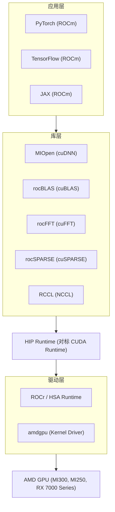

+++
title = "26. ROCm与AMD GPU开发"
date = 2026-02-06
weight = 26000
description = "AMD GPU开发指南：ROCm平台、HIP编程、MIOpen、与CUDA的迁移对比，适用于MI系列GPU开发"
[taxonomies]
tags = ["rocm", "hip", "amd", "gpu", "miopen"]
+++

## 概述

ROCm（Radeon Open Compute）是 AMD 的开源 GPU 计算平台，对标 NVIDIA CUDA。本文介绍 ROCm 生态系统、HIP 编程模型、MIOpen 库使用，以及如何从 CUDA 迁移到 ROCm。

---

## 一、ROCm 平台概述

### 1.1 ROCm 生态

**ROCm 软件栈：**



### 1.2 AMD GPU 架构

**AMD GPU 架构（CDNA3 / MI300）：**

**Compute Unit (CU) - 对标 NVIDIA SM：**
- 每个 CU 有 64 个流处理器（Stream Processors）
- 4 个 SIMD 单元，每个 16 宽
- 64KB LDS（Local Data Share，类似 Shared Memory）
- 16KB L1 Cache

**Wavefront（波前）- 对标 NVIDIA Warp：**
- 64 个线程为一组（CUDA 是 32）
- SIMT 执行模型
- 每个 CU 可调度多个 Wavefront

**MI300X 规格：**
- 304 CUs
- 192GB HBM3
- 5.3 TB/s 内存带宽
- 1.3 PFLOPS FP16
- 653 TFLOPS FP32

**MI300X vs H100 对比：**

| 指标 | MI300X | H100 |
|------|--------|------|
| FP16 算力 | 1.3 PFLOPS | 1.98 PFLOPS |
| 内存容量 | 192GB | 80GB |
| 内存带宽 | 5.3 TB/s | 3.35 TB/s |
| TDP | 750W | 700W |

---

## 二、ROCm 安装与配置

### 2.1 安装 ROCm

```bash
# Ubuntu 22.04 安装 ROCm 6.x

# 1. 添加仓库
wget https://repo.radeon.com/amdgpu-install/6.0/ubuntu/jammy/amdgpu-install_6.0.60000-1_all.deb
sudo apt install ./amdgpu-install_6.0.60000-1_all.deb

# 2. 安装 ROCm
sudo amdgpu-install --usecase=rocm

# 3. 添加用户到 render 和 video 组
sudo usermod -a -G render,video $USER

# 4. 配置环境变量
echo 'export PATH=$PATH:/opt/rocm/bin' >> ~/.bashrc
echo 'export LD_LIBRARY_PATH=$LD_LIBRARY_PATH:/opt/rocm/lib' >> ~/.bashrc
source ~/.bashrc

# 5. 验证安装
rocminfo
rocm-smi

# 6. 安装 PyTorch ROCm 版本
pip3 install torch torchvision torchaudio --index-url https://download.pytorch.org/whl/rocm6.0
```

### 2.2 验证环境

```bash
# 查看 GPU 信息
$ rocminfo
Agent 1
  Name:                    AMD Instinct MI250X
  Vendor Name:             AMD
  Feature:                 KERNEL_DISPATCH
  ...

# GPU 监控
$ rocm-smi
======================== ROCm System Management Interface ========================
GPU  Temp   AvgPwr  SCLK    MCLK     Fan  Perf  PwrCap  VRAM%  GPU%
0    45c    50W     800Mhz  1600Mhz  0%   auto  560W    0%     0%
==================================================================================

# 编译测试程序
$ hipcc --version
HIP version: 6.0.0

$ hipcc -o test test.cpp
$ ./test
```

---

## 三、HIP 编程

### 3.1 HIP 与 CUDA 对应关系

**HIP 与 CUDA API 对照：**

**关键字/函数：**

| CUDA | HIP |
|------|-----|
| `__global__` | `__global__` |
| `__device__` | `__device__` |
| `__shared__` | `__shared__` |
| `__constant__` | `__constant__` |
| `cudaMalloc` | `hipMalloc` |
| `cudaMemcpy` | `hipMemcpy` |
| `cudaFree` | `hipFree` |
| `cudaDeviceSynchronize` | `hipDeviceSynchronize` |
| `cudaStream_t` | `hipStream_t` |
| `cudaEvent_t` | `hipEvent_t` |

**内置变量：**

| CUDA | HIP | 备注 |
|------|-----|------|
| `threadIdx.x` | `threadIdx.x` | 相同 |
| `blockIdx.x` | `blockIdx.x` | 相同 |
| `blockDim.x` | `blockDim.x` | 相同 |
| `gridDim.x` | `gridDim.x` | 相同 |
| `warpSize` (32) | `warpSize` (64) | **注意不同！** |

**库对应：**

| CUDA | HIP/ROCm |
|------|----------|
| cuBLAS | rocBLAS |
| cuDNN | MIOpen |
| cuFFT | rocFFT |
| cuRAND | rocRAND |
| NCCL | RCCL |
| Thrust | rocThrust |

### 3.2 HIP 编程示例

```cpp
/*
 * HIP 向量加法示例
 * 编译: hipcc -o vectorAdd vectorAdd.cpp
 */

#include <hip/hip_runtime.h>
#include <stdio.h>

// Kernel 函数
__global__ void vectorAdd(const float* A, const float* B, float* C, int N) {
    int i = blockIdx.x * blockDim.x + threadIdx.x;
    if (i < N) {
        C[i] = A[i] + B[i];
    }
}

int main() {
    int N = 1000000;
    size_t size = N * sizeof(float);
    
    // Host 内存
    float *h_A = (float*)malloc(size);
    float *h_B = (float*)malloc(size);
    float *h_C = (float*)malloc(size);
    
    // 初始化
    for (int i = 0; i < N; i++) {
        h_A[i] = 1.0f;
        h_B[i] = 2.0f;
    }
    
    // Device 内存
    float *d_A, *d_B, *d_C;
    hipMalloc(&d_A, size);
    hipMalloc(&d_B, size);
    hipMalloc(&d_C, size);
    
    // 复制到 Device
    hipMemcpy(d_A, h_A, size, hipMemcpyHostToDevice);
    hipMemcpy(d_B, h_B, size, hipMemcpyHostToDevice);
    
    // 启动 Kernel
    int threadsPerBlock = 256;
    int blocksPerGrid = (N + threadsPerBlock - 1) / threadsPerBlock;
    
    hipLaunchKernelGGL(vectorAdd, 
                       dim3(blocksPerGrid), 
                       dim3(threadsPerBlock), 
                       0, 0,  // shared mem, stream
                       d_A, d_B, d_C, N);
    
    // 或使用 CUDA 风格语法
    // vectorAdd<<<blocksPerGrid, threadsPerBlock>>>(d_A, d_B, d_C, N);
    
    // 同步
    hipDeviceSynchronize();
    
    // 复制回 Host
    hipMemcpy(h_C, d_C, size, hipMemcpyDeviceToHost);
    
    // 验证
    bool success = true;
    for (int i = 0; i < N; i++) {
        if (fabs(h_C[i] - 3.0f) > 1e-5) {
            success = false;
            break;
        }
    }
    printf("Result: %s\n", success ? "PASS" : "FAIL");
    
    // 清理
    hipFree(d_A);
    hipFree(d_B);
    hipFree(d_C);
    free(h_A);
    free(h_B);
    free(h_C);
    
    return 0;
}
```

### 3.3 Wavefront 编程注意事项

```cpp
/*
 * Wavefront 相关编程（warpSize = 64）
 */

// Warp 级归约 - 注意 AMD 是 64 线程
__device__ float warp_reduce_sum(float val) {
    // AMD wavefront 大小是 64
    for (int offset = warpSize / 2; offset > 0; offset /= 2) {
        val += __shfl_down(val, offset);
    }
    return val;
}

// 使用 __ballot 时注意返回类型
// CUDA: unsigned int (32-bit)
// HIP:  unsigned long long (64-bit)
__device__ unsigned long long wavefront_ballot(int predicate) {
    return __ballot(predicate);
}

// __shfl 函数在 HIP 中类似
__device__ float wavefront_shfl(float var, int srcLane) {
    return __shfl(var, srcLane);
}

// 跨平台宏
#ifdef __HIP_PLATFORM_AMD__
    #define WARP_SIZE 64
    typedef unsigned long long ballot_t;
#else
    #define WARP_SIZE 32
    typedef unsigned int ballot_t;
#endif
```

---

## 四、CUDA 到 HIP 迁移

### 4.1 HIPIFY 工具

```bash
# 使用 hipify-perl 自动转换 CUDA 代码

# 转换单个文件
hipify-perl cuda_code.cu > hip_code.cpp

# 转换整个目录
hipify-perl --inplace --print-stats .

# 查看转换统计
hipify-perl --print-stats cuda_code.cu

# 转换 cuDNN 到 MIOpen（需要手动调整）
hipify-perl --miopen cuda_dnn.cu > hip_dnn.cpp

# CMake 项目转换
# 将 find_package(CUDA) 替换为 find_package(HIP)
```

### 4.2 常见迁移问题

```cpp
/*
 * CUDA 到 HIP 迁移注意事项
 */

// 1. Warp 大小不同
// CUDA
if (threadIdx.x % 32 == 0) { ... }
// HIP
if (threadIdx.x % warpSize == 0) { ... }  // warpSize = 64

// 2. 头文件
// CUDA
#include <cuda_runtime.h>
// HIP
#include <hip/hip_runtime.h>

// 3. 编译器内置函数
// CUDA
__syncwarp(0xffffffff);
// HIP
__syncthreads();  // 通常需要使用 block 级同步

// 4. Cooperative Groups（有限支持）
// HIP 对 cooperative groups 支持不如 CUDA 完整
// 建议使用传统同步方式

// 5. Tensor Core
// CUDA: wmma API
// HIP: 使用 rocWMMA 或 Composable Kernel

// 6. 动态并行
// HIP 支持动态并行，但需要特别注意编译选项

// 7. 统一内存
// hipMallocManaged 可用，但性能特性可能不同
```

### 4.3 跨平台代码

```cpp
/*
 * 跨 CUDA/HIP 平台的统一代码
 */

#ifdef __HIP_PLATFORM_AMD__
    #include <hip/hip_runtime.h>
    #define GPU_PLATFORM "AMD ROCm"
#else
    #include <cuda_runtime.h>
    #define GPU_PLATFORM "NVIDIA CUDA"
#endif

// 统一宏定义
#ifdef __HIP_PLATFORM_AMD__
    #define gpuMalloc hipMalloc
    #define gpuMemcpy hipMemcpy
    #define gpuFree hipFree
    #define gpuDeviceSynchronize hipDeviceSynchronize
    #define gpuMemcpyHostToDevice hipMemcpyHostToDevice
    #define gpuMemcpyDeviceToHost hipMemcpyDeviceToHost
#else
    #define gpuMalloc cudaMalloc
    #define gpuMemcpy cudaMemcpy
    #define gpuFree cudaFree
    #define gpuDeviceSynchronize cudaDeviceSynchronize
    #define gpuMemcpyHostToDevice cudaMemcpyHostToDevice
    #define gpuMemcpyDeviceToHost cudaMemcpyDeviceToHost
#endif

// 跨平台 Kernel
__global__ void myKernel(float* data, int N) {
    int idx = blockIdx.x * blockDim.x + threadIdx.x;
    if (idx < N) {
        data[idx] *= 2.0f;
    }
}

int main() {
    printf("Running on %s\n", GPU_PLATFORM);
    
    float* d_data;
    gpuMalloc(&d_data, 1024 * sizeof(float));
    
    myKernel<<<4, 256>>>(d_data, 1024);
    gpuDeviceSynchronize();
    
    gpuFree(d_data);
    return 0;
}
```

---

## 五、MIOpen 使用

### 5.1 MIOpen 概述

**MIOpen - AMD 的深度学习库（对标 cuDNN）：**

**支持的操作：**
- Convolution（前向、后向、权重梯度）
- Pooling（Max、Average、Global）
- Normalization（BatchNorm、LayerNorm）
- Activation（ReLU、Sigmoid、Tanh、Softmax）
- RNN（LSTM、GRU）
- Fusion（算子融合）

**性能特点：**
- 自动算法选择
- 即时编译（JIT）优化
- Find DB 缓存最优算法

### 5.2 MIOpen 卷积示例

```cpp
#include <miopen/miopen.h>

void conv2d_miopen() {
    miopenHandle_t handle;
    miopenCreate(&handle);
    
    // 输入描述符
    miopenTensorDescriptor_t inputDesc, outputDesc, filterDesc;
    miopenCreateTensorDescriptor(&inputDesc);
    miopenCreateTensorDescriptor(&outputDesc);
    miopenCreateTensorDescriptor(&filterDesc);
    
    int n = 1, c = 3, h = 224, w = 224;
    int k = 64, r = 3, s = 3;
    
    miopenSet4dTensorDescriptor(inputDesc, miopenFloat, n, c, h, w);
    miopenSet4dTensorDescriptor(filterDesc, miopenFloat, k, c, r, s);
    
    // 卷积描述符
    miopenConvolutionDescriptor_t convDesc;
    miopenCreateConvolutionDescriptor(&convDesc);
    miopenInitConvolutionDescriptor(convDesc,
                                     miopenConvolution,
                                     1, 1,  // pad_h, pad_w
                                     1, 1,  // stride_h, stride_w
                                     1, 1); // dilation_h, dilation_w
    
    // 获取输出尺寸
    int out_n, out_c, out_h, out_w;
    miopenGetConvolutionForwardOutputDim(convDesc, inputDesc, filterDesc,
                                          &out_n, &out_c, &out_h, &out_w);
    miopenSet4dTensorDescriptor(outputDesc, miopenFloat, out_n, out_c, out_h, out_w);
    
    // 查找最佳算法
    size_t workspaceSize;
    miopenConvolutionForwardGetWorkSpaceSize(handle, filterDesc, inputDesc,
                                              convDesc, outputDesc, &workspaceSize);
    
    void* workspace;
    hipMalloc(&workspace, workspaceSize);
    
    // 算法搜索
    int requestedAlgoCount = 5;
    int returnedAlgoCount;
    miopenConvAlgoPerf_t perfResults[5];
    
    miopenFindConvolutionForwardAlgorithm(
        handle, inputDesc, d_input, filterDesc, d_filter,
        convDesc, outputDesc, d_output,
        requestedAlgoCount, &returnedAlgoCount, perfResults,
        workspace, workspaceSize, false  // exhaustiveSearch
    );
    
    // 使用最佳算法执行
    float alpha = 1.0f, beta = 0.0f;
    miopenConvolutionForward(
        handle, &alpha,
        inputDesc, d_input,
        filterDesc, d_filter,
        convDesc,
        perfResults[0].fwd_algo,
        &beta,
        outputDesc, d_output,
        workspace, workspaceSize
    );
    
    // 清理
    hipFree(workspace);
    miopenDestroyTensorDescriptor(inputDesc);
    miopenDestroyTensorDescriptor(outputDesc);
    miopenDestroyTensorDescriptor(filterDesc);
    miopenDestroyConvolutionDescriptor(convDesc);
    miopenDestroy(handle);
}
```

---

## 六、Composable Kernel

### 6.1 概述

**Composable Kernel (CK) - AMD 的高性能 Kernel 模板库：**

**功能：**
- 高性能 GEMM
- Attention / FlashAttention
- 可组合的 Kernel 模块
- 类似 NVIDIA CUTLASS

**特点：**
- C++ 模板元编程
- 针对 AMD GPU 优化
- 支持多种数据类型
- 高度可配置

**GitHub**: ROCm/composable_kernel

### 6.2 CK GEMM 示例

```cpp
#include "ck/tensor_operation/gpu/device/impl/device_gemm_xdl.hpp"

using DeviceGemmInstance = ck::tensor_operation::device::DeviceGemm_Xdl<
    ck::half_t,  // ADataType
    ck::half_t,  // BDataType
    ck::half_t,  // CDataType
    ck::half_t,  // AccDataType
    ck::tensor_layout::gemm::RowMajor,  // ALayout
    ck::tensor_layout::gemm::RowMajor,  // BLayout
    ck::tensor_layout::gemm::RowMajor,  // CLayout
    256,  // BlockSize
    128,  // MPerBlock
    128,  // NPerBlock
    32,   // KPerBlock
    8,    // AK1
    8,    // BK1
    32,   // MPerXDL
    32,   // NPerXDL
    2,    // MXdlPerWave
    2,    // NXdlPerWave
    // ... 更多配置
>;

void run_ck_gemm(half* A, half* B, half* C, int M, int N, int K) {
    auto gemm = DeviceGemmInstance{};
    
    auto argument = gemm.MakeArgument(
        A, B, C,
        M, N, K,
        K,  // StrideA
        N,  // StrideB
        N   // StrideC
    );
    
    auto invoker = gemm.MakeInvoker();
    invoker.Run(argument, StreamConfig{nullptr, false});
}
```

---

## 七、PyTorch ROCm

### 7.1 使用 PyTorch ROCm

```python
import torch

# 检查 ROCm 可用性
print(f"ROCm available: {torch.cuda.is_available()}")
print(f"Device count: {torch.cuda.device_count()}")
print(f"Current device: {torch.cuda.current_device()}")
print(f"Device name: {torch.cuda.get_device_name()}")

# 使用方式与 CUDA 完全相同
device = torch.device("cuda")

# 创建张量
x = torch.randn(1000, 1000, device=device)
y = torch.randn(1000, 1000, device=device)

# 矩阵乘法
z = torch.mm(x, y)

# 模型训练
import torch.nn as nn

model = nn.Sequential(
    nn.Linear(784, 256),
    nn.ReLU(),
    nn.Linear(256, 10)
).to(device)

# 使用 torch.compile（ROCm 6.0+）
compiled_model = torch.compile(model)
```

### 7.2 自定义 HIP 算子

```python
# setup.py
from setuptools import setup
from torch.utils.cpp_extension import BuildExtension, HipExtension

setup(
    name='my_hip_extension',
    ext_modules=[
        HipExtension(
            'my_hip_extension',
            ['my_kernel.cpp', 'my_kernel_hip.cpp'],
            extra_compile_args={
                'cxx': ['-O3'],
                'hipcc': ['-O3', '--amdgpu-target=gfx90a'],  # MI250
            }
        ),
    ],
    cmdclass={'build_ext': BuildExtension}
)
```

```cpp
// my_kernel_hip.cpp
#include <torch/extension.h>
#include <hip/hip_runtime.h>

__global__ void my_kernel(float* data, int n) {
    int idx = blockIdx.x * blockDim.x + threadIdx.x;
    if (idx < n) {
        data[idx] *= 2.0f;
    }
}

torch::Tensor my_function(torch::Tensor input) {
    auto output = input.clone();
    int n = output.numel();
    
    int threads = 256;
    int blocks = (n + threads - 1) / threads;
    
    my_kernel<<<blocks, threads>>>(output.data_ptr<float>(), n);
    
    return output;
}

PYBIND11_MODULE(TORCH_EXTENSION_NAME, m) {
    m.def("my_function", &my_function, "My HIP function");
}
```

---

## 八、性能调优

### 8.1 调优工具

```bash
# ROCm 性能分析工具

# rocprof - 性能分析
rocprof --stats ./my_program
rocprof -i input.txt -o output.csv ./my_program

# rocprof 输入文件示例 (input.txt)
pmc: GRBM_COUNT, GRBM_GUI_ACTIVE
range: 0:1
kernel: vectorAdd

# Omniperf - 详细性能分析
omniperf profile -n my_profile ./my_program
omniperf analyze -p my_profile/

# Omnitrace - 系统级追踪
omnitrace-instrument -o instrumented ./my_program
omnitrace-run -- ./instrumented
```

### 8.2 优化技巧

```cpp
/*
 * AMD GPU 优化技巧
 */

// 1. Wavefront 大小适配
// 确保线程数是 64 的倍数
int blockSize = 256;  // 4 个 wavefront
int gridSize = (N + blockSize - 1) / blockSize;

// 2. LDS (Local Data Share) 使用
// AMD GPU 每个 CU 有 64KB LDS
__shared__ float lds_data[64 * 64];  // 16KB

// 3. 向量化加载
// 使用 float4 提高内存带宽利用
float4* vec_ptr = (float4*)data;
float4 val = vec_ptr[idx];

// 4. 循环展开
#pragma unroll 4
for (int i = 0; i < N; i++) {
    // ...
}

// 5. 避免 bank conflict
// AMD LDS 有 32 个 bank（4 字节每 bank）
// 策略类似 CUDA

// 6. 使用 AMD 特定内置函数
__builtin_amdgcn_readfirstlane(val);  // 读取第一个 lane 的值
```

---

## 九、最佳实践

**ROCm 开发最佳实践：**

| 类别 | 建议 |
|------|------|
| **代码迁移** | 使用 hipify 作为起点；手动检查 warpSize 相关代码；测试覆盖 edge cases |
| **性能** | 使用 rocprof 分析瓶颈；注意 64 线程 wavefront；充分利用 LDS |
| **库选择** | 优先使用 MIOpen、rocBLAS；复杂 Kernel 考虑 Composable Kernel |
| **调试** | 使用 rocgdb 调试；检查 `hipGetLastError()`；开启 AMD_LOG_LEVEL 获取详细日志 |
| **跨平台** | 使用条件编译支持双平台；抽象 warpSize 差异；充分测试两个平台 |

---

## 相关文章

- [上一篇：25 - FlashAttention 与 PagedAttention 原理](@/articles/ai/ai-25-FlashAttention与PagedAttention原理.md)
- [下一篇：27 - 计算机视觉与 OpenCV 实战](@/articles/ai/ai-27-计算机视觉与OpenCV实战.md)
- [21 - CUDA 入门与 GPU 编程基础](@/articles/ai/ai-21-CUDA入门与GPU编程基础.md)
- [24 - GPU Kernel 开发详解](@/articles/ai/ai-24-GPU-Kernel开发详解.md)
