+++
title = "AI 技术栈全景图"
description = "从应用到硬件的完整分层，理解 AI 系统全貌与岗位定位"
date = 2025-02-06
weight = 28000
updated = 2025-02-06
draft = false
[taxonomies]
tags = ["AI", "技术栈", "职业规划", "系统架构"]
[extra]
toc = true
comments = true
+++

## 一、为什么需要全景图

当我们谈论"做 AI"时，不同人理解的完全不同：
- 产品经理说的是 ChatGPT 能做什么
- 应用开发者说的是 LangChain 怎么用
- 算法工程师说的是模型怎么训练
- 系统工程师说的是推理服务怎么优化
- 硬件工程师说的是 GPU 怎么设计

这些都是"AI"，但处于完全不同的技术层次。理解全景图能帮助你：
1. **定位自己**：知道自己在哪一层，能往哪个方向发展
2. **有效沟通**：与不同层次的人交流时知道彼此在说什么
3. **技术决策**：理解问题应该在哪一层解决
4. **职业规划**：找到适合自己的技术深度和方向

---

## 二、AI 技术栈分层模型

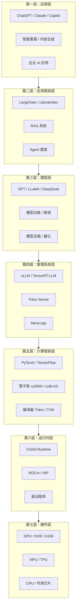

---

## 三、各层详解

### 3.1 第一层：应用层

**定位**：直接面向最终用户的产品

**典型产品**：
| 类别 | 产品示例 |
|------|----------|
| 通用助手 | ChatGPT、Claude、文心一言 |
| 代码助手 | GitHub Copilot、Cursor |
| 图像生成 | Midjourney、DALL-E、Stable Diffusion |
| 企业应用 | 智能客服、文档分析、内容审核 |

**技术特点**：
- 产品思维 > 技术深度
- 关注用户体验、商业模式
- 技术上主要是 API 调用和产品集成

**从业者**：产品经理、前端开发、业务开发

---

### 3.2 第二层：应用框架层

**定位**：简化 AI 应用开发的工具和框架

**核心框架**：

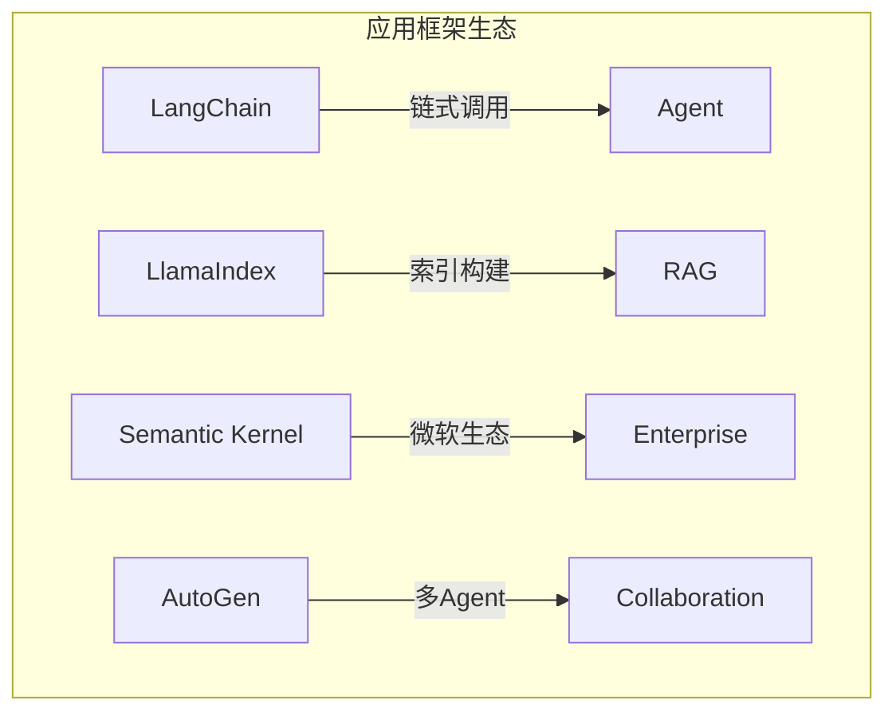

**技术栈**：

| 组件 | 工具 | 作用 |
|------|------|------|
| 向量数据库 | Milvus / Pinecone / Chroma | 存储和检索 Embedding |
| Embedding 模型 | BGE / E5 / OpenAI Embedding | 文本向量化 |
| 提示词工程 | PromptTemplate / Few-shot | 构造输入 |
| Agent 框架 | ReAct / Tool Calling | 工具调用和推理 |

**典型工作**：
- 构建 RAG 系统
- 设计 Agent 工作流
- Prompt 优化
- 多模型编排

**技术深度**：中低
- 主要是 Python
- 调用 API 和组装组件
- 类似"Spring 框架使用者"

---

### 3.3 第三层：模型层

**定位**：AI 模型本身的研发

**细分方向**：

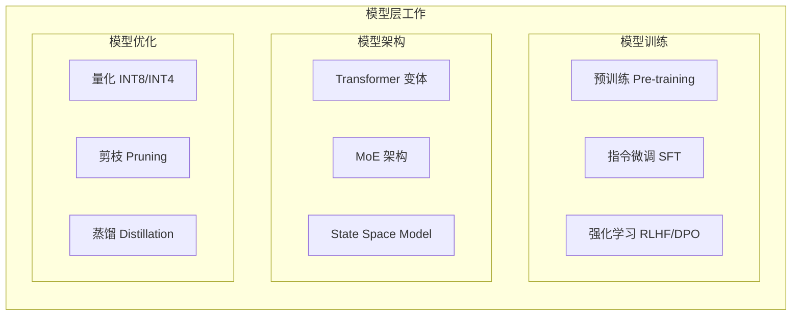

**技术要求**：
| 方向 | 核心技能 | 难度 |
|------|----------|------|
| 预训练 | 大规模数据处理、分布式训练 | 很高 |
| 微调 | 数据构造、训练技巧 | 中高 |
| 架构研究 | 数学功底、创新能力 | 很高 |
| 模型压缩 | 量化理论、精度分析 | 中高 |

**从业者**：算法研究员、模型工程师

**语言**：主要 Python，部分 C++

---

### 3.4 第四层：推理系统层 ⭐

**定位**：让模型高效运行的系统软件

这一层是**系统工程**与**AI**的交汇点，也是你关注的核心方向。

**核心系统**：

| 系统 | 定位 | 技术栈 |
|------|------|--------|
| vLLM | LLM 高效推理 | Python + C++/CUDA |
| TensorRT-LLM | NVIDIA 官方 LLM 推理 | C++ |
| llama.cpp | 端侧/CPU 推理 | 纯 C/C++ |
| Triton Server | 模型服务化 | C++ |
| SGLang | 新兴推理引擎 | Python + C++ |

**技术挑战**：

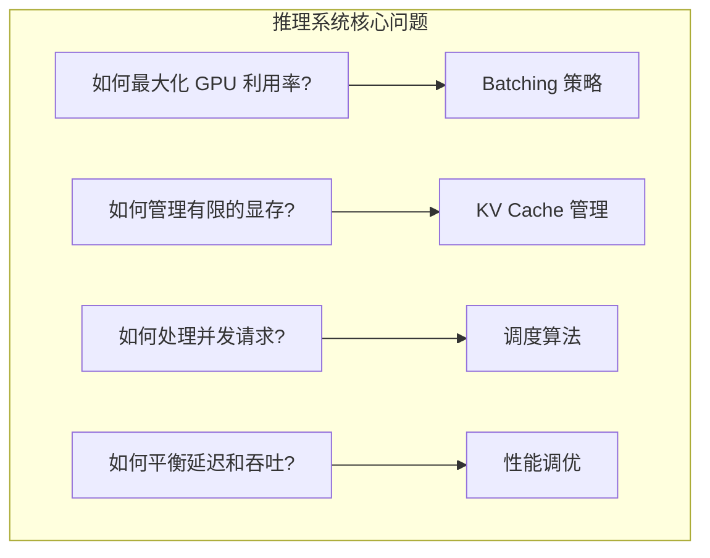

**关键技术**：
1. **Continuous Batching**：动态组批，不等待
2. **PagedAttention**：显存分页管理
3. **Speculative Decoding**：投机解码加速
4. **Tensor Parallelism**：多卡模型并行

**技术深度**：高
- 需要理解 GPU 架构
- 需要系统编程能力
- 大量 C++ 工作

---

### 3.5 第五层：计算框架层

**定位**：提供模型计算的基础能力

**框架分类**：

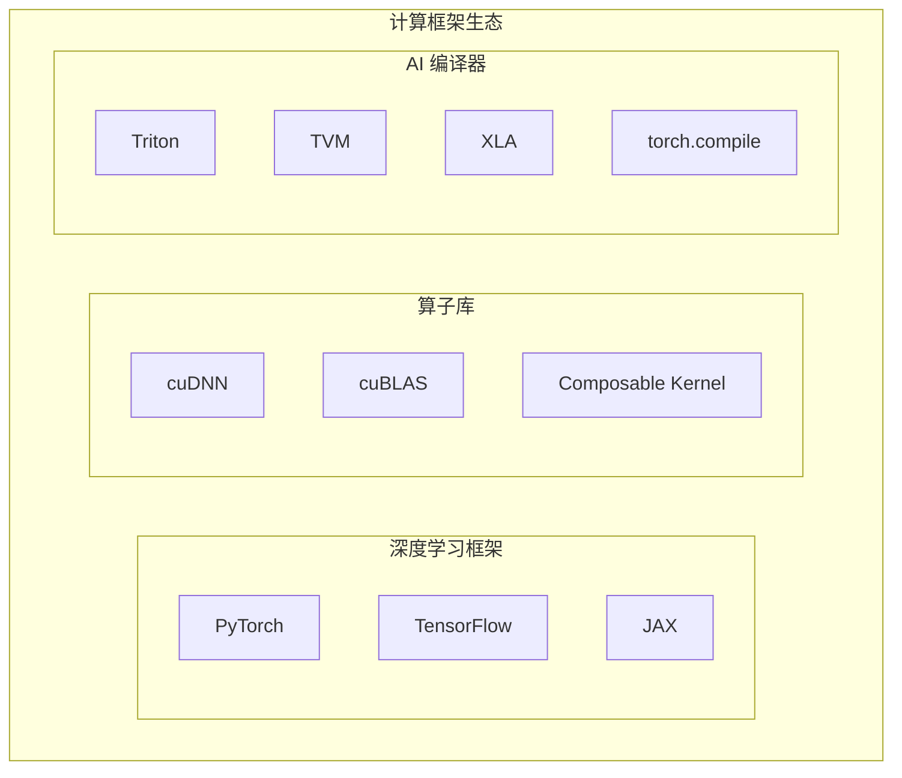

**各组件职责**：

| 组件 | 职责 | 语言 |
|------|------|------|
| PyTorch | 模型定义、自动微分、训练循环 | Python + C++ |
| cuDNN | 卷积、归一化等算子优化实现 | C/C++ + CUDA |
| cuBLAS | 矩阵运算优化实现 | C/C++ + CUDA |
| Triton | DSL 编写高性能 Kernel | Python-like DSL |
| TVM | 模型编译优化 | Python + C++ |

**CUDA 算子在这一层**：

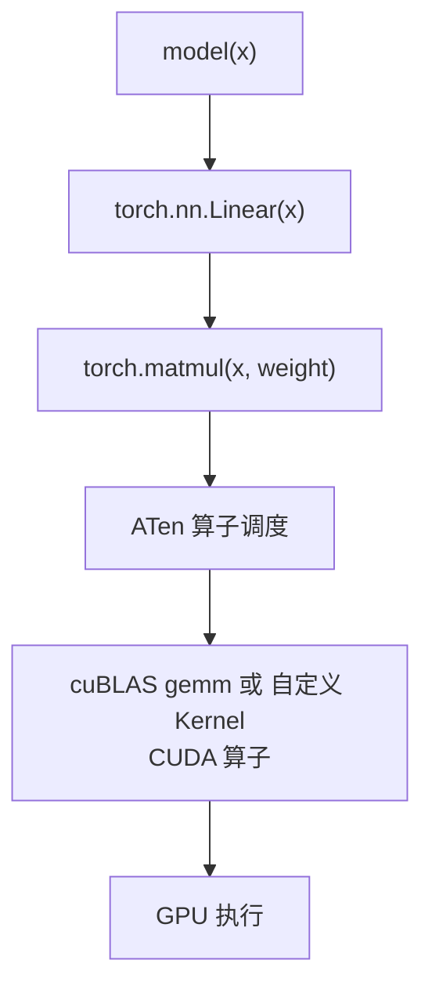

---

### 3.6 第六层：运行时层

**定位**：GPU 编程接口和驱动

**主要组件**：

| 组件 | 厂商 | 作用 |
|------|------|------|
| CUDA Runtime | NVIDIA | GPU 编程接口 |
| CUDA Driver | NVIDIA | 与硬件通信 |
| ROCm/HIP | AMD | AMD GPU 编程 |
| oneAPI | Intel | Intel GPU/CPU |
| Vulkan Compute | Khronos | 跨平台 GPU |

**技术工作**：
- CUDA Runtime 开发（NVIDIA 内部）
- 驱动开发（硬件厂商内部）
- 跨平台抽象层

**从业者**：主要在硬件厂商内部

---

### 3.7 第七层：硬件层

**定位**：物理计算设备

**硬件类型**：

| 类型 | 代表 | 特点 |
|------|------|------|
| GPU | NVIDIA H100/A100 | 通用，生态成熟 |
| TPU | Google TPU | 专为 TensorFlow 优化 |
| NPU | 华为昇腾、高通 Hexagon | 端侧推理优化 |
| 专用芯片 | Cerebras、Graphcore | 特定场景优化 |

**技术工作**：芯片设计、微架构

**从业者**：芯片工程师、硬件架构师

---

## 四、层次间的关系

### 4.1 依赖关系

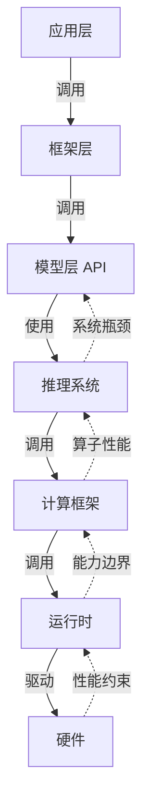

**说明**：
- **实线箭头（→）**：调用方向，从上层到下层
- **虚线箭头（⇢）**：优化方向，下层约束上层

### 4.2 抽象层次

| 特性 | 应用层 | 框架层 | 模型层 | 推理系统 | 算子/HW |
|------|--------|--------|--------|----------|---------|
| 抽象程度 | 高 | → | → | → | 低 |
| 易用性 | 高 | → | → | → | 低 |
| 性能控制 | 低 | → | → | → | 高 |
| 主要语言 | Python | Python | Python | C++ | C++ |
| 工作类型 | API调用 | 组件组装 | 训练脚本 | 系统编程 | CUDA |

---

## 五、各层岗位与技能要求

### 5.1 岗位分布

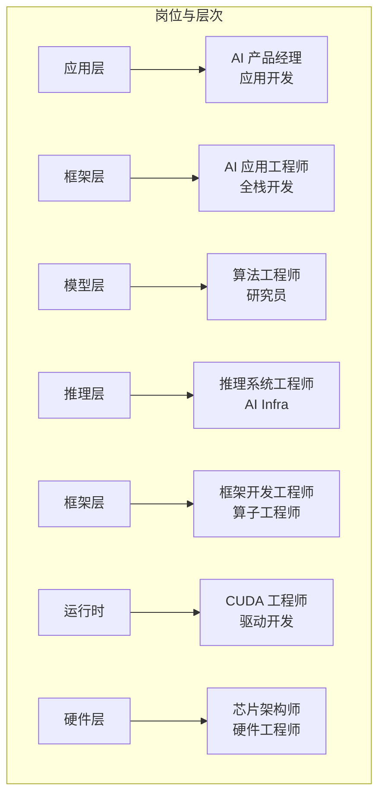

### 5.2 技能矩阵

| 层次 | Python | C/C++ | CUDA | 系统 | 算法 | 硬件 |
|------|--------|-------|------|------|------|------|
| 应用层 | ★★☆ | ☆ | ☆ | ☆ | ☆ | ☆ |
| 框架层 | ★★★ | ☆ | ☆ | ★☆ | ★☆ | ☆ |
| 模型层 | ★★★ | ★☆ | ★☆ | ★☆ | ★★★ | ☆ |
| 推理系统 | ★★☆ | ★★★ | ★★☆ | ★★★ | ★★☆ | ★★☆ |
| 计算框架 | ★★☆ | ★★★ | ★★★ | ★★☆ | ★★☆ | ★★☆ |
| 运行时 | ★☆ | ★★★ | ★★★ | ★★★ | ★☆ | ★★★ |
| 硬件层 | ☆ | ★★☆ | ★☆ | ★★☆ | ★☆ | ★★★ |

---

## 六、技术演进趋势

### 6.1 短期趋势（1-2 年）

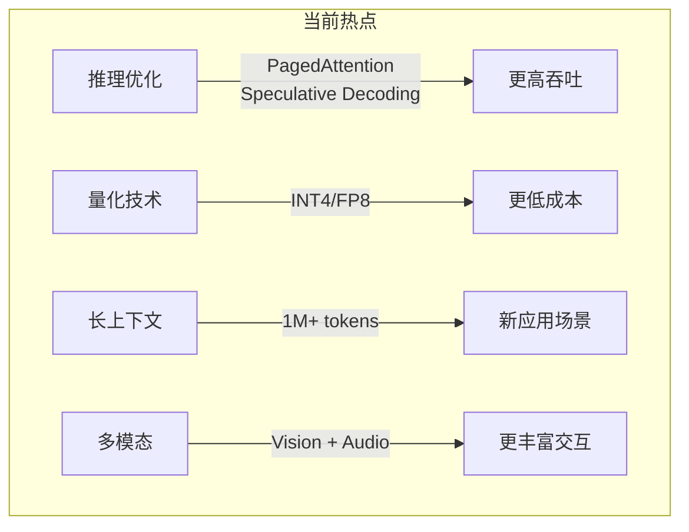

### 6.2 中期趋势（2-5 年）

| 趋势 | 影响 |
|------|------|
| AI 编译器成熟 | 减少手写 Kernel 需求 |
| 硬件多样化 | 需要更多跨平台适配 |
| 端侧 AI 爆发 | 边缘部署需求增加 |
| 推理系统标准化 | 框架趋于统一 |

### 6.3 长期趋势

**岗位演进：**

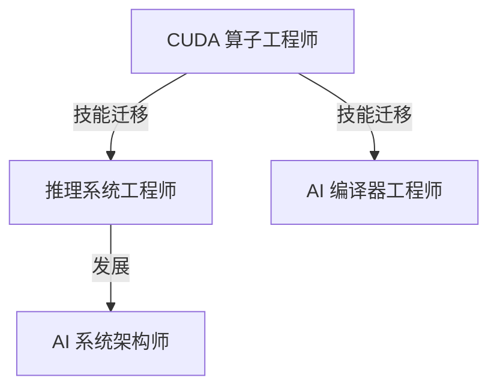

**技术演进：**

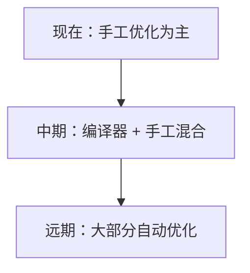

---

## 七、如何选择你的位置

### 7.1 根据兴趣选择

| 如果你喜欢... | 建议层次 |
|---------------|----------|
| 产品和用户体验 | 应用层 |
| 快速实现功能 | 框架层 |
| 数学和算法 | 模型层 |
| 系统设计和性能 | 推理系统层 |
| 底层优化 | 计算框架层 |
| 硬件和芯片 | 硬件层 |

### 7.2 根据技能背景选择

| 如果你擅长... | 适合方向 |
|---------------|----------|
| Python + 快速学习 | 框架层、模型层 |
| C++ + 系统编程 | 推理系统、计算框架 |
| 数学 + 论文阅读 | 模型层、算法研究 |
| 硬件 + 底层 | 驱动、芯片 |

### 7.3 根据你的需求

你的需求：
- ✅ 从事 AI
- ✅ 大量使用 C/C++
- ❌ 不想做应用层（LangChain + RAG）
- ❌ 不想做芯片/编译器

**推荐定位：第四层（推理系统层）+ 部分第五层**

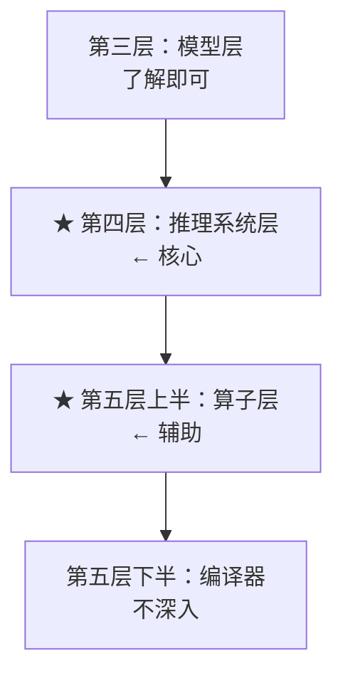

**详细说明：**

| 层次 | 重点内容 |
|------|----------|
| 第四层（核心） | vLLM / TensorRT-LLM / llama.cpp、调度、内存管理、Batching |
| 第五层上半（辅助） | 理解 CUDA Kernel 原理，不以手写 Kernel 为主业 |

---

## 八、总结

### 8.1 核心认知

1. **AI 不是一个岗位，而是一个技术栈**
   - 从产品到芯片，至少 7 层
   - 每层需要不同技能

2. **越往下，C++ 越多，门槛越高**
   - 应用层主要 Python
   - 推理系统和算子层主要 C++

3. **编译器会改变格局，但不会消灭系统工程**
   - 手写 Kernel 需求会减少
   - 系统设计和调度需求不会消失

4. **找准自己的位置比广撒网更重要**
   - 深度 > 广度
   - 专精一层 > 每层懂一点

### 8.2 下一步

- 如果你对职业路径感兴趣 → 阅读 [29 - AI C++ 工程师职业路径](@/articles/ai/ai-29-AI-C++工程师职业路径.md)
- 如果你想深入推理系统 → 阅读 [AI 推理系统架构概述](@/articles/ai-infra/ai-infra-01-AI推理系统架构概述.md)

---

## 相关文章

- [上一篇：27 - 计算机视觉与 OpenCV 实战](@/articles/ai/ai-27-计算机视觉与OpenCV实战.md)
- [下一篇：29 - AI C++ 工程师职业路径](@/articles/ai/ai-29-AI-C++工程师职业路径.md)
- [21 - CUDA 入门与 GPU 编程基础](@/articles/ai/ai-21-CUDA入门与GPU编程基础.md)
- [24 - GPU Kernel 开发详解](@/articles/ai/ai-24-GPU-Kernel开发详解.md)
