+++
title = "29. AI C++ 工程师职业路径"
description = "从技能要求到学习路线，全面解析 AI 领域 C++ 工程师的职业发展"
date = 2025-02-06
weight = 29000
updated = 2025-02-06
draft = false
[taxonomies]
tags = ["AI", "C++", "职业规划", "推理系统", "CUDA"]
[extra]
toc = true
comments = true
+++

## 一、为什么选择 AI + C++

### 1.1 AI 领域的语言分布

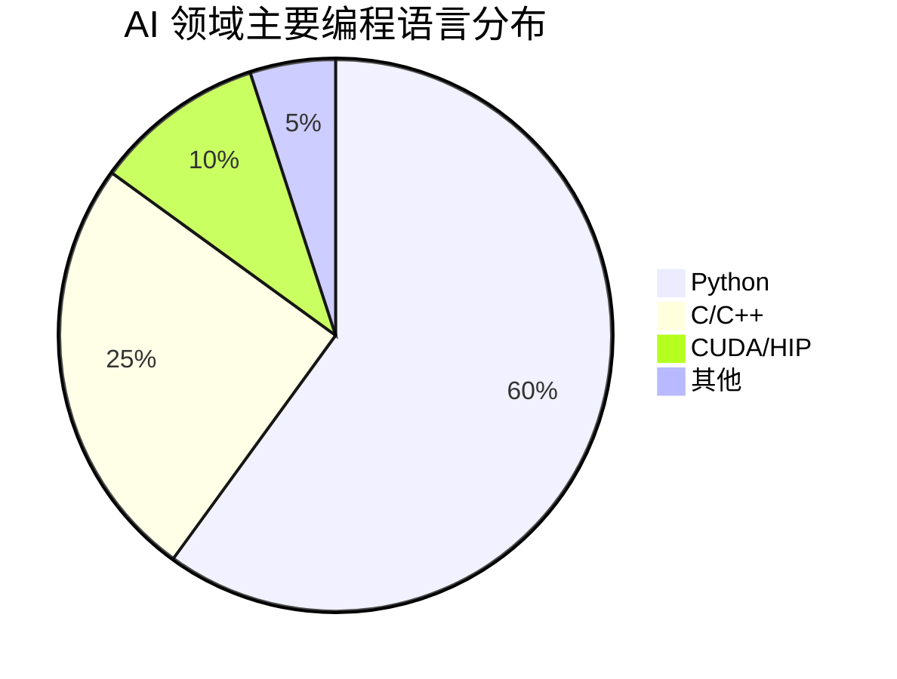

**现实情况**：
- **Python 主导**：模型训练、应用开发、快速原型
- **C++ 底层**：推理引擎、算子实现、高性能组件
- **CUDA**：GPU Kernel 开发（通常与 C++ 结合）

### 1.2 C++ 在 AI 中的不可替代性

| 场景 | 为什么必须用 C++ |
|------|------------------|
| 推理延迟敏感 | Python 解释器开销无法接受 |
| 显存管理 | 需要精细控制内存分配 |
| 多线程调度 | GIL 限制 Python 并发 |
| 嵌入式部署 | 资源受限环境无法运行 Python |
| 与 CUDA 集成 | CUDA Runtime 是 C API |

### 1.3 选择 AI + C++ 的优势

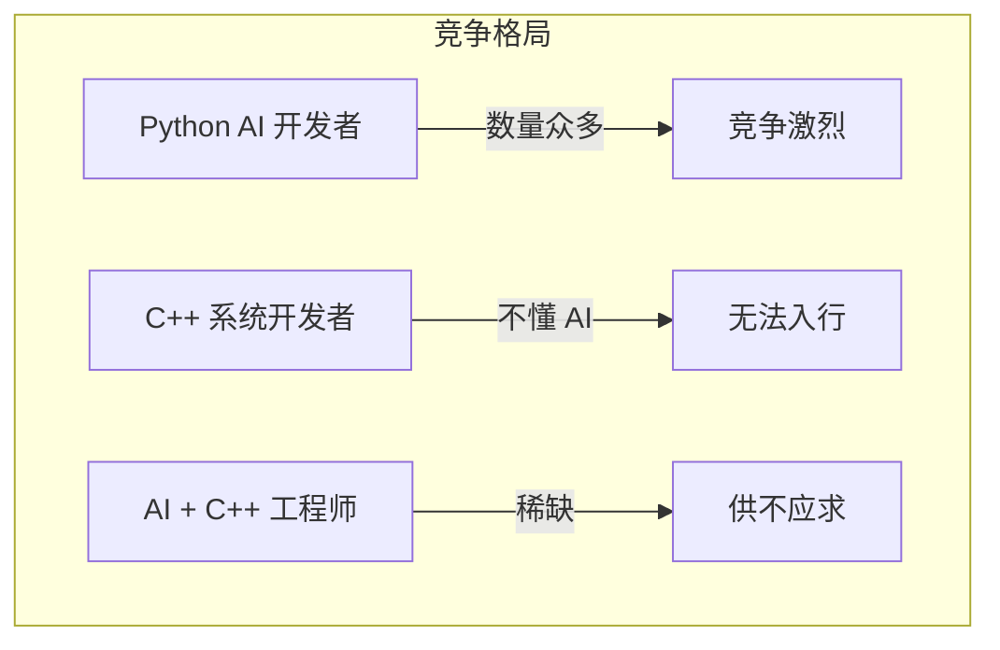

**稀缺性来源**：
1. 会 C++ 的人本就不多
2. 懂 AI 原理的 C++ 程序员更少
3. 能做推理系统优化的顶级稀缺

---

## 二、AI C++ 工程师的岗位图谱

### 2.1 主要岗位方向

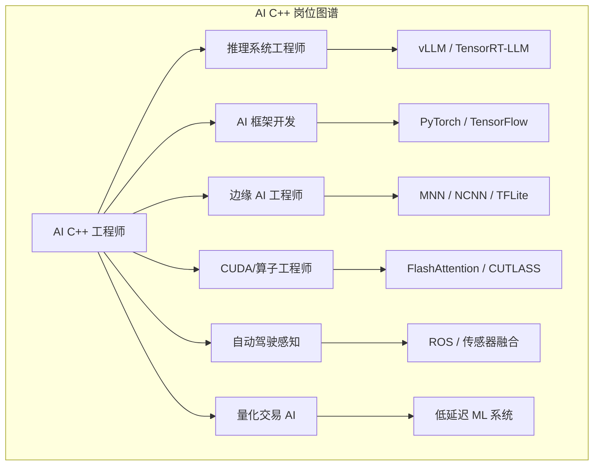

### 2.2 各方向详解

#### 方向一：推理系统工程师 ⭐ 推荐

**工作内容**：
- 开发/优化 LLM 推理引擎
- 设计调度算法和 Batching 策略
- 管理显存和 KV Cache
- 性能分析和瓶颈优化

**代表项目**：vLLM、TensorRT-LLM、SGLang、llama.cpp

**技术栈**：

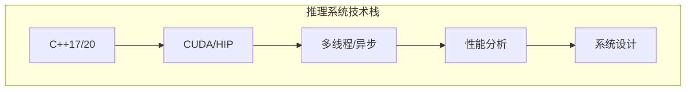

**薪资范围**（2024 国内）：
| 级别 | 薪资（年包） |
|------|-------------|
| 初级 | 30-50W |
| 中级 | 50-80W |
| 高级 | 80-150W |
| 专家 | 150W+ |

**优势**：
- 需求旺盛（LLM 爆发）
- 系统工程不易被自动化
- 技术深度高，护城河强

---

#### 方向二：AI 框架开发

**工作内容**：
- PyTorch/TensorFlow 核心开发
- 算子实现和优化
- 自动微分引擎
- 分布式训练支持

**代表公司**：Meta（PyTorch）、Google（TensorFlow/JAX）

**技术要求**：
- 深入理解计算图和自动微分
- 熟悉 C++ 模板元编程
- 了解编译器优化技术

**挑战**：
- 岗位集中在少数大厂
- 技术栈较封闭
- 需要深厚的 C++ 功底

---

#### 方向三：边缘 AI 工程师

**工作内容**：
- 端侧推理引擎开发
- 模型转换和量化
- 特定硬件适配（NPU、DSP）
- 嵌入式系统集成

**代表项目**：TensorRT、MNN、NCNN、TFLite

**技术栈**：

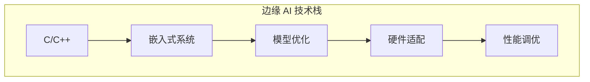

**优势**：
- 硬件碎片化保证长期需求
- 物联网和智能设备爆发
- 与嵌入式背景兼容

---

#### 方向四：CUDA/算子工程师

**工作内容**：
- 实现高性能 GPU Kernel
- 优化矩阵运算、Attention 等核心算子
- 适配新硬件（AMD、华为昇腾）

**代表项目**：FlashAttention、CUTLASS、Composable Kernel

**前景分析**：

| 维度 | 评估 |
|------|------|
| 当前需求 | 高 |
| 未来趋势 | 中（编译器替代部分工作） |
| 技术深度 | 很高 |
| 建议定位 | 作为基础技能，不作为唯一方向 |

---

#### 方向五：自动驾驶感知

**工作内容**：
- 传感器数据处理
- 目标检测和跟踪
- 传感器融合
- 实时系统开发

**技术栈**：
- C++ + CUDA
- ROS/ROS2
- OpenCV、PCL（点云）
- 实时操作系统

**特点**：
- 需要领域知识（车辆、传感器）
- AI 只是一部分，系统工程占比大
- 与自动驾驶行业绑定

---

#### 方向六：量化交易 AI

**工作内容**：
- 低延迟 ML 推理系统
- 特征工程和模型部署
- 实时数据处理

**技术要求**：
- 极致的延迟优化（微秒级）
- 金融领域知识
- 高可靠性系统设计

**特点**：
- 薪资很高
- 竞争激烈，门槛高
- 工作压力大

---

## 三、核心技能体系

### 3.1 技能分层模型

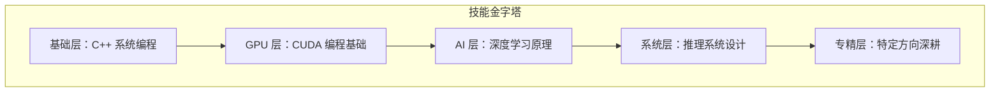

### 3.2 各层详细要求

#### 基础层：C++ 系统编程

**必须掌握**：

| 主题 | 具体内容 |
|------|----------|
| 现代 C++ | C++11/14/17/20 特性、智能指针、移动语义 |
| 内存管理 | 手动内存管理、内存池、对象生命周期 |
| 多线程 | std::thread、mutex、condition_variable、atomic |
| 异步编程 | future/promise、协程（C++20） |
| 性能优化 | Cache 友好、分支预测、SIMD |
| 构建系统 | CMake、Bazel |

**达到标准**：
- 能读懂 vLLM、llama.cpp 的 C++ 代码
- 能独立实现线程安全的数据结构
- 理解性能分析报告并优化

---

#### GPU 层：CUDA 编程

**必须掌握**：

| 主题 | 具体内容 |
|------|----------|
| GPU 架构 | SM、Warp、内存层次 |
| 编程模型 | Grid/Block/Thread、Kernel 启动 |
| 内存管理 | Global/Shared/Register、合并访问 |
| 同步机制 | __syncthreads、原子操作 |
| 性能优化 | Occupancy、Bank Conflict、向量化 |
| 调试工具 | Nsight Systems、Nsight Compute |

**达到标准**：
- 能实现并优化矩阵乘法
- 能分析 Kernel 性能瓶颈
- 理解 FlashAttention 的实现原理

---

#### AI 层：深度学习原理

**必须掌握**：

| 主题 | 具体内容 |
|------|----------|
| 基础概念 | 张量、梯度、损失函数、优化器 |
| 网络结构 | CNN、RNN、Transformer |
| Attention | Self-Attention、Multi-Head、KV Cache |
| LLM 特点 | 自回归生成、Tokenization、位置编码 |
| 量化 | INT8/INT4、对称/非对称量化 |

**达到标准**：
- 理解 Transformer 前向计算流程
- 理解 KV Cache 为什么能加速推理
- 理解量化对精度和性能的影响

---

#### 系统层：推理系统设计

**必须掌握**：

| 主题 | 具体内容 |
|------|----------|
| 推理流程 | Prefill vs Decode、流式生成 |
| Batching | Static/Dynamic/Continuous Batching |
| 内存管理 | PagedAttention、内存池 |
| 调度算法 | FCFS、优先级、公平调度 |
| 并发模型 | 异步执行、流水线 |
| 容错设计 | 超时处理、优雅降级 |

**达到标准**：
- 能设计一个简化版 LLM serving 系统
- 理解 vLLM 的核心架构
- 能分析系统瓶颈并提出优化方案

---

### 3.3 技能优先级

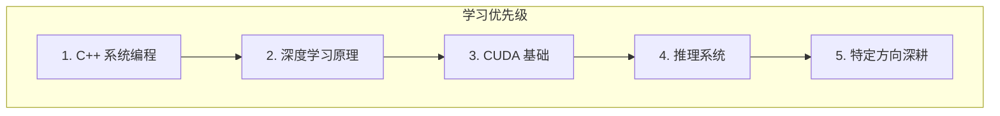

**为什么这个顺序**：
1. C++ 是基础，没有它后面都学不了
2. 理解 AI 原理才知道要优化什么
3. CUDA 是工具，理解原理后学更快
4. 系统设计需要前面的基础
5. 深耕需要前面都扎实

---

## 四、学习路线图

### 4.1 阶段规划

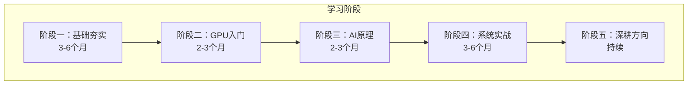

### 4.2 阶段一：C++ 基础夯实

**目标**：达到能读懂 llama.cpp 代码的水平

**学习内容**：

| 周 | 主题 | 学习资源 |
|---|------|----------|
| 1-4 | 现代 C++ 特性 | 《Effective Modern C++》 |
| 5-8 | 多线程编程 | 《C++ Concurrency in Action》 |
| 9-12 | 性能优化 | 《Performance Analysis and Tuning on Modern CPUs》 |
| 13-16 | 实战项目 | 实现一个线程池、内存池 |

**验证标准**：
- [ ] 能读懂 llama.cpp 的 ggml.c
- [ ] 能实现一个无锁队列
- [ ] 能使用 perf 分析程序性能

---

### 4.3 阶段二：CUDA 入门

**目标**：能写基础 Kernel，理解 GPU 编程模型

**学习内容**：

| 周 | 主题 | 实践项目 |
|---|------|----------|
| 1-2 | GPU 架构和 CUDA 模型 | 向量加法 |
| 3-4 | 内存层次和优化 | 矩阵转置 |
| 5-6 | 归约和原子操作 | 并行求和 |
| 7-8 | 矩阵乘法优化 | GEMM 实现 |

**验证标准**：
- [ ] 实现一个能跑通的 GEMM
- [ ] 能解释 Bank Conflict 是什么
- [ ] 能使用 Nsight 分析 Kernel 性能

---

### 4.4 阶段三：深度学习原理

**目标**：理解 Transformer 和 LLM 推理流程

**学习内容**：

| 周 | 主题 | 实践 |
|---|------|------|
| 1-2 | 深度学习基础 | 用 NumPy 实现反向传播 |
| 3-4 | Transformer 架构 | 手推 Attention 计算 |
| 5-6 | LLM 推理特点 | 理解 KV Cache |
| 7-8 | 模型量化 | 实践 INT8 量化 |

**验证标准**：
- [ ] 能手推 Attention 的计算复杂度
- [ ] 能解释 KV Cache 为什么能加速
- [ ] 理解 GQA 相比 MHA 的优势

---

### 4.5 阶段四：推理系统实战

**目标**：能独立分析和改进推理系统

**学习内容**：

| 周 | 主题 | 实践 |
|---|------|------|
| 1-4 | vLLM 源码阅读 | 理解 PagedAttention 实现 |
| 5-8 | llama.cpp 源码阅读 | 理解 GGML 和推理流程 |
| 9-12 | 实现简化版推理引擎 | 支持基础 Batching |
| 13-16 | 性能优化实战 | 分析瓶颈并优化 |

**验证标准**：
- [ ] 能讲清楚 vLLM 的核心架构
- [ ] 能贡献 PR 到开源项目
- [ ] 能设计一个简化版推理系统

---

### 4.6 阶段五：深耕方向

根据选择的细分方向持续深入：

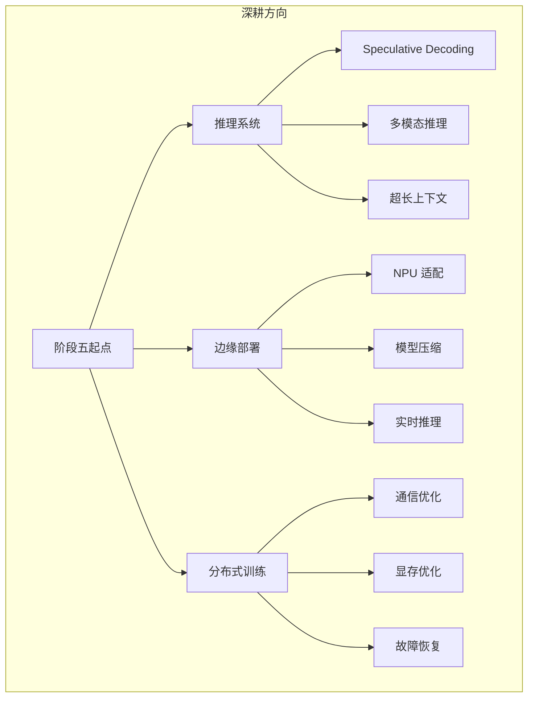

---

## 五、项目实践建议

### 5.1 推荐项目路径

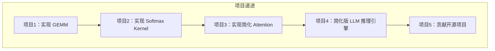

### 5.2 各项目详情

#### 项目 1：GEMM 实现

**目标**：理解 GPU 并行计算基础

**里程碑**：
1. 朴素实现（每个线程计算一个元素）
2. 使用共享内存
3. 分块计算
4. 向量化读写
5. 与 cuBLAS 对比性能

**预期收获**：
- 理解 GPU 内存层次
- 理解分块优化原理
- 学会性能分析

---

#### 项目 2：Softmax Kernel

**目标**：理解归约操作和数值稳定性

**里程碑**：
1. 朴素实现（找最大、求和、归一化）
2. 在线算法（单次遍历）
3. Warp 级优化
4. 处理大规模输入

**预期收获**：
- 理解 Warp 级原语
- 理解数值稳定性处理
- 为 FlashAttention 打基础

---

#### 项目 3：简化 Attention

**目标**：理解 Attention 计算和 KV Cache

**里程碑**：
1. 标准 Attention 实现
2. 加入 KV Cache
3. 支持不同序列长度
4. 简化版 FlashAttention 思想

**预期收获**：
- 深入理解 Attention 机制
- 理解 KV Cache 作用
- 为推理系统打基础

---

#### 项目 4：简化版 LLM 推理引擎

**目标**：理解推理系统设计

**核心组件**：

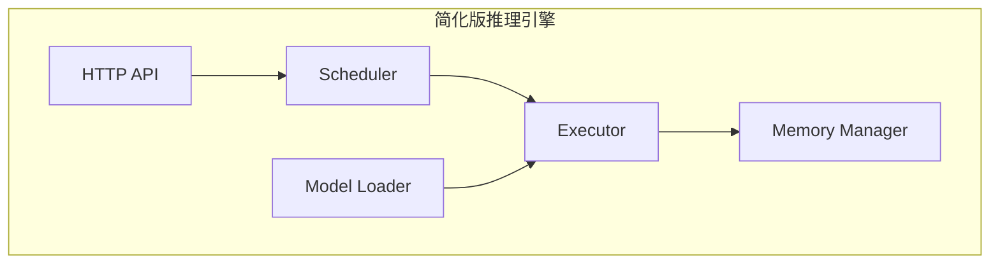

**里程碑**：
1. 实现模型加载（加载 GGUF 格式）
2. 实现基础推理流程
3. 加入简单 Batching
4. 实现流式输出
5. 加入基础调度

**预期收获**：
- 系统设计能力
- 理解各组件职责
- 为贡献开源打基础

---

#### 项目 5：贡献开源项目

**推荐项目**：

| 项目 | 难度 | 入门建议 |
|------|------|----------|
| llama.cpp | 中 | 从 issue 标记为 "good first issue" 开始 |
| vLLM | 中高 | 从文档改进或小 bug 修复开始 |
| GGML | 高 | 需要深入理解张量库 |

**贡献路径**：
1. 先通读代码，理解架构
2. 跑通测试，能本地开发
3. 从文档、测试、小 bug 开始
4. 逐步挑战核心功能

---

## 六、常见误区与建议

### 6.1 误区一：只学 CUDA，不学系统

**问题**：能写 Kernel，但不会设计系统

**建议**：CUDA 是工具，系统设计是目标。Kernel 可能被编译器替代，系统设计不会。

---

### 6.2 误区二：只看不练

**问题**：看了很多文章和源码，没有动手实现

**建议**：每学一个概念，都要写代码验证。理解和实现之间差距巨大。

---

### 6.3 误区三：追求广度而非深度

**问题**：什么都学一点，什么都不精

**建议**：先在一个方向做到专家级，再扩展。T 型人才的竖线要足够长。

---

### 6.4 误区四：脱离业务只研究技术

**问题**：优化了很多但没有业务价值

**建议**：始终思考优化对业务的影响。10% 的性能提升在千万美元的场景下价值巨大。

---

## 七、求职准备

### 7.1 简历要点

**突出内容**：
- 具体项目经验（性能提升数据）
- 开源贡献（PR 链接）
- 技术博客（展示思考深度）
- 相关论文阅读（FlashAttention、PagedAttention 等）

**避免**：
- 只列技术名词不说项目
- 没有量化的成果
- 与岗位无关的内容过多

---

### 7.2 面试准备

**常见考察点**：

| 类别 | 典型问题 |
|------|----------|
| C++ 基础 | 智能指针原理、移动语义、内存模型 |
| 多线程 | 死锁预防、无锁数据结构、内存序 |
| CUDA | GPU 架构、Bank Conflict、Occupancy |
| AI 原理 | Attention 计算、KV Cache 作用 |
| 系统设计 | 设计一个 LLM serving 系统 |
| 算法 | LeetCode 中等难度 |

---

### 7.3 目标公司

| 类型 | 代表公司 | 特点 |
|------|----------|------|
| AI 大厂 | OpenAI、Anthropic、Google、Meta | 顶级待遇，竞争激烈 |
| 国内头部 | 字节、阿里、百度、腾讯 | 机会多，业务场景丰富 |
| AI 创业 | Moonshot、智谱、零一万物 | 成长快，有期权 |
| 硬件厂商 | NVIDIA、AMD | 底层技术，稳定 |
| 推理服务 | Together、Anyscale | 专注推理，技术深度 |

---

## 八、长期发展

### 8.1 职业发展路径

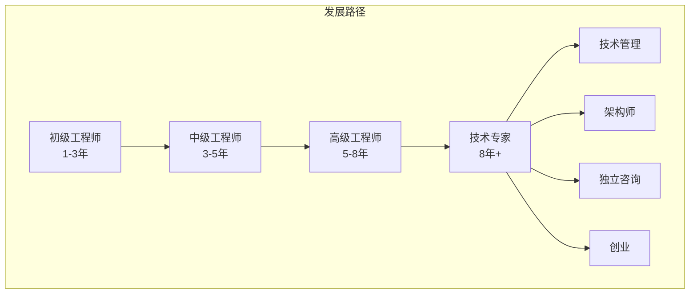

### 8.2 持续学习

**保持更新的领域**：
- 新的推理优化技术（关注论文和开源）
- 新硬件发展（H100 → B100 → 下一代）
- 编译器进展（Triton、torch.compile）
- 模型架构变化（MoE、新 Attention 变体）

**建议方式**：
- 订阅 arXiv CS.LG
- 关注主要开源项目 release
- 参与技术社区讨论
- 定期写技术博客总结

---

## 九、总结

### 9.1 核心建议

1. **定位清晰**：推理系统层是 AI + C++ 的最佳交汇点
2. **基础扎实**：C++ 系统编程是根基，不能跳过
3. **项目驱动**：从小项目开始，逐步挑战开源贡献
4. **深度优先**：在一个方向做到专家，再扩展
5. **持续更新**：这个领域发展很快，要保持学习

### 9.2 行动清单

- [ ] 评估自己的 C++ 水平，补齐短板
- [ ] 选择一个项目开始实践
- [ ] 阅读一个推理引擎的源码
- [ ] 尝试贡献第一个 PR
- [ ] 建立学习和输出的习惯

---

## 相关文章

- [上一篇：28 - AI 技术栈全景图](@/articles/ai/ai-28-AI技术栈全景图.md)
- [下一篇：30 - 从 CUDA 算子到推理系统](@/articles/ai/ai-30-从CUDA算子到推理系统.md)
- [AI 推理系统架构概述](@/articles/ai-infra/ai-infra-01-AI推理系统架构概述.md)
