+++
title = "30. 从 CUDA 算子到推理系统"
description = "理解 CUDA 算子与推理系统的关系，明确技术发展方向"
date = 2025-02-06
weight = 30000
updated = 2025-02-06
draft = false
[taxonomies]
tags = ["CUDA", "推理系统", "AI", "系统架构"]
[extra]
toc = true
comments = true
+++

## 一、问题的起源

当我们谈论"AI 性能优化"时，经常混淆两个层面的工作：
- **CUDA 算子优化**：让单个计算更快
- **推理系统优化**：让整个服务更高效

这两者虽然相关，但解决的问题不同，需要的技能不同，职业发展也不同。

本文将深入分析两者的关系，帮助你理解应该如何定位自己。

---

## 二、什么是 CUDA 算子

### 2.1 算子的定义

**算子（Operator）** 是深度学习中的基本计算单元。

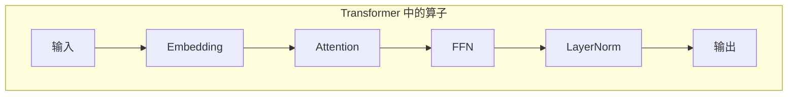

每个方框都是一个算子，包含具体的数学运算。

### 2.2 算子的层次

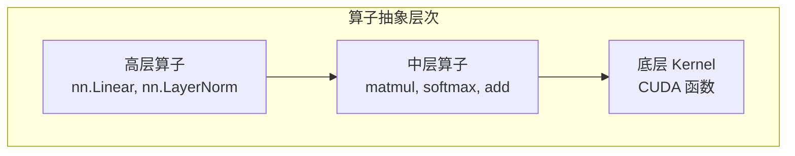

**举例**：`nn.Linear(x)` 的展开

```
nn.Linear(x, weight, bias)
    ↓
y = torch.matmul(x, weight) + bias
    ↓
cublasSgemm(...)  // CUDA Kernel
```

### 2.3 CUDA 算子 = CUDA Kernel？

**基本等价，但有细微区别**：

| 概念 | 含义 |
|------|------|
| 算子（Operator） | 逻辑概念，一个完整的计算操作 |
| Kernel | 物理概念，GPU 上执行的函数 |
| 关系 | 一个算子可能包含多个 Kernel |

**例子**：Softmax 算子

```
Softmax 算子（逻辑）：
y = exp(x - max(x)) / sum(exp(x - max(x)))

可能的 Kernel 实现：
方案 A：3 个 Kernel
  1. find_max_kernel
  2. exp_sum_kernel  
  3. normalize_kernel

方案 B：1 个融合 Kernel
  1. fused_softmax_kernel（在线算法）
```

### 2.4 算子优化的目标

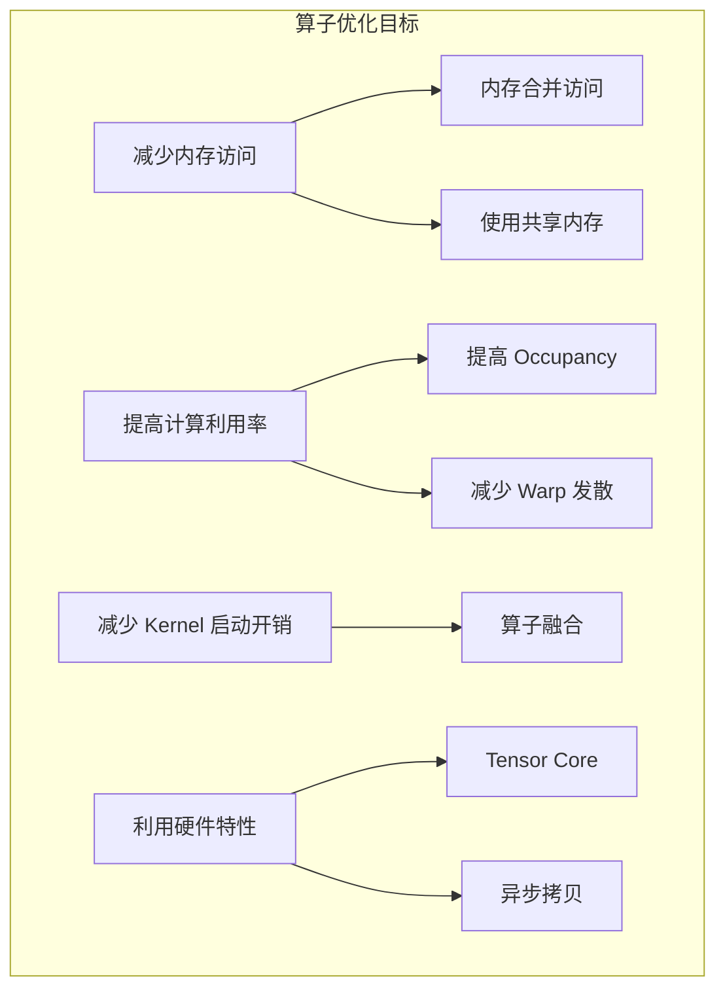

---

## 三、什么是推理系统

### 3.1 推理系统的定义

**推理系统**是管理 AI 模型推理服务的软件系统，负责接收请求、调度计算、管理资源、返回结果。

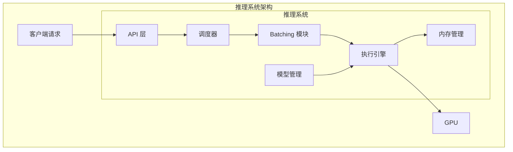

### 3.2 推理系统要解决的问题

| 问题 | 描述 | 解决方案 |
|------|------|----------|
| 并发处理 | 多个请求同时到达 | 请求队列、调度算法 |
| 资源利用 | GPU 不能空闲 | 动态 Batching |
| 显存管理 | 显存有限 | PagedAttention、Offloading |
| 延迟控制 | 用户等待时间 | 优先级调度、流式输出 |
| 吞吐优化 | 单位时间处理量 | Continuous Batching |
| 容错处理 | 请求失败恢复 | 超时、重试、降级 |

### 3.3 推理系统的分层

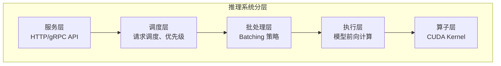

---

## 四、两者的关系

### 4.1 层次关系

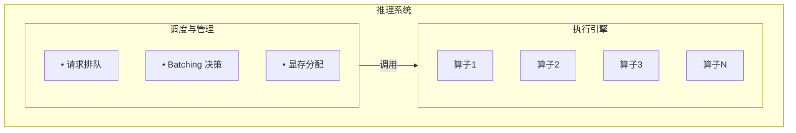

**关键认知**：
- 算子是**砖块**：负责单个计算的高效执行
- 推理系统是**建筑设计**：负责如何组织和调用这些砖块

### 4.2 优化层面的区别

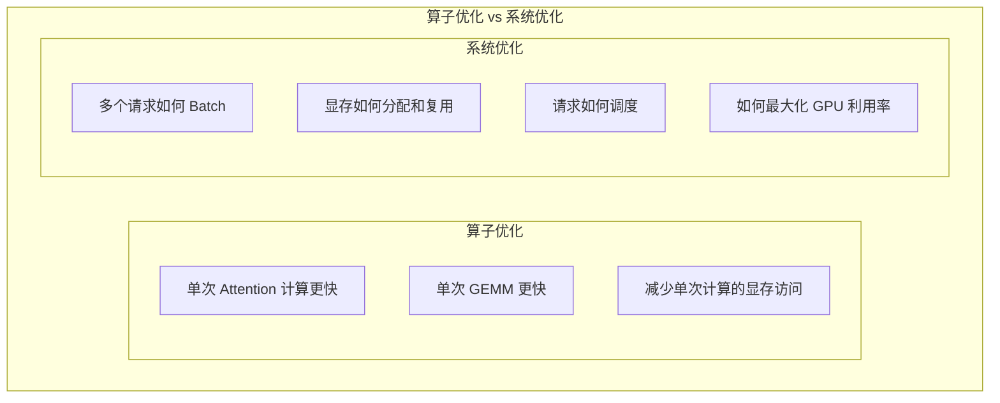

### 4.3 典型问题归属

| 问题 | 归属 | 解释 |
|------|------|------|
| Softmax 数值不稳定 | 算子 | 单个计算的实现问题 |
| Attention 计算慢 | 算子 | 需要优化 Kernel（如 FlashAttention） |
| GPU 利用率低 | 系统 | Batching 策略问题 |
| 显存不够用 | 系统 | 内存管理问题 |
| 长请求阻塞短请求 | 系统 | 调度算法问题 |
| 延迟抖动大 | 系统 | 资源竞争和调度问题 |

### 4.4 相互依赖

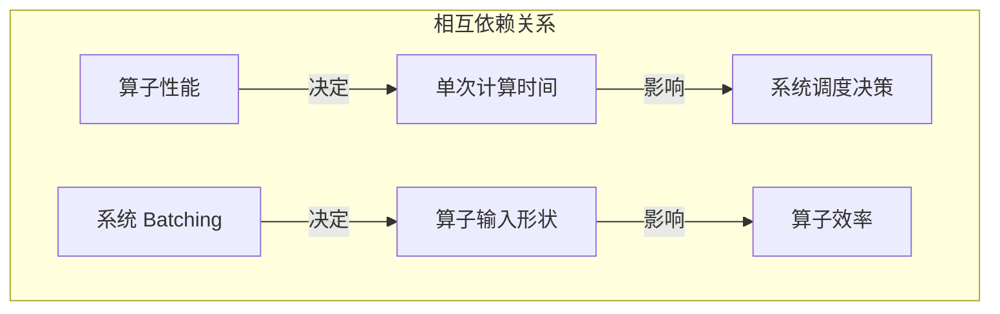

**例子**：
- 如果 Attention Kernel 很慢，系统再怎么调度也快不了
- 如果系统 Batch size 不合理，Kernel 可能效率很低

---

## 五、技能迁移与差异

### 5.1 共同基础

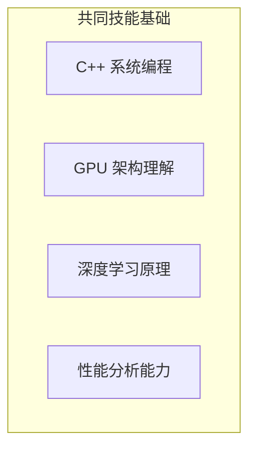

这些技能对两个方向都必要。

### 5.2 差异化技能

| 技能 | 算子开发 | 推理系统 |
|------|----------|----------|
| CUDA 编程深度 | ★★★ | ★★☆ |
| 系统设计 | ★☆ | ★★★ |
| 并发编程 | ★★☆ | ★★★ |
| 调度算法 | ★☆ | ★★★ |
| 数值计算 | ★★★ | ★★☆ |
| API 设计 | ★☆ | ★★☆ |

### 5.3 日常工作对比

**算子工程师的一天**：
```
09:00 - 分析 Nsight Compute 报告
10:00 - 优化 Kernel 的 Bank Conflict
14:00 - 实现新的融合算子
16:00 - 与 cuBLAS 对比性能
17:00 - 提交 PR，编写性能测试
```

**推理系统工程师的一天**：
```
09:00 - 分析线上延迟毛刺问题
10:00 - 优化调度算法减少排队
14:00 - 实现新的 Batching 策略
16:00 - 压测验证吞吐提升
17:00 - 排查内存泄漏问题
```

---

## 六、发展趋势分析

### 6.1 算子开发的变化

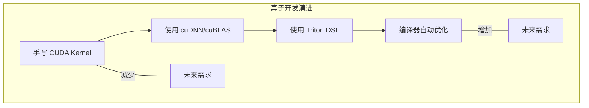

**趋势**：
- 手写 Kernel 的需求**逐渐减少**
- 但极致优化场景**仍然需要**
- AI 编译器（Triton、torch.compile）在替代部分工作

### 6.2 推理系统的变化

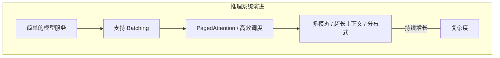

**趋势**：
- 系统复杂度**持续增加**
- 新的优化技术不断出现
- 不会被编译器替代（编译器不解决调度问题）

### 6.3 类比分析

| 领域 | 类似算子 | 类似推理系统 |
|------|----------|--------------|
| Web | 数据库 SQL 引擎 | Web 服务器架构 |
| 操作系统 | 驱动程序 | 调度器和内存管理 |
| 数据库 | 存储引擎 | 查询优化器 |

**启示**：
- 底层引擎趋于标准化和自动化
- 上层系统持续需要人工设计和优化

---

## 七、如何选择方向

### 7.1 选择算子方向

**适合你如果**：
- 对底层计算有强烈兴趣
- 享受极致性能优化的过程
- 数学功底好
- 愿意深入硬件细节
- 能接受工作机会相对较少

**职业路径**：
```
算子工程师 → 算子专家 → AI 编译器工程师 / 硬件厂商
```

**风险**：
- 部分工作可能被编译器替代
- 需要持续跟进新硬件

---

### 7.2 选择推理系统方向

**适合你如果**：
- 喜欢系统设计
- 对并发、调度问题有兴趣
- 喜欢解决复杂的工程问题
- 希望工作更接近业务价值
- 想要更多的职业机会

**职业路径**：
```
推理系统工程师 → 架构师 → AI 基础设施负责人
```

**优势**：
- 系统复杂度持续增长
- 不容易被自动化
- 岗位需求持续增加

---

### 7.3 推荐策略

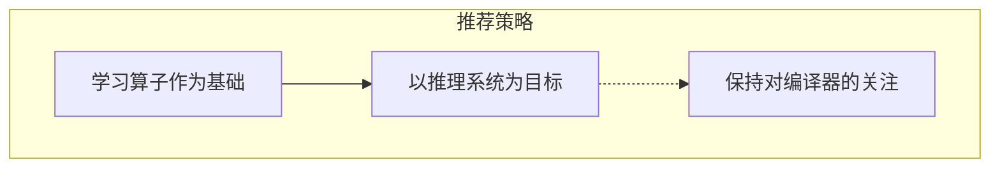

**具体建议**：
1. **学习 CUDA 和算子优化**：这是理解底层的基础
2. **不以手写 Kernel 为核心竞争力**：这部分会逐渐自动化
3. **重点投入推理系统**：系统设计能力更持久
4. **关注 AI 编译器发展**：作为知识储备

---

## 八、融合视角：端到端优化

### 8.1 真正的高手

最优秀的工程师往往能**跨越层次**：
- 知道系统瓶颈在哪
- 判断是算子问题还是系统问题
- 能在正确的层次解决问题

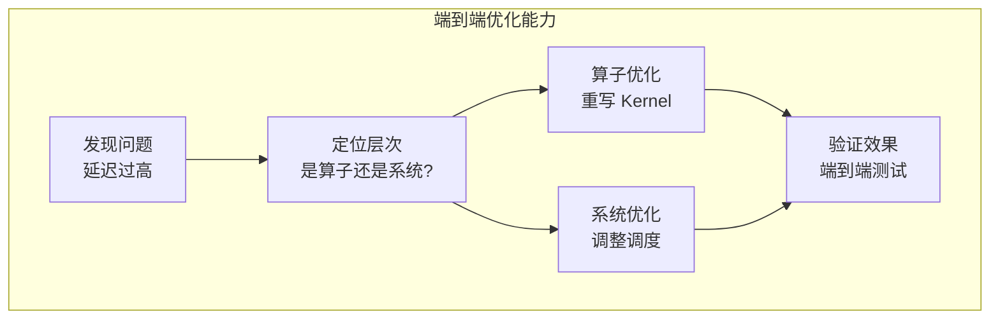

### 8.2 典型案例分析

**案例：LLM 推理延迟优化**

| 问题 | 可能原因 | 解决方案 |
|------|----------|----------|
| 首 token 延迟高 | Prefill Attention 慢 | FlashAttention（算子） |
| Token 生成慢 | Decode Attention 慢 | FlashDecoding（算子） |
| GPU 利用率低 | Batch size 小 | Continuous Batching（系统） |
| 显存不足 | KV Cache 过大 | PagedAttention（系统） |
| 延迟抖动 | 长短请求混合 | 优先级调度（系统） |

**观察**：
- 有些问题需要优化算子
- 有些问题需要优化系统
- 高手能准确判断并在正确层次解决

---

## 九、实践建议

### 9.1 学习路径

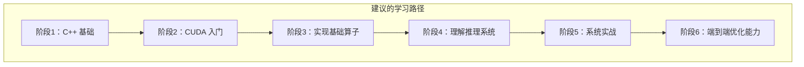

### 9.2 推荐学习资源

**算子相关**：
- NVIDIA CUDA 官方文档
- 《Programming Massively Parallel Processors》
- FlashAttention 论文和代码
- CUTLASS 库源码

**推理系统相关**：
- vLLM 官方文档和源码
- llama.cpp 源码
- TensorRT-LLM 文档
- 《Operating Systems: Three Easy Pieces》（系统设计思想）

### 9.3 项目实践

| 阶段 | 项目 | 目标 |
|------|------|------|
| 算子基础 | 实现 GEMM | 理解 GPU 计算 |
| 算子进阶 | 实现 Softmax | 理解归约和数值稳定 |
| 系统入门 | 简单 HTTP 模型服务 | 理解服务化 |
| 系统进阶 | 加入 Batching | 理解批处理 |
| 系统高级 | 实现调度器 | 理解调度设计 |
| 端到端 | 贡献开源项目 | 综合能力 |

---

## 十、总结

### 10.1 核心认知

1. **算子和推理系统是不同层次的工作**
   - 算子：单个计算的高效实现
   - 系统：整体服务的高效运行

2. **两者相互依赖但技能不同**
   - 共同基础：C++、GPU、深度学习
   - 差异：CUDA 深度 vs 系统设计

3. **发展趋势有差异**
   - 算子：部分被编译器替代
   - 系统：复杂度持续增长，不易自动化

4. **推荐策略**
   - 学算子作为基础
   - 以推理系统为主要方向
   - 培养端到端优化能力

### 10.2 最终建议

```
你的定位应该是：

懂算子的推理系统工程师
    ↓
能写 Kernel，但不以此为核心
    ↓
专注系统设计和优化
    ↓
能在正确的层次解决问题
```

这样的定位既有技术深度，又有职业持久性。

---

## 相关文章

- [上一篇：29 - AI C++ 工程师职业路径](@/articles/ai/ai-29-AI-C++工程师职业路径.md)
- [下一篇：31 - AI C++ 工程师入门实战指南](@/articles/ai/ai-31-AI-C++工程师入门实战指南.md)
- [AI 推理系统架构概述](@/articles/ai-infra/ai-infra-01-AI推理系统架构概述.md)
- [21 - CUDA 入门与 GPU 编程基础](@/articles/ai/ai-21-CUDA入门与GPU编程基础.md)
- [25 - FlashAttention 与 PagedAttention 原理](@/articles/ai/ai-25-FlashAttention与PagedAttention原理.md)
