+++
title = "AI C++ 工程师入门实战指南"
description = "从零开始成为 AI 推理系统或边缘 AI 工程师的完整路径、学习方法与实战项目"
date = 2025-02-07
weight = 31000
updated = 2025-02-07
draft = false
[taxonomies]
tags = ["AI", "C++", "职业规划", "推理系统", "边缘AI", "入门指南"]
[extra]
toc = true
comments = true
+++

## 一、方向定位与选择

### 1.1 AI 技术栈中的定位

在 AI 技术栈中，存在明确的分层结构。作为希望深度使用 C++ 的工程师，需要找准自己的定位：

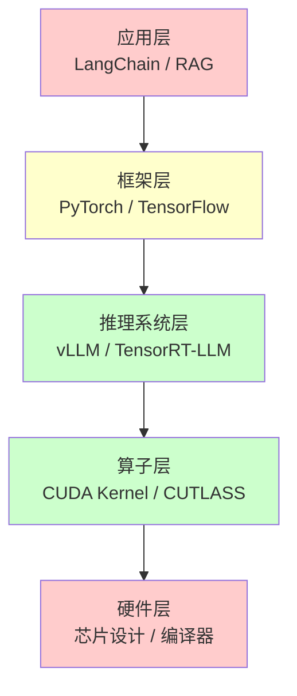

| 层级 | 主要语言 | C++ 使用 | 适合度分析 |
|------|----------|----------|------------|
| 应用层 | Python | 几乎不用 | ❌ 同质化严重，组装式开发 |
| 框架层 | Python + C++ | 底层实现 | ⚠️ 可了解，门槛较高 |
| **推理系统层** | **C++ 为主** | **核心语言** | ✅ **核心目标方向** |
| 算子层 | CUDA C++ | 核心语言 | ✅ 需要掌握，但非唯一 |
| 硬件层 | Verilog/LLVM | 特殊领域 | ❌ 太底层，门槛极高 |

### 1.2 两个核心方向

对于希望在 AI 领域深度使用 C++ 的工程师，推荐以下两个方向：

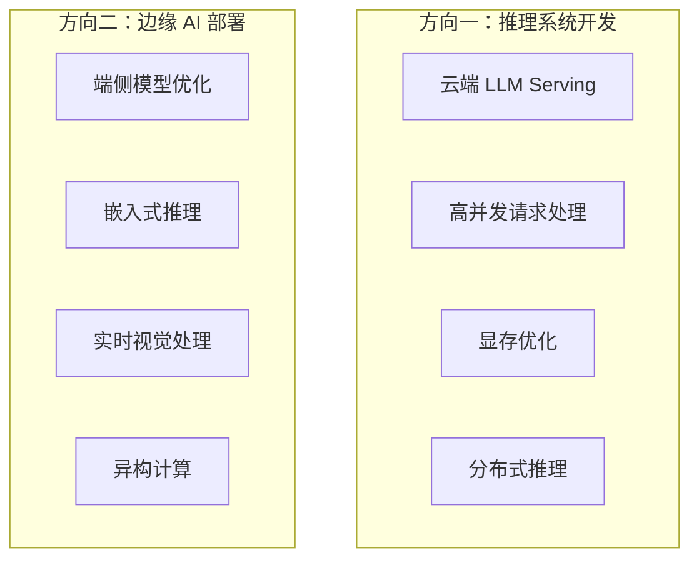

**方向对比**：

| 维度 | 推理系统开发 | 边缘 AI 部署 |
|------|--------------|--------------|
| C++ 使用强度 | 极高（90%+） | 高（70%+） |
| CUDA 需求 | 必须精通 | 了解即可 |
| 硬件环境 | 高端 GPU 服务器 | 边缘设备（手机、开发板） |
| 工作场景 | 云端大规模服务 | 设备端实时推理 |
| 技术重点 | 调度、内存管理、并行 | 压缩、转换、硬件适配 |
| 入门难度 | 较高 | 中等 |
| 就业分布 | 集中在大厂 | 分布更广 |

---

## 二、方向一：推理系统开发（重点）

### 2.1 什么是推理系统

推理系统（Inference System / Serving Framework）是将训练好的 AI 模型部署为可用服务的软件系统。它处于模型和用户之间，负责：

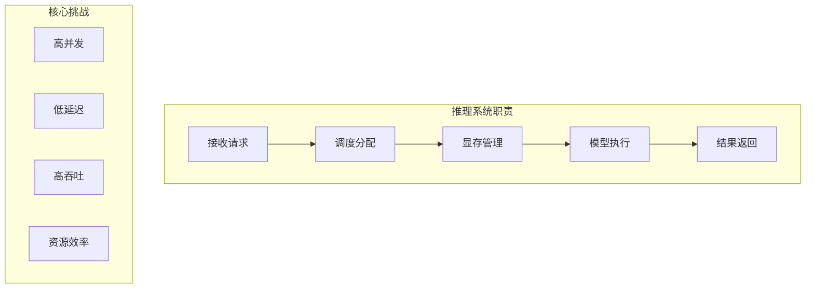

### 2.2 推理系统的核心工作内容

作为推理系统工程师，日常工作包括：

#### 2.2.1 请求调度

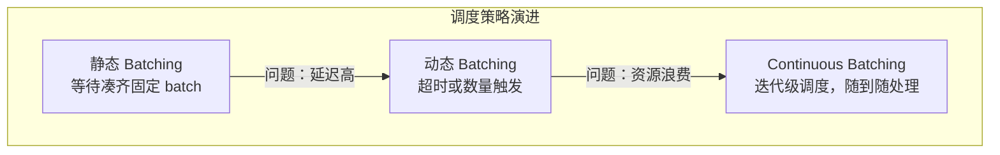

**Continuous Batching 核心思想**：
- 不等待请求凑齐
- 每个 decode step 后重新评估
- 完成的请求立即退出，新请求立即加入
- 最大化 GPU 利用率

#### 2.2.2 内存管理

LLM 推理中，KV Cache 占用大量显存，且动态增长：

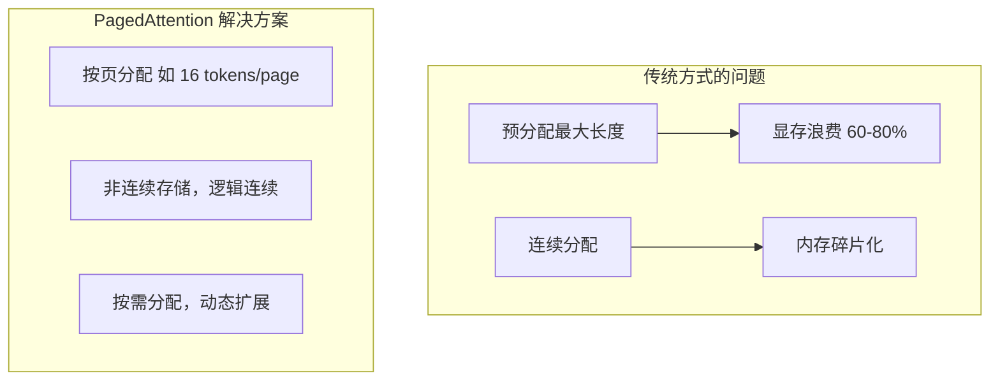

**PagedAttention 关键概念**：

| 概念 | 说明 |
|------|------|
| Physical Block | GPU 显存中的实际存储块 |
| Logical Block | 请求视角的连续 KV Cache |
| Block Table | 逻辑块到物理块的映射表 |
| Block Manager | 负责块的分配、回收、复用 |

#### 2.2.3 并行推理

大模型需要多 GPU 协同：

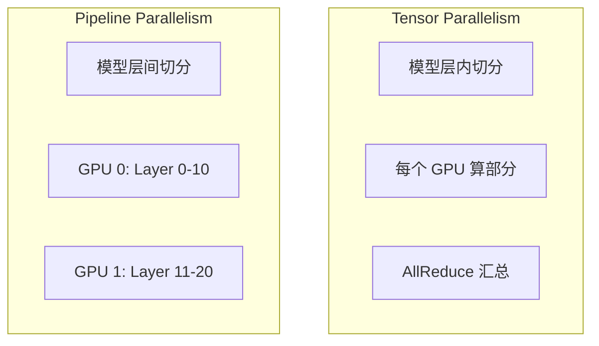

#### 2.2.4 性能优化

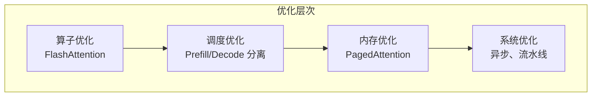

### 2.3 学习路线图

#### 阶段一：基础准备（6-8 周）

**1. C++ 系统编程**

必须掌握的 C++ 技能：

| 技能 | 具体内容 | 重要性 |
|------|----------|--------|
| 现代 C++ | C++17/20 特性、智能指针、移动语义 | ⭐⭐⭐⭐⭐ |
| 多线程 | std::thread、mutex、condition_variable | ⭐⭐⭐⭐⭐ |
| 异步编程 | std::future、std::async、回调模式 | ⭐⭐⭐⭐ |
| 内存管理 | 自定义 allocator、内存池、RAII | ⭐⭐⭐⭐⭐ |
| 模板编程 | 模板特化、SFINAE、concepts | ⭐⭐⭐ |

**代码能力要求示例**：

```cpp
// 需要能够设计和实现这种级别的组件
template<typename T>
class LockFreeQueue {
    struct Node {
        std::shared_ptr<T> data;
        std::atomic<Node*> next;
    };
    std::atomic<Node*> head_;
    std::atomic<Node*> tail_;
    
public:
    void push(T value);
    std::shared_ptr<T> pop();
};

class MemoryPool {
    struct Block { Block* next; };
    std::vector<void*> chunks_;
    Block* free_list_ = nullptr;
    std::mutex mutex_;
    size_t block_size_;
    
public:
    explicit MemoryPool(size_t block_size, size_t initial_blocks = 1024);
    void* allocate();
    void deallocate(void* ptr);
};
```

**学习资源**：
- 《C++ Concurrency in Action》（必读）
- 《Effective Modern C++》
- CppCon 演讲视频

**2. CUDA 编程基础**

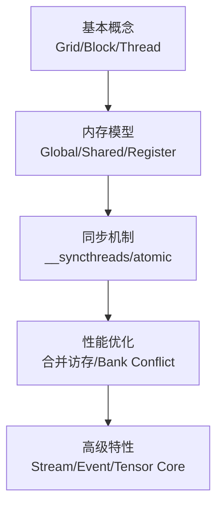

**必须掌握的 CUDA 技能**：

| 技能 | 验收标准 |
|------|----------|
| Kernel 编写 | 能写正确的向量加法、矩阵乘法 |
| 内存管理 | 理解 cudaMalloc、cudaMemcpy、统一内存 |
| 共享内存 | 能用共享内存优化矩阵乘法 |
| Stream | 理解异步执行，能实现计算-传输重叠 |
| Profiling | 能使用 Nsight Systems/Compute 分析性能 |

**入门代码示例**：

```cpp
// 向量加法 Kernel
__global__ void vectorAdd(const float* a, const float* b, float* c, int n) {
    int idx = blockIdx.x * blockDim.x + threadIdx.x;
    if (idx < n) {
        c[idx] = a[idx] + b[idx];
    }
}

// 使用共享内存的矩阵乘法
__global__ void matmul_shared(const float* A, const float* B, float* C,
                               int M, int N, int K) {
    __shared__ float As[TILE_SIZE][TILE_SIZE];
    __shared__ float Bs[TILE_SIZE][TILE_SIZE];
    
    int row = blockIdx.y * TILE_SIZE + threadIdx.y;
    int col = blockIdx.x * TILE_SIZE + threadIdx.x;
    float sum = 0.0f;
    
    for (int t = 0; t < (K + TILE_SIZE - 1) / TILE_SIZE; t++) {
        // 加载到共享内存
        if (row < M && t * TILE_SIZE + threadIdx.x < K)
            As[threadIdx.y][threadIdx.x] = A[row * K + t * TILE_SIZE + threadIdx.x];
        else
            As[threadIdx.y][threadIdx.x] = 0.0f;
            
        if (col < N && t * TILE_SIZE + threadIdx.y < K)
            Bs[threadIdx.y][threadIdx.x] = B[(t * TILE_SIZE + threadIdx.y) * N + col];
        else
            Bs[threadIdx.y][threadIdx.x] = 0.0f;
        
        __syncthreads();
        
        // 计算
        for (int k = 0; k < TILE_SIZE; k++) {
            sum += As[threadIdx.y][k] * Bs[k][threadIdx.x];
        }
        
        __syncthreads();
    }
    
    if (row < M && col < N) {
        C[row * N + col] = sum;
    }
}
```

**3. 深度学习基础**

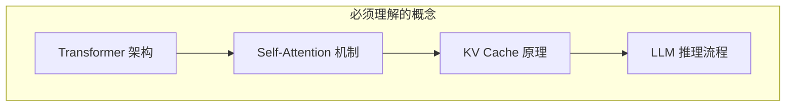

**Transformer 核心知识**：

| 概念 | 需要理解的深度 |
|------|----------------|
| Attention 计算 | 能手写 Attention 前向传播代码 |
| Multi-Head Attention | 理解多头并行计算方式 |
| KV Cache | 理解为什么需要缓存、缓存什么 |
| Prefill vs Decode | 理解两阶段的计算特点差异 |
| GQA/MQA | 理解注意力变体及其内存优势 |

**LLM 推理流程**：

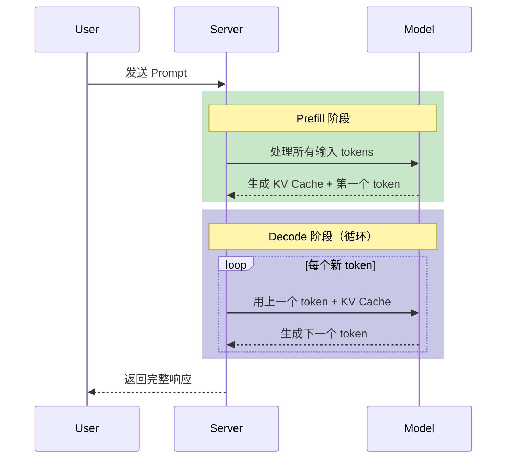

**学习资源**：
- [The Illustrated Transformer](http://jalammar.github.io/illustrated-transformer/)（必读）
- [The Illustrated GPT-2](http://jalammar.github.io/illustrated-gpt2/)
- 3Blue1Brown 的 Transformer 视频

#### 阶段二：核心技术深入（8-12 周）

**1. FlashAttention 原理**

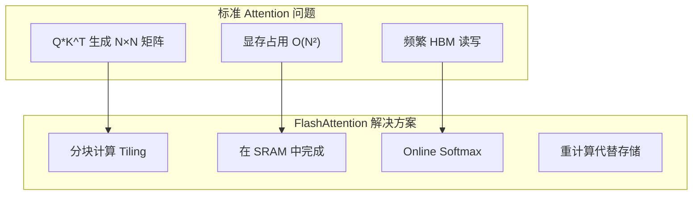

**FlashAttention 核心思想**：

| 技术 | 原理 |
|------|------|
| Tiling | 将 Q、K、V 分成小块，逐块处理 |
| Online Softmax | 边计算边更新 softmax 的 max 和 sum |
| 重计算 | 反向传播时重新计算 attention，而非存储 |
| IO 优化 | 最小化 HBM 访问，尽量在 SRAM 完成 |

**Online Softmax 算法**：

```python
# 传统方式：需要两次遍历
def standard_softmax(x):
    m = max(x)                    # 第一遍：找最大值
    exp_x = exp(x - m)            # 第二遍：计算 exp
    return exp_x / sum(exp_x)

# Online 方式：单次遍历
def online_softmax(x):
    m = -inf
    d = 0
    for xi in x:
        m_new = max(m, xi)
        d = d * exp(m - m_new) + exp(xi - m_new)
        m = m_new
    return [exp(xi - m) / d for xi in x]
```

**学习资源**：
- FlashAttention 论文（必读）
- FlashAttention-2 论文
- [ELI5: FlashAttention](https://gordicaleksa.medium.com/eli5-flash-attention-5c44017022ad)

**2. PagedAttention 原理**

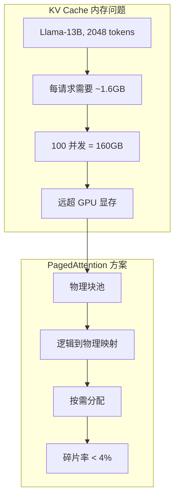

**Block 管理机制**：

```cpp
// 核心数据结构
struct PhysicalBlock {
    int block_id;
    void* data;              // 实际 KV Cache 数据
    int ref_count;           // 引用计数（支持 CoW）
};

struct LogicalBlock {
    int logical_id;
    int physical_block_id;   // 映射到的物理块
};

class BlockManager {
    std::vector<PhysicalBlock> physical_blocks_;
    std::queue<int> free_blocks_;
    
public:
    int allocate_block();
    void free_block(int block_id);
    void copy_on_write(int block_id);  // 写时复制
};

// 每个请求的 Block Table
struct RequestBlockTable {
    int request_id;
    std::vector<int> block_ids;  // 该请求使用的物理块列表
};
```

**学习资源**：
- vLLM 论文（必读）
- [vLLM 官方博客](https://blog.vllm.ai/)

**3. Continuous Batching**

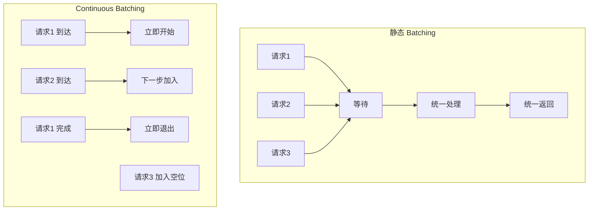

**调度器实现思路**：

```cpp
class ContinuousBatchScheduler {
public:
    struct SequenceGroup {
        int request_id;
        std::vector<int> input_ids;
        std::vector<int> output_ids;
        SequenceStatus status;  // WAITING, RUNNING, FINISHED
        int num_computed_tokens;
    };
    
private:
    std::deque<SequenceGroup> waiting_queue_;
    std::vector<SequenceGroup> running_batch_;
    BlockManager& block_manager_;
    int max_batch_size_;
    int max_tokens_per_step_;
    
public:
    // 核心调度逻辑
    SchedulerOutput schedule() {
        SchedulerOutput output;
        
        // 1. 处理已完成的请求
        remove_finished_sequences();
        
        // 2. 尝试加入新请求
        while (!waiting_queue_.empty() && can_add_new_request()) {
            auto& seq = waiting_queue_.front();
            if (try_allocate_blocks(seq)) {
                running_batch_.push_back(std::move(seq));
                waiting_queue_.pop_front();
            } else {
                break;  // 显存不足
            }
        }
        
        // 3. 准备本轮执行的数据
        for (auto& seq : running_batch_) {
            output.add_sequence(seq);
        }
        
        return output;
    }
};
```

**4. 量化技术**

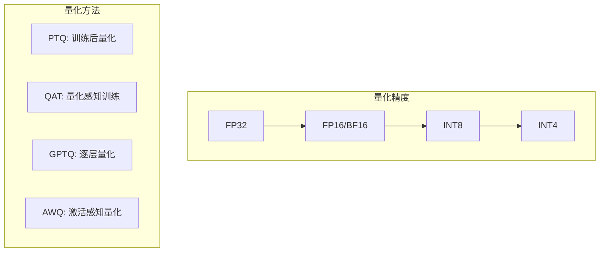

| 量化方法 | 原理 | 优缺点 |
|----------|------|--------|
| PTQ | 直接量化权重 | 简单但精度损失大 |
| GPTQ | 逐层最小化量化误差 | 精度好，需要校准数据 |
| AWQ | 保护重要权重通道 | 精度好，4-bit 友好 |
| SmoothQuant | 平滑激活分布 | 适合 INT8 |

#### 阶段三：源码研读（8-12 周）

**1. llama.cpp（入门必读）**

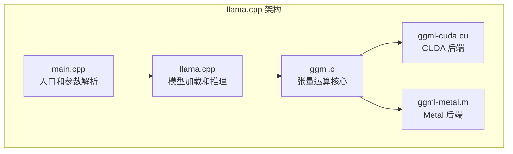

**阅读顺序**：

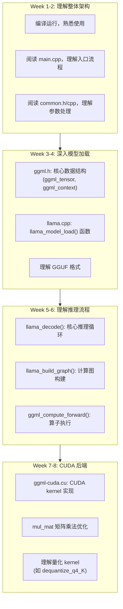

**关键数据结构**：

```cpp
// 张量结构
struct ggml_tensor {
    enum ggml_type type;     // 数据类型（F32, F16, Q4_K, ...）
    int n_dims;
    int64_t ne[4];           // 每个维度的大小
    size_t nb[4];            // 每个维度的步长（字节）
    void* data;              // 数据指针
    
    struct ggml_tensor* src[2];  // 来源张量（用于计算图）
    enum ggml_op op;             // 操作类型
};

// 计算上下文
struct ggml_context {
    size_t mem_size;
    void* mem_buffer;
    struct ggml_object* objects_begin;
    // ...
};
```

**2. vLLM（进阶必读）**

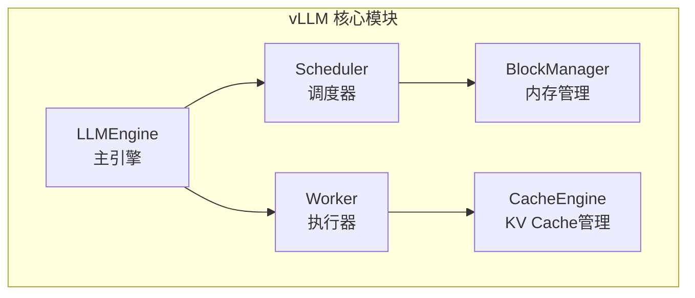

**阅读重点**：

| 文件 | 内容 | 重要性 |
|------|------|--------|
| `vllm/engine/llm_engine.py` | 主引擎，串联所有组件 | ⭐⭐⭐⭐⭐ |
| `vllm/core/scheduler.py` | Continuous Batching 实现 | ⭐⭐⭐⭐⭐ |
| `vllm/core/block_manager.py` | PagedAttention 内存管理 | ⭐⭐⭐⭐⭐ |
| `csrc/attention/attention_kernels.cu` | PagedAttention CUDA 实现 | ⭐⭐⭐⭐ |
| `vllm/worker/worker.py` | 模型执行 | ⭐⭐⭐ |

**3. TensorRT-LLM（高级）**

了解 NVIDIA 官方如何优化 LLM 推理：
- Plugin 机制
- 多种量化支持（FP8、INT8、INT4）
- 分布式推理

#### 阶段四：动手实践（8-12 周）

**项目一：简易 LLM Serving（2-3 周）**

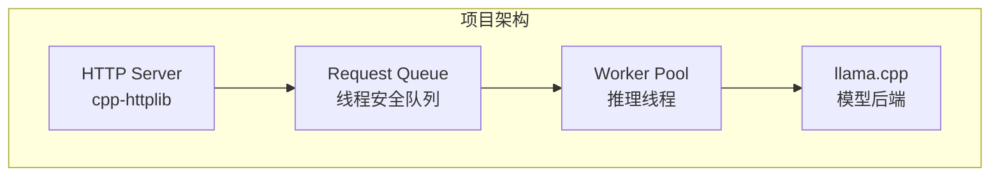

**核心代码框架**：

```cpp
#include <httplib.h>
#include <llama.h>
#include <queue>
#include <mutex>
#include <condition_variable>

struct InferenceRequest {
    std::string prompt;
    std::promise<std::string> result;
};

class LLMServer {
    llama_model* model_;
    llama_context* ctx_;
    std::queue<InferenceRequest> request_queue_;
    std::mutex queue_mutex_;
    std::condition_variable queue_cv_;
    std::vector<std::thread> workers_;
    std::atomic<bool> running_{true};
    
public:
    LLMServer(const std::string& model_path) {
        // 加载模型
        llama_model_params model_params = llama_model_default_params();
        model_ = llama_load_model_from_file(model_path.c_str(), model_params);
        
        llama_context_params ctx_params = llama_context_default_params();
        ctx_ = llama_new_context_with_model(model_, ctx_params);
        
        // 启动工作线程
        for (int i = 0; i < 4; i++) {
            workers_.emplace_back(&LLMServer::worker_loop, this);
        }
    }
    
    void worker_loop() {
        while (running_) {
            InferenceRequest req;
            {
                std::unique_lock<std::mutex> lock(queue_mutex_);
                queue_cv_.wait(lock, [this] { 
                    return !request_queue_.empty() || !running_; 
                });
                if (!running_) break;
                req = std::move(request_queue_.front());
                request_queue_.pop();
            }
            
            // 执行推理
            std::string result = generate(req.prompt);
            req.result.set_value(result);
        }
    }
    
    std::string generate(const std::string& prompt) {
        // 使用 llama.cpp API 进行推理
        // ...
        return result;
    }
    
    void start(int port) {
        httplib::Server svr;
        
        svr.Post("/generate", [this](const httplib::Request& req, 
                                      httplib::Response& res) {
            auto json = nlohmann::json::parse(req.body);
            std::string prompt = json["prompt"];
            
            InferenceRequest inference_req;
            inference_req.prompt = prompt;
            auto future = inference_req.result.get_future();
            
            {
                std::lock_guard<std::mutex> lock(queue_mutex_);
                request_queue_.push(std::move(inference_req));
            }
            queue_cv_.notify_one();
            
            std::string result = future.get();
            res.set_content(result, "text/plain");
        });
        
        svr.listen("0.0.0.0", port);
    }
};
```

**项目二：实现 Continuous Batching（3-4 周）**

```cpp
class BatchScheduler {
public:
    struct Sequence {
        int id;
        std::vector<int> tokens;
        int generated_tokens = 0;
        int max_tokens;
        bool is_finished = false;
    };
    
private:
    std::deque<Sequence> waiting_;
    std::vector<Sequence*> running_;
    int max_batch_size_;
    int max_batch_tokens_;
    
public:
    // 添加新请求
    void add_request(Sequence seq) {
        waiting_.push_back(std::move(seq));
    }
    
    // 调度一个 batch
    std::vector<Sequence*> schedule() {
        // 移除已完成的
        running_.erase(
            std::remove_if(running_.begin(), running_.end(),
                [](Sequence* s) { return s->is_finished; }),
            running_.end()
        );
        
        // 添加等待中的请求
        while (!waiting_.empty() && 
               running_.size() < max_batch_size_ &&
               count_tokens() < max_batch_tokens_) {
            running_.push_back(&waiting_.front());
            waiting_.pop_front();
        }
        
        return running_;
    }
    
    // 更新序列状态
    void update_sequences(const std::vector<int>& new_tokens) {
        for (size_t i = 0; i < running_.size(); i++) {
            running_[i]->tokens.push_back(new_tokens[i]);
            running_[i]->generated_tokens++;
            
            if (new_tokens[i] == eos_token_id_ || 
                running_[i]->generated_tokens >= running_[i]->max_tokens) {
                running_[i]->is_finished = true;
            }
        }
    }
};
```

**项目三：简化版 PagedAttention（4-5 周）**

这是一个挑战性项目，需要 CUDA 编程能力：

```cpp
// Block 管理器
class SimpleBlockManager {
    static constexpr int BLOCK_SIZE = 16;  // 每块存储 16 个 token 的 KV
    
    struct PhysicalBlock {
        float* k_cache;  // [num_heads, BLOCK_SIZE, head_dim]
        float* v_cache;
    };
    
    std::vector<PhysicalBlock> blocks_;
    std::queue<int> free_blocks_;
    
public:
    SimpleBlockManager(int num_blocks, int num_heads, int head_dim) {
        blocks_.resize(num_blocks);
        for (int i = 0; i < num_blocks; i++) {
            size_t size = num_heads * BLOCK_SIZE * head_dim * sizeof(float);
            cudaMalloc(&blocks_[i].k_cache, size);
            cudaMalloc(&blocks_[i].v_cache, size);
            free_blocks_.push(i);
        }
    }
    
    int allocate() {
        if (free_blocks_.empty()) return -1;
        int block_id = free_blocks_.front();
        free_blocks_.pop();
        return block_id;
    }
    
    void free(int block_id) {
        free_blocks_.push(block_id);
    }
};

// PagedAttention Kernel（简化版）
__global__ void paged_attention_kernel(
    const float* query,           // [batch, num_heads, head_dim]
    const float* k_cache,         // [num_blocks, num_heads, block_size, head_dim]
    const float* v_cache,
    const int* block_tables,      // [batch, max_blocks]
    const int* seq_lens,          // [batch]
    float* output,                // [batch, num_heads, head_dim]
    int num_heads,
    int head_dim,
    int block_size
) {
    // ... 实现 paged attention 计算
}
```

**项目四：贡献开源项目**

- 从 llama.cpp 或 vLLM 的 good first issue 开始
- 修复 bug、添加功能、改进文档
- 建立 GitHub 影响力

### 2.4 技能检验清单

完成学习后，应该能够回答以下问题：

| 类别 | 问题 |
|------|------|
| 原理 | FlashAttention 如何减少显存占用？ |
| 原理 | PagedAttention 解决了什么问题？ |
| 原理 | Continuous Batching 相比 Static Batching 的优势？ |
| 原理 | Prefill 和 Decode 阶段的计算特点有何不同？ |
| 实现 | vLLM 的调度器如何决定下一个 batch？ |
| 实现 | llama.cpp 如何加载量化模型？ |
| 优化 | 如何分析推理瓶颈是 compute-bound 还是 memory-bound？ |
| 优化 | INT4 量化的 kernel 如何实现高效？ |

### 2.5 目标公司和岗位

| 公司类型 | 公司 | 岗位名称 |
|----------|------|----------|
| 大厂 | 字节跳动 | AI Infra 工程师、推理优化工程师 |
| 大厂 | 阿里巴巴 | 推理引擎开发、PAI 团队 |
| 大厂 | 腾讯 | AI 系统工程师 |
| 大厂 | 百度 | Paddle Inference 开发 |
| 硬件厂商 | NVIDIA | TensorRT / Triton 开发 |
| 硬件厂商 | AMD | ROCm 推理优化 |
| AI 创业 | 月之暗面 | 推理系统工程师 |
| AI 创业 | 智谱 AI | 推理优化工程师 |
| AI 创业 | MiniMax | AI Infra |
| 开源项目 | vLLM/llama.cpp | 核心贡献者 |

---

## 三、方向二：边缘 AI 部署

### 3.1 什么是边缘 AI

边缘 AI 指在终端设备（手机、嵌入式设备、IoT 设备）上运行 AI 模型，而不依赖云端。

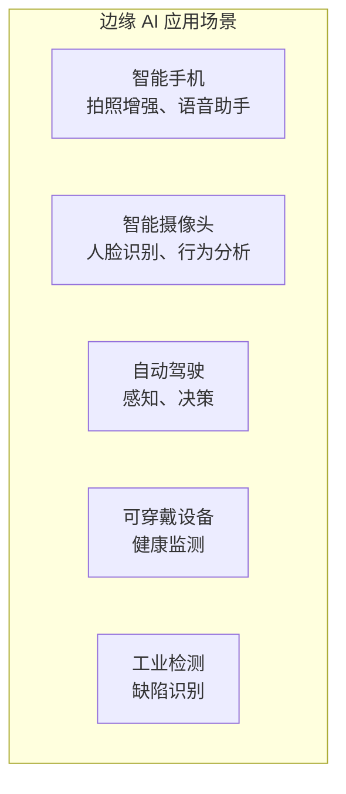

### 3.2 核心工作内容

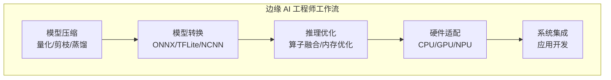

| 工作内容 | 具体任务 |
|----------|----------|
| 模型压缩 | 将大模型压缩到可在端侧运行的大小 |
| 模型转换 | PyTorch → ONNX → 目标格式 |
| 推理优化 | 针对目标硬件优化推理速度 |
| 硬件适配 | 适配 ARM CPU、Adreno GPU、NPU 等 |
| 系统集成 | 集成到 Android/iOS/嵌入式系统 |

### 3.3 学习路线图

#### 阶段一：基础准备（6-8 周）

**1. C++ 基础**（与推理系统方向相同）

**2. 嵌入式开发基础**

```mermaid
graph TB
    subgraph "嵌入式学习路径"
        A["Linux 系统编程"]
        B["ARM 架构基础"]
        C["交叉编译"]
        D["CMake 构建系统"]
        E["Android NDK"]
    end
    
    A --> B --> C --> D --> E
```

| 技能 | 需要掌握的内容 |
|------|----------------|
| Linux 系统编程 | 文件 I/O、进程线程、信号、Socket |
| ARM 架构 | ARM64 指令集、NEON SIMD |
| 交叉编译 | toolchain 配置、sysroot |
| CMake | 跨平台构建、交叉编译配置 |
| Android NDK | JNI、Native 开发 |

**3. 深度学习基础**

| 模型类型 | 需要了解的模型 |
|----------|----------------|
| 图像分类 | MobileNet、EfficientNet |
| 目标检测 | YOLO 系列、SSD |
| 语义分割 | DeepLab、BiSeNet |
| 姿态估计 | PoseNet、MediaPipe |

#### 阶段二：端侧推理引擎（8-10 周）

**1. NCNN（入门首选）**

```mermaid
graph TB
    subgraph "NCNN 架构"
        A["Net: 网络容器"]
        B["Layer: 算子实现"]
        C["Mat: 张量数据"]
        D["Allocator: 内存管理"]
    end
    
    subgraph "后端支持"
        E["ARM CPU + NEON"]
        F["Vulkan GPU"]
        G["x86 + SSE/AVX"]
    end
    
    A --> B --> C --> D
```

**NCNN 学习路径**：

```mermaid
graph TB
    subgraph W1["Week 1: 编译和使用"]
        A1["编译 NCNN: Linux、Android"]
        A2["运行 benchmark 示例"]
        A3["部署 MobileNet 分类模型"]
    end
    
    subgraph W2["Week 2: 模型转换"]
        B1["PyTorch → ONNX"]
        B2["ONNX → NCNN"]
        B3["处理不支持的算子"]
        B4["模型优化 ncnnoptimize"]
    end
    
    subgraph W3["Week 3-4: 源码阅读"]
        C1["Mat 数据结构"]
        C2["Layer 基类设计"]
        C3["Net 加载和推理流程"]
        C4["ARM NEON 优化实现"]
    end
    
    subgraph W4["Week 5-6: 实战项目"]
        D1["实现完整的目标检测 Demo"]
        D2["优化推理速度"]
        D3["集成到 Android 应用"]
    end
    
    W1 --> W2 --> W3 --> W4
```

**NCNN 推理代码示例**：

```cpp
#include <ncnn/net.h>
#include <opencv2/opencv.hpp>

class Detector {
    ncnn::Net net_;
    
public:
    bool load(const std::string& param, const std::string& bin) {
        net_.opt.use_vulkan_compute = true;  // 使用 GPU
        net_.opt.num_threads = 4;
        
        if (net_.load_param(param.c_str()) != 0) return false;
        if (net_.load_model(bin.c_str()) != 0) return false;
        return true;
    }
    
    std::vector<Object> detect(const cv::Mat& image) {
        // 预处理
        ncnn::Mat in = ncnn::Mat::from_pixels_resize(
            image.data, ncnn::Mat::PIXEL_BGR2RGB,
            image.cols, image.rows, 640, 640
        );
        
        const float mean_vals[3] = {0.f, 0.f, 0.f};
        const float norm_vals[3] = {1/255.f, 1/255.f, 1/255.f};
        in.substract_mean_normalize(mean_vals, norm_vals);
        
        // 推理
        ncnn::Extractor ex = net_.create_extractor();
        ex.input("images", in);
        
        ncnn::Mat out;
        ex.extract("output", out);
        
        // 后处理
        return parse_output(out, image.cols, image.rows);
    }
};
```

**2. 其他推理引擎**

| 引擎 | 特点 | 适用场景 |
|------|------|----------|
| MNN | 阿里开源，功能全面 | 全平台 |
| TensorRT | NVIDIA，性能最强 | NVIDIA GPU |
| TFLite | Google，生态完善 | Android/边缘 |
| Core ML | Apple，iOS 优化 | iOS/macOS |
| ONNX Runtime | 微软，跨平台 | 多平台部署 |

#### 阶段三：模型优化技术（6-8 周）

**1. 量化**

```mermaid
graph TB
    subgraph "量化流程"
        A["FP32 模型"]
        B["校准数据集"]
        C["统计激活范围"]
        D["计算 scale/zero_point"]
        E["INT8 模型"]
    end
    
    A --> B --> C --> D --> E
```

**量化类型对比**：

| 类型 | 方法 | 精度损失 | 复杂度 |
|------|------|----------|--------|
| 动态量化 | 权重静态量化，激活动态量化 | 中等 | 简单 |
| 静态量化（PTQ） | 使用校准数据确定范围 | 较小 | 中等 |
| 量化感知训练（QAT） | 训练时模拟量化 | 最小 | 复杂 |

**PyTorch 量化示例**：

```python
import torch
from torch.quantization import quantize_dynamic, prepare, convert

# 动态量化（最简单）
model_int8 = quantize_dynamic(
    model, {torch.nn.Linear}, dtype=torch.qint8
)

# 静态量化
model.qconfig = torch.quantization.get_default_qconfig('fbgemm')
model_prepared = prepare(model)

# 用校准数据运行
for data in calibration_loader:
    model_prepared(data)

model_int8 = convert(model_prepared)
```

**2. 剪枝**

```mermaid
graph TB
    subgraph "剪枝类型"
        A["非结构化剪枝<br/>按权重大小"]
        B["结构化剪枝<br/>按通道/层"]
    end
    
    subgraph "剪枝流程"
        C["评估重要性"]
        D["移除不重要部分"]
        E["微调恢复精度"]
    end
    
    A --> C
    B --> C
    C --> D --> E
```

**3. 知识蒸馏**

```mermaid
graph TB
    subgraph "知识蒸馏"
        A["教师模型<br/>大模型"]
        B["学生模型<br/>小模型"]
        C["Soft Labels"]
        D["Hard Labels"]
        E["蒸馏损失 + 任务损失"]
    end
    
    A --> C
    C --> E
    D --> E
    E --> B
```

**4. 算子融合**

```mermaid
graph TB
    subgraph "融合前"
        A1["Conv"]
        B1["BatchNorm"]
        C1["ReLU"]
    end
    
    subgraph "融合后"
        D1["Conv+BN+ReLU"]
    end
    
    A1 --> B1 --> C1
    A1 -.-> D1
```

#### 阶段四：动手实践（8-10 周）

**项目一：YOLO 端侧部署（2-3 周）**

```bash
# 步骤 1：导出 ONNX
python export.py --weights yolov8n.pt --format onnx --simplify

# 步骤 2：转换 NCNN
./onnx2ncnn yolov8n.onnx yolov8n.param yolov8n.bin
./ncnnoptimize yolov8n.param yolov8n.bin yolov8n-opt.param yolov8n-opt.bin 65536

# 步骤 3：量化（可选）
./ncnn2table yolov8n-opt.param yolov8n-opt.bin imagelist.txt yolov8n.table
./ncnn2int8 yolov8n-opt.param yolov8n-opt.bin yolov8n-int8.param yolov8n-int8.bin yolov8n.table
```

**项目二：Android AI 相机（3-4 周）**

```mermaid
graph TB
    subgraph "项目结构"
        Root["项目根目录"]
        
        App["app/"]
        SrcMain["src/main/"]
        Java["java/com/example/aicamera/"]
        MainActivity["MainActivity.java"]
        CameraHandler["CameraHandler.java"]
        Cpp["cpp/"]
        CMake["CMakeLists.txt"]
        NativeLib["native-lib.cpp"]
        YoloDetector["yolo_detector.cpp"]
        BuildGradle["build.gradle"]
        
        NCNN["ncnn/<br/>(NCNN 预编译库)"]
        Models["models/<br/>(模型文件)"]
    end
    
    Root --> App
    Root --> NCNN
    Root --> Models
    
    App --> SrcMain
    App --> BuildGradle
    
    SrcMain --> Java
    SrcMain --> Cpp
    
    Java --> MainActivity
    Java --> CameraHandler
    
    Cpp --> CMake
    Cpp --> NativeLib
    Cpp --> YoloDetector
```

**JNI 接口设计**：

```cpp
// native-lib.cpp
#include <jni.h>
#include "yolo_detector.h"

static YoloDetector* g_detector = nullptr;

extern "C" JNIEXPORT jboolean JNICALL
Java_com_example_aicamera_Detector_init(
    JNIEnv* env, jobject thiz, 
    jstring param_path, jstring bin_path) {
    
    const char* param = env->GetStringUTFChars(param_path, nullptr);
    const char* bin = env->GetStringUTFChars(bin_path, nullptr);
    
    g_detector = new YoloDetector();
    bool success = g_detector->load(param, bin);
    
    env->ReleaseStringUTFChars(param_path, param);
    env->ReleaseStringUTFChars(bin_path, bin);
    
    return success;
}

extern "C" JNIEXPORT jobjectArray JNICALL
Java_com_example_aicamera_Detector_detect(
    JNIEnv* env, jobject thiz, jobject bitmap) {
    
    // 从 Bitmap 获取像素数据
    AndroidBitmapInfo info;
    void* pixels;
    AndroidBitmap_getInfo(env, bitmap, &info);
    AndroidBitmap_lockPixels(env, bitmap, &pixels);
    
    cv::Mat image(info.height, info.width, CV_8UC4, pixels);
    cv::cvtColor(image, image, cv::COLOR_RGBA2RGB);
    
    auto objects = g_detector->detect(image);
    
    AndroidBitmap_unlockPixels(env, bitmap);
    
    // 转换为 Java 数组返回
    return create_detection_array(env, objects);
}
```

**项目三：Jetson 边缘推理系统（3-4 周）**

```mermaid
graph TB
    subgraph "Jetson 项目架构"
        A["USB Camera"]
        B["GStreamer Pipeline"]
        C["CUDA 预处理"]
        D["TensorRT 推理"]
        E["后处理 + 渲染"]
        F["显示输出"]
    end
    
    A --> B --> C --> D --> E --> F
```

**项目四：贡献开源**

- 为 NCNN/MNN 添加新算子
- 优化现有算子性能
- 添加新模型支持

### 3.4 目标公司和岗位

| 公司类型 | 公司 | 岗位 |
|----------|------|------|
| 手机厂商 | OPPO/vivo/小米/华为 | AI 算法落地工程师 |
| 芯片厂商 | 高通/联发科 | AI 软件工程师 |
| 芯片厂商 | 地平线/寒武纪 | AI 编译器/Runtime |
| 智能硬件 | 大疆 | 嵌入式 AI 工程师 |
| 安防 | 海康威视/大华 | 算法部署工程师 |
| 自动驾驶 | 小鹏/蔚来/理想 | 感知部署工程师 |
| 机器人 | 宇树/优必选 | 端侧 AI 工程师 |

---

## 四、学习资源汇总

### 4.1 必读书籍

| 书籍 | 方向 | 重要性 |
|------|------|--------|
| 《C++ Concurrency in Action》 | 通用 | ⭐⭐⭐⭐⭐ |
| 《CUDA C++ Programming Guide》 | 推理系统 | ⭐⭐⭐⭐⭐ |
| 《Programming Massively Parallel Processors》 | 推理系统 | ⭐⭐⭐⭐ |
| 《Effective Modern C++》 | 通用 | ⭐⭐⭐⭐ |

### 4.2 必读论文

| 论文 | 内容 | 重要性 |
|------|------|--------|
| Attention Is All You Need | Transformer 原理 | ⭐⭐⭐⭐⭐ |
| FlashAttention | 高效 Attention 实现 | ⭐⭐⭐⭐⭐ |
| vLLM/PagedAttention | 高效 LLM Serving | ⭐⭐⭐⭐⭐ |
| LLM.int8() | 大模型量化 | ⭐⭐⭐⭐ |
| AWQ | 激活感知量化 | ⭐⭐⭐⭐ |

### 4.3 必看开源项目

| 项目 | 用途 | 学习价值 |
|------|------|----------|
| llama.cpp | LLM 推理 | ⭐⭐⭐⭐⭐ |
| vLLM | LLM Serving | ⭐⭐⭐⭐⭐ |
| NCNN | 端侧推理 | ⭐⭐⭐⭐⭐ |
| TensorRT-LLM | NVIDIA 优化 | ⭐⭐⭐⭐ |
| MNN | 端侧推理 | ⭐⭐⭐⭐ |

### 4.4 在线资源

- [The Illustrated Transformer](http://jalammar.github.io/illustrated-transformer/)
- [NVIDIA CUDA 文档](https://docs.nvidia.com/cuda/)
- [vLLM 官方博客](https://blog.vllm.ai/)
- [Hugging Face 博客](https://huggingface.co/blog)

---

## 五、硬件准备

| 设备 | 推荐配置 | 预算 | 用途 |
|------|----------|------|------|
| GPU 显卡 | RTX 4070 (12GB) 或更高 | ¥4000-8000 | 推理系统开发 |
| 开发板 | Jetson Orin Nano | ¥3000 | 边缘 AI |
| Android 手机 | 旗舰机 | 已有即可 | 端侧测试 |
| 树莓派 5 | 8GB 版本 | ¥600 | 入门学习 |

---

## 六、时间规划建议

```mermaid
gantt
    title AI C++ 工程师学习计划
    dateFormat  YYYY-MM
    section 基础阶段
    C++ 系统编程           :2025-01, 6w
    CUDA 基础              :2025-02, 4w
    深度学习基础            :2025-02, 4w
    section 核心技术
    FlashAttention/PagedAttention  :2025-03, 6w
    源码研读                       :2025-04, 8w
    section 实践阶段
    项目实战                :2025-06, 8w
    开源贡献                :2025-08, 4w
    section 求职
    简历优化                :2025-09, 2w
    面试准备                :2025-09, 4w
```

---

## 相关文章

- [上一篇：30 - 从 CUDA 算子到推理系统](@/articles/ai/ai-30-从CUDA算子到推理系统.md)
- [下一篇：32 - Triton GPU 编程详解](@/articles/ai/ai-32-Triton-GPU编程详解.md)
- [28 - AI 技术栈全景图](@/articles/ai/ai-28-AI技术栈全景图.md)
- [29 - AI C++ 工程师职业路径](@/articles/ai/ai-29-AI-C++工程师职业路径.md)
- [AI 推理系统架构概述](@/articles/ai-infra/ai-infra-01-AI推理系统架构概述.md)
- [端侧推理引擎对比](@/articles/embedded/embedded-22-端侧推理引擎对比.md)
- [端侧模型优化实战](@/articles/embedded/embedded-23-端侧模型优化实战.md)
