+++
title = "Triton GPU 编程详解"
description = "OpenAI Triton 语言深度解析：从入门到实战，简化 GPU Kernel 开发"
date = 2025-02-07
weight = 32000
updated = 2025-02-07
draft = false
[taxonomies]
tags = ["Triton", "GPU", "CUDA", "AI", "Kernel", "性能优化"]
[extra]
toc = true
comments = true
+++

## 一、Triton 概述

### 1.1 什么是 Triton

Triton 是由 OpenAI 开发的一种用于编写高效 GPU 程序的语言和编译器。它的目标是让开发者能够用接近 Python 的语法编写出性能接近手写 CUDA 的 GPU Kernel。

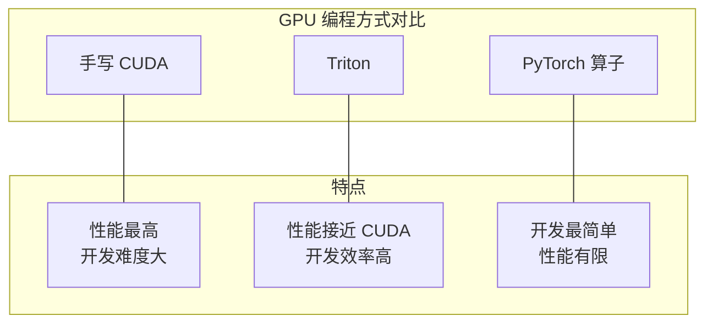

**重要澄清**：本文介绍的 Triton 是 **OpenAI Triton**（GPU 编程语言），与 **NVIDIA Triton Inference Server**（推理服务框架）是完全不同的两个项目。

| 项目 | 开发者 | 用途 |
|------|--------|------|
| **OpenAI Triton** | OpenAI | GPU Kernel 编程语言 |
| **Triton Inference Server** | NVIDIA | 模型部署和推理服务 |

### 1.2 为什么需要 Triton

**CUDA 编程的痛点**：

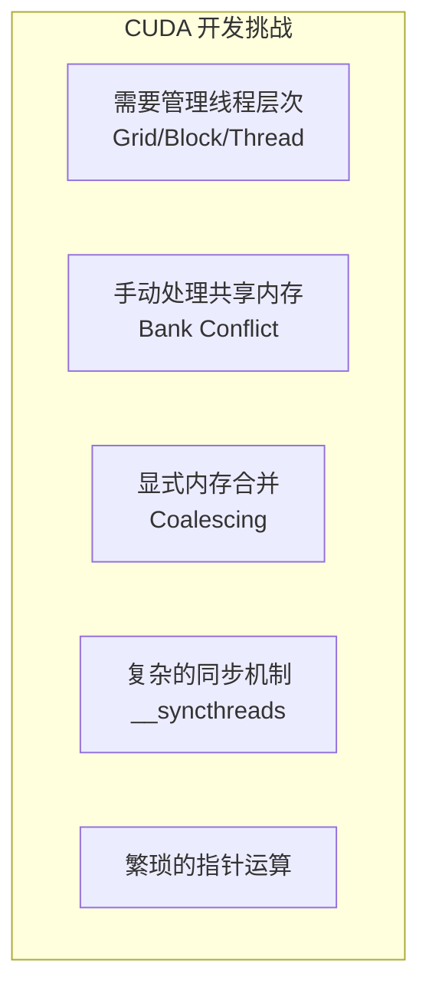

**Triton 的解决方案**：

| CUDA 痛点 | Triton 解决方式 |
|-----------|-----------------|
| 线程管理 | Block 级抽象，自动处理线程 |
| 共享内存 | 编译器自动管理 |
| 内存合并 | 编译器自动优化 |
| 同步机制 | 隐式同步 |
| 指针运算 | 类 NumPy 的张量操作 |

### 1.3 Triton 的定位

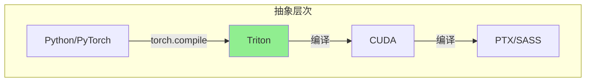

**适用场景**：

- 自定义 AI 算子开发
- 需要性能但不想写 CUDA
- 快速原型验证
- FlashAttention 等复杂算法实现

---

## 二、Triton 编程模型

### 2.1 核心概念

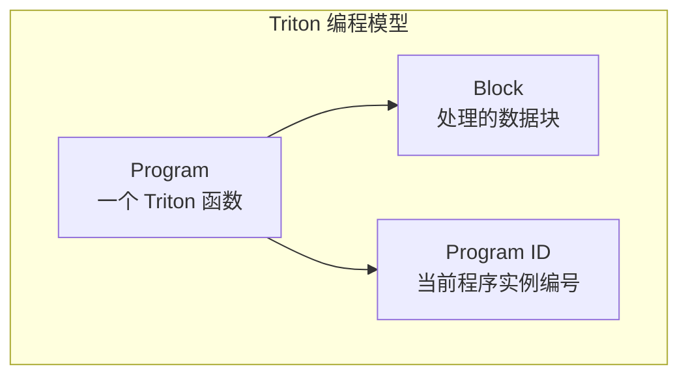

**与 CUDA 的对应关系**：

| CUDA 概念 | Triton 对应 |
|-----------|-------------|
| Grid | 所有 Program 实例 |
| Block | 隐式（编译器管理） |
| Thread | 隐式（编译器管理） |
| blockIdx | `tl.program_id(axis)` |
| threadIdx | 不需要显式处理 |

### 2.2 基本语法

```python
import triton
import triton.language as tl

@triton.jit
def kernel_name(
    # 指针参数
    ptr_a, ptr_b, ptr_c,
    # 标量参数
    n_elements,
    # 编译时常量
    BLOCK_SIZE: tl.constexpr,
):
    # 获取当前 program ID
    pid = tl.program_id(axis=0)
    
    # 计算当前 block 处理的数据范围
    block_start = pid * BLOCK_SIZE
    offsets = block_start + tl.arange(0, BLOCK_SIZE)
    
    # 创建掩码（处理边界）
    mask = offsets < n_elements
    
    # 加载数据
    a = tl.load(ptr_a + offsets, mask=mask)
    b = tl.load(ptr_b + offsets, mask=mask)
    
    # 计算
    c = a + b
    
    # 存储结果
    tl.store(ptr_c + offsets, c, mask=mask)
```

### 2.3 关键 API

#### 2.3.1 程序标识

```python
# 获取当前 program 在指定轴上的 ID
pid = tl.program_id(axis=0)  # axis: 0, 1, 2

# 获取该轴上的 program 总数
num_programs = tl.num_programs(axis=0)
```

#### 2.3.2 索引生成

```python
# 生成连续索引 [0, 1, 2, ..., n-1]
offsets = tl.arange(0, BLOCK_SIZE)

# 二维索引
row_offsets = tl.arange(0, BLOCK_M)[:, None]  # (BLOCK_M, 1)
col_offsets = tl.arange(0, BLOCK_N)[None, :]  # (1, BLOCK_N)
```

#### 2.3.3 内存操作

```python
# 加载数据
data = tl.load(ptr + offsets, mask=mask, other=0.0)

# 存储数据
tl.store(ptr + offsets, data, mask=mask)

# 原子操作
tl.atomic_add(ptr + offsets, value, mask=mask)
```

#### 2.3.4 数学运算

```python
# 基本运算
c = a + b
c = a * b
c = tl.maximum(a, b)
c = tl.minimum(a, b)

# 指数/对数
c = tl.exp(a)
c = tl.log(a)

# 规约操作
sum_val = tl.sum(a, axis=0)
max_val = tl.max(a, axis=0)
```

---

## 三、实战案例

### 3.1 向量加法

最简单的 Triton Kernel：

```python
import torch
import triton
import triton.language as tl

@triton.jit
def vector_add_kernel(
    x_ptr, y_ptr, output_ptr,
    n_elements,
    BLOCK_SIZE: tl.constexpr,
):
    """向量加法 Kernel"""
    # 1. 获取当前 program ID
    pid = tl.program_id(axis=0)
    
    # 2. 计算当前 block 处理的元素范围
    block_start = pid * BLOCK_SIZE
    offsets = block_start + tl.arange(0, BLOCK_SIZE)
    
    # 3. 创建掩码处理边界
    mask = offsets < n_elements
    
    # 4. 加载数据
    x = tl.load(x_ptr + offsets, mask=mask)
    y = tl.load(y_ptr + offsets, mask=mask)
    
    # 5. 计算
    output = x + y
    
    # 6. 存储结果
    tl.store(output_ptr + offsets, output, mask=mask)


def vector_add(x: torch.Tensor, y: torch.Tensor) -> torch.Tensor:
    """向量加法的 Python 接口"""
    output = torch.empty_like(x)
    n_elements = x.numel()
    
    # 配置 grid
    BLOCK_SIZE = 1024
    grid = lambda meta: (triton.cdiv(n_elements, meta['BLOCK_SIZE']),)
    
    # 启动 kernel
    vector_add_kernel[grid](
        x, y, output,
        n_elements,
        BLOCK_SIZE=BLOCK_SIZE,
    )
    
    return output


# 测试
x = torch.randn(10000, device='cuda')
y = torch.randn(10000, device='cuda')
output = vector_add(x, y)

# 验证正确性
assert torch.allclose(output, x + y)
```

**执行流程**：

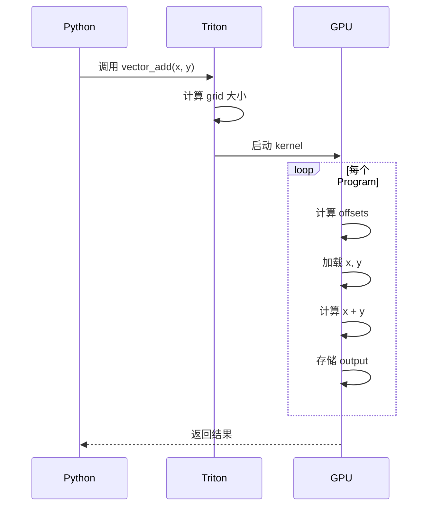

### 3.2 矩阵乘法

Triton 最经典的示例——高性能矩阵乘法：

```python
@triton.jit
def matmul_kernel(
    # 输入矩阵指针
    a_ptr, b_ptr, c_ptr,
    # 矩阵维度
    M, N, K,
    # 步长
    stride_am, stride_ak,
    stride_bk, stride_bn,
    stride_cm, stride_cn,
    # Block 大小（编译时常量）
    BLOCK_M: tl.constexpr,
    BLOCK_N: tl.constexpr,
    BLOCK_K: tl.constexpr,
):
    """
    计算 C = A @ B
    A: (M, K), B: (K, N), C: (M, N)
    """
    # 1. 获取当前 block 的位置
    pid_m = tl.program_id(axis=0)
    pid_n = tl.program_id(axis=1)
    
    # 2. 计算当前 block 处理的行列范围
    rm = pid_m * BLOCK_M + tl.arange(0, BLOCK_M)
    rn = pid_n * BLOCK_N + tl.arange(0, BLOCK_N)
    rk = tl.arange(0, BLOCK_K)
    
    # 3. 计算 A 和 B 的指针
    # A 的形状: (BLOCK_M, BLOCK_K)
    a_ptrs = a_ptr + rm[:, None] * stride_am + rk[None, :] * stride_ak
    # B 的形状: (BLOCK_K, BLOCK_N)
    b_ptrs = b_ptr + rk[:, None] * stride_bk + rn[None, :] * stride_bn
    
    # 4. 累加器初始化
    acc = tl.zeros((BLOCK_M, BLOCK_N), dtype=tl.float32)
    
    # 5. 沿 K 维度分块计算
    for k in range(0, K, BLOCK_K):
        # 加载 A 和 B 的当前块
        a = tl.load(a_ptrs, mask=(rm[:, None] < M) & (rk[None, :] + k < K), other=0.0)
        b = tl.load(b_ptrs, mask=(rk[:, None] + k < K) & (rn[None, :] < N), other=0.0)
        
        # 累加
        acc += tl.dot(a, b)
        
        # 移动到下一个 K 块
        a_ptrs += BLOCK_K * stride_ak
        b_ptrs += BLOCK_K * stride_bk
    
    # 6. 存储结果
    c_ptrs = c_ptr + rm[:, None] * stride_cm + rn[None, :] * stride_cn
    mask = (rm[:, None] < M) & (rn[None, :] < N)
    tl.store(c_ptrs, acc, mask=mask)


def matmul(a: torch.Tensor, b: torch.Tensor) -> torch.Tensor:
    """矩阵乘法 Python 接口"""
    assert a.shape[1] == b.shape[0]
    M, K = a.shape
    K, N = b.shape
    c = torch.empty((M, N), device=a.device, dtype=a.dtype)
    
    # 配置
    BLOCK_M, BLOCK_N, BLOCK_K = 128, 128, 32
    grid = (triton.cdiv(M, BLOCK_M), triton.cdiv(N, BLOCK_N))
    
    matmul_kernel[grid](
        a, b, c,
        M, N, K,
        a.stride(0), a.stride(1),
        b.stride(0), b.stride(1),
        c.stride(0), c.stride(1),
        BLOCK_M, BLOCK_N, BLOCK_K,
    )
    
    return c
```

**矩阵乘法分块策略**：

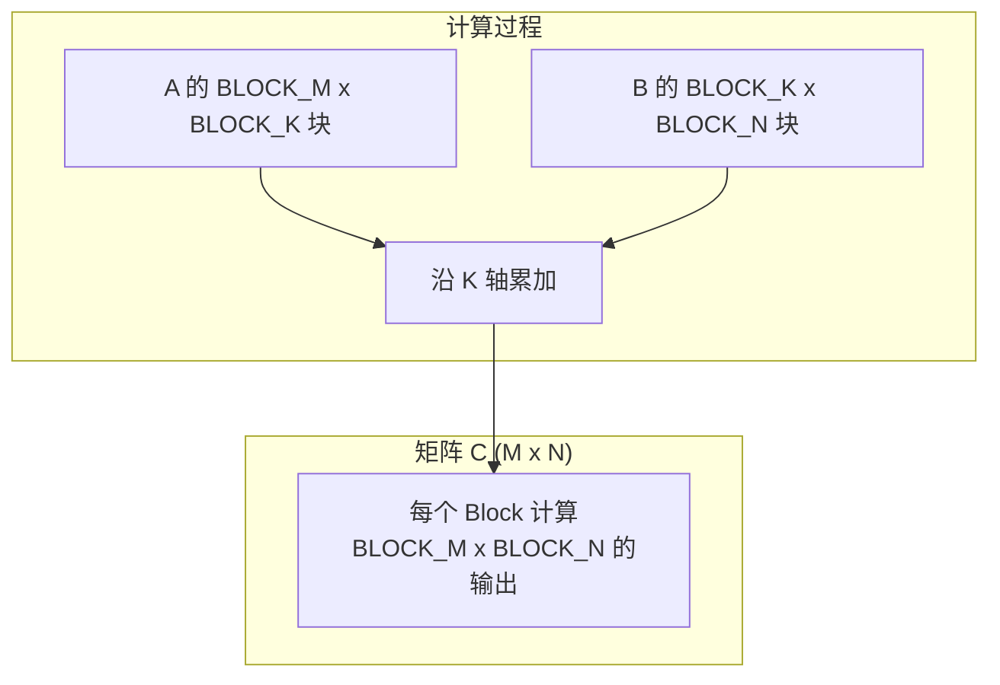

### 3.3 Softmax

展示 Triton 处理规约操作的能力：

```python
@triton.jit
def softmax_kernel(
    input_ptr, output_ptr,
    n_cols,
    input_row_stride, output_row_stride,
    BLOCK_SIZE: tl.constexpr,
):
    """
    对每一行进行 Softmax
    输入: (n_rows, n_cols)
    """
    # 当前处理的行
    row_idx = tl.program_id(0)
    
    # 当前行的起始指针
    row_start_ptr = input_ptr + row_idx * input_row_stride
    
    # 列偏移
    col_offsets = tl.arange(0, BLOCK_SIZE)
    mask = col_offsets < n_cols
    
    # 加载当前行
    row = tl.load(row_start_ptr + col_offsets, mask=mask, other=-float('inf'))
    
    # 计算 max（数值稳定性）
    row_max = tl.max(row, axis=0)
    
    # 减去 max 并计算 exp
    row_minus_max = row - row_max
    numerator = tl.exp(row_minus_max)
    
    # 计算 sum
    denominator = tl.sum(numerator, axis=0)
    
    # 计算 softmax
    softmax_output = numerator / denominator
    
    # 存储结果
    output_row_start_ptr = output_ptr + row_idx * output_row_stride
    tl.store(output_row_start_ptr + col_offsets, softmax_output, mask=mask)


def softmax(x: torch.Tensor) -> torch.Tensor:
    """Softmax Python 接口"""
    n_rows, n_cols = x.shape
    
    # BLOCK_SIZE 需要是 2 的幂且 >= n_cols
    BLOCK_SIZE = triton.next_power_of_2(n_cols)
    
    output = torch.empty_like(x)
    
    softmax_kernel[(n_rows,)](
        x, output,
        n_cols,
        x.stride(0), output.stride(0),
        BLOCK_SIZE=BLOCK_SIZE,
    )
    
    return output
```

### 3.4 FlashAttention 简化实现

Triton 的核心应用之一：

```python
@triton.jit
def flash_attention_kernel(
    Q, K, V, Out,
    stride_qz, stride_qh, stride_qm, stride_qk,
    stride_kz, stride_kh, stride_kn, stride_kk,
    stride_vz, stride_vh, stride_vn, stride_vk,
    stride_oz, stride_oh, stride_om, stride_ok,
    Z, H, N_CTX,
    BLOCK_M: tl.constexpr,
    BLOCK_N: tl.constexpr,
    BLOCK_DMODEL: tl.constexpr,
):
    """
    FlashAttention 核心实现
    Q, K, V: (batch, heads, seq_len, head_dim)
    """
    # 获取当前的 batch, head, query block
    off_z = tl.program_id(2)  # batch
    off_h = tl.program_id(1)  # head
    off_m = tl.program_id(0)  # query block
    
    # 计算偏移
    qkv_offset = off_z * stride_qz + off_h * stride_qh
    
    # Q block 的行索引
    offs_m = off_m * BLOCK_M + tl.arange(0, BLOCK_M)
    offs_d = tl.arange(0, BLOCK_DMODEL)
    
    # 加载 Q block
    q_ptrs = Q + qkv_offset + offs_m[:, None] * stride_qm + offs_d[None, :] * stride_qk
    q = tl.load(q_ptrs, mask=offs_m[:, None] < N_CTX, other=0.0)
    
    # 初始化累加器
    m_i = tl.zeros([BLOCK_M], dtype=tl.float32) - float("inf")
    l_i = tl.zeros([BLOCK_M], dtype=tl.float32)
    acc = tl.zeros([BLOCK_M, BLOCK_DMODEL], dtype=tl.float32)
    
    # 遍历所有 K, V blocks
    for start_n in range(0, N_CTX, BLOCK_N):
        offs_n = start_n + tl.arange(0, BLOCK_N)
        
        # 加载 K block
        k_ptrs = K + qkv_offset + offs_n[:, None] * stride_kn + offs_d[None, :] * stride_kk
        k = tl.load(k_ptrs, mask=offs_n[:, None] < N_CTX, other=0.0)
        
        # 计算 QK^T
        qk = tl.zeros([BLOCK_M, BLOCK_N], dtype=tl.float32)
        qk += tl.dot(q, tl.trans(k))
        
        # 缩放
        qk *= 1.0 / tl.sqrt(tl.float32(BLOCK_DMODEL))
        
        # 在线 Softmax
        m_ij = tl.max(qk, axis=1)
        m_new = tl.maximum(m_i, m_ij)
        
        alpha = tl.exp(m_i - m_new)
        beta = tl.exp(m_ij - m_new)
        
        l_new = alpha * l_i + beta * tl.sum(tl.exp(qk - m_ij[:, None]), axis=1)
        
        # 加载 V block
        v_ptrs = V + qkv_offset + offs_n[:, None] * stride_vn + offs_d[None, :] * stride_vk
        v = tl.load(v_ptrs, mask=offs_n[:, None] < N_CTX, other=0.0)
        
        # 更新累加器
        p = tl.exp(qk - m_new[:, None])
        acc = acc * alpha[:, None] + tl.dot(p.to(v.dtype), v)
        
        # 更新状态
        m_i = m_new
        l_i = l_new
    
    # 归一化并存储
    acc = acc / l_i[:, None]
    out_ptrs = Out + qkv_offset + offs_m[:, None] * stride_om + offs_d[None, :] * stride_ok
    tl.store(out_ptrs, acc, mask=offs_m[:, None] < N_CTX)
```

**FlashAttention 核心流程**：

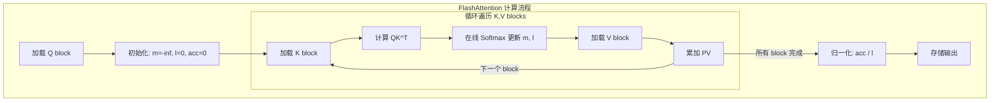

---

## 四、自动调优

### 4.1 triton.autotune

Triton 提供强大的自动调优功能：

```python
@triton.autotune(
    configs=[
        triton.Config({'BLOCK_M': 128, 'BLOCK_N': 128, 'BLOCK_K': 32}, num_warps=8),
        triton.Config({'BLOCK_M': 128, 'BLOCK_N': 64, 'BLOCK_K': 32}, num_warps=4),
        triton.Config({'BLOCK_M': 64, 'BLOCK_N': 128, 'BLOCK_K': 32}, num_warps=4),
        triton.Config({'BLOCK_M': 64, 'BLOCK_N': 64, 'BLOCK_K': 64}, num_warps=4),
    ],
    key=['M', 'N', 'K'],  # 根据这些参数选择配置
)
@triton.jit
def matmul_autotune_kernel(
    a_ptr, b_ptr, c_ptr,
    M, N, K,
    stride_am, stride_ak,
    stride_bk, stride_bn,
    stride_cm, stride_cn,
    BLOCK_M: tl.constexpr,
    BLOCK_N: tl.constexpr,
    BLOCK_K: tl.constexpr,
):
    # ... kernel 实现
    pass
```

**自动调优原理**：

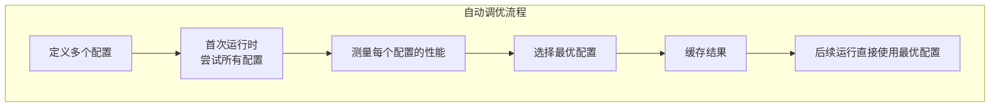

### 4.2 配置参数

| 参数 | 含义 |
|------|------|
| `BLOCK_*` | Block 大小 |
| `num_warps` | 每个 block 使用的 warp 数 |
| `num_stages` | 流水线阶段数（软件流水线） |

---

## 五、Triton vs CUDA

### 5.1 代码对比

**向量加法对比**：

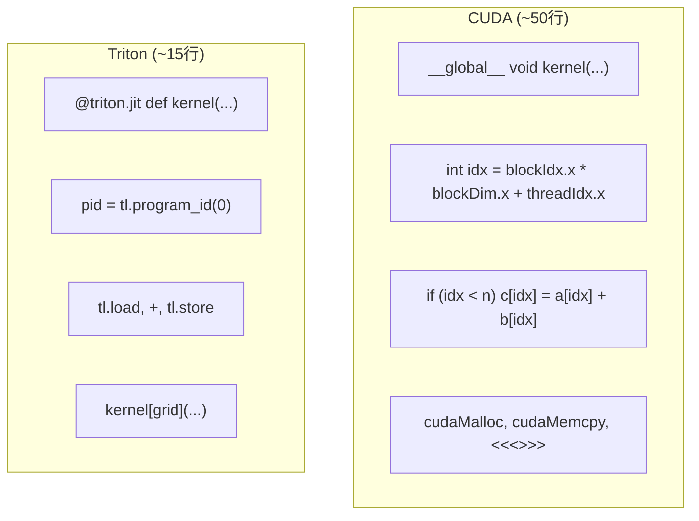

### 5.2 性能对比

| 算子 | CUDA | Triton | Triton/CUDA |
|------|------|--------|-------------|
| 矩阵乘法 (4096x4096) | 100% | 95-100% | ~1.0x |
| Softmax | 100% | 90-95% | ~0.95x |
| FlashAttention | 100% | 95-100% | ~1.0x |
| LayerNorm | 100% | 85-95% | ~0.9x |

### 5.3 何时选择 Triton

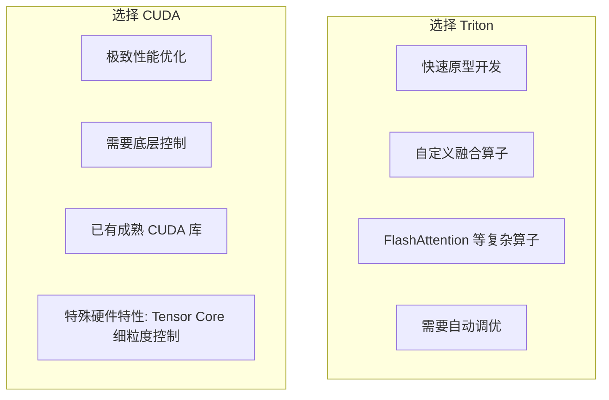

---

## 六、高级话题

### 6.1 与 torch.compile 集成

PyTorch 2.0+ 可以自动生成 Triton kernel：

```python
import torch

@torch.compile
def fused_gelu(x):
    return x * 0.5 * (1 + torch.tanh(
        0.7978845608 * (x + 0.044715 * x ** 3)
    ))

# 自动生成并优化 Triton kernel
x = torch.randn(1024, 1024, device='cuda')
output = fused_gelu(x)
```

### 6.2 TileLang 与 CuTeDSL

**TileLang**：字节跳动开发的 GPU Kernel DSL，与 Triton 类似但有更多优化。

**CuTeDSL**：基于 CUTLASS 的 DSL，更接近硬件。

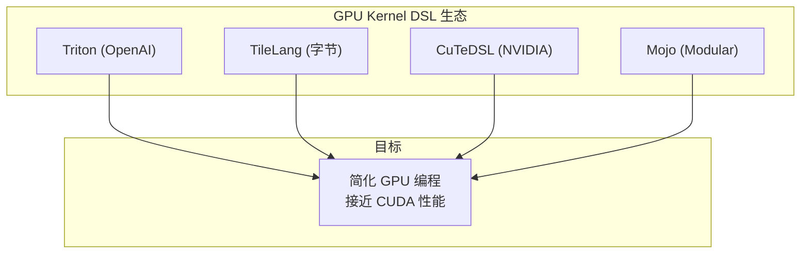

### 6.3 调试技巧

```python
# 1. 打印 Triton 生成的 PTX
import os
os.environ['TRITON_PRINT_AUTOTUNING'] = '1'

# 2. 获取编译后的代码
kernel = my_kernel[grid](args)
print(kernel.asm['ptx'])

# 3. 使用 triton.testing 进行 benchmark
import triton.testing

@triton.testing.perf_report(
    triton.testing.Benchmark(
        x_names=['N'],
        x_vals=[2**i for i in range(10, 20)],
        line_arg='provider',
        line_vals=['triton', 'torch'],
        line_names=['Triton', 'Torch'],
        ylabel='GB/s',
        plot_name='vector-add-performance',
    )
)
def benchmark(N, provider):
    x = torch.randn(N, device='cuda')
    y = torch.randn(N, device='cuda')
    
    if provider == 'triton':
        ms = triton.testing.do_bench(lambda: vector_add(x, y))
    else:
        ms = triton.testing.do_bench(lambda: x + y)
    
    gbps = 3 * x.numel() * x.element_size() / ms * 1e-6
    return gbps

benchmark.run(print_data=True)
```

---

## 七、最佳实践

### 7.1 性能优化建议

| 建议 | 说明 |
|------|------|
| **选择合适的 BLOCK_SIZE** | 通常 64-256，需要实验 |
| **使用 autotune** | 让编译器选择最优配置 |
| **减少全局内存访问** | 尽量复用加载的数据 |
| **使用 tl.constexpr** | 编译时常量可以优化更多 |
| **注意数据类型** | 使用 FP16/BF16 加速 |

### 7.2 常见陷阱

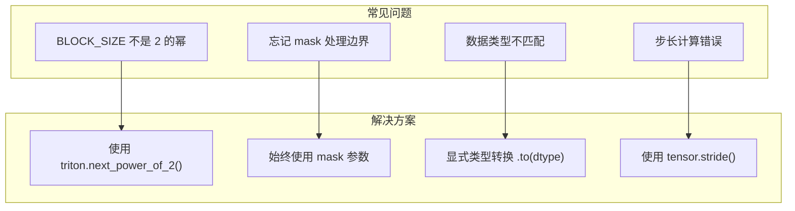

---

## 八、学习资源

### 8.1 官方资源

- [Triton 官方文档](https://triton-lang.org/)
- [Triton GitHub](https://github.com/triton-lang/triton)
- [Triton 官方教程](https://triton-lang.org/main/getting-started/tutorials/)

### 8.2 推荐阅读

| 资源 | 内容 |
|------|------|
| FlashAttention 论文 | Triton 实现参考 |
| CUDA C++ Programming Guide | 理解底层原理 |
| PyTorch Triton 教程 | torch.compile 集成 |

---

## 相关文章

- [上一篇：31 - AI C++ 工程师入门实战指南](@/articles/ai/ai-31-AI-C++工程师入门实战指南.md)
- [21 - CUDA 入门与 GPU 编程基础](@/articles/ai/ai-21-CUDA入门与GPU编程基础.md)
- [24 - GPU Kernel 开发详解](@/articles/ai/ai-24-GPU-Kernel开发详解.md)
- [25 - FlashAttention 与 PagedAttention 原理](@/articles/ai/ai-25-FlashAttention与PagedAttention原理.md)
