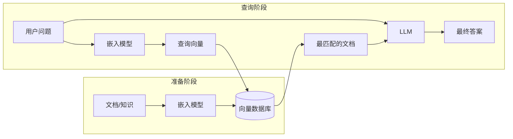
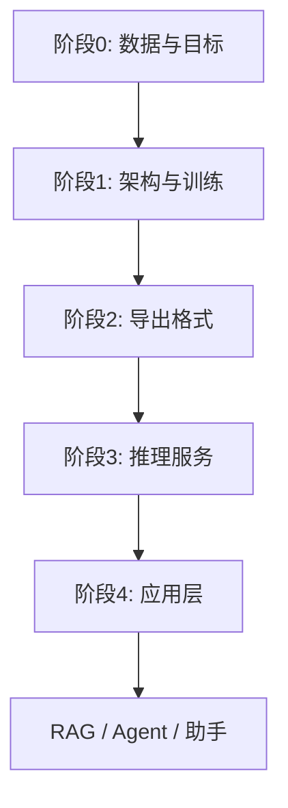
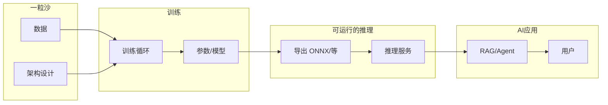

+++
title = "34 - 从模型诞生到 AI 应用：全链路认知"
description = "从「模型是什么」到「AI 应用落地」的端到端认知：模型本质、训练与推理、为何 RAG 更贴近你的理解、原理与业界实践、大模型与传统 ML 的本质区别"
date = 2026-02-11
draft = false
[taxonomies]
tags = ["AI", "大模型", "训练", "推理", "RAG", "Agent", "全链路"]
[extra]
toc = true
+++

## 概述

本文用「从一粒沙子到一颗 CPU」式的思路，从零讲清：**模型到底是什么、如何诞生、如何被训练与利用**，再到**原理上的端到端生命链**与**业界最佳实践中的一条龙实现**，以及**大模型与传统机器学习的本质不同**。目标是让你对「从训练出一个模型到诞生一个 AI 应用」有完整、不跑偏的认知。

### 本文面向谁？阅读前需要什么？

- **普通读者**：只要对「输入→输出」「数据」「程序/函数」有最基础的直觉即可；不需要学过数学或编程。文中**术语第一次出现时会附带简短解释**（如 token、梯度、推理等），遇到英文缩写也会说明含义。
- **有工作经验的工程师（希望转型或了解 AI）**：你的**后端/服务/数据库/部署**经验会很有用——可以把「模型」类比成**一个由参数决定的函数**，**训练**类比成**用数据离线调参**，**推理服务**类比成**无状态 API**（读入请求，算一遍，返回结果），**向量库**类比成**一种「按相似度查」的存储**，**RAG** 类比成**先查库、再拼上下文、再调 LLM 接口**。读完你会更清楚：做 AI 应用时，哪些和你过去写的「服务+存储+编排」是相通的，哪些是新增概念（如训练、模型格式、prompt）。

**阅读前只需**：愿意接受「模型 = 可计算的函数」「训练 = 调参数」这两句话作为起点，后面会一步步展开。不要求先学过机器学习或深度学习。

**给有工程背景的读者（一句话对照）**：  
- **模型** ≈ 一个由参数决定的「函数」或「黑盒服务」；模型文件 ≈ 把这个函数序列化存盘（像编译后的程序或库）。  
- **训练** ≈ 离线用大量数据调这些参数，直到输入–输出符合预期；**推理** ≈ 线上加载这份参数，对每个请求做一次前向计算并返回结果（无状态、可水平扩展）。  
- **向量库** ≈ 一种存储 + 索引，按「向量相似度」查，而不是按主键或关键词；和关系型库、缓存是互补关系。  
- **RAG** ≈ 先查向量库拿到相关文档，再和用户问题拼成一段 prompt，调 LLM 接口拿回答；整体就是你熟悉的「查库 → 拼请求 → 调服务」。

### 你的问题与扩展话题——是否都覆盖？

| 你的问题 / 延伸 | 对应章节 | 说明 |
|-----------------|----------|------|
| 模型是什么？不能类比向量数据库的话，比喻成什么更合适？ | 一 | 先澄清「模型≠向量库」，再给四种更贴切的比喻。 |
| 模型如何诞生？用什么训练、怎么训练的？ | 二 | 训练所需五要素 + 训练本质五步 + 流程小结。 |
| 模型如何被利用和推理？ | 三 | 推理定义 + 四类模型推理举例 + 模型文件里有什么/没有什么。 |
| 为什么说 RAG 更符合我的想法？我理解偏到哪里？ | 四 | 你的想法简述 → 三点偏差 → RAG 为何更贴近 + 结论。 |
| 原理上从 0 到模型再到 AI Agent，生命链如何一步步实现？ | 五 | 阶段 0～4 分步说明 + 原理链总图。 |
| 业界最佳实践：一条龙如何真实实现？框架、格式(ONNX 等)？ | 六 | 训练框架与流程、模型格式表、推理与部署、RAG/Agent 组件、一条龙对应。 |
| 大模型和传统 ML 本质不同？为什么大模型这么成功？ | 七 | 传统 ML vs 大模型对比、本质区别表、为何影响更大。 |
| 从一粒沙到 CPU：全貌认知 | 八 | 六点总结 + 全链路图。 |

若你**先要建立直觉**，可按 **一 → 二 → 三** 顺序读；**对「向量库/推理」纠偏**重点看 **四**；**看整片森林**看 **五、八**；**要落地选型**看 **六**；**理解为何是今天这样**看 **七**。

**全文逻辑线（由浅入深）**：  
- 先建立「**模型是什么**」（一），避免与向量库混淆。  
- 再搞清「**从哪来、到哪去**」：训练（二）与推理（三）。  
- 再对接到你的直觉——**RAG**（四），纠偏并建立正确对应。  
- 再拉通「**从数据到 Agent**」的原理生命链（五）。  
- 再落到**业界怎么做**：框架、格式、部署、RAG/Agent 选型（六）。  
- 再理解**时代差异**：大模型 vs 传统 ML、为何影响更大（七）。  
- 最后用**全貌图**收束（八）。

**自检结论（按你的三条要求）**：  
- **问题与延伸是否都覆盖？** 已用上表逐条对应到章节；原理链、业界一条龙、格式(ONNX 等)、大模型 vs 传统 ML、全貌认知均有独立章节。  
- **是否翔实、详细？** 各节有概念+举例+小结或图；训练含五要素、参数形态、梯度下降、epoch/batch；推理含前向计算与四类举例；RAG 含三点偏差与流程图；六节含格式选型与 RAG 示例；七节含 Scaling/涌现与传统场景举例。  
- **是否由浅入深？** 顺序为概念→训练→推理→应用纠偏→原理链→实践→对比→总结；节间有过渡句；概述提供阅读路线与全文逻辑线。  
- **不限制篇幅下的补充**：增加了「为何容易想到向量库」、极简数值例子(y=Wx+b)、参数初始化、为何用 batch、训练/推理同一套参数、RAG 解决什么问题与 prompt 形态、目标与数据约束、为何需要导出、PyTorch 与三种并行与推理引擎与向量库选型、特征工程与预训练与提示 vs 微调、若只记三件事等，使各节更饱满、可独立读懂。  
- **科普自检（面向普通读者 + 转型工程师）**：已增加「本文面向谁」「阅读前需要什么」；术语在首次出现时加简短解释（token、LLM、梯度、batch、epoch、显存、chunk、prompt、自回归、argmax、top-k、嵌入、向量、tokenizer、LR/GBDT、HF 等）；已增加「给有工程背景的读者」的对照段，用模型≈函数/服务、训练≈离线调参、推理≈无状态 API、向量库≈存储+相似度索引、RAG≈查库+拼请求+调服务 做类比，便于转型工程师用已有心智模型对接。

**综合自检（按你之前的各种要求）**：  
| 要求 | 结论 |
|------|------|
| 你的问题与扩展话题是否都覆盖？ | ✓ 概述表格逐条对应 8 项；原理链、业界一条龙、格式(ONNX 等)、大模型 vs 传统 ML、全貌均有独立章节。 |
| 是否翔实、详细（不一两句话概括）？ | ✓ 各节概念+展开+举例+小结或图；训练含五要素、参数/初始化、梯度/链式法则、batch/epoch/显存、为何用 batch；推理含前向、四类举例、同一套参数；RAG 含问题、三点偏差、prompt 形态、图；五节含目标与数据约束、为何导出；六节含格式选型、三种并行、推理引擎与向量库选型、RAG 示例；七节含特征工程/LR·GBDT、预训练数据、提示 vs 微调、Scaling/涌现；八节含全链路图与「若只记三件事」。 |
| 是否由浅入深？ | ✓ 顺序为概念→训练→推理→RAG 纠偏→原理链→实践→对比→总结；节末有过渡句；概述有阅读路线与全文逻辑线。 |
| 科普：面向普通读者 + 转型工程师？ | ✓ 概述有「本文面向谁」「阅读前需要什么」；术语首现解释（见上）；有「给有工程背景的读者」类比段；LR/GBDT、tokenizer、HF 等已补解释。 |
| 不限制篇幅下的充实？ | ✓ 已增加极简例子、初始化、为何 batch、训练/推理同一套参数、RAG 问题与 prompt、目标与数据约束、为何导出、PyTorch/并行/引擎/向量库选型、特征工程/预训练/提示 vs 微调、若只记三件事等，各节可独立读懂。 |

**结论**：按「问题覆盖、翔实详细、由浅入深、科普双读者、不限制篇幅」综合自检，本文**合格**；若后续有新增问题或读者类型，可再补一节或一段。

---

## 一、模型是什么？更好的比喻是什么？

### 1.1 模型不是「向量数据库」

- **向量数据库**：存的是**一堆已经算好的向量**，检索时用「查询向量」去**比对、找最近邻**，返回的是**库里已有的某几条记录**。本质是**存储 + 相似度搜索**。
- **模型**：存的是**一组参数（权重）**，定义的是**一个函数**——给定输入，**算**出输出。输入可以是文本、图像、向量等，输出可以是类别、分数、下一 token 概率、一个向量等。本质是**可计算的函数**，不是「一堆现成答案等你来查」。

所以：**模型 ≠ 向量数据库**。把模型比喻成向量数据库，会让人误以为「推理 = 在模型里查最匹配的向量」，而真实情况是「推理 = 把输入喂进模型，做一遍前向计算得到输出」。这种误解会连带导致：以为训练是在「造一堆向量」、以为 ONNX 里装的是「可被查的库」——实际上训练是在**调一组参数**，ONNX 里装的是**可执行的计算图+权重**。

**为什么容易想到「向量数据库」？** 因为在 RAG 这类应用里，确实会先「准备一堆向量」、再「用查询向量去比对、找最匹配、再汇总」——整条流程里既有向量又有比对，容易让人以为「模型 = 向量库」。关键区分在于：**向量库是应用里单独存向量、做检索的组件**；**模型是生产向量或生成文本的「函数」**，两者职责不同，不能混为一谈。

### 1.2 模型更合适的比喻

| 比喻 | 说明 |
|------|------|
| **一个函数 / 一个程序** | 输入 → 经过固定计算规则（由参数决定）→ 输出。换参数就换行为，就像换代码就换程序。 |
| **一张「菜谱」+ 一罐「调料配比」** | 菜谱 = 计算图（先乘后加再激活）；调料配比 = 权重。同一菜谱，不同配比做出不同味道；训练就是在调「配比」。 |
| **一块「可编程的电路」** | 结构固定（层、连接方式），可调的是每条线上的「权重」。训练就是调这些权重，直到输入–输出关系符合数据里的规律。 |
| **压缩后的「统计规律」** | 训练数据里蕴含的输入–输出关系，被压缩进有限个参数里；推理时用这些参数把规律「还原」到新输入上。 |

**一句话**：模型 = **由参数决定的、从输入到输出的可计算函数**。训练得到的是「参数」；推理是「用这套参数对任意新输入算一遍」。

**一个极简数值例子（帮助固化直觉）**：假设有一个最简单的线性模型 `y = W·x + b`，输入 `x` 是向量，输出 `y` 是标量；**参数**就是 `W`（矩阵）和 `b`（偏置）。训练就是根据很多个 (x, y) 样本，把 W 和 b 调成合适的值；推理就是**给定新的 x，代入当前的 W 和 b 算一遍得到 y**——没有任何「查表」或「找最像的 x」的步骤，就是纯计算。神经网络无非是很多层这样的运算加非线性（激活函数）堆叠而成，本质相同：参数固定后，推理 = 代入输入、按层计算、得到输出。

**由浅入深小结**：先记住「模型 = 可计算的函数，不是现成答案库」；下一节会具体说这些「参数」是怎么来的（训练），再下一节说怎么用（推理）。

---

## 二、一个模型是如何诞生的？用什么训练、怎么训练？

### 2.1 训练需要什么

- **数据**：输入–输出对（监督）或纯输入（无监督/自监督）。例如：  
  - 图像分类：(图像, 类别)  
  - 大语言模型（LLM，即「大语言模型」的英文缩写）：大量文本，用「前文预测下一个 **token**」自监督。**Token** 可理解为「词或子词」——模型把句子切成一小段一小段来处理，每段叫一个 token。  
- **模型结构（架构）**：层数、每层类型（Linear、Attention、Conv 等）、激活函数、连接方式等。**结构是人事先设计好的**，训练不改结构，只改**参数**。  
- **损失函数**：衡量「模型当前输出」和「期望输出」差多少。训练目标 = 最小化损失。例如分类常用**交叉熵**（一种衡量「预测分布」和「真实标签」差距的式子），语言模型常用交叉熵或 **perplexity**（困惑度，越低越好）；损失越小说明预测越准。  
- **优化器**：在参数空间里怎么「走」才能让损失下降（如 SGD、Adam）。  
- **算力**：**GPU**/集群，做大量矩阵运算和**梯度**反传。**梯度**可以理解为「每个参数该往哪个方向、挪多少，能让损失下降」的指示；反传就是从损失倒推，算出每个参数的梯度。

**「参数」长什么样？** 参数就是模型里所有可调的**数字**，通常组织成**矩阵/张量**。例如一个线性层有「权重矩阵 W」和「偏置 b」；Transformer 里每层有 Q/K/V 的权重、MLP 的权重等。小模型几百万个参数，大模型几百亿到万亿级。训练前后**结构不变**，变的就是这些数字的取值。

**参数一开始从哪来？** 训练开始前，参数需要**初始化**——常用随机初始化（如 Xavier、Kaiming），或加载已有**预训练**权重再继续训（微调）。不会「没有参数」：结构定义了多少个参数，就会先填上初始值，再通过训练一步步更新到收敛。

### 2.2 训练在做什么（本质）

1. **前向传播**：拿**一批**数据（一个 batch），用**当前参数**算一遍，得到预测输出。每一步算的都是「输入 → 各层运算（乘权重、加偏置、激活函数等）→ 输出」。  
2. **算损失**：用损失函数比较「模型预测」和「真实标签/目标」，得到一个标量（损失值）。损失越大说明当前参数越差。  
3. **反向传播**：从损失往回算，利用**链式法则**（高数里「复合函数求导」）得到**每个参数**对损失的**梯度**（即：这个参数往哪个方向、改变多少，能让损失下降）。不熟悉也没关系：只需知道「能算出每个参数该怎么微调」即可。  
4. **更新参数**：优化器（如 Adam）根据梯度和历史信息，按一定步长更新每个参数。  
本质上是**梯度下降**：沿梯度反方向更新参数，使损失一步一步变小，直到收敛。  
5. 重复 1～4：通常会把整个数据集扫多遍（每遍叫一个 **epoch**，即「一轮」），每遍里按 **batch**（一批样本，比如 32 或 128 条）一批批算；**一步** = 一个 batch 的前向+反传+更新。训练很多步直到损失足够低或收敛。

**为什么要用 batch，而不是一次用全量数据？** 全量数据一起算会占满**显存**（GPU 的内存）/内存，且梯度往往用「一个 batch 的平均」就足够估计方向了；用 batch 还能带来一定的随机性，有利于泛化。所以实际训练是「小步快跑」：每步只看一批样本，更新一次参数，再换下一批。

**结果**：你得到的是**一组确定下来的参数**（权重）。这组参数 + 固定的模型结构，就构成了「模型」——一个输入→输出的函数。保存下来就是「模型文件」（如 `.pt`、`.onnx`、`.gguf`），里面主要是参数（和描述结构的元数据），**不是**一堆向量等着被查。

### 2.3 小结：模型诞生的流程（原理）

```
数据 + 模型架构(人设计) + 损失函数 + 优化器
        ↓
    迭代（多 epoch，每步一个 batch）：
        前向(当前参数 → 预测) → 损失(预测 vs 真实) → 反传(算梯度) → 更新参数
        ↓
    得到「一组参数」= 模型（可保存为 .pt / ONNX / GGUF 等格式）
```

**由浅入深**：到这里你已经知道「模型 = 结构 + 参数」「训练 = 调参数使损失变小」。下一节看这组参数**怎么被用**——推理。

---

## 三、模型如何被利用？推理是什么？

### 3.1 推理在做什么

- **推理（Inference）**：拿已经训练好的**固定参数**，对**新的、从未见过的输入**做**一次或多次前向计算**，得到输出。  
- **「前向计算」具体是什么？** 就是按模型结构，从输入开始一层层算：线性变换（乘权重、加偏置）、激活函数、注意力等，直到得到最终输出。**不**做反向传播，**不**更新参数，只是「输入 → 一层层算 → 输出」的单向计算。  
- **不做**：不更新参数、不查表、不在「模型里找最像的向量」。就是**算**：输入 → 模型(参数) → 输出。

**训练和推理用同一套参数**：训练结束后，参数就**冻结**了；推理时只是**读取**这组参数做前向计算，**不会**再写回或更新。所以「模型文件」本质上就是这组参数的持久化；加载到内存/显存后，推理服务就反复用同一份参数服务无数请求。

### 3.2 不同模型类型的推理举例

| 模型类型 | 输入 | 输出 | 推理在干嘛 |
|----------|------|------|------------|
| 图像分类 | 一张图 | 类别 / 概率 | 前向算一遍，取** argmax**（概率最大的那一类）或 **top-k**（概率最高的 k 个）。 |
| 大语言模型(LLM) | 当前文本上下文 | 下一个 token 的概率分布 | 前向算一遍得到「下一个 token 的分布」，按分布**采样**（按概率随机抽一个）一个 token 拼到上下文末尾，再以新上下文为输入算「再下一个」……如此循环（**自回归**：一个一个往后生成，像接龙）。直到生成结束符或达到长度上限。生成 N 个 token 就要做 **N 次**前向计算，所以长回答更耗算力、更慢。 |
| **嵌入模型**(Embedding) | 一段文本 | 一个**向量**（一串数字） | 前向算一遍，取最后一层或某层作为这段文本的「向量表示」；语义相近的文本，向量会接近。常用于检索、聚类。 |
| 序列到序列(Seq2Seq) | 源序列 | 目标序列 | 编码器前向 + 解码器自回归 |

共同点：都是**用同一套参数、对输入做数学运算**，得到输出；没有「在模型内部做向量比对」这一步。

### 3.3 模型文件里有什么、不有什么

- **有**：模型结构描述（计算图）+ 参数（权重）。  
- **没有**：训练数据、向量库、历史查询结果。  
推理时只依赖「结构 + 参数」；向量库（若用到）是**应用层单独维护**的，不属于模型本身。

**由浅入深**：到这里「模型是什么、怎么来的、怎么用」已经闭环。下面把你之前的「向量库+比对+汇总」直觉，对接到真实的**应用形态**——RAG。

---

## 四、为什么说 RAG 更符合你之前的想法？你的理解偏在哪里？

### 4.1 你之前的想法（简述）

- 训练侧 ≈ 准备一个「向量数据库」，把这个「向量数据库」以 ONNX 形式给推理侧。  
- 推理侧用这个「ONNX 数据库」比对查询向量，找最匹配的向量，再汇总结果。

### 4.2 偏差在哪里

- **训练产出的不是向量库**：训练产出的是**模型**（例如嵌入模型），ONNX 是这个模型的格式，不是「存好的一堆向量」。  
- **推理不是「在 ONNX 里查向量」**：推理是「用 ONNX 模型算输出」；**向量比对**发生在**单独的向量数据库**里（由应用层用 Faiss、Milvus、pgvector 等实现）。  
- **「查最匹配的向量、再汇总」**：这描述的是 **RAG 的检索阶段 + 生成阶段**，不是「模型本身的推理」本身。

### 4.3 为什么 RAG 更贴近你的思路

**RAG 要解决什么问题？** 大模型的知识来自训练数据，有**截止时间**、也**不包含**你的私域文档（公司制度、产品手册等）。RAG 的做法是：不重新训练模型，而是用**检索**把「相关文档」捞出来，和用户问题一起喂给模型，让模型**基于这些文档**生成答案，从而补足「模型不知道」的部分。所以 RAG = 检索（Retrieval）+ 增强（用检索结果增强 prompt）+ 生成（LLM 生成答案）。

在 **RAG（检索增强生成）** 里，确实有「向量 + 比对 + 汇总」的完整流程，而且**检索**那部分非常像你脑中的画面：

1. **先有「一堆向量」**：用**嵌入模型**对文档/**chunk**（把长文档切成一截一截的片段）算向量，存进**向量数据库**（这才是「向量库」）。  
2. **查询时**：用**同一个嵌入模型**把**查询**变成查询向量；在**向量数据库**里做**最近邻搜索**（找和查询向量最接近的那几条），找到最匹配的文档/chunk。  
3. **汇总**：把检索到的文档和查询一起喂给 **LLM**（大语言模型），让 LLM 生成最终答案。

所以：  
- **「准备一堆向量 + 用查询向量去比对、找最匹配、再汇总」** → 对应的是 **RAG 的流程**，而不是「单个模型的训练/推理」。  
- **模型**在 RAG 里扮演的角色是：  
  - **嵌入模型**：生产向量（文本→向量），可导出为 ONNX；  
  - **LLM**：根据「查询 + 检索结果」生成答案。  
- **向量数据库**是应用层组件，不是 ONNX 文件本身；ONNX 只是「用来算向量的那个模型」的格式。

**结论**：你的直觉适合用在 **RAG 应用** 上——「向量库 + 查询比对 + 汇总」；需要区分的是：**模型 ≠ 向量库**，**推理 ≠ 在模型里查向量**。RAG 是「嵌入模型 + 向量库 + LLM」组合出来的应用形态。

**RAG 流程一览（和你脑中「向量+比对+汇总」的对应关系）**：



- **准备阶段**：相当于你说的「准备向量数据库」——但向量是用**嵌入模型**算出来的，模型(可 ONNX) 和向量库是两件事。  
- **查询阶段**：用嵌入模型得到查询向量 → 在**向量库**里比对找最匹配 → 把「问题+检索结果」交给 LLM **汇总**成答案。  
这样整条链就和你「向量+比对+汇总」的思路一致了，只是**模型**负责「生产向量」和「生成答案」，**向量库**负责「存向量+相似度搜索」。

**「汇总」时 LLM 的输入长什么样？** 典型做法是把「系统提示 + 检索到的文档片段 + 用户问题」拼成一段 **prompt**（即**发给模型的输入文本**，可以理解为「你给模型的完整题干」），例如：「你是一个助手。请根据以下文档回答问题。文档：…… 问题：公司年假制度？」LLM 的推理就是根据这段 prompt 自回归生成答案；模型**不会**主动去「查」文档，文档是应用层**事先**塞进 prompt 的。

---

## 五、原理上：从 0 诞生一个模型到 AI Agent 的完整生命链

下面用「原理层面」把从数据到 Agent 应用串成一条线，不涉及具体框架名（具体框架在第六节）。

### 5.1 阶段 0：数据与目标

- **定目标**：要解决什么问题？分类、生成、检索、决策、对话等。目标决定用什么数据、什么损失、什么架构。  
- **准备数据**：监督学习需要 (输入, 标签)；无监督/自监督只需大量输入（如文本、图像）。强化学习则需要与环境交互得到 (状态, 动作, 奖励) 等。  
- **大模型常见做法**：海量文本，不标标签，用「给定前文预测下一个 token」作为自监督目标；模型在预测下一个词的过程中学会语法、事实和推理。

**目标与数据如何互相约束？** 目标定了「要解决什么」（如分类、生成、检索），就决定了需要什么样的数据（有标签 / 无标签 / 多模态）和什么样的损失函数；数据又反过来约束你能训多大的模型、用什么架构。例如要做「多语言对话」，就需要多语种文本或对话数据；要做「图像分类」，就需要 (图像, 类别) 对。

### 5.2 阶段 1：模型架构与训练

- **设计或选择架构**：如 Transformer（LLM、BERT）、CNN（ResNet）、或嵌入模型（sentence-transformers 类）。架构决定「输入怎么一层层变形成输出」。  
- **训练**：数据按 batch 喂入，反复做「前向 → 损失 → 反传 → 更新参数」，直到在验证集上表现稳定。  
- **产出**：**一组收敛后的参数**（即模型）。可保存为框架原生格式（如 `.pt`），便于后续导出或继续训练。

### 5.3 阶段 2：导出与部署格式（原理）

- 训练时用的是**框架原生**格式（如 PyTorch 的 `.pt`），依赖该框架才能加载和跑。  
- **为什么需要「导出」这一步？** 训练框架（如 PyTorch）体积大、依赖多，且主要面向 Python；而推理往往需要**轻量、跨语言（C++/Java/Go）、跨设备（边缘/手机）**，或交给**专用推理引擎**做算子融合、量化等优化。导出成 ONNX/TensorRT/GGUF 等格式后，就可以用更小的运行时或专用引擎来跑，延迟和吞吐更容易优化。  
  - **ONNX**：通用计算图格式，很多框架都能导出、很多引擎都能跑；适合「一次导出、多处部署」。  
  - **TensorRT / OpenVINO / GGUF 等**：针对特定硬件或场景做进一步优化（量化、算子融合等）。  
- 无论哪种格式，文件里都是「**计算图 + 参数**」，**不包含**训练数据、向量库或业务知识库。

### 5.4 阶段 3：推理服务

- **加载**：把模型文件（结构+参数）读入内存或显存，初始化成可执行的「函数」。  
- **请求处理**：收到输入后做**前向计算**，返回输出（如类别、文本、向量）。  
- **工程层面**：可做批处理（多个请求一起算）、流式（边算边返回）、多副本与负载均衡，以满足延迟和吞吐需求。

### 5.5 阶段 4：应用层组合（RAG / Agent 等）

- **RAG**：  
  - **离线**：用**嵌入模型**把业务文档/chunk 转成向量，写入**向量数据库**。  
  - **在线**：用户提问 → 嵌入模型得到查询向量 → 在向量库中做最近邻检索 → 把「问题 + 检索到的文档」作为上下文交给 **LLM** → LLM 生成最终答案。  
- **Agent**：  
  - 以 **LLM** 为「大脑」：规划步骤、决定调用哪个工具、根据工具结果再生成或再决策。  
  - **工具**：搜索、代码执行、查库、调 API；RAG 可视为一种「检索工具」。  
  - **编排**：用 LangChain、LangGraph 等把「LLM + 工具 + 人机交互」串成完整流程。  

所以：**从模型到 Agent** = 一个或多个**推理服务（模型）** + **应用逻辑**（编排、工具、向量库、API）。

### 5.6 原理上的整条链（一张图）

```
数据 → 训练(架构+损失+优化器) → 模型(参数)
                                    ↓
                            导出(ONNX/其它格式)
                                    ↓
                            推理服务(加载模型，前向计算)
                                    ↓
         应用层 ←─────────────────────┘
         (RAG: 嵌入模型+向量库+LLM；Agent: LLM+工具+RAG+编排)
```

用流程图再串一遍（由浅入深：先有「数据与目标」，最后才有「用户可见的应用」）：



---

## 六、业界最佳实践：一条龙是如何真实实现的？

上面是**原理**：从数据到模型到推理到应用。下面是**业界当前常见做法**：用什么框架训练、得到什么格式、用什么引擎推理、用什么组件搭 RAG/Agent。由浅入深：先建立概念（一～五），再看落地选型（本节）。

### 6.1 训练阶段：框架与流程

| 环节 | 常见做法 |
|------|----------|
| **框架** | **PyTorch** 为主（研究 + 工业），TensorFlow 仍有一定存量；JAX 在研究和部分大厂。PyTorch 能成为主流，得益于动态图灵活、研究界广泛采用、生态（HuggingFace、TorchVision 等）成熟。 |
| **大模型训练** | 单卡放不下模型和 batch，所以用**分布式**：多卡/多机，**数据并行**（同一份模型复制多份，每份吃不同数据）、**张量并行**（把单层的大矩阵拆到多卡算）、**流水线并行**（不同层放到不同卡，像流水线一样串起来）；常用 Megatron-LM、DeepSpeed、FSDP、Colossal-AI 等。 |
| **数据** | 数据清洗、去重、格式化；**tokenizer**（把文本切成 token 的工具，如 HuggingFace tokenizers、sentencepiece）；数据加载与预处理（DataLoader、流式）。 |
| **保存** | PyTorch：`torch.save()` → `.pt` / `.pth`；HF：`model.save_pretrained()` → 目录（config + 分片权重）。 |

### 6.2 模型格式：训练产物与推理用格式

| 格式 | 来源/用途 | 说明 |
|------|------------|------|
| **.pt / .pth** | PyTorch 原生 | 训练时保存、可在 PyTorch 里直接加载；含结构+参数或仅参数。 |
| **HF 目录** | HuggingFace（常简写 HF） | `config.json` + `pytorch_model.bin`（或 safetensors）；便于版本管理与分享。 |
| **ONNX** | 导出 | 跨框架、跨硬件的计算图格式；PyTorch / TF 都可导出；推理用 ONNX Runtime、TensorRT 等。 |
| **TensorRT** | 导出/优化 | NVIDIA 推理引擎的格式，对 GPU 做大量优化。 |
| **GGUF / GGML** | 量化与推理 | llama.cpp 生态；便于 CPU/边缘推理、量化（INT8/INT4）。 |
| **SafeTensors** | 存权重 | 只存权重、安全格式；常与 HF 或自定义结构一起用。 |

**重要**：这些格式存的都是「**模型（结构+参数）**」，没有「向量库」；向量库由应用用专门组件（Faiss、Milvus、pgvector、Elasticsearch 等）单独建和查。

**何时用哪种格式？**  
- **.pt / HF**：训练、实验、在 Python 里直接加载推理。  
- **ONNX**：需要跨框架、跨语言（如 C++/Java 推理）、或统一用 ONNX Runtime 部署时。  
- **TensorRT**：NVIDIA GPU 上要极致延迟/吞吐时。  
- **GGUF/GGML**：CPU 或边缘、或需要轻量量化（4bit/8bit）时，llama.cpp 生态常用。  
- **SafeTensors**：只存权重的安全格式，常和 HF 或自定义结构配合，便于大文件分片加载。

### 6.3 推理与部署

| 层级 | 常见技术 |
|------|----------|
| **Python 推理** | PyTorch 原生、ONNX Runtime、HuggingFace `transformers` + `pipeline`。适合实验、小流量或嵌入模型。 |
| **高性能 / 生产** | vLLM、TGI、TensorRT-LLM、llama.cpp、OpenLLM 等；解决的是**高吞吐、连续批处理（continuous batching）、显存优化（如 PagedAttention）、流式输出**等问题，支持批处理、流式、量化。 |
| **服务化** | 封装成 HTTP/gRPC API；K8s、负载均衡、扩缩容。 |
| **嵌入模型** | sentence-transformers、ONNX 导出后在应用里调；向量写入向量 DB。 |

**向量库选型一句话**：Faiss 单机开源、易上手；Milvus/Qdrant 等支持分布式与大规模；pgvector 与 PostgreSQL 一体，适合已有 PG 的场景；Elasticsearch 支持 kNN 插件；Pinecone 等为托管服务，免运维。

### 6.4 RAG / Agent 应用层

| 组件 | 常见技术 |
|------|----------|
| **向量库** | Faiss、Milvus、Qdrant、pgvector、Elasticsearch（kNN）、Pinecone 等。 |
| **编排/框架** | LangChain、LangGraph、LlamaIndex、Semantic Kernel、CrewAI 等。 |
| **Agent** | 上述框架 + 工具调用（function calling）、ReAct、规划与反思。 |

### 6.5 一条龙在业界的大致对应

```
数据(原始/标注) 
  → 预处理 + Tokenizer
  → PyTorch/其它框架 训练（单机/分布式）
  → 保存：.pt / HF 目录 / SafeTensors
  → 导出：ONNX / TensorRT / GGUF（按部署需求）
  → 推理服务：vLLM / TGI / ONNX Runtime / llama.cpp 等
  → 应用：LangChain/LangGraph + 向量库(Faiss/Milvus/…) + LLM API
  → 最终形态：RAG 问答、Agent、助手等
```

**一个具体的 RAG 一条龙示例（从文档到用户拿到答案）**：  
1. **建库**：把公司文档切 chunk → 用 HuggingFace/sentence-transformers 的嵌入模型算向量 → 写入 Milvus/Faiss。  
2. **服务**：LLM 用 vLLM 或 OpenAI 兼容 API 部署；嵌入模型可原样用 Python 或导出 ONNX 在应用里调。  
3. **请求**：用户问「公司年假制度？」→ 嵌入模型得到查询向量 → 在向量库检索 top-k 文档 → 把「问题+文档」拼成 prompt 给 LLM → LLM 生成「根据制度文档，年假为……」  
整条链里：**模型**只负责「算向量」和「生成文本」；**向量库**负责「存+查」；**应用代码**负责编排。

---

## 七、大模型 / 今日 AI 与传统机器学习的本质不同

理解「模型是什么、怎么训练与推理、怎么变成应用」之后，再看一层：**今天的 AI（大模型）和以前的机器学习有什么本质不同？为什么大模型能产生这么大的影响？** 这一节帮你建立「从传统 ML 到 LLM」的对比视角，由浅入深收束到「全貌认知」。

### 7.1 传统机器学习（约 2012 年前后到 Transformer 前）

- **任务与模型一一对应**：一个模型通常只做一类任务（如一种分类、一种回归）；换任务要重新设计特征或换模型。  
- **强依赖特征工程**：人设计特征，模型只学「特征→标签」的映射；天花板受限于特征质量。例如做点击率预估，要人工构造「用户过去 7 天点击次数」「物品类别」「时间戳」等特征，再喂给 **LR**（线性模型）、**GBDT**（梯度提升树）等；特征设计不好，模型上限就低。  
- **数据规模与模型规模**：数据量和参数量相对有限；泛化主要在同一分布内。  
- **应用方式**：多为「单点能力」——一个接口一个能力（如情感分类、点击率预估、推荐排序、风控评分），每个场景单独收集数据、训模型、上线接口，难以自然组合成「通用助手」。

### 7.2 大模型 / 今日 AI（Transformer + 预训练 + 缩放）

- **预训练 + 泛化**：在海量文本（或多模态）上做自监督预训练，得到一个**通用表示与推理能力**的模型；再通过**提示（prompting）**或**微调（fine-tuning）**适配多种任务。预训练数据通常来自互联网文本、书籍、代码、多语种语料等。**一个模型，多任务、多语言、多场景**。  
- **弱化特征工程**：端到端学习表示；人主要提供「提示」或少量样本，而不是手造特征。  
- **提示 vs 微调**：**提示**是只改输入文本（如加几句说明、给几个样例），**不更新**模型参数，适合快速试任务；**微调**是继续用任务数据更新参数，效果往往更好但需要数据和算力。  
- **规模定律（Scaling Laws）**：大量实验表明，随着**数据量、参数量、算力**同时增大，模型在各类任务上的表现会**持续、可预测地提升**，没有很快碰到天花板。这给了「做大模型」明确回报，推动业界不断堆规模。  
- **涌现（Emergence）**：在达到一定规模后，模型会突然出现训练目标里没有显式要求的**新能力**，例如：零样本/少样本泛化、多步推理、按指令执行、使用工具等。传统小模型很少看到这种「跨任务、跨语言」的涌现。  
- **交互形态**：以**对话/助手**形式存在，可串联检索、代码、API，形成 Agent，更贴近「一个系统」而非「一个接口」。

### 7.3 本质区别（简要）

| 维度 | 传统 ML | 大模型 / 今日 AI |
|------|---------|------------------|
| 任务 | 一模型一任务 | 一模型多任务，预训练+提示/微调 |
| 特征 | 人设计特征 | 模型自己学表示，端到端 |
| 规模 | 数据与参数有限 | 数据与参数极大， scaling laws |
| 应用 | 单点能力、接口 | 对话、RAG、Agent、系统级 |
| 门槛 | 每个任务要数据+调参 | 预训练模型 + 提示/检索/工具即可上线 |

### 7.4 为什么大模型影响更大？

- **通用性**：一个模型可服务无数场景，降低「每个场景从零训模型」的成本。  
- **交互自然**：语言界面，易被非技术人员使用和集成。  
- **可组合**：与检索、代码、API 结合成 RAG、Agent，从「单点预测」变成「解决问题」的系统。  
- **持续改进**：数据与算力增加带来持续提升，形成正循环。  

传统 ML 没有消失，仍在推荐、风控、时序等场景发挥重要作用；但「以 LLM 为中心的 AI 应用」之所以影响大，是因为它改变了**谁可以用 AI、怎么用、能做成什么形态**。

---

## 八、总结：从「一粒沙」到「AI 应用」——全貌回顾

### 8.1 模型是什么

- **模型** = 由**参数**决定的**输入→输出函数**；不是向量数据库。  
- 更好比喻：**函数/程序、菜谱+调料配比、可编程电路、压缩后的统计规律**。

### 8.2 模型如何诞生

- **数据 + 架构 + 损失 + 优化器** → 迭代（前向、损失、反传、更新参数）→ 得到**参数** = 模型。  
- 保存/导出为各种格式（.pt、ONNX、GGUF 等），都是「结构+参数」，没有向量库。

### 8.3 模型如何被利用

- **推理** = 用固定参数对**新输入**做**前向计算**，得到输出；不是「在模型里查向量」。  
- 向量比对发生在**应用层的向量数据库**里（如 RAG 中的检索）。

### 8.4 你的理解与 RAG

- 你脑中的「向量库 + 查询比对 + 汇总」对应的是 **RAG 流程**，不是「单个模型的推理」。  
- 需要区分：**模型 ≠ 向量库**；**ONNX = 模型的格式**，不是「向量数据库文件」。

### 8.5 从 0 到 AI 应用的生命链（原理 + 实践）

- **原理**：数据 → 训练 → 模型(参数) → 导出 → 推理服务 → 应用层(RAG/Agent)。  
- **实践**：PyTorch 等训练 → .pt/HF/ONNX/GGUF 等格式 → vLLM/ONNX Runtime 等推理 → LangChain/向量库/LLM 组成 RAG 或 Agent。

### 8.6 大模型与传统 ML

- **本质不同**：从「一任务一模型+特征工程」到「预训练大模型+提示/检索/工具」的通用系统。  
- **影响大**：通用性、自然交互、可组合成 RAG/Agent，形成「从单点能力到系统能力」的跃迁。

把上述串起来，就是从「一粒沙」（数据与架构）到「一颗 CPU」（可运行的推理）再到「整机与软件」（AI 应用）的完整图景；模型始终是那条「可计算的函数」，而不是「等着被查的向量库」。

**全链路一张图（从「一粒沙」到「AI 应用」）**：



- **一粒沙**：数据和架构是起点。  
- **训练**：得到参数（模型）。  
- **可运行的推理**：导出、部署成服务。  
- **AI 应用**：推理服务 + 编排、向量库、工具 → RAG/Agent → 用户可见的助手或产品。

**若只记三件事**：  
① **模型 = 可计算函数（由参数决定），不是向量库**；训练得到参数，推理用参数对新输入算一遍。  
② **训练 = 调参数使损失变小**（前向→损失→反传→更新），**推理 = 只做前向、不更新参数**。  
③ **RAG/Agent 是「模型 + 应用逻辑」的组合**：模型负责算向量、生成文本；向量库负责存与查；应用负责编排、工具、prompt，把模型能力变成用户可见的产品。
