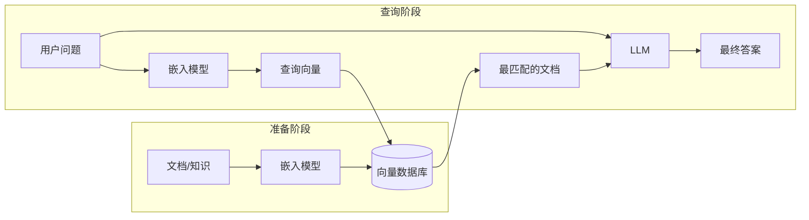
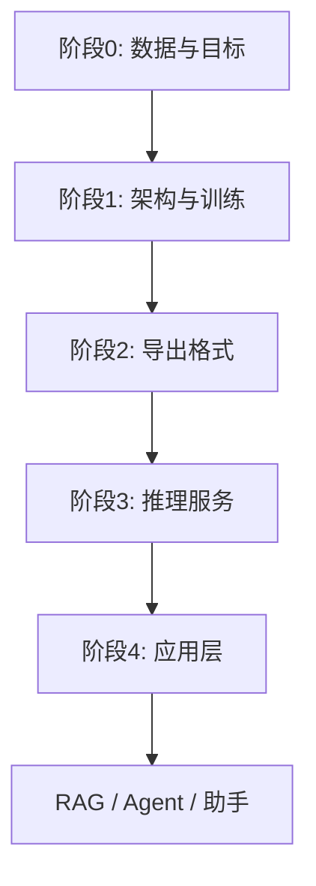
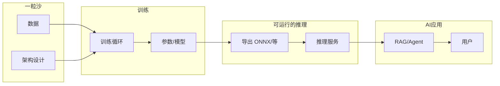

+++
title = "34 - 从模型诞生到 AI 应用：全链路认知"
description = "从「模型是什么」到「AI 应用落地」的端到端认知：模型本质、训练与推理、为何 RAG 更贴近你的理解、原理与业界实践、大模型与传统 ML 的本质区别"
date = 2026-02-11
draft = false
[taxonomies]
tags = ["AI", "大模型", "训练", "推理", "RAG", "Agent", "全链路"]
[extra]
toc = true
+++

## Overview

本文用「从一粒沙子到一颗 CPU」式的思路，从零讲清：**模型到底是什么、如何诞生、如何被训练与利用**，再到**原理上的端到端生命链**与**业界最佳实践中的一条龙实现**，以及**大模型与传统机器学习的本质不同**。目标是让你对「从训练出一个模型到诞生一个 AI 应用」有完整、不跑偏的认知。

> **术语速查**：文中涉及的技术术语均收录在 **[AI & ML 术语表](/articles/00-glossary/glossary-08-ai-ml-concepts/)** 中，点击术语链接即可跳转到详细解释。如果遇到不熟悉的概念，优先查阅术语表。

### 你的问题与扩展话题——是否都覆盖？

| 你的问题 / 延伸 | 章节 | 说明 |
|-----------------|----------|------|
| 模型是什么？不能类比向量数据库的话，比喻成什么更合适？ | I | 先澄清「模型≠向量库」，再给四种更贴切的比喻。 |
| 参数=权重？结构=计算图？训练不改结构？ | I (1.3) | 澄清常见概念混淆：参数≈权重、结构≈架构≈计算图、选型vs训练阶段。 |
| **为什么计算图是「先乘后加再激活」？能打乱顺序吗？** | I (1.2 追问) | 线性可合并→激活打破线性→深度才有意义。线性提取的只是"候选原材料"，激活是由权重精确控制的选择性变换，不是随机打碎。 |
| **什么是激活函数？为什么需要它？ReLU vs Sigmoid？SwiGLU？** | I (1.2 追问) | ReLU 直觉 + Sigmoid 梯度消失 + SwiGLU 软门控直觉。 |
| **为什么需要那么多层？一层不够吗？** | I (1.2 追问) | 组合式学习、参数效率、实践验证。 |
| **为什么初始化用随机数不能全零？** | I (1.2 追问) | 对称性问题 + Xavier/Kaiming。 |
| 模型如何诞生？用什么训练、怎么训练的？ | II | 训练所需五要素 + 训练本质五步 + 流程小结。 |
| **Token 是什么？为什么不按字/词训练？** | II (2.1 追问) | 子词分词的动机：字符太细、词表太大、OOV 问题 → Token 最佳折中。 |
| **为什么需要「损失函数」？不能直接最大化准确率吗？** | II (2.2 追问) | 准确率不可微 → 优化器无方向；损失函数提供连续梯度信号。 |
| **反向传播怎么工作？什么是梯度？** | II (2.2 追问) | 梯度 = 方向 + 幅度；链式法则一次反向算完所有参数的梯度。 |
| **「学习率」是什么？选大了选小了会怎样？** | II (2.2 追问) | 学习率 = 每步走多远；太大震荡、太小太慢；Warmup + Cosine Decay 组合策略。 |
| **为什么训练目标是「预测下一个 token」？** | II (2.2 追问) | 自监督 + 一个目标同时学会语法/语义/逻辑/知识。 |
| **梯度下降会不会卡在局部最优？** | II (2.2 追问) | 高维鞍点、SGD 随机性、Adam 优化器。 |
| **为什么训练要用 GPU？CPU 不行吗？** | II (2.2 追问) | 并行度差异 + 数量级对比。 |
| **怎么知道训练"够了"？** | II (2.2 追问) | 小模型看验证集；大模型按 Scaling Laws 规划 token 预算 + Chinchilla compute-optimal 详解。 |
| 模型如何被利用和推理？ | III | 推理定义 + 四类模型推理举例 + 模型文件里有什么/没有什么。 |
| **为什么 LLM 生成文本那么慢？** | III (3.2 追问) | 自回归串行 + 每步读全部参数 + 因果关系。 |
| **为什么 LLM 会「胡说八道」（幻觉）？** | III (3.2 追问) | 统计模仿 ≠ 理解事实 + RAG 的必要性。 |
| **LLM 怎么从概率分布里选下一个 token？为什么不总选最大的？** | III (3.2 追问) | Temperature、Top-k、Top-p 采样；确定性 vs 创造力的权衡。 |
| **70B 参数的模型有多大？需要多少显存？我的电脑能跑吗？** | III (3.3 追问) | 参数 × 字节数 = 模型大小；FP16/INT8/INT4 对比；消费级 vs 专业卡。 |
| 为什么说 RAG 更符合我的想法？我理解偏到哪里？ | IV | 你的想法简述 → 三点偏差 → RAG 为何更贴近 + 结论。 |
| **嵌入模型怎么做到「语义相近的文本 → 向量接近」？** | IV (4.3 追问) | 正例/负例对训练 + 局限性（语义相近≠答案正确）+ Reranker。 |
| 原理上从 0 到模型再到 AI Agent，生命链如何一步步实现？ | V | 阶段 0～4 分步说明 + 原理链总图。 |
| **为什么 Transformer 取代了 RNN/LSTM？Attention 是什么？** | V (5.2 追问) | RNN 串行+长程遗忘 vs Transformer 全局并行；Attention 直觉（圆桌会议类比）。 |
| **为什么需要导出到 ONNX/GGUF？不能直接用 PyTorch 推理吗？** | V (5.3 追问) | 依赖、性能、跨语言、量化对比；何时用哪种格式。 |
| 业界最佳实践：一条龙如何真实实现？框架、格式(ONNX 等)？ | VI | 训练框架与流程、模型格式表、推理与部署、RAG/Agent 组件、一条龙对应。 |
| 大模型和传统 ML 本质不同？为什么大模型这么成功？ | VII | 传统 ML vs 大模型对比、本质区别表、为何影响更大。 |
| **「涌现」是什么原理？为什么模型会出现「没教过」的能力？** | VII (7.2 追问) | 量变到质变、评估阶梯效应、隐式技能叠加；做菜类比。 |
| **什么时候用 Prompt / 微调 / 从零训练？** | VII (7.2 追问) | 决策流程图：Prompt → RAG → 微调 → 预训练；90% 场景 Prompt+RAG 就够。 |
| **为什么 LLM 改 prompt 就能做不同任务？传统 ML 却要单独训模型？** | VII (7.3 追问) | In-Context Learning + Few-shot Prompting + 预训练隐式学会所有语言模式。 |
| **为什么"堆参数堆数据"就能让模型变好？有上限吗？** | VII (7.4 追问) | Scaling Laws 幂律 + 为什么传统 ML 没有这种效果。 |
| **模型为什么不能全背下来？为什么要泛化？** | VII (7.4 追问) | 过拟合 = 没用 + 梯度下降如何促成「学规律忘噪声」+ 工程保护手段。 |
| 从一粒沙到 CPU：全貌认知 | VIII | 六点总结 + 全链路图。 |

若你**先要建立直觉**，可按 **I → II → III** 顺序读；**对「向量库/推理」纠偏**重点看 **IV**；**看整片森林**看 **V、VIII**；**要落地选型**看 **VI**；**理解为何是今天这样**看 **VII**。

**全文逻辑线（由浅入深）**：  
- 先建立「**模型是什么**」（I），避免与向量库混淆。  
- 再搞清「**从哪来、到哪去**」：训练（II）与推理（III）。  
- 再对接到你的直觉——**RAG**（IV），纠偏并建立正确对应。  
- 再拉通「**从数据到 Agent**」的原理生命链（V）。  
- 再落到**业界怎么做**：框架、格式、部署、RAG/Agent 选型（VI）。  
- 再理解**时代差异**：大模型 vs 传统 ML、为何影响更大（VII）。  
- 最后用**全貌图**收束（VIII）。

---

## I. What is a Model?

### 1.1 模型不是「向量数据库」

- **[向量数据库](/articles/00-glossary/glossary-08-ai-ml-concepts/#4-3-vector-database-xiang-liang-shu-ju-ku)**：存的是**一堆已经算好的向量**，检索时用「查询向量」去比对、找[最近邻](/articles/00-glossary/glossary-08-ai-ml-concepts/#4-4-nearest-neighbor-zui-jin-lin-sou-suo)，返回的是**库里已有的某几条记录**。本质是**存储 + 相似度搜索**。
- **[模型](/articles/00-glossary/glossary-08-ai-ml-concepts/#1-1-model-mo-xing)**：存的是**一组[参数（权重）](/articles/00-glossary/glossary-08-ai-ml-concepts/#1-2-parameters-and-weights-can-shu-yu-quan-zhong)**，定义的是**一个函数**——给定输入，**算**出输出。本质是**可计算的函数**，不是「一堆现成答案等你来查」。

所以：**模型 ≠ 向量数据库**。把模型比喻成向量数据库，会让人误以为「推理 = 在模型里查最匹配的向量」，而真实情况是「[推理](/articles/00-glossary/glossary-08-ai-ml-concepts/#5-5-inference-tui-li) = 把输入喂进模型，做一遍[前向计算](/articles/00-glossary/glossary-08-ai-ml-concepts/#1-3-forward-pass-qian-xiang-ji-suan)得到输出」。这种误解会连带导致：以为训练是在「造一堆向量」、以为 [ONNX](/articles/00-glossary/glossary-08-ai-ml-concepts/#5-1-onnx-open-neural-network-exchange) 里装的是「可被查的库」——实际上训练是在**调一组参数**，ONNX 里装的是**可执行的[计算图](/articles/00-glossary/glossary-08-ai-ml-concepts/#1-6-computational-graph-ji-suan-tu)+权重**。

**为什么容易想到「向量数据库」？** 因为在 [RAG](/articles/00-glossary/glossary-08-ai-ml-concepts/#7-3-rag-jian-suo-zeng-qiang-sheng-cheng) 这类应用里，确实会先「准备一堆向量」、再「用查询向量去比对、找最匹配、再汇总」——整条流程里既有向量又有比对，容易让人以为「模型 = 向量库」。关键区分在于：**向量库是应用里单独存向量、做检索的组件**；**模型是生产向量或生成文本的「函数」**，两者职责不同，不能混为一谈。

### 1.2 模型更合适的比喻

| 比喻 | 说明 |
|------|------|
| **一个函数 / 一个程序** | 输入 → 经过固定计算规则（由参数决定）→ 输出。换参数就换行为，就像换代码就换程序。 |
| **一张「菜谱」+ 一罐「调料配比」** | 菜谱 = 计算图（先乘后加再激活）；调料配比 = 权重。同一菜谱，不同配比做出不同味道；训练就是在调「配比」。 |
| **一块「可编程的电路」** | 结构固定（层、连接方式），可调的是每条线上的「权重」。训练就是调这些权重，直到输入–输出关系符合数据里的规律。 |
| **压缩后的「统计规律」** | 训练数据里蕴含的输入–输出关系，被压缩进有限个参数里；推理时用这些参数把规律「还原」到新输入上。 |

**一句话**：模型 = **由参数决定的、从输入到输出的可计算函数**。训练得到的是「参数」；推理是「用这套参数对任意新输入算一遍」。

**一个极简数值例子（帮助固化直觉）**：假设有一个最简单的线性模型 `y = W·x + b`，输入 `x` 是向量，输出 `y` 是标量；**参数**就是 `W`（矩阵）和 `b`（偏置）。训练就是根据很多个 (x, y) 样本，把 W 和 b 调成合适的值；推理就是**给定新的 x，代入当前的 W 和 b 算一遍得到 y**——没有任何「查表」或「找最像的 x」的步骤，就是纯计算。神经网络无非是很多层这样的运算加非线性（[激活函数](/articles/00-glossary/glossary-08-ai-ml-concepts/#1-4-activation-function-ji-huo-han-shu)）堆叠而成，本质相同：参数固定后，推理 = 代入输入、按层计算、得到输出。

#### 追问：为什么计算图是「先乘后加再激活」？能打乱顺序吗？

上面提到菜谱 = 计算图（先乘后加再激活），这个顺序不是随意规定的：

- **「乘」（W·x）**：用权重矩阵对输入做线性组合——提取特征。
- **「加」（+ b）**：加偏置——调整基准线。
- **「激活」（σ(·)）**：通过非线性函数变换——**打破线性**。

乘 + 加合在一起是一个**仿射变换（affine transformation）**，是数学上不可拆分的线性操作。激活函数必须在线性之后，因为它的作用就是引入非线性。

**如果没有激活函数（只有乘和加）会怎样？**

```
第一层：y₁ = W₁·x + b₁
第二层：y₂ = W₂·y₁ + b₂ = W₂·(W₁·x + b₁) + b₂ = (W₂·W₁)·x + (W₂·b₁ + b₂)
```

**数学上等价于一个单层**：`y = W_合并·x + b_合并`。无论叠多少层乘和加，**都可以合并成一层**。100 层纯线性 = 1 层线性。这就像反复兑水稀释再浓缩——最后和一次性兑到目标浓度没区别。

**有了激活函数**：

```
第一层：y₁ = σ(W₁·x + b₁)      ← σ 打破了线性，无法合并
第二层：y₂ = σ(W₂·y₁ + b₂)      ← 对非线性结果再做线性+非线性
```

**σ 让每一层的结果无法被数学简化合并**——每层都在上一层基础上做了不可逆的非线性变换。这就是深度网络能学复杂模式的根本原因。

**但线性变换不是已经"提取特征"了吗？为什么还要激活去"打碎"它？**

这里有一个常见误解：**线性变换提取到的并不是真正的"特征"——它只是加权求和，表达力极其有限。**

```
线性变换做的事：y = W·x + b = 0.3×输入₁ + 0.1×输入₂ - 0.5×输入₃ + ...
```

这就是把输入的各个维度**按不同权重加在一起**——本质是加权求和。它能表达的关系非常简单：

- "像素 1 亮 + 像素 2 亮 → 特征值高" ✓
- "像素 1 亮 **并且** 像素 2 暗 → 特征值高" ✓（一个权重正、一个负）
- "像素 1 和像素 2 **同时**满足某个复杂模式 → 特征值高" **做不到**

线性组合**无法表达"与/或/非"这类逻辑关系**——而真实世界的特征（猫的耳朵、语言中的否定、市场的拐点）**全都是复杂的非线性组合**。

所以：**线性变换提取的不是"特征"，而是"候选特征的原材料"。激活函数对这些原材料做选择性变换，才产出真正有用的特征。**

**激活是"随机打碎"吗？——绝不是，是精确控制的选择性变换。**

以 ReLU 为例：

```
ReLU(x) = max(0, x)

正值 → 保留（这个特征组合有用，放行）
负值 → 归零（这个特征组合没用，抑制）
```

关键问题：**谁决定了哪些值是正、哪些是负？**

答案：**是 W 和 b——是训练学来的权重。**

```
线性层的输出 = W·x + b
               ↑
         训练过程调整 W 和 b，使得：
         "有用的特征组合" → 产出正值 → ReLU 放行
         "没用的特征组合" → 产出负值 → ReLU 归零
```

**类比**：W 是「考试出题」（决定考什么），激活是「及格线」（60 分以上留下，以下淘汰）。及格线本身是固定的规则，但**哪些学生过线、哪些被淘汰，完全取决于题目（W）和学生能力（x）**。所以"打碎"不是随机的，而是**由学到的权重精确控制的有目的筛选**。

**多层"组合 → 筛选"才能构建复杂特征**（以图像识别为例）：

```
第1层（线性+激活）：原始像素 → 加权组合 → 激活筛选 → "边缘"
第2层（线性+激活）：边缘 → 加权组合 → 激活筛选 → "角""弧线"
第3层（线性+激活）：角和弧线 → 加权组合 → 激活筛选 → "眼睛""耳朵"
...
最后一层：眼睛+耳朵+轮廓 → "这是猫"
```

**每一层都在做"组合原材料 → 选择性保留 → 产出更高级的特征"**。没有激活（只有线性），所有层合并为一层，直接从像素到"猫"做一次加权求和——就像试图把 100 万个像素值直接加起来就判断是不是猫，这显然不可能。

**为什么打破线性？——因为世界是"弯的"。**

**线性函数只能画直线（或高维的平面）**——无论怎么组合、叠加，结果永远是直线。但现实世界的关系**几乎都不是直线**：

| 任务 | 真实的输入→输出关系 | 线性能处理吗？ |
|------|-------------------|-------------|
| 图像识别 | 几百万像素 → "这是一只猫" | 不能。"猫"的像素模式极其复杂 |
| 语言理解 | "不好吃" → 负面情绪 | 不能。"不"反转了"好吃"的含义，是非线性逻辑 |
| 预测下一个词 | "太阳从东方" → "升起" | 不能。语义关联不是简单的线性映射 |

**一句话：线性 = 只能画直线，但世界是弯的。打破线性 = 让模型能画任意曲线，才能拟合真实世界的复杂关系。**

想象在一张图上画一条线分开红点和蓝点：
- **线性模型**：只能画**直线**。如果红蓝点的分界是弯的（比如一个圆），直线怎么画都分不开。
- **加了激活的多层模型**：可以画**任意曲线**——圆、螺旋、不规则形状。层数越多，曲线越复杂。

**完整逻辑链**：

```
"乘和加"做了什么？     → 线性组合：产出候选特征的"原材料"（加权求和）
"激活"做了什么？       → 选择性变换：由权重精确控制，保留有用的、抑制没用的 → 产出真正的特征
为什么不能只要线性？   → 线性只能画直线，世界是弯的 → 需要非线性才能拟合复杂关系
为什么要多层？         → 每层"组合→筛选"构建更高级特征：像素→边缘→形状→物体
为什么不能去掉激活？   → 没有激活 → 100层 = 1层 → 只能做一次加权求和 → 永远学不到复杂特征
```

**所以**：
- **层内顺序不能打乱**——乘和加是线性操作的两部分，激活必须在其后
- **可以堆叠很多层**——每层重复「线性 → 激活」，层数越多表达能力越强
- **不加激活的多次乘加 = 一次乘加**，没有意义；**加了激活才让"深度"有价值**

用菜谱类比：「乘和加」= 称量和混合食材；「激活」= 加热烹饪。反复混合生料还是生料；**过了火（非线性）才发生化学变化**，产生新味道和质感。每层都要"过一道火"，深度才有意义。

#### 追问：什么是激活函数？为什么需要它？常见的有哪些？

**激活函数**是一个简单的非线性数学函数，把线性计算的结果"扭"一下。上面已经解释了「为什么需要打破线性」（世界是弯的，线性只能画直线），这里具体看激活函数本身。

**最经典的 ReLU**：

```
ReLU(x) = max(0, x)

输入:  -3  -1   0   2   5
输出:   0   0   0   2   5
       ↑负数全部砍零   ↑正数原样保留
```

就这么简单：负数变零，正数不变。这个看似简单的操作，足以让多层网络具备学习任意复杂函数的能力（**万能近似定理**）。

**为什么不用更早的 Sigmoid？**

| 对比 | Sigmoid `1/(1+e^-x)` | ReLU `max(0,x)` |
|------|----------------------|------------------|
| 输出范围 | (0, 1) | [0, +∞) |
| 计算量 | 指数运算，较慢 | 一次比较，极快 |
| 梯度消失 | **严重**：两端梯度趋近 0，深层网络梯度传不回去 | 正区间梯度恒为 1，不会消失 |
| 适合深度网络 | 不适合（>5 层就很难训） | **非常适合**，这是深度学习起飞的关键之一 |

**直觉**：Sigmoid 像一个被压扁的 S 曲线——输入稍大或稍小，输出就"饱和"了（接近 0 或 1），梯度接近零，深层的参数收不到更新信号。ReLU 在正区间是一条直线（梯度=1），信号可以无损传递到很深的层。**ReLU 让深度学习真正可行，是 2012 年之后深度学习复兴的关键技术之一**。

**当前 LLM 用的 SwiGLU 是什么？**

SwiGLU 是 GLU（Gated Linear Unit）家族的一种，用在 Transformer 的 FFN 层中，比 ReLU 效果更好：

```
SwiGLU(x) = Swish(xW₁) ⊙ (xW₂)
Swish(x) = x · sigmoid(x)
```

**直觉**：SwiGLU 有两条路径——一条用 Swish 做「门控」（决定哪些信息通过），另一条做线性变换，两者**逐元素相乘**。相比 ReLU 的"硬开关"（负数直接归零），SwiGLU 的"软门控"更平滑，让模型学到更细腻的特征。LLaMA、Qwen、Mistral 等当前主流 LLM **全部**使用 SwiGLU。

详见术语表 **[Activation Function](/articles/00-glossary/glossary-08-ai-ml-concepts/#1-4-activation-function-ji-huo-han-shu)**。

#### 追问：为什么模型需要那么多层？一层不够吗？

**理论上一层就能近似任何函数**（万能近似定理），但需要的神经元数量可能是**天文数字**。**多层**的优势：

- **组合式学习**：底层学简单特征（边缘、笔画、常见词组），高层组合成复杂概念（人脸、语法、推理链）。类似编程中的函数分层——不需要一个巨大函数做所有事。
- **参数效率**：32 层 × 每层 4096 维 的网络，比 1 层 × 百万维 的网络参数少得多，且学得更好。
- **实践验证**：ResNet、Transformer 等实验反复证明，**增加深度**比增加宽度更有效——深层网络能用更少参数学到更复杂的函数。

LLaMA 3 8B 有 **32 层**，每层做一次「Attention + FFN（含激活）」；GPT-4 据推测有 **120 层**。深度 = 表达能力。

#### 追问：为什么参数初始化用随机数？全部设为 0 不行吗？

**不行**。如果所有参数都初始化为 0（或同一个值）：

- 每个神经元的输入完全相同 → 输出完全相同 → 梯度完全相同 → 更新后参数仍然完全相同
- **所有神经元永远保持一致**，等于只有一个神经元——这叫**对称性问题**，模型无法学到任何有用的东西

**随机初始化打破了对称性**：每个神经元起点不同 → 看到不同的梯度 → 学到不同的特征。常用方案：
- **Xavier 初始化**：适合 Sigmoid/Tanh 激活，保持前向和反向信号方差不变
- **Kaiming (He) 初始化**：适合 ReLU 系激活，考虑了 ReLU 砍掉一半值的影响

### 1.3 常见疑问澄清

> 这一节集中回答几个初学者容易产生的疑问，帮助彻底固化「模型 = 结构 + 参数」的核心认知。

#### 「参数」和「权重」到底是不是同一回事？

**几乎等价**。严格来说，参数 = 权重（W）+ 偏置（b）+ 其他可训练张量。但业界习惯上「参数」和「权重」混用：说「这个模型有 70 亿参数」和「70 亿权重」表达的是同一件事。所以当你看到「模型 = 结构 + 参数」，这里的「参数」就是指**所有可调的数字**。不存在「参数是一回事、权重是另一回事」的情况——它们是同义词。

> 详见术语表：[Parameters and Weights (参数与权重)](/articles/00-glossary/glossary-08-ai-ml-concepts/#1-2-parameters-and-weights-can-shu-yu-quan-zhong)

#### 「结构」「架构」「计算图」三者什么关系？

三者密切相关，实践中经常互换：

| 术语 | 含义 | 类比 |
|------|------|------|
| **架构 (Architecture)** | 人设计的「蓝图」——几层、每层什么类型、怎么连接 | 设计图纸 |
| **结构 (Structure)** | 和架构含义几乎相同，指模型的拓扑形状 | 同上 |
| **[计算图 (Computational Graph)](/articles/00-glossary/glossary-08-ai-ml-concepts/#1-6-computational-graph-ji-suan-tu)** | 架构的**可执行表示**——把蓝图翻译成具体的运算节点和数据流 | 施工完成后的电路板 |

你可以理解为：**架构是设计图纸，计算图是施工完成后的电路板**。日常讨论中说「模型结构」「模型架构」「模型的计算图」基本是同一个东西。

#### 训练阶段计算图（结构）真的不变吗？

**是的**，训练阶段计算图固定。一旦选定架构（如 12 层 Transformer、hidden_size=768），计算图就锁定了。训练过程中**不会**改变层数、连接方式或运算类型——只会反复调参数值。

但在**训练之前**有一个**架构选型/设计阶段**（也叫 NAS — Neural Architecture Search，或人工试验），研究者会反复尝试不同的架构组合（层数、注意力头数、MLP 维度等），每次改架构就是改计算图。**选定后锁定，才开始训练**。

```
架构选型阶段（可改结构）
  → 确定架构（如 LLaMA-7B: 32层, hidden=4096, heads=32）
  → 锁定计算图
  → 训练阶段（只改参数，不改结构）
  → 得到模型
```

所以你的理解是正确的：**选型阶段改结构，训练阶段不改结构**。就像盖房子——设计阶段可以改图纸，施工开始后就按图纸走，只是不断往里面填材料（参数）。

**由浅入深小结**：先记住「模型 = 可计算的函数，不是现成答案库」；「参数 ≈ 权重，两者混用」；「结构/架构/计算图 ≈ 同一概念，训练阶段固定，选型阶段可变」。下一节会具体说这些「参数」是怎么来的（训练），再下一节说怎么用（推理）。

---

## II. How is a Model Born?

### 2.1 训练需要什么

- **数据**：输入–输出对（监督）或纯输入（无监督/[自监督](/articles/00-glossary/glossary-08-ai-ml-concepts/#8-2-self-supervised-learning-zi-jian-du-xue-xi)）。例如：  
  - 图像分类：(图像, 类别)  
  - [LLM](/articles/00-glossary/glossary-08-ai-ml-concepts/#3-3-llm-da-yu-yan-mo-xing)：大量文本，用「前文预测下一个 [token](/articles/00-glossary/glossary-08-ai-ml-concepts/#3-1-token-ci-yuan)」自监督。  
- **模型结构（架构 / [计算图](/articles/00-glossary/glossary-08-ai-ml-concepts/#1-6-computational-graph-ji-suan-tu)）**：层数、每层类型（Linear、Attention、Conv 等）、[激活函数](/articles/00-glossary/glossary-08-ai-ml-concepts/#1-4-activation-function-ji-huo-han-shu)、连接方式等。**结构是人事先设计好的**，训练不改结构，只改**参数**（即权重+偏置，详见 [1.3 常见疑问澄清](#1-3-chang-jian-yi-wen-cheng-qing)）。  
- **[损失函数](/articles/00-glossary/glossary-08-ai-ml-concepts/#1-5-loss-function-sun-shi-han-shu)**：衡量「模型当前输出」和「期望输出」差多少。训练目标 = 最小化损失。  
- **[优化器](/articles/00-glossary/glossary-08-ai-ml-concepts/#2-5-optimizer-you-hua-qi)**：在参数空间里怎么「走」才能让损失下降（如 SGD、Adam）。  
- **算力**：**GPU**/集群，做大量矩阵运算和[梯度](/articles/00-glossary/glossary-08-ai-ml-concepts/#2-2-gradient-ti-du)反传。

**「参数」长什么样？** 参数就是模型里所有可调的**数字**，通常组织成**矩阵/张量**。例如一个线性层有「权重矩阵 W」和「偏置 b」；[Transformer](/articles/00-glossary/glossary-08-ai-ml-concepts/#3-4-transformer) 里每层有 Q/K/V 的权重、MLP 的权重等。小模型几百万个参数，大模型几百亿到万亿级。训练前后**结构不变**，变的就是这些数字的取值。

**参数一开始从哪来？** 训练开始前，参数需要**初始化**——常用随机初始化（如 Xavier、Kaiming），或加载已有[预训练](/articles/00-glossary/glossary-08-ai-ml-concepts/#8-1-pre-training-yu-xun-lian)权重再继续训（[微调](/articles/00-glossary/glossary-08-ai-ml-concepts/#7-2-fine-tuning-wei-diao)）。不会「没有参数」：结构定义了多少个参数，就会先填上初始值，再通过训练一步步更新到收敛。

#### 追问：Token 是什么？为什么不直接按「字」或「词」训练？

文章中反复出现「[token](/articles/00-glossary/glossary-08-ai-ml-concepts/#3-1-token-ci-yuan)」，它是 LLM 处理文本的**最小单位**——但既不是字符，也不是词，而是介于两者之间的**子词片段（subword）**。

**为什么不按字符训练？**
- 字符粒度太细：英文 26 个字母 + 标点，每个字母没有语义——模型要花大量算力从字母拼出词、再理解词义。序列极长（一句话 = 几十上百个字符），计算成本高。

**为什么不按词训练？**
- 词表太大：英语有几十万个词，加上变形（running/runs/ran）、专有名词、中文词组合更是天文数字。
- **OOV 问题**（Out-of-Vocabulary）：训练时没见过的新词（如"ChatGPT"）完全无法处理——模型连输入都编码不了。

**Token（子词）= 两者的最佳折中**：

| 方案 | 词表大小 | 序列长度 | OOV | 语义颗粒度 |
|------|---------|---------|-----|-----------|
| 字符 | ~100 | 很长 | 无 | 太细，无语义 |
| 词 | ~500K+ | 短 | **严重** | 好，但覆盖不全 |
| **子词 (Token)** | **32K~128K** | **适中** | **几乎无** | **好的平衡** |

**举例**（BPE 分词）：
```
"unhappiness" → ["un", "happiness"]    ← 常见前缀和词干各为一个 token
"ChatGPT"    → ["Chat", "G", "PT"]     ← 新词被拆成已知子词，不会 OOV
"你好世界"    → ["你好", "世界"]          ← 中文常见词组合为一个 token
```

**核心思想**：高频词（"the"、"你好"）整个成为一个 token；低频/新词被拆成已知的子词片段 → **词表可控 + 无 OOV + 序列长度适中**。这就是为什么 LLM 的输入输出都以 token 为单位，而不是字或词。

详见术语表 **[Token](/articles/00-glossary/glossary-08-ai-ml-concepts/#3-1-token-ci-yuan)** 和 **[Tokenizer](/articles/00-glossary/glossary-08-ai-ml-concepts/#3-2-tokenizer-fen-ci-qi)**。

### 2.2 训练在做什么（本质）

1. **[前向传播](/articles/00-glossary/glossary-08-ai-ml-concepts/#1-3-forward-pass-qian-xiang-ji-suan)**：拿**一个 [batch](/articles/00-glossary/glossary-08-ai-ml-concepts/#2-7-batch)** 的数据，用**当前参数**从第一层算到最后一层，得到预测输出。  
2. **算损失**：用[损失函数](/articles/00-glossary/glossary-08-ai-ml-concepts/#1-5-loss-function-sun-shi-han-shu)比较「模型预测」和「真实标签/目标」，得到一个标量（损失值）。损失越大说明当前参数越差。  
3. **[反向传播](/articles/00-glossary/glossary-08-ai-ml-concepts/#2-3-backpropagation-fan-xiang-chuan-bo)**：从损失往回算，得到**每个参数**对损失的**[梯度](/articles/00-glossary/glossary-08-ai-ml-concepts/#2-2-gradient-ti-du)**（即：这个参数往哪个方向、改变多少，能让损失下降）。  
4. **更新参数**：[优化器](/articles/00-glossary/glossary-08-ai-ml-concepts/#2-5-optimizer-you-hua-qi)根据梯度和历史信息，按一定步长更新每个参数。  
本质上是**[梯度下降](/articles/00-glossary/glossary-08-ai-ml-concepts/#2-4-gradient-descent-ti-du-xia-jiang)**：沿梯度反方向更新参数，使损失一步一步变小，直到收敛。  
5. 重复 1～4：通常会把整个数据集扫多遍（每遍叫一个 [epoch](/articles/00-glossary/glossary-08-ai-ml-concepts/#2-6-epoch)），每遍里按 batch 一批批算；**一步** = 一个 batch 的前向+反传+更新。训练很多步直到损失足够低或收敛。

**为什么要用 batch，而不是一次用全量数据？** 全量数据一起算会占满[显存](/articles/00-glossary/glossary-08-ai-ml-concepts/#2-8-vram-xian-cun)/内存，且梯度往往用「一个 batch 的平均」就足够估计方向了；用 batch 还能带来一定的随机性，有利于泛化。所以实际训练是「小步快跑」：每步只看一批样本，更新一次参数，再换下一批。

**结果**：你得到的是**一组确定下来的参数**（权重）。这组参数 + 固定的模型结构，就构成了「模型」——一个输入→输出的函数。保存下来就是「模型文件」（如 `.pt`、`.onnx`、`.gguf`），里面主要是参数（和描述结构的元数据），**不是**一堆向量等着被查。

#### 追问：为什么 LLM 的训练目标是「预测下一个 token」？

因为这个目标**不需要人工标注**（自监督）——任何文本都天然包含「前文→下一个词」的信号。而且这个看似简单的任务，**迫使模型学会语言的全部规律**：

- 要预测下一个词，模型必须理解**语法**（"他" 后面大概率是动词）
- 必须理解**语义**（"太阳从东方" 后面大概率是"升起"）
- 必须理解**逻辑**（"如果 A 则 B，已知 A，所以" 后面大概率是 "B"）
- 必须记住**事实**（"中国的首都是" → "北京"）

一个训练目标，同时学会了语法、语义、逻辑和知识——这就是为什么"预测下一个 token"虽然简单，却极其有效。

#### 追问：为什么需要「损失函数」？不能直接最大化准确率吗？

**不能**。直觉上"直接优化准确率"最直接，但有一个致命问题——**准确率不可微（不可求梯度）**。

**准确率的问题**：

```
准确率 = 答对的数量 / 总数量
```

准确率是一个**阶梯函数**——模型输出从 0.49 变到 0.51（跨过 0.5 的分界线），准确率从 0 跳到 1；但从 0.01 变到 0.49，准确率一直是 0。**梯度要么为零、要么不存在**——优化器完全不知道该往哪个方向调参数。

**损失函数的作用**：把"答对/答错"变成一个**连续、可微**的数值，让梯度下降有方向可走：

| 场景 | 准确率 | 交叉熵损失（常用损失函数） |
|------|--------|------------------------|
| 模型预测 0.51（勉强对） | 1（全对） | 0.67（还有改进空间） |
| 模型预测 0.99（非常确信且对） | 1（全对） | 0.01（很好了） |
| 模型预测 0.49（勉强错） | 0（全错） | 0.71（稍差） |
| 模型预测 0.01（非常确信且错） | 0（全错） | 4.6（非常差） |

**关键区别**：准确率只区分"对/错"两个状态；损失函数区分"多对/多错"的**程度**——梯度可以从"多错"一步步引导到"多对"。

**类比**：准确率像考试的"及格/不及格"——60 分和 59 分天差地别，但 60 分和 99 分没区别。损失函数像"扣了多少分"——59 分知道"差 1 分就及格了"，99 分知道"几乎完美了"。**优化器需要"扣了多少分"的信息才能知道怎么改进**。

#### 追问：反向传播怎么工作？什么是梯度？为什么它能让模型学习？

**梯度 = 方向 + 幅度**：告诉你"把这个参数往哪个方向调、调多少，能让损失下降最快"。

**直觉**：想象你蒙着眼站在一个山坡上，要走到最低点（损失最小）。你**伸脚感受周围的坡度**——哪个方向最陡？坡度多大？然后**朝下坡方向迈一步**。这就是梯度下降的一步。

**反向传播 = 高效算梯度的方法**。模型有几十亿个参数，每个参数都需要知道自己对损失的影响。暴力做法是每个参数微调一下看 loss 变了多少——70 亿参数就要做 70 亿次前向计算，不可行。

**反向传播的巧妙之处——链式法则**：

```
模型：输入 → 第1层 → 第2层 → ... → 第N层 → 损失

反向传播：
  损失对第N层输出的梯度  （直接算）
  × 第N层输出对第N层参数的梯度  （本层导数）
  = 损失对第N层参数的梯度  ✓

  再往回传：
  损失对第N层输入的梯度  （已知）
  × 第(N-1)层的导数
  = 损失对第(N-1)层参数的梯度  ✓

  ...一路传到第1层
```

**一次前向 + 一次反向 = 所有参数的梯度全部算完**。时间复杂度和前向计算差不多（约 2~3 倍），而不是 70 亿倍。这就是为什么反向传播是深度学习的核心算法——**没有它，训练大模型在计算上就不可能**。

**完整的一步训练**：
1. **前向**：输入经过每一层 → 得到预测 → 算损失（一个数字）
2. **反向**：从损失出发，用链式法则逐层回传 → 得到每个参数的梯度
3. **更新**：每个参数 -= 学习率 × 梯度（往下坡方向走一小步）
4. 重复几十万到几百万步 → 参数收敛 → 模型训好

#### 追问：「学习率」是什么？选大了选小了会怎样？

上面说「每个参数 -= 学习率 × 梯度」——**学习率（learning rate）**就是每步走多远。

```
参数_new = 参数_old - 学习率 × 梯度
                      ↑
              这个数字通常很小，如 0.001、0.0001
```

**选大了**：每步走太远 → 容易"跨过"最优点 → 损失来回震荡甚至爆炸（loss 突然飙到天文数字）。就像下山时每步跳 10 米，直接跳过山谷跳到对面山坡上去了。

**选小了**：每步走太小 → 收敛极慢 → 训练要花几倍时间和算力。就像下山时每步挪 1 毫米，方向是对的但永远走不到底。

**实际怎么选？**

| 策略 | 做法 | 说明 |
|------|------|------|
| **经验值** | 常从 1e-4 ~ 3e-4 开始 | Adam 优化器的默认学习率 |
| **Warmup** | 前几百步从很小的值线性增大到目标值 | 避免初始阶段参数剧烈震荡 |
| **Cosine Decay** | 训练过程中学习率按余弦曲线逐渐衰减 | 后期步子越小越精细，收敛更稳 |
| **学习率调度器** | 结合 Warmup + Decay 的完整方案 | 当前 LLM 训练标配 |

**一句话**：学习率 = 每步走多远。太大会跳过最优点，太小会走不到。实际用 Warmup（先慢后快）+ Cosine Decay（后期逐渐减速）的组合策略，让训练既稳定又高效。

#### 追问：梯度下降会不会「走到坑里出不来」（局部最优）？

**理论上会**——梯度下降只保证找到局部最优，不保证全局最优。但在**大模型实践中**，这个问题几乎不存在，原因：

- **高维空间**：70 亿参数 = 70 亿维空间。在高维中，"所有方向都是上坡"的局部最小值**极其罕见**；大部分"看起来是坑"的点实际上是**鞍点**（某些方向上坡、某些方向下坡），梯度下降可以逃出去。
- **SGD 的随机性**：每次只用一个 batch 估计梯度，引入的噪声反而帮助跳出浅坑。
- **Adam 等优化器**：利用梯度的一阶和二阶矩估计，能更聪明地绕过平坦区域。
- **经验事实**：大模型训练中，loss 曲线通常是**平滑下降**的，很少卡在某个点不动。

#### 追问：为什么训练一定要用 GPU？CPU 不行吗？

**CPU 不是不行，是太慢了**。核心原因是**并行度**：

| 硬件 | 核心数 | 擅长 | 类比 |
|------|-------|------|------|
| **CPU** | 4~128 核 | 每个核很强，擅长**复杂逻辑**（分支、递归） | 4 个数学教授 |
| **GPU** | 数千~上万核 | 每个核较弱，但**大量并行做同一种运算** | 1 万个小学生同时做加法 |

神经网络的核心运算是**矩阵乘法**——把同一个操作重复几十亿次。这正是 GPU 最擅长的：让上万个核**同时**做乘加运算。

**数量级差异**：训练 LLaMA 2 70B 用了约 **1,720,320 GPU·小时**（A100）。如果用 CPU，同样的训练需要**几百年**。这就是为什么 AI 训练**必须**用 GPU（或 TPU 等加速器）。

#### 追问：怎么知道模型训练"够了"？什么时候停？

**小模型（传统 ML / 小型深度学习）——看验证集损失**：

- **训练集损失**持续下降是正常的——模型在"记"训练数据。
- **验证集损失**（模型没见过的数据）才是关键指标。如果训练集损失还在降，但验证集损失开始**上升**，说明模型在"背答案"（过拟合），该停了。
- **Early Stopping**：当验证集损失连续 N 步不再下降 → 自动停止训练。这是最常用的策略。

**大模型（LLM）——按 token 预算**：

大模型训练成本极高（数百万到数千万美元），不可能"训着看效果再决定停不停"。实际做法是**提前规划好训练预算**：

1. **Scaling Laws 告诉你最优配比**：给定总算力 C，Chinchilla 法则表明最优的分配是让**参数量 N** 和**训练 token 数 D** 按特定比例增长。经验公式：`D_optimal ≈ 20 × N`（70B 模型 → 约 1.4T tokens）。
2. **Compute-optimal 的含义**：不是"训越多越好"，而是"在固定算力下，参数和数据有最优配比"。参数太多数据太少 = 模型没见够数据，欠拟合；数据太多参数太少 = 模型记不住，浪费算力。**Chinchilla 的核心发现**：之前的模型（如 GPT-3 175B 只用了 300B tokens）参数偏大、数据偏少，"没喂饱"。
3. **实践中**：Meta 训 LLaMA 3 时用了远超 Chinchilla 建议的 token 数（15T tokens for 70B 模型），因为**推理成本也很重要**——训练多花一些，但得到一个更小更聪明的模型，推理时省更多。所以 Chinchilla 法则是**下限参考**，实际训练量往往更大。
4. **监控指标**：训练过程中持续监控 loss 曲线是否平滑下降、是否出现 loss spike（突然跳高），但通常不会因为 loss"看起来还在降"就继续训——**预算到了就停**，因为 Scaling Laws 已经告诉你回报率在递减。

**一句话**：小模型看验证集 loss 决定停否；大模型**提前按 Scaling Laws 规划 token 预算**，到了就停——训练是**工程化、可预测的**，不是"碰运气"。

### 2.3 小结：模型诞生的流程（原理）

```
数据 + 模型架构(人设计) + 损失函数 + 优化器
        ↓
    迭代（多 epoch，每步一个 batch）：
        前向(当前参数 → 预测) → 损失(预测 vs 真实) → 反传(算梯度) → 更新参数
        ↓
    得到「一组参数」= 模型（可保存为 .pt / ONNX / GGUF 等格式）
```

**由浅入深**：到这里你已经知道「模型 = 结构 + 参数」「训练 = 调参数使损失变小」。下一节看这组参数**怎么被用**——推理。

---

## III. How is a Model Used? — Inference

### 3.1 推理在做什么

- **[推理（Inference）](/articles/00-glossary/glossary-08-ai-ml-concepts/#5-5-inference-tui-li)**：拿已经训练好的**固定参数**，对**新的、从未见过的输入**做**一次或多次[前向计算](/articles/00-glossary/glossary-08-ai-ml-concepts/#1-3-forward-pass-qian-xiang-ji-suan)**，得到输出。  
- **不做**：不更新参数、不查表、不在「模型里找最像的向量」。就是**算**：输入 → 模型(参数) → 输出。

**训练和推理用同一套参数**：训练结束后，参数就**冻结**了；推理时只是**读取**这组参数做前向计算，**不会**再写回或更新。所以「模型文件」本质上就是这组参数的持久化；加载到内存/显存后，推理服务就反复用同一份参数服务无数请求。

### 3.2 不同模型类型的推理举例

| 模型类型 | 输入 | 输出 | 推理在干嘛 |
|----------|------|------|------------|
| 图像分类 | 一张图 | 类别 / 概率 | 前向算一遍，取概率最大的那一类 |
| [LLM](/articles/00-glossary/glossary-08-ai-ml-concepts/#3-3-llm-da-yu-yan-mo-xing) | 当前文本上下文 | 下一个 token 的概率分布 | 前向算一遍得到概率分布，按[采样策略](/articles/00-glossary/glossary-08-ai-ml-concepts/#3-6-sampling-cai-yang-ce-lue)选一个 token 拼到上下文末尾，再做下一次前向……如此[自回归](/articles/00-glossary/glossary-08-ai-ml-concepts/#3-5-autoregressive-zi-hui-gui)循环。生成 N 个 token 就要做 **N 次**前向计算，所以长回答更耗算力、更慢。 |
| [嵌入模型](/articles/00-glossary/glossary-08-ai-ml-concepts/#4-2-embedding-model-qian-ru-mo-xing) | 一段文本 | 一个[向量](/articles/00-glossary/glossary-08-ai-ml-concepts/#4-1-embedding-qian-ru) | 前向算一遍，取最后一层或某层作为这段文本的「向量表示」；语义相近的文本，向量会接近。常用于检索、聚类。 |
| 序列到序列(Seq2Seq) | 源序列 | 目标序列 | 编码器前向 + 解码器自回归 |

共同点：都是**用同一套参数、对输入做数学运算**，得到输出；没有「在模型内部做向量比对」这一步。

#### 追问：为什么 LLM 生成文本那么慢？不能一次输出全部吗？

**不能**。LLM 是[自回归](/articles/00-glossary/glossary-08-ai-ml-concepts/#3-5-autoregressive-zi-hui-gui)模型——每次只生成**一个 token**，然后把它拼到输入末尾，再算下一个。就像写作文：每写一个字都要重新通读前文、决定下一个字。

- 生成 100 个 token → 要做 **100 次前向计算**
- 生成 1000 个 token → **1000 次**
- 每次计算都要读取模型的全部参数（几十 GB）→ **受显存带宽限制**

这就是为什么 ChatGPT 的回答是"一个字一个字蹦出来"的——不是故意做打字机效果，而是**物理上就是一个 token 一个 token 算出来的**。

**为什么不能并行生成？** 因为第 N 个 token 的生成**依赖于前 N-1 个 token 的内容**（包括模型自己刚生成的）。因果关系决定了必须串行。这也是为什么推理优化（KV Cache、投机解码等）是当前工程热点。

#### 追问：为什么 LLM 会「胡说八道」（幻觉）？

LLM 的训练目标是「让下一个 token 的概率分布接近训练数据的分布」——本质是**统计模仿**，不是**理解事实**。

- **模型不「知道」什么是真假**：它只知道「在训练数据中，"法国的首都是巴黎"这个序列出现的概率很高」。
- **超出训练数据的问题**：如果训练数据中没有答案，模型仍会生成**看起来流畅但内容错误**的回答——因为它的目标是"让输出看起来像训练数据"，而不是"输出正确答案"。
- **统计填空的本质局限**：模型是在做超高维的"完形填空"，有时候多个"看起来合理"的填法概率接近，模型选了错的那个。

**这就是为什么 RAG 很重要**：不依赖模型"记住"所有知识，而是实时检索外部文档，把事实喂给模型，大幅减少幻觉。

#### 追问：LLM 每步输出一个概率分布——怎么从里面选下一个 token？为什么不总选概率最大的？

上面说 LLM"每步输出下一个 token 的概率分布"——比如词表有 32000 个 token，模型给每个 token 一个概率。怎么选？

**如果总选概率最大的（argmax / greedy decoding）**：
```
输入："今天天气"
模型输出概率：{真:0.35, 很:0.30, 不:0.15, 格:0.01, ...}
总选最大 → "真" → "好" → "。"

结果永远是："今天天气真好。"  ← 每次都一样，毫无变化
```

问题：**输出完全确定、毫无创造力**——每次问同一个问题得到完全相同的回答。写代码可能还行，写故事就废了。

**实际做法——带随机性的采样**：

| 策略 | 做法 | 效果 |
|------|------|------|
| **Temperature** | 调整概率分布的"尖锐度"。T<1 → 分布更尖（高概率更突出，更确定）；T>1 → 分布更平（低概率也有机会，更随机） | T=0 ≈ argmax；T=0.7 常用于对话；T=1.0 用于创作 |
| **Top-k** | 只从概率最高的 k 个 token 里选 | k=50：排除概率极低的噪声词 |
| **Top-p (nucleus)** | 只从累积概率达到 p 的最小 token 集合里选 | p=0.9：动态选集，有时只选 5 个，有时选 100 个 |

**直觉**：

```
Temperature 低（如 0.2）= "谨慎模式"：几乎只选概率最高的 → 输出稳定、重复
Temperature 高（如 1.2）= "创意模式"：低概率词也有机会 → 输出多样、偶尔出奇
```

**这就是为什么同一个问题每次回答可能不同**——不是模型"变了"（参数始终不变），而是采样引入了随机性。ChatGPT 的"Temperature"设置就是在调这个。

**工程师视角**：你用 OpenAI API 时设置的 `temperature`、`top_p` 参数，就是在控制这个采样过程。代码补全场景通常用低 temperature（要准确），创意写作用高 temperature（要多样）。

### 3.3 模型文件里有什么、没有什么

- **有**：模型结构描述（[计算图](/articles/00-glossary/glossary-08-ai-ml-concepts/#1-6-computational-graph-ji-suan-tu)）+ 参数（权重）。  
- **没有**：训练数据、向量库、历史查询结果。  
推理时只依赖「结构 + 参数」；向量库（若用到）是**应用层单独维护**的，不属于模型本身。

#### 追问：70B 参数的模型有多大？需要多少显存？我的电脑能跑吗？

这是工程师最实际的问题。简单算法：

```
模型大小 ≈ 参数量 × 每个参数的字节数

FP32（32位浮点）：70B × 4 bytes = 280 GB    ← 训练时的原始精度
FP16（16位浮点）：70B × 2 bytes = 140 GB    ← 常见推理精度
INT8（8位整数） ：70B × 1 byte  =  70 GB    ← 量化后
INT4（4位整数） ：70B × 0.5 byte = 35 GB    ← 激进量化
```

**实际需要的显存**（推理）：

| 模型 | 参数量 | FP16 | INT4 量化 | 能跑在哪？ |
|------|--------|------|-----------|-----------|
| LLaMA 3 8B | 8B | ~16 GB | ~5 GB | **消费级显卡**（RTX 4090 24GB） |
| LLaMA 3 70B | 70B | ~140 GB | ~35 GB | 需要 **2×A100 80GB** 或 **4×RTX 4090** |
| GPT-4 (推测) | ~1.8T MoE | ~3.6 TB | ~900 GB | 需要 **集群**（几十到上百张卡） |

**你的电脑能跑吗？**
- **RTX 4090（24GB 显存）**：FP16 可跑 8B 级模型；INT4 量化可勉强跑 13B~30B 级。
- **普通笔记本（无独显/8GB 显存）**：只能用 CPU 跑 7B INT4（llama.cpp），速度较慢但可用。
- **云端 A100（80GB）**：FP16 跑 70B 需要 2 张；INT8 一张勉强够。

**关键认知**：推理时模型的**全部参数**必须加载到显存（或内存）中——因为每一步前向计算都要读全部参数。这就是为什么大模型推理对显存要求这么高，也是为什么**量化**（把参数从 FP16 压到 INT4）是当前推理工程的核心技术之一。

**由浅入深**：到这里「模型是什么、怎么来的、怎么用」已经闭环。下面把你之前的「向量库+比对+汇总」直觉，对接到真实的**应用形态**——RAG。

---

## IV. Why RAG Matches Your Intuition

### 4.1 你之前的想法（简述）

- 训练侧 ≈ 准备一个「向量数据库」，把这个「向量数据库」以 ONNX 形式给推理侧。  
- 推理侧用这个「ONNX 数据库」比对查询向量，找最匹配的向量，再汇总结果。

### 4.2 偏差在哪里

- **训练产出的不是向量库**：训练产出的是**模型**（例如嵌入模型），ONNX 是这个模型的格式，不是「存好的一堆向量」。  
- **推理不是「在 ONNX 里查向量」**：推理是「用 ONNX 模型算输出」；**向量比对**发生在**单独的[向量数据库](/articles/00-glossary/glossary-08-ai-ml-concepts/#4-3-vector-database-xiang-liang-shu-ju-ku)**里（由应用层用 Faiss、Milvus、pgvector 等实现）。  
- **「查最匹配的向量、再汇总」**：这描述的是 **RAG 的检索阶段 + 生成阶段**，不是「模型本身的推理」。

### 4.3 为什么 RAG 更贴近你的思路

**[RAG](/articles/00-glossary/glossary-08-ai-ml-concepts/#7-3-rag-jian-suo-zeng-qiang-sheng-cheng) 要解决什么问题？** 大模型的知识来自训练数据，有**截止时间**、也**不包含**你的私域文档（公司制度、产品手册等）。RAG 的做法是：不重新训练模型，而是用**检索**把「相关文档」捞出来，和用户问题一起喂给模型，让模型**基于这些文档**生成答案，从而补足「模型不知道」的部分。

在 RAG 里，确实有「向量 + 比对 + 汇总」的完整流程，而且**检索**那部分非常像你脑中的画面：

1. **先有「一堆向量」**：用[嵌入模型](/articles/00-glossary/glossary-08-ai-ml-concepts/#4-2-embedding-model-qian-ru-mo-xing)对文档/[chunk](/articles/00-glossary/glossary-08-ai-ml-concepts/#4-5-chunk-wen-dang-fen-kuai) 算向量，存进向量数据库。  
2. **查询时**：用同一个嵌入模型把查询变成查询向量；在向量数据库里做[最近邻搜索](/articles/00-glossary/glossary-08-ai-ml-concepts/#4-4-nearest-neighbor-zui-jin-lin-sou-suo)，找到最匹配的文档/chunk。  
3. **汇总**：把检索到的文档和查询一起喂给 LLM，让 LLM 生成最终答案。

所以：  
- **「准备一堆向量 + 用查询向量去比对、找最匹配、再汇总」** → 对应的是 **RAG 的流程**，而不是「单个模型的训练/推理」。  
- **模型**在 RAG 里扮演的角色是：  
  - **嵌入模型**：生产向量（文本→向量），可导出为 ONNX；  
  - **LLM**：根据「查询 + 检索结果」生成答案。  
- **向量数据库**是应用层组件，不是 ONNX 文件本身；ONNX 只是「用来算向量的那个模型」的格式。

**结论**：你的直觉适合用在 **RAG 应用** 上——「向量库 + 查询比对 + 汇总」；需要区分的是：**模型 ≠ 向量库**，**推理 ≠ 在模型里查向量**。RAG 是「嵌入模型 + 向量库 + LLM」组合出来的应用形态。

**RAG 流程一览**：



- **准备阶段**：相当于你说的「准备向量数据库」——但向量是用**嵌入模型**算出来的，模型(可 ONNX) 和向量库是两件事。  
- **查询阶段**：用嵌入模型得到查询向量 → 在**向量库**里比对找最匹配 → 把「问题+检索结果」交给 LLM **汇总**成答案。  
这样整条链就和你「向量+比对+汇总」的思路一致了，只是**模型**负责「生产向量」和「生成答案」，**向量库**负责「存向量+相似度搜索」。

**「汇总」时 LLM 的输入长什么样？** 典型做法是把「系统提示 + 检索到的文档片段 + 用户问题」拼成一段 [prompt](/articles/00-glossary/glossary-08-ai-ml-concepts/#7-1-prompt-ti-shi)，例如：「你是一个助手。请根据以下文档回答问题。文档：…… 问题：公司年假制度？」LLM 的推理就是根据这段 prompt 自回归生成答案；模型**不会**主动去「查」文档，文档是应用层**事先**塞进 prompt 的。

#### 追问：嵌入模型怎么做到「语义相近的文本 → 向量接近」？它怎么"懂"语义？

RAG 的检索靠**向量相似度**——但模型怎么知道"公司年假制度"和"员工休假规定"是同一个意思？

**训练方式决定了这个能力**。嵌入模型的训练目标就是：**语义相近的文本对，向量距离要小；语义不同的文本对，向量距离要大。**

```
训练数据（正例对）：
  "公司年假制度" ↔ "员工休假规定"    → 训练让两者向量接近
  "How are you?" ↔ "你好吗？"        → 训练让两者向量接近

训练数据（负例对）：
  "公司年假制度" ↔ "今天天气很好"    → 训练让两者向量远离
```

模型通过**海量**这样的正例/负例对，学会了"什么样的文本语义相近"——本质上和 LLM 学会语言规律是类似的：大量数据 + 合适的训练目标 → 模型把"语义关系"压缩进了参数里。

**直觉**：嵌入模型就像一个"翻译官"——把人类语言翻译成**数学空间里的坐标**。意思相近的句子被翻译到相近的坐标点；意思不同的句子被翻译到远处。训练过程就是在教这个翻译官"什么算相近"。

**局限性**：

- **语义相近 ≠ 答案正确**："公司年假制度"和"公司病假制度"向量可能很近（都是制度类文档），但内容不同 → 检索可能返回错误文档。
- **嵌入模型的质量决定 RAG 上限**：如果嵌入模型对你的领域理解不好（比如专业医学术语），检索就不准。
- **解决方法**：混合检索（向量 + 关键词）、Reranker（二次精排）、调整 chunk 策略等。

---

## V. End-to-End Lifecycle: From Data to AI Agent

下面用「原理层面」把从数据到 [Agent](/articles/00-glossary/glossary-08-ai-ml-concepts/#7-4-ai-agent) 应用串成一条线，不涉及具体框架名（具体框架在第六节）。

### 5.1 阶段 0：数据与目标

- **定目标**：要解决什么问题？分类、生成、检索、决策、对话等。目标决定用什么数据、什么损失、什么架构。  
- **准备数据**：监督学习需要 (输入, 标签)；无监督/自监督只需大量输入（如文本、图像）。强化学习则需要与环境交互得到 (状态, 动作, 奖励) 等。  
- **大模型常见做法**：海量文本，不标标签，用「给定前文预测下一个 token」作为[自监督](/articles/00-glossary/glossary-08-ai-ml-concepts/#8-2-self-supervised-learning-zi-jian-du-xue-xi)目标；模型在预测下一个词的过程中学会语法、事实和推理。

**目标与数据如何互相约束？** 目标定了「要解决什么」（如分类、生成、检索），就决定了需要什么样的数据（有标签 / 无标签 / 多模态）和什么样的损失函数；数据又反过来约束你能训多大的模型、用什么架构。例如要做「多语言对话」，就需要多语种文本或对话数据；要做「图像分类」，就需要 (图像, 类别) 对。

### 5.2 阶段 1：模型架构与训练

- **设计或选择架构**：如 [Transformer](/articles/00-glossary/glossary-08-ai-ml-concepts/#3-4-transformer)（LLM、BERT）、CNN（ResNet）、或嵌入模型（sentence-transformers 类）。架构决定「输入怎么一层层变形成输出」。  
- **[训练](/articles/00-glossary/glossary-08-ai-ml-concepts/#2-1-training-xun-lian)**：数据按 batch 喂入，反复做「前向 → 损失 → 反传 → 更新参数」，直到在验证集上表现稳定。  
- **产出**：**一组收敛后的参数**（即模型）。可保存为框架原生格式（如 `.pt`），便于后续导出或继续训练。

#### 追问：为什么 Transformer 取代了 RNN/LSTM？Attention（注意力）是什么？为什么重要？

文中反复提到「[Transformer](/articles/00-glossary/glossary-08-ai-ml-concepts/#3-4-transformer)」，它在 2017 年之后几乎统一了 NLP 乃至 CV 领域。为什么？

**RNN/LSTM 的根本问题——串行 + 长程遗忘**：

```
RNN 处理句子"我 今天 去 北京 参加 了 一个 非常 重要 的 会议"：
  "我" → 隐状态h₁ → "今天" → h₂ → "去" → h₃ → ... → "会议" → h₁₁
```

- **串行**：必须按顺序一个词一个词处理（h₂ 依赖 h₁），**无法并行**。GPU 的上万个核大部分闲置。
- **长程遗忘**：到处理"会议"时，"我"的信息已经经过 10 次变换，信号严重衰减。LSTM 用"门控"缓解了这个问题，但对于几千 token 的长文仍然力不从心。
- **训练慢**：100 个 token 的句子 → 100 步串行计算；10000 个 token → 10000 步。

**Transformer 的解决方案——Self-Attention（自注意力）**：

```
Transformer 处理同一句话：
  所有 token 同时输入 → 每个 token 同时"看到"所有其他 token → 一步并行完成
```

**Attention 的直觉**：对于每个词，计算它和句子中**所有其他词**的"相关度"，然后按相关度加权汇总信息。

```
处理"会议"这个词时：
  "会议" 与 "重要" → 相关度高 (0.3)
  "会议" 与 "参加" → 相关度高 (0.25)
  "会议" 与 "北京" → 相关度中 (0.15)
  "会议" 与 "我"   → 相关度低 (0.05)
  → 加权汇总，得到"会议"的新表示（融入了上下文信息）
```

**关键优势**：

| 特性 | RNN/LSTM | Transformer |
|------|----------|-------------|
| **并行性** | 串行（逐 token） | **全部 token 并行** → GPU 利用率极高 |
| **长距离依赖** | 信息随距离衰减 | **任意两个 token 直接交互**，不受距离限制 |
| **训练速度** | 慢（串行瓶颈） | **快几十到几百倍**（同等数据量） |
| **可扩展性** | 很难训超过几亿参数 | **可扩展到千亿、万亿参数** |

**一句话**：RNN 像排队传话——队伍太长信息就变了；Transformer 像开圆桌会议——每个人都能同时听到所有人说的话。正是这种**全局并行交互**的能力，让 Transformer 可以处理超长文本、训练超大模型、成为 GPT/LLaMA/BERT 等所有当代明星模型的基础架构。

详见术语表 **[Transformer](/articles/00-glossary/glossary-08-ai-ml-concepts/#3-4-transformer)** 和 **[Attention Mechanism](/articles/00-glossary/glossary-08-ai-ml-concepts/#10-5-attention-mechanism-zhu-yi-li-ji-zhi)**。

### 5.3 阶段 2：导出与部署格式（原理）

- 训练时用的是**框架原生**格式（如 [PyTorch](/articles/00-glossary/glossary-08-ai-ml-concepts/#6-1-pytorch) 的 `.pt`），依赖该框架才能加载和跑。  
- **为什么需要「导出」这一步？** 训练框架体积大、依赖多，且主要面向 Python；而推理往往需要**轻量、跨语言（C++/Java/Go）、跨设备（边缘/手机）**，或交给**专用[推理引擎](/articles/00-glossary/glossary-08-ai-ml-concepts/#5-6-inference-engine-tui-li-yin-qing)**做算子融合、量化等优化。导出成 ONNX/TensorRT/GGUF 等格式后，就可以用更小的运行时或专用引擎来跑，延迟和吞吐更容易优化。  
  - **[ONNX](/articles/00-glossary/glossary-08-ai-ml-concepts/#5-1-onnx-open-neural-network-exchange)**：通用计算图格式，很多框架都能导出、很多引擎都能跑；适合「一次导出、多处部署」。  
  - **[TensorRT](/articles/00-glossary/glossary-08-ai-ml-concepts/#5-2-tensorrt) / OpenVINO / [GGUF](/articles/00-glossary/glossary-08-ai-ml-concepts/#5-3-gguf-and-ggml) 等**：针对特定硬件或场景做进一步优化（量化、算子融合等）。  
- 无论哪种格式，文件里都是「**计算图 + 参数**」，**不包含**训练数据、向量库或业务知识库。

#### 追问：为什么需要导出到 ONNX/GGUF？不能直接用 PyTorch 推理吗？

**可以**——PyTorch 原生推理完全可行，很多研究和小规模服务就是这么做的。但在**生产环境**下，直接用 PyTorch 有明显劣势：

| 对比 | PyTorch 原生推理 | 导出到 ONNX/TensorRT/GGUF |
|------|----------------|---------------------------|
| **依赖** | 需要完整 PyTorch（~2GB+），Python 环境 | ONNX Runtime ~100MB，llama.cpp 单二进制 |
| **语言** | 仅 Python | C++/Java/Go/Rust/C# 均可调用 |
| **优化** | Python 层有开销，算子不做融合 | **算子融合**（合并多个小操作为一个大操作）、**图优化**（消除冗余计算） |
| **量化** | 支持但有限 | TensorRT/GGUF 可做 INT8/INT4 量化，显存/内存减半到 1/4 |
| **延迟** | 较高 | TensorRT 可比 PyTorch 快 **2~5 倍** |
| **部署场景** | 服务器/实验 | 服务器、边缘设备、手机、浏览器（ONNX→WASM） |

**一句话**：PyTorch 适合训练和实验，导出格式适合**生产部署**——更小、更快、更灵活。就像用 C 写代码然后编译成机器码——源码（PyTorch）适合开发，编译产物（ONNX/TensorRT）适合运行。

**实际选择**：
- **嵌入模型**（小而快）：常导出 ONNX，用 ONNX Runtime 部署。
- **LLM**（大且需要优化）：vLLM/TGI 直接加载 HF 格式（内部做优化）；或转 TensorRT-LLM 追求极致性能；或转 GGUF 在 CPU/边缘跑。
- **实验阶段**：直接 PyTorch 推理，不需要导出。

### 5.4 阶段 3：推理服务

- **加载**：把模型文件（结构+参数）读入内存或[显存](/articles/00-glossary/glossary-08-ai-ml-concepts/#2-8-vram-xian-cun)，初始化成可执行的「函数」。  
- **请求处理**：收到输入后做**[前向计算](/articles/00-glossary/glossary-08-ai-ml-concepts/#1-3-forward-pass-qian-xiang-ji-suan)**，返回输出（如类别、文本、向量）。  
- **工程层面**：可做批处理（多个请求一起算）、流式（边算边返回）、多副本与负载均衡，以满足延迟和吞吐需求。

### 5.5 阶段 4：应用层组合（RAG / Agent 等）

- **RAG**：  
  - **离线**：用嵌入模型把业务文档/chunk 转成向量，写入向量数据库。  
  - **在线**：用户提问 → 嵌入模型得到查询向量 → 在向量库中做最近邻检索 → 把「问题 + 检索到的文档」作为上下文交给 LLM → LLM 生成最终答案。  
- **[Agent](/articles/00-glossary/glossary-08-ai-ml-concepts/#7-4-ai-agent)**：  
  - 以 LLM 为「大脑」：规划步骤、决定调用哪个工具、根据工具结果再生成或再决策。  
  - **工具**：搜索、代码执行、查库、调 API；RAG 可视为一种「检索工具」。  
  - **编排**：用 [LangChain、LangGraph](/articles/00-glossary/glossary-08-ai-ml-concepts/#7-7-langchain-langgraph-llamaindex) 等把「LLM + 工具 + 人机交互」串成完整流程。  

所以：**从模型到 Agent** = 一个或多个**推理服务（模型）** + **应用逻辑**（编排、工具、向量库、API）。

### 5.6 原理上的整条链（一张图）

```
数据 → 训练(架构+损失+优化器) → 模型(参数)
                                    ↓
                            导出(ONNX/其它格式)
                                    ↓
                            推理服务(加载模型，前向计算)
                                    ↓
         应用层 ←─────────────────────┘
         (RAG: 嵌入模型+向量库+LLM；Agent: LLM+工具+RAG+编排)
```



---

## VI. Industry Best Practices

上面是**原理**：从数据到模型到推理到应用。下面是**业界当前常见做法**：用什么框架训练、得到什么格式、用什么引擎推理、用什么组件搭 RAG/Agent。由浅入深：先建立概念（I～V），再看落地选型（本节）。

### 6.1 训练阶段：框架与流程

| 环节 | 常见做法 |
|------|----------|
| **框架** | **[PyTorch](/articles/00-glossary/glossary-08-ai-ml-concepts/#6-1-pytorch)** 为主（研究 + 工业），TensorFlow 仍有一定存量；JAX 在研究和部分大厂。 |
| **大模型训练** | 单卡放不下模型和 batch，所以用**[分布式训练](/articles/00-glossary/glossary-08-ai-ml-concepts/#6-2-distributed-training-fen-bu-shi-xun-lian)**：多卡/多机，**数据并行**、**张量并行**、**流水线并行**；常用 Megatron-LM、DeepSpeed、FSDP、Colossal-AI 等。 |
| **数据** | 数据清洗、去重、格式化；[tokenizer](/articles/00-glossary/glossary-08-ai-ml-concepts/#3-2-tokenizer-fen-ci-qi)（如 [HuggingFace](/articles/00-glossary/glossary-08-ai-ml-concepts/#6-3-huggingface-hf) tokenizers、sentencepiece）；数据加载与预处理（DataLoader、流式）。 |
| **保存** | PyTorch：`torch.save()` → `.pt` / `.pth`；HF：`model.save_pretrained()` → 目录（config + 分片权重）。 |

### 6.2 模型格式：训练产物与推理用格式

| 格式 | 来源/用途 | 说明 |
|------|------------|------|
| **.pt / .pth** | PyTorch 原生 | 训练时保存、可在 PyTorch 里直接加载；含结构+参数或仅参数。 |
| **HF 目录** | HuggingFace | `config.json` + `pytorch_model.bin`（或 safetensors）；便于版本管理与分享。 |
| **[ONNX](/articles/00-glossary/glossary-08-ai-ml-concepts/#5-1-onnx-open-neural-network-exchange)** | 导出 | 跨框架、跨硬件的计算图格式；PyTorch / TF 都可导出；推理用 ONNX Runtime、TensorRT 等。 |
| **[TensorRT](/articles/00-glossary/glossary-08-ai-ml-concepts/#5-2-tensorrt)** | 导出/优化 | NVIDIA 推理引擎的格式，对 GPU 做大量优化。 |
| **[GGUF / GGML](/articles/00-glossary/glossary-08-ai-ml-concepts/#5-3-gguf-and-ggml)** | 量化与推理 | llama.cpp 生态；便于 CPU/边缘推理、量化（INT8/INT4）。 |
| **[SafeTensors](/articles/00-glossary/glossary-08-ai-ml-concepts/#5-4-safetensors)** | 存权重 | 只存权重、安全格式；常与 HF 或自定义结构一起用。 |

**重要**：这些格式存的都是「**模型（结构+参数）**」，没有「向量库」；向量库由应用用专门组件单独建和查。

**何时用哪种格式？**  
- **.pt / HF**：训练、实验、在 Python 里直接加载推理。  
- **ONNX**：需要跨框架、跨语言（如 C++/Java 推理）、或统一用 ONNX Runtime 部署时。  
- **TensorRT**：NVIDIA GPU 上要极致延迟/吞吐时。  
- **GGUF/GGML**：CPU 或边缘、或需要轻量量化（4bit/8bit）时，llama.cpp 生态常用。  
- **SafeTensors**：只存权重的安全格式，常和 HF 或自定义结构配合，便于大文件分片加载。

### 6.3 推理与部署

| 层级 | 常见技术 |
|------|----------|
| **Python 推理** | PyTorch 原生、ONNX Runtime、HuggingFace `transformers` + `pipeline`。适合实验、小流量或嵌入模型。 |
| **高性能 / 生产** | [vLLM、TGI、TensorRT-LLM、llama.cpp](/articles/00-glossary/glossary-08-ai-ml-concepts/#5-6-inference-engine-tui-li-yin-qing)、OpenLLM 等；解决高吞吐、连续批处理（continuous batching）、显存优化（如 PagedAttention）、流式输出等问题。 |
| **服务化** | 封装成 HTTP/gRPC API；K8s、负载均衡、扩缩容。 |
| **嵌入模型** | sentence-transformers、ONNX 导出后在应用里调；向量写入向量 DB。 |

### 6.4 RAG / Agent 应用层

| 组件 | 常见技术 |
|------|----------|
| **[向量库](/articles/00-glossary/glossary-08-ai-ml-concepts/#4-3-vector-database-xiang-liang-shu-ju-ku)** | Faiss、Milvus、Qdrant、pgvector、Elasticsearch（kNN）、Pinecone 等。 |
| **编排/框架** | [LangChain、LangGraph、LlamaIndex](/articles/00-glossary/glossary-08-ai-ml-concepts/#7-7-langchain-langgraph-llamaindex)、Semantic Kernel、CrewAI 等。 |
| **[Agent](/articles/00-glossary/glossary-08-ai-ml-concepts/#7-4-ai-agent)** | 上述框架 + 工具调用（[function calling](/articles/00-glossary/glossary-08-ai-ml-concepts/#7-5-function-calling-han-shu-diao-yong)）、[ReAct](/articles/00-glossary/glossary-08-ai-ml-concepts/#7-6-react)、规划与反思。 |

### 6.5 一条龙在业界的大致对应

```
数据(原始/标注) 
  → 预处理 + Tokenizer
  → PyTorch/其它框架 训练（单机/分布式）
  → 保存：.pt / HF 目录 / SafeTensors
  → 导出：ONNX / TensorRT / GGUF（按部署需求）
  → 推理服务：vLLM / TGI / ONNX Runtime / llama.cpp 等
  → 应用：LangChain/LangGraph + 向量库(Faiss/Milvus/…) + LLM API
  → 最终形态：RAG 问答、Agent、助手等
```

**一个具体的 RAG 一条龙示例（从文档到用户拿到答案）**：  
1. **建库**：把公司文档切 chunk → 用 HuggingFace/sentence-transformers 的嵌入模型算向量 → 写入 Milvus/Faiss。  
2. **服务**：LLM 用 vLLM 或 OpenAI 兼容 API 部署；嵌入模型可原样用 Python 或导出 ONNX 在应用里调。  
3. **请求**：用户问「公司年假制度？」→ 嵌入模型得到查询向量 → 在向量库检索 top-k 文档 → 把「问题+文档」拼成 prompt 给 LLM → LLM 生成「根据制度文档，年假为……」  
整条链里：**模型**只负责「算向量」和「生成文本」；**向量库**负责「存+查」；**应用代码**负责编排。

---

## VII. LLM vs Traditional Machine Learning

理解「模型是什么、怎么训练与推理、怎么变成应用」之后，再看一层：**今天的 AI（大模型）和以前的机器学习有什么本质不同？为什么大模型能产生这么大的影响？** 这一节帮你建立「从传统 ML 到 LLM」的对比视角，由浅入深收束到「全貌认知」。

### 7.1 传统机器学习（约 2012 年前后到 Transformer 前）

- **任务与模型一一对应**：一个模型通常只做一类任务（如一种分类、一种回归）；换任务要重新设计特征或换模型。  
- **强依赖[特征工程](/articles/00-glossary/glossary-08-ai-ml-concepts/#9-1-feature-engineering-te-zheng-gong-cheng)**：人设计特征，模型只学「特征→标签」的映射；天花板受限于特征质量。例如做点击率预估，要人工构造「用户过去 7 天点击次数」「物品类别」「时间戳是否周末」等特征，再喂给 [LR](/articles/00-glossary/glossary-08-ai-ml-concepts/#9-2-lr-xian-xing-mo-xing)、[GBDT](/articles/00-glossary/glossary-08-ai-ml-concepts/#9-3-gbdt-ti-du-ti-sheng-shu) 等；特征设计不好，模型上限就低。  
- **数据规模与模型规模**：数据量和参数量相对有限；泛化主要在同一分布内。  
- **应用方式**：多为「单点能力」——一个接口一个能力（如情感分类、点击率预估、推荐排序、风控评分），每个场景单独收集数据、训模型、上线接口，难以自然组合成「通用助手」。

### 7.2 大模型 / 今日 AI（Transformer + 预训练 + 缩放）

- **[预训练](/articles/00-glossary/glossary-08-ai-ml-concepts/#8-1-pre-training-yu-xun-lian) + 泛化**：在海量文本（或多模态）上做自监督预训练，得到一个**通用表示与推理能力**的模型；再通过 [prompt](/articles/00-glossary/glossary-08-ai-ml-concepts/#7-1-prompt-ti-shi) 或[微调](/articles/00-glossary/glossary-08-ai-ml-concepts/#7-2-fine-tuning-wei-diao)适配多种任务。**一个模型，多任务、多语言、多场景**。  
- **弱化特征工程**：端到端学习表示；人主要提供「提示」或少量样本，而不是手造特征。  
- **提示 vs 微调**：**提示**是只改输入文本，**不更新**模型参数，适合快速试任务；**微调**是继续用任务数据更新参数，效果往往更好但需要数据和算力。  
- **[Scaling Laws（规模定律）](/articles/00-glossary/glossary-08-ai-ml-concepts/#8-3-scaling-laws-gui-mo-ding-lu)**：大量实验表明，随着**数据量、参数量、算力**同时增大，模型在各类任务上的表现会**持续、可预测地提升**，没有很快碰到天花板。这给了「做大模型」明确回报，推动业界不断堆规模。  
- **[涌现（Emergence）](/articles/00-glossary/glossary-08-ai-ml-concepts/#8-4-emergence-yong-xian)**：在达到一定规模后，模型会突然出现训练目标里没有显式要求的**新能力**，例如：零样本/少样本泛化、多步推理、按指令执行、使用工具等。传统小模型很少看到这种「跨任务、跨语言」的涌现。  
- **交互形态**：以**对话/助手**形式存在，可串联检索、代码、API，形成 Agent，更贴近「一个系统」而非「一个接口」。

#### 追问：「涌现」是什么原理？为什么模型会突然出现「没教过」的能力？

上面提到"涌现"——模型规模到达某个临界点后，突然出现训练目标里没有明确要求的新能力（如多步推理、代码生成、跨语言翻译）。这到底是怎么回事？

**坦率说：学术界对涌现的机制尚无定论。** 但有几种主流解释：

1. **量变到质变**：小模型学到的是"碎片化的模式"——知道一些语法、记住一些事实，但无法把它们串起来。当模型够大、数据够多时，这些碎片**突然能被组合使用**——就像一个人学了足够多的知识后，突然"融会贯通"了。

2. **评估方式的"阶梯效应"**：很多涌现能力是用"对/错"来评估的（如多步数学题）。模型从"完全做不对"到"能做对"的过程中，准确率从 0 跳到 1——看起来像"突然出现"，实际上模型内部的能力可能是**渐进增长**的，只是评估方式放大了这个跳变。

3. **隐式技能叠加**：预测下一个 token 这个简单目标，**迫使模型同时学会大量子技能**（语法、语义、逻辑、事实、推理...）。小模型每个子技能都学了一点但不够用；大模型每个子技能都学到了"够用"的程度 → 组合起来就表现为"新能力"。

**类比**：学做菜——会切菜、会调味、会控火，每样都会一点但不够好，做出来的菜不好吃（能力没"涌现"）。当每样技能都过了及格线，突然就能做出一道像样的菜（能力"涌现"了）。不是学了新东西，而是**已有技能的组合达到了可用阈值**。

**工程意义**：涌现意味着**模型规模的收益可能是非线性的**——不是"10 倍参数 = 10% 提升"，而可能是"10 倍参数 = 解锁全新能力"。这也是为什么业界愿意投入巨资训练超大模型。

#### 追问：什么时候用 Prompt、什么时候用微调、什么时候从零训练？

这是应用 AI 时最常见的选择题：

| 方案 | 做法 | 成本 | 适用场景 |
|------|------|------|---------|
| **Prompt Engineering** | 只改输入文本，不改模型参数 | **极低**（零算力） | 通用任务、快速验证、数据少 |
| **RAG** | 检索外部知识 + Prompt | **低**（建向量库） | 需要私域知识、实时信息 |
| **微调（Fine-tuning）** | 用任务数据继续训练，**更新部分或全部参数** | **中**（几小时~几天 GPU） | 特定领域风格、格式要求、Prompt 搞不定的场景 |
| **从零预训练** | 从随机参数开始，用海量数据训练 | **极高**（数百万~数千万美元） | 只有大厂/实验室在做 |

**决策流程**：

```
能用 Prompt 解决吗？
  ├─ 能 → 用 Prompt（最简单，零成本）
  └─ 不能 → 是缺知识还是缺能力？
              ├─ 缺知识（模型不知道你的私域信息）→ 用 RAG
              └─ 缺能力（模型懂但格式/风格不对）→ 微调
                   └─ 微调还不够？→ 考虑更大的基座模型，或从零训（极少数场景）
```

**微调的典型场景**：
- 让模型输出**特定 JSON 格式**（Prompt 难以保证 100% 格式正确）
- 让模型学会**特定领域术语和风格**（如法律文书、医学报告）
- 让模型学会**拒绝不该回答的问题**（安全对齐）
- 让模型**更好地遵循指令**（Instruction Tuning / RLHF）

**工程师视角**：90% 的场景 Prompt + RAG 就够了。只有当效果达不到要求、且有足够的任务数据时才考虑微调。从零训练几乎不需要考虑——用开源预训练模型（LLaMA、Qwen、Mistral）作为基座就好。

### 7.3 本质区别（简要）

| 维度 | 传统 ML | 大模型 / 今日 AI |
|------|---------|------------------|
| 任务 | 一模型一任务 | 一模型多任务，预训练+提示/微调 |
| 特征 | 人设计特征 | 模型自己学表示，端到端 |
| 规模 | 数据与参数有限 | 数据与参数极大， scaling laws |
| 应用 | 单点能力、接口 | 对话、RAG、Agent、系统级 |
| 门槛 | 每个任务要数据+调参 | 预训练模型 + 提示/检索/工具即可上线 |

#### 追问：为什么 LLM 改 prompt 就能做不同任务，传统 ML 却要单独训模型？

这是大模型最"魔法"的特性之一——**In-Context Learning（上下文学习）**。

**传统 ML 的做法**：
```
情感分类任务 → 收集情感标注数据 → 训练情感分类模型 → 部署
翻译任务     → 收集平行语料     → 训练翻译模型     → 部署
摘要任务     → 收集摘要标注数据 → 训练摘要模型     → 部署
```
每个任务是一个独立模型，从数据收集到部署全部重来。

**LLM 的做法**：
```
同一个模型（如 GPT-4），改 prompt 即可：

"请判断以下文本的情感倾向：'这家餐厅太好吃了'"  → 正面
"请将以下文本翻译成英文：'你好世界'"              → Hello World
"请用一句话总结以下段落：..."                     → 生成摘要
```

**为什么能做到？** 因为 LLM 在预训练时读了**万亿 token 的文本**，其中自然包含了：
- 各种语言的文本 → 学会了翻译的"规律"
- 影评/评论 → 学会了情感判断的"规律"
- 文章摘要对 → 学会了概括的"规律"
- 问答对话 → 学会了回答问题的"模式"

**模型没有被"教"做这些具体任务**——它只是在预测下一个 token 的过程中，**隐式地学会了语言的所有用法模式**。当你用 prompt 说"请翻译…"时，模型识别出这是训练数据中"翻译"模式的触发条件，然后按照它学到的翻译规律生成输出。

**Few-shot Prompting 更直观**：
```
"以下是情感分类的例子：
 '好吃' → 正面
 '难吃' → 负面
 '一般般' → 中性
 
 请分类：'超级赞' → "
```
给几个例子 → 模型"领悟"了任务格式 → 输出"正面"。这不是模型在"学习"（参数没变），而是 prompt 中的例子**激活了模型已有的知识**。

**本质区别**：

| 传统 ML | LLM |
|---------|-----|
| 每个任务需要**单独训练** | 预训练一次，prompt 适配**无数任务** |
| 知识存在**任务专用参数**中 | 知识存在**通用参数**中，prompt 是"钥匙" |
| 换任务 = 重新收集数据 + 训练 | 换任务 = 改几行 prompt |
| 需要 ML 工程师 | 非技术人员也能用自然语言"编程" |

**这就是为什么 LLM 的影响远超传统 ML**——它把"用 AI"的门槛从"训模型"降到了"写 prompt"。

### 7.4 为什么大模型影响更大？

- **通用性**：一个模型可服务无数场景，降低「每个场景从零训模型」的成本。  
- **交互自然**：语言界面，易被非技术人员使用和集成。  
- **可组合**：与检索、代码、API 结合成 RAG、Agent，从「单点预测」变成「解决问题」的系统。  
- **持续改进**：数据与算力增加带来持续提升，形成正循环。  

传统 ML 没有消失，仍在推荐、风控、时序等场景发挥重要作用；但「以 LLM 为中心的 AI 应用」之所以影响大，是因为它改变了**谁可以用 AI、怎么用、能做成什么形态**。

#### 追问：为什么"堆参数、堆数据"就能让模型变好？不会有上限吗？

这是 AI 领域最深刻的发现之一——**Scaling Laws（规模定律）**。

OpenAI 和 DeepMind 的实验发现：模型的测试损失（衡量模型好坏的指标）与**参数量 N**、**数据量 D**、**算力 C** 之间存在**幂律关系**：

```
Loss ≈ a/N^α + b/D^β + 常数
```

这意味着：参数翻 10 倍，损失按固定比例下降；数据翻 10 倍，损失按固定比例下降——而且**还没观测到天花板**。只要你有更多算力（= 更多参数 + 更多数据），模型就可预测地变好。

**为什么传统 ML 没有这种效果？**
- 传统 ML（如 GBDT）的模型容量有限，增加参数到一定程度后**过拟合**（只记住训练数据，对新数据无效）。
- LLM 用**海量多样数据**（万亿 token）做自监督训练，数据量大到模型"记不完"→ 被迫学习**泛化规律**而非死记硬背。
- **Transformer 架构**的表达能力足够强，能随参数增加而持续提升——不像浅层模型那样很快饱和。

这就解释了为什么 AI 公司都在"军备竞赛"——**投更多钱买 GPU → 训更大模型 → 模型可预测地变好**。Scaling Laws 给了明确的投资回报预期，是驱动当前 AI 浪潮的核心引擎。

#### 追问：模型为什么不能把训练数据全部"背下来"？为什么要泛化？

**背下来（过拟合）= 没用**。一个只能回答训练数据中出现过的问题的模型，就像一本固定的 FAQ——用户问的问题稍微变个措辞就答不了了。

- **训练数据是有限的**（即使是万亿 token 也只是人类知识的子集）
- **用户的输入是无限的**（无数种措辞、组合、新问题）
- 模型必须从有限数据中学到**可迁移的规律**，才能应对没见过的输入

**梯度下降如何自然促成「学规律、忘噪声」？**

这不需要额外设计——梯度下降**天然倾向于找简单的解**：

1. **噪声是随机的，没有一致的梯度方向**。训练数据中的"噪声"（个别错误、罕见表述）在不同 batch 中的梯度方向相互矛盾——模型无法从中提取稳定的更新信号，因此这些噪声自然被"平均掉"。
2. **规律是一致的，梯度方向稳定**。真正的规律（语法、语义、逻辑）在大量样本中反复出现，梯度方向一致 → 参数朝着**记住规律**的方向稳定移动。
3. **SGD 的随机性是天然正则化**：每次只看一个 batch，引入的噪声让模型不会过度拟合某批特定样本——类似"在颠簸的路上开车，不会陷进每一个小坑"。

用类比说：**训练就像听 100 个人讲同一个故事——每个人的措辞（噪声）不同，但故事主线（规律）一致。听完之后你记住的是主线，不是每个人的原话。**

**工程上的额外保护**：
- **Early Stopping**：验证集 loss 开始上升 → 停，不让模型继续"死记"。
- **Dropout**：训练时随机关掉部分神经元，迫使模型不依赖任何单一特征。
- **Weight Decay（权重衰减）**：让参数趋向更小的值，相当于鼓励"简单解"。
- **大模型特殊性**：训练数据量极大（万亿 token），模型"想背都背不完"——参数量远少于训练样本量，**天然被迫压缩和泛化**。

---

## VIII. Summary: From a Grain of Sand to an AI Application

### 8.1 模型是什么

- **模型** = 由**参数**决定的**输入→输出函数**；不是向量数据库。  
- 更好比喻：**函数/程序、菜谱+调料配比、可编程电路、压缩后的统计规律**。

### 8.2 模型如何诞生

- **数据 + 架构 + 损失 + 优化器** → 迭代（前向、损失、反传、更新参数）→ 得到**参数** = 模型。  
- 保存/导出为各种格式（.pt、ONNX、GGUF 等），都是「结构+参数」，没有向量库。

### 8.3 模型如何被利用

- **推理** = 用固定参数对**新输入**做**前向计算**，得到输出；不是「在模型里查向量」。  
- 向量比对发生在**应用层的向量数据库**里（如 RAG 中的检索）。

### 8.4 你的理解与 RAG

- 你脑中的「向量库 + 查询比对 + 汇总」对应的是 **RAG 流程**，不是「单个模型的推理」。  
- 需要区分：**模型 ≠ 向量库**；**ONNX = 模型的格式**，不是「向量数据库文件」。

### 8.5 从 0 到 AI 应用的生命链（原理 + 实践）

- **原理**：数据 → 训练 → 模型(参数) → 导出 → 推理服务 → 应用层(RAG/Agent)。  
- **实践**：PyTorch 等训练 → .pt/HF/ONNX/GGUF 等格式 → vLLM/ONNX Runtime 等推理 → LangChain/向量库/LLM 组成 RAG 或 Agent。

### 8.6 大模型与传统 ML

- **本质不同**：从「一任务一模型+特征工程」到「预训练大模型+提示/检索/工具」的通用系统。  
- **影响大**：通用性、自然交互、可组合成 RAG/Agent，形成「从单点能力到系统能力」的跃迁。

把上述串起来，就是从「一粒沙」（数据与架构）到「一颗 CPU」（可运行的推理）再到「整机与软件」（AI 应用）的完整图景；模型始终是那条「可计算的函数」，而不是「等着被查的向量库」。

**全链路一张图（从「一粒沙」到「AI 应用」）**：



- **一粒沙**：数据和架构是起点。  
- **训练**：得到参数（模型）。  
- **可运行的推理**：导出、部署成服务。  
- **AI 应用**：推理服务 + 编排、向量库、工具 → RAG/Agent → 用户可见的助手或产品。

**若只记三件事**：  
① **模型 = 可计算函数（由参数决定），不是向量库**；训练得到参数，推理用参数对新输入算一遍。  
② **训练 = 调参数使损失变小**（前向→损失→反传→更新），**推理 = 只做前向、不更新参数**。  
③ **RAG/Agent 是「模型 + 应用逻辑」的组合**：模型负责算向量、生成文本；向量库负责存与查；应用负责编排、工具、prompt，把模型能力变成用户可见的产品。

---

> **术语速查**：本文涉及的所有技术术语（模型、参数、前向计算、梯度、损失函数、反向传播、Token、LLM、Transformer、嵌入、向量数据库、ONNX、推理、RAG、Agent 等）均有详细解释，请参阅 **[AI & ML 术语表](/articles/00-glossary/glossary-08-ai-ml-concepts/)**。
