+++
title = "36. 传统机器学习：从零到产品全链路"
description = "从业务需求到线上产品的传统 ML 完整一条龙：数据、特征工程、模型选择与训练、评估、部署、监控迭代，以及真实工业案例"
date = 2026-02-13
weight = 36000
draft = false
[taxonomies]
tags = ["ML", "机器学习", "特征工程", "XGBoost", "推荐系统", "风控", "全链路"]
[extra]
toc = true
+++

## Overview

本文以「从一粒沙到 CPU」的思路，讲述**传统机器学习（ML）如何从零开始，一步步变成线上产品**。

> **与 ai-34 的关系**：[ai-34（从模型诞生到 AI 应用全链路认知）](@/articles/ai/ai-34-从模型诞生到AI应用全链路认知.md) 侧重大模型/LLM 视角；本文是**ML 视角**的完整对等文章。两者互补，建议对照阅读。

**全文路线图**：

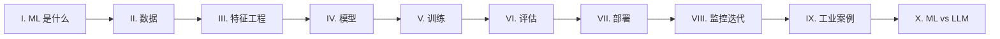

| 你的问题 | 对应章节 | 一句话回答 |
|---------|---------|----------|
| ML 到底是什么？和 AI / 深度学习什么关系？ | I | AI ⊃ ML ⊃ DL ⊃ LLM。ML 是 AI 的子集，用数据学规律。 |
| ML 的数据长什么样？怎么来的？ | II | 结构化表格（行×列），来自数据库/日志/埋点。 |
| 什么是特征工程？为什么说它占 ML 70% 的工作量？ | III | 人手动把原始数据加工成对预测有用的数字——这决定了模型效果的天花板。 |
| 有哪些模型？怎么选？ | IV | 表格数据首选 XGBoost/LightGBM；需要可解释选 LR；推荐/广告用 DeepFM/DIN。 |
| ML 怎么训练？和大模型训练有什么区别？ | V | 笔记本 CPU 几分钟搞定 vs 大模型几千张 GPU 几个月。 |
| 怎么知道模型好不好？ | VI | AUC、F1、交叉验证、A/B 测试——ML 评估比 LLM 严格得多。 |
| 怎么部署？需要 GPU 吗？ | VII | 不需要。CPU 即可，延迟 < 1ms，一台服务器扛几万 QPS。 |
| 上线之后呢？ | VIII | 监控漂移、定期重训、持续开发新特征。 |
| 真实工业界怎么用 ML？ | IX | 广告排序、推荐、风控、量化交易、搜索排序——每个都是完整案例。 |
| ML 和 LLM 谁会取代谁？ | X | 不会取代。汽车和飞机各有所长。 |

---

## I. What is Machine Learning

### 1.1 一句话定义

**机器学习 = 让机器从数据中自动学习规律，而不是人手写规则。**

```
传统编程：
  人写规则 + 数据 → 结果
  例：if 交易金额 > 10000 and 时间 == 凌晨3点 → 判定为欺诈

机器学习：
  数据 + 结果（标签）→ 机器自动学出规则
  例：给10万条交易记录（标了哪些是欺诈）→ 模型自己学出什么特征意味着欺诈
```

### 1.2 AI 家族关系

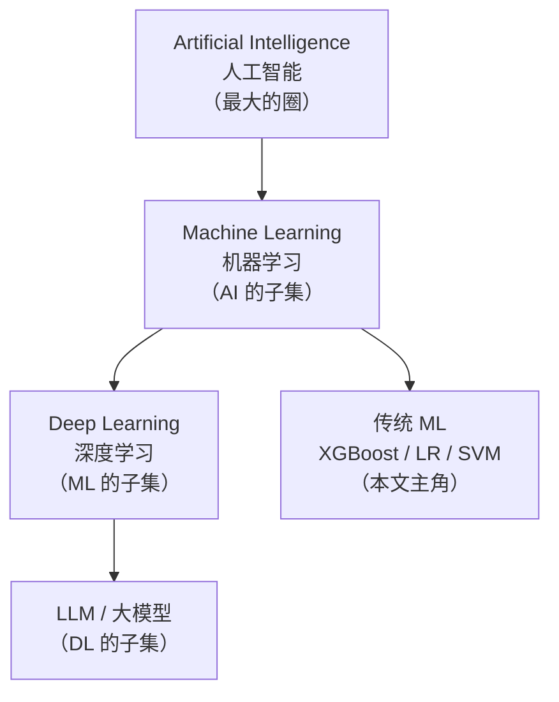

```
关系说明：

  AI：所有让机器表现出"智能"的技术，包括规则系统、搜索、ML 等
  ML：AI 中"从数据学习"的子集
  ├── 传统 ML：特征工程 + 浅层模型（XGBoost、LR、SVM、随机森林...）← 本文
  └── 深度学习（DL）：端到端学习，自动提取特征（CNN、RNN、Transformer...）
      └── LLM / 大模型：超大规模 Transformer + 海量文本预训练 ← ai-34 的主角
```

### 1.3 ML 的三大范式

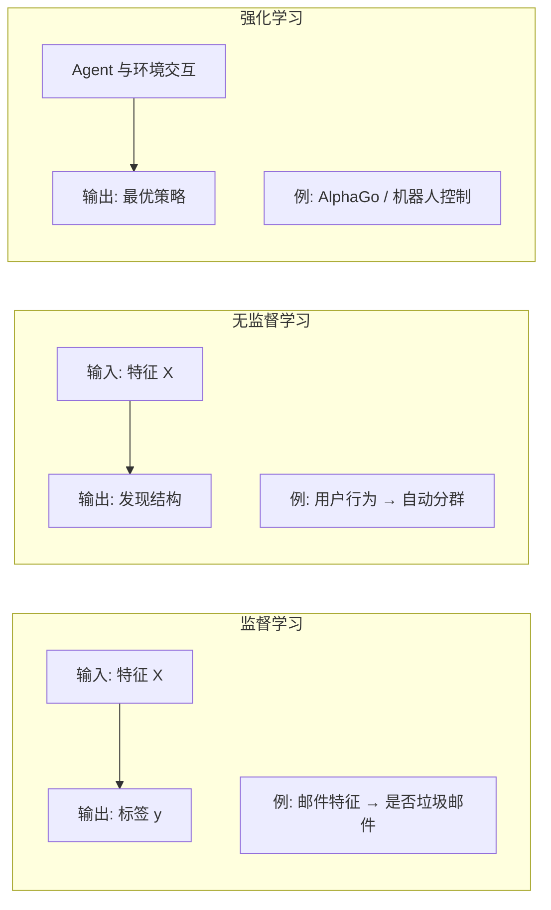

| 范式 | 有标签？ | 核心目标 | 典型应用 |
|------|---------|---------|---------|
| **监督学习** | 有 | 从 (X, y) 学映射 f(X) ≈ y | 分类、回归、排序（本文 90% 内容） |
| **无监督学习** | 无 | 发现数据内在结构 | 聚类（K-Means）、降维（PCA）、异常检测 |
| **强化学习** | 无标签，有奖励 | 学最优决策策略 | 游戏 AI、机器人、RLHF（大模型对齐） |

**工业界 90% 的 ML 应用都是监督学习**——有明确的"对/错"标签，模型学习预测。本文以监督学习为主线。

### 1.4 ML 解决问题的本质

```
ML 的数学本质：

  给定训练数据 D = {(x₁, y₁), (x₂, y₂), ..., (xₙ, yₙ)}
  找到一个函数 f，使得 f(x) ≈ y

  其中：
    x = 特征向量（描述一个样本的数字）
    y = 标签（要预测的目标）
    f = 模型（从 x 到 y 的映射规则）

  "训练"= 调整 f 的参数，使预测尽可能接近真实标签
  "推理"= 给一个新的 x，用训练好的 f 预测 y

  例：
    x = [年龄=25, 月收入=8000, 信用记录=良好, ...]
    y = 是否会还款（0 或 1）
    f = 逻辑回归模型
    训练：用10万条历史借贷数据调参
    推理：新用户来了 → f(x) = 0.92 → 大概率会还款 → 批准贷款
```

---

## II. Data — ML 的燃料

### 2.1 ML 的数据长什么样

```
和 LLM 吃的"文本"完全不同，ML 吃的是"表格"：

  ┌──────────┬─────┬────────┬───────────────┬──────────┬────────┐
  │ user_id  │ age │ gender │ last_7d_click │ category │ label  │
  ├──────────┼─────┼────────┼───────────────┼──────────┼────────┤
  │ u001     │ 25  │ M      │ 12            │ 电子     │ 1(点击)│
  │ u002     │ 38  │ F      │ 3             │ 服装     │ 0      │
  │ u003     │ 22  │ M      │ 45            │ 游戏     │ 1(点击)│
  │ ...      │ ... │ ...    │ ...           │ ...      │ ...    │
  └──────────┴─────┴────────┴───────────────┴──────────┴────────┘

  一行 = 一个样本
  一列 = 一个特征（feature）
  最后一列 = 标签（label）= 要预测的目标
```

### 2.2 数据从哪来

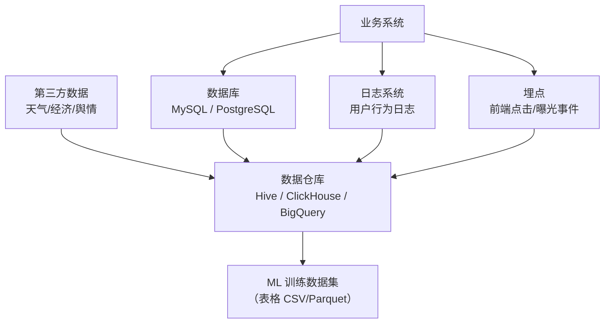

| 数据来源 | 举例 | 特点 |
|---------|------|------|
| **业务数据库** | 用户表、订单表、商品表 | 结构化、稳定、但可能滞后 |
| **行为日志** | 点击、浏览、停留时长、加购物车 | 海量、实时、最有价值 |
| **埋点数据** | 按钮点击、页面曝光 | 需要前端配合，数据质量依赖埋点设计 |
| **第三方数据** | 天气、宏观经济、舆情 | 补充外部信号，但获取成本高 |

### 2.3 标签从哪来——ML 最容易被忽视的成本

```
ML 是监督学习 → 需要标签（y）→ 标签怎么来？

  这是 ML 项目中最容易被低估的成本和难度。

  标签获取的四种方式：

  1. 天然标签（最理想）
     用户的真实行为直接就是标签，无需额外标注
     例：
       CTR 预估：用户是否点击了 → 日志自动记录
       转化率预估：用户是否购买了 → 订单系统自动记录
       流失预测：用户 30 天后是否还活跃 → 登录日志判断
     成本：几乎为零
     → 广告/推荐/电商 ML 为什么发展最快？因为天然有标签！

  2. 人工标注
     需要人一个个看、一个个标
     例：
       情感分析：这条评论是正面还是负面？→ 标注员阅读后标注
       图像分类：这张图是猫还是狗？→ 标注员看图标注
       命名实体识别：这段文字里"北京"是地名 → 标注员划选
     成本：每条 0.1~10 元 × 几万条 = 几千~几十万元
     → 标注质量直接决定模型上限
     → 需要标注规范、质检、一致性检查

  3. 弱监督标签
     用规则或启发式方法自动打标签（有噪声但量大）
     例：
       垃圾邮件：包含"中奖""免费"等关键词 → 标为垃圾（不完全准确）
       新闻分类：根据发布频道自动分类（体育频道 = 体育新闻）
     工具：Snorkel（Stanford 开源的弱监督框架）
     → 标签有噪声，但量大 → 模型可以"去噪"

  4. 半监督 / 主动学习
     少量人工标注 + 大量无标注数据
     例：
       标注 1000 条 → 训练初始模型
       → 模型对剩余 10 万条预测
       → 人检查模型"最不确定"的那些 → 标注这些
       → 迭代几轮 → 用远少于 10 万条的标注量达到接近效果
     → 当标注成本高时的最优策略
```

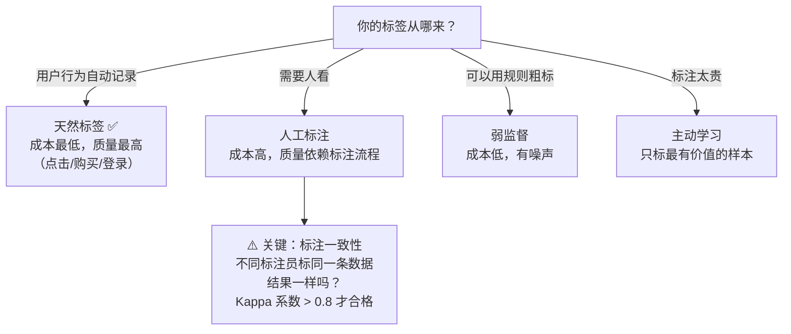

### 2.4 数据清洗——"Garbage In, Garbage Out"

**数据清洗在 ML 中的重要性远超大模型**——因为 ML 的每一列特征都直接参与计算，一个脏值可能影响整棵决策树。


```python
import pandas as pd
import numpy as np

# ---- 1. 加载数据 ----
df = pd.read_csv("transactions.csv")
print(f"原始数据: {df.shape[0]} 行, {df.shape[1]} 列")

# ---- 2. 缺失值处理 ----
# 查看缺失比例
print(df.isnull().mean().sort_values(ascending=False).head(10))

# 数值列：用中位数填充（比均值更抗异常值）
num_cols = df.select_dtypes(include=[np.number]).columns
df[num_cols] = df[num_cols].fillna(df[num_cols].median())

# 类别列：用众数填充
cat_cols = df.select_dtypes(include=['object']).columns
df[cat_cols] = df[cat_cols].fillna(df[cat_cols].mode().iloc[0])

# ---- 3. 异常值检测（IQR 方法）----
def remove_outliers(df, col):
    Q1 = df[col].quantile(0.25)
    Q3 = df[col].quantile(0.75)
    IQR = Q3 - Q1
    return df[(df[col] >= Q1 - 1.5 * IQR) & (df[col] <= Q3 + 1.5 * IQR)]

df = remove_outliers(df, "transaction_amount")

# ---- 4. 样本不平衡处理 ----
# 欺诈检测中，正样本（欺诈）可能只占 0.1%
print(f"正样本比例: {df['label'].mean():.4f}")
# → 如果严重不平衡，考虑 SMOTE 过采样或调整 class_weight
```

### 2.5 探索性数据分析（EDA）

训练之前先"看一眼数据"——这是 ML 工程师的基本功，大模型工程师通常不需要这一步。

```python
import matplotlib.pyplot as plt
import seaborn as sns

# 标签分布
df['label'].value_counts().plot(kind='bar', title='Label Distribution')

# 特征相关性热力图
corr = df[num_cols].corr()
sns.heatmap(corr, annot=True, cmap='coolwarm', center=0)

# 单特征 vs 标签的关系
for col in ['age', 'income', 'transaction_amount']:
    df.groupby('label')[col].hist(alpha=0.5, bins=50)
    plt.title(f'{col} by label')
    plt.show()
```

```
EDA 的目的：
  1. 发现数据质量问题（缺失、异常、分布偏斜）
  2. 初步判断哪些特征"有用"（和标签相关性高）
  3. 发现特征之间的冗余（高度相关的特征可以去掉一个）
  4. 指导后续特征工程的方向

  对比 LLM：
    LLM 训练前不做 EDA——文本数据太大，直接 tokenize 后开训
    ML 必须做——因为"看到什么特征"直接决定模型天花板
```

### 2.6 数据泄露（Data Leakage）——ML 最致命的坑

```
数据泄露 = 训练时不小心用到了"未来信息"或"标签信息"
→ 离线指标好得不真实（AUC 0.99！）
→ 上线后效果断崖下跌
→ ML 工程师最怕的 bug，因为难以发现

常见的泄露类型：
```

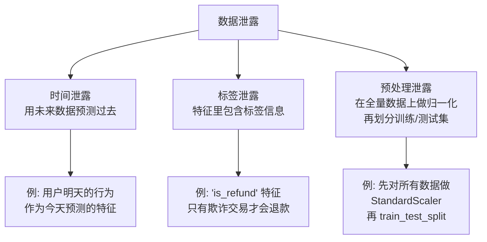

```
详细解释：

  1. 时间泄露（最常见、最隐蔽）
  
     场景：预测用户今天是否会购买
     错误：特征里包含了"明天的浏览记录"
     
     为什么会发生：
       构造特征时用了 "过去30天" 的窗口
       但没有严格按照预测时间点切分
       → 部分"过去30天"实际包含了预测日之后的数据
     
     正确做法：
       如果预测日是 Day T，所有特征只能用 Day T-1 及之前的数据
       训练集：Day 1~Day 60 的数据，标签取 Day 2~Day 61
       测试集：Day 61~Day 90 的数据，标签取 Day 62~Day 91
       → 绝对不能随机 shuffle 后切分！必须按时间切分

  2. 标签泄露
  
     场景：预测交易是否欺诈
     错误：特征里有"是否退款"这一列
     
     问题：退款是欺诈的结果，不是原因
     → 上线时还没发生退款，这个特征根本不存在
     → 但训练时模型学到"退款=欺诈"，AUC 飙到 0.99
     
     正确做法：
       只用交易发生时刻已经存在的特征
       删除所有"因标签而产生"的特征

  3. 预处理泄露
  
     场景：标准化特征后再划分训练/测试集
     
     错误代码：
       scaler.fit_transform(ALL_data)  # ← 泄露！
       X_train, X_test = split(ALL_data)
     
     问题：标准化用到了测试集的均值和方差
     → 模型间接"偷看"了测试集的分布
     
     正确代码：
       X_train, X_test = split(ALL_data)
       scaler.fit(X_train)              # 只在训练集上 fit
       X_train = scaler.transform(X_train)
       X_test = scaler.transform(X_test) # 用训练集的参数 transform
```

```python
# === 正确的时间切分 + 预处理 ===

import pandas as pd
from sklearn.preprocessing import StandardScaler

df = pd.read_parquet("features_with_date.parquet")
df = df.sort_values('date')

# 按时间切分（绝对不能随机 shuffle！）
train = df[df['date'] < '2026-01-01']
test  = df[df['date'] >= '2026-01-01']

X_train = train[feature_cols]
y_train = train['label']
X_test  = test[feature_cols]
y_test  = test['label']

# 标准化：只在训练集上 fit
scaler = StandardScaler()
X_train = scaler.fit_transform(X_train)   # fit + transform
X_test  = scaler.transform(X_test)        # 只 transform，不 fit

# 检查：是否有"未来特征"
for col in feature_cols:
    if 'future' in col or 'next_day' in col or 'refund' in col:
        print(f"⚠️ 疑似泄露特征: {col}")
```

```
如何检测数据泄露：

  1. AUC 异常高（> 0.95）→ 先怀疑泄露，再庆祝
  2. 某个特征重要性远高于其他所有特征 → 检查它是否"因果倒置"
  3. 离线 AUC 0.95，上线后 AUC 0.70 → 几乎肯定有泄露
  4. 检查所有特征的时间戳：每个特征值的生成时间 < 预测时间

  数据泄露 vs LLM：
    LLM 不太有这个问题——训练数据就是文本，没有"特征时间戳"
    ML 的表格数据天然有时间维度 → 泄露风险极高
    → 这是 ML 工程师必须掌握的"生存技能"
```

---

## III. Feature Engineering — ML 的核心灵魂

### 3.1 为什么特征工程是 ML 最重要的环节

```
ML 工程师的时间分配：

  ┌─────────────────────────────────────────────────────────┐
  │ ████████████████████████████████████ 特征工程 (60-70%)  │
  │ ████████ 数据清洗 (15%)                                 │
  │ ████ 模型训练与调参 (10%)                                │
  │ ██ 部署上线 (5%)                                        │
  └─────────────────────────────────────────────────────────┘

  为什么？
    因为模型只能学"你给它看到的东西"
    如果你不构造"过去7天购买次数"这个特征
    模型永远无法利用这个信息——即使原始数据里有

  类比：
    特征工程 = 给学生编教材
    模型训练 = 学生考试
    教材写得好 → 学生考得好（即使是普通学生）
    教材写得差 → 学霸也考不好

  这就是为什么说：
    "特征工程决定模型效果的天花板，模型选择只决定接近天花板的程度"
```

### 3.2 特征类型

| 类型 | 说明 | 举例 | 处理方式 |
|------|------|------|---------|
| **数值特征** | 连续或离散数字 | 年龄=25，金额=1580 | 标准化 / 归一化 / 分桶 |
| **类别特征** | 有限取值的分类 | 性别=M，城市=北京 | One-Hot / Label Encoding / Target Encoding |
| **文本特征** | 自由文本 | 商品标题、用户评论 | TF-IDF / Word2Vec / 直接交给 LLM |
| **时间特征** | 时间戳 | 2026-02-13 14:30 | 拆成小时/星期/是否节假日 |
| **序列特征** | 有序行为 | 点击序列: A→B→C→A | 滑窗统计 / Embedding |

### 3.3 特征工程实战——以电商推荐为例

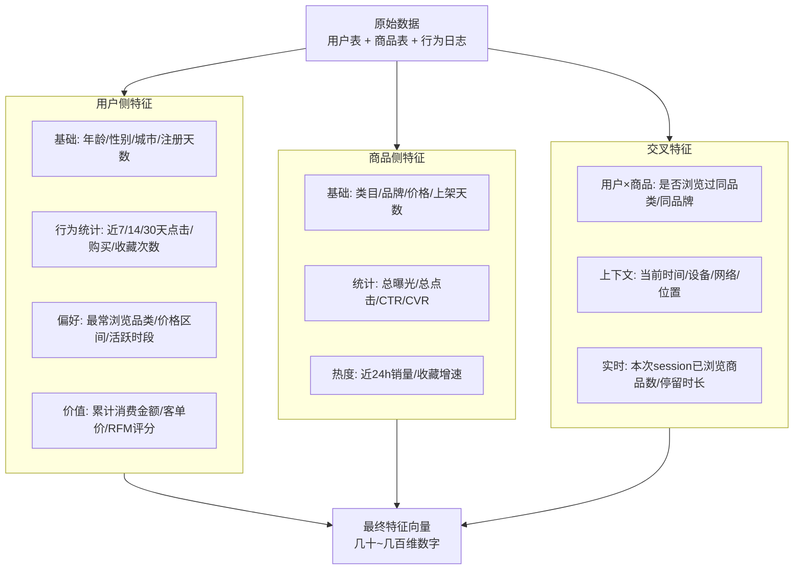

```python
# === 特征工程代码示例（电商推荐）===

import pandas as pd
import numpy as np

def build_user_features(user_df, behavior_df, target_date):
    """构建用户侧特征"""
    features = {}
    
    # ---- 基础特征 ----
    features['age'] = user_df['age']
    features['gender'] = (user_df['gender'] == 'M').astype(int)
    features['register_days'] = (target_date - user_df['register_date']).dt.days
    
    # ---- 行为统计特征（滑窗）----
    for window in [7, 14, 30]:
        recent = behavior_df[behavior_df['date'] >= target_date - pd.Timedelta(days=window)]
        
        features[f'click_{window}d'] = recent.groupby('user_id')['click'].sum()
        features[f'purchase_{window}d'] = recent.groupby('user_id')['purchase'].sum()
        features[f'unique_items_{window}d'] = recent.groupby('user_id')['item_id'].nunique()
        
        # 转化率 = 购买数 / 点击数（避免除零）
        features[f'cvr_{window}d'] = (
            features[f'purchase_{window}d'] / features[f'click_{window}d'].clip(lower=1)
        )
    
    # ---- 偏好特征 ----
    features['fav_category'] = (
        behavior_df.groupby('user_id')['category']
        .agg(lambda x: x.mode()[0] if len(x) > 0 else 'unknown')
    )
    features['avg_price'] = behavior_df.groupby('user_id')['price'].mean()
    
    # ---- 交叉特征 ----
    # 近期活跃度 = 近7天行为 / 近30天行为（突然活跃？沉默？）
    features['activity_trend'] = (
        features['click_7d'] / features['click_30d'].clip(lower=1)
    )
    
    return pd.DataFrame(features)


def build_item_features(item_df, behavior_df, target_date):
    """构建商品侧特征"""
    features = {}
    
    features['price'] = item_df['price']
    features['category'] = item_df['category']
    features['days_on_shelf'] = (target_date - item_df['publish_date']).dt.days
    
    # 商品热度
    recent = behavior_df[behavior_df['date'] >= target_date - pd.Timedelta(days=7)]
    features['impressions_7d'] = recent.groupby('item_id')['impression'].sum()
    features['clicks_7d'] = recent.groupby('item_id')['click'].sum()
    features['ctr_7d'] = (
        features['clicks_7d'] / features['impressions_7d'].clip(lower=1)
    )
    
    return pd.DataFrame(features)
```

### 3.4 特征缩放——为什么 LR 需要而树模型不需要

```
问题：年龄 = 25，收入 = 50000。LR 计算 y = w₁×25 + w₂×50000 + b
→ 收入的数值比年龄大 2000 倍
→ 梯度下降时，w₂ 的梯度远大于 w₁
→ 参数更新严重不均衡 → 收敛慢甚至不收敛

  解决方案：特征缩放（Feature Scaling）

  StandardScaler（标准化）：
    x' = (x - μ) / σ
    → 均值=0，标准差=1
    → 最常用，适合大多数场景

  MinMaxScaler（归一化）：
    x' = (x - min) / (max - min)
    → 范围 [0, 1]
    → 适合有明确上下界的特征

  年龄：(25 - 35) / 10 = -1.0
  收入：(50000 - 45000) / 15000 = 0.33
  → 现在两个特征量级一致了

  哪些模型需要缩放？
    ✅ 需要：LR、SVM、KNN、神经网络（所有基于距离/梯度的模型）
    ❌ 不需要：决策树、随机森林、XGBoost、LightGBM
       → 因为树模型只看"大小关系"（age > 30？），不看绝对值
       → 25 还是 -1.0 对分裂决策没有任何影响

  工业经验：
    如果你用 XGBoost → 不用缩放，节省一步
    如果你用 LR 或做 Stacking → 必须缩放
    如果你不确定 → 缩放不会错，不缩放可能出问题
```

### 3.5 特征编码——把"人话"变成"数字"

```
模型只认数字，不认文字。所有非数字特征都要编码：

  ┌─────────────────────────────────────────────────────────┐
  │ 原始: gender = [M, F, M, F, M]                         │
  │                                                         │
  │ Label Encoding:  [1, 0, 1, 0, 1]                       │
  │   → 简单，但暗示 M > F（树模型不在意，线性模型会出问题）│
  │                                                         │
  │ One-Hot Encoding:                                       │
  │   gender_M = [1, 0, 1, 0, 1]                           │
  │   gender_F = [0, 1, 0, 1, 0]                           │
  │   → 无序，安全，但高基数类别（如城市=10000个）会维度爆炸│
  │                                                         │
  │ Target Encoding:                                        │
  │   M → 0.73（M 类别下标签为1的比例）                     │
  │   F → 0.45                                              │
  │   → 信息量大，但有数据泄露风险，需要平滑 + 交叉验证     │
  └─────────────────────────────────────────────────────────┘
```

### 3.6 特征选择——去掉没用的特征

```
不是特征越多越好！无关特征会引入噪声，拖慢训练，甚至降低效果。

  常用方法：
  
  1. 相关性过滤
     计算每个特征和标签的相关系数
     相关性 < 0.01 的直接去掉
  
  2. 特征重要性（树模型天然支持）
     训练一个 XGBoost → 看 feature_importance
     排名靠后的特征考虑去掉
  
  3. 递归特征消除（RFE）
     反复训练 → 去掉最不重要的特征 → 再训练
     直到性能不再提升
  
  4. L1 正则化（Lasso）
     在损失函数中加 L1 惩罚
     → 自动把不重要特征的权重压到 0
```

```python
import xgboost as xgb
import matplotlib.pyplot as plt

# 用 XGBoost 的特征重要性排序
model = xgb.XGBClassifier(n_estimators=200)
model.fit(X_train, y_train)

# 可视化特征重要性
xgb.plot_importance(model, max_num_features=20, importance_type='gain')
plt.title("Top 20 Features by Gain")
plt.tight_layout()
plt.show()

# 只保留重要特征
important_features = model.feature_importances_ > 0.01
X_train_selected = X_train[:, important_features]
```

---

## IV. Models — 模型选择与原理

### 4.1 ML 模型全景图

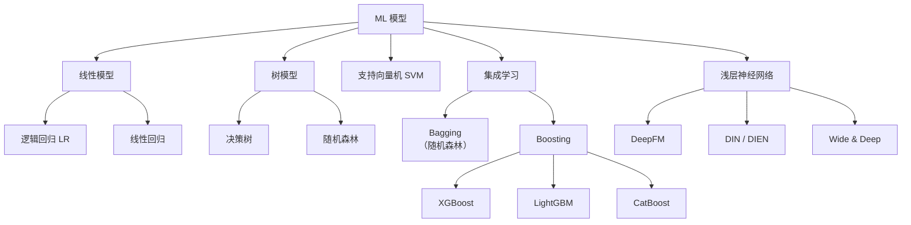

### 4.2 逻辑回归（LR）——最简单但最重要的模型

```
逻辑回归是工业界使用最广泛的基线模型。

  数学原理：
    y = σ(w₁x₁ + w₂x₂ + ... + wₙxₙ + b)
    
    其中 σ = sigmoid 函数 = 1 / (1 + e⁻ˣ)
    → 把任意实数压缩到 (0, 1) 之间
    → 输出就是"概率"

  训练 = 找到最优的 w 和 b，使得：
    - 正样本（y=1）的预测概率尽可能接近 1
    - 负样本（y=0）的预测概率尽可能接近 0
    
  损失函数（交叉熵）：
    L = -[y·log(ŷ) + (1-y)·log(1-ŷ)]
    
  优化方法：梯度下降（和深度学习完全一样，只是模型极简）

  为什么工业界爱用 LR：
    ✅ 训练极快（秒级）
    ✅ 推理极快（一次向量乘法）
    ✅ 可解释性强（每个特征的权重 w 直接说明"重要性"）
    ✅ 稳定、不容易过拟合
    ✅ 支持在线学习（实时更新）
    
    ❌ 只能学线性关系（非线性要靠特征交叉手动构造）
    ❌ 天花板低，复杂问题表现有限
```

```python
from sklearn.linear_model import LogisticRegression
from sklearn.metrics import roc_auc_score

# 训练（秒级完成）
lr = LogisticRegression(
    penalty='l2',           # L2 正则化防过拟合
    C=1.0,                  # 正则化强度
    max_iter=1000,
    class_weight='balanced' # 自动处理样本不平衡
)
lr.fit(X_train, y_train)

# 预测概率
y_prob = lr.predict_proba(X_test)[:, 1]
print(f"AUC: {roc_auc_score(y_test, y_prob):.4f}")

# 查看特征权重（可解释性）
for name, weight in sorted(zip(feature_names, lr.coef_[0]), key=lambda x: abs(x[1]), reverse=True)[:10]:
    print(f"  {name}: {weight:+.4f}")
```

### 4.3 决策树——最直观的模型

```
决策树 = 一系列 if-else 规则：

  问：年收入 > 50k？
  ├── 是 → 问：信用记录 > 5年？
  │         ├── 是 → 批准贷款 ✅
  │         └── 否 → 问：有房产？
  │                   ├── 是 → 批准 ✅
  │                   └── 否 → 拒绝 ❌
  └── 否 → 问：有担保人？
            ├── 是 → 批准 ✅
            └── 否 → 拒绝 ❌

  训练 = 找到最佳的分裂点，使得每次分裂后两边的"纯度"最高
  
  分裂标准：
    - 信息增益（ID3）：用信息熵衡量纯度
    - 基尼系数（CART）：Gini = 1 - Σpᵢ²
    - 基尼系数 = 0 → 完全纯（全是同一类）
    - 基尼系数 = 0.5 → 完全混合（二分类各占一半）

  优点：
    ✅ 极其直观，可以画出来给业务方看
    ✅ 不需要特征归一化
    ✅ 天然处理非线性关系
    
  缺点：
    ❌ 单棵树容易过拟合
    ❌ 不稳定——数据小变化可能导致完全不同的树
    → 解决方案：集成学习（随机森林、XGBoost）
```

### 4.4 随机森林（Random Forest）——Bagging 的代表

单棵决策树容易过拟合、不稳定。随机森林用 **Bagging（Bootstrap Aggregating）** 解决这两个问题。

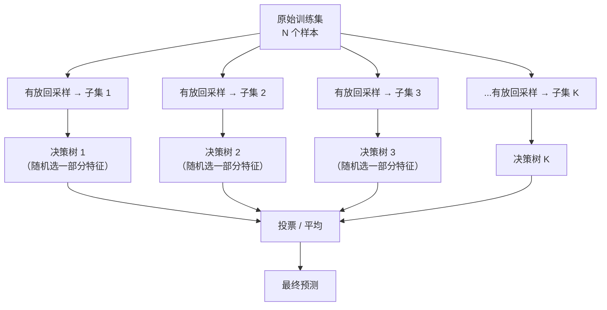

```
Bagging 核心思想：

  问题：一棵树不稳定，换一批数据可能长出完全不同的树
  解决：训练 500 棵树，每棵用不同的数据子集，最后投票/平均

  具体步骤：
    1. 从 N 个样本中有放回地随机抽 N 个（Bootstrap 采样）
       → 约 63.2% 的样本被选中，36.8% 没被选中（OOB，Out-of-Bag）
    2. 在抽出的子集上训练一棵决策树
       → 但每次分裂时只考虑 √p 个随机选出的特征（p = 总特征数）
       → 这就是"随机"森林的"随机"
    3. 重复 K 次（K = 100~1000 棵树）
    4. 预测时所有树投票（分类）或取平均（回归）

  为什么有效？
    单棵树：高方差（variance），容易过拟合
    500 棵树平均：方差降为 1/500（大数定律）
    随机特征选择：树之间更"不同"，降低相关性 → 集成效果更好

  类比：
    一个人判断容易出错 → 500 个人各自独立判断后投票
    每个人看到的证据不完全一样（Bootstrap + 随机特征）
    → 群体智慧比个体更可靠

  Random Forest vs 单棵决策树：
    ✅ 几乎不会过拟合（树越多越稳定）
    ✅ 不需要调参也能有不错的效果
    ✅ 天然支持 OOB 评估（不用额外划分验证集）
    ✅ 可以输出特征重要性
    ❌ 训练慢于单棵树（但可并行）
    ❌ 不如 XGBoost/LightGBM 精度高（因为树之间没有"纠错"机制）

  Bagging vs Boosting（关键区别）：
    Bagging（随机森林）：每棵树独立训练，最后投票 → 降方差
    Boosting（XGBoost）：每棵树纠正前一棵的错误 → 降偏差
    → Boosting 通常精度更高，但更容易过拟合
    → Bagging 更稳定，几乎不需要调参
```

```python
from sklearn.ensemble import RandomForestClassifier
from sklearn.metrics import roc_auc_score

# 随机森林训练——开箱即用，几乎不用调参
rf = RandomForestClassifier(
    n_estimators=500,       # 500 棵树
    max_depth=None,         # 不限深度（靠集成控制过拟合）
    min_samples_leaf=5,     # 叶节点最少 5 个样本
    max_features='sqrt',    # 每次分裂只看 √p 个特征
    oob_score=True,         # 启用 OOB 评估
    n_jobs=-1,              # 多核并行
    random_state=42
)
rf.fit(X_train, y_train)

# OOB 评估（不需要额外验证集）
print(f"OOB AUC: {rf.oob_score_:.4f}")

# 测试集评估
y_prob = rf.predict_proba(X_test)[:, 1]
print(f"Test AUC: {roc_auc_score(y_test, y_prob):.4f}")
```

### 4.5 XGBoost / LightGBM——工业界的王者

**XGBoost 和 LightGBM 是 2026 年工业界结构化数据场景的绝对主力。**

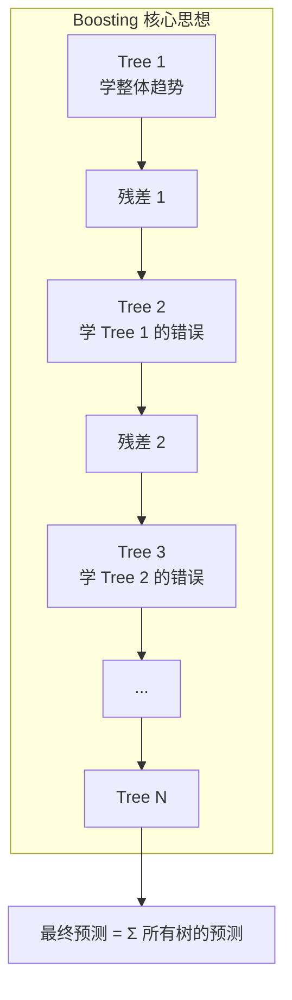

```
Boosting 的核心思想：

  不是训练一棵"完美的大树"
  而是训练很多棵"弱弱的小树"，每棵树都专注纠正前面树的错误

  类比：
    考试改错 → 第一遍做出大致答案（Tree 1）
    → 检查找到错误的地方（残差）
    → 第二遍专门纠正这些错误（Tree 2）
    → 再检查还有没有错（残差）
    → 第三遍继续纠正...
    → 500 遍之后，几乎没有错误了

  数学上：
    ŷ = Σᵢ fᵢ(x)     （所有树的预测值之和）
    每棵新树 fₜ 拟合的是前 t-1 棵树的残差（梯度）
    → 这就是为什么叫"梯度提升"（Gradient Boosting）
```

**XGBoost 相比普通 GBDT 的核心改进——正则化**：

```
普通 GBDT（Gradient Boosting Decision Tree）：
  损失函数：L = Σ loss(yᵢ, ŷᵢ)
  → 只关心预测准不准

XGBoost 的损失函数：
  L = Σ loss(yᵢ, ŷᵢ) + Σₜ [γT + ½λ||w||²]
                         └── 正则化项 ──┘

  其中：
    T = 叶节点个数 → γT 惩罚树的复杂度（叶子越多惩罚越大）
    w = 叶节点的输出值 → λ||w||² 惩罚极端预测值
    γ（gamma）：控制"是否值得再分裂"→ 增益 < γ 就不分裂了
    λ（lambda）：L2 正则化强度 → 让叶节点的值更平滑

  这就是 XGBoost 比 GBDT 更不容易过拟合的原因！
  → GBDT 只管拟合残差，容易记住噪声
  → XGBoost 在拟合残差的同时限制模型复杂度

  XGBoost 的其他改进：
    1. 二阶泰勒展开：GBDT 只用一阶梯度，XGBoost 用一阶+二阶
       → 更精确地估计最优分裂点
    2. Column Subsampling：每棵树/每次分裂只用部分特征
       → 类似随机森林的思想，降低方差
    3. Shrinkage：每棵树的预测乘以学习率 η
       → 每棵树"说话声音小一点"→ 需要更多树，但泛化更好
    4. Sparsity-aware：天然处理缺失值（自动学习缺失值走左还是走右）
```

**Level-wise vs Leaf-wise 分裂策略**：

```
Level-wise（XGBoost 默认）：

  每一轮同时分裂同一层的所有节点
  
  第1层:        [根节点]
               ╱        ╲
  第2层:    [节点A]    [节点B]     ← 同层一起分裂
             ╱ ╲        ╱ ╲
  第3层:  [C] [D]    [E] [F]     ← 同层一起分裂
  
  特点：
    ✅ 树是"均衡"的，每层都分裂
    ✅ 不容易过拟合
    ❌ 可能浪费计算——有些节点分裂增益很小，也被强制分裂

Leaf-wise（LightGBM 默认）：

  每一轮只分裂增益最大的那个叶节点
  
  第1步:       [根节点]
              ╱        ╲
  第2步:   [节点A]    [B]        ← 只分裂 A（增益更大）
            ╱ ╲
  第3步: [C]  [D]               ← 然后可能分裂 D（增益最大）
                ╲
  第4步:       [E]              ← 树不均衡，但效率高

  特点：
    ✅ 同样树数量下精度更高（每次分裂都选增益最大的）
    ✅ 训练更快（不浪费在低增益分裂上）
    ❌ 容易过拟合（树可能很深很偏）
    → 需要用 num_leaves 而不是 max_depth 来控制复杂度
```

**XGBoost vs LightGBM vs CatBoost 对比**：

| 维度 | XGBoost | LightGBM | CatBoost |
|------|---------|----------|----------|
| **分裂方式** | Level-wise（逐层）| Leaf-wise（逐叶）| 对称树 |
| **速度** | 快 | **更快 2-5 倍** | 中等 |
| **内存** | 中 | **更少** | 中 |
| **类别特征** | 需手动编码 | 直接支持 | **原生最优** |
| **GPU 支持** | 有 | 有 | 有 |
| **过拟合** | 需调参 | 需调参 | **自动正则化** |
| **适用场景** | 通用首选 | 大数据量首选 | 高基数类别特征 |

```python
import lightgbm as lgb

# LightGBM 训练（通常比 XGBoost 快 2-5 倍）
train_data = lgb.Dataset(X_train, label=y_train)
valid_data = lgb.Dataset(X_val, label=y_val, reference=train_data)

params = {
    'objective': 'binary',
    'metric': 'auc',
    'learning_rate': 0.05,
    'num_leaves': 63,          # Leaf-wise 的关键参数
    'max_depth': -1,           # 不限深度，靠 num_leaves 控制
    'min_child_samples': 20,   # 防过拟合
    'feature_fraction': 0.8,   # 列采样
    'bagging_fraction': 0.8,   # 行采样
    'bagging_freq': 5,
    'verbose': -1
}

model = lgb.train(
    params,
    train_data,
    num_boost_round=1000,
    valid_sets=[valid_data],
    callbacks=[lgb.early_stopping(50)]  # 50轮不提升就停
)
```

### 4.6 FM（因子分解机）——从 LR 到深度模型的桥梁

```
LR 的致命缺陷：只能学线性关系，特征交叉要人手动做

  例：预测 CTR
    LR：y = w₁×(性别=男) + w₂×(品类=游戏) + b
    → 学不到"男性 + 游戏 = 点击率高"这种组合效应
    → 人工交叉：构造 "性别=男 AND 品类=游戏" 这个新特征
    → 但特征有 1000 个 → 两两组合 = 50 万个交叉特征 → 维度爆炸

  FM 的解决方案：自动学习二阶特征交叉

    核心思想：
      给每个特征学一个 k 维的隐向量 vᵢ（Embedding）
      特征 i 和特征 j 的交互强度 = vᵢ · vⱼ（向量内积）
    
    公式：
      ŷ = w₀ + Σᵢ wᵢxᵢ + Σᵢ Σⱼ (vᵢ · vⱼ) xᵢxⱼ
          └── 偏置 ──┘ └── 一阶（LR）──┘ └── 二阶交叉（FM 核心）──┘

    为什么比人工交叉好？
      人工交叉：50 万个交叉特征，参数量 = 50 万（稀疏数据学不好）
      FM：1000 个特征 × k 维隐向量，参数量 = 1000k（如 k=10 → 只有 1 万）
      → 参数量减少 50 倍，而且稀疏特征也能学到交互（通过隐向量泛化）

    时间复杂度：
      看上去是 O(n²k)——所有特征两两组合
      但 FM 有数学优化：O(nk)——线性时间！
      (vᵢ · vⱼ) 可以用 (Σvᵢ)² - Σ(vᵢ²) 的恒等式化简

  FM → FFM → DeepFM 的演进：
    FM：  所有交叉共用一个隐向量 vᵢ
    FFM： 不同 field 用不同隐向量 vᵢ,f → 更精细，但参数多
    DeepFM：FM（二阶交叉）+ DNN（高阶交叉）→ 最终形态
```

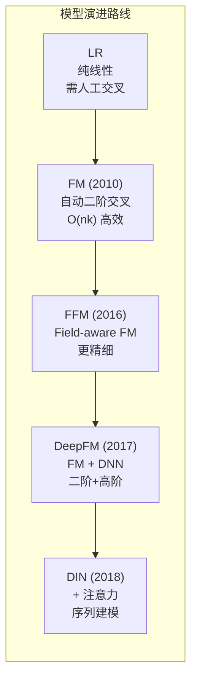

### 4.7 推荐 / 广告专用模型——DeepFM、Wide&Deep、DIN

这类模型是**传统 ML 和浅层深度学习的混合体**，在推荐、广告排序等场景统治了 2016-2026 整整十年。

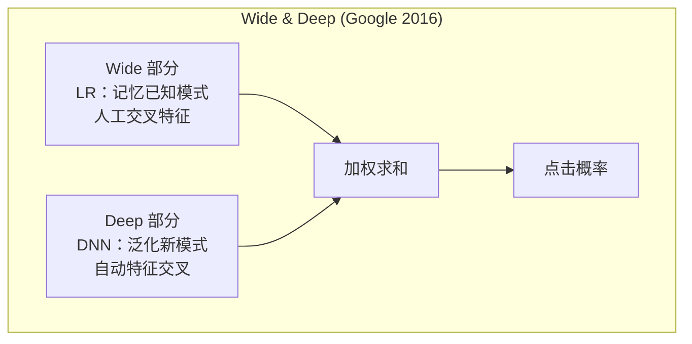

```
为什么推荐/广告需要专用模型？

  普通 ML（如 XGBoost）的问题：
    特征交叉要人工构造（"品类A × 性别M"需要手动做）
    无法利用 Embedding（用户ID、商品ID是高维稀疏的）

  推荐模型的核心创新：
    1. Embedding：把用户ID/商品ID映射到低维向量
    2. 自动特征交叉：FM/DeepFM 自动学习特征间的组合
    3. 行为序列建模：DIN/DIEN 利用用户的点击历史

  演进路线：
    LR → FM → FFM → Wide&Deep → DeepFM → DIN → DIEN → SIM
    └── 纯线性   └── 二阶交叉    └── DNN 泛化    └── 注意力序列
```

### 4.8 其他经典模型简介——SVM 与 KNN

```
SVM（Support Vector Machine，支持向量机）：

  核心思想：找到一个"最宽的间隔"把两类数据分开

    ○ ○ ○ ○ │           │ ● ● ● ●
    ○ ○ ○   │← margin →│   ● ● ●
    ○ ○ ○ ○ │           │ ● ● ● ●
            ↑ 决策边界 ↑
    
    margin = 两类数据之间的最大间距
    支持向量 = 离决策边界最近的那些样本（它们"支撑"着边界）

  核心技巧——核函数（Kernel Trick）：
    如果数据线性不可分 → 用核函数把数据映射到高维空间
    在高维空间里可能就线性可分了
    常用核：RBF（高斯核）、多项式核

  优点：
    ✅ 理论优美，泛化界有数学保证
    ✅ 高维小样本表现好（如基因数据：特征 2 万，样本几百）
    ✅ 不容易过拟合（最大间隔原则天然正则化）

  缺点：
    ❌ 训练时间 O(n²) ~ O(n³)，大数据不可用
    ❌ 对特征缩放敏感（必须标准化）
    ❌ 不输出概率（需要 Platt Scaling 转换）
    ❌ 2026 年工业界几乎不用了 → 被 XGBoost 全面替代

  历史地位：
    2000-2012 年的 ML 之王
    → 被随机森林 → XGBoost → 深度学习逐步替代
    → 现在主要出现在教科书和面试题中

KNN（K-Nearest Neighbors，K近邻）：

  核心思想：最朴素的"物以类聚"
    → 新样本来了，找训练集中最近的 K 个邻居，投票决定类别

  例：K=5
    新样本的 5 个最近邻中有 3 个是"猫"、2 个是"狗"
    → 预测为"猫"

  优点：
    ✅ 零训练时间（不需要学参数，只是存数据）
    ✅ 概念极简，容易解释
    ✅ 天然支持多分类

  缺点：
    ❌ 推理慢：每次预测要遍历所有训练数据 → O(n)
    ❌ 高维数据失效（维度灾难：高维空间中所有点距离都差不多）
    ❌ 对特征缩放敏感
    ❌ 工业界几乎不单独使用

  现代用途：
    → 近似最近邻搜索（ANN）是 RAG 向量检索的核心
    → Faiss / HNSW 就是 KNN 思想的工程化实现
```

### 4.9 模型选择决策流程

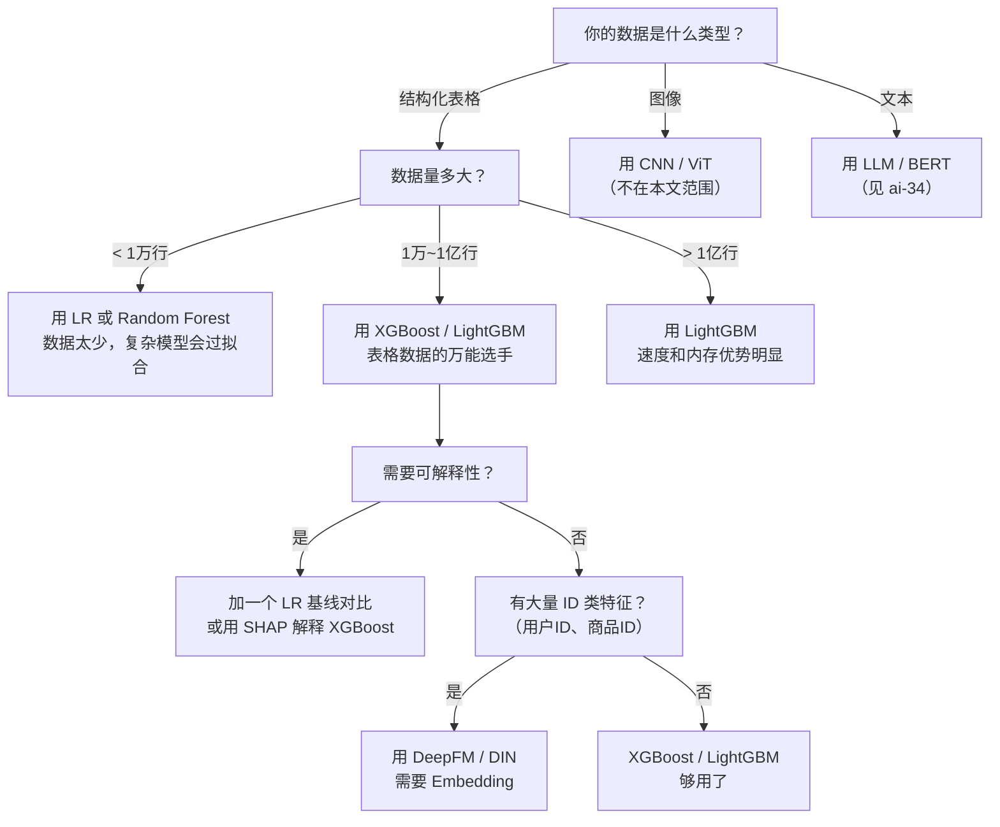

---

## V. Training — 训练过程详解

### 5.1 ML 训练的全流程

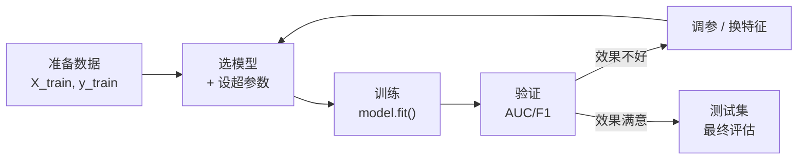

### 5.2 不同模型是怎么"学"的——本质区别

```
ML 里有两大类截然不同的学习方式：

  ┌────────────────────────────────────────────────────────┐
  │ 线性模型 / 神经网络：梯度下降                           │
  │   "沿着斜坡往下走，一步步找到最低点"                    │
  │                                                        │
  │ 树模型（决策树/XGBoost/随机森林）：贪心分裂              │
  │   "每一步找当前最优的切分点，把数据切成两半"             │
  └────────────────────────────────────────────────────────┘

这两种学习方式的区别是理解 ML 的关键。
```

**线性模型（LR）/ 神经网络 —— 梯度下降**

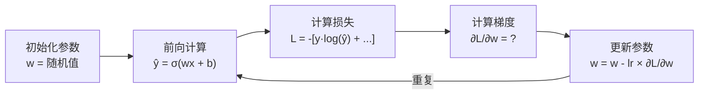

```
梯度下降（Gradient Descent）——和 ai-34 里讲的深度学习训练完全一样：

  1. 随机初始化参数 w 和 b
  2. 把数据喂进去，计算预测值 ŷ
  3. 用损失函数衡量 ŷ 和真实标签 y 的差距
  4. 计算梯度（损失对每个参数的偏导数）= "哪个方向能让损失下降最快"
  5. 沿梯度反方向更新参数：w = w - 学习率 × 梯度
  6. 重复 2-5，直到损失不再下降

  关键：参数是连续数值，可以求导 → 可以用梯度下降
  
  类比：在山上闭着眼睛，用脚感受脚下的坡度，一步步往下走
```

**树模型（XGBoost / Random Forest）—— 贪心分裂**

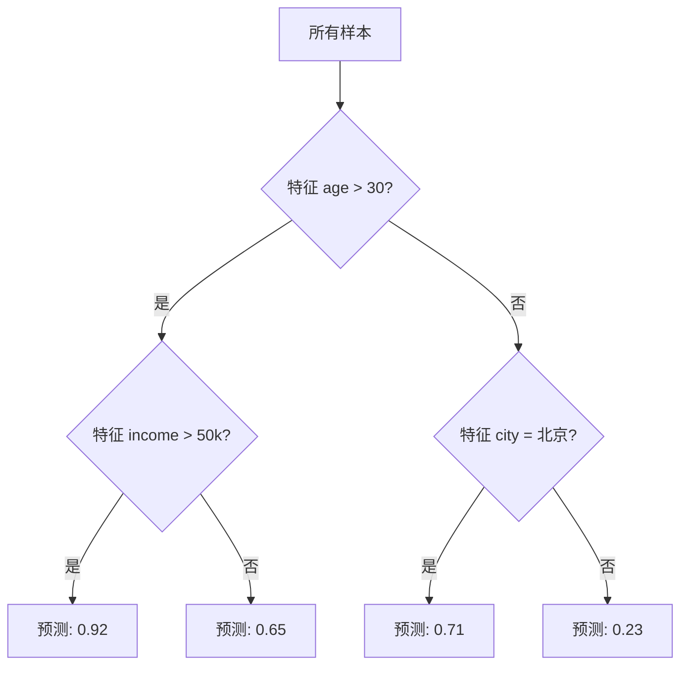

```
贪心分裂——和梯度下降完全不同的学习方式：

  1. 从根节点开始，所有样本都在一起
  2. 遍历每个特征的每个可能的分裂点：
     - 如果按 "age > 30" 切分，两边的纯度是多少？
     - 如果按 "age > 35" 切分呢？
     - 如果按 "income > 50k" 切分呢？
     - ...试遍所有特征 × 所有阈值
  3. 选增益最大的那个分裂点 → 切成左右两部分
  4. 对左右子节点重复步骤 2-3
  5. 直到满足停止条件（最大深度 / 叶节点最少样本数 / 增益不够）

  关键：没有梯度！没有连续参数！决策是离散的 "if-else"
  
  类比：20 个问题游戏——每次问一个"是/否"问题，
        选能排除最多可能性的问题先问

为什么这很重要？
  → 树模型不需要特征归一化（因为只看"大小关系"，不看绝对值）
  → 树模型天然处理非线性（每个分裂就是一个非线性边界）
  → 树模型天然处理类别特征（直接按类别分裂）
  → 但树模型不能求导 → 不能用梯度下降 → 不能用反向传播
  → 所以树模型和深度学习是完全不同的"物种"
```

**两种学习方式的对比**：

| 维度 | 梯度下降（LR / NN） | 贪心分裂（树模型） |
|------|--------------------|--------------------|
| **参数形态** | 连续实数（w, b） | 离散规则（if-else） |
| **优化方式** | 求导 → 沿梯度更新 | 穷举 → 选最优分裂点 |
| **需要归一化？** | 是（LR、NN 敏感） | 否（只看相对大小） |
| **处理非线性？** | 需要激活函数 / 特征交叉 | 天然处理 |
| **可解释性** | LR 可解释，NN 黑箱 | 树可以直接画出来 |
| **和深度学习的关系** | 同一套框架 | 完全不同的"物种" |
| **GPU 加速** | 天然适合（矩阵运算） | 有限（主要还是 CPU） |

### 5.3 ML 训练 vs LLM 训练——天壤之别

| 维度 | 传统 ML (XGBoost) | LLM (GPT-4 级别) |
|------|-------------------|------------------|
| **训练代码** | ~20 行 Python | 几千~几万行 |
| **训练硬件** | 笔记本 CPU | 几千~几万张 A100 GPU |
| **训练时间** | 几分钟 | 几周~几个月 |
| **训练成本** | ~0 元 | 几百万~几亿美元 |
| **训练数据** | 几万~几亿行表格 | 几万亿 token 文本 |
| **需要分布式？** | 通常不需要 | 必须（几千节点） |
| **训练产物** | 几 MB 模型文件 | 几百 GB 权重文件 |
| **一个人能做？** | 完全可以 | 不可能（需要团队+算力） |

### 5.4 超参数调优

```
ML 的"训练"除了 model.fit()，更重要的是找到最优的超参数。

  超参数 = 训练前人为设定的参数（不是模型自己学的）

  XGBoost 的关键超参数：
    n_estimators: 树的数量（100~3000）
    max_depth: 每棵树的最大深度（3~10）
    learning_rate: 学习率（0.01~0.3）
    min_child_weight: 叶节点最小样本权重（防过拟合）
    subsample: 行采样比例（0.5~1.0）
    colsample_bytree: 列采样比例（0.5~1.0）

  调参方法（从简到复杂）：
```

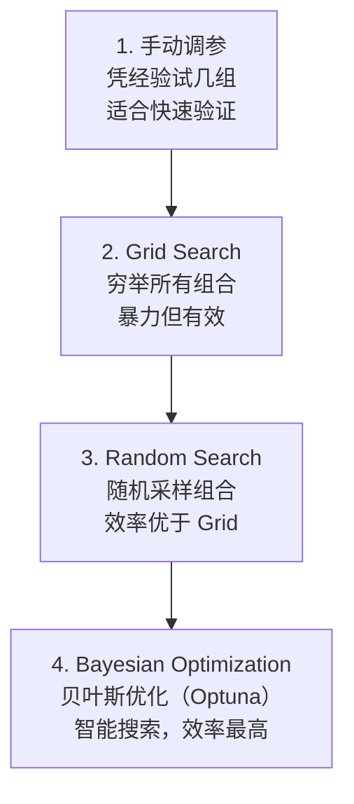

```python
import optuna

def objective(trial):
    params = {
        'n_estimators': trial.suggest_int('n_estimators', 100, 2000),
        'max_depth': trial.suggest_int('max_depth', 3, 10),
        'learning_rate': trial.suggest_float('learning_rate', 0.01, 0.3, log=True),
        'min_child_weight': trial.suggest_int('min_child_weight', 1, 20),
        'subsample': trial.suggest_float('subsample', 0.5, 1.0),
        'colsample_bytree': trial.suggest_float('colsample_bytree', 0.5, 1.0),
    }
    
    model = xgb.XGBClassifier(**params, objective='binary:logistic')
    model.fit(X_train, y_train, eval_set=[(X_val, y_val)],
              verbose=False, callbacks=[xgb.callback.EarlyStopping(50)])
    
    y_pred = model.predict_proba(X_val)[:, 1]
    return roc_auc_score(y_val, y_pred)

# 自动搜索最优参数（100次试验，通常10分钟内完成）
study = optuna.create_study(direction='maximize')
study.optimize(objective, n_trials=100)
print(f"Best AUC: {study.best_value:.4f}")
print(f"Best params: {study.best_params}")
```

### 5.5 Bias-Variance Tradeoff（偏差-方差权衡）

```
ML 的误差可以分解为三部分：

  总误差 = Bias² + Variance + 不可约噪声

  Bias（偏差）：
    模型的"系统性错误"
    → 模型太简单，学不到真正的规律
    → 例：用 LR（直线）拟合一条抛物线 → 永远偏
    → 高偏差 = 欠拟合

  Variance（方差）：
    模型对不同训练数据的"敏感度"
    → 换一批训练数据，模型预测变化很大
    → 例：单棵决策树，数据换几个点就长出完全不同的树
    → 高方差 = 过拟合

  不可约噪声：
    数据本身的随机性，再好的模型也消除不了
    → 例：同一个用户在相同条件下，有时点击有时不点击

  权衡：
    模型越复杂 → Bias ↓ 但 Variance ↑
    模型越简单 → Variance ↓ 但 Bias ↑
    最优模型 = 在 Bias 和 Variance 之间找到平衡点
```

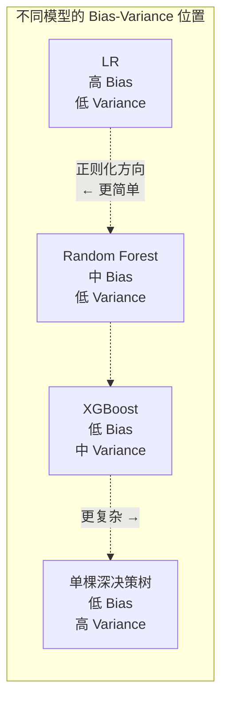

```
各模型的 Bias-Variance 特性：

  LR：高 Bias + 低 Variance → 稳定但上限低
  随机森林：降 Variance（500 棵树平均）→ 最稳定的选择
  XGBoost：降 Bias（每棵树纠错）→ 精度最高，但需要调参防过拟合
  单棵深决策树：低 Bias + 高 Variance → 过拟合严重

  正则化的本质 = 牺牲一点 Bias 来大幅降 Variance
    限制树深度 → 树更简单 → Bias ↑ 一点，但 Variance ↓ 很多
    L2 正则化 → 权重不能太大 → 模型更"平滑"
    Early Stopping → 不让模型学到噪声

  增加数据量 = 同时降 Variance（不太降 Bias）
    → 如果模型是高 Bias（欠拟合），加数据无效
    → 如果模型是高 Variance（过拟合），加数据有效
    → 这就是为什么要先判断是 Bias 问题还是 Variance 问题
```

### 5.6 过拟合 vs 欠拟合

```
过拟合（Overfitting）：
  训练集 AUC = 0.99，测试集 AUC = 0.75
  → 模型把训练数据的噪声也记住了，遇到新数据就不行

欠拟合（Underfitting）：
  训练集 AUC = 0.60，测试集 AUC = 0.58
  → 模型太简单，连训练数据的规律都没学到

  ┌───────────────────────────────────────────────────┐
  │  模型复杂度 →                                      │
  │                                                    │
  │  Error                                             │
  │   │                                                │
  │   │ ╲               ╱ 测试误差                      │
  │   │  ╲             ╱                                │
  │   │   ╲    最佳   ╱                                 │
  │   │    ╲   ↓    ╱                                   │
  │   │     ╲─────╱                                     │
  │   │      ╲  ╱                                       │
  │   │       ╲╱───────── 训练误差                       │
  │   └────────────────────────────── 复杂度              │
  │   欠拟合    刚好        过拟合                        │
  └───────────────────────────────────────────────────┘

  对抗过拟合的武器（正则化）：
    1. 限制树深度（max_depth）
    2. 增加最小叶节点样本数（min_child_samples）
    3. L1/L2 正则化
    4. 行/列采样（subsample, colsample_bytree）
    5. Early Stopping（验证集不提升就停训）
    6. 增加数据量（最根本的解决方案）
```

---

### 5.7 集成方法进阶——Stacking 与 Blending

```
除了 Bagging（随机森林）和 Boosting（XGBoost），还有一种集成方法：Stacking。

Stacking（堆叠）：

  思路：不同模型各有所长，让它们"分工合作"
  → 用多个模型的预测结果作为新特征 → 再用一个"元模型"整合

  两层结构：
    Layer 1（基模型）：
      模型 A（XGBoost）→ 预测 0.73
      模型 B（LightGBM）→ 预测 0.68
      模型 C（LR）→ 预测 0.81
    
    Layer 2（元模型）：
      输入：[0.73, 0.68, 0.81]（Layer 1 的预测值）
      模型：简单 LR
      输出：最终预测 0.75

  关键细节：
    Layer 1 的预测不能用训练数据！→ 要用 K-Fold 交叉预测
    否则 Layer 1 模型会过拟合 → 元模型学到的是"哪个模型过拟合得厉害"

  Blending：
    比 Stacking 简单——把数据分成两部分
    Part 1 训练基模型 → Part 2 上跑预测 → 预测值训练元模型
    → 不用 K-Fold，更快但浪费数据
```

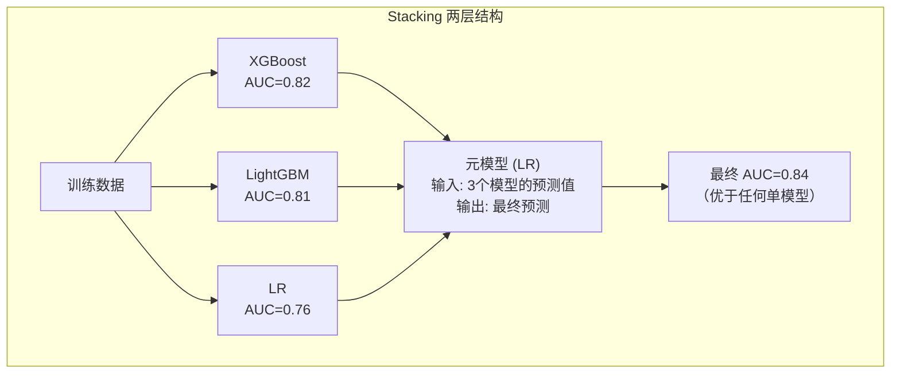

```
Stacking 使用建议：

  ✅ Kaggle 竞赛必备技巧（Top 方案几乎都用）
  ✅ 基模型越"不同"效果越好（树模型 + 线性模型 + NN）
  ❌ 工业界用得少——增加复杂度和延迟，收益通常不大
  ❌ 不如把时间花在特征工程上

  工业界的折中：
    线上用单个 XGBoost（简单、快速）
    离线竞赛/重要项目才用 Stacking
```

---

## VI. Evaluation — 模型评估

### 6.1 核心指标一览

```mermaid
flowchart TD
    TASK["你的任务是什么？"]
    TASK -->|二分类| BIN["AUC / F1 / Precision / Recall"]
    TASK -->|多分类| MULTI["Macro-F1 / Weighted-F1"]
    TASK -->|回归| REG["RMSE / MAE / R²"]
    TASK -->|排序| RANK["NDCG / MAP / MRR"]
    TASK -->|推荐/广告| AD["AUC + 在线 CTR/CVR<br/>（离线+在线双重评估）"]
```

### 6.2 二分类核心指标详解

```
混淆矩阵（Confusion Matrix）：

                    预测为正    预测为负
  实际为正         TP (真正)    FN (假负)
  实际为负         FP (假正)    TN (真负)

  Accuracy = (TP + TN) / 总数        ← 样本不平衡时不可靠！
  Precision = TP / (TP + FP)          ← "预测为正的里面有多少是对的"
  Recall = TP / (TP + FN)             ← "实际为正的有多少被找出来了"
  F1 = 2 × Precision × Recall / (Precision + Recall)

  场景决策：
    风控/反欺诈：优先 Recall（宁可误报，不能漏报）
    广告排序：优先 AUC（整体排序能力）
    垃圾邮件：优先 Precision（别把正常邮件误杀）

  AUC（Area Under ROC Curve）：
    含义：随机取一个正样本和一个负样本，模型给正样本打分更高的概率
    AUC = 0.5 → 随机猜（模型没用）
    AUC = 0.7 → 一般
    AUC = 0.8 → 不错
    AUC = 0.9 → 很好
    AUC = 1.0 → 完美（可能过拟合了）
    
    工业界标准：
      广告 CTR 预估：AUC 0.75~0.80 就是好模型
      风控：AUC 0.85+ 才能上线
      推荐粗排：AUC 0.70+ 即可（后面还有精排兜底）
```

### 6.3 ROC 曲线与 PR 曲线——怎么画、怎么读

```
ROC 曲线（Receiver Operating Characteristic）：

  X 轴：FPR（假正率）= FP / (FP + TN) = "把多少负样本误判为正"
  Y 轴：TPR（真正率）= TP / (TP + FN) = Recall = "找出了多少正样本"

  怎么画：
    1. 模型对每个样本输出一个概率（如 0.92, 0.45, 0.78, ...）
    2. 从高到低遍历每个概率作为阈值
    3. 每个阈值下计算 (FPR, TPR) 画一个点
    4. 连接所有点 → ROC 曲线

  AUC = ROC 曲线下方的面积

    1.0 ┌──────────────────────┐
        │ ╱‾‾‾‾‾‾‾‾‾‾‾‾‾‾‾‾  │
    TPR │╱   好模型             │ ← AUC 大 = 曲线靠左上
        │     (AUC = 0.85)     │
        │  ╱ ‾‾‾‾‾             │
        │╱   随机 (AUC = 0.5)  │ ← 对角线 = 随机猜
    0.0 └──────────────────────┘
        0.0        FPR        1.0

PR 曲线（Precision-Recall Curve）：

  X 轴：Recall（召回率）
  Y 轴：Precision（精确率）

  为什么需要 PR 曲线？
    当正负样本严重不平衡时（如欺诈 0.1%），ROC 曲线会"过于乐观"
    因为 FPR = FP / (FP + TN)，TN 很大 → FPR 始终很小 → 曲线看起来很好
    PR 曲线不受 TN 影响 → 更真实反映模型在稀有正样本上的能力

  选择建议：
    样本基本平衡 → 用 ROC / AUC
    正样本极少（欺诈/疾病）→ 用 PR / AP（Average Precision）
```

```python
from sklearn.metrics import roc_curve, precision_recall_curve, average_precision_score
import matplotlib.pyplot as plt

# ROC 曲线
fpr, tpr, thresholds = roc_curve(y_test, y_prob)
plt.plot(fpr, tpr, label=f'AUC = {roc_auc_score(y_test, y_prob):.3f}')
plt.plot([0, 1], [0, 1], 'k--', label='Random')
plt.xlabel('FPR')
plt.ylabel('TPR')
plt.title('ROC Curve')
plt.legend()

# PR 曲线
precision, recall, _ = precision_recall_curve(y_test, y_prob)
ap = average_precision_score(y_test, y_prob)
plt.plot(recall, precision, label=f'AP = {ap:.3f}')
plt.xlabel('Recall')
plt.ylabel('Precision')
plt.title('Precision-Recall Curve')
```

### 6.4 概率校准（Calibration）——广告出价必备

```
什么是概率校准？

  模型输出 0.3 → 意味着"这个样本有 30% 的概率是正类"？
  不一定！很多模型的输出概率是"不准"的。

  例：
    模型对 1000 个样本都输出概率 0.3
    如果概率准确 → 其中应该有 ~300 个确实是正类
    实际只有 150 个是正类 → 模型输出的概率偏高了

  为什么校准很重要（广告系统）：
    广告出价 = 预测 CTR × 广告主出价
    如果 CTR 预测偏高 → 平台多收钱 → 广告主发现效果差 → 撤预算
    如果 CTR 预测偏低 → 平台少收钱 → 浪费了流量
    → 预测概率必须准确，不能只排序对！

  AUC vs Calibration：
    AUC 只要求排序对：正样本得分 > 负样本得分（不关心绝对值）
    Calibration 要求绝对值准：输出 0.3 就要真的是 30%
    → 广告/风控场景两个都需要

  校准方法：
    1. Platt Scaling：用 sigmoid 函数拟合模型输出 → 校准后概率
    2. Isotonic Regression：非参数方法，更灵活
    3. Temperature Scaling：深度模型常用
```

```python
from sklearn.calibration import calibration_curve, CalibratedClassifierCV

# 查看校准度
prob_true, prob_pred = calibration_curve(y_test, y_prob, n_bins=10)

# 校准图：对角线 = 完美校准
plt.plot(prob_pred, prob_true, 'o-', label='Model')
plt.plot([0, 1], [0, 1], 'k--', label='Perfect')
plt.xlabel('Mean Predicted Probability')
plt.ylabel('Fraction of Positives')
plt.title('Calibration Curve')

# 用 Platt Scaling 校准
calibrated = CalibratedClassifierCV(model, method='sigmoid', cv=5)
calibrated.fit(X_train, y_train)
y_calibrated = calibrated.predict_proba(X_test)[:, 1]
```

### 6.5 SHAP——模型可解释性

```
模型预测了"这个用户会点击"——但为什么？哪个特征起了决定作用？

  SHAP（SHapley Additive exPlanations）：
    基于博弈论的 Shapley 值，给每个特征分配一个"贡献度"
    所有特征的 SHAP 值之和 = 模型的预测值 - 基线值

  直觉：
    你和 5 个同事完成一个项目，项目收入 100 万
    SHAP 就是公平地分配"每个人贡献了多少"
    → 考虑了所有排列组合，不会因为加入顺序不同而有偏

  SHAP 的三种可视化：
    1. 单样本解释：这个用户为什么被预测为"会点击"？
       → age=25 贡献 +0.12，income=高 贡献 +0.08，...
    2. 全局特征重要性：所有样本中哪些特征最重要？
       → 类似 XGBoost 的 feature_importance，但更准确
    3. 特征依赖图：特征值如何影响预测？
       → age 越大 → SHAP 值越负 → 越不可能点击
```

```python
import shap

# 计算 SHAP 值
explainer = shap.TreeExplainer(model)  # 树模型专用，速度快
shap_values = explainer.shap_values(X_test)

# 全局特征重要性
shap.summary_plot(shap_values, X_test, feature_names=feature_names)

# 单样本解释（为什么预测这个用户会点击？）
shap.force_plot(explainer.expected_value, shap_values[0], X_test[0],
                feature_names=feature_names)

# 特征依赖图（age 怎么影响预测？）
shap.dependence_plot("age", shap_values, X_test, feature_names=feature_names)
```

```
SHAP vs 传统 Feature Importance：

  XGBoost Feature Importance：
    基于 "Gain"（每个特征在分裂时带来多少增益）
    ✅ 快
    ❌ 只是粗略排名，不能说明"怎么影响"
    ❌ 高基数特征（如 user_id）会被高估

  SHAP：
    基于 Shapley 值，理论保证公平
    ✅ 可以解释单个样本
    ✅ 可以看到特征值和预测的关系（正/负影响）
    ✅ 对特征重要性的估计更准确
    ❌ 计算较慢（树模型用 TreeExplainer 可以加速）

  工业界使用：
    特征调试：发现某个特征 SHAP 值异常大 → 可能数据泄露
    业务解释：给业务方说明"为什么这个用户被判定为高风险"
    合规要求：金融/医疗领域，模型决策必须可解释
```

### 6.6 交叉验证

```mermaid
flowchart TD
    subgraph "5-Fold Cross Validation"
        F1["Fold 1: ████ test │ train train train train"]
        F2["Fold 2: train │ ████ test │ train train train"]
        F3["Fold 3: train train │ ████ test │ train train"]
        F4["Fold 4: train train train │ ████ test │ train"]
        F5["Fold 5: train train train train │ ████ test"]
    end
    
    F1 --> AVG["最终 AUC = 5 次的平均值<br/>更可靠、更稳定"]
    F2 --> AVG
    F3 --> AVG
    F4 --> AVG
    F5 --> AVG
```

```python
from sklearn.model_selection import StratifiedKFold, cross_val_score

# 5 折交叉验证
cv = StratifiedKFold(n_splits=5, shuffle=True, random_state=42)
scores = cross_val_score(model, X, y, cv=cv, scoring='roc_auc')

print(f"AUC: {scores.mean():.4f} ± {scores.std():.4f}")
# 例: AUC: 0.8234 ± 0.0067  (标准差小 → 模型稳定)
```

### 6.7 离线评估 vs 在线评估（A/B 测试）

```
ML 工业界的"黄金法则"：离线效果好 ≠ 线上效果好

  离线评估：
    用历史数据划分训练/测试集 → 计算 AUC/F1
    ✅ 快、便宜
    ❌ 可能有数据泄露、分布偏移

  A/B 测试（在线评估）：
    把真实流量分两组 → 一组用老模型，一组用新模型
    对比真实业务指标（点击率、转化率、收入）
    ✅ 最真实、最可靠
    ❌ 慢、有成本、需要基础设施

  工业界标准流程：
    1. 离线评估：AUC 提升 → 有资格做 A/B 测试
    2. A/B 测试：5% 流量先试 → 业务指标提升 → 扩大到 50% → 全量上线
    3. 全量上线后持续监控

  对比 LLM：
    LLM 应用很少做严格的 A/B 测试
    通常是"人工评测 + MMLU/HumanEval 跑分"
    → ML 的评估体系比 LLM 成熟得多
```

---

## VII. Deployment — 模型部署上线

### 7.1 部署全景

```mermaid
flowchart LR
    TRAIN["训练完成<br/>model.pkl / model.bin"]
    TRAIN --> SERIAL["模型序列化<br/>pickle / joblib / ONNX"]
    SERIAL --> SERVE["在线服务<br/>Flask / FastAPI / gRPC"]
    SERVE --> LB["负载均衡<br/>Nginx / K8s Service"]
    LB --> APP["业务系统<br/>调用 API 获取预测结果"]
    
    TRAIN --> BATCH["批量预测<br/>Spark / Hive<br/>（离线场景）"]
    BATCH --> DB["结果写入数据库<br/>供业务查询"]
```

### 7.2 在线服务（实时推理）

```python
# === 最简单的 ML 在线服务 ===

from fastapi import FastAPI
import joblib
import numpy as np

app = FastAPI()

# 启动时加载模型（几 MB，毫秒级加载）
model = joblib.load("model.joblib")

@app.post("/predict")
async def predict(features: list[float]):
    """
    输入: 特征向量 (如 [25, 1, 12, 3.5, ...])
    输出: 预测概率
    """
    X = np.array(features).reshape(1, -1)
    prob = model.predict_proba(X)[0, 1]
    return {"probability": float(prob)}

# 启动: uvicorn server:app --host 0.0.0.0 --port 8000
# 性能: 单核 CPU 可达 ~5000 QPS（对比 LLM: ~10 QPS per GPU）
```

### 7.3 特征在线服务——推理时特征从哪来？

训练时特征来自离线数据仓库，拼好一张大表慢慢算。但**线上推理时**，你需要在 **< 10ms** 内拿到所有特征——这是 ML 部署最容易被忽视的难题。

```mermaid
flowchart TD
    REQ["用户请求到达<br/>user_id=u001, item_id=i042"]
    
    REQ --> FS["Feature Store / 特征服务"]
    
    subgraph FS["特征获取（必须 < 5ms）"]
        direction TB
        CACHE["Redis / 本地缓存<br/>预计算的用户特征<br/>（近7天点击数、偏好品类...）"]
        RT["实时计算<br/>当前 session 停留时长<br/>本次已浏览商品数"]
        DB["数据库查询<br/>用户基础信息<br/>商品基础信息"]
    end
    
    FS --> VEC["拼接特征向量<br/>[25, 1, 12, 3.5, ...]"]
    VEC --> MODEL["模型推理<br/>model.predict(X)<br/>（< 1ms）"]
    MODEL --> RESP["返回预测结果<br/>probability: 0.73"]
```

```
线上特征服务的三种来源：

  1. 预计算特征（离线 → 缓存）
     每天/每小时离线跑一遍 → 结果存 Redis/Memcached
     例: 用户过去7天点击数、用户RFM评分、商品7日CTR
     → 读取延迟 < 1ms

  2. 实时特征（在线计算）
     在请求到达时实时计算
     例: 本次 session 已浏览商品数、当前页面停留时间
     → 需要 Flink / Spark Streaming 实时流处理

  3. 请求自带特征（上下文）
     请求本身就包含的信息
     例: 设备类型、当前时间、地理位置、网络类型
     → 直接从请求中解析，零延迟

  工业级架构的核心组件——Feature Store：
  
    Feature Store = 特征的"数据仓库"，统一管理离线+在线特征
    
    功能：
      - 特征注册：定义每个特征的计算逻辑、更新频率
      - 离线写入：离线 pipeline 每天/每小时更新特征
      - 在线读取：线上服务通过 API 读取特征（< 1ms）
      - 一致性保证：训练和推理用同一套特征定义 → 避免 train-serve skew
    
    开源方案：
      - Feast：最流行的开源 Feature Store
      - Tecton：商业方案（Feast 创始人的公司）
      - 字节跳动/阿里/美团：都有自研 Feature Store

  为什么这很重要：
    训练时你可以慢慢从 Hive 里拼特征（几分钟无所谓）
    线上推理时你只有 5ms 来获取所有特征
    如果特征获取太慢 → 超时 → 用户体验下降
    如果训练和线上用的特征不一致 → 效果大打折扣
    → 这个问题叫 "Training-Serving Skew"，是 ML 工程化的核心挑战
```

```python
# === Feast Feature Store 使用示例 ===

from feast import FeatureStore

store = FeatureStore(repo_path="feature_repo/")

# 在线获取特征（< 1ms）
features = store.get_online_features(
    features=[
        "user_features:click_7d",
        "user_features:purchase_30d",
        "user_features:avg_price",
        "item_features:ctr_7d",
        "item_features:price",
    ],
    entity_rows=[
        {"user_id": "u001", "item_id": "i042"}
    ]
).to_dict()

# 拼成特征向量 → 喂给模型
import numpy as np
X = np.array([[
    features["click_7d"][0],
    features["purchase_30d"][0],
    features["avg_price"][0],
    features["ctr_7d"][0],
    features["price"][0],
]])
prob = model.predict_proba(X)[0, 1]
```

### 7.4 批量预测（离线推理）

```python
# === 批量预测 + 写入数据库 ===

import pandas as pd
import joblib

model = joblib.load("model.joblib")
df = pd.read_parquet("daily_features.parquet")  # 今天要预测的数据

# 批量推理（百万级样本，几秒钟）
df['score'] = model.predict_proba(df[feature_cols])[:, 1]

# 写入数据库供业务使用
df[['user_id', 'item_id', 'score']].to_sql('predictions', engine, if_exists='replace')
```

### 7.5 模型文件格式

```
ML 模型的序列化格式远比 LLM 简单：

  格式           大小        加载速度    跨语言    典型场景
  ─────────────────────────────────────────────────────
  pickle/joblib  几 MB       毫秒       ❌ Python  Python 服务
  ONNX           几 MB       毫秒       ✅ 通用    C++/Java/Go 服务
  PMML           几 MB       毫秒       ✅ 通用    传统企业（Java）
  模型原生格式    几 MB       毫秒       部分      XGBoost .bin, LGB .txt
  
  对比 LLM：
    LLM 的 .pt/.safetensors: 几 GB~几百 GB，加载需要分钟级+GPU
    ML 的 .joblib: 几 MB，加载需要毫秒级+CPU
```

---

## VIII. Monitoring & Iteration — 监控与迭代

### 8.1 为什么 ML 模型会"变老"

```mermaid
flowchart TD
    A["模型上线 Day 1<br/>AUC = 0.82"] --> B["Day 30<br/>AUC = 0.80"]
    B --> C["Day 90<br/>AUC = 0.76"]
    C --> D["Day 180<br/>AUC = 0.70 ⚠️"]
    D --> E["触发告警<br/>需要重训"]
    
    F["为什么会衰减？"] --> G["Data Drift<br/>特征分布变了<br/>例: 促销期间用户行为巨变"]
    F --> H["Concept Drift<br/>规律本身变了<br/>例: 新冠导致消费模式改变"]
    F --> I["Label Drift<br/>标签含义变了<br/>例: 欺诈手法升级"]
```

### 8.2 监控体系

```
ML 线上监控三层：

  Layer 1: 系统指标
    - 推理延迟 P50/P99
    - QPS / 错误率
    - CPU/内存使用率
    → 和普通微服务监控一样

  Layer 2: 数据指标
    - 特征缺失率是否突增
    - 特征分布是否偏移（PSI / KL 散度）
    - 预测分布是否异常（全是0？全是1？）
    → ML 独有的监控

  Layer 3: 业务指标
    - 点击率是否下降
    - 转化率是否下降
    - 收入是否下降
    → 最终检验标准

  告警阈值示例：
    PSI > 0.1 → 特征漂移预警
    PSI > 0.25 → 特征严重漂移，必须重训
    AUC 下降 > 2% → 模型性能告警
```

### 8.3 PSI（Population Stability Index）——漂移检测的标准工具

```
PSI 衡量"特征（或预测）的分布和训练时相比变化了多少"

  公式：
    PSI = Σᵢ (Pᵢ - Qᵢ) × ln(Pᵢ / Qᵢ)

    P = 当前数据在第 i 个桶中的占比
    Q = 训练数据在第 i 个桶中的占比
    i = 分桶（通常分 10 个等频桶）

  计算示例：
    假设特征"年龄"分成 5 个桶：

    桶        训练时占比(Q)    当前占比(P)    (P-Q)×ln(P/Q)
    ─────────────────────────────────────────────────────
    < 20岁     0.10            0.08          -0.02 × ln(0.8) = 0.004
    20-30岁    0.30            0.25          -0.05 × ln(0.83) = 0.009
    30-40岁    0.35            0.40          +0.05 × ln(1.14) = 0.007
    40-50岁    0.15            0.17          +0.02 × ln(1.13) = 0.002
    > 50岁     0.10            0.10           0.00
    ─────────────────────────────────────────────────────
    PSI = 0.004 + 0.009 + 0.007 + 0.002 + 0.000 = 0.022

  判定标准：
    PSI < 0.1  → 分布稳定，无需操作
    0.1 ≤ PSI < 0.25 → 有漂移，关注并考虑重训
    PSI ≥ 0.25 → 严重漂移，必须重训！
    
  上面例子 PSI = 0.022 → 分布稳定 ✅
```

```python
import numpy as np

def calculate_psi(expected, actual, bins=10):
    """计算 PSI"""
    # 用训练集的分位数定义桶边界
    breakpoints = np.percentile(expected, np.linspace(0, 100, bins + 1))
    breakpoints[0] = -np.inf
    breakpoints[-1] = np.inf
    
    # 计算每个桶的占比
    expected_counts = np.histogram(expected, bins=breakpoints)[0] / len(expected)
    actual_counts = np.histogram(actual, bins=breakpoints)[0] / len(actual)
    
    # 避免除零
    expected_counts = np.clip(expected_counts, 1e-6, 1)
    actual_counts = np.clip(actual_counts, 1e-6, 1)
    
    # PSI
    psi = np.sum((actual_counts - expected_counts) * np.log(actual_counts / expected_counts))
    return psi

# 使用
psi = calculate_psi(X_train['age'], X_today['age'])
print(f"Age PSI: {psi:.4f}")
if psi >= 0.25:
    print("⚠️ 严重漂移！需要重训模型")
elif psi >= 0.1:
    print("⚠️ 有漂移，建议关注")
else:
    print("✅ 分布稳定")
```

### 8.4 重训策略

```mermaid
flowchart TD
    A["定时重训<br/>每天/每周自动重训<br/>用最新数据"]
    B["触发重训<br/>PSI 超阈值 or<br/>业务指标下降"]
    C["增量重训<br/>在旧模型基础上<br/>加入新数据继续训"]
    
    A --> D["适用: 广告/推荐<br/>数据分布变化快"]
    B --> E["适用: 风控/搜索<br/>稳定期不需频繁重训"]
    C --> F["适用: 数据量极大<br/>全量重训太慢"]
```

### 8.5 ML 迭代的核心——开发新特征

```
ML 项目的迭代不是"换更好的模型"，而是"开发更好的特征"。

  迭代循环：

    发现业务问题 → 分析 bad case → 设计新特征 → 验证提升 → 上线
    
  真实案例（电商推荐）：

    问题：新用户推荐效果差（AUC 只有 0.65）
    分析：新用户缺少行为特征，模型几乎在"盲猜"
    新特征设计：
      - 注册来源（是否来自广告、分享、自然搜索）
      - 注册后前 5 分钟浏览的品类
      - 设备型号（iPhone 15 Pro 用户消费力更强）
      - 地理位置（一线城市 vs 三线城市）
    结果：新用户 AUC 从 0.65 → 0.72

  对比 LLM：
    LLM 的迭代是"加更多数据 + 更大模型 + 更好的对齐"
    ML 的迭代是"开发更好的特征"
    → 本质不同：LLM 自动学特征，ML 要人想特征
```

---

## IX. Industrial Cases — 工业案例

### 9.1 广告点击率预估（CTR Prediction）

```mermaid
flowchart LR
    REQ["广告请求<br/>用户 + 上下文"]
    REQ --> RECALL["召回<br/>从10万广告中<br/>选出1000个候选"]
    RECALL --> COARSE["粗排<br/>简单模型快速打分<br/>选出100个"]
    COARSE --> FINE["精排<br/>复杂模型精确打分<br/>选出10个"]
    FINE --> RERANK["重排<br/>考虑多样性/商业规则<br/>最终展示顺序"]
    
    RECALL -.->|"< 1ms"| COARSE
    COARSE -.->|"< 5ms"| FINE
    FINE -.->|"< 10ms"| RERANK
```

```
广告系统是 ML 应用最成熟的领域（每年产生数千亿美元收入）

  规模：
    Google Ads: 每天处理几百亿次广告请求
    字节跳动: 每天处理几千亿次展示决策
    
  延迟要求：
    从用户打开 App 到广告展示 < 100ms
    其中 ML 预测部分 < 10ms
    → 不可能用 LLM（1秒太慢了）

  模型演进：
    2010: LR（逻辑回归）
    2014: GBDT + LR（Facebook 论文）
    2016: Wide & Deep（Google 论文）
    2017: DeepFM（华为）
    2019: DIN / DIEN（阿里）
    2021: SIM（阿里，超长行为序列建模）
    2023+: LLM 辅助（生成广告文案 / 理解用户意图） + ML 排序

  关键指标：
    CTR（点击率）: 用户看到广告后点击的概率
    CVR（转化率）: 点击后购买/注册的概率
    eCPM（千次展示收入）: CTR × 出价 × 1000
```

### 9.2 风控 / 反欺诈

```
银行/支付公司的风控系统是 ML 的经典应用

  场景：
    用户刷卡 → 5ms 内判断是否欺诈 → 通过 or 拦截
    
  特征体系：
    - 交易特征：金额、时间、地点、商户类型
    - 用户画像：历史消费模式、常用设备、常去地点
    - 行为序列：最近 10 笔交易的模式
    - 关系网络：和已知欺诈账户的关联度
    - 设备指纹：是否用模拟器、IP 是否异常

  模型：
    第一层：规则引擎（金额 > 50万 → 直接拦截）
    第二层：XGBoost / LightGBM（综合判断）
    第三层：图神经网络（发现团伙欺诈）

  挑战：
    - 极度不平衡：欺诈交易 < 0.1%
    - 零容忍：漏放一笔欺诈 = 几万~几百万损失
    - 对抗性：欺诈者会不断升级手法
    → 需要 Recall 优先 + 持续重训
```

### 9.3 推荐系统

```mermaid
flowchart TD
    subgraph "推荐系统四阶段"
        A["召回<br/>从几百万商品中<br/>选出几千个<br/>（多路召回：CF/向量/热门）"]
        B["粗排<br/>轻量模型快速打分<br/>选出几百个<br/>（双塔模型/LR）"]
        C["精排<br/>复杂模型精确打分<br/>选出几十个<br/>（DeepFM/DIN）"]
        D["重排<br/>打散/去重/多样性<br/>最终展示<br/>（规则+探索）"]
    end
    
    A --> B --> C --> D
```

```
推荐系统 = 互联网公司的"印钞机"

  体量：
    抖音：日活 7 亿 × 平均刷 100+ 视频 = 每天 700 亿次推荐决策
    淘宝：日活 3 亿 × 浏览几十个商品 = 每天 100 亿次推荐决策
    Netflix：给 2 亿用户推荐电影 = 每天几十亿次推荐决策

  为什么用 ML 不用 LLM：
    1. 规模：每天几百亿次请求，LLM 成本不可接受
    2. 延迟：< 50ms 内完成整个推荐流程
    3. 数据类型：用户行为是结构化数据，LLM 处理文本更在行
    4. 可控性：推荐需要精确控制商业规则（如广告位比例）
```

### 9.4 搜索排序（Learning to Rank）

```mermaid
flowchart LR
    Q["用户查询<br/>'python 教程'"]
    Q --> RECALL2["召回<br/>倒排索引<br/>BM25 / ES<br/>→ 1000 条结果"]
    RECALL2 --> RANK["ML 排序<br/>LambdaMART / XGBoost<br/>→ 排出最优顺序"]
    RANK --> SHOW["展示 Top 10"]
```

```
搜索排序是 ML 最经典的应用之一（Google 起家就靠这个）

  问题定义：
    给定查询 q 和候选文档集合 {d₁, d₂, ..., dₙ}
    → 给每个文档打分 → 按分数排序 → 展示给用户

  三种排序学习方法：
    Pointwise：每个文档独立预测相关性分数（回归/分类问题）
    Pairwise：学习文档对的相对顺序（LambdaRank）
    Listwise：直接优化整个排序列表的 NDCG（LambdaMART）

  特征体系（搜索特有）：
    查询特征：查询长度、是否包含品牌词、查询意图分类
    文档特征：PageRank、文档长度、新鲜度、权威性
    匹配特征：BM25 分数、TF-IDF 相似度、查询词覆盖率
    用户特征：用户历史点击偏好
    上下文特征：设备、时间、地理位置

  评估指标（排序专用）：
    NDCG@K（Normalized Discounted Cumulative Gain）：
      考虑排序位置的加权指标——排在前面的错误比排在后面的更严重
    MRR（Mean Reciprocal Rank）：
      第一个相关结果的位置的倒数
    MAP（Mean Average Precision）：
      所有查询的平均精度

  2026 年的搜索排序：
    粗排：BM25 / 简单 ML → 快速缩小候选集
    精排：LambdaMART (XGBoost 变体) / Cross-Encoder (BERT)
    → 传统 ML 和 LLM 各管一段，互不替代
```

### 9.5 量化交易

```
量化交易对 ML 的要求最为极端

  延迟：
    高频交易：< 1 微秒推理
    中频策略：< 1 毫秒推理
    → LLM 的 1 秒延迟差了 6 个数量级

  模型：
    多数量化基金用最简单的模型：LR、GBDT
    不用深度学习（不稳定、不可解释、过拟合风险大）
    
  特征：
    行情特征：价格、成交量、波动率、订单簿深度
    技术指标：MACD、RSI、布林带
    另类数据：新闻情绪、卫星图像、社交媒体热度

  ML 在量化中的角色：
    不是"预测涨跌"（准确率能到 52% 就是顶级了）
    而是"在海量信号中找到微弱但稳定的统计规律"
    → 胜率 52% × 每天交易 10000 次 = 稳定盈利
```

---

## X. ML in the LLM Era — 大模型时代的 ML

### 10.1 ML 和 LLM 的关系——共存而非取代

```mermaid
flowchart LR
    subgraph "ML 的领地（2026 年不变）"
        A1["广告排序"]
        A2["推荐系统"]
        A3["风控反欺诈"]
        A4["量化交易"]
        A5["搜索排序"]
        A6["工业质检"]
    end
    
    subgraph "LLM 的领地（2020+ 新增）"
        B1["对话/问答"]
        B2["文本生成"]
        B3["代码生成"]
        B4["多模态理解"]
        B5["Agent/规划"]
    end
    
    subgraph "融合地带（正在发生）"
        C1["LLM 辅助特征工程"]
        C2["LLM 做粗理解 + ML 做精决策"]
        C3["LLM 生成训练数据 → 训练 ML"]
        C4["ML Embedding → RAG 检索"]
    end
```

### 10.2 MLOps 平台——工业级 ML 的基础设施

```
MLOps = Machine Learning Operations
= 把 ML 模型从"笔记本里跑通"变成"线上稳定运行"的一整套基础设施

  如果说模型是"引擎"，MLOps 就是"整条生产线 + 公路 + 加油站"。
```

```mermaid
flowchart TD
    subgraph "MLOps 全景"
        FP["Feature Platform<br/>特征平台<br/>Feast / Tecton"]
        DP["Data Pipeline<br/>数据流水线<br/>Airflow / Dagster"]
        TR["Training Platform<br/>训练平台<br/>Kubeflow / SageMaker"]
        EX["Experiment Tracking<br/>实验追踪<br/>MLflow / W&B"]
        MR["Model Registry<br/>模型注册中心<br/>MLflow / Vertex AI"]
        SV["Serving Platform<br/>推理服务<br/>Seldon / BentoML"]
        MN["Monitoring<br/>监控<br/>Evidently / Prometheus"]
    end
    
    FP --> DP --> TR --> EX --> MR --> SV --> MN
    MN -->|"漂移告警"| TR
```

| 组件 | 功能 | 开源方案 | 云服务方案 |
|------|------|---------|-----------|
| **数据流水线** | 定时 ETL、特征计算 | Airflow, Dagster, Prefect | AWS Step Functions, GCP Dataflow |
| **特征平台** | 特征注册、在线/离线服务 | Feast | Tecton, Databricks Feature Store |
| **实验追踪** | 记录每次实验的参数/指标/模型 | MLflow, W&B (Weights & Biases) | SageMaker Experiments |
| **训练平台** | 分布式训练、GPU 调度 | Kubeflow, Ray | SageMaker, Vertex AI |
| **模型注册** | 模型版本管理、审批上线 | MLflow Model Registry | SageMaker Model Registry |
| **推理服务** | 模型部署、A/B 测试、灰度 | Seldon, BentoML, KServe | SageMaker Endpoint, Vertex AI |
| **监控** | 漂移检测、性能告警 | Evidently, NannyML | SageMaker Monitor |

```
为什么需要 MLOps？

  没有 MLOps 的团队：
    - 模型在 Jupyter Notebook 里训好 → 手动导出 → 手动部署
    - "上次训的模型参数是什么？" → "不记得了"
    - "线上模型是哪个版本？" → "好像是上周那个"
    - "模型效果下降了" → "什么时候开始的？不知道"
    → 这就是为什么 87% 的 ML 项目无法上线（Gartner 数据）

  有 MLOps 的团队：
    - 每次实验自动记录参数/指标/模型 → 随时可复现
    - 模型注册中心管理所有版本 → 一键回滚
    - 自动化流水线：数据更新 → 重训 → 评估 → 灰度 → 全量
    - 监控告警：漂移/性能下降 → 自动触发重训
    → 从"手工作坊"变成"工业流水线"
```

```python
# === MLflow 实验追踪示例 ===

import mlflow
import xgboost as xgb
from sklearn.metrics import roc_auc_score

mlflow.set_experiment("ctr_prediction")

with mlflow.start_run(run_name="xgb_v3"):
    # 记录超参数
    params = {"n_estimators": 500, "max_depth": 6, "learning_rate": 0.1}
    mlflow.log_params(params)
    
    # 训练
    model = xgb.XGBClassifier(**params)
    model.fit(X_train, y_train)
    
    # 记录指标
    y_prob = model.predict_proba(X_test)[:, 1]
    auc = roc_auc_score(y_test, y_prob)
    mlflow.log_metric("auc", auc)
    
    # 保存模型到注册中心
    mlflow.xgboost.log_model(model, "model", registered_model_name="ctr_model")
    
    print(f"AUC: {auc:.4f}, Run ID: {mlflow.active_run().info.run_id}")

# 之后可以：
# 1. 在 MLflow UI 上对比所有实验的参数/指标
# 2. 选最好的模型 → 标记为 "Production"
# 3. 推理服务加载 "Production" 版本 → 自动切换
```

### 10.3 ML 工程师的技能栈

```
2026 年 ML 工程师的核心技能：

  必备：
    - Python (pandas / numpy / sklearn)
    - 特征工程（业务理解 + 数据加工）
    - XGBoost / LightGBM 调参
    - SQL（从数仓提取数据）
    - 评估方法（AUC / 交叉验证 / A/B 测试）

  加分：
    - Spark / Flink（大数据处理）
    - 推荐系统架构（召回/粗排/精排/重排）
    - 深度学习基础（PyTorch / TensorFlow）
    - LLM 应用（RAG / Prompt Engineering）
    - MLOps（模型监控、自动重训、特征平台）

  薪资参考（2026 年）：
    初级 ML 工程师：30-50 万/年
    高级 ML 工程师：50-100 万/年
    推荐/广告算法专家：100-200 万/年
    量化 ML 工程师：100-500+ 万/年
```

### 10.4 全链路一张图

```mermaid
flowchart TD
    BIZ["业务需求<br/>'预测用户是否点击'"] 
    --> DATA["数据收集<br/>数据库 + 日志 + 埋点"]
    --> CLEAN["数据清洗<br/>缺失值/异常值/平衡"]
    --> EDA["EDA<br/>探索数据、发现规律"]
    --> FEAT["特征工程<br/>（核心！60-70% 时间）"]
    --> MODEL["模型选择与训练<br/>XGBoost / LightGBM"]
    --> EVAL["评估<br/>AUC/F1 + 交叉验证"]
    --> AB["A/B 测试<br/>5% 流量验证"]
    --> DEPLOY["部署上线<br/>CPU，< 1ms 延迟"]
    --> MONITOR["监控<br/>漂移检测 + 业务指标"]
    --> ITER["迭代<br/>开发新特征"]
    ITER -->|循环| FEAT
```

**这就是传统 ML 的完整一条龙。** 和大模型相比，它更轻、更快、更便宜，但需要更多的人工智慧（特征工程）。在结构化数据、低延迟、高吞吐的场景中，它在 2026 年依然是无可替代的选择。

> 对比阅读：大模型视角的全链路见 [ai-34（从模型诞生到 AI 应用全链路认知）](@/articles/ai/ai-34-从模型诞生到AI应用全链路认知.md)。
