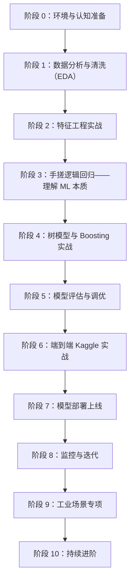
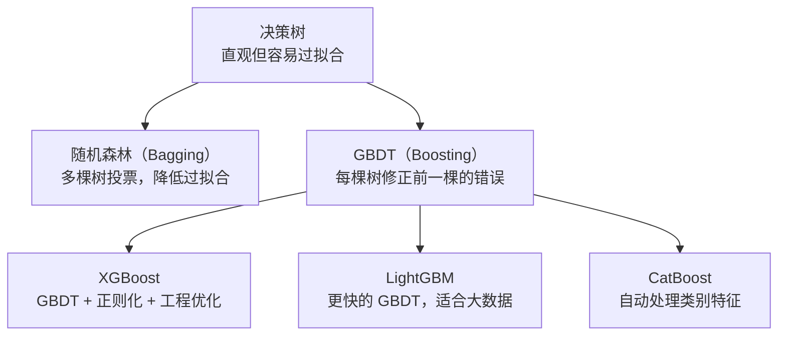
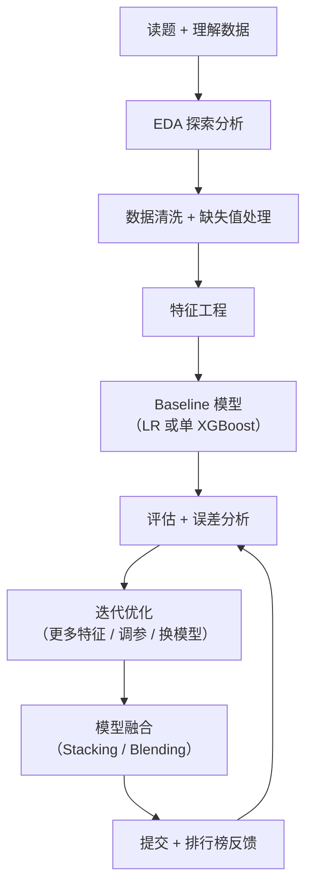

+++
title = "38. 个人传统机器学习实操路线：从零到工业级"
description = "面向有编程经验的工程师，用笔记本电脑走通传统 ML 全链路：数据分析 → 特征工程 → 手搓模型 → 树模型实战 → Early Stopping → 评估调优 → 概率校准 → 不平衡处理 → Kaggle 竞赛 → 部署上线 → A/B 测试 → 监控迭代 → 工业场景"
date = 2026-02-14
weight = 38000
draft = false

[taxonomies]
tags = ["ML", "机器学习", "Learning Path", "Hands-on", "特征工程", "XGBoost"]
+++

本文是一份**可执行的个人学习路线图**，目标是让一个有编程经验的工程师（不限语言背景），用笔记本电脑（不需要 GPU），**亲手走通传统机器学习一条龙的每个阶段**。

> **与其他文章的关系**：
> - 理论认知参考 [ai-36（传统机器学习从零到产品全链路）](@/articles/ai/ai-36-传统机器学习从零到产品全链路.md)——本文**不重复理论**，只讲"你该动手做什么"。
> - 大模型/LLM 的实操路线见 [ai-37（个人 AI 大模型学习实操路线）](@/articles/ai/ai-37-个人AI大模型学习实操路线.md)——本文**只覆盖传统 ML 方向**。

> **ML vs LLM 学习路线的核心区别**：
> - LLM 路线的核心是**模型使用**——Prompt Engineering、RAG、Agent，个人很难从零训练大模型。
> - ML 路线的核心是**特征工程 + 模型训练**——你亲手做数据、造特征、训模型、调参、部署，全流程个人可控。
> - ML 不需要 GPU，笔记本 CPU 跑完全程。

---

## 全景路线图



| 阶段 | 核心目标 | 你会掌握什么 | 硬件要求 | 时间估算 |
|------|---------|------------|---------|---------|
| 0 | 环境与认知 | Python 数据科学环境、ML 全貌认知 | 笔记本 | 2~3 天 |
| 1 | 数据分析与清洗 | pandas、EDA、缺失值/异常值处理、数据可视化 | 笔记本 | 1~2 周 |
| 2 | 特征工程实战 | 编码、缩放、特征构造、特征选择 | 笔记本 | 1~2 周 |
| 3 | 手搓逻辑回归 | 梯度下降、损失函数、正则化的直觉 | 笔记本 | 1 周 |
| 4 | 树模型与 Boosting | 决策树 → 随机森林 → XGBoost/LightGBM、Early Stopping | 笔记本 | 1~2 周 |
| 5 | 模型评估与调优 | AUC/F1/PR 曲线、交叉验证、超参搜索、SHAP、概率校准、不平衡数据处理 | 笔记本 | 1~2 周 |
| 6 | Kaggle 端到端实战 | 完整竞赛流程：EDA → 特征 → 模型 → 融合 → 提交、优化路径 | 笔记本 | 2~3 周 |
| 7 | 模型部署上线 | ONNX/PMML 导出、FastAPI 服务、Docker、特征在线化、A/B 测试 | 笔记本 | 1 周 |
| 8 | 监控与迭代 | 数据漂移检测（PSI）、重训策略、特征迭代 | 笔记本 | 3~5 天 |
| 9 | 工业场景专项 | 推荐/广告/风控/搜索排序的 ML 实践 | 笔记本 | 1~2 周 |
| 10 | 持续进阶 | 论文阅读、竞赛、开源贡献、方向选择 | — | 持续 |

> **总时间**：全程约 **10~14 周**（业余时间）。**全程不需要 GPU**——这是 ML 相比 LLM 最大的学习优势。阶段 1~5 可以穿插进行，阶段 6 是对前面所有技能的综合演练。

---

## 阶段 0：环境与认知准备

**目标**：搭好数据科学开发环境，建立对传统 ML 全貌的认知框架。

### 0.1 认知准备

- 通读 ai-36 文章，重点理解：ML 是什么、数据/特征/模型/评估/部署各环节做什么、ML 和 LLM 的区别。
- 关键认知：**特征工程决定天花板，模型只是逼近天花板**。ML 70% 的工作量在数据和特征上，不在模型上。
- 第二个关键认知：**ML 不需要 GPU**。一个 Kaggle 冠军方案跑在你的笔记本 CPU 上，几分钟就出结果。

### 0.2 环境搭建

- **Python 环境**：用 conda 管理虚拟环境（推荐 Miniconda）。
- **核心库安装**：
  - **数据处理**：pandas、numpy
  - **可视化**：matplotlib、seaborn、plotly
  - **建模**：scikit-learn、xgboost、lightgbm
  - **评估/可解释**：shap
- **Jupyter Notebook**：ML 实验首选，方便看中间数据和图表。
- **SQL**：工业界 ML 工程师的第一步永远是 **SQL 取数**。建议安装 DBeaver 或 DataGrip，用 SQLite 或 PostgreSQL 练习基础查询（SELECT、JOIN、GROUP BY、窗口函数）。如果你之前没写过 SQL，花 2~3 天过完 [SQLZoo](https://sqlzoo.net/) 或 [Mode SQL Tutorial](https://mode.com/sql-tutorial) 即可。
- **Windows 用户**：ML 方向不像 LLM 那样依赖 Linux——Windows/Mac/Linux 都可以，conda 环境统一管理即可。

### 0.3 数据集准备

| 数据集 | 规模 | 任务类型 | 适合阶段 | 来源 |
|--------|------|---------|---------|------|
| **Titanic** | 891 行 × 12 列 | 二分类（生存预测） | 阶段 1~3 入门 | Kaggle |
| **House Prices** | 1460 行 × 81 列 | 回归（房价预测） | 阶段 2~5 特征工程 | Kaggle |
| **Credit Card Fraud** | 284K 行 × 31 列 | 极端不平衡二分类 | 阶段 5 评估 | Kaggle |
| **Avazu CTR** | 4000 万行 | 点击率预估 | 阶段 9 工业场景 | Kaggle |

> **建议**：从 Titanic 开始——它是 ML 界的 "Hello World"，小而全，所有基础概念都能在上面练到。

---

## 阶段 1：数据分析与清洗（EDA）——一切从数据开始

**目标**：拿到一份原始数据后，能系统地分析、清洗、理解它，**在写第一行模型代码之前就知道这份数据"长什么样"**。

### 1.1 要做什么

- 加载 Titanic 数据集，用 pandas 做完整的 EDA（Exploratory Data Analysis）。
- **数据概览**：多少行列、每列什么类型、缺失率、基本统计量（均值/中位数/分位数）。
- **分布分析**：数值特征的直方图、分类特征的计数图、目标变量的分布（是否不平衡）。
- **相关性分析**：特征之间的相关系数热力图、特征与目标的关系。
- **缺失值处理**：哪些列缺失、缺失比例多少、用什么策略填充（均值/中位数/众数/模型预测）。
- **异常值处理**：用箱线图发现离群点，决定是删除、截断还是保留。

### 1.2 为什么 EDA 是 ML 最重要的第一步

- **不了解数据就训练模型 = 盲人摸象**。你不知道特征分布是什么样、有没有数据泄露、标签是否平衡——模型效果好坏完全靠运气。
- 大部分 Kaggle 竞赛的顶尖方案，80% 的篇幅在讲 EDA 和特征工程，只有 20% 讲模型。
- 工业界 ML 工程师的日常：**一半以上时间在看数据、理解数据、清理数据**。

### 1.3 推荐工具

- **pandas**：数据加载、清洗、转换的基础库。
- **pandas-profiling（ydata-profiling）**：一行代码自动生成完整 EDA 报告。
- **seaborn / matplotlib**：统计图表可视化。
- **plotly**：交互式可视化，适合探索性分析。

### 1.4 关键实操任务

- **任务 1**：用 pandas 加载 Titanic 数据集，手动写完整 EDA（不用自动化工具），画出至少 6 张图。
- **任务 2**：用 ydata-profiling 自动生成 EDA 报告，对比手动 EDA，看自己遗漏了什么。
- **任务 3**：对 Age 列（缺失 ~20%）尝试 3 种不同的填充策略，比较对后续模型效果的影响。

### 1.5 完成标准

- [ ] 拿到任何一份新数据，能在 30 分钟内产出一份完整 EDA 报告
- [ ] 能画出分布图、相关性热力图、箱线图，并能解释它们的含义
- [ ] 知道常见缺失值处理策略（均值/中位数/众数/删除/模型预测），能根据数据特点选择
- [ ] 能识别数据泄露——知道"用了不应该知道的信息"会导致什么后果

---

## 阶段 2：特征工程实战——ML 的核心灵魂

**目标**：亲手把原始数据加工成"对预测有用的数字"——这是 ML 效果的决定性因素。

### 2.1 要理解的核心概念

| 概念 | 一句话解释 | 为什么重要 |
|------|----------|----------|
| **特征编码** | 把文字/类别变成数字 | 模型只认数字 |
| **特征缩放** | 把不同量纲的特征统一到同一尺度 | LR/SVM 需要，树模型不需要 |
| **特征构造** | 从原始特征衍生出新特征（如"年龄分桶""交叉特征"） | 这是提升效果的核心手段 |
| **特征选择** | 去掉没用的或冗余的特征 | 减少过拟合、加快训练 |
| **数据泄露** | 特征中包含了"未来信息"或"标签信息" | ML 最致命的坑——模型看似很好，上线后全废 |

### 2.2 特征编码——把"人话"变成"数字"

| 方法 | 适用场景 | 示例 |
|------|---------|------|
| **Label Encoding** | 有序类别（如 Low/Medium/High） | Low→0, Medium→1, High→2 |
| **One-Hot Encoding** | 无序类别（如颜色、城市） | 红→[1,0,0], 蓝→[0,1,0] |
| **Target Encoding** | 高基数类别（如城市 ID、商品 ID） | 用该类别的目标均值替代 |
| **Frequency Encoding** | 类别出现频率有意义 | 用该类别在数据集中的频率替代 |

> **踩坑警告**：Target Encoding 如果不用交叉验证的方式计算，会导致**数据泄露**。这是新手最常犯的错误之一。

### 2.3 特征构造——提升效果的核心手段

以 Titanic 为例：

| 原始特征 | 构造的新特征 | 思路 |
|---------|------------|------|
| Name | **Title**（Mr/Mrs/Miss/Master） | 从名字中提取称呼，反映社会地位 |
| SibSp + Parch | **FamilySize** = SibSp + Parch + 1 | 家庭大小影响生存率 |
| FamilySize | **IsAlone** = 1 if FamilySize==1 else 0 | 独行者和家庭的生存率差异大 |
| Fare | **FareBin** = 分桶（0-10, 10-30, 30+） | 连续值分桶可以捕捉非线性关系 |
| Cabin | **HasCabin** = 1 if Cabin非空 else 0 | 有舱位号的乘客通常是高等舱 |

> **核心思想**：特征构造不是"随便加"，而是**基于对业务的理解**。你需要思考"什么信息对预测目标有帮助"，然后用代码把这个信息表达出来。

### 2.4 特征缩放

| 方法 | 公式思路 | 适用模型 |
|------|---------|---------|
| **StandardScaler** | 均值为 0，标准差为 1 | LR、SVM、KNN |
| **MinMaxScaler** | 缩放到 [0, 1] | 神经网络 |
| **不需要缩放** | — | 决策树、随机森林、XGBoost |

> **为什么树模型不需要缩放？** 因为树模型按阈值切分，只关心"某个特征的值在阈值的左边还是右边"，不关心绝对大小。

### 2.5 特征选择

| 方法 | 思路 | 推荐场景 |
|------|------|---------|
| **相关系数过滤** | 删除和目标相关性极低的特征 | 快速初筛 |
| **方差过滤** | 删除几乎不变的特征（方差接近 0） | 快速初筛 |
| **模型重要性** | 用树模型的 feature_importance 排序 | 最常用 |
| **递归特征消除（RFE）** | 反复训练模型，每次删最不重要的特征 | 精细化选择 |
| **Permutation Importance** | 打乱某特征后看模型效果下降多少 | 可解释性好 |

### 2.6 实操任务

- **任务 1**：在 Titanic 数据集上做完整特征工程——编码、构造至少 5 个新特征、缩放（对 LR）、选择。
- **任务 2**：在 House Prices 数据集上做回归任务的特征工程——重点练习连续特征的分桶、对数变换、交叉特征。
- **任务 3**：对比"只用原始特征"和"加了特征工程"后模型效果的差异——感受特征工程的决定性影响。

### 2.7 完成标准

- [ ] 能对类别特征选择合适的编码方式（Label/One-Hot/Target Encoding）
- [ ] 能基于业务理解构造新特征，而非随机组合
- [ ] 做过"原始特征 vs 特征工程后"的对比实验，效果差异 > 5%
- [ ] 能解释 Target Encoding 为什么要用交叉验证方式
- [ ] 知道哪些模型需要缩放、哪些不需要

---

## 阶段 3：手搓逻辑回归——理解 ML 本质

**目标**：不用 scikit-learn，纯 NumPy 实现逻辑回归，**亲手体验"模型是怎么学的"**。

### 3.1 要做什么

- **纯 NumPy 实现逻辑回归**：Sigmoid 函数、交叉熵损失、梯度计算、梯度下降更新权重。
- 在 Titanic 数据集上训练，观察 loss 曲线和准确率变化。
- 实现 L2 正则化（Ridge），观察正则化对权重大小和过拟合的影响。
- 和 scikit-learn 的 `LogisticRegression` 对比结果，验证自己的实现是否正确。

### 3.2 为什么从逻辑回归开始

- **逻辑回归是 ML 的"Hello World"**——简单到可以完全理解每一个数学细节，但又包含了 ML 的所有核心概念：
  - 模型：`y = sigmoid(w·x + b)`
  - 损失函数：交叉熵
  - 优化：梯度下降
  - 正则化：L1/L2
  - 评估：AUC、准确率
- **理解了逻辑回归 = 理解了 ML 的底层逻辑**。后续的树模型、XGBoost 等只是"学的方式不同"，核心思路完全一样。
- 工业界中，逻辑回归因为**可解释性强、推理极快（μs 级）、容易上线**，至今仍是风控、广告等领域的主力模型。

### 3.3 核心关注点

- **Sigmoid 函数**：把任意实数映射到 (0, 1)——为什么选它？和 Softmax 什么关系？
- **交叉熵损失**：为什么不用 MSE？交叉熵的梯度为什么更好？
- **梯度下降**：学习率太大会怎样？太小会怎样？batch vs mini-batch vs 单样本？
- **正则化**：L1 为什么产生稀疏解？L2 为什么让权重变小但不为零？
- **收敛判断**：loss 不再下降了就停？早停（early stopping）是什么？（详见阶段 4.5，Boosting 必备）

### 3.4 推荐资源

- **Andrew Ng 的 Machine Learning 课程**（Coursera / Stanford CS229）——逻辑回归部分是最经典的教学。
- **StatQuest 的 "Logistic Regression" 系列**（YouTube）——极其直观的可视化讲解。

### 3.5 完成标准

- [ ] 不用 scikit-learn，纯 NumPy 实现了逻辑回归（含 L2 正则化）
- [ ] 能画出 loss 曲线，能解释学习率对收敛的影响
- [ ] 和 scikit-learn 的结果对比，差异 < 1%
- [ ] 能口述"一轮训练迭代中，数据怎么流过模型、loss 怎么算、梯度怎么更新权重"
- [ ] 能解释 L1 和 L2 正则化的区别

---

## 阶段 4：树模型与 Boosting 实战——工业界的主力

**目标**：掌握决策树 → 随机森林 → XGBoost/LightGBM 的演进脉络，理解为什么 Boosting 是工业界表格数据的"默认选择"。

### 4.1 演进脉络



### 4.2 决策树——最直观的模型

- **亲手用 scikit-learn 训练一棵决策树**，可视化它的树结构（`plot_tree` 或 `export_graphviz`）。
- 观察：不加限制的决策树会长成什么样？为什么它几乎能记住所有训练数据？
- 实操：调 `max_depth`、`min_samples_split`、`min_samples_leaf`，观察对过拟合的影响。

### 4.3 随机森林——Bagging 的代表

- **核心思想**：训练多棵决策树，每棵树用不同的数据子集和特征子集，最终投票。
- 实操：训练 100 棵树的随机森林，对比单棵决策树的效果。
- 关注：`n_estimators`（树的数量）对效果和训练时间的影响——树越多一定越好吗？

### 4.4 XGBoost / LightGBM——Boosting 的巅峰

| 对比 | XGBoost | LightGBM |
|------|---------|----------|
| **训练速度** | 较慢 | 快 2~10 倍 |
| **内存** | 较高 | 较低 |
| **大数据集** | 百万级 | 千万级 |
| **类别特征** | 需要手动编码 | 原生支持 |
| **选择建议** | 数据 < 百万行，需要稳健 | 数据 > 百万行，需要速度 |

- **实操 1**：用 XGBoost 在 Titanic 上训练，和逻辑回归、随机森林对比效果。
- **实操 2**：用 LightGBM 在 House Prices 上训练回归模型，体验大特征集的处理速度。
- **实操 3**：画出 XGBoost 的 feature_importance，看哪些特征对预测贡献最大。

### 4.5 Early Stopping——Boosting 必备技巧

**什么是 Early Stopping？** 在 Boosting 中，每加一棵树都会降低训练误差，但到一定数量后验证误差不再下降甚至开始上升（过拟合）。Early Stopping 的做法是：**边训练边监控验证集指标，连续 N 轮（patience）没有改善就停止训练**。

**为什么这是必备技巧？**

| 不用 Early Stopping | 用 Early Stopping |
|---------------------|-------------------|
| 手动猜 `n_estimators`，经常猜错 | 自动找到最优树数量 |
| `n_estimators` 设太大 → 过拟合 | 过拟合风险大幅降低 |
| `n_estimators` 设太小 → 欠拟合 | 不会浪费训练时间 |
| 调参空间大（要同时调 lr 和树数量） | 只需固定一个较大的 `n_estimators`，让 early stopping 自动决定 |

**核心参数**：

| 参数 | XGBoost | LightGBM | 推荐值 |
|------|---------|----------|--------|
| 最大轮数 | `n_estimators=10000` | `n_estimators=10000` | 设大，让 early stopping 决定 |
| 提前停止轮数 | `early_stopping_rounds=50` | `callbacks=[early_stopping(50)]` | 50~200 |
| 验证集 | `eval_set=[(X_val, y_val)]` | `eval_set=[(X_val, y_val)]` | 训练集的 20% |
| 监控指标 | `eval_metric='auc'` | `metric='auc'` | 和业务指标一致 |

**实操要点**：

1. **先把 `n_estimators` 设大（如 10000），再依赖 early stopping 自动截断**——这比手动猜 300 还是 500 高效得多。
2. **`learning_rate` 越小，需要的树越多**——但 early stopping 会帮你找到最优点，所以用小学习率（0.01~0.05）+ 大 `n_estimators` + early stopping 是最佳实践。
3. **验证集必须和测试集独立**——不能用测试集做 early stopping 的验证集，否则间接泄露了测试集信息。
4. **训练结束后，检查 `best_iteration`**——如果最优轮数接近 `n_estimators`，说明模型还没收敛，需要增大上限。

> **一句话总结**：工业界使用 XGBoost/LightGBM 时，**100% 会开启 early stopping**。不开 early stopping 训练 Boosting 模型等于开车不系安全带。

### 4.6 常见踩坑

| 踩坑 | 症状 | 对策 |
|------|------|------|
| **XGBoost 过拟合** | 训练 AUC 0.99 但测试 AUC 0.8 | 降低 `max_depth`（3~6）、增大 `min_child_weight`、加 `reg_lambda` |
| **LightGBM 训练太久** | 几百个特征 + 百万行跑不动 | 减少 `num_leaves`、用 `feature_fraction` 采样 |
| **类别特征处理不当** | 效果比预期差很多 | XGBoost 必须编码；LightGBM 可指定 `categorical_feature` |
| **learning_rate 和 n_estimators 不匹配** | 效果不稳定 | learning_rate 越小需要越多的树（0.01 配 1000+，0.1 配 100~300） |

### 4.7 完成标准

- [ ] 能可视化一棵决策树，解释它的决策过程
- [ ] 训练了随机森林，理解 Bagging 为什么能降低过拟合
- [ ] 用 XGBoost 和 LightGBM 各训练了至少一个模型，并使用了 Early Stopping
- [ ] 做过 XGBoost vs LightGBM vs 随机森林的效果对比
- [ ] 画过 feature_importance 图，能解读哪些特征重要、为什么
- [ ] 能口述"Bagging 和 Boosting 的核心区别"
- [ ] 能解释 Early Stopping 的原理和为什么 Boosting 必须开启它

---

## 阶段 5：模型评估与调优——怎么知道你的模型好不好

**目标**：建立对 ML 模型评估的完整认知，掌握调参和模型选择的系统方法。

### 5.1 核心评估指标

| 指标 | 适用场景 | 一句话解释 |
|------|---------|----------|
| **Accuracy** | 类别平衡时 | 预测对了多少——但不平衡数据会误导 |
| **AUC-ROC** | 二分类（最常用） | 模型区分正负样本的能力，不受阈值影响 |
| **F1-Score** | 不平衡数据 | Precision 和 Recall 的调和平均 |
| **PR-AUC** | 极端不平衡（如欺诈检测） | 比 AUC-ROC 更敏感 |
| **RMSE / MAE** | 回归任务 | 预测值和真实值的偏差 |
| **Log Loss** | 需要概率校准时（如广告出价） | 惩罚"自信但错误"的预测 |

### 5.2 ROC 曲线与 PR 曲线——必须会画、会读

- **亲手画一条 ROC 曲线**：用 scikit-learn 的 `roc_curve`，理解 TPR 和 FPR 的含义。
- **亲手画一条 PR 曲线**：理解 Precision-Recall 的权衡。
- **对比**：用 Credit Card Fraud 数据集（极端不平衡 99.8% vs 0.2%）分别看 ROC 和 PR 曲线——体验为什么不平衡数据 AUC-ROC 会"虚高"。

### 5.3 交叉验证——不要只看单次 train/test split

| 方法 | 说明 | 推荐场景 |
|------|------|---------|
| **K-Fold** | 数据分 K 份，轮流做验证集 | 通用（K=5 或 10） |
| **Stratified K-Fold** | 保持每个 fold 中目标变量的比例一致 | 不平衡数据（最推荐） |
| **Time Series Split** | 按时间顺序切分，不打乱 | 时序数据（如金融） |
| **Leave-One-Out** | 每次只留 1 个样本做验证 | 数据极少时 |

> **关键认知**：如果只做一次 train/test split，你的评估结果可能完全靠运气。**交叉验证才是可靠评估的基础**。

### 5.4 超参数调优

| 方法 | 优点 | 缺点 | 推荐度 |
|------|------|------|--------|
| **Grid Search** | 穷举，不会遗漏 | 维度高时极慢 | 特征少时 |
| **Random Search** | 高维比 Grid 效率高 | 不保证最优 | 通用推荐 |
| **Optuna / HyperOpt** | 贝叶斯优化，智能搜索 | 需要额外库 | 竞赛和生产推荐 |
| **手动调参** | 基于经验，最快 | 依赖经验 | 有经验后 |

**XGBoost 调参优先级**（从高到低）：
1. `max_depth`（3~8）——控制过拟合最重要的参数
2. `learning_rate`（0.01~0.3）+ `n_estimators`（配套调）
3. `min_child_weight`（1~10）——控制叶子节点最小样本数
4. `subsample`（0.6~1.0）+ `colsample_bytree`（0.6~1.0）——随机采样
5. `reg_lambda` / `reg_alpha`——正则化

### 5.5 SHAP——模型可解释性

- **为什么需要可解释性**：模型说"这个人会违约"，老板问"为什么？"——你需要能解释每个特征对预测的贡献。
- **SHAP 做什么**：对每一个预测，计算每个特征的贡献值（正或负），解释"哪些特征让模型做出了这个预测"。
- **实操**：用 SHAP 库对 XGBoost 模型生成 summary_plot 和 force_plot，解读结果。

### 5.6 概率校准（Calibration）——广告和风控的隐藏刚需

**问题**：XGBoost 输出的"概率"并不是真实概率。比如模型说"这个用户点击广告的概率是 0.3"，但实际上 100 个被预测为 0.3 的用户里，可能只有 15 个（或 50 个）真正点击了。

**为什么校准重要？**

| 场景 | 不校准会怎样 |
|------|------------|
| **广告竞价（CPC/CPA）** | 出价 = pCTR × 单次点击价值。pCTR 不准 → 出价不准 → 要么花冤枉钱、要么错失流量 |
| **信用评分（风控）** | "违约概率 5%" 直接决定贷款利率。不准 → 定价错误 → 银行亏钱或客户流失 |
| **医疗诊断** | "患病概率 20%" 影响后续检查决策。不准 → 漏诊或过度检查 |

> **关键认知**：如果你只关心"排序"（谁比谁高），不需要校准；如果你需要"准确的概率数值"做决策，必须校准。

**常见校准方法**：

| 方法 | 原理 | 适用场景 |
|------|------|---------|
| **Platt Scaling** | 在模型输出上拟合一层 Sigmoid（逻辑回归） | 模型输出近似 S 形偏差时 |
| **Isotonic Regression** | 非参数单调拟合，更灵活 | 偏差形状不规则时 |
| **scikit-learn CalibratedClassifierCV** | 交叉验证 + Platt/Isotonic | 通用推荐 |

**怎么检验校准好不好？**

- **Calibration Curve（校准曲线/可靠性图）**：把预测概率分桶，看每个桶的平均预测值 vs 实际正例比例。完美校准 = 对角线。
- **Brier Score**：综合衡量概率预测质量的指标，越小越好。
- **Expected Calibration Error（ECE）**：每个分桶的预测值与实际值之差的加权平均。

**实操**：

1. 用 XGBoost 在 Credit Card Fraud 或 Titanic 上训练模型。
2. 用 `sklearn.calibration.calibration_curve` 画出校准曲线——观察偏离对角线多少。
3. 用 `CalibratedClassifierCV(method='isotonic')` 校准后，再画——对比校准前后。
4. 计算 Brier Score 对比。

### 5.7 不平衡数据处理——ML 的常见实战挑战

**现实世界的数据几乎都是不平衡的**：欺诈检测（0.1% 正样本）、广告点击（1~3%）、疾病诊断（< 5%）、故障检测（< 1%）。如果你只在平衡数据上练过手，上了实际项目会手足无措。

**处理不平衡数据的四层策略**（按优先级排序）：

| 层次 | 方法 | 说明 | 优先级 |
|------|------|------|--------|
| **1. 选对指标** | PR-AUC / F1 / Recall@FPR | **最重要**。用 Accuracy 评估不平衡数据 = 自欺欺人 | 最高 |
| **2. 调阈值** | 根据业务需求调整分类阈值 | 如风控要高 Recall → 降低阈值；广告要高 Precision → 升高阈值 | 高 |
| **3. 样本权重** | `scale_pos_weight`（XGBoost）/ `class_weight='balanced'` | 让模型更关注少数类，不改变数据 | 中 |
| **4. 采样方法** | SMOTE 上采样 / 随机下采样 / NearMiss | 改变数据分布——有效但有副作用 | 中低 |

**为什么 SMOTE 不是银弹？**

- SMOTE 在特征空间中**插值生成新样本**——如果特征空间不连续（如类别特征多），生成的样本可能不合理。
- 过度上采样会导致**过拟合**——模型记住了插值出来的"假样本"。
- **更好的做法**：先用 `scale_pos_weight` + 调阈值，效果不够再加 SMOTE。
- 工业界实际做法：**大部分场景只用样本权重 + 调阈值**，很少用 SMOTE。

**实操任务**：

1. 在 Credit Card Fraud 数据集上分别用 Accuracy 和 PR-AUC 评估——体验 Accuracy = 99.9% 但模型完全没用的情况。
2. 尝试 3 种策略（调阈值、`scale_pos_weight`、SMOTE）并对比 PR-AUC 和 F1。
3. 画出不同阈值下 Precision vs Recall 的变化曲线——理解阈值选择的业务含义。

### 5.8 完成标准

- [ ] 能画出 ROC 和 PR 曲线，解释 AUC 的含义
- [ ] 做过 Stratified K-Fold 交叉验证（K=5），报告均值 ± 标准差
- [ ] 用 Optuna 或 Random Search 调过 XGBoost 的超参数
- [ ] 用 SHAP 解释过至少一个模型的预测结果
- [ ] 能画出校准曲线，做过概率校准实验（Platt / Isotonic）
- [ ] 在不平衡数据集上做过完整实验（指标选择 + 阈值调整 + 样本权重 + SMOTE 对比）
- [ ] 能解释"AUC 0.85 但上线效果差"的可能原因（数据泄露、分布偏移、线上线下不一致、概率未校准等）

---

## 阶段 6：端到端 Kaggle 实战——综合演练

**目标**：参加一个 Kaggle 竞赛（或用历史竞赛），**从零走完 ML 全流程**，把阶段 1~5 的技能串起来。

### 6.1 推荐入门竞赛

| 竞赛 | 类型 | 难度 | 练什么 |
|------|------|------|--------|
| **Titanic** | 二分类 | 入门 | 全流程走通 |
| **House Prices** | 回归 | 入门 | 特征工程重点 |
| **Spaceship Titanic** | 二分类 | 入门+ | Titanic 升级版 |
| **Tabular Playground Series** | 各类 | 中等 | 月度竞赛，贴近实战 |

### 6.2 竞赛全流程



### 6.3 模型融合——竞赛提分利器

| 方法 | 思路 | 适用场景 |
|------|------|---------|
| **简单平均 / 加权平均** | 多个模型预测结果取平均 | 最简单，效果就不错 |
| **Stacking** | 用第一层模型的预测作为第二层模型的输入 | 竞赛常用，效果最好 |
| **Blending** | 类似 Stacking 但更简单（不用交叉验证） | 快速实验 |

> **关键认知**：融合有效的前提是**多样性**——融合 5 个几乎一样的 XGBoost 不如融合 XGBoost + LightGBM + 逻辑回归。

### 6.4 竞赛最佳实践

- **先建 Baseline**：用最简单的方法（原始特征 + 逻辑回归）跑出一个基准分数，再逐步优化。
- **版本管理**：每次提交记录特征集、参数、分数——否则"改了什么导致提升"无法追溯。
- **看优秀 Notebook**：Kaggle 上每个竞赛都有大量公开 Notebook，竞赛结束后看金银铜方案的思路比自己试错高效 10 倍。
- **误差分析**：不要只盯着分数——看模型在哪些样本上错了、为什么错了，针对性优化。

**实验管理工具——ML 迭代的基础设施**：

ML 和 LLM 最大的区别之一：ML 需要管理**大量实验**（几十到几百次）。每次实验的特征集、超参数、CV 分数、提交分数都必须可追溯，否则迭代效率极低。

| 工具 | 定位 | 适合阶段 | 推荐度 |
|------|------|---------|--------|
| **Excel / Notion 表格** | 手动记录实验结果 | 入门阶段（< 20 次实验） | 入门推荐 |
| **MLflow** | 自动记录参数、指标、模型文件，可视化对比 | 竞赛 + 生产 | 最推荐 |
| **Weights & Biases (W&B)** | 云端实验管理，自动生成图表和报告 | 竞赛（免费版够用） | 竞赛推荐 |
| **DVC (Data Version Control)** | 数据集和模型文件的版本管理（类似 Git） | 数据集频繁变更时 | 生产推荐 |

> **个人建议**：学习阶段用 Excel 就够了；进入 Kaggle 竞赛后切换到 MLflow 或 W&B——当你的实验超过 20 次，手动记录就会变成灾难。

### 6.5 从 Baseline 到 Top 10%——典型优化路径

这是 Kaggle 竞赛中常见的提升路径，也是工业界 ML 迭代的缩影：

| 阶段 | 你做了什么 | 典型 AUC 提升 | 累计排名 |
|------|----------|-------------|---------|
| **Baseline** | 原始特征 + 逻辑回归 | 0.78 | 后 50% |
| **+EDA 清洗** | 修复缺失值、删异常值 | 0.78 → 0.80 | ~40% |
| **+基础特征工程** | 编码类别特征、构造 FamilySize/Title | 0.80 → 0.84 | ~30% |
| **+树模型** | 换 XGBoost + Early Stopping | 0.84 → 0.86 | ~20% |
| **+高级特征工程** | Target Encoding、交叉特征、分桶 | 0.86 → 0.88 | ~15% |
| **+超参调优** | Optuna 调 XGBoost 超参 | 0.88 → 0.89 | ~10% |
| **+模型融合** | XGBoost + LightGBM + CatBoost Stacking | 0.89 → 0.90 | Top 10% |
| **+极致特征** | 深入业务理解、自定义统计特征 | 0.90 → 0.91+ | Top 5% |

> **核心启示**：
> - **特征工程贡献最大**——从 0.80 到 0.88 的提升几乎全靠特征。
> - **模型融合是最后一步锦上添花**——不是第一步。
> - **每次只改一件事**——否则无法知道是什么导致了提升或下降。
> - **记录每次实验**：特征集 + 参数 + CV 分数 + 提交分数。推荐用表格（Excel 或 Notion）管理。

### 6.6 完成标准

- [ ] 完整走了一个 Kaggle 竞赛（从 EDA 到提交），排名进入前 50%
- [ ] 做过至少一次模型融合（Stacking 或加权平均）
- [ ] 尝试过至少 3 种不同的特征工程策略，记录了效果对比
- [ ] 读过至少 2 个优秀公开 Notebook，总结了"他们做了什么我没做的"
- [ ] 能口述"从拿到数据到提交结果"的完整流程

---

## 阶段 7：模型部署上线——从 Notebook 到产品

**目标**：把训练好的模型包装成可调用的服务，理解 ML 部署和 LLM 部署的巨大差异。

### 7.1 ML 部署 vs LLM 部署

| 维度 | ML 部署 | LLM 部署 |
|------|--------|---------|
| **硬件** | CPU 足够 | 通常需要 GPU |
| **延迟** | < 1ms（单次推理） | 几百 ms ~ 几秒 |
| **吞吐** | 单机几万 QPS | 单机几十~几百 QPS |
| **模型大小** | 几 MB ~ 几百 MB | 几 GB ~ 几百 GB |
| **复杂度** | 低（模型文件 + 特征处理代码） | 高（推理引擎 + 量化 + KV Cache） |

> **关键认知**：ML 部署远比 LLM 简单——一个训练好的 XGBoost 模型，用 Flask 包一下就是个 API，CPU 上跑，延迟微秒级。

### 7.2 模型导出格式

| 格式 | 适用场景 | 工具 |
|------|---------|------|
| **pickle / joblib** | Python 环境内使用 | scikit-learn 默认 |
| **ONNX** | 跨语言/跨平台部署 | onnxruntime |
| **PMML** | 传统企业 Java 环境 | sklearn2pmml |
| **XGBoost 原生格式** | XGBoost 模型 | `model.save_model()` |

### 7.3 实操：搭建一个 ML API 服务

- **步骤 1**：训练一个 XGBoost 模型并保存为 ONNX 格式。
- **步骤 2**：用 FastAPI 写一个 HTTP API，接收特征 JSON，返回预测结果。
- **步骤 3**：用 Docker 打包（模型文件 + API 代码 + 依赖），一键部署。
- **步骤 4**：用 `wrk` 或 `ab` 做压力测试，看单机能扛多少 QPS。

### 7.4 特征在线服务——ML 部署最容易被忽视的难题

训练时特征从离线数据表来，但推理时**特征需要实时计算或查询**。

| 特征类型 | 训练时从哪来 | 推理时从哪来 | 挑战 |
|---------|------------|------------|------|
| **用户画像**（年龄/性别/等级） | 数据表 | 在线用户服务 / Redis 缓存 | 延迟要求 |
| **实时统计**（最近 1 小时点击数） | 离线计算 | Flink/Kafka 实时流计算 | 一致性 |
| **请求特征**（当前时间/设备类型） | 日志 | 直接从请求中提取 | 简单 |

> **这是 ML 从 Notebook 到生产的最大障碍**：不是模型部署难，而是**特征的在线化**难。在面试中，这个问题比"模型调参"更能体现工程能力。

### 7.5 A/B 测试——ML 上线的标准流程

**为什么需要 A/B 测试？**

离线评估（CV 分数）和线上效果经常不一致。一个 AUC 提升 0.02 的新模型，上线后可能反而让业务指标下降。A/B 测试是 **ML 上线的安全网**。

**基本流程**：

| 步骤 | 做什么 | 关键点 |
|------|--------|--------|
| 1. 分流 | 随机把用户分成 A/B 两组（如 50:50 或 90:10） | 必须随机，避免选择偏差 |
| 2. 上线 | A 组走老模型，B 组走新模型 | 同一用户在实验期间始终在同一组 |
| 3. 观察 | 监控业务指标（CTR、转化率、GMV） | 运行足够长时间（通常 1~2 周） |
| 4. 统计检验 | 对比 A/B 差异是否统计显著（p-value < 0.05） | 不显著 → 新模型无效，不上线 |
| 5. 全量 | 确认显著且正向 → 新模型全量替换 | 灰度放量（10% → 50% → 100%） |

**实操建议**：

- 个人练习时，可以在 Kaggle 数据集上**模拟 A/B 测试**：随机分两组用户，分别用新旧模型预测，对比指标差异。
- 工业界常见工具：Google Optimize、字节跳动 DataTester、自建分流系统。
- **Shadow Mode**（影子模式）：新模型上线但不影响实际决策，只记录预测结果——用于观察新模型在真实流量下的表现，风险最低。

### 7.6 完成标准

- [ ] 把一个训练好的模型导出为 ONNX 格式
- [ ] 用 FastAPI 搭建了一个可调用的预测 API
- [ ] 用 Docker 打包了模型服务
- [ ] 做过压力测试，知道单机 QPS 是多少
- [ ] 能解释"为什么特征在线化比模型部署更难"
- [ ] 能描述 A/B 测试的完整流程和 Shadow Mode 的用途

---

## 阶段 8：监控与迭代——上线不是终点

**目标**：理解 ML 模型上线后为什么会"变老"，掌握监控和迭代的方法。

### 8.1 为什么 ML 模型会"变老"

- **数据分布漂移**：用户行为变了（如疫情期间购物习惯突变），但模型还在用旧的模式预测。
- **概念漂移**：同样的特征，含义变了（如"高收入"的阈值因通胀而变化）。
- **新类别出现**：训练数据里没有的新商品、新用户群体出现。

> **LLM 很少面临这个问题**——大模型的知识是"通用的"，不像 ML 模型严重依赖特定数据分布。这是 ML 运维的独有挑战。

### 8.2 PSI（Population Stability Index）——漂移检测标准工具

| PSI 值 | 含义 | 行动 |
|--------|------|------|
| < 0.1 | 分布稳定 | 无需行动 |
| 0.1 ~ 0.25 | 有一定偏移 | 关注，可能需要重训 |
| > 0.25 | 显著偏移 | 必须重训或调查原因 |

- **实操**：用 Python 手动计算某个特征的 PSI——对比训练集和最近 N 天线上数据的分布差异。

### 8.3 重训策略

| 策略 | 说明 | 适用场景 |
|------|------|---------|
| **定期重训** | 每周/每月用最新数据重新训练 | 大部分场景 |
| **触发式重训** | PSI 超阈值或效果指标下降时触发 | 对延迟敏感的场景 |
| **增量学习** | 只用新数据更新模型，不从头训练 | 数据量极大时 |
| **冠军/挑战者模式** | 新模型上线后和旧模型做 A/B 测试 | 风险敏感的场景（如风控） |

### 8.4 ML 迭代的核心——开发新特征

- 模型上线后，**迭代的重点不是换模型，而是开发新特征**。
- 一个典型的 ML 团队每周做的事：分析 badcase → 发现规律 → 构造新特征 → 重训验证 → 上线。
- 新特征的来源：业务方的反馈、竞品分析、新的数据源接入、A/B 测试中的发现。

### 8.5 完成标准

- [ ] 手动实现了 PSI 计算，能检测某个特征的分布漂移
- [ ] 理解了数据漂移和概念漂移的区别
- [ ] 能设计一个简单的监控方案（监控哪些指标、阈值怎么设、触发什么行动）
- [ ] 能解释"为什么 ML 模型需要定期重训而 LLM 不需要"

---

## 阶段 9：工业场景专项——ML 在真实业务中怎么用

**目标**：了解 ML 在主要工业场景中的实践，知道每个场景的核心技术和特殊挑战。

### 9.1 广告/推荐——ML 最大的商业化场景

| 环节 | 做什么 | 核心模型 |
|------|--------|---------|
| **召回** | 从百万物品中快速筛出几千个候选 | 协同过滤、双塔模型、ANN |
| **粗排** | 从几千候选中选出几百个 | 简单模型（LR / 轻量 GBDT） |
| **精排** | 对几百个候选精确打分排序 | DeepFM / DIN / XGBoost |
| **重排** | 考虑多样性、时效性、业务规则 | 规则 + 模型混合 |

- **核心特征**：用户画像、物品属性、用户-物品交互历史、上下文（时间/设备/地点）。
- **关键挑战**：特征数量巨大（几百到几千维）、样本量大（几十亿）、延迟要求严格（< 50ms）。

### 9.2 风控/反欺诈

| 特点 | 说明 |
|------|------|
| **极端不平衡** | 欺诈样本 < 0.1%，正常样本 > 99.9% |
| **评估指标** | PR-AUC、KS 值、Recall@低误报率 |
| **关键特征** | 行为序列特征（最近 N 分钟的操作频率）、设备指纹、IP 信息 |
| **可解释性要求** | 必须能解释"为什么拒绝了这笔交易"——SHAP / LIME |
| **对抗性** | 欺诈者会不断改变策略——模型需要频繁迭代 |

- **实操建议**：用 Kaggle 的 Credit Card Fraud 数据集练习不平衡分类——体验 SMOTE 上采样、调整阈值、使用 PR-AUC 评估。

### 9.3 搜索排序（Learning to Rank）

| 方法 | 思路 | 代表模型 |
|------|------|---------|
| **Pointwise** | 每个文档独立打分 | LR、GBDT |
| **Pairwise** | 学习"文档 A 比 B 好" | RankNet、LambdaMART |
| **Listwise** | 直接优化整个列表的排序质量 | ListNet、LambdaMART |

- **LambdaMART**（XGBoost/LightGBM 的 `rank:ndcg` 模式）至今仍是搜索排序的主力。

### 9.4 量化交易

| 特点 | 说明 |
|------|------|
| **时序特征** | 均线、动量、波动率、成交量统计 |
| **评估方式** | 回测（backtesting），不是交叉验证 |
| **核心挑战** | 过拟合极其容易——历史数据"看起来"有规律，实际可能是噪声 |
| **数据泄露风险** | 最高——用未来信息预测过去，回测收益惊人但真实交易亏损 |

### 9.5 个人实操建议——每个场景都要动手

| 场景 | 你该做什么 | 数据集 / 资源 |
|------|----------|-------------|
| **广告/推荐** | 在 Avazu CTR 数据集上做完整的点击率预估：EDA → 特征工程（用户/广告/上下文特征）→ XGBoost + LightGBM → 评估（AUC + Log Loss）→ 校准 | Kaggle Avazu CTR（4000 万行） |
| **风控/反欺诈** | 在 Credit Card Fraud 数据集上做不平衡分类全流程：PR-AUC 评估 → 阈值调整 → scale_pos_weight → SMOTE 对比 → SHAP 可解释性 | Kaggle Credit Card Fraud |
| **搜索排序** | 用 LightGBM 的 `lambdarank` 模式在 MSLR-WEB10K 数据集上训练一个 LTR 模型，评估 NDCG@10 | Microsoft Learning to Rank（MSLR） |
| **量化交易** | 用 Yahoo Finance 数据构造技术指标特征（均线/动量/波动率），训练 XGBoost 预测涨跌，做严格的 Time Series Split 回测——亲身体验"回测过拟合"| yfinance Python 库 |

> **核心心得**：工业场景和 Kaggle 竞赛的最大区别是**特征的来源和工程复杂度**。Kaggle 数据是干净的表格，工业数据需要你自己从多个数据源 SQL 取数、拼接、构造。先在 Kaggle 数据集上练好基本功，再理解工业场景的额外复杂度。

### 9.6 完成标准

- [ ] 了解"召回 → 粗排 → 精排 → 重排"的推荐/广告系统架构
- [ ] 在 Credit Card Fraud 数据集上做过不平衡分类全流程实验
- [ ] 用 LambdaMART 训练过至少一个搜索排序模型
- [ ] 在股票数据上做过 Time Series Split 回测，体验过"回测过拟合"
- [ ] 能解释工业场景和 Kaggle 竞赛在数据和特征工程上的核心差异

---

## 阶段 10：持续进阶——方向选择与深耕

**目标**：完成前 9 个阶段后，你已经走通了 ML 一条龙。现在需要选择深耕方向。

### 10.1 方向选择

| 方向 | 深耕什么 | 适合谁 | 技术壁垒 |
|------|---------|--------|---------|
| **推荐/广告算法** | 召回+排序体系、用户建模、特征工程 | 希望去大厂做推荐/广告的 | 高 |
| **风控/反欺诈** | 不平衡学习、可解释性、对抗检测 | 金融/支付背景 | 中高 |
| **量化交易** | 时序模型、因子挖掘、回测框架 | 对金融感兴趣 | 很高 |
| **搜索排序** | LTR、语义检索、NLP + ML 融合 | 搜索引擎背景 | 中高 |
| **MLOps / ML 平台** | 特征平台、模型管理、A/B 测试、调度 | SRE/后端背景 | 高 |
| **AutoML / 数据科学** | 自动特征工程、模型选择、可解释 AI | 研究向 | 中等 |

### 10.2 持续学习资源

**必读书籍 / 课程**：

| 资源 | 内容 | 为什么读 |
|------|------|---------|
| **《Hands-On Machine Learning》** (Aurélien Géron) | scikit-learn + TensorFlow 实战 | 最好的 ML 实战入门书 |
| **《Feature Engineering and Selection》** (Max Kuhn) | 特征工程系统教程 | 特征工程的"圣经" |
| **Andrew Ng Machine Learning 课程** | ML 基础理论 | 经典中的经典 |
| **StatQuest** (YouTube) | 统计和 ML 可视化讲解 | 建立直觉最佳资源 |
| **Kaggle Learn** | 免费交互式 ML 教程 | 零门槛上手 |

**竞赛平台**：
- **Kaggle**——最大的数据科学竞赛平台，大量公开数据集和 Notebook。
- **天池**——阿里巴巴的竞赛平台，更多中文和中国市场数据。
- **和鲸（Heywhale）**——中文社区，适合入门。

**论文方向**（进阶后读）：
- XGBoost 原论文 (Chen & Guestrin, 2016)
- LightGBM 原论文 (Ke et al., 2017)
- SHAP 原论文 (Lundberg & Lee, 2017)
- DeepFM (Guo et al., 2017)
- DIN (Zhou et al., 2018)

**社区**：
- **Kaggle Discussion**——每个竞赛都有讨论区，大量顶尖数据科学家分享思路。
- **r/MachineLearning**（Reddit）——ML 研究和工程讨论。
- **scikit-learn / XGBoost / LightGBM GitHub**——看 Issue 和源码学习。

### 10.3 关键认知

> **ML 的护城河不在模型，而在对业务的理解和数据的掌控。** 模型大家都会调，但能准确定义问题、找到有效特征、建立数据流水线的人，才是不可替代的。

---

## 硬件投资建议

| 预算 | 方案 | 能做什么 |
|------|------|---------|
| **0 元** | 现有笔记本（任何配置） | **全部 10 个阶段**——ML 不需要 GPU |
| **0 元** | Kaggle Notebooks（免费 CPU/GPU） | 大数据集竞赛（几千万行） |
| **~$500** | 加内存到 32GB | 本地跑更大数据集（千万行级别）更舒适 |

> **结论**：**ML 学习的硬件门槛几乎为零。** 一台能开 Chrome 和 Jupyter 的笔记本就够了。这是 ML 相比 LLM 学习的巨大优势——不需要等攒够钱买 GPU 才能开始。

---

## ML 和 LLM 学习路线对比

| 维度 | ML 路线（本文） | LLM 路线（ai-37） |
|------|----------------|-------------------|
| **核心技能** | 特征工程 + 模型训练 + 评估 | Prompt Engineering + RAG + Agent |
| **硬件门槛** | 几乎为零（CPU 足够） | 中等（微调需要 GPU） |
| **数学要求** | 较高（统计学、概率论、优化） | 较低（理解直觉即可） |
| **数据依赖** | 极强（有什么数据决定能做什么） | 较弱（通用模型，Prompt 即用） |
| **可解释性** | 好（SHAP、特征重要性） | 差（黑箱） |
| **部署复杂度** | 低（CPU、μs 级延迟） | 高（GPU、秒级延迟） |
| **迭代重点** | 开发新特征 | 优化 Prompt / 改进检索 |
| **典型应用** | 推荐、广告、风控、搜索排序 | 聊天、问答、文档处理、代码生成 |

> **两条路线不是二选一。** 最强的 AI 工程师是两条路都走通的人——ML 给你严谨的工程方法论和数据直觉，LLM 给你新的能力边界。

---

## 常见误区——新手最容易踩的认知坑

| 误区 | 真相 |
|------|------|
| **"模型越复杂越好"** | 在表格数据上，XGBoost 至今吊打大部分深度学习模型。不要迷信复杂模型 |
| **"花大量时间调参"** | 调参的收益远不如特征工程。把 80% 时间花在数据和特征上 |
| **"先学深度学习再学 ML"** | 反过来。ML 的基础（损失函数、过拟合、交叉验证、特征工程）是深度学习和 LLM 的基础 |
| **"ML 被 LLM 淘汰了"** | 没有。推荐、广告、风控、搜索排序——这些万亿级市场仍然以 ML 为核心 |
| **"Kaggle 和工作没关系"** | 错。Kaggle 竞赛的特征工程、模型融合、评估方法论和工业界完全一致 |
| **"数据清洗是低级工作"** | 数据清洗是最重要的工作。Garbage In, Garbage Out——数据质量决定一切 |
| **"不平衡数据用 SMOTE 就行"** | SMOTE 只是方法之一。更重要的是选对评估指标（PR-AUC 而非 Accuracy）和调阈值 |
| **"ML 只需要 Python"** | 生产级 ML 还需要 SQL（数据提取）、Spark（大数据处理）、Docker（部署）的基本能力 |

---

## 全文总结

```
这份路线的核心理念：

1. 数据为王：80% 的时间花在数据和特征上——这是 ML 和 LLM 最大的区别
2. 先手搓再调库：先用 NumPy 实现 LR，再用 scikit-learn/XGBoost
3. 全链路走通：数据 → 特征 → 模型 → 评估 → 部署 → 监控，不做"只会训模型"的人
4. 实战驱动：Kaggle 是最好的练功房——真实数据、明确指标、全球竞争
5. 零硬件门槛：不需要 GPU，不需要云服务器，笔记本即走完全程
```
