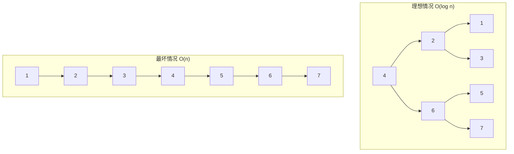
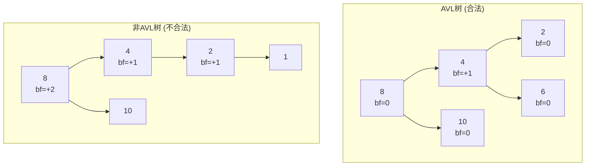
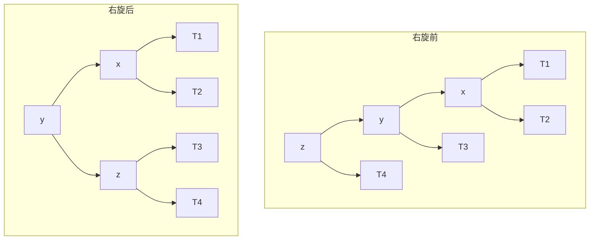
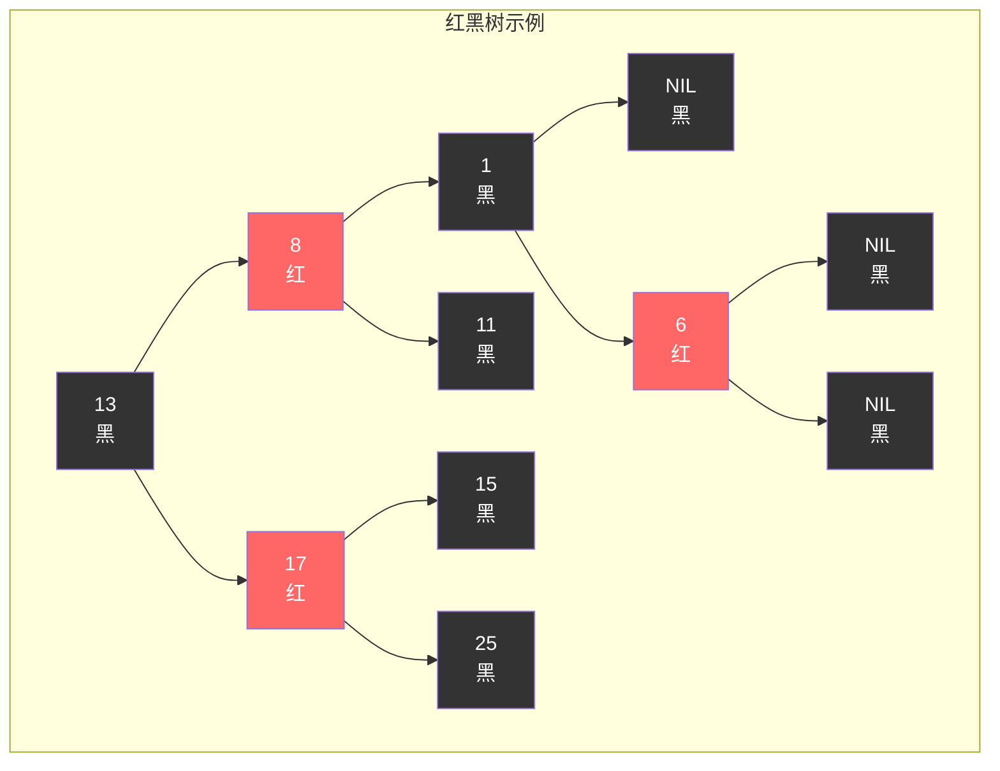
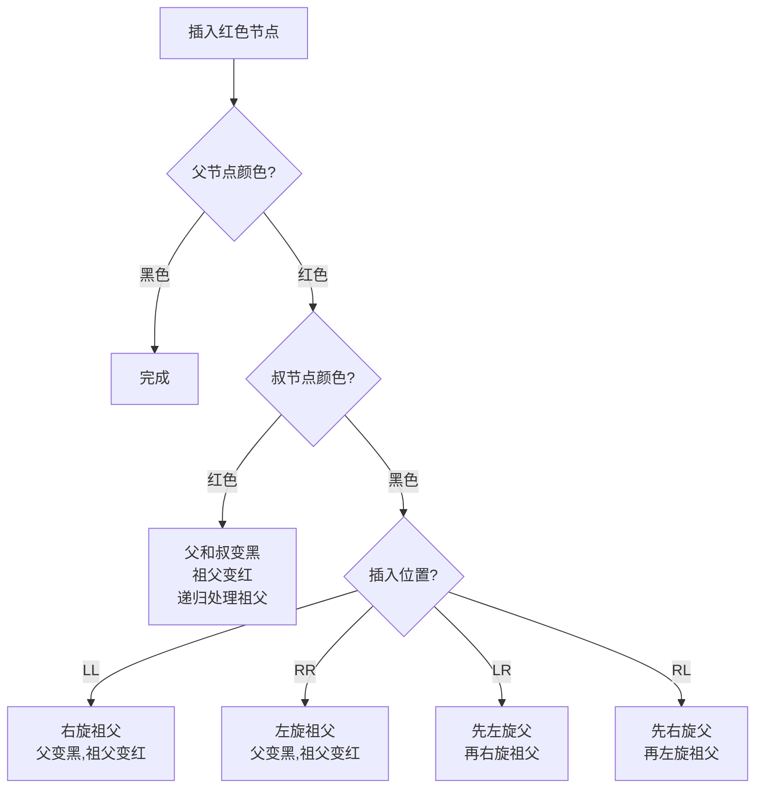
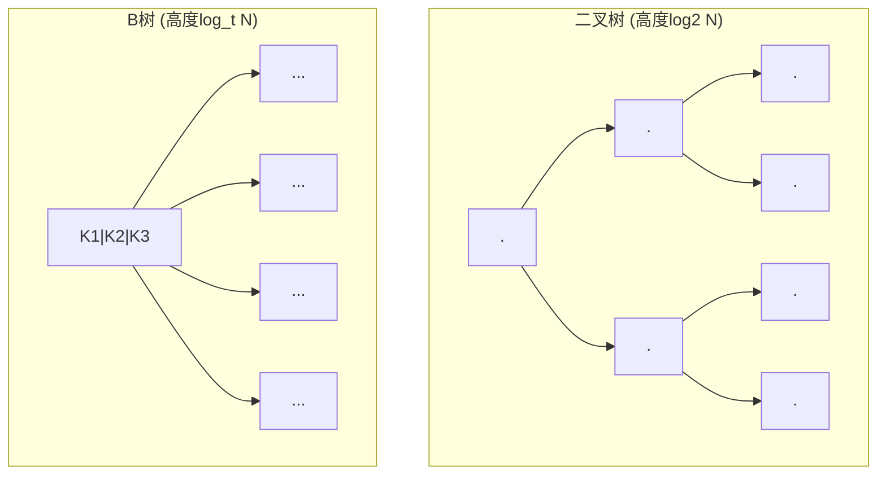
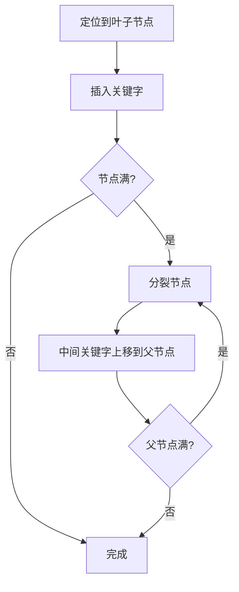
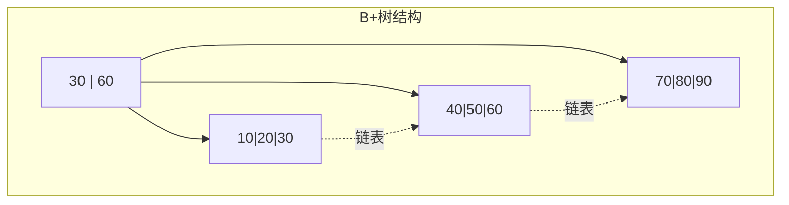
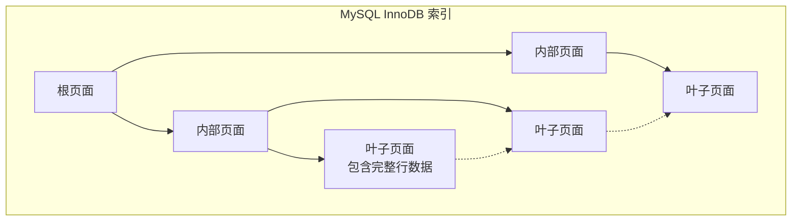
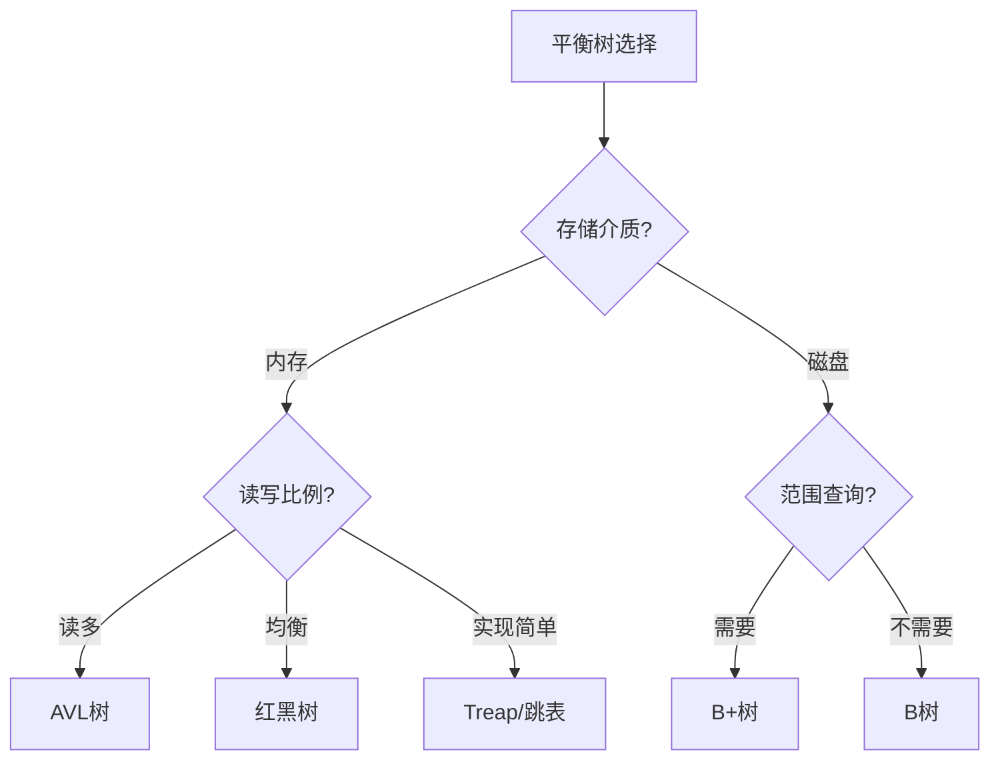

+++
title = "11. 平衡树详解：AVL、红黑树、B树与B+树"
slug = "algo-11-平衡树详解"
description = "深入剖析平衡二叉树的原理、旋转操作、各类平衡树的设计思想与应用场景"
date = 2026-01-31
weight = 11000
draft = false
[taxonomies]
tags = ["数据结构", "平衡树", "AVL", "红黑树", "B树"]
+++

# 平衡树详解：AVL、红黑树、B树与B+树

平衡树是计算机科学中最重要的数据结构之一，广泛应用于数据库索引、操作系统内核、编程语言标准库等领域。本文深入剖析各类平衡树的原理、实现和应用场景。

---

## 一、为什么需要平衡树

### 1.1 二叉搜索树的问题

普通二叉搜索树（BST）在最坏情况下会退化为链表：



| 操作 | 理想 BST | 退化 BST | 平衡树 |
|------|----------|----------|--------|
| 查找 | O(log n) | O(n) | O(log n) |
| 插入 | O(log n) | O(n) | O(log n) |
| 删除 | O(log n) | O(n) | O(log n) |

**平衡树的目标**：通过维护树的"平衡性"，保证最坏情况下的 O(log n) 性能。

### 1.2 平衡的定义

不同的平衡树对"平衡"有不同的定义：

| 类型 | 平衡条件 | 最大高度 |
|------|----------|----------|
| **AVL树** | 任意节点左右子树高度差 ≤ 1 | 1.44 log n |
| **红黑树** | 满足红黑性质 | 2 log n |
| **B树** | 所有叶子同层 | log_t n |
| **Treap** | 概率平衡 | 期望 O(log n) |

---

## 二、AVL 树

### 2.1 定义与性质

AVL 树是最早的自平衡二叉搜索树（1962年），由 Adelson-Velsky 和 Landis 发明。

**平衡条件**：任意节点的左右子树高度差（平衡因子）的绝对值不超过 1。

```
平衡因子 = 左子树高度 - 右子树高度
合法值：-1, 0, +1
```



### 2.2 旋转操作

AVL 树通过旋转来恢复平衡：

#### 右旋（LL 情况）



```
     z                y
    / \             /   \
   y   T4   -->    x     z
  / \             / \   / \
 x   T3          T1 T2 T3 T4
/ \
T1 T2
```

#### 左旋（RR 情况）

```
   z                  y
  / \               /   \
 T1  y     -->     z     x
    / \           / \   / \
   T2  x         T1 T2 T3 T4
      / \
     T3 T4
```

#### 先左后右（LR 情况）

```
     z              z              x
    / \            / \           /   \
   y   T4  -->    x   T4  -->   y     z
  / \            / \           / \   / \
 T1  x          y   T3        T1 T2 T3 T4
    / \        / \
   T2 T3      T1 T2
```

#### 先右后左（RL 情况）

```
   z              z                x
  / \            / \             /   \
 T1  y   -->    T1  x    -->    z     y
    / \            / \         / \   / \
   x  T4          T2  y       T1 T2 T3 T4
  / \                / \
 T2 T3              T3 T4
```

### 2.3 插入算法

```
插入节点后，从插入位置向上回溯：
1. 更新每个祖先节点的高度
2. 计算平衡因子
3. 如果 |bf| > 1：
   - bf = 2 且左子树 bf ≥ 0：右旋
   - bf = 2 且左子树 bf < 0：先左旋后右旋
   - bf = -2 且右子树 bf ≤ 0：左旋
   - bf = -2 且右子树 bf > 0：先右旋后左旋
```

### 2.4 AVL 树特点

| 优点 | 缺点 |
|------|------|
| 严格平衡，查找最快 | 插入/删除可能多次旋转 |
| 实现相对简单 | 每个节点需存储高度/平衡因子 |
| 适合读多写少场景 | 频繁写入时开销较大 |

---

## 三、红黑树

### 3.1 定义与性质

红黑树是一种弱平衡的二叉搜索树，放宽了平衡条件以减少调整次数。

**五条性质**：

1. 每个节点是红色或黑色
2. 根节点是黑色
3. 叶子节点（NIL）是黑色
4. 红色节点的子节点必须是黑色（不能有连续红节点）
5. 从任意节点到其所有叶子的路径包含相同数量的黑色节点



### 3.2 为什么这些性质保证平衡

**黑高度（Black Height）**：从某节点到叶子的黑色节点数量。

**关键推论**：
- 性质 4 + 5 → 最长路径 ≤ 2 × 最短路径
- 最短路径：全黑
- 最长路径：红黑交替
- 因此树高 ≤ 2 log(n+1)

### 3.3 插入操作

插入节点默认为**红色**（避免违反性质5），可能违反性质4（连续红色）。



**Case 1：叔节点是红色**

```
      G(黑)              G(红)
     /    \             /    \
   P(红)  U(红)  -->  P(黑)  U(黑)
   /                  /
  N(红)              N(红)
  
然后将 G 作为新插入节点，继续向上处理
```

**Case 2：叔节点是黑色，LL/RR**

```
LL情况：
        G(黑)              P(黑)
       /    \             /    \
     P(红)  U(黑)  -->  N(红)  G(红)
    /                            \
   N(红)                         U(黑)
```

**Case 3：叔节点是黑色，LR/RL**

```
LR情况：先转换为LL
      G(黑)            G(黑)
     /    \           /    \
   P(红)  U(黑) --> N(红)  U(黑)  -->  同Case2
     \              /
     N(红)        P(红)
```

### 3.4 删除操作

删除比插入更复杂，需要处理"双黑"问题：

1. 如果删除红色节点：直接删除
2. 如果删除黑色节点：需要修复

### 3.5 红黑树 vs AVL 树

| 方面 | AVL 树 | 红黑树 |
|------|--------|--------|
| 平衡程度 | 严格 | 宽松 |
| 最大高度 | 1.44 log n | 2 log n |
| 查找性能 | 稍快 | 稍慢 |
| 插入/删除 | 可能多次旋转 | 最多 3 次旋转 |
| 适用场景 | 读多写少 | 读写均衡 |
| 实际应用 | 数据库 | Linux 内核、STL |

---

## 四、B 树

### 4.1 为什么需要 B 树

**问题**：二叉树每次比较只排除一半数据，对于磁盘存储来说：
- 磁盘 I/O 是性能瓶颈
- 每次 I/O 读取一个磁盘块（通常 4KB）
- 二叉树每层一个节点 → 每层一次 I/O

**解决**：增加每个节点的分支数，降低树高



### 4.2 B 树定义

**M 阶 B 树**满足：

1. 每个节点最多有 M 个子节点
2. 每个非根节点至少有 ⌈M/2⌉ 个子节点
3. 根节点至少有 2 个子节点（如果不是叶子）
4. 有 k 个子节点的节点有 k-1 个关键字
5. 所有叶子节点在同一层

```
              [30 | 60]              <- 根节点，2个关键字
             /    |    \
    [10|20]    [40|50]    [70|80|90]  <- 内部节点
    /  |  \    /  |  \    /  |  |  \
   ...                  ...           <- 叶子节点
```

### 4.3 B 树操作

#### 查找

```
从根节点开始：
1. 在节点内二分查找
2. 如果找到，返回
3. 如果未找到，进入对应子节点
4. 重复直到叶子节点
```

#### 插入



**分裂示例**（5阶B树）：

```
插入 55：
    [30 | 60]                    [30 | 50 | 60]
        |           -->              /    \
  [40|45|50|55]              [40|45]    [55]
  (满了，分裂)
```

#### 删除

删除更复杂，需要处理：
- 直接删除（节点不会太空）
- 借位（从兄弟节点借）
- 合并（与兄弟合并）

### 4.4 B 树性能

对于 M 阶 B 树存储 N 个关键字：

- 树高：O(log_M N)
- 每次 I/O 读取一个节点
- 查找需要 O(log_M N) 次 I/O

**示例**：M=1000，N=10亿
- B树高度：log₁₀₀₀(10⁹) ≈ 3
- 只需 3 次磁盘 I/O！

---

## 五、B+ 树

### 5.1 B+ 树 vs B 树

B+ 树是 B 树的变种，专为数据库和文件系统优化：

| 特性 | B 树 | B+ 树 |
|------|------|-------|
| 数据存储 | 所有节点 | 仅叶子节点 |
| 叶子节点 | 不连接 | 链表连接 |
| 范围查询 | 需要中序遍历 | 直接遍历链表 |
| 空间利用 | 内部节点存数据 | 内部节点仅存索引 |



### 5.2 B+ 树的优势

**1. 更高的扇出**

内部节点不存数据，可以存更多指针：
- B树：1个块存 100 个数据项
- B+树：1个块存 1000 个索引项

**2. 范围查询高效**

```
查找 [30, 70] 之间的所有数据：
B树：中序遍历整棵树
B+树：找到30，沿链表遍历到70
```

**3. 查询性能稳定**

所有查询都要到叶子节点，时间一致

### 5.3 数据库索引

B+ 树是数据库索引的标准实现：



---

## 六、其他平衡树

### 6.1 Treap

Treap = Tree + Heap，通过随机优先级实现概率平衡：

- 每个节点有两个值：key（BST性质）和 priority（堆性质）
- priority 随机生成
- 期望高度 O(log n)

**优点**：实现简单，平均性能好
**缺点**：最坏情况不保证

### 6.2 Splay Tree（伸展树）

每次访问后将节点旋转到根：

- 最近访问的节点在根附近
- 适合访问有局部性的场景
- 均摊 O(log n)

### 6.3 Skip List（跳表）

不是树，但功能类似：

```
Level 3:  1 ─────────────────────────> 9
Level 2:  1 ──────────> 4 ──────────> 9
Level 1:  1 ───> 3 ───> 4 ───> 6 ───> 9
Level 0:  1 > 2 > 3 > 4 > 5 > 6 > 7 > 9
```

- 期望 O(log n) 查找
- 实现简单
- Redis 有序集合使用

---

## 七、实际应用

### 7.1 Linux 内核

| 数据结构 | 应用场景 |
|----------|----------|
| 红黑树 | 进程调度(CFS)、虚拟内存管理(VMA)、epoll |
| B+树 | Btrfs 文件系统 |

### 7.2 数据库

| 数据库 | 索引实现 |
|--------|----------|
| MySQL InnoDB | B+树 |
| PostgreSQL | B+树 |
| MongoDB | B树 |
| SQLite | B树 |

### 7.3 编程语言

| 语言/库 | 实现 |
|---------|------|
| C++ std::map/set | 红黑树 |
| Java TreeMap/TreeSet | 红黑树 |
| Rust BTreeMap/BTreeSet | B树 |

---

## 八、总结对比



| 场景 | 推荐 |
|------|------|
| 内存中的有序集合 | 红黑树 |
| 读密集的索引 | AVL 树 |
| 数据库索引 | B+ 树 |
| 实现简单的场景 | 跳表 |
| 访问有局部性 | Splay 树 |

---

## 九、面试要点

### 9.1 常见问题

**Q: 红黑树为什么比 AVL 树更常用？**

A: 
1. 红黑树插入最多 2 次旋转，删除最多 3 次旋转
2. AVL 树可能需要 O(log n) 次旋转
3. 红黑树更适合频繁插入删除的场景
4. 虽然查找稍慢，但差别很小

**Q: 为什么数据库用 B+ 树而不是 B 树？**

A: 
1. B+ 树内部节点不存数据，扇出更高，树更矮
2. 叶子节点链表连接，范围查询高效
3. 所有查询路径长度相同，性能可预测
4. 更适合磁盘 I/O 特性

**Q: Linux 内核为什么用红黑树管理 VMA？**

A: 
1. VMA 频繁插入删除（mmap/munmap）
2. 红黑树增删效率高
3. 查找效率足够（O(log n)）
4. 实现成熟，久经考验

---

## 相关文章

- [上一篇：在线算法与流式计算](@/articles/algorithm/algo-10-在线算法与流式计算.md)
- [下一篇：暂无](@/articles/algorithm/_index.md)
