+++
title = "02. 自动驾驶工作流程"
date = 2026-01-13
weight = 2000
description = "自动驾驶系统完整工作流程详解：从传感器数据到车辆控制的全链路处理过程"
[taxonomies]
tags = ["autonomous-driving", "workflow", "pipeline", "system"]
+++

# 自动驾驶工作流程

本文详细解析自动驾驶系统从传感器采集到执行控制的完整工作流程，揭示每个环节的处理逻辑。

---

## 一、整体工作流程

### 1.1 主循环

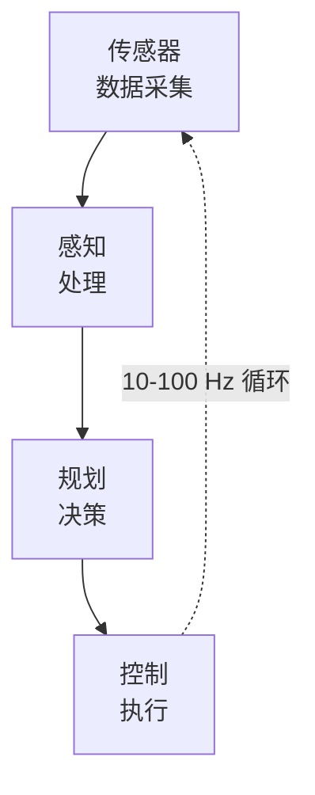

### 1.2 时间约束

| 环节 | 频率 | 延迟预算 | 说明 |
|-----|------|---------|------|
| 传感器采集 | 10-60 Hz | <10ms | 同步采集 |
| 感知处理 | 10-30 Hz | <50ms | 神经网络推理 |
| 规划决策 | 10-20 Hz | <20ms | 轨迹生成 |
| 控制执行 | 50-100 Hz | <10ms | 实时控制 |
| 端到端 | - | <100ms | 从感知到控制 |

### 1.3 数据流

```
原始数据量/秒:
├── 摄像头 (8×1080P×30fps): ~3 GB/s
├── 激光雷达 (128线): ~150 MB/s
├── 毫米波雷达 (5个): ~10 MB/s
└── GPS/IMU: ~1 MB/s
─────────────────────────
总计: ~3.2 GB/s
```

---

## 二、传感器数据采集

### 2.1 同步机制

**时间同步要求**：

| 传感器组合 | 同步精度 |
|-----------|---------|
| 相机-相机 | <1ms |
| 相机-激光雷达 | <5ms |
| 所有传感器 | <10ms |

**同步方法**：

| 方法 | 说明 |
|-----|------|
| 硬件触发 | 主时钟触发各传感器 |
| PTP 时间同步 | IEEE 1588 精确时间 |
| GPS 时间戳 | GPS PPS 信号同步 |
| 软件插值 | 时间戳匹配插值 |

### 2.2 摄像头数据流

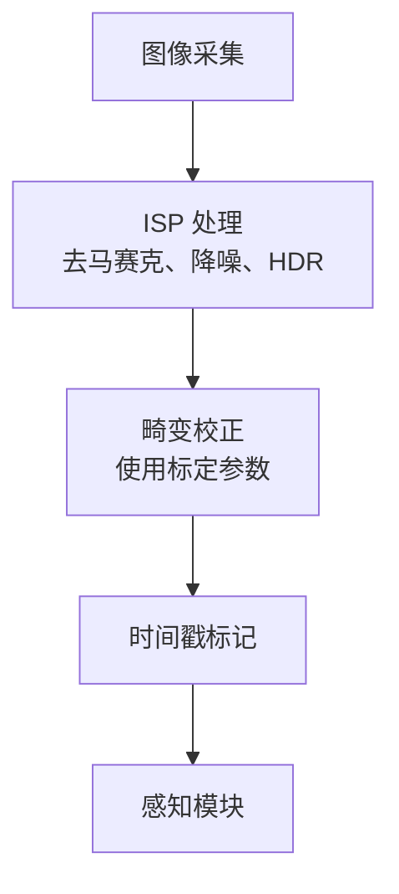

### 2.3 激光雷达数据流

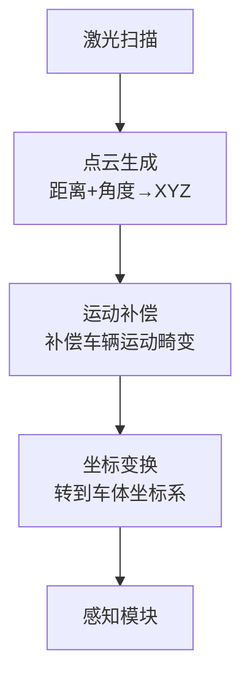

### 2.4 数据预处理

| 传感器 | 预处理内容 |
|-------|-----------|
| 摄像头 | ISP、畸变校正、归一化 |
| 激光雷达 | 运动补偿、滤波、分割地面 |
| 毫米波 | 杂波过滤、聚类 |
| IMU | 零偏补偿、滤波 |

---

## 三、感知处理流程

### 3.1 感知总览

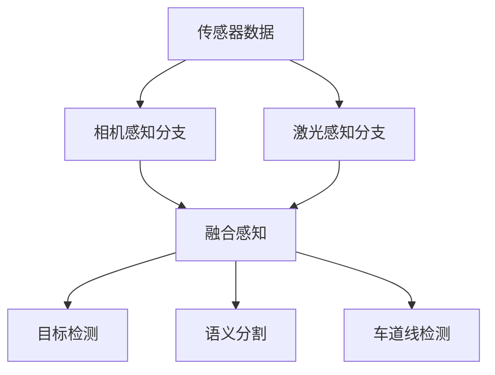

### 3.2 目标检测流程

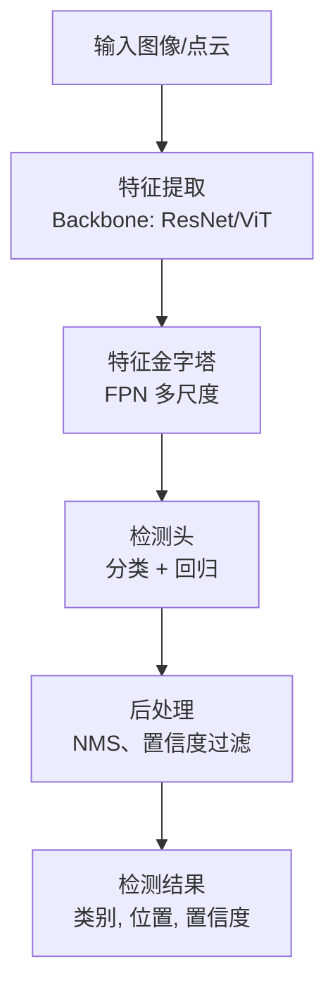

### 3.3 多目标跟踪

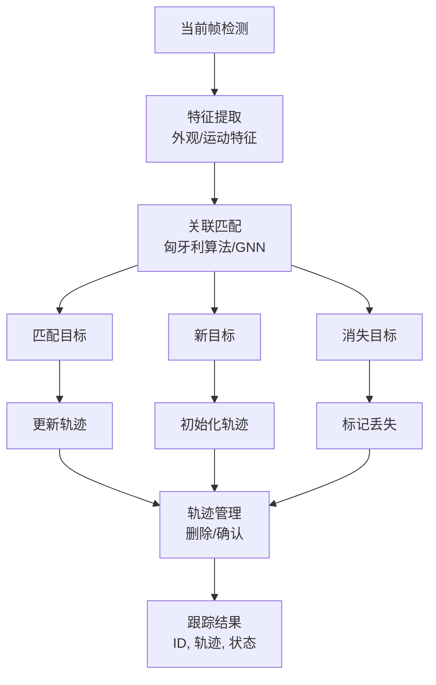

### 3.4 传感器融合

**融合流程**：

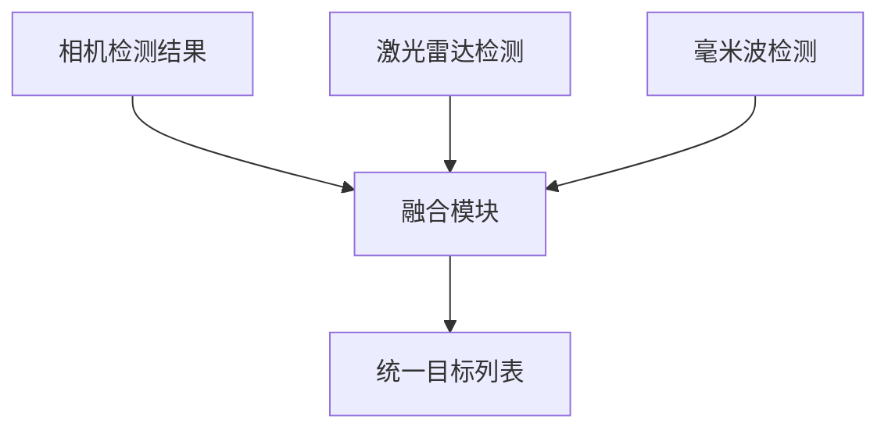

**融合策略**：

| 级别 | 输入 | 方法 |
|-----|------|------|
| 早期融合 | 原始数据 | BEVFusion |
| 中期融合 | 特征 | 特征拼接/注意力 |
| 晚期融合 | 检测结果 | 匹配投票 |

---

## 四、定位流程

### 4.1 定位融合

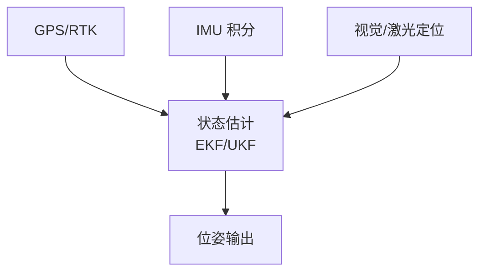

### 4.2 激光定位流程

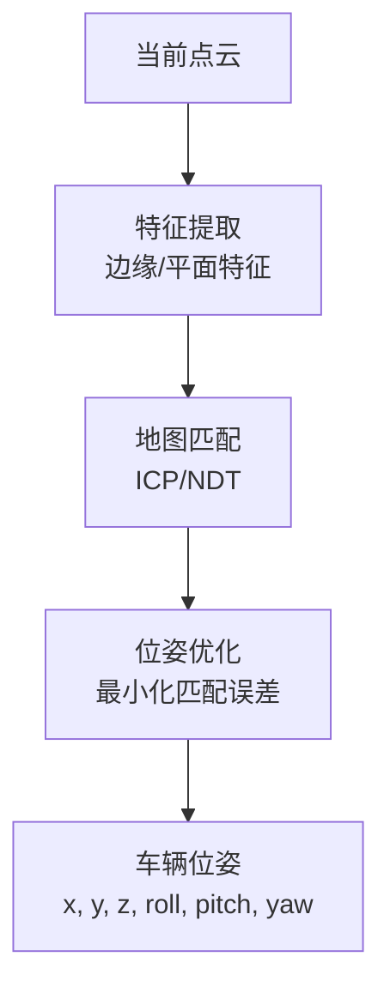

### 4.3 视觉定位流程

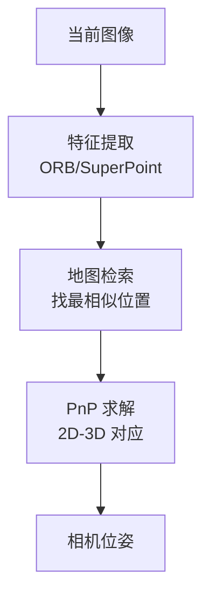

### 4.4 IMU 预积分

| 步骤 | 说明 |
|-----|------|
| 高频积分 | 100-1000Hz 积分加速度/角速度 |
| 预积分因子 | 两关键帧间的相对运动 |
| 因子图优化 | 与其他约束联合优化 |
| 偏置估计 | 在线估计零偏 |

---

## 五、预测流程

### 5.1 预测任务

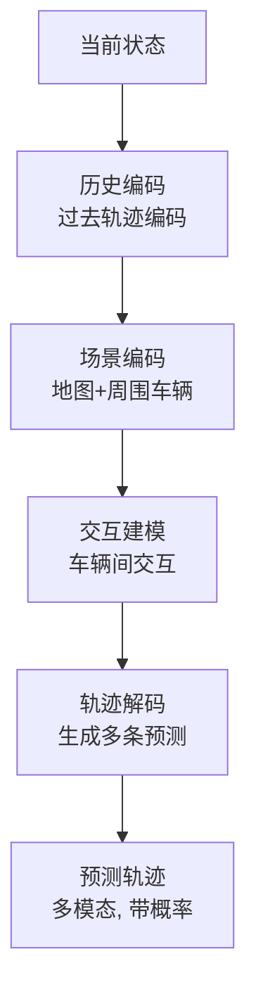

### 5.2 预测输出

| 输出 | 说明 |
|-----|------|
| 多模态轨迹 | 多条可能的未来轨迹 |
| 概率分布 | 每条轨迹的概率 |
| 预测时长 | 通常 3-8 秒 |
| 不确定性 | 预测的置信度 |

### 5.3 行人意图预测

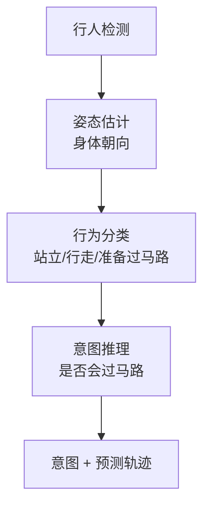

---

## 六、规划决策流程

### 6.1 规划层次

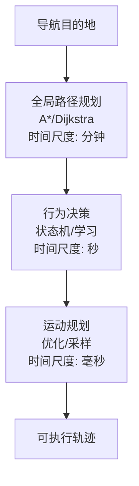

### 6.2 行为决策流程

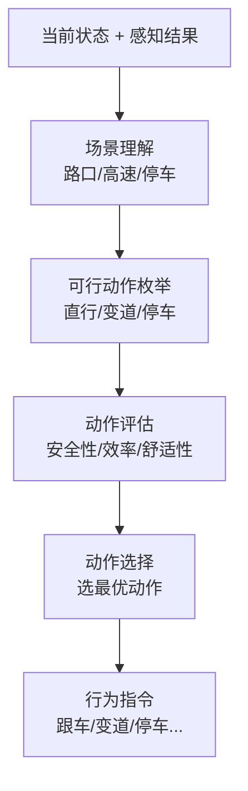

### 6.3 运动规划流程

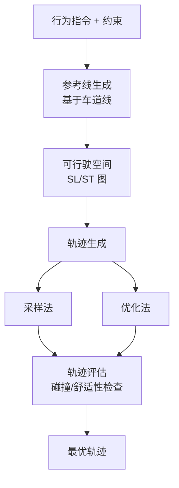

### 6.4 轨迹表示

| 表示方法 | 说明 |
|---------|------|
| 离散点 | (x, y, θ, v, a, κ, t) 序列 |
| 多项式 | 五次多项式拟合 |
| 贝塞尔曲线 | 平滑曲线 |
| Frenet 坐标 | 沿参考线的 s-l 表示 |

---

## 七、控制执行流程

### 7.1 控制总览

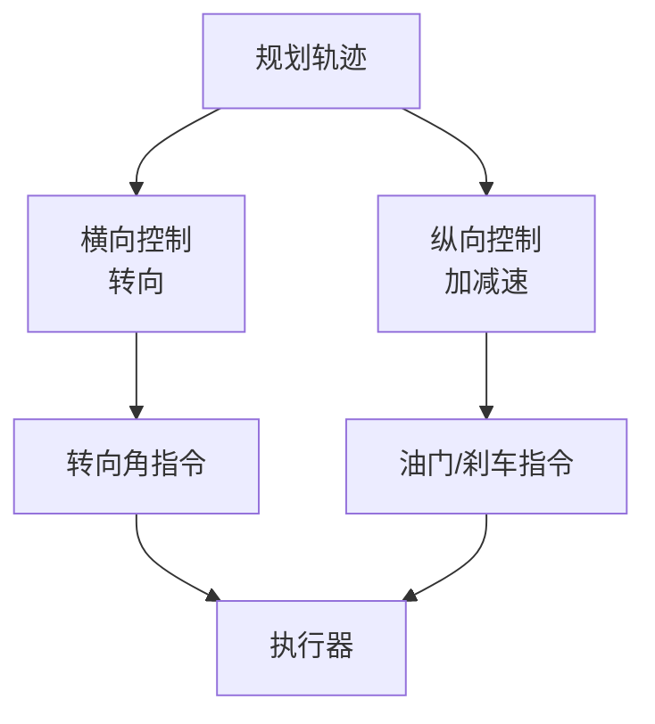

### 7.2 横向控制流程

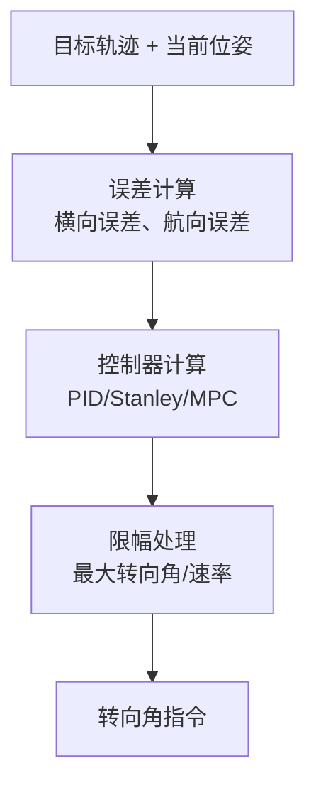

### 7.3 纵向控制流程

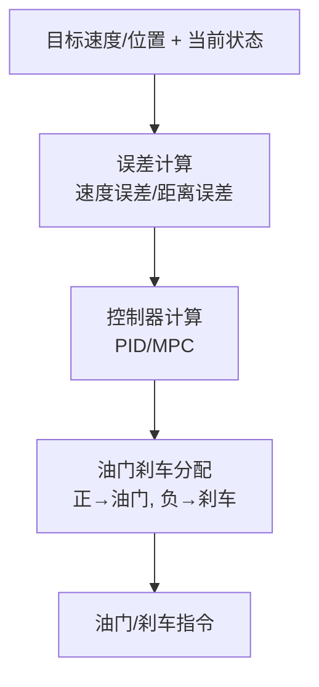

### 7.4 MPC 控制流程

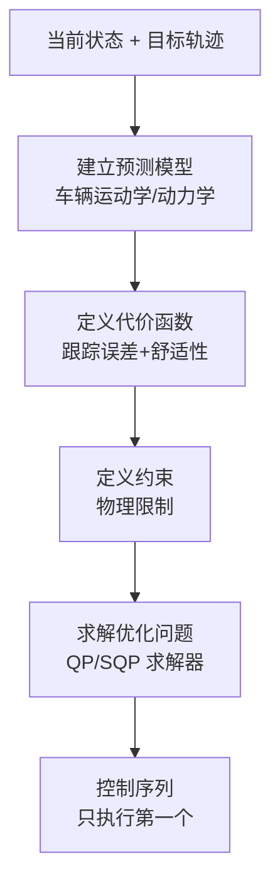

### 7.5 执行器接口

| 接口 | 协议 | 频率 |
|-----|------|------|
| 转向 | CAN | 100Hz |
| 油门 | CAN | 100Hz |
| 刹车 | CAN | 100Hz |
| 档位 | CAN | 10Hz |

---

## 八、安全监控流程

### 8.1 安全架构

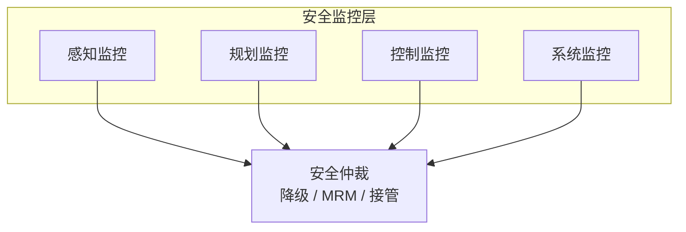

### 8.2 监控内容

| 层面 | 监控内容 |
|-----|---------|
| 感知 | 目标合理性、时间戳 |
| 定位 | 精度、连续性 |
| 规划 | 碰撞检查、可行性 |
| 控制 | 跟踪误差、执行状态 |
| 系统 | CPU/内存/温度 |

### 8.3 MRM 流程

**Minimal Risk Maneuver**：

```mermaid
graph TB
    A[异常检测] --> B[评估严重性]
    B --> C[可恢复]
    B --> D[不可恢复]
    C --> E[降级运行]
    D --> F[触发 MRM]
    F --> G[靠边停车]
    F --> H[原地停车]
```

---

## 九、系统时序

### 9.1 典型时序图

| 阶段 | 时间范围 (ms) | 持续时间 |
|------|---------------|---------|
| 传感器采集 | 0-10 | ~10ms |
| 感知推理 | 10-50 | ~40ms |
| 预测 | 50-60 | ~10ms |
| 规划 | 60-80 | ~20ms |
| 控制 | 80-90 | ~10ms |
| 执行 | 90-100 | ~10ms |
| **端到端延迟** | - | **~80-100ms** |

### 9.2 并行处理

| 时刻 T | 采集 | 感知 | 规划 | 控制 |
|--------|------|------|------|------|
| 数据帧 | [T] | [T-1] | [T-2] | [T-3] |

各模块并行处理不同时刻数据，实现流水线处理。

---

## 十、数据记录与回放

### 10.1 记录内容

| 数据类型 | 用途 |
|---------|------|
| 传感器原始数据 | 离线开发测试 |
| 中间结果 | 问题定位 |
| 决策日志 | 行为分析 |
| 性能指标 | 系统优化 |

### 10.2 回放测试

```mermaid
graph TB
    A[记录数据] --> B[数据回放<br/>模拟传感器输入]
    B --> C[系统处理<br/>正常处理流程]
    C --> D[结果对比<br/>与记录/标注对比]
```

---

## 参考资料

- [Apollo Architecture](https://apollo.auto/docs/apollo_5_0_technical_tutorial.html)
- [Autoware.Auto](https://autowarefoundation.gitlab.io/autoware.auto/AutowareAuto/)
- [ROS 2 Design](https://design.ros2.org/)

---

## 相关文章

- [上一篇：自动驾驶必知必会](@/articles/autonomous-driving/ad-01-自动驾驶必知必会.md)
- [下一篇：感知系统详解](@/articles/autonomous-driving/ad-03-感知系统详解.md)
