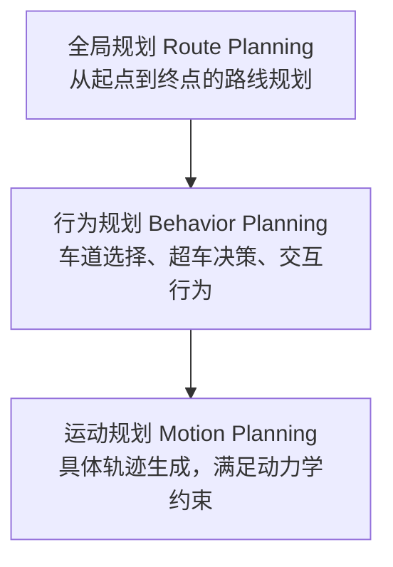

+++
title = "04. 规划与控制系统详解"
description = "规划控制系统：路径规划、轨迹规划、决策系统与车辆控制技术"
date = 2025-01-16
weight = 4000
[taxonomies]
tags = ["autonomous-driving", "planning", "control", "trajectory", "decision-making"]
+++

# 自动驾驶规划与控制系统详解

## 一、规划控制概述

### 1.1 在自动驾驶中的位置

```
感知 → 定位 → 预测 → 规划 → 控制 → 执行
                      ↑        ↑
                   本文重点
```

**规划**：决定车辆应该怎么走（Where to go）

**控制**：实现规划的轨迹（How to go）

### 1.2 核心任务

**规划系统**：
- 行为决策：是超车还是跟车？
- 路径规划：走哪条路线？
- 轨迹规划：具体怎么走（位置+时间）？

**控制系统**：
- 纵向控制：加速、减速
- 横向控制：转向
- 执行跟踪：精确跟踪规划轨迹

---

## 二、规划系统架构

### 2.1 分层架构



### 2.2 全局规划

**任务**：从A点到B点的道路级别路线规划。

**输入**：
- 起点和终点
- 高精地图/导航地图
- 交通状况

**输出**：
- 途经道路序列
- 推荐车道序列

**方法**：
- Dijkstra算法
- A*算法
- 考虑交通拥堵的动态规划

### 2.3 行为规划

**任务**：做出高层级驾驶决策。

**典型决策**：
- 车道保持 vs 变道
- 加速 vs 减速 vs 停车
- 让行 vs 抢行
- 超车决策

**实现方式**：

**有限状态机（FSM）**：
- 定义状态：巡航、跟车、超车、停车等
- 定义转换条件
- 简单直观，但扩展性差

**行为树（Behavior Tree）**：
- 模块化设计
- 易于扩展和调试
- 工业界广泛使用

**基于学习的方法**：
- 强化学习
- 模仿学习
- 端到端决策

### 2.4 运动规划

**任务**：生成具体可执行的轨迹。

**轨迹要求**：
- 安全：不与障碍物碰撞
- 舒适：曲率、加速度平滑
- 可行：满足车辆动力学约束
- 高效：尽快到达目标

---

## 三、路径规划方法

### 3.1 基于搜索的方法

**A*算法**：
- 栅格化环境
- 启发式搜索最优路径
- 简单有效，但分辨率受限

**Hybrid A***：
- 结合A*和车辆运动学
- 考虑车辆转向半径
- 常用于泊车场景

### 3.2 基于采样的方法

**RRT（快速随机树）**：
- 随机采样扩展树
- 可处理高维空间
- 路径不够平滑

**RRT***：
- RRT的优化版本
- 渐近最优
- 计算量较大

### 3.3 基于优化的方法

**原理**：将轨迹规划建模为优化问题。

**目标函数**：
- 轨迹长度最短
- 曲率变化最小
- 与障碍物距离最大
- 时间最短

**约束条件**：
- 起点终点约束
- 障碍物约束
- 动力学约束
- 舒适度约束

**方法**：
- 二次规划（QP）
- 非线性规划（NLP）
- 凸优化

### 3.4 曲线表示

**贝塞尔曲线**：
- 控制点定义曲线形状
- 平滑自然
- 计算简单

**样条曲线（Spline）**：
- 分段多项式
- 连续性可控
- 常用于轨迹平滑

**多项式曲线**：
- 如五次多项式
- 可约束位置、速度、加速度
- Apollo等系统使用

---

## 四、轨迹规划

### 4.1 时空分离

**Frenet坐标系**：
- 沿参考线的纵向坐标（s）
- 垂直参考线的横向坐标（d）
- 将问题分解为纵向和横向

**优势**：
- 简化规划问题
- 便于约束表达
- 业界广泛采用

### 4.2 纵向规划

**任务**：确定沿道路方向的运动（s-t曲线）。

**考虑因素**：
- 目标速度
- 前车跟随
- 交通灯/停止线
- 速度限制

**方法**：
- 状态格搜索
- 速度规划优化
- IDM跟车模型

### 4.3 横向规划

**任务**：确定车道内位置（d-s曲线）。

**考虑因素**：
- 车道中心保持
- 避障
- 变道
- 曲率约束

**方法**：
- 采样+评估
- 优化方法
- 多项式拟合

### 4.4 轨迹评估

**评估维度**：
- 安全性：与障碍物距离
- 舒适性：加速度、jerk
- 效率：完成时间
- 可行性：是否满足约束

**评估方式**：
- 加权求和
- 多目标优化
- 基于规则的筛选

---

## 五、决策系统

### 5.1 交互场景

**典型场景**：
- 无保护左转
- 路口交汇
- 行人礼让
- 紧急车辆避让

**难点**：
- 多智能体博弈
- 意图不确定
- 安全与效率平衡

### 5.2 预测与规划结合

**传统方法**：先预测他车轨迹，再规划自车轨迹。

**问题**：未考虑交互影响。

**交互式规划**：
- 考虑自车行为对他车的影响
- 博弈论方法
- 联合预测和规划

### 5.3 不确定性处理

**感知不确定性**：
- 检测结果有误差
- 使用概率表示

**预测不确定性**：
- 他车未来行为不确定
- 多假设规划

**鲁棒规划**：
- 考虑最坏情况
- 预留安全裕度

---

## 六、车辆控制

### 6.1 控制目标

**纵向控制**：
- 控制车速
- 跟踪期望速度曲线
- 执行器：油门/刹车

**横向控制**：
- 控制转向
- 跟踪期望路径
- 执行器：方向盘

### 6.2 常用控制算法

**PID控制**：
- 比例-积分-微分
- 简单可靠
- 需要调参，适应性有限

**MPC（模型预测控制）**：
- 基于车辆模型预测未来状态
- 在预测范围内优化控制序列
- 可处理约束
- 业界主流方案

**LQR（线性二次调节器）**：
- 基于状态反馈
- 最优控制理论
- 适用于线性系统

### 6.3 车辆模型

**运动学模型**：
- 描述位置、速度、航向关系
- 不考虑力和惯性
- 适用于低速场景

**动力学模型**：
- 考虑轮胎力、车辆惯性
- 更精确但更复杂
- 适用于高速、极限场景

**自行车模型**：
- 简化的车辆模型
- 前后轮各一个
- 常用于规划和控制

### 6.4 控制挑战

**执行延迟**：
- 从决策到执行有延迟
- 需要补偿

**模型不确定性**：
- 实际车辆与模型有偏差
- 鲁棒控制

**极限工况**：
- 湿滑路面
- 紧急制动
- 需要考虑轮胎附着极限

---

## 七、端到端方法

### 7.1 传统方法 vs 端到端

**传统方法**：感知 → 预测 → 规划 → 控制，分模块开发。

**端到端方法**：从传感器输入直接到控制输出。

### 7.2 端到端优势

- 减少人工设计
- 联合优化
- 可能发现更优策略

### 7.3 端到端挑战

- 可解释性差
- 安全保障困难
- 需要大量数据

### 7.4 发展趋势

- 模块化与端到端结合
- 如规划层使用学习方法
- 保留可解释性的同时提升性能

---

## 八、工程实践

### 8.1 仿真测试

**作用**：
- 降低测试成本
- 覆盖危险场景
- 加速开发迭代

**仿真内容**：
- 交通场景仿真
- 传感器仿真
- 车辆动力学仿真

**典型工具**：CARLA、LGSVL、内部仿真器

### 8.2 安全设计

**功能安全**：
- 故障检测
- 安全降级
- 紧急停车

**冗余设计**：
- 多套规划系统
- 多种控制器
- 独立安全监控

### 8.3 系统集成

**实时性**：
- 规划控制需要毫秒级响应
- 硬实时系统

**接口设计**：
- 与感知、定位的接口
- 与底盘控制的接口
- 标准化通信

---

## 九、总结

### 9.1 核心要点

1. **分层架构**：全局规划 → 行为规划 → 运动规划 → 控制
2. **轨迹要求**：安全、舒适、可行、高效
3. **控制核心**：MPC是主流方案
4. **交互决策**：考虑与其他交通参与者的博弈

### 9.2 技术趋势

- 学习与规划结合
- 端到端规划控制
- 更强的交互能力
- 更高的安全保障

---

## 相关文章

- [上一篇：感知系统详解](@/articles/autonomous-driving/ad-03-感知系统详解.md)
- [下一篇：常用算法详解](@/articles/autonomous-driving/ad-05-常用算法详解.md)
